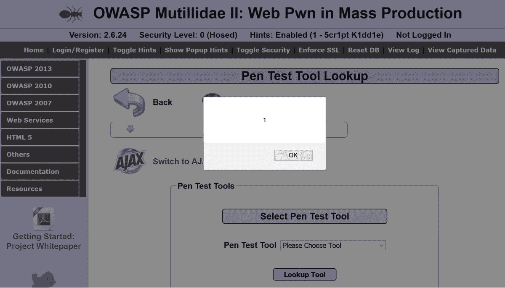
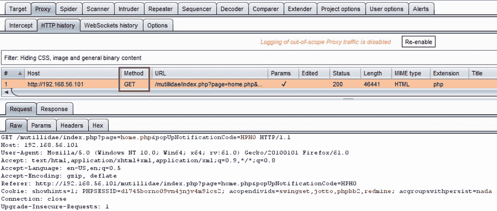
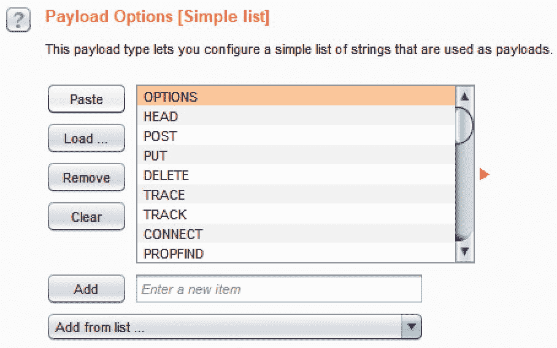
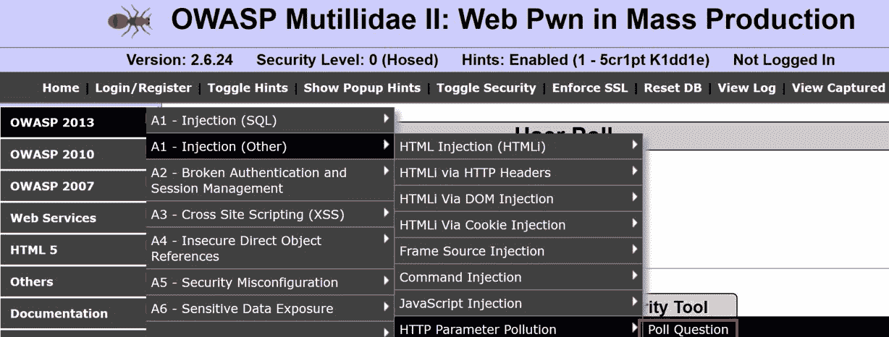
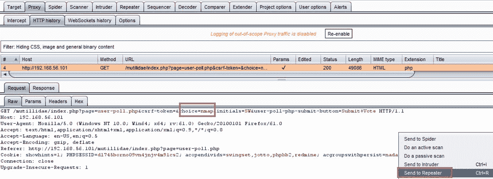
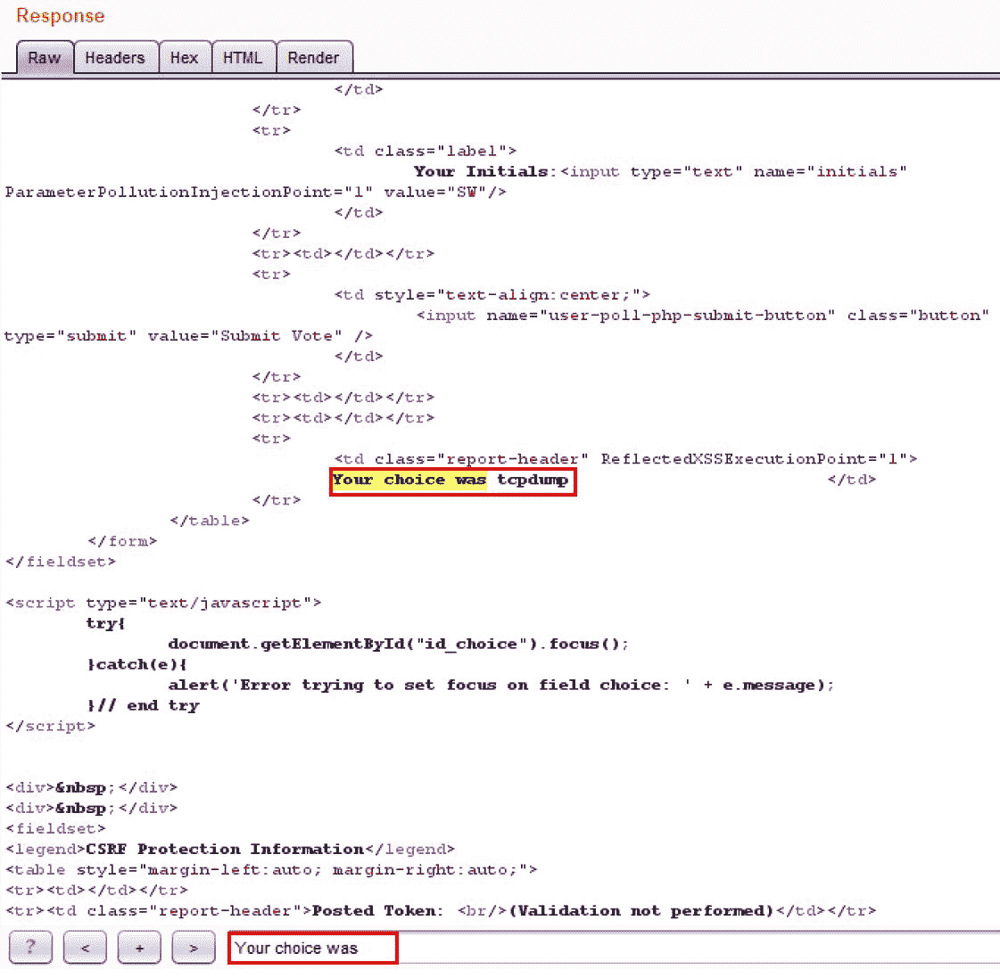
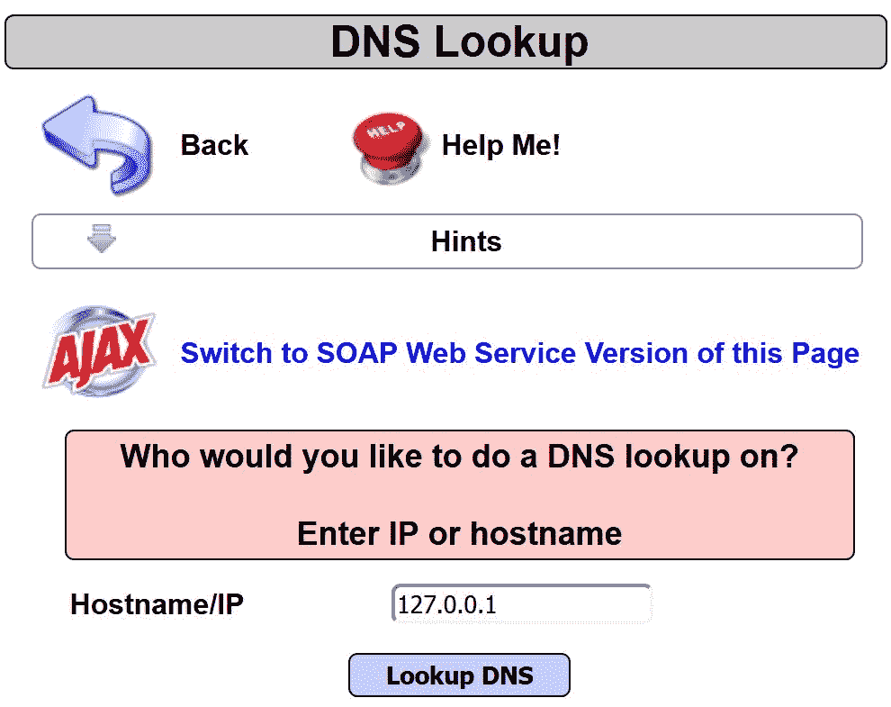

# 第八章：评估输入验证检查

在本章中，我们将涵盖以下操作步骤：

+   测试反射型跨站脚本

+   测试存储型跨站脚本

+   测试 HTTP 动词篡改

+   测试 HTTP 参数污染

+   测试 SQL 注入

+   测试命令注入

# 介绍

在使用应用程序代码之前未验证从客户端接收的任何输入，是在 Web 应用程序中发现的最常见的安全漏洞之一。这个缺陷是导致主要安全问题的根源，比如 SQL 注入和跨站脚本（XSS）。Web 渗透测试人员必须评估并确定应用程序是否反射回任何输入或执行。我们将学习如何使用 Burp 来执行这样的测试。

# 软件工具要求

为了完成本章的操作步骤，您需要以下内容：

+   OWASP Broken Web Applications（VM）

+   OWASP Mutillidae 链接

+   Burp Proxy Community 或 Professional ([`portswigger.net/burp/`](https://portswigger.net/burp/))

# 测试反射型跨站脚本

当恶意 JavaScript 被注入到输入字段、参数或标头中，并在从 Web 服务器返回后在浏览器中执行时，就会发生反射型跨站脚本。反射型 XSS 发生在 JavaScript 的执行仅在浏览器中反映，而不是网页的永久部分。渗透测试人员需要测试发送到 Web 服务器的所有客户端值，以确定是否可能发生 XSS。

# 准备工作

使用 OWASP Mutillidae II，让我们确定应用程序是否防范了反射型跨站脚本（XSS）。

# 操作步骤...

1.  从 OWASP Mutilliae II 菜单中，通过导航到 OWASP 2013 | A3 - 跨站脚本（XSS）| 反射（一级）| 渗透测试工具查找，选择登录：

1.  从下拉列表中选择一个工具，然后点击查找工具按钮。下拉列表中的任何值都适用于此操作：

1.  切换到 Burp Proxy | HTTP 历史记录，并通过选择查找工具来找到您刚刚创建的 HTTP 消息。请注意，在请求中有一个名为`ToolID`的参数。在下面的示例中，值为`16`：

1.  切换到响应选项卡，并注意从请求返回的 JSON。您可以通过在底部的搜索框中输入`PenTest`来更容易地找到响应中的 JavaScript 函数。请注意，`tool_id`在名为`toolIDRequested`的响应参数中反射。这可能是 XSS 的攻击向量：

1.  将请求发送到 Repeater。在数字后面的`ToolID`参数中添加一个 XSS 有效负载。使用一个简单的有效负载，比如``：

1.  点击“Go”并检查返回的 JSON 响应，搜索`PenTest`。注意我们的有效负载正好如输入的那样返回。看起来开发人员在使用之前没有对任何输入数据进行消毒。让我们利用这个缺陷：

1.  由于我们使用的是 JSON 而不是 HTML，我们需要调整有效负载以匹配返回的 JSON 的结构。我们将欺骗 JSON，使其认为有效负载是合法的。我们将原始的``有效负载修改为`"}} )%3balert(1)%3b//`。

1.  切换到 Burp Proxy | 拦截选项卡。通过打开“拦截器打开”按钮打开拦截器。

1.  返回到 Firefox，从下拉列表中选择另一个工具，然后点击查找工具按钮。

1.  在代理|拦截器暂停请求时，在“工具 ID”号之后立即插入新的有效负载`"}} )%3balert(1)%3b//`：

1.  点击前进按钮。通过切换到拦截器关闭拦截器。

1.  返回到 Firefox 浏览器，查看弹出的警报框。您已成功展示了反射型 XSS 漏洞的概念证明（PoC）：

# 工作原理...

由于在使用来自客户端接收的数据之前未进行充分的输入清理。在这种情况下，渗透测试工具标识符会在从客户端接收到的响应中反射，为 XSS 攻击提供了攻击向量。

# 测试存储的跨站脚本

存储的跨站脚本发生在恶意 JavaScript 被注入输入字段、参数或标头后，从 Web 服务器返回后在浏览器中执行并成为页面的永久部分。当恶意 JavaScript 存储在数据库中并稍后用于填充网页的显示时，就会发生存储的 XSS。渗透测试人员需要测试发送到 Web 服务器的所有客户端值，以确定是否可能发生 XSS。

# 准备工作

使用 OWASP Mutillidae II，让我们确定应用程序是否防范存储的跨站脚本。

# 如何做...

1.  从 OWASP Mutilliae II 菜单中，通过导航到 OWASP 2013 | A3 - 跨站脚本（XSS）| 持久（一级）| 添加到您的博客，选择登录：

1.  在文本区域中放入一些文字。在点击保存博客条目按钮之前，让我们尝试一个带有该条目的有效负载：

1.  切换到 Burp 代理|拦截选项卡。使用拦截器按钮打开拦截器。

1.  在代理|拦截器暂停请求时，立即插入新的有效负载``，并将其放在您添加到博客的文字后面：

1.  单击转发按钮。通过切换到拦截器关闭拦截器。

1.  返回到 Firefox 浏览器，查看显示的弹出警报框：

1.  单击“确定”按钮关闭弹出窗口。重新加载页面，您将再次看到警报弹出窗口。这是因为您的恶意脚本已成为页面的永久部分。您已成功展示了存储 XSS 漏洞的概念证明（PoC）！

# 它是如何工作的...

存储型或持久型 XSS 之所以会发生，是因为应用程序不仅忽略对输入的消毒，而且还将输入存储在数据库中。因此，当重新加载页面并用数据库数据填充页面时，恶意脚本将与数据一起执行。

# 测试 HTTP 动词篡改

HTTP 请求可以包括除 GET 和 POST 之外的方法。作为渗透测试人员，确定 Web 服务器允许哪些其他 HTTP 动词（即方法）是很重要的。对其他动词的支持可能会泄露敏感信息（例如 TRACE）或允许危险地调用应用程序代码（例如 DELETE）。让我们看看 Burp 如何帮助测试 HTTP 动词篡改。

# 准备工作

使用 OWASP Mutillidae II，让我们确定应用程序是否允许除 GET 和 POST 之外的 HTTP 动词。

# 如何做...

1.  导航到 OWASP Mutillidae II 的主页。

1.  切换到 Burp 代理|HTTP 历史记录，并查找您在浏览 Mutillidae 主页时创建的 HTTP 请求。注意使用的方法是 GET。右键单击并将请求发送到入侵者：

1.  在入侵者|位置选项卡中，清除所有建议的有效负载标记。突出显示`GET`动词，并单击添加$按钮将有效负载标记放在动词周围：

1.  在入侵者|有效负载选项卡中，将以下值添加到有效负载选项[简单列表]文本框中：

+   选项

+   头

+   发布

+   放置

+   删除

+   跟踪

+   跟踪

+   连接

+   PROPFIND

+   PROPPATCH

+   MKCOL

+   复制

1.  取消 Payloads 页面底部的 Payload Encoding 复选框，然后单击开始攻击按钮。

1.  当攻击结果表出现并攻击完成时，请注意所有返回状态码为 200 的动词。这是令人担忧的，因为大多数 Web 服务器不应该支持这么多动词。特别是对 TRACE 和 TRACK 的支持将包括在调查结果和最终报告中作为漏洞：

# 它是如何工作...

测试 HTTP 动词篡改包括使用不同的 HTTP 方法发送请求并分析接收到的响应。测试人员需要确定是否对任何测试的动词返回了状态码 200，这表明 Web 服务器允许此动词类型的请求。

# 测试 HTTP 参数污染

**HTTP 参数污染**（**HPP**）是一种攻击，其中多个 HTTP 参数以相同的名称发送到 Web 服务器。其目的是确定应用程序是否以意想不到的方式响应，从而进行利用。例如，在 GET 请求中，可以向查询字符串添加额外的参数，如此：`“&name=value”`，其中 name 是应用程序代码已知的重复参数名称。同样，HPP 攻击也可以在 POST 请求中执行，方法是在 POST 主体数据中重复参数名称。

# 准备工作

使用 OWASP Mutillidae II，让我们确定应用程序是否容易受到 HPP 攻击。

# 如何做...

1.  从 OWASP Mutilliae II 菜单中，通过导航到 OWASP 2013 | A1 - Injection (Other) | HTTP Parameter Pollution | Poll Question 选择登录：

1.  从单选按钮中选择一个工具，添加你的缩写，然后点击提交投票按钮：

1.  切换到 Burp 代理|HTTP 历史选项卡，并找到刚刚从用户投票页面执行的请求。注意名为`choice`的参数。该参数的值是 Nmap。右键单击并将此请求发送到 Repeater：

1.  切换到 Burp Repeater 并在查询字符串中添加另一个具有相同名称的参数。让我们从用户投票列表中选择另一个工具，并将其附加到查询字符串，例如`“&choice=tcpdump”`。单击 Go 发送请求：

1.  检查响应。应用程序代码接受了哪个选择？通过搜索`Your choice was`字符串很容易找到。显然，应用程序代码接受了重复的选择参数值来计入用户投票：

# 它是如何工作的...

应用程序代码未能检查传递给函数的具有相同名称的多个参数。结果是应用程序通常对最后一个参数匹配进行操作。这可能导致奇怪的行为和意外的结果。

# 测试 SQL 注入

SQL 注入攻击涉及攻击者向数据库提供输入，而数据库在没有任何验证或净化的情况下接收和使用该输入。结果是泄露敏感数据，修改数据，甚至绕过身份验证机制。

# 准备工作

使用 OWASP Mutillidae II 登录页面，让我们确定应用程序是否容易受到**SQL 注入**（**SQLi**）攻击。

# 如何做...

1.  从 OWASP Mutilliae II 菜单中，通过导航到 OWASP 2013 | A1-Injection (SQL) | SQLi – Bypass Authentication | Login 选择登录：

1.  在登录屏幕上，将无效的凭据放入`username`和`password`文本框中。例如，`username`是`tester`，`password`是`tester`。在点击登录按钮之前，让我们打开代理|拦截器。

1.  切换到 Burp 代理|拦截器选项卡。通过切换到拦截器打开拦截器。

1.  在代理|拦截器暂停请求时，在用户名参数中插入新的有效负载`' or 1=1--<space>`，然后点击登录按钮：

1.  点击前进按钮。通过切换到拦截器关闭拦截器。

1.  返回到 Firefox 浏览器，注意你现在已经以管理员身份登录！

# 它是如何工作的...

测试账户在数据库中不存在；然而，`' or 1=1--<space>`有效负载导致绕过身份验证机制，因为 SQL 代码基于未经净化的用户输入构造了查询。管理员账户是数据库中创建的第一个账户，因此数据库默认使用该账户。

# 还有更多...

我们在 Burp Intruder 中使用了 wfuzz 的 SQLi wordlist 来测试同一用户名字段中的许多不同 payloads。检查结果表中每次攻击的响应，以确定 payload 是否成功执行了 SQL 注入。

构建 SQL 注入 payload 需要一些对后端数据库和特定语法的了解。

# 测试命令注入

命令注入涉及攻击者尝试在 HTTP 请求中调用系统命令，通常在终端会话中执行。许多 Web 应用程序允许通过 UI 进行系统命令以进行故障排除。Web 渗透测试人员必须测试网页是否允许在通常应受限制的系统上执行进一步的命令。

# 准备工作

对于这个示例，您将需要 Unix 命令的 SecLists Payload：

+   SecLists-master | Fuzzing | `FUZZDB_UnixAttacks.txt`

+   从 GitHub 下载：[`github.com/danielmiessler/SecLists`](https://github.com/danielmiessler/SecLists)

使用 OWASP Mutillidae II DNS Lookup 页面，让我们确定应用程序是否容易受到命令注入攻击。

# 如何操作...

1.  从 OWASP Mutilliae II 菜单中，通过导航到 OWASP 2013 | A1-Injection (Other) | Command Injection | DNS Lookup 来选择 DNS Lookup：

1.  在 DNS Lookup 页面，将 IP 地址`127.0.0.1`输入到文本框中，然后点击 Lookup DNS 按钮：

1.  切换到 Burp Proxy | HTTP history 标签，并查找您刚刚执行的请求。右键单击 Send to Intruder：

1.  在 Intruder | Positions 标签中，使用 Clear $按钮清除所有建议的 payload 标记。在`target_host`参数中，在`127.0.0.1` IP 地址后面放置一个管道符号(`|`)。在管道符号后面放置一个`X`。突出显示`X`，然后点击 Add $按钮将`X`用 payload 标记包装起来：

1.  在 Intruder | Payloads 标签中，点击 Load 按钮。浏览到您从 GitHub 下载 SecLists-master wordlists 的位置。导航到`FUZZDB_UnixAttacks.txt` wordlist 的位置，并使用以下内容填充 Payload Options [Simple list]框：SecLists-master | Fuzzing | `FUZZDB_UnixAttacks.txt`

1.  在 Payloads 标签页的底部取消选中 Payload Encoding 框，然后点击 Start Attack 按钮。

1.  允许攻击继续，直到达到 payload `50`。注意在 payload `45`左右的 Render 标签周围的响应。我们能够在操作系统上执行命令，比如`id`，它会在网页上显示命令的结果：

# 工作原理...

未能定义和验证用户输入是否符合可接受的系统命令列表可能导致命令注入漏洞。在这种情况下，应用程序代码未限制通过 UI 可用的系统命令，允许在操作系统上查看和执行应该受限制的命令。
