# 第九章：攻击客户端

在本章中，我们将涵盖以下示例：

+   测试点击劫持

+   测试基于 DOM 的跨站脚本

+   测试 JavaScript 执行

+   测试 HTML 注入

+   测试客户端资源操纵

# 介绍

在浏览器中执行的客户端可用代码需要测试以确定是否存在敏感信息或允许用户输入而没有经过服务器端验证。学习如何使用 Burp 执行这些测试。

# 软件工具要求

要完成本章的示例，您需要以下内容：

+   OWASP 破损 Web 应用（VM）

+   OWASP Mutillidae 链接

+   Burp 代理社区或专业版（[`portswigger.net/burp/`](https://portswigger.net/burp/)）

# 测试点击劫持

**点击劫持**也被称为**UI 重定向攻击**。这种攻击是一种欺骗性技术，可以诱使用户与透明 iframe 进行交互，并可能向受攻击者控制的网站发送未经授权的命令或敏感信息。让我们看看如何使用 Burp Clickbandit 来测试网站是否容易受到点击劫持攻击。

# 做好准备

使用 OWASP Mutillidae II 应用程序和 Burp Clickbandit，让我们确定该应用程序是否能够防御点击劫持攻击。

# 如何做...

1.  导航到 OWASP Mutillidae II 的主页。

1.  切换到 Burp，并从顶级菜单中选择 Burp Clickbandit：

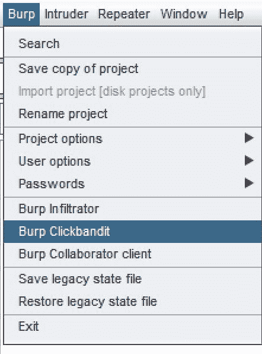

1.  一个弹出框解释了该工具。单击名为复制 Clickbandit 到剪贴板的按钮：

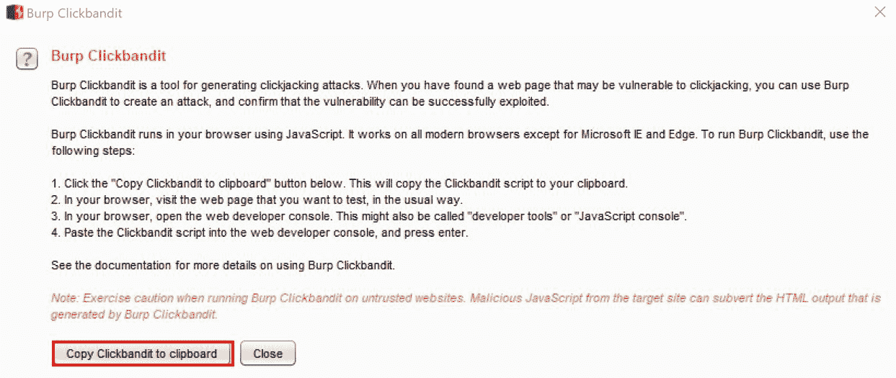

1.  返回到 Firefox 浏览器，按下*F12*以打开开发者工具。从开发者工具菜单中，选择控制台，并查找底部的提示：


1.  在控制台提示（例如，`>>`），粘贴到提示中您复制到剪贴板的 Clickbandit 脚本：

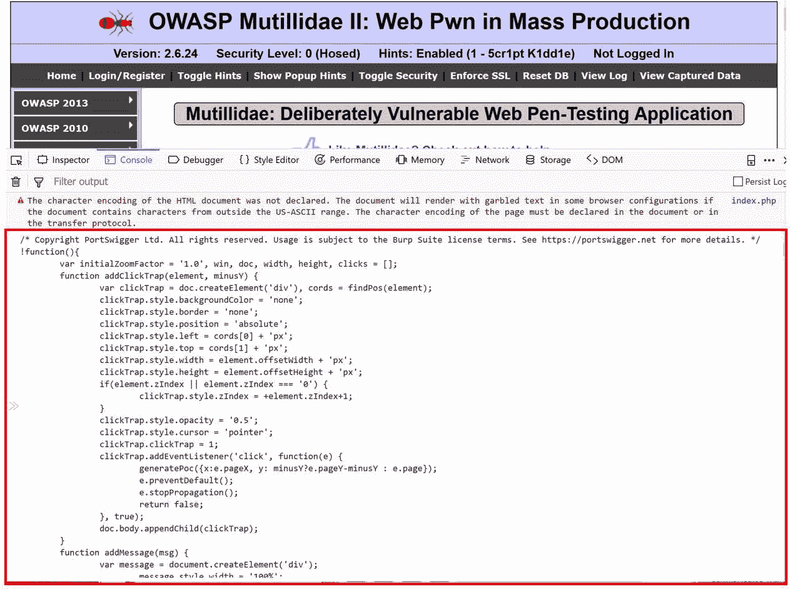

1.  在提示中粘贴脚本后，按*Enter*键。您应该看到 Burp Clickbandit 记录模式。单击开始按钮开始：


1.  出现后，开始在应用程序上四处点击。单击 Mutillidae 菜单顶部的可用链接，单击侧边菜单上的可用链接，或浏览 Mutillidae 内的页面。点击了一圈后，在 Burp Clickbandit 菜单上按完成按钮。

1.  您应该注意到大红色块透明地出现在 Mutillidae 网页的顶部。每个红色块表示恶意 iframe 可能出现的位置。随意单击每个红色块，以查看下一个红色块出现，依此类推：

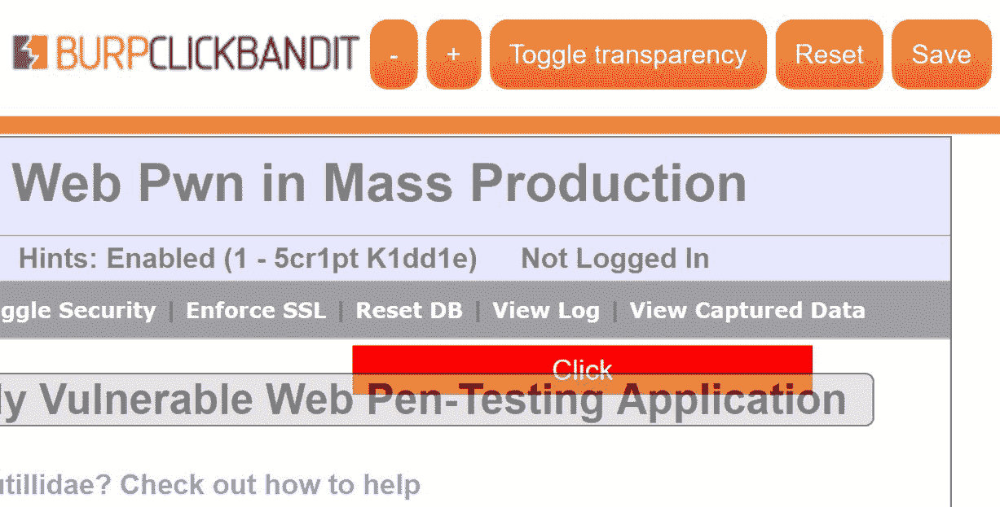

1.  一旦您希望停止并保存您的结果，请单击保存按钮。这将保存 Clickjacking PoC 在一个 HTML 文件中，供您放在您的渗透测试报告中。

# 它是如何工作的...

由于 Mutillidae 应用程序没有使用设置为`DENY`的 X-FRAME-OPTIONS 标头，因此可以将恶意 iframe 注入到 Mutillidae 网页中。Clickbandit 增加了 iframe 的不透明度，以便查看，并创建了一个**概念验证**（**PoC**）来说明漏洞如何被利用。

# 测试基于 DOM 的跨站脚本

**文档对象模型**（**DOM**）是浏览器中捕获的所有 HTML 网页的树状结构表示。开发人员使用 DOM 在浏览器中存储信息以方便使用。作为 Web 渗透测试人员，确定是否存在基于 DOM 的**跨站脚本**（**XSS**）漏洞非常重要。

# 做好准备

使用 OWASP Mutillidae II HTML5 Web 存储练习，让我们确定该应用程序是否容易受到基于 DOM 的 XSS 攻击。

# 如何做...

1.  导航到 OWASP 2013 | HTML5 Web Storage | HTML5 Storage：


1.  注意使用 HTML5 Web 存储位置存储的 DOM 中的名称/值对。Web 存储包括会话和本地变量。开发人员使用这些存储位置方便地在用户的浏览器中存储信息：

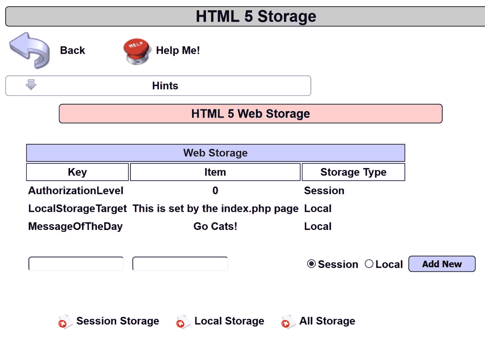

1.  切换到 Burp 代理拦截选项卡。通过点击拦截器打开按钮来打开拦截器。

1.  通过按下*F5*或点击重新加载按钮在 Firefox 浏览器中重新加载 HTML 5 Web 存储页面。

1.  切换到 Burp 代理 HTTP 历史选项卡。找到刚刚执行的重新加载创建的暂停请求。注意`User-Agent`字符串被高亮显示，如下截图所示：

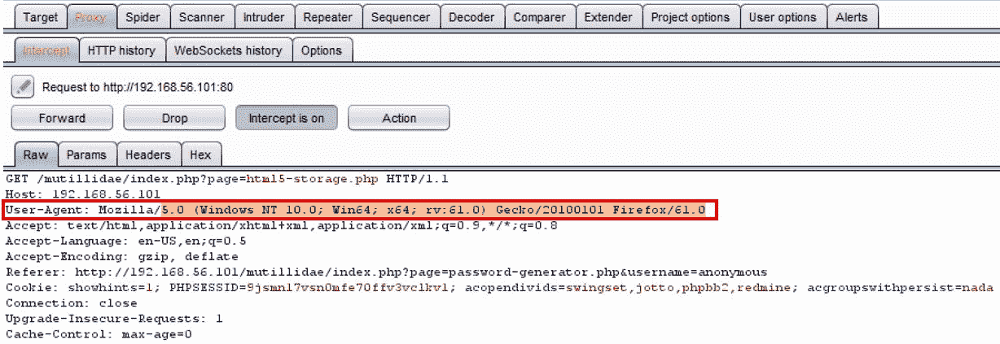

1.  用以下脚本替换前面高亮显示的`User-Agent`：

```
<script>try{var m = "";var l = window.localStorage; var s = window.sessionStorage;for(i=0;i<l.length;i++){var lKey = l.key(i);m += lKey + "=" + l.getItem(lKey) + ";\n";};for(i=0;i<s.length;i++){var lKey = s.key(i);m += lKey + "=" + s.getItem(lKey) + ";\n";};alert(m);}catch(e){alert(e.message);}</script>
```

1.  点击“Forward”按钮。现在，通过点击拦截器关闭按钮来关闭拦截器。

1.  注意弹出的警报显示 DOM 存储的内容：


# 工作原理...

注入的脚本说明了跨站脚本漏洞的存在，结合 DOM 中存储的敏感信息，可以允许攻击者窃取敏感数据。

# 测试 JavaScript 执行

JavaScript 注入是跨站脚本攻击的一个子类型，特指对 JavaScript 的任意注入。该领域的漏洞可能影响浏览器中保存的敏感信息，如用户会话 cookie，或者可能导致页面内容的修改，允许来自攻击者控制站点的脚本执行。

# 准备工作

使用 OWASP Mutillidae II 密码生成器练习，让我们确定应用程序是否容易受到 JavaScript XSS 攻击。

# 如何操作...

1.  导航到 OWASP 2013 | A1 – 注入（其他）| JavaScript 注入 | 密码生成器：


1.  注意点击“生成密码”按钮后，会显示一个密码。还要注意 URL 中提供的用户名值*原样*反映在网页上：`http://192.168.56.101/mutillidae/index.php?page=password-generator.php&username=anonymous`。这意味着页面可能存在潜在的 XSS 漏洞：

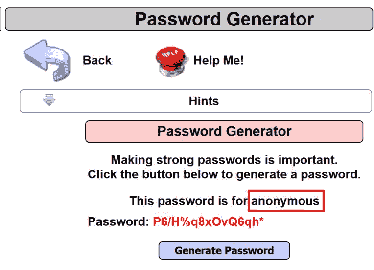

1.  切换到 Burp 代理 HTTP 历史选项卡，并找到与密码生成器页面相关的 HTTP 消息。切换到消息编辑器中的响应选项卡，并在字符串`catch`上执行搜索。注意返回的 JavaScript 具有一个 catch 块，其中显示给用户的错误消息。我们将使用这个位置来放置一个精心制作的 JavaScript 注入攻击：


1.  切换到 Burp 代理拦截选项卡。通过点击拦截器打开按钮来打开拦截器。

1.  通过按下*F5*或点击重新加载按钮在 Firefox 浏览器中重新加载密码生成器页面。

1.  切换到 Burp 代理拦截器选项卡。在请求暂停时，注意`username`参数值如下所示高亮显示：

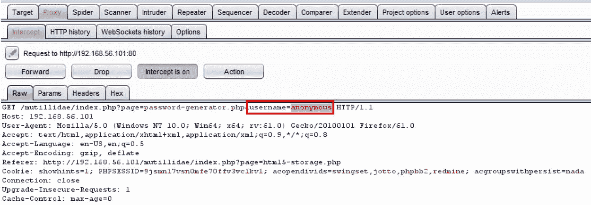

1.  用以下精心制作的 JavaScript 注入脚本替换前面高亮显示的`anonymous`值：

```
canary";}catch(e){}alert(1);try{a="
```

1.  点击“Forward”按钮。现在，通过点击拦截器关闭按钮来关闭拦截器。

1.  注意弹出的警报。您已成功演示了 JavaScript 注入 XSS 漏洞的存在！

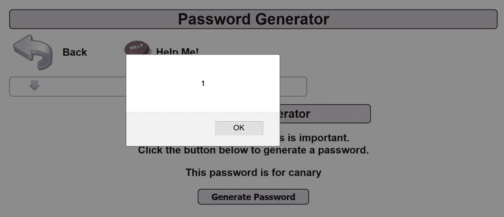

# 工作原理...

```
canary and ending the statement with a semicolon, a specially crafted *new* catch block was created, which contained the malicious JavaScript payload.
```

# 测试 HTML 注入

HTML 注入是将任意 HTML 代码插入易受攻击的网页。该领域的漏洞可能导致敏感信息的泄露，或者出于社会工程目的修改页面内容。

# 准备工作

使用 OWASP Mutillidae II 捕获数据页面，让我们确定应用程序是否容易受到 HTML 注入攻击。

# 如何操作...

1.  导航到 OWASP 2013 | A1 – 注入（其他）| 通过 Cookie 注入的 HTMLi | 捕获数据页面：


1.  注意攻击前页面的外观：

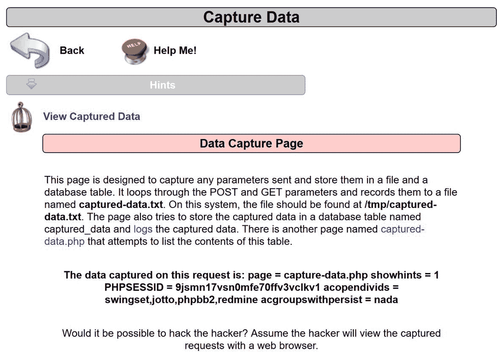

1.  切换到 Burp 代理拦截选项卡，并通过点击拦截器打开按钮来打开拦截器。

1.  在请求暂停时，记下最后一个 cookie 的值，`acgroupswitchpersist=nada`：

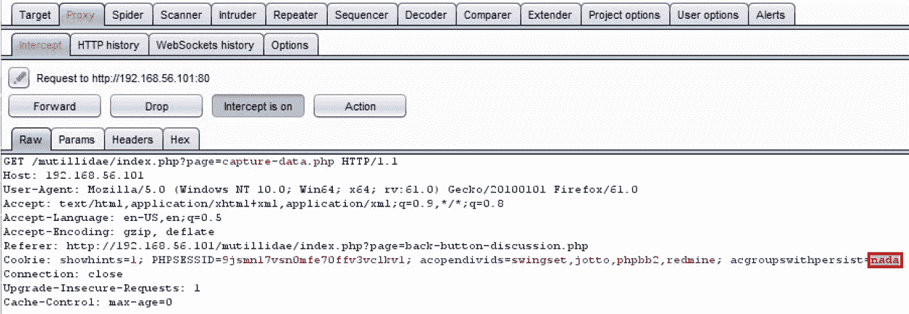

1.  在请求暂停时，用这个 HTML 注入脚本替换最后一个 cookie 的值：

```
<h1>Sorry, please login again</h1><br/>Username<input type="text"><br/>Password<input type="text"><br/><input type="submit" value="Submit"><h1>&nbsp;</h1>
```

1.  点击“Forward”按钮。现在通过单击拦截器按钮将拦截器关闭。

1.  注意 HTML 现在包含在页面中！

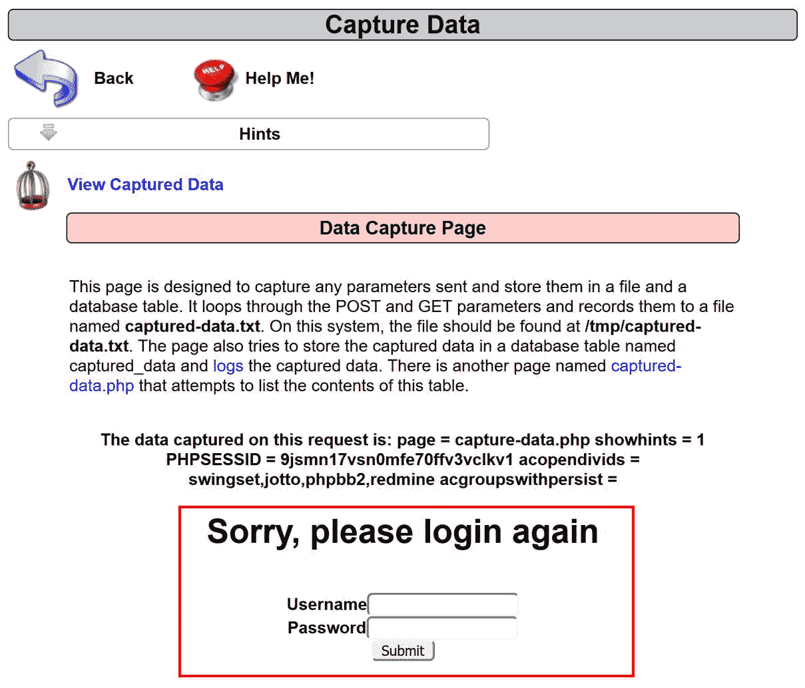

# 工作原理...

由于缺乏输入验证和输出编码，可能存在 HTML 注入漏洞。利用这个漏洞的结果是插入任意 HTML 代码，这可能导致 XSS 攻击或社会工程学方案，就像前面的示例中所看到的那样。

# 测试客户端资源操纵

如果应用程序根据客户端 URL 信息或资源路径执行操作（即，AJAX 调用，外部 JavaScript，iframe 源），则结果可能导致客户端资源操纵漏洞。这种漏洞涉及攻击者控制的 URL，例如 JavaScript 位置属性中找到的位置标头，或者控制重定向的 HTTP 响应中找到的位置标头，或者 POST 主体参数。这种漏洞的影响可能导致跨站脚本攻击。

# 准备工作

使用 OWASP Mutillidae II 应用程序，确定是否可能操纵客户端暴露的任何 URL 参数，以及操纵这些值是否会导致应用程序行为不同。

# 如何做...

1.  导航到 OWASP 2013 | A10 – 未经验证的重定向和转发 | Credits：

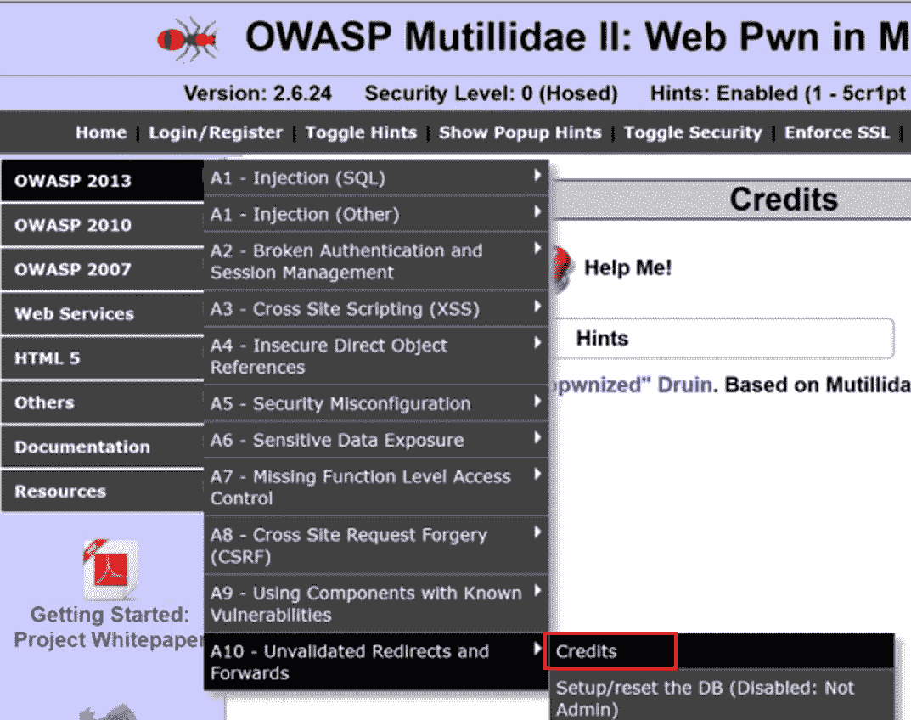

1.  点击 Credits 页面上的 ISSA Kentuckiana 链接：

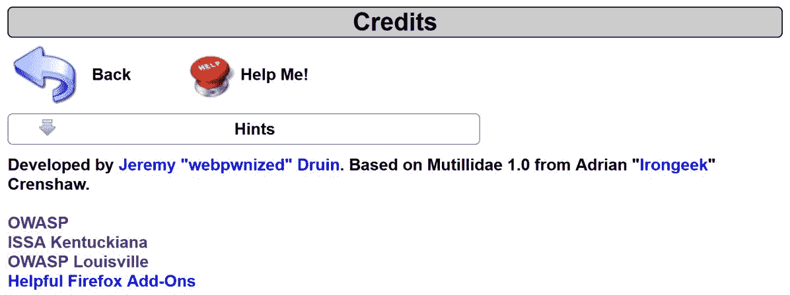

1.  切换到 Burp 代理 HTTP 历史选项卡，并找到您对 Credits 页面的请求。注意有两个查询字符串参数：`page`和`forwardurl`。如果我们操纵用户被发送的 URL 会发生什么？


1.  切换到 Burp 代理拦截选项卡。使用按钮“Intercept is on”打开拦截器。

1.  在请求暂停时，注意`fowardurl`参数的当前值：

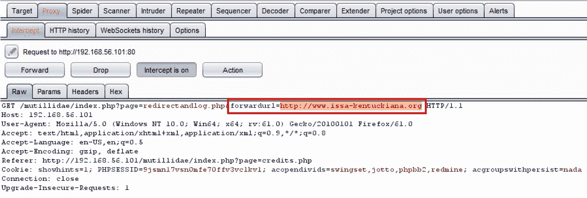

1.  将`forwardurl`参数的值替换为`https://www.owasp.org`，而不是原始选择的`http://www.issa-kentuckiana.org`：

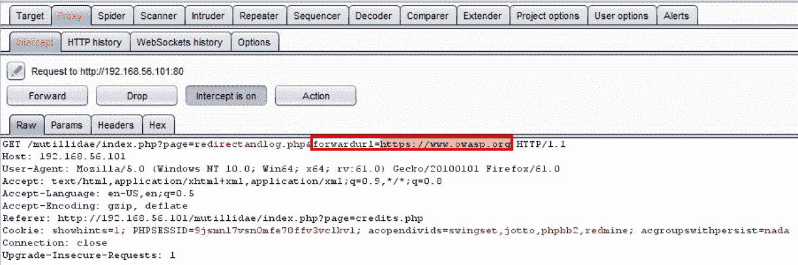

1.  点击“Forward”按钮。现在通过单击拦截器按钮将拦截器关闭。

1.  注意我们是如何被重定向到一个原本没有点击的网站！

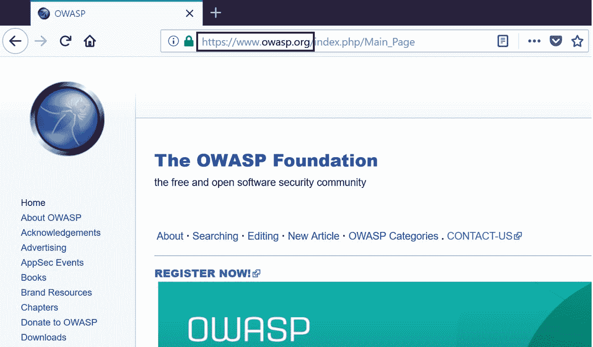

# 工作原理...

应用程序代码决策，例如将用户重定向到何处，不应依赖于客户端可用的值。这些值可能被篡改和修改，以将用户重定向到攻击者控制的网站或执行攻击者控制的脚本。
