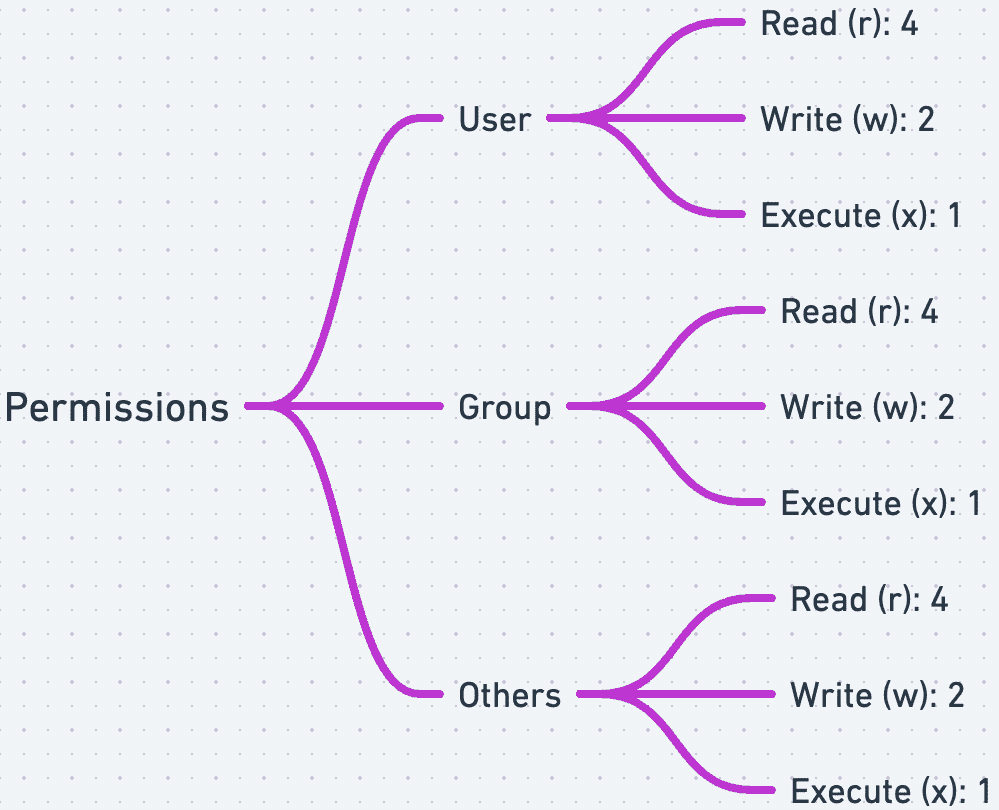
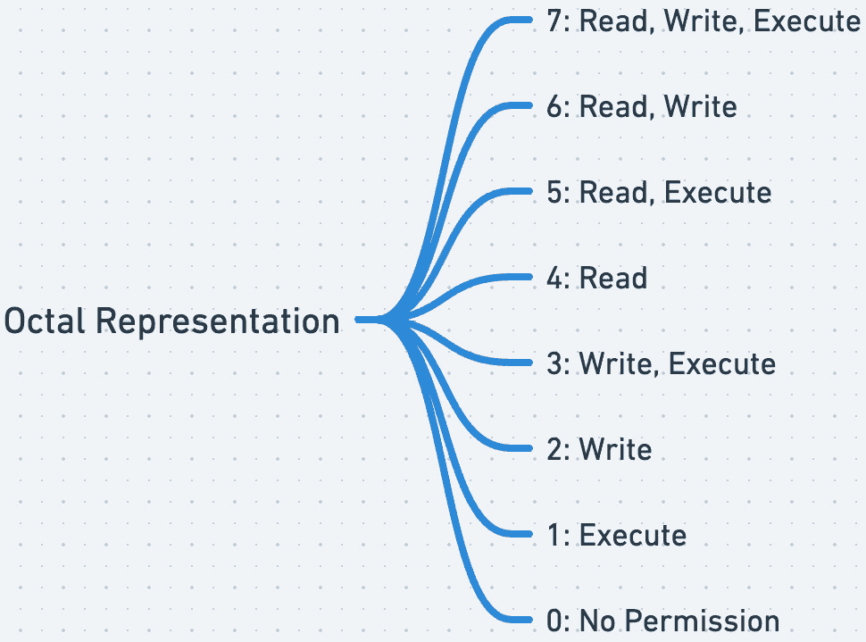

# 第二章：文件和目录管理

精通 Bash 文件和目录管理将使你具备高效浏览文件系统、操作文件和目录、通过权限控制访问以及自动化日常任务的技能。这些能力对于任何希望充分发挥 Linux 或 Unix 系统功能的人来说都是必不可少的。通过实践、耐心和一些创造力，你可以将复杂的文件系统转变为你指挥的井然有序的文件和目录集合。

到本章结束时，你将掌握创建、删除、复制和移动文件的技能。你将理解绝对路径和相对路径的重要性。这也将包括对目录结构的介绍，以及如何在 Bash 环境中高效地导航文件系统。你将掌握 Linux 环境中用户和组权限的概念。你将学习硬链接和**符号链接**（`symlink`或软链接）之间的区别，如何创建它们，以及在何种场景下每种链接类型最为有用。

在本章中，我们将涵盖以下主要主题：

+   文件和目录的操作

+   目录导航与操作

+   文件权限和所有权

+   文件链接—硬链接和符号链接

# 技术要求

跟随本章的内容需要访问具有 Bash Shell 的 Linux 系统。本章使用的所有命令都可以在 GitHub 代码库中找到，链接为[`github.com/PacktPublishing/Bash-Shell-Scripting-for-Pentesters/tree/main/Chapter02`](https://github.com/PacktPublishing/Bash-Shell-Scripting-for-Pentesters/tree/main/Chapter02)。

# 文件和目录的操作

在本节中，我们将介绍用于处理文件和目录的命令以及如何浏览文件系统。我们将从`ls`命令开始，它用于列出文件、目录及其权限。

Bash 中的`ls`命令就像是列出目录内容的瑞士军刀。它简单却充满了选项，能够根据你的需要定制输出。让我们深入了解如何使用`ls`让你的终端使用更加高效和便捷。

基本的`ls`命令会列出当前目录中的文件和目录，使用如下命令：

```
 ~ $ ls
Desktop  Documents  Downloads  Music  Pictures
```

这将显示所有非隐藏文件和目录。隐藏文件（以点开头的文件）不会显示出来。若要查看隐藏文件，请使用`-a`选项，得到以下输出：


图 2.1 – 使用-a 选项与 ls 命令时，隐藏文件会显示出来

现在，你将看到所有内容，包括如`.bashrc`这样的文件。

如果你想查看与当前目录不同位置的文件和目录列表，请将目录位置添加到`ls`命令的末尾，如下所示：

```
 $ ls /opt
```

在像`ls *.txt`这样的 Shell 命令中，星号（*****）被称为`glob`字符。`*`字符匹配任何字符序列，因此该命令列出了当前目录下所有扩展名为`.txt`的文件。你也可以使用 glob 字符列出所有以指定字符串开头，后跟任意字符或字符序列的文件，方法是使用`ls sometext*`命令。

使用`-l`选项获取更多详细信息，例如文件权限、链接数、所有者、组、大小和时间戳：


图 2.2 – 使用 ls 命令的-l 选项显示扩展的文件和目录信息

这种长格式对于快速概览文件系统状态非常有用。

使用`-l`时，默认按字节列出文件大小。添加`-h`选项可以使文件大小更加易读（例如，KB，MB）。这样可以让你一目了然地判断文件的大小：


图 2.3 – ls 命令的-h 选项以人类可读的格式显示文件大小

若要将最近修改的文件显示在最上面，可以使用`-t`选项。要将`ls -t`的输出按逆序排列，可以加入`-r`选项。将此与`-h`选项结合使用，可以获得按修改时间排序的详细且易读的文件列表，如下图所示：


图 2.4 – ls 命令选项显示如何根据文件修改时间进行排序

按文件大小排序可以快速显示目录中最大或最小的文件。以下命令将按文件大小排序`ls`的输出：

```
 $ ls -lS
```

提示

有时你不仅想查看当前目录的内容，还想查看所有子目录的内容。使用`-R`选项可以递归显示所有子目录的内容。

除了使用`ls`命令列出文件或目录外，还有一些常见操作你可能需要对文件或目录进行，例如创建、复制和删除它们。

你可以分别使用`touch`和`mkdir`命令创建新文件或目录。

使用`touch`命令创建一个新的空文件，如下所示：

```
 $ touch test.txt
```

使用`mkdir`命令创建一个新目录，如下所示：

```
 $ mkdir [path and name of new directory]
```

如果你想在路径中创建多个嵌套的目录，请包含`-p`选项。例如，假设你想创建一个名为`first`的新目录，并且在`first`目录中创建一个`second`目录。以下示例将创建这个新的目录结构：

```
 $ mkdir -p first/second
```

你可以使用`cp`命令复制文件和目录。`cp`命令的语法如下所示：

```
 $ cp [source] [destination]
```

要删除文件，请使用`rm`命令。请注意此命令，因为删除操作无法恢复。如果要删除目录，请包括`-r`选项以递归删除目录中包含的文件和子目录。以下命令演示了如何使用`rm`删除文件：

```
 $ rm [file]
```

现在您已经学会了如何列出、创建和删除文件，是时候进入下一节学习如何在文件系统中导航了。

# 目录导航和操作

在本节中，您将学习 Linux 文件系统目录的布局，常见目录的用途以及如何在系统中导航。到本节结束时，您应该对文件系统的位置和设计决策感到满意，并将使用常见的 Bash 命令像专家一样导航它。

## 文件系统设计和层次结构

Bash 文件管理的核心是理解文件系统层次结构。在这里，我们将回顾各种文件系统目录及其用途。我们还将回顾对渗透测试感兴趣的特定目录。这将使您在导航文件系统时感到自信。

想象文件系统是一棵树，从树干上延伸出分支。

使用`tree`命令，您可以找到文件系统的高级概览，如下图所示：


图 2.5 – 文件系统层次结构概览

让我们按照以下方式理解这个高级概览的要素：

+   `/`：在这个结构的根部是`/`目录，简称为根目录。这是起点：一切都从这里延伸出去。想象它是一棵树干，其他所有路径都从这里分叉。以下图演示了运行`tree`命令而不指定要显示的级别数量以展示文件系统的完整布局：


图 2.6 – 发现目录结构的树的更深入理解

+   `/bin`：直接在根目录下，您会找到`/bin`，一个充满了基本用户二进制文件或程序的目录。这些是每个用户都可以访问的工具，对于日常操作是必需的。

+   `/boot`：`/boot`目录包含启动系统所需的文件，如 Linux 内核和初始 RAM 磁盘（**initrd**）文件。

+   `/dev`：`/dev`目录包含代表硬件设备和特殊文件的设备文件。

+   `/etc`：`/etc`目录包含许多对系统操作至关重要的配置文件。作为渗透测试，您可能对`/etc`目录中的某些文件和目录感兴趣。以下是一些最显著的文件：

    +   `/etc/passwd`：此文件包含有关系统上用户的基本信息，如用户 ID、组 ID、主目录和 shell。

    +   `/etc/group` : 该文件包含系统中所有组的列表，及其组 ID 和成员用户名。

    +   `/etc/shadow` : 该文件存储用户的密码信息，包括哈希后的密码和账户过期日期。

    +   `/etc/sudoers` : 该文件包含允许使用`sudo`命令的用户和组的列表，以便以提升权限执行命令。

    +   `/etc/sysconfig` : 该目录包含各种系统服务和应用程序的配置文件，例如网络设置、显示管理器配置和防火墙规则。

    +   `/etc/network` : 该目录包含网络接口的配置文件，包括 IP 地址、子网掩码和**域名系统`(`DNS**)服务器设置。

    +   `/etc/hosts` : 该文件将主机名映射到 IP 地址，允许系统在不依赖 DNS 服务器的情况下解析主机名为 IP 地址。

    +   `/etc/services` : 该文件列出了系统上可用的服务，及其端口号和协议。

    +   `/etc/protocols` : 该文件列出了系统支持的网络协议，包括其版本号和其他配置信息。

    +   `/etc/fstab` : 该文件包含关于系统上已挂载文件系统的信息，包括挂载点、文件系统类型和选项。

+   `/home` : 用户特定的数据存储在`/home`中，这是文件系统内的一组个人空间。每个用户的目录就像他们的家，存储个人文件和设置。

+   `/lib` : 系统库，即程序运行所需的共享资源，存储在`/lib`中。

+   `/mnt` : 用于挂载外部设备或文件系统的有`/mnt`和`/media`。它们作为外部文件系统的停靠点。

+   `/opt` : 可选或第三方软件存储在`/opt`。渗透测试人员常常将`git`仓库克隆到`/opt`下的自定义目录，以运行那些没有安装在常规`/****bin`目录下的工具。

+   `/proc** : **/proc`目录存储关于正在运行的进程的信息。

+   `/root` : 根用户的主目录位于`/root`。由于 root 是超级用户，其文件存储在与其他用户（位于`/home`下）不同的地方。

+   `/run** : **/run`目录是一个临时文件系统，用于存储自上次启动以来的瞬态信息。

+   `/sbin` : 紧邻`/bin`的是`/sbin`，用于存放系统二进制文件。这些通常是仅供系统管理员使用的工具。

+   `/srv** : **/srv`目录存储系统服务使用的数据。

+   `/sys** : **/sys`目录提供了一个与内核对象及其属性交互的接口。

+   `/tmp** : **/tmp`目录存储临时文件，这些文件在系统重启时会被删除。

+   `/usr`：`/usr`目录是一个更广泛的集合，包含用户二进制文件、库文件、文档等。它就像城市的商业区，提供了超出`/bin`和`/lib`中基本功能之外的各种服务。

+   `/var`：在 Linux 系统中，`/var`目录是文件系统层级中的关键组成部分，其主要目的是存储预期会随着时间增长的可变数据、文件和目录。这些数据可能包括日志文件、队列文件、临时文件以及其他随着系统操作而变化或扩展的瞬态或动态数据。`/var`目录的结构和内容旨在支持跨系统重启存储可变数据，确保数据在会话之间持久存在。以下是`/var`目录中的一些重要子目录及其典型用途：

    +   `/var/log`：包含系统和运行在系统上的各种应用程序生成的日志文件。这些日志包括系统日志、应用日志和系统事件日志，对于故障排除和监控系统健康状况至关重要。

    +   `/var/spool`：用于排队任务和数据，如打印作业、邮件和其他排队任务。该区域旨在存放等待由某些服务或应用程序处理的数据。

    +   `/var/tmp`：用于存储在系统重启之间保持的临时文件。与`/tmp`不同，后者也可能存储临时文件，但`/var/tmp`不会在重启时被删除或清除。

    +   `/var/cache`：存储应用程序的缓存数据。虽然这些数据可以根据需要重新生成，但它们的存储目的是通过减少重新计算或重复获取相同数据来提高性能。

    +   `/var/mail`：在某些配置中存放用户的电子邮件信息。这个目录对于处理本地邮件存储的系统至关重要。

    +   `/var/www`：通常用作 Web 服务器内容的默认目录。它包括托管在服务器上的网站，也是许多 Linux 发行版中存放 Web 文件的标准位置。

    +   `/var/lib`：包含程序在运行时通常会修改的动态状态信息。这些信息可以包括数据库、应用程序状态文件和其他应用程序在操作过程中需要存储和管理的数据。

你可以通过输入`hier`命令来查看 Linux 文件系统层级的文档，示例如下：

```
 $ man hier
```

提示

`man`命令是 manual（手册）的缩写。当你需要了解命令所需的选项和惯例时，记得使用`man`命令。

尽管当前工作目录可能会显示在 Bash 提示符中，你也可以使用`pwd`命令打印当前目录，示例如下：

```
 ~ $ pwd
/home/steve
```

现在你已经了解了文件系统的布局，并理解了其层级结构和设计，接下来我们将进入下一部分，了解如何在文件系统中进行导航。

## 文件系统导航命令

浏览文件系统可以使用各种工具和技术。最常见的方法是使用**命令行界面**（**CLI**）并通过`cd`命令在目录之间切换。例如，要切换到`/home`目录，你可以输入以下命令：

```
 $ cd /home
```

之前我们提到过，波浪号（**~**）字符是一个快捷方式，用于输入用户目录的完整路径，因此你也可以在`cd`命令后使用波浪号跳转到主目录，如下所示：

```
 $ cd ~
```

如果你在个人配置文件中启用了标签补全，你可以使用 Tab 键在输入时自动完成目录名称，从而更容易地浏览文件系统。

除了`cd`命令，Bash Shell 还提供了若干命令用于浏览目录，包括`pushd`和`popd`。这两个命令就像在荒野中留下的面包屑轨迹，帮助你跟踪你去过的地方，从而轻松返回。当你`pushd`进入一个目录时，Bash 会记住你当前的位置，然后再将你带到新目录。需要返回吗？只需`popd`，你就会回到上一个目录。这就像在命令行工具箱中拥有一个瞬移设备。下面的命令输出展示了如何使用`pushd`和`popd`命令来浏览文件系统：

```
 ~ $ pushd /var/log
/var/log ~
/var/log $ pushd /etc
/etc /var/log ~
/etc $ popd
/var/log ~
/var/log $ popd
~
~ $
```

现在是提到**绝对路径**与**相对路径**的好时机。绝对路径是从驱动器的根目录（**/**）开始的完整路径。指向你主目录中文件的绝对路径是`/home/user/filename`。相对路径是相对于你当前所在目录的路径。当前目录由一个点和斜杠（**./**）表示。目录结构中上一级由`../`表示。上两级则是`../../`，以此类推。如果你想从当前目录进入子目录，只需使用目录名。例如，要引用当前目录下两级目录的文件，路径是`directory1/directory2/filename`。

现在，假设你正在一个深层的目录树中工作，并且需要返回多个层级。输入`cd ../../..`不仅麻烦，而且容易出错。这时，`cd -`命令登场了，它是一个简单而强大的快捷方式，可以立即将你带回上一个目录。就像拥有一个撤销按钮来修正导航错误。这里我们可以看到它是如何工作的，并将我们带回到之前的位置：

```
 ~ $ cd /opt
/opt $ cd -
/home/steve
~ $
```

那如果你能在不记住路径的情况下跳转到常用的目录呢？这时别名就派上用场了。通过在`.bashrc`文件中添加像`alias docs='cd /home/user/documents'`这样的行，你可以为那些长路径创建快捷方式。突然之间，进入`documents`文件夹就像输入`docs`一样简单。这就像在庞大的城市中设置个人快捷方式一样。

对于那些热衷于提高效率的人来说，*Ctrl* + *R* 反向搜索功能简直是游戏规则改变者。按下这些键并开始输入之前使用过的命令的一部分，Bash 会在你的历史记录中搜索并建议匹配的命令。就像为你的命令历史提供了一个搜索引擎，省去了重新输入长命令的麻烦。

最后，别忘了自动补全功能，这是一个几乎神奇的特性。开始输入目录或文件的名称并按下 *Tab* 键，Bash 会为你自动完成，或者如果有多个匹配项，它会显示可用的补全项。这就像是拥有一个私人助手为你完成句子，但它是用于目录导航的。

总结来说，掌握这些高级的 Bash 导航技巧可以将你的命令行体验从令人沮丧转变为流畅高效。无论是通过 `pushd` 和 `popd` 在目录间跳转，使用别名创建快捷方式，还是利用反向搜索和自动补全的功能，这些技巧都旨在让你的工作更加轻松。所以下次打开终端时，记得运用这些技巧，看看你如何快速穿越文件系统。

到现在为止，你应该已经对文件系统布局有了清晰的了解，并且在系统中游刃有余。接下来，我们将探索文件系统的权限。

# 文件权限与所有权

在本章早些时候，你可能注意到 `ls -l` 命令的输出中出现过类似 `drwxr-xr-x` 的字符串。这表示文件或目录的权限。Linux 文件系统的权限就像游乐场的规则。它们决定了谁可以玩秋千（访问文件），谁可以邀请朋友一起玩（更改权限），以及谁可以制定规则（所有权）。理解这些权限对于任何想要有效管理 Linux 系统的人来说至关重要。我们将用简单的术语来讲解，包括 `chown`、`chmod`、`SUID` 和 `SGID` 的使用。

## 所有权与用户组

Linux 中的每个文件和目录都有一个与之关联的所有者和用户组。可以将所有者看作是对孩子的玩具拥有控制权的父母，而用户组则是可以在特定条件下与其一起玩耍的朋友。以下描述可能有助于理解：

+   **所有者**：拥有文件或目录控制权的用户

+   **用户组**：一组共享某些权限的用户

### 更改所有权 – chown

要更改文件或目录的所有者，我们使用 `chown` 命令（这可能需要在命令前加上 `sudo` 前缀）：

```
 $ chown [user]:[group] [file]
```

该命令同时更改文件的所有者和用户组。如果你只想更改所有者或用户组，可以省略命令中的用户组。但是，如果省略了用户，则用户组必须以冒号（:）符号作为前缀。以下命令演示了如何仅更改文件的用户组所有权：

```
 $ chown :[group] [file name]
```

这将保留所有者不变，但会更改文件或目录的用户组权限。

如果你有一个文件，并且想要应用在参考文件上使用的相同权限，包括`--reference`参数，如下所示：

```
 $ chown --reference=file1 file2
```

有两个常见的`chown`选项，你应该熟悉：

+   `-h`：影响符号链接而不是任何引用文件

+   `-R`：递归地操作文件和目录

在学会使用`chown`更改文件所有权后，在下一节中，您将学习如何使用`chmod`修改权限。

### 修改权限 – chmod

权限确定文件或目录上可以执行哪些操作。有三种类型的权限：

+   **读取**（ `r` ）：查看文件或目录的内容

+   **写入**（ `w` ）：修改文件或目录的内容

+   **执行**（ `x` ）：将文件作为程序运行或访问目录

权限设置给三类用户：

+   拥有者

+   组

+   其他

你可以使用`ls -l`命令列举文件或目录的权限。以下命令输出演示了如何使用`ls`列出文件权限：

```
 $ ls -l .bashrc
-rw-r--r-- 1 steve steve 6115 Feb 21 10:02 .bashrc
```

先前显示的权限指示以下细节：

+   第一个字符是`-`，表示这是一个文件。目录将被表示为`d`。

+   在初始的**–**字符表示文件后，接下来的三个字符表示用户权限（ `steve` ）。这是文件的所有者。这些字符是`rw-`，这意味着文件所有者具有读取和写入权限，但文件不可执行。

+   接下来的三个字符代表组（ `steve` ）。权限是`r--`，这意味着`steve`组可以读取文件，但不能写入或执行它。

+   最后三个字符是`r--`。这意味着除了所有者或组成员之外的任何人都可以读取文件，但不能写入或执行它。

让我们可视化文件权限，以便更容易理解。以下图表显示了如何解读读取、写入和执行权限以及它们如何组合：



图 2.7 – 按 rwx 位拆分的文件系统权限

如前所述，权限以`rwx`的三组重复。如读取（ `r` ）= `4`，写入（ `w` ）= `2`，执行（ `x` ）= `1`，您可以将它们相加以用一个数字代表权限，而不是三个字符。以下图表显示了每种可能组合的权限的数字表示：



图 2.8 – 用八进制表示的文件系统权限

使用`chmod`，我们可以更改这些权限。例如，以下命令设置了所有者的读取、写入和执行权限，组和其他用户的读取和执行权限：

```
 $ chmod 755 filename
```

你也可以使用 `chmod` 以符号方式修改文件。例如，如果你想使一个文件可执行，可以使用如下命令：

```
 $ chmod +x filename
```

在学习了基本的文件权限后，在下一部分，你将学习一些特殊权限，这些权限会在非文件拥有者的用户执行文件时产生影响。

## 特殊权限 – SUID 和 SGID

`SUID`（设置用户 ID）和 `SGID`（设置组 ID）是可以设置在可执行文件上的特殊权限类型。它们允许用户以文件拥有者或组的权限执行文件。当带有 `SUID` 权限的可执行文件被运行时，它将以文件拥有者的权限运行，而不是以启动它的用户的权限。同样，带有 `SGID` 权限的可执行文件则以文件组拥有者的权限运行。这种机制允许用户在通常受限的情况下执行需要提升权限的任务。它们可以简要地描述如下：

+   `SUID`：如果设置在可执行文件上，运行该文件的用户将获得与文件拥有者相同的权限。

+   `SGID`：与 `SUID` 类似，但应用于组权限。

要使用 `chmod` 命令设置 `SUID`，你可以使用以下命令：

```
 $ chmod u+s filename
```

要使用 `chmod` 命令设置 `SGID`，你可以使用以下命令：

```
 $ chmod g+s filename
```

从系统安全的角度来看，`SUID` 和 `SGID` 是双刃剑。一方面，它们对于需要临时提升权限但不暴露敏感凭证的任务至关重要。例如，`passwd` 命令允许用户更改密码，它需要访问系统的影子文件，而普通用户无法触及此文件。通过为 `passwd` 设置 `SUID` 权限，用户在运行该命令时可以在拥有足够权限的情况下更新密码，从而修改影子文件。

然而，另一方面，如果不小心管理，这种权限可以被利用。黑客对发现设置不当的 `SUID` 或 `SGID` 权限的可执行文件垂涎欲滴。为什么？因为它为他们提供了提升系统权限的机会。设想一个场景，其中一个看似无害的可执行文件具有 `SUID` 权限并且由 root 拥有。如果这个可执行文件存在任何漏洞，它就会允许任意命令执行；黑客可以利用它以 root 权限执行命令，从而控制系统。

黑客利用各种技术来利用 `SUID` 和 `SGID` 权限。他们可能会扫描系统中所有设置了这些权限的文件，然后尝试利用这些文件中的漏洞。另一种常见的手段是二进制植入攻击，黑客将一个合法的 `SUID** / **SGID` 文件替换或链接到一个恶意文件，等待毫无防备的用户执行它。

防止此类攻击需要认真管理`SUID`和`SGID`权限。定期审计这些权限有助于发现和修复潜在的漏洞。系统管理员应该确保只有绝对必要的文件才具有`SUID`或`SGID`权限，并确保这些文件保持最新，以减轻已知的漏洞。此外，采用**入侵检测系统**（**IDS**）有助于监控与这些权限相关的异常活动。

总之，虽然`SUID`和`SGID`是 Linux 中管理特权操作的不可或缺的工具，但它们必须小心处理。滥用或配置错误可能使它们成为黑客武器。通过理解它们的功能及滥用的潜力，系统管理员可以更好地保护系统免受未授权的特权提升，而你作为渗透测试人员，能在审计系统安全时理解其复杂性。

理解 Linux 文件系统权限就像学习一款新游戏的规则。一旦你了解了谁能做什么（权限）、谁拥有什么（所有权），以及如何更改这些（使用`chown`和**chmod**），你就可以有效地管理 Linux 系统了。记住：*权力越大，责任越大*。明智地使用这些命令，保持系统的安全和功能。

现在你已经掌握了列出和设置文件系统权限的技巧，让我们继续进入下一部分，了解文件系统符号链接。

# 文件链接——硬链接和符号链接

**硬链接**本质上是文件系统中现有文件的另一个名字。假设你有一本最爱的书放在书架上。有一天，你决定它应该同时出现在*经典*和*收藏*两个区域。你不需要重新买一本，而是简单地在书上贴上另一个标签，指引读者从这两个区域找到它。在 Linux 中，创建硬链接意味着你给文件添加了一个新的引用，但磁盘上的文件依然是同一个。如果你删除了原始文件名，内容仍然可以通过硬链接访问。这就像魔法一样：即使删除了其中一个标签，书仍然会留在书架上。

然而，硬链接有其局限性。它们不能跨越不同的文件系统；一个硬链接不能指向另一个驱动器上的文件，而且它们不能链接到目录，以防止可能在文件系统中创建循环。

介绍**符号链接**，它们更具灵活性，类似于快捷方式。用我们图书馆的比喻，符号链接就像是在*经典*区域放置一张指向*收藏夹*区域某本书位置的便条。这张便条本身并不是书，而是指向书本所在位置的指示。在 Linux 中，符号链接是一个指向另一个文件或目录的独立文件。与硬链接不同，如果你删除原始文件，符号链接会断开，因为它的引用点已经消失了。这就像有人把书从图书馆拿走了，*经典*区域的便条现在指向空的书架位置。

符号链接以其跨越文件系统边界和链接目录的能力而脱颖而出，使它们在任务中非常灵活，例如创建可访问的路径指向深层嵌套的目录，或保持不同版本文件或程序之间的兼容性。

为什么使用这些链接？效率和方便性是主要原因。硬链接让你可以为单个文件提供多个访问点，而不需要复制其内容，从而节省空间。符号链接（symlink）则提供了一种无需移动或复制文件的方式来创建易于导航的文件结构。

在实践中，管理这些链接非常简单，使用如`ln`命令来创建硬链接和符号链接（`ln` 用于硬链接，`ln -s` 用于符号链接），而使用`ls -l`命令查看它们。真正的艺术在于知道何时使用每种类型的链接。硬链接非常适合备份系统，或者在一个文件系统内工作时，因为它能够确保文件完整性。符号链接则非常适合创建灵活的路径和快捷方式，特别是在跨不同文件系统或者链接目录时。

总结来说，硬链接和符号链接提供了管理和访问文件的创造性方式，各自有不同的规则和潜在用途。无论是优化工作空间还是构建复杂的系统，理解这些链接能为你打开一片新的可能性天地。

# 总结

总结来说，掌握 Bash 文件和目录管理技能，可以帮助你高效地浏览文件系统，操作文件和目录，控制访问权限，并自动化常规任务。这些能力对于任何希望充分利用 Linux 或 Unix 系统的人来说都是必不可少的。通过练习、耐心和一些创造力，你可以将文件系统的复杂性转变为你指挥的一个井然有序的文件和目录集合。作为一名渗透测试人员，了解 Linux 文件系统的复杂性对于审计系统和利用它们展示风险至关重要。

在下一章，你将学习正则表达式，没多久，你将像武士挥剑一样，切割文本和命令输出！
