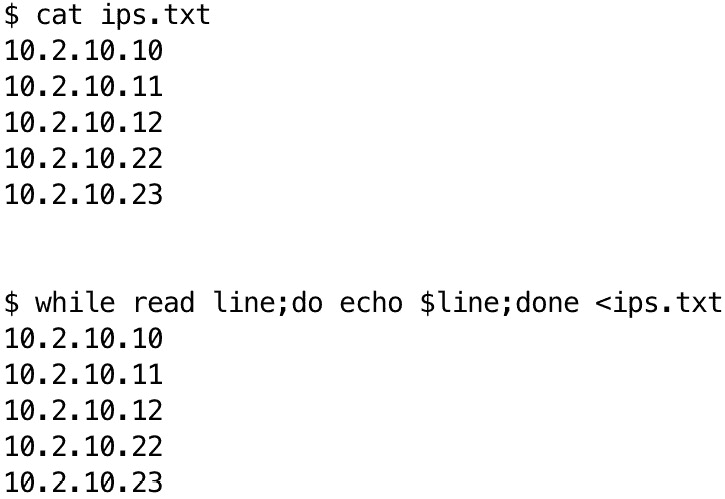
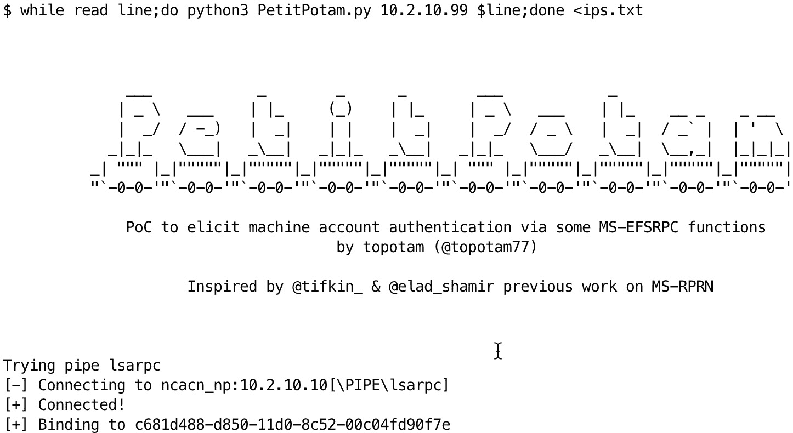
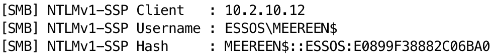

# 第三章：变量、条件语句、循环和数组

在之前的章节中，我们提供了与当前主题相关的信息。我们通过带领你完成系统设置和常用命令的讲解，帮助你了解如何使用 Bash 命令浏览 Linux 文件系统。

在本章中，我们将深入探讨让代码智能高效的编程要素：**变量**、**条件语句**、**循环**和**数组**。可以把变量看作是指向数据的标签，条件语句是决定程序路径的交叉点，循环则是你可以不断执行某些操作，直到满足某个条件为止。这些概念是构建动态响应程序的基石。无论你是刚开始学习还是想复习基础，理解这些要素对任何编程之旅都是至关重要的。

本章节将涵盖以下主要主题：

+   介绍变量

+   使用条件语句进行分支

+   使用循环重复

+   使用数组作为数据容器

# 技术要求

在本章节中，你将需要一个 Linux Bash 终端来跟随教程。你可以在[`github.com/PacktPublishing/Bash-Shell-Scripting-for-Pentesters/tree/main/Chapter03`](https://github.com/PacktPublishing/Bash-Shell-Scripting-for-Pentesters/tree/main/Chapter03)找到本章的代码。

# 介绍变量

可以把变量看作是存储数据的标签或容器。你可以将任何数据（例如文本、数字、文件名等）分配给一个简短且易记的变量名。在脚本中，你可以多次引用这个数据，通过变量名来访问或修改其内容。从技术上讲，变量是一种声明，它分配了内存存储空间并给它赋予了一个值。

在接下来的子章节中，我们将把变量这一主题分解成易于消化的小块，以便更好地理解。

## 声明变量

在 Bash 中声明变量时，只需将一个值赋给一个变量名。声明变量的语法如下：

```
 variable_name=value
```

例如，要声明一个名为`my_variable`的变量，并赋值为`Hello, World!`，你可以使用以下命令：

```
 my_variable="Hello, World!"
```

重要提示

等号`=`两边不应有空格。此外，最好将字符串值用双引号`"`括起来，这样可以正确处理空格和特殊字符。使用单引号可以防止扩展；如果希望变量或特殊字符被扩展，则使用双引号。如果必须在双引号字符串中使用特殊字符（如**$**），可以通过在字符前加反斜杠来使它们作为字面字符显示，而不是被求值，例如：`\$`。

Bash 变量的一个强大特性是它们能够存储命令的输出，使用 **命令替换**。可以通过将命令括在反引号 ``` 中，或者使用 `$()` 语法来实现。以下是一个示例：

```
 current_date=`date`
```

或者，您可以使用以下实现：

```
 current_date=$(date)
```

两个命令将把当前日期和时间存储在 `current_date` 变量中。

在 Bash 中，您可以在从命令行运行脚本时传递参数。这些参数被存储在特殊的变量中，您可以在脚本内使用它们。其工作原理如下：

```
 ~ $ ./myscript.sh arg1 arg2 arg3
```

在脚本中，您可以使用以下特殊变量访问这些参数：

+   `$0`：脚本本身的名称。

+   `$n`：传递给脚本的第 n 个参数，`$1` 到 `$9`。示例包括 `$1`，`$2` 和 `$3`。

+   `${10}`：传递给脚本的第十个参数（对于大于等于 10 的参数，必须使用花括号）。

+   `$#`：参数的数量。

+   `$?`：上一个执行命令的退出状态。

+   `$$`：当前 shell 的进程 ID。

+   `$@`：包含命令行参数的数组。

+   `$*`：表示传递给脚本或函数的所有位置参数（参数），作为一个单一的字符串。

## 访问变量

要访问变量的值，只需使用变量的名称，前面加上美元符号 `$`：

```
 #!/usr/bin/env bash
my_string="Welcome to Bash Scripting for Pentesters!" echo $my_string
```

这个示例代码可以在本章文件夹中的 `ch03_variables_01.sh` 文件中找到。

这将输出以下内容：

```
 Welcome to Bash Scripting for Pentesters!
```

以下脚本展示了如何访问命令行参数：

```
 #!/usr/bin/env bash
name=$1
age=$2
echo "Hello $name, you're $age years old!"
```

这个示例代码可以在本章文件夹中的 `ch03_variables_02.sh` 文件中找到。

如果我们运行这个脚本，我们将得到以下输出：

```
 ~ $ bash ch03_variables_02.sh Steve 25
Hello Steve, you're 25 years old!
```

如果你输入名字和姓氏时没有用双引号括起来，会发生什么？试试看。

您可以使用 `$(())` 语法或 `let` 命令对变量进行算术运算：

```
 #!/usr/bin/env bash
a=5
b=3
c=$((a + b))
let d=a+b
let e=a*b
echo "a = $a"
echo "b = $b"
echo "c = $c"
echo "d = $d"
echo "3 = $e"
```

这个示例代码可以在本章文件夹中的 `ch03_variables_03.sh` 文件中找到。

在上面的代码块中，我们将值 `5` 赋给了 `a` 变量，将值 `3` 赋给了 `b` 变量。接下来，我们将 `a` 和 `b` 相加，并将结果赋给了 `c` 变量。最后两行展示了使用 `let` 命令进行加法和乘法运算。

这是我们运行代码时的输出：

```
 ~ $ bash ch03_variables_03.sh
a = 5
b = 3
c = 8
d = 8
3 = 15
```

现在您已经了解了如何创建和访问变量，我们将继续讲解一种特殊类型的变量 —— **环境变量**。

## 环境变量

**环境变量** 本质上是命名的对象，用于存储操作系统进程所需的数据。这些变量通过提供用户环境的信息（如当前用户的主目录或可执行文件的路径），可以影响系统上软件的行为。

默认情况下，在 Bash 脚本中定义的变量是局部的，仅对该脚本有效。要使变量对其他进程（如子 shell 或子进程）可用，需要使用 `export` 命令导出它：

```
 my_var="Hello, World!" export my_var
```

在导出一个变量后，你可以在子 Shell 或子进程中访问其值。

环境变量的美妙之处在于它们能够简化流程。如果没有它们，每次你想运行一个程序或脚本时，你可能都需要输入它的完整路径。使用环境变量后，Bash 知道该去哪里查找某些文件或目录，因为这些路径被存储在像 `PATH` 这样的变量中。

此外，环境变量确保软件在不同用户环境下的正常运行。例如，`HOME` 变量告诉应用程序用户的主目录位置，使程序能够在正确的位置保存文件，而不需要每次都明确指示。

让我们通过一些实际的例子来理解这一点。假设你经常访问一个深藏在文件系统中的目录。每次都输入完整的路径可能会很麻烦。通过为这个路径创建一个自定义的环境变量，你可以大大简化这个过程：

```
 export MY_DEEP_DIRECTORY="/this/is/a/very/long/path/that/I/use/often"
```

现在，每当你需要访问这个目录时，你只需要输入 `cd $MY_DEEP_DIRECTORY` ，Bash 会立即带你到那里。

另一个常见用例是修改 `PATH` 变量。`PATH` 变量告诉 Bash 去哪里查找可执行文件。如果你安装了一个不在系统默认可执行路径中的程序，你可以将其位置添加到你的 `PATH` 中：

```
 export PATH=$PATH:/path/to/my/program
```

这个添加功能允许你在终端中从任何地方运行程序，而无需指定其完整路径。

注意，你的程序路径前面有 `$PATH:` 。这样做是将新路径附加到现有路径后面。如果没有这一部分，你将覆盖原有的 `PATH`，并且在修复或重启计算机之前会出现错误。

重要提示

如果你希望一个环境变量在重启后保持有效，可以将其放入 `.bashrc` 文件中。为了让对 `.bashrc` 的更改生效，运行 `source ~/.bashrc` 命令。

现在你已经牢牢掌握了变量的概念，是时候通过一些实践来巩固所学的知识了。

## 变量回顾

让我们检查一个包含本章所涵盖内容的脚本。请看下面的脚本：

```
 #!/usr/bin/env bash
# What is the name of this script? echo "The name of this script is $0." # Assign command line arguments to variables
name=$1
age=$2
# Use the first two parameters. echo "The first argument was $1, the second argument was $2." # How many parameters did the user enter? echo "The number of parameters entered was $#." # What is the current process ID? echo "The current process id of this shell is $$." # Print the array of command line arguments. echo "The array of command line arguments: $@"
```

这个示例代码可以在本章文件夹中的 `ch03_variables_04.sh` 文件中找到。

首先，重要的是要指出我在这里介绍了一些新的内容。脚本中的注释以 `#` 开头，并持续到行尾。`#` 后面的任何内容都不会被打印，前提是该符号没有被转义。你可能注意到，在某一行中，我们使用了 `$#` 来打印传递给脚本的参数个数。由于它在双引号内，并且前面有 `$` 符号，所以注释行为不适用，且没有被转义。

你必须用注释来记录你的脚本。如果在一段时间后需要编辑脚本，注释会帮助你回忆当时想做什么，如果你与他人共享或发布脚本，注释也能帮助他们理解。

现在，让我们运行脚本。有两种方法可以运行它。我们可以通过输入 `bash` 后跟脚本名称来运行它，或者我们可以使脚本可执行并加上路径前缀，以下是示例：

```
 ~ $ bash ch03_variables_04.sh "first arg" 2nd 3rd fourth
The name of this script is ch03_variables_1.sh. The first argument was first arg, the second argument was 2nd. The number of parameters entered was 4. The current process id of this shell is 57275. The array of command line arguments: first arg 2nd 3rd fourth
The first argument is: first arg
The second argument is: 2nd
The first and second arguments are: first arg 2nd
```

接下来，让我们列出文件权限，正如你在 *第二章* 中学到的那样：

```
 ~ $ ls -l ch03_variables_04.sh
-rw-r--r-- 1 author author 714 Mar 20 09:28 ch03_variables_04.sh
```

在前面的命令中，你可以看到我们使用了 `ls` 命令的 `-l` 选项来查看权限。它对所有者可读可写，对组和其他人仅可读。接下来，让我们使用 `chmod` 命令使其可执行：

```
 ~ $ chmod +x ch03_variables_04.sh
~ $ ls -l ch03_variables_1.sh
-rwxr-xr-x 1 author author 714 Mar 20 09:28 ch03_variables_04.sh
```

在这里，你可以看到在输入了带有 `+x` 参数的 `chmod` 命令后，文件现在可以被所有者、组和其他人执行。当然，你也可以通过使用 `chmod 744 ch03_variables_04.sh` 命令，使其仅由所有者执行。如需复习，请参考 *第二章* 或运行 `man chmod` 命令。

既然文件已可执行，你可以在文件名之前加上路径来运行它。你可以指定绝对路径或相对路径，正如在 *第二章* 中所讨论的那样。以下是如何使用相对路径运行它：

```
 ~ $ ./ch03_variables_04.sh 1 2 3 4
```

重要提示

`shebang`（**#!**）是脚本中的第一行，用于指定执行脚本时使用的解释器（程序）。使用 `#!/usr/bin/env bash` shebang 告诉 shell 使用 Bash 解释器来运行脚本。

如果没有 shebang，以下执行方法可能无法工作，因为 shell 可能不知道使用哪个程序来执行代码。

如果不包括 shebang 并使脚本可执行，你必须在脚本名称前加上 `bash` 才能运行脚本。

到现在为止，你应该已经很好地掌握了变量的使用。在下一节中，你将学习如何使用条件语句来做出决策并在脚本中进行分支。

# 使用条件语句进行分支

从本质上讲，Bash 中的条件语句是一种告诉脚本：“嘿，如果这个特定的事情是真的，那就执行这个；否则，执行那个。”它是脚本中做决策的基础。在 Bash 中，你最常遇到的条件语句是 `if`、`else` 和 `elif`。

## if 语句

`if` 语句是最简单的条件语句形式。它检查一个条件，如果条件为真，则执行一段代码。下面是一个简单的示例：

```
 #!/usr/bin/env bash
USER="$1"
if [ $USER == 'steve' ]; then
  echo "Welcome back, Steve!" fi
```

这个示例代码可以在本章文件夹中的 `ch03_conditionals_01.sh` 文件中找到。

在这个示例中，脚本通过匹配第一个命令行参数来检查当前用户是否为`steve`。如果是，它会向 Steve 打招呼。注意这里的语法：条件周围使用方括号，使用双等号进行比较，`then`表示条件为真时应该执行的操作开始。`fi`部分则表示结束当前的`if`语句块。

需要指出的是，分号（**;**）字符在这里有特殊含义，用作命令分隔符。没有它，这个`if`语句块会出错。分号还可以用来将多个命令写在同一行。前面的`if`语句可以通过更多的分号重新编写，如下所示：

```
 if [ "$USER" == 'steve' ]; then echo "Welcome back, Steve!"; fi
```

## 添加 else

但是如果条件不满足时你想做别的事情呢？这时`else`就派上用场了。它允许你在条件为假时指定其他的操作。这里是一个示例：

```
 #!/usr/bin/env bash
USER="$1"
if [ $USER == 'steve' ]; then
  echo "Welcome back, Steve!" else
  echo "Access denied." fi
```

这个示例代码可以在本章文件夹中的`ch03_conditionals_02.sh`文件找到。

现在，如果用户不是`steve`，脚本会返回**访问被拒绝**：

```
 ~ $ bash ch03_conditionals_02.sh Somebody
Access denied.
```

## elif 的强大

有时，你需要考虑的不止两种可能性。这时`elif`（即`else if`的缩写）就变得非常有用。它让你可以逐一检查多个条件：

```
 #!/usr/bin/env bash
if [ $USER == 'steve' ]; then
  echo "Welcome back, Steve!" elif [ $USER == 'admin' ]; then
  echo "Hello, admin." else
  echo "Access denied." fi
```

这个示例代码可以在本章文件夹中的`ch03_conditionals_03.sh`文件找到。

在前面的脚本中，`USER`变量来自于已登录用户的环境变量。根据需要，修改`if`或`elif`语句中的代码，以使其与你的用户名匹配。

当你以`Steve`身份登录并运行它时，你将得到以下输出：

```
 $ bash ch03_conditionals_03.sh
Welcome back, Steve!
```

使用`elif`，你可以根据需要添加任意多个附加条件，使脚本能够处理各种不同的情况。

现在你知道了如何使用常见的条件语句，让我们深入探讨一些在 Bash 脚本中常用的稍微复杂一点的示例。

## 超越简单的比较

Bash 条件语句不仅限于检查一个值是否等于另一个值。你可以检查多种条件，包括以下内容：

+   文件是否存在

+   变量是否大于某个值

+   文件是否可写

在 Bash 中，`primaries`指的是在条件测试中使用的表达式，这些表达式位于`[`（单括号）、`[[`（双括号）和 test 命令中。这些原语用于评估不同类型的条件，如文件属性、字符串比较和算术运算。原语是条件语句的基本构建块，允许你测试文件、字符串、数字和逻辑条件。它们通常用于`if`、`while`或`until`结构中，用于根据这些评估结果确定脚本的执行流程。

**文件测试操作符** 用于检查文件的属性，例如是否存在、是否可读、是否为目录等。以下列表列出了文件测试操作符：

+   **-e 文件** : 如果文件存在，则为真

+   **-f 文件** : 如果文件存在并且是常规文件，则为真

+   **-d 文件** : 如果文件存在并且是一个目录，则为真

+   **-r 文件** : 如果文件存在并且可读，则为真

+   **-w 文件** : 如果文件存在并且可写，则为真

+   **-x 文件** : 如果文件存在并且是可执行的，则为真

+   **-s 文件** : 如果文件存在并且不为空，则为真

+   **-L 文件** : 如果文件存在并且是符号链接，则为真

例如，在尝试从文件中读取之前检查文件是否存在，可以防止脚本崩溃：

```
 #!/usr/bin/env bash
if [ -f "/path/to/file.txt" ]; then
  echo "File exists. Proceeding with read operation." else
  echo "File does not exist. Aborting." fi
```

这个示例代码可以在本章文件夹中的 `ch03_conditionals_04.sh` 文件中找到。

`-f` 标志用于测试提供的文件名是否存在并且是常规文件。要测试目录，可以使用 `-d` 标志。要同时测试文件和目录，可以使用 `-e` 标志。如果我们没有首先检查文件是否存在，脚本可能会崩溃。使用 `if` 语句可以优雅地处理这个错误。

要在 Bash 中比较整数变量，你应该使用 `-eq` 、`-ne` 、`-lt` 、`-le` 、`-gt` 和 `-ge` 操作符：

+   `-eq` : 如果两个数字相等，则为真

+   `-ne` : 如果两个数字不相等，则为真

+   `-gt` : 如果第一个数字大于第二个数字，则为真

+   `-ge` : 如果第一个数字大于或等于第二个数字，则为真

+   `-lt` : 如果第一个数字小于第二个数字，则为真

+   `-le` : 如果第一个数字小于或等于第二个数字，则为真

这里有一些示例演示整数比较：

```
 #!/usr/bin/env bash
num1=10
num2=20
# Compare if num1 is equal to num2
if [ $num1 -eq $num2 ]; then
    echo "num1 is equal to num2"
else
    echo "num1 is not equal to num2"
fi
```

这个示例代码可以在本章文件夹中的 `ch03_conditionals_05.sh` 文件中找到。

运行此代码应输出以下内容：

```
 num1 is not equal to num2
```

在上面的代码中，我声明了两个变量。然后，我在 `if** - **else` 块中使用了 `-eq` 比较操作符来打印结果。你也可以把它放在一行中，像下面这样：

```
 num1=10; num2=20; [ $num1 -eq $num2 ] && echo "num1 is greater" || echo "num2 is greater"
```

在前面的示例中，我声明了两个变量。然后，我将比较放在方括号中。逻辑与（**&&**）操作符表示 *如果前一个命令成功（即返回真或 0），则执行下一个命令*。否则，逻辑或（**||**）操作符表示 *如果前一个命令不成功（即返回非零退出代码），则执行下一个命令*。尝试在终端中运行此代码并查看输出。你应该会看到以下输出：

```
 num2 is greater
```

以下代码演示如何使用小于 `-lt` 操作符比较整数：

```
 #!/usr/bin/env bash
num1=10
num2=20
if [ $num1 -lt $num2 ]; then
    echo "num1 is less than num2"
else
    echo "num1 is not less than num2"
fi
```

这个示例代码可以在本章文件夹中的 `ch03_conditionals_06.sh` 文件中找到。

运行上述代码应输出以下内容：

```
 num1 is less than num2
```

以下代码演示如何使用大于或等于操作符 `-ge`：

```
 #!/usr/bin/env bash
num1=10
num2=20
if [ $num1 -ge $num2 ]; then
    echo "num1 is greater than or equal to num2"
else
    echo "num1 is not greater than or equal to num2"
fi
```

这个示例代码可以在本章文件夹中的`ch03_conditionals_07.sh`文件找到。

这段代码的输出应该是：

```
 num1 is not greater than or equal to num2
```

Bash 中的字符串比较使用`=`和`!=`表示等于和不等于，使用`<`和`>`表示字典序比较。以下是 Bash 中的字符串基本操作：

+   `-z STRING` : 如果字符串为空，则为真

+   `-n STRING` : 如果字符串不为空，则为真

+   `STRING1 == STRING2` : 如果字符串相等，则为真

+   `STRING1 != STRING2` : 如果字符串不相等，则为真

这是一个演示字符串比较的示例：

```
 #!/usr/bin/env bash
# Declare string variables
str1="Hello"
str2="World"
str3="Hello"
# Compare if str1 is equal to str2
if [ "$str1" == "$str2" ]; then
    echo "str1 is equal to str2"
else
    echo "str1 is not equal to str2"
fi
# Compare if str1 is not equal to str3
if [ "$str1" != "$str3" ]; then
    echo "str1 is not equal to str3"
else
    echo "str1 is equal to str3"
fi
# Lexicographical comparison if str1 is less than str2
if [[ "$str1" < "$str2" ]]; then
    echo "str1 is less than str2"
else
    echo "str1 is not less than str2"
fi
```

这个示例代码可以在本章文件夹中的`ch03_conditionals_08.sh`文件找到。

这是脚本的输出：

```
 str1 is not equal to str2
str1 is equal to str3
str1 is less than str2
```

这个示例展示了如何比较字符串中的字节。要提取字符串的第一个字符，可以使用`byte="${string:1:1}"`。然后像比较其他字符串一样比较`byte`。

到目前为止，我们一直在比较简单的文本和整数。比较`UTF-8`编码的字符串与比较英文字符相同。Bash 本身没有内置直接比较`UTF-16`编码字符串的功能，也没有意识到编码的具体细节。然而，你可以使用外部工具，如`iconv`，来转换并比较这些字符串。不过，这个主题超出了本书的范围。我只是希望你了解这个限制，并知道如果你需要比较 UTF-16 编码的字符串，应该去哪里查找。

在深入讨论条件比较之后，接下来我们将学习如何使用逻辑运算符结合条件。

## 结合条件

如果你需要同时检查多个条件怎么办？Bash 通过逻辑运算符如`&&`（与）和`||`（或）为你提供了便利。这些运算符允许你组合多个条件，使你的脚本更加智能。以下示例展示了如何使用逻辑运算符检查多个条件：

```
 #!/usr/bin/env bash
if [ $USER == 'steve' ] && [ -f "/path/to/file.txt" ]; then
  echo "Hello, Steve. File exists." elif [ $USER == 'admin' ] || [ -f "/path/to/admin_file.txt" ]; then
  echo "Admin access granted or admin file exists." else
  echo "Access denied or file missing." fi
```

这个示例代码可以在本章文件夹中的`ch03_conditionals_09.sh`文件找到。

在这里，我们使用`if`条件，如果两个条件都为真，则评估结果为`TRUE`（返回**0**）。这段代码使用了逻辑与运算符`&&`。这意味着只有当第一个条件和第二个条件都为真时，结果才为真。

在`elif`条件中，如果任一评估结果为真，则该块返回`TRUE`。可以将`&&`理解为“如果 test1 和 test2 都为真，返回`TRUE`”，而`||`则是“如果 test1 或 test2 为真，返回`TRUE`，否则返回`FALSE`（返回**1**）”。

逻辑运算符简化了比较操作，并为我们节省了大量的输入！没有它们，我们不得不编写更长且更复杂的代码。Bash 中的逻辑比较就像决策工具，帮助脚本理解并根据不同情况做出反应。就像你可能根据天气决定穿什么一样，Bash 脚本利用逻辑比较来决定根据它处理的数据采取什么操作。

## case 语句

让我们来看看 `case` 语句。它有点像你在其他编程语言中可能知道的 `switch` 语句。`case` 语句允许你将一个变量与一系列模式进行匹配，并根据匹配的结果执行命令。当你需要对同一个变量进行多个条件检查时，它非常有用。下面是一个简单的例子：

```
 #!/bin/bash
read -p "Enter your favorite fruit: " fruit
case $fruit in
  apple) echo "Apple pie is classic!" ;;
  banana) echo "Bananas are full of potassium." ;;
  orange) echo "Orange you glad I didn't say banana?" ;;
  *) echo "Hmm, I don't know much about that fruit." ;;
esac
```

这个示例代码可以在本章节文件夹中的 `ch03_conditionals_10.sh` 文件中找到。

在这个脚本中，我们使用 `read -p` 提示用户输入他们最喜欢的水果，将输入赋值给水果变量，并使用 `case` 语句根据这个变量返回一个自定义的消息。`*)` 模式充当了一个通配符，类似于 `if` 语句中的 `else`。

当我们运行它时，得到如下输出：

```
 ~ $ bash ch03_conditionals_10.sh
Enter your favorite fruit: pear
Hmm, I don't know much about that fruit.
```

介绍完 Bash 内建的 `read` 命令后，让我们回顾一下它的参数及其效果：

+   `-p prompt` ：在读取输入前显示提示符

+   `t timeout` ：为输入设置超时

+   `-s` ：静默模式；不回显输入

+   `-r` ：原始输入；不允许反斜杠转义字符

+   `-a array` ：将输入读入数组

+   `-n nchars` ：只读取 `nchars` 个字符

+   `-d delimiter` ：读取直到遇到第一个定界符，而不是换行符

Bash 条件语句是你脚本工具箱中的一项强大工具。它们使得你的脚本可以做出决策，并智能地应对不同的情况。通过理解和使用 `if`、`else`、`elif` 和 `case`，并结合 `&&` 和 `||` 等逻辑运算符，你可以编写更高效、更灵活的 Bash 脚本。

增加了条件语句后，我们将在下一节探索循环。当循环与条件语句和变量结合时，它们使我们的脚本更强大！

# 使用循环重复

Bash 循环是迭代语句，是一个过程的重复。假设你有来自日志文件或漏洞扫描的多行数据的输出。手动检查每一行就像是用绑着的双手爬山；虽然可能做到，但不必要地具有挑战性。Bash 循环以其简单的语法和多样的应用，将这座大山变成了小土堆。在这一节中，我们将深入探讨 Bash 循环的本质，了解它们的类型、如何工作，以及它们为何是 Linux 环境中脚本编写不可或缺的一部分。

## for 循环

`for` 循环是你在知道需要重复多少次某个动作时的首选。它就像是在说：“对于列表中的每一项，做这件事。” Bash `for` 循环会遍历一个项列表或一个值的范围，并为每一项执行命令。下面是基本的 `for` 循环语法：

```
 for variable in list
do
  command1
  command2
  ... done
```

请注意，`for`循环的语法通常是“在一组项目中对每个项目执行操作”。对于文件来说，这可能是`for $line in lines`。该语句初始化了循环。接下来是`do`关键字，后跟循环语句，最后以`done`结束。

假设你有一个包含一些文本文件的文件夹，并且你想打印出它们的文件名：

```
 for file in *.txt
do
  echo "Text file: $file"
done
```

这个循环会遍历当前目录中每个以`.txt`扩展名结尾的文件，将文件名赋值给`file`变量，然后通过`echo`语句将其打印出来。

当你编写一个简单的脚本，如这里所示时，通常通过使用分号将每个部分分隔开，可以更轻松地将其写成一个*单行脚本*，如下所示：

```
 ~ $ for file in *.txt;do echo "Text file: $file";done
Text file: example.txt
Text file: sample.txt
```

请注意，`for`循环有时会与`sequence`（序列）一起使用。Bash 的序列表达式生成一个整数或字符的范围。你需要定义整数或字符范围的起始和结束点。一个序列由大括号中的值范围组成。这个序列的形式为`{START..END[..INCREMENT]}`。如果没有提供`INCREMENT`，则默认值为`1`。序列通常与`for`循环结合使用。这里有一个简单的示例：

```
 ~ $ for n in {1..5};do echo "Current value of n: $n";done
Current value of n: 1
Current value of n: 2
Current value of n: 3
Current value of n: 4
Current value of n: 5
~ $ for n in {a..d};do echo "Current value of n: $n";done
Current value of n: a
Current value of n: b
Current value of n: c
Current value of n: d
```

现在你已经了解了`for`循环，让我们继续学习并探索`while`循环。

## while 循环

当你想重复执行一个任务，直到某个条件不再为真时，使用`while`循环。这就像在说：“只要这个条件为真，就继续执行。”以下是`while`循环的基本语法：

```
 while [ condition ]
do
  command1
  command2
  ... done
```

这是一个创建从`5`开始倒计时的例子：

```
 #!/usr/bin/env bash
count=5
while [ $count -gt 0 ]
do
  echo "Countdown: $count"
  count=$((count-1))
done
```

这个示例代码可以在本章文件夹中的`ch03_loops_01.sh`文件中找到。

在这个示例中，我们将`count`变量初始化为`5`。然后，我们检查`count`的值；如果它大于`0`，我们打印该值，然后将其值减去`1`。只要`count`大于`0`，循环就会继续执行。每次迭代都会将`count`减去`1`，直到它变为`0`。

运行这个脚本会得到以下输出：

```
 ~ $ bash ch03_loops_01.sh
Countdown: 5
Countdown: 4
Countdown: 3
Countdown: 2
Countdown: 1
```

我使用`while`循环的最常见方式是从文件中读取主机名或 IP 地址，并对其执行一些操作。有时，渗透测试工具会对单个主机执行某些操作，而我希望对一组主机进行操作。以下是一个简单示例，我使用一行脚本和`while`循环从文件中读取 IP 地址：



图 3.1 – 演示一行的 while 循环

我稍后会更详细地解释这一点。

另一个例子是`PetitPotam`工具，它用于从未修补的 Windows 主机中强制获取密码哈希。你可以从[`github.com/topotam/PetitPotam`](https://github.com/topotam/PetitPotam)获取更多信息并下载此工具。该工具只接受一个目标主机。在这里，我通过以下命令将其应用于包含主机列表的文件：



图 3.2 – 演示使用 PetitPotam 的单行 while 循环

上一张截图的内容可以解释如下：

+   `while read line** : **while` 关键字确保我们会继续执行循环，直到条件不再成立。在这种情况下，我们会继续循环，直到文件结束。`read` 关键字从标准输入 (**stdin**) 中读取一行，直到遇到换行符，并将读取到的数据赋值给名为 `line` 的变量。当 `read` 命令读取到文件末尾时，会返回一个非零（**false**）状态，导致循环终止。

+   在 Bash 脚本中，分号（**;**）用于在同一行中分隔多个命令。这使得你可以编写简洁的单行脚本，按顺序执行多个命令。

+   `do python3 PetitPotam.py 10.2.10.99 $line` : 在 Bash 脚本中，`do` 关键字标志着每次循环迭代中要执行的命令块的开始。在这种情况下，它运行的是 `PetitPotam` 命令。第一个 IP 地址 `10.2.10.99` 是我的 Kali 主机的 IP 地址。`$line` 变量是从文件中读取的一行数据，它成为 `PetitPotam` 命令的目标 IP 地址。

+   `done` : 在 Bash 脚本中，`done` 关键字标志着每次循环迭代中执行的命令块的结束。

+   `< ips.txt` : 我将 `ips.txt` 文件的内容重定向到 `stdin`，以便被 `read` 命令读取。该文件包含一个 IP 地址列表，每行一个地址。

在运行 `PetitPotam` 命令之前，我在另一个终端标签中使用 `sudo responder -I eth0` 命令运行了 `Responder`。Responder 是一个恶意服务器，旨在从受害者处获取认证信息。如果你正在进行这个练习，请确保将 IP 地址替换为你自己的。在 Responder 输出中，我发现从一个易受攻击的系统捕获了密码哈希：



图 3.3 – 捕获到来自受害者的密码哈希

如果没有 Bash `while` 循环，我就得为网络中的每个主机手动运行命令。如果我在测试一个大规模的网络，手动操作会非常疲惫，且如果没有利用 Bash 的强大功能，我可能会浪费大量时间！

现在你已经了解了 `while` 循环的强大功能，让我们来看一下它的替代者，`until` 循环。

## until 循环

`until` 循环与 `while` 循环相反。它会一直运行，直到某个条件变为真。可以把它理解为：“直到发生这个，才做那个。”

`until` 循环的基本语法如下所示：

```
 until [ condition ]
do
  command1
  command2
  ... done
```

假设你在等待一个名为 `done.txt` 的文件出现在当前目录中：

```
 #!/usr/bin/env bash
until [ -f done.txt ]
do
  echo "Waiting for done.txt..."   sleep 1
done
```

该示例代码可以在本章文件夹中的 `ch03_loops_02.sh` 文件中找到。

该循环将持续运行，直到`done.txt`文件存在，每秒检查一次。

我很少使用`until`循环；然而，在某些情况下，当你想要做某件事直到某个条件为真时，它非常适用。

接下来，我们将探讨如何使用`select`来构建交互式菜单！

## `select` — 简化交互式菜单

另一个较不为人知的循环命令是`select`。它非常适合在脚本中创建简单的交互式菜单。使用`select`，用户可以从呈现的选项中进行选择，非常适合用作导航或设置菜单：

```
 #!/usr/bin/env bash
echo "What's your favorite programming language?" select lang in Python Bash Ruby "C/C++" Quit; do
  case $lang in
    Python) echo "Great choice! Python is versatile." ;;
    Bash) echo "Bash is great for shell scripting and automation!" ;;
    Ruby) echo "Ruby is used in the Metasploit Framework." ;;
    "C/C++") echo "C/C++ is powerful for system-level programming." ;;
    Quit) break ;;
    *) echo "Invalid option. Please try again." ;;
  esac
done
```

这个示例代码可以在本章文件夹中的`ch03_loops_03.sh`文件中找到。

该脚本展示了一系列编程语言，并根据用户的选择执行相应命令。`select`命令会自动创建一个编号菜单，用户输入对应的数字来选择。请注意，每个选项后面必须加上两个分号（**;;**）。`*)`表达式是一个“穿透”选项，用来捕获那些没有匹配前面选项的输入。

运行时的效果如下：

```
 ~ $ bash ch03_loops_03.sh
What's your favorite programming language? 1) Python
2) Bash
3) Ruby
4) C/C++
5) Quit
#? 2
Bash is great for shell scripting and automation!
```

注意，当你运行它时，它会持续循环，直到你输入`5`以退出，这时使用了代码中的`break`语句。`break`语句会跳出循环。`break`语句可以在任何循环中使用，以退出循环，无论条件语句的返回值是什么。

现在你已经掌握了使用循环的方法，让我们来探索一些高级示例。

## 高级用法 —— 嵌套循环

你可以将循环嵌套在彼此之间，并使用`break`和`continue`关键字来更精确地控制流程。下面是一个打印简单图案的示例：

```
 #!/usr/bin/env bash
for i in {1..3}
do
  for j in {1..3}
  do
    echo -n "$i$j "
  done
  echo "" # New line after each row
done
```

这个示例代码可以在本章文件夹中的`ch03_loops_04.sh`文件中找到。

该脚本打印了一个 3x3 的数字网格，展示了嵌套循环的工作原理：

```
 ~ $ bash ch03_loops_04.sh
11 12 13
21 22 23
31 32 33
```

接下来，让我们探讨如何使用`break`和`continue`关键字，帮助我们在嵌套循环中使用高级逻辑。

## 使用`break`和`continue`

`break`命令会完全退出循环，而`continue`命令会跳过当前循环的其余部分，开始下一次迭代。以下示例结合了`break`和`continue`来演示这些概念：

```
 #!/usr/bin/env bash
for i in {1..20}; do
  if ! [[ $(($i%2)) == 0 ]]; then
    continue
  elif [[ $i -eq 10 ]]; then
    break
  else echo $i
  fi
done
```

这个示例代码可以在本章文件夹中的`ch03_loops_05.sh`文件中找到。

在前面的示例中，`for`循环遍历了从`1`到`20`的一个序列。接下来，我介绍了**取余**运算符`%`，它返回除法运算的余数。如果余数不为零，循环将继续执行下一次迭代。如果`i`的值等于`10`，则退出循环。否则，它会打印出`i`的值。运行该代码后的结果如下：

```
 ~ $ bash ch03_loops_05.sh
2
4
6
8
```

正如你所预期的，它会打印出所有偶数，并在到达`10`时退出。

Bash 循环是脚本编写的基础部分，可以简化和自动化重复任务。无论是迭代文件、等待条件，还是创建交互式菜单，理解这些循环可以显著提升你的脚本技巧。从小处开始，尝试示例，很快你就能像专家一样进行循环操作！

在下一部分，你将结合之前学到的内容和一个新概念：数组。

# 使用数组作为数据容器

Bash 脚本的一个强大特性是数组的使用。数组允许你在一个变量中存储多个值，这使得你的脚本更加高效，代码更简洁。让我们深入了解 Bash 数组的基础知识，并通过实际示例探索如何利用它们。

从本质上讲，数组是一个可以通过索引访问的元素集合。可以把它想象成一排邮箱，每个邮箱都有一个唯一的号码。你可以在每个邮箱（元素）中存储不同的邮件（数据），并通过它们的邮箱号码（索引）来取出它们。

在 Bash 中，数组非常灵活。它们不要求你声明类型，并且可以根据需要增长或缩小。这意味着你可以在不必担心数组大小的情况下添加或删除元素。

在 Bash 中声明数组非常直接。你不需要显式地声明变量为数组；只需在数组上下文中为其赋值即可。以下是一个简单的示例：

```
 my_array=(apple banana cherry)
```

这一行创建了一个名为`my_array`的数组，其中包含三个元素：`apple`、`banana`和`cherry`。

要访问数组中的元素，必须使用以下语法：

```
 ${array_name[index]}
```

记住，Bash 中的数组索引从`0`开始。所以，要访问`my_array`中的第一个元素（apple），你可以使用以下语法：

```
 ${my_array[0]}
```

向数组添加元素或修改现有元素同样简单。要将元素添加到数组的末尾，可以使用以下语法：

```
 my_array+=(date)
```

`+=`操作符在许多编程语言中都很常见。这个操作表示`my_array`等于当前的`my_array`值加上`date`。

现在，`my_array`包含四个元素：`apple`、`banana`、`cherry`和`date`。要修改现有元素，必须直接为其赋予新值：

```
 my_array[1]=blueberry
```

此命令将第二个元素从`banana`更改为`blueberry`。

## 遍历数组

遍历数组是脚本中常见的任务。以下是如何遍历`my_array`中的每个元素：

```
 #!/usr/bin/env bash
my_array=(apple banana cherry)
for fruit in "${my_array[@]}"
do
  echo "Fruit: $fruit"
done
```

这个示例代码可以在本章文件夹中的`ch03_arrays_01.sh`文件中找到。

这个循环会在新的一行打印数组中的每个元素，如下所示：

```
 ~ $ bash ch03_arrays_01.sh
Fruit: apple
Fruit: banana
Fruit: cherry
```

Bash 还支持**关联数组**（有时称为**哈希映射**或**字典**），其中每个元素由一个键而不是数字索引来标识。要声明一个关联数组，使用`-A`标志与`declare`关键字：

```
 #!/usr/bin/env bash
# Declare the associative array. declare -A my_assoc_array
# Assign new keys/value pairs to the associative array. my_assoc_array[apple]="green"
my_assoc_array[banana]="yellow"
my_assoc_array[cherry]="red"
# The whole associative array is accessed as follows:
for key in "${!my_assoc_array[@]}"
do
  # A key/value pair is accessed as shown:
  echo "$key: ${my_assoc_array[$key]}"
done
```

这个示例代码可以在本章文件夹中的`ch03_arrays_02.sh`文件中找到。

访问和修改关联数组中的元素的方式类似于索引数组，但你使用的是键而非数字索引。

在之前的脚本中，关联数组是通过使用 `declare -A` 和数组名称来声明的。然后，将键值对添加到关联数组中。接下来，`for` 循环使用 `key` 变量来访问数组中的每个循环。

重要提示

你可以通过 `"${!my_assoc_array[@]}"` 引用整个关联数组。

最后，在每次 `for` 循环迭代中，当前的键值对将被打印出来：

```
 ~ $ bash ch03_arrays_02.sh
cherry: red
apple: green
banana: yellow
```

你可能已经注意到 Bash 中的关联数组并不保持顺序；它们是无序的键值对集合。这就是为什么键值对被打印出来的顺序与它们添加到数组中的顺序不同。

你可以使用以下语法访问特定关联数组键值对的值：

```
 {my_assoc_array[key]}
```

以下脚本展示了与前一个脚本相同的代码，只是在最后一行添加了这个概念：

```
 #!/usr/bin/env bash
# Declare the associative array. declare -A my_assoc_array
# Assign new keys and values to the associative array. my_assoc_array[apple]="green"
my_assoc_array[banana]="yellow"
my_assoc_array[cherry]="red"
# The whole associative array is accessed as follows:
for key in "${!my_assoc_array[@]}"
do
  # A key/value pair is accessed as shown:
  echo "$key: ${my_assoc_array[$key]}"
done
# Access a specific value from the associative array:
echo "The color of an apple is: ${my_assoc_array[apple]}"
```

这个示例代码可以在本章文件夹中的 `ch03_arrays_03.sh` 文件中找到。

该脚本的输出如下：

```
 ~ $ bash ch03_arrays_03.sh
cherry: red
apple: green
banana: yellow
The color of an apple is: green
```

Bash 数组是一个强大的功能，可以使你的脚本更加高效且易于阅读。无论你是存储一个简单的项目列表，还是处理更复杂的数据结构，如关联数组，了解如何使用数组将显著提升你的脚本能力。记住，实践是掌握 Bash 数组的关键，所以不要犹豫，尽管尝试提供的示例并自行探索更多应用。

# 摘要

这总结了一组紧密相关的主题。Bash 变量、条件语句、循环和数组是 Bash 脚本中的工具，分别用于存储数据、做出决策、重复任务和处理值列表。

循环是整个过程的明星。就像任何节目的演员阵容一样，循环也需要配角。对于循环，它们需要变量来为数据分配标签，需要条件语句来测试相等性，还需要数组来存储数据。它们齐心协力，使你的 Bash 脚本更加强大和灵活。

在下一章，你将学习 Bash 正则表达式，这是一项宝贵的技能，你需要掌握它才能有效地进行文本搜索和匹配。
