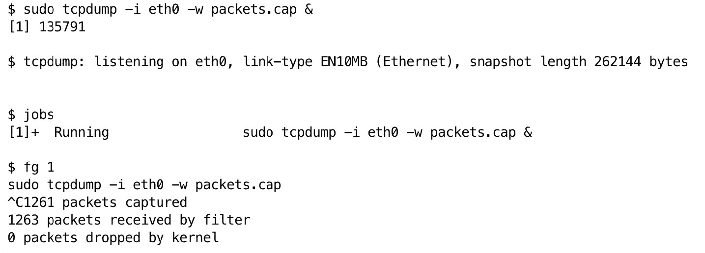
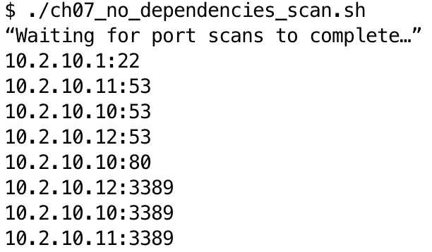

# 第七章：并行处理

在本章中，我们将探讨 Bash 脚本中**并行处理**的强大功能。随着任务变得更加数据密集和时间敏感，利用并行性可以显著提升 Bash 脚本的效率和效果。本章旨在逐步建立你对并行处理的理解和技能，从基础概念入手，进而扩展到实际应用和最佳实践。

本章结束时，你将全面了解如何在 Bash 脚本中利用并行处理的力量，使你能够在各种网络安全和数据处理场景中更高效、更有效地处理任务。

本章将涵盖以下主要内容：

+   理解 Bash 中的并行处理

+   实现基本的并行执行

+   使用`xargs`和 GNU parallel 进行高级并行处理

+   实际应用和最佳实践

本章的代码可以在[`github.com/PacktPublishing/Bash-Shell-Scripting-for-Pentesters/tree/main/Chapter07`](https://github.com/PacktPublishing/Bash-Shell-Scripting-for-Pentesters/tree/main/Chapter07)找到。

# 理解 Bash 中的并行处理

Bash 中的并行处理涉及同时执行多个任务，而不是按顺序执行，以提高效率并减少执行时间。这个概念在任务相互独立并且可以并行执行的情况下特别有用。理解并行处理的基础原理对于在 Bash 脚本中有效利用这一技巧至关重要。

本节将介绍并行处理的基础知识，包括其优缺点。让我们从理解并行处理的一些关键概念开始，具体如下：

+   **串行执行**：任务按顺序一个接一个执行。每个任务必须完成后，下一个任务才能开始。这种方法简单直接，但对于大型或复杂任务可能比较耗时。

+   **并行执行**：多个任务同时执行，彼此独立。这可以显著减少整体执行时间，特别是对于那些可以并行执行而没有依赖关系的任务。

+   **并发与并行**：并发指的是通过在任务之间切换来处理多个任务，从而给人一种它们同时运行的假象。并行则是指实际同时运行多个任务，通常利用多个 CPU 核心。

+   **独立进程**：在 Bash 中，并行任务通常作为独立进程执行。每个进程独立运行，拥有自己的内存空间。

+   **后台进程**：在后台运行任务允许 Shell 在后台任务继续运行的同时执行其他命令。这是 Bash 中实现并行性的常见技巧。

并行处理的好处包括：

+   **提高性能**：通过利用多个处理器或核心，並行处理能够加速脚本的执行，提高其效率。

+   **资源利用**：并行处理通过将工作负载分配给多个进程，可以更好地利用系统资源，如 CPU 和内存。

+   **可扩展性**：使用并行处理的脚本能够处理更大的数据集和更复杂的任务，而执行时间不会线性增加。

并行处理也有一些缺点，具体如下：

+   **复杂性**：编写和调试并行脚本比串行脚本更为复杂，因为需要在任务之间进行同步和协调。

+   **资源耗尽**：多个进程可能会争夺相同的资源（例如 CPU、内存），如果管理不当，可能导致争用和性能下降。

+   **错误管理**：在并行任务中管理错误可能具有挑战性，因为一个任务的失败可能不会立即影响其他任务，从而使问题的检测和处理变得更加困难。

通过理解这些基本概念，你将能够有效地探索和实现 Bash 中的并行处理技术，从而提升脚本的性能和效率。

# 实现基本的并行执行

到目前为止，本章内容完全是理论性的。本节将深入探讨实际操作，并教你如何在 Bash 中实现基本的并行处理。将通过实际示例帮助你理解和学习这个主题。

在 Bash 脚本中，能够在后台运行命令或脚本是并行处理的一个基本特性。当一个进程被发送到后台时，用户可以继续在前台进行其他工作。这在网络安全领域尤其有用，因为某些任务，如网络扫描或数据监控，需要不断运行而不占用终端。

在 Bash 中将进程发送到后台的最简单方法是在命令末尾添加一个“&”符号（**&**），如以下示例所示：

```
 $ ping google.com &
```

这个命令开始对 `google.com` 进行 ping 操作，并立即将命令提示符返回给用户，允许用户在不等待 `ping` 进程完成的情况下输入其他命令。

一旦一个进程在后台运行，它将由 shell 管理，而无需任何用户界面。然而，Bash 提供了多个命令来管理这些后台进程：

+   `jobs`：列出当前 shell 会话中所有正在运行的后台进程。

+   `fg`：将后台进程带回前台。你可以通过指定作业号来指定特定的任务（例如，`fg %1` 将第一个作业带回前台）。

+   `bg`：恢复暂停的后台进程，并保持它在后台运行。

例如，假设你启动了一个脚本，该脚本捕获网络数据包并将其发送到后台：

```
 $ sudo tcpdump -i eth0 -w packets.cap &
```

你可以使用 `jobs` 列出这个进程，使用 `kill -s STOP %1` 暂停它，使用 `bg %1` 恢复它。

这里有一个运行该命令的示例：



图 7.1 – 控制作业的示例

后台进程在网络安全中非常有用，用于那些耗时且不需要立即交互的任务，例如以下内容：

+   **长期监控**：设置一个网络监控工具在后台运行，记录流量模式或随时间检测异常

+   **自动化脚本**：运行定制脚本，定期检查系统日志或扫描目录以检测变化，而不阻塞对终端的访问

这里有一个简单的脚本，用于监视特定安全事件的系统日志，在后台运行。你可以在本章的书本 GitHub 存储库中找到该脚本，文件名为 `ch07_backgr ound_1.sh`：

```
 #!/bin/bash
grep -i "failed password" /var/log/auth.log > /tmp/failed-login-attempts.log &
```

该脚本过滤认证日志以查找失败的登录尝试，并将结果输出到临时文件中，所有这些操作均在后台运行。

尽管后台处理是一个强大的工具，但应谨慎使用，注意以下几个方面：

+   **监控资源使用情况**：后台进程消耗系统资源。使用诸如 `top` 或 `htop` 的工具来监控资源使用情况，确保后台任务不会对系统性能产生不利影响。

+   **使用 nohup 来处理无人看管的任务**：如果你启动一个后台进程然后退出登录，该进程会终止，除非你使用 `nohup` 允许它继续运行：`$ nohup ./your-script.sh &`。

+   **错误处理**：将错误消息重定向到文件或日志服务，以跟踪执行后台进程期间可能发生的任何问题。

有效地使用后台进程允许渗透测试人员同时执行多个任务，提升生产力和效率。通过理解和实施讨论的技术，你可以优化 Bash 脚本以处理并行处理任务，在网络安全领域尤为重要。

在 Bash 中，你可以通过使用 `&` 将迭代运行在后台来并行化循环，然后使用 `wait` 同步它们。这种方法在每个迭代的任务不依赖于其他完成时特别有用。

这是一个基本示例，可以在本章的书本 GitHub 存储库中找到，文件名为 `ch07_backg round_2.sh`：

```
 #!/usr/bin/env bash
for i in {1..5}; do
  echo "Processing item $i"
  sleep 1 &
done
wait
echo "All processes complete."
```

在这个例子中，`sleep 1 &` 模拟后台处理任务。循环后使用 `wait` 命令确保脚本等待所有后台进程完成后再继续。

这个例子脚本用于并行扫描多个 IP 地址，可以在书本的 GitHub 存储库中找到，文件名为 `ch07_backg round_3.sh`：

```
 #!/usr/bin/env bash
ips=("192.168.1.1" "192.168.1.2" "192.168.1.3")
for ip in "${ips[@]}"; do
  nmap -sS "$ip" > "scan_$ip.txt" &
done
wait
echo "Scanning complete."
```

每个`nmap`扫描都在后台运行，`scan_$ip.txt`捕获输出。一旦所有扫描启动，`wait`确保脚本只有在所有扫描完成后才继续执行。

使用 Bash 中的`&`和`wait`进行简单的并行循环为实现重复任务的并行处理提供了一种简便的方法，特别是在网络安全中，对于网络扫描或日志处理等任务特别有用。

到目前为止，我们使用的是非常基本的并行处理，利用的是内建的 Bash 特性。下一节将展示如何使用`xargs`和 GNU parallel 来进行更高级的并行处理。

# 使用 xargs 和 GNU parallel 进行高级并行处理

本节将跳跃到比之前展示的基本且有限的后台处理更先进的内容。你将学习如何使用功能更强大的`xargs`和 Gnu parallel 来实现性能关键的 Bash 代码的并行处理。

## 引入 xargs 以实现强大的并行处理

`xargs`应用程序是一个强大的 Linux 命令行工具。它用于从标准输入构建和执行命令行。默认情况下，`xargs`从标准输入读取项并执行指定的命令，执行一次或多次，使用提供的输入。这个工具对于处理大量参数或并行处理项目以提高效率特别有用。

`xargs`的基本语法如下：

```
 command | xargs [options] [command [initial-arguments]]
```

这里是一个简单的示例：

```
 $ echo "file1 file2 file3" | xargs rm
```

在这个例子中，`xargs`接受`echo`的输出（列出三个文件名），并构建一个命令来删除这些文件，执行`rm file1** **file2 file3`。

`xargs`最强大的功能之一是能够使用`-P`选项并行执行命令，该选项指定同时运行的进程数。这可以显著加速可以独立执行的操作。

假设你有一组文件需要压缩。你可以使用`xargs`并行处理它们，而不是逐个压缩：

```
 $ ls *.log | xargs -P 4 -I {} gzip {}
```

下面是这个命令的每个部分的作用：

+   `ls *.log`列出当前目录下的所有`.log`文件

+   `xargs -P 4`告诉`xargs`使用最多四个并行进程

+   `-I {}`是输入参数的占位符（每个文件名）

+   `gzip {}`压缩`ls`列出的每个文件

这个命令将同时压缩最多四个日志文件，使得操作比顺序处理每个文件要快得多。

在网络安全中，`xargs`对并行化任务非常有用，比如扫描多个主机、分析大量日志文件或在多个系统上执行命令。下面是使用`xargs`进行并行网络扫描的示例：

```
 $ cat hosts.txt | xargs -P 5 -I {} nmap -sS -oN {}_scan.txt {}
```

这个命令的作用如下：

+   `cat hosts.txt`从`hosts.txt`文件中读取主机名或 IP 地址列表

+   `xargs -P 5`运行最多五个并行实例的以下命令

+   `-I {}` 将 `hosts.txt` 中的主机名或 IP 地址插入到命令中

+   `nmap -sS -oN {}_scan.txt {}` 对每个主机运行 `nmap` 扫描，并将输出保存到以主机名命名的文件中

管理并行进程的输出可能会很棘手。以下是一些提示：

+   `Separate output files` : 如示例所示，将每个命令的输出重定向到一个唯一的文件

+   `Combine outputs` : 使用 `cat` 或类似工具在处理后合并输出文件

+   `Logging` : 将标准输出和错误输出重定向到每个进程的日志文件中，以确保捕获所有相关信息，如以下代码所示：

    ```
    cat hosts.txt | xargs -P 5 -I {} sh -c 'nmap -sS {} > {}_scan.txt 2>&1'
    ```

`xargs` 命令是一个多功能的工具，可以通过启用并行执行大大提高 Bash 脚本的效率。它能够处理大量的参数并并行处理，这对于各种网络安全任务（从网络扫描到日志文件分析）来说非常有价值。通过掌握 `xargs`，你可以显著减少许多重复任务所需的时间，从而提高网络安全操作中的生产力和效率。

## 使用 GNU parallel 提供更强的控制

在深入使用 `GNU parallel` 之前，确保它已安装在你的系统上。在大多数 Linux 发行版中，可以使用包管理器进行安装。例如，在基于 Debian 的系统上，使用以下命令：

```
 $ sudo apt-get update && sudo apt-get install parallel
```

GNU parallel 允许你通过从标准输入、文件或命令行参数读取输入来并行运行命令：

```
 $ parallel echo ::: A B C D
```

这里是一个解释：

+   `parallel` : 用于调用 GNU parallel 的命令

+   `echo` : 要在并行中执行的命令

+   `:::` : 一个分隔符，表示命令行输入值的开始

+   `A B C D` : 将并行处理的输入值

在这个例子中，GNU parallel 会并行运行 `echo` 命令四次，每次用一个输入值（`A`、`B`、`C`、**D**）。

GNU parallel 在处理更复杂的任务时表现出色，例如处理文件或在多个目标上执行脚本。假设你有一个包含多个文本文件的目录，并且希望同时统计每个文件的行数，可以使用以下命令：

```
 $ ls *.txt | parallel wc -l
```

这里是一个解释：

+   `ls *.txt` : 列出当前目录中的所有文本文件

+   `| parallel` : 将文件列表传递给 GNU parallel

+   `wc -l` : 用于统计每个文件中的行数

在这里，GNU parallel 会并行地在每个文件上运行 `wc -l`，与按顺序运行命令相比，显著加快了处理速度。

GNU parallel 可以处理更复杂的场景，包括脚本和多个输入参数。假设你有一个 `scan.sh` 脚本用于执行网络扫描，你需要在多个 IP 地址上运行此脚本。以下代码演示了基本的并行用法：

```
 $ cat ips.txt | parallel ./scan.sh
```

这里是一个解释：

+   `cat ips.txt` : 输出 `ips.txt` 文件的内容，该文件包含一组 IP 地址

+   `| parallel` ：将 IP 地址列表通过管道传递给 GNU parallel。

+   `./scan.sh` ：要在每个 IP 地址上执行的脚本

在此示例中，GNU parallel 并行运行`scan.sh`，针对`ips.txt`中列出的每个 IP 地址，提高了网络扫描操作的效率。

GNU parallel 提供了高级选项来控制并发任务的数量、处理来自多个来源的输入并管理输出。

你可以使用`-j`选项限制同时运行的任务数：

```
 $ cat ips.txt | parallel -j 4 ./scan.sh
```

在这里，`-j 4`将并发任务数限制为`4`。该命令确保不会同时运行超过四个`scan.sh`实例，这对于管理系统资源非常有用。

Parallel 还可以处理多个输入源，支持更复杂的工作流：

```
 $ parallel -a ips.txt -a ports.txt ./ch07_parallel_1.sh
```

下面是解释：

+   `-a ips.txt` ：指定`ips.txt`作为输入文件

+   `-a ports.txt` ：指定`ports.txt`作为另一个输入文件

+   `./scan.sh` ：结合输入执行的脚本

在这里，`parallel`结合了来自`ips.txt`和`ports.txt`的输入，运行`scan.sh`，并为每对 IP 地址和端口执行任务。在`ch07_parallel_1.sh`脚本中，`ips.txt`和`ports.txt`中的输入被引用为位置变量：

```
 #!/usr/bin/env bash
IP_ADDRESS=$1
PORT=$2
echo "Scanning IP: $IP_ADDRESS on Port: $PORT"
```

这段代码可以在书籍的 GitHub 仓库中找到，文件名为`ch07_parallel_1.sh`。以下是输出结果：

```
 Scanning IP: 192.168.1.1 on Port: 80
Scanning IP: 192.168.1.1 on Port: 443
Scanning IP: 192.168.1.1 on Port: 8080
Scanning IP: 192.168.1.2 on Port: 80
Scanning IP: 192.168.1.2 on Port: 443
Scanning IP: 192.168.1.2 on Port: 8080
Scanning IP: 192.168.1.3 on Port: 80
Scanning IP: 192.168.1.3 on Port: 443
Scanning IP: 192.168.1.3 on Port: 8080
```

管理并行进程中的错误和输出可能具有挑战性，但`parallel`提供了处理这些情况的机制，如下所示：

```
 $ parallel ./scan.sh {} '>' results/{#}.out '2>' errors/{#}.err :::: ips.txt
```

下面是解释：

+   `{}'>'` ：将标准输出重定向到文件。注意，`>`字符是被引号括起来的。其他特殊的 Shell 字符（如`\*`、`;`、`$`、`>`、`<`、`|`、`>>`和**<<**）也需要用引号括起来，否则它们可能会被 Shell 解析，而不是传递给 parallel。

+   `results/{#}.out` ：存储标准输出的文件，`{#}`代表任务编号。

+   `2>` ：将标准错误重定向到一个文件。

+   `errors/{#}.err` ：存储标准错误的文件，`{#}`代表任务编号。

+   `:::: ips.txt` ：指定`ips.txt`作为输入文件。`::::`用于指定后续的参数是包含输入项的文件名。

该命令将每个任务的输出和错误重定向到不同的文件，方便查看结果并调试问题。

GNU parallel 的输入可以通过四种不同的方式指定：

+   `:::` ：直接输入列表，`parallel echo ::: A** **B C`

+   `::::` ：来自文件的输入，`parallel echo ::::** **input.txt`

+   `|` ：标准输入，`cat input.txt |** **parallel echo`

+   `--arg-file`或`-a` ：指定一个文件，`parallel --arg-file** **input.txt echo`

请记住，可以指定多个输入。以下示例包括多个文件和参数输入：

```
 $ parallel -a file1 -a file2 ::: arg1 arg2 :::: file3 :::: file4 command
```

让我们来解析这个复杂的并行命令：

1.  `-a file1 -a file2** : **-a` 选项指定输入源。这告诉 `parallel` 从 `file1` 和 `file2` 中读取输入行。每一行将作为命令的参数。

1.  `::: arg1 arg2** : **:::` 分隔符引入命令行参数。`arg1` 和 `arg2` 是将用于每个任务的字面参数。

1.  `:::: file3** : **::::` 分隔符引入了另一个输入源。`file3` 将被读取，每一行将作为参数使用。

1.  `:::: file4` : 另一个输入源，类似于 `file3`。`file4` 中的每一行将作为参数使用。

1.  `command` : 这是将并行执行的实际命令，每种输入组合都会执行。

下面是 `parallel` 如何处理此命令的方式。它会为以下每种组合创建一个任务：

1.  来自 `file1` 的一行

1.  来自 `file2` 的一行

1.  `arg1` 或 `arg2`

1.  来自 `file3` 的一行

1.  来自 `file4` 的一行

对于每一种组合，它将执行 `command` ，按顺序替换参数。并行执行的任务数量取决于可用的 CPU 核心数，除非另行指定。

让我们创建一个实际的例子，使用 `parallel` 命令对多台服务器执行一系列自动化安全检查，使用不同的工具和配置。这可能是渗透测试或安全审计练习的一部分。

以下是 `servers.txt` 文件的内容：

```
 10.2.10.10
10.2.10.11
```

以下是 `ports.txt` 文件的内容：

```
 80,445
22,3389
```

以下是 `scan_types.txt` 文件的内容：

```
 quick
thorough
```

以下是 `output_formats.txt` 文件的内容：

```
 txt
json
```

现在，让我们创建一个脚本来执行这些安全检查。你可以在本书的 GitHub 仓库中找到这个文件，名为 `ch07_parallel_3.sh`。这个脚本的目的是自动化并行化跨多台服务器执行一系列模拟的安全检查：

```
 #!/usr/bin/env bash
perform_security_check() {
    server="$1"
    ports="$2"
    scan_type="$3"
    output_format="$4"
    echo "Performing $scan_type security check on $server (ports: $ports) with $output_format output"
    # Simulating nmap scan
    nmap_options=""
    if [ "$scan_type" == "quick" ]; then
        nmap_options="-T4 -F"
    else
        nmap_options="-sV -sC -O"
    fi
    output_file="scan_${server//./}_${scan_type}_${output_format}.${output_format}"
    nmap $nmap_options -p $ports $server -oN $output_file
    # Simulating additional security checks
    echo "Running vulnerability scan on $server" >> $output_file
    echo "Checking for misconfigurations on $server" >> $output_file
    echo "Performing brute force attack simulation on $server" >> $output_file
    echo "Security check completed for $server. Results saved in $output_file"
    echo "-----"
}
export -f perform_security_check
parallel -a servers.txt -a ports.txt :::: scan_types.txt :::: output_formats.txt perform_security_check
```

这是运行脚本时的部分输出：

```
 $ ./ch07_parallel_3.sh
Performing quick security check on 10.2.10.10 (ports: 80,445) with txt output
Security check completed for 10.2.10.10\. Results saved in scan_1021010_quick_txt.txt
-----
Performing quick security check on 10.2.10.10 (ports: 80,445) with json output
Security check completed for 10.2.10.10\. Results saved in scan_1021010_quick_json.json
-----
Performing thorough security check on 10.2.10.10 (ports: 80,445) with txt output
Security check completed for 10.2.10.10\. Results saved in scan_1021010_thorough_txt.txt
-----
Performing thorough security check on 10.2.10.10 (ports: 80,445) with json output
Security check completed for 10.2.10.10\. Results saved in scan_1021010_thorough_json.json
-----
Performing quick security check on 10.2.10.10 (ports: 22,3389) with txt output
Security check completed for 10.2.10.10\. Results saved in scan_1021010_quick_txt.txt
-----
Performing quick security check on 10.2.10.10 (ports: 22,3389) with json output
Security check completed for 10.2.10.10\. Results saved in scan_1021010_quick_json.json
-----
```

这种命令结构在需要组合来自多个来源的数据进行处理时特别有用，可以执行复杂的并行处理任务。

现在你已经了解了 `xargs` 和 `parallel`，接下来我将解释在何时选择其中一个而不是另一个。

## 比较 `xargs` 和 `parallel`

`xargs` 和 `parallel` 之间的关键区别是什么，如何知道何时使用其中一个作为合适的工具？以下表格可以帮助你选择适合的工具：

| 方面 | xargs | GNU parallel |
| --- | --- | --- |
| **执行方式** | 默认串行。可以使用 `-P` 选项并行运行，但灵活性较差。 | 为高效并行执行设计，开箱即用。 |
| **复杂性** | 更简单，轻量级。适合简单任务。 | 功能丰富。处理复杂场景、任务控制和负载平衡。 |
| **错误处理** | 基本。可能在出错时停止。 | 强健。即使遇到失败也能继续执行。 |
| **可用性** | 大多数 Unix 系统默认安装。 | 需要单独安装。 |

表 7.1 – xargs 与 parallel 功能的比较

在了解了 Bash 并行处理的工作原理后，接下来我们将探索在实际应用中使用这些概念。

## 使用 screen 实现并行性

`screen`命令是一个 Linux 工具，允许用户在一个窗口中管理多个终端会话。它特别适用于运行长时间的进程、管理远程会话和在 Bash 脚本中实现并行性。

在继续之前，请通过运行以下命令确保已安装`screen`：

```
 $ sudo apt update && sudo apt install -y screen
```

下面是如何使用`screen`并行运行多个任务。你可以在书籍的 GitHub 仓库中找到代码，文件名为`ch07_screen_1.sh`：

```
 perform_task() {
    echo "Starting task $1"
    sleep 5  # Simulating work
    echo "Finished task $1"
}
```

`perform_task`函数只是休眠五秒钟，用来模拟执行任务。

以下代码创建一个名为`parallel_tasks`的新分离式`screen`会话：

```
 screen -dmS parallel_tasks
```

`-d` 标志以分离模式启动会话，`-m` 创建一个新会话。

```
 for i in {1..5}; do
    screen -S parallel_tasks -X screen -t "Task $i" bash -c "perform_task $i; exec bash"
done
```

上述`for`循环在独立的`screen`窗口中启动多个任务。此命令在`parallel_tasks`会话中创建一个新窗口。`-X`标志将命令发送到会话，`screen`创建一个新窗口，`-t`设置窗口标题，`bash -c`在新窗口中执行指定的命令。

```
 screen -S parallel_tasks -X windowlist -b
```

上述命令等待会话中的所有窗口关闭。它有助于同步并行任务的完成。

```
 screen -S parallel_tasks -X quit
```

上述命令在所有任务完成后终止整个 screen 会话。

现在我们已经掌握了`xargs`、`parallel`和`screen`的使用基础，接下来让我们进入下一部分，看看一些实际应用，并回顾它们的最佳实践。

# 实际应用和最佳实践

本节将通过展示实际应用来进一步巩固你对 Bash 并行处理的理解。接下来是最佳实践，帮助你最大化地学习这些概念。

## Bash 并行处理的实际应用

在这一部分，我们将通过示例展示 Bash 并行处理在渗透测试中的实际应用。

第一个示例使用 GNU parallel 进行**SQL 注入**测试，如下所示的代码：

```
 #!/usr/bin/env bash
urls=("http://example.com/login.php" "http://test.com/index.php" "http://site.com/search.php")
echo "${urls[@]}" | parallel -j 3 'sqlmap -u {} --batch --crawl=2'
echo "All SQL injection tests completed."
```

该代码可以在书籍的 GitHub 仓库中找到，文件名为`ch07_parallel_2.sh`。以下是解释：

+   `urls`是一个待测试的 URL 数组

+   `echo "${urls[@]}"` 输出 URL 列表

+   `parallel -j 3 'sqlmap -u {} --batch --crawl=2'` 在每个 URL 上运行`sqlmap`，最多允许三项并发作业

下一个示例展示了如何并行进行网络 TCP 端口扫描，如下所示：

```
 #!/usr/bin/env bash
ips=$(seq 1 254 | awk '{print "192.168.1." $1}')
echo "$ips" | xargs -n 1 -P 10 -I {} bash -c 'nmap -sP {}'
echo "Network scan completed."
```

该代码可以在书籍的 GitHub 仓库中找到，文件名为`ch07_xargs_1.sh`。以下是解释：

+   `seq 1 254 | awk '{print "192.168.1." $1}'` 生成从`192.168.1.1`到`192.168.1.254`的 IP 地址。

+   `echo "$ips"` 输出 IP 列表。

+   `xargs -n 1 -P 10 -I {} bash -c 'nmap -sP {}'` 运行`nmap`的 ping 扫描（**-sP**）对每个 IP 进行扫描，最多支持 10 个并行作业。`-n 1`选项告诉`xargs`每次最多使用一个参数。在这种情况下，意味着`xargs`每接收到一个 IP 地址或主机名作为输入，就会执行一次`nmap`命令。

虽然前面的例子是并行执行端口扫描，`nmap`已经具备这种能力。因此，让我们探索如何在 Bash 中实现。你可能会遇到这样的情况：在一个已被你利用的系统上，无法安装像`nmap`这样的工具，出于某种原因你不能使用它，所以你需要准备好利用该系统作为跳板进入其他网络。

以下 Bash 脚本没有外部依赖，它扫描活动主机并端口扫描前 100 个 TCP 端口。它的速度远不如使用`xargs`或`parallel`时那么快。只需要记住，总有一天你会需要一个不依赖外部工具的方案，而你无法确保`xargs`和`parallel`总是可用。这个脚本应该可以在任何有 Bash 和`ping`应用程序的地方运行：

```
 #!/usr/bin/env bash
IP_RANGE="10.2.10.{1..20}"
PORTS=(21 22 23 25 53 80 110 143 443 587 3306 3389 5900 8000 8080 9000 49152 49153 49154 49155 49156 49157 49158 49159 49160 49161 49162 49163 49164 49165 49166 49167 49168 49169 49170 49171 49172 49173 49174 49175 49176 49177 49178 49179 49180 49181 49182 49183 49184 49185 49186 49187 49188 49189 49190 49191 49192 49193 49194 49195 49196 49197 49198 49199 49200 49201 49202 49203 49204 49205 49206 49207 49208 49209 49210 49211 49212 49213 49214 49215 49216 49217 49218 49219 49220 49221 49222 49223 49224 49225 49226 49227 49228 49229 49230 49231)
LIVE_HOSTS=()
for IP in $(eval echo $IP_RANGE); do
    if ping -c 1 -W 1 $IP > /dev/null 2>&1; then
        LIVE_HOSTS+=($IP)
    fi
done
scan_ports() {
    local IP=$1
    for PORT in "${PORTS[@]}"; do
        (echo >/dev/tcp/$IP/$PORT) > /dev/null 2>&1 && echo "$IP:$PORT"
    done
}
# Export the function to use in subshells
export -f scan_ports
# Loop through live hosts and scan ports in parallel
for IP in "${LIVE_HOSTS[@]}"; do
    scan_ports $IP &
done
echo "Waiting for port scans to complete…"
wait
```

该代码可以在本书的 GitHub 代码库中找到，文件名为`ch07_no_dependencies_scan.sh`。以下是解释：

+   `#!/usr/bin/env bash` ：常见的`shebang`，我们在之前的章节中已经介绍过。它基本上告诉 shell 使用哪个程序来执行接下来的代码。

+   `IP_RANGE` ：定义了使用大括号扩展（**{1..20}**）扫描的 IP 地址范围，表示基础 IP `192.168.1` 的最后一个八位字节从 1 到 20。

+   `PORTS` ：一个数组，保存`nmap`的前 100 个 TCP 端口。

+   `LIVE_HOSTS` ：一个空数组，用于存储响应 ping 请求的活动主机的 IP 地址。

+   `for IP in $(eval echo $IP_RANGE)` ：遍历扩展后的 IP 地址列表。

+   `ping -c 1 -W 1 $IP > /dev/null 2>&1` ：发送一个 ICMP 回显请求（**-c 1**），并设置 1 秒的超时时间（**-W 1**）来检查主机是否在线。输出被重定向到`/dev/null`以避免显示。

+   `LIVE_HOSTS+=($IP)` ：如果主机在线，将 IP 地址添加到`LIVE_HOSTS`数组中。

+   `scan_ports $IP` ：一个以 IP 地址作为参数的函数。

+   `(echo >/dev/tcp/$IP/$PORT) > /dev/null 2>&1` ：尝试打开与指定 IP 地址和端口的 TCP 连接。如果成功，将打印 IP 地址和端口。

+   `Export the function` ：使用`export -f scan_ports`可以让该函数在子 shell 中使用。

+   `for IP in "${LIVE_HOSTS[@]}"` ：遍历活动主机的列表。

+   `scan_ports $IP &` ：在后台调用`scan_ports`函数处理每个 IP 地址，允许并发执行。

+   `wait` ：等待所有后台作业完成后再退出脚本。

该脚本检查 20 个连续的 IP 地址以确认活动主机，然后扫描前 100 个 TCP 端口，并且在我的系统上 10 秒内完成：



图 7.2 – 一个在任何系统上都能运行的 Bash TCP 端口扫描器

这是一个并行下载多个文件的示例：

```
 $ parallel -j 3 wget ::: http://example.com/file1 http://example.com/file2 http://example.com/file3
```

这是解释：

+   `parallel -j 3`：执行三个并行作业

+   `wget :::`：后面跟随的一组三个 URL 是输入

该命令使用`wget`并发下载三个文件。

## Bash 中的并行执行最佳实践

本节探讨了使用`xargs`和`parallel`并发执行任务的最佳实践，充分利用系统资源的潜力。

以下是并行执行的最佳实践：

+   **确定作业的最佳数量**：理想的并行作业数量取决于系统的 CPU 和内存容量。可以从 CPU 核心数开始，并根据性能进行调整。如果不指定作业数量，`xargs` 默认一个作业，而 GNU parallel 默认每个 CPU 核心一个作业。

+   **监控资源使用**：使用`htop`或`vmstat`等工具监控并行执行过程中 CPU 和内存的使用情况，确保系统保持响应。有关这些工具的示例，请参阅手册页。

+   **进行干运行**：你可以通过包含`--** **dry-run`选项来检查并行将运行的内容。

+   **优雅地处理错误**：`xargs`和 GNU parallel 都可以捕获并记录错误。利用这些功能可以在不中断整个过程的情况下识别和调试问题。

+   **适当重定向输出**：将每个作业的输出重定向到单独的文件或日志系统，以避免输出交织和混乱。

+   **使用有意义的作业名称**：使用 GNU Parallel 时，你可以为作业分配有意义的名称，以便轻松跟踪其进度。

使用`xargs`和 GNU parallel 的并行执行可以极大提高 Bash 脚本的效率，特别是在网络安全和渗透测试任务中。通过遵循优化作业数量、监控资源、处理错误和管理输出等最佳实践，你可以充分利用并行处理的潜力，提升脚本和工作流的效率。

# 总结

本章我们学习了 Bash 脚本中的并行处理技术。这帮助你掌握了使用后台进程和作业控制进行并行执行的基础知识。我们还学习了使用 `xargs` 和 GNU parallel 等工具进行高级并行处理，并讨论了如何管理并行任务中的错误和输出。本章还介绍了如何将并行处理应用于渗透测试工作流。

本章将帮助你显著加快处理大量数据或同时执行多个命令的任务。并行处理可以大大减少网络扫描、暴力破解攻击或同时分析多个目标所需的时间。理解如何管理并行任务有助于为各种渗透测试场景创建更高效、更健壮的脚本。所学的技能可以应用于优化资源使用，并提高安全评估中的整体生产力。

通过掌握 Bash 中的并行处理，渗透测试人员可以创建更强大、更高效的脚本，使他们能够更有效地处理复杂任务和大规模评估。

在下一章，我们将深入探讨*第二部分*，在这里你将运用所有学到的 Bash 知识进行渗透测试。
