# 第八章：侦察和信息收集

前几章向你介绍了 Bash 脚本编写的概念。在某些情况下，我们运行的应用程序并不是用 Bash 编写的。在这些情况下，我们使用 Bash 来执行程序，在应用程序之间传递数据，或解析这些工具的输出。随着我们在本书中的进展，我们将展示更少的纯 Bash，更多地使用 Bash 来执行我们的渗透测试工具，自动化它们，并解析它们的输出。

在本章中，我们深入探讨了任何渗透测试的基本第一步：侦察。你将学习如何使用各种工具和技术发现目标组织拥有的电子邮件地址和资产。这些基础知识将为后续章节中更积极的评估奠定基础。

重要提示

不要期望本章和后续章节是有关进行渗透测试的全面参考。我不会在这里演示每一步、技术和工具。这本书旨在教你如何用 Bash 脚本增强你的渗透测试，而不是如何进行渗透测试。

在本章中，我们将涵盖以下主要主题：

+   介绍使用 Bash 进行侦察

+   格式化用户名和电子邮件地址

+   使用 Bash 进行 DNS 枚举

+   使用 Bash 识别 Web 应用程序

通过本章结束时，你将能够熟练使用 Bash 与**开源情报**（**OSINT**）工具和来源，发现目标的域名、电子邮件地址和 IP 地址。

# 技术要求

主要的先决条件是你从*第一章*开始阅读，并且可以访问 Bash shell。如果你没有使用 Kali Linux，那么你可能会发现跟随更加困难。本章后面详细介绍的一个脚本需要一个 ProjectDiscovery Chaos API 密钥（[`chaos.projectdiscovery.io/`](https://chaos.projectdiscovery.io/)），可以在撰写时免费获取。

本章的代码可以在[`github.com/PacktPublishing/Bash-Shell-Scripting-for-Pentesters/tree/main/Chapter08`](https://github.com/PacktPublishing/Bash-Shell-Scripting-for-Pentesters/tree/main/Chapter08)找到。

使用以下命令在 Kali Linux 中安装先决条件：

```
 $ sudo apt update && sudo apt install -y libxml2-utils whois
```

你还必须安装 Golang 和 Chaos 客户端。在*第一章*中有完整的 Golang 安装文档。你可以使用以下命令安装 Chaos 客户端：

```
 $ go install -v github.com/projectdiscovery/chaos-client/cmd/chaos@latest
```

# 介绍使用 Bash 进行侦察

当你对渗透测试充满热情时，直接进行扫描和攻击的冲动可能很难克服。在我的职业生涯中，有很多次我在进行主动扫描之前没有做到彻底的侦察工作，后来遇到了困难。这时，我发现回到侦察阶段，找到一些有价值的信息是成功的关键。

多年前我做过的一次渗透测试在我的记忆中脱颖而出。我当时正在对一个简单的带有登录表单的网页进行渗透测试。没有其他内容在范围内。我没有获得任何凭据。如果我设法找到有效的凭据或绕过登录表单，那就游戏结束。

我彻底攻击了登录表单三天，却一无所获。这时我回到了侦察阶段。最终我发现公司有一个 GitHub 账户，其中包含一些公共存储库。其中一个存储库包含在旧提交中隐藏的凭据。这些凭据已被删除，但 Git 保留了版本和历史记录，这使我能够提取并使用它们。登录并被重定向后，我发现自己完全控制了一个财务应用程序。

每种渗透测试都取决于在攻击目标之前进行研究。我做过的最成功的物理渗透测试之所以成功，是因为我们研究了目标公司的员工，并在社交媒体上找到了员工活动的高分辨率照片，这帮助我们制作了非常逼真的员工工牌副本。虽然我们的工牌无法通过电子工牌读卡器打开门，但结合我们的信心和借口（我们告诉员工为什么要访问的故事），我们说服员工给予我们访问权限。在同一家公司的无线渗透测试中，我们能够从停车场访问他们的员工无线网络，因为我们首先检查了他们的社交媒体和网站，并使用 Bash 制作了用于密码破解的单词和术语列表。

OSINT 是从公开来源收集和分析信息以产生可操作情报的过程。这种情报收集利用了来自各种媒体的数据，包括互联网、社交网络、公共记录和新闻报道。OSINT 可以在从国家安全到网络安全的各种活动中提供有价值的见解，而无需使用非法方法。

OSINT 的重要性在于其能够提供目标可用信息的全面视图，这对于攻击性和防御性安全措施都至关重要。对于安全渗透测试，OSINT 有助于识别潜在的漏洞，收集有关目标基础设施的详细信息，并了解可能被恶意行为者利用的组织和个人行为。通过 OSINT 获得的见解使测试人员能够更有效地模拟潜在的现实世界攻击。

在进行安全渗透测试之前，OSINT 期间收集的数据类型包括域名和 IP 地址信息、员工详细信息、电子邮件地址、社交媒体资料、文档元数据、网络配置和软件版本。这些信息有助于构建目标的详细资料，揭示可能被利用进行未经授权访问或数据泄露的入口点。

在下一节中，我们将通过学习如何使用 Bash 脚本来格式化用户名和密码来深入了解。这些技能在各种渗透测试场景中非常有用，比如钓鱼和密码喷洒。

# 格式化用户名和电子邮件地址

在渗透测试中，有一些情景需要枚举用户名和电子邮件地址。你可能需要它们用于钓鱼、密码喷洒或枚举有效账户。

如果你想在执行这个练习时跟着做，去 [`hunter.io`](https://hunter.io) 注册一个免费账户。这是一个用于查找公司员工姓名和电子邮件地址的网站。登录到你的免费账户后，在右上角的名字旁边点击下拉箭头，然后在菜单中点击 `API`。

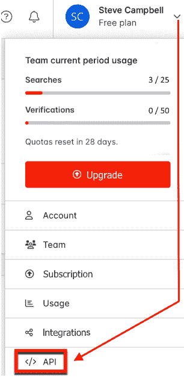

图 8.1 – 从 hunter.io 菜单中选择 API

在这个页面上，你会找到各种类型 API 搜索的示例命令。在 **域名搜索** 下，点击 **复制** 按钮。在你的终端中输入以下命令，用你自己的 API 密钥替换 `[redacted]`：

```
 $ curl https://api.hunter.io/v2/domain-search\?domain=stripe.com\&api_key=[redacted] > employees.txt
```

在 URL 中，你可以看到 `domain=stripe.com` 。显然，你会想要将域名更改为符合你的目标。

重要

本文中仅以 Stripe 作为示例，因为 [hunter.io](http://hunter.io) 网站的 API 页面中包含了它作为示例。如果没有书面许可，请不要攻击任何人。这不仅是非法和不道德的，而且当你被抓到时，你可能最终会坐牢。

接下来，`cat` 文本文件到终端，这样我们就可以查看输出格式。JSON 数据的第一级是 `data` ，如下图所示：

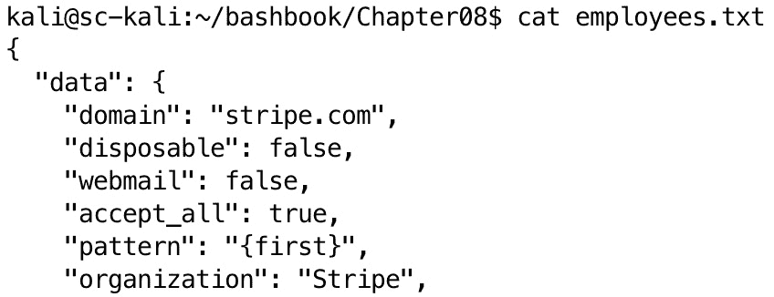

图 8.2 – JSON 第一级数据

最简单的 `jq` 过滤器是 `jq .` 。这个过滤器将输入作为输出产生相同的值。我们想要访问的数据是嵌套在 `data` 下面的。因此，我们的 `jq` 查询将以 `.data[]` 开头。输入以下命令并查看包含在 `data` 中的所有内容的输出，`cat employees.txt | jq -r '.data[]'` 。`-r` 参数只是告诉 `jq` 输出原始数据，不带转义和引号。

如果你查看嵌套在`data`下的信息，你会发现员工的电子邮件地址、姓名和职位被嵌套在`emails`下。基于我们之前的查询，接下来的命令将是`cat employees.txt | jq -r '.data.emails[]'`。你注意到这里有什么规律吗？当你想通过`jq`访问嵌套数据时，首先使用`.`符号并指定你要访问的第一个字段，然后使用方括号`.first_level[]`。如果你想访问更深一层的嵌套数据，则使用`.first_level.second_level[]`。在这个特定的例子中，我们想访问`value`（电子邮件地址）、`first_name`、`last_name`和`position`字段，这些字段嵌套在`.data.emails[]`下。因此，我们的`jq`查询将是`.data.emails[] | [.value, .first_name, .last_name, .position]`，如下面的图所示：

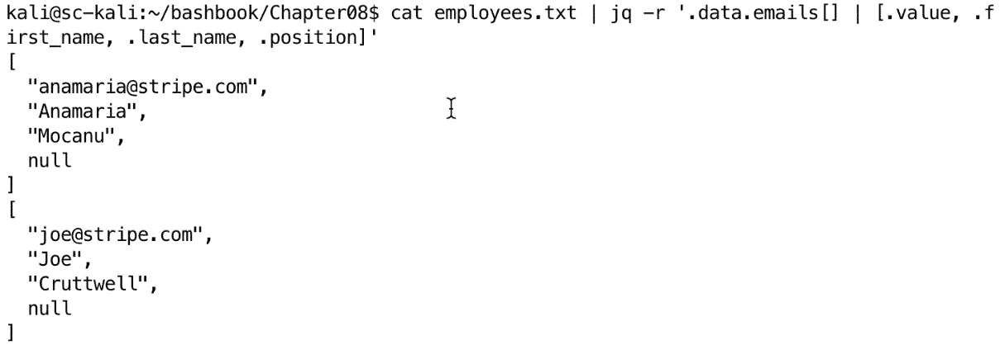

图 8.3 – 我们的 jq 查询访问电子邮件地址和员工信息

现在我们已经获得了所需的信息，接下来的步骤是将其转化为更易于操作的格式，例如**制表符分隔值**（**TSV**）。让我们查阅`jq`的手册，看看如何进行这种转换。在终端输入`man jq`命令。`jq`程序有很多选项，但如果你继续滚动，你会找到一个名为**格式字符串和转义**的部分。在这一部分，我们发现**逗号分隔值**（**CSV**）和 TSV 分别对应`@csv`和`@tsv`。现在只需要将之前的查询管道传送到`@tsv`，如下面的图所示。确保你的管道符号和`@tsv`都被单引号包围：

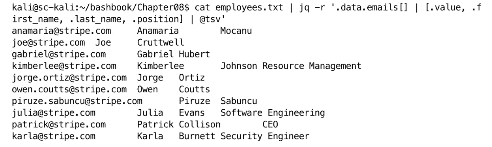

图 8.4 – 我们的最终 jq 查询提取了所需的数据

如果我们有权限并且想要使用这些数据进行密码喷洒攻击网站的登录表单，我们可以推测，他们的内部 Active Directory 域用户账户很可能与电子邮件地址中`@stripe.com`之前的部分相同。然而，作为一名渗透测试员，你需要知道如何将名字和姓氏转换为不同的格式，例如`first.last`、`f.last`、`first_last`等。注意在*图 8* *4* 中，名字和姓氏分别位于第 2 列和第 3 列。让我们创建一个简单的单行脚本，基于之前的命令，将名字和姓氏格式化为名字的首字母加姓氏：

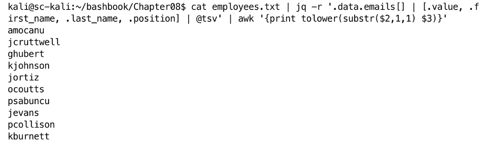

图 8.5 – 将用户名格式化为名字首字母+姓氏

这里是`awk`命令的完整解释（使用单引号）：

+   `awk 'pattern {action}'`：你可能还记得在 *第四章* 中，`awk` 命令的格式是模式和动作。模式是可选的，动作是必须的。

+   `print tolower()`：这可能是显而易见的。它将输出打印为全小写。在这个 `awk` 函数内部，我们打印 `first_name`（第二个字段或 **$2**）的第一个字母，后跟 `last_name`（第三个字段或 **$3**）。

+   `(substr($2,1,1)`：在这里，我们正在对数据进行子字符串操作，数据由第二个字段（**$2**）组成，`first_name`，从第一个字符开始，结束于第一个字符（**1,1**）。如果我们想使用名字的前两个字符，`substr` 命令应该是 `substr($2,1,2)`。

如果你想将用户名打印为 `first_last`，可以使用 `awk '{print tolower($1 "_" $2)}'` 命令，在名字和姓氏之间插入特定字符。

作为渗透测试员，你应该始终使用合适的工具来完成任务。在你职业生涯的早期，你更可能使用别人开发的工具。这些工具通常是用 Python 或 C 语言编写的。在进行 OSINT（开放源信息收集）时，许多工具是用 Python 编写的。不管你使用哪个工具，或者它是用什么语言写的，最终你都会需要过滤和格式化从工具中输入或输出的数据。正是这一章的概念将为你节省大量时间。

在下一节中，我们将探索如何使用 Bash 进行 DNS 枚举以发现目标。

# 使用 Bash 进行 DNS 枚举

作为渗透测试员，你通常会得到一个定义好的范围。范围就是你被允许测试的内容。通常它会以 IP 地址、网络地址、域名、URL 或这些的组合形式提供给你。另一方面，你也可能需要发现公司拥有的资产。

在我作为渗透测试员的早期阶段，在我开始做咨询工作之前，我花了大量时间进行 DNS 枚举，发现属于某个全球公司并收购了许多小公司的新资产。我花了几个月的时间发现我们收购的公司的 IP 地址、应用程序和域名。

首先，确保我们在域名术语上达成一致非常重要。我们需要快速了解顶级域名、根域名和子域名之间的区别。我将使用 `www.example.com` 作为这个例子的域名：

+   `com`：这是 **顶级域名**（**TLD**）。

+   `example`：这是根域名

+   `www`：这是子域名

在澄清术语之后，让我们看看如何发现与已知根域名相关的其他根域名的方法。

## 使用 Bash 扩展范围

本节内容专注于从公司的域名开始，发现暴露在互联网上的相关资产。

许多公司使用 Microsoft 365。如果公司已注册为拥有`Microsoft Defender for Identity`（**MDI**）的 Microsoft 租户，则以下脚本将发现租户名称并枚举所有在同一租户下注册的域。这是从简单域名开始，发现同一实体所有相关域名的有效方法。

脚本需要一个域名作为输入。你可以在本章的文件夹中找到它，GitHub 仓库中的文件名是`ch08_check_mdi.sh`。我将把代码分成更小的块，以便逐步解释每个部分。在阅读以下代码描述时，打开 GitHub 中的脚本进行对比将非常有帮助：

```
 #!/usr/bin/env bash
get_domains() {
```

在前面的代码中，我们从熟悉的`shebang`开始，后面跟着`get_domains`函数的开头部分。

在这里，我们从第一个命令行参数创建一个`domain`变量：

```
 domain=$1
```

在以下代码块中，我们创建了 HTTP 请求的 XML 主体，如下所示：

```
 body="<?xml version=\"1.0\" encoding=\"utf-8\"?>
    <soap:Envelope xmlns:exm=\"http://schemas.microsoft.com/exchange/services/2006/messages\"
        xmlns:ext=\"http://schemas.microsoft.com/exchange/services/2006/types\"
        xmlns:a=\"http://www.w3.org/2005/08/addressing\"
        xmlns:soap=\"http://schemas.xmlsoap.org/soap/envelope/\"
        xmlns:xsi=\"http://www.w3.org/2001/XMLSchema-instance\" xmlns:xsd=\"http://www.w3.org/2001/XMLSchema\">
    <soap:Header>
        <a:RequestedServerVersion>Exchange2010</a:RequestedServerVersion>
        <a:MessageID>urn:uuid:6389558d-9e05-465e-ade9-aae14c4bcd10</a:MessageID>
        <a:Action soap:mustUnderstand=\"1\">http://schemas.microsoft.com/exchange/2010/Autodiscover/Autodiscover/GetFederationInformation</a:Action>
        <a:To soap:mustUnderstand=\"1\">https://autodiscover.byfcxu-dom.extest.microsoft.com/autodiscover/autodiscover.svc</a:To>
        <a:ReplyTo>
        <a:Address>http://www.w3.org/2005/08/addressing/anonymous</a:Address>
        </a:ReplyTo>
    </soap:Header>
    <soap:Body>
        <GetFederationInformationRequestMessage xmlns=\"http://schemas.microsoft.com/exchange/2010/Autodiscover\">
        <Request>
            <Domain>${domain}</Domain>
        </Request>
        </GetFederationInformationRequestMessage>
    </soap:Body>
    </soap:Envelope>"
```

在前面的代码中，我使用输入域`$1`创建了`Simple Object Access Protocol`（**SOAP**）请求主体。

在以下代码中，我使用命令扩展（**$()**）通过`curl`执行 HTTP `POST`请求，并将响应存储在`response`变量中：

```
 response=$(curl -s -X POST -H "Content-type: text/xml; charset=utf-8" -H "User-agent: AutodiscoverClient" -d "$body" "https://autodiscover-s.outlook.com/autodiscover/autodiscover.svc")
```

包含 SOAP 请求主体的`body`变量在`POST`数据中被展开。请求被发送到 Microsoft 365 的自动发现服务。

以下代码检查响应是否为空（`-z`，零长度），如果是则退出。非零的`exit`代码表示进程以错误终止。

```
 if [[ -z "$response" ]]; then
        echo "[-] Unable to execute request. Wrong domain?"         exit 1
    fi
```

以下代码使用`xmllint`应用程序解析 XML 响应，提取域名并将结果存储在`domains`变量中：

```
 domains=$(echo "$response" | xmllint --xpath '//*[local-name()="Domain"]/text()' -)
```

以下代码在响应中未找到任何域时退出：

```
 if [[ -z "$domains" ]]; then
        echo "[-] No domains found."         exit 1
    fi
```

在以下代码中，我们打印出找到的域名：

```
 echo -e "\n[+] Domains found:"
    echo "$domains" | tr ' ' '\n'
```

`tr`命令将第一个值替换为第二个值；在这种情况下，空格`' '`被替换为换行符`'\n'`。

以下代码从找到的域中提取租户名称：

```
 tenant=$(echo "$domains" | tr ' ' '\n' | grep "onmicrosoft.com" | head -n 1 | cut -d'.' -f1)
```

`tenant`变量被赋值为将`domains`变量中的空格替换为换行符（**tr ' ' '\n'**）后的结果。然后，它通过`grep`查找包含`onmicrosoft.com`的任何行。该数据被传递给`head -n 1`，选取第一行数据，然后将结果传递给`cut`命令，基本上是通过句点字符分割数据并选择第一个字段。

以下代码在未找到租户时退出：

```
 if [[ -z "$tenant" ]]; then
        echo "[-] No tenant found."         exit 1
    fi
```

以下代码打印找到的租户名称：

```
 echo -e "\n[+] Tenant found: \n${tenant}"
```

以下代码调用`check_mdi`函数，并传入租户名称。闭括号结束`get_domains`函数。

```
 check_mdi "$tenant"
}
```

在以下代码中，我声明了`check_mdi`函数以识别 MDI 使用情况：

```
 check_mdi() {
```

以下代码将 MDI 域名后缀追加到租户名称中：

```
 tenant="$1.atp.azure.com"
```

以下代码运行`dig`命令检查租户域名是否存在 MDI 实例：

```
 if dig "$tenant" +short; then
        echo -e "\n[+] An MDI instance was found for ${tenant}!\n"
    else
        echo -e "\n[-] No MDI instance was found for ${tenant}\n"
    fi
}
```

如果找到 MDI 实例，它将打印一条正面消息。如果没有找到 MDI 实例，则打印一条负面消息。闭合大括号标志着`check_mdi`函数的结束。

以下代码检查是否提供了正确数量的参数，并且第一个参数是否为`-d`。逻辑**或**（**||**）操作意味着如果命令行参数的数量不等于两个，或者第一个参数不等于`-d`，则打印用法横幅并退出。

```
 if [[ $# -ne 2 || $1 != "-d" ]]; then
    # Print the usage information if the arguments are incorrect
    echo "Usage: $0 -d <domain>"
    exit 1
fi
```

以下代码声明了用户输入的`domain`参数。

```
 domain=$2
```

以下代码调用`get_domains`函数，并传入提供的域名。

```
 get_domains "$domain"
```

如果你使用一个知名的域名运行此脚本，你将在输出中发现一个不太为人所知的域名。实质上，这个脚本帮助你交叉参考由同一实体拥有的域名：

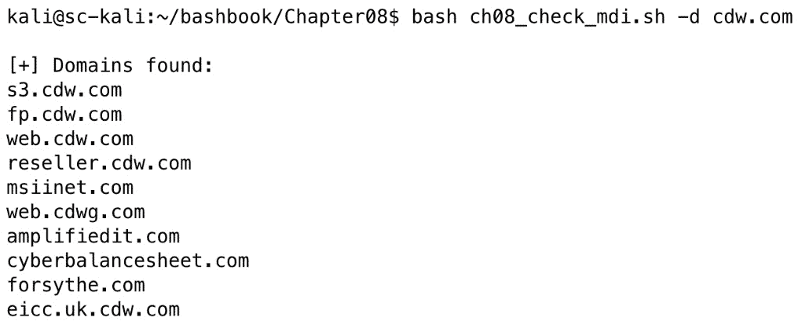

图 8.6 – 在 cdw.com 域上运行 check_mdi

上图中的脚本输出展示了我们的 Bash 脚本如何发现与目标域名相关的多个子域，从而大大扩展了我们的目标足迹。

## 使用 Bash 自动化子域名枚举

接下来，我将分享一些我保存在`.bashrc`文件中的 Bash 函数。我在外部渗透测试中使用这些函数，以便在进行端口和漏洞扫描之前，快速执行一些常见的侦察任务。首先，我会将代码分成小部分列出，并在过程中进行解释。最后，我将展示如何将这些函数结合使用，以枚举 DNS 及其输出。

第一个函数名为`mdi`，你已经在本章前面展示的`ch08_check_mdi.sh`脚本中见过它。我将只包括与`ch08_check_mdi.sh`中不同的部分。示例代码可以在 GitHub 代码库本章文件夹中的`ch08_mdi_function.sh`文件中找到：

```
 mdi() {
    # This function takes a domain as input and checks MDI and returns domains using the same tenant.     while IFS= read -r line; do
        body="<?xml version=\"1.0\" encoding=\"utf-8\"?>
```

在前面的代码中，我首先声明了一个名为`mdi`的函数。我将所有先前的代码嵌套在一个`while`循环内，该循环从标准输入（**stdin**）读取。这是读取管道输入所必需的，允许我们在函数之间传递数据。`IFS=`代码用于保留换行符，这在输入包含多行时是必需的。你可以将单个域名或以换行分隔的域名列表传递给此函数。

下一个函数是`rootdomain`。这个函数接受一个子域作为输入，并返回根域名。例如，如果你提供输入`www.example.com`，输出将是`example.com`。此函数用于从子域名中提取根域名，之后我可以将其发送给其他函数以查找更多子域。示例代码可以在 GitHub 代码库本章文件夹中的`ch08_rootdomain_function.sh`文件中找到：

```
 rootdomain() {
    # This function takes a subdomain as input and returns the root domain.
```

在前面的代码中，我首先声明了函数名称，接着是一个注释，解释了脚本的目的、输入和输出。

```
 while IFS= read -r line; do
```

这一行开始了一个 `while` 循环，逐行读取输入。`IFS=` 将 `internal field separator` 设置为空，以防止去除前后空格。`read -r` 从标准输入读取一行并将其存入变量 line 中。

```
 echo "$line" | awk -F. '
```

这一行回显当前行（子域名）并将其传递给 `awk`。`-F.` 选项告诉 `awk` 使用句点（**.**）作为字段分隔符。

```
 {
```

这开启了 `awk` 脚本的代码块。

```
 n = split($0, parts, ".");
```

这一行将当前行（**$0**）按句点（**.**）分隔成一个名为 `parts` 的数组。`n` 变量存储数组中的元素个数。

```
 if (n >= 3 && (parts[n-1] ~ /^(com|net|org|co|gov|edu|mil|int)$/ && parts[n] ~ /^[a-z]{2}$/)) {
```

该条件检查域名是否至少包含三个部分，并且倒数第二部分是否匹配常见的二级域名（例如 `com`，`net`，`org`，`co`，`gov`，`edu`，`mil` 或 **int**），后面跟着一个两位数的国家代码（例如 `uk`，`us` 或 **de**）。

```
 print parts[n-2] "." parts[n-1] "." parts[n];
```

如果条件为真，这一行会打印根域名，它由倒数第三、倒数第二和最后一部分组成。

```
 } else if (n >= 2) {
```

该条件检查域名是否至少包含两个部分（例如 **example.com**）。

```
 print parts[n-1] "." parts[n];
```

如果条件为真，这一行会打印根域名，它由数组的倒数第二部分和最后一部分组成。

```
 } else {
                    print $0;
```

如果没有满足上述条件（例如，输入的是单标签域名），这一行会打印原始输入。

```
 }
            }'
```

上述代码关闭了 `if` 块，然后关闭了 `awk` 块。请注意，当花括号关闭 `if` 块时，并没有像 Bash `if` 语句那样出现 `fi` 关键字。`awk` 对 `if` 块的语法稍有不同。

```
 done
```

这关闭了 `while` 循环。

```
 }
```

这个括号关闭了函数。

`resolve` 函数以域名为输入并返回一个 IP 地址。示例代码可以在本章文件夹中的 `ch08_resolve_function.sh` 文件中找到，该文件位于 GitHub 仓库中。

```
 resolve() {
    # This function takes a domain as input and returns the IP address.
```

这段代码是函数的开始，并包含一个注释，描述了函数的作用：它接受一个域名作为输入并返回其对应的 IP 地址。

```
 while IFS= read -r line; do
```

这一行开始了一个 `while` 循环，逐行读取输入。`IFS=` 将内部字段分隔符设置为空，以防止去除前后空格。`read -r` 从标准输入读取一行并将其存入变量 line 中。

```
 dig +short "$line" | grep -E '^[0-9]+\.[0-9]+\.[0-9]+\.[0-9]+$' | head -n 1
```

`dig` 是一个 DNS 查询工具。`+short` 选项使输出简洁，仅打印 IP 地址或 CNAME 记录。`$line` 是从输入中读取的域名。

```
 done
    return 0
}
```

`done` 关闭了 `while` 循环的 `do` 块。`return 0` 表示脚本成功完成，并向调用脚本或函数返回状态。

`org` 函数以 IP 地址为输入，并返回在 Whois 输出中找到的 `OrgName` 值。此信息告诉我们谁拥有该网络。示例代码可以在本章文件夹中的 `ch08_org_function.sh` 文件中找到，该文件位于 GitHub 仓库中：

```
 org() {
    # This function takes an IP address as input and returns the organization name that owns the IP block.     while IFS= read -r line; do
        whois "$line" | grep OrgName | tr -s ' ' | cut -d ' ' -f 2-
    done
}
```

从函数的开始到`while`循环的开始，几乎与之前的脚本相同。以`whois`开头的行使用输入到函数中的 IP 地址运行`whois`命令，接着使用`grep`查找包含`OrgName`的行，运行`tr -s ' '`命令将多个空格压缩为一个空格，然后将输出传递给`cut`命令，指定空格为分隔符并选择第二个字段直到输入的末尾。`tr`程序非常适合将多个空格压缩为一个空格，但你也可以用它来将一个字符替换为另一个字符。`cut`程序指定分隔符（**-d**），后跟要切割的字段。

最后一个函数将其他函数结合在一起。它执行域名和子域名枚举，并打印子域名、IP 地址和`OrgName`。如果输入的域名是包含 MDI 的 Microsoft 365 租户的一部分，它还将查找任何相关的根域并枚举它们的子域名。这将显著增强子域名发现的能力。我单独使用 Chaos API 测试了一个特定的域名，它返回了 553 个活动子域名。当我运行这个函数并使用 MDI 结果将范围扩展到由同一家公司托管的相关域时，它返回了 3,682 个活动子域名。

示例代码可以在本章文件夹中的`ch08_dnsrecon_function.sh`文件中找到，文件位于 GitHub 仓库中。该脚本需要一个 ProjectDiscovery Chaos API 密钥（[`chaos.projectdiscovery.io/`](https://chaos.projectdiscovery.io/)），该密钥可以在写作时免费获取。Chaos 是我找到的最完整的 DNS 数据源：

```
 dnsrecon() {
    # Check if the correct number of arguments is provided
    if [[ $# -ne 1 ]]; then
        echo "You didn't provide a domain as input."         echo "Usage: $0 [domain]"
        exit 1
    fi
```

如果没有包含一个命令行参数，则打印用法信息并退出。

```
 if [[ -z "$CHAOS_KEY" ]]; then
        echo "No chaos API key found. Set env CHAOS_KEY."         exit 1
    fi
```

检查是否在环境变量中设置了 Chaos API 密钥。你应该在你的`.bashrc`文件中有一行看起来像`CHAOS_KEY=[key value]`。在你编辑`.bashrc`文件以添加 API 密钥后，你需要使用`source ~/.bashrc`命令使其生效。

```
 local domain=$1
    local domains=''
    local roots=''
```

在这里，我声明了局部变量。虽然不严格要求在使用之前声明变量，但我根据个人偏好这么做。将变量声明为`local`可以确保它们的作用范围仅限于定义它们的函数，这有助于避免与全局变量或其他函数中的变量发生潜在冲突。当变量位于`.bashrc`文件中的函数时，这一点尤其重要，以防与其他变量发生冲突，因为这些函数在你的 Bash shell 中对所有内容都可用。

```
 local mdi_result=$(mdi <<< "$domain")
```

这里，我将`domain`变量传递给`mdi`函数以获取相关域名列表。由于`mdi`函数设计为接受来自`stdin`的输入（**echo example.com | mdi**），而不是作为函数参数传递（**mdi example.com**），因此必须按照示例中所示的方式调用，并使用三个`<`字符。在 Bash 中，`<<<`是`here-string`运算符，用于将一个字符串直接传递给命令作为输入，而不是从文件或标准输入中读取。这个运算符基本上提供了一种快速将单行文本传递给命令的方式。

```
 if [[ -z "$mdi_result" ]]; then
        domains=$(chaos -silent -d "$domain")
```

如果`mdi`函数没有返回域名，将输入的域名直接传递给 Chaos API，并将输出赋值给`domains`变量。

```
 else
        echo "$mdi_result" | while IFS= read -r line; do
            root=$(rootdomain <<< "$line")
            chaos_domains=$(chaos -silent -d "$root")
            domains=$(echo -e "$domains\n$chaos_domains")
        done
```

这一部分将`mdi_result`变量的内容逐行传递给`do** / **done`块中的代码。每一行数据（一个域名）都传递给`rootdomain`函数。如果数据行是`www.example.com`，这个函数将返回`example.com`。然后，它将根域名传递给 Chaos API 调用，并将结果赋值给`chaos_domains`变量。最后，从 API 调用返回的子域名列表将附加到`domains`变量中的域名列表上。

```
 domains=$(echo "$domains" | grep . | grep -v \* | sort -u)
    fi
```

这段代码确保移除空行（`grep .`返回非空行），去除任何通配符域名（`grep -v \`*），然后去除重复项（**sort -u**）。

```
 echo "$domains" | while IFS= read -r line; do
```

这段代码将`domains`变量中的每一行数据传递给`do** / **done`代码块。`IFS=`部分确保行尾符号保持不变。

```
 ip=$(resolve <<< "$line")
        if [[ -z "$ip" ]]; then
            continue
        fi
```

这段代码将`domains`变量中的每个域名传递给`resolve`函数，后者返回一个 IP 地址并将其存储在`ip`变量中。如果`ip`变量为空（`-z`，域名无法解析为 IP 地址），则返回`true`，并且`continue`关键字将短路当前的循环迭代，跳到下一次迭代。

```
 orgname=$(org <<< "$ip")
        echo "$line;$ip;$orgname"
    done
}
```

如果域名成功解析为 IP 地址，数据将以`Domain;IP;Org`的格式输出。我选择使用分号作为字段分隔符，因为`org`值可能包含空格和逗号。

`dnsrecon`函数在命令行中以`dnsrecon example.com`的形式调用。以下是输出示例：

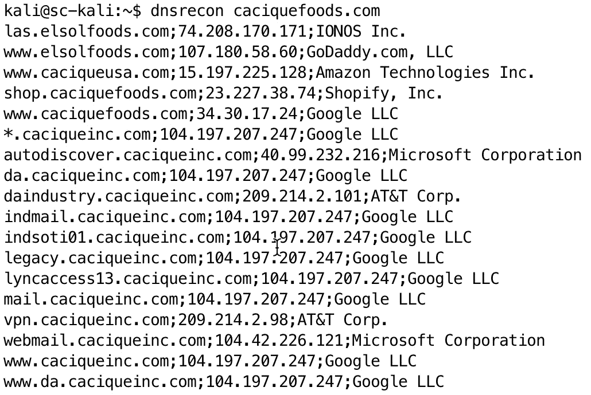

图 8.7 – dnsrecon 函数输出

上述图示中的输出显示我们的 Bash 脚本为我们提供了更多的目标，并包含了可以用来判断发现的域名是否在 IP 地址范围内的信息。

接下来，我们需要讨论 Web 应用程序如何使用域名来确定为网站访问者提供哪个应用程序。这对你的成功至关重要。

# 使用 Bash 识别 Web 应用程序

作为一名咨询渗透测试人员，如果你收到外部客户提供的 IP 或网络地址列表，你可能会养成只测试已定义的 IP 或网络地址，而没有进行足够的 OSINT 来发现所有域名的坏习惯。我在刚做渗透测试时也曾犯过这个错误，并且我也见过我指导的人这样做。之所以这样做不理想，是因为使用 IP 地址和域名访问网站时，Web 应用的行为是不同的。

托管多个应用程序的 Web 服务器、负载均衡器或反向代理，在 URL 或 HTTP `HOST` 头中使用 IP 地址时会返回默认站点。你可能不知道，实际上该 IP 地址上可能托管有其他网站，如果不进行 DNS 枚举并测试相关的域名，你绝对会错过发现易受攻击应用的机会。你可以在 [`portswigger.net/web-security/host-header`](https://portswigger.net/web-security/host-header) 上阅读更多关于 HTTP `HOST` 头的信息。

这里有一个相关的例子。OWASP Juice Shop 是一个故意设计的易受攻击网站。你可以在 [`demo.owasp-juice.shop/#/`](https://demo.owasp-juice.shop/#/) 找到一个例子。如果你 ping 测试这个主机名，你会看到以下内容：

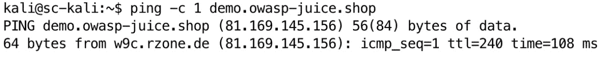

图 8.8 – Ping 测试 OWASP Juice Shop 演示

如果你收到了范围内的 IP 地址 `81.169.145.156` 并扫描了这个 IP 地址，但没有进行子域名枚举，你会在浏览器中访问该网站并看到 **未找到**：

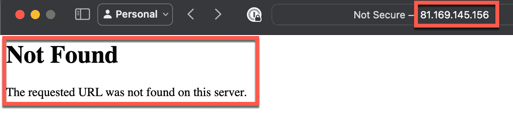

图 8.9 – 通过 IP 地址访问网站

在上图中，我为你高亮了相关部分。我通过 IP 地址请求了一个网页。你可能会看到这个响应并认为这个 IP 地址和端口并不有趣，便继续前进。然而，如果你访问该域名，你会看到以下网站，这个网站包含了许多漏洞：

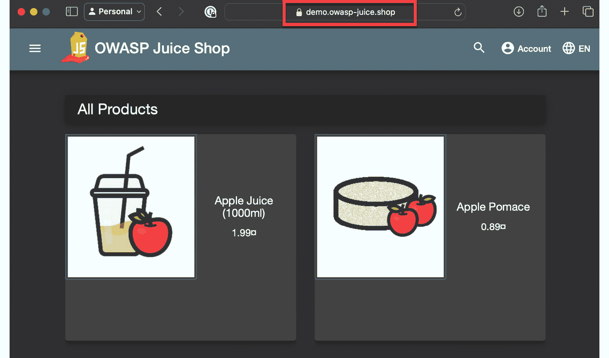

图 8.10 – OWASP Juice Shop，一个易受攻击的 Web 应用

在开始扫描你的范围内的 IP 地址或网络地址之前，先花时间使用接下来展示的工具和技术，彻底枚举 DNS。然后，将解析到范围内 IP 地址的发现域名附加到你的范围文件的末尾。我无法强调这一点有多重要。这可能是导致零漏洞渗透测试报告（更不用说客户因为你的疏忽而被攻破的风险）与发现高影响漏洞之间的差异。如果你仅仅将网络或 IP 地址列表粘贴到漏洞扫描器中，然后根据扫描结果认为没有什么可以利用的漏洞，那么你就会忽视那些可以被利用的漏洞。

现在你更好地理解了 Web 应用程序如何使用`HOST`头部，在下一节中，我们将探讨如何发现任何特定 IP 地址上的 Web 服务器所提供的应用程序根目录或子域。获得这些信息对于我们在扫描 IP 或网络地址时的成功至关重要。

## 使用 Bash 进行证书枚举

我进行过一次外部网络渗透测试，测试范围内有成千上万的活动 IP 地址。我遇到的一个问题是，我被分配了大块网络地址，需要从这些 IP 地址中发现主机名，才能正确地扫描 Web 服务器。还记得本章早些时候，我演示了当你通过 IP 地址和主机名请求网站时，你看到的网页可能会有所不同吗？

那些 IP 地址中的许多被解析为 DNS 中的随机子域，它们通常是作为代理服务器，位于服务器池前面。我们还知道客户在其网站前使用了**内容分发网络**（**CDN**），并且流量经过**Web 应用防火墙**（**WAF**）的过滤，阻止了扫描网站的尝试。此外，如果我们通过域名请求网站，域名会解析到一个位于 CDN 上的 IP 地址，而这些 CDN IP 地址不在攻击范围内，因此我们无法攻击它们。

幸运的是，客户没有过滤传入流量，只允许 CDN 提供商的源 IP 地址。此时，我需要做的是发现每个 IP 地址上托管的网站，然后覆盖 DNS，以便我可以手动将域名映射到 IP 地址。这将让我能够直接访问 Web 应用程序。我想出了一个巧妙的方法来发现这些 IP 地址上托管的网站，并同时绕过 CDN 的 WAF。我发现 Nuclei（[`github.com/projectdiscovery/nuclei`](https://github.com/projectdiscovery/nuclei)）漏洞扫描器有一个模板，可以用来发现与**传输层安全性**（**TLS**）证书相关的 DNS 名称。

TLS 证书是用于验证网站身份并启用加密连接的数字证书。它们包含证书持有者的信息、证书的公钥以及颁发**证书颁发机构**（**CA**）的数字签名。TLS **主题备用名称**（**SAN**）是 X.509 规范的一个扩展，它允许用户为单个 SSL/TLS 证书指定其他主机名。这意味着一个证书可以保护多个域名和子域，从而简化证书管理并降低成本。

Nuclei 漏洞扫描器有一个扫描模板，可以从数字证书中提取 TLS SAN。首先，我使用 Nuclei 扫描了活动 IP 地址列表。以下是使用 Nuclei `ssl-dns-names` 模板扫描一个在撰写时属于 Hyatt Hotels 漏洞奖励计划范围内的网络地址（[`hackerone.com/hyatt/policy_scopes`](https://hackerone.com/hyatt/policy_scopes) ）的示例：

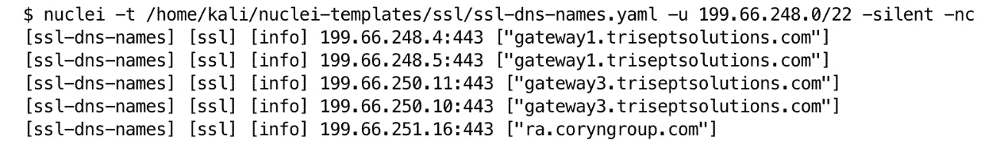

图 8.11 – 扫描网络中的 TLS 证书 SAN

确保在 *图 8.11* 中看到的 Nuclei 扫描命令中添加 `-o [filename]` 选项，以将输出保存到文件中。

现在我们有了这个输出，下一步是清理它并重新格式化为我们 `hosts` 文件的格式。`hosts` 文件是一个简单的文本文件，用于将主机名映射到 IP 地址。它是任何操作系统中网络堆栈的核心部分，包括 Linux。你可以通过输入 `cat /** **etc/hosts` 命令查看 `hosts` 文件的内容。

在继续之前，理解 DNS 在 `hosts` 文件中的工作原理非常重要。在 Linux 系统中，当你使用域名进行网络通信时，计算机必须将域名解析为 IP 地址。从最基本的层面来说，当你使用域名与其他主机进行网络通信时，第一步是计算机检查自己的主机名是否匹配。接下来，它会检查 `hosts` 文件中的条目。如果没有解析出主机名，它会与网络接口配置中的 DNS 服务器通信。本质上，在 `hosts` 文件中将域名硬编码到 IP 地址会覆盖 DNS。Microsoft Windows 也使用 `hosts` 文件来执行相同的操作，尽管它的位置不同。

以下截图显示了我在进行任何修改前的 `hosts` 文件内容：

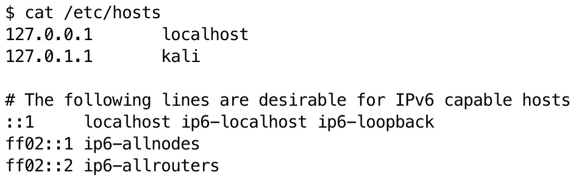

图 8.12 – 我的 /etc/hosts 文件内容

`hosts` 文件中的条目从新的一行开始，先是一个 IP 地址，接着是制表符或空格，最后是一个或多个域名。你可以使用制表符或空格，只要保持一致。现在你已经理解了 `hosts` 文件的结构，接下来我们将学习如何将 Nuclei 扫描的数据重新格式化，以便插入到我们的 `hosts` 文件中。

以下代码将文件名作为唯一的命令行参数，并输出你可以复制并粘贴到 `hosts` 文件中的行。代码进行了详细注释，解释了每个部分的功能。示例代码可以在本章 GitHub 仓库中的 `ch08_nuclei.sh` 文件中找到。我将把代码分成小块，逐一解释。打开 GitHub 上的脚本进行对照将会对理解以下代码叙述有所帮助：

```
 if [ "$#" -ne 1 ]; then
    echo "Converts Nuclei ssl-dns-names scan output to hosts file format"
    echo "Usage: $0 /path/to/file"
    exit 1
fi
```

如果命令行没有传递文件路径，则打印使用说明并中止。首先检查参数数量（**$#**）是否不等于（**-ne**）`1`。如果方括号中的条件为真，则回显脚本描述和使用示例并退出。

在以下代码中，我将文件内容通过管道传递给 cut 命令：

```
 cat "$1" | cut -d ' ' -f 4- | \
```

`cut` 命令使用空格作为分隔符，从第 4 个字段到行末。输出通过管道传递到下一个命令。行尾的反斜杠（**\**）将命令延续到下一行。

在以下代码中，多个（6 个） sed 命令通过分号分隔：

```
 sed 's/:443//;s/\[//g;s/\]//g;s/"//g;s/,/ /g;s/ \*\.[^ ]*//g' | \
```

+   仅系列 sed 命令的开始和结束部分用单引号括起来。

+   `s/:443//` ：从输入中移除字符串 `:443`。

+   `s/\[//g` ：从输入中移除所有 `[` 字符。末尾的 `g` 表示 *全局*，即它会对每行中的所有匹配项应用替换。

+   `s/\]//g` ：从输入中移除所有 `]` 字符（全局替换）。`]` 字符必须使用反斜杠进行转义（**\**）。

+   `s/"//g` ：从输入中移除所有双引号（**"**）字符（全局替换）。

+   `s/,/ /g` ：将所有逗号（**,**）字符替换为空格（全局替换）。

+   `s/ \*\.[^ ]*//g` ：此表达式通常移除通配符子域条目，如 `*.example.com`（全局替换）。它会移除任何空格后跟的 `*.`（已转义）以及任何非空格字符的序列。记住，在 *第四章* 中，`^` 字符可以有多种含义。在方括号外，它匹配单词或行的开头；在方括号内，它否定后续字符。在这种情况下，它表示 *不匹配空格*。

+   `| \` ：最终，生成的输出通过管道（**|**）传递到后续的 sort 命令。反斜杠（**\**）字符允许命令继续到下一行。

输入是唯一排序的（**-u**），如图所示：

```
 sort -u -k2 | \
```

数据根据第二个字段到行末进行排序（**-k2**）。如果我们不想对第二个字段到行末进行排序，而是仅对第二个字段进行排序，那么我们会使用 `-k2,2`。这些数字表示 *开始* 和 *结束* 字段，默认情况下，它们由空格分隔。

再次，输出通过管道传递到下一个命令，反斜杠将命令继续到下一行。

以下代码在初始化 `new_line` 变量为空字符串之前，启动了一个 `awk` 代码块：

```
 awk '{
    # Initialize new_line as an empty string
    new_line = ""
    for (i = 1; i <= NF; i++) {
```

在前面的代码的最后一行，我们在 `awk` 代码块内启动一个 for 循环，遍历当前记录中的所有字段。以下是该行的拆解：

+   `i = 1` ：初始化 `i` 变量为 `1`

+   `i <= NF` ：`i` 小于或等于字段的数量（**NF**）

+   `i++` ：递增 `i` 并重复循环

以下代码跳过任何通配符域名。通配符域名是指带有星号（*****）的域名：

```
 if ($i !~ /\*/) {
        new_line = new_line $i " "
    }
```

在上述代码中，如果`i`的当前值不包含星号（*****），则将其与空格连接到`new_line`。

```
 }
```

在上述代码中，右大括号（**}**）结束了`for`循环。

```
 sub(/[ \t]+$/, "", new_line)
```

上述代码行使用`sub`函数来修剪尾部的空格。`sub`的用法是`sub(regex, replacement, target)`。`target`值是可选的，如果不包含，则默认是整个当前记录（**$0**）。

```
 if (split(new_line, fields, " ") > 1) {
     print new_line
    }
}'
```

上述代码将`new_line`拆分成一个名为`fields`的数组，使用空格作为分隔符，然后仅在包含超过一列时打印新行。

这个脚本的输出如图所示。如果你将输出复制并粘贴到你的`hosts`文件中，它将在解析主机名时覆盖 DNS：

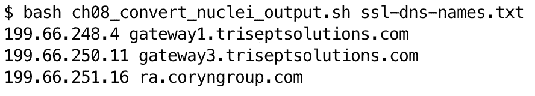

图 8.13 – ch08_nuclei_01.sh 脚本的输出

你可能会问，为什么我花这么多功夫去写一个脚本来创建三行，而不是直接复制粘贴。记住，这个练习最初是我在一次外部渗透测试中解决的一个挑战的例子，当时测试范围内有成千上万的活跃主机，脚本会打印出数百行，以便添加到我的`hosts`文件中。

将脚本输出添加到我的`hosts`文件后，当我扫描这些域名时，我可以确保这些名称解析到我选择的 IP 地址，而不是解析到一个由 WAF 保护的 CDN 的 IP 地址。

## 使用 Bash 格式化漏洞扫描目标

在前面的章节中，你已经学习了关于 HTTP `HOST`头部、TLS 证书 SAN 和`hosts`文件的内容。你还学习了如何解析 Nuclei 扫描报告并将数据格式化为可以在`hosts`文件中使用的形式。与此相关，你可能还需要说服你的漏洞扫描器在扫描目标时覆盖 DNS。

Nessus（[`www.tenable.com/products/nessus`](https://www.tenable.com/products/nessus)）是系统管理员和安全专业人员常用的漏洞扫描器。在同一次我需要覆盖 DNS 并将从 Nuclei 扫描中解析出的子域添加到`hosts`文件的渗透测试中，我也需要为 Nessus 扫描完成相同的任务。我最终了解到 Nessus 并不使用`hosts`文件来解析域名。然而，我确实学到 Nessus 允许你通过指定目标格式为`server1.example.com[192.168.1.1]`来覆盖 DNS。以下代码将获取`ch08_nuclei_01.sh`脚本的输出，并将其转换为 Nessus 格式。示例代码可以在本章节文件夹中的`ch08_nessus.sh`文件中找到，该文件位于 GitHub 仓库中：

```
 #!/usr/bin/env bash
if [ "$#" -ne 1 ]; then
    echo "This script is intended for use with Nuclei scan output from the ssl-dns-names template."     echo "The related Nuclei scan command is: nuclei -t \"$HOME/nuclei-templates/ssl/ssl-dns-names.yaml\" -nc -silent -u [IP or network address] -o [output file]"
    echo "Usage: $0 /path/to/file"
    exit 1
fi
```

这段代码简单地检查是否有正好一个命令行参数传递给脚本。如果没有传入一个参数，则打印用法并退出。任何非零的`exit`代码都视为错误。当你的脚本逻辑需要确定前一个命令或脚本是否成功执行后再运行下一个命令时，这一点非常重要。

```
 seen_hostnames=()
```

上面的代码创建了一个数组，用来跟踪唯一的主机名。

```
 while read -r line; do
```

上面的代码读取文件并处理每一行。

```
 ip=$(echo "$line" | cut -d ' ' -f 4 | cut -d ':' -f 1)
```

这段代码读取每一行输入，使用 `cut` 选择第四个字段，即 IP 地址。结果是一个由冒号分隔的 IP 地址和端口。最后的 `cut` 语句将两者分开，选择 IP 地址并将其赋值给 `ip` 变量。

```
 hostnames=$(echo "$line" | cut -d ' ' -f 5 | awk -F'[][]' '{print $2}')
```

这行代码将数据按空格分隔为字段，并选择第五个字段。然后选择方括号内的数据并将其赋值给 `hostnames` 变量。

```
 IFS=',' read -ra ADDR <<< "$hostnames"
```

这行代码将逗号设置为字段分隔符，并将每个主机名读取到 `ADDR` 数组中。

```
 for hostname in "${ADDR[@]}"; do
        # Remove leading and trailing whitespace
        hostname=$(echo "$hostname" | xargs)
```

这段代码移除主机名的前导和尾随空格。默认情况下，`xargs` 会修剪前导和尾随空白，并将任何空白字符序列减少为单个空格。

```
 if [[ "${hostname:0:1}" != "*" ]]; then
```

上面的代码检查主机名的第一个字符是否不是星号。

```
 if [[ ! " ${seen_hostnames[@]} " =~ " ${hostname} " ]]; then
```

这段代码检查`hostname`变量的值是否不存在于`seen_hostnames`数组中。

```
 seen_hostnames+=("$hostname")
```

这段代码如果前面的 `if` 语句评估为 `true`（`hostname` 变量值不在 `seen_hostnames` 数组中），则将主机名添加到 `seen_hostnames` 数组中。

```
 echo "$hostname[$ip]"
            fi
        fi
    done
done < "$1"
```

这段代码打印所需格式的主机名和 IP，然后关闭 `if** / **fi` 和 `do** / **done` 代码块。`done < "$1"` 代码将命令行参数作为输入传递给代码块。

该脚本的输出可以复制到 Nessus 扫描目标列表中，输出如图所示：

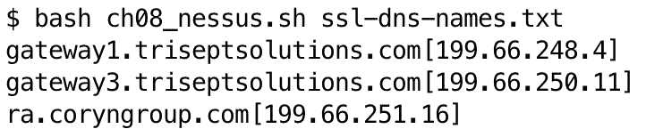

图 8.14 – Nessus 脚本的输出

这将允许你让 Nessus 覆盖 DNS，通过解析到你指定的 IP 地址的主机名进行扫描。

# 总结

在本章中，你了解了侦察和信息收集的关键阶段，重点讲解了如何发现目标组织拥有的各种资产。本章为你提供了使用 Bash 脚本进行彻底侦察的知识和工具，为后续的主动评估阶段奠定了基础。

基于本章所学的侦查技能，*第九章*将引导你了解如何在网页应用渗透测试中应用 Bash 脚本。由于网页应用通常是由于其可访问性和潜在漏洞而成为关键目标，本章将重点介绍使用 Bash 及相关工具识别、利用和记录网页应用中的安全弱点的各种技术。
