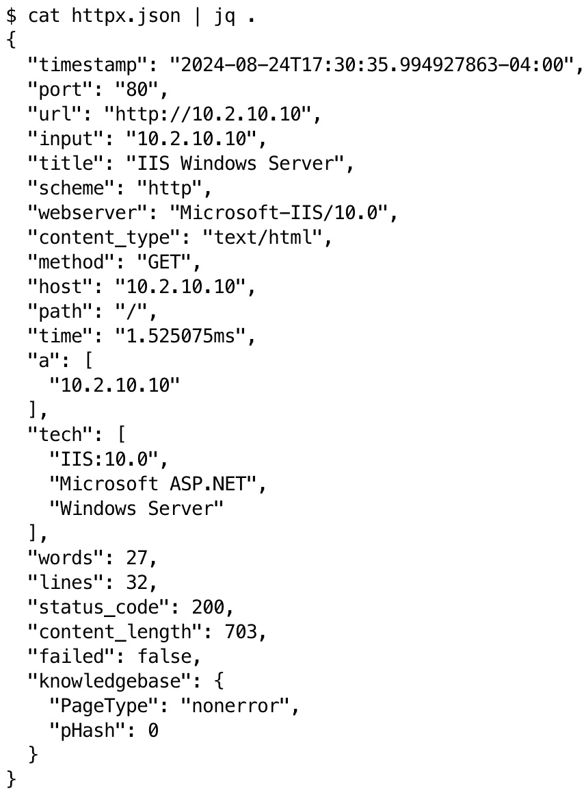

# 第十三章：使用 Bash 进行渗透测试报告

在本章中，我们将探讨 Bash 如何在简化渗透测试报告阶段中发挥作用。正如安全专家所知，最终报告是一个关键的交付物，它向利益相关者传达发现、风险和建议。然而，编写这些报告可能非常耗时，并且容易出现不一致的情况。我们将讨论 Bash 脚本如何自动化并增强报告过程中的各个方面，从数据收集到报告生成。

在本章中，我们将讨论从工具输出中自动提取数据、生成初步报告以及将 Bash 与其他报告工具集成的技术。你将学习如何创建可以解析原始数据并填充报告模板的脚本。

本章结束时，你将掌握使用 Bash 创建高效、准确和专业的渗透测试报告的基础。这些技能不仅能节省时间，还能提高交付物的质量和一致性，让你能更多地专注于分析，而不是手动编写报告。

在本章中，我们将涵盖以下主要内容：

+   使用 Bash 自动化数据收集进行报告

+   使用 SQLite 存储和管理渗透测试数据

+   将 Bash 与报告工具集成

# 技术要求

本章的代码可以在[`github.com/PacktPublishing/Bash-Shell-Scripting-for-Pentesters/tree/main/Chapter13`](https://github.com/PacktPublishing/Bash-Shell-Scripting-for-Pentesters/tree/main/Chapter13)找到。

在你的 Kali Linux 系统上输入以下命令来安装先决条件：

```
 $ sudo apt install libxml2-utils jq sqlite3 texlive-base xmlstarlet
```

以下命令假设你已安装 Go。请参见[`go.dev/doc/install`](https://go.dev/doc/install)：

```
 $ go install -v github.com/projectdiscovery/httpx/cmd/httpx@latest
$ go install -v github.com/projectdiscovery/mapcidr/cmd/mapcidr@latest
```

在完成先决条件后，正式进入报告环节，这是每个渗透测试人员最喜欢的话题！

# 使用 Bash 自动化数据收集进行报告

高效的数据收集是有效渗透测试报告的支柱。本节将探讨如何利用 Bash 脚本自动化从渗透测试的各个阶段收集和组织关键信息。

通过自动化数据收集，渗透测试人员可以做到以下几点：

+   减少数据收集中的人工错误

+   标准化收集信息的格式

+   节省重复数据提取任务的时间

+   确保多个测试和报告的一致性

我们将研究识别关键数据点、从工具输出中提取信息、清理原始数据、将数据存储在数据库中以及报告模板化的技术。这些方法将帮助简化报告过程，让测试人员能更多地专注于分析，而不是数据管理。

让我们从使用 Bash 识别和提取渗透测试报告中最相关的数据开始。

## 识别关键数据点

**关键数据点**是提供测试发现、漏洞以及目标系统或网络整体安全态势的全面概述的必要信息。这些数据点构成了有效渗透测试报告的核心。

关键数据点通常包括以下内容：

+   **高层摘要数据**：

    +   按严重性分类的漏洞总数

    +   关键发现和关键问题

    +   总体风险评级

+   **合规信息**：

    +   相关的合规性标准（例如，PCI DSS 和 HIPAA）

    +   特定的合规性违规或差距

+   **测试元数据**：

    +   测试的日期和持续时间

    +   评估范围

    +   测试者信息

    +   评估过程中使用的工具

+   **成功的攻击` `或利用**：

    +   成功渗透尝试的描述

    +   访问或外泄的数据

    +   潜在的现实世界后果

+   **漏洞信息**：

    +   漏洞名称和描述

    +   严重性评级（例如，关键、高、中或低）

    +   **常见漏洞评分系统**（**CVSS**）评分

    +   受影响的系统或组件

+   **技术细节**：

    +   受影响系统的 IP 地址和主机名

    +   端口号和运行的服务

    +   软件版本和补丁级别

    +   漏洞利用方法或概念验证

+   **风险评估**：

    +   每个漏洞的潜在影响

    +   漏洞被利用的可能性

    +   业务影响分析

+   **测试文档**：

    +   漏洞或利用的截图

    +   日志文件摘录

    +   工具的命令输出

+   **修复信息**：

    +   推荐的修复或缓解措施

    +   修复的优先级

    +   修复所需的估计努力

## 使用 Bash 解析和清理原始数据

渗透测试工具的主要报告输出格式包括纯文本文件（**.txt**）、**逗号分隔值**（**CSV**）、**可扩展标记语言**（**XML**）和**JavaScript 对象表示法**（**JSON**）。由于纯文本输出没有特定的格式，因此本节不会涵盖，您之前在*第四章*中学习的正则表达式足以应对。本节将包括解析其他数据格式的策略。

让我们从 CSV 数据开始。Bash 工具箱中解析表格数据的最佳工具无疑是`awk`。`awk`的基本语法如下：

```
 awk 'pattern {action}' input_file
```

请注意以下几点：

+   `pattern` 是一个可选的匹配条件。

+   `action` 是当模式匹配时要执行的操作。

+   `input_file` 是要处理的文件。

当然，如果你正在通过管道（**|**）传输数据，你可以移除`input_file`变量，因为 awk 可以从`stdin`或输入文件接受数据。

假设我们有一个名为`scan_results.csv`的 CSV 文件。你可以在本章的 GitHub 仓库中找到这个文件：

```
 IP,Hostname,Port,Service,Version
192.168.1.1,gateway,80,http,Apache 2.4.41
192.168.1.10,webserver,443,https,nginx 1.18.0
192.168.1.20,database,3306,mysql,MySQL 5.7.32
192.168.1.30,fileserver,22,ssh,OpenSSH 8.2p1
```

这是提取 IP 和端口列的方法：

```
 awk -F',' '{print $1 "," $3}' nmap_results.csv
```

这是输出：

```
 IP,Port
192.168.1.1,80
192.168.1.10,443
192.168.1.20,3306
192.168.1.30,22
```

解释如下：

+   `-F','` 将字段分隔符设置为逗号。

+   `$1`和`$3`分别指代第一和第三个字段。

+   `","` 在 `$1` 和 `$3` 字段之间打印一个逗号。

这是如何仅显示具有开放 Web 端口（ `80` 或 `443` ）的条目：

```
 awk -F',' '$3 == 80 || $3 == 443 {print $1 "," $2 "," $3}' nmap_results.csv
```

输出如下：

```
 192.168.1.1,gateway,80
192.168.1.10,webserver,443
```

要为我们的输出添加头部和尾部，请执行以下操作：

```
 awk -F',' 'BEGIN {print "Open Web Servers:"} $3 == 80 || $3 == 443 {print $1 "," $2 "," $3} END {print "End of list"}' nmap_results.csv
```

这是最终的输出：

```
 Open Web Servers:
192.168.1.1,gateway,80
192.168.1.10,webserver,443
End of list
```

由于我们这里添加了一些新内容，让我们回顾一下这个解释：

+   AWK 模式是 `awk 'pattern {** **action}' input_file` 。

+   模式是 `$3 == 80 || $3 ==** **443` 。

+   操作是 `{print $1 "," $2 "," $3}` 。

+   `BEGIN` 代码打印 **开放的 Web 服务器：** 并在模式之前执行。

+   `END` 代码打印 **列表结束** 并在操作之后执行。

让我们通过一个例子来看如何计算统计数据。假设我们有一个带有严重性级别的 `vulnerability_scan.csv` 文件：

```
 IP,Vulnerability,Severity
192.168.1.1,SQL Injection,High
192.168.1.1,XSS,Medium
192.168.1.10,Outdated SSL,Low
192.168.1.20,Weak Password,High
192.168.1.30,Information Disclosure,Medium
```

这是如何按严重性统计漏洞的：

```
 awk -F',' 'NR>1 {gsub(/\r/,""); if($3!="") count[$3]++} END {for (severity in count) print severity ": " count[severity]}' vulnerability_scan.csv
```

这是输出结果：

```
 Low: 1
Medium: 2
High: 2
```

这是解释：

+   `-F','` ：这个选项将字段分隔符设置为逗号。该选项告诉 awk 使用逗号作为分隔符来拆分每一行。

+   `'...'` ：单引号中包含了 awk 程序本身。

+   `NR>1` ：这个条件检查当前记录（行）的编号是否大于 1。它有效地跳过了 CSV 文件的第一行（表头）。

+   `{...}` ：这个块包含了针对每一行满足 `NR>1` 条件的主要处理逻辑。

+   `gsub(/\r/,"")` ：这个函数全局替换（**gsub**）所有的回车符（**\r**）为空字符串，有效地将其从行中移除。这有助于处理可能的 Windows 风格行结束符。

+   `if($3!="")` ：这个条件检查第三个字段（严重性级别）是否为空。

+   `count[$3]++` ：如果条件为 `true` ，则会增加第三个字段中找到的严重性级别的计数。它使用一个名为 `count` 的关联数组，严重性级别作为键。

+   `END {...}` ：这个块指定在处理完所有行后要执行的操作。

+   `for (severity in count)` ：这个循环遍历 `count` 数组中存储的所有唯一严重性级别作为键。

+   `print severity ": " count[severity]` ：对于每个严重性级别，它会打印严重性后跟一个冒号和空格，然后是出现次数。

+   `vulnerability_scan.csv` ：这是 AWK 命令处理的输入文件。

总结一下，这条 AWK 命令读取 CSV 文件，跳过头部，移除回车符，计算每个非空严重性级别的出现次数，然后打印出这些计数的汇总。它设计时考虑了 Windows 行结束符和空字段等潜在问题，使其在处理实际的 CSV 数据时更加稳健。

在另一个例子中，我们可能需要合并多个文件。这里有另一个文件，`asset_info.csv` ：

```
 IP,Owner,Department
192.168.1.1,John,IT
192.168.1.10,Alice,Marketing
192.168.1.20,Bob,Finance
192.168.1.30,Carol,HR
```

我们可以将其与我们的漏洞数据结合使用：

```
 $ awk -F',' 'NR==FNR {owner[$1]=$2; dept[$1]=$3; next}{print $11 "," $2 "," $3 "," owner[$1] "," dept[$1]}' asset_info.csv vulnerability_scan.csv
```

这是最终的输出：

```
 IP,Vulnerability,Severity,Owner,Department
192.168.1.1,SQL Injection,High,John,IT
192.168.1.1,XSS,Medium,John,IT
192.168.1.10,Outdated SSL,Low,Alice,Marketing
192.168.1.20,Weak Password,High,Bob,Finance
192.168.1.30,Information Disclosure,Medium,Carol,HR
```

该脚本首先将`asset_info.csv`读取到内存中，然后处理`vulnerability_scan.csv`，为每一行添加所有者和部门信息。让我们来看一下这个解释：

+   `-F','` : 此选项将字段分隔符设置为逗号，适用于 CSV 文件。

+   `NR==FNR` : 此条件仅在处理第一个文件（**asset_info.csv**）时为真。`NR`是所有文件中的当前记录号，而`FNR`是当前文件中的记录号。

+   `{owner[$1]=$2; dept[$1]=$3; next}` : 该块在处理`asset_info.csv`时执行：

    +   `owner[$1]=$2` : 创建一个关联数组`owner`，其中键是第一个字段（资产 ID），值是第二个字段（所有者名称）。

    +   `dept[$1]=$3` : 创建一个关联数组`dept`，其中键是第一个字段，值是第三个字段（部门名称）。

    +   `next` : 跳过当前记录并继续执行脚本的下一条记录。

+   `{print $1 "," $2 "," $3 "," owner[$1] "," dept[$1]}` : 该块在处理`vulnerability_scan.csv`时执行：

    +   打印当前行的前三个字段，来自`vulnerability_scan.csv`。

    +   通过查找第一个字段（资产 ID）在`owner`和`dept`数组中的信息，添加所有者和部门信息。

+   `asset_info.csv vulnerability_scan.csv` : 这些是输入文件。首先处理`asset_info.csv`，然后处理`vulnerability_scan.csv`。

这些示例展示了如何使用`awk`来处理和分析来自渗透测试活动的 CSV 数据。通过结合这些技巧，您可以创建强大的脚本来自动化数据解析和渗透测试结果的报告生成。

Bash 提供了几种可以用来解析 XML 数据的工具。我们将重点使用`xmllint`和`xpath`，这两个工具在 Linux 系统中通常是可用的。

首先，让我们来看一下我们的 Nmap XML 报告的结构。Nmap XML 文件可以在本章的 GitHub 仓库中找到，文件名为`nmap.xml`。以下是该文件的简化内容，展示了 XML 节点：

```
 <?xml version="1.0" encoding="UTF-8"?>
<!DOCTYPE nmaprun>
<nmaprun scanner="nmap" ...>
  <scaninfo .../>
  <verbose .../>
  <debugging .../>
  <host ...>
    <status .../>
    <address .../>
    <hostnames>...</hostnames>
    <ports>
      <port ...>
        <state .../>
        <service .../>
        <script .../>
      </port>
      ... </ports>
    ... </host>
  ... </nmaprun>
```

让我们使用以下命令提取扫描结果中的所有 IP 地址：

```
 $ xmllint --xpath "//host/address[@addrtype='ipv4']/@addr" nmap.xml
```

我强烈建议您在 GitHub 中打开`nmap.xml`文件，并在我们逐步讲解时，将其与以下解释进行对比。

该命令使用 XPath 选择所有`host`元素的子元素中，`addrtype`为`ipv4`的`address`元素的`addr`属性。了解了这些信息后，请回过头来再读一下 XML 数据，以查看这个 XML 结构。

这是解释：

+   `//host` : 选择文档中的所有`host`元素。

+   `/address` : 选择作为宿主元素直接子元素的地址元素。

+   `[@addrtype='ipv4']` : 这是一个谓词，用于过滤出`addrtype`属性等于`ipv4`的地址元素。

+   `/@addr` : 选择匹配的地址元素的`addr`属性。

输出可以在以下图中看到：


图 13.1 – Nmap XML 筛选器的输出

让我们使用来自 Nmap XML 数据的两个标准，创建一个更复杂的筛选器。我们将找到所有端口 `80` 开放且运行 Microsoft IIS 的主机。这将端口状态和服务信息进行筛选结合。

下面是我们如何操作的：

```
 $ xmllint --xpath "//host[ports/port[@portid='80' and state/@state='open' and service/@product='Microsoft IIS httpd']]/address[@addrtype='ipv4']/@addr" nmap.xml
```

在这里，您可以看到前面命令的输出：


图 13.2 – 命令的输出

如您所见，这与将多个 XML 查询通过 `and` 连接起来一样简单。如果您想包含端口 `80` 或 `443`，则使用 `or` 关键字将它们分开。

接下来，让我们检查如何解析 JSON 数据。在这些示例中，我使用的是 ProjectDiscovery 的 `mapcidr` 和 `httpx` 工具。我的实验室网络的网络地址是 `10.2.10.0/24`。我运行以下命令来识别实验室网络上的 HTTP/S 服务器：

```
 echo 10.2.10.0/24 | mapcidr -silent | httpx -silent -j > httpx.json
```

`httpx.json` 文件可以在本章的 GitHub 仓库目录中找到。

让我们看一下说明：

+   `echo 10.2.10.0/24 |`：这仅将 `10.2.10.0/24` 字符串传入管道（**|**），并抑制程序的横幅（**-silent**）。

+   `mapcidr -silent |`：这会将输入扩展为单独的 IP 地址，并将它们传入管道。

+   `httpx -silent -j`：这会将传入的 IP 地址作为 `stdin` 输入，指纹识别所有在默认端口上监听的 Web 服务器，并以 JSON 格式输出结果。

以下是此命令的简略输出：

```
 {"timestamp":"2024-08-24T17:17:41.515583292-04:00","port":"80","url":"http://10.2.10.10","input":"10.2.10.10","title":"IIS Windows Server","scheme":"http","webserver":"Microsoft-IIS/10.0","content_type":"text/html","method":"GET","host":"10.2.10.10","path":"/","time":"91.271935ms","a":["10.2.10.10"],"tech":["IIS:10.0","Microsoft ASP.NET","Windows Server"],"words":27,"lines":32,"status_code":200,"content_length":703,"failed":false,"knowledgebase":{"PageType":"nonerror","pHash":0}}
```

在检查 JSON 数据结构时，您应该做的第一件事是通过将数据传递给 `jq .` 来查看层次结构。以下示例命令使用 JSON 输出文件中的所有数据，并以更易读的格式展示，以确定数据的结构：

```
 cat httpx.json | jq .
```

此命令的简略输出可以在下图中看到：



图 13.3 – 来自 httpx 的 JSON 数据结构

以下脚本解析此 JSON 数据并逐行输出每个字段。让我们检查脚本中的每一行，学习如何解析 JSON 字段。此脚本可以在本章的 GitHub 仓库中找到，名为 `ch13_parse_httpx.sh`：

```
 #!/usr/bin/env bash
# Function to parse a single JSON object
parse_json() {
    local json="$1"
    # Extract specific fields
    local timestamp=$(echo "$json" | jq -r '.timestamp')
    local url=$(echo "$json" | jq -r '.url')
    local title=$(echo "$json" | jq -r '.title')
    local webserver=$(echo "$json" | jq -r '.webserver')
    local status_code=$(echo "$json" | jq -r '.status_code')
    # Print extracted information
    echo "Timestamp: $timestamp"
    echo "URL: $url"
    echo "Title: $title"
    echo "Web Server: $webserver"
    echo "Status Code: $status_code"
    echo "---"
}
# Read JSON objects line by line
while IFS= read -r line; do
    parse_json "$line"
done
```

输出如下图所示：


图 13.4 – 脚本 ch13_parse_httpx.sh 的输出

现在，让我们讨论如何将本课的内容适应任何 JSON 输出：

+   **识别结构**：首先，检查您的 JSON 输出，以了解其结构。查找您要提取的关键字段。

+   **修改` **parse_json** `函数**：更新该函数以提取与您的 JSON 结构相关的字段。例如，如果您的 JSON 中有一个名为 `user_name` 的字段，您可以添加以下内容：

    ```
    local user_name=$(echo "$json" | jq -r '.user_name')
    ```

+   修改`echo`语句，以打印你提取的字段。如果你的 JSON 包含嵌套的对象或数组，你可以使用更复杂的`jq`查询。以下是一个示例：

    ```
    local first_tech=$(echo "$json" | jq -r '.tech[0]')
    ```

在查看前面的代码之前，先查看*图 13.3*并找到`tech`节点。使用`.tech[0]`，我们选择并返回了数组中的第一个结果。如果你想返回所有数组结果，可以使用`.tech[]`，这会返回整个数组。

以下是一些快速提示，帮助你使用`jq`解析嵌套的 JSON 数据：

+   对于嵌套对象，使用点符号：`.parent.child`。

+   对于数组，使用括号：`.array[]`。

+   将这些组合用于深度嵌套结构：`.parent.array[].child`。

让我们通过示例扩展如何选择嵌套数据。在继续之前，请先查看以下 JSON 数据：

```
 {
  "parent": {
    "name": "Family Tree",
    "child": {
      "name": "John",
      "age": 10
    },
    "siblings": [
      {
        "child": {
          "name": "Emma",
          "age": 8
        }
      },
      {
        "child": {
          "name": "Michael",
          "age": 12
        }
      }
    ]
  }
}
```

接下来，让我们查看一些针对这个嵌套结构的示例`jq`查询：

+   获取父节点名称：`jq '.parent.name'`

    输出：`"** **Family Tree"`

+   获取直接子节点的名称：`jq '.parent.child.name'`

    输出：`"John"`

+   获取所有兄弟节点名称（数组遍历）：`jq '.parent.siblings[].child.name'`

    输出：`"** **Emma" "Michael"`

+   获取所有直接子节点和兄弟节点的年龄：`jq '.parent.child.age, .parent.siblings[].child.age'`

    输出：`10** **8 12`

掌握了解析常见渗透测试工具报告格式所需的知识后，你已经为下一步做好准备。在接下来的章节中，你将学习如何将从渗透测试工具报告中解析的数据存储到 SQLite 数据库中。

# 使用 SQLite 存储和管理渗透测试数据

SQLite 是一个轻量级、无服务器的数据库引擎，提供了一种高效的方式来存储和管理在渗透测试过程中收集的数据。本节将探讨如何将 SQLite 与 Bash 脚本结合使用，创建一个用于组织和查询渗透测试结果的系统。

SQLite 为渗透测试人员提供了几个优势：

+   **便携性**：SQLite 数据库是自包含的文件，便于转移和备份。

+   **无需设置**：与完整的数据库服务器不同，SQLite 无需安装或配置。

+   **高效查询**：SQLite 支持 SQL，允许进行复杂的数据检索和分析。

+   **语言集成**：许多编程语言，包括通过命令行工具的 Bash，都可以与 SQLite 数据库进行交互。

本节将涵盖以下主题：

1.  如何使用 Bash 命令创建 SQLite 数据库？

1.  如何编写解析工具输出并将数据插入 SQLite 表格的脚本？

1.  如何在 SQLite 数据库上运行查询以生成报告内容？

通过将 Bash 脚本与 SQLite 结合使用，渗透测试人员可以创建一个灵活而强大的系统来管理测试数据，并简化报告流程。

首先，让我们创建一个`SQLite3`数据库来存储我们的 Nmap 扫描结果。以下脚本可以在本章节的 GitHub 仓库中找到，文件名为`ch13_create_db.sh`：

```
 #!/usr/bin/env bash
DB_NAME="pentest_results.db"
sqlite3 $DB_NAME <<EOF
CREATE TABLE IF NOT EXISTS nmap_scans (
    id INTEGER PRIMARY KEY AUTOINCREMENT,
    ip_address TEXT,
    hostname TEXT,
    port INTEGER,
    protocol TEXT,
    service TEXT,
    version TEXT,
    scan_date DATETIME DEFAULT CURRENT_TIMESTAMP,
    vulnerability TEXT
);
EOF
```

这是解释：

1.  首先，定义数据库名称为`pentest_results.db`。

1.  然后，它使用 heredoc（**<<EOF**）将 SQL 命令传递给`SQLite3`。

1.  接下来，它会创建一个名为`nmap_scans`的表（如果表尚不存在的话）。

1.  最后，它定义了 IP 地址、主机名、端口、协议、服务、版本、扫描日期和漏洞的列。

接下来，让我们创建一个脚本，接受 Nmap 扫描作为输入，并将结果插入到我们的数据库中。以下脚本可以在本章的 GitHub 代码库中找到，文件名为`ch13_nmap_to_db.sh`：

```
 #!/usr/bin/env bash
DB_NAME="pentest_results.db"
xmlstarlet sel -t -m "//host" \
    -v "address/@addr" -o "|" \
    -v "hostnames/hostname/@name" -o "|" \
    -m "ports/port" \
        -v "@portid" -o "|" \
        -v "@protocol" -o "|" \
        -v "service/@name" -o "|" \
        -v "service/@version" -n \
    "$1" | while IFS='|' read -r ip hostname port protocol service version; do
    sqlite3 $DB_NAME <<EOF
INSERT INTO nmap_scans (ip_address, hostname, port, protocol, service, version)
VALUES ('$ip', '$hostname', '$port', '$protocol', '$service', '$version');
EOF
done
```

执行脚本如下：

```
 $ ./ch13_nmap_to_db.sh nmap.xml
```

当脚本执行完毕，它会在终端打印**数据导入完成**。

让我们来看一下这个解释：

1.  `DB_NAME` 变量定义了数据库的名称。

1.  它使用`xmlstarlet`解析 XML 格式的 Nmap 报告，提取相关信息。

1.  它然后使用`|`作为分隔符格式化提取的数据。

1.  使用`while`循环按行读取格式化后的数据。

1.  对于每一行，它使用`sqlite3`将数据插入到`nmap_scans`表中。

你可能已经注意到，我们的数据库中有一个`vulnerability`字段，但我们并没有向这个字段插入任何数据，因为我们仅仅是在填充来自 Nmap 扫描的数据。

要在`nmap_scans`表中更新现有记录，添加之前为 NULL 的漏洞信息，你可以使用 SQL 的 UPDATE 语句。以下是使用 Bash 和 Sqlite3 命令行工具的实现方法：

```
 $ sqlite3 pentest_results.db "UPDATE nmap_scans SET vulnerability = 'VULNERABILITY_DESCRIPTION' WHERE ip_address = 'IP_ADDRESS' AND port = PORT_NUMBER AND vulnerability IS NULL;"
```

用你的实际数据替换占位符：

+   `VULNERABILITY_DESCRIPTION` ：你想要添加的漏洞描述。

+   `IP_ADDRESS` ：目标系统的 IP 地址。

+   `PORT_NUMBER` ：发现漏洞的端口号。

例如，如果你想更新`10.2.10.10` IP 地址的`80`端口记录，添加**SQL 注入漏洞**描述，你可以使用以下命令：

```
 $ sqlite3 pentest_results.db "UPDATE nmap_scans SET vulnerability = 'SQL Injection vulnerability' WHERE ip_address = 10.2.10.10 AND port = 80 AND vulnerability IS NULL;"
```

此命令会更新与指定 IP 地址和端口匹配的记录中的漏洞字段，但前提是该漏洞字段当前为`NULL`。这可以确保你不会覆盖已有的漏洞描述。

如果你想无论`NULL`与否都更新漏洞信息，可以去掉`AND vulnerability IS** **NULL`条件：

```
 $ sqlite3 pentest_results.db "UPDATE nmap_scans SET vulnerability = 'SQL Injection vulnerability' WHERE ip_address = 10.2.10.10' AND port = 80;"
```

现在我们已经有了数据库中的数据，让我们创建一个脚本来查询并显示结果。以下脚本可以在本章的 GitHub 代码库中找到，文件名为`ch13_read_db.sh`：

```
 #!/usr/bin/env bash
DB_NAME="pentest_results.db"
# Function to truncate strings to a specified length
truncate() {
    local str="$1"
    local max_length="$2"
    if [ ${#str} -gt $max_length ]; then
        echo "${str:0:$max_length-3}..."     else
        printf "%-${max_length}s" "$str"
    fi
}
# Print header
printf "%-15s | %-15s | %-5s | %-8s | %-15s | %-20s | %s\n" \
    "IP Address" "Hostname" "Port" "Protocol" "Service" "Version" "Vulnerability"
printf "%s\n" "$(printf '=%.0s' {1..109})"
# Query and format the results
sqlite3 -separator "|" "$DB_NAME" "SELECT ip_address, hostname, port, protocol, service, version, vulnerability FROM nmap_scans ORDER BY ip_address, port;" |
while IFS='|' read -r ip hostname port protocol service version vulnerability; do
    ip=$(truncate "$ip" 15)
    hostname=$(truncate "$hostname" 15)
    port=$(truncate "$port" 5)
    protocol=$(truncate "$protocol" 8)
    service=$(truncate "$service" 15)
    version=$(truncate "$version" 20)
    vulnerability=$(truncate "$vulnerability" 20)
    printf "%-15s | %-15s | %-5s | %-8s | %-15s | %-20s | %s\n" \
        "$ip" "$hostname" "$port" "$protocol" "$service" "$version" "$vulnerability"
done
echo "Query completed."
```

以下图显示了该脚本的输出结果：


图 13.5 – 数据库内容

这是对代码的解释：

1.  `DB_NAME="pentest_results.db"` 设置一个变量，存储数据库文件的名称。

1.  定义了`truncate()`函数。它接受两个参数：一个字符串和一个最大长度。它检查字符串是否超过最大长度。如果超过，它会截断字符串并在末尾添加`...`。如果没有，它会使用空格填充字符串，直到达到最大长度。这个函数有助于将输出格式化为适应固定宽度的列。

1.  脚本接着打印出标题行。使用`printf`格式化输出。`%-15s` 表示将字符串左对齐，并将其填充为 15 个字符。`|` 字符用于在视觉上分隔列。打印一行等号来将标题与数据分隔开。`printf '=%.0s' {1..109}` 打印出 109 个等号。

1.  脚本然后查询数据库。`sqlite3` 是与 SQLite 数据库进行交互的命令。`-separator "|"` 告诉 SQLite 在输出中使用管道字符(**|**)来分隔列。SQL 查询从`nmap_scans`表中选择所有列，按 IP 地址和端口排序。

1.  查询的输出被传递到一个 `while` 循环中。`IFS='|'` 设置**内部字段分隔符**为`|`，它告诉脚本如何将输入分割成各个字段。`read -r` 读取一行输入并将其分割成变量。在循环内部，`ip`、`hostname`等每个字段都由`truncate`函数处理。这确保了每个字段都适合其指定的列宽。然后，使用`printf`打印格式化后的数据。这将在输出中创建整齐对齐的列。

1.  循环结束后，`Query completed.` 被打印出来，表示脚本已完成运行。

该脚本从 SQLite 数据库中获取数据，并将其以整齐格式的表格呈现，使网络扫描结果更加易于阅读和分析。

通过使用这些脚本数据库并自动化运行 Nmap 扫描、将结果存储到 SQLite3 数据库中以及查询数据以供分析。该方法允许在渗透测试活动中高效地管理和检索数据。

在下一节中，您将学习如何从数据库中提取数据，并将其与报告工具集成。

# 将 Bash 与报告工具集成

撰写渗透测试报告是任何渗透测试过程中最重要也是最不受欢迎的部分。客户或系统所有者永远看不到你所做的工作。他们对你进行渗透测试表现如何的评价，取决于报告的质量。渗透测试员通常不喜欢写报告，因为它远没有*爆破 shell*那样有趣。

自动化数据规范化和报告生成可以显著提高报告质量，同时减少报告所花费的时间。本节提供了 Bash 工具和技术，用于简化报告过程。虽然不创建完整的渗透测试报告，但它提供了可以根据您的标准和工作流程调整的可适应示例。

本节将介绍 LaTeX 的基础知识，解释如何使用 Bash 与 SQLite3 数据库进行交互，并演示如何生成 PDF 报告。

LaTeX 是一个高质量的排版系统，旨在生成技术和科学文档。它在学术界和专业领域被广泛使用，用于创建格式一致、包含数学公式和交叉引用的复杂文档。

对于渗透测试人员来说，LaTeX 提供了几个优势：

+   在大文档中保持一致的格式

+   代码片段和命令输出的轻松集成

+   能够程序化生成专业外观的报告

+   支持复杂的表格和图形

让我们首先创建一个 Bash 脚本，用于查询我们的 `SQLite3` 数据库并格式化结果以便在 LaTeX 文档中使用。以下脚本可以在本章的 GitHub 仓库中找到，文件名为 `ch13_generate_report.sh`：

```
 #!/usr/bin/env bash
DB_NAME="pentest_results.db"
# Function to query the database and format results
query_db() {
    sqlite3 -header -csv $DB_NAME "$1"
}
# Get all unique IP addresses
ip_addresses=$(query_db "SELECT DISTINCT ip_address FROM nmap_scans;")
# Create LaTeX content
create_latex_content() {
    echo "\\documentclass{article}"
    echo "\\usepackage[margin=1in]{geometry}"
    echo "\\usepackage{longtable}"
    echo "\\usepackage{pdflscape}"
    echo "\\begin{document}"
    echo "\\title{Penetration Test Report}"
    echo "\\author{Your Name}"
    echo "\\maketitle"
    echo "\\section{Scan Results}"
    IFS=$'\n'
    for ip in $ip_addresses; do
        echo "\\subsection{IP Address: $ip}"
        echo "\\begin{landscape}"
        echo "\\begin{longtable}{|p{2cm}|p{2cm}|p{1.5cm}|p{1.5cm}|p{3cm}|p{3cm}|p{4cm}|}"
        echo "\\hline"
        echo "Hostname & IP & Port & Protocol & Service & Version & Vulnerability \\\\ \\hline"
        echo "\\endfirsthead"
        echo "\\hline"
        echo "Hostname & IP & Port & Protocol & Service & Version & Vulnerability \\\\ \\hline"
        echo "\\endhead"
        query_db "SELECT hostname, ip_address, port, protocol, service, version, vulnerability
                  FROM nmap_scans
                  WHERE ip_address='$ip';" | sed 's/,/ \& /g; s/$/\\\\ \\hline/'
        echo "\\end{longtable}"
        echo "\\end{landscape}"
    done
    echo "\\end{document}"
}
# Generate LaTeX file
create_latex_content > pentest_report.tex
# Compile LaTeX to PDF
pdflatex pentest_report.tex
```

让我们看一下解释：

1.  `query_db()` : 这个函数用于查询数据库。

1.  `sqlite3 -header -csv $DB_NAME "$1"` : 这个函数执行 SQLite 查询。它使用 `-header` 选项以包括列名，使用 `-csv` 选项以 CSV 格式输出。

1.  `escape_latex()` : 这个函数转义特殊的 LaTeX 字符以防止编译错误。

1.  `ip_addresses=$(query_db "SELECT DISTINCT ip_address FROM nmap_scans WHERE vulnerability IS NOT NULL AND vulnerability != '';" | tail -n +2)` : 这个查询获取所有有漏洞的独特 IP 地址，跳过表头行。

1.  `create_latex_content()` : 这个函数生成 LaTeX 文档结构。

1.  `for ip in $ip_addresses; do` : 这个循环处理每个 IP 地址，为每个 IP 创建一个子章节。

1.  **query_db "SELECT hostname,…** : 这个嵌套循环处理给定 IP 地址的每个漏洞，并将其格式化为 LaTeX 表格。

1.  这些命令生成 LaTeX 文件并将其编译为 PDF：

    +   `create_latex_content >** **pentest_report.tex`

    +   `pdflatex -** **interaction=nonstopmode pentest_report.tex`

若要生成渗透测试报告，只需运行 Bash 脚本：

```
 $ chmod +x ch13_generate_report.sh
./generate_report.sh
```

这将会在当前目录下创建一个名为 `pentest_report.pdf` 的文件。

以下图展示了我们非常简单的渗透测试报告：


图 13.6 – 我们简单的渗透测试报告 PDF

您可以通过添加更多章节来进一步自定义您的报告，例如执行摘要或建议，包含图形或图表以可视化数据，使用 LaTeX 包对代码片段进行语法高亮。

例如，若要添加执行摘要，您可以修改 `create_latex_content` 函数：

```
 create_latex_content() {
    # ... (previous content)
    echo "\\section{Executive Summary}"
    echo "This penetration test was conducted to assess the security posture of the target network. The scan revealed multiple vulnerabilities across various systems, including outdated software versions and misconfigured services. Detailed findings are presented in the following sections." # ... (rest of the content)
}
```

本节探讨了使用 Bash 脚本来简化专业渗透测试报告创建的方法。内容包括将 Bash 与文档准备系统（如 LaTeX）结合使用，以生成精美的 PDF 报告。根据提供的方法调整以符合您的标准，从而简化报告过程。

# 摘要

本章重点介绍了使用 Bash 简化渗透测试报告阶段的过程。内容涵盖了自动化数据收集、组织发现结果和生成全面报告的技术。我们探讨了如何从工具输出中提取相关信息，解析和清理数据，并使用 SQLite 数据库高效存储数据。我们还讨论了如何将 Bash 脚本与报告工具如 LaTeX 集成，以创建专业的 PDF 报告。通过将 Bash 应用于这些任务，渗透测试人员可以显著减少生成报告所需的时间和精力，同时确保报告内容的准确性和一致性。

下一章将探讨在渗透测试过程中创建能够避开终端安全检测的 Bash 脚本的方法。
