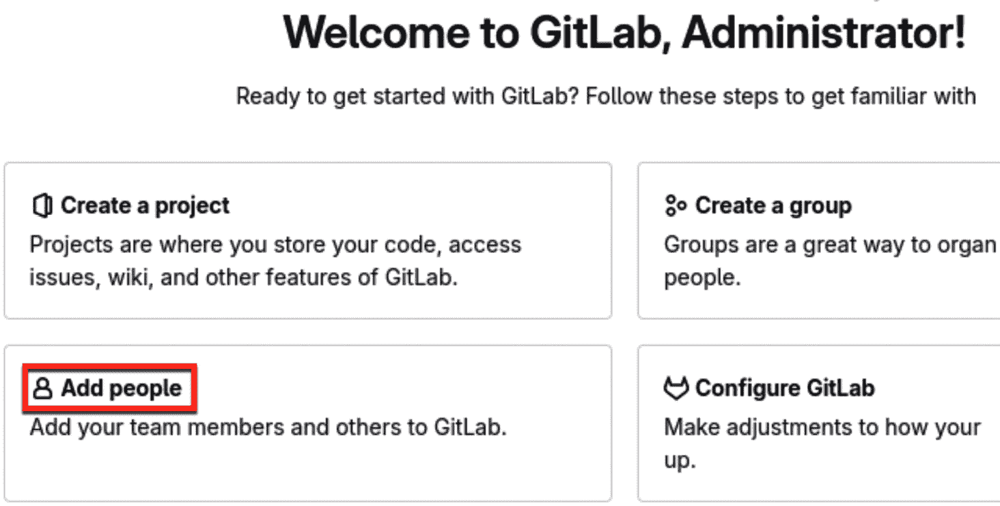
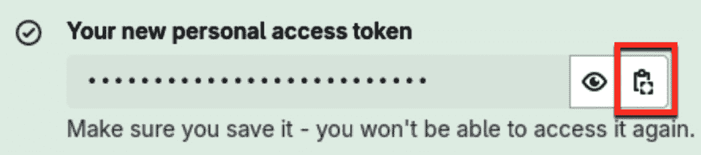
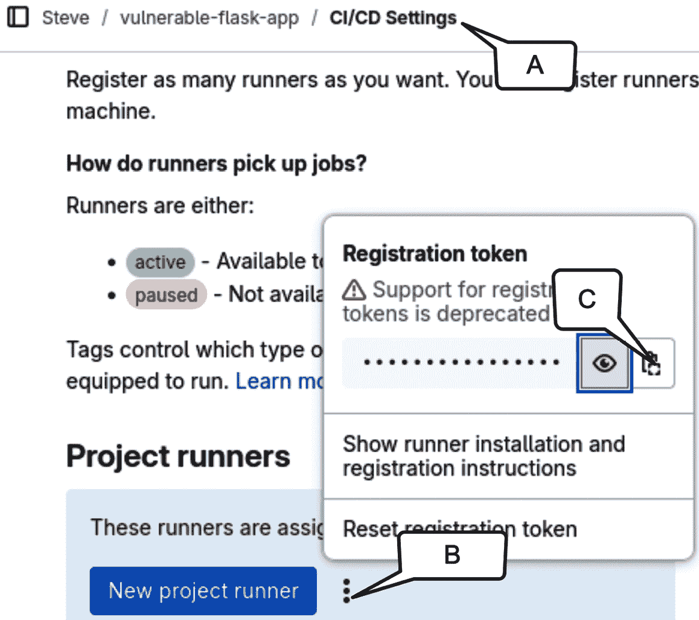
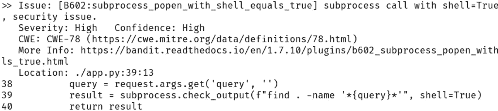
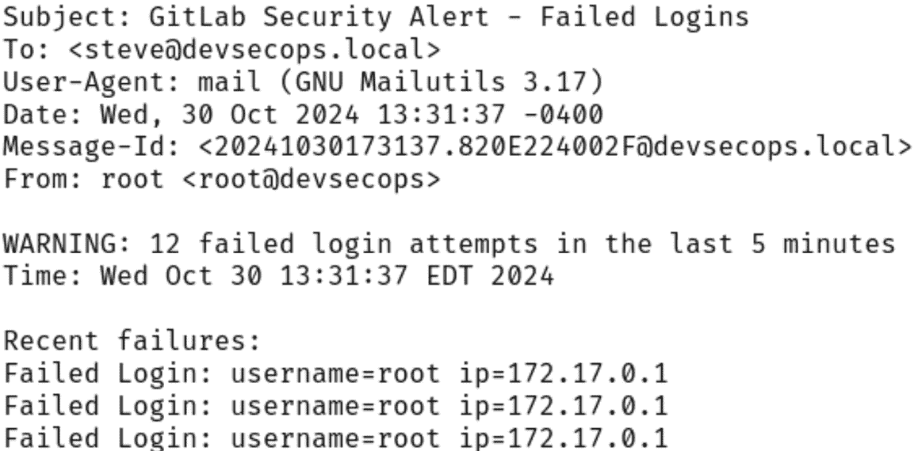
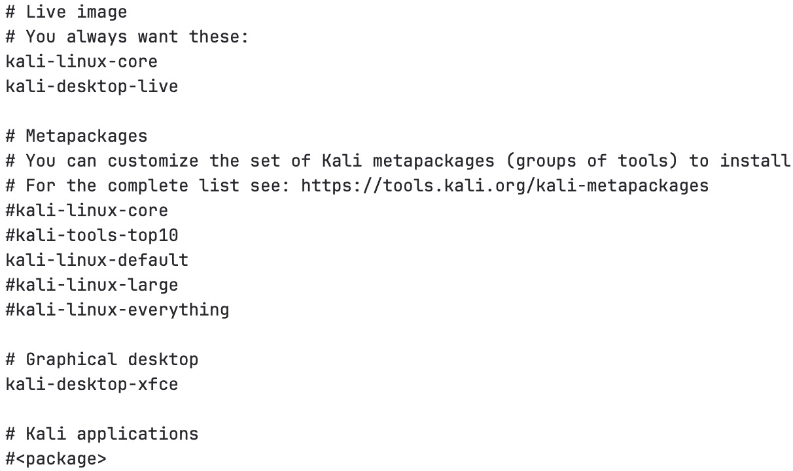

# 第十六章：渗透测试人员的 DevSecOps

`DevSecOps` 是 *开发*、*安全* 和 *运维* 的结合体。DevSecOps 代表了组织在软件开发中如何看待安全的转变。将安全实践贯穿整个开发生命周期，有助于早期发现并缓解安全问题。

在本章中，我们将探索渗透测试人员在 DevSecOps 框架中的角色。我们将研究如何使用 Bash 脚本来自动化和增强安全流程。从将安全检查集成到**持续集成/持续交付**（**CI/CD**）管道，到构建定制的安全工具，我们将涵盖能帮助渗透测试人员在 DevSecOps 环境中应用的实用技术。

如果你不在 DevSecOps 环境中工作，本章仍然适合你。你可能想跳到创建定制 Kali 构建的部分。本节将帮助你自动化创建高度可定制的 Kali Linux 安装 ISO 镜像。

在本章中，我们将涵盖以下主要主题：

+   渗透测试人员的 DevSecOps 介绍

+   使用 Bash 配置 CI/CD 管道

+   为 DevSecOps 编写安全性重点的 Bash 脚本

+   使用 Bash 集成实时安全监控

+   自动化定制的 Kali Linux 构建用于渗透测试

# 技术要求

本章的代码可以在 [`github.com/PacktPublishing/Bash-Shell-Scripting-for-Pentesters/tree/main/Chapter16`](https://github.com/PacktPublishing/Bash-Shell-Scripting-for-Pentesters/tree/main/Chapter16) 找到。

本章将使用 Kali 虚拟机与 GitLab 和 Bash 脚本来运行安全检查和监控。请配置你的 Kali Linux 虚拟机，至少符合以下要求：

+   4 GB 内存

+   30 GB 存储

+   两个虚拟 CPU

一旦你拥有符合或超过前述规格的 Kali 安装，运行本章 GitHub 目录中的`ch16_setup_environment.sh`脚本。我们将在本章后续部分回顾这个脚本。

接下来，配置系统邮件：

1.  运行`ch16_setup_mail.sh`脚本。该脚本可以在本章的 GitHub 仓库目录中找到。

1.  测试给自己发送邮件：

    ```
    $ echo "Test message" | mail -s "Test Subject" $USER
    ```

1.  检查你的邮件：

    1.  在终端输入`mail`命令

    1.  按*Enter* / *Return* 键读取一条消息

    1.  输入`q`退出阅读消息

    1.  输入`d`删除一条消息

    1.  输入`h`再次显示消息列表

    1.  输入`q`退出邮件程序

在了解了先决条件后，让我们深入学习吧！

# 渗透测试人员的 DevSecOps 介绍

本节介绍并解释了 DevSecOps。到本节结束时，你将理解相关术语、历史以及将安全融入开发生命周期的常见任务。

## 理解 DevOps 与安全的交集

尽管 DevOps 和安全性看似是分开的，但它们在现代软件开发中正日益融合。DevOps 专注于协作、自动化和持续交付，已经改变了组织处理软件开发和部署的方式。然而，这一转变也带来了新的安全挑战，必须加以解决，以确保交付软件的完整性和可靠性。

传统的安全实践通常涉及手动测试和审核，这些通常在开发周期的最后阶段进行。此方法既耗时又资源密集，且通常导致安全问题在过程中被发现较晚。这导致了昂贵的修复和发布延迟。随着 DevOps 的采用，重点转向从一开始就将安全性集成到开发过程中。这促生了`DevSecOps`的概念。

DevSecOps 将安全性集成到软件开发生命周期的每个阶段。这促进了开发人员、运维人员和安全团队之间的共同责任。通过将安全实践、工具和自动化嵌入到 DevOps 中，组织可以及早发现漏洞，最小化安全风险，并通过设计交付安全的软件。

随着 DevSecOps 的兴起，渗透测试人员应调整其方法，并利用自动化来适应快速的开发周期。将安全测试集成到 CI/CD 流水线中，可以让测试人员对软件安全性进行持续反馈，帮助团队迅速找到并修复漏洞。此外，渗透测试人员可以通过与开发和运维团队密切合作，支持 DevSecOps 文化。通过分享他们的知识和经验，渗透测试人员可以指导团队掌握安全编码技巧、常见漏洞以及安全部署和配置的最佳实践。这种合作努力促进了安全意识的集体提升，并有助于创建一个更安全的软件环境。

在 DevSecOps 中，Bash 脚本是自动化 CI/CD 流水线中安全任务的有效工具。作为一种灵活的脚本语言，Bash 使渗透测试人员能够编写自定义脚本，用于漏洞扫描、配置分析和自动化利用等活动。这减少了手动工作，简化了测试流程，并确保在各个环境中进行一致的安全检查。

在本章中，我们将探讨如何在 DevOps 工作流程中使用 Bash 脚本来自动化安全任务。掌握 Bash 脚本编写可以帮助渗透测试人员简化测试流程，并增强组织的安全性。

## Bash 在安全自动化中的常见使用场景

安全团队通常在整个 DevSecOps 生命周期中集成 Bash 脚本，以简化和自动化重复的安全任务。了解这些常见任务可以帮助渗透测试人员识别在其工作流程中实现自动化的机会。

一些常见的安全工作流包括以下组件：

+   **漏洞扫描协调**：Bash 脚本协调多个扫描工具按顺序或并行运行，以扫描目标系统。安全团队通常自动化 Nmap 端口扫描，然后使用针对已检测到的服务的漏洞扫描器。脚本处理调度、参数配置和结果聚合。这样将几小时的手动扫描转变为自动化过程。

+   **持续安全测试**：在现代开发环境中，安全测试会在每次代码提交时自动运行。Bash 脚本将安全工具集成到 CI 管道中，扫描应用程序代码、依赖项和容器镜像。当发现漏洞时，脚本可以使构建失败，并通过聊天平台或工单系统通知安全团队。

+   **配置管理**：基础设施安全在很大程度上依赖于正确的系统配置。Bash 脚本验证服务器上的安全基线，检查文件权限、用户访问、服务配置和网络设置。当检测到配置错误时，脚本可以自动修复问题或为运维团队创建详细报告。

+   **日志分析与监控**：安全团队使用 Bash 处理系统日志，查找入侵指示或可疑行为。脚本解析日志文件，提取相关数据，并根据预定义规则触发警报。此自动化监控持续运行，提供整个基础设施的实时安全可见性。

+   **事件响应自动化**：在安全事件中，时间至关重要。Bash 脚本自动化初步响应操作，如隔离受损系统、收集取证数据或阻止恶意 IP 地址。此自动化确保了事件处理的一致性，并将响应时间从小时缩短到分钟。

+   **合规性验证**：组织必须定期验证是否符合安全标准。Bash 脚本自动化检查与 CIS 基准或 NIST 指南等框架的合规性。脚本生成合规报告并突出需要整改的区域，从而简化审计过程。

+   **安全工具集成**：许多安全工具提供命令行接口，但缺乏直接集成功能。Bash 作为这些工具的粘合剂，将它们连接成统一的安全工作流。脚本可以将工具串联起来，转换数据格式并创建统一的报告界面。

+   **环境加固**：安全团队使用 Bash 自动化加固新系统。脚本应用安全补丁、配置防火墙、设置入侵检测和实施访问控制。此自动化确保了所有环境中一致的安全措施。

这些自动化用例构成了现代安全操作的基础。在接下来的章节中，我们将探索一些场景的具体代码实现，构建针对实际安全挑战的自动化解决方案。

# 使用 Bash 配置 CI/CD 管道

在本节中，我们将介绍如何使用 Bash 脚本设置 CI/CD 测试实验环境。这将自动化安装本章剩余练习所需的所有工具。该脚本可以在 GitHub 上找到，文件名为`ch16_setup_environment.sh`。

## 初始设置和错误处理

这段代码设置了错误处理行为，防止在发生错误时脚本继续执行。这些安全措施有助于尽早捕捉问题，并防止级联故障，从而避免系统处于不一致的状态。与往常一样，代码以熟悉的`shebang`行开始：

```
 #!/usr/bin/env bash
set -euo pipefail
IFS=$'\n\t'
# Setup logging LOG_FILE="/var/log/devsecops_setup.log"
SCRIPT_NAME=$(basename "$0")
```

本节内容确立了核心脚本行为。`set` 命令配置了重要的安全功能：

+   `-e` : 在发生任何错误时退出

+   `-u` : 将未设置的变量视为错误

+   `-o pipefail` : 如果管道中的任何命令失败，返回错误

内部字段分隔符（**IFS**）设置为换行符和制表符，防止在空格处拆分单词。

请注意，日志文件可以在`/var/log/devsecops_setup.log` 找到。如果脚本失败，请检查日志文件的末尾。

## 日志记录函数

适当的日志记录对于调试和审计脚本执行至关重要。以下函数创建了一个标准化的日志系统，记录了安装过程中的所有重要事件，使得追踪问题和验证执行成功变得更加容易：

```
 log_info() {
    local msg="[$(date +'%Y-%m-%d %H:%M:%S')] [INFO] $1"
    echo "$msg" | tee -a "$LOG_FILE"
}
log_error() {
    local msg="[$(date +'%Y-%m-%d %H:%M:%S')] [ERROR] $1"
    echo "$msg" | tee -a "$LOG_FILE" >&2
}
log_warning() {
    local msg="[$(date +'%Y-%m-%d %H:%M:%S')] [WARNING] $1"
    echo "$msg" | tee -a "$LOG_FILE"
}
```

这些函数实现了结构化的日志记录：

1.  每个函数接受一个消息参数。

1.  消息通过**日期**进行时间戳标记。

1.  `tee -a` 将日志写入日志文件和标准输出。

1.  错误消息通过`>&2` 定向到标准错误（stderr）。

## 错误处理程序和初始化

当脚本出现问题时，提供清晰的错误消息有助于用户理解并修复问题。这部分内容建立了错误处理例程并初始化了日志记录系统，确保所有脚本活动都得到正确跟踪，错误被捕获并报告：

```
 handle_error() {
    local line_num=$1
    local error_code=$2
    log_error "Error in $SCRIPT_NAME at line $line_num (Exit code: $error_code)"
}
trap 'handle_error ${LINENO} $?' ERR
init_logging() {
    if [[ ! -f "$LOG_FILE" ]]; then
        touch "$LOG_FILE"
        chmod 644 "$LOG_FILE"
    fi
    log_info "Starting setup script execution"
    log_info "Logging to $LOG_FILE"
}
```

错误处理系统使用以下功能：

+   一个用于捕获错误的`trap`。trap 是一种机制，允许你在 shell 接收到指定信号或条件时，指定一条或多条命令进行执行。为了捕获错误，可以使用带有`ERR`信号的`trap`命令，当脚本中的命令返回非零退出状态时，会触发该信号。

+   `handle_error` 函数接收行号和退出代码。

+   `init_logging` 在需要时创建日志文件并设置权限。

## 系统检查

在安装软件或进行系统更改之前，我们需要验证脚本是否在正确的环境中运行。以下代码确保脚本以正确的权限和预期的操作系统运行，从而避免因执行环境不正确而产生的潜在问题：

```
 if [[ $EUID -ne 0 ]]; then
   log_error "This script must be run as root"
   exit 1
fi
if ! grep -q "Kali" /etc/os-release; then
    log_error "This script must be run on Kali Linux"
    exit 1
fi
```

以下检查确保执行环境条件正确：

+   通过检查有效用户 ID 来验证根权限

+   通过检查操作系统信息确认系统是 Kali Linux

## 开发工具安装

DevSecOps 环境需要各种开发工具和语言。本节安装核心开发依赖项，包括 Docker、Java 和 Python 工具，这些工具将用于安全地构建和测试应用程序：

```
 install_dev_tools() {
    log_info "Installing development tools..."     export DEBIAN_FRONTEND=noninteractive
    apt-get update >> "$LOG_FILE" 2>&1
    apt-get install -y \
        docker.io \
        docker-compose \
        openjdk-11-jdk \
        maven \
        gradle \
        python3-venv \
        python3-full \
        pipx >> "$LOG_FILE" 2>&1 || {
            log_error "Failed to install development tools"
            return 1
        }
    pipx ensurepath >> "$LOG_FILE" 2>&1
    export PATH="/root/.local/bin:$PATH"
```

以下是此代码块的拆解：

1.  通过设置环境变量来设置非交互式包安装。这将防止包管理器在安装过程中提示您：`export DEBIAN_FRONTEND=noninteractive`。

1.  更新包列表。

1.  使用 `apt-get` 安装开发工具。

1.  配置 Python 包管理工具 `pipx`。

1.  更新 `PATH`，以包括本地二进制文件。

## 安全工具安装

安全扫描工具对于识别代码和依赖项中的漏洞至关重要。本节安装了专门的安全工具，帮助识别应用程序依赖项和容器镜像中的潜在漏洞：

```
 install_dep_scanners() {
    log_info "Installing dependency scanners..."     # OWASP Dependency-Check
    wget https://github.com/jeremylong/DependencyCheck/releases/download/v7.1.1/dependency-check-7.1.1-release.zip
    unzip dependency-check-7.1.1-release.zip -d /opt/
    ln -sf /opt/dependency-check/bin/dependency-check.sh /usr/local/bin/dependency-check
    # Trivy Installation
    TRIVY_VERSION=$(curl -s https://api.github.com/repos/aquasecurity/trivy/releases/latest | grep '"tag_name":' | sed -E 's/.*"v([^"]+)".*/\1/')
    wget "https://github.com/aquasecurity/trivy/releases/download/v${TRIVY_VERSION}/trivy_${TRIVY_VERSION}_Linux-64bit.deb"
    dpkg -i trivy.deb
}
```

以下是前面代码的拆解：

1.  下载并安装`OWASP Dependency-Check`

1.  从 GitHub API 获取最新的 Trivy 版本

1.  下载并安装 Trivy 包

OWASP Dependency-Check 扫描软件依赖版本中的漏洞。Trivy 扫描 Git 仓库、文件系统和容器中的漏洞。

## GitLab CI/CD 设置

本节安装并配置 GitLab 和 GitLab Runner，以提供一个简单的 CI/CD 平台，用于自动化安全测试和部署：

```
 setup_gitlab_cicd() {
    docker run --detach \
        --hostname gitlab.local \
        --publish 443:443 --publish 80:80 --publish 22:22 \
        --name gitlab \
        --restart always \
        --volume /srv/gitlab/config:/etc/gitlab \
        --volume /srv/gitlab/logs:/var/log/gitlab \
        --volume /srv/gitlab/data:/var/opt/gitlab \
        gitlab/gitlab-ce:latest
    # GitLab Runner installation
    curl -L "https://packages.gitlab.com/install/repositories/runner/gitlab-runner/script.deb.sh" | \
        os=debian dist=bullseye bash
    apt-get install -y gitlab-runner
}
```

此代码块执行以下操作：

1.  使用 Docker 部署 GitLab，并启用持久存储

1.  映射必要的端口以支持 Web 和 SSH 访问

1.  安装 GitLab Runner 以支持 CI/CD 功能

## 工作区创建

一个组织良好的工作区有助于在安全测试项目中保持秩序。本节创建了一个结构化的目录布局，并提供了示例配置，帮助用户开始实施 DevSecOps 实践：

```
 create_workspace() {
    mkdir -p /opt/devsecops/{scripts,tools,reports,pipelines,monitoring}
    cat > /opt/devsecops/pipelines/example-pipeline.yml <<EOF
stages:
  - static-analysis
  - dependency-check
  - container-scan
  - dynamic-scan
... EOF
    chown -R "$SUDO_USER:$SUDO_USER" /opt/devsecops
}
```

此函数执行以下操作：

1.  为 DevSecOps 工作创建目录结构

1.  设置示例管道配置

1.  调整工作区文件的所有权

脚本使用了几个 shell 脚本最佳实践：

+   一致的错误处理和日志记录

+   模块化功能设计

+   合适的权限管理

+   仔细的依赖安装

+   基于容器的服务部署

这个脚本创建了一个简单的 DevSecOps 学习环境，它利用 Kali Linux 中预安装的安全工具，同时添加必要的组件。该环境允许你在一个隔离的环境中练习安全自动化、持续测试和监控。

在下一节中，我们将探讨如何使用 Bash 脚本在代码提交到 GitLab 后执行安全测试。

# 为 DevSecOps 打造安全-focused 的 Bash 脚本

在本节中，我们将回顾用于集成到 CI/CD 管道中的 Bash 扫描脚本的代码。首先，我将创建并回顾扫描脚本。然后，我将演示如何将它集成到管道中进行自动化扫描。

## 创建扫描脚本

创建安全且易于维护的 Bash 脚本需要仔细关注防御性编码实践、正确的错误处理和详细的日志记录。让我们构建一个安全扫描脚本，利用我们的 DevSecOps 环境来展示这些原则。

这个脚本可以在 GitHub 上找到，名为`ch16_devsecops_scanner.sh`。让我们将这个脚本分解成核心组件，并查看每个部分。

首先，我们将查看脚本初始化和安全措施。本节的目的是如下：

+   启用严格的错误处理

+   防止文件名包含空格时出现单词拆分问题

+   变量定义清晰，且具有默认值

+   该脚本使用带时间戳的报告名称以防止覆盖

让我们深入查看代码：

```
 #!/usr/bin/env bash
set -euo pipefail
IFS=$'\n\t'
SCAN_DIR=${1:-"."}
REPORT_DIR="/opt/devsecops/reports"
LOG_FILE="/var/log/security_scanner.log"
TIMESTAMP=$(date +%Y%m%d_%H%M%S)
REPORT_NAME="security_scan_${TIMESTAMP}"
```

`set -euo pipefail` 命令通过修改错误处理方式来增强 Shell 脚本的健壮性：

+   `-e` : 如果脚本中的任何命令以非零状态退出，则导致脚本立即退出

    `-u` : 将未设置的变量视为错误，并导致脚本以错误退出

+   `-o pipefail` : 确保如果管道中的任何命令失败，脚本都会以非零状态退出，而不仅仅是最后一个命令

这些选项组合有助于早期捕获错误，使脚本更可靠。

`IFS=$'\n\t'` 这一行将 IFS 定界符设置为换行符和制表符，以防止文件名中包含空格时出现单词拆分问题。

`SCAN_DIR=${1:-"."}` 这一行为`SCAN_DIR`变量赋值，如果存在第一个位置参数（**$1**），则使用该值。如果没有提供`$1`，则默认为`"."`，表示当前目录。

接下来，让我们查看日志记录函数。本节的目的是执行以下操作：

+   创建具有时间戳和日志级别的一致日志格式

+   将日志写入控制台和日志文件

+   实现错误捕获以捕捉并记录所有脚本失败

+   设置日志文件的适当文件权限

让我们来看以下代码：

```
 # Logging setup
setup_logging() {
    if [[ ! -f "$LOG_FILE" ]]; then
        sudo touch "$LOG_FILE"
        sudo chmod 644 "$LOG_FILE"
    fi
}
log() {
    local level=$1
    shift
    echo "[$(date +'%Y-%m-%d %H:%M:%S')] [${level}] $*" | tee -a "$LOG_FILE"
}
# Error handler
error_handler() {
    local line_num=$1
    local error_code=$2
    log "ERROR" "Error occurred in script at line: ${line_num} (Exit code: ${error_code})"
}
trap 'error_handler ${LINENO} $?' ERR
```

`setup_logging()`函数检查日志文件是否存在，如果不存在，则执行以下操作：

1.  使用`sudo touch`创建它。

1.  设置权限为`644`（所有者可读写，其他用户只能读取）。

1.  `[[ ! -f "$LOG_FILE" ]]` 测试检查文件是否 *不存在*（**-!**）。

`log()` 函数是一个多功能的日志记录工具。此函数执行以下功能：

1.  将日志级别作为第一个参数传递。

1.  使用 `shift` 移除级别，将剩余的参数作为消息。

1.  使用 `date` 创建时间戳，格式为 `YYYY-MM-DD HH:MM:SS`。

1.  使用 `tee -a` 同时显示 *并* 将日志追加到文件中。

1.  `$*` 将所有剩余的参数合并为消息。

这里解释了错误处理设置：

1.  `error_handler` 接受行号和错误代码作为参数。

1.  使用 `log` 函数记录错误。

1.  `trap` 命令捕获任何 `ERR`（错误）信号。

1.  `${LINENO}` 是一个特殊变量，包含当前行号。

1.  `$?` 包含上一个命令的退出代码。

验证函数确保环境已正确配置。本节的目的是执行以下操作：

+   在开始之前检查所需的安全工具

+   验证目录权限和存在性

+   对缺少的先决条件返回清晰的错误消息

让我们来看看代码：

```
 # Validation functions
validate_environment() {
    local required_tools=("docker" "trivy" "dependency-check" "bandit")
    for tool in "${required_tools[@]}"; do
        if ! command -v "$tool" &> /dev/null; then
            log "ERROR" "Required tool not found: $tool"
            return 1
        fi
    done
    if [[ ! -d "$REPORT_DIR" ]]; then
        log "ERROR" "Report directory not found: $REPORT_DIR"
        return 1
    fi
}
validate_target() {
    if [[ ! -d "$SCAN_DIR" ]]; then
        log "ERROR" "Invalid target directory: $SCAN_DIR"
        return 1
    fi
    if [[ ! -r "$SCAN_DIR" ]]; then
        log "ERROR" "Cannot read target directory: $SCAN_DIR"
        return 1
    fi
}
```

`validate_environment` 函数创建一个 `required_tools` 数组，并确保它们在路径中能找到。`validate_target` 函数确保要扫描的目录存在。最后，它检查权限，确保扫描目录可以被读取。

扫描函数实现了核心的安全检查。本节的目的是执行以下操作：

+   确保每种扫描类型都在其独立的函数中隔离

+   使用我们 DevSecOps 环境中的适当工具

+   实现适当的错误处理和日志记录

+   生成结构化的输出文件用于报告

让我们深入研究代码：

```
 perform_sast_scan() {
    log "INFO" "Starting SAST scan with Bandit"
    local output_file="${REPORT_DIR}/${REPORT_NAME}_sast.txt"
```

在这里，我们只是记录一个状态消息并设置 `output_file` 变量。

```
 if bandit -r "$SCAN_DIR" -f txt -o "$output_file"; then
        log "INFO" "SAST scan completed successfully"
        return 0
    else
        log "ERROR" "SAST scan did not complete successfully"
        return 1
    fi
}
```

在前面的代码中，我们使用 `bandit` 执行扫描。Bandit 是一个 **静态应用安全测试**（**SAST**）工具，用于检查 Python 代码中的漏洞。然后，它根据 `bandit` 命令的成功或失败设置返回码。

在 `perform_dependency_scan` 函数中，我们运行 `dependency-check` 测试软件依赖中的已知漏洞，并根据返回码记录消息：

```
 perform_dependency_scan() {
    log "INFO" "Starting dependency scan"
    local output_file="${REPORT_DIR}/${REPORT_NAME}_deps"
    if dependency-check --scan "$SCAN_DIR" --out "$output_file" --format ALL; then
        log "INFO" "Dependency scan completed successfully"
        return 0
    else
        log "ERROR" "Dependency scan did not complete successfully"
        return 1
    fi
}
```

`perform_container_scan` 函数扫描 Docker 容器镜像中的安全漏洞。它会查找目录中的所有 Dockerfile，从中构建容器镜像，并使用 Trivy（漏洞扫描工具）检查每个镜像的安全问题。

以下代码块负责生成报告摘要，并包括控制代码执行流程的主函数：

```
 perform_container_scan() {
    log "INFO" "Starting container image scan"
    local output_file="${REPORT_DIR}/${REPORT_NAME}_containers.json"
    # Find all Dockerfiles in the target directory
    while IFS= read -r -d '' dockerfile; do
        local dir_name
        dir_name=$(dirname "$dockerfile")
        local image_name
        image_name=$(basename "$dir_name")
        log "INFO" "Building container from Dockerfile: $dockerfile"
        if docker build -t "scan_target:${image_name}" "$dir_name"; then
            log "INFO" "Scanning container image: scan_target:${image_name}"
            if ! trivy image -f json -o "$output_file" "scan_target:${image_name}"; then
                log "WARNING" "Container vulnerabilities found"
                return 1
            fi
        else
            log "ERROR" "Failed to build container from $dockerfile"
            return 1
        fi
    done < <(find "$SCAN_DIR" -name "Dockerfile" -print0)
}
```

最后，执行结果处理函数`generate_summary` 和 `main` 函数。

`generate_summary` 函数执行以下步骤：

1.  创建一个 Markdown 格式的摘要报告

1.  提取每种扫描类型的关键发现

1.  使用 `tail` 显示最新的 SAST 发现

1.  使用 `grep` 查找关键依赖项漏洞

1.  使用 `jq` 解析容器扫描的 JSON，显示高危和严重问题

1.  当没有发现问题时提供后备消息

1.  将所有输出重定向到一个汇总文件

以下代码生成 Markdown 格式的报告：

```
 generate_summary() {
    local summary_file="${REPORT_DIR}/${REPORT_NAME}_summary.md"
    {
        echo "# Security Scan Summary"
        echo "## Scan Information"
        echo "- Date: $(date)"
        echo "- Target: $SCAN_DIR"
        echo
        echo "## Findings Summary"
        echo "### SAST Scan"
        echo "\`\`\`"
        tail -n 10 "${REPORT_DIR}/${REPORT_NAME}_sast.txt"
        echo "\`\`\`"
        echo
        echo "### Dependency Scan"
        echo "\`\`\`"
        grep -A 5 "One or more dependencies were identified with known vulnerabilities" \
            "${REPORT_DIR}/${REPORT_NAME}_deps.txt" 2>/dev/null || echo "No critical dependencies found"
        echo "\`\`\`"
        echo
        echo "### Container Scan"
        echo "\`\`\`"
        jq -r '.Results[] | select(.Vulnerabilities != null) | .Vulnerabilities[] | select(.Severity == "HIGH" or .Severity == "CRITICAL") | "- \(.VulnerabilityID): \(.Title)"' \
            "${REPORT_DIR}/${REPORT_NAME}_containers.json" 2>/dev/null || echo "No container vulnerabilities found"
        echo "\`\`\`"
    } > "$summary_file"
    log "INFO" "Summary report generated: $summary_file"
}
```

唯一没有在前面的代码中看到的就是 Markdown 格式。在 Markdown 中，代码块以三反引号（ ````** ), followed by lines of code, and closed out by another line starting with three backticks. Headings are formatted with one or more hash symbols ( **#** ) preceding the heading title. For example, an H1 header would have one, **#** , and an H2 header would have two, **##` , followed by the section title.

Finally, we have the `main` function, which calls the other functions:

```）开头

main() {

local exit_code=0

setup_logging

log "INFO" "开始扫描 $SCAN_DIR 的安全"

validate_environment || exit 1

validate_target || exit 1

# 创建特定扫描报告目录

mkdir -p "${REPORT_DIR}/${REPORT_NAME}"

# 执行扫描

perform_sast_scan || exit_code=$((exit_code + 1))

perform_dependency_scan || exit_code=$((exit_code + 1))

perform_container_scan || exit_code=$((exit_code + 1))

generate_summary

log "INFO" "安全扫描完成，退出码：$exit_code"

return $exit_code

}

```

The following are example commands for executing this script in your DevSecOps environment:

*   For basic usage, run a scan on the current directory:

    ```

    $ ./security_scanner.sh

    ```

*   Scan a specific project:

    ```

    $ ./security_scanner.sh /path/to/project

    ```

*   Run a scan as part of the CI/CD pipeline:

    ```

    $ ./security_scanner.sh "$CI_PROJECT_DIR"

    ```

The script integrates with the GitLab CI/CD environment we set up earlier. You can add it to your `.** **gitlab-ci.yml` pipeline:

```

security_scan:

stage: test

脚本：

- /path/to/security_scanner.sh .   artifacts:

paths:

- /opt/devsecops/reports/

```

This script demonstrates key security principles for DevSecOps Bash scripting:

*   Input validation and sanitization
*   Comprehensive error handling
*   Detailed logging
*   Clear output formatting
*   Integration with standard security tools
*   CI/CD pipeline compatibility

Now that we have our DevSecOps scanner script, let’s further configure our system with repositories and set up the system to automatically run the scan.

## Creating vulnerable artifacts

Before we run our scanner script, we need to configure our system with some vulnerable code and Docker containers, which will be the target of our scans.

Let’s go through the vulnerabilities that our scanning script will detect:

*   `SAST vulnerabilities (detectable** **by Bandit)` :
    *   Use of `subprocess.check_output** with **shell=True` ( command injection)
    *   Unsafe YAML loading with `yaml.load`
    *   Unsafe Pickle deserialization
    *   SQL injection vulnerability in the login route
    *   Template injection in the home route
    *   Debug mode enabled in Flask
*   `Dependency vulnerabilities (detectable by** **OWASP Dependency-Check)` :
    *   Flask 2.0.1 has known vulnerabilities
    *   PyYAML 5.3.1 has deserialization vulnerabilities
    *   Werkzeug 2.0.2 has path traversal vulnerabilities
    *   Cryptography 3.3.2 has buffer overflow vulnerabilities
    *   Jinja2 2.11.2 has sandbox escape vulnerabilities
*   `Container vulnerabilities (detectable** **by Trivy)` :
    *   The Python `3.8-slim-buster` base image has known CVEs
    *   OpenSSL `1.1.1d` has multiple CVEs
    *   Running as the `root` user
    *   An old version of curl with known vulnerabilities

To set this up in your GitLab environment, follow these steps:

1.  Authenticate to GitLab:
    1.  Execute this command to find the GitLab `root` password:

    ```

    $ sudo docker exec -it gitlab grep 'Password:' /etc/gitlab/initial_root_password

    ```

    1.  Log in to GitLab at `http://localhost** in the DevSecOps virtual machine using **root` for the username and the password found from the previous command.
2.  Create a new user:
    1.  Click `Add people` . See *Figure 16* *.1* :

 

Figure 16.1 – Adding our first GitLab user account

1.  Specify your new user’s name, username, and email address. Any email address will work. We’re not going to verify the email address.
2.  Click the `Create** **user` button.
3.  Set the user’s password: To the right of the username, click the `Edit` button. See *Figure 16* *.2* :

 

Figure 16.2 – The location of the button is shown here

1.  Set the user’s password, confirm the password, and click the `Save** **Changes` button.
2.  Log in as the user you just created. When you log in, you will be prompted to enter your current password and change it.

1.  Create a `Personal Access** **Token** ( **PAT` ):
    1.  Navigate to `http://localhost/-/user_settings/personal_access_tokens` .
    2.  Click `Add** **new token` .
    3.  Provide a name and expiration date.
    4.  Select all scope checkboxes and click the `Create` button.
    5.  Click the button to copy the token:

 

Figure 16.3 – Copying your token value

1.  Save your PAT to a file before continuing.

1.  Create a repository:
    1.  After logging in, click `Create** **a project` .
    2.  Click `Create** **blank project` .
    3.  Enter `vulnerable-flask-app` for the project name.
    4.  Click the `Create project` button at the bottom.
2.  Copy project CI/CD runner token (shown in *Figure 16* *.4* ):
    1.  Navigate to the project’s CI/CD settings.
    2.  Click the three vertical dots next to the `New project** **runner` button.
    3.  Copy the token and save it to the file:

 

Figure 16.4 – Copying your project runner token

1.  Register the new runner with your token (replace `YOUR_TOKEN` with the actual token you copied). You can find this command in the book’s GitHub repository as `ch16_register_runner.sh` . After running the command, you’ll be prompted for values. You’ll find that the values entered in the command will be the default, so simply press the *Enter* key until complete. Here’s the code of `ch16_register_runner.sh` :

    ```

    sudo gitlab-runner register \

    --url "http://localhost" \

    --registration-token "your_token_here" \

    --description "docker-runner" \

    --executor "docker" \

    --docker-image "docker:dind" \

    --docker-privileged \

    --docker-volumes "/cache" \

    --docker-volumes "/opt/devsecops:/opt/devsecops:rw" \

    --docker-volumes "/var/run/docker.sock:/var/run/docker.sock" \

    --docker-network-mode "host" \

    --clone-url "http://localhost"

    ```

2.  Set up the scan script:
    1.  Create a `s cripts` directory if it doesn’t exist:

    ```

    $ sudo mkdir -p /opt/devsecops/scripts

    ```

    1.  Copy the security scanner to the `scripts** directory: Copy the **ch16_devsecops_scanner.sh` file from GitHub to the direct ory:

    ```

    $ sudo cp ch16_devsecops_scanner.sh /opt/devsecops/scripts/security_scanner.sh

    ```

    1.  Make it executable:

    ```

    $ sudo chmod +x /opt/devsecops/scripts/security_scanner.sh

    ```

3.  Set up the required permissions:
    1.  Allow GitLab Runner to access required directories:

    ```

    $ sudo chown -R gitlab-runner:gitlab-runner /opt/devsecops

    $ sudo chmod -R 755 /opt/devsecops

    ```

    1.  Restart `gitlab-runner` :

    ```

    $ sudo systemctl restart gitlab-runner

    ```

    1.  Allow access to the Docker socket:

    ```

    $ sudo usermod -aG docker gitlab-runner

    ```

4.  Clone the repository: Run the following command, replacing `<username>` with your actual GitLab username. You’ll be prompted for your username and password. Use your GitLab username, and paste the PAT that you copied in *Step 5* for the password:

    ```

    $ git clone http://localhost/<username>/vulnerable-flask-app.git

    ```

5.  Add the files: Copy the following files from this chapter’s GitHub directory into the `vulnerable_flask_app` directory:
    *   `app.py`
    *   `requirements.txt`
    *   `Dockerfile`
    *   `.** **gitlab-ci.yml`
6.  Configure our Git user:
    1.  Run this command to set the Git username for this repo sitory, using your GitLab account name:

    ```

    $ git config user.name "Your Name"

    ```

    1.  Run this command to set the Git email for this repository, using your GitLab account email address:

    ```

    $ git config user.email "your.email@example.com"

    ```

    1.  Issue the following commands to add the `rep orts` directory and track the new files:

    ```

    $ mkdir -p reports

    $ touch reports/.gitkeep

    $ git add .

    $ git commit -m "首次提交有漏洞的应用"

    ```

7.  Push to GitLab: Run the following command to push the repository to GitLab, replacing `<youruser>` with the username you created in *Step 2* . You will be prompted for your GitLab username and password. Use the GitLab PA T you generated earlier as the password:

    ```

    $ git remote add origin http://localhost/<youruser>/vulnerable-flask-app.git

    $ git push -u origin main

    ```

    Now, every time you push to the repository or create a merge request, the following will happen:

    1.  GitLab CI will automatically trigger the pipeline
    2.  The security scanner will run against the code base
    3.  Reports will be available as artifacts in the GitLab UI

    To view the results, follow these steps:

    1.  Go to your GitLab project
    2.  Click on `Build` in the left sidebar
    3.  Click on `Jobs` .
    4.  View the job output and download artifacts

    The following figure shows a sample of the scan output:

 

Figure 16.5: The scan report reveals security issues

This section introduced you to implementing security checks into a DevSecOps pipeline. In the next section, we’ll explore automated sec urity and health monitoring for DevSecOps.

# Integrating real-time security monitoring with Bash

Security monitoring is essential for detecting and responding to threats in DevSecOps environments. While many commercial monitoring solutions exist, Bash scripting provides security specialists with the flexibility to create free custom monitoring systems tailored to their specific needs. By combining standard Linux tools with security-focused applications, you can build monitoring solutions that collect metrics, analyze logs, and alert you to suspicious activities.

Let’s build a monitoring system that watches our DevSecOps environment for security ev ents. This script can be found in GitHub as `ch16_sec_monitor.sh` . Our script will monitor GitLab authentication logs for failed login attempts and send email alerts when a threshold is exceeded. Let’s examine the script, section by section.

First, here is the initial setup and configuration:

```

#!/usr/bin/env bash

if [[ $EUID -ne 0 ]]; then

echo "此脚本必须以 root 用户身份运行"

exit 1

fi

THRESHOLD=5

CHECK_INTERVAL=300  # 5 分钟

ALERT_EMAIL="<user>@devsecops.local"

GITLAB_LOG="/srv/gitlab/logs/gitlab-rails/application_json.log"

```

This section verifies root privileges and sets key variables. The script checks every five minutes for failed logins exceeding a threshold of five attempts. Be sure to change the email address username to your own before running the script. Replace `<user>` with your username.

As shown here, the alert function handles email notifications:

```

send_alert() {

local failed_count=$1

local recent_failures=$2

echo "警告：过去 5 分钟内有 $failed_count 次登录失败

时间：$(date)

最近的失败：

$recent_failures" | mail -s "GitLab 安全警报 - 登录失败" "$ALERT_EMAIL"

}

```

This function formats and sends email alerts using the local mail system. It includes the count of failures and details about recent attempts.

As shown here, the main monitoring logic is as follows:

```

monitor_failed_logins() {

if [ ! -f "$GITLAB_LOG" ]; then

echo "错误：未找到 GitLab 日志文件 $GITLAB_LOG"

exit 1

}

local current_time=$(date +%s)

local window_start=$((current_time - CHECK_INTERVAL))

local window_start_iso=$(date -u -d "@$window_start" +"%Y-%m-%dT%H:%M:%S")

```

This section checks for the log file’s existence and calculates the time window for monitoring. It converts Unix timestamps to ISO format for log comparison.

The log analysis portion is demonstrated next:

```

local recent_failures=$(grep "Failed Login:" "$GITLAB_LOG" | while read -r line; do

log_time=$(echo "$line" | jq -r '.time' | cut -d'.' -f1)

if [[ "$log_time" > "$window_start_iso" ]]; then

echo "$line"

fi

done)

local failed_count=$(echo "$recent_failures" | grep -c "Failed Login:")

if [ "$failed_count" -gt "$THRESHOLD" ]; then

send_alert "$failed_count" "$(echo "$recent_failures" | jq -r '.message')"

fi

}

```

This code performs the following functions:

1.  Searches for failed login entries
2.  Uses `jq` to parse the JSON log format
3.  Filters entries within the time window
4.  Counts failures and triggers alerts if above the threshold

The main loop is shown here:

```

while true; do

monitor_failed_logins

sleep "$CHECK_INTERVAL"

done

```

This creates a continuous monitoring cycle, running checks every five minutes. The script never exits unless manually stopped or an error occurs.

After repeatedly entering failed login attempts in the GitLab login at `http://localhost/` , I check my mail and find alerts, as shown in the following figure:

 

Figure 16.6: An email alert reveals failed login attempts

This section demonstrated that you don’t need expensive software to implement security features. In the next section, we’ll explore how to make setting up a fresh Kali Linux instance quick and painless.

# Automating custom Kali Linux builds for pentesting

For pentesters who perform consulting work for external customers, every project should start with a fresh installation of the operating system, which is typically Kali Linux. There are many ways to deploy Kali:

*   Virtual machines
*   Docker containers
*   Cloud images
*   Bare metal installation on laptops or other devices

This section will focus on building Kali ISO image installers using Bash scripting. The resulting ISO image will automate the installation of Kali on virtual machines or bare metal. The image file can be connected to a virtual machine or to a laptop or other device using USB storage. From there, you simply boot the system, and your custom image is installed.

Your system will need a few gigabytes of free disk space to create the image. The amount of free disk space needed depends on the options you choose and whether you choose to install all or a subset of packages. To begin building custom Kali Linux ISOs, first, install the required packages and clone the `build` repository using the following commands:

```

$ sudo apt update

$ sudo apt install -y git live-build simple-cdd cdebootstrap curl

$ git clone https://gitlab.com/kalilinux/build-scripts/live-build-config.git

$ cd live-build-config

```

The build process supports two types of images:

*   `Live images** : For running Kali directly from USB without installation. Use the **--live** command-line option with the **build` script.
*   `Installer images** : For performing customized system installations. Use the **--installer** command-line option with the **build` script.

To build with different desktop environments, use the `--variant` flag. Here are some examples:

*   Build with the GNOME desktop:

    ```

    $ ./build.sh --variant gnome --verbose

    ```

*   Build with the KDE desktop:

    ```

    $ ./build.sh --variant kde --verbose

    ```

*   Build with the XFCE desktop (default):

    ```

    $ ./build.sh --variant xfce --verbose

    ```

You may also want to specify different architectures, for example, x86-64 for Intel/AMD CPUs, or ARM64 for running in a virtual machine on macOS. Specify the target architecture using the `--** **arch` flag:

*   Build for x86-64:

    ```

    $ ./build.sh --verbose --arch amd64

    ```

*   Build for ARM64:

    ```

    $ ./build.sh --verbose --arch arm64

    ```

Here’s a complete automated build script that sets common options. You can find this in the GitHub directory for this chapter as `ch16_build_kali.sh` . Note that this must be run on a Kali Linux system:

```

#!/usr/bin/env bash

# 设置构建参数

DESKTOP="gnome"  # 选项：gnome, kde, xfce

ARCH="amd64"     # 选项：amd64, arm64

VERSION="custom-1.0"

BUILD_TYPE="installer"  # 选项：installer, live

# 创建自定义密码配置

mkdir -p kali-config/common/includes.chroot/etc/live/config

echo 'LIVE_USER_DEFAULT_GROUPS="audio cdrom dialout floppy video plugdev netdev powerdev scanner bluetooth kali"' > kali-config/common/includes.chroot/etc/live/config/user-setup

echo 'LIVE_USER_PASSWORD=kali' >> kali-config/common/includes.chroot/etc/live/config/user-setup

# 启动构建并使用所有参数

./build.sh \

--verbose \

--variant ${DESKTOP} \

--arch ${ARCH} \

--version ${VERSION} \

--${BUILD_TYPE}

```

The build system offers several customization options:

*   `Package selection** : Edit package lists in **kali-config/variant-*/package-lists/kali.list.chroot** . Default packages come from the **kali-linux-default` metapackage. I highly recommend that you review these options to customize what gets installed. This will affect the resulting ISO image size. You can simply comment or uncomment lines to achieve the desired effect, as shown in the following figure:

 

Figure 16.7 – You may comment or uncomment lines to choose metapackages

*   `File overlays** : Place custom files in **kali-config/common/includes.chroot/` . Files will be copied to corresponding locations in the final image.
*   `Build parameters` :
    *   `--distribution** : Specify the Kali version (e.g., **kali-rolling** , **kali-last-snapshot` )
    *   `--version` : Set a custom version string
    *   `--subdir` : Define the output directory structure
    *   `--verbose` : Show detailed build output
    *   `--debug` : Display maximum debug information
*   `Preseeding` : You can fully customize and automate the installation process using a preseed file. Kali is based on Debian Linux. You can find Debian documentation on all preseed options at [`www.debian.org/releases/stable/amd64/apbs01.en.html`](https://www.debian.org/releases/stable/amd64/apbs01.en.html) . For guidance on how to use the preseed file for the Kali build process, see step *0x05* at [`www.kali.org/docs/development/dojo-mastering-live-build/`](https://www.kali.org/docs/development/dojo-mastering-live-build/) .

Once you have customized the build to your needs, including editing variables at the top of the `ch16_build_kali.sh` script, make the script executable and run it.

Once the build is complete, you can test the built image using QEMU, provided you have at least 20 GB of free disk space. Otherwise, you’ll need to test it on another system. The build process will create an ISO file in the `images/` subdirectory. The exact filename will depend on the build options selected.

Caution

Booting a computer or virtual machine with the resulting installer image will overwrite anything on the disk!

How can we test drive the new image using QEMU? Let’s take a look at the steps:

1.  Install QEMU:

    ```

    $ sudo apt install -y qemu qemu-system-x86 ovmf

    ```

2.  Create a test disk:

    ```

    $ qemu-img create -f qcow2 /tmp/kali.img 20G

    ```

3.  Boot the image to a virtual machine:

    ```

    qemu-system-x86_64 -enable-kvm -drive if=virtio,aio=threads,cache=unsafe,format=qcow2,file=/tmp/kali-test.hdd.img -cdrom images/kali-custom-image.iso -boot once=d

    ```

你可以在[`gitlab.com/kalilinux/build-scripts/live-build-config`](https://gitlab.com/kalilinux/build-scripts/live-build-config)上阅读更多关于创建定制 Kali 镜像的过程。

作为顾问，我每周都会开始与不同客户的新项目。每个客户都会得到一个新的虚拟机，以防止客户之间的数据交叉污染。本节中概述的构建过程使得快速创建一个定制化的 Kali 镜像变得容易，能够满足你的需求和偏好。如果你为不同类型的渗透测试依赖不同的工具集，只需复制`ch16_build_kali.sh`脚本并根据需要定制软件包和元包的选择。

# 总结

在本章中，你学习了如何通过在 Kali Linux 上使用 Bash 脚本创建一个简单的 DevSecOps 环境。示范的 Bash 脚本展示了安全 shell 脚本的基本模式，包括正确的错误处理、日志记录、输入验证和环境验证。你还了解了如何集成多个安全工具，包括 OWASP Dependency-Check 和 Trivy。你还学习了如何创建简单的（且免费的）自动化安全监控 Bash 脚本。

通过这些脚本，你了解了专业的日志记录实践、模块化的函数设计以及正确的系统设置验证。这些示例涵盖了实际的安全考虑因素，例如安全地以 `root` 身份运行、检查先决条件、优雅地处理错误，并创建具有适当权限的干净工作空间。

阅读完本书后，你应该已经全面了解如何将 Bash 集成到你的渗透测试工作流中。在 Bash 中，有很多方法可以完成任何特定的任务。我在示例中小心地展示了最直接的方式，并尽量避免复杂性，使这一主题更易于学习。如果任何代码无法正常工作或需要进一步解释，请在本书的 GitHub 仓库中创建一个 *issue*。

感谢阅读！
