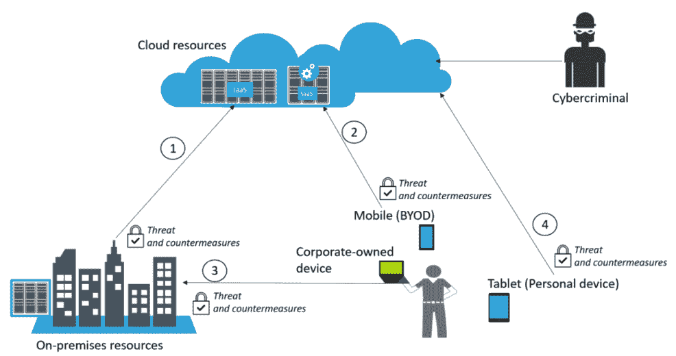
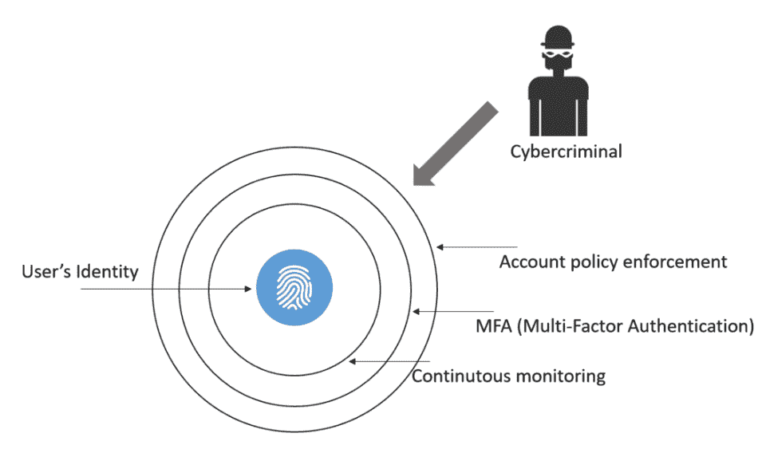
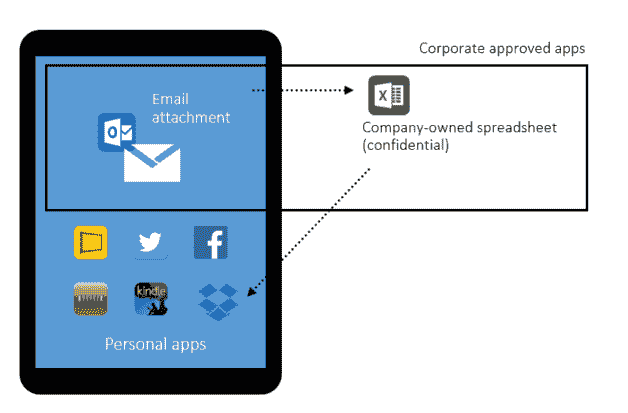
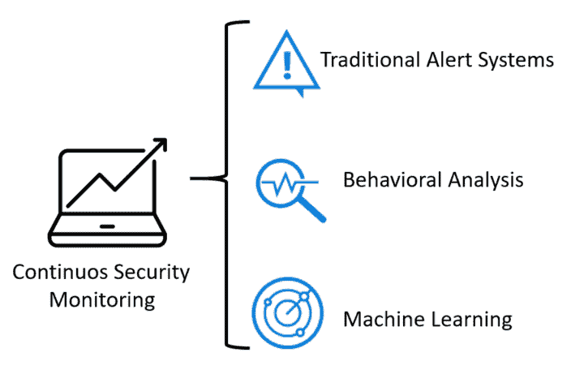
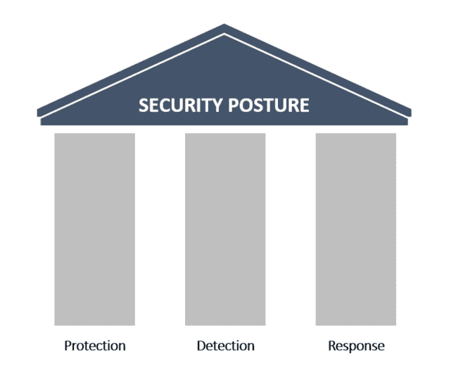
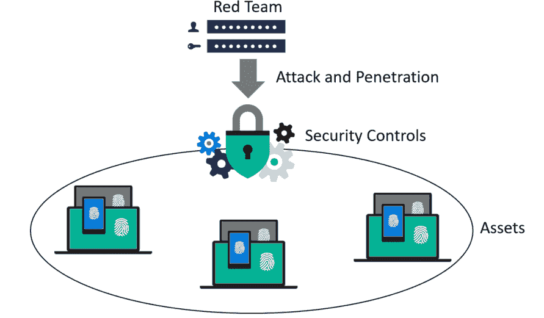
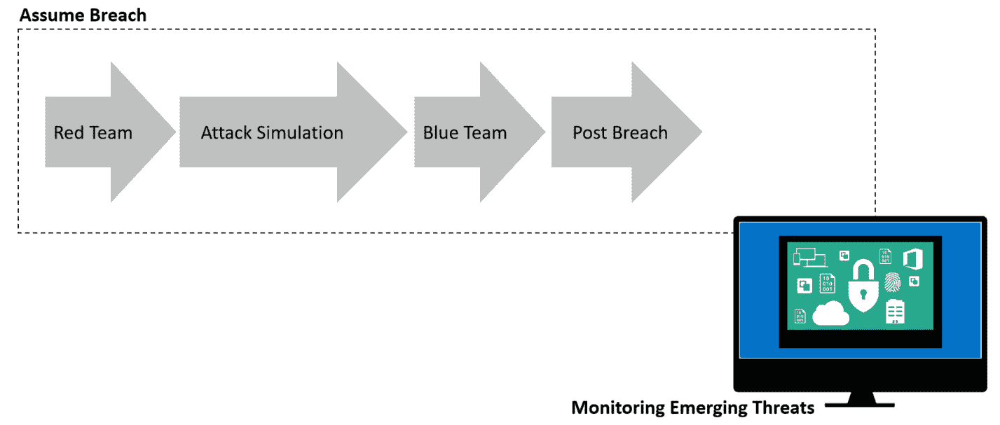

# 第一章：安全态势

多年来，安全投资从*可有可无*转变为*必不可少*，现在全球范围内的组织正在意识到持续投资安全的重要性。这项投资将确保公司在市场中保持竞争力。如果未能妥善保护其资产，可能会导致不可修复的损失，在某些情况下甚至可能导致破产。由于当前的威胁形势，仅仅投资于保护是不够的。组织必须增强其整体安全态势。这意味着保护、检测和响应的投资必须保持一致。

本章将涵盖以下主题：

+   当前的威胁形势

+   网络安全领域的挑战

+   如何提升您的安全态势

+   了解蓝队和红队在您组织中的角色

# 当前的威胁形势

随着始终在线连接的普及以及如今可用的技术进步，威胁正在迅速演变，利用这些技术的不同方面。任何设备都有可能受到攻击，而**物联网**（**IoT**）使这一切成为现实。2016 年 10 月，一系列**分布式拒绝服务**（**DDoS**）攻击被发起，攻击目标是 DNS 服务器，导致一些主要的网络服务停止运行，例如 GitHub、Paypal、Spotify、Twitter 等（1）。

这一切得以实现，归功于全球范围内大量不安全的物联网设备。虽然利用物联网发起大规模网络攻击是一个新现象，但这些设备中的漏洞却并不新鲜。事实上，这些漏洞已经存在了相当长一段时间。2014 年，ESET 报告了 73,000 个使用默认密码的未保护安全摄像头（2）。2017 年 4 月，IOActive 发现了 7,000 个易受攻击的 Linksys 路由器，尽管他们表示可能有多达 100,000 个额外的路由器也暴露在这种漏洞下（3）。

**首席执行官**（**CEO**）甚至可能会问：家庭设备中的漏洞与我们公司的安全有什么关系？这时，**首席信息安全官**（**CISO**）应该准备好回答。因为 CISO 应该更好地了解威胁形势，以及家庭用户设备如何影响公司所需的整体安全防护。答案可以通过两个简单的场景来解释：远程访问和**自带设备**（**BYOD**）。

虽然远程访问并不是新事物，但远程工作者的数量正呈指数增长。根据 Gallup 的数据，已有 43%的美国雇员正在远程工作（4），这意味着他们使用自己的基础设施访问公司资源。更糟糕的是，越来越多的公司允许员工在工作场所使用自带设备（BYOD）。请记住，虽然有办法安全实施 BYOD，但大多数 BYOD 场景中的失败通常是由于糟糕的规划和网络架构，导致实施不安全（5）。

那么，之前提到的所有技术有什么共同之处呢？要操作这些技术，你需要一个用户，而用户仍然是攻击的最大目标。人类是安全链条中的最弱环节。因此，诸如网络钓鱼邮件之类的旧威胁仍然在上升，因为它利用用户的心理诱使用户点击某些东西，比如文件附件或恶意链接。通常，一旦用户执行这些操作之一，他们的设备就会被恶意软件（恶意软件）入侵或被黑客远程访问。

网络钓鱼攻击活动可能从一封钓鱼邮件开始，这将基本上成为攻击者的入口点，随后将利用其他威胁来利用系统中的漏洞。

使用钓鱼邮件作为攻击入口的日益增长的威胁之一是勒索软件。仅在 2016 年初的三个月里，FBI 报告了 2.09 亿美元的勒索软件支付（6）。根据趋势科技的预测，勒索软件的增长将在 2017 年达到顶峰；然而，攻击方法和目标将会多样化（7）。

下图突出显示了这些攻击与最终用户之间的关联：

该图显示了最终用户的四个入口点。所有这些入口点必须识别其风险并采取适当的控制措施。场景列举如下：

+   本地环境与云之间的连接 (**1**)

+   自带设备（BYOD）与云之间的连接 (**2**)

+   公司拥有的设备与本地环境之间的连接 (**3**)

+   个人设备与云之间的连接 (**4**)

请注意，这些是不同的场景，但它们都由一个单一的实体——最终用户相关联。所有场景中的共同元素通常是网络犯罪分子首选的目标，如前图所示，该目标通过访问云资源。

在所有场景中，还有另一个重要元素不断出现，那就是云计算资源。现实情况是，如今你无法忽视很多公司正在采用云计算的事实。绝大多数公司将从混合场景开始，其中**基础设施即服务**（**IaaS**）是他们主要的云服务。还有一些公司可能会选择使用**软件即服务**（**SaaS**）来解决一些方案。例如，**移动设备管理**（**MDM**），如场景**(2)**所示。你可能会认为一些高度安全的组织，比如军队，可能没有云连接。这是可能的，但从商业角度看，云的采用正在增长，并且将慢慢主导大多数部署场景。

本地安全至关重要，因为它是公司的核心所在，绝大多数用户将从这里访问资源。当一个组织决定通过云服务提供商扩展其本地基础设施以使用 IaaS**（1）**时，公司需要评估这种连接的威胁，并通过风险评估确定应对这些威胁的对策。

最后的场景**（4）**可能会引起一些怀疑分析师的兴趣，主要是因为他们可能没有立即看到这个场景与公司资源之间的关联。是的，这是一个个人设备，并没有直接连接到本地资源。然而，如果该设备被攻破，用户可能在以下情况中会威胁到公司数据：

+   从此设备打开公司电子邮件

+   从该设备访问公司 SaaS 应用

+   如果用户使用相同的密码（8）来访问个人邮箱和公司账户，这可能会导致通过暴力破解或密码猜测的账户泄露

采取技术性安全控制措施有助于缓解部分针对最终用户的威胁。然而，主要的保护措施还是通过持续的安全意识培训进行教育。

用户将使用他们的**凭证**与**应用程序**交互，以消费**数据**或将数据写入位于云端或本地的服务器。所有加粗的内容都有独特的威胁场景，必须识别并加以处理。我们将在接下来的章节中讨论这些领域。

# 凭证——身份验证和授权

根据 Verizon 的 2017 年数据泄露调查报告（9），威胁行为者（或称行为者）、他们的动机和作案手法因行业而异。然而，报告指出，盗取凭证是金融动机或有组织犯罪的首选攻击方式。这一数据非常重要，因为它表明威胁行为者正在针对用户凭证进行攻击，从而得出结论：公司必须特别关注用户的身份验证、授权及其访问权限。

行业普遍认为，用户身份是新的边界。这要求安全控制措施专门设计，用于根据用户的工作和对网络中特定数据的需求来认证和授权个人。凭证盗窃可能只是使网络犯罪分子能够访问系统的第一步。拥有网络中的有效用户账户将使他们能够横向移动（pivot），并在某个时刻找到合适的机会提升权限，获取域管理员账户。因此，应用“深度防御”这一旧有概念仍然是保护用户身份的良好策略，如下图所示：

在这里，有多个保护层次，从对账户的常规安全策略执行开始，遵循行业最佳实践，如强密码要求、要求频繁更改密码的政策和密码强度。另一个日益流行的保护用户身份的趋势是强制执行多因素认证（MFA）。一种越来越被采纳的方法是回调功能，用户最初使用其凭证（用户名和密码）进行身份验证，然后接收到一个电话，要求输入他们的 PIN 码。如果两个身份验证因素都成功，他们将被授权访问系统或网络。我们将在第六章《追踪用户身份》中更详细地探讨这个话题。

# 应用程序

应用程序（我们将其称为应用），是用户获取数据并向系统传输、处理或存储信息的入口点。应用程序正在快速发展，基于 SaaS 的应用的采用率也在上升。然而，这些应用的融合也存在固有的问题。以下是两个关键例子：

+   **安全性**：这些在内部开发的应用以及你作为服务付费的应用有多安全？

+   **公司拥有的应用与个人应用**：用户将在自己的设备上拥有一套应用（BYOD 场景）。这些应用如何危及公司的安全态势，是否可能导致潜在的数据泄露？

如果你有一支开发团队在内部构建应用，应该采取措施确保他们在整个软件开发生命周期中使用安全框架，如**微软安全开发生命周期**（**SDL**）（10）。如果你要使用 SaaS 应用，如 Office 365，需要确保阅读供应商的安全性和合规性政策（11）。这里的目的是查看供应商和 SaaS 应用是否能够满足你公司安全性和合规性的要求。

另一个面临的安全挑战是公司如何在不同的应用程序之间处理数据，这些应用程序既包括公司批准使用的应用，也包括最终用户使用的个人应用。在 SaaS 的环境下，这个问题变得更加严重，因为用户在使用许多可能不安全的应用。传统的网络安全方法并未针对 SaaS 应用中的数据保护进行设计，更糟糕的是，它们无法提供 IT 部门所需的可见性，来了解员工如何使用这些应用。这种情况也被称为影子 IT，根据 **Cloud Security Alliance**（**CSA**）进行的一项调查（12），仅有 8% 的公司知道其组织内影子 IT 的范围。你无法保护你不知道的东西，这种状况是非常危险的。

根据卡巴斯基 2016 全球 IT 风险报告（13），54% 的企业认为主要的 IT 安全威胁与通过移动设备不当共享数据有关。IT 部门必须掌控应用程序，并在设备（公司拥有的和自带设备）上强制执行安全策略。以下是你需要缓解的一个关键场景，如下图所示：

在这种场景中，我们有用户的个人平板，它上面既有公司批准的应用，也有个人应用。如果没有一个可以将设备管理与应用管理结合的平台，公司将面临潜在的数据泄露风险。在这种情况下，如果用户将 Excel 表格下载到他的设备上，并将其上传到个人的 Dropbox 云存储，而表格中包含公司的机密信息，那么用户就无意中造成了数据泄露，公司既无法知晓，也无法加以保护。

# 数据

在上一节结束时我们提到数据时，我们应该确保数据始终受到保护，无论其当前状态是 (*传输中* 还是 *静止状态*)。根据数据的状态，可能会面临不同的威胁。以下是一些潜在威胁及应对措施的示例：

| **状态** | **描述** | **威胁** | **应对措施** | **受影响的安全三要素** |
| --- | --- | --- | --- | --- |
| 数据在用户设备上的静止状态。 | 数据当前存储在用户的设备上。 | 未授权或恶意的进程可能读取或修改数据。 | 静止状态下的数据加密，可以是文件级加密或磁盘加密。 | 保密性和完整性。 |
| 数据传输中。 | 数据当前正从一个主机传输到另一个主机。 | 中间人攻击可能会读取、修改或劫持数据。 | 可以使用 SSL/TLS 来加密传输中的数据。 | 保密性和完整性。 |
| 静态数据存储在本地（服务器）或云端 | 数据存储在本地服务器的硬盘或云端存储池中 | 未授权或恶意进程可能读取或修改数据 | 数据加密存储。可以是文件级别的加密或磁盘加密 | 保密性和完整性 |

这些只是潜在威胁和建议对策的一些例子。必须进行更深入的分析，以根据客户需求全面理解数据路径。每个客户在数据路径、合规性、规则和规定方面都有自己的特殊要求。即使在项目开始之前，理解这些需求也至关重要。

# 网络安全挑战

为了分析当今公司面临的网络安全挑战，需要获取具体数据和目前市场上发生的事件的证据。并非所有行业都面临相同类型的网络安全挑战，因此我们将列举在不同领域中仍然最为普遍的威胁。这似乎是最适合网络安全分析师的方式，尤其是那些并不专门从事某些行业分析的分析师，但在某个时刻，他们可能需要处理自己并不熟悉的行业。

# 旧技术与广泛结果

根据卡巴斯基全球 IT 风险报告 2016（14），导致最昂贵数据泄露的主要原因来自于一些随着时间演变的旧攻击，按顺序如下：

+   病毒、恶意软件和木马

+   缺乏尽职调查和未经培训的员工

+   网络钓鱼与社会工程学

+   定向攻击

+   加密货币和勒索软件

尽管这个列表中的前三种攻击是旧有的“嫌疑犯”，并且在网络安全社区中非常知名，但它们仍然屡屡得手，因此仍然是当前网络安全挑战的一部分。这三者的真正问题在于它们通常与人为错误相关。如前所述，所有问题可能从一封网络钓鱼邮件开始，利用社会工程学引导员工点击一个链接，从而可能下载病毒、恶意软件或木马。在上文中，我们已在一个场景中涵盖了这三种情况。

*有针对性的攻击*（或高级持久威胁）这个术语对某些人来说可能不太清晰，但有一些关键特征可以帮助你识别此类攻击是否正在发生。最重要的特征是，攻击者在开始制定攻击计划时已经有了特定的目标。在这个初始阶段，攻击者将花费大量时间和资源进行公开侦察，以获取执行攻击所需的信息。这种攻击背后的动机通常是数据外泄，换句话说，窃取数据。此类攻击的另一个特征是持久性，即他们在目标网络上保持持续访问的时间。其意图是在网络中持续横向移动，侵入不同的系统，直到达到目标。

在这一领域面临的最大挑战之一是，在攻击者已经进入网络后识别攻击者。传统的检测系统，如**入侵检测系统**（**IDS**），可能无法及时警示发生的可疑活动，尤其是在流量加密时。许多研究者已经指出，从渗透到检测可能需要长达 229 天的时间（15）。缩短这一间隔绝对是网络安全专业人员面临的最大挑战之一。

加密货币和勒索软件是新兴和增长迅速的威胁，为组织和网络安全专业人员带来了全新的挑战。2017 年 5 月，全球震惊于有史以来最大的勒索软件攻击，名为 Wannacry。这种勒索软件利用了一个已知的 Windows SMBv1 漏洞，该漏洞的补丁已于 2017 年 3 月发布（攻击发生前 59 天），通过 MS17-010（16）公告。攻击者使用了一个称为 EternalBlue 的漏洞利用工具，由一个名为 Shadow Brokers 的黑客组织在 2017 年 4 月发布。根据 MalwareTech（18）的说法，这种勒索软件感染了全球超过 40 万台计算机，这是一种前所未见的大规模攻击。从这次攻击中得到的一个教训是，全球企业仍然未能实施有效的漏洞管理程序，这是我们将在第十五章，*漏洞管理*中更详细地讨论的内容。

非常重要的一点是提到，钓鱼邮件仍然是勒索软件的主要传播方式，这意味着我们再次回到了同样的循环，即通过社会工程学减少成功利用人为因素的可能性，并采取严格的技术安全控制措施来保护和检测。

# 威胁格局的转变

2016 年，一波新的攻击也获得了广泛的关注，当时 CrowdStrike 报告称，它已经识别出两组与俄罗斯情报相关的对手，他们出现在美国**民主党全国委员会**（**DNC**）的网络中（19）。根据他们的报告，他们发现了两组俄罗斯黑客团体在 DNC 网络中活动的证据：Cozy Bear（也被归类为 APT29）和 Fancy Bear（APT28）。Cozy Bear 并不是这一类型攻击中的新兴参与者，因为证据表明，2015 年（20），他们曾通过鱼叉式钓鱼攻击发起对五角大楼邮件系统的攻击。

这种类型的情境被称为政府支持的网络攻击，但一些专家更倾向于更通用地称其为*数据作为武器*，因为其目的是窃取可以用来对抗被攻击方的信息。私营部门不应忽视这些迹象。

现如今，持续的安全监控必须至少利用下图所示的三种方法：

这只是其中一个原因，为什么组织开始更加重视威胁情报、机器学习和分析以保护其资产变得尤为重要。我们将在第十二章《威胁情报》中详细讨论这一点。

# 提升您的安全态势

如果您仔细阅读本章内容，应该非常清楚，面对当今的挑战和威胁，您无法继续使用传统的安全方法。因此，确保您的安全态势能够应对这些挑战至关重要。为了实现这一目标，您必须巩固当前的保护系统，确保它能适应不同设备的安全需求，无论其形式如何。

同时，重要的是使 IT 和安全操作能够快速识别攻击，通过增强检测系统来实现这一点。最后但同样重要的是，必须通过提升响应流程的有效性，减少感染与控制之间的时间，以便快速应对攻击。

基于此，我们可以安全地说，安全态势由以下图示的三大基础支柱组成：

这些支柱必须得到巩固，如果过去大多数预算都用于保护，现在更需要将投资和努力的程度分布到其他支柱上。这些投资不仅仅局限于技术安全控制，还必须涵盖业务的其他领域，包括管理控制。

建议进行自我评估，从工具的角度识别每个支柱中的差距。许多公司随着时间的推移发展壮大，但从未真正更新其安全工具，以适应新的威胁格局以及攻击者如何利用漏洞进行攻击。

拥有强化安全防护的公司不应属于之前提到的统计数据中的一部分（入侵与检测之间的时间为 229 天）。这一差距应当大幅缩短，响应应当立刻发生。为了实现这一目标，必须建立一个更好的事件响应流程，并配备能够帮助安全工程师调查与安全相关问题的现代化工具。第二章，*事件响应流程*将更详细地讨论事件响应，第十三章，*调查事件*，则会介绍一些与实际安全调查相关的案例研究。

# 红队与蓝队

红队/蓝队演习并不是新鲜事物。最初的概念很久以前就已经在第一次世界大战期间提出，像许多信息安全领域的术语一样，源于军事。其基本想法是通过模拟来展示攻击的有效性。

例如，1932 年，海军少将哈里·E·亚内尔演示了对珍珠港攻击的有效性。九年后，当日本袭击珍珠港时，便可以进行对比，看到类似的战术是如何被使用的（22）。

基于敌方可能使用的真实战术的模拟效果已经得到了广泛认可，并在军事中得到应用。外军及文化研究大学有专门的课程，专门为红队参与者和领导者做准备（23）。虽然军事中的红队概念更加广泛，但通过威胁仿真提供的情报支持与网络安全红队试图实现的目标相似。**国土安全演习与评估计划**(**HSEEP**)(24)也在预防演习中使用红队，通过追踪敌方的行动并基于这些演习的结果制定对策。

在网络安全领域，采用红队方法也帮助组织保持资产的安全。红队必须由高度训练的人员组成，具备不同的技能，他们必须充分了解组织所在行业的当前威胁环境。红队需要了解当前攻击的趋势，并理解这些攻击是如何发生的。在某些情况下，并根据组织的需求，红队成员必须具备编码技能，能够创建自己的漏洞利用工具，并根据相关漏洞定制化，以便更好地利用可能影响组织的漏洞。

核心的**红队**工作流程采用以下方法：

**红队**将执行攻击，通过突破当前的安全控制措施渗透环境，这也被称为渗透测试。任务的目的是寻找漏洞并加以利用，从而获得公司资产的访问权限。攻击和渗透阶段通常遵循洛克希德·马丁方法，发布在论文《基于对敌方攻击活动和入侵杀伤链分析的情报驱动的计算机网络防御》（25）中。我们将在第三章中详细讨论杀伤链，*理解网络安全杀伤链*。

红队还需要登记他们的核心指标，这对业务非常重要。主要指标如下：

+   **妥协的平均时间（MTTC）**：从红队发起攻击的那一刻开始计时，直到他们成功突破目标的时刻为止。

+   **特权升级的平均时间（MTTP）**：这与前一个指标从同一时刻开始，但一直持续到完全妥协，即红队拥有目标的管理员权限时为止。

到目前为止，我们已经讨论了红队的能力，但没有反向应对的合作方，蓝队，演练是不会完成的。蓝队需要确保资产安全，并且如果红队发现漏洞并加以利用，他们需要迅速修复并记录，作为教训的一部分。

以下是一些蓝队在对手（本例为红队）成功突破系统时执行的任务示例：

+   **保存证据**：在这些事件中，保存证据至关重要，以确保你拥有可以分析、合理化并采取行动以减轻未来风险的实际信息。

+   **验证证据**：并非每一个警报，或者在本案例中提到的证据，都会导致你发现一次有效的攻击尝试。但如果确实是，必须将其归类为**妥协迹象**（**IOC**）。

+   **与相关人员沟通**：此时，蓝队必须知道如何处理这些 IOC，并且哪些团队应该了解此次妥协事件。与所有相关团队沟通，根据组织的不同，这些团队可能有所不同。

+   **事件的分类**：有时，蓝队可能需要与执法部门合作，或者他们可能需要获得搜查令才能进一步调查，适当的事件分类将有助于此过程。

+   **确定违规范围**：此时，蓝队已获得足够信息来确定违规范围。

+   **制定补救计划**：蓝队应制定一个补救计划，以隔离或驱逐对手。

+   **执行计划**：一旦计划完成，蓝队需要执行该计划并恢复系统。

蓝队成员应具备广泛的技能组合，且应由来自不同部门的专业人员组成。请记住，一些公司确实有专门的红蓝队，而另一些则没有。公司通常只在演练期间组建这些团队。与红队一样，蓝队也负责一些安全指标，尽管这些指标在此情况下并不完全精确。指标不精确的原因是，蓝队可能并不确切知道红队何时成功入侵系统。尽管如此，这一估计对于这种类型的演练来说已经足够准确。你可以在以下列表中看到这些估计的自我解释：

+   **检测预计时间**（**ETTD**）

+   **恢复预计时间**（**ETTR**）

蓝队和红队的工作并不会因为红队成功入侵系统而结束。此时仍有大量工作需要完成，这将需要这些团队的全面协作。必须制作最终报告，重点说明入侵发生的细节，提供攻击的时间线，说明为获取访问权限和提升权限（如适用）所利用的漏洞，以及此次攻击对公司造成的商业影响。

# 假设入侵

由于新兴的威胁和网络安全挑战，必须将方法论从防止入侵转变为假设入侵。传统的防止入侵方法本身并没有促进持续的测试，而要应对现代威胁，必须始终在完善你的保护措施。因此，将这一模型引入网络安全领域是一个自然的步骤。

当前中央情报局和国家安全局前局长、退役将军迈克尔·海登在 2012 年说过（26）：

“从根本上讲，如果有人想进入，他们就能进得去。好，接受这一点。”

在一次访谈中，许多人并不完全理解他真正的意思，但这句话正是假设入侵方法的核心。假设入侵验证了保护、检测和响应，确保它们被正确实施。但为了将这一理念付诸实践，关键在于利用红蓝队演练来模拟针对自身基础设施的攻击，并测试公司安全控制、传感器和事件响应过程。

在下面的图表中，你可以看到**红队**/**蓝队**演练中各个阶段之间的互动示例：

在入侵后的阶段，红队和蓝队将共同合作生成最终报告。必须强调的是，这不应仅是一次性的演练，而应该是一个持续的过程，随着时间的推移，通过最佳实践不断精炼和改进。

# 参考文献

你可以参考以下文章：

1.  请参考 [`www.darkreading.com/attacks-breaches/new-iot-botnet-discovered-120k-ip-cameras-at-risk-of-attack/d/d-id/1328839`](http://www.darkreading.com/attacks-breaches/new-iot-botnet-discovered-120k-ip-cameras-at-risk-of-attack/d/d-id/1328839)

1.  请参考 [`www.welivesecurity.com/2014/11/11/website-reveals-73000-unprotected-security-cameras-default-passwords/`](https://www.welivesecurity.com/2014/11/11/website-reveals-73000-unprotected-security-cameras-default-passwords/)

1.  请参考 [`threatpost.com/20-linksys-router-models-vulnerable-to-attack/125085/`](https://threatpost.com/20-linksys-router-models-vulnerable-to-attack/125085/)

1.  请参考 [`www.nytimes.com/2017/02/15/us/remote-workers-work-from-home.html`](https://www.nytimes.com/2017/02/15/us/remote-workers-work-from-home.html)

1.  阅读 ISSA Journal 上发布的关于采用 BYOD 的供应商中立指南 [`blogs.technet.microsoft.com/yuridiogenes/2014/03/11/byod-article-published-at-issa-journal/`](https://blogs.technet.microsoft.com/yuridiogenes/2014/03/11/byod-article-published-at-issa-journal/)

1.  请参考 [`www.csoonline.com/article/3154714/security/ransomware-took-in-1-billion-in-2016-improved-defenses-may-not-be-enough-to-stem-the-tide.html`](http://www.csoonline.com/article/3154714/security/ransomware-took-in-1-billion-in-2016-improved-defenses-may-not-be-enough-to-stem-the-tide.html)

1.  请参考 [`blog.trendmicro.com/ransomware-growth-will-plateau-in-2017-but-attack-methods-and-targets-will-diversify/`](http://blog.trendmicro.com/ransomware-growth-will-plateau-in-2017-but-attack-methods-and-targets-will-diversify/)

1.  阅读本文了解使用相同密码登录不同账户的危险性 [`www.telegraph.co.uk/finance/personalfinance/bank-accounts/12149022/Use-the-same-password-for-everything-Youre-fuelling-a-surge-in-current-account-fraud.html`](http://www.telegraph.co.uk/finance/personalfinance/bank-accounts/12149022/Use-the-same-password-for-everything-Youre-fuelling-a-surge-in-current-account-fraud.html)

1.  下载报告 [`www.verizonenterprise.com/resources/reports/rp_DBIR_2017_Report_en_xg.pdf`](http://www.verizonenterprise.com/resources/reports/rp_DBIR_2017_Report_en_xg.pdf)

1.  了解更多关于 SDL 的信息 [`www.microsoft.com/sdl`](https://www.microsoft.com/sdl)

1.  Microsoft Office 365 安全与合规性可以在 [`support.office.com/en-us/article/Office-365-Security-Compliance-Center-7e696a40-b86b-4a20-afcc-559218b7b1b8`](https://support.office.com/en-us/article/Office-365-Security-Compliance-Center-7e696a40-b86b-4a20-afcc-559218b7b1b8) 查阅

1.  阅读完整研究报告 [`downloads.cloudsecurityalliance.org/initiatives/surveys/capp/Cloud_Adoption_Practices_Priorities_Survey_Final.pdf`](https://downloads.cloudsecurityalliance.org/initiatives/surveys/capp/Cloud_Adoption_Practices_Priorities_Survey_Final.pdf)

1.  阅读完整报告，访问 [`www.kasperskyreport.com/?gclid=CN_89N2b0tQCFQYuaQodAQoMYQ`](http://www.kasperskyreport.com/?gclid=CN_89N2b0tQCFQYuaQodAQoMYQ)

1.  你可以从 [`www.kasperskyreport.com/?gclid=CN_89N2b0tQCFQYuaQodAQoMYQ`](http://www.kasperskyreport.com/?gclid=CN_89N2b0tQCFQYuaQodAQoMYQ) 下载报告

1.  请参考 [`info.microsoft.com/ME-Azure-WBNR-FY16-06Jun-21-22-Microsoft-Security-Briefing-Event-Series-231990.html?ls=Social`](https://info.microsoft.com/ME-Azure-WBNR-FY16-06Jun-21-22-Microsoft-Security-Briefing-Event-Series-231990.html?ls=Social)

1.  阅读 Microsoft 公告以获取更多信息 [`technet.microsoft.com/en-us/library/security/ms17-010.aspx`](https://technet.microsoft.com/en-us/library/security/ms17-010.aspx)

1.  阅读此文章以获取关于该组织的更多信息 [`www.symantec.com/connect/blogs/equation-has-secretive-cyberespionage-group-been-breached`](https://www.symantec.com/connect/blogs/equation-has-secretive-cyberespionage-group-been-breached)

1.  请参考 [`twitter.com/MalwareTechBlog/status/865761555190775808`](https://twitter.com/MalwareTechBlog/status/865761555190775808)

1.  请参考 [`www.crowdstrike.com/blog/bears-midst-intrusion-democratic-national-committee/`](https://www.crowdstrike.com/blog/bears-midst-intrusion-democratic-national-committee/)

1.  请参考 [`www.cnbc.com/2015/08/06/russia-hacks-pentagon-computers-nbc-citing-sources.html`](http://www.cnbc.com/2015/08/06/russia-hacks-pentagon-computers-nbc-citing-sources.html)

1.  请参考 [`www.theverge.com/2017/5/17/15655484/wannacry-variants-bitcoin-monero-adylkuzz-cryptocurrency-mining`](https://www.theverge.com/2017/5/17/15655484/wannacry-variants-bitcoin-monero-adylkuzz-cryptocurrency-mining)

1.  请参考 [`www.quora.com/Could-the-attack-on-Pearl-Harbor-have-been-prevented-What-actions-could-the-US-have-taken-ahead-of-time-to-deter-dissuade-Japan-from-attacking#!n=12`](https://www.quora.com/Could-the-attack-on-Pearl-Harbor-have-been-prevented-What-actions-could-the-US-have-taken-ahead-of-time-to-deter-dissuade-Japan-from-attacking#!n=12)

1.  你可以在 [`usacac.army.mil/sites/default/files/documents/ufmcs/The_Applied_Critical_Thinking_Handbook_v7.0.pdf`](http://usacac.army.mil/sites/default/files/documents/ufmcs/The_Applied_Critical_Thinking_Handbook_v7.0.pdf) 下载红队手册

1.  请参考 [`www.fema.gov/media-library-data/20130726-1914-25045-8890/hseep_apr13_.pdf`](https://www.fema.gov/media-library-data/20130726-1914-25045-8890/hseep_apr13_.pdf)

1.  从 [`www.lockheedmartin.com/content/dam/lockheed/data/corporate/documents/LM-White-Paper-Intel-Driven-Defense.pdf`](https://www.lockheedmartin.com/content/dam/lockheed/data/corporate/documents/LM-White-Paper-Intel-Driven-Defense.pdf) 下载报告

1.  请参考 [`www.cbsnews.com/news/fbi-fighting-two-front-war-on-growing-enemy-cyber-espionage/`](http://www.cbsnews.com/news/fbi-fighting-two-front-war-on-growing-enemy-cyber-espionage/)

# 摘要

在本章中，你了解了当前的威胁形势，以及这些新型威胁是如何用来危害凭证、应用程序和数据的。在许多情况下，仍然使用传统的黑客技术，例如网络钓鱼邮件，但手法更加复杂。你还了解了目前有关全国性威胁类型和政府目标攻击的现实情况。为了保护你的组织免受这些新威胁的侵害，你了解了一些关键因素，可以帮助你提升安全态势。至关重要的是，这种提升需要将关注点从仅仅保护转向包括检测和响应。因此，使用红队和蓝队变得至关重要。这个概念同样适用于假设漏洞方法论。

在下一章，你将继续学习如何提升你的安全态势。然而，本章将重点讲解事件响应过程。事件响应过程对于那些需要更好地检测和应对网络威胁的公司来说至关重要。
