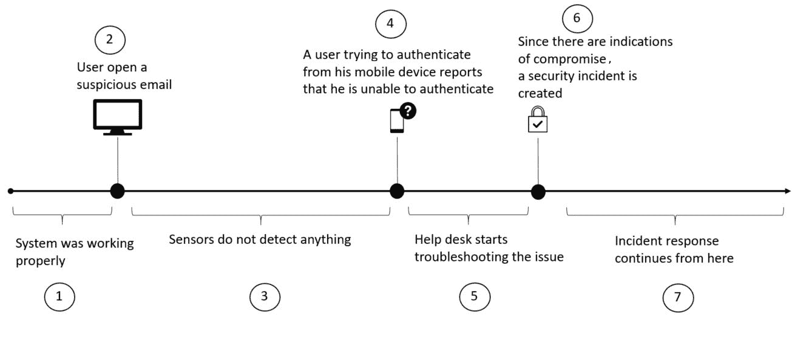
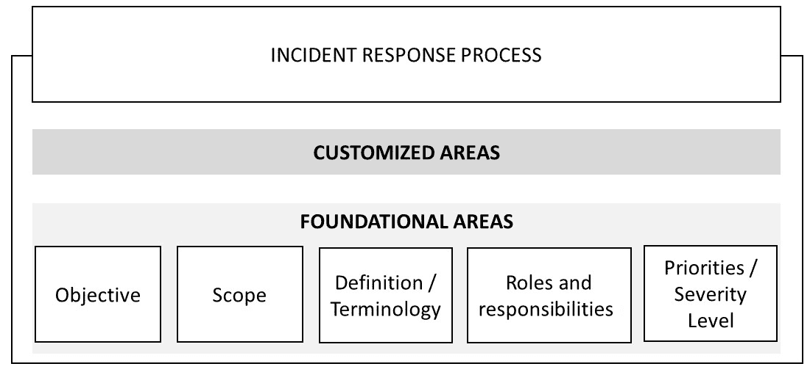
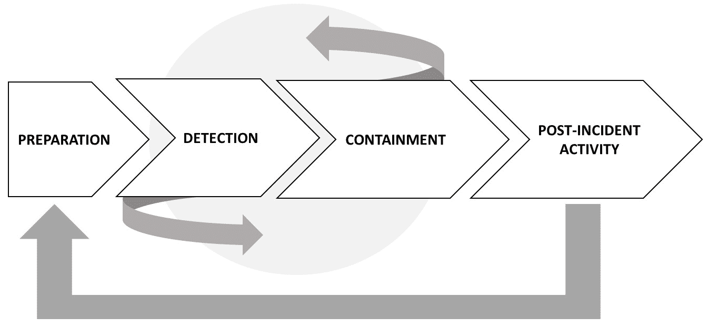
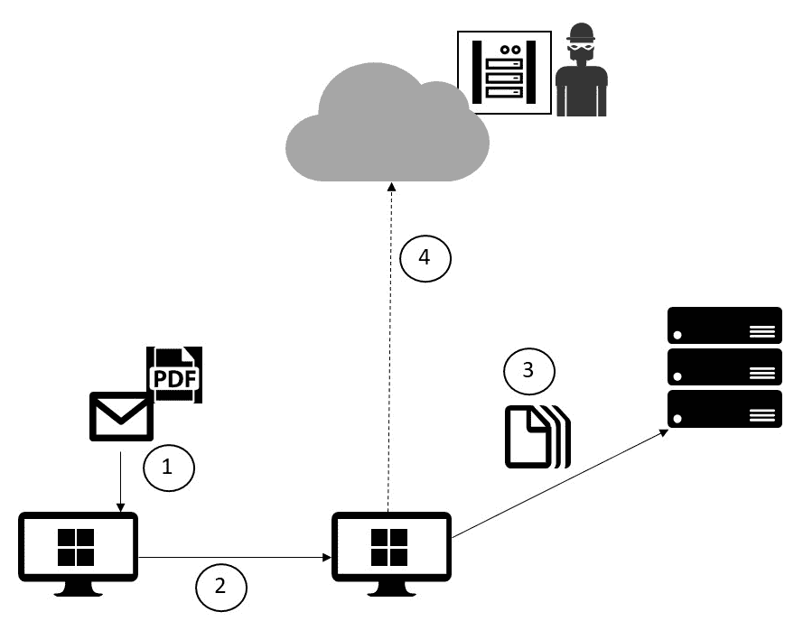
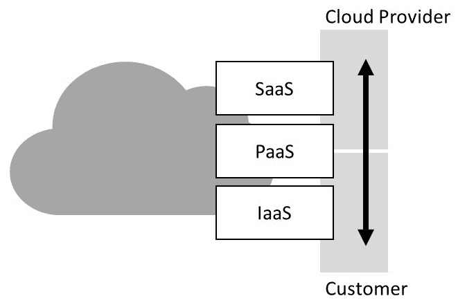

# 第二章：事件响应流程

在上一章中，您了解了支撑您安全姿态的三大支柱，其中两个（检测和响应）与**事件响应**（**IR**）流程直接相关。为了增强您安全姿态的基础，您需要一个坚实的事件响应流程。这个流程将指导如何处理安全事件并迅速做出响应。许多公司确实有事件响应流程，但它们未能不断审查以吸取以往事件的教训，并且更重要的是，许多公司没有准备好在云环境中处理安全事件。

在本章中，我们将涵盖以下主题：

+   事件响应流程

+   处理事件

+   事后活动

# 事件响应流程

有许多行业标准、建议和最佳实践可以帮助您创建自己的事件响应。您仍然可以将它们用作参考，以确保涵盖适合您业务类型的所有相关阶段。我们在本书中将用作参考的是**计算机安全事件响应**（**CSIR**）—NIST（1）的出版物 800-61R2。

# 设立 IR 流程的原因

在我们深入了解流程本身的更多细节之前，了解一些术语的使用以及在使用 IR 作为增强安全姿态的一部分时的最终目标是很重要的。为什么这很重要？让我们用一个虚构的公司来说明为什么这很重要。

以下图表显示了事件时间轴(2)，引导帮助台升级问题并启动事件响应流程：

以下表格列出了此场景中每个步骤的一些考虑事项：

| **步骤** | **描述** | **安全考虑** |
| --- | --- | --- |
| 1 | 虽然图表显示系统正常运行，但从这个事件中学习很重要。 | 什么被认为是正常的？您是否有一个基线可以证明系统正常运行？您确定在电子邮件之前没有被入侵的证据吗？ |
| 2 | 钓鱼邮件仍然是网络犯罪分子用来诱使用户点击导致恶意/被入侵网站的链接的最常见方法之一。 | 虽然必须有技术安全控制来检测和过滤这些类型的攻击，但用户必须学会如何识别钓鱼邮件。 |
| 3 | 如今使用的许多传统传感器（IDS/IPS）无法识别渗透和横向移动。 | 为了增强您的安全姿态，您需要改进技术安全控制，并缩小感染和检测之间的差距。 |
| 4 | 这已经是此次攻击造成的附带损害的一部分。凭证已被泄露，用户在进行身份验证时遇到了问题。 | 应该有技术安全控制措施，使 IT 能够重置用户的密码，并同时强制执行多因素身份验证。 |
| 5 | 并非每一个事件都与安全有关；因此，对于帮助台来说，执行初始故障排除以隔离问题是很重要的。 | 如果已经存在的技术安全控制措施（步骤*3*）能够识别攻击，或者至少提供一些可疑活动的证据，帮助台就不必再排查问题了—它可以直接遵循事件响应流程。 |
| 6 | 此时，帮助台正在执行其应该做的事情，收集系统被入侵的证据并升级问题。 | 帮助台应尽可能多地获取有关可疑活动的信息，以证明他们认为这是一个与安全相关的事件的理由。 |
| 7 | 此时，事件响应流程接管并按照自己的路径进行，这可能会根据公司、行业领域和标准而有所不同。 | 很重要的是记录流程的每一个步骤，并在事件解决后，结合所学到的经验，以增强整体安全姿态。 |

在先前的情景中有很大的改进空间，但在这家虚构公司中存在着许多其他公司在世界各地都缺少的东西：事件响应本身。如果不是因为已经存在的事件响应流程，支持专业人员将通过专注于基础设施相关问题来耗尽他们的故障排除工作。拥有良好安全姿态的公司会有一个事件响应流程。

他们还应确保遵守以下准则：

+   所有 IT 人员都应该接受培训，了解如何处理安全事件。

+   所有用户都应该接受培训，了解安全的核心基本知识，以更安全地执行他们的工作，这将有助于避免感染。

+   应该在他们的帮助台系统和事件响应团队之间进行集成，以实现数据共享。

+   这种情景可能会有一些变化，引入不同的挑战。一个变化可能是在步骤*6*中找不到**入侵指示**（**IoC**）。在这种情况下，帮助台将轻松地继续排查问题。如果在某个时候事情开始恢复正常呢？这种情况可能吗？是的，可能！

+   当攻击者渗透到网络中时，他们通常希望保持隐形，在不同的主机之间横向移动，破坏多个系统并试图通过破坏具有管理员级权限的帐户来提升权限。这也是为什么不仅在网络中，而且在主机本身也需要部署良好的传感器如此重要的原因。有了好的传感器，不仅能够快速检测到攻击，还能识别出可能导致迫在眉睫的安全违规威胁的潜在场景（3）。

+   除了刚才提到的所有因素外，一些公司很快会意识到，他们必须制定一个事件响应流程，以符合适用于其所属行业的法规。例如，FISMA 要求联邦机构必须制定程序来检测、报告和响应安全事件。

# 创建一个事件响应流程

虽然事件响应流程会根据公司及其需求有所不同，但其中一些基本方面在不同行业间是相同的。

以下图示展示了事件响应流程的基础领域：

创建事件响应流程的第一步是确立目标——换句话说，就是回答这个问题：这个流程的目的是什么？虽然这看起来有些多余，因为名称似乎不言自明，但明确流程的目的非常重要，以确保每个人都清楚这个流程的目标是什么。

一旦目标定义清楚，接下来需要制定范围。再次提醒，你可以通过回答一个问题来开始这一过程，在这个情况下就是：这个流程适用于谁？

尽管事件响应流程通常具有公司范围的覆盖，但在某些情况下，它也可以具有部门范围。因此，定义该流程是否为公司范围的流程非常重要。

每个公司对安全事件的认知可能不同；因此，必须明确定义什么构成安全事件，并提供示例。

除了定义之外，公司还必须创建自己的术语表，列出所使用术语的定义。不同的行业会有不同的术语集合，如果这些术语与安全事件相关，必须进行文档化。

在事件响应过程中，角色和责任至关重要。如果没有适当的权限级别，整个过程将面临风险。

在处理安全事件响应时，**权限级别**的重要性显而易见，当你考虑这个问题时：谁有权没收计算机以进行进一步调查？通过定义具有这种权限级别的用户或群体，确保整个公司都了解这一点，并且如果发生事件时，他们不会质疑执行该政策的团队。

什么定义了关键事件？当事件发生时，你将如何分配人力资源？你是否应该为事件"A"分配比事件"B"更多的资源？为什么？这些只是一些示例问题，应该回答这些问题以明确优先级和严重性级别。

为了确定优先级和严重性级别，你还需要考虑以下商业方面：

+   **事件对业务的功能性影响**：受影响系统对业务的重要性将直接影响事件的优先级。所有受影响系统的相关方都应该了解这个问题，并且在确定优先级时提供意见。

+   **事件影响的信息类型**：每次处理个人身份信息（PII）时，事件的优先级都会很高；因此，这是在事件处理中需要优先验证的首要元素。

+   **可恢复性**：在初步评估之后，可以估算从事件中恢复所需的时间。根据恢复时间以及系统的关键性，这可能会将事件的优先级推高至高严重性。

除了这些基本领域，事件响应过程还需要定义如何与第三方、合作伙伴和客户互动。

例如，如果发生了一个事件，并且在调查过程中发现客户的**个人身份信息**（**PII**）被泄露，那么公司将如何将这一信息传达给媒体？在事件响应过程中，媒体沟通应与公司的数据披露安全政策一致。法律部门也应在发布新闻稿之前参与，以确保声明没有法律问题。与执法部门合作的程序也必须在事件响应过程中记录下来。在记录时，需要考虑事件发生的物理位置——事件发生地、服务器所在位置（如果适用），以及所在州。通过收集这些信息，能够更容易识别管辖权并避免冲突。

# 事件响应团队

现在你已经涵盖了基本领域，接下来需要组建事件响应团队。团队的组成将根据公司规模、预算和目标有所不同。一家大公司可能希望采用分布式模型，其中有多个事件响应团队，每个团队都有特定的属性和责任。对于那些地理分散、计算资源分布在多个地区的组织来说，这种模型非常有用。其他公司可能希望将整个事件响应团队集中在一个实体中，由该团队处理所有地点的事件。

选择好将要使用的模型后，公司将开始招聘员工，组成团队。

事件响应过程需要具备广泛技术知识的人员，同时还需要在其他一些领域具有深入的知识。挑战在于找到在这一领域既有深度又有广度的人才，这有时会导致结论——你需要雇佣外部人员来填补某些岗位，甚至将部分事件响应团队外包给其他公司。

事件响应团队的预算还必须涵盖通过教育进行的持续改进、获得适当的工具（软件）和硬件。随着新威胁的出现，参与事件响应的安全专业人员必须随时准备并经过培训，以便做出良好的响应。许多公司未能保持员工的持续更新，这是不良的做法。在外包事件响应过程中，确保你所雇佣的公司会对不断培训其员工负责。

如果你计划外包事件响应操作，确保你有一个明确的**服务水平协议**（**SLA**），以满足之前设定的严重性级别。在此阶段，你还应定义团队的覆盖范围，假设需要进行 24 小时操作。

在这里，你将定义：

+   **班次**：将提供多少个班次以确保 24 小时覆盖？

+   **团队分配**：根据这些班次，谁将负责每个班次的工作，包括全职员工和承包商？

+   **值班流程**：建议对技术和管理角色进行值班轮换，以防问题需要升级处理。

# 事件生命周期

每个开始的事件必须有一个结束，而在开始与结束之间发生的事情是不同的阶段，这些阶段将决定响应过程的结果。这是一个持续的过程，我们称之为事件生命周期。到目前为止，我们所描述的可以视为准备阶段。然而，这一阶段比这更为广泛——它还包括基于初步风险评估（这一评估应该在创建事件响应过程之前进行）所制定的安全控制措施的部分实施。

准备阶段还包括实施其他安全控制措施，例如：

+   终端保护

+   恶意软件保护

+   网络安全

准备阶段并非静态，您可以在下图中看到该阶段将接收来自事后活动的输入。

生命周期的其他阶段及其相互作用也在这个图表中显示：

**检测**和**遏制**阶段可能在同一事件中有多次交互。一旦循环结束，您将进入事后活动阶段。接下来的部分将更详细地介绍这三个阶段。

# 处理事件

在 IR 生命周期的背景下处理事件包括检测和遏制阶段。为了检测威胁，您的检测系统必须了解攻击向量，由于威胁形势变化如此迅速，检测系统必须能够动态学习更多关于新威胁和新行为的信息，并在遇到可疑活动时触发警报。

尽管许多攻击将被检测系统自动检测到，但最终用户在发现可疑活动时发挥着重要作用，应及时报告问题。

因此，最终用户还应了解不同类型的攻击，并学习如何手动创建事件工单以解决此类行为。这应该是安全意识培训的一部分。

即使用户通过密切关注可疑活动并配置传感器在检测到威胁时发送警报，IR 过程中最具挑战性的部分仍然是准确检测真正的安全事件。

通常，您需要手动从不同来源收集信息，以查看您收到的警报是否真实反映了对系统中漏洞的利用企图。请记住，数据收集必须符合公司政策。在需要将数据带到法庭的情况下，您需要保证数据的完整性。

以下图表显示了一个示例，其中需要组合和关联多个日志以识别攻击者的最终目标：

在这个例子中，我们有许多 IoC，当我们将所有要素组合在一起时，我们可以验证攻击。

以下表格更详细地解释了图表内容：

| **步骤** | **日志** | **攻击/操作** |
| --- | --- | --- |
| 1 | 端点保护和操作系统日志可帮助确定 IoC | 钓鱼邮件 |
| 2 | 端点保护和操作系统日志可帮助确定 IoC | 横向移动后特权升级 |
| 3 | 服务器日志和网络捕获可帮助确定 IoC | 未经授权或恶意进程可能读取或修改数据 |
| 4 | 假设云端和本地资源之间存在防火墙，防火墙日志和网络抓包可以帮助确定攻击指示（IoC） | 数据提取并提交给指挥与控制中心 |

如你所见，已有许多安全控制措施可以帮助确定是否存在安全漏洞。然而，将它们整合到攻击时间线中，并交叉分析数据，可能会更具威力。

这再次提到我们在前一章中讨论的话题，即检测正成为公司最重要的安全控制之一。分布在网络各处（包括本地和云端）的传感器将在人为活动可疑性识别和警报生成中发挥重要作用。网络安全中一个日益增长的趋势是利用安全情报和先进分析技术来更快地检测威胁，并减少误报。这可以节省时间并提高整体准确性。

理想情况下，监控系统应该与传感器集成，以便你能够在一个仪表盘中可视化所有事件。如果你使用的是不同的平台，且它们之间无法互相互动，那么可能就无法实现这种集成。

在一个类似于我们之前讨论过的场景中，检测与监控系统之间的集成可以帮助连接多个恶意行为，这些行为的最终目的是为了完成最终任务——数据提取并提交给指挥与控制中心。

一旦事件被检测并确认是真实事件，你需要收集更多的数据或分析现有的数据。如果这是一个持续发生的问题，且攻击正发生在此时，你需要从攻击现场获取实时数据，并快速提供解决方案以阻止攻击。

因此，检测与分析有时几乎是并行进行的，以节省时间，而这段时间则用于快速响应。话虽如此，需要提到的是，隔离、根除和恢复是一个单独的阶段，这部分内容将在本章的下一节中讲解。

最大的问题出现在你没有足够证据证明存在安全事件时，且你需要持续捕获数据以验证事件的真实性。有时，事件并未被检测系统发现，可能是由终端用户报告的，但他无法在此时重现问题。没有可分析的具体数据，且问题发生时你也没有赶到现场。在这种情况下，你需要设置环境以捕获数据，并指示用户在问题发生时联系支持部门。

# 优化事件处理的最佳实践

如果您不知道什么是正常的，就无法确定什么是异常的。换句话说，如果用户打开一个新的事件称服务器性能慢，您必须在下结论之前了解所有变量。要知道服务器是否慢，您必须首先知道什么被认为是正常速度。这也适用于网络、设备和其他设备。为了减轻这类情况，确保以下事项已就位：

+   系统配置文件

+   网络配置文件/基线

+   日志保留策略

+   所有系统的时钟同步

根据这一点，您将能够确定所有系统和网络中的正常情况。当发生事故并且需要从安全角度开始排查问题之前，这将非常有用。

# 事后活动

事件优先级可能会决定遏制策略——例如，如果您正在处理一种作为高优先级事件打开的 DDoS 攻击，那么遏制策略必须以同等的重要性对待。除非问题在阶段之间某种方式解决，否则很少会出现事件以高严重性打开但采取中优先级遏制措施的情况。

# 现实世界的场景

让我们以 WannaCry 疫情为例，使用虚构的公司 Diogenes & Ozkaya Inc.来演示端到端的事件响应过程。

在 2017 年 5 月 12 日，一些用户打电话给帮助台，称他们收到了以下屏幕：

在初步评估和问题确认后（检测阶段），安全团队介入并创建了一个事件。由于许多系统都遇到了同样的问题，他们将此事件的严重性提升到了高级别。他们利用威胁情报迅速确认这是勒索软件爆发，并为防止其他系统感染，必须应用 MS17-00(3)补丁。

在此时，事件响应团队正在三个不同的前线工作：一个试图打破勒索软件加密，另一个试图识别其他易受此类攻击影响的系统，还有一个在努力向新闻界传达问题。

他们咨询了他们的漏洞管理系统，并识别出许多其他系统缺少此更新。他们启动了变更管理过程，并将此变更的优先级提升到了关键级别。管理系统团队将此补丁部署到其余系统中。

事件响应团队与他们的反恶意软件供应商合作，成功打破加密并重新获得对数据的访问权限。此时，所有其他系统都已打补丁并且正常运行，这标志着遏制、根除和恢复阶段的结束。

# 吸取的教训

阅读完这个场景后，您可以看到本章涵盖的许多领域示例，并且它们将在事件中汇聚。但是，当问题解决后，事件并没有结束。事实上，这仅仅是每个事件需要完成的另一个不同层次的工作的开始——记录教训。

在事件后活动阶段，您拥有的最宝贵的信息之一就是从中吸取的教训。这将帮助您通过识别流程中的差距和改进领域来不断完善流程。当一个事件完全关闭时，它将被文档化，这份文档必须非常详细，包含事件的完整时间线，解决问题所采取的步骤、每一步发生了什么，以及如何最终解决问题的深入说明。

这份文档将作为回答以下问题的基础：

+   谁识别出了安全问题？是用户还是检测系统？

+   事件是否以正确的优先级开启？

+   安全运营团队是否正确地执行了初步评估？

+   目前有没有什么可以改进的地方？

+   数据分析是否正确进行？

+   隔离措施是否正确实施？

+   目前有没有什么可以改进的地方？

+   解决此事件花费了多长时间？

这些问题的答案将有助于完善事件响应流程，并丰富事件数据库。事件管理系统应该能够对所有事件进行完整记录和检索。目标是创建一个可以用于未来事件的知识库。很多时候，事件可以通过与上次事件相同的步骤来解决。

另一个需要关注的重要点是证据保留。在事件中捕获的所有证据应根据公司的保留政策存储，除非有特定的证据保留指南。请记住，如果需要起诉攻击者，证据必须保持完整，直到法律程序完全结案。

# 云中的事件响应

当我们谈论云计算时，我们在谈论云服务提供商与承接服务的公司之间的共享责任（4）。责任的程度将根据服务模型的不同而有所不同，如下图所示：

对于**软件即服务**（**SaaS**），大部分责任在于**云服务提供商**；事实上，客户的责任基本上是保持其本地基础设施的保护（包括访问云资源的终端）。对于**基础设施即服务**（**IaaS**），大部分责任在客户一方，包括漏洞和补丁管理。

了解责任是重要的，以便了解事件响应目的的数据收集边界。在 IaaS 环境中，您完全控制虚拟机，并完全访问操作系统提供的所有日志。在这种模型中唯一缺失的信息是底层网络基础设施和 hypervisor 日志。每个云服务提供商（5）都将有其关于为事件响应目的收集数据的政策，因此在请求任何数据之前，请确保您审查云服务提供商的政策。

对于 SaaS 模型，与事件响应相关的绝大多数信息都由云服务提供商持有。如果在 SaaS 服务中识别出可疑活动，您应直接联系云服务提供商，或通过门户打开一个事件（6）。确保您审查 SLA 以更好地了解事件响应场景中的参与规则。

# 更新您的 IR 流程以包括云

理想情况下，您应该有一个涵盖本地和云两种主要场景的单一事件响应流程。这意味着您需要更新当前流程，以包括与云相关的所有相关信息。

确保您审查整个 IR 生命周期，包括与云计算相关的方面。例如，在准备阶段，您需要更新联系人列表，包括云服务提供商的联系信息，值班流程等。其他阶段也适用：

+   **检测**：根据您使用的云模型，您希望包括云服务提供商的检测解决方案，以协助您进行调查（7）。

+   **遏制**：重新审查云服务提供商的能力，以隔离发生的事件，这也会根据您使用的云模型而有所不同。例如，如果您在云中有一个受损的虚拟机，您可能希望将此虚拟机与其他虚拟网络中的虚拟机隔离，并临时阻止外部访问。

有关云中事件响应的更多信息，我们建议您阅读*云安全联盟指南*的*第 9 域*（8）。

# 参考资料

1.  您可以在[`nvlpubs.nist.gov/nistpubs/SpecialPublications/NIST.SP.800-61r2.pdf`](http://nvlpubs.nist.gov/nistpubs/SpecialPublications/NIST.SP.800-61r2.pdf)下载此出版物

1.  根据 NIST 的《计算机安全事件响应（CSIR）—出版物 800-61R2》，事件是“系统或网络中的任何可观察发生”。更多信息请访问[`nvlpubs.nist.gov/nistpubs/SpecialPublications/NIST.SP.800-61r2.pdf`](http://nvlpubs.nist.gov/nistpubs/SpecialPublications/NIST.SP.800-61r2.pdf)

1.  有关此补丁的更多信息，请访问[`technet.microsoft.com/en-us/library/security/ms17-010.aspx`](https://technet.microsoft.com/en-us/library/security/ms17-010.aspx)

1.  该主题的更多信息，请参见[`blog.cloudsecurityalliance.org/2014/11/24/shared-responsibilities-for-security-in-the-cloud-part-1/`](https://blog.cloudsecurityalliance.org/2014/11/24/shared-responsibilities-for-security-in-the-cloud-part-1/)

1.  关于 Microsoft Azure，请阅读这篇文章以获取有关云端事件响应的更多信息：[`gallery.technet.microsoft.com/Azure-Security-Response-in-dd18c678`](https://gallery.technet.microsoft.com/Azure-Security-Response-in-dd18c678)

1.  对于 Microsoft 在线服务，您可以使用此表单：[`cert.microsoft.com/report.aspx`](https://cert.microsoft.com/report.aspx)

1.  观看作者尤里·迪奥根尼斯（Yuri Diogenes）演示如何使用 Azure 安全中心调查云安全事件，[`channel9.msdn.com/Blogs/Azure-Security-Videos/Azure-Security-Center-in-Incident-Response`](https://channel9.msdn.com/Blogs/Azure-Security-Videos/Azure-Security-Center-in-Incident-Response)

1.  您可以从[`cloudsecurityalliance.org/document/incident-response/`](https://cloudsecurityalliance.org/document/incident-response/)下载此文档。

# 摘要

在本章中，您了解了事件响应流程，以及它如何融入增强安全态势的整体目标。您还了解了拥有事件响应机制的重要性，以便快速识别和应对安全事件。通过规划事件响应生命周期的每个阶段，您可以创建一个可以应用于整个组织的统一流程。事件响应计划的基础对于不同行业来说是相同的，在此基础上，您可以根据自身业务需求加入定制的部分。您还学习了处理事件的关键方面，以及事后活动的重要性——包括完整记录的经验教训——并利用这些信息作为改进整体流程的输入。最后，您了解了云端事件响应的基础知识，以及它如何影响您当前的流程。

在下一章中，您将了解攻击者的思维方式、攻击的不同阶段，以及每个阶段通常会发生的事情。这是本书余下部分的重要概念，因为攻击与防御的练习将以网络安全“杀链”作为基础。
