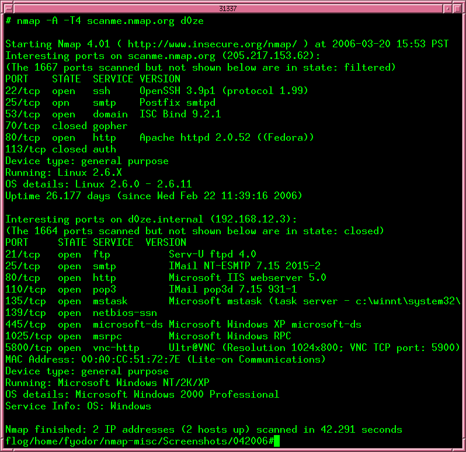
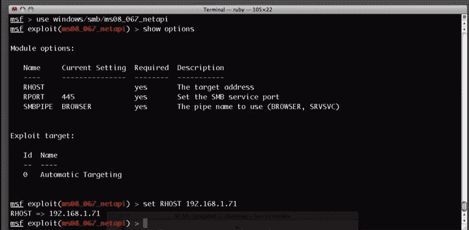
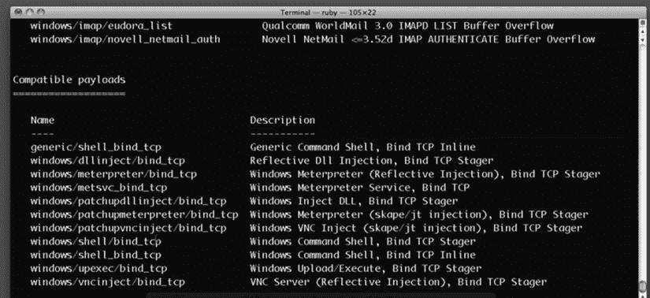
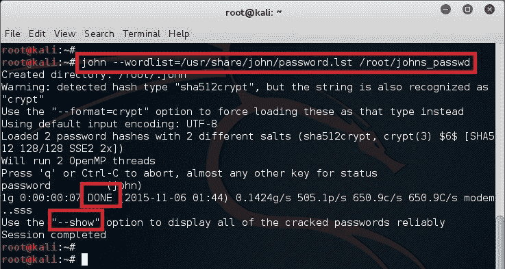
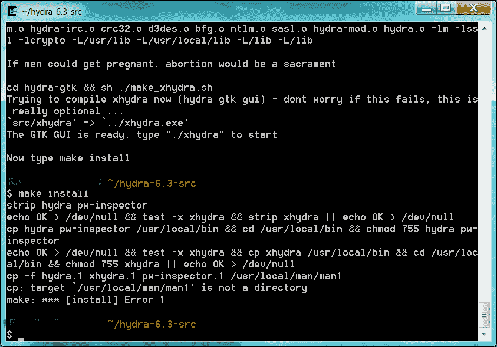
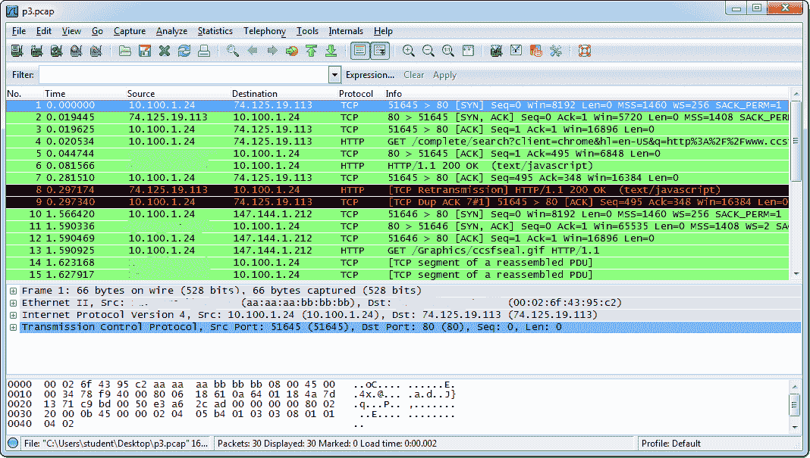
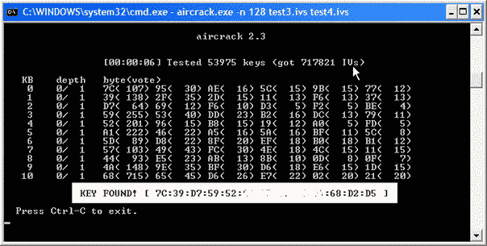
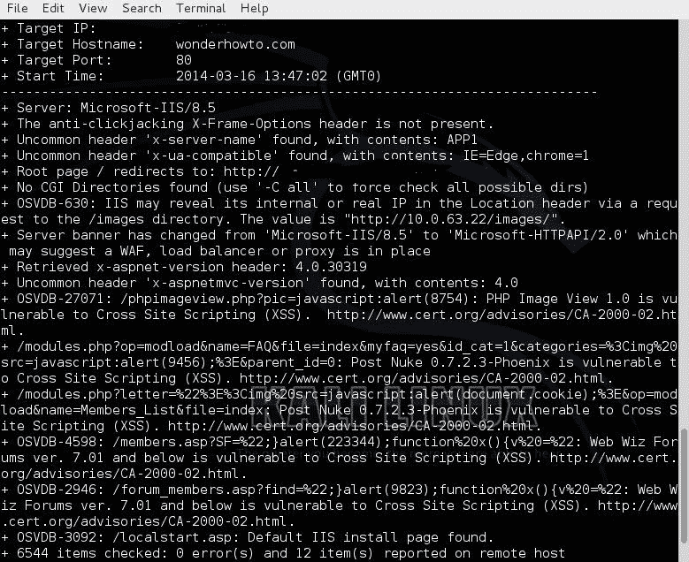
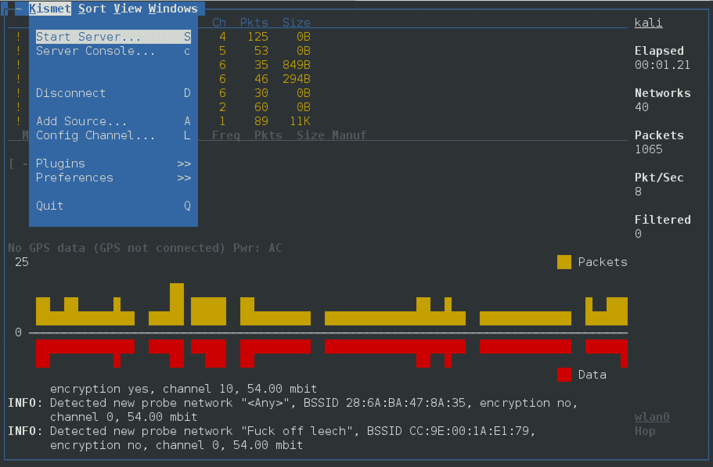
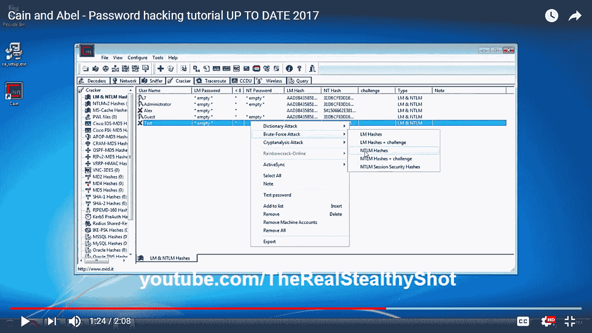

# 第三章：了解网络安全杀伤链

在上一章，你了解了事件响应流程及其如何融入到公司安全态势的整体提升中。现在是时候开始以攻击者的身份思考，理解攻击的理由、动机以及实施攻击的步骤。我们称之为网络安全杀伤链，这是我们在第一章《安全态势》中简要介绍过的内容。如今，报告称最先进的网络攻击涉及对目标网络的入侵，这种入侵通常会持续很长时间，在造成损害或被发现之前。这揭示了当今攻击者的一个独特特征：他们拥有惊人的能力，可以在时机成熟之前保持隐蔽。这意味着他们操作时有条不紊，并按照计划进行。攻击的精准性已被研究，结果显示，大多数网络攻击者使用一系列相似的阶段来完成成功的攻击。

为了增强你的安全态势，你需要确保从保护和检测的角度覆盖网络安全杀伤链的所有阶段。但做到这一点的唯一方法是确保你理解每个阶段如何运作、攻击者的心态，以及每个阶段所承受的损失。

在这一章中，我们将讨论以下主题：

+   外部侦察

+   系统入侵

+   横向移动

+   特权提升

+   任务总结

# 外部侦察

在这个阶段，攻击者的目标只是寻找一个脆弱的目标进行攻击。动机是从目标的网络和系统外部收集尽可能多的信息。这些信息可能包括目标的供应链、过时设备的处理方式，以及员工的社交媒体活动。这将帮助攻击者决定哪些利用技巧适用于针对特定目标识别出的每个漏洞。目标列表可能是无尽的，但攻击者特别偏爱那些在系统中拥有某些特权的天真用户。然而，任何组织中的人员都可能成为攻击目标，包括供应商和客户。攻击者只需要找到一个薄弱点，便能进入组织的网络。

在这一阶段，有两种常用技术——钓鱼攻击和社会工程学。

钓鱼是通过电子邮件进行的，攻击者向目标发送精心制作的电子邮件，以使他们透露机密信息或打开网络以进行攻击。攻击者通常会将恶意软件附加到他们的电子邮件中，在打开被感染的附件后感染目标计算机。其他时候，钓鱼邮件将声称来自声誉良好的机构，从而诱使毫无戒心的目标泄露一些敏感信息。社会工程学以类似的方式工作，攻击者紧密跟随目标，收集关于他们的信息，稍后利用这些信息获取一些私人信息。社会工程主要通过社交媒体进行，攻击者将通过目标的各种喜爱的社交网络跟随目标。

攻击者将找到目标的喜好、厌恶以及其间的弱点。

无论使用上述任何一种技术还是其他技术，攻击者都会找到一个入口点。这可能是通过窃取密码或感染目标组织网络内计算机的恶意软件。窃取密码将使攻击者直接访问组织内部网络中的计算机、服务器或设备。另一方面，恶意软件可以用来感染更多计算机或服务器，从而使它们受到黑客的控制。

# 扫描

在侦察的这个子阶段中，攻击者将批判性地检查在侦察阶段确定的弱点。它涉及使用各种扫描工具来发现可以利用的漏洞来发动攻击。攻击者在这个阶段花费相当长的时间，因为他们知道这决定了他们成功的重要百分比。

从众多可用的扫描工具中，以下部分介绍的工具是最常用的。

# NMap

NMap 是一款免费开源的网络映射工具，适用于 Windows、Linux 和 macOS。网络管理员赞赏这款免费工具拥有的巨大功能。该工具使用原始 IP 数据包在整个网络中发送。该工具可以对连接到目标网络的设备进行清单，识别可能被利用的开放端口，并监视网络中主机的正常运行时间。

该工具还能够告诉网络主机上运行的服务，对主机的操作系统进行指纹识别，并识别网络中实施的防火墙规则。NMap 具有命令行界面，但也有一个具有图形用户界面的类似工具，称为 Zenmap。Zenmap 是一个面向初学者的工具，使用更简单，具备 NMap 的所有功能。然而，功能被列在菜单中，因此用户无需记住命令，这与 NMap 不同。Zenmap 由 NMap 的同一开发者创建，只是为了为希望在其扫描工具上使用 GUI 以简化查看结果的用户服务。

NMap 主要通过用户在命令行界面提供的命令来工作。用户首先扫描系统或网络以查找漏洞。常见的做法是输入以下命令之一：

```
    #nmap www.targetsite.com
    #nmap 255.250.123.189  
```

对于前面的命令，目标站点是你希望 NMap 扫描的站点。它可以使用站点的 URL 或 IP 地址。这个基本命令通常与其他命令一起使用，比如 TCP SYN 扫描和连接扫描、UDP 扫描以及 FIN 扫描。所有这些命令都有相应的命令短语。*图 1*展示了 NMap 扫描两个 IP 地址的截图。在截图中，扫描的 IP 地址是 205.217.153.62 和 192.168.12.3。注意 NMap 是如何展示扫描结果的，给出了开放或关闭的端口以及它们允许运行的服务：

图 1：NMap 界面的截图

# Metasploit

这是一个基于 Linux 的黑客框架，已经被黑客使用无数次。这是因为 Metasploit 由多个黑客工具和框架组成，旨在对目标执行不同类型的攻击。该工具引起了网络安全专业人员的关注，并且如今被用来教授道德黑客技术。该框架为用户提供关于多个漏洞和利用技术的重要信息。除了被黑客使用外，这个框架还用于渗透测试，帮助组织确保自己免受攻击者常用渗透技术的侵害。

Metasploit 在 Linux 终端中运行，提供一个命令行界面控制台，可以从中启动漏洞攻击。框架会告诉用户可以使用的漏洞和有效负载的数量。用户必须根据目标或要扫描的目标网络内容，搜索可用的漏洞。通常，当选择一个漏洞时，会显示该漏洞下可用的有效负载。

以下图示显示了 Metasploit 界面的截图。该截图显示了针对 IP 地址为 192.168.1.71 的主机设置的漏洞攻击：

图 2：Metasploit 界面的截图

该截图展示了可以部署到目标上的兼容有效负载：



# John the Ripper

这是一个功能强大的密码破解工具，可在 Linux 和 Windows 操作系统上使用，黑客利用它进行字典攻击。该工具用于从桌面或基于 Web 的系统和应用程序的加密数据库中恢复实际用户密码。该工具通过采样常用密码，然后使用与目标系统相同的算法和密钥对其进行加密。该工具会将其结果与数据库中存储的结果进行比较，以查看是否存在匹配项。

该工具仅通过两步破解密码。首先，它识别密码的加密类型。可能是 RC4、SHA 或 MD5 等常见加密算法。它还会检查加密是否已被 salted（加盐）。  

Salted 指的是在加密中添加了额外的字符，以使得返回到原始密码更加困难。  

在第二步中，工具通过将哈希密码与其数据库中存储的其他哈希进行比较，尝试恢复原始密码。*图 4*显示了 John the Ripper 从加密哈希中恢复密码的截图：  

图 4：John the Ripper 恢复加密密码的截图  

# THC Hydra  

它与之前讨论的工具类似，唯一的区别是 Hydra 在线工作，而 John the Ripper 离线工作。然而，Hydra 更强大，因此在黑客中更受欢迎。它可用于 Windows、Linux 和 macOSX。该工具常用于快速的网络登录破解。它使用字典攻击和暴力破解攻击登录页面。  

暴力破解攻击可能会引起目标方的警报，如果有安全工具存在的话，因此黑客在使用该工具时非常小心。  

Hydra 在数据库、LDAP、SMB、VNC 和 SSH 中被证明是有效的。

Hydra 的工作原理非常简单。攻击者将目标在线系统的登录页面提供给该工具。工具随后会尝试所有可能的用户名和密码组合。Hydra 将其组合离线存储，这使得匹配过程更快。  

下图（*图 5*）展示了 Hydra 安装的截图。安装是在 Linux 机器上进行的，但 Windows 和 Mac 的过程是相同的。用户在安装过程中需要输入`make install`。安装程序会处理剩余的部分，直到安装完成：  

图 5：显示 THC Hydra 的截图  

# Wireshark  

这是一个在黑客和渗透测试人员中非常受欢迎的工具。Wireshark 以扫描网络著称。该工具捕获目标网络中的数据包，并以详细的格式显示它们，格式为人类可读。该工具允许黑客或渗透测试人员深入分析网络流量，甚至可以检查单个数据包。  

Wireshark 有两种模式。第一种是网络捕获模式。它可以长时间运行在受害者的网站上，同时捕获所有网络流量。在第二种模式下，必须停止网络捕获才能进行深入分析。在此之后，工具的用户可以查看网络流量并开始挖掘不安全交换的密码，或者确定网络上的不同设备。这是该程序最重要的功能。Wireshark 在统计菜单下有一个会话（Conversations）功能，允许用户查看计算机之间的通信。

*图 6* 显示了一个带有不同区域的 Wireshark 界面，以及它们包含的各种信息类型：

图 6：显示 Wireshark 界面的截图

# Aircrack-ng

Aircrack-ng 是一套危险的工具，用于无线黑客攻击，并且在今天的网络空间中已成为传奇。该工具适用于 Linux 和 Windows 操作系统。需要注意的是，Aircrack-ng 依赖其他工具来首先获取目标的相关信息。通常，这些程序会发现可能的攻击目标。Airodump-ng 是常用的工具来执行此操作，但其他工具，如 Kismet，也是可靠的替代选择。Airodump-ng 检测无线接入点及其连接的客户端。Aircrack-ng 利用这些信息来攻击接入点。

今天，大多数组织和公共场所都提供 Wi-Fi，这使得它们成为黑客的理想猎场，尤其是拥有这套工具的黑客。Aircrack-ng 可以用来恢复受保护的 Wi-Fi 网络的密钥，前提是它在监控模式下捕获了足够的数据包。这个工具已经被专注于无线网络的白帽黑客所采用。该工具包包括诸如 FMS、KoreK 和 PTW 等攻击方式，这使得它的功能强大无比。

FMS 攻击用于攻击使用 RC4 加密的密钥。KoreK 用于攻击使用 WEP 加密密码保护的 Wi-Fi 网络。最后，PTW 用于攻击通过 WEP 和 WPA 安全保护的 Wi-Fi 网络。

Aircrack-ng 的工作方式有很多种。它可以通过捕获数据包并以其他扫描工具可以读取的格式导出数据，来监控 Wi-Fi 网络中的流量。它还可以通过创建假接入点或将自己的数据包注入网络，来攻击网络并获取更多关于网络中用户和设备的信息。

最后，它可以使用前面提到的攻击方法，尝试不同的组合来恢复 Wi-Fi 网络的密码。

图 7：Aircrack-ng 界面

# Nikto

Nikto 是一个基于 Linux 的网站漏洞扫描器，黑客使用它来识别组织网站中任何可利用的漏洞。该工具扫描 Web 服务器，查找 6800 多种常见的被利用漏洞。它还扫描超过 250 个平台上未修补的服务器版本。该工具还会检查 Web 服务器中配置文件的错误。然而，该工具在掩盖其痕迹方面并不擅长，因此几乎总是会被任何入侵检测和防御系统捕获。

Nikto 通过一系列命令行界面命令进行工作。用户首先提供他们希望扫描的网站的 IP 地址。该工具会进行初步扫描，并返回有关 Web 服务器的详细信息。

在此之后，用户可以发出更多命令，测试 Web 服务器上的不同漏洞。*图 8*显示了 Nikto 工具扫描 Web 服务器漏洞的截图。给出此输出的命令是：

```
    Nikto -host 8.26.65.101
```

图 8：Nikto 工具扫描 Microsoft-IIS Web 服务器漏洞的截图

# Kismet

Kismet 也是一个无线网络嗅探器和入侵检测系统。它通常嗅探 802.11 层 2 的流量，包括 802.11b、802.11a 和 802.11g。该工具可以与任何在其运行的机器上的无线网卡配合使用进行嗅探。

与使用命令行界面的其他工具不同，Kismet 使用图形用户界面进行操作，用户打开程序后会弹出界面。界面有三个部分，用户用来发出请求或查看攻击状态。当工具扫描 Wi-Fi 网络时，它会检测该网络是否安全。如果是安全的，它会检测使用的加密是否薄弱。用户可以使用一系列命令指示该工具突破已识别的 Wi-Fi 网络。*图 9*显示了 Kismet GUI 的截图。图形用户界面布局良好，用户通过清晰定义的菜单与程序互动，如截图所示：

图 9：Kismet 的截图

# Cain 和 Abel

Cain 和 Abel 是一个基于 Windows 的密码破解工具，对 Microsoft 操作系统有效。使用这个工具的黑客可以轻松恢复目标机器的密码。它们创建一个网络适配器，用来监听路由器的流量，从而获得通过受影响路由器发送流量的主机的多个密码。该工具通过字典攻击、暴力破解和密码分析进行破解。它还可以记录 VOIP 通话、解密密码、发现缓存密码，并分析内部网络的路由协议。该工具在攻击中的效果令人惊讶，甚至可以精准选择目标，忽略那些容易修复的漏洞。

要使用该工具，必须先关闭 Windows 防火墙。然后，可以使用该工具创建一个数据包监听适配器。

接下来，输入路由器的 IP 地址。该工具将能够监听网络中主机发送到路由器的所有数据包。通过路由器传输的密码可以被攻击者嗅探到。下图显示了 Cain and Abel 工具界面的截图。NT 密码字段中为*空*的用户名没有密码，而其余的则有一定的密码保护。如果密码少于八个字符，<8 字段会显示星号(*)。如上下文菜单所示，密码可以通过字典攻击、暴力破解和密码分析攻击进行破解：

图 10：Cain and Abel 工具界面

# 访问和权限提升

这一阶段发生在攻击者已经识别了目标，并使用之前讨论的工具和扫描工具扫描并利用其漏洞之后。攻击者在这一阶段的主要目标是保持访问权限，并在网络中移动而不被检测到。为了实现这种不被检测的自由移动，攻击者需要进行权限提升。这是一种攻击，能够使攻击者获得网络、连接的系统和设备的更高权限访问。

权限提升可以通过两种方式进行：纵向和横向：

| **纵向权限提升** | **横向权限提升** |
| --- | --- |
| 攻击者从一个帐户转移到另一个具有更高权限的帐户 | 攻击者使用相同的帐户，但提升其权限 |
| 用于提升权限的工具 | 用于提升权限的用户帐户 |

表 1：横向和纵向权限提升的比较

# 纵向权限提升

纵向权限提升是攻击者必须为自己提升更高权限的过程。这是一个复杂的操作，因为用户需要执行一些内核级别的操作来提升他们的访问权限。

一旦操作完成，攻击者就拥有了能够运行任何未经授权代码的访问权限和特权。通过这种方法获得的权限是超级用户的权限，比管理员的权限更高。

由于这些权限，攻击者可以执行各种有害的操作，连管理员也无法阻止。在 Windows 中，垂直权限提升被用来引发缓冲区溢出，攻击者利用这种溢出来执行任意代码。这种权限提升已经在 2017 年 5 月发生的一个攻击事件中被目睹，名为 WannaCry。WannaCry 是一种勒索软件，通过加密全球 150 多个国家的计算机并要求支付 300 美元的赎金（第二周后赎金翻倍）来造成了严重破坏。有趣的是，它利用了一个名为 EternalBlue 的漏洞，该漏洞据称是从 NSA 被盗的。

EternalBlue 使恶意软件能够提升其权限，并在 Windows 计算机上执行任意代码。

在 Linux 系统中，垂直权限提升被用来允许攻击者以 root 用户权限在目标机器上运行或修改程序。

# 水平权限提升

另一方面，水平权限提升较为简单，因为它允许用户使用从初始访问中获得的相同权限。

一个好的例子是攻击者成功窃取了网络管理员的登录凭据。管理员账户已经具有较高的权限，攻击者在访问该账户后立即假设这些权限。

水平权限提升也发生在攻击者能够使用普通用户账户访问受保护的资源时。一个好的例子是普通用户错误地能够访问另一个用户的账户。这通常是通过会话和 Cookie 劫持、跨站脚本、猜测弱密码以及记录按键等方式实现的。

在这个阶段结束时，攻击者通常已经在目标系统中建立了可靠的远程访问入口。攻击者可能还能够访问多个用户的账户。攻击者还知道如何避开目标可能具备的安全工具的检测。这将引导进入下一个阶段，称为数据外泄。

# 数据外泄

这是攻击的主要阶段。一旦攻击进入这一阶段，就被认为是成功的。攻击者通常可以自由地在受害者的网络中活动，访问所有系统和敏感数据。攻击者将开始提取组织的敏感数据，这些数据可能包括商业机密、用户名、密码、个人身份信息、机密文件以及其他类型的数据。攻击者通常在这一阶段盗取大量数据，这些数据可以出售给愿意购买的买家，或泄露到公众。许多大型公司都曾面临数据被盗的丑闻。

2015 年，一个黑客组织突破了 Ashley Madison 网站，窃取了 9.7GB 的数据。这个网站提供配偶出轨服务。黑客告知网站的母公司 Avid Life Media，如果不关闭网站，他们就会泄露一些用户数据。尽管母公司对此予以否认，但黑客很快将数据上传至暗网。数据中包括了数百万用户的真实姓名、地址、电话号码、电子邮件地址和登录凭据。黑客鼓励受影响的用户起诉公司并要求赔偿。

2016 年，雅虎公开表示，超过十亿个用户账户的数据在 2013 年被黑客盗取。公司称这次事件与 2014 年黑客盗取 50 万个账户的用户数据事件是不同的。雅虎表示，在 2013 年的事件中，黑客能够窃取用户的姓名、电子邮件地址、出生日期、安全问题和答案，以及加密的密码。

黑客据称使用伪造的 Cookie 来绕过密码，获得公司系统的访问权限。2016 年，LinkedIn 也遭到黑客攻击，超过 1.6 亿账户的用户数据被盗取。

黑客很快将这些数据拿出来出售给任何有兴趣的买家。据信，这些数据包含账户的电子邮件地址和加密密码。这三起事件展示了攻击者在能够进入这一阶段后，攻击的严重性。受害组织的声誉遭受损害，且由于未能保护用户数据，他们不得不支付巨额罚款。

攻击者有时不仅仅是窃取数据，他们还可能删除或修改存储在被入侵的计算机、系统和服务器中的文件。2017 年 3 月，黑客向苹果公司勒索，并威胁要清除 300 百万个 iCloud 账户的 iPhone 数据。尽管这一事件很快被揭露为骗局，但它表明这一行为是可能发生的。在这种情况下，一家像苹果这样的公司成为了焦点，黑客试图从中勒索钱财。另一家公司可能会匆忙支付勒索款项，以避免其用户数据被清除。

所有这些面临的事件——包括苹果公司、Ashley Madison、LinkedIn 和雅虎的案例，都展示了这一阶段的重要性。成功进入这一阶段的黑客几乎已经掌握了控制权。受害者可能还不知道数据已经被盗取，黑客可能选择保持沉默一段时间。当发生这种情况时，攻击进入了一个新的阶段，称为持续攻击（sustainment）。

# 持续攻击

持续阶段发生在攻击者已经自由地在网络中漫游，并复制他们认为有价值的所有数据时。当攻击者希望保持隐匿时，他们进入这一阶段。此前阶段中，数据已经被窃取，可以选择公开或出售时，攻击可以选择结束。不过，具有高度动机的攻击者，如果想要彻底摧毁目标，通常会选择继续攻击。攻击者安装了恶意软件，如 rootkit 病毒，以确保他们可以随时访问受害者的计算机和系统。

进入这一阶段的主要目的是为了争取时间，进行比数据泄露更具破坏性的攻击。攻击者的动机是超越数据和软件，攻击组织的硬件。此时，受害者的安全工具已经无法有效地检测或阻止攻击的继续。攻击者通常有多个进入受害者系统的途径，即使一个入口被关闭，他们的访问也不会受到影响。

# 进攻

进攻是任何网络攻击中最令人恐惧的阶段。此时，攻击者造成的损害超出了数据和软件的范围。攻击者可能会永久性地禁用或更改受害者硬件的功能。攻击者的重点是摧毁由受侵害系统和计算设备控制的硬件。

一个典型的例子是 Stuxnet 对伊朗核电站的攻击。它是第一种记录在案的数字武器，用来对物理资源造成破坏。和其他攻击一样，Stuxnet 也遵循了之前解释的各个阶段，并且已经在设施的网络中潜伏了一年。最初，Stuxnet 被用来操控核电站的阀门，导致压力积聚并损坏了工厂中的一些设备。然后，恶意软件被修改，攻击了一个更大的目标——离心机。这个过程分为三个阶段。

恶意软件通过 USB 闪存驱动器传输到目标计算机，因为这些计算机未连接互联网。一旦它感染了其中一台目标计算机，恶意软件就会自我复制并传播到其他计算机。恶意软件继续进入下一个阶段，感染了西门子公司的一款名为 Step7 的软件，这款软件用于控制逻辑控制器的编程。软件一旦被攻破，恶意软件最终获得了对程序逻辑控制器的访问权限。这使得攻击者能够直接操作核电厂中的各种机械设备。攻击者使得高速旋转的离心机失控，并自行撕裂。

Stuxnet 恶意软件展示了这一阶段可以达到的高度。伊朗的核设施根本无法保护自己，因为攻击者已经获得了访问权限，提升了特权，并避开了安全工具的监测。工厂操作员表示，他们的计算机出现了许多相同的错误，但所有病毒扫描显示他们没有感染病毒。显然，攻击者在受感染的设施中用阀门进行了一些蠕虫的测试运行，发现它有效后，决定扩大规模，攻击离心机，摧毁伊朗的核武器计划。

# 混淆

这是攻击的最后阶段，一些攻击者可能选择忽略这一阶段。此阶段的主要目的是为了让攻击者掩盖他们的痕迹，出于各种原因。如果攻击者不希望被识别，他们会使用多种技术来混淆、阻挠或转移随网络攻击而来的法医调查过程。然而，某些攻击者可能会选择不隐藏他们的痕迹，特别是如果他们是匿名操作，或者想炫耀他们的战果。

混淆有多种方式。攻击者防止对手追踪到他们的一个方法就是混淆攻击的来源。实现这一点有很多种方法。有时，黑客会攻击小企业中过时的服务器，然后横向移动攻击其他服务器或目标。因此，攻击的来源会被追踪到那些没有定期更新的小企业服务器。

最近在一所大学中也见到了这种混淆技术，黑客入侵了物联网灯光系统，并用它们攻击大学的服务器。当法医分析师开始调查这次针对服务器的 DDoS 攻击时，他们惊讶地发现攻击源自该大学的 5000 盏物联网灯光。

另一种起源混淆技术是使用公立学校服务器。黑客们多次使用这种技术，他们通过入侵公立学校的脆弱网络应用，横向渗透到学校的网络，向服务器安装后门和 rootkit 病毒。这些服务器随后被用来攻击更大的目标，因为法医调查会将攻击的来源追溯到公立学校。

最后，社交俱乐部也是黑客用来掩盖攻击来源的一种手段。社交俱乐部为会员提供免费 Wi-Fi，但这些 Wi-Fi 往往保护不严密。这为黑客提供了一个理想的环境，用于感染设备，然后在不被设备所有者察觉的情况下执行攻击。

另一种黑客常用的混淆技术是去除元数据。执法机关可以利用元数据追踪到某些犯罪的肇事者。

2012 年，一名名为 Ochoa 的黑客因入侵 FBI 数据库并泄露警察的个人信息而被起诉。

使用“wormer”这个名字进行黑客攻击的奥乔亚（Ochoa）在他忘记从一张他在黑客攻击 FBI 网站后上传的图片中去除元数据时被捕。元数据向 FBI 显示了照片拍摄地点的准确位置，最终导致了他的逮捕。黑客从这次事件中吸取了教训，认识到在黑客活动中留下任何元数据是不负责任的，因为这可能是他们的致命弱点，就像奥乔亚的情况一样。

黑客通常也会使用动态代码混淆来掩盖他们的踪迹。这涉及到生成不同的恶意代码来攻击目标，但能防止基于签名的杀毒软件和防火墙程序的检测。

这些代码片段可以通过使用随机化函数或更改某些函数参数来生成。因此，黑客使得任何基于签名的安全工具更难保护系统免受恶意代码的攻击。这也使得取证调查员很难识别攻击者，因为大部分黑客攻击都是通过随机代码进行的。

有时，黑客会使用动态代码生成器将无意义的代码添加到他们的原始代码中。这使得黑客攻击在调查员看来非常复杂，并且会减慢他们分析恶意代码的进度。几行代码可能被做成成千上万行无意义的代码。这可能会让取证调查员放弃深入分析代码，去识别一些独特的元素或寻找任何指向原始编码者的线索。

# 威胁生命周期管理

对威胁生命周期管理的投资可以使组织在攻击发生时立即进行防御。这对于任何公司来说都是值得的投资，因为统计数据显示，目前看到的网络数据泄露事件没有放缓。从 2014 年到 2016 年，网络攻击增加了 760%。网络犯罪的增加有三个原因。首先，有更多有动机的威胁行为者。对于某些人来说，网络犯罪已经成为一种低风险、高回报的生意。尽管数据泄露事件增加，但判决率极低，这表明极少有网络犯罪分子被抓获。

与此同时，组织正在因这些有动机的攻击者而损失数十亿美元。数据泄露事件增加的另一个原因是网络犯罪经济和供应链的成熟。如今，网络犯罪分子可以访问许多可供出售的漏洞和恶意软件，只要他们能支付相应的金额。网络犯罪已经成为一个有足够供应商和愿意购买者的产业。随着黑客行为主义和网络恐怖主义的兴起，买家数量不断增加。因此，这导致了数据泄露事件前所未有的增加。

最后，数据泄露事件的增加与组织攻击面扩大密切相关。新技术的采用带来了新的漏洞，从而扩大了网络犯罪分子可以攻击的攻击面。

**物联网**（**IoT**），作为组织技术中最新的一个领域，已经导致多家公司被黑客攻击。如果组织不采取必要的预防措施来保护自己，未来将会暗淡无光。

他们现在可以进行的最佳投资是威胁生命周期管理，帮助他们根据所处的阶段做出适当的反应。2015 年，Verizon 的一项调查报告显示，在所有的攻击中，84%都在日志数据中留下了证据。这意味着，如果有适当的工具和思维方式，这些攻击本可以在早期得到缓解，从而避免任何损害。威胁生命周期管理共有六个阶段。

第一个阶段是取证数据收集。在全面威胁被检测到之前，IT 环境中会有一些可见的证据。威胁可以通过 IT 的七个领域中的任何一个进入。因此，组织能够看到的 IT 基础设施越多，就能检测到的威胁也就越多。

在这个阶段，有三项适用的内容。首先，组织应该收集安全事件和警报数据。如今，组织使用无数的安全工具帮助他们抓捕攻击者并防止攻击成功。这些工具中的一些只会发出警告，因此仅生成事件和警报。一些强大的工具可能不会对小规模的检测发出警报，但它们会生成安全事件。然而，每天可能会生成成千上万的事件，这样就会让组织在众多事件中迷失方向，不知道该关注哪些。这个阶段的另一个适用内容是收集日志和机器数据。这种数据能够提供更深层次的视角，帮助了解在组织网络中实际发生的事情，按用户或应用程序的基础进行分析。这个阶段最后一个适用的内容是收集取证传感器数据。取证传感器，如网络和端点取证传感器，提供更加深入的分析，当日志不可用时，它们也非常有用。

威胁生命周期管理的下一个阶段是发现阶段。这是在组织建立了可见性，并且能够足够早地检测到攻击之后的阶段。这个阶段可以通过两种方式来实现。

其中第一个是搜索分析。这是组织中的 IT 员工进行软件辅助分析的地方。他们能够查看报告并识别网络和防病毒安全工具中已知或报告的异常情况。这个过程需要大量人力，因此不应是整个组织仅仅依赖的分析方法。

达到这个阶段的第二种方式是通过使用机器分析。这是完全由机器/软件进行的分析。软件通常具有机器学习能力，因此也具备人工智能，使其能够自主扫描大量数据并向人们提供简洁和简化的结果，供进一步分析。预计到 2018 年初，超过四分之一的安全工具将具备机器学习能力。机器学习简化了威胁发现过程，因为它是自动化的，并且能不断自我学习新威胁。

接下来是资格认证阶段，检查前一阶段发现的威胁，评估它们的潜在影响、解决的紧迫性以及如何进行缓解。这个阶段是时间敏感的，因为一个已识别的攻击可能比预期的速度更快地发展。

更糟糕的是，这个过程并不简单，且消耗大量人工劳动力和时间。在这个阶段，误报是一个大挑战，必须及时识别，以防止组织将资源浪费在不存在的威胁上。低效的资格认证可能导致漏掉真正的威胁，且误报被纳入其中。因此，合法的威胁可能会被忽视，甚至没有得到处理。正如你所看到的，这个阶段是威胁管理过程中一个非常敏感的环节。

下一个阶段是调查阶段，在此阶段，将对被分类为真正威胁的安全事件进行彻底调查，以确定它们是否引发了安全事件。

这个阶段需要持续访问大量的取证数据和关于众多威胁的情报。它主要是自动化的，这简化了在数百万已知威胁中查找威胁的过程。这个阶段还会检查威胁在被安全工具识别之前，可能对组织造成的任何潜在损害。基于从这一阶段收集到的信息，组织的 IT 团队可以根据情况采取相应的行动应对威胁。

紧接着是中和阶段。在此阶段，采取缓解措施以消除或减少已识别威胁对组织的影响。组织会尽可能快速地进入这一阶段，因为涉及勒索软件或特权用户账户的威胁可能在短时间内造成不可逆的损害。

因此，每一秒钟都至关重要，在消除已识别的威胁时。这个过程也是自动化的，以确保威胁删除的高效性，并促进组织内多个部门之间的信息共享与协作。

最后的阶段是恢复，只有当一个组织确认其识别的威胁已被消除，并且所面临的风险已得到控制时，才会进入此阶段。该阶段的目标是将组织恢复到被攻击前的状态。恢复对时间要求较低，且高度依赖于再次提供的软件或服务的类型。然而，这一过程需要谨慎处理；攻击事件或应对过程中的更改需要被回溯。这两个过程可能会导致不希望的配置或行为，从而可能破坏系统或防止其继续遭受损害。确保系统恢复到被攻击前的确切状态至关重要。有一些自动恢复工具可以将系统自动恢复到备份状态。然而，必须进行充分的尽职调查，确保没有引入或留下后门。

# 参考文献

1.  M. Clayton, *关于最近对美国银行的网络攻击背后的人物线索*，《基督教科学箴言报》，第 11 页，2012 年。[可用: [`search.proquest.com/docview/1081779990`](https://search.proquest.com/docview/1081779990)]。

1.  B. Harrison, E. Svetieva 和 A. Vishwanath, *钓鱼邮件的个体处理*，《在线信息评论》，第 40 卷，（2），第 265-281 页，2016 年。[可用: [`search.proquest.com/docview/1776786039`](https://search.proquest.com/docview/1776786039)]。

1.  M. Andress, *网络漏洞评估管理：八种网络扫描工具提供加强的管理和修复功能*，《网络世界》，第 21 卷，（45），第 48-48,50,52 页，2004 年。[可用: [`search.proquest.com/docview/215973410`](https://search.proquest.com/docview/215973410)]。

1.  *Nmap: 网络映射器 - 免费安全扫描器*，*Nmap.org*，2017 年。[在线]. 可用: [`nmap.org/`](https://nmap.org/). [访问时间: 2017 年 7 月 20 日]。

1.  *Metasploit Unleashed*，Offensive-security.com，2017 年。[在线]. 可用: [`www.offensive-security.com/metasploit-unleashed/msfvenom/`](https://www.offensive-security.com/metasploit-unleashed/msfvenom/). [访问时间: 2017 年 7 月 21 日]。

1.  *免费下载 John the Ripper 密码破解工具* |，黑客工具，2017 年。[在线]. 可用: [`www.hackingtools.in/free-download-john-the-ripper-password-cracker/`](http://www.hackingtools.in/free-download-john-the-ripper-password-cracker/). [访问时间: 2017 年 7 月 21 日]。

1.  R. Upadhyay, *THC-Hydra Windows 安装指南 使用 Cygwi*n,*《像专家一样黑客攻击》，2017 年。[在线]. 可用: [`hackinglikeapro.blogspot.co.ke/2014/12/thc-hydra-windows-install-guide-using.html`](https://hackinglikeapro.blogspot.co.ke/2014/12/thc-hydra-windows-install-guide-using.html). [访问时间: 2017 年 7 月 21 日]。

1.  S. Wilbanks 和 S. Wilbanks, *WireShark*, 数字化战争, 2017\. [在线]. 可用: [`digitalizedwarfare.com/2015/09/27/keep-calm-and-use-wireshark/`](http://digitalizedwarfare.com/2015/09/27/keep-calm-and-use-wireshark/). [访问日期: 2017 年 7 月 21 日]。

1.  *数据包收集与 WEP 加密，攻击与防御无线网络 - 第四部分*, *Ferruh.mavituna.com*, 2017\. [在线]. 可用: [`ferruh.mavituna.com/paket-toplama-ve-wep-sifresini-kirma-kablosuz-aglara-saldiri-defans-4-oku/`](http://ferruh.mavituna.com/paket-toplama-ve-wep-sifresini-kirma-kablosuz-aglara-saldiri-defans-4-oku/). [访问日期: 2017 年 7 月 21 日]。

1.  *像专业人士一样黑客攻击：如何使用 Nikto 查找任何网站的漏洞*, *WonderHowTo*, 2017\. [在线]. 可用: [`null-byte.wonderhowto.com/how-to/hack-like-pro-find-vulnerabilities-for-any-website-using-nikto-0151729/`](https://null-byte.wonderhowto.com/how-to/hack-like-pro-find-vulnerabilities-for-any-website-using-nikto-0151729/). [访问日期: 2017 年 7 月 21 日]。

1.  *Kismet*, *Tools.kali.org*, 2017\. [在线]. 可用: [`tools.kali.org/wireless-attacks/kismet`](https://tools.kali.org/wireless-attacks/kismet). [访问日期: 2017 年 7 月 21 日]。

1.  A. Iswara, *如何嗅探他人的密码？（使用 Cain & Abel 进行黑客攻击 - ARP 投毒方法）*, Hxr99.blogspot.com, 2017\. [在线]. 可用: [`hxr99.blogspot.com/2011/08/how-to-sniff-peoples-password-hacking.html`](http://hxr99.blogspot.com/2011/08/how-to-sniff-peoples-password-hacking.html). [访问日期: 2017 年 7 月 21 日]。

1.  A. Gouglidis, I. Mavridis, 和 V. C. Hu, *云系统中多域的安全策略验证*, 国际信息安全期刊, 第 13 卷, （第 2 期）, 第 97-111 页, 2014\. 可用: [`search.proquest.com/docview/1509582424`](https://search.proquest.com/docview/1509582424) DOI: [`dx.doi.org/10.1007/s10207-013-0205-x`](http://dx.doi.org/10.1007/s10207-013-0205-x)。

1.  R. Oliver, *在 WannaCry 攻击后，预计网络保险市场将增长*, FT.Com, 2017\. 可用: [`search.proquest.com/docview/1910380348`](https://search.proquest.com/docview/1910380348)。

1.  N. Lomas. (2016 年 8 月 19 日). 全部 Ashley Madison 被黑数据显然已被发布到 Tor 网络上. 可用: [`search.proquest.com/docview/1705297436`](https://search.proquest.com/docview/1705297436)。

1.  D. FitzGerald, *黑客利用雅虎自己的软件进行数据泄露；‘伪造的 Cookie’允许在不输入密码的情况下访问账户*, 华尔街日报（在线版）, 2016\. 可用: [`search.proquest.com/docview/1848979099`](https://search.proquest.com/docview/1848979099)。

1.  R. Sinha, *被破解！超过 3200 万个 Twitter 密码被黑客攻击*, 《经济时报》（在线版）, 2016\. 可用: [`search.proquest.com/docview/1795569034`](https://search.proquest.com/docview/1795569034)。

1.  T. Bradshaw, *苹果内部系统被黑客攻击*, FT.Com, 2013\. 可用: [`search.proquest.com/docview/1289037317`](https://search.proquest.com/docview/1289037317)。

1.  M. Clayton, *Stuxnet 恶意软件是“武器”，旨在摧毁伊朗布什尔核电站？*，《基督教科学箴言报》，2010 年。可获得：[`search.proquest.com/docview/751940033`](https://search.proquest.com/docview/751940033)。

1.  D. Palmer, *物联网黑客如何将大学网络反过来攻击自己*，ZDNet，2017 年。[在线]。可获得：[`www.zdnet.com/article/how-iot-hackers-turned-a-universitys-network-against-itself/`](http://www.zdnet.com/article/how-iot-hackers-turned-a-universitys-network-against-itself/)。[访问时间：2017 年 7 月 4 日]。

1.  S. Zhang, *一名已退休黑客的生活，他现在被禁止使用互联网*，Gizmodo.com，2017 年。[在线]。可获得：[`gizmodo.com/the-life-of-an-ex-hacker-who-is-now-banned-from-using-t-1700074684`](http://gizmodo.com/the-life-of-an-ex-hacker-who-is-now-banned-from-using-t-1700074684)。[访问时间：2017 年 7 月 4 日]。

1.  *打破了！FBI 通过 Anonymous 黑客发布女友裸照追踪到他*，《每日邮报》，2017 年。[在线]。可获得：[`www.dailymail.co.uk/news/article-2129257/Higinio-O-Ochoa-III-FBI-led-Anonymous-hacker-girlfriend-posts-picture-breasts-online.html`](http://www.dailymail.co.uk/news/article-2129257/Higinio-O-Ochoa-III-FBI-led-Anonymous-hacker-girlfriend-posts-picture-breasts-online.html)。[访问时间：2017 年 11 月 28 日]。

# 摘要

本章概述了常见的网络攻击阶段，揭示了攻击者的思维方式。它展示了攻击者如何通过简单的方法和先进的入侵工具获取目标的详细信息，并利用这些信息进行攻击。它讨论了攻击者在攻击系统时升级权限的两种主要方式。它解释了网络攻击者如何从他们可以访问的系统中窃取数据。它还探讨了攻击者如何继续攻击受害者的硬件以造成更多损害的场景。接着，本章讨论了攻击者保持匿名的方式。最后，本章强调了用户如何打断威胁生命周期并挫败攻击。

下一章将深入探讨侦察，全面了解攻击者如何通过社交媒体、被攻陷的网站、电子邮件和扫描工具收集关于用户和系统的信息。
