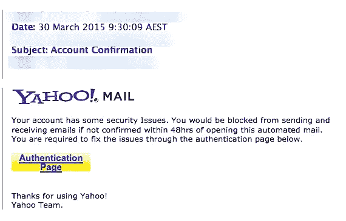
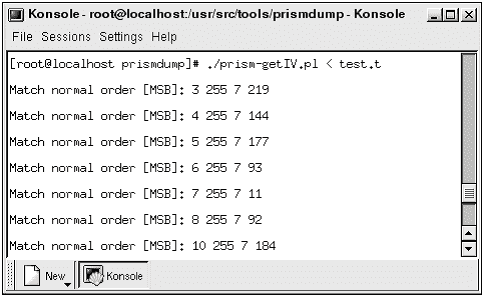
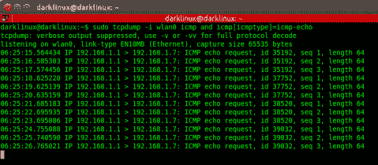
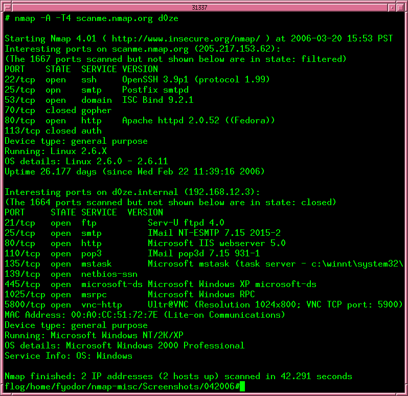
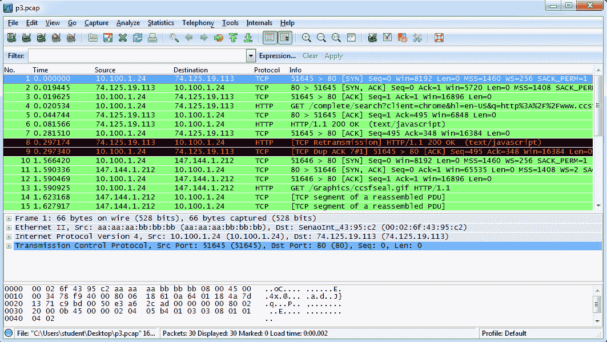
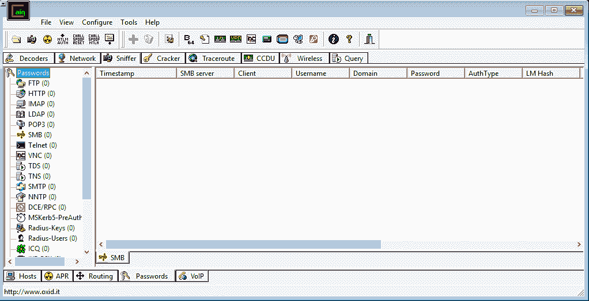
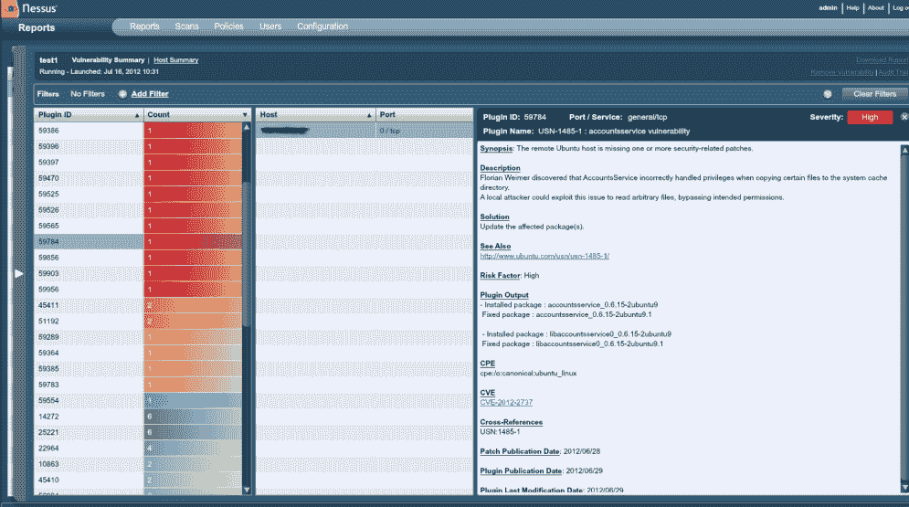
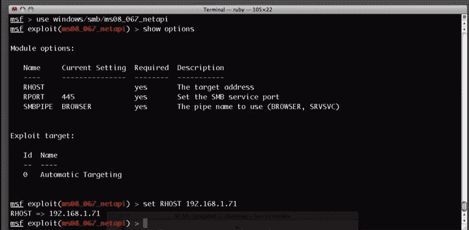
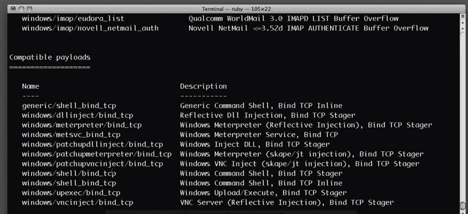
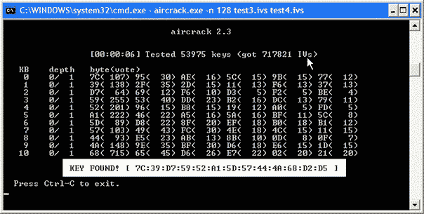

# 第四章：侦察

前一章为你概述了网络攻击生命周期的所有阶段。本章将深入探讨生命周期中的第一阶段——侦察。侦察是威胁生命周期中最重要的阶段之一，攻击者在此阶段寻找可以用来攻击目标的漏洞。攻击者会关注定位和收集数据，识别目标网络、用户或计算系统中的任何漏洞。侦察可以是被动的，也可以是主动的，借鉴了军事中的战术。它可以比作派遣间谍进入敌方领土，收集有关何时何地攻击的数据。当侦察正确进行时，目标不应能察觉到侦察的存在。这个关键的攻击生命周期阶段可以通过多种方式实现，广义上分为外部侦察和内部侦察。

本章将讨论以下主题：

+   外部侦察：

    +   垃圾桶潜水

    +   利用社交媒体获取目标信息

    +   社会工程

+   执行内部侦察的工具

# 外部侦察

外部侦察是在组织的网络和系统之外进行的，通常是通过利用组织用户的疏忽进行的。有多种方式可以做到这一点。

# 垃圾桶潜水

组织以多种方式处置废弃设备，比如通过竞标、送交回收商或丢弃存储。这样的处置方式存在严重的风险。谷歌就是一家在设备处置方面非常彻底的公司，它会销毁数据中心的旧硬盘，以防止恶意人员访问其中存储的数据。这些硬盘会被送入破碎机，钢活塞会压入硬盘中心，使其变得不可读。这个过程持续进行，直到机器将硬盘粉碎成小块，然后将这些碎片送到回收中心。这是一个严格且防错的过程。其他一些公司则无法做到这一点，因此选择使用军用级的删除软件来清除旧硬盘中的数据。这确保了在处置旧硬盘时，数据无法被恢复。

然而，大多数组织在处理旧的外部存储设备或过时的计算机时并不彻底。有些甚至懒得删除其中的资料。由于这些过时的设备有时会以不小心的方式被丢弃，攻击者可以轻松地从这些丢弃点获取设备。这些过时的存储设备可能会向攻击者提供大量关于组织内部设置的信息。它们还可能让攻击者访问浏览器上公开存储的密码，找出不同用户的权限和细节，甚至可能让他们访问网络中某些定制的系统。

# 社交媒体

社交媒体为黑客打开了另一个狩猎场。如今，了解一个人信息的最简单方法就是浏览他们的社交媒体账号。黑客发现社交媒体是获取有关特定目标数据的最佳途径，因为人们往往在这些平台上分享信息。尤其重要的是与用户所在公司相关的数据。其他可以从社交媒体账户中获取的关键信息包括家庭成员、亲戚、朋友的详细信息，以及住址和联系方式。此外，攻击者还学会了利用社交媒体执行更加恶劣的预攻击。

最近一起涉及俄罗斯黑客和五角大楼官员的事件显示了黑客技术的高超。据信，五角大楼官员点击了一个机器人账号发布的关于度假套餐的帖子。因为五角大楼官员曾接受过网络安全专家的培训，学会避免点击或打开通过邮件发送的附件。该官员点击了一个链接，据信此链接让他的电脑遭到入侵。网络安全专家将此事件定性为定向钓鱼攻击；然而，这次攻击并没有通过电子邮件进行，而是通过社交媒体帖子。黑客正在寻找这种无法预测且有时不易察觉的预攻击方式。据说，攻击者通过这次攻击成功获取了该官员大量敏感信息。

黑客利用社交媒体用户的另一种方式是通过查看他们的账号帖子，获取可以用于密码或作为重置某些账户的秘密问题答案的信息。这些信息包括用户的出生日期、母亲的娘家姓、他们成长的街道名字、宠物名字、学校名字以及其他类型的随机信息。用户因懒惰或对所面临的威胁缺乏了解而倾向于使用弱密码。因此，一些用户可能会将出生日期作为工作邮箱的密码。工作邮箱很容易猜测，因为它们使用的是个人的正式名字，并且以组织的域名结尾。黑客通过社交媒体账户获得的官方姓名，以及可能的密码，能够计划如何进入网络并进行攻击。

社交媒体中另一个潜在的危险是身份盗窃。令人惊讶的是，创建一个冒充他人身份的假账户非常简单。所需要的只是获取一些照片和最新的身份盗窃受害者的详细信息。这一切都在黑客的操作手册中。他们跟踪关于组织用户及其上司的信息。然后，他们可以创建使用上司名字和详细信息的账户。这将使他们能够通过社交媒体等手段，获得好处或发布命令给毫无察觉的用户。一个自信的黑客甚至可以利用高层员工的身份，从 IT 部门请求网络信息和统计数据。黑客将继续获取关于网络安全的信息，这将帮助他们在不久的将来找到成功入侵网络的方法。

# 社会工程学

这是最令人恐惧的侦察行为之一，因为目标的性质。一家公司可以通过安全工具抵御许多类型的攻击，但无法完全保护自己免受这种类型的威胁。社会工程学已经被完美地发展出来，利用了人性——这是安全工具无法保护的。黑客知道，存在非常强大和有效的工具来防止他们从组织网络中获取任何类型的信息。扫描和伪造工具很容易被入侵检测设备和防火墙识别出来。因此，凭借通常的威胁，很难击败当今的安全水平，因为它们的特征已被知晓，可以轻易地防止。而另一方面，人类因素仍然容易受到通过操控的攻击。人类具有同情心、信任朋友、喜欢炫耀、服从上级；只要能说服他们转变思维方式，他们就容易被说服。

社会工程师使用六个杠杆让受害者开口。其中一个是互惠，受害者为某个社交媒体用户做某事，后者则感到有必要回报这个恩惠。回报他人是人类的天性，攻击者已经认识到并利用了这一点。另一个杠杆是稀缺性，社会工程师通过威胁某个目标所需的东西即将短缺，迫使目标做出配合。这可能是一场旅行、一场大型促销活动或新产品的发布。为了拉动这个杠杆，社会工程师会花费大量精力了解目标的喜好。下一个杠杆是一致性，人类通常会遵守承诺或习惯于常规的事件流程。当一个组织总是从某个供应商订购并接收 IT 消耗品时，攻击者非常容易伪造供应商并交付感染恶意软件的电子产品。

另一个杠杆是喜好，人们更容易接受他们喜欢的人或那些看起来有吸引力的人提出的要求。社会工程师擅长让自己听起来和看起来有吸引力，从而轻松赢得目标的配合。一个常用的杠杆是权威，通常情况下，人们会服从那些地位高于他们的人的权威；因此，他们很容易为这些人弯曲规则，甚至满足他们的要求，即使这些要求看起来恶意。许多用户会在一个高阶 IT 员工要求时提供他们的登录凭证。此外，如果他们的经理或主管要求他们通过不安全的渠道发送一些敏感数据，很多用户也不会多想。使用这个杠杆很容易，许多人会轻易成为受害者。最后一个杠杆是社会验证：人们会很容易地服从并做出某些事情，如果其他人也在做同样的事情，因为他们不想显得与众不同。黑客只需要让某件事看起来很正常，然后请求一个毫不怀疑的用户做同样的事情。

所有社会工程的杠杆都可以用于不同类型的社会工程攻击。以下是一些常见的社会工程攻击类型。

# 预设情境

这是一种通过间接施加压力来迫使目标泄露信息或执行异常行为的方法。它涉及构建一个精心策划的谎言，经过充分研究，使其对目标看起来合法。这种技术曾成功地让会计师将大量资金汇给虚构的老板，后者发出支付命令，将款项转入某个账户。因此，黑客利用这种技术窃取用户的登录凭证，或者访问一些敏感文件非常容易。借口（Pretexting）可以作为更大规模社会工程攻击的中介，利用合法信息构造另一个谎言。使用借口的社会工程师擅长伪装成社会中其他值得信赖的人，如警察、催债员、税务官员、神职人员或调查员。

# 转移盗窃

这是一种骗局，攻击者说服配送和运输公司将其交货和服务转交到其他地方。攻击者通过获得某个公司的货物可以获得一些好处——他们可以伪装成合法的送货员，并交付已被篡改的产品。他们可能在交付的产品中安装了根套件或一些监控硬件，这些硬件将不会被发现。

# 网络钓鱼

这是黑客多年来使用的最古老的伎俩之一，但它的成功率仍然令人惊讶地高。网络钓鱼主要是一种以欺诈方式获取有关公司或个人的敏感信息的技术。正常执行此攻击的方法是黑客向目标发送电子邮件，冒充一个合法的第三方组织，要求提供信息以供验证。攻击者通常会附加严重后果，要求没有提供请求的信息的目标承担责任。同时，会附上一个链接，指向恶意或欺诈网站，用户被建议使用该链接访问某个合法网站。攻击者会制作一个复制网站，网站包含标志和常见内容，并且有一个表单让用户填写敏感信息。目的是捕获目标的详细信息，从而使攻击者能够实施更大的犯罪。目标信息包括登录凭证、社会保障号码和银行信息。攻击者仍在使用这种技术从某个公司用户那里捕获敏感信息，以便在未来的攻击中利用这些信息访问其网络和系统。

一些可怕的攻击通过网络钓鱼实施。不久前，黑客发送伪装成某法院发出的钓鱼邮件，要求收件人在特定日期前往法院。邮件中附有一个链接，收件人可以查看更多法院通知的细节。然而，点击链接后，收件人在计算机上安装了恶意软件，这些恶意软件被用于其他恶意目的，如键盘记录和收集浏览器中存储的登录凭证。

另一个著名的网络钓鱼攻击是 IRS 退款诈骗。网络攻击者利用四月这一时期，当时许多人焦急地等待着 IRS 可能退还的税款，并发送伪装成 IRS 的邮件，通过 Word 文件附带勒索病毒。当收件人打开 Word 文档时，勒索病毒会加密用户硬盘中的文件以及任何连接的外部存储设备。

一种更为复杂的网络钓鱼攻击通过一家著名的招聘网站 CareerBuilder 针对多个目标进行。在这种攻击中，黑客伪装成正常的求职者，但不是附上简历，而是上传恶意文件。CareerBuilder 将这些简历转发给多个正在招聘的公司。这是一次经典的攻击，恶意软件被传播到了许多组织。也有多个警察部门成为勒索病毒的受害者。在新罕布什尔州，一名警察点击了一封看似合法的邮件，导致他使用的计算机感染了勒索病毒。这种情况发生在全球许多警察部门，显示了网络钓鱼攻击仍然拥有强大的威胁力。

下图展示了一个发送给 Yahoo 用户的网络钓鱼邮件示例：



# 电话网络钓鱼（vishing）

这是一种独特的网络钓鱼方式，攻击者使用电话而不是电子邮件。这是一种高级网络钓鱼攻击，攻击者使用一个不合法的互动语音应答系统，这个系统听起来与银行、服务提供商等使用的系统一模一样。这种攻击通常作为电子邮件钓鱼攻击的延伸，迫使目标泄露机密信息。通常会提供一个免费的电话热线，当拨打该电话时，目标会被引导到恶意的互动语音应答系统。系统会要求目标提供一些验证信息。为了确保多个 PIN 码被披露，系统通常会拒绝目标输入的内容。这对于攻击者来说已经足够，可以继续进行盗取目标的资金，无论是个人还是组织。在极端情况下，目标会被转接给一个假冒的客服代表，帮助解决登录失败的问题。假冒的客服代表会继续向目标提问，从而获取更多敏感信息。

以下图示展示了黑客通过网络钓鱼获取用户登录凭据的场景：


# 标靶钓鱼

这也是一种正常的网络钓鱼攻击，但它不会像普通钓鱼那样随机发送大量邮件。标靶钓鱼是专门针对组织中特定最终用户的，目的是获取其信息。标靶钓鱼更加复杂，因为它要求攻击者对目标进行大量背景调查，以便确定一个可以追踪的受害者。攻击者会精心编写一封邮件，涉及目标感兴趣的事项，迫使其打开邮件。从统计数据来看，普通的钓鱼攻击成功率为 3%，而标靶钓鱼成功率高达 70%。还有人说，只有 5%的人会点击钓鱼邮件中的链接或下载附件，而几乎一半打开标靶钓鱼邮件的人会点击链接并下载附件。

一个典型的目标网络钓鱼攻击例子是攻击者针对人力资源部门的一名员工。这些员工在寻找新人才时必须与外界保持密切联系。网络钓鱼者可能会制作一封电子邮件，指控该部门存在腐败或裙带关系问题，并提供一个链接，指向一个网站，上面展示了一些不满的—且虚构的—潜在员工的抱怨。人力资源员工通常对与 IT 相关的问题了解不深，因此可能会轻易点击这样的链接，从而导致感染。通过一次感染，恶意软件可以轻易地在组织内部传播，最终进入几乎每个组织都有的人力资源服务器。

# 水洞攻击

这是利用用户对他们常访问的网站的信任度进行的社交工程攻击，比如互动聊天论坛和交换板块。访问这些网站的用户更可能表现得异常粗心。即便是最小心的人，避免点击电子邮件中的链接，也不会犹豫点击这些网站上提供的链接。这些网站被称为“水坑”网站，因为黑客就像捕食者等待在水坑旁抓住猎物一样，将他们的受害者困在这些网站上。在这里，黑客会利用网站上的任何漏洞进行攻击，接管它们，然后注入代码，使访客感染恶意软件或将点击引导至恶意页面。由于采用这种方法的攻击者在策划时通常会根据目标的具体需求定制攻击，因此这些攻击通常会针对特定的目标以及他们使用的设备、操作系统或应用程序。它通常用来攻击一些技术知识丰富的人，例如系统管理员。水坑攻击的一个例子是利用 StackOverflow.com 等网站的漏洞，IT 人员经常访问该网站。如果该网站被黑客入侵，黑客可能会将恶意软件注入到访问该网站的 IT 工作人员的计算机中。

# 诱饵攻击

这种攻击利用了某些目标的贪婪或好奇心。它是最简单的社交工程技术之一，因为它仅涉及外部存储设备（1）。攻击者会将一个感染了恶意软件的外部存储设备放在其他人容易发现的地方。它可能被放在组织的洗手间、电梯中、接待处、路面上，甚至是停车场里。组织中的贪婪或好奇的用户会捡起这个物品，并匆忙将其插入他们的机器中。攻击者通常很狡猾，会在 U 盘中放置一些让受害人有冲动打开的文件。例如，一个标记为“薪资和即将到来的晋升的执行摘要”的文件，很可能会吸引许多人注意。

如果这种方法不起作用，攻击者可能会复制企业 U 盘的设计，然后将几个 U 盘散布在组织中，供其中一些员工捡起。最终，这些 U 盘会被插入计算机，文件也会被打开。攻击者会在 U 盘中植入恶意软件，感染插入 U 盘的计算机。配置为在插入设备时自动运行的计算机更容易受到攻击，因为不需要用户操作即可启动恶意软件感染过程。

在更严重的情况下，攻击者可能会在 U 盘中安装 rootkit 病毒，当计算机启动时，感染的次级存储介质被连接到计算机时，它会感染计算机。这将使攻击者获得更高的访问权限，并能够在不被察觉的情况下移动。诱饵攻击具有较高的成功率，因为人类天生容易贪婪或好奇，会打开并阅读那些超出自己访问权限的文件。这就是攻击者通常会将存储介质或文件标记为“机密”或“高层”的原因，因为内部员工总是对这些内容感兴趣。

# 交换条件

这是一种常见的社会工程攻击，通常由低级别的攻击者实施。这些攻击者没有任何高级工具，也不进行目标研究。攻击者会不停地拨打随机号码，自称是技术支持人员，并提供帮助。偶尔，他们会找到一些有实际技术问题的人，并“帮助”他们解决这些问题。攻击者会指导他们完成必要的步骤，从而获得访问受害者计算机的权限，或能够发起恶意软件攻击。这是一种繁琐的方法，成功率非常低。

# 跟踪攻击

这是一种最不常见的社会工程攻击，技术水平也不如我们之前讨论的攻击方法。然而，它确实具有相当高的成功率。攻击者利用这种方法进入限制区域或建筑物的特定部分。大多数组织的场所都具备电子访问控制，用户通常需要生物识别或 RFID 卡才能进入。攻击者会在拥有合法访问权限的员工身后行走，借此进入。在某些时候，攻击者可能会请求员工借用他们的 RFID 卡，或者可能会使用伪造的卡片，以解决可访问性问题为借口进入。

# 内部侦察

与外部侦察攻击不同，内部侦察是在现场进行的。这意味着攻击是在一个组织的网络、系统和场所内进行的。通常，这一过程会借助软件工具。攻击者与目标系统进行互动，以便找出其漏洞。这是内部侦察与外部侦察技术的主要区别。

外部侦察是通过不与系统互动，而是通过寻找进入点与在组织内部工作的人员进行接触来完成的。这就是为什么大多数外部侦察尝试都涉及黑客通过社交媒体、电子邮件和电话联系用户。内部侦察仍然是一种被动攻击，因为其目的是收集信息，未来可以用于进行更加严重的攻击。

内部侦察的主要目标是一个组织的内部网络，黑客在这里肯定能找到数据服务器和他们可以感染的主机的 IP 地址。已知网络中的数据可以被同一网络中的任何人读取，只要他们具备合适的工具和技能。攻击者使用网络来发现并分析未来攻击的潜在目标。内部侦察用于确定防止黑客攻击的安全机制。虽然有许多网络安全工具已被开发出来，以减轻用于执行侦察攻击的软件的威胁，但大多数组织从未安装足够的安全工具，黑客总能找到方法突破已有的安全工具。黑客已经测试过许多工具，并发现这些工具在研究目标网络时效果显著。大多数这类工具可以归类为嗅探工具。

# 嗅探与扫描

这些是网络术语，通常指的是在网络中窃听流量的行为。它们使得攻击者和防御者都能精确了解网络中发生的事情。嗅探工具旨在捕获在网络上传输的数据包并对其进行分析，分析结果以人类可读的格式呈现。为了进行内部侦察，数据包分析至关重要。它为攻击者提供了大量关于网络的信息，甚至可以与查看网络的逻辑布局图纸相比。

一些嗅探工具甚至能够揭示机密信息，例如来自 WEP 保护的 Wi-Fi 网络的密码。其他工具允许用户设置，捕获有线和无线网络上的长期流量，之后用户可以在方便的时候进行分析。如今有许多嗅探工具是黑客常用的。

# Prismdump

仅为 Linux 设计，该工具允许黑客使用基于 Prism2 芯片组的卡进行嗅探。该技术仅用于捕获数据包，因此将分析任务交给其他工具来完成；这也是它将捕获的数据包以`pcap`格式导出的原因，而`pcap`是其他嗅探工具广泛使用的数据包捕获格式。大多数开源嗅探工具都使用`pcap`作为标准的数据包捕获格式。由于该工具仅专注于数据捕获，它可靠且适用于长期侦察任务。下图是`prismdump`工具的截图：



# tcpdump

这是一个开源嗅探工具，用于数据包捕获和分析。`tcpdump`使用命令行界面运行。`tcpdump`还专门为数据包捕获设计，因为它没有图形用户界面（GUI）来分析和显示数据。它是一个拥有最强大数据包过滤能力的工具，甚至可以选择性地捕获数据包。这使得它与大多数其他在捕获期间无法过滤数据包的嗅探工具有所不同。以下是`tcpdump`工具的截图。在截图中，它正在监听发送到其主机的`ping`命令：



# NMap

这是一个常用于绘制网络图的开源网络嗅探工具。该工具记录进出网络的 IP 数据包。它还绘制出网络的详细信息，例如连接到网络的设备以及任何打开或关闭的端口。该工具甚至能够识别连接到网络的设备的操作系统，以及防火墙的配置。它使用简单的文本界面，但也有一个名为 Zenmap 的高级版本，提供图形用户界面（GUI）。以下是 nmap 界面的截图。执行的命令是：

```
#nmap 192.168.12.3 
```

执行此命令以扫描 IP 地址`192.168.12.3`上计算机的端口：



# Wireshark

这是网络扫描和嗅探中最受尊敬的工具之一。该工具功能强大，可以窃取从网络发送的流量中的认证信息（1）。这实际上很容易做到，按照几个简单的步骤，任何人都能轻松成为黑客。在 Linux、Windows 和 Mac 上，您需要确保一台安装了 Wireshark 的设备（最好是笔记本电脑）连接到网络。需要启动 Wireshark，以便它能够捕获数据包。在一段时间后，可以停止 Wireshark 并开始分析数据。要获取密码，需要过滤捕获的数据，仅显示 POST 数据。这是因为大多数网站使用 POST 将认证信息传输到服务器。它会列出所有的 POST 数据操作。然后，您可以右键点击其中任何一个，选择跟踪 TCP 流的选项。Wireshark 将打开一个窗口，显示用户名和密码。有时，捕获的密码是哈希值，这在网站中很常见。您可以使用其他工具轻松破解哈希值并恢复原始密码。

Wireshark 还可以用于其他功能，如恢复 Wi-Fi 密码。由于它是开源的，社区不断更新其功能，因此将继续添加新特性。它当前的基本功能包括捕获数据包、导入`pcap`文件、显示数据包的协议信息、以多种格式导出捕获的数据包、根据过滤器对数据包进行着色、提供网络统计信息，以及能够在捕获的数据包中进行搜索。该文件具有先进的功能，使其成为理想的黑客工具。然而，开源社区用它进行白帽黑客攻击，提前发现网络中的漏洞，以防止黑帽黑客利用这些漏洞。

以下是 Wireshark 捕获网络数据包的截图：



# Scanrand

这是一个专门为极快但高效的扫描工具。它通过两种方式实现快速速度，超越了大多数其他扫描工具。该工具包含一个同时发送多个查询的过程和一个接收响应并整合它们的过程。这两个过程不进行协商，因此接收过程永远无法预知响应内容——只知道会有响应数据包。然而，工具中集成了一种巧妙的基于哈希的方法，允许你查看从扫描中收到的有效响应。该工具与旧的扫描工具（如 NMap）完全不同，其进步使其在捕获数据包时更加迅速和高效。

# Cain 和 Abel

这是一个专门为 Windows 平台设计的最有效的密码破解工具之一。该工具通过字典攻击、暴力破解和密码分析攻击来恢复密码。它还通过监听语音 IP 通话并揭示缓存的密码来从网络中嗅探信息。该工具已经过优化，仅适用于 Microsoft 操作系统。以下是 Cain 和 Abel 工具的截图：



# Nessus

这是由 Tenable Network Security 开发并分发的免费扫描工具。它是最好的网络扫描器之一，曾因其出色的白帽漏洞扫描能力获得多个奖项。Nessus 具有多种功能，对进行内部侦察的攻击者非常有用。该工具可以扫描网络并显示有配置错误或缺少补丁的连接设备。它还可以显示使用默认密码、弱密码或根本没有密码的设备。

该工具可以通过启动外部工具来帮助其进行字典攻击，从而恢复某些设备的密码。最后，该工具能够显示网络中的异常流量，这可以用于监控 DDoS 攻击。Nessus 还具备调用外部工具来增强其功能的能力。当它开始扫描网络时，可以调用 NMap 来帮助扫描开放端口，并会自动整合 NMap 收集的数据。Nessus 然后能够利用这些数据继续扫描，并通过脚本命令进一步获取网络信息。以下是 Nessus 显示扫描报告的截图：



# Metasploit

这是一个传奇的框架，由多个工具组成，用于扫描和利用网络。由于该工具的广泛功能，许多白帽培训师使用它来向学生传授知识。它还是渗透测试工具，是许多组织首选的软件。到目前为止，该框架已有超过 1500 个漏洞可用于针对浏览器、Android、Microsoft、Linux 和 Solaris 操作系统的攻击，并且还有许多适用于任何平台的漏洞。该工具通过命令行、meterpreter 或动态负载部署其有效载荷。

Metasploit 的优点在于它具备检测和规避网络中可能存在的安全程序的机制。该框架有多个命令可用于嗅探网络信息。它还拥有一些补充工具，可在收集到关于网络漏洞的信息后用于利用这些漏洞。

以下是 Metasploit 的截图：



# Aircrack-ng

另一款扫描无线网络的工具是 Aircrack-ng。它专门用于破解受保护的无线网络密码。该工具功能强大，拥有能够破解 WEP、WPA 和 WPA2 加密的算法（1）。它的命令非常简单，即使是新手也能轻松破解 WEP 加密的网络。该工具的潜力来自于它结合了 FMS、Korek 和 PTW 攻击。这些攻击针对用于加密密码的算法，成功率极高。

FMS 通常用于破解 RC4 加密的密码。WEP 使用 Korek 攻击。WPA、WPA2 和 WEP 都会使用 PTW 攻击 15。该工具非常彻底，几乎总是能成功进入使用弱密码的网络。

以下是 Aircrack-ng 的截图：



# Wardriving

这是一种专门用于调查无线网络的内部侦察技术，通常通过汽车进行操作。它主要针对的是未加密的 Wi-Fi 网络。有一些工具是为“汽车间谍”（wardriving）而设计的，最常见的两个是 Network Stumbler 和 Mini Stumbler。Network Stumbler 是基于 Windows 的，它会记录未加密无线网络的 SSID，然后使用 GPS 卫星记录该无线网络的确切位置。这些数据被用来创建一张地图，供其他汽车间谍使用，帮助他们找到未加密或安全性不足的无线网络。然后，他们可以利用这些网络及其设备，因为进入是免费的。

Mini Stumbler 是一款相关工具，但它被设计为在平板电脑和智能手机上运行。这使得汽车间谍在识别或利用网络时看起来不那么可疑。该工具的功能只是寻找一个未加密的网络并将其记录到在线数据库中。汽车间谍随后可以回过头来，使用简化的已识别网络地图来利用这些网络。至于 Linux，存在一个名为 Kismet 的工具，也可以用于汽车间谍活动。

据说这个工具非常强大，它列出了未加密网络及其客户端的详细信息，如 BSSID、信号强度和 IP 地址。它还可以在地图上列出已识别的网络，允许攻击者返回并利用这些已知信息攻击网络。该工具主要嗅探 Wi-Fi 网络的 802.11 第二层流量，并使用已安装机器上的任何 Wi-Fi 适配器（1）。

# 侦察章节总结

在侦察的两个阶段结束时，攻击者将获得足够的信息来决定是否继续或取消网络攻击。通过外部侦察，他们将了解用户的行为，并将其用于不利于组织的目的。目标只是找到某种形式的漏洞，攻击者可以利用这些漏洞进入组织的网络或系统。而内部侦察则使攻击者能够更深入了解目标网络。一些讨论过的工具非常强大，提供的信息多到可以认为是网络设计者自己泄露的。攻击者通过这些信息了解了他们可以在组织的网络或系统中利用的漏洞。在这个阶段结束时，攻击者将能够从两个方面攻击组织：一是从用户方面，二是从网络的漏洞方面。

# 参考文献

1.  M. de Paula, *One Man's Trash Is... Dumpster-diving for disk drives raises eyebrows*, U.S. Banker, vol. 114, (6), pp. 12, 2004\. Available: [`search.proquest.com/docview/200721625`](https://search.proquest.com/docview/200721625).

1.  J. Brodkin, *谷歌粉碎并切割旧硬盘以防止数据泄漏*, 网络世界, 2017\. [在线]. 可获取： [`www.networkworld.com/article/2202487/data-center/google-crushes--shreds-old-hard-drives-to-prevent-data-leakage.html`](http://www.networkworld.com/article/2202487/data-center/google-crushes--shreds-old-hard-drives-to-prevent-data-leakage.html). [访问时间：2017 年 7 月 19 日].

1.  Brandom, *俄罗斯黑客通过恶意软件感染的 Twitter 信息针对五角大楼员工*, The Verge, 2017\. [在线]. 可获取： [`www.theverge.com/2017/5/18/15658300/russia-hacking-twitter-bots-pentagon-putin-election`](https://www.theverge.com/2017/5/18/15658300/russia-hacking-twitter-bots-pentagon-putin-election). [访问时间：2017 年 7 月 19 日].

1.  A. Swanson, *身份盗窃，第一行*, 收集者, 第 73 卷, (12*),* 第 18-22 页，24-26 页, 2008\. 可获取： [`search.proquest.com/docview/223219430`](https://search.proquest.com/docview/223219430).

1.  P. Gupta 和 R. Mata-Toledo, *网络犯罪：伪装犯罪*, *信息系统与运营管理杂志,* 第 1-10 页, 2016\. 可获取： [`search.proquest.com/docview/1800153259`](https://search.proquest.com/docview/1800153259).

1.  S. Gold, *今天的社会工程学：心理学、策略与技巧*, 网络安全, 第 2010 卷, *(11),* 第 11-14 页, 2010\. 可获取： [`search.proquest.com/docview/787399306?accountid=45049`](https://search.proquest.com/docview/787399306?accountid=45049). DOI: [`dx.doi.org/10.1016/S1353-4858(10)70135-5`](http://dx.doi.org/10.1016/S1353-4858(10)70135-5).

1.  T. Anderson, *预设身份：你需要知道的事项*, 安全管理, 第 54 卷, *(6),* 第 64 页, 2010\. 可获取： [`search.proquest.com/docview/504743883`](https://search.proquest.com/docview/504743883).

1.  B. Harrison, E. Svetieva 和 A. Vishwanath, *个人处理钓鱼邮件*, 在线信息评论, 第 40 卷, (2)*,* 第 265-281 页, 2016\. 可获取： [`search.proquest.com/docview/1776786039`](https://search.proquest.com/docview/1776786039).

1.  *2014 年十大钓鱼攻击 - PhishMe*, PhishMe, 2017\. [在线]. 可获取： [`phishme.com/top-10-phishing-attacks-2014/`](https://phishme.com/top-10-phishing-attacks-2014/). [访问时间：2017 年 7 月 19 日].

1.  W. Amir, *黑客通过“雅虎账户确认”钓鱼邮件攻击用户*, HackRead, 2016\. [在线]. 可获取： [`www.hackread.com/hackers-target-users-with-yahoo-account-confirmation-phishing-email/`](https://www.hackread.com/hackers-target-users-with-yahoo-account-confirmation-phishing-email/). [访问时间：2017 年 8 月 8 日].

1.  E. C. Dooley, *电话欺诈袭击本地：被称为“语音钓鱼”，该计划通过电话诱使人们泄露个人信息*, McClatchy - 论坛商业新闻, 2008\. 可获取： [`search.proquest.com/docview/464531113`](https://search.proquest.com/docview/464531113).

1.  M. Hamizi, *《社会工程学与内部威胁》*, Slideshare.net, 2017 年\. [在线]. 可用链接: [`www.slideshare.net/pdawackomct/7-social-engineering-and-insider-threats`](https://www.slideshare.net/pdawackomct/7-social-engineering-and-insider-threats). [访问时间: 2017 年 8 月 8 日].

1.  M. Hypponen, *《为互联网欺诈战争而征兵》*, CIO Canada, 第 14 卷, *(10)*, 第 1 页, 2006 年\. 可用链接: [`search.proquest.com/docview/217426610`](https://search.proquest.com/docview/217426610).

1.  R. Duey, *《能源行业是网络罪犯的主要目标》*, Refinery Tracker, 第 6 卷, *(4)*, 第 1-2 页, 2014 年\. 可用链接: [`search.proquest.com/docview/1530210690`](https://search.proquest.com/docview/1530210690).

1.  Joshua J.S. Chang, *《互联网预付款诈骗分析》*, Journal of Financial Crime, 第 15 卷, *(1)*, 第 71-81 页, 2008 年\. 可用链接: [`search.proquest.com/docview/235986237?accountid=45049`](https://search.proquest.com/docview/235986237?accountid=45049). DOI: [`dx.doi.org/10.1108/1359079081084171`](http://dx.doi.org/10.1108/1359079081084171).

1.  *《数据包嗅探器 - SecTools 网络安全工具排名》*, Sectools.org, 2017 年\. [在线]. 可用链接: [`sectools.org/tag/sniffers/`](http://sectools.org/tag/sniffers/). [访问时间: 2017 年 7 月 19 日].

1.  C. Constantakis, *《在网络操作中保障访问 - 简化运营商网络安全管理的新兴工具》*, Information Systems Security, 第 16 卷, *(1)*, 第 42-46 页, 2007 年\. 可用链接: [`search.proquest.com/docview/229620046`](https://search.proquest.com/docview/229620046).

1.  C. Peikari 和 S. Fogie, *《无线安全最大化》*, Flylib.com, 2017 年\. [在线]. 可用链接: [`flylib.com/books/en/4.234.1.86/1/`](http://flylib.com/books/en/4.234.1.86/1/). [访问时间: 2017 年 8 月 8 日].

1.  *《Nmap: 网络映射器 - 免费安全扫描器》*, Nmap.org, 2017 年\. [在线]. 可用链接: [`nmap.org/`](https://nmap.org/). [访问时间: 2017 年 7 月 20 日].

1.  *《使用 Wireshark 分析数据包捕获文件》*, Samsclass.info, 2017 年\. [在线]. 可用链接: [`samsclass.info/106/proj13/p3_Wireshark_pcap_file.htm`](https://samsclass.info/106/proj13/p3_Wireshark_pcap_file.htm). [访问时间: 2017 年 8 月 8 日].

1.  *《Point Blank Security - Wardriving 工具，无线与 802.11 工具。（aerosol, aircrack, airsnarf, airtraf, netstumbler, ministumbler, kismet 等）*，Pointblanksecurity.com, 2017 年\. [在线]. 可用链接: [`pointblanksecurity.com/wardriving-tools.php`](http://pointblanksecurity.com/wardriving-tools.php). [访问时间: 2017 年 7 月 19 日].

1.  *《Nessus 5 在 Ubuntu 12.04 上的安装与简评》*, Hacker Target, 2017 年\. [在线]. 可用链接: [`hackertarget.com/nessus-5-on-ubuntu-12-04-install-and-mini-review/`](https://hackertarget.com/nessus-5-on-ubuntu-12-04-install-and-mini-review/). [访问时间: 2017 年 8 月 8 日].

1.  *Metasploit Unleashed*, Offensive-security.com, 2017\. [在线]. 可访问：[`www.offensive-security.com/metasploit-unleashed/msfvenom/`](https://www.offensive-security.com/metasploit-unleashed/msfvenom/). [访问日期：2017 年 7 月 21 日]。

1.  *数据包收集和 WEP 加密，对抗和防御无线网络攻击 - 4*, Ferruh.mavituna.com, 2017\. [在线]. 可访问：[`ferruh.mavituna.com/paket-toplama-ve-wep-sifresini-kirma-kablosuz-aglara-saldiri-defans-4-oku/`](http://ferruh.mavituna.com/paket-toplama-ve-wep-sifresini-kirma-kablosuz-aglara-saldiri-defans-4-oku/). [访问日期：2017 年 7 月 21 日]。

# 摘要

本章深入探讨了网络攻击中的侦察阶段。它讨论了外部侦察，并揭示了攻击者获取有关组织网络信息的方式。它展示了攻击者如何轻松地妥协人员并引导他们泄露敏感信息。它详细讨论了社会工程，这是当今最令人恐惧的侦察攻击类型之一。本章还介绍了用于内部侦察的工具。它广泛地介绍了可以扫描网络的工具，以及可以用于破解无线网络的工具。

在下一章中，将深入讨论黑客如何利用从这个阶段获取的信息来妥协系统的方法。
