# 第九章：安全策略

从第三章，*了解网络安全杀伤链*，到第八章，*权限提升*，我们涵盖了攻击策略，以及红队如何通过利用常见的攻击技术来增强组织的安全姿态。现在是时候转变思路，从防御的角度来看待事物了。开始讨论防御策略没有其他方式，除了从安全策略开始。一套良好的安全策略对于确保整个公司遵循一套明确定义的基本规则至关重要，这将有助于保护其数据和系统。

在本章中，我们将涵盖以下主题：

+   审查您的安全策略

+   教育最终用户

+   政策执行

+   监控合规性

# 审查您的安全策略

或许第一个问题应该是——“您是否已经制定了安全策略？”即使答案是“是”，您仍然需要继续询问这些问题。下一个问题是——“您是否执行这项政策？”同样，即使答案是“是”，您也必须追问——您多久审查一次这个安全策略，寻找改进的地方？”好的，现在我们已经到了一个安全地结论的地步，即安全策略是一份活的文件——它需要修订和更新。

安全策略应包括行业标准、程序和指南，这些对支持日常运营中的信息风险至关重要。这些政策还必须有一个明确定义的范围。

安全策略的适用性陈述在哪里适用是至关重要的。

例如，如果适用于所有数据和系统，这必须对所有阅读它的人明确。您必须提出的另一个问题是：“这项政策是否也适用于承包商？”无论答案是“是”还是“否”，都必须在政策的范围部分中说明。

安全策略的基础应该建立在安全三要素（保密性、完整性和可用性）之上。最终，用户需要保护和确保数据和系统中的安全三要素的适用性，这与数据是如何创建、共享或存储无关。用户必须意识到自己的责任，并了解违反这些政策的后果。确保还包括一个指定角色和责任的部分，因为这对问责目的非常重要。

也很重要明确哪些文件涉及整体安全策略，因为不止一个。确保所有用户了解以下文件之间的区别：

+   **政策**：这是一切的基础；它设定了高层次的期望。它还将用于指导决策和实现结果。

+   **程序**：顾名思义，这是一份具有程序步骤的文件，概述了如何执行某项任务。

+   **标准**：这份文件建立了必须遵循的要求。换句话说，每个人都必须遵守之前建立的某些标准。

+   **指导方针**：尽管许多人会认为指导方针是可选的，但实际上它们更多是额外的推荐指导。话虽如此，重要的是要注意，每家公司都有权利定义指导方针是可选的，还是推荐的。

+   **最佳实践**：顾名思义，这些是整个公司或公司内某些部门应实施的最佳实践。这也可以根据角色来确定——例如，所有 Web 服务器在部署到生产环境之前应该应用供应商的安全最佳实践。

为了确保所有这些点都是同步的、受控的，并且得到高层管理的支持，您需要创建一个全组织范围的安全计划。*NIST 800-53* 出版物建议以下组织安全控制目标关系：

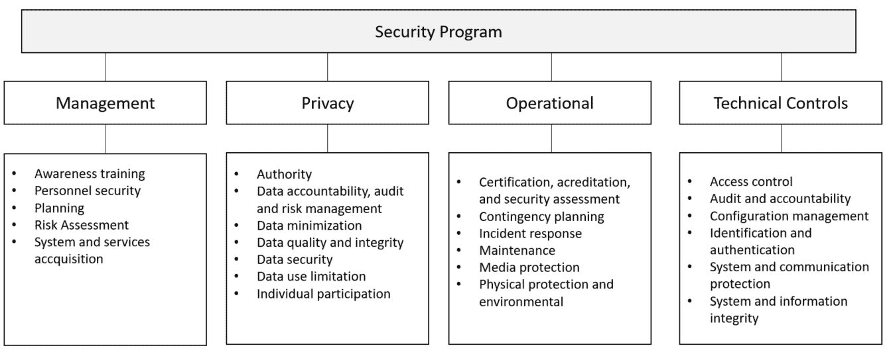

我们需要一本整本的书来讨论这个图表中的所有元素。因此，如果您想要更多关于这些领域的信息，我们强烈建议您阅读 *NIST 800-53* 出版物。

# 对最终用户进行教育

如前图所示，最终用户的教育是管理安全控制的一部分，在意识培训下。也许这是安全计划中最重要的部分之一，因为一个在安全实践上缺乏教育的用户可能会给您的组织造成巨大的损害。

根据 *赛门铁克互联网安全威胁报告第 22 卷*，垃圾邮件活动是恶意软件感染的主要原因，尽管如今它们依赖于各种策略，但最大的恶意软件垃圾邮件活动仍然依赖社会工程技术。

在同一份报告中，赛门铁克得出结论，2016 年主要恶意软件攻击中最常用的词是“发票”。这是完全合理的，因为想法是吓唬用户，让他们认为自己需要支付某些费用，否则会发生不好的事情。这是一种典型的手段：通过恐吓诱使用户点击会危害系统的链接。另一个用于发动社会工程攻击的平台是社交媒体。2015 年，赛门铁克揭露了在 Twitter 上进行的饮食垃圾邮件操作，使用数十万个冒充合法账户的假账户来建立庞大的关注者群，并通过此传播关于减肥解决方案的虚假宣传。

问题在于许多用户将使用自己的设备访问公司信息，也被称为**自带设备**（**BYOD**），当他们参与这种虚假社交媒体活动时，他们很容易成为黑客的目标。如果黑客能够入侵用户的系统，他们就很接近获取公司的数据，因为大多数情况下它们并不是隔离的。

所有这些情况只会更加强调教育用户抵御这种攻击的必要性，以及任何其他类型的社会工程攻击，包括对社会工程的物理方法。

# 用户社交媒体安全指南

在一篇名为*社交媒体影响*的文章中，由本书的合著者 Yuri Diogenes 撰写并发表在*ISSA Journal*上，审查了许多社交媒体是社会工程攻击的主要工具的案例。安全计划必须符合人力资源和法律要求，关于公司如何处理社交媒体帖子，同时也给员工指导，告诉他们如何处理自己的社交媒体存在。

在向员工制定如何使用社交媒体的指导方针时，一个棘手的问题是定义适当的商业行为。对于越过这一界限的员工采取纪律行动应该非常明确。2017 年 10 月，在拉斯维加斯大规模枪击事件之后，CBS 副总裁发表了一则评论，暗示“拉斯维加斯受害者不值得同情，因为乡村音乐粉丝通常是共和党人。” 这条在线评论的结果很简单：她因违反公司的行为标准而被解雇。尽管 CBS 迅速为她的行为道歉并通过解雇员工来展示政策执行，但公司仍然受到了这个人的评论的伤害。

随着世界政治紧张局势和社交媒体赋予个人表达思想的自由，这类情况每天都在发生。2017 年 8 月，一名佛罗里达大学教授因在推特上发表言论称得克萨斯应该遭受哈维飓风的袭击，因为他们投票支持特朗普而被解雇。这是另一个员工使用个人推特账户在线发泄并遭受不良后果的例子。通常，公司基于员工在网上不当行为的行为准则做出解雇决定。例如，如果您阅读谷歌行为准则中的*外部沟通*部分，您将看到谷歌就公开信息披露提出了建议。

另一个重要的指导方针是如何处理诽谤帖子，以及色情帖子，专有问题，骚扰或可能造成敌对工作环境的帖子。这些对于大多数社交媒体指南至关重要，并且表明雇主在促进公司内部社交环境方面是勤勉的。

# 安全意识培训

安全意识培训应该向所有员工提供，并且应该不断更新以包括新的攻击技术和考虑因素。许多公司通过公司的内部网络在线提供此类培训。如果培训精心设计，具有丰富的视觉功能，并在最后包含自我评估，那么它可能非常有效。理想情况下，安全意识培训应包括：

+   **现实世界的例子**：如果展示一个真实场景，用户将更容易记住事物。例如，谈论钓鱼邮件而不展示钓鱼邮件的外观以及如何视觉识别，效果将不是很好。

+   **实践**：在培训材料中，文字表达清晰且丰富的视觉元素是重要属性，但您必须让用户参与一些实际场景。让用户与计算机互动，以识别钓鱼攻击或虚假社交媒体活动。

在培训结束时，所有用户应确认他们成功完成了培训，并且他们不仅了解了培训中涵盖的安全威胁和对策，还了解了不遵守公司安全策略的后果。

# 策略执行

完成安全策略的建立后，就是时候执行了，根据公司的需求，执行将使用不同的技术。理想情况下，您将拥有网络架构图，以充分了解端点是什么，您拥有哪些服务器，信息如何流动，信息存储在哪里，谁有数据访问权限以及应该有数据访问权限，以及网络的不同入口点。

许多公司未能完全执行策略，因为他们只考虑在端点和服务器上执行策略。

那么网络设备呢？这就是为什么您需要一种全面的方法来处理网络中的每个活动组件，包括交换机、打印机和物联网设备。

如果您的公司使用 Microsoft Active Directory，您应该利用**组策略对象**（**GPO**）来部署您的安全策略。这些策略应根据公司的安全策略进行部署。如果不同部门有不同需求，您可以使用**组织单位**（**OUs**）对部署进行分段，并为每个 OU 分配策略。

例如，如果属于人力资源部门的服务器需要不同的策略集，您应将这些服务器移至人力资源 OU 并为该 OU 分配自定义策略。

如果您对安全策略的当前状态不确定，您应该使用 PowerShell 命令`Get-GPOReport`执行初始评估，将所有策略导出到 HTML 文件。确保您从域控制器运行以下命令：

```
PS C:> Import-Module GroupPolicy
PS C:> Get-GPOReport -All -ReportType HTML -Path .GPO.html  
```

此命令的结果如下所示：

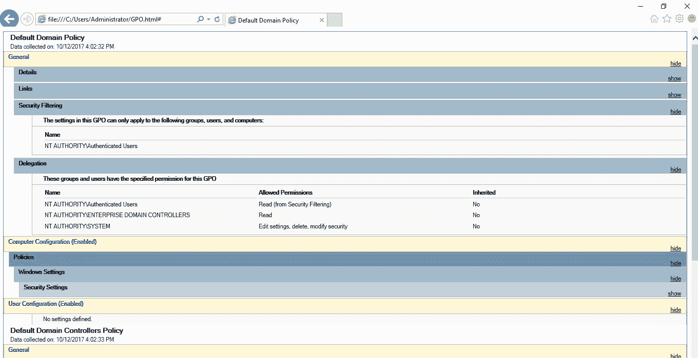

还建议你在对当前组策略进行任何更改之前备份当前配置并复制此报告。你还可以使用另一个工具来执行此评估，即策略查看器，它是 Microsoft 安全合规工具包的一部分，可以从[`www.microsoft.com/en-us/download/details.aspx?id=55319`](https://www.microsoft.com/en-us/download/details.aspx?id=55319)获取：

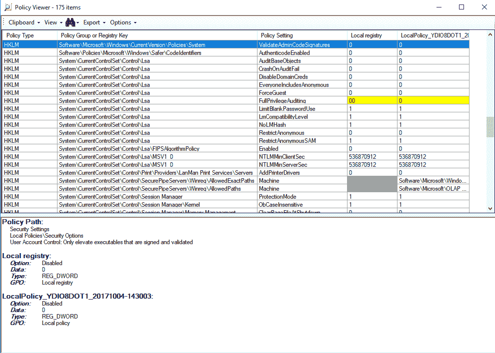

该工具的优点是它不仅查看 GPO，还查看政策与注册表键值之间的关联。

# 应用程序白名单

如果贵组织的安全政策规定仅允许经过许可的软件在用户的计算机上运行，则需要防止用户运行未授权的软件，同时还需要限制未获得 IT 授权的许可软件的使用。政策执行确保只有授权的应用程序可以在系统上运行。

我们建议你阅读 NIST 出版物*800-167*以获取有关应用程序白名单的进一步指导。你可以从[`nvlpubs.nist.gov/nistpubs/SpecialPublications/NIST.SP.800-167.pdf`](http://nvlpubs.nist.gov/nistpubs/SpecialPublications/NIST.SP.800-167.pdf)下载此指南。

在规划应用程序的政策执行时，你应该创建一个所有授权在公司内使用的应用程序列表。基于这个列表，你应该通过以下问题调查这些应用程序的详细信息：

+   每个应用程序的安装路径是什么？

+   这些应用程序的供应商更新政策是什么？

+   这些应用程序使用了哪些可执行文件？

你能获得的关于应用程序本身的信息越多，你就拥有越多的实际数据来判断应用程序是否被篡改。对于 Windows 系统，你应该计划使用 AppLocker 并指定哪些应用程序被允许在本地计算机上运行。

在 AppLocker 中，有三种条件可以用来评估应用程序，它们是：

+   发布者：如果你想创建一个规则来评估由软件供应商签名的应用程序，则应使用此选项。

+   路径：如果你想创建一个规则来评估应用程序路径，则应使用此选项。

+   文件哈希：如果你想创建一个规则来评估未由软件供应商签名的应用程序，则应使用此选项。

当你运行创建可执行规则向导时，这些选项将出现在条件页面上：

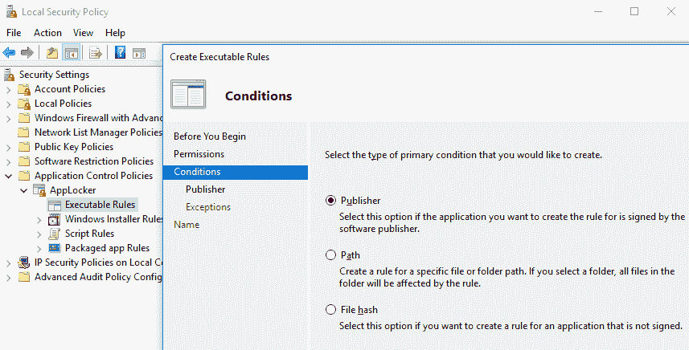

您选择哪个选项将取决于您的需求，但这三个选择应该涵盖大多数部署场景。请记住，根据您选择的选项，下一页将出现一组新的问题。确保您阅读[`docs.microsoft.com/en-us/windows/device-security/applocker/applocker-overview`](https://docs.microsoft.com/en-us/windows/device-security/applocker/applocker-overview)上的 AppLocker 文档。

要在 Apple OS 中列出应用程序，您可以使用 Gatekeeper ([`support.apple.com/en-us/HT202491`](https://support.apple.com/en-us/HT202491))，在 Linux OS 中您可以使用 SELinux。

# 加固

当您开始规划策略部署并确定应该更改哪些设置以更好地保护计算机时，您基本上是在加固这些设置以减少攻击向量。您可以将**通用配置枚举**（**CCE**）指南应用于您的计算机。

为了优化您的部署，您还应考虑使用安全基线。这可以帮助您更好地管理计算机的安全性，同时也符合公司政策的合规性。对于 Windows 平台，您可以使用 Microsoft 安全合规性管理器：

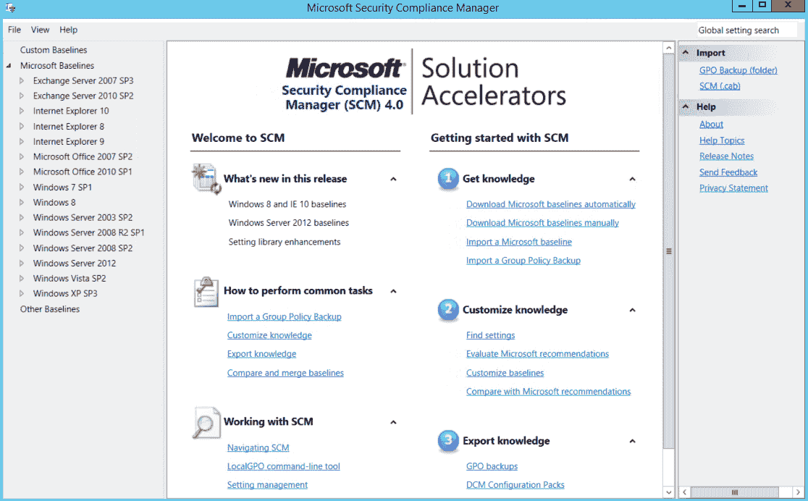

在左侧窗格中，您可以看到所有支持的操作系统版本和一些应用程序。

让我们以 Windows Server 2012 为例。一旦您点击这个操作系统，您将会看到该服务器的不同角色。以 WS2012 Web 服务器安全 1.0 模板为例，我们有一组 203 个独特的设置，将增强服务器的整体安全性：

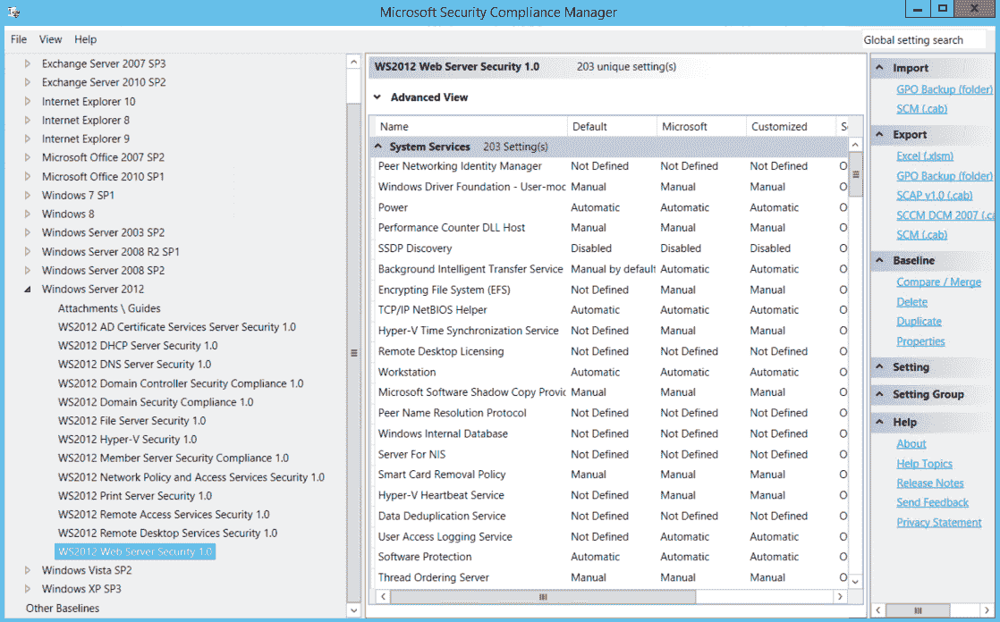

要查看每个设置的更多详细信息，您应该点击右侧窗格中的配置名称：

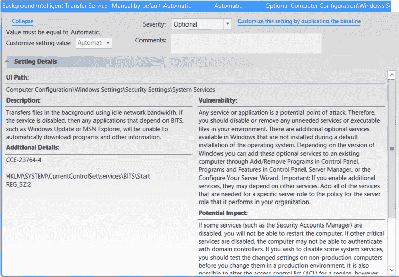

所有这些设置都将具有相同的结构——描述、附加详细信息、漏洞、潜在影响和对策。这些建议基于 CCE，这是基线安全配置的行业标准。确定最适合您的服务器/工作站的模板后，您可以通过 GPO 部署它。

要加固 Linux 计算机，请查找每个发行版上可用的安全指南。例如，对于 Red Hat，请使用可在[`access.redhat.com/documentation/en-US/Red_Hat_Enterprise_Linux/6/pdf/Security_Guide/Red_Hat_Enterprise_Linux-6-Security_Guide-en-US.pdf`](https://access.redhat.com/documentation/en-US/Red_Hat_Enterprise_Linux/6/pdf/Security_Guide/Red_Hat_Enterprise_Linux-6-Security_Guide-en-US.pdf)找到的安全指南。

当谈到加固时，您希望确保利用所有操作系统功能来大幅提高计算机的安全状态。对于 Windows 系统，您应考虑使用**增强缓解体验工具包**（**EMET**）。

EMET 通过预见并防止攻击者利用 Windows 系统中的漏洞来获取计算机的访问权限，从而帮助防止攻击者的入侵。这不仅仅是一个检测工具，它实际上通过转移、终止、阻止和使攻击者的行为无效来提供保护。使用 EMET 保护计算机的一个优点是能够阻止新的和尚未发现的威胁：

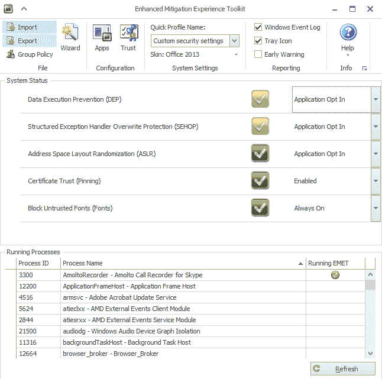

“系统状态”部分显示已配置的安全缓解措施。尽管理想的情况是启用所有这些缓解措施，但根据每台计算机的需要，这一配置可能会有所不同。屏幕的下半部分显示哪些进程已启用 EMET。在前面的示例中，只有一个应用程序启用了 EMET。EMET 通过将一个 DLL 注入到可执行文件的内存空间中来工作，因此，当你配置一个新的进程以便通过 EMET 进行保护时，你需要关闭该应用程序并重新打开——服务也是如此。

要保护列表中的另一个应用程序，右键单击该应用程序并点击“配置进程”：

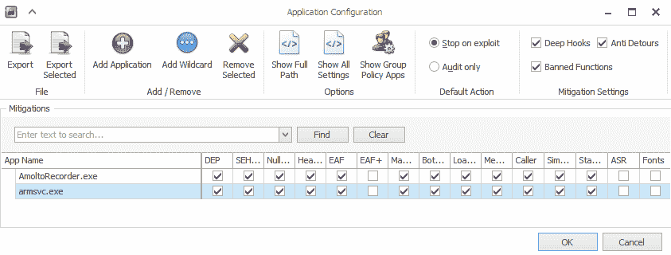

在应用程序配置窗口中，你可以选择希望为该应用程序启用的缓解措施。

了解更多关于 EMET 及其可用选项的信息，请下载 EMET 用户指南，访问 [`www.microsoft.com/en-us/download/details.aspx?id=53355`](https://www.microsoft.com/en-us/download/details.aspx?id=53355)。

# 合规性监控

虽然强制执行策略对于确保高层管理的决策转化为优化公司安全状态的实际行动至关重要，但监控这些策略的合规性同样不可或缺。

基于 CCE 指南定义的策略可以通过工具（如 Azure 安全中心）轻松监控，这些工具不仅监控 Windows 虚拟机和计算机，还监控运行 Linux 软件的计算机：

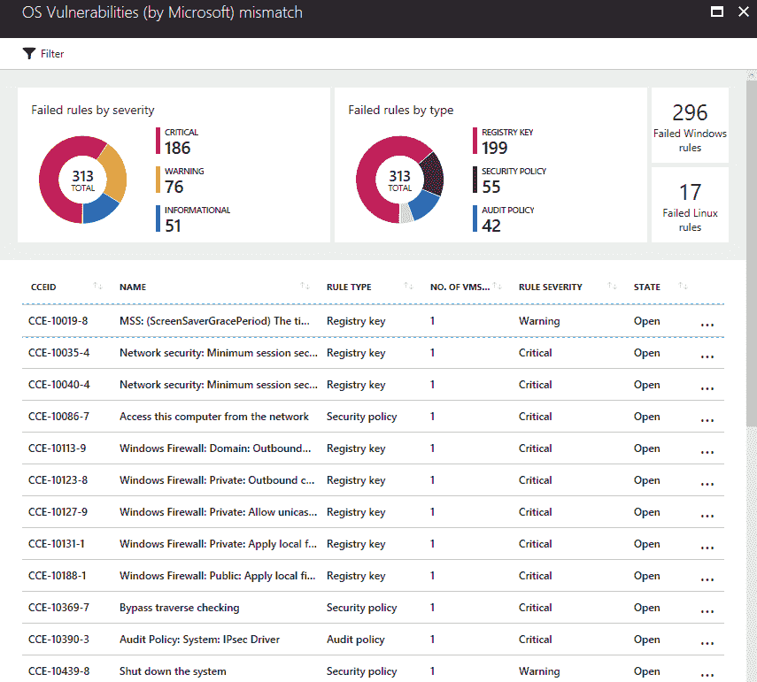

操作系统漏洞仪表板显示当前在 Windows 和 Linux 系统中打开的所有安全策略的全面视图。如果你点击某个特定策略，你将看到有关该策略的更多详细信息，包括为何缓解该漏洞至关重要的原因。请注意，在页面的末尾，你将看到为缓解此特定漏洞而建议的对策。由于这是基于 CCE，因此对策始终是操作系统或应用程序配置的更改。

不要将 CCE 与 **常见漏洞与暴露**（**CVE**）混淆，CVE 通常需要通过部署补丁来缓解某个已暴露的漏洞。有关 CVE 的更多信息，请访问 [`cve.mitre.org/`](https://cve.mitre.org/)。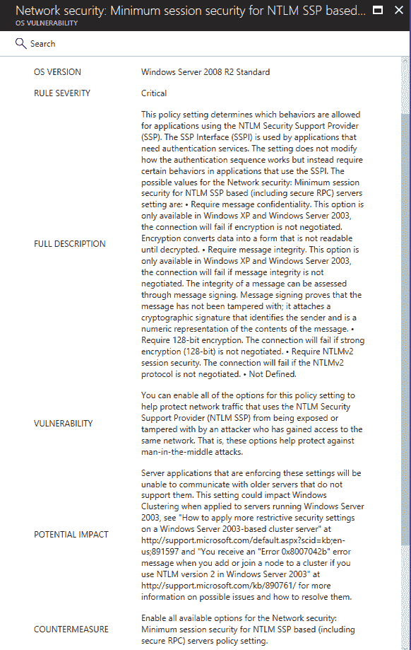

重要的是要强调，Azure 安全中心不会为你部署配置。这是一个监控工具，而不是部署工具，这意味着你需要获取对策建议，并通过其他方法进行部署，例如 GPO。

另一个可以用来获取计算机安全状态的完整视图并识别潜在的不合规情况的工具是**Microsoft Operations Management Suite**（**OMS**）的安全和审计解决方案，特别是安全基准评估选项，如下图所示：

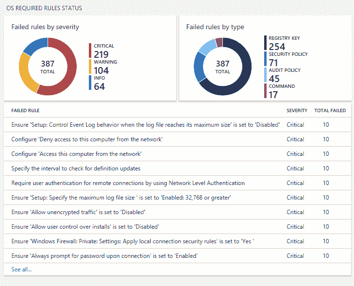

此仪表板将根据优先级（关键、警告和信息）以及失败的规则类型（注册表、安全性、审计或基于命令）提供统计信息。两个工具（Azure 安全中心和 OMS 安全性）都适用于 Windows 和 Linux，适用于 Azure 或 Amazon AWS 中的虚拟机，以及本地计算机。

# 参考资料

1.  *联邦信息系统和组织的安全与隐私控制* [`nvlpubs.nist.gov/nistpubs/SpecialPublications/NIST.SP.800-53r4.pdf`](http://nvlpubs.nist.gov/nistpubs/SpecialPublications/NIST.SP.800-53r4.pdf)

1.  *NIST 800-53 书面信息安全程序（WISP）* 安全策略示例 [`examples.complianceforge.com/example-nist-800-53-written-information-security-program-it-security-policy-example.pdf`](http://examples.complianceforge.com/example-nist-800-53-written-information-security-program-it-security-policy-example.pdf)

1.  *互联网安全威胁报告 第 22 卷* [`s1.q4cdn.com/585930769/files/doc_downloads/lifelock/ISTR22_Main-FINAL-APR24.pdf`](https://s1.q4cdn.com/585930769/files/doc_downloads/lifelock/ISTR22_Main-FINAL-APR24.pdf)

1.  *揭露 Twitter 上持久的饮食垃圾邮件操作* [`www.symantec.com/content/en/us/enterprise/media/security_response/whitepapers/uncovering-a-persistent-diet-spam-operation-on-twitter.pdf`](http://www.symantec.com/content/en/us/enterprise/media/security_response/whitepapers/uncovering-a-persistent-diet-spam-operation-on-twitter.pdf)

1.  *社交媒体安全* [`blogs.technet.microsoft.com/yuridiogenes/2016/07/08/social-media-security/`](https://blogs.technet.microsoft.com/yuridiogenes/2016/07/08/social-media-security/)

1.  *CBS 解雇副总裁，因为他说拉斯维加斯的受害者不值得同情，因为乡村音乐迷“往往是共和党人”* [`www.foxnews.com/entertainment/2017/10/02/top-cbs-lawyer-no-sympathy-for-vegas-vics-probably-republicans.html`](http://www.foxnews.com/entertainment/2017/10/02/top-cbs-lawyer-no-sympathy-for-vegas-vics-probably-republicans.html)

1.  *佛罗里达教授因建议德克萨斯州在投票支持特朗普后“应该遭遇哈维风暴”而被解雇* [`www.independent.co.uk/news/world/americas/us-politics/florida-professor-fired-trump-harvey-comments-texas-deserved-hurricane-storm-a7919286.html`](http://www.independent.co.uk/news/world/americas/us-politics/florida-professor-fired-trump-harvey-comments-texas-deserved-hurricane-storm-a7919286.html)

1.  *微软安全合规性管理器* [`www.microsoft.com/en-us/download/details.aspx?id=53353`](https://www.microsoft.com/en-us/download/details.aspx?id=53353)

1.  *Red Hat 企业版 Linux 6 安全指南* [`access.redhat.com/documentation/en-US/Red_Hat_Enterprise_Linux/6/pdf/Security_Guide/Red_Hat_Enterprise_Linux-6-Security_Guide-en-US.pdf`](https://access.redhat.com/documentation/en-US/Red_Hat_Enterprise_Linux/6/pdf/Security_Guide/Red_Hat_Enterprise_Linux-6-Security_Guide-en-US.pdf)

1.  *AppLocker - 深度防御中抵御恶意软件的另一层保护* [`blogs.technet.microsoft.com/askpfeplat/2016/06/27/applocker-another-layer-in-the-defense-in-depth-against-malware/`](https://blogs.technet.microsoft.com/askpfeplat/2016/06/27/applocker-another-layer-in-the-defense-in-depth-against-malware/)

1.  11.

    *增强缓解体验工具包 (EMET) 5.52*

    [`www.microsoft.com/en-us/download/details.aspx?id=54264&751be11f-ede8-5a0c-058c-2ee190a24fa6=True`](https://www.microsoft.com/en-us/download/details.aspx?id=54264&751be11f-ede8-5a0c-058c-2ee190a24fa6=True)

1.  *社交媒体安全* [`blogs.technet.microsoft.com/yuridiogenes/2016/07/08/social-media-security/`](https://blogs.technet.microsoft.com/yuridiogenes/2016/07/08/social-media-security/)

# 总结

在本章中，你了解了制定安全政策的重要性，以及如何通过安全计划来推动这一政策。你理解了制定清晰且完善的社交媒体指南的重要性，这些指南能为员工提供公司对公共帖子看法的准确视角，并阐明违反这些指南的后果。

安全计划的一部分包括安全意识培训，旨在教育最终用户有关安全相关的主题。这是一个至关重要的步骤，因为最终用户始终是安全链中最薄弱的一环。

在本章后续内容中，你将了解公司如何利用不同的工具集来执行安全政策。政策执行的一部分包括应用程序白名单和系统加固。最后，你学习了如何监控这些政策的合规性，并学习了如何使用工具来实现这一点。

在下一章中，我们将继续讨论防御策略，这一次你将学习更多关于网络分段的内容，以及如何利用这一技术来增强你的保护。
