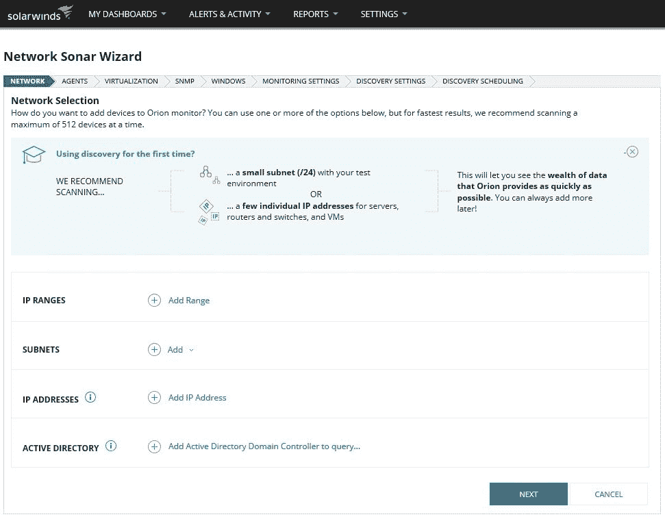
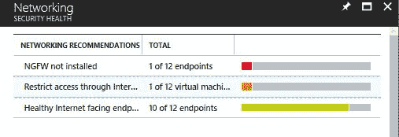

# 第十章：网络分段

我们在上一章中通过强化强大且有效的安全策略的重要性，开始了防御战略。现在是时候继续推进这一愿景，确保网络基础设施的安全，而实现这一目标的第一步是确保网络已经分段、隔离，并提供应对入侵的机制。蓝队必须充分了解网络分段的不同方面，从物理到虚拟，以及远程访问。即使公司并非完全基于云计算，它们仍然需要考虑在混合场景下与云的连接，这意味着安全控制措施也必须到位，以增强环境的整体安全性，网络基础设施安全是实现这一目标的基础。

在本章中，我们将覆盖以下主题：

+   深度防御方法

+   物理网络分段

+   保护远程访问网络

+   虚拟网络分段

+   混合云网络安全

# 深度防御方法

虽然你可能认为这是一种过时的方法，不适用于当今的需求，但现实情况是，它仍然适用，尽管你不会再使用过去的技术。深度防御方法背后的整体思想是确保你有多层次的保护，并且每一层都会有自己的一套安全控制，最终会延缓攻击的进程，每一层中的传感器也会提醒你是否发生了什么。换句话说，就是在任务完全执行之前，打破攻击的“杀链”。

但为了实施符合当今需求的深度防御方法，你需要将自己从物理层中抽象出来，纯粹根据入口点思考防护层级。让我们使用以下示意图作为当今深度防御实施的例子：

攻击者可以广泛访问不同的资源。他们可以攻击基础设施和服务、传输中的文档以及终端设备，这意味着你需要在每个可能的场景中增加攻击者的成本。接下来我们将分解这个示意图。

# 基础设施和服务

攻击者可以通过攻击公司的基础设施和服务来破坏公司的生产力。需要意识到，即使在仅有本地部署的情况下，你仍然拥有服务，但这些服务由本地 IT 团队控制。你的数据库服务器就是一个服务：它存储着用户使用的关键数据，如果它无法使用，将直接影响用户的生产力，从而对你的组织造成负面的财务影响。在这种情况下，你需要列举出组织提供给最终用户和合作伙伴的所有服务，并识别可能的攻击途径。

一旦识别出攻击向量，您需要添加能缓解这些漏洞的安全控制措施——例如，通过补丁管理强制合规性、通过安全策略保护服务器、网络隔离、备份等。所有这些安全控制措施都是保护层，它们是基础设施和服务领域内的保护层。其他保护层则需要为基础设施的不同区域添加。

在同一图中，您还可以看到云计算，在这种情况下是**基础设施即服务**（**IaaS**），因为该公司使用了位于云中的虚拟机。如果您已经完成了威胁建模并在本地实施了安全控制措施，现在您需要重新评估在本地引入云连接的情况。通过创建混合环境，您需要重新验证威胁、潜在的入口点以及这些入口点可能如何被利用。此过程的结果通常是得出结论，必须实施其他安全控制措施。

总结来说，基础设施安全必须减少漏洞数量和严重性，缩短暴露时间，并增加利用的难度和成本。通过采用分层的方法，您可以实现这一目标。

# 传输中的文档

尽管图中提到的是*文档*，但这可以是任何类型的数据，而这些数据在传输过程中通常是脆弱的（从一个位置到另一个位置）。确保您利用加密来保护传输中的数据。此外，不要认为加密传输只应在公共网络中进行——它也应在内部网络中实施。

例如，前面图中显示的本地基础设施中所有可用的段都应使用网络级加密，如 IPSec。如果需要跨网络传输文档，请确保加密整个路径，当数据最终到达目的地时，也要在存储中对数据进行静态加密。

除了加密外，您还必须添加其他安全控制措施，用于监控和访问控制，如下图所示：

请注意，您基本上是在添加不同的保护和检测层，这就是深度防御方法的本质。您需要通过这种方式思考您想要保护的资产。

让我们看另一个例子，如下图所示。这是一个在本地服务器上进行静态加密的文档的例子；它通过互联网传输，用户在云端进行身份验证，并且加密一直保持到移动设备，在移动设备的本地存储中也进行了静态加密：

此图表显示，在混合场景下，攻击向量会发生变化，你应该考虑整个端到端的通信路径，以便识别潜在的威胁和应对措施。

# 端点

在为端点规划深度防御时，需要超越计算机的范畴。如今，端点基本上是任何可以消费数据的设备。应用程序决定了哪些设备将得到支持，只要你与开发团队保持同步，你应该知道哪些设备被支持。一般来说，大多数应用程序都适用于移动设备和计算机。某些其他应用程序将突破这一限制，并允许通过可穿戴设备（如 Fitbit）访问。无论设备形态如何，你都必须进行威胁建模，揭示所有攻击向量，并根据情况规划缓解措施。针对端点的一些对策包括：

+   企业数据和个人数据/应用程序的分离（隔离）

+   使用 TPM 硬件保护

+   操作系统强化

+   存储加密

端点保护应考虑企业拥有的设备和自带设备（BYOD）。要了解更多关于 BYOD 的厂商无关方法，请阅读这篇文章：[`blogs.technet.microsoft.com/yuridiogenes/2014/03/11/byod-article-published-at-issa-journal/`](https://blogs.technet.microsoft.com/yuridiogenes/2014/03/11/byod-article-published-at-issa-journal/)

# 物理网络分段

蓝队在处理网络分段时面临的最大挑战之一是准确了解当前网络的实施情况。这是因为，大多数情况下，网络会根据需求增长，而网络扩展时其安全功能并未得到重新审视。对于大型企业来说，这意味着需要重新思考整个网络，甚至可能需要从头开始重新设计网络。

建立适当的物理网络分段的第一步是根据公司需求理解资源的逻辑分布。这打破了“千篇一律适用”的神话，实际上它并不适用。你必须逐个分析每个网络案例，并根据资源需求和逻辑访问规划网络分段。对于中小型组织来说，按照部门聚合资源可能更容易——例如，财务部门、人力资源、运营等所属的资源。如果是这种情况，你可以为每个部门创建一个**虚拟局域网**（**VLAN**），并对每个部门的资源进行隔离。这种隔离可以提高性能和整体安全性。

这个设计的问题在于用户/组与资源之间的关系。以文件服务器为例。大多数部门最终都需要访问文件服务器，这意味着他们需要跨越 VLAN 才能访问该资源。跨 VLAN 访问将需要多个规则、不同的访问条件以及更多的维护。因此，大型网络通常避免这种方法，但如果符合您的组织需求，您也可以使用它。其他资源聚合方法可以基于以下方面：

+   **业务目标**：使用这种方法，您可以根据共同的业务目标创建包含资源的 VLAN。

+   **敏感性级别**：假设您已对资源进行了最新的风险评估，可以根据风险级别（高、中、低）创建 VLAN。

+   **位置**：对于大型组织，有时基于位置组织资源会更为合理。

+   **安全区域**：通常，这种类型的分段会与其他分段结合使用以达到特定目的，例如，将所有由合作伙伴访问的服务器放在一个安全区域内。

尽管这些是常见的资源聚合方法，可能会导致基于 VLAN 的网络分段，但您也可以混合使用这些方法。下图展示了这种混合方法的示例：

在这种情况下，我们有工作组交换机（例如，思科 Catalyst 4500），它具备 VLAN 功能，连接到一个中央路由器，路由器将对这些 VLAN 进行路由控制。理想情况下，这个交换机应具备安全功能，限制来自不受信任的二层端口的 IP 流量，这个功能称为端口安全。该路由器包括访问控制列表，确保只有授权流量能够跨越这些 VLAN。如果您的组织需要更深入地检查 VLAN 之间的流量，还可以使用防火墙来执行路由和检查。请注意，VLAN 之间的分段使用不同的方法是完全可以接受的，只要您规划好当前状态及其未来扩展方式。

如果您使用 Catalyst 4500，请确保启用动态 ARP 检查功能。该功能可以保护网络免受某些“中间人”攻击。有关此功能的更多信息，请访问[`www.cisco.com/c/en/us/td/docs/switches/lan/catalyst4500/12-2/25ew/configuration/guide/conf/dynarp.html`](https://www.cisco.com/c/en/us/td/docs/switches/lan/catalyst4500/12-2/25ew/configuration/guide/conf/dynarp.html)。

请查阅您的路由器和交换机文档，了解可能因供应商不同而有所差异的更多安全功能，并确保使用以下最佳实践：

+   使用 SSH 管理您的交换机和路由器。

+   限制管理接口的访问。

+   禁用未使用的端口。

+   利用安全功能防止 MAC 洪泛攻击。

+   利用端口级别的安全性来防止攻击，例如 DHCP 嗅探

+   确保更新交换机和路由器的固件及操作系统

# 发现你的网络

蓝队在处理已经投入生产的网络时，可能面临的一个挑战是理解网络拓扑和关键路径，以及网络的组织方式。解决这个问题的一种方法是使用网络映射工具来呈现当前的网络状态。一个可以帮助你做到这一点的工具是 Solarwinds 的**网络性能监控套件**。安装后，你需要从网络声纳向导中启动网络发现过程，如下所示：

在点击下一步之前，你需要填写所有这些字段，完成后它将开始发现过程。最后，你可以验证你的 NetPath，它显示了主机与互联网之间的完整路径：

这个套件中另一个可用的选项是使用网络图谱来创建资源的地理位置图，如下所示：

在发现你的网络时，确保记录下所有相关方面，因为你稍后需要这些文档来正确执行网络分段。

# 保护远程访问网络

没有考虑远程访问公司网络的安全性，任何网络分段计划都无法完整。即使你的公司没有远程工作的员工，也有可能在某个时候，员工需要远程访问公司的资源。如果是这种情况，你不仅需要考虑你的分段计划，还需要一个能够在允许访问公司网络之前评估远程系统的网络访问控制系统；这个评估包括验证以下细节：

+   远程系统已经安装了最新的补丁

+   远程系统已启用杀毒软件

+   远程系统已启用个人防火墙

+   远程系统符合强制性安全政策

以下图示展示了一个**网络访问控制**（**NAC**）系统的示例：

在这种场景下，NAC 不仅负责验证远程设备的当前健康状态，还通过允许源设备仅与预定义的位于本地的资源通信，执行软件级别的分段。这增加了额外的分段和安全层。虽然图示中没有包含防火墙，但一些公司可能会选择将所有远程访问用户隔离在一个特定的 VLAN 中，并在该段与企业网络之间设置防火墙，以控制来自远程用户的流量。这通常在你想限制用户远程访问系统时使用。

我们假设这一通信的认证部分已经完成，并且对于远程访问用户，首选的方式之一是使用 802.1X 或兼容方式。

同样，重要的是要有一个隔离的网络，用于隔离那些未达到访问网络资源最低要求的计算机。这个隔离网络应该提供修复服务，扫描计算机并应用适当的修复措施，以便计算机能够访问企业网络。

# 站点到站点 VPN

对于拥有远程地点的组织来说，一个常见的场景是建立主公司网络与远程网络之间的安全私有通信通道，通常是通过站点到站点 VPN 实现。当规划网络分段时，你必须考虑这种情况，以及这种连接会如何影响你的网络。

以下图示展示了这种连接的一个例子：

在前面示出的网络设计中，每个分支机构在防火墙中都有一套规则，这意味着当站点到站点 VPN 连接建立时，远程分支机构将无法访问总部的整个主网络，而只能访问其中一些子网。在规划站点到站点 VPN 时，请确保遵循“需要知道”原则，仅允许访问真正必要的部分。如果**东部分支办公室**不需要访问 HR VLAN，那么应阻止对该 VLAN 的访问。

# 虚拟网络分段

安全必须嵌入到网络设计中，无论是物理网络还是虚拟网络。在这种情况下，我们讨论的不是原本在物理网络中实现的 VLAN，而是虚拟化。让我们以以下图示作为起点：

在规划虚拟网络分段时，必须首先访问虚拟化平台，以查看哪些功能可用。然而，你可以使用与厂商无关的方法开始规划核心分段，因为核心原则在不同平台间是相同的，这基本上就是前面图表所传达的内容。请注意，在虚拟交换机内部是存在隔离的；换句话说，一个虚拟网络的流量不会被另一个虚拟网络看到。每个虚拟网络可以有自己的子网，并且虚拟网络中的所有虚拟机都能够互相通信，但流量不会穿越到另一个虚拟网络。如果你想让两个或更多虚拟网络之间进行通信呢？在这种情况下，你需要一个路由器（它可以是启用了路由服务的虚拟机），并且该路由器有多个虚拟网络适配器，每个虚拟网络分配一个适配器。

如你所见，核心概念与物理环境非常相似，唯一的区别在于实现方式，具体实现可能会因厂商而异。以 Microsoft Hyper-V（Windows Server 2012 及更高版本）为例，在虚拟交换机层面，可以使用虚拟扩展实现一些安全检查。以下是一些可以增强网络安全的示例：

+   网络数据包检查

+   入侵检测或防火墙

+   网络数据包过滤器

使用这些类型的扩展的好处在于，你可以在将数据包传输到其他网络之前进行检查，这对于你的整体网络安全策略非常有益。

下图展示了这些扩展的位置示例。你可以通过使用 Hyper-V 管理器并选择 ARGOS 的虚拟交换机管理器属性来访问此窗口：

许多时候，源自一台虚拟机的流量可以穿越物理网络并到达连接到企业网络的另一台主机。因此，重要的是要始终考虑，尽管流量在虚拟网络内部是隔离的，但如果网络路由到其他网络已被定义，数据包仍然会被传递到目标。确保在虚拟交换机中启用以下功能：

+   MAC 地址伪造：防止恶意流量从伪造的地址发送

+   DHCP 保护：防止虚拟机作为 DHCP 服务器进行操作或响应

+   路由器保护：防止虚拟机发送路由广告和重定向消息

+   端口 ACL（访问控制列表）：允许你基于 MAC 或 IP 地址配置特定的访问控制列表

这些只是你可以在虚拟交换机中实现的一些示例。请记住，如果你使用第三方虚拟交换机，通常可以扩展这些功能。

例如，微软 Hyper-V 的 Cisco Nexus 1000V 交换机提供了更精细的控制和安全性。有关更多信息，请阅读 [`www.cisco.com/c/en/us/products/switches/nexus-1000v-switch-microsoft-hyper-v/index.html`](https://www.cisco.com/c/en/us/products/switches/nexus-1000v-switch-microsoft-hyper-v/index.html)。

# 混合云网络安全

根据 McAfee 在 2017 年 4 月发布的报告《*在多云天空下建立信任*》，混合云的采用在上一年增长了三倍，意味着参与调查的组织中，从 19% 增加到了 57%。简而言之，可以说你的组织迟早会与云建立某种程度的连接，按照常规的迁移趋势，第一步就是实施混合云。

本节仅涵盖混合云安全考虑的一个子集。如需更全面的内容，请阅读 *混合云计算实用指南*。可以从 [`www.cloud-council.org/deliverables/CSCC-Practical-Guide-to-Hybrid-Cloud-Computing.pdf`](http://www.cloud-council.org/deliverables/CSCC-Practical-Guide-to-Hybrid-Cloud-Computing.pdf) 下载。

在设计你的混合云网络时，需要考虑之前解释过的所有内容，并规划如何将这个新实体与你的环境集成。许多公司将采用站点到站点 VPN 连接直接接入云并隔离具有云连接的段。虽然这是一种不错的方法，但通常站点到站点 VPN 会增加额外的成本，并需要额外的维护。另一种选择是使用直连云的路线，例如 Azure ExpressRoute。

虽然你对本地网络和配置拥有完全控制权，但云虚拟网络将是你需要管理的新事物。因此，熟悉云服务提供商的 IaaS 提供的网络功能，以及如何保障这一网络的安全性，变得非常重要。以 Azure 为例，快速评估虚拟网络配置的一种方法是使用 Azure 安全中心。Azure 安全中心将扫描属于你订阅的 Azure 虚拟网络，并为潜在的安全问题提供缓解建议，如下图所示：

推荐事项的列表可能会根据你的 **Azure 虚拟网络**（**VNET**）及其资源配置方式有所不同。以第二个警报为例，它是一个中等级别的警报，内容为 *限制通过面向互联网的端点访问*。点击它后，你会看到关于该配置的详细解释，以及需要采取的措施来提高安全性：

这个网络安全评估对于需要将本地网络与云基础设施整合的混合场景来说至关重要。

# 参考文献

1.  *网络性能监控器* [`www.solarwinds.com/network-performance-monitor`](http://www.solarwinds.com/network-performance-monitor)

1.  *使用 TrustSec 部署指南进行用户到数据中心访问控制* [`www.cisco.com/c/dam/en/us/td/docs/solutions/CVD/Apr2016/User-to-DC_Access_Control_Using_TrustSec_Deployment_April2016.pdf`](https://www.cisco.com/c/dam/en/us/td/docs/solutions/CVD/Apr2016/User-to-DC_Access_Control_Using_TrustSec_Deployment_April2016.pdf)

1.  *Windows Server 2012 中 Hyper-V 的安全指南* [`technet.microsoft.com/en-us/library/dn741280(v=ws.11).aspx`](https://technet.microsoft.com/en-us/library/dn741280(v=ws.11).aspx)

1.  *McAfee 的《在阴云密布的天空中建立信任》报告* [`www.mcafee.com/us/resources/reports/rp-building-trust-cloudy-sky-summary.pdf`](https://www.mcafee.com/us/resources/reports/rp-building-trust-cloudy-sky-summary.pdf)

1.  *混合云计算实践指南* [`www.cloud-council.org/deliverables/CSCC-Practical-Guide-to-Hybrid-Cloud-Computing.pdf`](http://www.cloud-council.org/deliverables/CSCC-Practical-Guide-to-Hybrid-Cloud-Computing.pdf)

# 总结

在本章中，你了解了采用深度防御方法的当前需求，以及如何利用这一传统方法来防御当前的威胁。你学习了不同的保护层级以及如何提高每一层的安全性。物理网络分段是接下来讨论的主题，在这里你了解了网络分段的重要性以及如何正确规划实施这一措施。你还了解到，网络分段不仅仅适用于本地资源，也适用于远程用户和远程办公室。你还学习了，对于蓝队来说，在没有准确了解当前网络拓扑的情况下，规划和设计这一解决方案可能会面临挑战，为了解决这个问题，你学习了一些可以在发现过程中使用的工具。最后，你了解了虚拟网络分段的重要性以及如何监控混合云连接。

在下一章中，我们将继续讨论防御策略。这一次，你将学习更多关于应当实施的传感器，以主动监控你的资源并快速识别潜在威胁。
