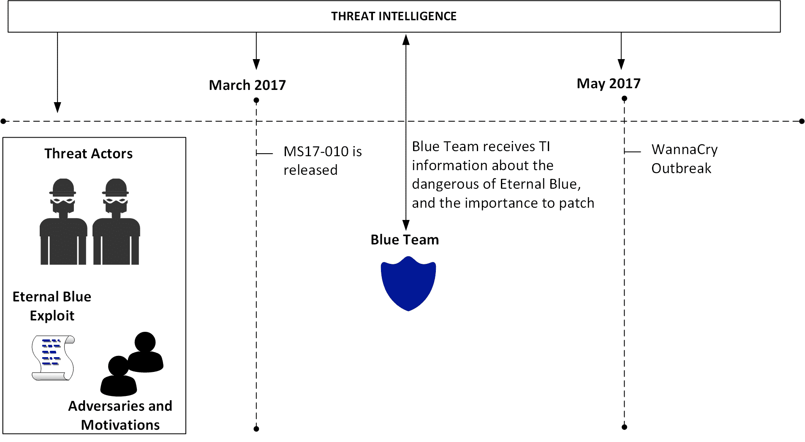
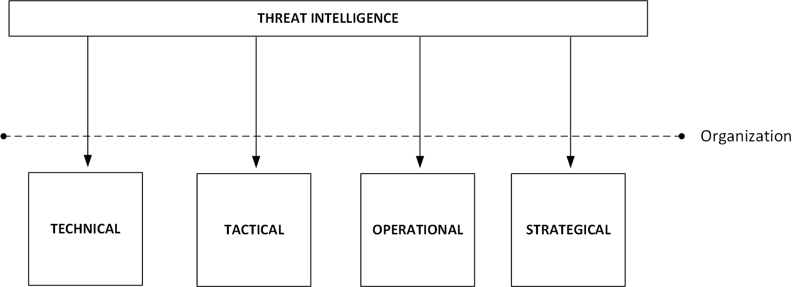
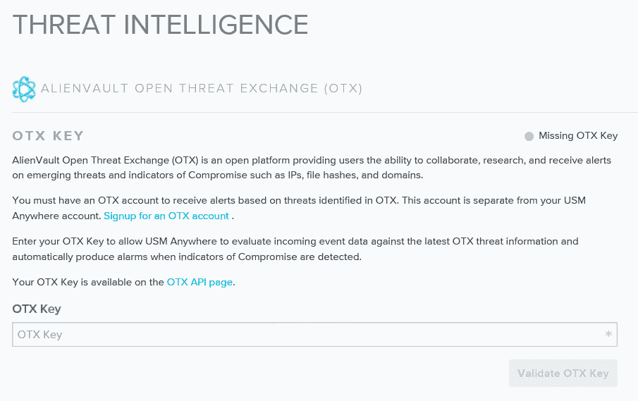
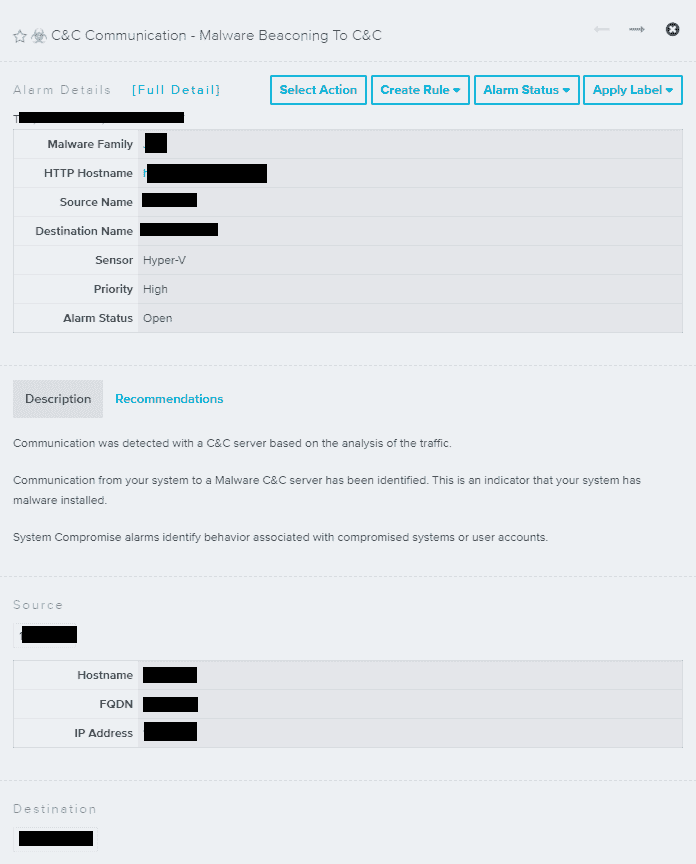

# 第十二章：威胁情报

到目前为止，你已经经历了提升防御模型的不同阶段。在上一章中，你学习了良好检测系统的重要性，现在是时候迈向下一阶段了。利用威胁情报更好地了解对手，获取有关当前威胁的洞察，是蓝队的一项宝贵工具。尽管威胁情报是一个相对较新的领域，但利用情报了解敌方运作方式是一个古老的概念。将情报引入网络安全领域是一个自然过渡，主要是因为现在威胁格局如此广泛，对手也各不相同，从国家支持的行为者到勒索受害者的网络犯罪分子。

本章将涉及以下主题：

+   威胁情报简介

+   威胁情报的开源工具

+   微软威胁情报

+   利用威胁情报调查可疑活动

# 威胁情报简介

在上一章中已经明确指出，拥有一个强大的检测系统对组织的安全态势至关重要。然而，如果能够减少误报和噪声，这个系统是可以得到改善的。你面临的主要挑战之一是，当你需要审查大量警报和日志时，你最终会随机地优先处理这些警报，有时甚至忽略未来的警报，因为你认为它们不值得审查。根据微软的*依赖机器*报告，一家大型组织平均每周需要查看 17,000 个恶意软件警报，组织发现安全漏洞平均需要 99 天。

警报分类通常发生在**网络操作中心**（**NOC**）级别，分类的延迟可能会导致多米诺效应，因为如果在这一层级的分类失败，操作也会失败，此时，操作将由事件响应团队处理。

让我们退一步，思考一下网络空间外的威胁情报。

你认为国土安全部如何改善美国的边境安全威胁？

他们有**情报与分析办公室**（**I&A**），该办公室利用情报增强边境安全。这通过推动不同机构之间的信息共享并为各级决策者提供预测性情报来实现。现在，用同样的思路来看待网络威胁情报，你就会明白它有多么有效和重要。这一洞察表明，通过更多了解对手、他们的动机以及他们使用的技术，你可以提升检测能力。将这些威胁情报应用于你收集的数据，可以带来更有意义的结果，揭示传统传感器无法探测到的行为。

需要特别提到的是，攻击者的档案将与他们的动机直接相关。以下是一些攻击者档案/动机的示例：

+   **网络犯罪分子**：主要动机是获得经济利益

+   **黑客激进分子**：该团体的动机范围较广——从表达政治偏好到仅仅为了某个特定事业的表达

+   **网络间谍/国家支持**：尽管你可以没有国家支持的网络间谍行为（通常发生在私营部门），但越来越多的网络间谍案件正在发生，因为它们是更大规模国家支持活动的一部分

现在的问题是：哪种攻击档案最有可能成为你组织的目标？这取决于。如果你的组织支持某个特定的政党，而该政党正在做一些黑客激进分子完全反对的事情，那么你可能会成为攻击目标。如果你确定自己是目标，接下来的问题是：我有哪些资产最有可能被该团体所需要？这同样取决。如果你是一个金融集团，网络犯罪分子将是你的主要威胁，他们通常想要信用卡信息、财务数据等。

使用威胁情报作为防御系统的一部分的另一个优势是能够根据对手的情况进行数据范围限定。例如，如果你负责金融机构的防御，你需要获取来自那些正在积极攻击该行业的对手的威胁情报。如果你开始接收关于教育机构遭受攻击的警报，那就没有什么太大的帮助。了解你要保护的资产类型也有助于缩小你需要更为关注的威胁行为者范围，而威胁情报正好能提供这些信息。

让我们以 WannaCry 勒索病毒为例。该病毒的爆发发生在 2017 年 5 月 12 日星期五。当时，唯一可用的**妥协指标**（**IoCs**）是勒索病毒样本的哈希值和文件名。然而，即使在 WannaCry 出现之前，EternalBlue 漏洞已经被发现，正如你所知道的，WannaCry 利用了 EternalBlue 漏洞。EternalBlue 利用了微软实现的**服务器消息块**（**SMB**）协议 v1（CVE-2017-0143）。微软在 2017 年 3 月 14 日发布了该漏洞的补丁（几乎是在 WannaCry 爆发前的两个月）。你跟得上吗？好了，让我们在下面的图表中对其进行情境化说明：



请注意，威胁情报是指在早期阶段就获取相关威胁的信息，甚至在“永恒之蓝”漏洞（最初由 NSA 发现）被黑客组织**The Shadow Brokers**（**TSB**）于 2017 年 4 月泄露到网上时，便可以得到相关情报。这个组织并非新手，这意味着他们过去的工作和动机也有相关情报。考虑到这一点，你可以预测对手的下一步行动。通过掌握这些信息，并了解永恒之蓝的工作原理，现在只是等待厂商（在此情况下为微软）发布补丁的时间问题，这发生在 2017 年 3 月。到此时，蓝队已经有足够的信息来判断该补丁对他们试图保护的业务的关键性。

许多组织未能充分意识到这一问题的影响，而是选择禁用互联网的 SMB 访问，而不是进行补丁修复。虽然这是一种可接受的解决方法，但并没有解决问题的根本原因。因此，2017 年 6 月又发生了一次勒索病毒爆发——这次是 Petya 勒索病毒。该勒索病毒利用永恒之蓝进行横向传播。换句话说，一旦它突破了内部网络中的一台计算机（见，防火墙规则已不再重要），它就会利用其他没有安装 MS17-010 补丁的系统。正如你所看到的，这里有一定的可预测性，因为 Petya 的部分操作是在使用与之前勒索病毒类似的漏洞后成功实施的。

对这一切的结论很简单：通过了解你的对手，你可以做出更好的决策来保护你的资产。话虽如此，公平地说，你不能把威胁情报当作一个 IT 安全工具来看待——它远不止于此。你必须把威胁情报当作一个帮助做出组织防御决策的工具，帮助管理者决定如何投资安全，并帮助 CISO 与高层管理人员理顺局势。你从威胁情报中获得的信息可以应用于不同的领域，例如：



总结来说，正确使用威胁情报将直接影响整个组织。

# 开源威胁情报工具

如前所述，DHS 与情报界合作，增强其自身情报能力，这在该领域几乎是标准做法。协作和信息共享是情报界的基础。市面上有许多开源威胁情报工具可供使用。部分是商业工具（付费），部分是免费的。你可以通过消费 TI 信息流来开始使用威胁情报。OPSWAT Metadefender Cloud 的 TI 信息流有多种选择，从免费到付费版本不等，且可以通过四种不同格式进行交付：JSON、CSV、RSS 和 Bro。

欲了解更多关于 Metadefender Cloud TI 数据源的信息，请访问：[`www.metadefender.com/threat-intelligence-feeds`](https://www.metadefender.com/threat-intelligence-feeds)。

另一种快速验证选项是网站[`fraudguard.io`](https://fraudguard.io)。你可以通过该网站进行快速的 IP 验证，从该位置获取威胁情报。在以下示例中，使用了 IP 220.227.71.226 进行测试（测试结果与测试当天相关，即 2017 年 10 月 27 日），结果显示了以下字段：

```
{ 
    "isocode": "IN", 
    "country": "India", 
    "state": "Maharashtra", 
    "city": "Mumbai", 
    "discover_date": "2017-10-27 09:32:45", 
    "threat": "honeypot_tracker", 
    "risk_level": "5" 
} 
```

查询的完整截图如下所示：


虽然这只是一个简单的示例，但根据你所使用的服务级别，实际上有更多功能可用。它在免费版本和付费版本中也有所不同。你还可以通过使用 Critical Stack Intel Feed（[`intel.criticalstack.com/`](https://intel.criticalstack.com/)）将威胁情报数据源集成到你的 Linux 系统中，该工具与 The Bro Network Security Monitor（[`www.bro.org/`](https://www.bro.org/)）集成。Palo Alto Networks 还提供一个免费的解决方案——MineMeld（[`live.paloaltonetworks.com/t5/MineMeld/ct-p/MineMeld`](https://live.paloaltonetworks.com/t5/MineMeld/ct-p/MineMeld)），可用于获取威胁情报。

访问此 GitHub 页面，查看包括免费威胁情报在内的免费工具列表：[`github.com/hslatman/awesome-threat-intelligence`](https://github.com/hslatman/awesome-threat-intelligence)。

在事件响应团队不确定某个特定文件是否恶意的情况下，你也可以将其提交至[`malwr.com`](https://malwr.com)进行分析。他们提供了大量有关 IoC 和样本的详细信息，这些信息可用于检测新威胁。

正如你所见，虽然有许多免费的资源，但也有一些付费的开源解决方案，例如 AlienVault USM Anywhere（[`www.alienvault.com/products/usm-anywhere`](https://www.alienvault.com/products/usm-anywhere)）。公平地说，这个解决方案远不止是一个威胁情报来源。它可以进行漏洞评估、检查网络流量，并寻找已知威胁、政策违规和可疑活动。

在 AlienVault USM Anywhere 的初始配置中，你可以配置**威胁情报交换**（**OTX**）。请注意，你需要一个帐户以及一个有效的密钥，如下所示：



配置完成后，USM 将持续监控你的环境，当出现问题时，它会触发警报。你可以查看警报状态，最重要的是，可以看到此次攻击使用的策略和方法，如下所示：


你可以深入查看警报，了解更多有关该问题的细节；这时你将看到更多关于用于触发该警报的威胁情报的详细信息。以下图像展示了这个警报的一个示例；然而，出于隐私考虑，IP 地址被隐藏：



从这个列表中，你可以获得一些非常重要的信息——攻击源、攻击目标、恶意软件家族以及描述，它们为你提供了关于攻击的详细信息。如果你需要将这些信息传递给事件响应团队以采取行动，你还可以点击“推荐”选项卡查看接下来应该采取的措施。尽管这是一个通用的建议，你仍然可以利用它来改进自己的响应。

随时，你还可以访问 OTX Pulse，网址为 [`otx.alienvault.com/pulse`](https://otx.alienvault.com/pulse)，在那里你可以看到来自最新威胁的 TI 信息，以下是一个示例：


该仪表盘为你提供了大量的威胁情报信息，虽然前面的示例显示了来自 AlienVault 的条目，但社区也有贡献。在撰写本文时，正值 BadRabbit 病毒爆发，我尝试使用这个仪表盘的搜索功能查找有关 BadRabbit 的更多信息，结果收获了大量的相关信息。

这里是一个可以增强你防御系统的有用数据示例：


# 微软威胁情报

对于使用微软产品的组织，无论是在本地还是在云中，微软将威胁情报作为产品的一部分。这是因为如今许多微软产品和服务都利用共享威胁情报，通过这些情报，它们能够提供上下文、相关性和优先级管理，帮助用户采取行动。微软通过不同的渠道消费威胁情报，例如：

+   微软威胁情报中心，该中心汇总了以下数据：

    +   嗯蜜罐、恶意 IP 地址、僵尸网络和恶意软件引爆数据流

    +   第三方来源（威胁情报数据流）

    +   基于人工观察和情报收集

+   来自其服务使用的数据的情报

+   微软和第三方生成的情报数据流

微软将这些威胁情报的结果集成到其产品中，例如 Windows Defender 高级威胁防护、Azure 安全中心、Office 365 威胁情报、云应用安全等。

访问 [`aka.ms/MSTI`](https://aka.ms/MSTI) 获取更多关于微软如何利用威胁情报来保护、检测和响应威胁的信息。

# Azure 安全中心

在上一章中，我们使用了安全中心通过行为分析来识别可疑活动。虽然这对于基于云的虚拟机和本地服务器是一个非常好的功能，但你也可以利用威胁情报更好地了解你的环境是否曾经被攻陷，或者仍然处于被攻陷状态。在安全中心仪表板中，左侧导航菜单有一个选项叫做“威胁情报”。点击它后，你需要选择包含你数据的工作区，做出选择后，你将能够看到 TI 仪表板。

为了这个示例，你看到的 TI 仪表板是一个完全被攻陷的演示环境，这也是为什么会有如此多警报的原因：


在这个仪表板中，你可以看到威胁的类型汇总。在这个例子中，所有的威胁都是僵尸网络。你还可以看到威胁的来源国（威胁来自哪个国家），以及显示威胁地理位置的地图。这个仪表板的一个很酷的地方是，你可以继续深入挖掘数据——换句话说，如果你点击其中一个国家，它会打开一个搜索结果，展示所有因来自该国家的威胁而被攻陷的系统。在这个例子中，接下来的图片是一个搜索结果，显示所有被攻陷的系统。攻击者来自乌克兰，原始搜索结果是：

```
let schemaColumns = datatable(RemoteIPCountry:string)[];          
union isfuzzy= true schemaColumns, W3CIISLog, DnsEvents, WireData, 
WindowsFirewall, CommonSecurityLog          | where 
isnotempty(MaliciousIP) and (isnotempty(MaliciousIPCountry) or 
isnotempty(RemoteIPCountry))| extend Country = 
iff(isnotempty(MaliciousIPCountry), MaliciousIPCountry, 
iff(isnotempty(RemoteIPCountry), RemoteIPCountry, ''))                      
| where Country == "Ukraine" 
```

结果如下：


你收到的初始数据包含一些有趣的信息，包括被攻陷系统的本地 IP 地址、使用的协议、流量方向以及恶意 IP。然而，最精彩的部分出现在点击“显示更多”时。

在这里，你将看到哪些文件被攻陷，哪些应用程序被使用：

```
...IndicatorThreatType:Botnet  
...Confidence:75  
...FirstReportedDateTime:2017-10-27T11:40:44.0000000Z  
...LastReportedDateTime:2017-10-27T16:27:01.2410977Z  
...IsActive:true  
...RemoteIPLongitude:27.82  
...RemoteIPLatitude:48.44  
...SessionStartTime:10/27/2017 12:29:30.000 PM  
...SessionEndTime:10/27/2017 12:29:45.000 PM  
...LocalSubnet:10.0.0.0/24  
...LocalPortNumber:3389  
...RemotePortNumber:0  
...SentBytes:1591  
...TotalBytes:2755  
...ApplicationProtocol:RDP  
...ProcessID:3052  
...ProcessName:C:WindowsSystem32svchost.exe  
```

在这个例子中，`svchost.exe`进程似乎是被攻击者攻陷的进程。此时，你需要做的就是前往目标系统，开始调查。

# 利用威胁情报调查可疑活动

到此为止，已经没有任何疑问，使用威胁情报来帮助你的检测系统是至关重要的。那么，在应对安全事件时，如何利用这些信息呢？虽然蓝队主要负责防御系统，但他们会与事件响应团队协作，提供可以帮助他们找到问题根源的正确数据。如果我们使用来自安全中心的前一个示例，我们可以直接将搜索结果交给他们，这样就足够了。但仅仅知道被攻陷的系统并不是事件响应的唯一目标。

在调查结束时，你必须至少回答以下问题：

+   +   哪些系统被攻陷了？

    +   攻击从哪里开始？

    +   哪个用户账户被用来发起攻击？

    +   它是否横向移动？

        +   如果是，它涉及了哪些系统？

    +   它是否升级了特权？

        +   如果是这样，哪个特权账户被妥协了？

    +   它是否尝试与指挥与控制进行通信？

    +   如果是这样，是否成功？

        +   如果是这样，它是否从那里下载了任何东西？

        +   如果是这样，它是否有向那里发送任何内容？

    +   它是否尝试清除证据？

        +   如果是这样，是否成功？

这些是你在调查结束时必须回答的一些关键问题，这将帮助你真正结束案件，并确保威胁已完全被遏制并从环境中移除。

你可以使用安全中心的调查功能来回答大部分这些问题。该功能使调查人员能够查看攻击路径、涉及的用户帐户、被妥协的系统以及已执行的恶意活动。在前一章中，你了解了安全中心中的安全事件功能，它会聚合属于同一攻击活动的警报。从该界面，你可以点击“开始调查”以访问调查仪表板，如下所示：


调查地图包含所有与此事件相关的实体（警报、计算机和用户）。当你首次打开仪表板时，地图的重点是安全事件本身；然而，你可以点击任何实体，地图会根据你刚选择的对象展开，显示相关信息。仪表板的第二部分会提供更多关于所选实体的详细信息，包括：

+   检测时间线

+   被妥协的主机

+   事件的详细描述

+   修复步骤

+   事件阶段

在以下示例中，安全事件在调查地图上被选中，这就是该实体的可用信息：


该窗格的内容会根据左侧的实体选择（调查地图）而有所不同。请注意，对于事件本身，有些选项是灰色的，这意味着这些选项对于此特定实体不可用，这是预期的。

观看本书的作者之一，Yuri Diogenes，在 2017 年奥兰多的 Ignite 大会上演示此功能的工作原理，视频链接：[`blogs.technet.microsoft.com/yuridiogenes/2017/09/30/ignite-2017-azure-security-center-domination/`](https://blogs.technet.microsoft.com/yuridiogenes/2017/09/30/ignite-2017-azure-security-center-domination/)。

# 参考资料

1.  *Microsoft Lean on the Machine 报告* [`download.microsoft.com/download/3/4/0/3409C40C-2E1C-4A55-BD5B-51F5E1164E20/Microsoft_Lean_on_the_Machine_EN_US.pdf`](http://download.microsoft.com/download/3/4/0/3409C40C-2E1C-4A55-BD5B-51F5E1164E20/Microsoft_Lean_on_the_Machine_EN_US.pdf)

1.  *Wanna Decryptor (WNCRY) 勒索软件解释* [`blog.rapid7.com/2017/05/12/wanna-decryptor-wncry-ransomware-explained/`](https://blog.rapid7.com/2017/05/12/wanna-decryptor-wncry-ransomware-explained/)

1.  *WannaCry 勒索软件的技术分析* [`logrhythm.com/blog/a-technical-analysis-of-wannacry-ransomware/`](https://logrhythm.com/blog/a-technical-analysis-of-wannacry-ransomware/)

1.  *新型勒索软件，老套路：Petya 添加蠕虫功能* [`blogs.technet.microsoft.com/mmpc/2017/06/27/new-ransomware-old-techniques-petya-adds-worm-capabilities/`](https://blogs.technet.microsoft.com/mmpc/2017/06/27/new-ransomware-old-techniques-petya-adds-worm-capabilities/)

1.  *DUQU 使用类似 STUXNET 的技术进行信息窃取* [`www.trendmicro.com/vinfo/us/threat-encyclopedia/web-attack/90/duqu-uses-stuxnetlike-techniques-to-conduct-information-theft`](https://www.trendmicro.com/vinfo/us/threat-encyclopedia/web-attack/90/duqu-uses-stuxnetlike-techniques-to-conduct-information-theft)

1.  *开源威胁情报* [`www.sans.org/summit-archives/file/summit-archive-1493741141.pdf`](https://www.sans.org/summit-archives/file/summit-archive-1493741141.pdf)

# 摘要

在本章中，您了解到威胁情报的重要性，以及如何利用它来获取有关当前威胁行为者及其技术的更多信息，并且在某些情况下预测他们的下一步行动。您了解了如何利用来自开源社区的威胁情报，基于一些免费工具以及商业工具。接下来，您了解了微软如何将威胁情报整合到其产品和服务中，以及如何使用安全中心不仅消费威胁情报，还根据获得的威胁情报与您自己的数据进行比较，可视化您环境中潜在受损的特性。最后，您了解了安全中心中的调查功能以及安全事件响应团队如何使用该功能找出安全问题的根本原因。

在接下来的章节中，我们将继续讨论防御策略，但这次我们将专注于响应，这是我们在本章开始的延续。您将进一步了解关于调查的内容，包括本地和云端的。
