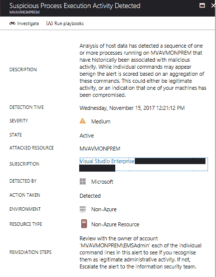

# 第十三章：调查事件

在上一章中，你学习了利用威胁情报帮助蓝队增强组织防御的重要性，并更好地了解对手。在本章中，你将学习如何将所有这些工具结合起来进行调查。除了工具之外，你还将学习如何处理一个事件，提出正确的问题，并缩小问题的范围。为说明这一点，将提供两个场景，其中一个是在本地组织中，另一个是在混合环境中。每个场景都有其独特的特征和挑战。

本章将讨论以下主题：

+   确定问题范围

+   本地被攻击的系统

+   基于云的被攻击的系统

+   结论和经验教训

# 确定问题范围

直面现实，并非所有的事件都与安全相关，因此，在开始调查之前，确定问题范围至关重要。有时，症状可能会让你最初认为自己正处理一个安全问题，但当你提出更多问题并收集更多数据时，你可能会意识到问题实际上与安全无关。

因此，案件的初步筛查在调查成功中起着重要作用。如果你没有确凿的证据表明你正在处理一个安全问题，而只是最终用户开设了一个事件，称他的计算机运行缓慢，他*认为*它被攻破了，那么你应该从基础的性能故障排除开始，而不是派遣安全响应者启动调查。因此，IT、运营和安全必须完全对齐，以避免误发警报，从而导致使用安全资源来执行支持任务。

在初步筛查过程中，确定问题的频率也非常重要。如果问题当前没有发生，你可能需要配置环境，以便在用户能够重现问题时收集数据。确保记录所有步骤，并为最终用户提供准确的行动计划。这次调查的成功将取决于收集到的数据的质量。

# 关键文物

如今，数据如此丰富，数据收集应该集中于从目标系统中获取至关重要和相关的文物。更多的数据不一定意味着更好的调查，主要是因为在某些情况下你仍然需要进行数据关联，过多的数据可能会让你偏离问题的根本原因。

在处理全球性组织的调查时，特别是当设备分布在全球不同地区时，确保了解你正在调查的系统的时区非常重要。在 Windows 系统中，此信息位于注册表键 `HKEY_LOCAL_MACHINE\SYSTEM\CurrentControlSet\Control\TimeZoneInformation` 中。你可以使用 PowerShell 命令 `Get-ItemProperty` 从系统中检索此信息，如下所示：


注意 `TimeZoneKeyName` 的值，它被设置为 `Central Standard Time`。当你开始分析日志并进行数据关联时，这些数据将非常有用。另一个重要的注册表键，用于获取网络信息的是 `HKEY_LOCAL_MACHINE\SOFTWARE\Microsoft\Windows NT\CurrentVersion\NetworkList\Signatures\Unmanaged and Managed`。这些键会显示该计算机已连接的网络。以下是 `unmanaged` 键的结果：


这两个工件对于确定机器的位置（时区）以及该机器访问的网络非常重要。对于员工在办公室外使用的设备，如笔记本电脑和平板电脑，这一点尤其重要。根据你正在调查的问题，验证这台机器的 USB 使用情况也非常关键。为此，导出注册表键 `HKLM\SYSTEM\CurrentControlSet\Enum\USBSTOR` 和 `HKLM\SYSTEM\CurrentControlSet\Enum\USB`。以下是该键的示例：


要确定是否有恶意软件配置为在 Windows 启动时启动，请检查注册表键 `HKEY_LOCAL_MACHINE\SOFTWARE\Microsoft\Windows\CurrentVersion\Run`。通常，当恶意程序出现在该位置时，它还会创建一个服务；因此，查看注册表键 `HKEY_LOCAL_MACHINE\SYSTEM\CurrentControlSet\Services` 也很重要。查找随机命名的服务和与计算机配置文件模式不符的条目。获取这些服务的另一种方式是运行 `msinfo32` 工具：


除此之外，还要确保捕获所有安全事件，并在分析时特别关注以下事件：

| **事件 ID** | **描述** | **安全场景** |
| --- | --- | --- |
| 1102 | 审计日志已被清除 | 当攻击者渗透到你的环境中时，他们可能会清除证据，清理事件日志就是这种行为的一个表现。请确保查看是谁清除了日志，这个操作是否是故意的和授权的，还是无意的或未知的（由于账户被攻击）。 |
| 4624 | 成功登录了一个账户 | 通常只会记录失败的登录事件，但在许多情况下，了解谁成功登录对于理解谁执行了哪些操作是非常重要的。 |
| 4625 | 帐户登录失败 | 多次尝试访问帐户可能是暴力破解帐户攻击的迹象。审查此日志可以为您提供一些指示。 |
| 4657 | 已修改注册表值 | 不是每个人都应该能够更改注册表键，即使您有高特权执行此操作，仍然需要进一步调查以了解此更改的真实性。 |
| 4663 | 尝试访问对象 | 尽管此事件可能会产生许多误报，但仍然值得根据需要收集和查看。换句话说，如果您有其他证据表明对文件系统的未经授权访问，您可以使用此日志来详细了解执行此更改的人员。 |
| 4688 | 已创建新进程 | 当 Petya 勒索软件爆发时，妥协指标之一是`cmd.exe /c schtasks /RU "SYSTEM" /Create /SC once /TN "" /TR "C:Windowssystem32shutdown.exe /r /f" /ST <time>`。当执行`cmd.exe`命令时，将创建一个新进程，并且还将创建一个事件 4688。在调查与安全相关的问题时，获取有关此事件的详细信息至关重要。 |
| 4700 | 已启用计划任务 | 多年来，攻击者一直在使用计划任务执行操作。使用与上述示例（Petya）相同的示例，事件 4700 可以为您提供有关计划任务的更多详细信息。 |
| 4702 | 已更新计划任务 | 如果看到不通常执行此类操作的用户的用户看到 4700，并且您继续看到 4702 以更新此任务，则应进一步调查。请记住，这可能是误报，但这一切取决于谁进行了此更改以及执行此类操作的用户配置文件。 |
| 4719 | 系统审计策略已更改 | 就像此列表的第一个事件一样，在某些情况下，已经入侵了管理级别帐户的攻击者可能需要更改系统策略以继续其渗透和横向移动。确保审查此事件并跟进所做更改的真实性。 |
| 4720 | 用户帐户已创建 | 在组织中，只有特定用户应该有特权创建帐户。如果看到普通用户创建帐户，很可能是他的凭据被泄露，攻击者已经升级特权以执行此操作。 |
| 4722 | 用户帐户已启用 | 作为攻击活动的一部分，攻击者可能需要启用先前已禁用的帐户。如果看到此事件，请确保审查此操作的合法性。 |
| 4724 | 尝试重置帐户密码 | 系统渗透和横向移动期间的另一个常见操作。如果找到此事件，请确保审查此操作的合法性。 |
| 4727 | 已创建一个启用安全的全局组 | 再次强调，只有特定用户应该具有创建启用安全组的特权。如果看到普通用户创建新组，很可能是他的凭据被盗用，攻击者已经提升了权限以执行此操作。如果发现此事件，请务必审查此操作的合法性。 |
| 4732 | 成员已添加到启用安全的本地组 | 提升权限有许多方法，有时候一种捷径是将自己添加为更高权限组的成员。攻击者可能使用这种技术来获取对资源的特权访问。如果发现此事件，请务必审查此操作的合法性。 |
| 4739 | 域策略已更改 | 在许多情况下，攻击者任务的主要目标是域控制，此事件可能会揭示这一点。如果未经授权的用户正在进行域策略更改，这意味着威胁已经到达域级别的层次结构。如果发现此事件，请务必审查此操作的合法性。 |
| 4740 | 用户帐户已被锁定 | 当进行多次登录尝试时，将达到帐户锁定阈值，并且帐户将被锁定。这可能是合法的登录尝试，也可能是暴力攻击的迹象。在审查此事件时，请务必考虑这些事实。 |
| 4825 | 用户被拒绝访问远程桌面。默认情况下，只有属于远程桌面用户组或管理员组的用户才允许连接 | 这是一个非常重要的事件，特别是如果您的计算机的 RDP 端口对互联网开放，比如位于云中的虚拟机。这可能是合法的，但也可能表明未经授权的尝试通过 RDP 连接访问计算机。 |
| 4946 | Windows 防火墙例外列表已更改。已添加一条规则。 | 当计算机受到威胁，并且系统中投放了恶意软件时，通常情况下，此恶意软件在执行时会尝试建立与命令和控制的访问。一些攻击者会尝试更改 Windows 防火墙例外列表以允许此通信发生。 |
| 4948 | Windows 防火墙例外列表已更改。已删除一条规则。 | 这与上述描述的情景类似；不同之处在于，在这种情况下，攻击者决定删除一条规则，而不是创建新规则。这也可能是为了掩盖他之前的行动。例如，他可以创建规则以允许外部通信，一旦此操作完成，就删除规则以清除入侵证据。 |

重要的是要提到，某些事件只有在本地计算机的安全策略正确配置时才会出现。例如，因为未为“对象访问”启用审计，所以下面的系统中不会出现事件 4663：


除此之外，在进行现场调查时，还要确保使用 Wireshark 收集网络跟踪，并在必要时使用 Sysinternals 的 `procdump` 工具，以创建被入侵进程的转储。

# 在本地调查一个被入侵的系统

对于第一个场景，我们将使用一台在最终用户打开了类似以下内容的钓鱼邮件后被入侵的机器：


这个最终用户位于巴西分公司，因此邮件是葡萄牙语。这封邮件的内容有点令人担忧，因为它谈到了一个正在进行的法律程序，用户很好奇看看他是否真的与此有关。在邮件中四处查看后，他注意到似乎没有发生任何事情。他忽略了并继续工作。几天后，他收到了 IT 发来的自动报告，报告称他访问了一个可疑的网站，他应该致电支持部门跟进此工单。

他致电支持并解释他记得的唯一可疑活动是打开一个奇怪的邮件，然后以此邮件作为证据呈现。当被问及他做了什么时，他解释说他点击了似乎附在邮件中的图片，以为他可以下载它，但什么也没有，只是一个迅速消失的打开窗口的一瞥，什么也没有。

调查的第一步是验证电子邮件中链接到图片的 URL。验证的最快方式是使用 VirusTotal，在这种情况下返回了以下值（2017 年 11 月 15 日进行的测试）：


这已经是一个强烈的迹象表明这个网站是恶意的，那时的问题是：它下载了什么到用户的系统上，而本地安装的反恶意软件没有发现？当反恶意软件没有发现入侵迹象，但有迹象表明恶意文件已成功下载到系统中时，通常下一步是查看事件日志。

使用 Windows 事件查看器，我们过滤了事件 ID 4688 的安全事件，并开始逐个查看每个事件，直到找到以下事件：

```
Log Name:      Security 
Source:        Microsoft-Windows-Security-Auditing 
Event ID:      4688 
Task Category: Process Creation 
Level:         Information 
Keywords:      Audit Success 
User:          N/A 
Computer:      BRANCHBR 
Description: 
A new process has been created. 

Creator Subject: 
   Security ID:            BRANCHBRJose 
   Account Name:           Jose 
   Account Domain:         BRANCHBR 
   Logon ID:         0x3D3214 

Target Subject: 
   Security ID:            NULL SID 
   Account Name:           - 
   Account Domain:         - 
   Logon ID:         0x0 

Process Information: 
   New Process ID:         0x1da8 
   New Process Name: C:tempToolsmimix64mimikatz.exe 
   Token Elevation Type:   %%1937 
   Mandatory Label:        Mandatory LabelHigh Mandatory Level 
   Creator Process ID:     0xd88 
   Creator Process Name:   C:WindowsSystem32cmd.exe 
   Process Command Line:    
```

正如你所看到的，这是臭名昭著的 `mimikatz`。它被广泛用于凭证窃取攻击，比如**传递哈希**。进一步分析显示，这个用户不应该能够运行这个程序，因为他在这台机器上没有管理员权限。基于这个推理，我们开始寻找在此之前可能被执行的其他工具，我们找到了以下工具：

```
Process Information: 
   New Process ID:         0x510 
   New Process Name: C:tempToolsPSExecPsExec.exe 
```

`PsExec` 工具通常被攻击者用来以提升（系统）权限启动命令提示符（`cmd.exe`）；后来，我们还发现了另一个 4688 事件：

```
Process Information: 
   New Process ID:         0xc70 
   New Process Name: C:tempToolsProcDumpprocdump.exe 
```

`ProcDump` 工具常被攻击者用来从 `lsass.exe` 进程中转储凭证。仍然不清楚 Jose 是如何获得特权访问的，其中一个原因是我们发现了事件 ID 1102，显示在执行这些工具之前，他清除了本地计算机上的日志：

```
Log Name:      Security 
Source:        Microsoft-Windows-Eventlog 
Event ID:      1102 
Task Category: Log clear 
Level:         Information 
Keywords:      Audit Success 
User:          N/A 
Computer:      BRANCHBR 
Description: 
The audit log was cleared. 
Subject: 
   Security ID:      BRANCHBRJose 
   Account Name:     BRANCHBR 
   Domain Name:      BRANCHBR 
   Logon ID:   0x3D3214 
```

通过进一步调查本地系统，最终得出以下结论：

+   一切始于一封钓鱼邮件

+   这封电子邮件中嵌入了一张图片，该图片包含指向已被攻陷网站的超链接。

+   一个包被下载并提取到本地系统中，这个包包含了许多工具，比如 `*mimikatz*`、`procdump` 和 `psexec`

+   这台计算机不属于域，因此只有本地凭证被攻陷

针对巴西账户的攻击正在增长；在我们撰写本章时，Talos 威胁情报发现了一次新攻击。博客 *银行木马试图窃取巴西雷亚尔* 在 [`blog.talosintelligence.com/2017/09/brazilbanking.html`](https://aka.ms/MSTI) 中描述了一种复杂的钓鱼邮件，邮件使用了合法的 VMware 数字签名二进制文件。

# 调查混合云中的受损系统

对于这种混合场景，受损的系统将部署在本地，而公司拥有基于云的监控系统，本文示例中采用的是 Azure 安全中心。为了展示混合云场景如何与本地在线场景相似，我们将使用之前的案例。再次强调，用户收到了一个钓鱼邮件，点击了超链接，导致系统被攻陷。不同之处在于，现在有一个活跃的传感器在监控系统，这将触发警报通知 SecOps，并且用户将被联系。用户不再需要等上几天才能意识到自己被攻陷；响应更快速且更准确。

SecOps 工程师可以访问安全中心仪表盘，当创建警报时，警报名称旁边会显示一个 NEW 标志。SecOps 工程师还注意到创建了一个新的安全事件，如下图所示：


正如第十一章 *主动传感器* 中提到的，Azure 安全中心中的安全事件代表了两个或多个相关的警报。换句话说，它们是针对目标系统的同一攻击活动的一部分。通过点击该安全事件，SecOps 工程师注意到以下警报：


此事件中包含了四个警报，正如你所看到的，它们是按时间顺序组织的，而不是按优先级排序的。在该窗格的底部，包含了两个显著事件，这些额外的信息在调查过程中可能会有用。第一个事件仅报告安装在本地机器上的反恶意软件成功阻止了一个试图在本地系统中植入恶意软件的行为。这个是好消息，但不幸的是，攻击者有足够的动力继续攻击，并成功禁用了本地系统上的反恶意软件。需要记住的是，为了做到这一点，攻击者必须提升权限，并运行类似`Taskkill`或`killav`的命令来终止反恶意软件进程。接下来，我们看到一个中等优先级的警报，显示检测到一个可疑进程名称，如以下截图所示：


在这种情况下，进程是`mimikatz.exe`，它也在我们的前一个案例中被使用。你可能会问：为什么这是中等优先级，而不是高优先级？因为在这一时刻，`mimikatz.exe`进程还没有启动。这就是为什么警报显示为：“检测到可疑的进程名称”。关于此事件的另一个重要事实是攻击资源的类型，即非 Azure 资源，这样你可以识别出这是本地资源或是其他云服务商（如 Amazon AWS）上的虚拟机。接下来是另一个警报，我们检测到了可疑的进程执行活动：



该警报的描述非常清晰地说明了目前发生的情况，这也是拥有监控系统监视进程行为的最大优势之一。它会观察这些模式，并将数据与自己的威胁情报源进行关联，以了解这些活动是否可疑。提供的修复步骤也有助于采取后续措施。让我们继续查看其他警报。下一个是高优先级警报，指的是执行了一个可疑进程：


该警报显示`mimikatz.exe`已经执行，且父进程是`cmd.exe`。由于`mimikatz`需要一个特权账户才能成功运行，因此推测这个命令提示符是以高权限账户的身份运行的，在本例中是 EMSAdmin。瓶中的显著事件也应当进行检查。我们将跳过第一个，因为我们知道它是关于清除证据（擦除日志）的，但下一个事件不那么清楚，所以我们需要审查一下：


这是另一个表明攻击者已妥协其他文件的迹象，例如`rundll32.exe`。此时，您已经有足够的信息来继续调查过程。如第十二章《*威胁情报*》中所述，Azure 安全中心具有一个功能，使您能够深入了解安全问题的细节，这就是调查功能。在此案例中，我们将选择此列表中的第二个警报并点击调查按钮。此特定案例的调查路径如下图所示：


此图中的每个实体提供有关其自身对象的详细信息，如果与所选实体相关的其他实体存在，您可以通过点击对象本身来切换它，如下图所示：


调查地图帮助您可视化在此攻击过程中所采取的步骤，并更好地理解所有相关实体之间的关联。

# 搜索，你将找到它

在实际场景中，传感器和监控系统收集的数据量可能非常庞大。手动调查这些日志可能需要几天时间，这也是为什么您需要一个安全监控系统，能够聚合所有这些日志、处理它们并为您合理化结果。话虽如此，您还需要搜索功能，以便在继续调查时能够挖掘更多重要信息。

安全中心的搜索功能由 Azure 日志分析提供支持，Azure 日志分析拥有自己的查询语言。通过使用日志分析，您可以跨不同工作区进行搜索，并自定义搜索的详细信息。假设您需要知道在此环境中是否有其他机器上运行名为`mimikatz`的进程。搜索查询将类似于以下内容：


请注意，在此案例中，操作符使用的是`contains`，但它也可以是`equals`。之所以使用`contains`，是因为它可能会带来更多的结果，并且为了本次调查，我们希望了解所有名称中包含这些字符串的进程。此查询的结果显示以下条目：


输出结果总是以表格格式呈现，并允许您可视化与此查询匹配的所有详细信息。

访问以下链接，查看另一个使用搜索功能查找有关攻击的关键信息的示例：[`blogs.technet.microsoft.com/yuridiogenes/2017/10/20/searching-for-a-malicious-process-in-azure-security-center/`](https://blogs.technet.microsoft.com/yuridiogenes/2017/10/20/searching-for-a-malicious-process-in-azure-security-center/)。

# 经验教训

每当一起事件结束时，你不仅要记录调查过程中所做的每一步，还要确保识别出调查中的关键方面，这些方面可能需要重新审视以改进或修复，因为它们并没有很好地工作。经验教训对流程的持续改进至关重要，能够避免再次犯同样的错误。

在这两种情况下，都使用了凭证窃取工具来获取用户的凭证并提升权限。针对用户凭证的攻击正在成为一个日益严重的威胁，解决方案并非依赖于单一的产品，而是通过一系列任务的聚合来解决，例如：

+   减少管理员级别账户的数量，并消除本地计算机中的管理员账户。普通用户不应成为自己工作站的管理员。

+   尽可能使用多因素认证。

+   调整安全策略以限制登录权限。

+   定期重置**Kerberos TGT**（**KRBTGT**）账户的计划。该账户用于执行金票攻击。

这些只是该环境中的一些基本改进；蓝队应该编写一份详细报告，记录经验教训以及如何利用这些经验改进防御控制。

# 参考资料

1.  *银行木马试图窃取巴西雷亚尔*：[`blog.talosintelligence.com/2017/09/brazilbanking.html`](http://blog.talosintelligence.com/2017/09/brazilbanking.html)

1.  *Azure 安全中心中的安全行动手册（预览）*：[`docs.microsoft.com/en-us/azure/security-center/security-center-playbooks`](https://docs.microsoft.com/en-us/azure/security-center/security-center-playbooks)

1.  *在 Azure 安全中心中处理安全事件*：[`docs.microsoft.com/en-us/azure/security-center/security-center-incident`](https://docs.microsoft.com/en-us/azure/security-center/security-center-incident)

1.  *Azure 安全中心中的威胁情报*：[`docs.microsoft.com/en-us/azure/security-center/security-center-threat-intel`](https://docs.microsoft.com/en-us/azure/security-center/security-center-threat-intel)

# 摘要

在本章中，你学到了从安全角度正确界定问题范围的重要性。你了解了 Windows 系统中的关键文物，以及如何通过仅审查与案件相关的日志来提升数据分析。接下来，你跟踪了一个本地调查案例，分析了相关数据并学会了如何解读这些数据。你还跟踪了一个混合云调查案例，但这次使用了 Azure 安全中心作为主要监控工具。

在下一章中，你将学习如何在先前被攻破的系统中执行恢复过程。你还将了解备份和灾难恢复计划。
