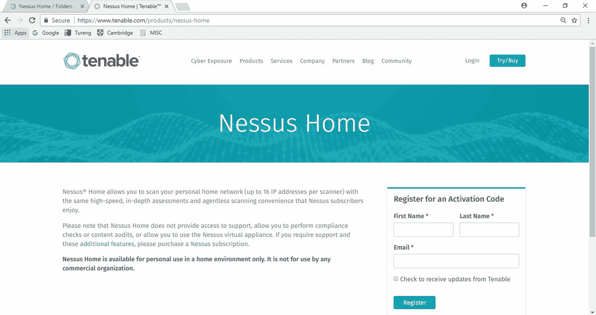

# 第十五章：漏洞管理

在前面的章节中，你了解了恢复过程以及拥有一个良好的恢复策略和合适的工具是多么重要。很多时候，漏洞的利用可能会导致灾难恢复场景。因此，必须建立一个能够防止漏洞被利用的系统。但是，如果你不知道系统是否存在漏洞，如何防止漏洞被利用呢？答案是建立一个漏洞管理过程，利用这个过程来识别漏洞并帮助你减轻风险。本章重点介绍了组织和个人需要实施的机制，以使系统更难被黑客攻击。虽然系统不可能做到 100%安全，但可以采取一些措施来使黑客完成任务的难度增大。

本章将涵盖以下主题：

+   创建漏洞管理策略

+   漏洞管理工具

+   实施漏洞管理

+   漏洞管理的最佳实践

# 创建漏洞管理策略

创建有效漏洞管理策略的最佳方法是将其作为一个漏洞管理生命周期。就像攻击生命周期一样，漏洞管理生命周期将所有漏洞缓解过程有序地安排在时间表中。这使得网络安全事件的目标和受害者能够减轻他们已经遭受或可能遭受的损害。合适的对策会在适当的时间进行，以便在攻击者能够利用漏洞之前找到并解决这些漏洞。

漏洞管理策略由六个不同的阶段组成。本节将讨论每个阶段以及它们的防护目标，还将讨论在每个阶段可能遇到的挑战。

# 资产清单

漏洞管理策略的第一阶段应是制作资产清单。然而，许多组织缺乏有效的资产登记，因此在保护其设备时遇到困难。资产清单是安全管理员可以用来检查组织拥有的设备，并突出需要由安全软件覆盖的设备的工具。在漏洞管理策略中，组织应通过指定一名员工负责管理资产清单，以确保所有设备都被记录在案，并且清单保持最新（1）。资产清单也是网络和系统管理员快速查找和修补设备与系统的一个好工具。

如果没有库存，当新的安全软件正在打补丁或安装时，一些设备可能会被遗落。这些是攻击者将会攻击的设备和系统。正如在第五章 *系统妥协* 中所见到的，有些黑客工具可以扫描网络并找出未打补丁的系统。缺乏资产清单也可能导致组织在安全方面支出不足或过多。这是因为它无法正确确定需要购买保护的设备和系统。在这个阶段预期会遇到许多挑战。如今的组织中的 IT 部门经常面临变更管理不善、流氓服务器和网络边界不清晰等问题。组织还缺乏有效的工具以一致的方式维护清单。

# 信息管理

脆弱性管理策略的第二阶段是控制信息如何流入组织。最关键的信息流是来自组织网络的互联网流量。组织需要防范越来越多的蠕虫、病毒和其他恶意软件威胁。本地网络内外的流量流动也在增加。增加的流量威胁着将更多恶意软件带入组织。因此，应重视这种信息流，以防止威胁进入或离开网络。除了恶意软件的威胁，信息管理还涉及组织的数据。组织存储不同类型的数据，其中一些绝不能落入错误人手中。例如商业机密和客户个人信息，如果被黑客访问，可能会造成无法弥补的损害。组织可能会失去声誉，还可能因未能保护用户数据而被罚款巨额。竞争对手可能会获取秘密配方、原型和商业机密，使他们能够超越受害组织。因此，在脆弱性管理策略中，信息管理至关重要。

为了应对这些挑战，组织可以部署**计算机安全事件响应团队**（**CSIRT**）来处理对信息存储和传输的任何威胁（2）。该团队不仅会应对黑客事件，还会在有入侵尝试访问敏感信息时，向管理层报告并提供最佳的应对措施。除了这个团队，组织还可以采取最低权限策略来管理信息访问。该策略确保用户只能访问完成工作所需的信息，其他信息一律拒绝访问。减少访问敏感信息的人员数量是减少攻击途径的有效措施（2）。最后，在信息管理策略中，组织可以部署机制来检测并阻止恶意人员访问文件。这些机制可以在网络中部署，以确保恶意流量被拒绝进入，并且像窥探等可疑活动得到报告。它们还可以在终端设备上部署，以防止非法复制或读取数据。

在漏洞管理策略的这一阶段，存在一些挑战。首先，多年来信息的广度和深度不断增长，这使得信息变得难以处理，同时也难以控制谁可以访问它。有关潜在黑客攻击的有价值信息，如警报，已经超过了大多数 IT 部门的处理能力。每天 IT 部门接收到大量类似警报时，合法的警报常常被当作误报忽视，这并不令人意外。

曾经发生过一些组织在忽视来自网络监控工具的警报后，很快就被攻击的事件。IT 部门并不完全应该负责，因为这些工具每小时生成的海量新信息中，大部分都证明是误报。进出组织网络的流量也变得更加复杂。恶意软件正以非常规方式进行传播。向普通用户传达新漏洞信息也是一个挑战，尤其是对于那些不懂技术 IT 术语的用户。这些挑战共同影响了组织在面对潜在或已验证的黑客攻击时的响应时间和应对措施。

# 风险评估

这是漏洞管理策略中的第三步。在风险得以缓解之前，安全团队应对面临的漏洞进行深入分析。在理想的 IT 环境中，安全团队应该能够响应所有漏洞，因为它拥有足够的资源和时间。然而，现实中，缓解风险所需的资源存在许多限制因素。这就是为什么风险评估至关重要的原因。在这一步骤中，组织必须优先处理某些漏洞，并分配资源来减轻它们带来的风险。风险评估包括五个阶段。

# 范围

风险评估从范围识别开始。组织的安全团队预算有限，因此必须确定它将覆盖的领域和不覆盖的领域。它需要决定保护哪些内容，哪些内容的敏感性较高，以及需要保护到何种程度。范围需要仔细定义，因为它将决定从哪些地方进行内部和外部漏洞分析。

# 数据收集

在定义了范围后，需要收集关于现有政策和程序的数据，这些政策和程序旨在保护组织免受网络威胁。可以通过访谈、问卷和对人员（如用户和网络管理员）进行调查来完成此任务。所有在范围内的网络、应用程序和系统都应收集相关数据。这些数据可能包括：服务包、操作系统版本、运行的应用程序、位置、访问控制权限、入侵检测测试、防火墙测试、网络调查和端口扫描等。该信息将进一步揭示网络、系统和应用程序所面临的威胁类型。

# 政策和程序分析

组织设立政策和程序来管理其资源的使用，确保资源得到正当且安全的使用。因此，审查和分析现有的政策和程序非常重要。政策中可能存在不充分之处，也可能存在某些政策不切实际的情况。在分析政策和程序时，还应确定用户和管理员在执行方面的合规性。仅仅因为政策和程序被制定并传播，并不意味着它们得到了遵守。对于不合规的惩罚措施也应进行分析。最终，将会了解组织是否有足够的政策和程序来应对漏洞。

# 漏洞分析

在分析完政策和程序后，需要进行漏洞分析，以确定组织的暴露程度并查明是否有足够的保护措施来防止自身受到侵害。漏洞分析使用的是第四章中讨论过的*侦察*工具。这里使用的工具与黑客用来确定组织漏洞的工具相同，这样他们可以决定使用哪些漏洞进行攻击。通常，组织会聘请渗透测试人员来进行这个过程。漏洞分析中的最大问题是需要过滤掉大量的误报。因此，必须将不同的工具结合使用，才能得出一个可靠的组织现有漏洞清单。

渗透测试人员需要模拟真实攻击，并找出在攻击过程中受压并被攻破的系统和设备。最终，识别出的漏洞会根据它们对组织构成的风险进行分级。那些暴露程度和危害性较小的漏洞通常会被赋予较低的评分。在漏洞分级系统中有三个等级。轻微级别适用于那些需要大量资源才能利用，但对组织影响极小的漏洞。中等级别适用于那些潜在危害、可利用性和暴露程度适中的漏洞。高严重性级别适用于那些需要较少资源即可利用，但如果被利用，可能会对组织造成巨大损害的漏洞。

# 威胁分析

对组织的威胁是那些可能导致数据和服务篡改、破坏或中断的行为、代码或软件。威胁分析旨在评估组织可能面临的风险。识别出的威胁必须进行分析，以确定它们对组织的影响。威胁的评估方式与漏洞类似，但更多的是从动机和能力的角度进行衡量。例如，内部人员可能没有很强的动机恶意攻击组织，但由于对组织内部运作的了解，他们可能拥有较强的能力。因此，威胁的评分系统可能与漏洞分析中的评分系统有所不同。最终，识别出的威胁会被量化和分级。

# 可接受风险分析

可接受风险的分析是风险评估中的最后一步。在这里，首先评估现有的政策、程序和安全机制，以确定它们是否足够。如果它们不足够，就假设组织中存在漏洞。随后采取纠正措施，确保它们被更新和升级，直到足够为止。因此，IT 部门将确定保护措施应满足的推荐标准。任何未覆盖的部分都将被归类为可接受的风险。然而，随着时间的推移，这些风险可能会变得更有害，因此必须进行分析。只有在确定这些风险不会构成威胁后，风险评估才会结束。如果它们可能构成威胁，保护措施标准将更新以应对这些风险。

在此漏洞管理阶段，最大挑战是信息的不可获得性。一些组织没有记录其政策、程序、战略、流程和安全资产。因此，可能很难获得完成此阶段所需的信息。对于中小型公司来说，保持所有文档化可能更容易，但对于大公司来说，这是一个复杂的任务。大公司有多个业务线、部门、资源不足、缺乏规范化文档和职责重叠。唯一的解决方案是通过定期的清理活动来确保所有重要事项都被文档化，并且员工清楚地理解自己的职责。

# 漏洞评估

漏洞评估紧随风险评估之后，成为漏洞管理策略的一部分。这是因为这两个步骤密切相关。漏洞评估涉及识别易受攻击的资产。此阶段通过进行多次道德黑客攻击和渗透测试来进行。组织网络上的服务器、打印机、工作站、防火墙、路由器和交换机都将成为这些攻击的目标。目的是模拟潜在攻击者可能使用的相同工具和技术进行实际的黑客攻击场景。这些工具大部分已经在侦察和系统入侵章节中讨论过。本步骤的目标不仅仅是识别漏洞，还要快速且准确地识别漏洞。该步骤应生成一份关于组织面临的所有漏洞的全面报告。

在这个步骤中面临的挑战有很多。首先需要考虑的是组织应评估哪些内容。如果没有适当的资产清单，组织将无法识别应该关注哪些设备。此外，某些主机可能会被忽视，尽管它们可能是潜在攻击的关键目标。另一个挑战与使用的漏洞扫描器有关。一些扫描器提供错误的评估报告，导致组织走上错误的道路。当然，假阳性始终存在，但有些扫描工具的错误报告超出了可接受的百分比，并不断提出不存在的漏洞。这些可能导致组织在修复过程中浪费资源。干扰也是这个阶段的另一个挑战。随着所有道德黑客和渗透测试活动的进行，网络、服务器和工作站都遭受了影响。网络设备，如防火墙，也变得迟缓，尤其是在进行拒绝服务攻击时。

有时，强烈的攻击会导致服务器宕机，扰乱组织的核心功能。这可以通过在没有用户使用的情况下进行这些测试来解决，或者在评估核心工具时准备替代方案。使用工具本身也是一个挑战。像 Metasploit 这样的工具要求你对 Linux 有扎实的理解，并且具有使用命令行界面的经验。许多其他扫描工具也有类似的要求。很难找到既提供良好界面又能提供灵活定制脚本的扫描工具。最后，有时扫描工具没有很好的报告功能，这迫使渗透测试人员手动编写报告。他们的报告可能没有扫描工具直接生成的报告那么详细。

# 报告和修复跟踪

漏洞评估之后是报告和修复阶段。这个阶段有两个同样重要的任务：报告和修复。报告的任务帮助系统管理员了解组织当前的安全状态，以及仍然不安全的领域，并将这些问题指出给负责人。报告还为管理层提供了具体的信息，使他们能够将其与组织未来的方向联系起来。报告通常在修复之前进行，以便漏洞管理阶段汇总的所有信息可以无缝地传递到这一阶段。

修复开始了真正结束漏洞管理周期的过程。正如之前所讨论的，漏洞管理阶段在分析了威胁和漏洞并概述了可接受的风险后，提前结束了。修复通过提出对已识别的威胁和漏洞的解决方案来补充这一过程。所有受影响的主机、服务器和网络设备都被追踪，并制定必要的措施来消除漏洞，并防止其未来被利用。这是漏洞管理策略中最重要的任务，如果执行得当，漏洞管理将被认为是成功的。此任务中的活动包括识别缺失的补丁，并检查组织中所有系统的可用升级。同时，还会为扫描工具发现的漏洞提供解决方案。在这一阶段，还会识别多层次的安全防护措施，如防病毒程序和防火墙。如果这一阶段未能成功执行，那么整个漏洞管理过程将变得毫无意义。

如预期的那样，这一阶段聚集了许多挑战，因为这是所有漏洞的解决方案被确定的阶段。第一个挑战出现在报告不完整，并未包含组织面临的所有风险信息时。一份写得不好的报告可能导致修复措施不到位，从而使组织依然面临威胁。缺乏软件文档也可能在这一阶段带来挑战。软件的供应商或制造商通常会留下包含如何进行更新的说明文档。如果没有这些文档，更新定制软件可能会变得非常困难。软件供应商和组织之间的沟通不畅，也可能在系统修补时带来挑战。最后，修复过程可能会因最终用户缺乏合作而受到影响。修复可能会导致系统停机，这是最终用户最不希望经历的。

# 响应计划

响应计划可以被认为是最容易的，但仍然是漏洞管理策略中非常重要的一步。它之所以简单，是因为前五个步骤中的所有艰难工作都已经完成。它之所以重要，是因为如果没有执行响应计划，组织仍将暴露于威胁之中。在这一阶段，唯一重要的就是执行的速度。大规模的组织在执行时面临巨大的难题，因为需要修补和升级的设备数量庞大。

当微软宣布 MS03-023 漏洞并发布修补程序时，发生了一起事件。那些拥有短期响应计划的小型组织能够在公告发布后不久通过更新修补操作系统。然而，缺乏或拥有长期响应计划的大型组织却遭到了黑客的严重攻击。黑客在微软为其用户提供了有效修补程序后，仅仅 26 天，就发布了 MS Blaster 蠕虫来攻击那些未修补的操作系统。即便是大型公司，也有足够的时间完全修补他们的系统。然而，响应计划的缺乏或长期响应计划的使用导致一些公司成为了蠕虫的受害者。这个蠕虫使得感染的计算机网络变得迟缓或发生宕机。另一起最近发生的著名事件是 WannaCry 勒索病毒袭击。这是史上最大规模的勒索病毒攻击，源于一个据称从 NSA 窃取的漏洞，名为**Eternal Blue**（3）。这次攻击始于 5 月，但微软早在 3 月就发布了 Eternal Blue 漏洞的修补程序。然而，它并未为较老版本的 Windows（如 XP）发布修补程序（3）。从 3 月到首次发现攻击的那一天，企业有足够的时间来修补他们的系统。然而，由于响应计划不足，大多数公司在攻击开始时并未进行修补。如果攻击没有被遏制，更多的计算机可能会成为受害者。

这表明，响应计划中速度是多么重要。补丁应在发布后立即安装。

在这一阶段面临的挑战有很多，因为它涉及到最终用户及其机器的实际操作。第一个挑战是及时将适当的沟通传达给正确的人。当补丁发布时，黑客总是迅速寻找攻击那些未安装补丁的组织的方式。这就是为什么建立良好的沟通链条如此重要。另一个挑战是责任追究。组织需要知道应该追究谁未安装补丁。有时，用户可能因为取消安装而承担责任。在其他情况下，可能是 IT 团队没有及时启动修补过程。总之，应该始终有一个可以对未安装补丁负责的个人。最后一个挑战是重复劳动。这通常发生在大型组织中，那里有很多 IT 安全人员。他们可能会使用相同的响应计划，但由于沟通不畅，他们可能会相互重复工作而进展缓慢。

# 漏洞管理工具

可用的漏洞管理工具有很多，为了简化，本节将根据工具使用的阶段来讨论这些工具。因此，每个阶段将讨论其相关工具，并给出它们的优缺点。值得注意的是，并非所有讨论的工具都直接处理漏洞本身，但它们对整个过程的贡献非常重要。

# 资产清单工具

资产清单阶段旨在记录一个组织所拥有的计算资产，以便在执行更新时便于跟踪。以下是可以在此阶段使用的一些工具。

# Peregrine 工具

Peregrine 是一家软件开发公司，2005 年被惠普（HP）收购。它发布了三款最常用的资产清单工具，其中之一是资产中心。它是一个专门为满足软件资产需求而精细调校的资产管理工具。该工具允许组织存储其软件的许可信息。这是一项许多其他资产清单系统遗漏的重要信息。该工具只能记录组织中的设备和软件信息。然而，有时需要一种能够记录网络详情的工具。Peregrine 创建了其他专门设计用于记录网络资产的工具。这些工具包括网络发现工具和桌面资产清单工具，通常一起使用。它们保持一个更新的数据库，记录所有连接到组织网络的计算机和设备。它们还可以提供有关网络、其物理拓扑、连接计算机的配置以及它们的许可信息的详细信息。所有这些工具通过一个界面提供给组织。Peregrine 工具具有可扩展性，易于集成，并且足够灵活，能够应对网络中的变化。它们的缺点在于当网络中存在不受控的桌面客户端时，工具通常会忽略它们。

# LANDesk 管理套件

LANDesk 管理套件是一款强大的资产管理工具，广泛用于网络管理（4）。该工具可以提供资产管理、软件分发、许可证监控以及对连接到组织网络的设备进行远程控制的功能（4）。该工具具备自动化的网络发现系统，能够识别连接到网络的新设备。它会检查这些设备是否已经存在于数据库中，若从未添加过，则会将其新增到系统中。该工具还利用在客户端后台运行的库存扫描，能获取特定于客户端的信息，如许可证信息（4）。该工具具有高度的可扩展性，并为用户提供便携的后端数据库。该工具的缺点是无法与指挥中心使用的其他工具集成，同时也面临着定位流氓桌面的问题。

# StillSecure

这是 Latis Networks 公司创建的一套工具，为用户提供网络发现功能（5）。该套件包含三种针对漏洞管理定制的工具——即桌面 VAM、服务器 VAM 和远程 VAM。这三款工具以自动化方式运行，它们会扫描并提供有关网络的全面报告。扫描时间还可以根据用户的日程手动设置，以避免扫描过程可能带来的网络迟缓问题。这些工具将记录网络中的所有主机，并列出它们的配置。它们还会显示应在每个主机上运行的相关漏洞扫描。因为该套件是专门为漏洞评估和管理而设计的。

该工具的主要优点是，它可以在不需要安装客户端版本的情况下扫描并记录网络中的主机，类似之前讨论过的工具。套件的远程 VAM 可以用来发现位于内部网络边缘的设备，且无需进入网络内部。这一点相比于之前讨论的其他资产管理工具是一个重要的优势。该套件提供了通过不同业务单元或通过普通系统管理员的排序方法来对资产进行分组的选项。该套件的主要缺点是，由于它不在主机上安装客户端，因此无法收集关于主机的深入信息。资产管理工具的主要目的是捕捉组织中设备的所有相关信息，而该套件有时可能无法提供这种数据质量。

# Foundstone 的企业版

Foundstone 的 Enterprise 是由 Foundscan Engine 开发的一款工具，使用 IP 地址进行网络发现。该工具通常由网络管理员设置，以扫描分配了特定 IP 地址范围的主机。该工具可以设置在组织认为最合适的时间运行。该工具具有企业网页界面，在其中列出了它在网络上找到的主机和服务。该工具还被认为可以智能扫描主机可能存在的漏洞，并定期向网络管理员提供报告。然而，该工具被认为不足以作为理想的资产清单工具，因为它仅收集与漏洞扫描相关的数据：

# 信息管理工具

信息管理阶段涉及组织中信息流的控制。这包括将有关入侵和入侵者的信息传递给合适的人员，以便他们采取推荐的行动。有许多工具提供帮助组织传播信息的解决方案。它们使用简单的沟通方式，如电子邮件、网站和分发列表。当然，所有这些都根据组织的安全事件政策进行定制。在安全事件发生时，必须首先通知的人员是事件响应团队的成员。这是因为他们的行动速度可能决定安全漏洞对组织的影响。大多数可以用来联系他们的工具都是基于网页的。其中一个工具是 CERT 协调中心。它有助于创建一个在线指挥中心，通过电子邮件定期向选定的人员发出警报和通知（6）。另一个工具是 Security Focus，它使用与 CERT 工具类似的策略（7）。它创建邮件列表，在安全事件报告时通知事件响应团队。

Symantec Security Response 也是另一种信息管理工具（8）。这个工具有许多优点，其中之一是它能够使事件响应团队保持信息更新。Symantec 在全球范围内以其深入的互联网安全威胁报告而闻名。这些年度出版物非常适合了解网络犯罪分子如何随着时间的发展而演变。报告还提供了有意义的攻击统计数据。这使得事件响应团队可以根据可观察到的趋势充分准备应对某些类型的攻击。除了这份出版物之外，该工具还提供了 Shadow Data Report、Symantec Intelligence Report 和安全白皮书（8）。该工具还为一些组织必须防范的攻击类型提供了威胁聚焦。此外，它还拥有一个名为**DeepSight**的智能系统，提供全天候 24/7 的报告（8）。IT 还提供了一个 A 到 Z 的风险和威胁列表以及相应的对策。最后，该工具为用户提供了链接到 Symantec AntiVirus，用户可以利用它来清除恶意软件并处理感染的系统。这个工具在信息管理方面非常全面，因此值得高度推荐。

这些工具是互联网上最常用的工具之一。所有这些工具最显著的相似之处是通过邮件列表使用电子邮件警报。可以设置邮件列表，以便事件响应者首先接收到警报，并且一旦他们确认了安全事件，组织中的其他用户可以被通知。组织安全政策有时是这些在线工具的良好补充。在攻击发生时，地方安全政策可以指导用户应该做什么以及应该联系谁。

# 风险评估工具

大多数风险评估工具都是内部开发的，因为并不是所有组织在同一时间面临相同的风险。风险管理中存在许多变化，这就是为什么仅使用一种软件作为通用工具来识别和评估组织所面临的风险可能会很棘手的原因。组织使用的内部工具是由系统和网络管理员开发的检查表。检查表应该包含关于组织所暴露的潜在漏洞和威胁的问题。这些问题将帮助组织定义其网络中已识别漏洞的风险级别。以下是可以放在检查表上的问题：

+   识别出的漏洞如何影响组织？

+   哪些商业资源面临被破坏的风险？

+   是否存在远程利用的风险？

+   攻击的后果是什么？

+   攻击是否依赖于工具或脚本？

+   如何减轻攻击的影响？

为了补充检查清单，组织可以采购执行自动化风险分析的商业工具。其中一种工具是 **ArcSight Enterprise Security Manager** (**ESM**)。它是一款威胁检测和合规性管理工具，用于检测漏洞和缓解网络安全威胁。该工具从网络及其连接的主机收集大量安全相关数据。通过记录的事件数据，它可以实时与数据库进行关联，判断网络上是否存在攻击或可疑行为。它能够每秒最多关联 75,000 个事件。这种关联还可以用来确保所有事件遵循组织的内部规则。它还建议缓解和解决漏洞的方法。

# 漏洞评估工具

由于组织面临的网络安全威胁数量增加，漏洞扫描工具的数量也相应增长。组织可以选择许多免费的或付费的工具。这些工具中的大多数在第四章《*侦察*》和第五章《*系统妥协*》中都有讨论。最常用的漏洞扫描工具是 Nessus 和 NMap（后者通过其脚本功能可以作为基础的漏洞工具使用）。NMap 非常灵活，可以配置以满足用户的特定扫描需求。它能够快速绘制新网络的地图，并提供关于网络上连接的资产及其漏洞的信息。

Nessus 可以看作是 Nmap 扫描器的升级版。这是因为 Nessus 可以对连接到网络的主机进行深入的漏洞评估（9）。该扫描器能够确定主机的操作系统版本、缺失的补丁以及可以针对系统利用的相关漏洞。该工具还会根据威胁等级对漏洞进行排序。Nessus 还具有高度的灵活性，用户可以编写自己的攻击脚本，并将其应用于网络上各种主机（9）。该工具拥有自己的脚本语言，以便于这一操作。这是一个很棒的功能，因为正如我们在讨论此步骤面临的挑战时所提到的，许多扫描器未能在良好的界面和高度灵活性之间找到完美的平衡。还有其他相关工具也可以用于扫描，如 Harris STAT、Foundstone 的 Foundscan 和 Zenmap。然而，它们的功能与 Nessus 和 Nmap 类似。

# 报告和修复跟踪工具

漏洞管理策略的这一步骤使得事件响应者能够提出适当的方式来减轻组织面临的风险和漏洞。他们需要能够告知当前组织安全状态并跟踪所有修复工作的工具。有许多报告工具，组织通常偏好那些具有深入报告功能且能够为多个受众定制的工具。组织中有许多利益相关者，并非所有人都能理解技术术语。同时，IT 部门需要工具，能够提供不做任何修改的技术细节。因此，受众的区分非常重要。

具有此类功能的两个工具是 Foundstone 的 Enterprise Manager 和 Latis Reporting 工具。它们具有相似的功能：都提供可定制的报告功能，能够根据用户和其他利益相关者的不同需求进行定制。Foundstone 的 Enterprise Manager 提供可定制的仪表盘，用户可以通过该仪表盘获取长期报告和针对特定人员、操作系统、服务和地区定制的报告。不同地区会影响报告的语言，这对于跨国公司特别有用。这些工具生成的报告将显示漏洞的详细信息及其发生频率。

这两个工具还提供了修复跟踪功能。Foundstone 工具具有一个选项，可以将漏洞分配给特定的系统管理员或 IT 员工（10）。然后，它可以通过工单跟踪修复过程。Latis 工具也提供了将特定漏洞分配给负责修复的人员的选项。它还会跟踪分配人员的进展。完成后，Latis 工具会执行验证扫描，以确认漏洞是否已解决。修复跟踪通常旨在确保某人对解决特定漏洞负责，直到问题解决为止。

# 响应规划工具

响应规划是大多数解决、消除、清理和修复活动发生的步骤。补丁和系统升级也发生在此阶段。商业工具在此步骤中的应用不多。通常，响应规划是通过文档来完成的。文档帮助系统和网络管理员在处理他们不熟悉的系统时进行补丁和更新操作。它也帮助在换班时，新的员工接手他们之前从未使用过的系统。最后，文档有助于在紧急情况下避免跳过某些步骤或犯错误。

# 漏洞管理的实施

漏洞管理的实施应按照既定策略进行。实施过程从创建资产清单开始。资产清单作为网络中所有主机的登记表，并记录其中的软件。在这一阶段，组织需要指派某位 IT 工作人员负责保持该清单的更新。资产清单至少应展示组织拥有的硬件和软件资产以及相关的许可证详细信息。作为可选项，清单还应显示这些资产中存在的漏洞。当组织需要通过修复所有资产来应对漏洞时，一个更新的清单将非常有用。前述工具能够有效处理在此阶段需要执行的任务。

在资产清单实施之后，组织应关注信息管理。目标应是建立一种有效的方式，将关于漏洞和网络安全事件的信息尽可能快速地传达给相关人员。将安全事件的第一手信息传送给正确人员的对象是计算机安全事件响应团队。之前提到的可以促进此阶段的工具需要创建邮件列表。事件响应团队成员应加入该邮件列表，以接收来自组织安全监控工具的警报。

应该创建独立的邮件列表，以便组织的其他利益相关者在信息确认后能够访问这些信息。其他利益相关者应采取的适当行动也应通过邮件列表进行传达。推荐用于此步骤的工具来自赛门铁克，它为组织中的用户定期发布信息，以帮助他们了解全球网络安全事件。总的来说，在此阶段结束时，应该为事件响应人员和其他用户建立一个详细的沟通渠道，以便在系统发生安全漏洞时进行及时沟通。

在实施邮件列表进行信息管理之后，应进行风险评估。风险评估应按照漏洞管理策略中描述的方式实施。它应该从确定范围开始。接着应收集有关组织一直在使用的现有政策和程序的数据。还应收集有关其合规性的数据。收集完数据后，应分析现有的政策和程序，以确定它们是否足以保障组织的安全。之后，应进行漏洞和威胁分析。组织面临的威胁和漏洞应根据其严重程度进行分类。最后，组织应定义其可以面对而不会遭受严重后果的可接受风险。

风险评估应紧随漏洞评估。漏洞评估步骤，不要与风险管理步骤中的漏洞分析混淆，旨在识别易受攻击的资产。因此，网络中的所有主机都应进行道德黑客攻击或进行渗透测试，以确定它们是否易受攻击。该过程应彻底而准确。在此步骤中未识别出的任何易受攻击的资产可能是黑客利用的弱点。因此，应使用假定黑客将使用的工具，并充分利用其功能。

漏洞评估步骤应紧随报告和修复跟踪。必须向组织的利益相关者报告所有确定的风险和漏洞。报告应全面涵盖组织拥有的所有硬件和软件资产。报告还应根据各种受众的需求进行细化。有些受众可能不理解漏洞的技术方面，因此他们应该得到报告的简化版本。报告后应进行修复跟踪。确定组织面临的风险和漏洞后，应指定适当的人员来解决这些问题。他们应被指定负责确保所有风险和漏洞得到完全解决。应有一种详尽的方式来跟踪已识别威胁解决进展。我们之前看过的工具具有这些功能，并可以确保成功实施此步骤。

最终的实施应是响应规划。此阶段，组织应概述应对漏洞的行动并付诸实施。此步骤将验证前五个步骤是否执行正确。在响应规划中，组织应提出补丁、更新或升级已识别出存在风险或漏洞的系统的方法。应遵循在风险和漏洞评估步骤中确定的严重性等级。此步骤应借助资产清单来实施，以便组织确认所有硬件和软件资产都得到了处理。此步骤不应花费太长时间，因为黑客总是会利用最近发现的漏洞进行攻击。响应规划阶段必须在监控系统向事件响应人员发送警报时完成。

# 漏洞管理的最佳实践

即便拥有最好的工具，执行才是漏洞管理的关键。因此，实施部分中已确定的所有行动必须无懈可击地执行。每个漏洞管理战略实施步骤都有一套最佳实践。首先，在资产清单方面，组织应确立一个单一的权责点。应指定一个负责人，如果清单未更新或存在不一致时可以追究责任。另一个最佳实践是鼓励在数据录入时使用一致的缩写。如果缩写不断变化，其他查看清单的人可能会感到困惑。资产清单还应至少每年验证一次。最后，建议将资产管理系统变更视同其他管理流程变更一样小心处理。

在信息管理阶段，组织能够取得的最大成就就是迅速有效地将信息传播给相关受众。做到这一点的最佳方法之一是让员工自愿订阅邮件列表。另一个方法是让事件响应团队在网站上发布自己的报告、统计数据和建议，供组织用户查看。组织还应定期召开会议，与用户讨论新的漏洞、病毒变种、恶意活动和社会工程学技术。最好是让所有用户都了解他们可能面临的威胁，以及如何有效应对。这比通过邮件列表告诉他们去做他们不懂的技术事情更有影响力。最后，组织应制定一个标准化的模板，规定所有与安全相关的邮件格式。它应该具有与用户常用的普通邮件格式不同的一致外观。

风险评估步骤是漏洞管理生命周期中最需要手动操作的阶段之一。这是因为这里没有很多商业工具可以使用。其中一个最佳实践是记录检查新漏洞出现的方式。这将节省大量时间，因为在减轻漏洞时，适当的对策已经知晓。另一个最佳实践是将风险评级发布给公众，或至少发布给组织用户。这些信息可能会传播，并最终传达给一个会发现它更有用的人。还建议确保在这个阶段资产清单既可用又更新，以便在风险分析期间可以检查网络中的所有主机。每个组织的事件响应团队还应该为组织部署的每个工具发布一个矩阵。最后，组织应确保有严格的变更管理流程，以确保新员工了解组织的安全状况以及保护其的机制。

漏洞评估步骤与风险评估步骤并没有太大不同，因此两者可能借鉴彼此的最佳实践（我们之前讨论过）。除了在风险评估中讨论的内容外，很好的做法是在广泛测试网络之前征得许可。这是因为我们看到这一步可能会给组织带来严重的中断，并可能对主机造成实际损害。因此，需要提前进行大量的计划。另一个最佳实践是为特定环境创建自定义策略，即组织主机的不同操作系统。最后，组织应确定最适合其主机的扫描工具。有些方法可能过度扫描并深入到不必要的深度。其他工具则扫描不够深入，无法发现网络中的漏洞。

在报告和修复跟踪阶段可能会使用一些技巧。其中之一是确保有可靠的工具向资产所有者发送关于他们存在的漏洞以及是否已完全修复的报告。这减少了从发现机器包含漏洞的用户那里收到的不必要电子邮件的数量。IT 人员还应与管理层和其他利益相关者会面，了解他们想要看到的报告类型。技术水平也应达成一致。事件响应团队还应与管理层就修复时间表和所需资源达成一致，并公布不修复的后果。最后，修复应按严重性的层次进行。因此，应首先处理最具风险的漏洞。

响应规划步骤是整个漏洞管理过程的总结。此步骤是执行针对不同漏洞响应的地方。有几项最佳实践可以在此步骤中使用。其中之一是确保响应计划被文档化，并且为事件响应团队和普通用户所熟知。同时，关于漏洞修复进展的快速且准确的信息流应传递给普通用户。由于在机器更新或安装补丁后可能会出现失败，因此应提供联系信息，方便终端用户在此类情况发生时联系 IT 团队。最后，应为事件响应团队提供便捷的网络访问，以便他们能更快速地实施修复。

# 使用 Nessus 实施漏洞管理

Nessus 是 Tenable Network Security 公司开发的最受欢迎的商业网络漏洞扫描工具之一。它旨在自动化已知漏洞的测试和发现，以防黑客在其漏洞被利用之前进行攻击。它还会在扫描过程中为识别到的漏洞提供解决方案。Nessus 漏洞扫描产品是基于年度订阅的产品。幸运的是，家庭版是免费的，并且它还提供了许多工具，帮助探索你的家庭网络。

Nessus 有无数的功能，且相当复杂。我们将下载免费的家庭版，仅涵盖其设置与配置的基础知识，以及如何创建扫描和阅读报告。你可以从 Tenable 官网获取详细的安装和用户手册。

从 Nessus 的下载页面([`www.tenable.com/products/nessus/select-your-operating-system`](https://www.tenable.com/products/nessus/select-your-operating-system))下载适合你操作系统的 Nessus 最新版。在我们的示例中，我下载了适用于 64 位 Microsoft Windows 版本的[Nessus-7.0.0-x64.msi](https://www.tenable.com/products/nessus/select-your-operating-system#tos)。只需双击下载的可执行安装文件，并按照提示完成安装。

Nessus 使用网页界面进行设置、扫描和查看报告。安装完成后，Nessus 将在你的网页浏览器中加载一个页面，进行初步设置，如*图 2*所示。点击通过 SSL 连接图标，你的浏览器会显示一个错误，提示连接不受信任或不安全。首次连接时，接受证书以继续配置。接下来的屏幕(*图 3*)将是创建 Nessus 服务器用户账户。创建你的 Nessus 系统管理员账户，设定一个你将来每次登录时使用的用户名*和密码*，然后点击继续按钮。在第三个屏幕(*图 4*)，从下拉菜单中选择 Home、Professional 或 Manager。

图 2 - 账户创建

然后，打开一个新标签页，访问 [`www.tenable.com/products/nessus-home`](https://www.tenable.com/products/nessus-home) 注册激活码，如*图 2*所示：

图 3 - 注册与插件安装

激活码将发送到您的电子邮件地址。将激活码输入到激活码框中。注册后，Nessus 将开始从 Tenable 下载插件（*图 2-2*）。根据您的连接速度，这可能需要几分钟时间。

一旦插件下载并编译完成，Nessus 网页界面将初始化，Nessus 服务器将启动，如*图 3*所示：

图 4 - Nessus 网页界面

要创建扫描，点击右上角的“新建扫描”图标。扫描模板页面将出现，如*图 5*所示：

图 5 - 扫描模板

你可以选择扫描模板页面上列出的任何模板。我们将选择“基础网络扫描”进行测试。基础网络扫描执行的是全面的系统扫描，适用于任何主机。例如，你可以使用此模板对组织的内部系统执行漏洞扫描。当你选择“基础网络扫描”时，设置页面将启动，如*图 6*所示。

将你的扫描命名为“TEST”并添加描述。输入家庭网络上的 IP 扫描详情。请记住，Nessus Home 允许每个扫描器扫描最多 16 个 IP 地址。保存配置后，在下一个屏幕上点击播放按钮开始扫描。根据网络上设备的数量，扫描可能需要一段时间。

图 6 - 扫描配置

一旦 Nessus 完成扫描，点击相关的扫描结果；你将看到每个设备的彩色编码图表。图表中的每种颜色表示不同的结果，从信息到漏洞的危险性，从低风险到严重风险。在*图 7*中，我们有三个主机（192.168.0.25、192.168.0.1 和 192.168.0.11）：

图 7 - 测试结果

Nessus 漏洞扫描后，结果将显示如*图 8*所示。

点击任何 IP 地址以显示所选设备上的漏洞，如*图 9*所示。我选择了 192.168.0.1 来查看漏洞扫描的详细信息：

图 8 - 漏洞

当选择一个特定的漏洞时，它会显示更多关于该特定漏洞的详细信息。我的 UPnP 互联网网关设备（IGD）协议检测漏洞显示在*图 9*中。它提供了许多关于相关细节的信息，如描述、解决方案、插件详情、风险信息和漏洞信息：

图 9 - 漏洞详情

最后，扫描结果可以以几种不同的格式保存用于报告目的。点击右上角的导出选项卡，下拉菜单中有 Nessus、PDF、HTML、CSV 和 Nessus DB 格式：

图 10 - 导出结果

在我的情况下，我选择了 PDF 格式并保存了漏洞扫描结果。如*图 11*所示，报告根据扫描的 IP 地址提供了详细信息。Nessus 扫描报告展示了关于网络上检测到的漏洞的大量数据。这份报告对安全团队特别有用。他们可以利用这份报告来识别网络中的漏洞和受影响的主机，并采取必要的措施来减轻漏洞：

图 11 - PDF 格式的结果

Nessus 在一个工具中提供了许多功能和能力。与其他网络扫描工具相比，它相当用户友好，易于更新插件，并为高级管理人员提供了良好的报告工具。使用这个工具并查看漏洞将帮助您了解您的系统，并教会您如何保护它们。几乎每天都会发布新的漏洞，为了保持系统始终安全，您必须定期扫描它们。

请记住，在黑客利用漏洞之前找到漏洞是保持系统安全的重要第一步。

# Flexera（Secunia）个人软件检测器

Secunia **个人软件检测器**（**PSI**）是一个免费的安全工具，用于识别非 Microsoft（第三方）系统中的漏洞。

PSI 扫描您 PC 上安装的软件，并识别需要安全更新的程序，以保护您的 PC 免受网络犯罪分子的侵害。然后，它将帮助您获取必要的软件安全更新以保持安全。为了更轻松，PSI 甚至会自动更新您的未安全程序的更新

这是一个免费的漏洞评估工具，可与任何防病毒软件配合使用。它不断监视您的系统以寻找未安全的软件安装，并在安装未安全的应用程序时通知您，甚至在更新可用时为您提供详细的更新应用程序的说明。

要下载 Secunia PSI，只需访问他们的网站[`www.flexera.com/enterprise/products/software-vulnerability-management/personal-software-inspector/`](https://www.flexera.com/enterprise/products/software-vulnerability-management/personal-software-inspector/)。

安装软件后，它将检查你的计算机并给出一个百分比得分：

如果你的得分不到 100%，你需要修补其他缺失的更新，直到所有软件都更新完毕：

那么，如果你有更多的计算机怎么办？PSI 的相同扫描功能也可以在商业版中使用：Secunia **企业软件检查器**（**CSI**），可以在[`www.flexera.com/enterprise/products/software-vulnerability-management/corporate-software-inspector/`](https://www.flexera.com/enterprise/products/software-vulnerability-management/corporate-software-inspector/)找到。

CSI 还提供与现有的 Microsoft 部署工具 SCCM 和 WSUS 的完整集成，因此你现在可以像部署 Microsoft 更新一样管理非 Microsoft 更新的关键补丁部署。

Secunia CSI 提供漏洞情报、漏洞扫描、补丁创建和补丁部署工具，有效应对第三方应用程序补丁管理的挑战。

# 结论

组织正在面临被迫迅速应对日益增加的网络安全威胁的压力。由于攻击者已经采用了攻击生命周期，组织也被迫提出了漏洞管理生命周期。漏洞管理生命周期旨在以最快、最有效的方式应对攻击者的努力。本章讨论了从漏洞管理战略角度出发的漏洞管理生命周期。它包括了资产清单创建、信息流管理、风险评估、漏洞评估、报告与修复，以及最终的适当响应规划等步骤。并阐述了每一步在漏洞管理阶段中的重要性，以及如何执行这些步骤。资产清单被描述为战略的关键部分，因为它是列出所有主机详细信息的地方，有助于彻底清理可能存在漏洞的所有设备。信息管理步骤的关键功能是以快速可靠的方式传播信息，这一功能也得到了强调，并介绍了常用的工具。风险评估步骤中的风险识别与分类功能也得到了讨论。漏洞评估阶段则讨论了如何识别主机中的漏洞。报告与修复跟踪在告知所有相关方并跟进修复方面的作用也有所提及。最后，本章还讨论了在响应规划步骤中最终执行所有响应措施的过程。此外，还讨论了成功完成每个步骤的最佳实践。

# 参考文献

1.  K. Rawat, *今天的库存管理系统：实现印度商业最佳实践的工具*, Anusandhanika, 第 7 卷, *(1),* 页 128-135, 2015\. 可获得: [`search.proquest.com/docview/1914575232?accountid=45049`](https://search.proquest.com/docview/1914575232?accountid=45049).

1.  P. Doucek, *信息管理的影响*, FAIMA 商业与管理期刊, 第 3 卷, *(3),* 页 5-11, 2015\. 可获得: [`search.proquest.com/docview/1761642437?accountid=45049`](https://search.proquest.com/docview/1761642437?accountid=45049).

1.  C. F. Mascone, *保持工业控制系统安全*, 化学工程进展, 第 113 卷, *(6),* 页 3, 2017\. 可获得: https://search.proquest.com/docview/1914869249?accountid=45049

1.  T. Lindsay, "*LANDesk 管理套件 / 安全套件 9.5 L... | Ivanti 用户社区*", Community.ivanti.com, 2012\. [在线]. 可获得: [`community.ivanti.com/docs/DOC-26984`](https://community.ivanti.com/docs/DOC-26984). [访问时间：2017 年 8 月 27 日].

1.  I. Latis Networks，"*atis Networks*"，Bloomberg.com，2017 年。[在线]。可用链接：[`www.bloomberg.com/research/stocks/private/snapshot.asp?privcapId=934296`](https://www.bloomberg.com/research/stocks/private/snapshot.asp?privcapId=934296)。[访问时间：2017 年 8 月 27 日]。

1.  *CERT 部门*，Cert.org，2017 年。[在线]。可用链接：[`www.cert.org`](http://www.cert.org)。[访问时间：2017 年 8 月 27 日]。

1.  *SecurityFocus*，Securityfocus.com，2017 年。[在线]。可用链接：[`www.securityfocus.com`](http://www.securityfocus.com)。[访问时间：2017 年 8 月 27 日]。

1.  *IT 安全威胁*，Securityresponse.symantec.com，2017 年。[在线]。可用链接：[`securityresponse.symantec.com`](http://securityresponse.symantec.com)。[访问时间：2017 年 8 月 27 日]。

1.  G. W. Manes 等，*NetGlean: 一种分布式网络安全扫描方法*，《网络与系统管理期刊》，第 13 卷，（3），第 329-344 页，2005 年。[在线]。可用链接：[`search.proquest.com/docview/201295573?accountid=45049`](https://search.proquest.com/docview/201295573?accountid=45049)。DOI：[`dx.doi.org/10.1007/s10922-005-6263-2`](http://dx.doi.org/10.1007/s10922-005-6263-2)。

1.  *Foundstone 服务*，Mcafee.com，2017 年。[在线]。可用链接：[`www.mcafee.com/us/services/foundstone-services/index.aspx`](https://www.mcafee.com/us/services/foundstone-services/index.aspx)。[访问时间：2017 年 8 月 27 日]。

# 摘要

本章概述了组织应对攻击者时需要提供的响应类型。前几章讨论了攻击生命周期，并概述了攻击者通常携带的工具和技术。基于这些工具和技术，设计了一个可以减轻攻击的生命周期。本章讨论了一个有效的漏洞管理生命周期，该生命周期由六个步骤组成。每个步骤旨在确保生命周期在减轻攻击者可能利用的组织漏洞方面既有效又全面。经过精心规划的生命周期确保组织网络中的每个主机都不会暴露在攻击者面前。该生命周期还确保组织最终拥有一个完全安全的 IT 环境，并且攻击者很难找到可以利用的漏洞。本章为生命周期的每个步骤提供了一套最佳实践。这些最佳实践旨在确保事故响应团队和 IT 工作人员充分利用每个步骤来确保组织的安全。在下一章中，您将学习日志的重要性以及如何分析它们。
