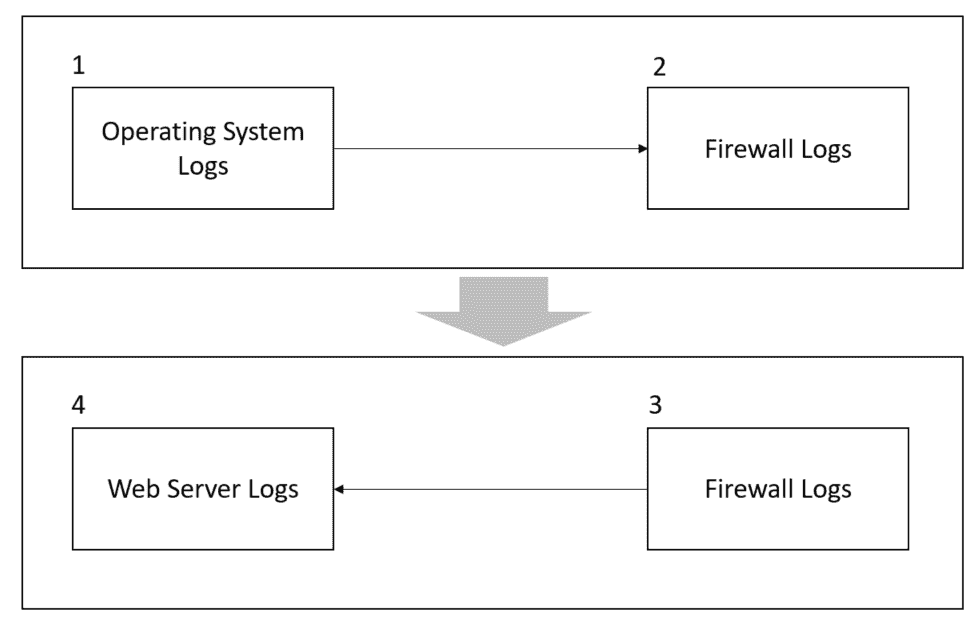
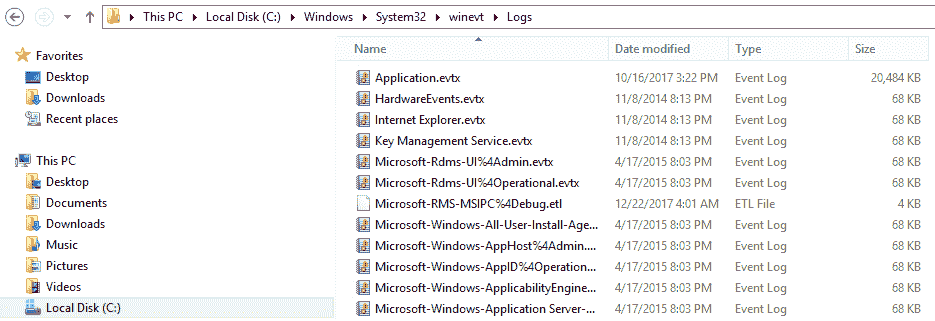

# 第十六章：日志分析

在第十三章《调查事件》中，您学习了调查过程以及在调查问题时寻找正确信息的一些技巧。然而，要调查一个安全问题，通常需要查看来自不同厂商和不同设备的多个日志。虽然每个厂商的日志中可能包含一些自定义字段，但现实是，一旦学会了如何读取日志，您就可以更容易地切换厂商，并只专注于该厂商的差异。虽然有许多工具可以自动化日志聚合，例如 SIEM 解决方案，但在某些情况下，您需要手动分析日志以找出根本原因。

在本章中，我们将涵盖以下主题：

+   数据关联

+   操作系统日志

+   防火墙日志

+   Web 服务器日志

# 数据关联

毋庸置疑，大多数组织将使用某种 SIEM 解决方案，将所有日志集中到一个位置，并使用自定义查询语言在日志中进行搜索。虽然这是当前的现实，但作为一名安全专业人员，您仍然需要知道如何浏览不同的事件、日志和文档，以进行更深入的调查。很多时候，从 SIEM 中获得的数据对于识别威胁、威胁行为者以及缩小受影响的系统范围非常有用，但在某些情况下，这还不够；您需要找到根本原因并根除威胁。

因此，每次进行数据分析时，考虑拼图各部分如何协同工作是非常重要的。

下图展示了这种数据关联方法在查看日志时的一个示例：



让我们看看这个流程图是如何工作的：

1.  调查员开始检查操作系统日志中的妥协迹象。在操作系统中发现了许多可疑活动，且在查看 Windows 预取文件后，可以得出结论：一个可疑的进程与外部实体建立了通信。现在是时候查看防火墙日志，以便验证有关此连接的更多信息。

1.  防火墙日志揭示，工作站与外部网站之间的连接是通过 TCP 在 `443` 端口建立的，并且是加密的。

1.  在此通信过程中，从外部网站到内部 Web 服务器发起了回调。现在是时候查看 Web 服务器日志文件了。

1.  调查员通过查看此 Web 服务器中的 IIS 日志，继续进行数据关联过程。他发现攻击者尝试对该 Web 服务器发起 SQL 注入攻击。

如您从这个流程图中看到的，访问哪些日志、您正在寻找什么信息，以及最重要的是，如何以一种有上下文的方式查看所有这些数据背后是有逻辑的。

# 操作系统日志

操作系统中可用的日志类型可能会有所不同；在本书中，我们将重点关注从安全角度来看相关的核心日志。我们将使用 Windows 和 Linux 操作系统来演示这一点。

# Windows 日志

在 Windows 操作系统中，最相关的安全日志可以通过事件查看器访问。在 第十三章《事件调查》中，我们讨论了在调查过程中应当查看的最常见事件。虽然这些事件可以很容易地在事件查看器中找到，但你也可以在 `Windows\System32\winevt\Logs` 目录下获取这些单独的文件，具体可以参考下面的截图：



然而，操作系统中的日志分析并不仅限于操作系统提供的日志信息，特别是在 Windows 中。你可以利用其他信息来源，包括预取文件（Windows Prefetch）。这些文件包含有关进程执行的相关信息。当你试图了解是否执行了恶意进程以及第一次执行时采取了哪些操作时，它们可能会非常有用。

在 Windows 10 中，你还可以查看 `OneDrive` 日志（`C:\Users\<USERNAME>\AppData\Local\Microsoft\OneDrive\logs`），这些日志可能非常有用。如果你在进行数据提取调查，这里可能是一个不错的地方，可以用来验证是否有任何不当行为发生。查看 `SyncDiagnostics.log` 获取更多信息。

要解析 Windows Prefetch 文件，可以使用这个 Python 脚本：[//github.com/PoorBillionaire/Windows-Prefetch-Parser](https://github.com/PoorBillionaire/Windows-Prefetch-Parser)。

另一个重要的文件位置是 Windows 存储用户模式崩溃转储文件的地方，即 `C:\Users\<username>\AppData\Local\CrashDumps`。这些崩溃转储文件是重要的证据，可以用来识别系统中的潜在恶意软件。

在转储文件中可能暴露的一种常见攻击类型是代码注入攻击。这种攻击发生在可执行模块被插入到正在运行的进程或线程中时。这种技术大多数情况下被恶意软件用来访问数据，隐藏自己或防止被删除（例如持久性）。需要强调的是，合法的软件开发人员有时也会出于非恶意的原因使用代码注入技术，比如修改现有的应用程序。

要打开这些转储文件，你需要一个调试器，比如 *WinDbg*（[`www.windbg.org`](http://www.windbg.org)），并且需要具备正确的技能，才能在转储文件中导航，找出崩溃的根本原因。如果你没有这些技能，也可以使用 *Instant Online Crash Analysis*（[`www.osronline.com`](http://www.osronline.com)）。

以下结果是使用此在线工具进行自动化分析的简要总结（需要跟进的主要领域已加粗）：

```
TRIAGER: Could not open triage file : e:dump_analysisprogramtriageguids.ini, error 2 
TRIAGER: Could not open triage file : e:dump_analysisprogramtriagemodclass.ini, error 2 
GetUrlPageData2 (WinHttp) failed: 12029\. 
*** The OS name list needs to be updated! Unknown Windows version: 10.0 *** 

FAULTING_IP:  
eModel!wil::details::ReportFailure+120 
00007ffe`be134810 cd29            int     29h 

EXCEPTION_RECORD:  ffffffffffffffff -- (.exr 0xffffffffffffffff) 
ExceptionAddress: 00007ffebe134810 (eModel!wil::details::ReportFailure+0x0000000000000120) 
ExceptionCode: c0000409 (Stack buffer overflow)
ExceptionFlags: 00000001 
NumberParameters: 1 
Parameter[0]: 0000000000000007 

PROCESS_NAME: MicrosoftEdge.exe
```

`EXCEPTION_CODE: (NTSTATUS) 0xc0000409`：

系统检测到该应用程序中发生了基于栈的缓冲区溢出。这种溢出可能允许恶意用户控制该应用程序。

```
EXCEPTION_PARAMETER1:  0000000000000007 

NTGLOBALFLAG:  0 

APPLICATION_VERIFIER_FLAGS:  0 

FAULTING_THREAD:  0000000000003208 

BUGCHECK_STR:  APPLICATION_FAULT_STACK_BUFFER_OVERRUN_MISSING_GSFRAME_SEHOP 
 PRIMARY_PROBLEM_CLASS: STACK_BUFFER_OVERRUN_SEHOP DEFAULT_BUCKET_ID:  STACK_BUFFER_OVERRUN_SEHOP 

LAST_CONTROL_TRANSFER:  from 00007ffebe1349b0 to 00007ffebe134810 

STACK_TEXT:   
000000d4`dc4fa910 00007ffe`be1349b0 : ffffffff`ffffffec 00007ffe`df5e0814 000000d4`dc4fc158 000002bb`a1d20820 : eModel!wil::details::ReportFailure+0x120 
000000d4`dc4fbe50 00007ffe`be0fa485 : 00000000`00000000 00007ffe`df5ee52e 000002bb`ac0f5101 00007ffe`be197771 : eModel!wil::details::ReportFailure_Hr+0x44 
000000d4`dc4fbeb0 00007ffe`be0fd837 : 000002bb`ab816b01 00000000`00000000 00000000`00010bd8 000002bb`00000000 : eModel!wil::details::in1diag3::FailFast_Hr+0x29 
000000d4`dc4fbf00 00007ffe`be12d7dd : 00000000`00010bd8 00000000`00000000 00000000`80070001 000000d4`dc4ffa60 : eModel!FailFastOnReparenting+0xf3 
000000d4`dc4ffc00 00007ffe`be19e5b8 : 000002bb`ab816b20 00000000`00000000 00000000`00000000 000002bb`a16b7bb8 : eModel!SetParentInBrokerInternal+0x40b5d 
000000d4`dc4ffc40 00007ffe`be19965c : 00000000`00000000 000002bb`ac0f51f0 000002bb`ac0f51f4 000002bb`ac0f50c0 : eModel!CTabWindowManager::_AttemptFrameFastShutdown+0x118 
000000d4`dc4ffc90 00007ffe`be19634e : 000002bb`c0061b00 000000d4`dc4ffd00 00007ffe`be0a9e00 00000000`00000001 : eModel!CTabWindowManager::CloseAllTabs+0x6c 
000000d4`dc4ffcd0 00007ffe`be114a0b : 00000000`00000000 00007ffe`be0a9ed0 000002bb`c0061b00 000002bb`c0061b00 : eModel!CBrowserFrame::_OnClose+0x106 
000000d4`dc4ffd50 00007ffe`be07676e : 00000000`00000000 00000000`00000000 00000000`00000000 000002bb`c00711f0 : eModel!CBrowserFrame::FrameMessagePump+0x6e63b 
000000d4`dc4ffe30 00007ffe`be076606 : 000002bb`00032401 000002bb`c0061b00 000000d4`dc4fff50 000002bb`c00711f0 : eModel!_BrowserThreadProc+0xda 
000000d4`dc4ffeb0 00007ffe`be0764a9 : 00000000`00000001 000002bb`c0071218 000000d4`dc4fff50 00000000`00000000 : eModel!_BrowserNewThreadProc+0x56 
000000d4`dc4ffef0 00007ffe`dea68364 : 000002bb`aae03cd0 00000000`00000000 00000000`00000000 00000000`00000000 : eModel!SHOpenFolderWindow+0xb9 
000000d4`dc4fff60 00007ffe`e13470d1 : 00000000`00000000 00000000`00000000 00000000`00000000 00000000`00000000 : kernel32!BaseThreadInitThunk+0x14 
000000d4`dc4fff90 00000000`00000000 : 00000000`00000000 00000000`00000000 00000000`00000000 00000000`00000000 : ntdll!RtlUserThreadStart+0x21 
```

在由即时在线崩溃分析完成的崩溃分析中，我们发现 Microsoft Edge 中发生了基于栈的缓冲区溢出。现在，您可以将此日志（发生崩溃的日期）与事件查看器中的其他信息（安全和应用程序日志）进行关联，以验证是否有可疑进程正在运行，可能已经获得对该应用程序的访问权限。记住，最终，您需要进行数据关联，才能获得关于特定事件及其罪魁祸首的更有力的信息。

# Linux 日志

在 Linux 中，有许多日志可以用来查找与安全相关的信息。主要日志之一是位于`/var/log`下的`auth.log`，它包含所有与认证相关的事件。

这是该日志的一个示例：

```
Nov  5 11:17:01 kronos CRON[3359]: pam_unix(cron:session): session opened for user root by (uid=0) 
Nov  5 11:17:01 kronos CRON[3359]: pam_unix(cron:session): session closed for user root 
Nov  5 11:18:55 kronos gdm-password]: pam_unix(gdm-password:auth): conversation failed 
Nov  5 11:18:55 kronos gdm-password]: pam_unix(gdm-password:auth): auth could not identify password for [root] 
Nov  5 11:19:03 kronos gdm-password]: gkr-pam: unlocked login keyring 
Nov  5 11:39:01 kronos CRON[3449]: pam_unix(cron:session): session opened for user root by (uid=0) 
Nov  5 11:39:01 kronos CRON[3449]: pam_unix(cron:session): session closed for user root 
Nov  5 11:39:44 kronos gdm-password]: pam_unix(gdm-password:auth): conversation failed 
Nov  5 11:39:44 kronos gdm-password]: pam_unix(gdm-password:auth): auth could not identify password for [root] 
Nov  5 11:39:55 kronos gdm-password]: gkr-pam: unlocked login keyring 
Nov  5 11:44:32 kronos sudo:     root : TTY=pts/0 ; PWD=/root ; USER=root ; COMMAND=/usr/bin/apt-get install smbfs 
Nov  5 11:44:32 kronos sudo: pam_unix(sudo:session): session opened for user root by root(uid=0) 
Nov  5 11:44:32 kronos sudo: pam_unix(sudo:session): session closed for user root 
Nov  5 11:44:45 kronos sudo:     root : TTY=pts/0 ; PWD=/root ; USER=root ; COMMAND=/usr/bin/apt-get install cifs-utils 
Nov  5 11:46:03 kronos sudo:     root : TTY=pts/0 ; PWD=/root ; USER=root ; COMMAND=/bin/mount -t cifs //192.168.1.46/volume_1/temp 
Nov  5 11:46:03 kronos sudo: pam_unix(sudo:session): session opened for user root by root(uid=0) 
Nov  5 11:46:03 kronos sudo: pam_unix(sudo:session): session closed for user root 
```

上述日志来自 Kali 发行版；RedHat 和 CentOS 会在`/var/log/secure`下存储类似的信息。如果您只想查看失败的登录尝试，请使用`var/log/faillog`中的日志。

# 防火墙日志

防火墙日志格式因供应商而异；然而，无论平台如何，都会有一些核心字段。在查看防火墙日志时，您必须重点回答以下问题：

+   谁发起了这次通信（源 IP）？

+   那次通信的目标在哪里（目标 IP）？

+   哪种类型的应用程序试图访问目标（传输协议和端口）？

+   防火墙是否允许或拒绝了该连接？

以下代码是`Check Point`防火墙日志的一个示例；在此案例中，我们为保护隐私隐藏了目标 IP：

```
"Date","Time","Action","FW.Name","Direction","Source","Destination","Bytes","Rules","Protocol" 
"datetime=26Nov2017","21:27:02","action=drop","fw_name=Governo","dir=inbound","src=10.10.10.235","dst=XXX.XXX.XXX.XXX","bytes=48","rule=9","proto=tcp/http" 
"datetime=26Nov2017","21:27:02","action=drop","fw_name=Governo","dir=inbound","src=10.10.10.200","dst=XXX.XXX.XXX.XXX","bytes=48","rule=9","proto=tcp/http" 
"datetime=26Nov2017","21:27:02","action=drop","fw_name=Governo","dir=inbound","src=10.10.10.2","dst=XXX.XXX.XXX.XXX","bytes=48","rule=9","proto=tcp/http" 
"datetime=26Nov2017","21:27:02","action=drop","fw_name=Governo","dir=inbound","src=10.10.10.8","dst=XXX.XXX.XXX.XXX","bytes=48","rule=9","proto=tcp/http" 
```

在此示例中，规则编号 9 处理了所有这些请求，并拒绝了来自`10.10.10.8`的所有连接尝试。现在，利用相同的阅读技巧，让我们来查看一个`NetScreen`防火墙日志：

```
Nov  2 13:55:46 fire01 fire00: NetScreen device_id=fire01  [Root]system-notification-00257(traffic): start_time="2016-00-02 13:55:45" duration=0 policy_id=119 service=udp/port:7001 proto=17 src zone=Trust dst zone=Untrust action=Deny sent=0 rcvd=0 src=192.168.2.10 dst=8.8.8.8 src_port=3036 dst_port=7001 
```

Check Point 与 NetScreen 防火墙日志之间的一个重要区别是它们记录传输协议信息的方式。在 Check Point 日志中，您会看到`proto`字段包含传输协议和应用程序（在上述案例中是 HTTP）。NetScreen 日志则在`service`和`proto`字段中显示类似的信息。如您所见，虽然有一些小的差异，但实际上，一旦您掌握了某个供应商的防火墙日志的阅读技巧，其他供应商的日志也会更容易理解。

您还可以通过利用`iptables`将 Linux 机器作为防火墙。以下是`iptables.log`的示例：

```
# cat /var/log/iptables.log 
Nov  6 10:22:36 cnd kernel: PING YuriDio IN=eth3 OUT= MAC=d8:9d:67:cd:b2:14 SRC=192.168.1.10 DST=192.168.1.88 LEN=84 TOS=0x00 PREC=0x00 TTL=64 ID=0 DF PROTO=ICMP TYPE=8 CODE=0 ID=1007 SEQ=2 
```

如果您需要查看 Windows 防火墙日志，请在`C:\Windows\System32\LogFiles\Firewall`中查找`pfirewall.log`日志文件。该日志具有以下格式：

```
#Version: 1.5 
#Software: Microsoft Windows Firewall 
#Time Format: Local 
#Fields: date time action protocol src-ip dst-ip src-port dst-port size tcpflags tcpsyn tcpack tcpwin icmptype icmpcode info path 

2017-12-22 07:38:54 ALLOW TCP 169.254.211.124 169.254.211.124 63863 4369 0 - 0 0 0 - - - SEND 
2017-12-22 07:38:54 ALLOW TCP 169.254.211.124 169.254.211.124 63863 4369 0 - 0 0 0 - - - RECEIVE 
2017-12-22 07:38:55 ALLOW UDP 169.254.125.142 169.254.255.255 138 138 0 - - - - - - - SEND 
2017-12-22 07:38:55 ALLOW UDP 169.254.211.124 169.254.255.255 138 138 0 - - - - - - - SEND 
2017-12-22 07:38:55 ALLOW UDP 192.168.1.47 192.168.1.255 138 138 0 - - - - - - - SEND 
```

# Web 服务器日志

在查看 Web 服务器日志时，特别注意与 SQL 数据库交互的 Web 应用程序所在的 Web 服务器。IIS Web 服务器的日志文件位于`\WINDOWS\system32\LogFiles\W3SVC1`，它们是 `.log` 文件，可以使用记事本打开。你也可以使用 Excel 或 Microsoft Log Parser 打开该文件并执行基本查询。

你可以从[`www.microsoft.com/en-us/download/details.aspx?id=24659`](https://www.microsoft.com/en-us/download/details.aspx?id=24659)下载 Log Parser。

在查看 IIS 日志时，特别注意`cs-uri-query`和`sc-statu*s*`字段。这些字段将显示执行的 HTTP 请求的详细信息。如果你使用 Log Parser，可以针对日志文件执行查询，以快速识别系统是否遭遇 SQL 注入攻击。以下是一个示例：

```
logparser.exe -i:iisw3c -o:Datagrid -rtp:100 "select date, time, c-ip, cs-uri-stem, cs-uri-query, time-taken, sc-status from C:wwwlogsW3SVCXXXexTEST*.log where cs-uri-query like '%CAST%'".  
```

这里是一个潜在的输出示例，其中包含位于 `cs-uri-query` 字段中的关键字 CAST：

```
80 POST  /pages/Users/index.asp  ID=UT-47-TP-M17';DECLARE%20@S%20NVARCHAR(4000);SET%30@S=CAST(0x4400);EXEC(@S);--|31|80040e32|Timeout_expired     500 
```

注意，在这种情况下，错误代码为 `500`（内部服务器错误）；换句话说，服务器无法完成请求。当你在 IIS 日志中看到这种活动时，应采取措施加强对该 Web 服务器的保护；一种替代方法是添加 WAF。

如果你查看的是 Apache 日志文件，访问日志文件位于`/var/log/apache2/access.log`，其格式也非常简洁易读，如下所示：

```
192.168.1.10 - - [07/Dec/2017:15:35:19 -0800] "GET /public/accounting HTTP/1.1" 200 6379 
192.168.1.10 - - [07/Dec/2017:15:36:22 -0800] "GET /docs/bin/main.php 200 46373 
192.168.1.10 - - [07/Dec/2017:15:37:27 -0800] "GET /docs HTTP/1.1" 200 4140 
```

如果你在寻找某条记录，还可以使用 Linux 中的`cat`命令，如下所示：

```
#cat /var/log/apache2/access.log | grep -E "CAST"  
```

另一种选择是使用 apache-scalp 工具，你可以从[`code.google.com/archive/p/apache-scalp`](https://code.google.com/archive/p/apache-scalp)下载该工具。

# 参考资料

1.  iptables: [`help.ubuntu.com/community/IptablesHowTo`](https://help.ubuntu.com/community/IptablesHowTo)

1.  Log Parser: [`logrhythm.com/blog/a-technical-analysis-of-wannacry-ransomware/`](https://logrhythm.com/blog/a-technical-analysis-of-wannacry-ransomware/)

1.  SQL 注入查找器：[`wsus.codeplex.com/releases/view/13436`](http://wsus.codeplex.com/releases/view/13436)

1.  SQL 注入备忘单：[`www.netsparker.com/blog/web-security/sql-injection-cheat-sheet/`](https://www.netsparker.com/blog/web-security/sql-injection-cheat-sheet/)

# 总结

在本章中，你了解了在不同位置查看日志时，数据关联的重要性。你还阅读了与 Windows 和 Linux 中相关的安全日志。

接下来，你学习了如何使用 Check Point、NetScreen、iptables 和 Windows 防火墙作为示例来查看防火墙日志。

在本章的结尾，你了解了 Web 服务器日志，使用 IIS 和 Apache 作为示例。

当你读完本章，甚至是整本书时，到了回顾并反思这段网络安全旅程的时候了。非常重要的一点是，将你在这里学到的理论，结合本书中使用的实际案例，应用到你的工作环境或客户的环境中。尽管在网络安全领域并没有“一刀切”的解决方案，但这里学到的教训可以作为你未来工作的基础。威胁环境不断变化，在我们完成本书写作时，已经发现了一个新的漏洞。可能当你读完本书时，又会发现另一个漏洞。正因为如此，知识的基础如此重要，它将帮助你快速吸收新的挑战，并运用安全原则来应对威胁。保持安全！
