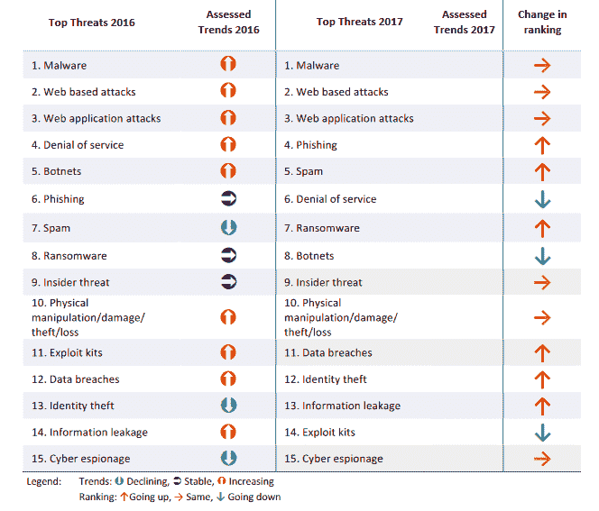
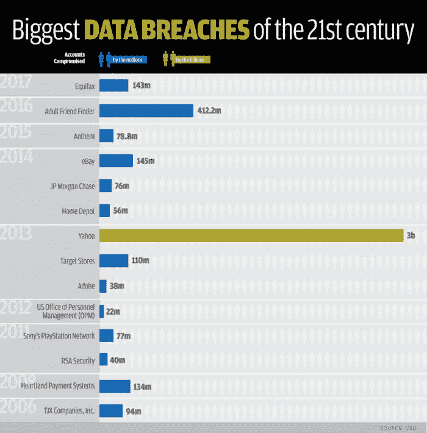
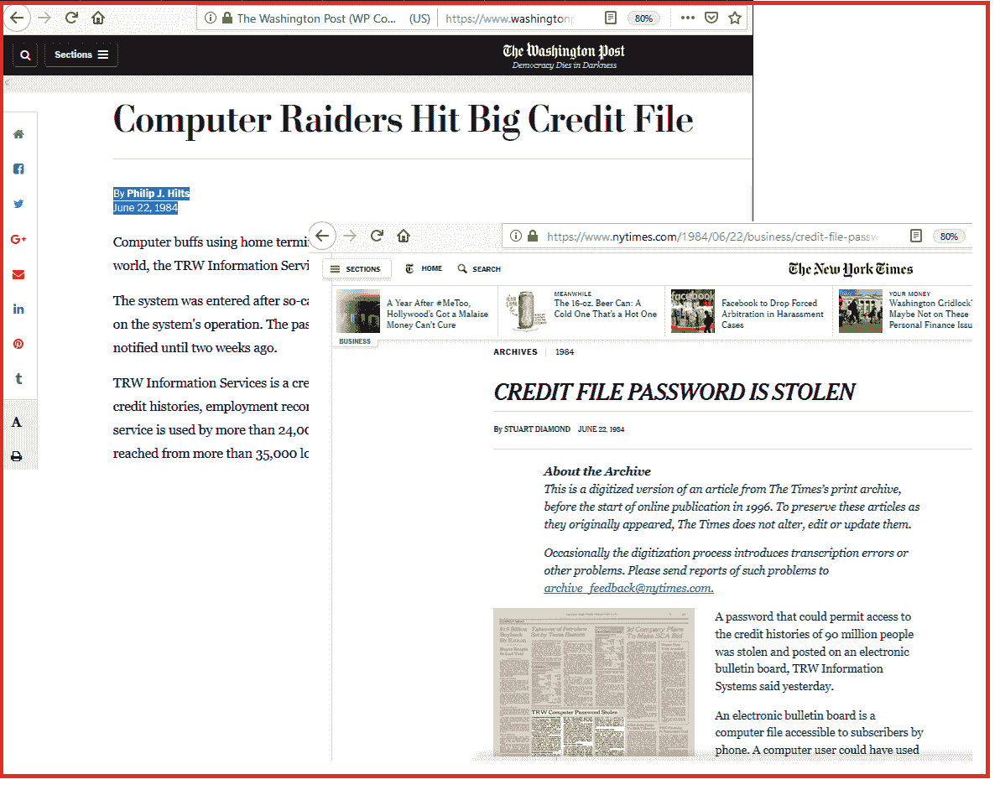

# 第一章：网络安全的重要性

在这个快节奏的行业中，数字化和保持连接扮演着至关重要的角色。这一趋势与基于云的技术和移动技术的迅猛发展相辅相成。<q>“为什么关注安全？”</q>这一问题已经从仅仅是安全团队的讨论，转变为董事会会议的议题，且不仅仅止于此。这已经成为今天行业中的热门话题。我们周围的每个人，无论是在工作场所还是其他地方，都在以某种方式谈论安全问题。安全不再仅仅是 IT 管理员或 IT 组织中安全管理员的需求，而是所有与任何类型数据有某种联系的实体的需求。

网络安全的重要性，顾名思义，将是本章讨论的核心，我们将重点关注以下内容：

+   泄露历史

+   保护网络和应用程序的重要性

+   威胁环境

+   安全如何帮助

# 数据泄露的历史

关于黑客攻击的普遍看法是，它始于几十年前。然而，实际上，黑客行为早在那之前就已经存在，追溯到 1834 年，几乎有两个世纪的历史。从历史上看，黑客行为在 1836 年曝光，当时两名参与此行为的人被抓获。在 1700 年代末期，法国实施了其国家数据网络，用于在巴黎和波尔多之间传输数据，当时这是独一无二的。该网络基于机械电报系统，构建了一个由物理塔楼组成的网络，每个塔楼顶部配备了一套独特的可动臂系统。

塔楼操作员会使用这些臂的不同组合形成可以通过望远镜从远处塔楼读取的数字和字符。数字和字符的组合会从塔楼传递到塔楼，直到传达到远端。因此，政府实现了一种更高效的数据传输机制，从而节省了大量时间。有趣的是，所有这些都发生在公开的场合。尽管这些组合经过加密，并且需要经验丰富的电报操作员才能解码最终传递的消息，但风险始终潜伏在周围。以下图片展示的就是其中一座塔楼：

图 1：克劳德·夏佩（Claude Chappe）光学电报的复制品，位于德国纳尔巴赫附近的利特蒙特（Litermont）（照片由 Lokilech CC BY-SA 3.0 提供）

这一操作被两位银行家观察到，分别是弗朗索瓦·布朗和约瑟夫·布朗。他们曾在波尔多的交易所进行政府债券交易，正是他们想出了一种黑客手段，通过贿赂几名电报操作员来污染数据传输，在其中加入当前市场状况的指示。通常，债券表现相关的信息需要几天才能通过正常邮件到达波尔多，但由于这次黑客攻击，他们能够提前收到同样的信息，而比波尔多交易所接收到的时间要早得多。在正常的传输过程中，操作员会加入一个*回退*符号，表示需要避免上一个字符并将其视为错误。银行家们支付给其中一名操作员，让他故意加入一个预定字符，表示前一天的交易表现，以便他们能够根据市场的变动做出买卖债券的决策。这个额外的字符并没有影响政府发送的原始信息，因为它本应被远端电报操作员忽略。但这个额外的字符会被另一位曾是电报操作员的人注意到，这位操作员由银行家支付，通过望远镜观察并解码它。此外，布朗兄弟并不关心整个消息，他们所需要的只是与市场变动相关的信息，而这正是通过这段额外的无效信息获得的。布朗兄弟凭借市场变动的优势，继续实施这一行为长达两年，直到 1836 年他们的黑客行为被发现并被捕。你可以在[`www.thevintagenews.com/2018/08/26/cyberattacks-in-the-1830s/`](https://www.thevintagenews.com/2018/08/26/cyberattacks-in-the-1830s/)了解更多此类攻击的信息。

这种攻击的现代等价物可能是数据污染、中间人攻击、网络滥用、攻击或社交工程。然而，最显著的相似之处在于，这些攻击常常在被发现之前，长时间甚至数年内无人察觉。这在当时是如此，今天依然如此。不幸的是，布朗兄弟未能被定罪，因为当时并没有相关法律可以起诉他们。

也许与今天的网络攻击相比，布朗兄弟的黑客行为并不那么创新，但它确实表明了数据始终处于风险之中。而随着数据在各种形式、操作和传输机制（网络）中的数字化，攻击面现在已经非常庞大。现在，保护数据、网络和计算机基础设施的安全，已经成为组织和个人的责任。

让我们再快进 150 年，来到 20 世纪 80 年代末。这时，世界见证了第一个计算机病毒——**Morris 蠕虫**。尽管蠕虫的创始人 Robert Tappan Morris 否认它是有意造成计算机伤害的，但它确实影响了数百万台计算机。Tappan 编写了一个自我复制的实验性程序，旨在衡量网络世界的广度，该程序会自动从一台计算机跳到另一台计算机。

这个病毒是由 Morris 注入互联网的，但令他惊讶的是，这个所谓的蠕虫传播的速度远超他预期。很快，在接下来的 24 小时内，至少有 10%的联网机器受到影响。此后，病毒被目标指向了 ARPANET，一些报告表明，当时联网的计算机大约有 60,000 台。这个蠕虫利用了 Unix 邮件程序`sendmail`中的一个漏洞，`sendmail`通常等待其他系统连接邮件程序并发送邮件，还利用了`fingerd`守护进程中的一个漏洞。该蠕虫感染了许多站点，包括大学、军方和其他研究设施。来自多所美国大学的程序员团队不间断地工作了数小时才找到修复办法。又过了几天，才恢复到正常状态。几年后，在 1990 年，Morris 因违反*计算机欺诈与滥用法案*被法院定罪；与 Blanc 兄弟事件时没有法律可供起诉不同，这次有了相关法律。

快进到 2010 年，再过二十年，世界见证了一个曾经无法想象的事件：一个高度协调的努力，旨在创造一款专门为攻击伊朗核设施而设计的软件，**Yes Software**。它是专门为**工业控制系统**（**ICS**）设计的，目标是西门子生产的某种特定品牌和型号的 ICS，这种设备用于核设施中控制离心机的速度。据信该软件是为了现场交付而设计的，因为目标伊朗设施是隔离的（air-gapped）。这是一起前所未有的工业网络间谍行为。恶意软件被特别设计为不会离开核电站设施。然而，不知怎么的，它还是通过某种方式进入了互联网，至今仍然有人对其传播方式存在猜测。研究人员在发现该恶意软件后花了数月时间才弄清楚其工作原理。据推测，它至少需要几年时间才能开发成一个完全可用的工作模型。继 Stuxnet 之后，我们见证了许多类似的攻击模式，如 Duqu 和 Flame，一些领域专家认为，这些类似的恶意软件至今仍然活跃。

目前，我们看到有极为新型的攻击变种，它们有着新的作案手法。这些攻击方式通过使用勒索软件来赚取资金，或是窃取数据然后试图出售或销毁数据。或者，他们利用受害者的基础设施运行加密货币矿工恶意软件来挖掘加密货币。今天，安全问题已经成为焦点，这不仅仅是因为每个实体的攻击面都在增加，或者成功的高调大规模攻击已成为常态，更因为我们每个人都意识到无论你是否是目标，保护数据的重要性是至关重要的。

# 安全场景

为了让它更加直观和简单，我们将在接下来的章节中讨论一些场景，来阐述安全性需求：

+   **场景（一般组织）**：试着想象一个拥有标准数字化和 IT 功能的组织，以满足其业务需求。作为一个组织，确保你所使用的数字化和 IT 基础设施始终运行并保持在线是非常重要的。同时，组织有责任保障你所涉及的身份、数据、网络、设备和产品的安全。数字化如今已经成为所有企业和组织的常态。数字化带来了连接性以及各种不同技术的混合，这些技术共同工作以实现组织设定的业务目标。随着数字化程度的提高，连接性的水平也在增加，无论是在组织的边界内还是边界外。这种连接性同样对组织的安全性构成了风险（我们将在后续章节进一步讨论这一点）。

数字化和连接性大致可分为三个宏观方面，即：身份（我们通过它允许用户进行互动）、数据（个人、业务、个人或系统数据）和网络（连接部分）。此外，我们还不能忘记将这些要素整合在一起的因素，即：设备、解决方案以及各种业务流程和应用程序。今天，任何组织都需要通过身份来控制查看、修改或处理数据，或访问业务应用程序/系统所需的访问级别。组织必须保护这些身份，这已成为事实上的要求。你还需要采取适当的措施来保护你所处理的数据，无论是静态数据、传输中的数据，还是计算中的数据。而且，网络边界，无论是物理的还是云端的，都必须通过适当的措施和控制来确保安全。这个场景是为了设定上下文；我们将在接下来的章节中进一步讨论这些方面。

+   **场景（万物皆向云端迁移）**：随着大多数组织快速向云迁移，对更高处理能力和更低运营成本的需求不断增加。云作为一种技术，在需要时为企业提供了更多的可扩展性。而且，随着每个企业的全球影响力不断扩大，协作需求变得更为重要，而云使得这一点成为可能。如今，员工更倾向于远程工作，从而消除了对办公基础设施的需求。云计算的另一个重要好处是，它减轻了 IT 部门的负担，不必时刻跟踪软件和硬件组件的新更新和升级。

但是，尽管技术进步确实带来了更多的控制、速度、能力、准确性、弹性和可用性，它们也带来了安全隐患和风险。云计算在安全问题上也不例外，如果没有正确实施或使用，可能会暴露出风险。云的最大优势是，组织能够享受到不拥有任何基础设施或运营的好处。然而，这个优势也带来了安全风险和隐患，例如谁能访问存储在云中的数据，如何维持和管理安全监管要求，以及如何遵守 GDPR 等合规性规定？云计算还使得每个组织的**灾难恢复**（**DR**）场景变得更加复杂，因为它取决于服务提供商的条款和条件以及他们围绕数据恢复的商业模式。此外，组织无法控制云服务提供商会在哪里建立数据中心并运营，这引发了数据主权的问题。云端运营面临许多其他挑战和风险，这些将在本书的相关章节中讨论。

# 理解攻击面

我相信，到现在为止，你已经在某种程度上掌握了安全性及其重要性。那么，让我们来看看什么是**攻击面**，以及我们如何定义它，因为理解攻击面对于我们制定安全计划至关重要。简单来说，攻击面是所有潜在漏洞的集合，这些漏洞如果被利用，可能会允许未经授权的访问系统、数据或网络。这些漏洞通常也被称为**攻击向量**，它们可以跨越软件、硬件、网络以及用户（即人为因素）。被攻击或遭到破坏的风险与攻击面暴露的程度成正比。攻击向量的数量越多，攻击面越大，受到攻击的风险也越高。因此，为了降低攻击风险，必须通过减少攻击向量的数量来减少攻击面。

我们时常看到攻击针对应用程序、网络基础设施，甚至个人。为了让你了解攻击面和暴露的程度，首先来看一下**常见漏洞和暴露**（**CVE**）数据库（[`cve.mitre.org/cve/`](https://cve.mitre.org/cve/)）。该数据库包含 108,915 条 CVE 条目（截至写本章时），这些条目都是过去几十年中已识别的漏洞。虽然其中很多漏洞现在已被修复，但也有一些可能仍然存在。这个庞大的数字表明了暴露风险有多大。

任何在系统中运行的软件都可能通过软件漏洞被远程或本地利用。这一点尤其适用于面向 Web 的软件，因为它暴露在外，攻击面更大。通常，这些易受攻击的应用程序和软件可能导致整个网络的安全性受到威胁，并对其管理的数据构成风险。除此之外，还有一个风险是这些应用程序或软件始终面临的：内部威胁，任何经过认证的用户都可以访问由于访问控制实施不当而未被保护的数据。

另一方面，暴露网络攻击的攻击面可以是被动的也可以是主动的。这些攻击面可能导致网络服务崩溃、暂时无法使用、允许未经授权的数据访问等问题。

在被动攻击的情况下，网络可以被攻击者监控，以捕获密码或获取敏感信息。在被动攻击中，攻击者可以利用网络流量截取敏感系统之间的通信并窃取信息，且用户往往毫无察觉。与此相对，在主动攻击中，攻击者会尝试通过使用恶意软件或其他形式的网络漏洞绕过防护系统，入侵网络资产；主动攻击可能导致数据和敏感文件暴露，甚至可能导致拒绝服务攻击。常见的攻击向量类型包括：

+   社会工程学、诈骗等

+   自动下载

+   恶意网址和脚本

+   基于浏览器的攻击

+   供应链攻击（这一威胁日益增加）

+   基于网络的攻击向量

# 威胁格局

攻击面还引入了另一个术语——**威胁景观**。我们在网络安全社区中每天都会讨论这个话题。威胁景观可以定义为已观察到的威胁集合、威胁源的信息以及当前的威胁趋势。每一位安全专业人士都应当时刻关注威胁景观。通常，许多不同的机构和安全厂商会发布此类威胁景观报告，例如**ENISA**（**欧洲网络与信息安全局**）和**NIST**（**美国国家标准与技术研究院**），以及一些大型安全公司。

此外，威胁景观是一个极其动态的领域，它变化非常频繁，受多种因素驱动，比如利用漏洞的工具的可用性、可利用资源和漏洞的知识库，以及发起攻击所需的技能要求。（由于互联网上自由可用的工具，这变得越来越容易。）在本书的后续章节中，我们将进一步讨论威胁景观资源。以下是 2016-2017 年间不同威胁及其相对排名的列表：

图 2：ENISA 2017 年威胁景观报告

上述图片展示的是基于 ENISA 报告的 2017 年威胁景观。这引出了一个重要的话题，我们需要了解一些常见的攻击类型：

+   **非结构化攻击**：这类攻击的特点是攻击者对他们发起攻击的环境没有任何事先的了解。通常，在这种情况下，他们依赖所有可以自由使用的工具。非结构化攻击通常是大规模的，基于任何常见漏洞和现有的利用方式进行的。

+   **结构化攻击**：与非结构化攻击不同，在结构化攻击中，攻击者的准备更加充分，计划也更为周密。在大多数结构化攻击的案例中，我们注意到攻击者展示了他们在编程方面的高超技能，以及对他们攻击的 IT 系统和应用程序的深入了解。这些攻击通常非常有组织，且大多是针对单个实体或行业垂直领域的。

+   **社交工程（钓鱼攻击、矛鱼攻击等）**：这种攻击针对的是人类这一最脆弱的环节。在这种攻击中，用户通过各种方式被利用。这些攻击往往因为缺乏知识或无知而成功。攻击者通过各种手段欺骗用户，从用户那里提取信息。最常见的方式是钓鱼攻击和矛鱼攻击。在钓鱼和矛鱼攻击中，攻击者通过冒充看似真实的身份来提取数据，比如冒充管理员帮助用户重置密码和其他账户详情，通过网络门户进行。这些门户专门设计以达到提取数据的目的，攻击者希望收集这些数据。用户容易成为这些攻击的受害者，进而泄露敏感信息。

+   **窃听**：这种攻击通过未经授权的访问网络并监听网络通信来进行。通常，所有未加密的流量都容易成为攻击者的目标。

+   **拒绝服务攻击（DoS 和 DDoS）**：这是一种最古老的基于网络的攻击形式，攻击者通过发送大量的数据流，试图超载应用程序或设备的处理或计算能力，使其无法处理，从而干扰系统的正常运行。另一方面，**分布式拒绝服务攻击**（**DDoS**）是通过多个来源对单一受害者应用程序或系统发动的大规模攻击，数据量超过系统可以处理的范围。这种攻击如果没有适当的技术手段，是最难以缓解的。

+   **中间人攻击**（**MITM**）：在这种攻击形式中，攻击者通过操控服务器和客户端之间的通信，劫持会话或网络，充当代理服务器，通常在受害者不知情的情况下进行。

+   **恶意软件**：恶意软件可以定义为破坏性软件，旨在通过其创建者的恶意意图对系统造成损害或实现其他目的。大多数情况下，攻击者通过利用计算机系统的安全漏洞或任何弱点，借助恶意软件来获得访问权限。蠕虫和木马是恶意软件的不同形式，它们具有从一台计算机传播到另一台计算机并自我复制的能力。恶意软件可以造成数据盗窃、大规模破坏计算机系统、干扰网络活动，还可以协助企业间谍活动。最新的恶意软件通常具有独特的隐藏能力，能够极其巧妙地避开安全系统和检测机制，并保持活跃状态数周到数年。

+   **僵尸网络**：当计算机系统感染恶意软件或其他恶意远程工具，并且这些被感染的计算机系统被攻击者远程控制时，这些计算机就被称为僵尸。进一步地，当有许多计算机被这种恶意软件感染并被攻击者控制时，这个由受感染计算机组成的网络或集合就被称为**僵尸网络**。这种远程机制和控制方法通常被称为*"命令与控制"*。僵尸网络可以被对手用于各种不同的目的，为了实现这些目的，僵尸网络的主控者会不断更新恶意程序的二进制文件。僵尸网络过去通常只专注于单一任务。然而，近年来，它们已经变成了多用途的恶意应用程序。

+   **跨站脚本攻击**：跨站脚本攻击，通常被称为**XSS**攻击，是一种利用网页应用程序漏洞的攻击方式，它允许攻击者注入恶意的客户端脚本，并在大多数情况下在用户不知情的情况下危害用户。通常，这些漏洞是由于网页应用程序对输入验证不严格所致。一旦 XSS 脚本被发送给用户，浏览器就会处理它，因为浏览器没有机制来防止 XSS 类型的攻击。XSS 攻击有多种形式。**存储型**和**反射型**XSS 攻击非常常见。存储型 XSS 攻击允许攻击者在受害者的服务器上留下永久性的恶意脚本，而反射型 XSS 攻击通常发生在攻击者向用户发送包含恶意查询的特制链接时，用户点击该链接后，会被引导到一个恶意网站，从而捕获用户的敏感数据，并将其发送给攻击者。反射型 XSS 攻击仅在用户点击链接时才会发生。另一种方式是攻击者诱使用户点击该链接。

+   **驱动下载攻击**：这种攻击形式在互联网中非常常见，并且在过去几年里一直是主要威胁之一。实际上，攻击者会入侵一个知名的无害网站，并通过嵌入恶意链接来托管他们的恶意软件。一旦用户访问这些毫不知情的网站，就会通过自动重定向到恶意软件下载位置而被感染。通常，受感染网站的链接会通过垃圾邮件或钓鱼邮件传播，用户可能出于好奇或不知情点击链接，从而将恶意软件下载到系统中。

+   **SQL 注入攻击**：SQL 注入攻击通常是针对通过网络暴露的数据库。攻击者会通过配置不当的 Web 应用程序执行恶意查询，通常是在数据输入机制中运行 SQL 命令。如果攻击成功，攻击者可以访问数据库、操控敏感数据，或者有时修改数据。SQL 注入还可以允许任意命令远程管理操作系统。这个漏洞之所以成功，主要是因为 Web 应用程序的输入清理不到位，而不是数据库端的原因，因为数据库是按照收到的查询执行并返回结果的。因此，开发人员必须注意输入清理，只接受符合要求的数据输入，并在将其发送到数据库执行查询之前，检查是否有恶意输入。

+   **高级持续性威胁**（**APT**）：这种攻击已经存在多年，并且在不断增加。这些攻击的作案手法通常是针对特定的个人、组织、行业领域，甚至国家发起高度定向的攻击。这些威胁被称为*“高级持续性”*，因为攻击者或攻击团队将使用许多先进且隐蔽的技术，以便在很长一段时间内不被发现。通常，攻击和持续的方法是专门为特定攻击设计的，并且从未用于其他攻击。基于 APT 的攻击通常资金雄厚，且大多是由团队推动的活动。APT 攻击的目标通常是知识产权、任何形式的敏感信息、破坏性活动，甚至是企业间谍活动，或者是数据破坏和/或基础设施破坏。APT 攻击与其他形式的攻击完全不同；对手/对手们采取非常有组织的方式来了解他们的目标和他们想要达成的任务，并且他们不会急于发动攻击。攻击基础设施有时非常复杂。攻击者/攻击者的主要目标是尽可能长时间地待在被攻破的网络中，并避免被安全检测发现。APT 的一个显著特点是，它只能影响网络中的某些部分、公司中的某些人，或者网络中仅有几个是重点关注的系统。因此，这使得安全监控系统更难检测到 APT 活动。

+   **基于网络的攻击**：如其名所示，这些攻击的目标系统主要是那些面向互联网的设备、应用、服务等。实际上，我们可以说，大多数互联网应用都暴露在网络攻击之下。这些攻击不仅仅是通过应用程序中的漏洞和弱点进行的，还可能通过我们访问这些应用程序的媒介进行，比如网页浏览器。多年来，网页浏览器的漏洞利用呈上升趋势。网页服务器一直是对手的一个非常有利可图的目标。常见的攻击形式包括驱动下载或水坑攻击（其中，攻击者通过入侵一个目标/被攻击组织使用的合法网页应用程序，然后等待员工/用户访问该网站，从而使其受到感染）。

+   **内部攻击**：内部攻击是网络安全中的人类因素，极其脆弱且非常难以追踪、监控和缓解。这个威胁表明，拥有授权访问信息资产的用户会对实体/企业或组织造成伤害。这种攻击有时是无意中发生的，成为攻击的受害者，或者，有时他们就是实施攻击的人。通常，无法主动检测或监控内部威胁；大多数情况下只有在损害已经发生后才能发现。随着高级攻击者尝试利用内部人员获取对组织或企业的访问权限，这一威胁在多年间呈上升趋势。它已经成为政府面临的重大威胁，而且这一趋势日益增长。即使组织拥有一个防弹的网络环境，并且有强大的周界防御，内部攻击仍然被认为是最有效的。缓解内部威胁不仅仅是技术上的实现，组织还需要将社会文化和用户教育纳入其中，教导用户如何处理安全问题并保持警惕。

+   **勒索病毒**：勒索病毒最近造成了大量损害，成为了一个突出的威胁。勒索病毒的作案手法主要是通过将用户的数据/系统锁定为无法使用，来获得金钱利益。通过利用系统中的现有漏洞和弱点，攻击者入侵系统，然后加密用户系统中的数据。一旦加密，攻击者会要求支付赎金来交换解密密钥。以下截图展示了勒索病毒信息的一个示例：

图 3：勒索病毒信息示例，https://digitalguardian.com/sites/default/files/zdnet.jpg

勒索软件攻击非常危险，因为其机制的特殊性。任何具有一点知识并能使用公开的攻击工具的人，都可以利用这些工具获取访问权限并加密数据。这通常是在大规模上进行的，以通过数量获取更多的利润，而且整个过程是完全自动化的。还有一些暗网组织创建了勒索软件即服务（RaaS），提供生成此类攻击所需的基础设施和工具。如今，勒索软件攻击的目标更多地是组织，比如银行和其他金融机构，以通过破坏其业务并要求支付赎金来获取巨额利润。**WannaCry**和**NotPetya**是我们近期看到的两个最具破坏性的勒索软件案例。

其中一个臭名昭著的勒索软件案例甚至采取了使系统无法使用的操作模式，这意味着它不仅加密了系统中的数据，还覆盖了主引导记录（MBR），使得计算机在重启后无法使用。勒索软件对基础设施的攻击影响不可想象，尤其是针对航空公司、医院、政府和紧急服务等领域。

+   **间谍活动**：这是自人类战争开始以来就一直存在的一个严重问题。如今，这种活动发生在企业、政府和其他各种实体之间，战场已经转移到网络空间。从某种意义上说，这是有利的，因为没有人会直接出现在前方执行间谍活动；他们都藏在隐秘的网络空间中，攻击者可以保持匿名。过去几年里，我们已经在新闻中看到某些政府如何通过网络间谍活动，破坏或干扰其他国家，通过泄露敏感信息来制造混乱和破坏。即使是企业也不甘落后，它们通过这种方式获取对方的知识产权，以保持竞争优势。从这个网络安全的角度来看，网络空间变得更加有趣和危险。

# 保障网络和应用程序安全的重要性

随着每一天的过去，连接设备的网络正在不断增加，尽管这种连接性增长不断扩大，但暴露的风险也在增加。此外，攻击不再取决于企业的规模大小。在当今的网络空间中，很难确定任何网络或应用程序是否不容易受到攻击，但建立一个可持续、可靠、高效的网络系统以及应用程序变得极为重要。正确配置的系统和应用程序将有助于减少攻击风险，但它可能永远无法完全消除攻击的风险。

现代 IT 安全系统是一个分层系统，因为单一层次的安全防护已不足以应对如今的威胁。在网络安全事件发生时，受害者可能会遭受巨大冲击，包括财务损失、运营中断和信任度下降等因素。近期，安全漏洞的数量因各种原因有所增加。这些漏洞的攻击路径可能有很多种，例如病毒、木马、针对性攻击的定制恶意软件、零日漏洞攻击，甚至是内部威胁。下表展示了 21 世纪最大的数据泄露事件：

图 4：https://images.idgesg.net/images/article/2017/10/biggest-data-breaches-by-year-and-accounts-compromised-1-100738435-large.jpg

举个例子，2013 年 12 月，Target 商店发生了当时最大的之一的数据泄露事件。该事件发生在感恩节假期期间，组织直到事件发生几周后才发现此事。攻击是通过一套联网的空调系统开始的，随后进入了销售点系统。最终，这次攻击导致大约 1.1 亿美元的信用卡和借记卡数据被窃取。此次攻击的后果导致当时的 Target CEO 辞职，且对 Target 的财务影响大约为 1.62 亿美元。（读者可在此查看更详细的报告：[`www.csoonline.com/article/2134248/data-protection/target-customers--39--card-data-said-to-be-at-risk-after-store-thefts.html`](https://www.csoonline.com/article/2134248/data-protection/target-customers--39--card-data-said-to-be-at-risk-after-store-thefts.html)）

# 数据泄露的历史

如今我们看到的计算机攻击，可能在攻击技巧和复杂性上有所发展，但不变的是，攻击的根本原因——**数据**。数据一直是所有黑客关注的焦点，无论是过去还是现在。

# 1984 年 – TRW 数据泄露事件

回顾过去的数据泄露事件，我们不得不提 1984 年的一次重大事件，当时大约 9000 万用户的个人和财务信息被曝光。TRW（如今的 Experian）当时托管着全球最大规模的保密记录数据库之一，包含 9000 万用户及其信用历史。TRW 负责向银行、商店等远程位置的许多订阅者提供用户的信用历史、就业信息、银行和贷款信息，以及最重要的社会保障号码。这些信息通过电话线传输给他们的多个订阅者。以下截图显示了该事件所获得的部分在线新闻报道：

图 5：1984 年事件的《华盛顿邮报》和《纽约时报》报道

很有趣的是，这些数据库的访问并没有得到严格的保护，订阅者可以根据需要登录到 TRW 数据库，查询用户的相关信息。这些细节是机密的，应该只有银行官员或百货商店运营商才能访问。尽管访问的数据是只读的，任何人都无法更改数据，但仍然可以泄露并被滥用，这正是发生的情况。密码和操作 TRW 系统以及访问数据库的手册从某个地点的百货商店泄露出去，一旦对手获得了登录和访问信息，他们将其发布在公告板上（相当于今天的社交媒体）。现在，攻击者不仅拥有了登录信息，还有一个完整的用户档案，包括那些已连接并访问过公告板的人。

令人惊讶的是，这起事件直到几个月后（具体时间不清楚）才被 TRW 官员发现。该漏洞是由外部人员报告给 TRW 的。根据当时的调查报告，据信是通过商店线路访问了数据库，而 TRW 并不知道该数据库被访问了多少次。专家表示，在那个时候，如果有合适的监控和检测，应该能够标记出这一活动（请注意，这在今天的环境中仍然是成立的）。当时的调查人员还建议，如果 TRW 实施了一个系统，通过请求访问的电话号码进行回拨并在信息传输前进行验证（今天我们可以将其与双重身份验证进行比较），并频繁更换用户密码，同时配合其他一些方法，攻击本可以被避免。

我们需要关注的 1984 年事件的要点，并与今天的攻击场景进行比较，是攻击向量、方法和本可以避免的缓解措施，几乎没有改变。首先，攻击者使用某种社交工程手段获取登录凭证，这在今天仍然是一种非常常见的方法。其次，他们通过获取手册完全了解 TRW 系统，这可能帮助他们长时间保持未被发现。第三，他们针对的是用户数据，而不是损害或玷污公司。今天也是如此，攻击者通过各种手段悄无声息地访问系统，尽量保持不被发现，利用被窃取的数据。

# 1990 年代 – 计算机病毒和蠕虫的起源

在 20 世纪最后十年的开始，世界见证了一个新的挑战性问题的开始——计算机病毒和蠕虫。这改变了未来几年计算机安全的方向。1989 年，罗伯特·莫里斯创建了一个程序，用来通过计算连接设备的数量来衡量互联网的规模。他开发了一个程序，利用漏洞自我传播（我们在本章开始时讨论过这个问题）。但是这个事件并没有就此修复或阻止，更多的情况接踵而来。90 年代初，另一个病毒崛起，被称为*“Michelangelo 病毒”*，它旨在攻击当时的 DOS 系统，并修改磁盘的引导扇区以保持存在。这个病毒会感染当时连接到计算机的任何媒介，如硬盘或软盘。Michelangelo 病毒设计为一直保持休眠状态，只有在特定日期——3 月 6 日，它才会被激活并发挥作用。（之所以是这一天，研究人员认为这是著名文艺复兴艺术家米开朗基罗的生日，但这只是一个巧合。）

正是在这些年里，我们也看到了 antivirus 公司崛起的过程。病毒和蠕虫催生了一个全新的行业，这个行业在随后的几年里成为了计算机安全领域的主流业务。20 世纪最后十年继续见证了更多病毒和蠕虫的出现，这些病毒和蠕虫进入了新千年，并且变得更加复杂。

# 2000-2010 年

这是一个见证计算机攻击复杂化的十年，而且这些攻击更加有针对性，围绕其动机和任务展开。

在 2000 年代初，世界被一种新型病毒及其传播方式所震惊。这种病毒被称为*“ILOVEYOU”*病毒，它感染了数百万台计算机，导致全球的电子邮件系统崩溃。病毒通过带有 VBScript 代码的电子邮件附件开始传播。任何打开该文件的人都会执行 VBScript。VBScript 被设计为下载另一个负载程序，这个程序通过在注册表中加入条目创建了多种持久性方法，并在系统重启时自动启动恶意软件。这个可执行文件还安装了其他恶意软件来窃取密码，并在后期将所有捕获的密码通过电子邮件发送给攻击者。

恶意软件中的另一个子程序帮助它传播到世界各地，设计方式是，当恶意软件被执行时，它会捕获邮件客户端地址簿中的所有电子邮件地址，并以`ILOVEYOU`这样的主题从用户的地址发送一份自身的副本作为附件。所有毫无防备的用户认为邮件来自已知的来源，因此犯了同样的错误，试图打开附件，重复整个过程。在接下来的日子里，出现了许多类似操作方式的变种。

这个十年也见证了蠕虫、病毒的崛起，以及通过利用软件、操作系统和其他系统漏洞发起的攻击。其中一个著名的蠕虫是**SQL Slammer**，它最终成为当时传播最快的蠕虫；它活跃了多年，造成了大规模的互联网中断。这个蠕虫利用了微软 SQL Server 中的一个漏洞。这个蠕虫传播速度极快，在感染后的第一个小时内，传播到了接近 10 万个主机（甚至可能更多；具体数字无法确认）。它利用了**SQL Server 和桌面引擎**（**MSDE**）产品中的一个缓冲区溢出漏洞。这个蠕虫生成了随机的 IP 地址，然后尝试通过目标端口`UDP/1434`（SQL 端口）与这些 IP 进行通信。

一旦找到目标主机，它就会利用脆弱的 SQL 服务器或 MSDE，并将自身的副本发送到同一主机，从而感染该主机。这个新感染的主机会重复同样的过程。尽管微软在攻击发生前六个月就发布了这个漏洞的修复补丁，但互联网上大多数系统并未及时打上补丁。这表明，保持系统更新并及时安装最新的补丁是多么重要。

2008 年 11 月，我们又目睹了另一场大规模攻击，这次由一种蠕虫发动，目标是 Windows 系统（从 Win 2000 到 Win 7）。这只蠕虫最终影响了全球 190 多个国家的 1000 万至 1500 万台服务器。该蠕虫影响了政府、军事基地和舰队、企业和家庭用户，实际上，几乎所有受到其影响的对象都受到了波及。在 2008 年 11 月到 2009 年 4 月之间，发现了五个变种，分别是**Conficker A**、**B**、**C**、**D**和**E**。这只蠕虫不仅造成了全球范围的大规模感染，而且还创建了那个时代最大的僵尸网络之一。或许这只蠕虫的动机是为了建立一个大型的僵尸网络，以执行更严重的攻击，但关于这一规模的攻击的实际动机并没有得出结论。此蠕虫还使用了许多此前未曾使用过的新技术，包括阻止清除感染的方法、通过感染 USB 和其他可移动设备来进一步传播的手段，以及其他传播方法，如文件共享和管理员共享。最具创新性的是通过基于随机域名生成算法的通信框架，*“回家”*到僵尸网络控制器的方法，这种方法后来被称为 DGA（随机域名生成算法），并且成为了其他恶意软件感染和僵尸网络指挥与控制基础设施的标准。这种方法使得蠕虫能够每天通过预定的算法和种子值（通常是日期和时间）生成成百上千个随机域名。攻击者主动使用同样的算法每天从随机域名列表中注册一个或几个域名，并在特定的那一天，恶意软件会使用这些域名进行命令与控制活动。

到本世纪十年代末，业界震惊于发现了一项重大的间谍活动，该活动通过一个精心制作的恶意软件**Stuxnet**进行。这款恶意软件特别针对伊朗的一座核电厂，唯一目的是破坏该国的核计划。在很大程度上，这一尝试成功地破坏了目标核计划。这款恶意软件引发了安全界内关于操作技术安全的严重问题和担忧，尤其是涉及控制工业系统（如 SCADA 系统）和其他类似系统的安全性。

在未来的日子里，攻击的复杂性不仅会增加，还将变得高度针对性，正如我们在孟加拉国银行盗窃案中所见，约 8100 万美元被通过一场极其精心协调和计划的活动从银行 siphoned（窃取）出去。

# 安全如何帮助建立信任

随着技术的崛起，大多数企业和公司正在不断适应更新的技术，以保持在竞争中的领先地位，并增强客户体验。这也带来了潜在的网络安全风险。

客户将他们的数据信任交给公司和企业。确保数据安全是公司、政府和企业的唯一责任。如果数据遭到泄露，企业将失去客户的信任，最终失去业务和品牌价值。

对于面向客户的企业来说，维持信任并向数字化迈进是确保业务顺利运行的极其重要的因素。正如当前移动优先和物联网方法的场景中，连接性对于保持业务并为客户提供更丰富的体验至关重要。唯一的约束因素就是信任。而信任只能通过确保数据安全、避免安全漏洞的发生，以及在发生安全漏洞时尽可能快速地恢复，避免对客户及其数据造成太大影响来实现。换句话说，就是：尽量减少影响。

企业必须从一开始就将安全性融入到他们的产品和服务中。这将减少被攻破或发生任何安全漏洞的风险，从而增强信任度。由于如今没有任何企业可以独立运作，他们必须与第三方合作。确保消费者数据和知识产权的安全是公司和第三方共同的责任。因此，随着技术的提升对企业盈利和可持续增长至关重要，建立以安全为先的文化同样对于维持消费者信任至关重要。

# 总结

本章中，我们探讨了互联网的各个方面，以及数字化如何带来了一个新的网络犯罪和攻击时代。我们还了解了网络攻击的历史，这打破了我们通常认为网络犯罪始于几十年前的看法。在此过程中，我们了解了云计算的各个方面，以及它如何使数据面临威胁。

阅读本章后，您将清楚地理解当前技术环境中安全性的重要性，了解网络安全的整体状况，以及组织和个人如何保护数据免受盗窃。这些知识有助于识别潜在的威胁区域，并设计出防御性应对策略。

在继续讨论的过程中，我们将探讨从传统系统到机器学习、人工智能以及其他交钥匙技术的安全演变。这将帮助我们深入了解网络安全的过去、现在和未来。
