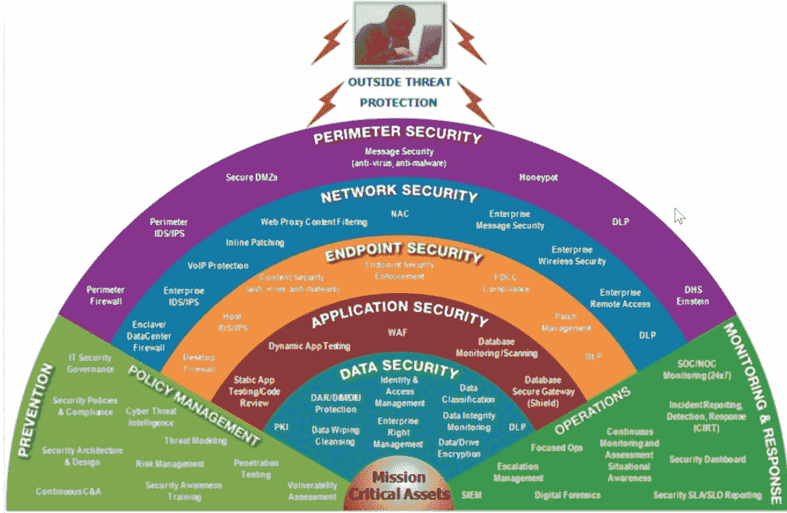

# 第二章：安全演变 — 从传统到先进，再到机器学习与人工智能

安全性在过去几十年中不断发展。从最初的防病毒系统开始，这些系统曾长期被认为是终极的网络安全工具。后来，这些系统又加入了其他各种工具。

在 1971 年之前，网络安全并不存在。这并不令人惊讶，因为当时计算机仍在开发中，黑客也难以负担，且只有少数人知道如何编写代码以进行基本的输入/输出功能。一位名为 Bob Thomas 的研究员发现，实际上可以创建一种恶意程序，这个程序能够从一台计算机传播到另一台计算机，并留下一个恼人的信息。随后，另一位研究员对该程序进行了修改，使其能够自我复制。实际上，他创造了世界上第一个计算机蠕虫。之后，他决定编写另一个程序，用来捕捉并删除恶意程序，从而阻止其复制和进一步传播。这是世界上第一个防病毒软件。

然而，自 1970 年代以来，网络安全领域发生了剧烈变化。威胁变得更加复杂，这就迫使开发出更为复杂的安全系统。技术的进步为黑客提供了更多的工具和技术，用以制造威胁。除此之外，安全系统还必须覆盖那些在没有考虑安全性的情况下构建的技术。比如，互联网就是一个依赖于数十亿人使用的技术。因此，网络安全不仅需要演变以应对网络威胁的变化；它还需要预见并为未来做好防范，以保护系统、用户和网络免受攻击。本章讨论了网络安全的演变以及网络安全与机器学习和人工智能融合的未来，并将涵盖以下内容：

+   传统的网络安全系统

+   网络安全的变革

+   安全技术的进步与未来

+   **机器学习**（**ML**）和**人工智能**（**AI**）如何在网络安全中扮演越来越重要的角色

# 传统的网络安全系统

正如我们在讨论第一个蠕虫和第一个防病毒软件时所提到的，网络安全最初是为了应对网络威胁而设计的。传统系统是为了保护组织免受已知威胁的侵害。在发现网络威胁之后，安全专家会分析其独特的执行或编码模式。这些信息会用于让安全系统检测并阻止已识别的网络威胁。这个传统一直延续至今。现如今，有一个著名的数据库叫做**公共漏洞和暴露**（**CVE**），它记录了所有已发现的威胁，并为其分配一个唯一的识别编号。

# 基于特征的安全系统

在传统安全系统的时代，安全工具是基于已发现的各种威胁的攻击签名构建的。由于创建新型恶意软件的技术仅限于少数人，这种安全方法最初是有效的。个人和组织被认为只需要在计算机上安装一个安全系统就足够了。后来，这些安全系统被改进，以接收数据库的更新，新恶意软件的签名会被加入其中。因此，用户可以在一定时间后或当安全公司提供更新时，获取新的更新。

基于签名的网络安全产品创建已应用于一整套防御系统，这些系统主要是杀毒系统。因此，所有这些系统都有一个单点故障：依赖于签名数据库。这使得组织容易受到使用未被其安全系统识别的恶意软件或攻击技术的攻击。此外，安全系统大多设计用于防止恶意软件攻击。因此，覆盖的威胁主要是病毒和蠕虫。黑客们决定抓住这个机会，发起了几次值得注意的攻击。

# 网络网络攻击

到 1970 年代末，16 岁的凯文·米特尼克学会了如何未经授权访问网络。他利用这项知识入侵了数字设备公司（Digital Equipment Corp.）的网络。他的目标是复制其操作系统，并且在网络中成功完成了这一目标。后来他被捕，并被关进了单独监禁，因为当局试图理解他是如何获得数字设备公司计算机的访问权限的。以下是凯文·米特尼克相关文章中的一张照片：

若想了解凯文·米特尼克现在在做什么以及了解他的过去，你可以阅读这篇文章：[`www.mitnicksecurity.com/site/news_item/hacker-the-first-the-best-and-the-most-feared-hackers-of-all-time`](https://www.mitnicksecurity.com/site/news_item/hacker-the-first-the-best-and-the-most-feared-hackers-of-all-time)。

在 1990 年代，一个名叫加里·麦金农（Gary McKinnon）的技术高手发动了对美国军方和 NASA 的最大黑客攻击。他据称远程入侵了 97 台计算机。然后他删除了这些计算机的关键文件和操作系统，使其无法使用。这些计算机极其重要，这次攻击导致了军方网络的瘫痪，黑客攻击的损失达到了毁灭性的 70 万美元。以下是加里·麦金农维基百科页面摘要的截图：

你可以在维基百科上阅读更多关于加里·麦金农（Gary McKinnon）的信息，链接：[`en.wikipedia.org/wiki/Gary_McKinnon`](https://en.wikipedia.org/wiki/Gary_McKinnon)。

许多其他黑客也在不断提升和完善他们的技能。更糟的是，发现了一些新工具，可以让非专业的黑客使用。它们被称为**漏洞利用工具包**，黑客可以购买或租用这些工具包来攻击目标。这给网络安全行业带来了巨大的压力，迫使其发展演变。显然，最初基于攻击特征来检测恶意软件的工具设计并未预见到许多黑客会想出新的方法来突破这些安全系统。随着能够生成恶意软件并通过改变攻击模式来避免被检测的漏洞利用工具的出现，网络安全行业显然已被黑客击败。此外，黑客还利用网络中的弱点，远程访问计算机并进行恶意操作。

# 网络安全工具

由于网络上漏洞的增加，网络安全行业最终响应并推出了更多专业化的工具，以防止来自网络的攻击。因此，他们提出了入侵检测和防御系统，并对原有的基础防火墙进行了重大改进。然而，这些系统仍然是基于特征的。最初，它们在阻止网络入侵方面是有效的，因为黑客还没有发现很多绕过方法。它们能够阻止恶意流量，并使黑客无法在网络上进行恶意活动。然而，黑客很快就发现了绕过网络安全工具的方法。因此，网络入侵重新出现，而这些防止入侵的工具无法跟上新的攻击技术。这促使网络安全行业在 2000 年代做出了更多的反应，增加了更多的网络安全措施。

# 网络安全的转变

2000 年代初，黑客开始尝试许多安全规避策略，以击败现有的安全工具。他们已经想出了在网络上规避安全工具的技术。他们还提出了一种新的攻击方法，叫做**缓冲区溢出**。缓冲区溢出通常在客户端/服务器应用程序中进行，其中有效载荷是通过数据传递的，目的是填充并写入超出内存缓冲区的区域。例如，黑客会向客户端应用程序的登录输入字段提供脚本，这会导致服务器导入文件。由于服务器只期望输入字段中有少量字符，超出的数据就会导致缓冲区溢出，使服务器失败或发生错误操作。攻击工具包也开始被修改，加入了安全规避策略。

# 分层安全

由于仅仅拥有防病毒或防火墙程序无法提供足够的安全性，网络安全行业发生了转变，组织被建议实施分层安全。因此，他们必须扩大预算，购买不同类型威胁的网络安全工具，以应对不同的攻击场景。这一举措旨在为组织创建一个强化的安全防护盾。这个策略被称为**深度防御**。至少，组织必须配备防火墙、防病毒程序、入侵检测系统、强身份验证登录平台和数据加密。该策略对抗单一向量攻击非常有效。购买了漏洞利用工具包的黑客会失败，无法突破所有的保护层，进而破坏组织的安全。而那些依赖网络漏洞进行攻击的黑客则发现自己遇到了额外的安全层，无法突破。 

分层安全的难点在于成本；它太昂贵了。网络安全成为了许多组织的重要开支。公司高层很难批准 IT 部门在工具上的大量支出。尽管如此，分层安全策略也迫使黑客重新回去并想出更好的突破组织安全防御的方法。以下图表展示了不同安全层级及其组成部分：

# 新的安全威胁

到 2010 年，一种新的网络犯罪活动模式已被发现。攻击者能够突破网络并在网络中长期保持隐蔽，无法被检测到。这种类型的攻击被称为**高级持续性威胁**。黑客已经成为一种职业，网络犯罪分子花时间研究目标系统并获取攻击所需的工具。一旦攻击成功，攻击者会维持对系统的访问，同时窃取或篡改数据。这些事件中的一个是针对伊朗核燃料浓缩设施的 Stuxnet 攻击。据信，攻击者是国家支持的，突破了该设施的安全系统，并在网络中保持了长期的隐蔽。恶意软件收集了足够的信息，确定了如何执行攻击，从而摧毁了该设施。这次攻击最具意义的是它利用了零日漏洞，并且被攻击的计算机甚至没有连接到互联网。

除了高级持续性攻击外，**网络钓鱼**攻击也卷土重来。网络钓鱼最初在公众刚刚开始接触计算机和互联网时变得流行。然而，当时的网络钓鱼攻击相当原始。最常见的一种叫做**尼日利亚王子骗局**。这是一封发送给许多人的电子邮件，讲述了一位自称是尼日利亚王子的人的困境，试图获取遗产钱，但需要一些帮助才能做到。通常，目标是被要求寄钱以帮助清除这笔资金。这个骗局很快传播开来，但在公开曝光后效果逐渐减弱。然而，2011 年出现了新一波更加复杂的网络钓鱼攻击。这些攻击不再仅仅试图欺骗互联网用户寄送小额资金。黑客开始克隆合法公司的官方网站和电子邮件模板，并通知用户其在这些公司创建的账户出现问题。用户被要求通过点击提供的链接登录并解决问题。在这些克隆网站上，用户会输入自己的真实凭证，黑客则利用这些凭证窃取数据或资金，甚至访问敏感系统。

此后，**拒绝服务攻击**（**DoS**）也成为了关注的焦点。互联网中大量缺乏足够安全系统的个人计算机成为了黑客的“福音”。他们会在这些计算机中安装恶意软件，将其招募成僵尸计算机网络，称为**僵尸网络**（**botnet**）。这些僵尸计算机会按照黑客的指令向指定目标发送非法流量，从而引发 DoS 和 DDoS 攻击。

# 对新威胁的应对

行业内逐渐认识到，仅仅阻止已知的攻击已不够。黑客们越来越擅长击败依赖签名的安全工具来阻止攻击。与其突破多层安全防护，他们开始直接针对用户，并且他们也开发出了像**拒绝服务攻击**（DoS）这样的攻击手段，难以防范。针对这些新情况，行业有了两种回应：**网络韧性**和**用户培训**。网络韧性旨在确保在网络攻击期间及攻击后仍能保持业务运作。安全目标不再只是保护组织免受攻击，而是确保攻击不会严重中断业务功能。企业更加重视准备好备份、备用热备站点以在网络攻击期间接管运营，以及更快速的事件响应措施，以确保组织能够更快地缓解和恢复攻击带来的损失。

其次，组织开始更加重视对用户进行网络安全威胁的培训。这是因为员工已成为网络犯罪分子的更容易攻击目标。社会工程学已成为突破许多组织防线的更有效方式。这一现象持续了多年。反钓鱼工作组在 2016 年提供的统计数据显示，在所有记录的恶意软件感染中，95%是由人为因素引起的。报告显示，针对软件技术漏洞的攻击不到 5%。大多数攻击都是针对员工的。

因此，组织将员工纳入网络安全链条，并更加注重教育他们如何识别钓鱼攻击和其他常见的网络安全威胁。所获得的知识旨在帮助他们避免陷入诸如提供登录凭据或点击恶意链接等陷阱。

# 安全技术的进步：安全 2.0

网络安全行业面临着巨大的压力，迫使其从基于签名的检测技术转向其他更高效的替代方案。过去强化组织安全基础设施的方法日益失败。尽管有多层安全防护，组织仍然遭到入侵。零日漏洞和社会工程学是这些攻击的主要因素。网络攻击的成本也在增加。2018 年，IBM 发布报告称，全球网络攻击的平均成本为 386 万美元。这一成本包括了诉讼和客户流失等开销。

# 基于异常的安全系统

最终，网络安全工具得到了重大更新，使它们能够对流量和程序执行进行主动扫描，并检测与正常模式的任何偏差。网络安全从基于签名的检测转向了基于异常的检测。例如，防火墙被设计用来检测服务器是否在接受来自新客户端的多个外部连接，并且连接速率高于正常水平。这将是一个信号，表明这些连接不合法，并且来自一个僵尸网络。因此，这些连接将被丢弃。许多网络安全供应商推出了可以让组织进行实时威胁分析的工具，从而防止来自未知攻击向量的攻击。

基于异常的安全工具还解决了网络安全行业面临的一个重大问题，即误报问题。最初，网络安全工具只是被设计得更彻底，以检查恶意程序和活动。结果，工具变得过于彻底，甚至将无害的程序和活动误报为安全威胁。这在网络安全工具中尤为常见，这些工具在区分真实威胁和与威胁有些许相似之处的活动时变得非常低效。误报使得安全工具变得不可靠。网络和安全管理员不得不忽略许多潜在威胁，有时甚至会在此过程中忽略真正的威胁。基于异常的安全工具的引入，确保了检测到的威胁是真正的威胁，且需要被阻止。

基于异常的安全系统也使得检测变得更加容易。最初，网络安全工具必须通过多个签名进行检查，这降低了网络和系统的性能。基于异常的工具不需要参考签名数据库，而是进行实时分析，检查流量或应用程序是否存在异常行为。最后，基于异常的威胁有效地应对了许多社会工程学攻击。在网络中，这些工具会捕获数据包头部，以读取源和目的 IP 地址，从而允许来自已知来源的流量。来自未知来源的流量则会经过彻底检查，以发现更多细节，例如源是否被列入黑名单，或是否被其他安全工具报告为恶意。

基于异常的检测方法的主要局限性在于必须由人工参与做出关键决策。因此，具备这些功能的工具更多是需要人工操作的，而不是自动化的。企业没有足够的员工来处理这些系统发送的所有警报，这些警报需要人工干预。因此，网络安全行业决定进一步改进这些解决方案，使其更加精准和自动化。大量的研究工作集中在机器学习（ML）和人工智能（AI）上。如今，越来越多的网络安全公司正在考虑将机器学习和人工智能集成到其网络安全产品中。未来，预计这类产品将主导市场。

# 机器学习和人工智能将在网络安全中发挥更大作用

AI 和 ML 为网络安全行业带来了新的曙光。AI 对于计算机科学并不是一个新概念。它在 1956 年被定义为计算机执行具有人的智能特征的任务的能力。这些任务包括学习、决策、解决问题、理解和识别语音。ML 是一个广泛的术语，指计算机在无需人工干预的情况下获取新知识的能力。ML 是 AI 的一个子集，可以采取许多形式，如深度学习、强化学习和贝叶斯网络。AI 有望通过多种方式颠覆网络安全领域，这可能是网络安全行业在对抗网络犯罪分子方面的最终胜利。

AI/ML 在网络安全中的应用涉及部署能够自动检测、阻止或预防威胁的自给自足工具，无需人工干预。威胁检测是基于安全工具中算法自我进行的训练，以及开发者已提供的数据。因此，在整个生命周期中，AI 驱动的安全工具会在威胁检测方面变得越来越好。开发者提供的原始威胁数据集将提供参考基础，供其识别什么是正常的，什么是恶意的。然后，安全工具将在最终部署之前，暴露于不安全的环境中。在充满威胁的环境中，系统将根据其检测或阻止的威胁持续学习。黑客攻击也会指向它。这些攻击将涉及黑客入侵或通过大量恶意流量压垮其处理能力。该工具将学习最常用的黑客技术，用于突破系统或网络。例如，它将检测到在无线网络上使用**Aircrack-ng**这样的密码破解工具。类似地，它将检测到对登录界面的暴力破解攻击。网络安全中人类的主要作用将是通过更新 AI 工具的算法来增强其功能。

AI 安全系统可能包含所有威胁。传统的安全系统通常无法检测利用零日漏洞的威胁。使用 AI 后，即使在攻击模式不断进化和适应的新情况下，恶意软件也无法渗透 AI 系统。系统将检查恶意软件运行的代码，并预测结果。被判定为有害的结果将导致 AI 系统阻止该程序执行。即使恶意软件混淆其代码，AI 系统也会持续监控执行模式。一旦恶意软件试图执行诸如修改敏感数据或操作系统等恶意功能，系统就会阻止该程序执行。

目前已有预测，AI 将超越人类智力。因此，未来某个可预见的时刻，所有的网络安全角色将从人类转移到 AI 系统中。这既有利也有弊。如今，当 AI 系统出现故障时，结果通常是可以容忍的。这是因为 AI 系统的操作范围仍然有限。然而，当 AI 最终超越人类智力时，系统故障的后果可能是无法容忍的。由于安全系统将比人类更强大，它们可能会拒绝接受人类的输入。因此，出现故障的系统可能会在没有任何干预的情况下继续运行。AI 的完美主义特性将既是优点也是缺点。目前的安全系统旨在减少能够成功攻击系统的攻击次数。然而，AI 系统的目标是消除所有威胁。因此，误报可能不会被视为误报；它们可能会被当作有效检测并因此导致受到影响的无害系统无法执行。

最后，人们担心将机器学习和 AI 集成到网络安全中可能会带来更多的危害而非好处。正如多年来所观察到的那样，攻击者具有很强的适应性。他们总是会尝试寻找方法来突破网络安全系统。常规的网络安全工具被比这些工具了解的更复杂的方法所击败。然而，击败 AI 的唯一方法就是混淆它。因此，威胁行为者可能会渗透到 AI 训练系统中并提供不良数据集，从而影响 AI 支持的安全系统所获取的知识。这些行为者还可能创建自己的对抗性 AI 系统，以达到平衡。这将导致 AI 与 AI 的对决。

最后，黑客仍然可能使用绕过 AI 安全系统的方法。社交工程仍然可以通过实际手段进行。在这种情况下，AI 系统将无法帮助目标。**肩窥**——即在他人输入关键细节时简单地从旁边看一眼——也是不需要使用黑客工具的。这同样绕过了安全系统。因此，AI 和机器学习可能不是打击网络犯罪的最终解决方案。

# 总结

本章回顾了网络安全从传统到先进，再到未来技术（如人工智能和机器学习）的演变。文中解释了第一个网络安全系统是为了阻止第一个蠕虫病毒而创建的防病毒系统。网络安全随后遵循这一模式，创建安全工具作为对抗威胁的响应。传统的安全系统采用了基于签名的检测方法。这种方法通过加载常见恶意软件的签名，并利用这些知识库来检测并阻止与签名匹配的程序。然而，安全系统侧重于恶意软件，因此黑客开始通过网络入侵组织。1970 年，一家操作系统公司通过其网络被入侵，并且操作系统的副本被盗取。1990 年，美国军方遭遇了类似的攻击，一名黑客侵入了 97 台计算机并进行了破坏。因此，网络安全行业开发了更强大的网络安全工具。然而，这些工具仍然使用基于签名的方法，因此无法完全防止所有攻击。

在 2000 年代，网络安全行业提出了一个新的安全概念，建议组织实施分层安全。因此，他们需要为网络、计算机和数据设置安全系统。然而，分层安全非常昂贵，但仍有一些威胁向量渗透到计算机和网络中。到 2010 年，网络犯罪分子开始使用一种被称为**高级持续性威胁**的攻击方式。攻击者不再进行突然袭击式攻击；他们渗透到网络中，并在网络中保持隐蔽，同时执行恶意活动。除此之外，网络钓鱼得到了革新，并变得更加有效。最后，攻击者开始使用拒绝服务（DoS）攻击来压垮服务器和防火墙的能力。由于这些攻击导致许多公司被迫退出市场，网络安全行业发展了一种新的安全方法，被称为**网络韧性**。这种方法不再专注于如何在攻击中保护组织，而是确保组织能够在攻击中生存下来。除此之外，用户开始更加参与到网络安全中，组织开始专注于培训员工避免常见的威胁。这标志着安全 1.0 的结束。

随后，网络安全行业进入了当前的 *“安全 2.0”* 阶段，在这一阶段，终于创造出了替代基于签名的安全系统的方法。基于异常的安全系统被引入，并且它们比基于签名的系统具有更高的效率和更多的功能。基于异常的系统通过检查正常模式或行为与异常的偏差来检测攻击。符合正常模式和行为的应用程序和流量可以执行或通过，而不符合的则会被阻止。虽然基于异常的工具有效，但它们仍然依赖于人工决策。因此，很多工作仍然落回 IT 安全管理员手中。对此的解决方案是利用 AI，希望这些安全系统能够变得自给自足。

人工智能看起来很有前景，尽管它也面临许多质疑。AI 和机器学习（ML）安全工具将通过检测异常并做出明智的决策来应对威胁。这些 AI 安全工具将拥有一个学习模块，确保它们随着时间的推移不断提升。在部署之前，这些系统将通过使用包含真实威胁的数据集和真实环境进行广泛训练。一旦学习模块能够提供足够的信息来保护组织免受常见威胁，它将被部署。AI 安全系统的主要优势之一是它们将随威胁的发展而演化。任何新的威胁将会被研究并加以阻止。尽管 AI 驱动的安全系统具有优势，但仍有人担心它们最终可能会变得有害。随着人工智能超越人类智能，可能会有一个时刻，这些工具不再接受任何人工输入。也有担心攻击者可能会毒化算法，使其变得有害。因此，人工智能在网络安全中的未来难以预测，但应该有两种主要结果：要么 AI 支持的安全系统最终将遏制网络犯罪，要么 AI 系统将变得失控，或者被迫失控，成为网络威胁。

# 进一步阅读

以下是可以用来深入了解本章所涉及主题的资源：

+   *网络钓鱼的演变*: [`www.tripwire.com/state-of-security/featured/evolution-phishing/`](https://www.tripwire.com/state-of-security/featured/evolution-phishing/)

+   *社会工程学：一个注定会恶化的 IT 安全问题*: [`medium.com/our-insights/social-engineering-an-it-security-problem-doomed-to-get-worst-c9429ccf3330`](https://medium.com/our-insights/social-engineering-an-it-security-problem-doomed-to-get-worst-c9429ccf3330)

+   *数据泄露成本研究*: [`www.ibm.com/security/data-breach`](https://www.ibm.com/security/data-breach)

+   *网络威胁与防御的演变*: [`www.infosecurityeurope.com/__novadocuments/96072?v=635742858995000000`](https://www.infosecurityeurope.com/__novadocuments/96072?v=635742858995000000)

+   *隐藏在背后的威胁：遗留系统中的网络安全风险*：[`businesslawtoday.org/2018/03/whats-lurking-back-there-cybersecurity-risks-in-legacy-systems/`](https://businesslawtoday.org/2018/03/whats-lurking-back-there-cybersecurity-risks-in-legacy-systems/)

+   *遗留的网络安全产品未能保护 97%的组织*：[`www.helpnetsecurity.com/2014/05/21/legacy-cybersecurity-products-failed-to-protect-97-of-organizations/`](https://www.helpnetsecurity.com/2014/05/21/legacy-cybersecurity-products-failed-to-protect-97-of-organizations/)

+   *基于签名或基于异常的入侵检测：实践与陷阱*：[`www.scmagazine.com/home/security-news/features/signature-based-or-anomaly-based-intrusion-detection-the-practice-and-pitfalls/`](https://www.scmagazine.com/home/security-news/features/signature-based-or-anomaly-based-intrusion-detection-the-practice-and-pitfalls/)

+   *网络安全演变的五个问题*：[`www2.deloitte.com/content/dam/Deloitte/global/Documents/Governance-Risk-Compliance/gx_grc_Deloitte%20Risk%20Angles-Evolution%20of%20cyber%20security.pdf`](https://www2.deloitte.com/content/dam/Deloitte/global/Documents/Governance-Risk-Compliance/gx_grc_Deloitte%20Risk%20Angles-Evolution%20of%20cyber%20security.pdf)
