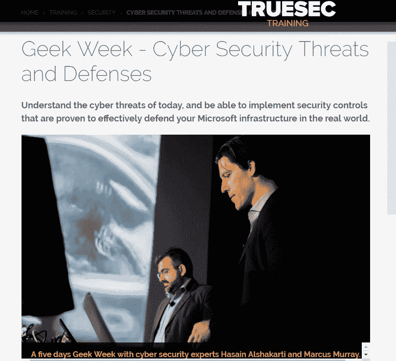

# 第三章：学习网络安全技术

在全球就业市场中，出现了一种独特的趋势。虽然不同行业的工作总数在增加，但技术行业的工作增长率是最高的之一。在一些国家，预计到 2020 年，IT 职位的数量将超过具备相关技能的人员数量。显然，世界正日益倾向于技术，这为那些掌握不同技术的人打开了机会。因此，今天投入时间学习 IT 技能的人，未来将有更光明的前景。

在 IT 职业生涯中，有不同的道路可以选择。虽然大多数 IT 职业都是不错的，但也有一些职业受限，或者可能在不久的将来面临突然消失的风险。因此，选择正确的技术行业路径时必须小心谨慎。

其中最令人安心的路径之一是选择网络安全职业。对网络安全专业人士的需求只会增加。根据以前的报告和未来的预测，网络攻击正在增加，网络攻击造成的损失每年都在扩大。大多数组织正在规划如何保护他们的系统、网络和数据免受网络攻击，因此他们为网络安全专业人士创造了需求。

网络安全正成为一个有回报的职业，尤其是对那些掌握保护组织免受网络攻击所需技能的专业人士。网络安全也是一个广泛的职业领域，涉及许多技术，所有技术都建立在不同的系统上，网络安全专业人士需要了解这些内容。

本章将带领你了解启动网络安全职业生涯时需要掌握的最关键的安全技术。我们将涵盖以下主题：

+   移动安全

+   高级数据安全

+   云安全

+   现代法规

+   事件响应与取证

+   大规模企业安全

+   渗透测试

+   DevSecOps

+   物联网安全

+   用户行为分析

+   **终端检测与响应** (**EDR**)

# 移动安全

移动安全是一个涉及保护便携计算设备免受威胁和漏洞的网络安全领域。在这一部分中，我们将探讨移动计算设备通常更容易暴露于哪些风险。

# 丢失或盗窃

设备如手机和笔记本电脑很容易在公共场所、出租车和办公室等地方丢失或被盗。从网络安全的角度来看，更令人担忧的是从丢失或被盗的设备中可以恢复出大量敏感数据。用户往往将大量个人信息保存在移动设备中。密码、银行信息、社会保障号码，甚至是公司机密信息都可能从这些设备中被盗。除此之外，移动设备通常会登录多个电子邮件账户、社交媒体账户和敏感系统。当设备被未经授权的人访问时，敏感数据可能被盗取，已登录的账户可能被用于盗窃、勒索或社会工程攻击。

以下是一些近期的报纸文章，突显了丢失手机的危险性。根据 Kensington 的统计，丢失或被盗的移动设备的平均损失费用可能超过 49,000 美元。

在你丢失移动设备之前，你应该应用的技巧：

+   打开远程追踪：

    +   **在 iOS 中**：查找我的 iPhone

    +   **在 Android 中**：查找我的设备

    +   **在 Windows 中**：使用你的 Microsoft 账户登录[`account.microsoft.com/devices`](http://account.microsoft.com/devices)，然后按照“丢失我的设备”中的步骤注册你的笔记本电脑

# 与软件相关的安全问题

大多数智能手机操作系统使用基于权限的系统，允许应用执行某些功能或访问手机中的某些数据。然而，这并不能保证应用不会请求过多的权限。批准的部分仍然掌握在用户手中，但并非所有用户都有足够的技术知识，能够识别应用请求不必要权限的情况。根据 Appthority Inc.的报告，许多免费应用与广告网络有合作关系。因此，这些应用会收集如联系人、浏览记录和位置信息等数据，并将其分享给广告商。

通过使用 Appthority 平台™，Appthority 的安全团队分析了苹果 App Store 和谷歌 Play Store 中排名前 50 的免费应用，评估其风险行为。研究结果记录在*App 声誉报告*中。你可以在[`www.appthority.com/company/press/press-releases/appthority-reveals-security-risks-of-free-mobile-apps/`](https://www.appthority.com/company/press/press-releases/appthority-reveals-security-risks-of-free-mobile-apps/) 阅读*App 声誉报告*。

恶意软件攻击也越来越成为移动安全的一个问题。跨多个操作系统，针对手机的威胁数量有所增加。这是一个大问题，因为许多用户并未在手机上安装杀毒软件。

威胁和漏洞的数量持续增加，这为移动安全专业人员开辟了职业道路。那些希望拥有全方位安全保障的个人和企业，渴望找寻能够保护移动设备的专业人员，以确保在移动过程中设备不易受到攻击。此外，随着智能手机取证专家需求的增加，这些专家能够追踪移动安全攻击的根源，找到并解决问题。因此，学习移动安全技术和移动取证技术可能会为你打开一条在网络安全领域的长期职业道路。

# 高级数据安全

数据已成为网络攻击的主要目标，因此，个人和企业正在选择投入更多资源来保护他们的机密数据。已有许多关于数据泄露的报道，其中用户数据被黑客窃取，商业机密被竞争对手盗走，敌对国家互相窃取军事记录，敏感产品的原型被持续盗窃。

围绕数据的威胁形势持续变化。为了防止攻击并遵守所有数据安全法规，组织将需要寻找专家来提供高级数据安全服务。这将有效防止数据泄露，确保敏感数据不被未经授权的人访问，并防止导致不合规事件的发生。因此，高级数据安全领域的网络安全职业可以保证你未来有源源不断的职业机会。作为这一领域的专家，你将主要负责安装数据安全产品、以最安全的方式配置现有安全软件，并制定安全政策以确保组织中的数据保护。

有几个提供数据安全培训课程的电子学习网站。其中之一是 Udemy，它提供数据安全的入门课程，然后允许学习者选择许多高级数据安全课程之一进行深度学习。入门课程为你打下了坚实的基础，之后你可以进阶到数据安全的具体领域。数据安全中的一些进阶选项包括云数据安全和加密。参加这些课程可以让你在数据安全领域建立职业生涯，或是在特定领域，如云存储的数据，进行专门化学习。

请在 Google 中搜索`advanced data security`，阅读微软、IBM 和 Oracle 的推荐，了解这些科技巨头在高级数据安全方面提供的服务。

# 云安全

云技术为许多组织带来了有价值的好处。如今，组织不再需要拥有计算资源来部署软件和系统。云计算带来的成本优势使得许多组织纷纷采用这一技术。然而，关于这项技术的种种顾虑，可能阻碍了部分组织的全面采用。组织们并不完全信任第三方云服务商来处理敏感数据。那些将数据上传至云端的组织希望确保数据的安全，避免未经授权的第三方访问这些数据，包括云平台供应商本身。

许多已经采用或正在考虑采用云技术的组织，毫无疑问需要一位网络安全专家来为其指引方向。作为云安全专家，你将具备确保云平台上的数据和系统安全的能力。你会确保从云端运行的应用程序不能被第三方操控。你还会确保存储在云上的数据安全，避免未经授权的访问。你会确保数据库和系统的身份验证与授权严格，从而防止被窃取的凭证被用来访问。最后，你还需要设计方法，防止云平台所有者或供应商访问云中的数据。随着越来越多的组织最终采用云技术，这一领域的职位机会将逐步增加。

云安全的学习选项有很多，因为大多数电子学习学院都提供相关课程。你可以通过像 Coursera 和 edX 这样的一些受信平台学习此类内容。尤其是 edX 提供了一个云安全的微硕士项目，深入探讨了云技术、相关的安全挑战以及如何解决这些问题。在课程结束时，学生将能够处理几乎所有影响云平台的安全挑战。

我们将在第九章，*知识检测与认证*中进一步讨论此内容。

来自 Microsoft Learn 网站的一个关于免费云安全培训的例子

如果你想了解更多关于亚马逊云安全的内容，可以访问这个网站：[`aws.amazon.com/security/security-resources/`](https://aws.amazon.com/security/security-resources/)。

若要查看 IBM 云安全资源，请访问此网站：[`www.ibm.com/security/solutions/secure-hybrid-cloud`](https://www.ibm.com/security/solutions/secure-hybrid-cloud)。

如果你想学习中立的云安全知识，可以查看 SANS 网站：[`www.sans.org/reading-room/whitepapers/cloud/`](https://www.sans.org/reading-room/whitepapers/cloud/)。

你可以在 SANS 阅读室找到最新的免费白皮书。当然，你也可以在[`www.cisco.com/c/en_sg/solutions/cloud/overview.html`](https://www.cisco.com/c/en_sg/solutions/cloud/overview.html)找到关于云的资源。

# 现代的监管

严格的法规已经出台，惩罚未能保护用户数据的公司。最近涉及这一问题的法规是**通用数据保护条例**（**GDPR**），对于那些希望完全符合其要求的组织来说，它非常严格。不遵守 GDPR 的后果是，相关的组织将面临巨额罚款。GDPR 只是网络空间中许多旨在保护隐私并确保安全的法规之一。还有许多适用于不同司法管辖区的其他法规。在美国，有**HIPAA 法案**、**格拉姆-李奇-布莱利法案**和**联邦信息安全法**，这些法规规范了医疗、金融和联邦机构中的数据收集、使用和保护。像美国这样的国家还出台了更多的法律，许多法案仍在排队等待成为未来的法律。

因此，监管环境可能在几个月内发生剧烈变化。组织并不总是拥有足够的资源来跟上监管变化的步伐。数据的问题在于它可以跨多个地区流动，并受到不同的监管要求。例如，虽然 GDPR 仅影响属于欧盟公民的数据，但全球的组织都必须遵守它，因为他们无法预见何时会接触到欧盟公民的数据。许多数据法规无论在哪个地理区域通过，都必须遵守。

组织研究他们应该遵守的所有法规将需要大量资源，这也是他们大多外包此职能的原因。你可以通过成为数据法规的顾问来开创一份职业。你必须熟悉所有适用于公司数据的法规，并帮助公司遵守这些法规。你还需要时刻保持对这些法规变化的更新，并在法规发生变化时相应地向组织提供建议。网络空间很快将面临重大监管合规挑战。据估计，全球每年平均会有 200 项监管变化。虽然这些变化目前不会直接影响网络安全行业，但很快会影响。因此，最好今天就开始学习，成为组织的合规顾问。

# 事件响应和取证

每年来自可信来源的统计数据显示了一个令人震惊的事实：网络安全事件正以惊人的速度增加。2018 年 7 月，Positive Technologies 发布的一份报告显示，2018 年第一季度的网络攻击比上一年同期增加了 32%。仅恶意软件攻击自 2017 年以来就增加了 75%，并且攻击对象包括个人、政府机构和企业。

你可以在[`www.ptsecurity.com/ww-en/about/news/293941/`](https://www.ptsecurity.com/ww-en/about/news/293941/)阅读更多内容。

在许多网络安全事件中，常见的情况是受害方会尽力回应，以最小化影响，然后进行彻底的调查以找出事件的根本原因。然而，能够胜任这一工作的专业人员并不多。随着攻击频率的上升，组织开始意识到需要雇佣有能力应对并减轻网络安全事件影响的人员。那些已经遭受网络攻击的个人和组织将会寻找能够追溯攻击源头的专业人员，以防止未来发生类似的攻击。

问题在于，网络安全行业正在跟网络犯罪分子赛跑，因为如今的攻击者变得越来越复杂。组织在拥有能够及时应对攻击并减少影响的专业人员方面看到了希望。如果你接受培训成为一名事件响应专家，鉴于当前网络安全行业的趋势，你几乎没有空闲时间。与此同时，数字取证也开始发挥作用。

一些因网络攻击而遭受经济损失的组织，通过数字取证技术找回了部分资金。例如，Ubiquiti Networks 公司因网络攻击损失了 4400 万美元，但在数字取证专家的努力下，随后追回了 800 万美元。因此，你也会发现数字取证领域的工作市场需求。事件响应和数字取证是相辅相成的，最好同时学习这两者。如果你选择这两个领域，你将首先学习在不同阶段应对网络安全事件的技术。你还将学习在数字取证调查中使用的工具和技术。一旦掌握了这些技能，你将为进入网络安全行业的有前景的职业生涯做好准备。

# 大规模企业安全

安全已经成为企业面临的一个广泛且具有挑战性的问题。它涵盖了确保系统和网络的安全、理解攻击者的动机、理解不同类型的攻击、了解用户和目标，并且还包括如何应对攻击的规划。随着组织采用新技术、部署新系统或引入新人员，安全的范围不断扩大。内部 IT 部门的员工往往无法全面梳理这些广泛的内容，确保组织的安全。这也是企业安全专家需求增加的原因。

要从事这一职业，您需要有丰富的 IT 经验。这是因为客户会期望您在 IT 基础设施的七个领域中都具备知识。您还需要掌握最新的网络攻击信息，并了解如何防止或减轻这些攻击的影响。您可能还需要一些软技能，因为您将被期望培训用户了解安全威胁，并教他们如何减少暴露风险或在攻击发生时如何应对。

许多知名机构提供了与此职业相关的多门课程。微软提供了 39 门关于企业安全的课程，涵盖了当今 IT 基础设施的各个方面。其中一门是**微软网络安全专业课程**，该课程全面涵盖了成为使用微软操作系统的企业安全专家所需了解的所有知识。参加此类课程是一项投资，因为目前已有很多工作机会，未来也将不断涌现。此外，由于这一行业需要经过长期培训并且熟悉所有企业安全需求的专家，因此在这一领域的竞争较少。

# 渗透测试

大多数组织选择聘请白帽黑客来寻找不同系统、网络甚至用户中的漏洞，识别可以被用来攻击的薄弱环节。渗透测试包括合法尝试攻击组织，目的是发现真实黑客在攻击过程中可能利用的所有漏洞。学习成为渗透测试员，实际上是学习黑帽黑客所使用的黑客概念。黑帽黑客将这些技能用于恶意目的，而白帽黑客则利用这些技能帮助组织保护自己。在渗透测试课程中，将教授在真实攻击中使用的工具和技术。这确保了白帽黑客在技能和技术方面与黑帽黑客保持同步。

领先的大学和在线学习平台已经开始热衷于教授这门课程。关于这门课程涵盖内容的详细大纲可以从 SANS 获得，具体包括以下内容：

初级培训通常会介绍网络安全和伦理黑客的基础知识。学习者随后会进阶，学习在黑客攻击中使用的学习工具、技术和漏洞的分类。真正的伦理黑客训练开始后，学习者将学习如何使用黑客依赖的工具和技术进行基于 Web 的系统渗透测试。接下来，学习者会从 Web 应用程序学到网络渗透，了解可以危及网络及其连接设备的各种工具。在这一阶段，学习者能够侦测网络、窃取网络密码、观察网络中的流量，并针对网络中的设备发起攻击。

渗透测试的阶段包括学习可以用来攻击用户的社会工程技术。用户常常被称为网络安全链中的“最弱环节”，因为他们容易受到操控。白帽黑客会学习如何使用工具和技术挖掘用户的背景信息，针对用户进行社会工程攻击，并在用户成为攻击的受害者时加以利用。通常，社会工程攻击让黑客能够窃取高度安全系统的登录凭证，或直接通过指令让用户进行未经授权的交易，窃取数据和资金。最后，渗透测试课程还会教授学生如何从移动设备上窃取数据。看似该课程可能培养更多的恶意黑客，但实际上，它培养的是保护组织免受黑帽攻击的白帽黑客。渗透测试课程结构合理，旨在推动 IT 行业的伦理价值。

学习渗透测试将带你进入一个有利可图的职业生涯，成为漏洞评估顾问或渗透测试员。随着恶意行为者数量的不断增加，组织将需要能够在黑客攻击之前找到系统漏洞的专家。统计数据显示，组织正在持续增加在网络安全上的 IT 支出，雇佣渗透测试员是他们能做出的最好的投资之一。因此，学习渗透测试是值得的，它能保证你在网络安全行业中获得一个稳定且高薪的职业。

如果你不想参加全球标准化的课程，并且希望直接向全球知名专家学习，像 TrueSec、Cqure 这样的公司也可以帮助你。

# TruSec 培训

TruSec 培训的官方网站可以在[`www.truesec.com/training/`](https://www.truesec.com/training/)找到。

我强烈推荐 Marcus Murray 和 Hasain Alshakarti 的培训：

# CQURE Academy

TruSec 同样优秀，提供许多定制化的网络安全培训选项。你可以在[`cqureacademy.com/`](https://cqureacademy.com/)找到他们的官方网站。

# 与 Troy Hunt 的培训

Troy Hunt 是一位澳大利亚的网络安全专家，以在各种安全话题上的公共教育和推广而闻名。他创建了 **Have I Been Pwned?**，这是一个数据泄露查询网站，允许非技术用户查看他们的个人信息是否已被泄露。该网站于 2013 年底上线。你可以通过这个链接访问他的研讨会：[`www.troyhunt.com/workshops/`](https://www.troyhunt.com/workshops/)。

# Have I Been Pwned?

由 Troy Hunt 创建的这个网站，允许你查看你的个人数据或密码是否已被泄露。该服务完全免费，强烈建议你访问该网站并订阅，以便在被黑客攻击时收到警报。你可以在 [`haveibeenpwned.com/`](https://haveibeenpwned.com/) 找到这个网站。

# DevSecOps

学习机构不断培养出开发人员进入社会。然而，这些机构大多数只关注教授开发人员如何实现应用系统中的功能。很少有开发人员在进入市场时会关注开发中的安全性。随着 IT 环境变得越来越不安全且更不可预测，开发应用和系统时需要一种新的方法。

DevSecOps 是一个前提，声明任何参与软件开发的人都有责任将开发与安全结合起来。最初，安全通常是事后考虑的事情。开发团队会先构建软件，然后再将安全性集成进去。

DevSecOps 不鼓励这种做法，而是强制推行一种新的开发方法，在这种方法中，安全性与所有其他软件开发阶段紧密结合。因此，安全性被嵌入到所有开发过程中，而不是在开发项目结束时作为附加部分加入。

DevSecOps 确保安全的责任在软件开发项目中得到平等分担，并且安全性从开始到结束始终得到集成。通过集成方法，安全性不是围绕系统的边界构建的——它是在系统的每个部分内构建的。这使得恶意人士难以入侵系统。在软件开发过程中，开发人员时刻考虑安全，并不断分享他们对安全威胁的见解以及如何让他们的软件抵抗这些威胁。例如，如果已知的威胁利用了一次性认证过程，开发人员可以在每个软件模块中实施认证，从而使未经授权的人无法在系统中执行任何重要操作，即使他们绕过了初始认证过程。

在学习 DevSecOps 时，你将发展出一种全新的开发视角。这不仅仅是关于功能的实现，还包括软件的安全性。你将学习如何确定软件的风险容忍度，并如何提升它。你还将学习如何进行风险/收益分析。有时，过度的安全性可能会妨碍一些基本服务，或者使软件变得不必要地缓慢。因此，DevSecOps 确保安全性不偏向任何一方，以免由于过多的安全控制使软件变得无法使用，或由于缺乏足够的安全控制而使软件变得不安全。DevSecOps 正在迅速获得市场的认可，组织正在寻找采用这种构建软件方法的系统开发人员。DevSecOps 的好处如下：

+   **速度与敏捷性**：软件开发以小规模的迭代方式进行，在每次迭代中都会不断增加安全性。此外，安全团队不需要等到软件完成后再集成安全控制。

+   **应对变化**：IT 环境中会发生许多变化，这些变化有时会影响安全性如何集成到软件中。例如，新的威胁可能会在软件开发过程中出现，开发人员必须通过使系统能够抵御这些威胁来做出反应。例如，旧系统被设计用来检查登录凭据是否与数据库中的匹配。然而，当黑客开始使用密码字典时，软件开发人员通过增加一个计数器来回应，防止超出一定的登录尝试次数。DevSecOps 使开发人员能够以这种方式进行响应。

+   **质量保证测试**：采用 DevSecOps 方法构建的系统更容易进行测试，因为所有组件都紧密耦合。安全性不是一个模块；而是被集成到软件中，可以在测试软件的其他功能时，进行彻底的测试。

+   **早期识别漏洞**：通过 DevSecOps，软件不必等到交给漏洞测试人员才能发现漏洞。所有开发人员都有确保系统安全的心态，因此他们总是保持警惕，寻找可能被利用的漏洞。由于许多人在审查代码时专门查找漏洞，几乎所有可能的漏洞都会在开发过程中被识别并解决。

DevSecOps 培训专注于技术转变，教你如何在开发过程中优先考虑安全性。你还将学习如何与其他开发者或安全团队合作，确保最终交付的产品具有高度安全性。DevSecOps 还专注于敏捷性和对变化的快速响应。在培训过程中，你将主要学习代码分析、变更管理、合规监控、威胁调查和漏洞评估等内容。未来，其他软件开发方法将逐渐被淘汰，公司将寻找精通 DevSecOps 的开发者。因此，今天就参加这个课程，为自己在未来的就业市场中占有一席之地。

# IoT 安全

在 2018 年上半年，IoT 设备以空前的速度增长，总数达到了 70 亿个。预计到 2020 年，全球活跃使用的 IoT 设备可能达到 208 亿个。

你可以在[`iot-analytics.com/state-of-the-iot-update-q1-q2-2018-number-of-iot-devices-now-7b/`](https://iot-analytics.com/state-of-the-iot-update-q1-q2-2018-number-of-iot-devices-now-7b/)找到更多相关信息。

根据 2018 年上半年两个季度的数字，IoT 设备数量将迅速增长。然而，IoT 设备在安全性方面面临重大挑战。这些设备由不同制造商推出，但普遍缺乏最低的安全要求。因此，许多僵尸网络正在利用这些设备形成。

僵尸网络是由互联网连接设备组成的恶意网络，用于执行拒绝服务攻击或垃圾邮件攻击。如今最强大的僵尸网络之一是 Mirai，它完全由 IoT 设备组成。这些都是由于使用大量不安全设备而带来的后果。

IoT 设备正成为黑客的攻击目标，并被用作进入组织或家庭的切入点。由于这些设备通常连接到网络，黑客通过攻破设备并在网络中进行导航，从而攻击其他设备。

例如，黑客可能突破一个 IoT 设备，进入网络后将恶意软件传播到与该设备共享同一网络的所有计算机。此类攻击已经发生，未来也必然会有更多类似的攻击发生。

由于许多组织正在优先考虑其安全性，它们将寻找专家来保护其 IoT 设备，避免这些设备被黑客操控。除了组织之外，使用 IoT 设备实施智能电网等系统的政府，也将寻找专家来保护这些系统免受攻击。因此，这为 IoT 安全专家提供了机会。

物联网安全是一个快速发展的领域，旨在为物联网技术增添一层可靠的安全性。它旨在消除物联网技术中目前存在的安全漏洞，以使其能够更好地抵御网络攻击。物联网安全由四个步骤组成：

1.  **理解物联网流程**：物联网设备扮演不同的角色，如收集数据或在系统中实现某些功能。你需要学习如何识别需要保护的流程。某些流程比其他流程更为敏感，物联网控制生命关键系统就是一个很好的例子。

1.  **理解产品的工程设计**：物联网设备制造商众多，并且由于缺乏行业标准，各自的设备设计方式有所不同。从安全角度来看，了解一些访问控制措施（如登录）是如何实施的至关重要。同时，识别后门和其他不良安全做法也非常重要，这些可能导致设备被攻破。

1.  **保护设备**：通过对物联网设备工程的深入理解，你可以做出适当的调整以确保设备安全。这些更改涉及实施安全最佳实践，确保设备安全。默认密码可以被更改，后门可以被移除，可以启用加密技术，设备可以被重置以摆脱任何僵尸网络，所有物联网设备可以连接到一个隔离且高度安全的网络。这些更改需要经过深思熟虑，以防止对物联网设备本身造成潜在的损害或服务中断。

1.  **实施安全政策**：为了确保所有物联网设备的标准化安全，必须设立安全政策，确保在所有涉及物联网设备的地方都能遵循这些政策。由于这些设备具有互联互通的特性，一旦某个不安全的物联网设备被攻破，就可能危及整个组织。因此，必须严格遵守安全政策。

目前已预计市场上将会有更多的物联网设备，因此问题不在于是否会有物联网安全职位，而是如何应对这一趋势。随着物联网设备的快速普及和网络攻击的增多，许多组织将寻求物联网安全服务。因此，这是一个今天就可以开始的安全职业道路。

你可以通过加利福尼亚大学在线免费获取物联网培训，网址为[`www.classcentral.com/tag/internet-of-things`](https://www.classcentral.com/tag/internet-of-things)。

# 用户行为分析（UBA）

用户曾导致世界上一些最严重的网络攻击。例如，Yahoo（一家电子邮件服务提供商）遭遇的最严重攻击，仅仅是因为一个用户的点击。联邦调查局（FBI）调查了导致数百万用户账户泄露的原因，发现有针对特定 Yahoo 员工的网络钓鱼邮件。有人说其中一名目标员工点击了一个恶意链接，导致黑客入侵该员工的计算机并利用其访问网络。

一旦进入网络，黑客安装了一个后门，允许他们连接并窃取 Yahoo 的用户数据库。调查发现，负责这些操作的黑客将被盗的数据库交给了其他商业黑客。很快，黑客们开始入侵个人账户，直到 Yahoo 公开了这次攻击的消息。

因此，黑客攻击可以追溯到一个没有遵守安全政策并点击了恶意链接的单一用户。网络中可能有难以突破的防御措施，但一旦登录用户被攻破，黑客就容易完成他们的任务。这种情况可能发生在任何组织。用户的粗心大意以及他们的错误可能导致灾难性的网络攻击。

网络犯罪分子将利用被入侵的计算机来实现某些功能。例如，他们可以利用财务部门员工的被入侵计算机发起财务交易。

UBA 是一项旨在避免用户遭到入侵时发生灾难的新技术。通过 UBA，大数据分析用于绘制正常用户行为模式。例如，财务部门的员工可能会记录在特定日期向特定账户转账某些金额。当某个用户表现出异常行为时，系统会触发警报。例如，如果一名财务部门员工的账户进行异常大额交易或在异常时间进行交易，UBA 将发出警报并阻止交易进行。这样就能防止攻击的实现。

UBA（用户行为分析）已经被无法承受巨大损失的大型组织采纳。例如，全球银行使用的 SWIFT 全球支付网络就采用了这种系统。2016 年，孟加拉国中央银行发生了黑客攻击，黑客发起了大额交易，其中一些交易被 SWIFT 拒绝。

黑客通过发送欺诈性消息和恶意软件窃取了 8100 万美元，这使得他们能够入侵银行的**SWIFT**（**环球银行金融电信协会**），看似是从孟加拉国达卡的中央银行发出的。尽管大部分转账被阻止，但约 8100 万美元仍然被转账至菲律宾的一家银行。此后，这笔钱被转移到赌场和赌场代理商，并且大部分至今仍然下落不明。

根据 SWIFT 的说法，黑客获取了银行员工的有效凭证，然后使用这些凭证发起资金转账，仿佛他们是合法的银行员工。

随着人工智能和大数据分析的进步，UBA（用户行为分析）正在变得越来越好。未来，许多组织将采用这样的 UBA 系统。因此，针对这项技术的咨询服务潜力巨大。现在有一些在线学习平台提供多个 UBA 课程的培训，旨在帮助对抗网络攻击。此类课程会教你如何在组织中安装和配置 UBA 系统，收集正常的用户数据，并在检测到威胁时定义应采取的措施。由于大多数操作由 UBA 系统自动执行，因此大多数工作都集中在安装、配置和学习过程中。凭借这些信息，你可以成为一名知名的 UBA 系统安装、用户培训和故障排除的咨询顾问。由于许多组织将部署这些系统以帮助应对黑客攻击、垃圾邮件、恶意软件传播以及员工泄漏等问题，任何经过 UBA 培训的专业人士在未来都能找到大量的工作机会。

学习凭证是如何工作的，**Pass the Hash**（**PtH**）是什么。截至 2019 年 4 月，这类攻击依然非常活跃和有效。

PtH 是一种攻击技术，攻击者捕获密码或哈希值后，直接使用这些密码或哈希进行身份验证。

2019 年 4 月，微软确认他们的免费电子邮件服务（Outlook/Hotmail /MSN）已遭到入侵。支持人员的凭证被窃取，黑客通过这些凭证未经授权访问某些账户，查看账户的电子邮件地址、文件夹名称及部分电子邮件。

你可以通过微软发布的白皮书学习如何减轻 PtH 攻击和其他凭证盗窃攻击。你可以从以下网址下载并阅读白皮书：[`www.microsoft.com/en-us/download/details.aspx?id=36036`](https://www.microsoft.com/en-us/download/details.aspx?id=36036)

同时，拥有**特权访问工作站**（**PAWs**）可以帮助你最小化潜在的网络攻击和威胁向量。你可以在这里了解更多关于 PAW 的信息：[`docs.microsoft.com/en-us/windows-server/identity/securing-privileged-access/privileged-access-workstations`](https://docs.microsoft.com/en-us/windows-server/identity/securing-privileged-access/privileged-access-workstations)

若要了解更多关于网络安全攻击与防御策略的内容，您可以阅读一本由 Packt 出版、Yuri Diogenes 和我共同编写的书籍：

# 端点检测与响应（EDR）

EDR 已被预测为未来的事件响应技术。普通的事件响应团队并不总是对攻击有足够的了解，无法迅速识别攻击原因，减轻其不良影响并恢复情况。即使攻击已经结束，普通的事件响应人员也不能确保能够防止未来类似攻击的发生。EDR 是一个用于检测和调查终端设备上事件的工具组合的术语。

这项新兴技术通过提供更可靠、及时的事件响应，重新定义了事件响应的含义。EDR 不仅仅是一个工具——它由不同的工具组成，这些工具持续监控终端、网络和用户，并集中存储所有重要信息。

EDR 由强大的分析系统提供支持，这些系统从中心点运行，以识别由在不同系统中运行的监控代理记录的任何异常数据。当安全事件即将发生时，EDR 会向系统和网络管理员发出潜在攻击的早期警告。例如，EDR 可能会检测到某个服务器的内部防火墙不断阻止来自某一来源的可疑流量。EDR 将警告该服务器即将遭受攻击，以便采取预防措施。有些 EDR 可以与其他安全软件（如防病毒程序）集成，在检测到恶意软件已传递到终端时，进行干预。

EDR 技术将在不久的将来被希望进行持续监控以威慑攻击并协助事件响应的组织广泛采用。这项技术已被视为当今网络安全基础设施的核心组成部分。由于攻击将持续增加，组织将需要一个工具来帮助事件响应团队在攻击发生时迅速识别原因并加以缓解。因此，他们将寻求能够将 EDR 部署到其 IT 基础设施中的专业人员。此外，掌握 EDR 技术将为您在 IT 职位上带来优势。因此，学习这项技术是非常值得的。

# 摘要

今天，网络空间发生了不可避免的变化。网络攻击正在增加，且变得越来越复杂。这些变化也正在塑造网络安全领域的职业发展。传统的网络安全方法正在慢慢被淘汰，新技术正在被采纳。未来网络安全行业的就业市场将受到这些技术的显著影响。

本章介绍了一些目前最有前景的学习技术。对这些技术的分析是依据其适用性和未来就业前景进行的。我们讨论的技术将会在不久的将来成为网络安全领域的主流。掌握这些技术，将有助于你在 IT 行业，尤其是网络安全行业从事不同的职业。如果你选择进入普通的 IT 职业领域，这些技术也将为你提供额外的优势。

# 深入阅读

以下是一些可以用来深入了解本章内容的资源：

+   *渗透测试*：[`www.sans.org/curricula/penetration-testing`](https://www.sans.org/curricula/penetration-testing)

+   *什么是 DevSecOps？开发更安全的应用程序*：[`www.csoonline.com/article/3245748/devops/what-is-devsecops-developing-more-secure-applications.html`](https://www.csoonline.com/article/3245748/devops/what-is-devsecops-developing-more-secure-applications.html)

+   *什么是 DevSecOps？*：[`www.redhat.com/en/topics/devops/what-is-devsecops`](https://www.redhat.com/en/topics/devops/what-is-devsecops)

+   *物联网现状 2018：物联网设备数量已达 70 亿—市场加速发展*：[`iot-analytics.com/state-of-the-iot-update-q1-q2-2018-number-of-iot-devices-now-7b/`](https://iot-analytics.com/state-of-the-iot-update-q1-q2-2018-number-of-iot-devices-now-7b/)

+   *物联网安全（Internet of Things 安全）*：[`internetofthingsagenda.techtarget.com/definition/IoT-security-Internet-of-Things-security`](https://internetofthingsagenda.techtarget.com/definition/IoT-security-Internet-of-Things-security)

+   *5 项新兴安全技术有望改变战局*：[`techbeacon.com/5-emerging-security-technologies-set-level-battlefield`](https://techbeacon.com/5-emerging-security-technologies-set-level-battlefield)
