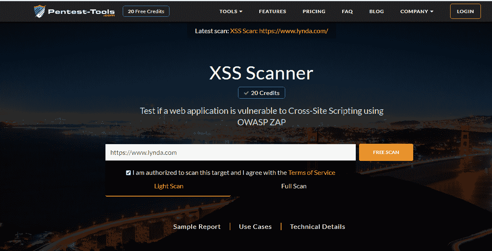
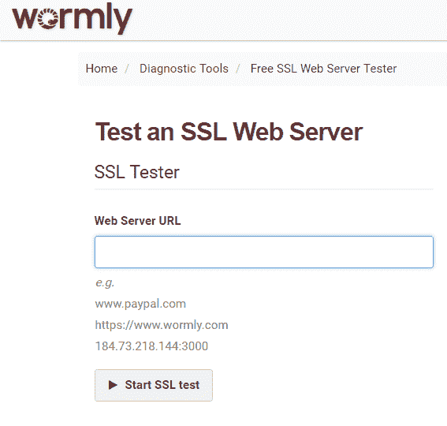
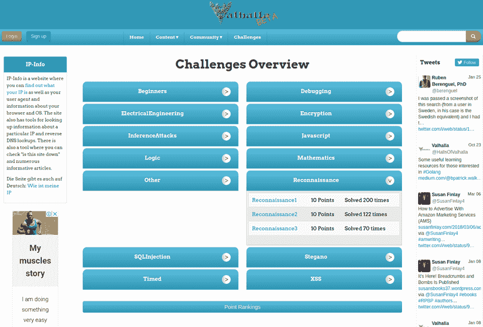
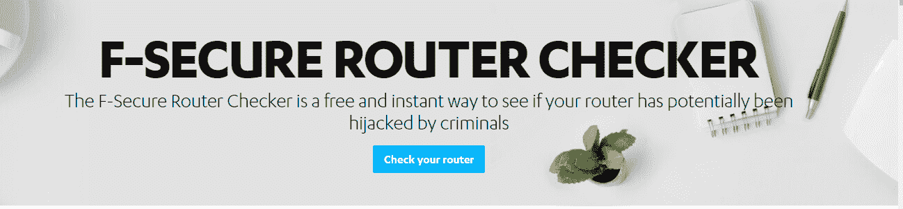
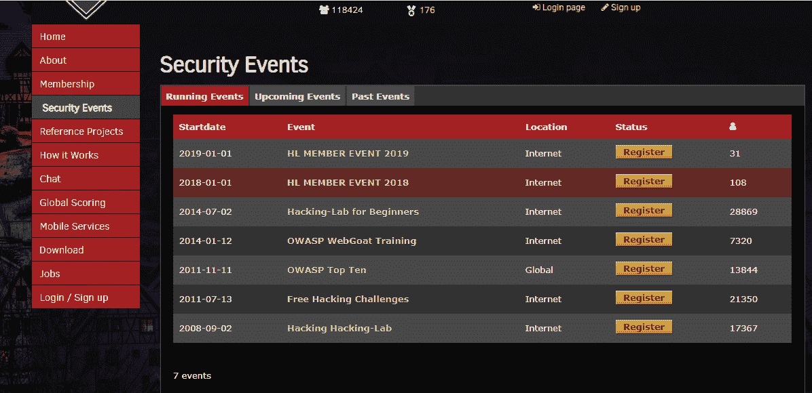
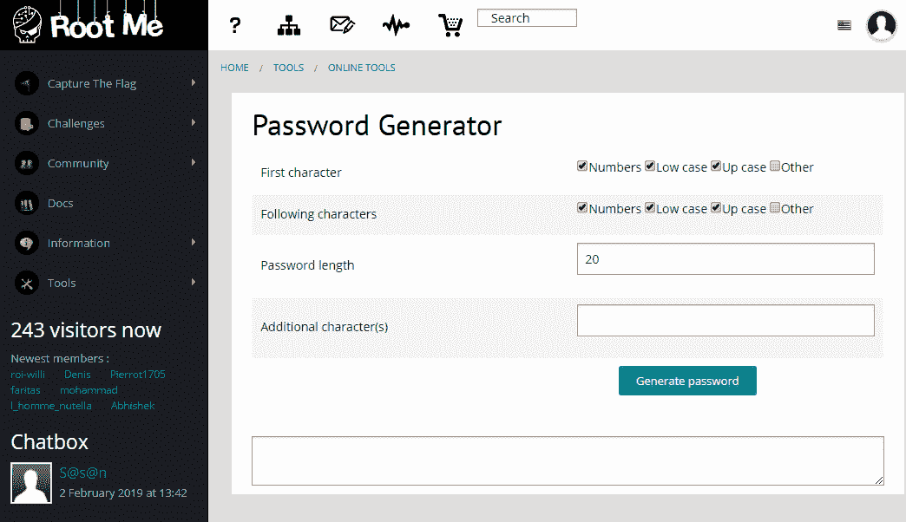
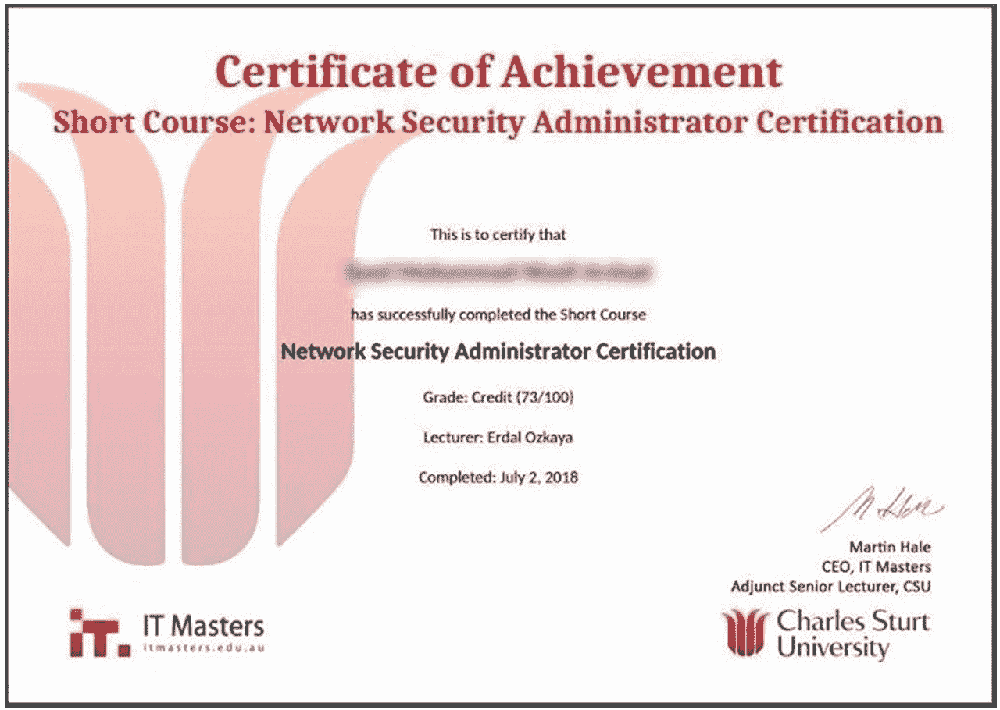
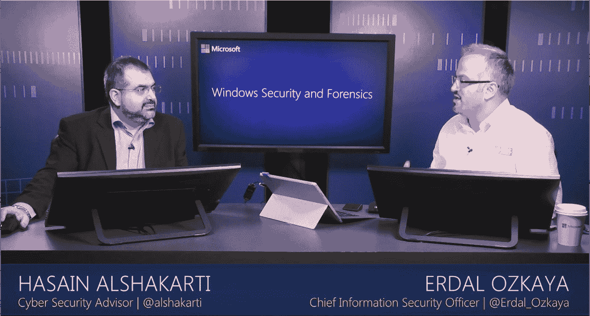
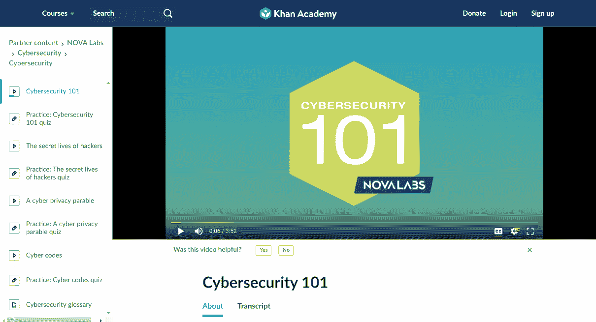
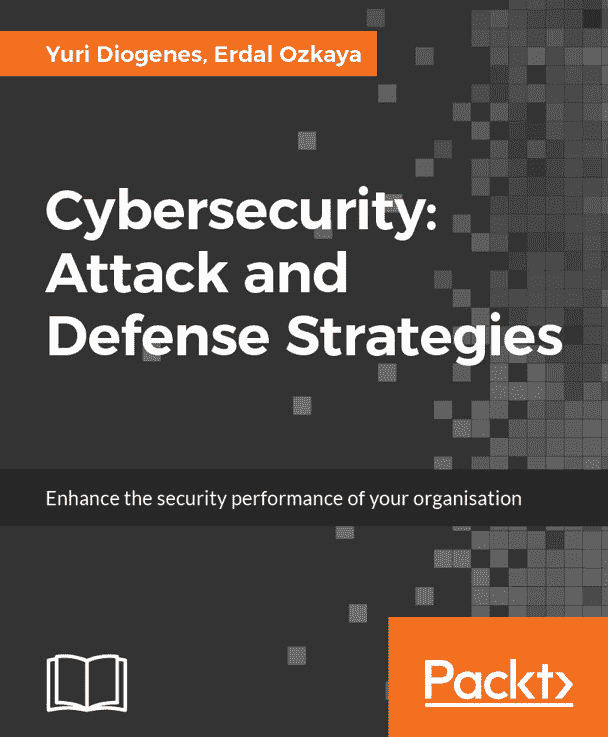

# 第八章：网络安全实验室

传统的教学方法已被观察到对网络安全培训效果不佳。理论方法仅提供了网络安全的某些方面的细节，但很少能让学习者掌握实际技能。因此，必须通过实践经验，帮助学员将所学的原则应用于实际环境中。实践培训能够更高效地学习技能，让学员更好地理解所有细节的重要性。例如，防火墙配置中的一个漏洞可能会导致网络安全漏洞。

IT 行业快速发展，要求人们迅速获取新知识。在你的网络安全职业生涯中，你很可能会不断学习新技能，以适应市场新趋势。因此，了解获取新技能或提升现有技能的途径至关重要。网络安全培训的一个优势是，你不必进入大学就能学习。互联网上有多个平台，提供免费的学习机会或仅需支付少量费用。

然而，在线培训也有一些需要注意的事项。其中之一就是，你的选择将极大地影响最终结果。因此，选择错误的学习平台会对你不利。此外，你对学习的投入也会影响你掌握新技能的速度和效果。如果你专注且勤奋，你将迅速获取新知识和技能。因此，如果你发现自己难以长时间集中注意力，选择导师主导的培训会更为合适。本章将概述三种受欢迎的培训选项，你可以根据个人偏好和能力进行选择。

+   导师主导培训（ILT）

+   虚拟导师主导培训（VILT）

+   自学

# ILT

ILT 通常被称为传统的学习方法。这种方法要求导师亲自出席，并与学员互动，目的是教授学员新技能或提升导师已经具备的技能。技术的发展使得 ILT 变得非常便捷。ILT 适用于那些涉及复杂主题、需要专家亲身经验的培训。

在 ILT 中，培训通过培训小组的形式进行。学员们可以在同一物理空间内共同工作，并且互相帮助解决问题。学生之间的合作往往在这种培训方法的成功中起到关键作用。学员可以通过分享挑战、经验、技巧和窍门进行互动，从而让培训过程更轻松或更有趣。最终效果是，由于学生之间的协作，复杂的主题变得更容易理解。

这种类型的培训的缺点包括可访问性有限，因为学生通常必须出门到达培训地点。此外，他们必须以相同的步调进行。这种方法也很昂贵，大部分费用无法避免。这种培训的覆盖范围也有限，因为教练和学生必须亲自见面。但是，机构也提供短期集训课程，这些课程是可以定期在不同地点轮换的较短培训活动。这提高了培训项目的覆盖范围和可访问性。

# VILT

这是通过互联网提供的 ILT 的延伸。在 VILT 中，有在线虚拟教师主导的课程。学生和教师都不必前往参加课程，因为他们可以在任何地方参与，只要他们有稳定的互联网连接。提供这种培训的机构有不租用学生学习的房间的优势。这种学习模式更加灵活，因为学生可以在课前和课后进行其他任务。课程的时间安排也更加高效，并且将在预定的时间开始和结束。培训的质量也可以很高，因为机构可以从任何地方雇佣有资格的人员，只要他们有可靠的互联网连接。

然而，VILT 也带来了一系列挑战。首先，它是虚拟的，因此对学习者有自律要求。学生在进行培训时必须避免手机等干扰。对于学生来说，没有实际监督，他们在培训过程中很容易被环境中的其他事物分散注意力。一些估计显示，VILT 的注意力持续时间为 25%。这意味着许多学生在培训期间会分神。与教师互动的空间也有限。每个会话中学生数量较多，减少了每个学生发表意见或向教师提问的机会。教师也无法与学生建立联系。因为教师了解学生是否理解所教内容的方式之一是观察他们的身体语言。VILT 不能为教师观察学生的非语言沟通提供最佳媒介。最后，这种培训的实用性也有局限性。学生通过 PDF、视频剪辑或手册收到资源。然而，这些资源并不总是针对不同屏幕尺寸进行优化，对一些学生来说实际跟进培训可能会感到不舒服。

# 自学

这是学习者跟随基于文本或视频的培训模块并按照自己的节奏学习的地方。这需要学习者在时间管理和完成课程中的挑战方面具备自律精神。

这种学习方式的好处有很多，既包括灵活性，也包括成本效益。在这种培训方式下，学生不必跟随其他学生或培训师的进度。学习较快的学生能够快速完成，而学习较慢的学生可以有机会将学习时间拉长，从而充分掌握所教的内容。这种学习方式还具有成本效益。提供自学模块的机构通常会以较低的价格甚至免费的方式提供这些模块。例如，你可以通过观看并使用免费的 YouTube 教程来学习很多技能。一门可能需要花费数千美元在大学里上学的课程，可能在这里只需不到 1,000 美元。

自学和评估模块由于能够让人们根据自己的节奏和方便性进行学习，越来越受到欢迎。由于这些学习平台，网络安全领域的专家人数也在增加。行业对专业人才短缺的反应非常迅速。预测显示，2020 年将缺少 150 万网络安全人员，但这种缺口可能会得到缓解。

进行自学和评估的最佳方法之一是通过在线网络安全实验室。这些实验室让你接触到你必须应对的真实世界威胁。互联网提供了广泛的实验室供你进行。然而，其中一些实验室是收费的。

本章重点介绍了便宜的替代方案，你可以在这些方案中设置并免费使用安全实验室。它探索了旨在提升你掌握不同类型威胁及其解决方案的实验室。

# 自学网络安全实验室

我们将讨论几个网络安全专业人士可以用来学习的在线平台。将介绍的部分工具是实时的，使用时需要目标网站的授权。因此，务必小心，避免在高度敏感或严密防护的网站上进行测试。最终目标是学习更多的网络安全知识，因此要关注每个练习结束时给出的结果或报告。

# 跨站脚本（XSS）实验室

首先，一个你可以进行的简单安全实验是 XSS 攻击，可以在[`pentest-tools.com/website-vulnerability-scanning/xss-scanner-online`](https://pentest-tools.com/website-vulnerability-scanning/xss-scanner-online)找到：

图 1：XSS 扫描器的登陆页面

XSS 在线扫描器是一个免费的在线工具，用于检测网站上的 XSS 攻击和漏洞。在 XSS 攻击中，黑客将恶意的 JavaScript 代码注入到可信的网站中。该脚本可以用来以多种方式危害受影响的网站及其访问者，例如读取敏感页面内容、注入恶意脚本、窃取 Cookies 以及篡改网站内容。

安全实验室非常简单，因为你只需要提供一个待扫描的网站 URL。扫描器将通过提供的网站，尝试识别所有可能存在 XSS 攻击漏洞的页面，比如联系表单和搜索框。然后，工具会对每个潜在易受攻击的页面进行 XSS 攻击。扫描器会根据发现的 XSS 漏洞提供网站整个范围的报告。

XSS 扫描器支持轻度扫描和全面扫描。轻度扫描不太全面，最多可扫描 20 个 URL，且最大扫描时间为两分钟。全面扫描更为彻底，最多可支持 500 个 URL，扫描时间为 30 分钟。

执行扫描时，用户需要提供三个参数：

+   待扫描的 web 应用程序的 URL

+   扫描类型

+   确认他们有授权扫描目标应用程序

需要注意的是，扫描器会生成 HTTP 请求，这些请求可能会被服务器端标记为攻击，尽管它们并不具有危害性。这也是为什么你应该主要在授权目标上使用 XSS 扫描器，以避免因安全违规而遭到起诉。该工具会提供一份详细的报告，列出已识别的 XSS 漏洞或攻击。然后，这些报告可以用于在攻击者利用漏洞之前修复它们。

# 安全套接字层（SSL）配置实验室

这是 Wormly 提供的一个网络安全实验室，你可以通过[`www.wormly.com/test_ssl`](https://www.wormly.com/test_ssl)进行访问。它允许你对 web 服务器的 SSL 配置进行深入分析。这是一个重要的测试，因为配置错误的 SSL 可能会引入安全漏洞，黑客可以利用这些漏洞窃取存储、发送或接收的服务器数据，或用于执行**拒绝服务**（**DoS**）攻击。此外，配置错误的 SSL web 服务器可能会导致网站速度变慢，从而影响用户体验。

在这个实验室中，网络安全专家可以识别 web 服务器中的安全配置弱点或错误。需要注意的是，SSL 证书对于确保 web 客户端和 web 服务器之间的通信安全至关重要。SSL 证书确保通过加密，所有在 web 服务器和浏览器之间交换的数据都能够保持私密和安全：

图 2：Wormly SSL 服务器测试工具用户界面

Wormly 提供了一个简化的界面，你可以在其中输入需要扫描 SSL 服务器的 web 应用程序的 URL 或公网 IP 地址。然后，你可以点击“开始 SSL 测试”按钮来启动测试。

该工具提供了关于正在使用的 SSL 证书的重要信息，例如有效期和信任等级。报告还包括安全信息，如当前使用的加密算法是否强大、公共密钥大小、使用的安全协议及其版本、性能信息（如 SSL 握手大小、TLS 无状态恢复、SSL 会话缓存等）。这些信息使你能够识别 SSL 配置中的任何弱点，以便在犯罪分子利用这些漏洞之前采取适当措施进行修复。网络安全专家将轻松解读并修复该工具所标出的错误。

# Acunetix 漏洞扫描器

这是一款安全审计工具，可以在[`www.acunetix.com/vulnerability-scanner`](https://www.acunetix.com/vulnerability-scanner)找到。它被网络安全专家用于识别托管在云端的 Web 应用程序中的漏洞。过去十年中，Web 应用程序的使用量大幅增加。同时，犯罪分子正在利用互联网协议中的漏洞进行破坏，并通过盗取机密信息在黑市上获利。因此，这款工具为网站管理员或网络安全专家提供了一个免费的基于云的系统，用户可以用它来检测 Web 应用程序中最常见的两种漏洞。该工具的免费版本功能有限，较付费版本有所欠缺，但仍能提供有价值的信息，用于加固 Web 应用程序。

该工具提供了一个带控制面板的界面，用户可以选择扫描类型、扫描的漏洞、报告、设置和目标系统。在用户提供所需信息后，系统将进行扫描并生成详细的报告，列出检测到的漏洞。该安全工具还会建议用户可以采取的适当行动来修补这些漏洞。

Acunetix 是一款有用的安全工具，可以检测超过 4,500 个 Web 应用程序漏洞。此外，它还可以扫描开源和定制构建的应用程序，发现可能被利用的安全漏洞，从而危及 Web 应用程序的安全性。Acunetix 在线扫描器还可以扫描外围服务器的弱点，并提供适当的改进措施建议，以修复这些漏洞。因此，这款安全工具是检测和修复 Web 应用程序安全漏洞的有效工具。

# Sucuri

Sucuri 是另一个免费的在线恶意软件扫描工具，可以在[`sitecheck.sucuri.net/`](https://sitecheck.sucuri.net/)查看。它是一个安全扫描器，网络安全专业人员可以用来查找网站中的漏洞。该系统提供了一个界面，用户可以在其中输入要扫描的网站的 URL。然后，安全工具会扫描这些网站，查找已知的恶意软件、黑名单状态、错误和过时的软件。

Sucuri 系统还可以用于确保给定的 Web 应用程序是干净的、快速的且受保护的。如果检测到恶意软件，相关的安全专家将能够删除它，从而确保应用程序的性能和安全性不受影响。该安全工具还可以检测到过时的软件，如内容管理系统，这些系统通常是安全漏洞的来源。因此，可以更新软件到安全版本，以减少暴露于安全风险中的可能性。

# Valhalla

Valhalla 是一个综合性的在线网络安全实验室。您可以访问其网站：[`halls-of-valhalla.org/beta/challenges`](https://halls-of-valhalla.org/beta/challenges)。该网站允许用户参与各种与安全相关的挑战以获得积分。网站提供的挑战包括 SQL 注入、调试、加密、XSS 和侦察。在侦察中，用户需要收集有关给定目标的情报。侦察在渗透测试中扮演着重要角色，而渗透测试是网络安全职业的核心部分。

渗透测试的目标是发现给定系统中的安全漏洞，以便进行修复，从而减少暴露于安全风险中的可能性。为了使这一过程成功，您必须对目标有足够的情报。因此，情报收集是渗透测试中的一个重要步骤，Valhalla 安全实验室将提供多种服务，让您在情报收集方面获得实践经验。侦察挑战有三项任务供您完成，并检查您的答案是否正确。其他网络安全实验室也有类似的三项实验室布局。在所有的挑战中，网站提供了提示和支持，用户可以利用这些资源完成任务。用户还可以访问已成功完成的解决方案，从中学习。以下截图显示了 Valhalla 的用户界面：

图 3：Valhalla 用户界面

用户需要访问 Valhalla 网站并选择他们想要挑战的类别。接着，用户会选择挑战的难度级别并开始进行挑战。例如，用户可能需要收集适当的情报，以便找出系统中某个账户的登录凭证。通过这些信息，用户将获得系统访问权限，并继续收集更多情报，从而获得访问机密信息的权限。

# F-Secure 路由器检查器

这是一个网络安全实验室，帮助你检查路由器是否被网络犯罪分子劫持。它可以在[`www.f-secure.com/en/web/home_global/router-checker`](https://www.f-secure.com/en/web/home_global/router-checker)找到。今天常见的威胁之一是 DNS 劫持；其中一种实施方式是通过未经授权的路由器配置修改，使得第三方能够监控、控制或重定向通过路由器传输的流量。这个安全实验室教你如何轻松检查路由器是否已成为 DNS 劫持的受害者。这些知识可以帮助受害者在任何重大损害发生之前，及时制止攻击。例如，在路由器的 DNS 被劫持的情况下，使用该工具进行快速测试可以检测到攻击，并建议适当的应对措施。这可以防止用户被重定向到假冒的真实网站，如在线银行，在那里他们的记录或登录凭证可能被窃取并用于访问他们的银行账户。该工具还很重要，因为它能够检测到路由器中的漏洞或配置错误，这些问题可能被犯罪分子利用来危害用户。

F-Secure 路由器检查器提供如下截图所示的界面，允许用户分析路由器设置中的漏洞。因此，用户需要访问 F-Secure 网站，然后选择“在线工具”，将被引导到路由器检查工具页面。只要他们连接到互联网，就只需要点击“检查您的路由器”按钮开始分析。几分钟后，将显示一份报告，报告中包含有关路由器健康状况的相关信息，并给出适当的修复建议。该工具还提供其他设备的更多测试，但这些需要订阅费用，因此可能不适合用于学习目的。

图 4：F-Secure 路由器检查器工具

现在，让我们在下一节中探索 Hacking-Lab，以进一步强化我们的知识基础。

# Hacking-Lab

Hacking-Lab 可以通过 [`www.hacking-lab.com/Remote_Sec_Lab/`](https://www.hacking-lab.com/Remote_Sec_Lab/) 访问。Hacking-Lab 是一个免费的在线道德黑客实验室，提供一个虚拟平台，您可以在上面进行渗透测试。该工具还包括多个计算机网络和安全挑战，您可以尝试这些挑战，从而在各种网络和安全方面积累实际经验。Hacking-Lab 的目标是提高信息安全领域的伦理意识。通过网络安全竞赛来实现这一目标，竞赛测试网络安全的关键方面，如取证、密码学、逆向工程和网络防御。该工具免费提供，旨在创造一个通过为网络安全专业人员提供相关知识和技能来增强网络保护的环境。该工具还被全球多个大学授权用于教育目的，目的是培养能够满足当前商业环境需求的年轻网络人才，并鼓励学习者从事网络安全职业。

以下截图显示了 Hacking-Lab 的仪表板；还可以看到一个“安全事件”部分，列出了您可以参加的事件，如免费黑客挑战。大多数这些事件是在线进行的，因此您无需任何特殊软件即可进行网络安全挑战。要使用实验室，您只需注册 Hacking-Lab 帐户，然后注册正在进行的免费黑客挑战活动。通过这些挑战，您可以学到很多东西，因为它们模拟了犯罪分子如何利用应用程序中的漏洞来破坏其安全性。因此，您可以获得如何识别应用程序中安全漏洞的实际经验，并了解可以采取的措施，如系统加固，以最小化暴露于各种安全风险的可能性：

图 5：Hacking-Lab 控制面板

现在您已经了解了 Hacking-Lab，让我们将重点转向 Root Me 密码生成器。

# Root Me 密码生成器

Root Me 密码生成器可以访问 [`www.root-me.org/spip.php?page=outils&amp;inc=password&amp;lang=en`](https://www.root-me.org/spip.php?page=outils&inc=password&lang=en)。到目前为止，弱密码仍然是组织数据和系统安全的主要威胁。Root Me 密码生成器是一种安全工具，用于生成用户密码，用户可以使用这些密码访问他们的账户。以下截图展示了密码生成器的用户界面。用户需要输入多个字段，例如密码长度和附加字符，然后点击“生成密码”按钮。该工具将使用暴力破解尝试猜测给定用户账户的正确密码。这个工具非常重要，因为在进行渗透测试时，通常会尝试访问使用弱密码的账户。因此，该工具将用于识别弱密码并制定有效的密码策略，以确保用户选择无法通过常见密码破解工具破解的密码：

图 6：Root Me 密码生成器用户界面

在接下来的部分，我们将探讨 CTF365 的要点。

# CTF365

CTF365 可以访问 [`ctf365.com/`](https://ctf365.com/)。CTF365 是一个网络安全培训的游戏化工具，提供了众多现实生活中的游戏，玩家需要为他们的系统（例如虚拟专用服务器）构建防御，以防止攻击。同时，玩家还尝试攻击网络中其他人开发的系统。这个工具非常有用，因为它模拟了现实生活中网络安全的情形。安全专业人员需要构建并保护那些不断受到犯罪分子攻击的计算机系统，这些攻击者试图破坏、修改或窃取系统中的数据。CTF365 采用了一种有趣、富有挑战性且社区驱动的方法，帮助安全专业人员掌握他们在当前信息安全领域中所需的技能。

根据该安全培训工具的开发者所述，最佳的学习方式是通过实际应用。游戏化在这方面表现优异，它通过增加学习者的参与度、提高记忆率和加快学习曲线速度来增强学习效果。该工具对非盈利的信息安全会议免费开放。个人使用和培训也可享受 30 天的试用期。要参与其中，所需的仅仅是安装 OpenVPN 来使用该安全工具。此外，你还需要两个重要文件：你的 VPN 用户名和密码文件以及配置文件。将这两个文件复制到以下位置：`C:\Program files\OpenVPN\config\`。然后，在 Windows 中搜索 `OpenVPN GUI`，右键点击它并选择以管理员身份运行。工具启动后，你应该右键点击 OpenVPN GUI 图标并选择连接。这将允许你连接到 CTF365，构建必要的系统及其防御进行实践，同时尝试攻击社区中其他人开发的系统。

# Mozilla Observatory

你可以访问 Mozilla Observatory 网站：[`observatory.mozilla.org/`](https://observatory.mozilla.org/)。Mozilla Observatory 是一个免费的开源网站安全扫描器，基于 Python 代码库开发。Mozilla 声称该工具已经帮助超过 125,000 名安全专业人士以安全的方式配置他们的网站。因此，这对于网络安全爱好者来说是一个很好的学习途径。要使用该工具，你只需将网站的 URL 或域名复制并粘贴到 Observatory 中，然后点击“Scan Me”按钮。扫描将开始，网站的安全报告将随之呈现。报告包括诸如 OWASP 头部安全性和 TSL 最佳实践等重要安全元素。该工具还能够执行来自 SSL Labs、High-Tech Bridge 和 HSTS preload 的第三方测试。此外，该安全工具还提供了指向优质资源的链接，这些资源可以用于修复识别出的安全问题。

该报告对网页开发者和安全管理员非常有用，因为它能够帮助他们识别网站中的漏洞，从而提高网站的安全性。该工具的一个大优点是，用户还可以在一定时间间隔后安排自动安全扫描。这有助于网站的监控，因为如果网站出现新的安全问题，用户会收到通知。

# 免费在线培训提供者

网络安全是一个小众领域，且可用资源有限，这一点是可以理解的。因此，找到适合有兴趣进入该领域的新人才的培训课程非常困难。然而，确实有一些培训机构提供免费的网络安全培训，面向年轻而充满热情的思维。我们将在接下来的章节中讨论这些培训提供者。

# IT 硕士学位和查尔斯·斯图尔特大学

考虑免费的大学短期课程：如果您考虑注册硕士学位，为什么不在“注册前试用”？注册这些基于网络短期课程，比如在 Charles Sturt University (CSU) 提供的课程，可以让您了解 IT 硕士学位如何创建一个协作学习环境，还有机会与其他学生互动和建立网络。通过课程考试将获得成就证书，并且可能还能获得硕士学位的学分。

Erdal Ozkaya 博士也是 CSU 的讲师，已经提供了许多免费短期课程。网站上总有新的课程可供查看，请自行访问网站。您可以访问 CSU 网站 [`www.itmasters.edu.au/about-it-masters/free-short-courses/`](https://www.itmasters.edu.au/about-it-masters/free-short-courses/)：

图 7：Charles Sturt University 网站的登陆页面

这个免费短期课程通常为期四周，基于在线进行，您将每周进行评估。在此结束时，您将进行一次最终在线考试，如果通过考试，将获得证书：

图 8：授予 Charles Sturt University 学生的成就证书示例

# Microsoft Learn

要在职业生涯中进步并获得您的顶级位置所需的技能并不容易。现在有一种更具回报的实践学习方法，可以帮助您更快实现目标。您可以赚取积分、等级并取得更多成就！您可以在 [`docs.microsoft.com/en-us/learn/`](https://docs.microsoft.com/en-us/learn/) 找到更多信息：

图 9：在 Microsoft Learn 上关于 Windows 安全与取证的讲座截图

# edX

在 edX，您可以找到人文领域的在线课程，包括古典文化、语言和文学的研究。这些课程来自世界各地的主要大学，并且是免费提供的；您只需选择要注册的课程。您可以在 [www.edx.org](http://www.edx.org) 找到 edX：

图 10：edX 的登陆页面截图

# Khan Academy

Khan Academy 提供练习题、教学视频和个性化学习仪表板，使学习者能够在课堂内外以自己的步调学习。他们提供数学、科学、计算机编程、历史、艺术史、经济学等课程。您可以在 [`www.khanacademy.org/`](https://www.khanacademy.org/) 找到 Khan Academy：

图 11：在 Khan Academy 上的网络安全 101 课程的截图

# 网络安全：攻击与防御策略

这是 Packt Publishing 的一本书样本，可以帮助您进入网络安全的下一个级别：

图 12：Packt Publishing 出版的《网络安全：攻击与防御策略》封面

本书使用网络安全攻击链的实践方法，解释攻击的不同阶段，包括每个阶段背后的理论，并通过情景和示例将理论付诸实践。

# 构建自己的测试实验室

一切从拥有合适的硬件开始，至少要支持虚拟化。如果你有 Windows 8 或 10 专业版，那么你可以直接使用内置的 Hyper-V。为此，你需要学习如何安装**虚拟机**（**VM**）和虚拟机管理程序，通常是在 Microsoft Hyper-V、Oracle VirtualBox 或 VMware（Fusion 和 Workstation 不是免费的）中完成：

+   如何在 Windows 10 中安装 Hyper-V：[`blogs.technet.microsoft.com/canitpro/2015/09/08/step-by-step-enabling-hyper-v-for-use-on-windows-10/`](https://blogs.technet.microsoft.com/canitpro/2015/09/08/step-by-step-enabling-hyper-v-for-use-on-windows-10/)

+   如何安装 Oracle VirtualBox：[`docs.oracle.com/cd/E26217_01/E26796/html/qs-create-vm.html`](https://docs.oracle.com/cd/E26217_01/E26796/html/qs-create-vm.html)

完成这些操作后，你需要开始设置网络。以下链接将帮助你入门。

上述链接也可以帮助你设置网络。对于攻击机器，你可以设置一个 Kali 盒子，或从 OffensiveSecurity 下载一个预构建的镜像，下载链接为[`www.offensive-security.com/kali-linux-vmware-virtualbox-image-download/`](https://www.offensive-security.com/kali-linux-vmware-virtualbox-image-download/)。

要了解更多关于防火墙的信息，请访问 pfSense 官网，[`pfsense.org/download/`](https://pfsense.org/download/)。此外，你还可以参考互联网上的指南，或一些书籍，它们将帮助你安装其他机器，从而扩展你的实验室环境（Packt Publishing 出版了许多有关此主题的优秀书籍）。

例如，你可以安装一个 Ubuntu 虚拟机，并将其设置为 DNS 服务器。之后，你可以安装一个 CentOS 虚拟机，并将其用作 Web 服务器，安装合适的 Apache（或 Nginx）、MySQL 和 PHP/Perl/Python（LAMP 堆栈）软件。你也可以选择使用网站上列出的预构建镜像，或者在新部署的虚拟机上安装一些应用程序。以下链接将为你提供可以在实验室中部署的即用型虚拟机镜像：

+   **Metasploitable3**：一个基于 Windows 的易受攻击环境，带有 CTF 风格的标志；可以在[`github.com/rapid7/metasploitable3`](https://github.com/rapid7/metasploitable3)找到。

+   **Metasploitable2**：一个基于 Linux 的易受攻击环境；可以在[`community.rapid7.com/docs/DOC-1875`](https://community.rapid7.com/docs/DOC-1875)找到。

+   **PentesterLab 练习**：PentesterLab 提供预配置的虚拟机镜像和课程，教你如何进行漏洞利用。有免费和付费的练习；可以在[`pentesterlab.com/exercises/`](https://pentesterlab.com/exercises/)找到。

+   **Kioptrix 虚拟机**：这些是脆弱的、即开即用的虚拟机；可以在[`www.kioptrix.com/blog/test-page/`](http://www.kioptrix.com/blog/test-page/)找到。

+   **Vulnhub**：这些是脆弱的、即开即用的虚拟机；可以在[`www.vulnhub.com/`](https://www.vulnhub.com/)找到。

+   **OWASP Multillidae**：一个脆弱的 web 应用程序；可以在[`www.owasp.org/index.php/OWASP_Mutillidae_2_Project`](https://www.owasp.org/index.php/OWASP_Mutillidae_2_Project)找到。

+   **OWASP WebGoat**：一个脆弱的 web 应用程序；可以在[`www.owasp.org/index.php/Category:OWASP_WebGoat_Project`](https://www.owasp.org/index.php/Category:OWASP_WebGoat_Project)找到。

+   **OWASP SecurityShepherd**：一个用于练习 web 和移动应用安全的培训环境；可以在[`github.com/OWASP/SecurityShepherd`](https://github.com/OWASP/SecurityShepherd)找到。

+   **OWASP GoatDroid**：该项目提供 Android 安全开发培训；可以在[`github.com/jackMannino/OWASP-GoatDroid-Project`](https://github.com/jackMannino/OWASP-GoatDroid-Project)找到。

+   **SuperSecureBank**：一个代表虚构银行的脆弱 web 应用程序；可以在[`github.com/SecurityInnovation/SuperSecureBank`](https://github.com/SecurityInnovation/SuperSecureBank)找到。

# 摘要

本章介绍了通过网络安全实验室进行培训的途径。首先，我们对在线学习方法进行了交叉检验，讨论了 ILT、VILT 和自学。接着，我们探索了自学的好处，并分析了它为何在网络安全行业中获得广泛接受。这种学习方法也有助于解决网络安全领域技术人才短缺的问题。此外，网上有许多可用的网络安全实验室，包括免费和付费的，但本章重点讨论了任何人都可以免费进行的实验室。第一个实验是 XSS 演练，用于检查一个网站是否存在容易受到 XSS 攻击的组件。接下来的实验是 SSL 测试，用于检查网站是否在 SSL 配置错误的服务器上运行。第三个测试是基于云的漏洞扫描，可以用于检测超过 4500 个 web 应用程序中的漏洞。

第四个实验室是一个恶意软件扫描工具，用于检测网站是否存在已知恶意软件、过时的软件或其他安全问题。第五个工具更加全面，它提供一个平台，用户可以尝试解决一系列网络安全挑战。第六个实验室是一个网络安全工具，网络安全专业人员可以用它来检查路由器是否成为 DNS 劫持的受害者。第七个实验室是另一个全面的实验室，用户可以从攻击者的角度参与一系列挑战，利用虚拟目标的漏洞。第八个实验室专注于密码安全，并让学习者有机会尝试生成用户可能在系统中创建和使用的密码。在这里，你可以检查多个参数并提供密码中可能包含的某些字符，工具会生成高度可能的密码。

第九个实验室是一个游戏化的网络安全培训平台，用户可以在其中创建系统并防御攻击。同时，他们也可以攻击其他用户在平台上创建的系统。最后一个实验室是 Mozilla 的一个工具，叫做 Mozilla Observatory。该工具是一个网站安全扫描器，可以生成关于网站漏洞的详细报告。这些实验室是网络安全爱好者继续学习并评估自己技能的可靠途径。有些实验室可能不会太吸引人，因为它们主要包含自动化测试。然而，生成的报告非常重要。你应该尝试了解实验室报告中包含的细节如何影响网站。

最后，还有许多其他的网络安全培训平台，你可以使用它们来提升自己的知识。有些最好的平台收取高额费用，允许你进行模拟测试，但尝试这些收费平台可能是值得的。不过，你至少应该考虑做一些免费的实验室，以预览这些收费工具可能带来的体验。网络安全是一个非常复杂的领域，在这个领域的职业生涯总是充满了新的学习机会。因此，你应该积极主动地尝试任何你遇到的安全实验室。

在下一章中，我们将详细探讨一些知识检查和认证，它们对于启动网络安全职业生涯至关重要。

# 进一步阅读

以下资源列表可以用来深入了解本章的主题：

+   [`security.stackexchange.com/questions/147337/are-there-free-online-penetration-testing-labs-that-i-can-safely-hack-with-my-co`](https://security.stackexchange.com/questions/147337/are-there-free-online-penetration-testing-labs-that-i-can-safely-hack-with-my-co).

+   [`www.fraunhofer.de/en/research/fields-of-research/communication-knowledge/it-security/cybersecurity-training-labs.html`](https://www.fraunhofer.de/en/research/fields-of-research/communication-knowledge/it-security/cybersecurity-training-labs.html)。

+   [`www.tripwire.com/state-of-security/security-data-protection/cyber-security/cybersecurity-skills-training-medium-best-instructor-led-training-king/`](https://www.tripwire.com/state-of-security/security-data-protection/cyber-security/cybersecurity-skills-training-medium-best-instructor-led-training-king/)。

+   [`www.cybintsolutions.com/hands-on-skills-in-cyber-security-education/`](https://www.cybintsolutions.com/hands-on-skills-in-cyber-security-education/)。

+   [`www.researchgate.net/publication/254034726_Online_assessment_for_hands-on_cyber_security_training_in_a_virtual_lab`](https://www.researchgate.net/publication/254034726_Online_assessment_for_hands-on_cyber_security_training_in_a_virtual_lab)。 

+   通过战争游戏学习安全概念：[`overthewire.org/wargames`](http://overthewire.org/wargames)。

+   由社区贡献者创建的 Hack.me 迷你挑战：[`hack.me/explore/`](https://hack.me/explore/)。

+   运行你自己的 CTF：[`github.com/facebook/fbctf/blob/master/README.md`](https://github.com/facebook/fbctf/blob/master/README.md)。

+   Hack This Site，提供 Web 应用程序培训：[`www.hackthissite.org`](https://www.hackthissite.org)。 
