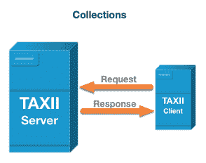
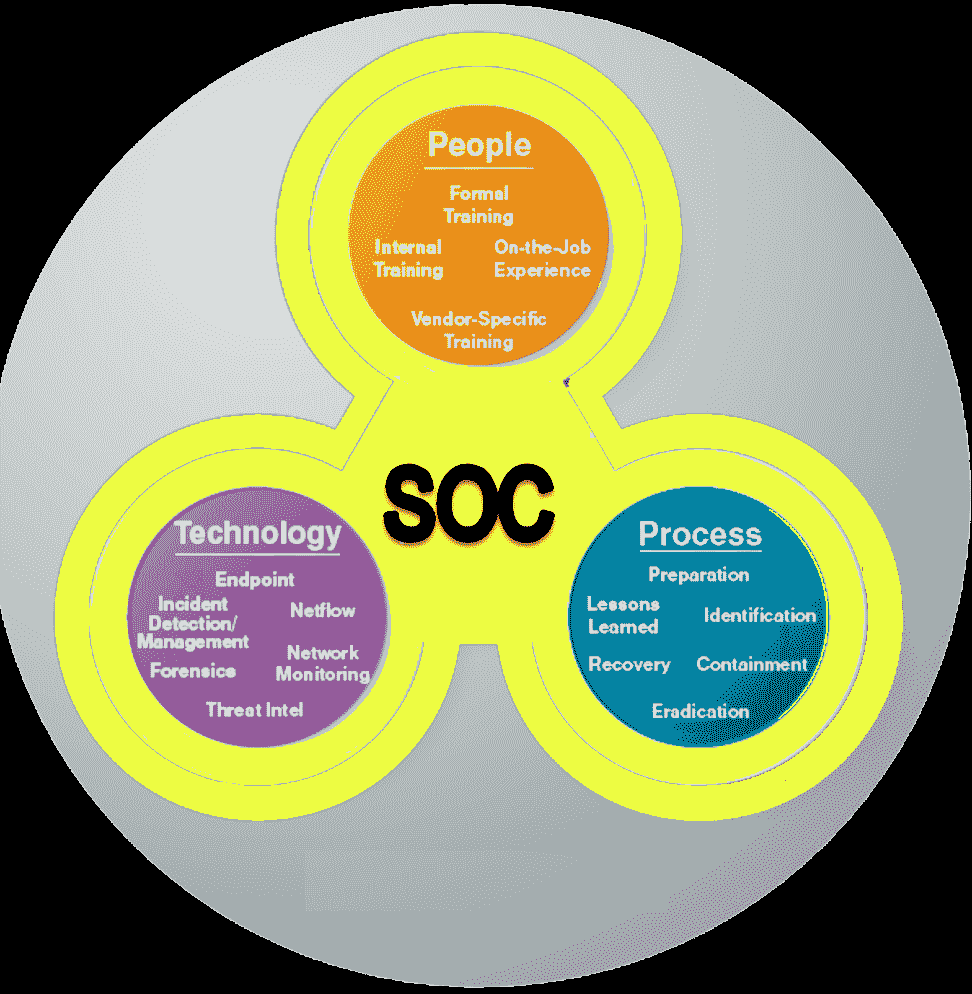
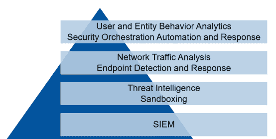

# 第十章：安全情报资源

网络安全现在是一个流行词。虽然它可能被认为是一项高阶的、技术性强且复杂的任务，但实际上，它只是一些每个组织中的每个人都可以采取的预防措施，以保持安全。确保所有人员、设备、网络和系统安全并非 IT 部门的唯一责任。大多数攻击甚至不是直接针对网络、设备或系统的攻击。人类是网络安全链中的最弱环节，采取一些额外的安全预防措施可以保护公司免受损失。本章将提供一些组织中的用户可以利用的资源，帮助他们实现这一目标。这将对所有类型的用户（无论是技术人员还是非技术人员）都有帮助。它将告知普通非技术用户应该采取哪些安全预防措施，以避免暴露于安全威胁。同时，它也为技术 IT 用户提供了一个参考点，检查他们组织的安全性，或者学习他们需要实施的解决方案，以为用户和组织拥有的数字资产提供更多的安全保障。

本章将讨论以下主题：

+   清单资源

+   网络安全建议和可靠的信息来源

+   网络安全课程

+   网络安全威胁情报资源

# 清单资源

网络安全清单网站旨在为用户提供一个快速的概览，帮助他们检查是否暴露于威胁中。它们还引导用户采取进一步的步骤来保护自己。本章已确定以下综合清单资源。

# 安全清单

安全清单 ([`securitycheckli.st/`](https://securitycheckli.st/)) 是一个在线平台，所有用户都可以参考，它提供了一个全面的清单，列出了减少遭受攻击风险所需做的所有事项。该平台专注于保护隐私，防止暴露于恶意软件和钓鱼攻击。安全清单包含以下项目：

+   **密码管理器**：为你所拥有的所有服务创建独特密码是一个大问题。大多数用户会重复使用相同的密码，这使他们暴露于更多的威胁中；一旦一个账户被入侵，黑客就能访问你的其他账户。许多涉及凭证盗窃的攻击已导致这些文件在黑市上出售。买家会尝试使用这些凭证访问与用户名相关联的其他账户。这个网站提供了多个密码管理器选项，用户可以在 Windows、macOS、iOS、Android 和 Linux 上下载并安装。它还提供了关于密码管理器的阅读资源，帮助用户了解它们的功能。

+   **创建强密码**：清单中的下一项是使用强密码。本网站提供了有关密码最小长度和组成的指南。它还告诉用户在旅行时禁用 TouchID 和 FaceID。它引导用户访问几个网站，详细了解密码是如何被破解的，如何在 iOS 和 Android 上更改密码，以及如何禁用 TouchID 和 FaceID。

+   **双因素认证 (2FA)**：列表中的第三项是双因素认证 (2FA)，其重点是在常规登录凭据上添加另一层安全性。简要讨论了 2FA，并给出了设置指南。

+   **加密**：清单中以加密作为一种安全技术，帮助您保持安全。简要讨论了加密，资源解释了如果有小偷偷走了您的计算机或手机，加密可以防止数据被读取。提供了可以用来学习如何加密 iOS、Android、Windows 和 macOS 设备的资源链接。

+   **冻结信用记录**：由于许多安全漏洞导致数十亿用户的数据丢失，包括各种公司，该网站提醒您应该假设黑客已经知道您的社保号、信用报告和其他个人详细信息。为了防止黑客使用这些信息开立新的信用额度，该网站鼓励用户（在美国）在所有信用局上启用信用报告查询冻结。

+   **将 DNS 更改为 1.1.1.1**：许多用户并不知道，他们在互联网上访问的大部分内容都是通过 DNS 提供支持的，DNS 的作用是将域名转换为 IP 地址。但是，DNS 非常不安全，已经确认服务提供商会记录并出售通过其传输的数据。您可以切换到专注于安全和隐私的 DNS 工具。Cloudflare 提供了 1.1.1.1 DNS 地址，仍然提供域名解析，但比服务提供商提供的普通 DNS 更快、更安全。该网站提供了有关切换到安全 DNS 的更多信息的链接。

+   **VPN**：互联网连接并非始终安全，容易受到中间人攻击。此外，协议分析器（如 Ethereal 或 Wireshark）可用于捕获网络中流动的流量并识别正在访问的站点。VPN 解决了这个问题，提供了加密的安全互联网连接，使您发送或接收的所有数据都无法被窥探网络的人读取。该资源提供了六个值得信赖的 VPN 提供商：IVPN、Encrypt.me、ExpressVPN、NordVPN、ProtonVPN 和 Private Internet Access。这些大多数在所有操作系统上都可用。

+   **摄像头保护盖和隐私屏幕**：有些网站包含恶意脚本，能够在未经授权的情况下开启你的摄像头并拍照或录视频。也有可能关闭摄像头正在工作的指示灯。此外，在公共场所上网还会暴露你面临旁窥风险，即恶意人士通过观察你输入的信息，窃取敏感数据。该网站提出了两种解决方案：摄像头保护盖和笔记本隐私屏幕。摄像头保护盖能够阻止黑客在劫持摄像头时看到任何内容，而隐私屏幕则是一个过滤器，能够阻挡超过 60 度角度之外的屏幕视线。

+   **隐私优先的电子邮件、浏览器和搜索引擎**：该网站警告说，许多服务提供商会追踪和指纹识别设备，以进行广告投放。他们提供了以下替代方案：

    +   **浏览器**：Brave、Safari 和 Firefox

    +   **搜索引擎**：[duckduckgo.com](https://duckduckgo.com/)

    +   **电子邮件提供商**：ProtonMail、FastMail 和 Tutanota

+   **审查应用权限**：有越来越多的应用请求过多的权限，访问那些与其主要功能无关的敏感数据。其他应用则被授予权限，允许它们作为间谍工具运行。最常被滥用的权限包括位置、麦克风、摄像头、联系人和消息。除了应用程序，某些服务也会请求访问社交媒体账户，但获取的数据与它们提供的功能无关。例如，一个 Twitter 粉丝数服务可能会获得读取你收件箱消息的权限。部分安全检查清单提醒用户撤销应用和服务的过度权限。清单提供了资源，指导 Android、iOS、Windows 和 macOS 用户管理他们授予应用的权限。此外，清单还提供了可以选择退出访问社交媒体账户数据的服务的资源。

+   **社交媒体隐私设置**：在社交媒体网络上，可以轻松获取大量个人信息。黑客通常会通过侦察，收集尽可能多的信息来对特定目标发起攻击。社交媒体平台充斥着过多的个人信息，如出生日期、住址和家庭成员姓名等。社交媒体平台通常有隐私控制选项，但大多数用户要么忽略它们，要么根本不去查看。

+   **安全检查清单**：提供了一些资源，解释如何更改不同社交媒体平台上的多个隐私设置。

+   **关于钓鱼攻击的教育**：黑客并不仅仅依靠利用漏洞工具和高级软件来入侵账户。有时，他们只是通过虚假借口请求用户的访问权限。许多钓鱼攻击是通过电子邮件进行的，用户被诱骗与自称来自合法公司的人员分享敏感凭证。在许多情况下，受害者会收到恶意链接，这些链接是一些常用网站登录页面的完全复制品。一旦用户输入了他们的详细信息，黑客就会使用这些信息在正确的网站上进行操作，盗取资金或数据。

+   **保持设备更新**：清单中的最后一项提醒用户，必须保持软件和应用程序的最新版本。虽然了解应用程序或计算机是否有更新可能很容易，但对于其他设备，如路由器，更新是否可用就不那么明显了。此外，用户并不总是会在更新发布时主动安装补丁。该清单提供了链接，指向权威网站，解释了用户为何、何时以及如何安装更新。

# 网络安全建议和可靠的信息来源

网络安全情报的另一个重要类别是获取有关新攻击的可信警报，以及如何防范成为网络犯罪分子的受害者的建议。以下是提供这些信息的一些网站：

+   **Krebs on Security** ([`krebsonsecurity.com/`](https://krebsonsecurity.com/))：提供有关网络安全新闻和网络犯罪及相关事件的调查详细信息。该网站提供大量关于网络安全领域发生事件的更新信息。例如，在写这篇文章时，网站的热门帖子解释了谷歌如何在 2017 年停止所有针对员工的钓鱼攻击。正如帖子中详细说明的那样，谷歌通过淘汰密码，而是为员工提供了物理安全密钥和一次性访问码来解决这个问题。该帖子的相关性在于，谷歌计划通过允许 Android 手机作为物理安全密钥来将这一解决方案公开。然而，实施仅限于谷歌关联的服务。另一个相关的帖子是关于一家意大利公司在发生数据泄露事件两年后才承认其遭到黑客入侵。此次入侵涉及超过 200 万个客户的个人数据被盗。被入侵的公司 Buca di Beppo 在两年内淡化了这些指控。然而，该公司后来承认自己确实遭到黑客攻击。遗憾的是，客户的数据已经在黑市上被发布并售卖。

该网站适合那些想要阅读最新网络安全新闻，并了解公司发布的新安全工具的人。所有帖子都经过彻底的研究和信息采集。网络安全专家可以利用这些信息进一步保护他们的组织，而普通用户则可以了解更多关于网络犯罪的动态以及采取适当网络安全措施的重要性。

+   **Naked Security** ([`nakedsecurity.sophos.com`](https://nakedsecurity.sophos.com/2019/04/14/can-you-detect-hidden-cameras-in-hotel-rooms-video/))：该网站由领先的网络安全公司 Sophos 拥有，Sophos 提供多种安全产品和服务。该网站提供详细的网络安全新闻，重点告知读者有关新网络安全工具的信息以及如何实现这些工具。它还提醒用户关于新出现的网络犯罪事件，以及如何防止自己成为受害者。在撰写本文时，最新的帖子详细介绍了酒店房间内间谍摄像头的隐私侵犯技术。帖子解释了如何在酒店中发现间谍摄像头，以及如何扫描酒店网络以查找间谍摄像头。间谍设备的名称通常与普通设备不同。帖子表示，利用可疑设备的 IP 地址，可以扫描开放端口，检查是否有**rtsp**（**实时流媒体协议**）或**rtmp**（**实时消息协议**）服务在运行。然而，作者提醒读者，单靠这一方法并不足以可靠地发现网络中的间谍摄像头。该网站内容非常详细，用户可以从每一篇帖子中学到新的网络安全知识。

+   **Dark reading** ([`www.darkreading.com`](https://www.darkreading.com/))：这是一个面向技术读者的新闻与咨询网站。该网站发布与网络安全相关的故事，告知读者在实施网络安全解决方案时应具备的技能或应该关注的趋势。在撰写本文时，网站的一个热门帖子详细介绍了网络安全专家应具备的基本技能。帖子通常内容详尽，但分为多个页面。不过，该网站为网络安全的初学者和专家提供了有价值的建议，是一个宝贵的信息资源。

# 网络安全课程

由于网络犯罪的动态变化，网络安全专业人员或有志于从事此职业的人必须跟上市场上所需的技能。此外，他们还必须拓宽知识面，熟悉多种威胁和安全解决方案。现在有一些网站为那些愿意深入学习网络安全的人提供免费培训，我们将一一介绍。

# SlashNext

这个网络安全情报资源专注于今天组织面临的最大挑战之一：网络钓鱼。即使公司投入大量金钱和其他资源建立了多层安全防护，仍然会通过员工的疏忽被网络犯罪分子攻破。网络钓鱼已经成为一种噩梦，并且已经导致了许多受害者。

例如，攻击雅虎导致其 20 亿用户敏感信息被窃取的事件，就被归因于网络钓鱼。许多其他公司也成为了网络钓鱼攻击的受害者，员工仅仅是交出了登录凭据、汇款或点击了恶意链接，导致他们的设备被感染。SlashNext 表示，网络钓鱼可以通过电子邮件、网络上的免费软件、浏览器插件、在线聊天论坛、社交媒体、消息和浏览器中的弹窗发起。在与目标进行初步接触后，黑客会使用一切可用的技术来赢得信任，从而攻击目标。SlashNext 提供了一场 30 分钟的信息性网络研讨会，介绍了新型网络钓鱼攻击、现有解决方案为何无法应对这一威胁，以及组织如何利用实时威胁情报在员工受到攻击之前阻止网络钓鱼尝试。

# Springboard

Springboard 提供了一门网络安全基础课程，旨在帮助那些希望复习或开始学习网络安全的人。学习者将接受一个 38 小时的培训课程，课程分为九个模块。通过这门课程，你将获得网络安全的基础理解，并可以通过专注于某些领域进一步发展你的技能。

# Cybrary

自 2015 年以来，Cybrary 一直提供免费的网络安全培训。培训分为多个课程，你可以将其视为微学位。该网站的优势在于为学习者提供工具包、实训实验室和实际测试。它非常适合网络安全领域的初学者、中级者和专家。

# 美国国土安全部

这是一个相当值得注意的免费培训资源补充。美国是网络攻击的首要目标，而大多数美国公民对网络安全的基本知识并不知晓。该网站向所有渴望了解更多关于网络犯罪和网络安全的人提供免费培训。由于针对美国公司的许多攻击是工业间谍行为，因此该部门培训网站提供的课程聚焦于工业环境。该课程是为网络安全初学者设计的，但专家也可以通过它专注于防止对工业系统的威胁。学员完成课程后将获得认证。

还有许多其他网站提供网络安全培训。然而，许多免费的学院并未提供优质的教学材料，也没有颁发认证证书。这里列出的三个网站提供认证证书，并且它们都有高质量的信息。因此，它们是无价的网络安全情报来源。

# 网络安全威胁情报资源

到现在为止，你已经阅读并学习了如何提升自己在网络安全方面的能力。现在让我们探讨各种威胁情报资源，以进一步扩展我们的知识库。本节将带你了解**结构化威胁信息表达**（**STIX**）、**可信自动化情报交换**（**TAXII**）、**Oasis 开放命令与控制**（**OpenC2**）、**交通信号灯协议**（**TLP**）和**MITRE 的网络分析库**（**CAR**）。掌握上述资源的知识后，你将更好地识别威胁和漏洞。

# 结构化威胁信息表达（STIX）

结构化威胁信息表达，通常称为 STIX，是一种用于交换与网络攻击相关的威胁情报的特殊语言格式。STIX 是开源的，任何人都可以免费使用。STIX 使我们能够从任何角度共享威胁情报，如怀疑或妥协的信息（IoC）。它还允许我们通过对象和它们之间的详细关系清晰地表示威胁信息。STIX 通常以 JSON 格式共享，但也可以以可视化的方式呈现，供任何分析师利用这些信息。共享的信息可以轻松与安全分析工具集成。STIX 有 12 个领域对象，用来定义威胁元素（更多信息可以在[`oasis-open.github.io/cti-documentation/stix/intro`](https://oasis-open.github.io/cti-documentation/stix/intro)找到）：

+   **攻击模式**：允许我们描述威胁行为者如何通过提供关于**战术、技术和程序**（**TTP**）的信息来试图妥协任何目标。

+   **攻击活动**：描述在一段时间内，针对特定目标群体的特定恶意活动和攻击行为的分组。

+   **行动方案**：定义为了防止或应对攻击需要采取的措施。

+   **身份**：该对象有助于定义个人、组织或团体，以及个人、组织或团体的类别。

+   **指标**：它可以包含一个威胁信息的模式，用于检测可疑或恶意的网络活动。

+   **入侵集合**：描述攻击者或对手行为和资源的组合，通常认为这些行为由某个单一的威胁行为者进行协调。

+   **恶意软件**：有关恶意代码和恶意软件的信息，这些恶意软件可用于危害受害者数据或系统的机密性、完整性或可用性。

+   **观察数据**：包含在系统或网络中观察到的信息（例如，源 IP 地址或目的 IP 地址）。

+   **报告**：此对象可能包含与威胁行为者、恶意软件、攻击技术或上下文数据描述相关的威胁信息。

+   **威胁行为者**：此对象可以包含关于任何被认为有恶意意图的个人、团体或组织的信息。

+   **工具**：有关软件包的任何信息，这些软件包可被对手用于执行攻击。

+   **漏洞**：软件中的漏洞或错误信息，黑客可以直接利用它来危害系统或网络。

这是 STIX 的示例 JSON 结构：

```
{
"type": "<any ond the 12 objects>",
"id": "object--xxxxxxxx-xxxx-xxxx-xxxx-xxxxxxxxxxxx",
"created": "yyyy-mm-ddThh:mm:00.000Z",
"name": "<Attacker group name and target>",
"description": "<Description of the campagin can be given here>"
}
```

# 可信自动化情报交换（TAXII）

**可信自动化指标信息交换**（**TAXII**）是一种标准的消息交换方式，提供不同组织和产品/服务边界之间可操作的网络威胁信息共享机制。TAXII 定义了概念、协议和消息交换，用于交换网络威胁信息，帮助检测、预防和减轻网络威胁。广义上讲，TAXII 覆盖了两种主要的共享模型服务：

+   **集合**：这是一个接口，用于访问由**TAXII 服务器**提供的**网络威胁情报**（**CTI**）对象库，进一步允许生产者托管一组 CTI 数据，TAXII 客户端和服务器可以请求这些数据，以请求-响应模型交换信息（更多信息请参考[`oasis-open.github.io/cti-documentation/taxii/intro`](https://oasis-open.github.io/cti-documentation/taxii/intro)），如下所示：



+   **通道**：由 TAXII 服务器维护。通道允许 CTI 生产者将数据推送到多个消费者，并允许消费者从多个生产者接收数据。TAXII 客户端通常会与其他 TAXII 客户端以发布-订阅模型交换信息，如下所示：



# OASIS 开放指挥与控制（OpenC2）

OASIS **开放指挥与控制**（**OpenC2**）是一个技术委员会，致力于生成由 OpenC2 社区论坛产生的成果。OpenC2 技术委员会的任务是起草文档、规范或其他成果，以行业标准的方式支持网络安全指挥与控制的需求。该技术委员会还在很大程度上利用现有的标准，并实际识别与提供或支持网络防御技术的指挥与控制相关的空白 ([`www.oasis-open.org`](https://www.oasis-open.org))。

# 流量灯协议（TLP）

**交通灯协议**（**TLP**）的创建是为了促进信息共享。TLP 是一套设计标识符，用于确保敏感信息与适当的受众共享。它使用四种颜色来指示接收方应采取的共享边界，以及根据接收方需要应用的不同敏感性和相应的共享考虑。TLP 只有四种颜色；任何不在此标准中的标识符都不被 FIRST 视为有效。

TLP 是一种简单直观的模式，用于指示何时以及如何共享某些敏感信息，以便进行更高效、重复性的协作，但另一方面，TLP 不应被视为 *“控制标记”* 或分类。TLP 优化了易于采用、易于理解、点对点共享的信息传递方式；它也可以在自动化共享中使用。共享威胁信息的来源方负责确保接收方完全理解 TLP 信息共享的指导方针。如果接收方希望进一步共享该信息，他们必须获得信息所有者的明确许可。以下是可以用于标记信息的 TLP 定义（详细用法请访问 [`www.us-cert.gov/tlp`](https://www.us-cert.gov/tlp)）：



# MITRE 的网络分析库（CAR）

**网络分析库**（**CAR**）是一个基于 **对手战术、技术和常见知识**（**ATT&CK**）威胁模型分析的库，该模型由 MITRE 开发。存储在 CAR 中的分析信息包括诸如主题分析思路的解释、主要领域信息（例如，主机、网络、进程、外部）、与 ATT&CK（[`attack.mitre.org/`](https://attack.mitre.org/) ）技术相关的参考资料，以及可以用于实现和测试分析的伪代码和单元测试。你可以在 [`car.mitre.org/`](https://car.mitre.org/) 查找更多详细信息，供进一步研究和阅读。

# ENISA 的 IntelMQ

IntelMQ 是一个为任何 CERT、CSIRT 或其他安全团队提供的平台。这个平台是 ENISA、CNCS（葡萄牙国家网络安全中心）、CERT.AT、CERT-EU 和 CERT.BE 的事故处理自动化项目发起的社区驱动的倡议，旨在通过利用消息队列协议来收集和处理安全数据流。IntelMQ 专注于减少系统管理的复杂性，为新的数据流编写新模块，使用 JSON 共享的通用格式，集成常见的现有工具，提供将信息存储在流行日志收集器（如 Elasticsearch 和 Splunk）中的灵活性。该平台还提供灵活性，可以为自己的使用创建自定义黑名单，并通过 HTTP RESTFUL API 共享威胁情报。有关其使用的完整详情和实现指南，请访问[`github.com/certtools/intelmq`](https://github.com/certtools/intelmq)。

# Recorded Future

Recorded Future ([`www.recordedfuture.com/`](https://www.recordedfuture.com/)) 是一款基于 SaaS 的高级产品。该平台将来自开源、暗网和其他技术来源的威胁情报的自动收集与分析整合到一个单一解决方案中。Recorded Future 使用先进的技术，如**自然语言处理**（**NLP**）和机器学习，来实时处理、丰富并提供威胁情报。该平台能够将威胁情报情境化，提供主动的威胁信息，以帮助制定安全策略。通过机器学习处理和分析大量威胁情报数据的能力，帮助分析师缩短得出结论的时间。你可以通过他们的基于 Web 的平台访问 Recorded Future 的威胁情报数据，该平台还可以与多种网络安全解决方案集成。它将帮助你广泛了解你所处的威胁环境，并丰富安全团队的警报。Recorded Future 还提供与多个深度分析产品、事件响应工具、情报平台、网络检测产品、SIEM、SOAR、威胁狩猎、漏洞管理工具和工单系统的集成。

# Anomali STAXX

Anomali STAXX ([`www.anomali.com/community/staxx`](https://eur02.safelinks.protection.outlook.com/?url=https%3A%2F%2Fwww.anomali.com%2Fcommunity%2Fstaxx&data=02%7C01%7C%7C7b02870ce90d42eb469c08d69d57135f%7C84df9e7fe9f640afb435aaaaaaaaaaaa%7C1%7C0%7C636869394636072060&sdata=MlvuuyJEZ1bCwFJm7ojkiFDnZSXbiMocR%2B0ynZfujX0%3D&reserved=0)) 是一款通过连接到 STIX/TAXII 服务器分享威胁情报的工具；它让你能够根据具体需求搜索和配置自己的威胁数据源。它还允许你将威胁情报数据导入 Anomali STAXX，然后将选定的情报数据上传到其他 STIX/TAXII 服务器。该平台提供了一个非常简单和互动的界面，可以快速浏览与威胁相关的信息。Anomali 平台帮助你收集来自 OSINT 和 ISACs 的威胁情报。

由于从多个来源收集的威胁情报量庞大，STAXX 平台为分析师提供了一个标准化且丰富的威胁背景，供安全操作和事件响应使用。该工具还通过应用自己的评分方法来帮助识别对你的组织最具威胁的情报，并为你提供该威胁的历史背景。Anomali STAXX 具备与现有 SIEM 和 EDR 解决方案的出色整合能力，帮助你进行安全操作。

# 网络威胁情报流

正如你现在所知道的，网络威胁情报侧重于提供关于对手的可操作信息，以建立适当的网络防御来应对攻击。

知道正确的资源将帮助你加速研究，并获得行业内的正确建议。以下是这些资源（按字母顺序排列）：

+   [AlienVault.com](https://www.alienvault.com/): 来自多个来源的情报，包括大型蜜罐网络，能对对手进行分析。

+   **Cyveilance.com**: 提供关于威胁行为者和犯罪意图指示的独特情报流。

+   [EmergingThreats.net](https://www.proofpoint.com/us): 提供多种情报源。

+   [FireEye.com](https://www.fireeye.com/): **动态威胁情报** (**DTI**) 服务。

+   **[Hacksurfer.com](https://hacksurfer.com/)** (**SurfWatch**)：为你的业务量身定制的洞察。

+   [InternetIdentity.com](https://www.infoblox.com/): 来自其大数据解决方案 ActiveTrust 的威胁数据流。

+   [RecordedFuture.com](https://www.recordedfuture.com/): 来自网络的实时威胁情报。

+   **通过智能安全图进行高级安全防护** ([`www.microsoft.com/en-us/security/operations/intelligence`](https://www.microsoft.com/en-us/security/operations/intelligence)): 通过先进的分析技术将大量的威胁情报和安全数据关联起来，为你提供无与伦比的威胁防护和检测。

+   [Secureworks.com](https://www.secureworks.com/): 提供情报流并对网络进行监控。

+   [Symantec.com](https://www.symantec.com/): DeepInsight 提供关于多种话题的情报，包括声誉。

+   **Spytales.com**：关于间谍的过去、现在和未来的一切知识。

+   [Team-Cymru.com](http://www.team-cymru.com/)：威胁情报以及 bogon 列表。

+   **TheCyberThreat**：我们的 Twitter 账号，内容高层次但全面且经过精心策划。

+   [ThingsCyber.com](http://thingscyber.com/)：关于网络冲突和网络安全的最关键课程，与你今天的防御息息相关。

+   [ThreatConnect.com](https://threatconnect.com/)：由 Cyber Squared 创建，专注于信息共享。

+   [ThreatGrid.com](https://www.cisco.com/c/en/us/products/security/threat-grid/index.html)：统一的恶意软件分析工具，现在是思科的一部分。

+   **ThreatIntelligenceReview.com**：定期更新的威胁情报来源评审。

+   [ThreatSTOP.com](https://threatstop.com/)：通过 IP 声誉屏蔽僵尸网络。

+   [ThreatStream.com](https://www.anomali.com/)：著名团队，多个来源的互操作平台。

+   [ThreatTrack.com](https://www.threattrack.com/)：恶意网址、IP 和与恶意软件/钓鱼攻击相关的数据流。

+   [Verisigninc.com](https://www.verisign.com/?inc=verisigninc.com)：iDefense 提供的信息源，受到一些关键机构的高度评价。

# 摘要

本章重点介绍了安全情报的宝贵资源。我们研究了三大类资源：安全检查清单、新闻或咨询网站以及网络安全培训网站。所讨论的安全检查清单内容全面，带领用户从 A 到 Z 完整地走过安全防护过程，旨在确保用户及其设备免受黑客、间谍、诈骗和隐私侵犯的威胁。该检查清单已明确指出用户需要拥有的安全工具，以确保设备的安全。它还强调了用户在社交媒体上暴露个人信息时应采取的一些安全措施。本章还介绍了值得信赖的新闻来源，这些来源同时充当网络安全顾问。所评审的网站提供了关于网络安全事件的深入研究信息，详细分析了事件发生的原因及其防止措施。例如，某网站介绍了酒店房间中存在间谍摄像头的隐私问题，并解释了一种相对简单的方式，技术精通的人可以通过网络和端口扫描追踪这些间谍摄像头。最后，本章介绍了网络安全培训资源，并重点介绍了四个资源，第一个提供钓鱼攻击的培训，其他则提供更广泛的课程并附有证书。所有讨论的资源对于任何有意从事网络安全工作的人，或为了自我保护免受攻击的人来说，都是无价的。

# 进一步阅读

查阅以下资源，获取有关本章所涵盖主题的更多信息：

+   [`slashnext.com/`](http://slashnext.com/)

+   [`www.nativeintelligence.com/resources/links`](https://www.nativeintelligence.com/resources/links)

+   [`www.intelligence101.com/99-of-the-best-intelligence-resources-some-youve-probably-never-heard-of/`](http://www.intelligence101.com/99-of-the-best-intelligence-resources-some-youve-probably-never-heard-of/)

+   [`www.microsoft.com/zh-cn/security/operations/security-intelligence-report`](https://www.microsoft.com/zh-cn/security/operations/security-intelligence-report)

+   [`www.liferaftinc.com/resources/`](https://www.liferaftinc.com/resources/)
