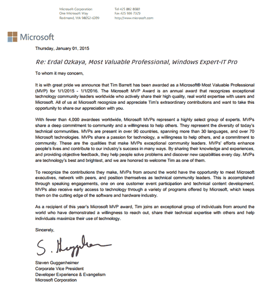
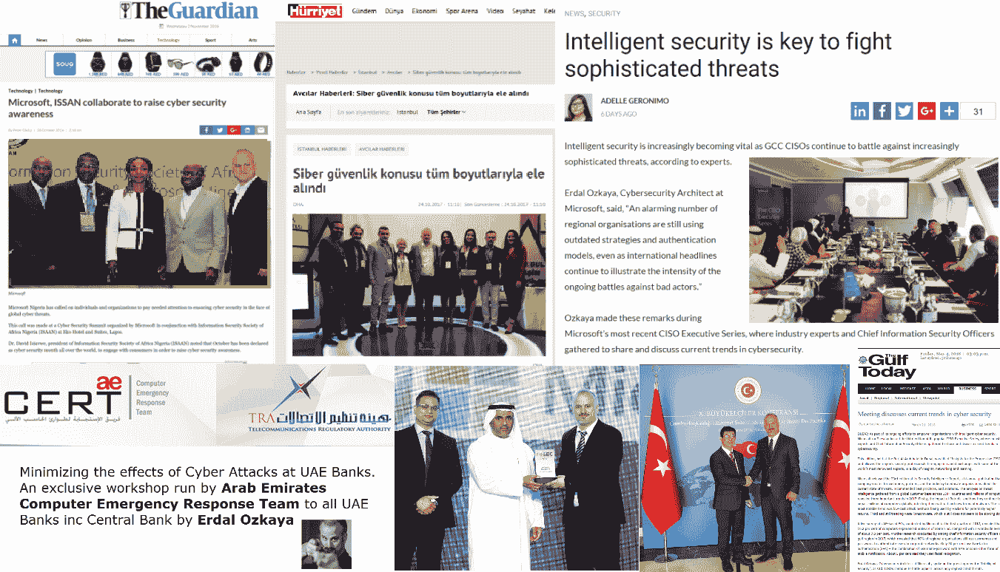

# 第十一章：关于如何开始网络安全的专家意见

为了让这本书更具价值，并帮助你在网络安全的旅程中脱颖而出，我联系了一些行业专家，询问他们是如何开始自己的网络安全职业生涯的，并向他们请教，能给你什么建议，帮助你提升自己。

我与来自微软、渣打银行、SAP、FireEye 等财富 500 强公司的行业专家，以及来自牛津大学、查尔斯·斯图尔特大学的专家、退役军人、现役网络安全顾问、架构师、招聘经理、黑帽大会及其他顶级安全会议的演讲者、网络安全公司老板和执法专业人士进行了交流。希望本章内容能对你的职业生涯有所帮助。

# 安·约翰逊

微软公司副总裁

“我们的团队必须与我们要解决的问题一样多样化。”

上述陈述不是空洞的口号，也不应被轻视或过度炒作。我们正面临一场网络犯罪的斗争，它影响着我们生活的各个方面，包括政府、金融系统、粮食供应、水资源供应、关键基础设施和医疗保健。近年来发生的大规模网络事件威胁着我们的生活方式。因此，问题变成了，我们是如何走到今天的？更重要的是，我们从这里该如何前进？作为一名候选人，你能做些什么来追求网络安全的职业？

为了说明这一点，让我带你回顾一下我的个人职业历程。我大学毕业时主修政治学和传播学，并有志于上法学院。我被法学院录取并获得了学费和费用的奖学金，但我由于本科时的经济负担，且对食物、住房、医疗等方面感到担忧，最终决定放弃法学院，选择追求一份职业。1980 年代末，北犹他州对没有直接应用专业（如会计或医学）学位的毕业生而言，工作机会十分稀缺，我最终搬到了洛杉矶地区。我曾在一家医疗公司做过一段时间的行政助理，随后找到了我在科技领域的真正兴趣。

我的职业起点来自一则报纸广告，广告内容是招聘一名地面销售员，年薪为 17,000 美元。我对计算机略知一二——能使用计算机——而且我知道自己能与人沟通，因此我的职业生涯由此开始。我参加了所有可用的供应商培训，并且在学习和发展我的技能方面非常勤奋。我很幸运有两位早期的职业导师，他们鼓励我的成功，并教会我他们所知道的一切。我承担了与运营、销售、网络架构与安装、计算机维修、存储、合作伙伴关系、客户关系等相关的任务。我学到了很多，吸收了所有能学到的东西。当时，大型主机和小型计算机主导了行业，个人计算机和客户端-服务器系统开始崭露头角。存储系统是庞大的近线设备，首席信息官最关心的是数据中心中的一条恶意电话线。正式的 CISO 职位很少，安全人员通常分为两类：调查员和网络专业人员。我有些偶然地进入了安全领域，但这其实是有计划的。

1999 年，我在芝加哥担任 Data General 的医疗保健专家。Data General 被 EMC 公司收购。我在收购后探索了自己的选择，并决定做出改变。这一改变的灵感来自于我携带的硬件令牌用于身份验证。我对这项技术感到非常着迷，因此我开始关注一家公司——RSA Security，并最终被聘为 PKI 专家。我不仅需要查找这个术语的定义，还需要学习并理解 PKI，这我做到了。于是，在 2000 年，一个新的职业生涯开始了——我依然在技术领域，但转向了一个高度专业化但非常初创的领域——网络安全（当时称为信息安全）。到那时，CISO 职位已经存在——在一些大型组织中——而双因素认证（2FA）仅被大约 20%的企业员工使用（是的，就只有这么多）。

自 2000 年以来，我再次致力于自学、学习和成长——深入理解网络安全的基础技术以及威胁行为者的方法、模式和动机。我还认识到，网络安全岗位的人实在太少了。我们曾经开玩笑说，大约在 2000 年，人们在年度咖啡预算上的开支比 IT 安全预算还要多。如果他们有防火墙、路由器、杀毒软件，并且高价值用户使用了双因素认证，就认为一切都已覆盖，对于大多数组织来说，这就足够了。他们没有为随时随地连接设备的快速增长、与传统服务器一样强大的移动设备的爆发、基于云的技术、国家资助的威胁行为者的爆发，或者恶意软件和网络犯罪作为一个行业的爆发做好准备或足够的预算。大学和学院在提供网络安全课程上有所延迟，依赖许多基于网络的课程来覆盖这一主题。网络安全专业人员大多来自网络或调查背景，而整个行业正因过多的离散工具和过多的单一解决方案而陷入崩溃。

按任何标准，目前全球约有 100 万个空缺的网络安全岗位，所有岗位的要求几乎都类似于*“必须有 10 年经验，STEM 学位....”*。作为一个行业，我们正在成为自我实现的预言。我们声称想要多样化的背景和技能，并且有太多职位空缺；我们想要减少复杂性，但我们继续招聘相同的职位档案，抱怨人才的匮乏，并选择一个单一解决方案加入我们不断扩展的解决方案清单，因为它能解决一个特定的问题。

这种群体思维，作为一种行业，限制了我们在招聘多样化人才和部署解决问题所需的解决方案与技术的选择。例如，研究表明，多样化的团队在 78%的情况下能够做出更好、更快速的决策。然而，出于快速填补职位空缺的需要，以及由于急于保护我们的基础设施而缺乏培养下一代网络安全专业人才的根本愿望，我们忽视了这一点。

作为一名自学成才的基础设施专业人士，同时通过供应商和行业培训的沉浸式学习自学网络安全，我强烈支持引入来自各行各业、拥有不同视角的新声音，推动行业的有意义变革，并始终保持领先一步，超越不法分子。此外，我们的工具必须现代化。我们必须充分发挥如机器学习等工具的能力，来应对我们每天所面临的数万亿的威胁。我们还必须与公共组织、私营公司、同行和竞争对手建立合作关系。我们必须像一个社区一样行动；像一个行业一样运作。我们还必须考虑到作为防守者的压力，尤其是在人员短缺的环境中，往往需要工作异常长的时间。

那么，这一切最终会把我们带到哪里呢？它让我们看到一个仍有改进空间的行业。我们拥有工具，拥有技术，拥有可用的人才池，但我们必须有决心。我们必须有冒险的决心；我们必须接受变革是必要的。我们必须有决心雇佣来自不同教育和社会背景的各类人才。我们必须建立一个关爱成员并赋能每个人发挥最佳水平的社区。我们实际上没有选择；网络犯罪已然存在并将持续下去。现在需要的是一个网络安全行业，它作为一个社区，聚集最好的工具、人才和合作伙伴，形成一个强有力的解决方案。我们可以通过从小学到高中各个层级的教育项目投资，通过资助奖学金和为多元化人群提供导师计划的组织投资，通过支持帮助退役军人转型和再培训失业工人的项目来实现这一目标。我们可以通过简化行业术语、降低其威胁感来将网络安全带给更广泛的民众。我们可以广泛地进行指导，且频繁地公开发声，呼吁变革并落实所需的步骤。

鉴于行业发展的需要，作为候选人，你能做些什么？我在这里描述我的经历，是为了鼓励你在整个职业生涯中保持创造性并自我学习。作为候选人，你需要努力以一种方式描述你的技能，使它们能够适应网络安全领域。你是一位经验丰富的教师吗？我们需要学习材料来用更简单的术语解释复杂的概念。你学的是心理学吗？我们需要理解攻击者的动机。你在执法部门工作吗？我们需要完成调查。你是商业分析师吗？我们需要理解海量数据。如果你是程序员、网络工程师或数据库架构师，安全领域为你提供了一个自然的位置——利用你现有的技能并学习新技能。敢于冒险，成为网络安全实现全球企业和政府安全使命变革的一部分。寻找导师并向他们学习。现在就行动，加入一个快速成长、充满激情的行业。

**安·约翰逊是谁？**

作为微软网络安全解决方案集团的企业副总裁，安·约翰逊负责监督微软这一全球最大科技公司之一的网络安全解决方案的市场战略。在这一职责下，她领导并推动微软短期和长期安全解决方案路线图的演变与实施，并确保市场、工程和产品团队的协调一致。

在加入微软之前，她曾担任多家公司的高管领导角色，包括 Boundless Spatial 的首席执行官、漏洞管理先驱 Qualys Inc.的总裁兼首席运营官，以及 EMC 公司旗下 RSA Security 的全球身份与欺诈销售副总裁。

# 埃姆雷·埃伦·科尔克马兹博士

牛津大学

**大众在新技术革命中的角色是什么？**

**人工智能**（**AI**）的快速技术进步即将改变现有的商业模式。公司们开始使用 AI 来帮助管理员工、吸引客户的忠诚度并促进客户的增长，同时增加供应链的透明度。公司们还在利用 AI 来自动化关于员工、客户和供应商的决策过程。

这一过程始于企业利用大数据分析提高供应链的透明度，随后企业通过基于云的系统和人工智能处理全球从成千上万个工作场所收集的大量数据。旨在通过开发人工智能和区块链技术（[`blog.sweetbridge.com/managing-supply-chains-on-the-blockchain-a-primer-1f7dc293e3d9?gi=8bee415e5b5a`](https://blog.sweetbridge.com/managing-supply-chains-on-the-blockchain-a-primer-1f7dc293e3d9?gi=8bee415e5b5a)）来改善供应链可追溯性的努力仍然相当新颖，至今的重点主要局限于确保产品能够从供应链的低层级追溯到超市货架。专注于可持续性的倡议更少（[`deepmind.com/blog/deepmind-ai-reduces-google-data-centre-cooling-bill-40/`](https://deepmind.com/blog/deepmind-ai-reduces-google-data-centre-cooling-bill-40/)），而这些倡议大多集中在环境可持续性方面（[`www.eli.org/vibrant-environment-blog/environmentalism-next-machine-age`](https://www.eli.org/vibrant-environment-blog/environmentalism-next-machine-age)）；到目前为止，人工智能在解决劳动和人权问题方面的潜力几乎没有受到关注。然而，显而易见的是，人工智能将在这些领域产生真正的影响，并将直接影响公司、供应商、工人和客户之间的现有关系。

因此，人工智能可以非常迅速地分析大量数据，并提供可以用于决策的信息总结（[`link.springer.com/article/10.1007/s13347-017-0263-5`](https://link.springer.com/article/10.1007/s13347-017-0263-5)）。然而，在这一背景下，主要的担忧是人工智能分析在多大程度上能够被依赖，以得出不只是简单地再现和合法化现有歧视或不平等的客观判断（[`link.springer.com/article/10.1007/s13347-017-0285-z`](https://link.springer.com/article/10.1007/s13347-017-0285-z)）（[`www.telegraph.co.uk/technology/2017/08/01/algorithms-future-must-not-allow-become-shield-injustice/`](https://www.telegraph.co.uk/technology/2017/08/01/algorithms-future-must-not-allow-become-shield-injustice/)）。这一担忧促使了关于算法问责制和透明度的讨论。人们也开始努力理解如何减轻算法在生活中各个重要领域（例如申请银行贷款或寻求司法公正）可能产生的歧视性和不公正的决定。

**企业的革命？**

企业越来越多地借助数字化专业知识来管理其全球生产，通过实时追踪供应链中的每个动作。企业将人工智能应用于运营能够提供更好的可见性和可预测性；然而，这些努力目前还没有将人权纳入其设计中。

随着涉足人工智能开发的科技公司将全球企业作为他们的客户，他们并不一定关注工人或当地企业的利益和期望。利用人工智能监控生产可能会极大地增强企业在与供应商和工人之间的权力对比，导致雇主可能对工人进行监控。全球工会联合会（UNI Global Union）的“未来工作世界”计划提供了关于伦理人工智能的 10 项原则（[`www.thefutureworldofwork.org/docs/10-principles-for-ethical-artificial-intelligence/`](http://www.thefutureworldofwork.org/docs/10-principles-for-ethical-artificial-intelligence/)），并告知人工智能设计师和公司，工人参与的重要性，旨在保障工人利益并保持工作场所中的权力平衡。

此外，如果算法（基于实时信息，从全球多个国家的数千个工作场所获取信息，重点关注可见性和可追溯性）开始在日益竞争激烈的市场中管理供应商，不同国家和工作场所之间为了提高利润进行的不断比较，可能会加大对价格、交货时间和生产力的压力。这将为这些供应商带来巨大的压力和脆弱性。当地企业（供应商）将把所有这些压力转嫁到工人身上，工人将成为这个过程的真正输家。

目前的主流商业模式是，公司为了保持竞争力，哪怕不惜一切代价降低价格，这导致了供应商（通常位于全球南方）在生产力提升和工资下降的过程中，出现了*“恶性竞争”*。这一模式（[`www.ethicaltrade.org/blog/modern-slavery-and-child-labour-its-all-about-choice`](https://www.ethicaltrade.org/blog/modern-slavery-and-child-labour-its-all-about-choice)）加剧了通过童工劳动对儿童的剥削，催生了现代奴隶制的情况，并削弱了健康和安全条件。

因此，工会和非政府组织采取了许多措施，支持可持续和公平的商业，并增强供应链中的人权尊重。联合国《商业与人权指导原则》（[`www.unglobalcompact.org/library/2`](https://www.unglobalcompact.org/library/2)）推动的人权尽职调查是公司履行尊重人权责任的一项期望。这种方法使所有利益相关者能够合作，以确定在工作场所或行业内损害员工的实际和潜在风险。不同于单方面的决策过程，这种方法注重行动，并呼吁各方进行谈判，以解决和减轻潜在及实际风险所造成的损害。

这些模型为利用人工智能管理与供应商和员工关系的公司提供了重要的教训。如果开发算法和训练机器的科技公司忽视该领域所有的积累经验，它们可能会破坏全球企业、供应商和工人之间现有的关系，并通过向企业提供难以想象的权力来抹去人权。

技术进步的预期结果取决于用户的方式，使用人工智能管理供应链可能产生积极影响。重要的是，企业和公民社会应考虑两个问题：

+   我们如何向机器教授人权和劳动权利？([`www.siia.net/Press/SIIA-Releases-Ethical-Principles-for-Artificial-Intelligence-and-Data-Analytics-with-Support-from-the-Future-of-Privacy-Forum-and-the-Information-Accountability-Foundation.`](http://www.siia.net/Press/SIIA-Releases-Ethical-Principles-for-Artificial-Intelligence-and-Data-Analytics-with-Support-from-the-Future-of-Privacy-Forum-and-the-Information-Accountability-Foundation))

+   供应商和工人/工会如何影响机器学习过程？([`www.thefutureworldofwork.org/docs/10-principles-for-ethical-artificial-intelligence/`](http://www.thefutureworldofwork.org/docs/10-principles-for-ethical-artificial-intelligence/).[)](http://www.thefutureworldofwork.org/docs/10-principles-for-ethical-artificial-intelligence/)

这两个问题的答案将决定“设计即伦理”的内容。如果人工智能能内化有关商业和人权的积累知识，并允许工人和地方企业追踪其决策过程，那么它可能有助于促进劳动权利 ([`www.bsr.org/our-insights/blog-view/remedy-against-the-machine-tech-and-human-rights`](https://www.bsr.org/our-insights/blog-view/remedy-against-the-machine-tech-and-human-rights))。

例如，UNI 全球联盟的一个要求是，工人必须拥有访问、影响、编辑和删除他们在工作过程中收集到的数据的权利。此外，全球工会和企业应当将人工智能的角色纳入合作领域。另外，由全球企业、工会和非政府组织组成的多方利益相关者联盟应当率先推动这一进程，充当人工智能实践的监督者 ([`www.theguardian.com/technology/2017/jan/27/ai-artificial-intelligence-watchdog-needed-to-prevent-discriminatory-automated-decisions`](https://www.theguardian.com/technology/2017/jan/27/ai-artificial-intelligence-watchdog-needed-to-prevent-discriminatory-automated-decisions))。

最近，英国上议院发布的一份报告名为*英国的人工智能：准备好、愿意且有能力？* ([`publications.parliament.uk/pa/ld201719/ldselect/ldai/100/100.pdf`](https://publications.parliament.uk/pa/ld201719/ldselect/ldai/100/100.pdf)，*第二章*，第 58 页) 说明了以下内容：

“公众应当意识到人工智能在何时何地被用来做出关于他们的决策，以及这将对他们个人产生何种影响。”

**政府的情况如何？**

在过去的两年里，许多国家发布了关于人工智能的官方战略（[`policyatmanchester.shorthandstories.com/on_ai_and_robotics/index.html`](https://policyatmanchester.shorthandstories.com/on_ai_and_robotics/index.html)）。这一趋势始于 2016 年美国，随后是英国、德国、法国、欧盟、俄罗斯、日本、中国和阿联酋。

这些官方战略有许多共同的问题（[`assets.publishing.service.gov.uk/government/uploads/system/uploads/attachment_data/file/652097/Growing_the_artificial_intelligence_industry_in_the_UK.pdf`](https://assets.publishing.service.gov.uk/government/uploads/system/uploads/attachment_data/file/652097/Growing_the_artificial_intelligence_industry_in_the_UK.pdf)）。然而，它们也基于各自的比较优势，集中在技术革命的特定方面（[`ec.europa.eu/growth/tools-databases/dem/monitor/sites/default/files/6%252520Overview%252520of%252520current%252520action%252520Grow.pdf`](https://ec.europa.eu/growth/tools-databases/dem/monitor/sites/default/files/6%252520Overview%252520of%252520current%252520action%252520Grow.pdf)）。例如，美国更重视数据驱动的创新；英国则专注于金融部门和健康服务；德国关注制造业，包括智能工厂和自动驾驶汽车（也称为**工业 4.0**）；日本致力于提升机器人技术；阿联酋则处理公共部门的人工智能问题。俄罗斯和中国更注重国内监控和加强军事能力。

这些官方文件的一个共同关注点是*错失良机*的担忧，因为技术进步带来的社会迅速变化可能直接影响全球力量平衡、军事力量、经济财富和社会结构（[`researchbriefings.parliament.uk/ResearchBriefing/Summary/POST-PB-0027`](https://researchbriefings.parliament.uk/ResearchBriefing/Summary/POST-PB-0027)）。

例如，在英国官方战略的审查中（[`assets.publishing.service.gov.uk/government/uploads/system/uploads/attachment_data/file/652097/Growing_the_artificial_intelligence_industry_in_the_UK.pdf`](https://assets.publishing.service.gov.uk/government/uploads/system/uploads/attachment_data/file/652097/Growing_the_artificial_intelligence_industry_in_the_UK.pdf)），Wendy Hall 和 Jérôme Pesenti 从不被其他国家主导的角度定义了这一问题。该解决方案还提出了通过利用新技术革命中的领导地位来主导其他国家的愿望，而这种方法并未包含任何关于人权和劳动权的规定或参考。

因此，所有这些全球大国都专注于它们具有比较优势的领域，以免失去其优势，或允许其他国家在这些领域超越它们——几乎不考虑这些行动对人权的风险。

这些策略的共同特点 ([`royalsociety.org/~/media/policy/projects/data-governance/data-management-governance.pdf`](https://royalsociety.org/~/media/policy/projects/data-governance/data-management-governance.pdf)) 表明国家、产业和学术界之间的紧密合作。例如，各国已承诺未来在人工智能领域投资数十亿美元并开展研究项目，并为全球企业和初创公司提供了大量激励，以吸引它们在本国投资。各国还鼓励大学开设新系部和研究中心，处理技术革命的各个方面，并创造新的博士后和博士职位，以吸引世界顶尖人才。

此外，当局承诺采取必要措施，以使劳动力适应不断变化的条件，提升技能，并为学生制定课程，以帮助他们为劳动市场的剧变做好准备。多方利益相关者的人工智能委员会 ([`assets.publishing.service.gov.uk/government/uploads/system/uploads/attachment_data/file/702810/180425_BEIS_AI_Sector_Deal__4_.pdf`](https://assets.publishing.service.gov.uk/government/uploads/system/uploads/attachment_data/file/702810/180425_BEIS_AI_Sector_Deal__4_.pdf)) 被成立以审计和监督这一过程，并处理利益相关者的日常期望。由于数据对算法的开发和训练至关重要，国家数据中心/信托机构 ([`assets.publishing.service.gov.uk/government/uploads/system/uploads/attachment_data/file/702810/180425_BEIS_AI_Sector_Deal__4_.pdf`](https://assets.publishing.service.gov.uk/government/uploads/system/uploads/attachment_data/file/702810/180425_BEIS_AI_Sector_Deal__4_.pdf)) 正在组建中，以验证并与利益相关者共享数据，并防止竞争国访问和操控这一过程。

这些战略文件最薄弱的一面是未能为社会的不同群体，特别是工人和中小型企业，提出任何明确的应对方式。这些策略包含了一些关于伦理问题的简短章节，但它们通常是抽象的，重复类似的概念，如问责制、透明度和遵守伦理规则。但官方的战略应当超越这些愿望。

与不同利益相关者合作的明确方法至关重要，因为各国政府正在投入数百万美元用于推动人工智能系统，而计划中的行动将通过企业、大学和国家之间的密切合作进行，但没有任何明确的、具有法律约束力的伦理和社会原则。例如，企业要获得政府资金开发人工智能系统，必须满足哪些社会和伦理前提条件以及审查流程？如果没有明确提及访问资金和审计流程的法律要求，诸如*以人为本*和*以工人为友好的技术进步*等术语将仍然是空想。

此外，虽然这些策略触及到人工智能系统促进经济增长和财富的潜力，但并未提到公平的收入分配。这些文件中的一些强调了中小企业将能够访问优质数据，并通过大学的服务和研究成果推动其业务发展，并且将采取必要的措施通过职业支持和技能培训来避免失业，帮助那些从事有风险工作的人员（[`assets.publishing.service.gov.uk/government/uploads/system/uploads/attachment_data/file/702810/180425_BEIS_AI_Sector_Deal__4_.pdf`](https://assets.publishing.service.gov.uk/government/uploads/system/uploads/attachment_data/file/702810/180425_BEIS_AI_Sector_Deal__4_.pdf)）。找到工作以避免失业很重要，但并未提到劳动权益或体面的工作条件。将促进何种类型的就业（[`theconversation.com/automation-robots-and-the-end-of-work-myth-89619`](https://theconversation.com/automation-robots-and-the-end-of-work-myth-89619)）（[`arxiv.org/pdf/1802.07228.pdf`](https://arxiv.org/pdf/1802.07228.pdf)）：短期的、自由职业的、不稳定的工作条件，还是具有生计工资、结社自由和集体谈判权的体面工作条件？

因此，这些关于员工和中小企业的战略文件和指导方针的常见做法可以定义为*等待观察*。显然，技术革命的后果（[`www.brookings.edu/blog/brookings-now/2018/05/23/artificial-intelligence-will-disrupt-the-future-of-work-are-we-ready/`](https://www.brookings.edu/blog/brookings-now/2018/05/23/artificial-intelligence-will-disrupt-the-future-of-work-are-we-ready/))目前无法完全确定甚至无法想象，因此这可能意味着我们只能停留在一些笼统的概念和愿望中。另一方面，政策制定者可以制定出更清晰、更详细的方法。关于零工经济、人工智能伦理（[`www.openglobalrights.org/as-artificial-intelligence-progresses-what-does-real-responsibility-look-like/`](https://www.openglobalrights.org/as-artificial-intelligence-progresses-what-does-real-responsibility-look-like/)）以及有关如何保护人们免受算法在招聘中的歧视性决策（[`www.openglobalrights.org/artificial-intelligence-can-be-a-boon-for-businesses-but-can-it-protect-workers/`](https://www.openglobalrights.org/artificial-intelligence-can-be-a-boon-for-businesses-but-can-it-protect-workers/)）、供应链管理、司法和警察等领域的讨论已经有了大量文献。这不仅是关于未来工作和社会的辩论；它是我们已经在经历的一个过程，因而迫切需要考虑新的和持续的辩论、关切和需求。

这些政府战略阐明了大公司的期望和利益（[`theconversation.com/automation-robots-and-the-end-of-work-myth-89619`](https://theconversation.com/automation-robots-and-the-end-of-work-myth-89619)），并反映了各国的政治、经济和军事战略。然而，人工智能战略不仅应反映现有的竞争、敌对和未来企业及国家的战略。更广泛的社会成员应当有发言权，表达他们希望生活在何种未来，并希望如何从技术革命中受益。

因此，在一场即将彻底改变全球供应链管理的新技术革命的曙光下，我们应当及时展开关于人工智能在工业关系中的角色的讨论。这不仅仅是为了坚守“设计伦理”（[`www.bsr.org/our-insights/blog-view/human-rights-by-design`](https://www.bsr.org/our-insights/blog-view/human-rights-by-design)）这一信条，更是创新的要求。辩论将帮助我们评估并完善现有的做法，如联合国《商业与人权指导原则》所倡导的人权尽职调查，从而使我们能够在这一领域继续取得进展。通过这种方式，所有社会伙伴——包括雇主、工人以及其他相关实体，如非政府组织或国家当局——将有更广阔的合作空间，共同评估和应对工作场所内现有及潜在的员工风险，并采取措施加以缓解。

**Emre Eren Korkmaz 是谁？**

作为牛津大学的一名学者，我的研究和咨询领域涵盖新技术（人工智能和区块链）以及国际发展，重点关注全球供应链中的可持续性与人权尽职调查、企业与人权、现代奴隶制与强迫劳动，以及移民和难民的体面就业。

我曾为多家企业和非政府组织提供咨询服务，并参与过“道德贸易倡议”“商业与人权资源中心”“公平劳穿基金会”“Amfori”和“国际反奴隶制组织”等项目，致力于难民和移民的体面就业（特别是在土耳其服装供应链中，针对全球企业的叙利亚难民问题）以及现代奴隶制问题。

我曾受邀参加多个行业利益相关者和组织的活动，如经济合作与发展组织（OECD）、国际劳工组织（ILO）、欧盟（EU）、BSR 和 Amfori 等，并在这些场合发表过主题演讲和培训。

# 罗宾·赖特

首席架构师，网络安全，微软

**在转行进入网络安全之前，你的职业是什么？**

我的职业生涯始终与某种形式的安全相关，并随着行业的演变而不断发展。我在 IT 安全领域的职业生涯已持续 34 年，这也顺应了我对该领域的自然兴趣和热情。

**请讲讲你从主职到网络安全职业转型的过程。**

我非常幸运，能够从事我充满热情的职业。我从南非空军（**SAAF**）的物理安全电子战开始，随后进入商业 IT 领域，担任了多个职位。我对计算机及其运作的自然兴趣和好奇心始终与安全息息相关，并促使我保持领先，始终走在攻击者之前。

**为什么选择了网络安全作为职业？**

作为一个行业（更具体地说，作为微软公司的一员），我们看到了网络攻击的增加以及趋势的变化。就我个人而言，我有兴趣磨练一项专业技能，并认为网络安全既是商业机会，也是个人投资和成长的领域。

**当你选择网络安全作为职业时，你与同行们做了哪些不同的事情？**

我和同行们的不同之处在于我对安全的兴趣。我一直在不断阅读相关资料，并通过完成 ISC ISSP 认证来扩展我的知识。作为一名企业安全架构师，我将这些学习融入到我的工作中。

**你能分享一下你对那些想加入网络安全行业的人的看法和思考吗？**

网络安全行业对通用技能和专业技能的需求不断增加。如今，所追求的不是某个供应商/产品特定的技能，而是更广泛的理解和知识体系。网络安全的格局不断变化，吸引了那些能够解决问题并将所学应用于新挑战的人。

**在你看来，你过去的职业如何帮助或影响了你在网络安全道路上的发展？**

随着行业的变化，我也在不断进步——我一直都在从事安全和网络安全工作。

**你有什么建议给那些想进入网络安全行业的读者？他们应该如何入门？**

我的建议是建立一个坚实的基础，这样你就能在这个多样化的环境中拓展自己的知识。首先，探索——阅读安全博客，关注行业专家，跟踪供应商特定的网站，然后确定你想要专注的方向。做一些你感兴趣的事情，并激发你的热情，也是至关重要的。

**你认为某人应该成为网络安全某一垂直领域的专家，还是应该在每个领域都成为专家？从行业角度看，你的意见是什么？**

每个人都应该具备一定的共同知识体系。我一直推荐 ISC ISSP 认证。选择一个垂直领域，并采用 T 型方法，随着你职业的进展，T 型的顶部会逐渐变宽，而你在垂直领域/专业（T 型底部）获得更深的知识。

**网络安全的形势变化多端，极为动态，你是如何保持自己与时俱进的？你对我们的读者有什么建议？**

为了保持自己的知识更新，我做了几件事。每天，我会查看不同的博客、Twitter 动态和用户小组。我还订阅了 RSS 源，参加了许多会议和网络研讨会。以下是几个关键链接：

+   [`www.darkreading.com/Default.asp`](https://www.darkreading.com/Default.asp)

+   [`thehackernews.com/`](https://thehackernews.com/)

+   [`azure.microsoft.com/en-us/blog/topics/security/`](https://azure.microsoft.com/en-us/blog/topics/security/)

+   [`www.microsoft.com/en-us/security/operations/security-intelligence-report`](https://www.microsoft.com/en-us/security/operations/security-intelligence-report)

**在您看来，更重要的是拥有安全认证、接受相关安全培训，还是通过工作获得实践经验？**

三者的结合。需要保持平衡。认证能为你带来信誉，但你显然需要通过工作和培训获得的实践经验。你应该通过工具培训来精通自己的领域，并继续发展自己的技能。另一个至关重要的领域是网络情报和威胁的共享。

**我们都同意，网络安全是当今行业中不可谈判的因素。作为行业领导者，您认为未来网络安全将需要在哪些新兴领域得到应用？**

展望未来，有两个关键方面。今天，我们看到许多组织还没有做到基础工作到位，这使得它们成为网络攻击的软目标。其次，组织需要关注安全卫生——现代化 IT 基础设施、特权访问管理与特权身份管理、补丁管理以及减少攻击面。随着未来的到来，我们将看到更多的多渠道攻击，这将变得更加难以防御。我们还将看到 AI 和云安全服务的采用增加，并逐步从外挂安全转向内建安全。传统的安全控制将面临挑战，难以应对基于云的安全和零信任安全的发展。

**Robin Wright 是谁？**

Robin 目前是微软全球服务部门的网络安全首席架构师。他拥有超过 34 年的 IT 安全和网络安全经验，其中 17 年在微软服务部门工作。作为首席架构师，他负责微软服务部门的技术与能力战略，并确保与微软产品组和网络安全解决方案组的对接与一致性。

在担任首席架构师之前，Robin 曾在 5 年间担任 EMEA（欧洲、中东和非洲）及 APJ（亚太区）时区的网络安全全球服务业务实践负责人。他负责建立微软服务在 EMEA 和 APJ 地区的网络安全业务，并为微软企业客户在网络安全领域提供支持。

2000 年，Robin 加入了微软南非服务部门，担任安全顾问。在南非子公司期间，他主要与客户和合作伙伴合作，努力确保他们能够从微软的基础设施和安全解决方案以及技术中获得价值。在加入微软之前，Robin 曾在军队和商业领域担任多个职位，从技术员到公司董事，经历非常丰富。

# Ozan Ucar 和 Dr. Orhan Sari

Keepnet Labs 的创始人兼首席技术专家/内容开发者

**在转行进入网络安全之前，您的职业是什么？请告诉我们您从原职业到网络安全的过渡经历。**

从高中开始，我们就被告知要将网络安全作为职业，但作为学生，我们不知道从哪里开始。我们阅读了许多相关的资料并咨询了一些熟人，收集了关于网络安全职业的信息，还从学校辅导员那里获得了一些标准的建议。然而，在那些年里，发展网络安全职业非常复杂，因为没有很多可信的来源可以获取建议。网络安全领域的缺乏清晰性、指导性以及真正的兴趣依然存在。因此，我们没有立即选择作为网络安全专家开始我们的职业生涯。Ozan 专注于学习数学并获得学术学位，而 Orhan 则走上了成为社会科学教授的道路。然而，我们意识到自己对网络安全有兴趣，并展现出潜力技能。因此，我们调整了自己的方向，决定发展网络安全职业，在此过程中，我们成功地探索、学习并获得了正式的资格认证和学位，最终在网络安全领域获得了职位。

我们选择网络安全作为职业的主要原因，是因为企业中缺乏网络安全专家，而且这一领域正在快速增长。网络安全对任何现代企业的框架至关重要。如今，每个组织都需要网络安全专业人士。由于网络安全中涉及许多组成部分和角色，我们特别关注电子邮件安全，因为我们意识到大多数泄露事件都是从一封电子邮件开始的。

在 Keepnet 参与此过程之前，我们经历了其他一些过程。特别是 Keepnet 的创始人兼首席执行官 Ozan，通过大量的实践经验以及在塑造 Keepnet 项目方面的背景，充分利用了这些经验。在 Keepnet 成立之前，Ozan 与他共同创办的第一家公司 Coslat Security Systems 一起开发了新一代的安全墙。该公司专注于检测和预防基于网络的攻击。在 Coslat 工作了两年并获得了专业知识后，Ozan 将他的股份转让出去，开始了新的创业，Coslat 仍在运营，拥有超过 2,000 名客户。Ozan 继续在 BGA 信息安全学院担任经理，在那里他负责了 39 个独特的网络安全项目，主要涉及渗透测试、取证和事件响应。凭借在网络安全行业和市场中的经验与成功，他有机会严格跟踪趋势，并轻松地为网络安全应用合适的解决方案，从而能够预见信息安全中的风险。他启动了 Keepnet Labs 项目，提供防止基于电子邮件的网络攻击的解决方案。

然后，在 Keepnet 团队的帮助下，我们合作开发了一套解决方案，防止电子邮件相关的网络攻击，如钓鱼、欺诈、恶意内容和附件，这些解决方案至今仍保持着安全。

**为什么选择网络安全作为职业？**

我们选择了网络安全作为职业，因为网络安全市场是一个蓬勃发展的行业，商业机会迅速增长，因为技术在不断进步，网络安全威胁导致了对合格人才的需求。我们清楚地知道，世界将面临网络安全专家的短缺，更不用说薪资也在上涨。

即使在今天，企业仍然需要熟练的网络安全员工。根据 ICS 的研究，47%的人表示他们在寻找合格的网络安全人才方面遇到了困难。企业表示，网络安全专业人才的短缺对其客户产生了重大影响，45%的人表示这导致了更多的网络安全漏洞。

使用数字技术的公司使自己面临网络攻击的风险。为了降低风险和漏洞，许多组织寻求网络安全专家来保护他们的组织免受复杂的网络攻击。此外，当你关注新闻时，网络安全专家的短缺也变得显而易见。每天都会有新的数据泄露和黑客事件发生，大多数组织明白，他们需要做更多的工作来防范网络攻击。

此外，网络安全工作的高薪和奖金对我们具有吸引力；然而，吸引我们进入这个领域的，正是对技术的热爱：这个领域对我们来说充满了兴奋、娱乐、趣味、挑战、相关性和意义。

此外，随着网络安全的范围和领域不断扩展，它为我们的职业发展和学习机会提供了成长潜力。我们知道，我们将不断学习新的知识。我们将与令人兴奋的全新技术合作。这些正是促使我们选择进入网络安全领域的因素。

随着技术及其组成部分的发展，你开始看到网络安全专家可以控制的各种问题模型。因此，我们希望通过识别、识别和理解这些问题来挑战这些问题并解决它们。没有哪种工作能像利用最新技术、应对快速变化、看到多方面的创造力，以及参与永无止境的善与恶之间的斗争那样，提供这种经验。这是我们选择网络安全职业的另一个原因。

我们知道，我们可以帮助让这个世界变得更好。因为网络安全专家所做的一切，旨在为世界带来善意，保护人们免受那些试图伤害他们的坏人的侵害。

**在选择网络安全作为职业时，你与同行有何不同的做法？**

网络安全就是确保信息的**完整性、机密性**和**可用性**（**ICA**）。它是抵御事故和犯罪分子攻击的能力。保护信息对任何企业都是至关重要的。我们想要选择一个总是对企业来说最重要的领域作为职业。

此外，随着技术的不断发展，网络安全也在不断演进。因此，与大多数在传统职业上建立事业的同行不同，我们选择了网络安全作为职业，因为技术从未停止发展；它在动态变化。

**分享你对那些想要进入网络安全行业的人的看法和想法。**

网络安全的核心是保护计算机、网络和数据免受非法或未经授权的访问。由于每个机构——如政府、企业，甚至个人——如今都在使用网络空间存储或处理数据，网络安全变得更加重要。然而，数据泄露几乎每周都会发生。组织现在更加意识到潜在威胁，并为那些有助于降低风险的服务分配更多资源。

由于这里提到的风险，网络安全市场是商业领域增长最快的市场之一，并且具有巨大的经济机会，因为必须采取措施以防止组织每天遇到的网络犯罪数量激增。

显然，世界变得越来越互联。数十亿的智能机器和工具正在生成海量数据，这为组织提供了在一个既创造重要机会又带来重大障碍的数字环境中优化运营的关键机会；换句话说，数字化也为组织带来了潜在风险。主要是由于**物联网**（**IoT**）设备的发展和依赖数字化的新商业模式，以及更加复杂的系统和设备与信息的互联互通，网络攻击的易受攻击性变得更加广泛，而组织的安全系统也存在漏洞。

随着网络威胁的增长，网络安全意识培训和防御平台的支出也在增加。目前，全球的安全意识培训市场年收入已超过 10 亿美元，并且每年增长约 13%。根据 Gartner 报告，相关供应商的年收入约为 6.5 亿美元。预计到 2027 年，市场规模将达到每年 100 亿美元。此外，推动该市场的主要因素包括政府对数据隐私的严格监管和网络威胁的增加。诸如 GDPR、PCI DSS、ISO/IEC 27001 和 27002、**联邦信息安全管理法**（**FISMA**）、格拉姆-利奇-布莱利法案、**健康保险流通与责任法案**（**HIPAA**）、红旗规则、NERC CIP、CobiT、美国州隐私法、澳大利亚政府信息安全手册、PAS555 网络安全风险：治理与管理以及土耳其政府关于个人数据保护的第 6698 号法律等法规和标准都要求开展安全意识项目。这一局面也为网络安全初创企业提供了市场机会，正如*网络安全市场*报告所示，预计网络安全市场将从 2017 年的 1378.5 亿美元增长到 2022 年的 2319.4 亿美元，年复合增长率（**CAGR**）为 11.0%。

员工的安全意识培训是网络安全行业中最被低估的领域。然而，91%的安全漏洞都是由定向钓鱼攻击引发的。因此，到 2021 年，安全意识领域将成为财富 500 强和全球 2000 大企业网络防御战略的基础，小型企业也将在此之后紧跟其后。

**你会对想要开始网络安全职业生涯的读者有什么建议，他们该如何开始呢？**

要开始从事网络安全事业，你并不需要相关背景。然而，许多从事网络安全事业的人都是从相关领域转行的，比如系统或信息管理。

有很多职位空缺，比如初级渗透测试员，他们工作经验较少，但可以在工作中获得知识并学习。尽管如此，经验仍然是一个重要的优势，即使你可能没有足够的技能。因此，要开始网络安全职业生涯，进行实习或为某个组织做志愿者是必要的。

除此之外，你应该尽可能多地阅读关于网络安全趋势的博客，了解行业中最新的发展，保持对最新网络安全技巧的跟进，同时在社交平台如 Twitter 和 Facebook 上关注网络安全行业的专业人士，因为他们很多都会通过讨论和回答问题，在社交媒体上发布有用的技巧和观点。与人互动并建立关系是进入行业的好方法。因此，尽可能参加面对面的会议，或者使用 LinkedIn 进行网络交流。此外，参加会议也很重要，因为它们是建立关系的好地方。

为了在网络安全职业中获得优势，你还需要获得相应的资质，这将取决于你的职业路径。你可能需要专注于以下认证：

+   Network+ 认证

+   Security+认证

+   注册道德黑客认证

+   **注册信息系统安全专家** (**CISSP**)

+   **授权渗透测试员** (**LPT**)

**你是否建议某人专精于网络安全的某一垂直领域，还是应该在所有领域都成为专家？从行业的角度来看，你有什么意见？**

由于网络安全是一个广泛的领域，你可以根据自己的兴趣选择职业发展路径，因为专注于某一领域会激发你更深入的兴趣并在方法上变得更加专业。例如，在 Keepnet Labs，我们专注于通过电子邮件攻击生命周期来保护企业。专注于防御电子邮件攻击使我们创造出了市场上独特的解决方案。那些想在网络安全领域建立职业的人可以专注于以下领域：

+   应用安全

+   取证与事件响应

+   信息安全

+   灾难恢复

+   操作系统安全

+   系统安全（用户级别）

+   系统安全（内核级别）

+   明确加密

+   明确解密

+   Web 安全

+   浏览器安全

+   恶意软件分析（静态/动态）

+   网络安全

+   无线安全

+   Android 安全

+   物联网安全

+   终端安全

**网络安全领域瞬息万变，极其动态；你是如何保持自己更新的？你对我们的读者有哪些建议？**

忽视网络安全的进展、趋势和报告可能会让你错过一些影响你网络安全职业发展的重大更新。此外，今天数据泄露事件更为普遍，保持领先于网络犯罪分子最好的方法是了解最新的诈骗手段及其防范方法。

为了保持信息的更新，你应该每天阅读关于数据泄露和网络安全趋势的新闻和博客。有很多平台提供关于网络安全的信息。只需要进行一次 Google 搜索即可找到它们。例如，Keepnet Labs 每周都会发布网络安全简报，向用户提供网络安全新闻和发展动态，并给出如何保护自己免受网络攻击的建议。通过订阅 Keepnet 的新闻简报平台，可以自动获得这些简报。

此外，重要的是要关注社交网络网站上的专家，如 Twitter、LinkedIn 等，并定期检查有关数据安全的新闻和报告。

**在你看来，哪个更重要：拥有安全认证、接受相关的安全培训，还是通过工作获得实践经验？**

许多选择网络安全职业的年轻人是网络工程师或网络管理员。然而，要成为网络安全专家，你不必拥有这些背景；任何拥有技能和经验的人都可以在网络安全领域建立职业生涯。例如，要开始网络安全职业生涯，你不必拥有计算机编程学位。然而，你需要经验和认证才能从事商业职业。企业在招聘时意识到需要有技术熟练的员工，因此他们非常重视网络安全认证，作为挑选候选人的一个标准。

要开始网络安全职业生涯，我们一致认为个人需要具备基本的认证。然而，通过工作获得实际经验更为重要，因为人们可以在实践中体验理论假设，这将比认证带来更多的洞察力。因此，正如我之前提到的，要开始网络安全职业生涯，参加实习或为某个组织志愿服务是必要的。

**我们都同意网络安全是当今行业中一个不可妥协的因素。作为行业领导者，在你看来，未来网络安全将在哪些新领域变得更加重要？**

网络安全与信息技术的命运、网络空间的进展以及世界的数字化紧密相连。考虑到今天网络空间的演变，显而易见，该行业将在我们个人和商业生活中变得越来越重要。

随着物联网设备和其他技术的发展，许多关键系统如今已经互联，并由不同的机器运行。这种情况将继续增长，设备之间的联系将更加紧密，解决方案将更加计算化和自动化。特别是物联网设备将成为我们生活的几乎每个方面的一部分。

然而，这些机器和系统的复杂性以及相互连接性影响了它们的易受攻击程度。当我们从大局来看，大型金融组织和政府机构可能成为黑客的目标，尽管它们将继续开发防御网络攻击的方法。大型金融组织之所以成为目标，是因为它们可以从全球任何地方访问，而具有财务获利动机的攻击者可以远程发起攻击。此外，政府也面临来自敌对国家的风险，敌对国家可能匿名发起网络攻击，攻击目标国家的机构，从而渗透整个网络或系统，以达到不同的目的。

由于技术的进步，黑客激进分子、恐怖组织和活跃在网络空间的国家可能对网络安全生态系统构成威胁，动机各异。网络安全防御系统将需要变得更加智能和复杂，以应对每天出现的新威胁途径。

**在 Keepnet Labs，您在决定是否雇佣人才之前，会看重哪些标准？**

网络安全岗位需求量大，挑选出最有能力的候选人可能成为一个难关。一旦收到申请，我们会在选择人才时考虑一些重要因素。

经验是我们考虑网络安全人才的主要决定因素。如果申请人在相关领域具有专业知识，他们将在我们公司内有合理的成功机会，因为他们已经证明自己曾经成功过。我们在选择申请人时，决定是否要优先考虑有经验的申请人而非没有经验的人，是至关重要的。

然而，我们知道经验、实践和知识并非一切。那些展示潜力的候选人，有时比那些在纸面上经验丰富的人更有价值。因此，在面试候选人时，我们可能会遇到一些看起来有潜力，但没有经验的人。他们可能是刚毕业的大学生，或者是从相关领域的认证大学中以优异成绩毕业的人。这些候选人尚未在工作中证明自己，但他们具有很高的潜力。

我们看重的另一个标准是申请人的技能基础。因为如果申请人没有适当的能力，他们就需要接受岗位培训。例如，我们可能要求一些证书，如 CEH、CRISC、CISM 或 CISSP。

除了基本技能外，我们还看重一些软技能，如沟通能力、工作伦理以及团队合作精神。

在招聘新人才时，我们还会评估他们在网络安全职业发展的投入程度。我们寻找那些忠诚于我们公司的员工，他们会把这份工作视为一个发展职业生涯的机会，并且同时成为 Keepnet 的宝贵资产。

此外，招聘实习生是获取最佳人才的一种非常有效的方法，因为我们可以跟踪他们的进展和技能，比在任何面试中都能更好地了解他们。

**为什么人们应该加入 Keepnet？你们提供哪些职业发展机会？**

我们开发了独特的、全新一代的技术，保护企业免受基于电子邮件的网络攻击的全生命周期威胁。我们开发了一整套网络安全防护、威胁监控、安全管理和用户意识产品，采用全面的方式涵盖人员、流程和技术，从而减少各个领域的网络风险威胁。

我们致力于持续创新并扩展我们的安全产品系列，以满足动态发展、迅速增长的网络人口在不断变化的网络威胁环境中的需求。因此，这是一个非常适合那些希望在电子邮件安全领域发展事业的人的大好机会。

我们的网络防御战略采用三大整体要素：人员、流程和技术：

+   **人员**：我们专注于人的因素，利用富有吸引力的结构化内容提升网络意识并培养积极的防御行为。

+   **过程**：我们支持用户安全意识计划的制定和管理，监控用户合规性和关键绩效指标，并将网络安全嵌入企业文化的内在部分。

+   **技术**：我们扫描并隔离恶意附件和电子邮件内容，为系统管理员提供一键式管理功能，覆盖整个企业。

我们的内部公司战略创造了一个充满刺激和创新的环境，在这里，Keepnet 团队有机会不断提高自己的技能和创造力，同时为公司增长做出贡献。

Keepnet Labs 的解决方案通过以下方式提供全面的防钓鱼风险缓解策略：

+   使用 AI 和第三方集成分析钓鱼攻击，用于识别、通知和删除可疑电子邮件。

+   使用广泛的现实世界模型安全模拟钓鱼攻击。

+   通过一键删除自动化管理恶意电子邮件。

+   提供与第三方培训平台集成的教育模块。

+   支持用户培训并记录培训成果和合规性。

+   提供集成的网络情报报告。

+   云端和本地实施选项。

我们灵活的技术实施模型意味着，我们可以从最小的中小企业扩展到最大的企业组织，采用云端和本地实施两种方式。

*即服务*模式对没有内部安全能力的小型组织尤其有吸引力，因为 Keepnet Labs 提供了平台以及警报管理、用户培训管理、钓鱼模拟和安全报告的运营管理。

对于选择本地部署的大型组织，我们提供全面的支持能力，包括基于启发式和威胁情报的更新，以反映威胁边界的动态变化。

Keepnet Labs 通过以下方式提高整体组织安全态势并减少网络风险：

+   实时分析和管理电子邮件传播的威胁

+   设计用于测试组织安全性的威胁模拟

+   通过现实但安全的钓鱼模拟提供及时的威胁情报

+   支持安全意识培训项目

**独特的专利待批技术**

Keepnet Labs 有两项专利正在申请中，其与其他解决方案的区别在于以下几点：

+   其独特的威胁模拟模型，允许组织安全地测试其电子邮件技术安全边界

+   其用户发起的分析、自动化调查和事件响应

+   自动化移除所有用户收件箱中的危险电子邮件

+   集成用户培训

+   符合模拟钓鱼攻击和培训材料的要求

Keepnet Labs 的竞争对手并未为每个阶段的电子邮件攻击提供集成解决方案，这意味着组织需要实施多个技术平台来应对这些要素。

Keepnet 覆盖了电子邮件威胁的所有阶段，提供为每个特定阶段量身定制的独特解决方案，因此可以在电子邮件攻击传播之前阻止电子邮件攻击。

以下图展示了多层次方法：

这种多层次的方式是 Keepnet Labs 与市场上其他竞争对手之间的创新性差异。

**电子邮件威胁模拟器**和**事件响应者**功能正在申请专利。

Keepnet Labs 拥有五个平台模块密切协作，提供市场领先的整体解决方案。这些模块包括**钓鱼模拟器**、**意识教育者**、**电子邮件威胁模拟器**、**威胁情报**和**事件响应者**：

+   **事件响应者**：

    +   允许用户通过我们的 Outlook 插件一键报告可疑电子邮件

    +   将电子邮件内容发送到我们的可疑电子邮件分析器进行头部、正文和附件分析

    +   为警报生成或阻止活动安全设备创建多种攻击签名

    +   集成的第三方服务许可证——VirusTotal、Zemana Anti-Malware、Trapmine 和 Roksit DNS 防火墙、Carbon Black、FireEye、Splunk、QRadar、ArcSight 等

    +   自动化的事件调查，分析客户端的收件箱并进行积极响应

+   **电子邮件威胁模拟器**：

    +   定期通过模拟逻辑测试您的技术投资（如防火墙、防垃圾邮件和防病毒软件），模拟针对像您这样的组织的攻击向量，重点通过电子邮件服务进行模拟

    +   技术包括电子邮件收集、域名抢注、漏洞扫描器、客户端攻击、恶意附件、勒索软件样本、配置错误、浏览器漏洞和文件格式漏洞

+   **网络威胁情报：**

    +   扫描网络，搜索可能代表数据安全漏洞的信号和数据，从而对你的业务构成威胁

    +   威胁情报模块提供的持续警惕缩短了潜在数据泄露和防御响应之间的时间

+   **网络钓鱼模拟器：**

    +   在一个无害的环境中模拟网络钓鱼攻击

    +   跟踪用户响应和报告

    +   量化漏洞

    +   促进主动响应

    +   可定制、定时和自助服务

+   **意识教育者：**

    +   按需提供网络安全意识培训

    +   针对失败的网络钓鱼模拟进行自动响应

    +   覆盖所有当前威胁类型和学习方式的综合培训内容

    +   严肃游戏集成

    +   提供详细报告，确保全面的可视性

**Ozan Ucar 是谁？**

Ozan 是 Keepnet Labs 的创始人和首席技术官。他住在伦敦。

自 2006 年以来，他一直在网络安全领域进行创新，2008 年共同创办了 Coslat Security Systems，推出了一种新一代防火墙技术，用于检测和防止基于网络的攻击。

2010 年，他共同创办了 BGA Security，提供一系列更广泛的网络安全服务，主要面向他故乡土耳其的大型企业客户，包括网络安全培训、渗透测试、取证和事件响应。该公司已经发展为一支 40 人的团队，是土耳其最受尊敬的网络安全公司之一。2017 年，Ozan 离开了 BGA Security 的管理合伙人职位，专注于 Keepnet Labs 网络安全产品的开发。

Ozan 拥有国际认证，包括**认证道德黑客**（**CEH**）、**认证安全分析师**（**ECSA**）、**认证渗透测试员**（**LPT**）（硕士）和**土耳其标准化机构**（**TSE**）的**渗透测试大师**。他在行业内备受尊敬，曾作为演讲嘉宾参加超过 60 个国内外会议。他参与了两本关于网络安全的书籍的编写，并定期撰写博客并评论行业主题。

# Chaim Sanders

ZeroFOX 的安全负责人

**在转向网络安全之前，你的职业是什么？**

与许多当前行业的专业人士不同，我的职业生涯始于网络安全行业。

**请告诉我们你从主职转向网络安全的经历。**

到了高中毕业时，我已经确定了自己在计算机领域，尤其是安全方面的天赋。像许多处于类似情况的学生一样，我被建议去攻读计算机科学学位。到大学后，我惊讶地发现，正好在那一年，他们开始提供专门的计算机安全学位课程。鉴于我对这个话题的热情，我选择了这个新课程，毕业后这也为我的网络安全职业生涯奠定了基础。

**为什么选择网络安全作为你的职业？**

简单来说，是因为热情。在意识到它可以成为一个有利可图的职业之前，我一直对这个话题感兴趣并加以实践。

**分享一下你对那些想加入网络安全行业的人的看法和想法。**

这个行业不是为意志薄弱的人准备的。作为一名教授，我偶尔会遇到一些学生或家长，他们主要讨论薪酬的机会。虽然这个领域确实有钱可赚，但重要的是要记住，网络安全是一个不断发展的行业，需要付出巨大努力才能掌握，并且不断保持最新的知识。没有这种时间和精力的投入，失败——或者至少无法进步——是很有可能发生的。

**你会给那些想进入网络安全行业的读者什么建议，他们该如何开始？**

网络安全是一个极其有趣且充满娱乐性的领域，现在才开始逐渐成熟。与其他职业不同，它相对年轻，这意味着总是有很多东西可以学习，而且新的工具和技术每天都会公开发布。我的建议是加入网络安全社区。与大多数行业相比，安全行业提供了一个开放而充满支持的社区，既能教你，也能在你成长的过程中赋予你力量。

**你认为一个人应该在网络安全的某一垂直领域成为专家，还是应该在网络安全的所有领域都成为专家？从行业角度看，你有什么意见？**

成为某一领域的专家是常见的现象；然而，最成功的安全从业者通常具备扎实的原则基础，并能够讨论并在需要时转向行业中的其他领域。更普遍地说，我发现大多数成功的行业成员通常有几个不专注的领域，而不是仅仅局限于一个垂直领域。

**网络安全的格局不断变化，极具动态性，你是如何保持自己更新的？你对我们的读者有什么建议？**

紧跟时代潮流应该是你对这个话题的热爱所带来的结果。这可以包括阅读新闻、书籍、参加会议、培训等等。我发现，你与社区的互动越多，保持对最新发展的了解就越容易。

**从你的角度来看，哪一个更重要：获得安全认证、接受相关安全培训，还是通过工作获得实际经验？**

毫无疑问，实践经验是从事任何工作时最有价值的背景。把安全当作开车来想。虽然参加驾驶课程并获得驾驶执照是其中的一部分，它们仅仅表明你具备了驾驶汽车的最低能力要求。真正能让你成为一个好（或坏）司机的是多年的实践和经验。  

**我们都同意网络安全是当今各行各业无法妥协的因素。作为行业领导者，您认为在不久的将来，网络安全将在那些新的领域中发挥作用？**  

我认为传统的攻防安全工程职位仍然会继续存在。然而，作为一个行业，我们在一些领域表现不佳。数据分析和开发是两个最薄弱的领域。这两者通常是并行的，要么是致力于自动化复杂问题，要么是开发新产品。可以确定的是，对这些技能的需求和增长将持续增加。另一个正在逐渐成型的领域是技术安全人员在法律和政策事务中的角色。这一趋势既受到近期隐私相关法规（如 GDPR）的推动，也受到第三方的推动，后者要求基本的技术安全控制和审计，例如通过 SOC2 认证。

**Chaim Sanders 是谁？**  

Chaim Sanders 是一位专业的安全研究员、讲师，也是一个身材高大的男性。当他不忙于对计算机安全现状表现出过度的讽刺时，他会在罗切斯特理工学院的计算机安全系教授课程。他的兴趣领域包括吃涂满黄油的食物和网络安全。最近，他的研究集中在防御性网络技术上。Chaim 的讽刺驱动型安全方法提供了一个独特的视角，帮助他参与多个开源项目，包括 ModSecurity 和 OWASP 核心规则集，在这些项目中他担任项目负责人。你可以访问他个人网站：[`www.chaimsanders.com/`](http://www.chaimsanders.com/)。  

# Yuri Diogenes  

微软网络安全工程部高级项目经理，云计算与人工智能部门  

**网络安全之旅——我从哪里开始？**  

如果过去进入信息安全领域（当时它并没有被称为网络安全）的困难是由于信息匮乏，那么今天我们正面临着完全相反的情况：信息的洪流。过去，你几乎找不到任何有用的资料；它几乎像一个黑市，现在它已完全成为主流。我相信，从自学的角度来看，今天的情况要好得多，因为如今你可以轻松地创建实验环境，在自己的机器上或在云端环境中模拟攻击。书籍广泛可得，免费的在线资料通常质量很好，而且有更多的目标安全认证。那么，如果一切看起来如此美好，为什么在这个领域起步仍然如此困难？我可以给出许多原因，但我将从两个主要原因开始：竞争的激烈程度和（臭名昭著的）工作经验要求。让我们看看如何克服这些问题。

信息安全职业有很多分支，从非常专业的渗透测试员到需要了解多种安全话题的安全分析员。这意味着你应该采取的第一步是进行自我评估，决定你想要在职业生涯中走向何方。你喜欢做什么？如何在该领域进步？这是一个重要的问题，因为很多时候，专业人士根据市场需求来决定自己将从事的工作。盲目地追随这种逻辑是危险的，因为你可能最终会在一个你不喜欢的领域工作，这将对你在岗位上的成长产生负面影响。结果是，你将无法进步，迟早会开始寻找另一份工作。不论薪水如何，你必须对下一个职业选择充满热情。一些安全专业人士已经处于这种境地，不得不在自己不感兴趣的领域工作；原因相同：通过做自我评估找到下一个职业转折点，发现是什么激励着你。如今，大家都在谈论*黑客*、*伦理黑客*、*网络安全*等术语。不要让这些热门词汇分散你的注意力；深入了解自己真正想做的事，并选择正确的路径，迈向下一个职业阶段。

一旦你决定了将要走的道路，就评估你目前所能提供的资源。一般来说，你必须评估三个核心要素，这些要素与即将从事的领域密切相关：

+   **经验**：你在该领域有足够的经验吗？

+   **专业认证**：你是否拥有该职位所需的专业认证？

+   **学位**：你是否拥有对该领域有帮助的学位？

这项自我评估对于让您了解自己的优缺点非常重要。目标是确保一旦您发现自己的弱点，便开始制定计划来弥补这些空白。如果这项自我评估的结果显示您需要某个特定的认证来提升竞争力，那么您已经知道该怎么做了：学习并获得认证。

2014 年由 SANS 进行的一项调查显示，经验是信息安全领域更高薪资的关键因素。该调查还透露，认证是信息安全行业职业成功的一个关键组成部分。那么我们应该从中得出什么结论呢？拥有两者是安全专业人士的最佳状态。虽然经验大部分与您在该领域的工作经历直接相关，但您也可以通过参加培训会议和帮助社区来获得经验。像 Security BSides 这样的倡议在世界各地都有提供。您可以为他们的某次会议提议一个演讲，或者您也可以志愿参加他们的会议工作。通过参与这样的社区，您将获得知识，同时扩展您的网络。

自 2015 年以来，我一直在 EC-Council 大学教授网络安全学士学位和网络安全硕士学位课程，每年我都有一批既有经验的学生，也有一些全新的学生。他们的共同点是都在追求该领域的大学学位。我真的相信，要通过学习建立基础知识，并通过获得证书来验证自己的技能；在这个市场上，证书将是最有用的。请记住，通过认证或学位获得的证书并不能保证您会快速得到晋升（如果您已经在该领域）或在该领域找到工作。您需要理解并专注于的是，有些事情是您能掌控的（例如追求更好的教育），而有些事情是您无法控制的（例如找工作）。通过做好准备，您会增加成功的可能性，所以一定要做好功课！

现在您已经理解了应该走哪条道路、如何选择它以及通才/专家的困境，接下来，建立您的安全基础是非常重要的。如果您是该领域的新手，想要了解应该学习哪些安全知识，最好的建议是获得一个厂商中立的认证，例如 CompTIA Security+。当前的考试（SY0-501）涵盖面非常广泛，因为它涉及到 BYOD、SCADA、事件响应等主题，这些都是任何想要开始从事安全工作或通过获得厂商中立认证来提升自己安全职业生涯的人都需要了解的内容。

在信息安全领域获得广泛认证的一个优势是，你可以决定在专注于某个领域之前想要专攻哪个领域；例如，在获得该认证之后，你可能会得出结论，想要投入更多时间和精力成为计算机取证分析师。如果这是你的选择，你可以从**GIAC 认证取证分析师（GCFA）**或 EC-Council 的**计算机黑客取证调查员（C|HFI）**开始。导致你选择一种认证而不是另一种认证的原因可能各不相同；可能是工作要求、财务限制等等。重要的是要进行研究并验证哪种认证不仅会增加你的简历价值，还会增加你自己的知识。在准备阶段学到的东西至关重要，因为如果你要花数小时来准备考试，最好是喜欢这个学科并对即将迎接的内容充满激情。

如果 IT 已经是一个非常动态的领域，信息安全则更具挑战性，因为它每天都在变化，一次变化可能会在不同领域造成附带损害。要意识到这些挑战可能会令人不知所措，但它们也充满了展示你工作质量的机会。与生活中的任何事情一样，如果你对事业有激情、自我驱动并具备追求愿景的纪律性，那么在这个领域取得进展将变得更加容易。确保参与并与其他专业人士建立联系，因为这将帮助你确定可以进一步探索的领域，并提供你在独自工作时可能无法接触到的现实场景。

最后但同样重要的是，遵循这简单的建议，保持对知识的渴望：

*"我学到的越多，我就越意识到自己还有多少不知道的。"*

- 阿尔伯特·爱因斯坦

**尤里·迪奥真尼斯是谁？**

Yuri Diogenes 是微软 C+AI 安全 CxE 团队的高级项目经理，与 Azure 安全中心和 Azure Sentinel 合作。他还是 EC-Council 大学的教授，负责其网络安全硕士和网络安全学士课程。

在加入微软团队之前，他曾担任 Azure 安全中心的高级内容开发人员。他于 2011 年加入内容团队，最初在 Windows 安全团队担任技术撰稿人。在加入微软这个组织之前，他曾是 CSS 安全前端团队的高级支持升级工程师。

他拥有来自 UTICA 大学的网络安全情报与取证科学硕士学位，FGF 巴西的 MBA 学位，以及 UGF 巴西的研究生学位。目前他持有的一些 IT 行业认证包括 CISSP、E|CND、E|CEH、E|CSA、E|CHFI、CompTIA Security+、CompTIA Cloud Essentials Certified、CompTIA Network+、CyberSec First Responder、CompTIA Mobility+、CompTIA CySa+、CASP、MCSE、MCTS 和 MCT。他还是 Fort Worth 分会的 ISSA 高级会员，并为 ISSA Journal 撰稿。

# 伊维察·西蒙诺夫斯基博士

圣基里尔与圣美多狄乌斯大学

**在转向网络安全之前，你的职业是什么？**

与今天的网络青少年一代相比，我的童年时光是在每天计算飞越巴尔干天空的战斗机和战斧导弹时度过的，祈祷所给定的坐标准确无误，指导战斧导弹打击正确目标。我在马其顿斯科普里军校米哈伊洛·阿波斯托尔斯基将军军事学院踏入安全领域，学习航空。作为第一代按照北约标准接受训练和教育的学员，幸运并未垂青我们。由于军队和安全结构的转型，我们这一代刚毕业的中尉们从军队转向了民间生活。我在斯科普里的圣基里尔与圣美多狄乌斯大学法学院伊斯图尼亚努斯·普里穆斯法学部开始了政治学的学习，并在 2011 年成功辩护了关于政治与安全领域的博士论文。更早之前的 2008 年，我在金融情报办公室开始了作为独立情报官员的职业生涯，这一职位至今仍在从事。我的主要职责是分析与洗钱和恐怖主义融资相关的可疑交易，以及实施国际制裁措施。在我的工作范围内，我是北马其顿共和国反对暴力极端主义和反恐委员会成员，参与《第二十四章 - 司法、自由与安全》工作组，负责将国内立法与欧洲立法对接。

**请告诉我们你从主业转向网络安全的经历。**

“物种的存续并非由最强者决定，也不是由最聪明者决定，而是由最能适应变化者决定。”

- 查尔斯·达尔文

了解并发现犯罪分子如何利用网络空间产生犯罪收益，已成为研究的必要条件。只有通过这种方式，才能理解犯罪分子的心理、他们为什么以及出于什么目的使用网络空间，他们使用什么攻击方法，以及如何选择目标。自然而然，我通过独立学习立法、研究规范和标准，调查网络犯罪案件，开始了这方面的探索。我不得不承认，互联网在其中发挥了重要作用。此后，和我尊敬的朋友、合作者以及同事们一起，我们在斯科普里成立了**网络安全企业安全与危机管理倡议**（**C3I**），通过这一平台，我们完成了多个关于建设网络韧性社会的项目。C3I 开始与私营机构，尤其是金融机构合作，通过教育和印制面向客户的指导材料，帮助他们了解网络犯罪的风险和威胁，以及如何保护自己。有句话说，如果你不能把自己的知识分享给外界，那么你也无法在家里分享。我被选为土耳其伊斯坦布尔非盈利组织网络安全研究中心——全球的荣誉会员，这是一个专注于网络安全威胁对社会影响的独特研究中心。四年来，我一直是银行与信息技术学院的讲师，在这里，金融从业者接受教育，其中之一就是网络犯罪和安全。

**为什么选择网络安全这个职业？**

互联网技术不断发展，犯罪分子也在不断利用这些技术进行非法活动。在这些技术中，数字货币正在改变犯罪地下世界。它们也是犯罪分子和恐怖分子资助者用来转换、汇款和隐匿非法资金的强大工具，能够避免执法机关的追踪。数字货币对洗钱和恐怖主义融资构成了明显威胁，已有少数案件显示执法机关，洗钱和恐怖主义融资很容易在虚拟环境中发生，因为这些环境提供了高度的匿名性和低检测性，消除了许多与现实世界洗钱和恐怖融资活动相关的风险。另一方面，新的产品引入并分发到银行系统是一个开放领域，犯罪分子在这里找到了犯罪活动和滥用的解决方案。

对于提供电子银行服务的金融机构以及电子银行服务的用户来说，最常见的风险包括互联网诈骗、有害软件、**高级持续性威胁**（**APT**）、支付卡欺诈以及对关键金融信息基础设施的 DDoS 攻击。这些行为代表了犯罪分子可能获得非法利润的犯罪行为。为了掩盖非法财产的来源（通常是现金形式），犯罪分子将现金投入金融系统并追求洗钱的过程。公共与私人部门的合作，即私营部门与执法部门之间的合作，在早期发现偏离日常操作的可疑人员或交易方面具有重要意义。公私合作伙伴关系必须设下埋伏，等待恐怖分子及其支持者犯下最小的错误，以揭示他们的身份和目的。我们总是需要运气才能避免被黑客攻击，但黑客只需要一次机会就能突破系统。

我的首要任务是通过建立标准和法律框架来预防网络犯罪，从而建立一个抗击网络犯罪的社会。我的第二个任务是检测、识别并领导与网络犯罪、洗钱和恐怖主义融资相关的调查。

**在选择网络安全作为职业时，你与同行有什么不同之处？**

如我所说，我并没有完全转行，而是对我的职业进行了一次更新。我从未停止过学业和研究。研究一个未知领域（网络安全）需要投入、热爱和对新事物的探索欲望。通过这样做，你可以获得新知识，使自己在就业市场上更具知名度和竞争力。

**你能分享一下你对于那些想进入网络安全行业的人的看法和想法吗？**

无论我们愿不愿意，环境本身都迫使我们跟上技术发展的步伐，因此也迫使我们关注网络安全。网络安全是一个广泛的领域。根据你的背景，当然你需要确定自己将研究网络安全的哪个领域。为了更成功，专注于那些能帮助你提升职业发展的领域。

**在你看来，旧职业是如何帮助或影响你在网络安全领域的发展的？**

正如我所描述的，试图理解犯罪分子的心理，以便发现他们为何以及出于什么目的使用网络空间，并基于此构建网络安全，迫使我们对其产生需求。我再一次强调，这里没有所谓的旧职业或新职业，而是我旧职业的升级。从实际的角度来看，作为一名金融分析师，你永远不会找到通过网络犯罪获得收益的犯罪分子，这些犯罪分子使用虚拟钱包、货币以及转移犯罪所得的渠道。

**你会给那些想要从事网络安全职业的读者什么建议？他们应该如何做？**

他们需要做的第一件事是探索网络安全，并专注于他们认为能帮助自己职业发展的领域。当然，进一步的教育应当系统地进行，从学习规范和标准，到探索实际功能和工作方式。我从识别网络空间中发生的金融犯罪的角度来讲，正如所有调查所显示的，这在网络犯罪分子中非常普遍。当然，主要的方面是发现互联网和技术产品的弱点，例如智能手机、平板电脑、计算机、POS 终端、ATM 机、电子银行等。当然，所有这些产品和服务都是由人们使用的。这些产品是否提供了对用户个人信息的完全保护？个人信息如何被盗取和滥用（身份盗窃、网络钓鱼、药剂攻击等）？

**你建议某人应该在网络安全的一个垂直领域成为专家，还是应该在网络安全的各个领域都成为专家？从行业角度来看，你的看法是什么？**

我已经提到过，网络安全是一个广泛的领域。无法同时在金融和军事领域成为网络专家，这两个领域是不同的。或许升级平台是常见的，但他们最终会转向他们认为最适合自己的领域，也就是在这个领域中，他们可以作为网络专家建立自己的职业。网络安全的发展如此动态，以至于几乎不可能同时探索这两个领域。或者，简而言之，在技术发展和由此带来的机遇方面，明天将使今天的过去显得遥远。

**网络安全的格局变化莫测且极为动态；你如何保持自己与时俱进？你对我们的读者有什么建议？**

网络安全领域是一个不断发展的领域，这引发了一个问题：是否“无限”才是其极限？它需要不断阅读和研究，跟随新的趋势和实践。这将使你能够观察并发现网络空间的弱点，而这些弱点可能被犯罪分子利用来达到他们的目的。如果条件允许，有必要参加以网络安全为主题的研讨会、会议、工作坊和论坛。

**在你看来，获得网络安全认证、接受相关的安全培训，还是通过工作获得实践经验，哪一个更为重要？**

你能在没有驾驶执照的情况下开车吗？如果有人教你开车，是的。但你能认出交通标志吗？你能学会驾驶礼仪吗？不能，因为你需要通过考试。网络安全也是如此。没有实践的理论是无法运作的，没有理论的实践则没有创新。这意味着，两者结合才能构成完整。我总是对我的学生说，今天非正式教育和正式大学教育一样重要。正式教育会为你打下基础，但实践与非正式教育相结合，会引导你在网络安全的某个领域发展。

**你能举个需要比其他组织更加强烈依赖网络安全的例子吗？**

当然是的！我将从金融行业的角度来谈，因为这是最容易被犯罪分子利用来获取收益的行业。虚拟货币进一步减缓了检测、监控、冻结和没收的过程。因此，金融行业的网络安全重点便集中在这些方面。像**Carbanak**、**Mariposa**等著名案例，其中银行及其客户直接受到威胁，仅仅强调了该行业需要加强网络安全的必要性。另一个问题是对网络空间风险的认知不足。尤其是对那些以出口和进口为导向的公司来说，经过调查，他们是当前受影响最严重的群体。他们与外国合作伙伴的通信常常被犯罪分子拦截并篡改，造成经济损失。

**伊维察·西蒙诺夫斯基是谁？**

西蒙诺夫斯基博士是北马其顿共和国圣基里尔和梅托迪乌斯大学法学院的政治学博士，拥有近 12 年金融情报单位的独立情报官员经验。他还是斯科普里银行与信息技术学院的讲师。

他是网络安全、企业安全和危机管理倡议的共同创始人——斯科普里，北马其顿共和国，同时也是网络安全研究中心和土耳其伊斯坦布尔网络安全研究中心的荣誉会员。

西蒙诺夫斯基博士广泛撰写和简报这些主题。他是多篇在国内外科学期刊上发表的论文的作者和合著者。他还是由瑞士彼得·朗出版社出版的*《反恐融资在国际社会中的应对》*的合著者。

在他的职业生涯中，他曾在土耳其安卡拉的北约反恐卓越中心和德国加尔米施-帕滕基兴的乔治·C·马歇尔欧洲安全研究中心担任讲师。

# 迈克·扬科夫斯基-洛雷克博士

数据库和机器学习专家

**给网络安全初学者的建议**

每年，关于数据泄露、网络攻击、企业间谍活动、黑客行动或网络恐怖主义等威胁全球组织的新闻故事数量不断增加。这些新闻不仅在专门的 IT 相关网站、新闻频道、播客或数字报纸中传播，而且还进入了大众媒体，使得网络安全成为了全民热议的话题。因此，越来越多的年轻学生以及职员希望从事网络安全职业也就不足为奇了。

IT 行业的员工已经处于高需求状态——而将安全元素加入其中，使他们变得更加抢手。根据 ISACA（一家非营利的信息安全倡导组织）的数据，到 2019 年，全球已经短缺 200 万名网络安全专业人员。再加上美国劳工统计局的预测，信息安全岗位的增长率将比其他岗位的平均增长率高出 37%，因此，选择这一职业道路的人几乎可以享有零失业率！

在 CQURE，作为 IT 基础设施安全、业务应用以及咨询和顾问服务的领先提供商之一，我们拥有超过 10 年的经验。几年前，我们注意到这一趋势，并创办了 CQURE 学院，通过一系列自创的培训课程，将新的学员培养成安全专家。

此外，作为一个负责任的组织，我们汇聚了一群充满热情和魅力的专家，在全球最重要的会议上分享我们的安全知识、工具、案例、经验和乐趣。正是在这些活动中，我们多次被问及如何开始进入充满激情的网络安全世界。如何推动你的职业生涯？如何跟上趋势，了解新的威胁并学习如何应对？

为了回答这些问题，你需要问问自己目前的知识和专业技能的状态。你是一个没有计算机科学基础的新手，还是正在 IT 领域工作？重要的是要认识到，学术背景不一定非得与工程或信息技术相关，尽管在大多数情况下，学术背景有助于理解技术的应用，并且能更好地看待组织中的数字化转型过程。

那么，成功进入网络安全领域需要具备什么条件呢？关键在于拥有正确的心态、技能和知识。

首先是心态。小时候，你是否曾经好奇过玩具是怎么工作的，试图把它们拆开，或者尝试做些改动让它们跑得更快，或者做些制造商没有设计的特技？是的，这可能是我们每个人都做过的事情；然而，有些人很幸运，能够在工作中继续做这些事情。每当我们得到一款新软件，或者进入一个新环境，别人试图说服我们它是安全的，或者它是如何工作的，我们根本不会轻信！我们绝不会错过任何一个窥探幕后真相的机会：查看源代码、测试不同的载荷，或者嗅探网络流量。如果你问某人*“这能做吗，能被黑客攻击吗，或者能被绕过吗？”*，千万不要接受*“不行”*作为答案。

总的来说，这种心态会引导你穿越这些新的网络安全领域，它总是存在于我们内心深处，当我们想要攻破某些东西时，我们总是希望能跟上最新动态。这两点几乎每天都驱动着我们去发现新事物。

如果你是那种喜欢关注新闻，喜欢每天了解更多信息的人，而且当有新事物出现时，你会像*“哦，我不知道这个；让我深入了解一下，”*那么，这肯定是一个合适的心态。而且，不要担心——这不是只有天生具备的能力；显然，这是你需要努力培养的东西。

你还必须关注细节，并且要有系统性和坚持不懈的态度。要在网络安全领域取得进步，需要大量的时间、学习和实践，因为这个领域需要来自多个不同领域的知识。

这引出了第二和第三个要求，那就是技能和知识。在追求网络安全职业生涯的过程中，你应该熟悉多个领域：

+   硬件和软件架构

+   编程语言

+   密码学

+   网络

+   操作系统

当然，这只是你应该为进一步发展奠定的坚实基础的一瞥；也是作为一名安全分析师、架构师、渗透测试员、审计员、安全软件开发人员等可能的多个专业方向的一瞥。

我自己是从软件开发者开始职业生涯的，后来成为了系统和数据库管理员，最后转向了安全领域。每次转变工作角色时，我都会想到，这个职位要求我获得比之前更多领域的广泛知识；直到我发现自己身处安全领域，现在我相信，安全领域没有你不能学习和受益的主题的限制。

记住，刚开始时，你不需要在任何领域成为专家，你也可能永远不会成为一名密码学家或硬件设计师，但对于每一个安全专业人士来说，理解并连接基础设施和计算机科学中许多完全不同的部分是至关重要的。

根据我们的经验，我们发现最大的安全漏洞和成功的攻击通常是多种错误配置、失误和事件的组合，这些单独看并不会构成巨大威胁。就像飞机坠毁一样——单一故障不会使飞机坠毁，但许多不可预见的因素的组合可能会导致灾难性的后果。作为安全专家，我们的目标是跳出框框，先于他人将许多点连接起来。

CQURE 专注于以 Windows 为导向的环境，因此我们一直在思考在这个环境中工作的安全专家应具备哪些必要的硬技能。我们总结出了 10 个技能组：

+   Windows 内部结构

+   管理 Windows 系统中的身份和访问

+   管理基础设施服务

+   保护 Windows 网络

+   应用程序白名单

+   实用的密码学

+   高可用性

+   脚本编写与自动化

+   监控和故障排除 Windows 系统

+   渗透测试

在了解 Windows 安全性时，你应该从基础和核心信息开始，以便理解你的操作系统是如何运作的，了解线程、进程和服务、内存管理以及代码的执行方式。接下来，转向安全性的关键领域之一——身份和访问管理，以深入了解权限、访问控制、对象保护和系统特权。

在此之后，你将准备好了解 Windows 核心基础设施服务，包括 DNS、DHCP、Active Directory 域服务、内部公钥基础设施，甚至是流行的数据库服务器 Microsoft SQL Server。你应该了解每个服务的目的，以及与之相关的关键安全概念，了解管理员常犯的错误，以及在进行审计或渗透测试时要注意的事项。这些也是攻击者会寻找的内容。

网络安全以及理解 Windows 网络和常见服务中使用的最重要协议是你下一个需要达成的目标。专注于用于数据传输的协议，如 TDS、SMB 和 FTP，以及与名称解析和远程身份验证相关的协议。

当你已经知道如何操作 Windows Server 及其核心服务时，就该开始专注于加固工作站，因为大多数常见的攻击链都是通过破坏用户的工作站开始的。了解恶意软件如何避开检测、传播并控制你的系统将对你至关重要。你还需要知道如何通过实施成功的应用程序白名单和代码执行预防技术来阻止恶意软件的启动。你将需要一些实际的密码学知识，并了解如何通过 BitLocker 驱动器加密保护你的宝贵数据。此外，了解 Windows 如何通过 DPAPI 保护你的机密、密码和其他内容。在这一领域，我们是真正的专家，因为 CQURE 团队是第一个完全逆向工程 Windows 数据保护 API 的团队，我们还发现了一些令人惊讶的成果！

你应该已经知道如何确保你的数据和系统的机密性与完整性，但仍然有更多内容需要学习，因为安全的最后一个组成部分是可用性：如何确保你的系统在遭受攻击时或攻击后仍然能够正常工作。你应该能够理解虚拟化、故障转移集群和其他相关技术。此时，不要忘记灾难恢复以及如何为最坏的情况做准备。

技能集的下一部分是让你的日常工作变得更加轻松。你需要知道如何成为一名真正的脚本编写和自动化高手。这将减少你犯错的次数，并为你提供更多时间学习新知识。你必须了解如何使用 PowerShell，编写自己的脚本，使用足够的管理权限进行委派，并通过期望状态配置和组策略对象自动化一切。

最后，我们要谈的是基础设施的监控与故障排除。适当的监控和从基础设施中获取准确的信息而不产生不必要的噪声，将确保能迅速检测到入侵者并轻松阻止，或者在最坏的情况下，入侵发生后你将知道它是如何发生的，这样下次你会更加准备充分。

此外，我们希望将渗透测试作为一个必要的技能群体，补充进来，它不仅仅与 Windows 相关。它代表了对操作系统内部结构的了解，并结合各种工具来利用系统服务、漏洞和配置错误。

在与客户合作并提供其他专注于单一主题的专项大师班的过程中，我们意识到有必要定义这样一种快速路径，以帮助新的从业者进入迅速扩展的网络安全行业，这一扩展受到企业对安全需求增长的推动。我们创建了一个为期 30 天的在线密集课程，旨在为所有上述技能组提供一套非常好的理念、洞察力和核心知识。到目前为止，这已经取得了很大的成功，我们很自豪地看到我们的许多学员已经开始了成功的职业生涯，并在网络安全领域不断进步。

所以，你现在已经知道应该如何框定自己的思维，以及应该学习和实践哪些内容。接下来，就是如何做到这一点的问题。首先，找到最适合你的学习方式。是在线培训、由讲师主导的现场课程，还是阅读书籍和观看视频教程？这取决于你，但记住：你必须进行充分的实践。建立你的测试环境或在云中租用一个，亲自进行实验室操作。

了解最新技术或威胁的一个好方法是，在 Twitter、LinkedIn、Facebook 和 YouTube 上关注多个安全研究人员、专家和公司。CQURE 及我们的团队成员正在通过所有社交媒体为网络安全社区做出贡献，持续分享我们直接来自对抗网络攻击的“战场”上的知识。

如果你想了解一些有用的书籍，我推荐 Mark Russinovich 的*《Windows Internals》*，因为这是一本描述内部原理的书籍，每个网络安全专业人士都应该了解。虽然一开始你可能会觉得跟不上内容，但慢慢地阅读这本书并学习所有必要的知识，你将能够完全理解它，并指引你走向网络安全的精通之路。

最终，这是一项艰苦的工作，且没有尽头。然而，采用正确的以好奇心驱动的方法将帮助你获得正确的技能，因为在网络安全知识领域，天空才是极限。保持 CQURE！

**谁是 Dr.** **Mike Jankowski-Lorek？**

Mike 设计并实施数据库、网络和管理领域的解决方案，主要面向 Microsoft 平台。至于他的日常工作，他作为解决方案架构师，设计并规划与数据库相关的解决方案和软件。

他对大数据、高可用性和实时分析感兴趣，尤其是当这些与机器学习、人工智能或自然语言处理结合时。他目前正在完成博士论文。

# Judd Wybourn

网络安全顾问，Microsoft

**通往网络安全的道路**

就像谚语说的“*通向地狱的路是用善意铺成的*”，一个初涉网络安全专业道路的人也可能会经历类似的旅程。适应不同环境和情况的能力对于希望走上网络安全专业道路的任何人都至关重要。在我职业生涯中最大的学习因素是，安全往往会被业务迫切需求所取代！对于那些热衷于保护企业安全的个人来说，这通常是一个巨大的打击，只能在下次会议、项目审查、开发讨论或者简单的走廊交流中，因为许多不同的因素而受挫。

当我开始我的职业生涯时，我必须学习许多东西，并且不断地进行二次甚至三次检查，以确保我做得正确。这个行业已经从一个*不*关心业务到一个*让我们让它工作，但是安全地*关心业务的转变。无论你在与技术人员、架构师、经理、主管甚至最终用户交流，这些人都不会完全理解你热衷于确保产品或环境尽可能安全的激情，直到灾难来临或者潜在威胁即将到来。

**了解极限**

我的第一条建议是要了解自己，并了解自己的极限。网络安全行业中有很多个体，我还没有遇到一个人是什么都懂的。这个领域非常广阔而深刻，这完全取决于你选择的道路。如果你知道自己喜欢什么以及什么能够使你坚持下去，这个行业的许多方面都可能非常有益。谜题、挑战、神秘感、兴奋感，甚至浪漫，这些在这个领域都是可以预期的，尽管有时候看起来像是小说或电影中的陈词滥调，但这些体验都可能发生在一瞬间或者在一段时间内。

取证、合规、侵入、测试、分析，甚至设计，这些都是构成网络安全这一广阔主题的重要组成部分。当人们听到我从事这个领域时，最常问的问题是：“*我该怎么进入这个领域？*”或者“*我应该学习什么来从事安全工作？*”很多时候，我都不得不仔细思考如何给出正确的答案，只能回顾我自己走向这个职业道路的经历。这可能是一场几分钟甚至几个小时的讨论，我坐下来描述网络安全提供的所有令人兴奋的选项，试图为你指引正确的方向。有时候，问题很简单，你更喜欢阅读还是看电影？而且，在这两者之中，你最喜欢的是哪个类型？

这是一个关于你在网络安全领域可能发展方向的一般指南。以下是一些令人兴奋的角色及简要描述，仅列举几个：

+   **应用安全：** 这是一个持续发展的领域，充满了激动人心的挑战和巨大的严格要求。这可能会让你思考软件集成、开发生命周期、漏洞管理，或者仅仅是安全如何在应用程序中体现。随着世界的变化，你学习和适应这些变化的能力将使个人在这一领域中脱颖而出。

+   **云安全：** 随着一切都迁移到云端，呼吁在这方面加强控制和安全性也将越来越高。这不再是空想，确保满足不同框架、法律和客户要求的能力至关重要。物联网将是你最好的朋友，并且一定会给你带来挑战。

+   **密码学：** 你的思维是否飞快？你能快速创造或破译秘密语言吗？那么这里就是你想去的地方。在一个你的 PlayStation 3 可以被集群用来破解加密的世界里（Dumitrescu，2009），对更好加密技术和方法的需求始终存在。这个职业道路可能让你在最高机密的组织或国防合同中工作。

+   **法医：** 典型的*谁做的*情景或谋杀谜团。无论是进入企业领域还是执法部门，你解决难题的能力都至关重要。有时，这可能就像在雪地里找到一个孤立的沃尔多一样简单，或者像在圣诞老人大会中寻找他一样困难。你以方法性和尽职尽责的态度处理事情的能力将是你的一大资产，因为你可能会被要求作为证人作证。

+   **信息安全：** 在静止或传输过程中保护信息，在许多方面都有需求，无论是 2014 年雅虎的 30 亿账户数据泄露事件（Armerding，2018），还是某个地方小型医疗诊所的数据库。信息对某些人来说是神圣的，若落入不正当之手，可能会造成严重后果。各个行业在保护信息方面有不同的标准。无论是金融信息、个人信息，还是商业机密，都可能由你来确保其安全，不被泄露。这甚至可能意味着你需要部署技术以防止来自组织内部的泄漏。

+   **移动安全：** 几乎在每个企业环境中，每个人都有一部移动设备。这些设备是强大的手持计算机，可以用来窃取信息、渗透会议，或仅仅是对最终用户造成恶意伤害。公司要求员工在移动中保持高效，但这不能以牺牲信息或访问权限为代价。在英国，仅在出租车中遗失的移动设备数量令人震惊（Peyer，2014），这些设备中包含公司数据的可能性非常高。你需要了解如何在单个设备上保护并隔离公司数据与个人数据，并准备在可能的情况下远程清除设备。

+   **网络安全：** 你在这一行业的起步可能会比较缓慢，因为很多人不会让新人直接进入他们的生产环境。在这一领域，随着不同厂商的出现，你会有多个选择，但当你技术上掌握了这一领域的知识后，你的专业技能将会被寻求并用于设计和安全考虑。你可以控制深度数据包检查、防火墙、直接访问、虚拟专用网络（VPN）、甚至数据的检测与防御机制，管理网络中进出和流动的数据。如果你愿意，你可以充当信息交通警察的角色。

+   **渗透测试：** 你知道我们试图保护系统免受的那些坏人吗？好吧，你的角色就是在已知或未知的环境中模拟这些人，尝试确定系统是否存在可能被利用的已知弱点。你需要迅速反应，尝试突破系统，获取数据或尽可能获得最高权限。你可以运用你的聪明才智编写一个漏洞利用程序，或者仅凭你的魅力进入系统。不管你怎么做，都由你决定，但目标就是获取访问权限！作为一名渗透测试员，你将帮助发现系统中已建立安全措施的漏洞，并将这些漏洞告知组织或其他安全人员，以便在系统上线之前能够进行缓解。

+   **风险管理：** 这项工作涉及记录和跟踪组织已知的所有安全风险。尽管听起来可能不太刺激，但理解由于开放风险可能发生的潜在威胁或损失至关重要。这种事件发生的可能性有多大？这里的研究和行业知识将非常关键。这个角色与业务连续性和大多数安全事件的咨询密切相关。

+   **安全分析员：** 在这里，你将面临漏洞、误报、事件以及大量数据。例如，尝试确定恶意软件的来源、它是由谁编写的，还是仅仅一个恶作剧。作为一名分析员，你可能会加入**安全运营中心**（**SOC**）或事件响应团队。通过理解数据流、攻击手段或辨别异常，你深入的知识将引导你发现潜在的或已经存在的威胁。这在某种程度上是一个侦探角色，像个“牛仔”一样从源头制止坏人。

+   **安全审计与合规性：**你是那种喜欢遵守规则，并且享受确保他人也遵守规则的人吗？那么，这个角色将非常适合你。大多数行业和组织都需要遵循不同的框架、法规和标准。比如，涉及信用卡或借记卡的支付卡行业（Payment Card Industry），VISA、MasterCard 和 Amex 等公司将遵循这些标准，并要求所有发卡机构也遵循这些标准。你将确保这些框架被遵循，确保这些标准、框架或法规所设定的最低安全要求在组织内部得以实施。当规则没有被遵守时，审计工作就会介入并将这一问题提请董事们关注。审计员可以进行手动或自动检查，以帮助发现这些不一致之处。

+   **安全运营：**这是你“战斗在第一线”的角色。你可能需要实施修复措施来缓解渗透测试人员发现的问题，弥补由于不合规性而被审计员发现的漏洞，或寻找解决方案来减少一直困扰风险管理团队的风险。欢迎加入灭火小组。这个角色将让你忙得不可开交，你的学习曲线将是指数级增长，并且充满回报。虽然你可能永远不会成为某个特定领域的专家，但你肯定可以在其他方面表现出色。像身份管理、技术控制、集中管理和部署技术等领域，都能为你的职业道路打下坚实的基础。最终，你将会在一定程度上接触到所有网络安全角色。你广泛的知识将让你在应对物理安全问题时也能游刃有余。

列出的角色展示了你可能需要的技能或心态，以便履行这些角色。请记住，这些角色可能是流动的、不断变化的，会随着时代和你所处的情况而调整。记得我在本章开头说的：要具备适应能力。考虑到这一点，行业中有很多认证可以帮助有志于从事网络安全的专业人士。问题是，应该选择哪些认证，它们将如何帮助你呢？这是大多数网络安全专业人士会被问到的另一个问题，而且关于这个问题可能有很多不同的意见。我也知道很多人并没有获得任何知名认证，但他们在自己擅长的领域依然非常有知识。

我建议，根据你对行业的知识水平、在行业中的工作年限、学习年限，当然，还有你对某一职位的适应性，你可以调查一些知名的认证机构，看看他们从初级到专家级别提供哪些认证。看看哪些认证对你有吸引力，或者你希望集中在哪个方面。同时，也可以查看招聘网站，了解你所寻求的职位以及是否有认证要求。某些认证有实际操作要求，要求你在标准测试之外的模拟环境中展示你所学到的知识。如果可能的话，可以与有相同兴趣的朋友或家人一起搭建实验室并学习；你会惊讶于，经过第十次因为不正确的安全设置或失败的模拟而重新构建实验室后，你会学到多少东西。

就我而言，在我对网络安全产生兴趣之前，我已经在**信息通信技术**（**ICT**）行业工作了 10 年。尽管安全问题一直在我的脑海中存在，但当威胁开始导致深夜工作和预计的待命工作时，安全问题变得更加紧迫。像 2000 年的 ILOVEYOU 病毒，它使电子邮件系统瘫痪，或者 2008 年的 Conficker 蠕虫和 2010 年的 Stuxnet，它们确实考验了网络安全团队的决心。

正是通过像这样的恐吓事件以及我当时所在组织的需求，促使我开始关注业内的知名人物并遵循原则。在处理任何与身份相关的安全问题时，我总是将最小权限原则作为起点，随后是职责分离。拥有军事背景在这种思维方式上确实有很大的帮助；然而，这种思维方式并不总是能很好地适应每个组织。尽管如此，这也重申了我之前的观点，那就是灵活性是关键。

框架在构建我对安全理解的基础方面帮助很大，每个框架都可能有所不同。刚开始时，我直接选择了美国**国家标准与技术研究院**（**NIST**），这为我提供了广泛的知识深度，随后我了解到更多行业特定的框架。这包括像 PCI DSS（适用于所有支付卡处理）、HIPPA（美国医疗保健和信息处理）以及 PIPA（南非个人信息处理）等框架。就像房子的基础一样，框架可以为你提供一些基础。然而，这些仅仅是基础；某些方面可能因为各种原因而有所不同。

下一步是关注行业中的大佬们。布鲁斯·施奈尔是我找到的第一个非常有用的人，尤其是在密码学相关话题方面。然后，许多其他人物也会浮出水面，你很快会发现自己喜欢哪些人的写作风格和见解。如果有条件，尽量在社交媒体上关注这些人，访问他们的博客和网站。话虽如此，互联网充满了信息和有用的网站。可以加入一些与你兴趣相关的论坛，了解全球的动态。但要小心——你很快就会被信息淹没，不知道该读什么。坚守可信的来源，确保它与你的需求相关。

了解你的威胁有助于更好地集中精力保护系统。因此，从这个角度来看，当我被指派负责公司某些业务时，我会将全部注意力集中在软件交付的方式、它所运行的硬件以及访问这些系统的方法上。为了更好地理解攻击向量，我学会了像攻击者一样思考，开始学习黑客技术。我获得了认证的道德黑客证书（EC-Council，2019），这是我的第一个网络安全证书。接下来的目标是取得 CISSP（ISC2，2019），因为这是业内公认的旗舰证书。当时取得这个证书非常令人振奋，因为我已经积累了大量的实践经验。我还完成了计算机安全的硕士学位，以进一步提升我的教育背景。这个领域的学习之路总是广阔且充满挑战，永远不会感到无聊。总是有新的发现，哪怕最终发现这可能是你并不喜欢的学科。

我在不同的组织和不同的职位上应用了我的技能，每一个职位都非常独特且充实。我不断学习，直到今天，仍然对网络安全充满热情。我始终有动力保护那些无辜的人免受互联网黑暗面影响，因为许多人可能是天真的。在可能的情况下，我喜欢将我的知识分享给这些人，帮助他们理解网络安全的作用。我喜欢与家长们交谈，帮助他们保护自己的孩子。全球信息网就像现实世界一样，里面有一些可怕的地方，我常说它让最古老的犯罪有了最现代的方式；也就是说，你可以在世界的另一端不离开舒适的座椅就抢劫银行。

最后，如果问我是否会再做一次，我的回答是肯定的，千百次都愿意，因为我非常热爱这个工作。这是一个非常棒的职业，并且随着世界的不断发展进步，这个职业将一直是必需的，因为总有一些时候，信息对某些人来说是至关重要的。

**Judd Wybourn 是谁**？

Judd 是一位拥有超过 20 年 ICT 行业经验的网络安全专家。他拥有计算机安全硕士学位，并持有多个行业认证。目前，他在微软担任网络安全顾问，为客户提供解决方案。Judd 对保护儿童上网安全充满热情，每当有机会，他都会与儿童、家长和专业人士分享这一话题。

# Onur Ceran

土耳其国家警察网络犯罪总督（博士候选人）

**在转行做网络安全之前，你的职业是什么？**

我的职业生涯始于警察工作，这也是我今天所在的地方。事实上，由于我的学术背景和个人研究，我被分配到网络犯罪部门，但这并不是我个人的选择。

**请讲讲你从原来的职业转型到网络安全的过程。**

我曾在土耳其加济大学（Gazi University）的警察学院和计算机教育与教学技术系同时学习。我的职业生涯从 2006 年开始，在土耳其国家警察的 IT 部门工作。我在那里担任办公室主管，负责管理所有的基础设施，包括活动目录、网络、防火墙等。此外，我还作为讲师为警察提供基础计算机技能课程。那时，我意识到各种犯罪开始与信息技术密切相关。例如，当时宾果游戏的流行程度与赌博相当，且在正式作为娱乐场所经营的场所内进行。赌博者的问题是，一旦发生警方突袭，他们很难清除所有证据，因为那些材料十分沉重。后来，他们开始使用信息技术，通过在远程计算机上运行应用程序，使用数字并将其反射到墙上。这使得清除所有可以称作证据的物品变得更加容易。

*纯粹的网络犯罪*（例如黑客攻击）和*网络增强型犯罪*（例如在线恋爱）这一术语逐渐出现。作为警察，我们首先被告知的是*“预防犯罪比事后调查更为重要。”* 我意识到，网络安全不仅仅是技术问题；它是一个跨学科的领域。人类因素、意识、经济学和管理学都与之相关。因此，我获得了信息系统的硕士学位（在土耳其中东技术大学）。随后，我被分配到网络犯罪科，开始进行调查。2015 年，我被分配到土耳其国家警察总局的网络犯罪预防处。我开始参加有关如何实现网络安全的会议和课程。那时，我在土耳其阿纳多卢大学的国际关系系获得了另一份学士学位，意识到建立国际间良好关系对于网络安全信息交换的重要性。现在，我是博士候选人，正在完成关于网络安全意识的论文。总结来说，我的职业生涯和开始时差不多，但经过多年的发展，已经演变成了网络安全领域。

**您为什么选择了网络安全作为职业？**

如我所提到的，网络安全是一个跨学科的领域。您在从事这一工作时，应该考虑许多问题。它与技术的演进平行发展。技术的迅速发展导致了网络安全的变化。我的意思是，您对某个主题的了解会很快过时，所以您必须不断阅读和实践。这也防止了工作变得单调。我喜欢这种类型的挑战。

**当您选择网络安全作为职业时，您与同行有何不同的做法？**

我不仅仅专注于技术本身，还注重安全。安全是针对不同生活领域的攻击进行管理的。攻击的原因也各不相同。有时，目标是政府系统，出于国际争斗；有时，目标是金融部门，出于金钱目的；有时，目标只是无辜的人，仅仅是为了*“娱乐。”* 没有一剂灵丹妙药能够完全防止网络攻击，比如防火墙、密码策略等等。因此，我正在研究所有相关的课题。

**您会向那些想进入网络安全领域的读者建议些什么？他们应该如何入手？**

我想详细解释一下。我已经学习弹奏**巴格拉玛**（一种外形像吉他的土耳其传统乐器）近 20 年了。我父母为我大哥买了一把巴格拉玛，目的是让我的叔叔教他弹奏这把乐器。他并不愿意学弹奏这把乐器，而我却愿意学弹奏。于是，我开始模仿叔叔的手指动作来学习弹奏。我只是在跟着他按弦的顺序进行练习。我学会了几首歌并扩大了我的曲目。对巴格拉玛的热爱和每天的练习让我弹得越来越好。但有一个问题。为了学一首新歌，我依赖于我的叔叔。因为如果我想学他弹奏的某首新歌，我就必须模仿他的手指动作。之后，我开始注意到乐谱。我母亲的一位朋友，音乐老师，教我如何读乐谱并将其应用于巴格拉玛。这样，我就不再依赖叔叔了。我可以通过看乐谱来弹奏新歌。经过更多时间的练习，我能够为自己听到并演奏的歌曲写下乐谱。几年后，我学习了**短颈巴格拉玛**。我学会弹奏的是**长颈巴格拉玛**。长颈巴格拉玛有 23 个品位；而短颈巴格拉玛只有 19 个品位。和弦布局也不同。起初，我想，*我用我的乐器能弹奏所有歌曲，那为什么还需要另一个呢？* 但是在听了使用短颈巴格拉玛演奏的表演者后，我意识到在需要快速移动手指的歌曲中，短颈巴格拉玛的演奏更容易。我改变了想法，买了一把短颈巴格拉玛。虽然音符的位置不同，但它仍然包含相同的音符。两种乐器的数学结构是一样的。我需要做的唯一事情就是练习。虽然第一次演奏一首歌并不容易，但通过应用乐谱并做一些练习，现在我已经可以专业地弹奏巴格拉玛了。现在，我快 35 岁了，我也能弹吉他、乌德琴、小提琴、侧笛以及一些打击乐器。但我不是专业演奏者。（对于那些不相信我的读者，请访问我的 YouTube 频道，别忘了订阅并点击喜欢的视频点赞按钮。）

我学习巴格拉玛的时间几乎与学习任何其他课题相同——我想我们每个人都有类似的经历。在成为一名优秀的巴格拉玛演奏者和成为一名优秀的网络安全专家之间有一定的相似性。但当它们进行比较时，成为一名网络安全专家就像是成为一个乐团本身。依我看（文献中可能有不同的观点），**网络安全专家**是一个顶级领导者。

举个简单的例子：如果你查看大公司的招聘广告，你会看到职位名称有*漏洞研究员、恶意软件分析师、安全工程师、渗透测试员*等，大约还有 30 个职位。 我认为这些职位名称就像是一个乐团中的每一件乐器。作为一名网络犯罪调查员，并且出于学术目的学习网络安全，我能够确定必要的主题：

+   **学习欲望：**一个想从事网络安全领域工作的人应该是终身学习者，即使他们已经获得了该领域的所有证书。信息技术发展迅速，昨天刚学到的某项技术，可能明天就过时了。从 50 万人人家中拥有收音机花了近 38 年，但 Facebook 仅用了 9 个月就达到了 1 亿用户。根据 2018 年最后一个季度的统计数据，Facebook 有 23.2 亿订阅者，考虑到 Facebook 用户界面和基础设施的多次变更、功能添加以及新平台的推出，很容易看出，我们面对的挑战以及我们应该学习的网络安全知识没有界限。

一个想从事网络安全工作的人，应该不断阅读与此领域相关的学术论文、书籍和期刊；从论坛上的文章和社交媒体账户、个人网站上那些在该领域有显著成就的人的作品（这个清单可以继续扩展）。这将使你不仅能够保持更新，还能通过熟悉新的技术术语和行话，帮助你搜索正确的关键词。

另一个重要的话题是学习*为什么做*而不是*如何做*。任何人都可以通过模仿管理员来学习如何配置路由器。但是，如果是关于用户界面的更新（我不是说更换路由器本身），你就无法处理*如何做*配置。如果你学会了为什么要那样配置，你就能轻松适应，即使路由器发生了变化。

如果你失去了学习的欲望，试图学习*如何做*而不是*为什么做*，你将无法从*长颈巴格拉马*切换到*短颈巴格拉马*。你会觉得弹奏同样的歌曲很无聊，最终会对乐器产生厌烦情绪。

+   **英文：**这个话题非常清晰，完全不需要解释。在写下这些观点时，我在谷歌学术中用关键词`cybersecurity`进行搜索，结果显示自 2015 年到当前日期，共有 22,700 个相关结果。但当我用相同的关键词在土耳其语中重复搜索时，同一时段内仅返回了 323 个结果。

    英语就像是音乐符号，让你能够演奏你听到的任何歌曲。如果你不知道如何读音符，你将永远依赖别人告诉你如何弹奏一首新歌。

+   **计算机科学：** 正如我尝试提到的，网络安全是一个至关重要的优先事项，当有人说*“我是一名网络安全专家”*时，我觉得这并不恰当，因为你不可能在所有网络安全的子领域都成为专家。但是，会有一些话题是某人非常擅长的，而在一些领域中，这个人可能不熟悉网络安全的某个子领域。对于初学者，我的建议如下：

    +   **数据管理和文件结构：** 无论我们选择在网络安全领域成为哪个子领域的专家，我们总是需要处理某种数据。我们应该能够回答的基本问题是：系统如何定义数据，如何计算数据，在哪里以及如何存储数据，如何在需要时找到数据，如何在不需要时销毁数据。我们将在网络安全的每个子领域面临这些问题。

    +   **算法和编程：** 我们可以从两个不同的角度来审视这个问题。首先，创造：通过运行在编程软件中的算法，数据处理和交换成为可能。了解算法和编程在寻找信息系统、网络或软件本身的漏洞中的重要性是显而易见的。其次，你将使用一些专门针对网络安全子领域的软件。有时候，你会遇到软件不足以满足你的需求的情况，或者根本没有适合你正在从事的工作的软件。例如，你可能会遇到需要为非技术背景的人可视化数据的情况，或者你正在使用的软件（现在很多软件允许你运行自己的代码）无法完全满足你的需求。因此，即使有限，能够编写自己的代码也能让你更进一步。

    +   **数据通信和网络：** 互联网是如何运作的？哪些协议提供安全性？理解网络是网络安全的核心方面。举个例子，物联网（IoT）非常流行，它定义了一个由设备（如车辆和家用电器）组成的网络，这些设备可以互相连接、互动并交换数据。如果你不理解网络的基础知识，怎么分析从你的物联网设备发送的数据？你怎么能在不知道协议如何运作的情况下保障正确的协议？我们也将在网络安全的每个子领域面临这些问题。

    +   **数学和统计学：** 你会听到任何对信息技术感兴趣的人都说*“计算机只处理一和零”*。我说的方式是*“像世界上所有的系统一样，信息技术是用数学来运作的。”* 在网络安全中，你可以将四个基本运算应用于积分计算。为了计算你的`x`位数据有多少 MB，你需要使用四个基本运算，而为了对你的日志数据进行分类，你可以使用判别函数。

如果你学会了演奏的基础，你可以成为一名职业音乐家。然后，你还可以演奏其他乐器，或者加入一个交响乐团，在其中和其他乐器和谐演奏。

+   **实践操作**：要学习任何网络安全子领域，单纯看书或视频是不够的，必须进行实践操作。网络上有成千上万的 YouTube 视频或免费 PDF 书籍可以学习这些知识，但你不应仅限于观看或阅读。你可以轻松找到免费的工具，或者搭建自己的实验室进行实践。如果你想学习网页编程，那么只需安装一个 Web 服务器，一个数据库和一个编辑器，通过写`<?php`，迈出第一步。如果你想学习网络技术，那么就安装仿真软件，开始将计算机、路由器和网络电缆拖拽到舞台上。如果你只想计算`x`位数据是多少 MB，那就拿起纸和笔，开始写四则运算。不要害怕。

    如果你不拿起拨片并弹奏弦乐，即使你看了成千上万的视频学习如何演奏，依然无法发出声音。

**你能分享一下你对那些想要进入网络安全行业的人的看法和建议吗？**

事实上，我可以分享一些关于正在或将要从事网络安全行业的人们的经验：

+   如果你遇到网络安全问题，不要总是认为那是一个技术问题，必须通过技术手段来解决。有些（可能是许多）问题其实与人类因素相关。我们可以从两个不同的角度来审视这个问题：

    +   攻击者想要未经授权访问、破坏或摧毁系统时，会利用人类这一系统中最薄弱的环节来实现目标。研究表明，90%的网络攻击都源于欺诈性钓鱼尝试，因为人类防火墙存在许多漏洞。信息系统中的人类行为受到年龄、性格等因素的影响，攻击者正是通过这些特征来接触到系统。这使得通过利用人类而非技术手段来访问系统变得更加容易，这也凸显了网络安全中提高意识的重要性。

    +   如果系统出现错误，不要慌张，认为系统受到了攻击。我曾遇到过一个局域网的中断问题，原因只是清洁人员看到地面上有一个连接器（它连接着一根网络面板的电缆）。他们在清洁时拔掉了它，并试图通过将它插入墙上的一个空闲网络面板插座来修复，结果导致了网络中的回路。

+   永远不要忘记，我们这些从事网络安全领域工作的人需要始终走在攻击者前面。无论你设计什么或应用什么政策，认为自己已经考虑到了所有因素，但你总是会遗漏某些东西。我们会创造系统，而有人会故意或偶然地破坏它。如果系统能够像创建时那样稳定运行，那么就不需要任何杀毒软件更新了。

+   你将面临抵制你安全政策的日子。举个简单的例子，你会遇到一个员工或经理，他不想使用一个至少包含一个大写字母、一个小写字母、一个数字、一个特殊字符，长度至少为八个字符，并且每 6 个月必须更换一次、且不得与之前的密码相同的密码。有时候，你会拒绝改变政策，但不幸的是，有时你不会。无论你做什么，一定要记录下来。否则，当事情变糟时，第一个被指责的人将是你。

**Onur Ceran 是谁？**

Onur 在土耳其国家警察局担任网络犯罪部门的首席督察。他通过作为讲师参加网络安全意识培训项目，努力提高人们的安全意识，同时在网络空间与坏人作斗争。他拥有以下学位：警察学院（学士）、计算机教育与教学技术（学士）、国际关系（学士）、信息系统（硕士）。他还即将完成其网络安全意识领域的哲学博士（PhD）。他的研究领域包括网络安全、网络安全意识、信息技术、系统、数据挖掘、适应性学习、协作学习、电子学习和移动学习。他在国内外的期刊和书籍上发表了多篇文章。

他曾作为讲者参加了许多研讨会、会议、座谈会和小组讨论，讨论网络安全问题。他还参加了许多课程，培训执法人员，并代表自己的国家参与网络犯罪和调查项目及会议。

他娶了全国最美丽的女孩，并且有一个可爱的儿子。

# 尼尔·雷鲁普

企业网络解决方案架构师首席架构师

**在转行进入网络安全之前，你的职业是什么？**

在成为安全架构师之前，我是一名专注于 IT 解决方案的技术销售工程师。我在 1988 年到 2000 年期间从事该领域工作，正是在这个角色中，我第一次接触到 IT。我的第一家公司决定开始销售网络测试设备，而我被分配负责理解这些工具。但在完全不理解什么是网络数据包的情况下，这很困难。所以，我开始学习网络协议，我的 IT 职业生涯也因此起飞。我一直在学习新的 IT 技术，因此，我始终处于行业的前沿。

**告诉我们你从主要职业转向网络安全的历程。**

我从 1988 年开始从事 IT 工作，那时网络刚刚起步，但互联网还没有出现。那时候，我们用的是路由器而不是防火墙，防火墙当时也只是专用的路由器。我第一次接触 IT 安全，是在 Checkpoint 推出了它的 7 层防火墙时，这款防火墙引入了追踪数据包通信来源的概念。

我在 2000 年成为了一名安全架构师，当时 EDS 任命我为加拿大的首位安全专家。因此，我参与了加拿大几乎所有重大项目，并且还参与了许多美国的项目。

**你为什么选择了网络安全作为职业？**

其实，是 IT 安全选择了我。当时，我是 EDS 的高级 NOC 分析员，负责支持 BC 省的省级学习网络（PLNet），这是北美最大的公共网络。但我的职位描述中有一句话是*“…并负责安全。”*当时，EDS 的 CEO 是 Dick Brown，他有一个习惯，经常发邮件告诉大家他所在的各个地方的团队表现如何。

我们的另一个项目的客户经理曾找我做他们服务器的安全评估，我回答说*“没问题。”*由于我之前从未做过类似工作，我便在 EDS 的世界里寻找做安全评估的正确方法。那时，Dick Brown 正好发了一封邮件，我决定开玩笑回复一下。我写道：“*谢谢，Dick，感谢你的邮件。顺便问一下，在哪里可以学到如何做安全评估？*”我没想到会收到任何回应，但生活总是让人意外。Dick 将我的邮件转发给了那位刚刚在弗吉尼亚州赫恩登设立 IT 安全团队，负责支持 NSA、CIA 以及另外三个美国政府的缩写机构的副总裁。那位副总裁飞到了温哥华与我会面，结果出乎意料，我成为了 EDS 在加拿大的首位安全专家（甚至在那个职位得到高层支持之前）。

**你在选择网络安全作为职业时，与同行做了哪些不同的事情？**

成为 EDS 在加拿大的首位安全专家意味着我被派往了 EDS 的每一个重大项目。我为加拿大银行的债券销售外包项目做了安全设计。我为丰业银行（ScotiaBank）的 HR 外包项目做了安全保障。我为卡尔加里市的网络门户设计了安全方案，那时网络门户刚刚兴起。那么，我和同行们做了哪些不同的事情呢？嗯，几乎所有事情。

我参与了通用汽车（GM）首次联邦解决方案的实施。我曾是温哥华冬奥会的安全架构师。我参与了不列颠哥伦比亚省智能电表基础设施的安全工作，并与 NIST 的 NCCoE 合作，为公用事业领域创建参考架构。简而言之，我去过的地方，极少有安全架构师曾到过。

我通过专注于安全架构的架构部分来做到这一点。绝大多数安全架构师是从事架构工作的安全人员，而我是专注于安全的架构师。因此，我比大多数人更加灵活多变。

**你能分享一下你对那些想进入网络安全行业的人的看法和建议吗？**

嗯，基本上，我认为现在的安全人员已经忘记了他们存在的意义。他们认为自己是所在组织的守门人，因此会为大多数项目设置障碍。他们已经忘记了自己*并不是*组织的核心业务，因此，通常会被视为必须避免的人，尽可能地避免与他们打交道。他们告诉别人为什么不能做某事，而不是提供解决方案让他们能够继续前进。

如果你想进入网络安全行业，记住，尽管你可能会发现别人做的事情存在问题，但提供一个合适的行动方案比单纯说*“不行”*要好得多。

**在你看来，你的旧职业是如何帮助你或对你的网络安全之路产生影响的？**

多年来，我培养了大量的安全架构师，我发现，不管他们来自哪个领域，最优秀的架构师通常都来自销售领域。原因很简单，他们知道在提出解决方案之前要先问问题。而那些来自技术领域的人往往在没有询问问题和理解需求之前就急于提出解决方案。所以，回顾我的旧职业，我感谢自己学会了如何提问。

**你会给那些想开始网络安全职业生涯的读者什么建议，他们该如何做呢？**

我最重要的建议是，在做出结论或提出解决方案之前，要多了解一下发生了什么。我记得第一次在运营中心工作时，我看到一个我认为是黑客攻击的尝试。我很兴奋，并且跳到了各种结论，但这些结论最终都不是真的。花些时间了解发生了什么，不要让情绪影响你的判断。

**你建议某人应该在网络安全的一个领域成为专家，还是应该在网络安全的所有领域成为专家？从行业的角度看，你有什么看法？**

专注于纵向发展还是横向发展，完全取决于你对职业的规划。记住，往上走，你的专长会逐渐成为商业和技术的结合。你越往上走，你会越关注商业方面，而不是技术方面。如果你想在某一特定领域成为专家，那也没问题。只是要记住你最终想达到的目标。

哦，这并不意味着你必须努力向上爬升职阶。我有一个曾在 EDS 时合作过的朋友，他教会我，并不是每个人都想要往上爬。我永远做不到他热爱的工作——一级帮助台。但那正是适合他的工作。要明白你想做什么、喜欢做什么，然后从这里出发。不要假设你想要的就是别人想要的。

**网络安全的格局是不断变化的，且极其动态；您如何保持自己不断更新？对我们的读者，您有哪些建议？**

我的工作性质随着时间的推移发生了变化，这仅仅是因为安全的性质发生了改变。最初，它被称为 IT 安全，然后变成了信息安全；现在，大家都称之为网络安全，这仅仅是因为随着技术的拓展，安全的广度也发生了变化。

我所学到的是，你不应该专注于技术。技术不断变化，而且没有人能在所有技术领域都永远保持专家的身份。但如果你能发现做事的模式，就要把它们记录下来并遵循它们。例如，设计的创建过程是相同的，不管所涉及的技术是什么。因此，尽量在遵循已有的流程上变得非常熟练。记住，每个解决方案都是**人**、**流程**、*和* **技术**的结合，而不仅仅是技术。如果你记住这一点，一切就会变得容易。

**在您看来，哪一项更重要：拥有安全认证、获得相关安全培训，还是通过工作积累实践经验？**

这是个鸡和蛋的问题。当你刚进入这个领域时，每个 HR 都会要求你的证书。但几年后，你的简历会比任何证书更具分量。你刚进入一个领域时需要证书，但随着经验的积累，正是这些经验推动你向前发展。

当我在 2000 年首次进入安全领域时，我获得了 CISSP 证书（我大概是第 2410 号，这说明我们那时从业的人非常少）。接着我又获得了 CCNA（思科）、CNA（诺瓦尔）、MCSE 和 CCSA（Checkpoint）证书。但到 2005 年，我让它们过期了，因为我的简历已经变得远远更强大。从那时起，我再也没有获得过任何证书。但如果没有这些证书，我不可能会有今天的起点。

**我们都同意，网络安全是当今行业不可妥协的因素。作为行业领袖，您认为在不久的将来，网络安全将在哪些新领域发挥作用？**

我认为现在有一些技术目前还没有网络连接，但将来会有。我们通常把它称为物联网（IoT）。随着技术越来越互联互通，网络安全的需求将与日俱增。但这只是其中的一部分原因。

请记住，每个解决方案都有三个组成部分（人员、流程、技术）。仅仅讨论技术变革会错过即将到来的绝大多数变化。每个角色都将开始将网络安全嵌入其中。请记住，安全并不是任何一个人或团队的责任，它是所有个人的责任。确保个人理解安全将会迅速发展壮大。

从流程的角度来看，确实需要确保安全被集成到*所有*流程中，以便在加速流程的同时，确保安全成为我们做事方式的一部分。因此，网络安全的审计和运营方面将会增长。

但是，有一个领域是人们常常忽视的，那就是**治理**。我认为，所有解决方案中都有一个第四个组成部分，那就是治理。我相信，未来会有一些网络产品必须满足某种行业标准。不是 ISO 27001，而是其他标准（可能是 ISA99——谁知道呢？）。但是，如果你看看任何电气产品，它们必须符合 CSA 和 UL 的安全标准。我认为网络安全领域也会出现类似的情况。

**尼尔·瑞鲁普是谁？**

我领导一家提供建筑服务（企业和解决方案架构）给北美企业的架构公司。我个人是来自网络安全领域的企业架构师。我曾为全球企业参与多个项目，涉及多个架构领域，包括安全、网络和应用程序。

我的客户涵盖了多个市场领域，包括但不限于公用事业、政府、金融、林业、汽车、特殊事件和零售。我曾作为企业架构师（提供战略创建服务和架构领导）为解决方案架构师提供支持（创建解决方案并进行架构评估）。

我的公司专注于提供固定费用的*安全架构即服务*。我们正将客户从基于时间和材料的商业模式转向一个新模式，即客户通过使用我们的标准化模板和流程购买安全架构交付成果。

# 吉拉尔·穆萨

总监，SAP

**在转向网络安全之前，你从事的是什么职业？**

我的第一份工作是大学毕业后做网络工程师，为客户安装交换机和路由器。我当时所在的公司也在销售 Check Point 防火墙，没多久我就被吸引进入了安全领域！所以，实际上，我很幸运能够在 2000 年就进入网络安全领域，远在网络安全这个词被广泛使用之前！

**为什么选择网络安全这个职业？**

网络安全非常迷人；就像是加入超级英雄团队与反派作斗争！它不断变化，永远不会无聊。它横跨整个 IT 领域，最近在董事会层面和全球的 CxO 中都有讨论。如果你是一个喜欢学习和发展的人的话，那么网络安全领域绝对值得考虑。

**在选择网络安全作为职业时，您与同行相比做了哪些不同的选择？**

我最初是在网络领域起步的，建立了坚实的路由和交换基础，这对转型进入安全技术岗位非常有帮助，因为它为你提供了强大的基础，使你更容易理解各种网络安全解决方案，并更好地排查任何问题。我还在最初几年就努力获得认证。我从技术角度专注于 Cisco 和 Checkpoint 认证，并且关注 CISSP 认证，这样可以为我提供更多的知识，从而与 CISO 进行更好的讨论。在 2003 年，我是我所在地区最早的 CISSP 之一，这为我的职业生涯提供了强大的推动。当然，这一切并不仅仅是关于认证和知识。你还需要通过实际操作和实践来增强它们。由于我在一家系统集成商工作，每天都在安装和配置防火墙以及其他安全解决方案。

有很多自学的过程。我记得曾经熬夜阅读关于 Linux 和 Solaris 的资料，因为我需要配置服务器并加固它们，以便安装 Checkpoint 防火墙。我在学习和认证上投入了大量的时间和精力。直到今天，我依然热爱学习新知识，尽管我现在不再从事技术性工作，而是转到了销售领域。我喜欢与聪明的技术人员坐下来讨论，要求他们将一些概念讲解到一个我能理解的层次——为“菜鸟”解读网络安全。

**您能否分享一下对于那些想要进入网络安全行业的人的看法和建议？**

如果你正在阅读这篇文章，那么你可能对网络安全感兴趣。这个领域既迷人又神秘。告诉别人你在做网络安全工作，他们的眼睛会亮起来，开始问你一些“*是真的吗…*”的问题，比如“*我们手机制造商可以通过我们的摄像头监视我们吗？*”或“*黑客能在几秒钟内破解我的 Facebook 密码吗？*”等等。不管你和谁交谈，他们都会对你说的内容感兴趣。作为一份职业，它永远会让你想要不断探索更多。我已经在网络安全领域从事了 19 年，虽然中间有过间歇，但我依然热爱其中的每一部分。我参与的讨论也随着时间的推移发生了很大变化，从保护组织的外围到保护用户、数据和移动设备——而且这只是开始。如果你选择从事网络安全职业，肯定不会有一天是无聊的。

**在你看来，你之前的职业经历是如何帮助或影响你在网络安全领域的发展的？**

我从网络领域起步，迅速转向了网络安全，之后在一个专注于网络安全的岗位上工作了 6 年。然后我转到一个销售岗位，虽然这个岗位较少关注网络安全，但在经历了 8 年的空档期后，我又回到了一个专注于网络安全的销售岗位。然而，在这 8 年间，我始终对网络安全充满热情，甚至在为思科和谷歌工作时，我也总是关注与网络安全相关的解决方案，并与客户进行关于这些解决方案的讨论。我在这个领域积累了丰富的知识和经验，这为我赢得了很多客户的信任和信誉，尽管我本质上是个销售人员！这 8 年在网络安全之外的经历帮助我更好地理解了安全性。即使我在谷歌销售云应用时，第一个问题总是：“*云端安全吗？*”当我试图在思科销售一个大型端到端网络时，客户最常问的也是：“*我们如何确保它的安全？*”所以，无论我们在 IT 世界中担任什么角色，网络安全都会是左右为难的核心话题。我的非网络安全领域的经历让我更加珍视网络安全，并让我更清楚客户在提到安全时的真正需求。有些客户关注隐私，有些则更关心信息安全和治理，甚至有些人关心的是物理安全，比如保镖和闭路电视！

**你会对那些想要从事网络安全职业的读者有什么建议，他们应该如何开始呢？**

现在，你很幸运能够接触到大量的资源、课程以及官方的大学网络安全课程。所以，这一切取决于你在职业生涯的哪个阶段，以及你未来想做什么。你需要决定自己是否想从事技术工作、售前工作、治理工作，或许甚至像我一样从事网络安全的销售工作。然后，你可以深入到每个领域。听说 CISSP 仍然是一个非常好的认证，另外肯定还有很多其他认证。找到一个适合你的认证并为之努力吧。

**你认为某个人应该在网络安全的某一垂直领域成为专家，还是应该在网络安全的各个领域都成为专家？从行业的角度来看，你有什么看法？**

什么都懂，但什么都不精！这永远都不是一件好事，除非你只是一个业余爱好者。如果你想以某件事为职业，你需要专注。如今，网络安全无疑是一个非常广泛的领域。我强烈建议你先全面了解各个领域，虽然不需要非常深入，然后选择一个领域专注并深入研究。你选择的领域可能与你现在从事的解决方案相关，或者是你未来想从事的领域。但你永远不能孤立地学习一个领域。如果你想专注于物联网网络安全举个例子，你不能只学习物联网网络安全，仅此而已。你需要先对网络安全有高层次的了解，在某些领域甚至需要深入了解，才能应对物联网问题。而学习的美妙之处在于，你不需要就此停止——你可以学习更多内容，学习不同的东西。所以，在物联网网络安全领域几年后，你可能会决定接下来几年从事道德黑客工作。戴上你的学习帽子，利用迄今为止学到的一切，并在此基础上继续深造。

**网络安全领域正在不断变化，极具动态性；你是如何保持更新的？你对我们的读者有什么建议吗？**

如果你已经读过我之前的回答，你会注意到我一直强调学习。保持更新就是另一种形式的学习。幸运的是，今天，不管你喜欢以什么方式获取关于网络安全的知识，外面有着源源不断的资源，从网站到播客、视频，以及来自网络安全供应商的大量内容，比如 Palo Alto Networks 的*Cybersecurity for Dummies*免费 PDF。你可以订阅新闻通讯，阅读网站如[darkreading.com](http://darkreading.com/)，在上班途中收听播客。对我来说，另一种最喜欢的学习方式就是和我在网络安全领域的同事和朋友们交流，询问他们最新的动态、他们正在做的工作等等。从与他人交谈中，你能学到很多东西。

我在和客户交流时也是如此；他们每天都在和数十个供应商对话，所以我总是很感兴趣他们从中听到的最新趋势，然后再回去在线上查找相关资料。参加会议和展会也很有价值，只要你花时间和别人交谈，了解他们在做什么，以及他们的解决方案为什么很重要。**始终保持好奇** (**ABC**)，无论是通过阅读更多内容，还是多向身边的人请教。

**在你看来，哪项更重要：拥有安全认证、接受相关的安全培训，还是通过工作获得实践经验？**

说实话，三个都需要！即使我们很忙，手头有更多的时间也能兼顾这三项。安全认证就像一门课程：你需要经过一段时间的学习，最终获得认证。所以，这会让你忙上好几天、几周或几个月，但之后就结束了，而这些时间和精力是值得投入的。至于安全培训，通常是非常昂贵的，所以如果你有机会参加公司赞助的培训，一定要去。即使你觉得自己不会学到很多新东西，你也只需要学到一些新东西。如果你参加了课程后，能比以前多了解 10%的内容，那真的是很棒！4 到 5 天时间，能多学 10%！然而，如果你是技术人员，或者正在为成为网络安全技术领域的一员而培训，那就没有什么比工作中的实践经验更有价值了。如果你是学生，可以免费提供服务，只为了学习。当我在大学时——很久以前——我在一家电脑店免费工作，只是为了学习如何拆开电脑、重新组装，再设置好。我在工作的最初几周学到的东西，比我过去 5 年读的所有书还要多！

**我们都同意，网络安全是当今行业中不可妥协的因素。作为行业领导者，在你看来，未来哪些新的领域将需要网络安全保障？**

网络安全已经融入了我们作为个人和组织的一切活动中。无论你是在使用面部识别解锁手机，还是在给经理发送电子邮件，都有多层网络安全措施在保障每一次互动的安全。如我们所知，各种设备都在与互联网连接，设备之间以及设备与我们人类之间已经开始互相沟通。我们生活的方方面面正在被自动化，或转变为按需服务，无论是乘坐优步去上班、给车加油、看电视节目，还是走进自己的家里。这些服务都需要被保障安全，攻击者总会试图非法访问这些服务、设备和信息。我们的孩子需要接受网络安全教育，我们的父母和祖父母也同样需要。

网络安全将与未来的任何技术并行发展，无论是量子计算、虚拟现实，还是飞往月球。所以，网络安全的发展没有限制，但我可以保证这一点：如果你选择了网络安全作为职业，你一定会很享受，而且你的技能将始终需求不断，即使人工智能试图接管世界，我们依然需要网络安全专家来保护我们免受 AI 的威胁！

**吉拉尔·穆萨是谁？**

作为一名经验丰富的 IT 专业人士，我帮助公司在中东和土耳其地区执行商业目标，并实现收入的指数级增长。

我有超过 19 年的 IT 行业经验，并成功为大型跨国公司在该地区创办和运营初创企业，包括微软、思科、谷歌和 Splunk。

我的重点和承诺是利用我的销售和领导技能，帮助我们的客户实现他们的目标，同时确保我的组织实现指数级增长。

# Kaushal K Chaudhary

IT 和信息安全执行董事

**在转向网络安全之前，你的职业是什么？**

在转向网络安全之前，我曾在印度海军负责一个 IT 项目。

**谈谈你从主要职业转型到网络安全的历程。**

在东部海军指挥部的海军网络上发布应用程序时，挑战是保护信息不被未经授权的访问。充分了解任何漏洞的影响后，我决定在寻求外部帮助之前，首先自己教育和测试网络。因此，我学习了伦理黑客技术，并通过了 EC 委员会的认证。然后，我培训了我的团队并确保了网络安全，才发布了应用程序。我发现这个职业既充满挑战，又非常满足。由于我是为数不多的认证伦理黑客之一，我得到了指挥部的支持，开展了许多单位的安全审计。这为我从海军服役后进入企业界的网络安全职业奠定了坚实的基础。

**为什么选择网络安全作为职业？**

这是从手工工作文化向自动化工作文化过渡的阶段。数字化进程加快，许多沟通渠道也在不断开启。数据和通信的安全性是这些产品成功的首要挑战。我发现网络安全领域既充满挑战，又令人满足。

**在选择网络安全作为职业时，你与同行做了哪些不同的事情？**

在寻求外部供应商帮助我保护应用程序和网络之前，我决定先全面了解风险和缓解控制。这让我对挑战有了完整的理解，并帮助我从外部供应商和专家那里获得了最大的帮助。我自愿参与了许多网络安全所需的倡议。在这方面，我关于本土防火墙的论文得到了 DRDO 的高度评价。该项目在我的指导下完成，并获得了 DRDO 的赞赏，这使我获得了更多在网络安全职业生涯中脱颖而出的机会。

**分享一下你对那些想进入网络安全行业的人的看法和想法。**

随着数字化进程的快速推进和数据盗窃或破坏的威胁成正比，网络安全行业的吸引力已经超越了其他行业。以前，安全开支被认为是可以避免的成本，而现在它已成为任何数字化项目中的关键要素。因此，网络安全行业迎来了范式转变。

**在你看来，你过去的职业如何帮助或影响你在网络安全道路上的发展？**

对于任何职业生涯的成功来说，基础知识和动手实践是不可或缺的要素。我的过去的职业给了我建立这一基础的机会。

**你会给那些想在网络安全领域开启职业生涯的读者什么建议，他们应该怎么做？**

思考网络安全是第一步。然后，无论他们以何种方式参与数字化进程，都应该理解其底层技术以及可能存在的漏洞。下一步的大门将会自动开启。

**你建议有人应该成为网络安全某一领域的专家，还是应该成为网络安全各个领域的专家？从行业角度来看，你有什么看法？**

在获得网络和终端安全的理解与专业知识后，他们应该寻求在某一特定领域的纵深经验，如物联网、云安全或应用安全等。从求职的角度来看，这将是更受青睐的选择。

**网络安全的格局瞬息万变，极具动态性；你是如何保持自己与时俱进的？你对我们的读者有什么建议？**

有很多方法可以保持更新。我参与了很多与网络安全相关的活跃小组和论坛，我会在这些论坛上发言，并聆听其他专家的意见。在专家和爱好者的论坛上发言给了我更多学习该话题的动力，而听取专家的观点也激发了我更多的思考。讨论小组是了解网络安全最新信息的一个很好的途径。

你应该加入或组建这样的兴趣小组，并开始参加关于网络安全的研讨会，以保持更新。

**在您看来，什么更为重要：拥有安全认证、接受相关的安全培训，还是通过工作获得实践经验？**

认证为您提供了工作的资质，而培训和实践经验则能提升自信心。因此，这两者对网络安全职业发展都至关重要。

**我们都一致认为，网络安全是当今行业中不可妥协的因素。作为行业领导者，在您看来，网络安全在不久的将来将需要在哪些新兴领域中发挥作用？**

网络安全现在已成为日常生活的一部分，因此没有哪个领域能够被排除在外。由于生活各方面的快速自动化，无论是在健康行业、交通运输还是一般治理领域，连接设备的数量将呈指数级增长。这些设备的安全性正成为网络安全领域中的一大挑战。

**Kaushal K. Chaudhary 是谁？**

他拥有超过 25 年的经验，为组织制定 IT 和信息系统蓝图，涵盖短期和长期战略，符合业务目标，涉及 IT 运营、ERP 实施、帮助台支持、网络与通信基础设施管理、供应商和服务提供商管理、风险管理、业务连续性与灾难恢复规划，以及 ISO 27001、PCI DSS、SAS70、HIPAA、SOX 等合规审计。他是一位战略家、规划者和领导者，具备通过建立有效客户关系、与职能领导协调合作和指导团队来创造价值的独特能力。

他是兰科集团 IT 和信息系统团队的负责人。拥有 M.Tech.(CS-IIT)、MBA、CISSP、CISA、ISO 27001 LA、ITIL、ISO 20000 LI、网络法学文凭等证书，并多次获得客户、雇主和行业的高度评价，曾获得“印度最伟大企业领袖奖-2013”、CIO100 奖-2013、Top 100 CISO 奖-2011 及 2013 等荣誉。他曾在*CIO*杂志（2013 年 9 月）和*InfoSecurity*杂志（2013 年 8 月）获得封面报道。

# Will Kepel

威胁情报分析师，FireEye 公司

**为什么选择进入网络安全行业？**

毕业于 CSU，获得犯罪情报研究生证书后，我在新南威尔士警察局的儿童剥削互联网单位担任情报分析师。我对犯罪分子与警方之间技术策略的“猫捉老鼠”游戏产生了浓厚的兴趣。这与黑客与保护计算资源的人之间的动态非常相似。此外，情报周期本身也类似于网络攻击的侦察阶段。在离开这个职位后不久，我开始在 CSU 攻读信息系统安全硕士学位（MISS）。

**在进入网络安全领域之前，您做了什么？**

在新南威尔士州警察局担任情报分析员之后，我开始在电子安全专员办公室担任内容分析员，负责在线儿童性虐待材料的删除工作。这项工作需要追踪内容到托管服务器，并检查内容中的数字痕迹，供警方保护受害者并抓捕犯罪者使用。正是在这个岗位上，我开始并完成了我的 MISS（Master of Information Security Studies）。

**你是通过什么过程（包括时间线）转型进入网络安全领域的？**

在开始 MISS 之前，我于 2008 年完成了 CSU 的犯罪情报研究生证书课程，并在 2013 年完成了公共安全（警察情报实践）文凭课程。这些学习为我通过远程学习方式攻读 MISS 打下了基础，而我在 2013 年开始了 MISS 的学习。

我在全职工作的同时，花了大约 5 年时间才完成我的 MISS。之所以花这么长时间，是因为我每学期只修一门课程，并且还曾休学一学期。这种缓慢的进度对我来说是必要的，因为我没有技术背景，所以每次评估任务我都需要做更多的阅读和准备，这需要大量的时间。休学一学期是为了避免过度疲劳。作为我学习的结论，我开始申请网络安全领域的初级职位。我非常幸运得到了 CSU 的 IT 硕士们的帮助，他们在一封邮件中宣布了我凭借最高的毕业平均绩点获得 MISS 奖项，这一消息传达给了众多潜在的雇主。在这封邮件发布后不久，我收到了多份面试邀请。很快，我接受了作为安全顾问进行渗透测试的职位。

**是什么帮助了你的转型？**

在我的硕士课程中表现出色对获得职位至关重要。此外，能够展示自己在分析学科方面的工作背景，也帮助我克服了缺乏技术职位经验的困难。我的强大学术背景帮助我在 MISS 课程中表现出色，因此我的先前学业也非常重要。

**是什么阻碍了你的转型？**

我进入网络安全领域的最大障碍是缺乏计算机本科学位和技术职位的经验。几乎每个雇主似乎都要求有安全经验，或者至少有 IT 经验。

在一个陌生领域完成硕士级别的学习同样面临不少挑战。全职工作同时以远程学习的方式进行学习非常辛苦。我第一次见到我的同学是在毕业典礼上，考试时甚至没见过任何同班同学。这意味着我没有同学可以交换想法。同时，我不在 IT 领域工作，也没有工作中可以寻求指导的人。

**你能描述一下你现在的角色吗？**

我目前在一家跨国安全公司担任网络威胁分析师。在这个角色中，我为公共和私营部门客户提供分析，关于各种威胁行为者带来的威胁。我提供关于不同威胁行为者的**战术、技术和程序**（**TTP**）、攻击模式、偏好恶意软件等情报，帮助客户将资源集中于最可能的攻击来源和形式。我可以选择在家工作或在办公室工作。

**回顾过去，您是否为自己决定进入网络安全行业而感到满意？**

自从进入网络安全行业后，我从未后悔。作为一个不断发展的行业，我的机会只会增加，除非我选择离开，否则不太可能失业。我现在可以在家工作，并且接送孩子上下学。我从未有过如此的灵活性。如果我愿意，我也有机会在其他国家工作。唯一让我烦恼的是行业中缺乏性别多样性。大学和雇主需要更具创造性，激励女性考虑从事该行业的职业。

**您建议某人应该在网络安全的某个垂直领域成为专家，还是应该尽力成为网络安全的各个领域的专家？**

尽管我在这个行业还是新手，但我认为不可能成为所有网络安全领域的专家。你可以在一两个领域成为专家，甚至三个（如果你没有生活的话），但我不认为所有领域的知识都能满足雇主的需求。职位角色越来越专业化，因为积累技能和知识到达熟练程度甚至精通的时间成本很高。

**在您看来，什么更重要：拥有安全认证、接受相关安全培训，还是通过工作获得实际经验？**

雇主似乎更看重那些有实际操作部分的认证。选择题形式的认证常常受到嘲笑，我发现，简历中列出没有认证的情况可能比列出这些类型的认证更好。动手操作的技能非常重要，应该通过任何可能的方法来获得。大学可以做更多的事情，将实践评估任务纳入课程，并将其推销给雇主群体。我知道有雇主更倾向于青睐能够展示实际操作技能的潜在员工的博客，而不是单纯的资格证书。他们想要看到你能展示技能，而不是描述原理（除非你想从事销售工作）。

**如果学生没有做过系统管理员或网络支持角色的工作，进入网络安全行业是否可行？**

这是可行的，但仅适用于那些特别有动力的人。如果你生活在“*P's get degrees*”的格言下，没有系统管理员或网络支持经验，预计会失望。我没有系统管理员或网络支持经验，但我证明了通过大量努力，仍然可以掌握一门知识体系。此外，在评估中展示良好的写作技能也很重要。实际上，由于缺乏工作经验，我被要求提供我的 MISS 评估样本。根据我的经验，如果没有工作经验，通过学习展示掌握知识的能力是下一个最佳选择。

**谁是 Will Keppel？**

我最近加入了 FireEye，担任威胁情报分析师。我在州和联邦政府机构从事在线调查和情报分析工作已有 7 年的经验。

我还具有为公共和私营部门客户进行渗透测试、漏洞评估以及物理安全审计的经验。

能力：情报分析、渗透测试、漏洞评估以及网络犯罪调查。

# Martin Hale

IT Masters 首席执行官，查尔斯·斯图尔特大学讲师

**背景**

2002 年，微软和来自行业教育公司 IT Masters 的 Martin Hale 与**查尔斯·斯图尔特大学**（**CSU**）合作，提出了建设一个与行业相关的硕士学位的概念。该硕士学位的目标受众是那些可以在全职工作的同时在线学习该学位的行业专业人士，并且最新的行业认证将是该硕士学位的重要组成部分。

网络与系统管理硕士学位于 2003 年推出，2006 年推出了首个网络安全硕士学位。2007 年，查尔斯·斯图尔特大学（CSU）成为澳大利亚为 IT 专业人士提供硕士学位的最大院校，最新的入学数据表明，CSU 的招生人数比第二大大学多了 115%。

**如何在网络安全行业找到工作**

直到大约 5 年前，我会将**网络安全专家**（**CSS**）归类为其他专业 IT 角色，如信息架构师或数据架构师，我给没有经验的申请者的建议基本上是“*祝好运*”。这是因为雇主只会考虑有经验的申请者，而潜在职位的数量非常有限。

然而，过去 5 年中，CSS 角色激增，导致经验丰富的人要么不再可用，要么因被其他公司挖走而离开。这种短缺迫使公司雇佣经验不足和部分合格的申请者。

**进入网络安全行业的过程和时间表**

首先要理解的是，CSS 岗位是高端岗位，涉及复杂的多个平台、技术和威胁环境的组合。即使 CSS 岗位不复杂，CSS 的一个错误也可能导致公司垮台，因此雇主一定只会考虑那些具备正确背景和基础知识的应聘者。关键的基础知识是了解计算机网络的结构，因此对于那些希望进入网络安全行业的人来说，我的时间表如下：

+   **现在：** 进入 IT 支持工作。L1 IT 支持岗位不仅是学习技术的好平台，还能帮助你与用户和管理层打交道。L1 支持岗位也是进入其他 IT 行业的主要途径，且由于这些岗位的人员流动率较高，因此有大量的入门级职位可供选择。

+   **12 个月后：** 晋升到网络支持、系统管理员岗位。专注于中小型企业（SME）的职位，因为这些职位通常比大型 IT 支持团队更具多样性，能够帮助你学习、拓宽视野，并且有机会接触到安全工作。如果你进入的是大型 IT 部门，请确保能够接触到广泛的技术，而不是仅仅支持狭窄的技术领域。

+   **18 个月后：** 开始一个全面的教育或发展项目，涵盖网络安全的所有主要领域。如前所述，CSS 岗位本身就很复杂，你需要确保你的课程包括由领先的网络安全行业机构——**国际信息系统安全认证联盟**（**ISC2**）——定义的所有八大领域：

    +   安全与风险管理

    +   资产安全

    +   安全工程

    +   通信与网络安全

    +   身份和访问管理

    +   安全评估与测试

    +   安全操作

    +   软件开发安全

**在选择网络安全教育项目时，我应该关注什么？**

你选择的教育项目极为重要。你在做出选择之前应该研究的几个因素如下：

+   +   **话题有多相关？** 雇主只会对与 CSS 相关的内容感兴趣，因此请确保你选择的课程大部分内容都专注于网络安全。

    +   **内容有多新？** 网络安全行业发展迅速，确保课程内容能融入最新的行业动态至关重要。

    +   **是否包括网络安全行业认证的准备？** 这不是必须的，但你可以通过添加一些较为简单的行业认证，如 CompTIA 的 Security+ 和 EC Council 的认证道德黑客，来让你的简历更具竞争力。

*附件 A* 介绍了查尔斯·斯图尔特大学的网络安全硕士课程如何满足上述标准。

+   **在 24 个月内：** 在开始开发程序后 6 个月开始申请网络安全职位。由于技能短缺，我们已经看到很多例子，学生在学位还未完成时就已被雇佣。

**附件 A：查尔斯·斯图尔特大学网络安全硕士学位**

**有多少内容是相关的？**

根据你选择的选修课，可能会在查尔斯·斯图尔特大学的网络安全硕士学位中学习 100%的网络安全课程：

+   *ITI581 网络安全基础* ([`www.csu.edu.au/handbook/handbook19/subjects/ITI581.html`](http://www.csu.edu.au/handbook/handbook19/subjects/ITI581.html))

+   *ITC578 暗网* ([`www.csu.edu.au/handbook/handbook19/subjects/ITC578.html`](http://www.csu.edu.au/handbook/handbook19/subjects/ITC578.html))

+   *ITE534 网络战与恐怖主义* ([`www.csu.edu.au/handbook/handbook19/subjects/ITE534.html`](http://www.csu.edu.au/handbook/handbook19/subjects/ITE534.html))

+   *ITC597 数字取证* ([`www.csu.edu.au/handbook/handbook19/subjects/ITC597.html`](http://www.csu.edu.au/handbook/handbook19/subjects/ITC597.html))

+   *ITE516 黑客防御措施* ([`www.csu.edu.au/handbook/handbook19/subjects/ITE516.html`](http://www.csu.edu.au/handbook/handbook19/subjects/ITE516.html))

+   *ITE514 专业系统安全* ([`www.csu.edu.au/handbook/handbook19/subjects/ITE514.html`](http://www.csu.edu.au/handbook/handbook19/subjects/ITE514.html))

+   *ITC595 信息安全* ([`www.csu.edu.au/handbook/handbook19/subjects/ITC595.html`](http://www.csu.edu.au/handbook/handbook19/subjects/ITC595.html))

+   *ITC571 新兴技术与创新*（网络安全研究项目）([`www.csu.edu.au/handbook/handbook19/subjects/ITC571.html`](http://www.csu.edu.au/handbook/handbook19/subjects/ITC571.html))

+   *ITE512 事件响应* ([`www.csu.edu.au/handbook/handbook19/subjects/ITE512.html`](http://www.csu.edu.au/handbook/handbook19/subjects/ITE512.html))

+   *ITE513 取证调查* ([`www.csu.edu.au/handbook/handbook19/subjects/ITE513.html`](http://www.csu.edu.au/handbook/handbook19/subjects/ITE513.html))

+   *ITE533 网络安全管理* ([`www.csu.edu.au/handbook/handbook19/subjects/ITE533.html`](http://www.csu.edu.au/handbook/handbook19/subjects/ITE533.html))

+   *ITC593 网络安全与密码学* ([`www.csu.edu.au/handbook/handbook19/subjects/ITC593.html`](http://www.csu.edu.au/handbook/handbook19/subjects/ITC593.html))

+   *ITC568 云隐私与安全* ([`www.csu.edu.au/handbook/handbook19/subjects/ITC568.html`](http://www.csu.edu.au/handbook/handbook19/subjects/ITC568.html))

在硕士学位结束时，你将完成 1200 至 1500 小时的学习，涵盖网络安全的所有主要领域，但不包括如何开发安全代码。

**当前内容有多新？**

该硕士学位的 50%内容由在行业中日常工作的行业网络安全专家开发，另外 50%的课程由大学杰出的网络安全研究人员授课。

**是否包括网络安全行业认证的准备？**

以下认证的准备已包括在内：

+   *ITI581 网络安全基础* - Security+ ([`www.csu.edu.au/handbook/handbook19/subjects/ITI581.html`](http://www.csu.edu.au/handbook/handbook19/subjects/ITI581.html))

+   *ITE516* *黑客反制措施* - 认证道德黑客 ([`www.csu.edu.au/handbook/handbook19/subjects/ITE516.html`](http://www.csu.edu.au/handbook/handbook19/subjects/ITE516.html))

+   *ITE514* *专业系统安全* - 认证信息系统安全专家 ([`www.csu.edu.au/handbook/handbook19/subjects/ITE514.html`](http://www.csu.edu.au/handbook/handbook19/subjects/ITE514.html))

+   *ITE512* *事件响应* - 认证事件处理专家 ([`www.csu.edu.au/handbook/handbook19/subjects/ITE512.html`](http://www.csu.edu.au/handbook/handbook19/subjects/ITE512.html))

+   *ITE513 法医调查* - 认证黑客法医调查 ([`www.csu.edu.au/handbook/handbook19/subjects/ITE513.html`](http://www.csu.edu.au/handbook/handbook19/subjects/ITE513.html))

+   *ITE533 网络安全管理* - 认证信息安全经理 ([`www.csu.edu.au/handbook/handbook19/subjects/ITE533.html`](http://www.csu.edu.au/handbook/handbook19/subjects/ITE533.html))

**在澳大利亚查尔斯·斯图尔特大学学习网络安全**

**谁可以从事网络安全职业？**

在过去的几年里，我们看到来自各种背景的学生成功地转型进入了网络安全行业。这些学生几乎都有一个共同点，那就是他们对计算机网络和安全有着长期的"*兴趣*"或"*热情*"。

**从原职业转向网络安全是否有年龄限制？**

我们的学生年龄从 20 多岁到 50 岁不等。

**为什么网络安全应该作为职业选择？**

显而易见的原因是高薪和职位安全，但我认为这将是一个令人着迷的职业，因为每天都会面临新的挑战。网络安全日益重要，这意味着你有机会与高级管理层合作。

**ITM/CSU 在网络空间提供了什么，是否帮助学生找工作？**

我们提供两个硕士学位：网络安全硕士（[`futurestudents.csu.edu.au/courses/police-security-emergency/master-cyber-security`](https://futurestudents.csu.edu.au/courses/police-security-emergency/master-cyber-security)）和信息系统安全硕士（[`futurestudents.csu.edu.au/courses/technology-computing-maths/master-information-systems-security`](https://futurestudents.csu.edu.au/courses/technology-computing-maths/master-information-systems-security)）。

网络安全硕士课程是为网络安全专家设计的，而信息系统安全硕士课程则是为那些将安全作为工作一部分的通才设计的（例如系统管理员、IT 经理等）。

然而，如果我们协助挖走客户的员工，客户是不会高兴的，因此此服务仅限于那些尚未在网络安全行业工作的学生。

**分享你对那些希望进入网络安全行业的人的看法和想法。**

这是一个迷人的行业，正处于成为 IT 行业主要领域之一的边缘。随着攻击的复杂化及其对任何公司的巨大破坏性，网络安全专家将成为公司中最重要和最受重视的员工之一。

**ITM CSU 如何影响其学生的网络安全旅程？**

**查尔斯·斯图尔特大学**（**CSU**）在澳大利亚的 IT 注册人数最多，而网络安全无疑是我们最大的 IT 研究领域。所有攻读我们 IT 博士学位的学生都在进行应用研究，旨在为国际知识库做出贡献。

**你会向那些希望在网络安全领域开启职业生涯的读者提出什么建议？他们应该如何做到呢？**

请参见本文开头的推荐路径。

**你建议某人在网络安全的一个垂直领域成为专家，还是应该在每个领域都成为专家？从行业角度来看，你的意见是什么？**

学生应该集中精力专注于某个垂直领域，因为网络安全的范围太广，无法成为每个领域的专家。然而，他们应该设立一个发展路径，接触所有垂直领域，以便能够高效工作，并且在不同领域之间转换。

**网络安全领域不断变化，极具动态性，那么你是如何保持学生更新的呢？你对我们的读者有什么建议？**

+   获得行业认证，如 CISSP、CEH 和 Security+，并随着时间的推移及时更新这些认证。

+   参与网络安全行业协会

**在你看来，哪个更重要：拥有安全认证、接受相关的安全培训，还是通过工作获得实践经验？**

没有什么能比得上在实际工作中获得的实践经验。然而，如果没有实际工作经验，下一步最好的选择就是一个全面的教育课程，课程内容应包括实践操作。

**我们都同意网络安全是当今行业中不可妥协的因素。作为行业领导者，您认为在不久的将来，网络安全将在哪些新领域中变得尤为重要？**

我认为我不够资格回答这个问题。

**我的工作日程非常紧张，无法亲自参加课堂。你们有解决方案吗？**

这两个硕士课程仅提供在线学习，所有目前注册的学生都是在全职工作的同时进行兼职学习。

**硕士课程的费用是多少，澳大利亚学生和国际学生的费用有什么区别？是否有免费的课程？**

国内学生每门课程的费用为 3,250 澳元，海外学生每门课程的费用为 3,350 澳元。根据你能获得的学分（[`www.itmasters.edu.au/am-i-eligible/`](https://www.itmasters.edu.au/am-i-eligible/)），最多可以选择 12 门课程。

我们提供 10 门免费的网络安全在线课程（[`www.itmasters.edu.au/about-it-masters/free-short-courses/`](https://www.itmasters.edu.au/about-it-masters/free-short-courses/)），这些课程涵盖我们其中一门课程的前四周内容。通过课程考试将获得证书，成功通过三门考试可以获得网络安全硕士学位的学分。

请参见[`www.itmasters.edu.au/`](https://www.itmasters.edu.au/)和[www.csu.edu.au](http://www.csu.edu.au)获取更多信息。

# Ahmed Nabil Mahmoud

CISO，PGESCo

**一个人如何成为一名优秀的信息安全专业人士？**

如今，组织在寻找优秀的安全专业人士，尤其是在向云技术的激烈转型和全方位依赖技术的背景下。

根据我的经验，我强烈建议任何加入信息安全领域的人具备以下条件：

+   **扎实的基础知识**：永远记住，知识就是力量。扎实的基础知识是必不可少的。网络技能对于任何信息安全专业人士都是必须具备的。这些知识包括 TCP/IP、子网、DNS、DHCP、路由器、交换机以及其他网络基础概念。完成 CompTIA Network+和 CompTIA Security+认证后，继续攻读 CISCO CCNA 认证（CISCO 认证网络管理员）或等同的知识，强烈推荐。

下一步是学习基本的网页安全和渗透测试技术及生命周期，这能为你增加更多价值。我建议此时可以选择 eLearnsecurity JPT（初级渗透测试）。这是一个结合实践经验和在线实验室的在线认证课程，适合初级和刚入行的信息安全候选人。

+   **软技能**：技术知识并不是唯一的前提条件，软技能和个人技能在信息安全领域的成功同样至关重要。你将经常遇到复杂的情况或未知的问题，这些问题需要真正的问题管理和强大的故障排除能力。这将需要耐心和全身心的投入，直到问题解决或得到解决。其他情况下，还需要询问和采访关键人员，这要求专业人士具备高度的分析能力和组织能力。有许多关于小组思维和决策技巧的工作坊，以及专业的技术写作和演讲技能培训。

+   **专注于某一特定领域（你的强项）**：信息安全涵盖了多个领域，如网络、云计算、身份认证、移动设备、网页、应用程序、分析、黑客攻击等。职业导向的专业人士需要选择一到两个他们能够轻松掌握的领域，并专注于此。没有人能够在所有领域都具备同样深度的专业知识。最大化自身优势至关重要。时刻记住：*样样通，样样松*。

+   **Linux 与 Windows 知识**：任何安全专业人士都需要具备基本的 Linux 知识。大多数可用的黑客攻击和渗透测试工具都是基于 Linux 发行版的，如 Offensive Security 的 Kali Linux。没有人能在没有学习 Linux 并理解其主要命令的情况下，成为一名优秀的安全专业人士。建议下载一个 Linux 发行版到虚拟机中并开始使用，或者可以和 Windows 操作系统一起安装（双启动），也可以直接从 Live CD 运行。互联网上有很多资源和用户论坛，可以帮助你提升 Linux 的知识。至于基础 Linux 课程，强烈建议从 CompTIA Linux+课程开始。

+   **编程与脚本**：与 Linux 知识类似，所有安全专业人士都需要具备基本的编程和脚本技能。时不时地，某种形式的编写代码是必需的。对于任何安全专业人士来说，Python 是一个非常好的起点。它是一种非常强大的工具，文档齐全，并且有许多网站和免费的资源可供学习。当你更加深入地涉及软件安全、数据库和网页漏洞时，你可能需要考虑学习其他更深入的编程语言。

此外，如果你想编写小脚本和函数来管理系统并自动化多个任务，PowerShell 是一个很好的起点。网上有许多免费的在线课程可供学习。

+   **专业课程**：上述所有步骤将为你的职业生涯打下坚实的基础。要进入下一步，需要深入的专业信息安全课程。我强烈推荐选择 ISC2 的 CISSP 认证课程；这是一门内容非常深入、涵盖大多数信息安全领域的课程，同时，它也是一项对简历非常有价值的认证。

另一个被认为是实用专业黑客课程的不同方向是进攻性安全 OSCP（使用 Kali Linux 进行渗透测试）。这是一门在线课程，学生可以自主学习并在进攻性安全实验室进行在线实践。为了获得这个证书，必须在特定时间内攻破一定数量的系统。

+   **自己动手实践**：必须投入时间和精力才能获得经验。这完全取决于你愿意花多少时间学习和探索新的工具与技巧。虚拟化让这一切变得简单。现在，可以创建几台机器，并用不同的操作系统模拟并攻击一个目标，开始在目标虚拟机上应用攻击和渗透测试工具。随时可以恢复虚拟机的旧快照，黑客可以重新开始。

**我的网络安全之旅**

25 年以上前，我曾梦想学习计算机科学和信息技术；也许是因为我是家里的游戏专家，或者是那个能够神奇地组装计算机、格式化并从零开始构建计算机的“计算机极客”。但我父亲有不同的看法，他认为计算机和技术仍处于初期阶段，最好学习一门传统的工程学位，以更好地保障我的职业生涯。因此，我选择了电气和电子工程，这是最接近技术的领域，如果这个新兴领域变得有前景，我以后可以转行。

我进入大学后，在电气工程领域表现出色。我的成绩位于班级前列，我试图将所有事物与计算机相关联，选择了大多数需要编程的项目，或者那些涉及计算机仿真和分析的项目，当然，这些都需要通过计算机来完成。

在大学的第四年，我接触到了信息技术证书的世界和所有的缩写，而微软 MCSE（微软认证系统工程师）是我的梦想，也是一种通行证，可以打开任何关上的门。我买了第一本书（我现在还保留着，它在我的图书馆里某个地方），并开始迈出获得 MCSE（微软认证系统工程师）证书的第一步，学习网络基础。在那时，你不会直接学习 Windows 服务器和网络/基础设施配置，而是首先学习网络基础和底层知识，一直到物理层，包括所有的电缆和连接。

我在 2000 年毕业，荣誉毕业，并在我目前的组织中被聘为电气工程师。尽管我在工作中进展顺利，但我从未真正觉得自己处在合适的位置，能够识别和发挥自己的全部能力。因此，我决定继续学习并追寻我的梦想。所以，在我职业生涯的第一年，我在周末（周五和周六）工作，学习并参加 CISCO 和微软的 IT 课程，不论是在家里还是在办公室，甚至在下班后和周末也参加课程。通过这种方式，我接触到了一些具有挑战性且有趣的技术。我通过了所有必要的考试，最终获得了 MCSE 认证。那是一个我永远不会忘记的时刻，尤其是当我收到由比尔·盖茨签署的证书时！

辛勤的努力得到了回报，幸运的是，我们公司 IT 组的两名成员离职，他们正在寻找替代人选，而我的直接经理叫我去开会并问我是否有兴趣。这是我的机会；我立即接受了这个提议，并在那天就转行进入了 IT 领域。这是我永远不会后悔的决定；它激发了我的热情和能量，直到现在，我依然庆幸自己听从了直觉。

我在所有 IT 职位和技术中逐步进步：从服务台；到网络；到系统和应用管理，包括当时作为系统管理一部分的安全。如果你在管理自己的域名、网络和基础设施，那么你通常也需要处理防火墙和端点保护。直到计算机攻击和黑客行为开始影响全球企业，IT 与信息安全之间才开始出现明显的界限。我仍然记得 2003 年大规模的**分布式拒绝服务**（**DDoS**）攻击，那时大多数域名遭受攻击，世界开始意识到互联网攻击所带来的威胁以及可能与外界断开连接的风险。

所有组织，尤其是那些依赖沟通与协作的组织，开始在安全方面进行投资。那是防火墙以及 DMZ 和端点保护/管理等概念的高峰时期，而我也很幸运能够站在这些努力的最前线，管理、维护并接受最新技术的培训，以保护和保障我们的数据和应用。

黑客攻击、互联网攻击、病毒和更复杂的攻击方法不断演变，特别是在在线交易和网上商业网站的普及之后，公司开始更多地投资于网页过滤器和高级防火墙。我参加了我的第一个黑客/安全课程——CEH（EC-Council），这为我打开了另一个安全与黑客环境的大门。CEH 为你提供了不同伦理黑客领域的基础知识，是一个不错的起点。

我参加了所有 EC-Council 的课程，涵盖了取证和渗透测试，然后我转向了著名的精英信息安全认证 CISSP，这同样为我提供了信息安全各个领域的广泛覆盖。

在 2012/2013 年期间，随着大量新法规、法律和治理项目的出台，以及新的数字化转型举措的推行，组织开始设立专门的**首席信息安全官**（**CISO**），有时这甚至是强制性的，尤其是在涉及公共部门的组织中。基于我之前的经验和认证，我是负责处理和管理信息安全工作及数字化转型举措的完美人选。

我从未想过自己会对这样的职业和领域产生兴趣。这个领域充满挑战、动态变化，同时也非常有回报。感受到人们信任你来确保他们的数据和主要资产在你的看管下得到保护和安全，这是最好的回报。不断接触到最新的安全趋势和技术，总是能让你保持挑战。如果要总结我到目前为止的经历，我会简单地说*“跟随你的热情。”*

**谁是 Ahmed Nabil Mahmoud？**

Ahmed Nabil 在信息技术、基础设施、系统管理/工程、安全系统和 IT 管理领域拥有超过 20 年的经验，并持有 Microsoft、Cisco、PMI、CWNP 和 EC-Council 等多个专业 IT 认证。

Ahmed Nabil 于 2000 年毕业于埃及阿拉伯科技学院，获得电气与控制工程学士学位。他完成了研究生教育，并于 2007 年在英国米德尔塞克斯大学计算机科学学院获得了商业信息技术硕士学位，并于 2016 年在丹麦斯堪的纳维亚国际商学院获得 MBA 学位。

Ahmed 真正的热情是基础设施、云计算和安全。Ahmed 目前担任 PGESCoas 的 CISO。

# Deepayan Chanda

网络安全架构师，微软

**过去，现在和未来**

信息安全的概念可以追溯到控制信息的历史，因为这一点一直至关重要。这无需举例。从计算机诞生的早期开始，保护它们管理的信息的需求就被提了出来，并在我们保护信息的方式和处理信息的机制中经历了一个演变过程。我们可以看到的最古老的例子之一是罗马独裁者尤利乌斯·凯撒如何确保其信息传输的安全。他使用了一种加密信息传递方式，将信息传输给战场上的将领，这种信息在当时敌人无法解码。这种方法后来被称为凯撒密码，可能是已知最古老的密码形式。这是一种替代密码。

在二十世纪，科技以空前的速度诞生。即使在二十世纪初，世界已经被历史上最重要的发明——电话和无线电——的使用所淹没；这两项技术将在接下来的几十年里改变整个世界。突然间，所有人都希望利用这些新技术，包括普通市民、政府、企业，尤其是军方。电报/电话和无线电证明是军方自那时以来最有价值的设备。尽管这些系统解决了人际沟通中的一个重大空白，它们的设计却有一个严重的缺陷：电报和电话的通信线路，以及无线电通信，可能被窃听，信息可能被拦截。这就促使了加密通信线路和无线电通信的需求，尤其是在军事领域。

在第二次世界大战期间，军事部门使用的方法类似于替换密码，并且容易被密码分析师破解。当时迫切需要一种强大的机制来保护数据在传输前、传输中和传输后的安全，以确保即使无线电信号被拦截——这是敌方常做的事情——也无法被解密。正是这种迫切需求促使了最复杂的数据安全方法的诞生，借助当时战争期间可用的技术。这台机器被称为**恩尼格玛**。

恩尼格玛是一台物理机器，在输入消息时进行数据加密，并使用机电旋转机制在传输前后加密和解密消息；最初，这些设备是银行用于安全转移金融数据的工具，但德国人开始将其用于所有战时通讯，以向前线的部队发送加密消息。为了给你一个概念，恩尼格玛的可能组合约有 150 万亿种，采用的是多字母替换密码，即一个字母会经过多次替换，最终得到一个替代字母，并且必须将这个过程反向操作才能恢复原始字母。这项技术确实给盟军带来了很多麻烦，使得他们在战争中很难追赶上敌人，他们迫切需要破解恩尼格玛密码。当时曾有多次尝试和研究来破译密码。但最终，艾伦·图灵在 1941 年成功破解了恩尼格玛密码，缩短了战争的时长两年。艾伦·图灵也被称为*人工智能之父*。

在 20 世纪最后一个季度，许多新技术应运而生，安全问题也随之而来；那时的安全主要集中在物理系统上，确保没有未经授权的人员能够接触到这些系统。基本上，锁定物理设备和系统，只允许某些授权人员物理接触它们更为重要。但随着技术格局的变化，这一局面很快发生了改变。我们早期的计算机是单用户系统，后来，计算机变成了可以远程访问的多用户系统，这使得安全专家重新思考如何整体保障应用程序和网络的访问安全。这催生了认证的概念——根据用户和需求来访问文件。这个概念促成了共享系统的可能性。但这一概念有一个缺陷，因为它需要正确配置，才能确保将正确的权限赋予正确的人，否则就会发生信息泄露。

随着个人计算机技术的进一步发展，这一局面变得更加严重。随着**传输控制协议** (**TCP**) 和 **互联网协议** (**IP**) 的引入，整个技术格局发生了革命性变化，计算机行业达到了一个新的高度。由于 TCP/IP 和其他新型客户端-服务器模型的存在，这些系统显然开始通过电话网络互联。这种互联需求是 1973 年 ARPANET（我们早期的互联网）诞生的主要原因之一。尽管最初它只连接了少数几所大学，但它最终发展成了今天的互联网。为了在网络间共享数据而需要的这种互联互通，催生了许多新应用。

随着技术以前所未有的速度不断进步，它也催生了两个重要的创新，**超文本传输协议** (**HTTP**) 和 **万维网** (**WWW**)。此后，出现了大量新的创新事物。互联网成为了每个企业信息共享的必要工具。人们通过互联网进行买卖，还进行银行业务和其他商业操作。甚至政府也开始通过这一网络进行沟通，因为它变得十分便捷。你可以分享的内容和数量几乎没有限制，但有一件事始终未变：数据的共享和处理*——*在这段时间里发生变化的是数据和信息的种类。人们开始分享音频、视频和图像，而这些已经成为我们二十一世纪生活的一部分。这构成了新时代的数据，也成为了网络犯罪分子的“口粮”。

二十世纪后期和二十一世纪初是一个充满变革的时期。在那段时间里，每天都有新事物被推出。虽然快速的节奏很有趣，但它也带来了安全问题，安全领域在努力跟上变化的速度。应用程序和系统的出现速度如此之快，以至于开发人员和工程师有时忽视，或者可能低估了从一开始就构建安全系统的必要性。一个全新的群体开始出现，他们有着不同的意图——既有正当的，也有不正当的，他们开始破解应用程序和系统，寻找其中的漏洞或缺陷，有时是为了证明应用程序的脆弱性，有时则是为了通过滥用系统或捕获的数据来获取个人经济利益。政府也在二十世纪后期意识到信息系统安全的重要性，开始制定与计算机欺诈和犯罪相关的法律和法规。

1983 年，ARPANET 开始向公众开放且没有任何限制，并且迁移到了如 TCP/IP 这样的新协议，它带来了技术变革的浪潮，促使了新架构的出现。但这也带来了自身的边界安全挑战。突然间，安全架构存在的漏洞变得显而易见，信息可能会被暴露。再次，军事概念提供了帮助，利用一组内嵌于系统中的规则构建虚拟边界，决定允许哪些人进入，哪些不允许。基本上，重点是将一个守门员定位在公司网络的边界，并通过这个守门员与外部组织进行交互。这被称为防火墙。这些设备是简单的数据包过滤设备。最早的防火墙，通常被称为第一代防火墙，通常会通过检查 TCP/IP 数据包，基于防火墙上定义的过滤规则来阻止或允许流量。

这些过滤规则可以通过多种方式应用，例如筛选源和目标 IP 地址、协议类型，甚至基于源和目标端口号；也可以是这些条件的组合。随着时间的推移，防火墙逐渐进步，一代代发展。后来的防火墙引入了诸如应用层过滤等功能；应用级防火墙通常会检查数据流，而不仅仅是 TCP/IP 数据包。这些功能使得在数据包通过这些设备时，可以做出更高级的决策来处理它们。由于第一代防火墙从未检查应用层的数据流，它们容易受到某些攻击和后门的威胁。现在，应用防火墙可以配置为检查一些已知的漏洞并加以阻止。

随着计算机和网络系统的进步，基于身份的访问需求也随之增加。因为越来越多的基于 Web 的应用程序开始涌现，这引发了对身份和访问管理系统的不断需求，以便通过互联网访问应用程序。早期的 IAM 系统非常复杂、昂贵且维护困难。2000 年代初期，随着对在线系统安全性的需求上升，这要求 IAM 系统成为计算机安全的一部分。IAM 框架逐渐开始改进；任何 IAM 系统的期望是提供对任何身份的保证，确保其能够合法访问资源、应用程序和网络。总体而言，所有传统和现代 IAM 系统都依赖于某些政策和原则：

+   你如何识别资源

+   你为资源分配的角色

+   用户管理

+   IAM 如何控制安全性以及数据、应用程序和位置特定访问的权限

+   一个 IAM 系统应能够强制执行用户权限和访问权限

+   必须能够跟踪用户活动

+   用户活动日志记录功能，用于审计目的，涵盖实时和历史数据

随着网络系统和应用程序在互联网上的广泛连接，攻击面也随之增大。外围安全设备和机制已不再足够。行业现在需要一个能够实时、主动保护系统、应用程序和网络的系统。我们需要监控系统来关注针对我们基础设施的攻击。实施监控系统可能相当复杂，因为我们需要知道究竟应该监控什么、监控哪里、以及哪些应用程序日志需要用于正确监控异常行为，并通过日志分析或关联技术与已知的恶劣因素进行对比。

我们所知的安全监控是整个网络安全故事中不可或缺的过程之一。安全监控为任何组织提供了检测和分析来自企业网络、应用程序、终端、以及用户活动事件的能力。这个能力是**安全操作中心**（**SOC**）的核心。通常，SOC 包含三个要素：人员、流程和技术。技术帮助监控资产，如网络、应用程序、终端、服务器、Web 应用程序及其他各类系统，并通过自动关联和分析生成警报，而 SOC 中的人员则专注于手动验证这些警报，并尝试理解它们，进而开展响应流程，识别威胁并为修复团队提供详细信息。如今，所有现代 SOC 还倾向于集成数字取证过程和恶意软件逆向工程。任何 SOC 都会有经验丰富的安全分析师作为其重要资产之一。

网络攻击的范围和复杂度如今正在上升。所有近期的攻击都成功绕过了现有的安全解决方案，无论是传统的还是先进的。这些攻击之所以成功，是因为它们能够隐藏在我们网络和基础设施的合法领域中。我们当前的安全解决方案旨在通过扫描已知问题、过滤或阻止恶意行为者，甚至试图监控身份和用户习惯等方式来检测威胁，但这些方式无法有效阻止攻击。主要原因是，这些方法仍然集中在对安全事件作出反应、响应已发生的安全事件的发现，最后计划如何从中恢复。换句话说，它是**反应式安全响应**。反应式响应是好的，但在面对今天复杂的高级攻击时，无法与之竞争。我们需要将重点转向**主动安全响应**，而如今行业正从反应式向主动安全响应转变。这是安全框架和方法论的范式转变，涉及到我们如何预测、分析和应对威胁。与反应式安全响应不同，主动方法提供了对攻击基础设施的更深入视角。简而言之，主动方法是从攻击者的视角审视攻击面，尝试提前预测攻击并采取适当的措施。

根据逻辑，反应式安全响应模型是一种*“如果发生攻击，* *系统和安全分析师将作出响应。”* 的思维方式。它是通过已知的攻击参数和方法设下陷阱，等待监控和检测系统做出反应。在反应式模式下，重点总是放在建立强大的外围防御上，以阻止试图渗透网络的攻击。这种安全形式非常依赖于业务单元及其活动，并且不会利用类似性质的攻击对另一个业务或行业领域进行防范。反应式安全无法提供威胁景观的 360°视图，而实现安全操作的反应式方式总是更简单、更快速并且具有较低的运营成本。反应式安全监控可以通过来自防病毒检测系统、漏洞扫描器、甚至有时的数据丢失防护（DLP）系统的数据流进一步增强。然而，这种模型的反面是，它总是在安全检测后才对已经发生的泄露或安全事件作出反应。

但主动安全监控和响应可以在这种情况下取胜。这是一种基于智能的模型，系统通过多种内部和外部来源的可操作智能数据来增强，与现有的实时监控系统协同工作。这种主动方法可以全面监控整个威胁环境和网络攻击链的所有阶段，而不仅仅是集中在攻击链的某一部分或几个阶段。主动安全的关键之一是威胁狩猎，它允许分析师通过寻找任何异常、网络行为的异常变化、系统中已知恶意文件的存在，或者可能找到之前已知攻击的注册表项，从而深入了解网络和系统。作为分析师，你还可以在网络中寻找已知的**妥协指标**（**IOCs**）。威胁狩猎是一个持续的过程，始终涉及根据来自威胁情报来源的新信息进行搜索。威胁狩猎也可以通过自动化的方式进行，比如通过分析网络行为、系统异常、某些事件的时间线分析、查看网络和系统在一段时间内的基线数据等。

如今，每个组织都非常担心其持有的数据以及如何确保数据安全。对数据的敏感性达到了前所未有的高度。在我们努力保持数据安全并主动检测任何潜在威胁时，必须具备适当且有效的威胁情报。威胁情报可以通过获取关于各种系统、流程、网络、应用程序、外围防御机制和其他 IT 资产的特定威胁信息（情报）来实现。然后，这些数据会被收集、分析和丰富，以提供主动且可操作的威胁情报。威胁情报如此重要的原因之一是当前的威胁非常复杂且难以检测。我们必须获取非常具体的信息，并从任何威胁情报来源中搜索带有可操作内容的妥协迹象。为了领先于高级威胁，至关重要的是，我们需要为我们的分析和关联系统提供适当的威胁数据。

任何有效且成熟的威胁情报系统必须能够实时收集和分类威胁信息，以生成可供 SIEM 和事件响应系统分析的可操作威胁情报，并将收集到的威胁信息与它所监控的安全警报和事件进行关联。这些来自威胁情报系统的威胁警报还将使 SOC 专业人员能够创建自定义签名以进一步进行检测。威胁情报系统收集与事件、日志、安全漏洞、已知的近期和过去的攻击数据、来自组织安全和网络设备的检测数据以及来自外部威胁源的信息相关的各种信息。你还可以设置蜜罐系统来收集攻击信息，并将其用作威胁数据。所有数据收集都需要针对使用这些数据的组织进行集中且有意义的收集，因为每个企业都是不同的，具有独特的需求和基础设施类型。为了让威胁情报有效，情报数据的收集必须集中进行，因为系统会从各个位置和设备收集威胁和漏洞信息以进行数据关联。你必须从内部和外部来源收集数据，因为两者结合将提供更多关于威胁和攻击向量的详细信息，特别是针对你的行业或组织。此外，还需要关注收集有关任何正在进行的全球攻击及其攻击向量、相关的缓解指令和检测参数的信息，这些信息来自政府 CERT、NIST、ENISA 等机构，以及行业来源，如思科、赛门铁克、麦咖啡、微软、RSA 等主要厂商。你还可以关注开放源威胁情报，如 OSINT、SANS 互联网风暴中心和开放威胁交换平台。所有这些收集到的威胁信息需要根据威胁类型及其对业务实体和功能的重要性进行适当的分类和分隔；例如，可以根据业务单元的地理位置、使用的业务应用程序和 IT 基础设施来分类。地理位置从确定威胁实际来源的角度非常重要，这样你可以更专注于那些可能受到影响的优先业务位置；这也有助于确定这是否是针对你组织或某个国家的定向攻击。这个情景可以帮助你精准定位最受影响的业务功能、应用程序或单元，并为提前或至少及时进行补救提供空间，避免事态进一步恶化。它还将帮助定义适当的缓解和检测策略，以便更好地利用资源，因为无论组织的规模如何，资源始终是有限的。

一个成功的威胁情报系统必须能够生成并分发关于所有发现和相关调查的报告，帮助参与安全保护、调查和监控过程的其他人员，在各级操作、工程和治理机构的战略决策过程中执行必要的工作。报告可以通过任何实时方式或发布在线建议的形式进行。安全威胁情报建议还可以通过 STIX 或交通信号协议等威胁交换机制在同行业之间共享，供每个人利用，以便在任何攻击发生之前保持领先。

由于我们在过去几年中见证了网络攻击的增加，我们都深信预防和监控只是应对任何网络安全攻击的初步步骤。我们应该做的是发展更多的威胁狩猎能力和内部威胁情报，并通过数字取证调查增强强有力的事件响应能力。

当今行业中，大多数组织已经将 SIEM 作为其主要和中心监控平台。传统上，我们一直将 SIEM 用作从网络的其余部分接收信息的平台，正如本章前面提到的那样，以协调和识别威胁和安全事件。从本质上讲，SIEM 一直像一个倾听但不开口的设备。然而，随着今天的网络安全情景，SIEM 更应参与整个过程，表态并协作采取行动是明智的。SIEM 可以负责的一个显著活动是与数字取证平台集成，实时接收更丰富和战术信息。数字证据本质上非常不稳定，这也推动了对任何安全事件响应时间的要求。数字证据在任何网络安全事件中的脆弱和关键性质迫使我们以完全自动化的方式解决问题。这需要一种自动化的方式从涉嫌设备收集数字证据，并在时机成熟时与 SIEM 集成，以触发对终端的证据收集，就像安全摄像机在运动传感器的帮助下开始记录罪犯的行动一样。这反过来为我们提供了关于发生事件的详细信息，并提供了更准确的证据，这些证据是在正确的时间收集的——*事件发生时而非以后*。在网络犯罪分子提供 shell 访问后立即捕获被入侵机器的状态，对收集的证据进行初步分析，并准备进行深入调查，将帮助我们扭转局面。实际上，这只是开始；我们还应该开发系统/平台，自动分析收集的证据，并与威胁情报进行丰富，以提高速度和准确性。

在当前情况下，网络安全比我们曾经想象的更加重要，因为对我们的信息技术资产的威胁和攻击不断增加。行业的这种突然变化引发了另一个重要问题和关注：我们的员工队伍是否足够有能力应对这场战斗？我们是否拥有足够的人才来帮助保护我们的网络、应用程序、基础设施，尤其是我们的业务和个人数据？人才缺口日益扩大，根据许多分析公司的研究，这一缺口可能高达一百万以上。

今天，事实是，这种短缺不再只是一个统计数据，而是一个现实。正因为如此，弥补这一差距，提升网络安全技能，以在一段时间内填补这一巨大差距，已成为我们的责任。这使我们不禁要问，开始从事网络安全或从现有职业转向网络安全职业需要哪些技能？雇主在招聘网络安全人才时关注的是什么？但这种技能、人才和经验丰富的候选人短缺并没有让网络犯罪分子退缩；事实上，他们知道大多数组织可能没有足够的劳动力来防御攻击。从某种意义上说，这反而对他们有利。

在某种程度上，我们在信息技术领域的快速发展和创新也在推动这一差距的日益扩大。今天，如果我回顾过去，技术并不像现在这样多样化，也没有如此快速地变化。那时候，解决安全问题很容易，因为技术都很稳定。但在当前的情况中，技术发展比以往任何时候都要快，我们的安全行业总是在追赶。在我们赶上最新技术并理解如何保护它时，技术又已经发生了变化。这个情况不会改变；相反，它将成为未来的常态。在某种程度上，很多追踪行业变化的专家和分析师认为，网络安全领域的性别差距也是造成这一差距的原因。据估计，网络安全行业中男性和女性劳动力的比例可能是 8.5:1.5。填补性别差距无疑能帮助满足当下的需求，但这并不是唯一能够解决这一问题的领域。我们还需要更多地吸纳退伍军人。退伍军人不需要被教导安全的本质和重要性；这些已经深深地植入他们的设计中，且网络安全的概念仍然以军事术语和最佳实践为驱动。此外，这个差距还可以通过对来自非 IT 领域的专业人士进行再培训来在某种程度上得到弥补。

每个希望在网络安全领域入门的人都需要具备一些基本的信息技术技能，了解 Web 的工作原理，应用程序的运行方式，系统管理的方法，以及管理安全政策的安全标准（在非常基础的水平上）。我经常听说，如果有人想在网络安全领域入门，那么他们需要在某些领域具有非常强的技术能力，但考虑到当前的技能和人才缺口，我认为只注重某些技能的提升是不合理的。安全工作不仅仅是一个人或一组安全专家的工作；每个人都需要了解网络安全，并以自己的方式做出贡献。因此，网络安全所需的技能可以在一段时间内逐步建立。我并不是说某人可以在几周或几个月内成为专家，但如果有人选择在这个领域工作或将其作为职业，那么他们可以从当前的水平开始，并逐步成长。随着时间的推移，他们将逐步成为专家。

您可能认为网络安全非常技术化，但情况并非总是如此；任何希望在该领域工作的人也应具备或发展一些软技能和其他非技术技能，例如非常注重规划与设计安全基础设施相关活动的细节。要深入思考和行动；考虑确保系统、数据或基础设施安全的所有可能方法；了解您所在的业务；并恰当地制定策略以确保业务不受影响，因为您只是想要实施非常强大的安全措施。您还需要发展强大的分析能力，以便找到实际的根本原因，而不仅仅是肤浅地得出结论。以下是当前行业最受欢迎的一些技能：

+   **网络安全：** 作为一名网络安全工程师，您需要开发或拥有如何维护和设计局域网（LAN）、广域网（WAN）和复杂网络架构的技能。具备脚本语言的知识以及如何开发用于自动化特定网络级任务的自定义脚本将是一个额外的优势，因为当今的网络庞大而复杂，如果能自动化重复且耗时的任务，将是一个巨大的优势。如果您计划成为网络工程师并来自不同的领域，那么具有关于网络协议及其工作原理的额外知识将是有帮助且有优势的。网络安全专业人员还需要了解法规规范、政策和控制措施，这将有助于他们维护 IT 安全合规性和法律方面的要求。您可以专注于以下提到的知识和技能，来增强网络安全工程师的个人资料：

    +   防火墙和交换机

    +   路由器和广域网设备

    +   熟悉子网划分、DNS、VPN 和 VLAN 等知识

    +   对网络和 Web 相关协议的理解

    +   加密技术

    +   网络设计的威胁建模

    +   在当今云计算环境中，虚拟化经验将是一个额外的优势

    +   脚本语言的熟练掌握

    +   解决复杂问题的能力

    +   网络设计与架构相关的技能和技术

    +   理解安全法规和合规性

    +   对抗病毒系统的知识

+   **应用安全：** 随着申请者需求的激增，行业对应用安全工程师的需求比以往任何时候都要大。这是因为如今各个行业都在推动数字化转型。应用安全工程师和架构师对任何应用开发团队和组织都至关重要。成为一名应用安全工程师的进程也是一个漫长的过程。因为那些想从事此领域的人，需要深入了解任何软件应用的工作原理，以及如何设计更好、更高效的应用程序。事实上，那些已经花费大量时间开发应用程序的工程师，在适当的规划下，通过时间的积累，能够顺利过渡为应用安全工程师，掌握所需的额外技能。此外，还有许多培训和其他认证可以加速这一过程；我们将在第九章，“*知识检查与认证*”中讨论这些。从技能发展的角度来看，您可以规划在以下领域获取经验：

    +   对**安全开发生命周期**（**SDLC**）方法的深刻理解

    +   应用威胁建模

    +   熟练掌握 API 及其功能

    +   与 Web 服务器和数据库相关的技能

    +   对应用协议的深刻理解

    +   加密技术及其在确保应用程序和数据处理中的使用方法

    +   安全编码方法

    +   执行安全代码审查的能力（自动化和手动）

    +   认证/授权机制及相关技术的标准和能力

    +   对 Web 服务的深入理解

    +   对软件威胁和漏洞的了解，以及它们如何被利用

    +   关于软件安全标准和控制的知识

    +   应用渗透测试技能

    +   安全架构技能及其如何开发

    +   与安全软件设计和框架相关的技能

+   **漏洞评估与渗透测试**：漏洞评估与渗透测试，业内称为 VA/PT，是网络安全生态系统中重要的核心领域之一。VA/PT 的过程能确保组织和安全研究人员他们的信息系统是最新的，且没有暴露于任何关键的安全风险。VA/PT 还帮助你在攻击者发现之前主动找到安全威胁和风险。VA/PT 领域非常激动人心，且是一个高度实践性的领域。除了安全咨询公司和大型企业外，目前许多产品开发组织也有自己的 VA/PT 团队，作为其产品安全团队的一部分。VA/PT 研究人员使用各种扫描工具对网络、应用程序和/或其他 IT 资产（例如服务器）进行扫描，并尽量找出攻击者可能利用的漏洞。在这个过程中，脚本编写知识会非常有用，因为作为研究人员，你可以编写自定义脚本来测试信息技术资产。

如果你来自软件开发和质量保证背景，那么 VA/PT 将是一个合乎逻辑的选择。你对软件功能的深入理解对理解为什么某些漏洞存在非常有帮助。类似地，如果某人有网络背景，他们的网络知识和经验对理解网络相关漏洞至关重要。从某种意义上讲，几乎所有有信息技术实操经验的人都可以选择这一领域作为他们的下一步职业发展方向。如今，VA/PT 本身非常受欢迎。如果你选择这一领域作为下一步职业发展，你可以依赖的或计划学习的一些技能如下：

+   +   网络、应用程序和其他 IT 资产的静态分析、模糊测试、手动和自动化测试。

    +   **SAST**：**静态应用程序安全测试**。

    +   **DAST**：**动态应用程序安全测试**。

    +   黑盒、灰盒和白盒测试，以进行 VA 和 PT。

    +   足够的安全风险和暴露度测量知识。

    +   了解安全法规和法律（如 PHI、PII、SOX、PCI、HIPAA、ISO、GDPR 等）。当你为客户或自己的组织进行 VA/PT 时，这一点非常重要。

    +   深入了解安全协议和网络协议（TCP/IP、HTTP、HTTPS、IPSEC、VPN 等）。

    +   学习网络设备（如防火墙、IDS、IPS、交换机和路由器）如何工作。这将在执行网络相关的 VA/PT 时有所帮助。

    +   学习 Python、Ruby、PowerShell、Perl、JavaScript 和 Bash 等脚本语言。

    +   学习流行的 VA/PT 工具，如 Metasploit、Nessus、Kali Linux、Burp Suite、OpenVAS、Qualys Guard、Core Impact、Acunetix、AppScan、Nmap 和 PSTools。

    +   跟踪 SANS Top 20 和 OWASP Top 10。

    +   学习技术，如 SQL 注入、XSS、远程文件包含、PHP/ASP 和代码注入。

    +   扎实的操作系统知识将是一个加分项。

+   **安全操作和事件响应**：所有组织都需要安全监控和事件响应能力。SOC 或 CSIRT 中的安全分析师的工作是分析和调查所有针对组织的威胁。他们还需要为事件提供详细的响应，尽量减少损害，同时提供足够的威胁情报，以确保类似的威胁和问题在未来不再发生。SOC 将拥有 **安全信息与事件管理**（**SIEM**）软件，用于检测、调查和响应任何安全警报/事件及恶意活动。SIEM 通过关联日志、警报、安全事件日志及来自各种系统和网络设备的其他遥测数据来生成警报。SIEM 是安全分析师在 SOC 中使用的最重要工具。

各组织始终在寻找熟练且经验丰富的分析师和事件响应人员来进行安全监控工作。来自网络运营、系统管理员以及其他安全服务领域的专业人员可以期待成为安全分析师或事件响应人员，这是一个非常技术性和实践性强的角色，分析师需要了解常见及高级的攻击者技术，如何检测各种事件，如何识别这些事件中的关键信息，以及如何分析它们。同时，他们还需要在处理 SOC 中的任何安全事件和事件响应时，了解安全规定、法律、政策和协议。这两个角色——SOC 和 IR——在今天的工作方式上已经发生了彻底的转变。

现在，它涉及多种技能，如与分析师的协作、日志分析技能、数字取证方面的专业知识、恶意软件分析或深入了解任何恶意软件的工作机制、非常敏锐的洞察力来发现和定位网络通信、应用程序和用户行为中的异常，以及了解某些服务器和安全设备的工作原理。如今的 SOC 正在发展成 CDOC，或者是集中的安全中心，具备各类能力，如治理、法律、信息安全、事件响应、数字取证、安全工程和安全 QA，除了传统的安全分析师，且它将继续进一步转型。如果你计划将 SOC 和/或 IR 作为你下一步的职业发展方向，那么你需要关注的第一件事是如何严谨地对待工作、工作内容、任务执行、沟通方式，及更重要的是与谁合作。接下来，我们来讨论你需要的技能列表：

+   **沟通技能**：在 SOC/CDOC/IR 工作中，了解如何有效沟通至关重要。你必须能够直奔主题，找到尽可能多的细节，并将其纳入你的沟通中。更重要的是，知道与谁交谈、讨论什么内容，并能够控制信息的流动和内容，这些都是关键因素。SOC/CDOC/IR 中的沟通包括你对电子邮件的回复，确保准确性并不泄露任何不必要的信息，事件和相关技术细节的文档化，通过适当的渠道通知相关团队或个人，学习如何与外部人员（如执法机构或法律实体）沟通等。你还必须对你的升级树和升级协议有深入了解。保持最新的事件列表也至关重要。

+   **遵循标准**：你必须专注于获得有关你所工作的组织或行业标准最佳实践的政策和程序知识。在 SOC 和 IR 环境中，遵守政策和程序对工作的开展至关重要。程序和政策还确保了对事件响应或事件分析的一致性。

+   **完整性**：这是你在安全操作中需要培养的另一个关键技能。这是因为你将始终处理敏感信息。任何不及时的信息泄露或发布都可能对组织造成严重且昂贵的损害。你需要在处理和传达信息与事件时保持高度的谨慎。

+   学习安全原则，如认证、访问控制和不可否认性，这些都非常有用。

+   了解系统、应用程序、网络资源、终端和操作系统的安全漏洞和风险。

+   学习协议及相关缺陷，这些缺陷可能被恶意利用，如欺骗攻击、DOS 攻击、溢出攻击、洪水攻击等。

+   如果你来自 IT 和网络管理员背景，那么你关于配置的知识可能非常有用，因为你或许能够利用你的经验发现配置缺陷和弱点。对于其他新手，你可能需要花时间学习这方面的内容。

+   所有 SOC 人员必须具备评估和分析安全风险的强大能力。

+   你还必须专注于积累一些经验或技能，理解网络设备及其工作原理，至少要达到中等水平，因为你必须了解**非军事区**（**DMZs**）。

+   了解路由器如何保障网络安全，以及数据包过滤和数据包监控设备/应用程序是如何工作的。

+   获取有关防火墙及其如何保护网络的知识。

+   对端点和操作系统级安全风险和问题有深入了解：了解硬化技术如何运作、系统如何被攻破、需要查看哪些系统日志以及如何使用各种技术保持系统和端点中的数据安全。

+   最关键的技能之一是理解恶意代码、病毒、木马和高级恶意软件。你必须提升你的技能，了解它们如何工作、它们的行为特征，以及如何检测这些活动。任何具有恶意软件逆向工程背景的人都能在 SOC 和 IR 工作中更好地利用他们的技能。

+   具备编程技能或具有编程背景的人会非常有用。他们可以帮助 SOC 团队开发定制的工具和脚本来检测威胁。另一方面，他们对软件漏洞有非常深入的了解，这在防范威胁时无疑会派上用场。

+   培养事件分析思维，这样你就能通过分析事实来快速分析事件，例如：为什么事件发生，谁是或可能是相关人员，时间线分析，以及哪些系统/应用可能导致了事件发生。

+   **恶意软件分析与逆向工程**：恶意软件分析是网络安全中的一项高度技术性的工作，需要完全动手操作。逆向工程在分解恶意软件、病毒、木马以及其他软件包方面发挥着重要作用，目的是了解其内部机制。逆向工程，通常被称为 RE，可以揭示关于任何恶意软件包的大量信息——它是何时创建的，使用了什么代码来实现特定目标，影响了哪些系统、进程或应用，调用了哪些其他文件或进程以保持隐蔽或完成其目的。逆向恶意软件工程师使用多种工具来解包和拆解恶意软件文件。他们还需要熟悉文件如何被打包和压缩，了解与文件系统相关的加密、压缩等技术。工程师们将使用如反汇编器、调试器、网络流量分析器、文件行为分析器、日志监控、沙箱技术以及其他工具。作为恶意软件分析员，你还需要处理组织从事件响应或其他安全流程中检测到的潜在样本。你需要评估恶意软件对业务或组织可能造成的影响。在进行恶意软件分析时，你还需要解决**入侵指示（IOC）**相关信息的查找问题。与 IOC 相关的威胁情报对于创建对未来攻击的主动防御至关重要。

如果你计划加入这个高度敏捷、动态且富有挑战性的职业，那么你可能需要关注这里描述的一些技能：

+   首先，重要的是成为一个快速学习者，具备敏锐的观察能力、关注细节的能力，以及遵循组织定义的正确流程的能力。

+   与其他安全领域不同，对于这一领域，你还需要具备对操作系统概念的深入理解。

+   学习一些低级语言，例如汇编语言。你可以先从基础开始，而不是一开始就试图成为该领域的专家。你将在一段时间内积累专业知识。

+   掌握 Perl、Python、Shell、PowerShell、Bash、Java 等脚本语言的技能。

+   学习应用安全性和网络安全性概念。

+   学习如何使用工具，如 OllyDbg、WinDbg、IDAPro、进程监视器、进程资源管理器、Wireshark、PEID、PE Explorer，以及其他与逆向工程相关的商业工具和开源工具。

+   学习恶意软件、病毒、木马、APT 及其工作原理。

+   学习如何识别漏洞和利用策略。

+   学习 PE 文件格式以及解包后分析文件的方法。

+   **数字取证**（**DF**）是一个非常有趣且引人入胜的网络安全领域；如果你计划开始从事数字取证工作，我相信你不会失望。数字取证的核心是恢复丢失的数据、调查以及收集在数字设备上找到的证据和材料。数字取证通常在涉及计算机犯罪的案件中进行，你必须证明犯罪或盗窃。数字取证可以在任何计算机资产上进行，例如工作站、服务器、移动设备和网络设备。在进行数字取证时，你需要非常小心，因为你不仅要找到证据，还必须确保其保存、完整性和敏感性，因为这些证据可能会被适当的机构或法律团队用于法庭审理。当前行业标准是拥有专门的数字取证团队或分析师。在进行数字取证时，必须遵循适当的指示或命令来获取来自计算机或云端的证据。如果你计划成为数字世界的取证调查员，其中一项你必须关注的技能是收集到证据后转移和保存物品的过程。维持证据链至关重要，以确保证据不被篡改，否则它在法庭上将毫无用处。你可以依赖的一些技能，帮助你成为一名数字取证调查员，列在下面：

+   学习如何想象目标系统，这将使你能够在不影响原始数字媒体的情况下分析它。

+   加密学和加密技术的技能无疑会为数字取证增添价值，因为你常常会发现数据被加密，你可能需要解密它以进行调查。

+   查找和恢复已删除的文件

+   了解文件的元数据以及如何提取这些信息进行调查。

+   对国际及本地的网络犯罪和刑事法律有敏锐的理解，尤其是你将要工作所在地区的法律，因为每个国家都有自己的特定法律，此外还有国际法律。

+   对网络安全和攻击方法的深入了解始终是你进行调查和分析的关键。

+   对操作系统和网络技术有非常好的理解。

+   注重细节和表达能力。

+   熟悉 EnCase、FTK、Cellebrite 和 Volatility 等取证工具和软件。

+   熟悉虚拟化技术也会派上用场。

**Deepayan Chanda 是谁？**

Deepayan Chanda 拥有信息技术 MBA 学位，是 GIAC 认证入侵分析师、计算机黑客取证调查员和认证道德黑客，拥有超过 23 年的 IT 和国防部门（印度空军）经验，其中 18 年专注于计算机安全和软件开发。他在与安全运营中心、反恶意软件操作、渗透测试、漏洞评估、网络应用安全、网络流量分析、安全事件响应、安全事件分析和日志分析等相关技术方面积累了丰富的经验和技能。他还是一名有效的沟通者，具备强大的人员管理技能、分析能力和关系管理能力，能够协调和执行大规模**安全信息与事件管理**（**SIEM**）解决方案的设计与实施、安全流程自动化、安全架构规划、网络漏洞测试、网络应用漏洞测试、网络安全项目管理、安全方法论、渗透测试方法论以及安全运营自动化。

# Gary Duffield

联盟总监

**踏上网络安全阶梯**

二十年前，如果你说你想从事安全工作，你会得到一部对讲机、一顶帽子和自己巡逻的商场。如果你说你想从事网络安全工作，你可能会得到一个微笑和话题的转移。从那时起，时代发生了很大的变化；那些负责“前台”安全工作的人，实际上是由从事网络安全工作的人在“后台”隐形支持。这确保了商店和服务在防范普通扒手的同时，也能防范专业的网络犯罪分子。2013 年零售商 Target 遭遇黑客攻击的臭名昭著案例导致了 1.48 亿美元的损失，这与它对公司声誉造成的损害相比，简直不值一提。

想象一下，如果是你的工作让雇主损失了 1.48 亿美元。假设 Target 在这次事件后迅速重新评估了他们的网络安全团队、政策和流程。通过快速查看 LinkedIn，你会发现 Target 的信息安全高级副总裁在这起事件发生后不久加入了公司（[`www.linkedin.com/in/rich-agostino/`](https://www.linkedin.com/in/rich-agostino/)）。

在你本地的报纸的“招聘”栏目里，你通常不会看到太多高级副总裁职位的空缺。然而，这种职位处在一个庞大的网络安全机会金字塔的顶端，为那些对网络安全充满热情的人提供了巨大的机会。

**屋子里的大象**

如果你正在阅读这本书，你可能对开始从事网络安全工作感兴趣。然而，也许你对自己的能力或天赋感到不安。或许你认为成功需要成为一个热衷于*《星际迷航》*的天才数学家。诚然，这些特质有所帮助，但许多技术和合规技能是可以学习的。或许你应该问自己的问题不是*我是否拥有或能获得所需的技能？*，而是*我是否具备相应的天赋？*

问问自己：我是否能够像潜在的黑客一样思考；我是否理解社会工程学？我是否能够将我的天赋和技能投入到一个高速行驶的列车面前，列车上载满了专业和业余黑客，他们的目标是篡改公共网站或盗取银行账户？通过这样做，我是否还能帮助同事避免钓鱼攻击，防止网站被篡改或银行账户被清空？我所描绘的画面是，一个人不仅需要具备技术能力，还需要有街头智慧、灵活性、变革管理能力，甚至是商业分析能力。屋子里的大象是什么？没有一种*单一*的路径能够带来启蒙。参加认证黑客课程并不能让你拥有超能力。要有更宏大的计划*。

**黑客很简单**

我们在电视或电影中都见过这样的场景：超级恶棍黑客——他们有着一排排设备、闪烁的灯光和网络电缆——插入一个 USB 闪存盘。一些命令窗口弹出，随机的技术词汇出现，同时还有一个进度条。与此同时，在被黑的组织内部，受害者转向前面提到的“螺旋桨头”，他或她穿上自己选择的背心，打开一台马上可以投入使用的笔记本电脑……屏幕上可能有一个地图，黑客进程不断推进，地图的不同区域开始变红。镜头切换到进度条：回到白骑士，也就是防御黑客。他们随机敲击键盘，直到地图重新变绿。核武器被解除，驻外的英国特工名单被删除，或者被网络犯罪集团 Fin7 附带的 5 百万名 5 大道纽约零售商客户的个人信息——这些信息再也不被危及。不幸的是，对于 Target 而言，5 百万人的信息必须被联系并告知他们的信息已经外泄（[`mashable.com/2018/04/04/every-store-retailer-hacked/#T_rdfTf4fPqT`](https://mashable.com/2018/04/04/every-store-retailer-hacked/#T_rdfTf4fPqT)）。

**你还想从事网络安全工作吗？**

为澳大利亚最大的技术培训提供商 DDLS 工作，让我对澳大利亚企业为其员工提供的培训有了很多宝贵的见解。你不会感到惊讶，像 EC Council 认证的道德黑客课程是最受欢迎的课程之一。我们稍后会回到具体的课程和认证内容。

谁知道这本书的读者群体会是什么样的呢？从我在澳大利亚儿童慈善组织 Smith Family 的辅导工作中，我知道准备职业生涯应该尽早开始。如果你现在还在读书，或者是家长在考虑如何支持你儿女毕业后的旅程，那就去和当地的大学和学院谈谈你的职业抱负吧。他们已经意识到网络安全技能的巨大需求和盈利空间，他们可能会为你提供网络安全的文凭和学位。全球的大学已经开始提供网络安全硕士学位课程。

**角色中的角色**

没有一种“适合所有人”的职位头衔，也没有一套固定的技能，我认为，也没有一种技能组合能够构成网络安全职位。在澳大利亚的一个流行招聘网站 Seek 上快速浏览发现，前几页列出了 15 种不同的安全职位头衔，其中**分析员**和**专家**尤其受欢迎。这些职位需要的技能包括<q>“在银行内提供防御性的网络安全服务，并通过最新的安全技术提供安全洞察和专业知识。”</q> 这样就很明确了：换锁就完成了。一个政府部门的网络安全分析员岗位要求指出<q>“此职位要求您识别和评估关键的网络安全威胁和趋势。请告诉我们一个您识别出问题的例子。”</q>

我对以上标准招聘的职位能否迅速解除核武器的担忧并不十分有信心。

我确实看到了两类网络安全机会。我将其描述为**实践**和**非实践**。

在实践层面，我认为网络安全不仅限于网络安全产品，它更是每个组织构建技术的核心基础。DDLS 是 Microsoft、Google Cloud、AWS 和 Red Hat 的培训合作伙伴；这些供应商都打造了极为出色且安全的产品，而这些产品需要有人设计、部署并安全地管理。这里的重点是，网络安全并不是与业务分离的，它就是业务的一部分。

一个 Azure 管理员将负责为其业务提供安全的云服务。深入开发安全代码的内容超出了本节的范围，但显然没有人希望自己的应用程序容易受到攻击。当然，实践层面还包括安全设备，如 Checkpoint、防病毒软件，如 Trend，以及内置于 Cisco 产品中的网络安全。只有在我们充分考虑了管理安全的适当机会之后，我们才能开始考虑更为通用的网络安全培训，例如 EC Council 的道德黑客项目。

我刚才提到过一些不涉及直接技术操作的角色，这些角色与大括号联系较少。例如，事件经理是当公司数据库被暴露到互联网上时，公司首先需要寻找的人。我将这些角色视为不参与实施网络安全技术的角色。可以把它们看作是分析师角色，可能负责分析和评估基础设施中的漏洞。这包括研究工具和对策以修复已发现的漏洞，并推荐解决方案和最佳实践。它们还会测试是否符合安全政策和程序。这种基础设施包括软件、硬件、网络和人员。因此，很容易看出，要在每个学科领域拥有领域级的专长是很困难的。你需要有人在 Cisco 或 AWS 方面有实践经验的支持。希望你能明白，在网络安全这个“动物园”中，提供一个具体的角色划分是不现实的。因此，这里有些作业要给你：使用 LinkedIn 等工具和你喜欢的求职网站，了解像安全分析师、安全工程师、安全架构师、安全软件开发人员、首席信息安全官、安全专家、渗透测试员、法医调查员、灾难恢复分析师等角色。

顶级建议：如果你目前没有从事网络安全工作，建议在投资培训之前研究你的角色，因为每个角色需要掌握的培训路径都不同。

获取成为网络安全专家所需的技能是一个充满风险的过程。如果你只是想管理一个安全的混合云环境，网络安全硕士学位是不错的选择，但它并不会帮你完成日常工作。实际上，你更应该关注 AWS、Google Cloud、Microsoft Azure 或你选择的云平台的厂商认证。遵循这个建议将为你节省四年时间和大约 7 万美元的学生债务。

上面的例子展示了一个有趣的视角。在一个安全的世界中，有许多与产品相关的培训课程和认证。如果你支持 Checkpoint 设备，那么 Checkpoint 安全认证非常有价值；同样的规则也适用于云平台和网络硬件。你可以依赖 Cisco，因为它非常主导，但如果你的梦想工作是在一个将其网络建立在华为硬件之上的组织里，Cisco 技能突然间就不那么相关了。然而，它们仍然是可用的，且相关的概念通常不会改变，只是技术处理方式有所不同。当然，还有一些非特定厂商的培训课程和认证。这些课程通常更加通用。无论你选择哪个 IT 厂商，拒绝服务攻击的概念都是一样的。

对我来说，直接列出你必须参加的课程以成为一名安全专业人员是错误的，因为我不知道你想成为什么样的安全专业人员，或者最终会成为什么样的安全专家。 然而，我可以与你分享一些在这一领域的市场领导者。通过掌握这些供应商提供的相关技能，将帮助你在职业阶梯上迈出稳固的第一步，帮助你在职业生涯中迈出下一步，或者更重要的是，帮助你的雇主晚上睡得更安稳，知道你可能已经领先于黑客一步。

**从这里开始**

如果你还在接受教育，考虑查看当地大学和学院提供的课程。与他们讨论完成课程的学生都取得了哪些职位。

如果你现在不是从事 IT 工作，或者可能是第一线支持并且希望获得广泛的网络安全知识，可以看看 CompTIA 的安全课程。他们的 Security+认证<q>“验证了你执行核心安全职能并追求 IT 安全职业所需的基本技能。”</q>这是一个理想的起点。

想成为一名安全地管理复杂基础设施的 IT 人员？看看你选择的平台供应商认证。目前有很多选择，从思科的 CCNA 安全认证到供应商的架构师级别认证。

浏览选项本身就是一种咨询式的练习。与学习合作伙伴合作，比如澳大利亚的 DDLS，可以帮助你浏览课程和认证，获取市场特定的数据——如果 CompTIA 在你的市场中并不流行，那就不要参加它。

已经有 IT 背景并且想专注于安全吗？

有三个供应商立刻浮现在脑海中：EC Council、ISC2 和 ISACA。还有其他供应商，所有的供应商都有自己的粉丝和反对者。我希望你从这篇文章中得到的一部分指导是，找到正确的内容不仅是从知识角度出发，还要从地理或组织的角度出发。写这篇文章时，在澳大利亚，通过快速查看 CEH、CISSP 和 CISM 的网络安全工作，发现这些职位的空缺数量相似。CISSP 作为理想认证的职位大约多了 50 个；比 CISM 多，且比 CEH 多了 70 个。这个平衡稍微偏向 CISSP。

显然，网络安全涉及许多缩写，包括 CEH、CISSP、ISACA 和 ISC2。 但是这些到底意味着什么呢？让我们试着弄明白这一点：

+   **CEH – 注册伦理黑客**：一个备受推崇的认证，这是一个中级认证，属于 EC Council 的一系列认证之一。它非常适合那些刚从 IT 领域转入网络安全的人；预期的经验比 CISM 或 CISSP 要少。引用厂商的话，CEH 持证人具备在足迹分析与侦察、网络扫描、枚举、系统黑客、木马、蠕虫和病毒、嗅探器、拒绝服务攻击、社会工程学、会话劫持、黑客网页服务器、无线网络和 Web 应用、SQL 注入、密码学、渗透测试、规避入侵检测系统（IDS）、防火墙和蜜罐等领域的黑客技术和知识。CEH 是一个厂商中立的认证。

+   **CISM – 注册信息安全经理**：这也是一个备受推崇的认证。它是一个高级认证，属于 ISACA 的一系列认证之一。ISACA 专注于治理。CISM 要求至少 5 年工作经验，因此不适合那些希望转行进入网络安全领域的人。持证人具备安全风险管理、项目开发与管理、治理、事件管理与响应方面的高级且经过验证的技能。

+   **CISSP - 注册信息系统安全专家**：在我的市场中，这目前是需求最大的认证。它是一个高级认证，同样假设有大约 5 年的经验。CISSP 是 ISC2（读作*ISC 平方*）一系列课程的一部分。引用厂商的话，CISSP 持证人是决策者，具备必要的专家知识和技术技能，能够在组织内开发、指导并管理安全标准、政策和程序。

许多网络安全认证需要定期更新才能保持有效性。这并不令人感到意外，因为黑客会学习新的漏洞，因此那些负责保持领先的人必须不断提升自己的技能。

**那么你刚才告诉我什么？**

网络安全是一个非常有回报的职业，无论是从财务还是智力上来说。它有多个入门途径。全新接触网络安全？可以看看 CompTIA 认证。已经从事二线或三线支持工作？考虑注册伦理黑客认证（CEH）。热爱治理和审计？可以研究 ISACA 认证。准备成为你所在企业的决策者？那就看一下 CISSP 认证。所有提到的厂商都有可信赖的高质量解决方案，并且保持诚信。与当地学习合作伙伴一起工作，肯定是根据你的需求、当前背景和市场情况获得相关课程的可靠方式。这些厂商都有一系列的安全产品，其中一些是竞争关系。随着你在职业阶梯上的上升，培训选项会逐步变化，但这是下本书的内容。

**谁是** **Gary Duffield?**

我意识到学习和发展有改变人生的力量的那一天，是我 18 岁还没有资格证书时被麦当劳解雇的那一天。学习成为电视工程师帮助我爱上了学习。电视工程师变成了微型计算机工程师；PC 工程师变成了培训师。命运已定，我成了学习与发展专业人士。

2009 年，我决定要打破自己的生活。我想离开在全球最大的培训公司之一——QA Training 工作了 25 年的完美工作，搬到澳大利亚。我的妻子并不热衷于这个想法，于是她定下了规则：必须去珀斯。澳大利亚政府定下了规则：如果我超过 45 岁就无法入境，门就关上了。

我制定了一个计划，在曼彻斯特城市大学完成学位以帮助获得签证（但并没有帮助），我询问了关键的供应商，应该为谁工作。他们给了我一个名字：DDLS。我花了一年时间尝试联系他们，在全球会议上跟踪他们，建立与他们的员工、供应商和客户的关系。

我已经搬到了澳大利亚——尽管是持有临时签证——并且搞得一团糟。我一无所售。因此，我与老板进行了那种*典型的*谈话。我意识到我的方法是错的。我意识到我了解供应商领域。我永远感激微软的 Alan Watts 和 Data3 的 Sally Adams，他们都花时间帮助我融入这个环境。我没有回头看。14 个月的销售经验后，他们让一个来自曼彻斯特的男孩在珀斯领导微软业务。一年后，我加入了高级领导团队。

现在，我正在帮助 DDLS 通过数字化转型，我们正在接入新的供应商，建立新的合作伙伴关系，并力求更好地服务客户的需求。

我积极地为“史密斯家庭”组织指导贫困儿童，并且是 IT 行业女性与领导力的热情倡导者。毕竟，我是一个有女儿的父亲，而她现在是一个充满热情的澳大利亚人。如果没有学习和认证，我会在哪里呢？

# Dr. Erdal Ozkaya

信息与网络安全负责人，标准 Chartered 银行董事总经理

***网络安全：初学者指南——*一份全面的指南，帮助你入门网络安全。**

我已经习惯了听到如下问题：

“我该如何开始我的网络安全职业？”

“我该如何转行做网络安全？”

“你有什么建议能帮助我们成功？”

每天至少几次，我都会被问到这些问题。无论我是在澳大利亚、亚洲、非洲、美国——你说得出任何地方——我都会一遍又一遍地收到相同的问题。我在 LinkedIn 和[`www.erdalozkaya.com/`](https://www.erdalozkaya.com/)上写了一些关于这个话题的博客文章，但它们没有足够的细节来帮助初学者或转行者，因为它们没有提供深入的帮助。

这不是秘密；每个人都在谈论网络安全行业中巨大的人才缺口：*福布斯杂志*、*Tech Republic*、*CSO 在线*、*DarkReading*、*SC 杂志*等媒体，以及像 Satya Nadella、McAfee 的首席执行官 Chris Young、Cisco 的首席信息官 Colin Seward 等财富 500 强公司 CEO。

诸如 ISSA 等组织以及像 Gartner 这样的研究公司也在讨论这个问题。因此，几乎每个人都在谈论这个话题。

与微软网络安全解决方案集团的企业副总裁 Ann Johnson 紧密合作，了解她对于与网络安全人才密切合作并缩小多样性差距的热情，一直鼓励着我。通过她的推文、演讲、我们的一对一交流以及她的公开演讲，她影响了我在这个领域做出更多努力。

最后，当我在印度为一组 IT 专家讲授网络安全研讨会时，收到了他们关于如何成为网络安全和人工智能领域专家的类似问题时，我意识到该做点什么了；在与 Deepayan 聊天时，他也是同一研讨会的讲师，他与我分享了自己在这个话题上的经验。

现在互联网上可能有无尽的资源和信息，讲述了如何在某个特定领域开始从事网络安全工作。即便如此，如果很多人都在向行业人士提出相同的问题，寻求有关如何启动安全职业的基本指导，那么这必然是一个普遍问题，而且可能是一个很简单就能解决的问题。通过分析这个案例，我发现互联网上的信息要么对某人来说太复杂，无法处理，要么信息过于零散，因此人们无法从整体上了解网络安全的全貌，也无法从中选择适合自己的方向。

最后推动力来自课程参与者和 Deepayan，我决定联系 Packt 出版公司的**采购编辑**（**AE**）Heramb，并分享了我的想法。当然，Packt 也意识到了这个问题。

最后，这本书完成了；完成后，我们联系了一些在网络安全领域工作多年的亲密朋友，邀请他们与*你*，我们的读者，分享他们的经验。

我希望这能帮助许多人和组织。

**参考文献**：

+   *网络安全人才缺口是行业危机*：[`www.forbes.com/sites/forbestechcouncil/2018/08/09/the-cybersecurity-talent-gap-is-an-industry-crisis/#3dbc6a0ca6b3`](https://www.forbes.com/sites/forbestechcouncil/2018/08/09/the-cybersecurity-talent-gap-is-an-industry-crisis/#3dbc6a0ca6b3)

+   *网络安全技能短缺*：[`www.csoonline.com/article/3258994/cybersecurity-skills-shortage.html`](https://www.csoonline.com/article/3258994/cybersecurity-skills-shortage.html)

+   *McAfee CEO 呼吁重新思考网络安全人才短缺问题*：[`www.scmagazineuk.com/mcafee-ceo-calls-rethink-cyber-security-talent-shortage/article/1473725`](https://www.scmagazineuk.com/mcafee-ceo-calls-rethink-cyber-security-talent-shortage/article/1473725)

+   *如何应对网络安全人才短缺*：[`www.verizon.com/about/our-company/fourth-industrial-revolution/how-fight-cybersecurity-talent-shortage`](https://www.verizon.com/about/our-company/fourth-industrial-revolution/how-fight-cybersecurity-talent-shortage)

+   *应对网络安全人才短缺*，（Gartner）：[`www.gartner.com/smarterwithgartner/solve-the-cybersecurity-talent-shortage/`](https://www.gartner.com/smarterwithgartner/solve-the-cybersecurity-talent-shortage/)

+   *网络安全人才缺口*：[`www.pwc.com/us/en/services/consulting/cybersecurity/library/broader-perspectives/cybersecurity-talent-gap.html`](https://www.pwc.com/us/en/services/consulting/cybersecurity/library/broader-perspectives/cybersecurity-talent-gap.html)

+   *填补网络安全人才缺口*：[`www.darkreading.com/careers-and-people/bridging-the-cybersecurity-talent-gap/a/d-id/1331858`](https://www.darkreading.com/careers-and-people/bridging-the-cybersecurity-talent-gap/a/d-id/1331858)

+   *在网络安全技能缺口时代的招聘：需要克服的挑战*：[`www.information-age.com/recruiting-in-the-age-of-the-cyber-security-skills-gap-123476988/`](https://www.information-age.com/recruiting-in-the-age-of-the-cyber-security-skills-gap-123476988/)

+   *微软的 Ann Johnson 希望弥合网络安全人才缺口*：[`www.cnbc.com/2019/03/12/microsofts-ann-johnson-wants-to-close-cybersecuritys-talent-gap.html`](https://www.cnbc.com/2019/03/12/microsofts-ann-johnson-wants-to-close-cybersecuritys-talent-gap.html)

+   Satya Nadella，微软 CEO 的推文：[`twitter.com/satyanadella/status/1105558119961133056`](https://twitter.com/satyanadella/status/1105558119961133056)

+   *信息图：如何解决组织中的网络安全人才缺口*：[`www.techrepublic.com/article/infographic-how-to-solve-the-cybersecurity-talent-gap-in-your-organization/`](https://www.techrepublic.com/article/infographic-how-to-solve-the-cybersecurity-talent-gap-in-your-organization/)

+   *人才招聘的未来是关于领导力的吗？* [`www.cisco.com/c/en_uk/solutions/executive-perspectives/skills-gap/future-of-skills-and-talent.html`](https://www.cisco.com/c/en_uk/solutions/executive-perspectives/skills-gap/future-of-skills-and-talent.html)

**我如何参与信息安全的？**

我的第一次黑客经历（！）发生在我 9 岁时。我的哥哥收到了一款詹姆斯·邦德风格的三位数密码手提包作为生日礼物。他曾将自己的秘密物品藏在包里，直到有一天我意识到包里有一些非常有趣的东西，我想要获得访问权限。当然，我的哥哥并不热衷于让我接触他的包。所以，简而言之，经过一段时间的手动密码攻击——当然，由于我必须把每一个组合都记下来，这花了我不少时间——几周后，我终于能够打开他的包。我得到的奖励是他的杂志；作为一个九岁的男孩，能够接触到这些杂志让我成为了小学里最受欢迎的男孩。

我的职业生涯从网络管理员开始，随后转向基础设施工程，每完成一个项目，我发现的安全漏洞总是让我感到沮丧，我会研究每一个遇到的问题，阅读互联网上许多员工评论，做很多实际操作练习。接着，我进入了 IT 咨询行业，与来自各行各业的客户分享我的见解，这让我看到了 IT 部门中最大的漏洞。于是，我决定转向信息安全领域，并在这个领域提升自己的技能和知识，以便能将这些传授给我周围的每一个人。

很久以前，当我还是德国的一名青少年时，我曾在一家小型计算机商店做兼职，教顾客如何修复一些小问题。在那个时代，计算机并不是每家每户都有，我曾教过朋友们如何使用它们。后来，在大学时，我完成了我的副学位——一门教育学位。

当我搬到澳大利亚时，我从车库里开始了我的兼职副业，出售计算机并提供网络、实施和安全服务。与此同时，我仍在学习网络工程，并获得微软认证。

我的 MCT 培训生涯始于 2002 年；我获得了多个 MCP/MCSE 证书，那时 IT 行业正经历着一次巨大的繁荣。我变得异常忙碌，作为兼职导师在培训中心之间奔波，教授许多微软和安全课程。这也让我开设了自己的培训公司，当时我只有一间教室，同时我仍在其他地方做全职 IT 专业人员。最终，在 2006 年，我辞去了全职工作，开始了自己的事业，并将公司发展成了一个多分支的培训公司。在短短几年内，这个企业从一个只有一间教室的培训中心，发展成为了一个遍布澳大利亚的、价值数百万美元的公司。

ATBC 在澳大利亚将我的个人资料分享给了他们的会员

2012 年，我公司成功的业务引起了另一家公司关注，他们提出收购我的公司，这个提议我无法拒绝。业务交接用了整整一年时间；在这期间，我继续提供安全评估和安全/道德黑客课程。

PenTest Magazine 第 1 期（2012）对我的采访

与此同时，我依然在朝着我的目标和梦想努力，即*“让* *网络空间更加安全；**”*我的贡献引起了微软的注意，并且我获得了微软最有价值专家奖（从 2008 年到 2016 年 1 月我加入微软之前，我一直获得此奖项）：

微软最有价值奖项的企业副总裁致信

同时，我还在西悉尼大学完成了 IT 学士学位，并且作为主题专家在许多会议上发表过演讲。在 2008 年，我被选为微软 TechEd（现在叫做 Microsoft Ignite）年度演讲者。我还被选为澳大利亚最佳微软认证培训师，并因其在道德黑客、取证和渗透测试课程中的优异反馈，获得了 EC-Council 全球年度讲师奖：

2008 年微软 TechEd，黄金海岸澳大利亚，年度演讲者

这个奖项帮助我在更大的会议上发言，参会人数达几千人。随着我不断投入时间来提升自己，并分享我的经验与社区，遇到了许多人，这也让我获得了大量的国际曝光。这就是我在第七章中尝试向你解释的内容，*网络、指导与影子学习*。建立网络、寻找导师以及找到合适的教练，能够帮助你在职业生涯中脱颖而出：

Hacker Halted Miami 2011 年，年度全球讲师奖得主，与 EC-Council 首席执行官 Jay Bavisi 一起

Microsoft Ignite 北美，超过 2,000 名与会者正在聆听

2012 年，当我在其中一场会议上交接我的业务时，我遇到了 IT Masters 的首席执行官 Martin Hale（正如你在*专家建议*部分中阅读到的）。让我们从 Martin 的故事继续阅读：

“我第一次遇到 Erdal 是在 2012 年，当时他是名为 Fastlane 的 IT 基础设施设计公司的首席技术官。Erdal 的热情与活力富有感染力，我忍不住建议他将这种能量投入到研究生学习中。Erdal 很快就报名参加了我们的网络安全硕士课程，之后教授了一些课程，出版了几本网络安全畅销书，去年还获得了我们的 IT 博士学位。今天，Erdal 环游世界，帮助那些遭到黑客攻击的公司，以及即将遭遇黑客攻击的公司。”

这个例子也是我们在第七章中提到的*网络建设、指导和影子学习*的一个很好的参考，所以请确保建立好人脉，正如在第四章中提到的*我们需要的网络安全职业技能*，一旦你选择了自己的道路，确保获得正确的技能，另外，正如在第九章中提到的*知识检查和认证*，知道自己在做什么，获得正确的认证，并始终尽力而为，都会让你不断前进：

当我开始攻读硕士学位时，我也收到了来自 IT Masters 和查尔斯·斯图尔特大学的邀请，邀请我与他们的学生分享我的经验。从那时起，我便在查尔斯·斯图尔特大学讲课：

2013 年，我加入了 Kemp Technologies，担任区域总监两年。我帮助 Kemp 在澳大利亚和亚洲发展业务。在 Kemp 工作期间，我仍然是社区的一部分，任何能找到的空闲时间我都投入到建立网络安全意识的活动中，提升对黑客的安全防护：

Kemp Technologies 网站，宣布我获得奖项（2013 年）

我的全职工作从未阻碍我追求梦想。我辛勤的工作也引起了报纸的关注。以下是一些来自这些新闻文章的截图：

*Entrepreneur Magazine,* 菲律宾 2012 年

下面是一张 2014 年我在澳大利亚悉尼领奖时的感谢演讲照片，获评“年度职业人物”：

随后，我收到了 EMT Holdings 的一个非常好的职位邀请。公司为我提供了中东和非洲地区 CISO 职位，以及副总裁的职位，工作地点设在迪拜：

迪拜，阿联酋对我来说是一个全新的市场；是的，我出生在德国，曾在土耳其、澳大利亚生活，也在亚洲各地旅行过，但这些地方都无法与中东相比。我不得不从头开始，因为我认识的人不多，所以我遵循了我对你们提出的所有建议。

我和家人于 2014 年 12 月搬到了迪拜，一年内，我凭借在帮助社区提高网络安全意识方面的贡献，在*Channel MEA*杂志中排名中东地区前 50 名安全专家第二：

《Channel Middle East Magazine》，《Channel Champions》(2015) 安全领域

2015 年：美国《Modern Trader Magazine》

我从零开始，重复我知道会奏效的做法，结果确实奏效了。活动开始引起该地区记者们的关注。以下是来自巴林一家报纸的例子：

这引起了微软的注意，我发现自己加入了微软，成为负责欧洲、中东和非洲地区的网络安全架构师。在接下来的三年半里，我与全球客户保持联系。

不仅是在我们的客户那里，我在公司内部也主动为 CxP 级别的人员提供高级网络安全课程以及其他网络课程。我被授予了微软白金俱乐部会员资格，这是微软员工能够获得的最高荣誉：

2017 年微软卓越圆桌白金俱乐部奖，微软 CEO 萨蒂亚·纳德拉，微软高管及其他获奖者。

来自南非、尼日利亚、土耳其和海湾地区的一些报纸例子

所有这一切都没有消减我对学习的渴望；在 2018 年，我通过远程方式完成了澳大利亚查尔斯·斯图尔特大学的博士学位：

我非常喜欢在微软的工作，但我出差实在是太多了，于是 2019 年初，我决定加入另一家全球知名公司——渣打银行，担任信息与网络安全负责人（常务董事）。

**你会给考虑从事 IT 职业的人什么建议？他们如何入门**？

正如我在本书中所解释的，任何从事 IT 行业的人都必须牢记一件事：学习曲线永远不会结束，所以你必须热爱学习、研究并保持与时俱进。IT 行业不会看重过去；保持当前状态，并借助过去的经验为未来做好准备，这是我能给你的最好建议。

技术发展得如此迅速，保持与时俱进变得越来越困难，因此，如果你不喜欢阅读和学习，你的知识很快就会过时。我们正处于一个知识获取比 20 年前更加容易的时代；那时，为了学习，我们必须去图书馆借书（如果我们幸运的话，因为图书馆里的 IT 书籍并不多），但今天，博客、计算机培训、YouTube 和课堂培训变得更加容易接触，也更实惠。因此，简单来说，即使你无法参加会议，今天大多数会议都可以直播，所以一定要观看；在 Twitter 上关注技术领袖；订阅几个有价值的邮件列表；并阅读、学习，当然，还要实践。

回顾我的职业生涯，从小企业主到百万美元公司，然后加入 Kemp Technologies、Secunia（EMT Holdings）和微软，在金融和医疗领域与许多政府和财富 100 强公司合作：

一个来自北约反恐中心的奖项

销售硬件和实施服务可能会显得重复，但作为一名信任的安全顾问处理一线安全问题是独特的。你可能会访问一家遭遇 30,000 台计算机被清空的组织。在危机时刻能够与客户合作是非常特别的。能够帮助他们尽快恢复服务对我来说是无法言喻的。

同时，当我教授研讨会或在会议上演讲时，分享我在实地获得的真实经验，帮助学生/参会者变得更好让我感到开心，看到我的客户能够抵抗复杂的攻击让我感到自豪。通过电子邮件或其他方式收到的反馈让我感觉最棒；任务完成——直到下一个可能在下一个小时内到来的挑战。

**获取反馈，听取反馈并不断提升自己**

在完成两个硕士学位和两个大学学位后获得博士学位可能听起来像是顶峰，但事实并非如此。我知道我现在依然如同职业生涯的第一天。我的最大使命是为每个人的网络空间安全增添保障。拥有博士学位或在 C 级职位工作对我的使命没有直接影响。我可能仍然会抽出时间写书，在免费活动和网络研讨会上发言，以及参加一线会议，分享我的经验、发现和建议，尽可能多地与人们分享。了解人类以及我们脆弱的一面，有着帮助每个人和每个组织更加意识到网络威胁的使命并不是一件容易的事情。

作为我最后的一句话，我想与您分享我博士毕业典礼上的演讲。如果我能做到，你也可以，请不要忘记，我职业生涯的亮点发生在我二十多岁时，那时我已经结婚并有了孩子：

"我有一个梦想，一个不容易实现的梦想；我**计划**了。

为了实现我的目标，我必须采取必要的步骤；我**行动**了。

曾经有过我感到孤独的时候，我以为我永远也无法克服；我需要应对一些负面反馈；也有过我跌倒的时候。

我从这些经历中学到了前进，从我的错误中**学习**了。

最后，我成为了一名医生；**我成功了**。

如今，回顾过去，我知道没有**梦想**、没有迈出第一步、没有检查进展并从错误中学习什么也不会发生。

今天，听完我的演讲，如果你想带走一个思考，我会说*“永不放弃，”*无论你多么疲惫，或经历了多少次失败***.* *坚持* *你的* *抱负，* *坚持* *你的* *目标，* *并且* *实现* *它们*。我知道你能做到，因为我刚刚做到了**，我刚才分享了我的*“秘密配方。”*

祝你好运！

埃尔达尔·奥兹卡亚博士
