# 第十二章：如何进入网络安全领域，无论你的背景如何

本章将介绍进入网络安全领域的技巧，并帮助你找到合适的工作，同时根据工作技能提供常见的面试问题。

请记住，无论你有多少认证，或者大学里获得了多少荣誉学位，你都很可能从底层开始你的新工作，需要逐步努力向上晋升。没有捷径。选择任何职业的第一步必须是识别你的核心优势。如果你不是开发者，也不喜欢编程，比如说，不要强迫自己成为一名开发者。本章将为你提供如何从零开始获得网络安全工作的一体化概览。你将掌握如何进行求职的知识。

本章将带你了解启动网络安全职业所需的各种技能。为此，以下主题将被涵盖：

+   网络安全人才缺口

+   你可以从事的网络安全职位

+   从技术背景转向网络安全

+   从非技术背景入门网络安全

+   从你当前的技术角色过渡

+   从第一次接触到工作第一天的旅程

以下来自 ISACA 的图表展示了网络安全技能缺口的统计数据和事实：

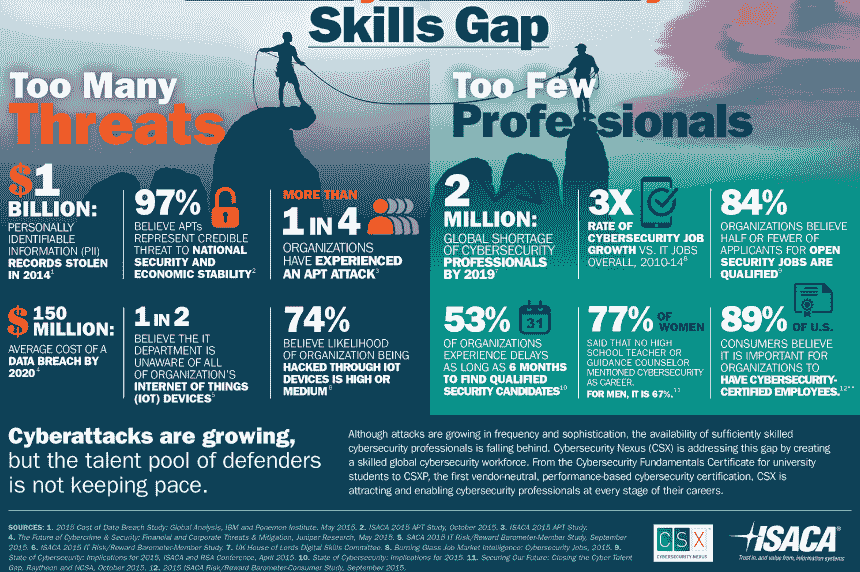

ISACA 网络安全技能缺口 ([`www.isaca.org/`](http://www.isaca.org/))

# 从技术背景转向网络安全

在尝试进入网络安全领域时，拥有先前的 IT 知识和技能将始终是一个加分项。如果你能编写代码、反向工程一段软件，或者至少了解网络基础、OSI 层等内容，这无疑是一个优势。

拥有技术背景并不意味着你必须拥有官方的学位或认证，而是意味着你通过兴趣爱好获得了一些基本技能。

如果你现在还没有这些技能，你至少应该知道如何获取这些技能，因为你已经阅读了本书的每一章。

# 目标网络安全职位

技术性的网络安全职位需要较为详细的计算机知识；然而，这里有一个好消息：你做的大部分工作都会在工作中学习到。因此，不要因为职位描述中提到的某项技能要求而阻止自己申请某些职位。正如你稍后会看到的，必备技能和期望技能之间是有区别的。

就像非技术性的网络安全职位一样，也有各种不同的技术性网络安全职位。一些职位名称包括以下内容：

+   **首席信息安全官**（**CISO**）：CISO 负责一系列职能，从招聘 IT 专家支持他们的工作，到为那些技能较低的员工提供领导力和培训。他们还将管理团队，确保团队成员在正确的时间专注于正确的战略领域。

+   **安全工程师**：在这个角色中，你将测试网络的漏洞，监控安全漏洞，并制定安全计划和政策。你还将负责在发生安全漏洞时进行事件响应。

+   **事件响应员**：事件响应员的工作要求他们立即对任何新的安全威胁、入侵或漏洞作出反应。工作的一部分还可能涉及变更管理的控制，确保在软件或硬件修复、升级和补丁过程中有序过渡。

+   **密码学家**：作为一名密码学家，你将分析、破译，甚至可能开发加密算法。这些加密算法的目标是保护数据。其理念是，即使黑客窃取了数据，由于加密锁的存在，他们也无法读取数据。

+   **计算机取证分析员**：这个角色的人结合了计算机科学背景和取证技能，来从计算机和存储设备中恢复信息。分析员的责任是协助执法人员处理网络犯罪，并检索证据。

+   **恶意软件分析师**：在这个职位上，你需要时刻跟进最新的病毒信息。你的工作还包括帮助开发能够对抗或防御这些新病毒的软件。

+   **渗透测试员**：如果你将网络安全与黑客行为联系在一起，那么这就是终极的安全职位。作为一名渗透测试员，你将成为一名黑客；然而，你将是一个道德黑客，必须遵循由你的公司与客户公司之间协议所规定的严格规则。你执行的每一项操作都需要被记录。公司雇佣渗透测试员是为了确保恶意黑客无法利用他们的网络漏洞。

+   **安全顾问**：安全顾问负责识别、开发和实施安全解决方案，以满足客户的需求。

+   **安全架构师**：安全架构师负责通过确定安全需求来保护企业信息；规划、实施和测试安全系统；制定安全标准、政策和程序；并指导团队成员。

+   **信息安全官**：此职位的人员负责建立和维护整个公司的信息安全管理程序，确保信息资产得到充分保护。他们的职责包括开发、实施和监控战略性、全面的企业信息安全和 IT 风险管理计划。

+   **计算机安全专家**：这类专业人员的职责包括设计和实施安全措施与控制，监控网络活动以识别脆弱点，并对隐私泄露和恶意软件威胁采取行动。

+   **风险经理**：风险经理为组织设计并实施整体的风险管理流程，其中包括分析风险发生时对公司财务的影响。

# 硬技能与软技能

无论你在哪个行业工作，你都需要一些基本的软技能和硬技能。

硬技能是你简历中的内容；如果你有技术背景，并且是程序员，那么你可能知道如何使用 C++进行渗透测试以及使用 Kali Linux。如果你是一个网页开发者，你可能已经知道如何防御 SQL 注入攻击，这对于网络安全开发者来说是必不可少的技能。

另一方面，软技能通常是无形的，难以量化的。正如我们在第七章中讲到的，*人际关系、指导和跟随*，能够与人建立联系或将技术话题传达给非技术人员，都可以被归类为软技能。

作为求职者，我相信你已经在关注 LinkedIn 或其他全球求职网站了。一旦你找到一份你认为会喜欢的工作，就申请它；或者如果你认为自己缺少一些技能，通过这本书，你现在知道如何去获得它们。无论如何，尽量去见一见招聘经理或猎头。即使他们在第一次面试中没有录用你，他们也许能指导你走向正确的方向。付出努力并主动联系他们，已经向他们证明你渴望学习新技能；正如我们稍后会在面试技巧中提到的，你可能会找到一个共同的联系点并成功入职。

你可以在这里阅读更多关于福布斯推荐的网络安全职业入门建议：[`www.forbes.com/sites/laurencebradford/2017/02/27/how-to-start-a-lucrative-career-in-cybersecurity/#5896cca71066`](https://www.forbes.com/sites/laurencebradford/2017/02/27/how-to-start-a-lucrative-career-in-cybersecurity/#5896cca71066)。

# 从非技术背景开始进入网络安全领域

如果你有非技术背景，不必担心。如果你想从事这个行业，你甚至不需要找到一个技术职位。拥有非技术背景意味着你可能没有编码和开发技能；然而，某些编码或开发技能可能并不必要，甚至不需要这些技能也能获得工作。

网络风险分析师和技术写作人员只是非技术性网络安全工作的两个例子。这些职位可能是你已经具备的技能所能胜任的。例如，本科学位可能是入门级政策分析师职位的唯一要求。如果你是一个热衷写作且精通语法的人，作为技术写作人员开始工作并不是一个坏主意，它能为你打开一扇门。

如第九章中所述，*知识检查与认证*，获得如 Logical Operations 的 CFR 认证或 EC Council 的 CEH 认证，可以让你更快地进入技术网络安全职位。这些认证的获得速度远快于大学学位。

一旦你迈入这个行业，你将开始积累工作经验，如果你花时间通过自我培训提高自己，你可以更快地达到理想职位。你应该热衷于学习、阅读和研究。这个行业存在巨大的人才短缺，学得越多，你将越受欢迎。

# 从当前技术职位转型

如果你目前从事的是比如微软交换管理员的工作，专注于邮件安全可能是你网络安全职业生涯的良好起点。或者如果你是一名系统管理员并且熟悉操作系统，那么数字取证可能会成为你的下一份工作，当然，前提是你需要先掌握必要的技能。

根据 LinkedIn 的数据显示，89%的受访专业人士有兴趣听取招聘人员的意见，因此，从你当前的角色转型应该不会太困难。再次根据 LinkedIn 的数据，美国大约有 50 万个网络安全职位空缺，预计到 2022 年，需要额外 180 万名网络安全专业人员来填补这一劳动力缺口。

当我们看看亚太地区时，缺口为 214 万人，而欧洲、中东和非洲则缺少 14 万个技术工人，预计到 2022 年这一缺口将达到数百万。

# 在你申请之前，先展示你的价值

不要忘记，很可能你不会是唯一申请这个职位的人。虽然有很多职位空缺面向合格的候选人，但求职者仍然需要证明自己不仅符合要求，还能成为该职位的最佳人选。展示自己的价值应该从填写工作申请表之前的几年就开始。了解自己的专业，规划下一步，区分自己与他人。不要忘记，拥有技能固然重要，但更重要的是拥有奉献精神。如果以下条件适用，你就是值得被聘用的人：

+   你渴望知识

+   你愿意提问并学习

+   你从错误中学习

+   你享受你的工作

+   你能够富有同理心地沟通

+   你知道如何说*不*

+   你有帮助他人的愿望

在学习了如何确保网络安全职位之后，让我们进一步探索，看看如何扩展你的知识库。正如下图所示，学习成为一名网络安全专业人员所需的知识、应用你的知识并制定行动计划帮助你前进是非常重要的：

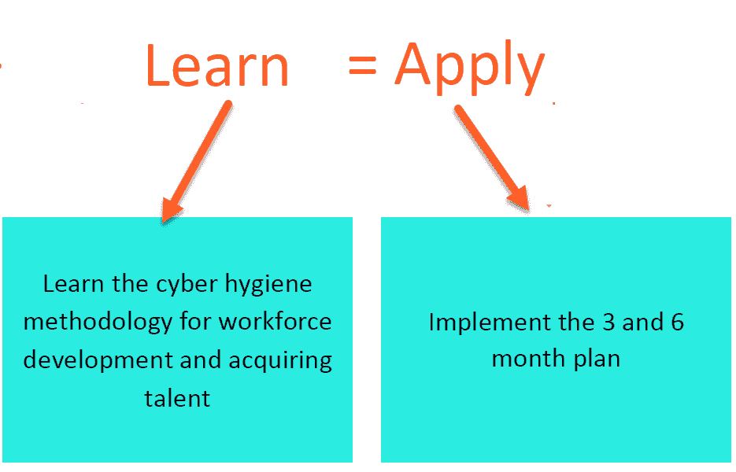

在接下来的部分，我们将讨论如何培养你的网络安全知识和技能。

# 阅读、听、看和交流

尽可能多地阅读。Packt Publishing 出版社有许多关于网络安全的优秀书籍，并提供多种订阅选项。关注安全网站和博客。跟随行业领导者在 Twitter/LinkedIn 上并围绕自己建立网络安全专家圈子，正如第七章《网络、指导和影子学习》中所讨论的那样。社区聚会对于加速你网络安全知识的积累也非常有帮助。

# 简历中应该包含哪些内容？

求职的第一步是准备你的简历，在探索网络安全的道路时，你需要一份具有竞争力的简历。在本节中，我们将逐步讲解简历制作的各个方面，并找出简历中必须具备的元素：

+   **教育背景**：虽然不是百分之百必要，但拥有扎实的教育背景可以证明你是一个优秀的学习者。学校/大学教给你重要的沟通、写作、商业和项目管理技能。大学学历会让你更容易获得管理职位。一些雇主现在要求在考虑候选人之前提供学士学位的证明。

+   **相关工作经验**：列出任何之前的 IT 职位以及任何与 IT 安全相关的其他工作。这也可以包括志愿者工作、实习和学徒。对于政府职位，招聘委员会会对任何军事或执法经验感兴趣。

+   **硬性 IT 技能**：在你构建网络安全简历的同时，努力发展一些硬性 IT 技能，如以下列出的技能。这些技能通常是雇主急需的：

    +   **操作系统和数据库管理**：根据你申请的职位，展示你在 Windows 或 macOS 上的技能有助于提升你的简历：

        +   Windows、UNIX 和 Linux 操作系统

        +   MySQL/SQLite 环境

    +   **编程和编码**：如果你是程序员，一定要列出你掌握的技能和你参与的项目。如果这是你作为程序员的第一份工作，你选择的职业路径也能为你加分：

        +   C、C++、C# 和 Java

        +   Python, Ruby, PHP, Perl 和/或 Shell

        +   汇编语言和反汇编工具

        +   **正则表达式**（**regex**）技能

        +   Linux/macOS Bash 脚本

    +   **网络**：你想做网络工程师吗？那就展示你在网络方面的技能；以下是一些示例：

        +   系统/网络配置

        +   TCP/IP、计算机网络、路由和交换

        +   网络协议和数据包分析工具

        +   防火墙和入侵检测/预防协议

        +   包络整形器、负载均衡器和代理服务器知识

        +   VPN

    +   **专业化**：由于工作性质和行业原因，安全专家通常会在以下某一领域进行专业化：

        +   思科网络

        +   云计算

        +   微软技术

        +   无线网络

        +   数据库建模

        +   开源应用程序

        +   密码学

还有其他的。为了在这些领域获得更多经验，你可以在工作中主动承担任务、与导师合作、以及/或投资于自学和指导培训。

+   +   **认证：** 行业认证通常是展示你所知道内容的最佳方式。因此，以下是一些你可能想要考虑的认证。如果你不确定要考取哪种认证，请参考第九章，*知识检查和认证*：

        +   **非安全类认证：**

            +   思科 CCNA

            +   CompTIA A+、Server +、Network + 等等

            +   ITIL、COBIT 等

            +   微软认证

            +   VMware 认证

        +   **安全类认证：**

            +   SANS

            +   逻辑操作

            +   OWASP

            +   EC-Council 等

不要忘记，认证通常是证明你所掌握的知识的最佳方式，并且在筛选过程中可能非常重要。

# 简历内容清单

简而言之，你的简历必须能够从众多简历中脱颖而出。为此，你可以参考之前讨论的建议，并将这些关键因素融入到你的简历中。我们用一份清单来结束这一部分，它将帮助你有效地构建简历：

+   脱颖而出。你的简历应当展示出你独特的技能和经验的融合。

+   保持简历简洁

+   检查简历是否有任何错误，确保没有任何失误。

+   保持简历更新

+   保持简历真实

+   定制化并使其看起来美观

# 从第一次接触到正式工作的第一天的历程

候选人开始思考自己未来的职业方向或其他职业选择。为此，与家人、朋友和熟人的讨论非常重要。候选人会通过网络、职业博览会、公司介绍会或其他信息日来搜索关于职业机会和潜在雇主的信息。这只是整个求职旅程的开始。在求职过程中，候选人可以跨越许多里程碑，整个过程需要大量的工作和毅力。下面的图表很好地展示了 Kinesis 提供的求职历程：

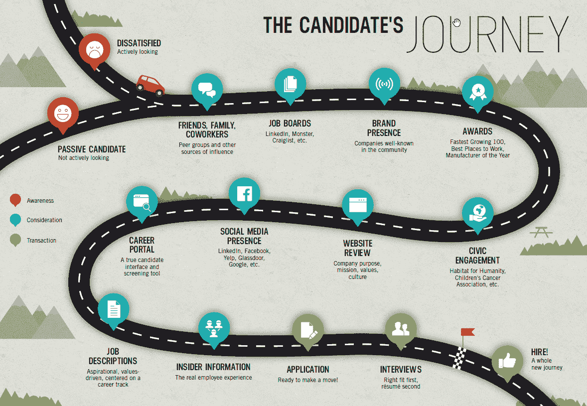

该图提供了从第一天开始到新工作第一天的全景图，感谢 Kinesis Inc. 提供的支持。你可以免费从其网站下载海报版本：[`www.kinesisinc.com/talent/`](https://www.kinesisinc.com/talent/)。

现在，让我们把焦点转向网络安全领域中的面试类型。

# 面试类型

工作面试是一次正式的会议，在会议中，面试官会询问申请者一些问题，以确定其是否适合某个特定的工作。工作面试可以面对面进行，也可以通过电话或视频进行，可能是单对单的，也可能是小组面试或面板面试。但无论形式如何，每场工作面试都可以分为三种不同的结构方式。

# 结构化面试

在结构化面试中，问题会提前规划和设计，这意味着所有候选人都会按照相同的顺序被问相同的问题。这将使招聘人员更容易比较候选人的答案，并聘用合适的人才。

这就是结构化面试的内容：

+   问题集

+   一个量表

+   对比人才与其他候选人的评分和比较

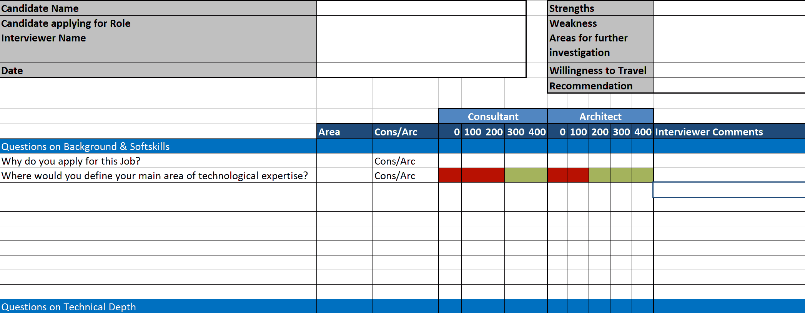

结构化面试的示例 Excel 工作表

# 非结构化面试

这是一种面试类型，面试官会问一些未提前准备的问题。这种类型的面试也被称为非正式或随意面试：

+   非结构化面试更具个性化

+   非结构化面试是一种自由对话，有助于展示你的隐藏技能

这就是非结构化面试中会涉及的内容：

+   招聘人员将关注你日常的互动，这也是展示你的软技能的绝佳机会

+   招聘人员将观察你是否能够保持专注，以及你是否足够灵活，可以谈论任何话题

+   你的肢体语言也会被考虑在内

# 半结构化面试

**半结构化面试**是一种面试类型，面试官只会问一些预定的问题，而其他问题则不会提前安排。这是一种混合型面试风格。

这就是半结构化面试中会涉及的内容：

+   招聘人员会根据你的回答来设计他们的问题

+   招聘人员将观察你是否能够跟随自然的对话流程

# 常见的网络安全面试问题

面试过程对候选人来说非常艰难，对面试官来说也是如此。之所以艰难，是因为精心培养的人才通常不会轻易离开他们的公司。请记住，人们会去他们受邀的地方，但只有在被欢迎的地方才会留下。而且，雇用技术熟练的专业人员是需要成本的。

# 一般面试过程

以下要点总结了一个一般面试过程所涉及的内容：

+   简历筛选

+   基本人力资源面试（外部招聘）

+   技术面试

+   人力资源面试和工作邀请（希望如此）

# 常见的网络安全面试问题

这些只是一些示例问题，问题会根据不同的角色有所不同。

以下是一些针对入门级职位的示例问题：

+   解释风险、脆弱性和威胁之间的区别？

对于这个问题，最好通过一个易于理解的例子来支持你的回答。

+   非对称加密和对称加密有什么区别，哪种更好？

请保持答案简洁，因为这是一个广泛的话题。

+   什么是 IPS，它与 IDS 有什么区别？

+   什么是防火墙？

请简洁地回答，因为这个问题可能会变得复杂并引发循环提问。

+   您如何保持自己了解最新的信息安全新闻？

万一您没有关注过任何相关资讯，以下是一些简短的列表：Hacker News、Threatpost 和 Pentestmag。

+   什么是 CIA？

CIA 是网络安全存在的主要原因。

以下是一些适用于初级岗位的示例问题：

+   什么是端口扫描？

+   什么是合规？

+   网络应用的各种响应代码有哪些？

+   解释基本 Web 架构中的对象。

不同的组织遵循不同的模型和网络，请用通用的方式回答。

+   何时使用`tracert`/`traceroute`？

+   VA 和 PT 有什么区别？

以下是一些适用于经验丰富的专业人士的示例问题：

+   政策、流程和指南之间有什么区别？

+   什么是*pass the hash*？

+   什么是数据泄露？您将如何检测和防止数据泄露？

+   解释最小权限原则。

+   请提供一些防止横向移动的缓解措施示例。

+   您对特权提升的理解是什么？

以下是一些适用于高级岗位的示例问题：

+   数据分类的不同级别有哪些，为什么需要这些级别？

+   员工如何了解信息安全政策和程序的不同方式？

+   从安全的角度来看，CEO 层级报告应该包括哪些内容？

+   针对 CSFR 的防御措施有哪些？

+   逆向工程此代码

+   您如何看待安全融合及其对我们公司的影响？

# 个人问题

以下问题涉及您的个人抱负、目标以及对自己的看法，并不仅限于网络安全职位：

+   为什么您在寻找新职位？

+   请告诉我们您的个人成就或认证。

+   您最强的优势和成就是什么？

+   您最大的弱点是什么？

+   您如何设想自己上任后的前三个月？

+   您如何看待自己五年后的发展？

+   为什么您要从当前岗位转向网络安全领域？（如果您目前在其他岗位的话。）

# 沟通技巧

以下问题旨在考察您的沟通技巧以及您传达思维的能力：

+   请告诉我们一个您发现与客户或同事沟通困难的情景。您是如何解决的？

+   请告诉我们您至今最喜欢的经理或同事是谁。是什么让他们与您合作时如此出色？

+   您感恩的是什么？

+   您认为同事更欣赏您的直接，还是您平衡事物的能力？

# 问题解决和判断能力

以下问题考察的是判断力以及您处理问题的方法：

+   告诉我们一次事情没有按你预期的方式进行的经历。下次你会怎么做不同的事情？

+   你如何衡量工作的成功？

+   当你回顾至今的工作经历时，什么让你最为自豪？

+   告诉我们一次你面对一个没有政策或手册答案的情况时，你是如何应对的。你做了什么？

# 动机和激情

以下问题评估你工作的动机：

+   是什么激励你每天都来工作？

+   为什么你想成为我们公司的一部分？

+   告诉我们一次你为客户付出了超出预期的努力。

+   告诉我们一些你在工作之外充满激情的事情。

# 常见建议

以下是在面试时需要记住的一些提示：

+   言之精确，倾听仔细，回答前思考。

+   保持你的回答简洁（除非需要详细说明）。如果被要求，提供细节。

+   自信一点（尽可能地）。

+   关注安全新闻。

+   了解公司，检查他们是否有过任何事件。

+   保持积极的态度。

+   做一个团队成员。不要认为自己比别人更重要。

+   如果你犯了错，要负责——没有借口！

+   与公司共同成长并不断学习，否则会被落下。

# 在接受工作前考虑这些因素

如果你已经拿到了工作邀请，并在考虑是否接受，以下几点需要注意：

+   **福利和待遇**：务必询问具体细节。

+   **工作/生活平衡**：如果你是一个喜欢在工作和个人生活之间保持平衡的人，这应该是你考虑的因素之一。

+   **学习和成长的机会**：这将展示公司是否准备好投资于你。

+   **一个关注你成长的经理**：在选择新工作时，你还应该评估你将要为之工作的经理/领导是否会帮助你在职业上成长。一个糟糕的经理会让你非常不开心；无论你在公司多么成功，他们都有可能逼迫你离开。

+   **薪资透明度**。

# 从招聘经理或招聘者的视角看待问题

到目前为止，我已经讲解了如何提高你获得工作的机会。为了使本章更具价值，我还想添加招聘者对人才的看法。你还可以查看第十一章，*关于入门网络安全的专家意见*，我们在那里提了一些问题，可以帮助你向一些业内知名专家学习。作为一名招聘者，可能看起来很容易，但他们有很多任务要做，比如在短时间内寻找像*你*这样的人才，而市场上却存在严重的技能短缺：

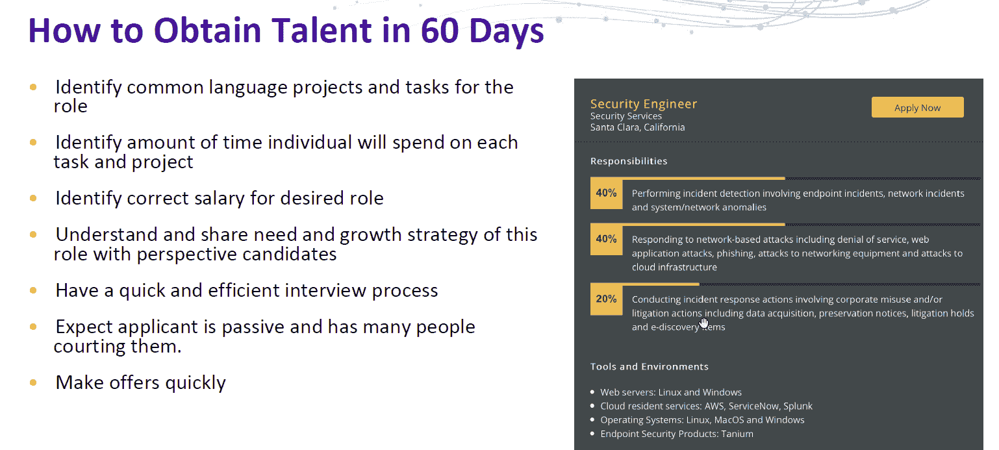

如你所见，他们有一个预先定义的评分卡，因此请确保仔细阅读职位描述，并尝试与之找到共同点，证明自己是合适的候选人。

根据*麦肯锡全球调查*，82%的财富 500 强高管认为他们的公司没有招聘到最优秀的人才。如果你遵循正确的建议，你可以训练自己成为合适的人才，签下你梦寐以求的工作合同：

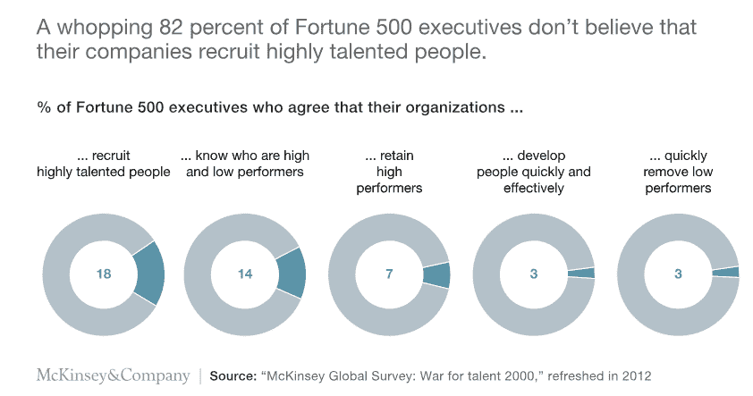

一些招聘人员使用一些附加工具，如**我的梦想员工**，帮助他们识别出卓越的员工：

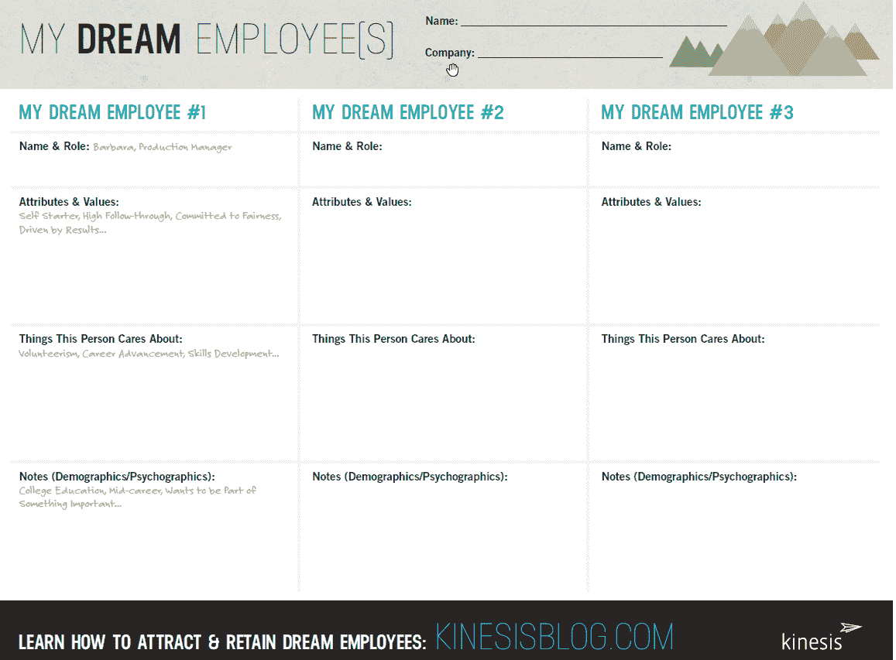

在前面的截图中，你可以看到《我的梦想员工》工作表的样式，它应该能帮助你为面试制定正确的策略。

# 招聘人员的招聘流程是什么？

如果你想了解招聘流程是如何运作的，请仔细查看以下图示；它应该能帮助你了解招聘人员在幕后做了什么，也许能解释为什么这个过程比你预期的要花更多的时间：

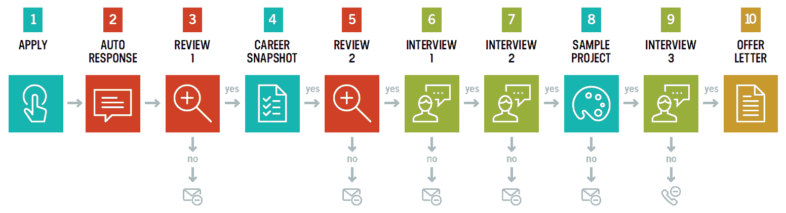

# 如何在微软获得工作机会

微软职业网站提供了非常好的资源和帮助，都是免费的。我强烈推荐你浏览一下。在第十一章，*关于网络安全入门的专家意见*，你将阅读到微软员工的故事和建议：

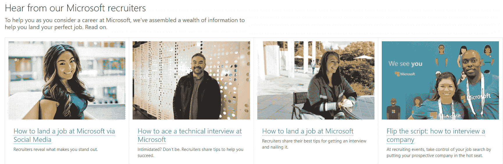

微软建议任何想为他们工作的人应做以下事情：

+   申请你感兴趣的职位

+   了解职位要求和微软的商业背景

+   了解他们的职业发展路径以及他们想要如何成长

+   了解如何与他人合作

+   展示学习的愿望、对技术的热情以及努力工作的意愿

+   为解决与工作相关的特定问题做好准备

更多信息，请访问微软职业网站：[`careers.microsoft.com/us/en/interviewtips`](https://careers.microsoft.com/us/en/interviewtips)。 

# 如何在思科获得工作机会

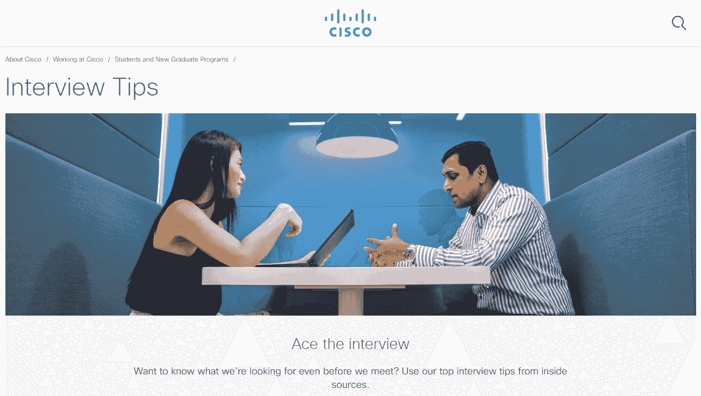

思科建议想为他们工作的人参考以下提示：

+   做好准备。独特。做自己。

+   了解业务。

+   了解工作要求。

+   反思自己的优势和成长领域。

+   思考你的技能和成就。

+   保持冷静，给自己足够的时间。

+   保持好奇心并提出问题。

请记住，思科有三种面试类型：电话面试、能力面试和小组面试。招聘人员应该告诉你应该期待什么。

更多信息，请查看以下链接：[`www.cisco.com/c/en/us/about/careers/working-at-cisco/students-and-new-graduate-programs/interview-tips.html`](https://www.cisco.com/c/en/us/about/careers/working-at-cisco/students-and-new-graduate-programs/interview-tips.html)。

# 如何在谷歌获得工作机会

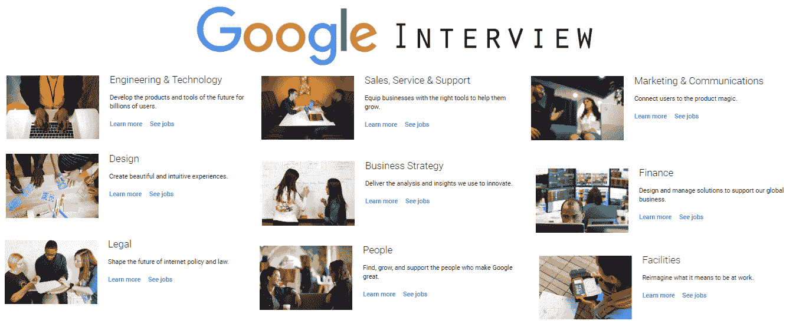

谷歌有两轮面试，每轮面试之间会收集反馈，并决定下一步行动。

谷歌通过电话、Google Hangouts 或现场面试进行面试，并推荐以下方法：

+   做好准备

+   能够预测未来（是的，你没看错）

+   制定计划

+   数据驱动，尽量通过讲述故事来展示你的知识，回答每一个问题

+   实践操作

想了解更多关于如何进入谷歌的信息，请查看以下链接：[`careers.google.com/how-we-hire/interview/#interviews-for-all-roles`](https://careers.google.com/how-we-hire/interview/#interviews-for-all-roles)。

# 谷歌首席执行官在 2004 年首次面试时是如何应对的！

谷歌有限公司的首席执行官桑达尔·皮查伊在访问一所大学时说了以下话：

“我记得在面试时，大家一直问我‘你觉得 Gmail 怎么样？’但我当时没有机会使用它。我以为那是愚人节的玩笑。所以，在我的前三次面试中，我回答得不好，因为我没有使用过这个产品。直到第四次面试时，有人问我：‘你看过 Gmail 吗？’我说‘没有。’他实际上向我展示了它。然后第五位面试官问我‘你觉得 Gmail 怎么样？’我才开始能够回答这个问题。在接下来的四场面试中，我实际上告诉了他们我对 Gmail 的看法以及如何改进 Gmail。这就是我的面试经历。”

根据 CNBC 的报道，桑达尔·皮查伊能够在面试中成功，是因为他展示了知识的谦逊，给出了有故事背景的理由，并能够引导对话。你可以在这里阅读更多关于这个故事的内容：[`www.cnbc.com/2019/02/01/how-google-ceos-brilliant-answer-in-a-job-interview-helped-him-get-hired.html`](https://www.cnbc.com/2019/02/01/how-google-ceos-brilliant-answer-in-a-job-interview-helped-him-get-hired.html)。

# 如何进入埃克森美孚

埃克森美孚是世界上最大的公司之一，位列财富排行榜。该公司根据背景和地点招聘人才。像其他财富 500 强公司一样，它的职业网站提供了如何塑造简历的示例。如果职位需要评估，公司会提供相关要求的信息。网站上还提供了关于面试和录用通知的预期信息。所以，请浏览其网站，找到适合你的职位。

关于埃克森美孚招聘的更多信息，请点击此链接：[`careers.exxonmobil.com/en/how-we-hire/our-hiring-process`](https://careers.exxonmobil.com/en/how-we-hire/our-hiring-process)。

# 你应该知道的热门求职网站

由于我不能列出所有财富 500 强公司的职业网站，我强烈建议你密切关注你想要工作的公司。如果该公司有关于新职位空缺的通知，记得注册。如果你不确定自己想为哪家公司工作，可以关注以下网站：

+   **Glassdoor**: [`www.glassdoor.ie/index.htm`](https://www.glassdoor.ie/index.htm)

+   **LinkedIn**: [`www.linkedin.com`](https://www.linkedin.com)

+   **CareerBuilder**: [`www.careerbuilder.com`](https://www.careerbuilder.com)

总结来说，要找到一份工作，你必须去寻找，或者你需要有一个推荐人/引荐人，他会将你推荐给招聘经理或人力资源。如果你按照本书中的建议，接受我们专家的正确指导，你很快就能找到一份新工作。

祝你好运！

# 总结

网络安全就业市场存在巨大的人才缺口。招聘人员在寻找合适的人才时遇到困难，而这个人才缺口为任何希望成为网络安全专业人士的人打开了新机会，无论他们的背景如何。

本章讨论了行业的当前需求；它涵盖了人们在寻找理想工作的过程中需要做的事情。本章还从招聘者的角度出发，讲述了招聘人才时他们的做法，并提供了如何获得工作的一些建议，从撰写最佳简历到通过面试。最后，讨论了如何在一些顶级公司找到工作。
