# 二、利用漏洞趋势降低风险和成本

漏洞对所有组织来说都意味着风险和费用。认真降低客户风险和成本的供应商专注于减少其产品中的漏洞数量，并致力于使攻击者利用其客户变得困难和昂贵，从而降低攻击者的投资回报。确定成功做到这一点的供应商和产品既费时又困难。

在这一章中，我将为您提供有价值的背景信息，并深入分析一些行业领导者在过去二十年中是如何管理其产品中的漏洞的，重点是操作系统和 web 浏览器。我介绍了一个漏洞改进框架，它可以帮助您识别已经为客户降低风险和成本的供应商和产品。这些数据和分析可以为您的漏洞管理策略提供信息。

在本章中，我们将讨论以下主题:

*   漏洞管理入门
*   引入漏洞管理改进框架
*   检查特定供应商、操作系统和 web 浏览器的漏洞披露趋势
*   漏洞管理计划指南

让我们从什么是漏洞管理开始。

# 介绍

在过去的 20 年里，组织一直面临着管理软件和硬件中不断出现的新漏洞的挑战。攻击者和恶意软件不断试图利用世界各地各行业系统中未打补丁的漏洞。漏洞是许多利益团体的货币，包括安全研究人员、漏洞管理行业、政府、各种商业组织，当然还有恶意软件的攻击者和供应者。这些团体有不同的动机和目标，但他们都重视新的漏洞，其中一些愿意为此支付可观的费用。

在蠕虫和其他恶意软件第一次大规模利用微软软件漏洞的混乱时期，我坐在归零地的前排。在微软的企业网络支持团队工作了几年后，我被要求帮助建立一个新的面向客户的安全事件响应团队。2003 年 1 月 23 日，星期四，我接受了那份工作。两天后，1 月 25 日星期六，SQL Slammer 攻击了互联网，扰乱了全球网络。那个星期六的早上，我开车去办公室，但是不得不停下来加油。由于“网络问题”，加油站的提款机和加油机都离线了。那时，我意识到那次袭击是多么的广泛和严重。然后，2003 年 8 月的一天，MSBlaster 对互联网的破坏程度甚至超过了 SQL Slammer。然后，在接下来的一年里，MSBlaster 变种接踵而至，还有 MyDoom、Sasser 和其他广泛传播的恶意软件攻击。结果是数百万人愿意双击一个标有“MyDoom”的电子邮件附件。

这些攻击大多利用微软产品中未打补丁的漏洞来感染系统并传播。这一切都发生在 Windows Update 出现之前，也没有任何工具可以用来维护软件。由于微软不得不发布多个安全更新来解决 MSBlaster 使用的组件中的底层漏洞，许多 IT 部门开始了一种长期的行为模式，推迟修补系统以避免重复修补相同的组件和重复重启系统。当时，大多数联网的基于 Windows 的系统也没有运行防病毒软件，而且许多运行了防病毒软件的系统也没有安装最新的特征码。在那个年代，在面向客户的安全事件响应团队中工作，支持安全更新，帮助企业客户应对恶意软件感染和黑客，是一项非常艰巨的工作——你需要厚脸皮。随后，在这个角色中，我学到了很多关于恶意软件、漏洞和利用的知识。

在我在微软职业生涯的后期，我管理过**微软安全响应中心**(**MSRC**)微软**安全开发生命周期** ( **SDL** )和微软恶意软件保护中心 ( **MMPC** )的营销传播。MSRC 是微软管理传入漏洞报告和攻击报告的小组。MMPC 当时被称为微软的反病毒研究和响应实验室。SDL 是一种开发方法，是在这些毁灭性的蠕虫攻击之后的几年中在微软建立的。我在这个名为“可信计算”的组织工作了 8、9 年，了解了很多关于漏洞、利用、恶意软件和攻击者的知识。

经常有人问我，今天的情况是否比 5 年或 10 年前更好。本章致力于回答这个问题，并从漏洞管理的角度提供一些关于事情如何变化的见解。我还想为您提供一种方法，来识别那些为客户降低风险和成本的供应商和产品。

# 漏洞管理初级读本

在我们深入探讨过去几十年的漏洞披露趋势之前，让我为您提供一个关于漏洞管理的快速入门，以便更容易理解我提供的数据和分析，以及一些漏洞管理团队如何使用这些数据。

**国家漏洞数据库** ( **NVD** )用于跟踪全行业各种软硬件产品中公开披露的漏洞。https://nvd.nist.gov【NVD】是一个公开可用的数据库。

在这种情况下，漏洞被定义为:

> “在软件和硬件组件中发现的计算逻辑(例如代码)弱点，当被利用时，会对机密性、完整性或可用性产生负面影响。在这种情况下，漏洞的缓解通常涉及编码更改，但也可能包括规范更改，甚至规范废弃(例如，完全删除受影响的协议或功能)。”
> 
> —(NIST，联合国出版物，出售品编号:e . 02 . ii . a . 7)

当在软件或硬件产品中发现漏洞并报告给拥有易受攻击产品或服务的供应商时，该漏洞最终将在某个时候被分配一个**常见漏洞和暴露** ( **CVE** )标识符。

一个 CVE 标识符被分配给一个漏洞的确切日期是许多不同因素的函数，本书可以用整整一章来讨论这个问题。事实上，我在微软与人合写了一份关于这个主题的微软白皮书，名为*软件漏洞管理，其中描述了为什么发布微软产品的安全更新可能需要相对较长的时间。这篇论文似乎已经随着时间的流逝从微软下载中心消失了。然而，以下是解释为什么厂商从收到漏洞报告到发布安全更新需要很长时间的一些因素:*

*   **识别 bug** :有些 bug 只在特殊情况下或者在最大的 IT 环境中出现。供应商可能需要一段时间来重现错误并对其进行分类。此外，报告的漏洞可能存在于使用相同或相似组件的其他产品和服务中。所有这些产品和服务需要同时修复，这样供应商就不会无意中在自己的产品线中产生零日漏洞。我将在本章后面讨论零日漏洞。
*   识别所有变种:修复报告的 bug 可能简单明了。但是，找到问题的所有变体并修复它们也很重要，因为这将避免需要重新发布安全更新或发布多个更新来解决同一组件中的漏洞。这可能是修复漏洞时花费时间最多的活动。
*   **代码审查**:确保更新的代码确实修复了漏洞，并且没有引入更多的错误和漏洞，这很重要，有时也很耗时。
*   **功能测试**:这确保了修复不会影响产品的功能性——当这种情况发生时，客户不会喜欢。
*   **应用程序兼容性测试**:对于操作系统或网络浏览器，供应商可能需要测试成千上万的应用程序、驱动程序和其他组件，以确保他们在发布安全更新时不会破坏他们的生态系统。例如，Windows 的集成测试矩阵非常庞大，包括数千个在该平台上运行的最常见的应用程序。
*   **发布测试**:确保安全更新的分发和安装按预期运行，不会使系统无法启动或不稳定。

认识到为漏洞分配 CVE 标识符的日期不一定与供应商发布解决底层漏洞的更新的日期相关，这一点很重要；也就是说，这些日期可以不同。宣布发现新漏洞带来的恶名诱惑导致一些安全研究人员在供应商修复漏洞之前公开发布细节。典型的最佳情况是，漏洞的公开披露发生在供应商发布解决该漏洞的安全更新的同一天。这减少了攻击者利用漏洞的机会，缩短了组织在其 it 环境中测试和部署更新的时间。

CVE 标识符的一个例子是 CVE-2018-8653。从 CVE 标识符可以看出，编号 8653 被分配给了 2018 年与之相关的漏洞。当我们在 NVD 中查找这个 CVE 标识符时，我们可以获得与它相关的漏洞的更多细节。例如，一些详细信息包括漏洞的类型、CVE 的发布日期、CVE 的上次更新日期、漏洞的严重性分数、漏洞是否可以被远程访问以及它对机密性、完整性和可用性的潜在影响。

> 它还可能包含漏洞的摘要描述，如下例所示:“脚本引擎处理 Internet Explorer 内存中对象的方式中存在一个远程代码执行漏洞，也称为“脚本引擎内存损坏漏洞”。"这将影响 Internet Explorer 9、Internet Explorer 10 和 Internet Explorer 11。这个 CVE ID 是 CVE 唯一的-2018-8643。”
> 
> —(NIST)

风险是概率和影响的组合。在漏洞的上下文中，风险是漏洞被成功利用的概率和被利用后对系统的影响的组合。CVE 分数代表此漏洞的风险计算。**通用漏洞评分系统** ( **CVSS** )用于评估 NVD 每个漏洞的风险。为了计算风险，CVSS 使用“可利用性指标”，如攻击媒介、攻击复杂性、所需权限和用户交互(NIST，未注明日期)。如果漏洞被成功利用，为了计算对系统影响的估计，CVSS 使用“影响度量”，例如对机密性、完整性和可用性的预期影响(NIST，北爱尔兰)。

注意，在我前面提到的 CVE 细节中提供了可利用性度量和影响度量。CVSS 在一些简单的数学计算中使用这些细节来产生每个漏洞的基本分数(维基百科)。

漏洞管理专业人员可以通过使用时间指标组和环境组中的指标来进一步细化漏洞的基本分数。

时间度量组反映了这样的事实，即随着新信息变得可用，基本分数可以随着时间而改变；例如，当漏洞的概念证明代码公开时。由于特定 IT 环境中存在缓解因素或控制措施，因此环境指标可用于降低 CVE 的分数。例如，漏洞的影响可能会减弱，因为组织在以前加强其 IT 环境的工作中已经部署了针对漏洞的缓解措施。我在本章中讨论的漏洞披露趋势都是基于 CVE 的基础分数。

CVSS 随着时间的推移不断发展，至今已有三个版本。最新版本(第 3 版)的评级在下图中显示(NIST，未注明日期)。CVSS v2 和 v3 的 NVD·CVSS 计算器可帮助组织使用时间和环境指标计算漏洞分数(NIST，北达科他州)。

分数可以转换为低、中、高和关键等等级，比使用粒度数字分数(NIST，北爱尔兰)更容易管理。

<figure class="mediaobject">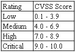</figure>

表 2.1:CVSS 分数范围的评级说明。

分数越高的漏洞被利用的可能性越大，并且/或者被利用时对系统的影响越大。换句话说，分数越高，风险越高。这就是为什么许多漏洞管理团队在漏洞被公开披露后，使用这些分数和评级来确定在他们的环境中测试和部署安全更新和/或漏洞缓解的速度。

另一个需要理解的重要术语是“零日”漏洞。零日漏洞是指在负责该漏洞的供应商发布解决该漏洞的安全更新之前已经公开披露的漏洞。这些漏洞是所有漏洞中最有价值的，攻击者和政府都愿意为它们支付相对较高的价格(一个有效的漏洞可能需要 100 万美元或更多)。

对于漏洞管理团队来说，最坏的情况是他们环境中的软件或硬件出现严重的零日漏洞。这意味着利用漏洞的风险可能非常高，并且可以防止利用该漏洞的安全更新不会公开发布。零日漏洞并不像你想象的那样罕见。微软最近发布的数据表明，在 2017 年微软产品中已知被利用的 CVE 中，第一次被利用时，100%是零日漏洞，而在 2018 年，83%是零日漏洞(Matt Miller，2019)。

这是一个有趣的事实。2013 年，我在微软的官方安全博客上写了一篇博文，创造了“永远零日”这个词，引发了一场轰动性的新闻大循环。我指的是官方支持终止后在 Windows XP 中发现的任何漏洞。在这种情况下，在支持结束后在 Windows XP 中发现的任何漏洞将永远是零天，因为微软不会为其提供持续的安全更新。

让我更详细地解释一下。攻击者可以等待当前支持的 Windows 版本(如 Windows 10)发布新的安全更新。然后，他们对这些更新进行逆向工程，以找到每个更新解决的漏洞。然后，他们检查这些漏洞是否也存在于 Windows XP 中。如果他们是，而微软不会为他们发布安全更新，那么攻击者就永远拥有 Windows XP 的零日漏洞。时至今日，你可以搜索“永远零日”这几个词，找到很多引用我的新闻。因为那个新闻周期，我成了 Windows XP 生命终结的海报男孩。

这些年来，我与数以千计的 CISOs 和漏洞管理者谈论过他们为组织管理漏洞的实践。关于大型复杂企业环境中管理漏洞的最佳方式，最常见的四种观点如下:

*   **区分关键等级漏洞**的优先级:当关键等级漏洞的更新或缓解可用时，它们会立即被测试和部署。在定期 IT 维护期间测试和部署较低等级的漏洞，以最大限度地减少系统重启和业务中断。这些组织正在尽快缓解风险最高的漏洞，并愿意接受重大风险，以避免因安全更新部署而不断干扰其环境。
*   **确定高等级和严重等级漏洞的优先级**:当高等级和严重等级漏洞被公开披露时，他们的政策规定他们将在 24 小时内修补严重漏洞或部署可用的缓解措施，高等级漏洞在一个月内修补。得分较低的漏洞将作为常规 IT 维护周期的一部分进行修补，以最大限度地减少系统重启和业务中断。
*   **没有优先顺序–只是修补所有东西**:一些组织已经得出结论，考虑到他们被迫管理的持续增长的漏洞披露量，他们投入在分析 CVE 分数和优先更新上的努力是不值得的。相反，他们只是按照基本相同的时间表测试和部署所有更新。这个时间表可以是每月一次，每季度一次，或者，对于那些有健康风险偏好的组织，每半年一次。这些组织致力于真正高效地部署安全更新，而不管其严重性等级如何。
*   **延迟部署**:对于那些对 IT 中断非常敏感的组织来说，延迟安全更新的部署已经成为一种不幸的做法，因为这些组织过去曾被质量低劣的安全更新所中断。换句话说，这些组织接受与他们使用了几个月的产品中所有已知的、未打补丁的漏洞相关的风险，以确保他们的供应商不会因为质量问题而重新发布安全更新。这些组织认为治疗方法可能比疾病更糟糕；也就是说，与世界上所有潜在的攻击者相比，劣质安全更新带来的破坏给他们带来的风险相同或更高。赞同这种观点的组织倾向于捆绑和部署几个月的更新。至少可以说，这些机构的风险偏好很高。

对于外行人来说，这些方法和权衡似乎没有多大意义。除了费用之外，部署漏洞造成的主要棘手问题是业务中断。例如，历史上，Windows 操作系统的大多数更新都需要重新启动。当系统重新启动时，发生的停机时间将计入大多数 IT 组织承诺的正常运行时间目标。重启一台服务器可能看起来并不重要，但重启数百或数千台服务器所需的时间开始增加。请记住，试图保持 99.999%(5“9”)正常运行时间的组织每年只能承受 5 分 15 秒的停机时间。这相当于每月 26.3 秒的停机时间。企业数据中心中的服务器，尤其是数据库和存储服务器，在正常运行时很容易需要 5 分钟以上的时间来重新启动。此外，当服务器重新启动时，这是出现需要故障排除的问题的黄金时间，从而加剧了停机时间。最坏的情况是安全更新本身导致问题。在数百或数千个系统上卸载更新并再次重新启动所花费的时间，使它们处于易受攻击的状态，也会对正常运行时间产生负面影响。

修补和重新启动系统可能非常昂贵，尤其是对于在非工作时间执行监督修补的组织，这可能需要加班和周末工资。传统维护窗口的概念不再有效，因为许多企业都是全球性的，并且是跨国运营的，一周 7 天、一天 24 小时都是如此。一种经过深思熟虑的计划和分层修补方法，在修补和重新启动少数基础设施的同时保持大部分基础设施可用，已经变得很普遍。

重新启动是组织决定接受某些风险，每季度或每半年打一次补丁的首要原因，以至于我与之密切合作了十多年的 MSRC 过去常常试图将需要系统重新启动的安全更新次数减少到每两个月一次。为此，在可能的情况下，他们会尝试在一个月内发布所有需要重启的更新，然后在下个月发布不需要重启的更新。当这个计划起作用时，每月修补系统的组织至少可以避免每两个月重启一次系统。但是“带外”更新，即计划外的更新，似乎经常破坏这些计划。

当您看到漏洞披露随着时间推移的趋势时，组织在利用风险和正常运行时间之间做出的权衡可能更有意义。在云中运行服务器可以极大地改变这个等式——我将在第 8 章“云——实现安全性和合规性的现代方法”中对此进行更详细的介绍。

关于 NVD、CVE 和 CVSS，还有许多其他方面和细节我没有在这里介绍，但是我已经提供了足够的基础知识，您将能够理解我接下来提供的漏洞披露趋势。

## 漏洞披露数据源

在我们深入研究漏洞披露数据之前，让我告诉你数据来自哪里，并提供一些关于数据有效性和可靠性的警告。我在本章中使用的数据有两个主要来源:

1.  [https://nvd.nist.gov/vuln/searchNVD](https://nvd.nist.gov/vuln/search)
2.  CVE 详细资料:https://www . CVE details . com/

NVD 是该行业漏洞披露的事实上的权威来源，但这并不意味着 NVD 的数据是完美的，CVSS 也是如此。我参加了 2013 年黑帽美国会议的一个会议，名为“购买偏见:为什么脆弱性统计很糟糕”(Brian Martian，2013)。

本次会议涵盖了 CVE 数据中的许多偏见。这个演讲仍然可以在网上看到，我推荐观看它，以便你理解我在本章中讨论的 CVE 数据的一些局限性。CVE 细节是一个很棒的网站，它帮我节省了很多收集和分析 CVE 数据的时间。CVE 详细信息继承了 NVD 的局限性，因为它使用 NVD 的数据。值得一读《CVE 细节》的工作原理及其局限性(《CVE 细节》)。因为我在本章提供的数据和分析是基于 NVD 和 CVE 的细节，他们继承了这些局限性和偏见。

鉴于我在本章的分析中使用的两个主要数据来源都有其局限性，我可以自信地说我的分析并不完全准确或完整。此外，随着 NVD 的不断更新，漏洞数据也会随着时间而变化。我的分析是基于几个月前拍摄的 CVE 数据快照，这些数据不再是最新的或准确的。我提供此分析来说明漏洞披露是如何随着时间的推移而发展的，但我对这些数据不做任何保证——使用这些数据风险自担。

## 行业漏洞披露趋势

首先，让我们看看自 1999 年 NVD 启动以来每年披露的漏洞。1999 年至 2019 年间，分配了 CVE 标识符的漏洞总数为 122，774 个。如图 2.1 所示，2016 年至 2018 年间披露的信息大幅增加。2016 年至 2017 年期间，披露量增加了 128%，2016 年至 2018 年期间增加了 157%。换句话说，在 2016 年，漏洞管理团队平均每天管理 18 个新漏洞。这个数字在 2017 年增加到每天 40 个漏洞，在 2018 年平均每天 45 个。

<figure class="mediaobject">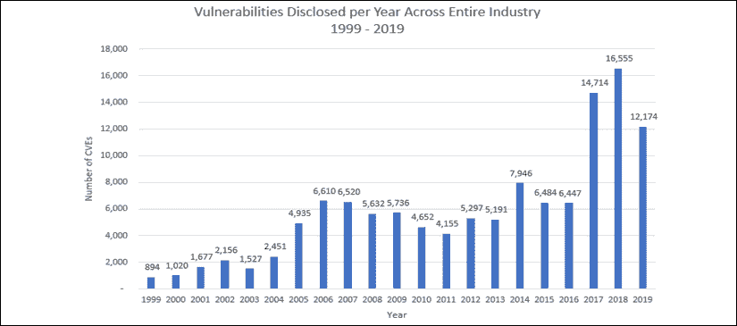</figure>

图 2.1:每年全行业披露的漏洞(1999-2019 年)

您可能想知道是什么因素导致漏洞披露如此之多。主要因素可能是 CVE 标识符分配给 NVD 漏洞的方式发生了变化。在此期间，CVE 指定并授权他们所谓的“CVE 编码机构(CNAs)”为新漏洞分配 CVE 标识符。据 Mitre 称，他负责管理用数据填充 NVD 的 CVE 流程:

> “CVE 编码机构(CNA)是来自世界各地的组织，它们被授权在其明确的、商定的范围内为影响产品的漏洞分配 CVE id，以包含在新漏洞的第一次公开声明中。这些 CVE id 提供给研究人员、漏洞披露者和信息技术供应商。
> 
> 参与该计划是自愿的，参与的好处包括能够公开披露具有已分配的 CVE ID 的漏洞，能够控制漏洞信息的披露而无需预先发布，以及向研究人员请求 CVE ID 的研究人员通知 CNA 范围内的产品漏洞。"
> 
> —斜接

> CVE 用法:MITRE 特此授予您永久的、全球性的、非排他性的、免费的、免版税的、不可撤销的版权许可，以复制、准备衍生作品、公开展示、公开执行、再许可和分发常见漏洞和暴露(CVE)。只要您在任何此类副本中复制 MITRE 的版权标志和本许可证，您为此目的制作的任何副本都是授权的。

CNAs 的出现意味着 2016 年后将有更多的组织分配 CVE 标识符。截至 2020 年 1 月 1 日，有来自 21 个国家的 110 个组织作为 CNA 参与。CNAs 的名称和位置可在[【https://cve.mitre.org/cve/cna.html】](https://cve.mitre.org/cve/cna.html)获得。显然，这一变化使得分配 CVE 标识符的流程更加高效，从而导致 2017 年和 2018 年漏洞披露量大幅增加。2019 年结束时，漏洞数量少于 2018 年和 2017 年，但仍明显多于 2016 年。

还有其他因素导致了更多的漏洞披露。例如，从事漏洞研究的人和组织比以往任何时候都多，他们拥有比过去更好的工具。发现新的漏洞是一项大生意，很多人都渴望从中分一杯羹。此外，新型硬件和软件正在以**物联网** ( **物联网**)设备的形式迅速加入计算机生态系统。在这个巨大的新市场空间中获得有意义的市场份额的巨大淘金热导致该行业犯下了软件和硬件制造商在过去 20 年中犯下的所有相同的错误。

几年前，我与一些制造商讨论了他们物联网产品线的安全发展计划，很明显他们计划做的很少。开发缺乏更新机制的物联网设备会让该行业回到个人电脑无法自我更新的时代，但规模要大得多。消费者不愿意为更好的安全性支付更多，制造商也不愿意将时间、预算和精力投入到不能推动需求的开发方面。如果过去 3 年有任何迹象，这种漏洞披露量的增加似乎是该行业的新常态，导致更多的风险和更多的工作要管理。

这些 CVE 的严重程度分布如图 2.2 所示。与其他评级的 CVE 相比，有更多的 CVE 评级为高严重性(CVSS 评分在 7 到 8 之间)和中等严重性(CVSS 评分在 4 到 5 之间)。CVSS 的加权平均得分是 6.6。超过三分之一的漏洞(44，107)被评为严重或高。对于具有漏洞管理策略的组织来说，这些策略规定紧急部署所有关键评级漏洞和每月部署评级为高的 CVE，这意味着在 20 年内可能会有超过 15，000 次紧急部署和超过 25，000 次每月补丁部署。这也是为什么一些组织决定不根据严重性来确定安全更新的优先级的原因之一，因为有太多的高严重性和关键严重性漏洞，与低评级漏洞相比，对它们进行不同的管理是对时间的有效利用。这些组织中的许多组织都致力于在其环境中真正高效地测试和部署安全更新，以便他们能够在不中断业务的情况下尽快部署所有更新，无论其严重性如何。

<figure class="mediaobject"></figure>

图 2.2:按严重性划分的 CVSS 得分(1999 年至 2019 年)

图 2.3 列出了 2020 年 1 月 1 日《CVE 细节》50 大供应商名单(CVE 细节，2020)中 CVE 最多的供应商和 Linux 发行版。这个列表并不令人惊讶，因为这个列表中的一些供应商也是过去 20 年中他们在市场上拥有的产品数量最多的供应商。您编写的代码越多，潜在的漏洞就越多，尤其是在 2003 年之前的几年里，那时大蠕虫攻击(SQL Slammer、MS Blaster 等)时有发生。

2004 年后，像这份名单上的那些行业领导者开始更加关注这些攻击后的安全漏洞。我将在第 3 章、*中进一步讨论恶意软件——恶意软件*。此外，操作系统和 web 浏览器供应商由于其无处不在而对其产品给予了不成比例的关注。操作系统或浏览器中一个新的严重或高评级漏洞的价值远远超过一个模糊应用程序中的漏洞。

<figure class="mediaobject">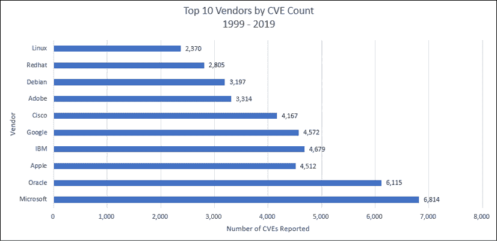</figure>

图 2.3:CVE 数量最多的前 10 名供应商/经销商(1999-2019)

此时，您可能想知道这些漏洞出现在什么类型的产品中。将 CVE 最多的前 25 个产品分为操作系统、网络浏览器和应用，*图 2.4* 展示了细分情况。在 CVE 最多的前 25 个产品中，影响操作系统的 CVE 比浏览器和应用程序加起来还要多。

但有趣的是，随着产品数量从 25 个扩大到 50 个，这种分布开始迅速转移，总 CVE 的 5%从操作系统类别转移到应用程序。我怀疑，随着这一分析中所包含的产品数量的增加，应用程序最终会比其他类别拥有更多的 CVE，如果没有其他原因，仅仅是因为这样一个事实，即应用程序比操作系统或浏览器多得多，尽管操作系统多年来一直受到关注。还要记住，在流行的开发库中，如 JRE 或微软，漏洞的影响。NET 可以被放大，因为有数以百万计的应用程序使用它。

<figure class="mediaobject">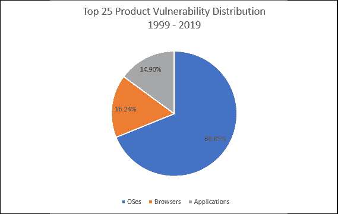</figure>

图 2.4:按产品类型分类的 CVE 最多的 25 种产品中的漏洞(1999-2019)

以下列表显示了报告了这些漏洞的特定产品(CVE 详细信息，未注明日期)。该列表将让您了解许多流行软件产品的漏洞数量，以及漏洞管理团队可能会花费多少精力来管理它们。

<figure class="mediaobject">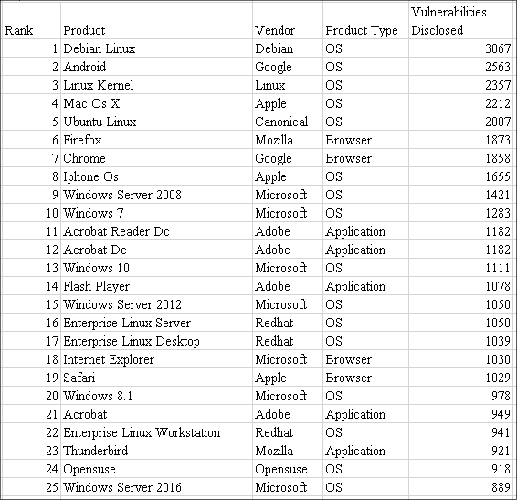</figure>

表 2.2:CVE 最多的前 25 种产品(1999-2019)

回到 2003 年，微软 Windows 大蠕虫攻击发生的时候，我当时接触的很多机构都认为只有微软的软件有漏洞，其他厂商的软件都很完美。尽管在 2003 年前后，每年有成千上万的 CVE 被分配给来自许多供应商的软件。

15 年后，我没有遇到多少组织仍然相信这个神话，因为他们的漏洞管理团队正在处理所有软件和硬件中的漏洞。请注意，前 10 名中只有两款微软产品。

但是这些数据并不完美，以这种方式统计漏洞总数并不一定能告诉我们这些年来哪些厂商和产品有所改进，或者整个行业是否改进了其安全开发实践。接下来我们就更多的探讨这些方面。

## 降低风险和成本——衡量供应商和产品改进

如何降低与安全漏洞相关的风险和成本？通过使用已经成功减少其产品漏洞数量的供应商，您有可能减少与您的漏洞管理计划相关的时间、精力和成本。此外，如果您选择的供应商已经通过使攻击者难以或不可能利用其产品中的漏洞来降低攻击者的投资回报，那么您也将降低您的风险和成本。我现在将为您提供一个框架，您可以使用它来识别这样的供应商和产品。

在 2003 年大蠕虫攻击之后，微软开始开发微软 SDL。微软至今仍在使用 SDL。我为 SDL 管理了几年的营销传播，所以我有机会学习了很多关于这种发展方式的知识。SDL 的既定目标是减少微软软件中漏洞的数量和严重性。

SDL 还试图使开发后的软件中发现的漏洞更难或不可能被利用。很明显，即使微软以某种方式能够生产无漏洞的产品，运行在 Windows 或 web 浏览器上的应用程序、驱动程序和第三方组件仍然会使系统易受攻击。随后，微软与更广泛的行业免费共享了一些版本的 SDL 和一些 SDL 工具。它还将 SDL 的某些方面融入到 Visual Studio 开发工具中。

我将使用 SDL 的目标作为一个非正式的“漏洞改进框架”,来了解使用供应商或特定产品的风险(概率和影响)是否随着时间的推移而增加或减少。这个框架有三个标准:

1.  漏洞总数呈上升趋势还是下降趋势？
2.  这些漏洞的严重性是上升还是下降？
3.  这些漏洞的访问复杂性是上升还是下降？

为什么这个看似简单的框架有意义？让我们走一遍。漏洞总数呈上升趋势还是下降趋势？随着时间的推移，供应商应该努力减少产品中的漏洞数量。所有供应商的理想目标应该是他们的产品零漏洞。但是这是不现实的，因为人类编写代码时会犯错误，导致漏洞。但是，随着时间的推移，供应商应该能够向他们的客户展示，他们已经找到了减少产品漏洞的方法，从而为他们的客户降低风险。

这些漏洞的严重性是上升还是下降？考虑到产品中会存在一些安全漏洞，供应商应该努力降低这些漏洞的严重性。降低漏洞的严重性可以减少我在本章前面提到的紧急安全更新部署的数量。它还为漏洞管理团队提供了更多的时间来测试和部署漏洞，从而减少了对他们所支持的业务的中断。更具体地说，应尽量减少关键和高严重性 CVE 的数量，因为它们对系统构成最大的风险。

这些漏洞的访问复杂性是上升还是下降？同样，如果产品中存在漏洞，让这些漏洞尽可能难以或无法被利用应该是供应商关注的事情。访问复杂性或攻击复杂性(取决于使用的 CVSS 版本)是利用漏洞难易程度的衡量标准。CVSS 版本 2 将访问复杂性估计为低、中或高，而 CVSS 版本 3 将攻击复杂性估计为高或低。概念是一样的——访问复杂性或攻击复杂性越高，攻击者利用漏洞的难度就越大。

使用这些措施，我们希望看到供应商使其产品中的漏洞始终难以利用。我们希望看到高访问复杂性 CVE(具有最低风险的 CVE)的数量随着时间的推移呈上升趋势，而低复杂性漏洞(具有最高风险的 CVE)呈下降趋势或为零。换句话说，我们希望高复杂性 CVE 的份额增加。

为了总结这个漏洞改进框架，我将衡量:

*   每年的 CVE 计数
*   每年临界额定和高额定 CVE 的数量。这些简历的得分在 7 到 10 分之间
*   每年访问复杂度或攻击复杂度较低的 CVE 数量

当我将这个框架应用到拥有成百上千种产品的供应商身上时，我将使用 CVE 过去五年的数据。我认为 5 年的时间足够判断一个厂商管理产品漏洞的努力是否成功。当我将这个框架应用到单个产品时，如操作系统或网络浏览器，我将使用 CVE 最近 3 年(2016-2018)的数据，以便我们看到最近的趋势。请注意，这种方法的一个局限性是，如果供应商和/或他们的产品是新的，并且没有足够的数据进行评估，那么这种方法就没有用。

现在我们有了一个框架来衡量漏洞披露是否随着时间的推移而改善，我将把这个框架应用于一些选定的供应商、操作系统和 web 浏览器的二十年历史 CVE 数据，以更好地了解行业中流行软件的状态。只是为了增加悬念和紧张感，就像你在马克·鲁西诺维奇的网络安全惊悚小说中会发现的那样，我将最后披露微软的 CVE 数据！

### Oracle 漏洞趋势

由于甲骨文在简历最多的供应商前十名中排名第二，我们就从他们开始吧。Oracle 产品的 CVE 可以追溯到 1999 年。*图 2.5* 展示了 1999 年至 2018 年间，甲骨文产品每年发布的简历数量。

在此期间，分配了 5，560 个 CVE，其中 1，062 个被评定为关键或高，3，190 个 CVE 具有低访问复杂性。2019 年披露了 489 个 CVE，使得 1999 年至 2019 年期间甲骨文产品中的 CVE 总数达到 6，112 个(CVE 细节，未注明日期)。

请注意，甲骨文在此期间收购了许多技术公司和新技术，包括 MySQL 和 Sun Microsystems。收购新技术会导致供应商的 CVE 数发生重大变化。收购供应商可能需要时间来使他们获得的产品符合或超过他们的标准。在甲骨文的案例中，他们收购的一些技术在他们庞大的产品组合中拥有最多的 CVEs 其中包括 MySQL、JRE 和 JDK (CVE 详情，未注明日期)。

<figure class="mediaobject">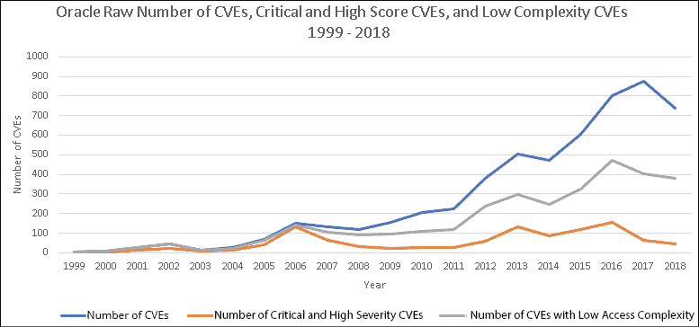</figure>

图 2.5:Oracle 产品中 CVE、关键和高 CVE 以及低复杂度 CVE 的数量(1999-2018)

就过去五年来看，从 2014 年初到 2018 年底，简历数量增加了 56%。具有低访问复杂性或攻击复杂性的 CVE 数量增加了 54%。然而，在同一时期，关键和高分(分数在 7 到 10 之间)CVE 的数量下降了 48%。考虑到这段时间漏洞数量的大幅增加，这一数字令人印象深刻。*图 2.6* 展示了这一积极变化。图 2.6 展示了 1999 年至 2018 年期间，每年严重和高度严重 CVE 的数量占总 CVE 的百分比。它还向我们展示了低访问复杂度的 CVE 占同期所有 CVE 的百分比。

<figure class="mediaobject">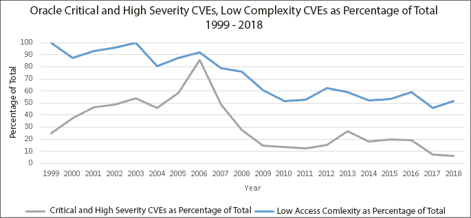</figure>

图 2.6:Oracle 产品中关键和高严重性等级 CVE 和低复杂性 CVE 占总 CVE 的百分比(1999 年至 2018 年)

像这样的长期趋势不是偶然发生的。Oracle 可能在人员(如安全开发培训)、流程和/或技术方面实现了一些变革，帮助他们降低了客户的风险。达到使用寿命的旧产品也有助于改善整体状况。甲骨文可能也在解决其多年来收购的许多技术的漏洞方面取得了进展。漏洞管理团队仍然需要处理相对大量的漏洞，但是正如我前面所讨论的，严重性较低的漏洞是有帮助的。

根据 CVE 的详细信息，1999 年至 2018 年间对 CVE 总数贡献最大的 Oracle 产品包括 MySQL、JRE、JDK、数据库服务器和 Solaris。

### 苹果漏洞趋势

CVE 数量最多的厂商名单上的下一个是苹果。1999 年至 2018 年间，分配给苹果产品的 CVE 有 4277 个；在这些 CVE 中，1，611 个具有关键或高分，1，524 个具有被描述为低的访问复杂性(CVE 细节，未注明)。2019 年，苹果产品中披露了 229 个 CVE，1999 年至 2019 年期间共有 4507 个 CVE(CVE 细节，未注明)。正如你从*图 2.7* 中看到的，自 2013 年以来，苹果产品中的 CVE 数量有很大的增加和减少。

仅从 2014 年到 2018 年底这 5 年来看，对比这一时期的开始和结束，CVE 的数量减少了 39%，CVSS 得分为 7 或更高的 CVE 减少了 30%，访问复杂性较低的 CVE 减少了 65%。然而，漏洞管理团队在 2015 年和 2017 年遇到了苹果历史上 CVE 数量最大的增长。

<figure class="mediaobject">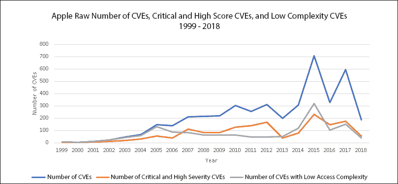</figure>

图 2.7:苹果产品中 CVE、关键和高 CVE 以及低复杂度 CVE 的数量(1999-2018)

<figure class="mediaobject">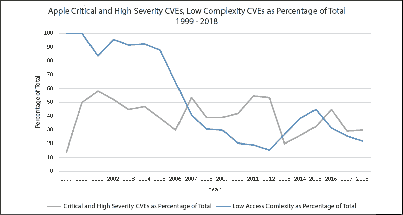</figure>

图 2.8:苹果产品中被评定为严重和高度严重的 CVE 以及低复杂性 CVE 占总 CVE 的百分比(1999 年至 2018 年)

根据 CVE 细节公司的数据，对苹果总 CVEs 贡献最大的苹果产品包括 macOS、iOS、Safari、macOS Server、iTunes 和 watchOS (CVE 细节公司，未注明日期)。

### IBM 漏洞趋势

IBM 在漏洞最多的供应商名单中排名第四，在 1999 年至 2018 年期间，其 CVE 略少于苹果，为 4224 个(CVE 细节，未注明日期)，令人难以置信的是，这两家供应商在 19 年期间仅相差 53 个 CVE。但与苹果相比，蓝色巨人有将近一半的 CVEs 被评为关键或高。然而，与苹果相比，IBM 拥有更多低访问复杂度的 CVE。

<figure class="mediaobject">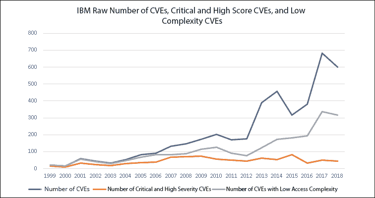</figure>

图 2.9:IBM 产品中 CVE、关键和高分 CVE 以及低复杂度 CVE 的数量(1999–2018)

仅从 2014 年到 2018 年底的过去 5 年来看，IBM 的简历数量增长了 32%。关键和高分 CVE 的数量减少了 17%,而访问复杂度低的 CVE 增加了 82%。在 CVEs 增加了近三分之一的时候，严重和高评级漏洞的减少是积极的，值得注意的。

<figure class="mediaobject">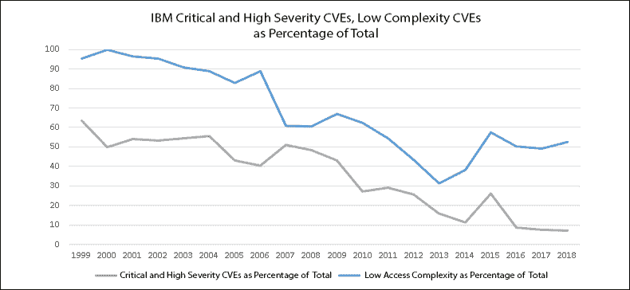</figure>

图 2.10:IBM 产品中关键和高严重性等级 CVE 和低复杂性 CVE 占总数的百分比(1999-2018)

对 IBM 的 CVE 计数贡献最大的产品是 AIX、WebSphere Application Server、DB2、Rational Quality Manager、Maximo Asset Management、Rational Collaborative life cycle Management 和 WebSphere Portal (CVE 细节，未注明日期)。

### 谷歌漏洞趋势

拥有最多简历的前五名厂商是谷歌。谷歌不同于前五名名单上的其他厂商。NVD 首次公布谷歌产品漏洞是在 2002 年，而不是像其他产品一样在 1999 年。与榜单上的其他公司相比，谷歌是一家更年轻的公司。

在 2002 年至 2018 年期间，有 3959 份简历归因于谷歌产品。在这些简历中，2078 份被评为关键或高分(CVE 细节，未注明)。与 IBM 和 Oracle 相比，这是关键和高分值漏洞数量的两倍多，远远超过苹果。除了微软之外，谷歌比前五名中的任何一家供应商都有更多的严重和高严重性漏洞。在此期间，分配给谷歌产品的 1982 个 CVE 具有低访问复杂性(CVE 详细信息，未注明)。

<figure class="mediaobject">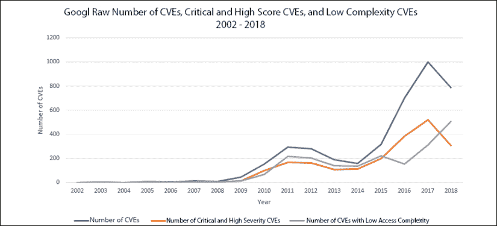</figure>

图 2.11:谷歌产品中 CVE、关键和高 CVE 以及低复杂度 CVE 的数量(2002-2018)

从 2014 年到 2018 年底的 5 年间的趋势来看，分配给谷歌产品的 CVE 增加了 398%；在同一时期，评级为关键或高的 CVE 增加了 168%，低复杂性 CVE 增加了 276%(CVE 细节，未注明)。根据 CVE 细节公司(CVE 细节公司)的数据，2017 年的简历数量达到了 1001 个，这是前五大供应商中没有一家实现过的壮举。

<figure class="mediaobject">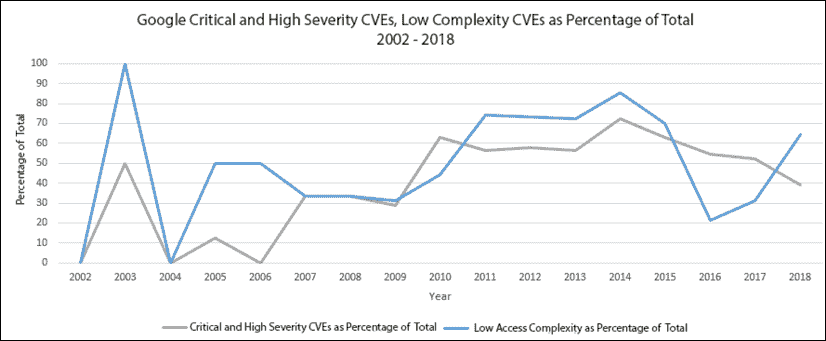</figure>

图 2.12:谷歌产品中被评定为严重和高度严重的 CVE 以及低复杂性 CVE 占总 CVE 的百分比(2002 年至 2018 年)

据《CVE 细节》报道，对谷歌 CVE 总计数贡献最大的谷歌产品包括安卓和 Chrome (CVE 细节，未注明日期)。

### 微软漏洞趋势

现在是时候看看微软是如何管理他们产品中的漏洞的了。他们是简历最多的供应商之一，在 1999 年至 2018 年底期间共有 6，075 个(CVE 详情，未注明日期)。

在上述 6，075 个 CVE 中，3，635 个被评为关键或高，2，326 个 CVE 具有低访问/攻击复杂性(CVE 详情，未注明)。在我们调查的 5 家供应商中，微软的漏洞总数最多，CVSS 得分为 7 或更高的漏洞数量最多，访问复杂性较低的 CVE 数量最多。

<figure class="mediaobject">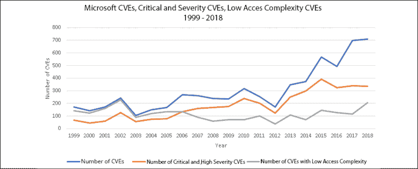</figure>

图 2.13:微软产品中 CVE、关键和高 CVE 以及低复杂度 CVE 的数量(1999-2018)

关注 2014 年至 2018 年底的 5 年间，分配给微软产品的 CVE 增加了 90%。关键和高分漏洞增加了 14%,低访问复杂性 CVE 增加了 193%。如果有一线希望的话，那就是从长远来看，微软已经大大增加了利用漏洞的难度。微软最近发布了关于其产品可开发性的令人信服的新数据，值得一看，以获得更完整的图片(马特·米勒，2019)。

<figure class="mediaobject">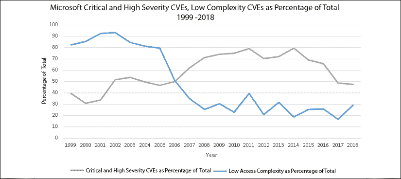</figure>

图 2.14:微软产品中关键和高严重性等级 CVE 和低复杂性 CVE 占总数的百分比(1999 年至 2018 年)

对微软的 CVE 总数贡献最大的产品包括 Windows Server 2008、Windows 7、Windows 10、Internet Explorer、Windows Server 2012、Windows 8.1 和 Windows Vista (CVE 详情，未注明日期)。这个列表中的一些操作系统曾经是世界上最受欢迎的操作系统，尤其是在消费者中。这使得微软尽量减少这些产品漏洞的努力尤为重要。我将在本章后面讨论操作系统和 web 浏览器的漏洞披露趋势。

### 供应商漏洞趋势摘要

我们在本章中调查的所有供应商都发现，随着时间的推移，他们产品中的漏洞数量急剧增加。与我们在过去 3 年中看到的数量相比，2003-2004 年期间漏洞披露的数量似乎有些古怪。漏洞数量的大幅增加使得降低 CVE 的严重性和增加其访问复杂性变得更加困难。

<figure class="mediaobject">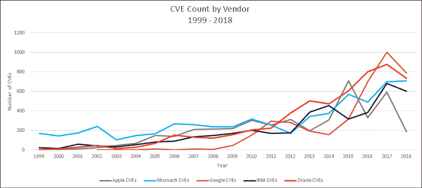</figure>

图 2.15: CVE 排名前五的供应商(1999 年至 2018 年)

<figure class="mediaobject">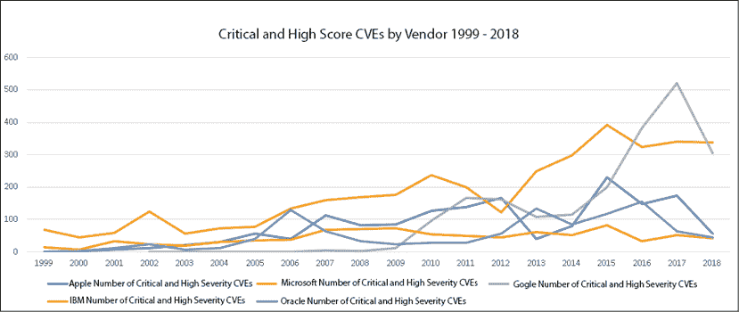</figure>

图 2.16:前五大供应商的严重和高评级严重 CVE 计数(1999-2018)

在我们调查的行业领导者中，只有一家实现了我们之前为非正式漏洞改进框架定义的所有三个目标。着眼于我目前拥有数据的过去五年(2014 年至 2018 年)，苹果成功减少了 CVE 的数量、关键和高严重性 CVE 的数量以及低访问复杂性 CVE 的数量。恭喜苹果！

<figure class="mediaobject">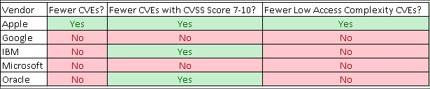</figure>

表 2.3:应用漏洞改进框架的结果(2014–2018)

一次在数百个产品中沿着正确的方向推动这些指标是极具挑战性的。让我们来看看各个产品在一段时间内的表现。接下来，我们将看看选择的操作系统和网络浏览器。

## 操作系统漏洞趋势

在过去的几十年里，操作系统吸引了安全研究人员的大量关注。流行的桌面或移动操作系统中的零日漏洞的有效利用可能价值数十万美元甚至更多。让我们来看看操作系统的漏洞披露趋势，并仔细看看几个漏洞数量最多的产品。

*图 2.17* 显示了根据 CVE 细节公司(CVE 细节公司，未注明日期)的数据，1999 年至 2019 年间存在最独特漏洞的操作系统。该列表包含来自一系列供应商的桌面、服务器和移动操作系统，包括苹果、谷歌、Linux、微软等:

<figure class="mediaobject">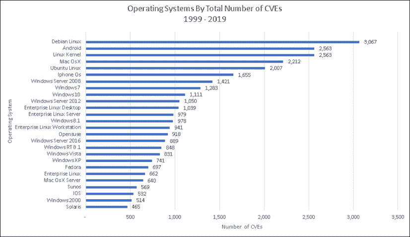</figure>

图 2.17:按 CVE 总数统计的具有最独特漏洞的操作系统(1999-2019)

### 微软操作系统漏洞趋势

由于我们在上一节讨论了微软，我将从他们的操作系统开始。在我前面提到的微软面向客户的事件响应团队工作之后，我有机会在微软的核心操作系统部门工作。我是 Windows 网络团队的项目经理。我帮助推出了 Windows Vista、Windows Server 2008 和一些服务包。信不信由你，运送 Windows 比客户面对事件响应角色更难。但这是另一本书的主题。

让我们来看看客户端和服务器微软操作系统的子集。*图 2.18* 显示了 Windows XP、Windows Server 2012、Windows 7、Windows Server 2016 和 Windows 10 每年的 CVE 数量。

<figure class="mediaobject">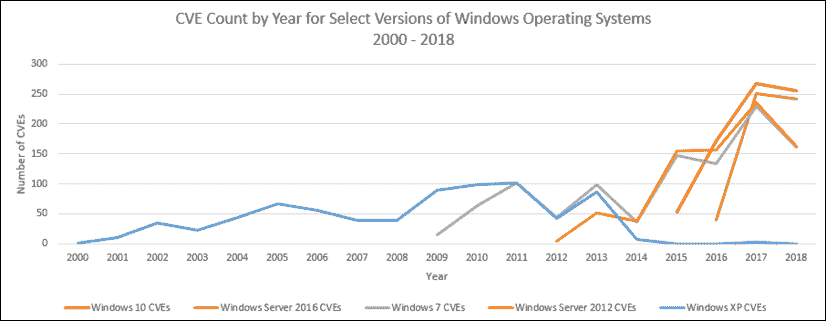</figure>

图 2.18:微软 Windows 精选版本的 CVE 计数(2000–2018)

*图 2.18* 让我们对随着时间的推移漏洞披露的变化有了一些了解。它向我们展示了与早期相比，在过去的 4、5 年中，漏洞被披露的程度有多严重。例如，在 Windows XP 中报告漏洞披露的 20 年中，共有 741 个 CVE 被披露(CVE 细节，未注明日期)；平均每年有 37 份简历。微软最新的客户端操作系统 Windows 10 在短短 4 年内以 748 个 CVE 超过了 CVE。平均每年有 187 个漏洞被披露。这意味着平均每年披露的 CVE 增加了 405%。

服务器操作系统的漏洞发现率也越来越高。从 2012 年发布到 2018 年的 7 年间，Windows Server 2012 共披露了 802 个漏洞(CVE 细节，未注明日期)；平均每年有 114 份简历。但是对于 Windows Server 2016 来说，这一平均值跃升至每年 177 个 CVE，增长了 55%。

鉴于最新的操作系统 Windows 10 和 Windows Server 2016 不应该有任何漏洞，这些漏洞是在以前的操作系统出厂前修复的，并且它们已经受益于使用更新的工具和受过更好培训的开发人员进行开发，披露的速度令人难以置信。然而，随着其他操作系统即将寿终正寝，Windows 10 是 Windows 唯一的新客户端版本，它可能比任何其他 Windows 操作系统版本都更受安全研究人员的关注。

现在，让我们更深入地了解一些 Windows 版本，并将我们的漏洞改进框架应用于它们。

### Windows XP 漏洞趋势

截至 2014 年 4 月，Windows XP 不再获得支持，但 2017 年披露了 3 个 CVE，2019 年披露了 1 个，这就是为什么图 2.19 中的图形有一条长尾巴(CVE 细节，未注明)。虽然到 2014 年初支持结束时，Windows XP 中的关键和高严重性 CVE 的数量确实从 2011 年的高点有所下降，但访问复杂性较低的 CVE 的数量仍然相对较高。我不认为我们可以将我们的漏洞改进框架应用于 Windows XP 生命的最后几年，因为去年，特别是，被寻找和保留新的零日漏洞的淘金热所扭曲，微软可能永远不会修复这些漏洞。只要保密，这些漏洞将非常有价值。

<figure class="mediaobject">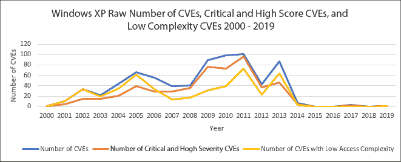</figure>

图 2.19:Microsoft Windows XP 中 CVE、严重和高评级严重 CVE 以及低复杂性 CVE 的数量(2000–2019)

为什么微软在停止支持后发布了 Windows XP 的安全更新？这就是我之前提到的“永远零日”的概念。面对 Windows XP 中新的、关键的、潜在的蠕虫漏洞，微软决定在官方支持生命周期结束后为 Windows XP 提供安全更新。

另一种可能是数千或数百万受到危害和感染的“僵尸”Windows XP 系统不断攻击互联网的其余部分。鉴于仍有许多企业、政府和消费者在使用 Windows XP，微软在 Windows XP 寿终正寝后发布更新是正确的决定。

*图 2.20* 显示了 Windows XP 中严重和高严重性 CVE 以及低复杂性 CVE 占 CVE 总数的百分比。2017 年和 2019 年的不稳定模式是由于这两年披露的简历很少(2017 年 3 份，2019 年 1 份)(CVE 细节，未注明)。

<figure class="mediaobject"></figure>

图 2.20:Microsoft Windows XP 中被评定为严重和高严重性的 CVE 以及低复杂性 CVE 占所有 Microsoft Windows XP CVEs 的百分比(2000 年至 2019 年)

### Windows 7 漏洞趋势

接下来，让我们检查一下非常流行的 Windows 7 操作系统的数据。Windows 7 于 2020 年 1 月 14 日停止支持(微软公司，2020 年)。Windows 7 于 2009 年 7 月发布，此前 Windows Vista 反响不佳。与 Windows Vista 相比，每个人都喜欢 Windows 7。此外，从 CVE 披露的角度来看，Windows 7 在发布时享受了一个“蜜月”，因为 CVE 的披露花了几年时间才增加，近年来，它们已经显著增加。

Windows 7 在 2009 年至 2018 年期间披露了 1，031 个 CVE。平均每年有 103 个漏洞被披露(CVE 细节，未注明)。这没有 Windows 10 的平均年度 CVE 披露率高，但几乎是 Windows XP 每年披露的 CVE 平均数量的 3 倍。Windows 7 平均每年有 57 个严重或高等级漏洞。

<figure class="mediaobject">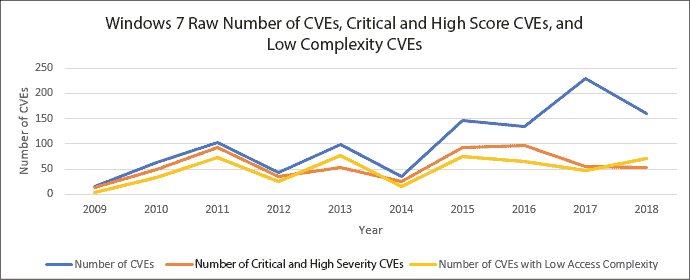</figure>

图 2.21:微软 Windows 7 (2009 年至 2018 年)中 CVE、关键和高评级严重性 CVE 以及低复杂性 CVE 的数量

如果我们只关注 2016 年至 2018 年之间的过去 3 年(我们有几个 Windows 版本的数据用于比较)，从 2016 年初到 2018 年底，CVE 的数量增加了 20%，而关键和高严重性 CVE 的数量减少了 44%，低复杂性 CVE 的数量增加了 8% (CVE 细节，未注明)。漏洞严重性的显著降低有助于漏洞管理团队，但这并没有实现我们的漏洞改进框架在这 3 年期间的目标。

<figure class="mediaobject">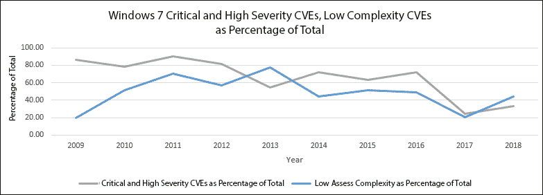</figure>

图 2.22:Microsoft Windows 7 中被评定为严重和高严重性的 CVE 以及低复杂性 CVE 占所有 Microsoft Windows 7 CVEs 的百分比(2009-2018)

### Windows Server 2012 和 2016 漏洞趋势

现在让我们来看几个 Windows Server SKU——Windows Server 2012 和 2016。Windows Server 2012 于 2012 年 9 月发布。Windows Server 2016 于 2016 年 9 月发布，因此我们没有 2016 年全年的数据。这将扭曲我们框架的结果，因为与 2016 年相比，我们的指标似乎都有大幅增长。

<figure class="mediaobject">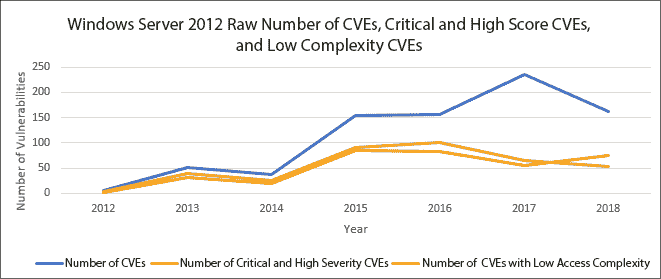</figure>

图 2.23:微软 Windows Server 2012 (2012 年至 2018 年)中的 CVE、关键和高评级严重性 CVE 以及低复杂性 CVE 的数量

截至 2018 年底，Windows Server 2012 在 NVD 拥有 802 个 CVE。在图 2.23 的*中的 7 年间，平均每年有 115 个 CVE，其中 54 个 CVE 被评为关键或高(CVE 细节，未注明)。从 2016 年到 2018 年底，Windows Server 2012 的 CVE 数量增加了 4%，而关键和高严重性 CVE 减少了 47%，低复杂性 CVE 减少了 10%。它非常接近实现我们的漏洞改进框架的目标。如此接近！*

不幸的是，对于 Windows Server 2016 来说，这个故事并不简单。我们只是没有足够的全年数据来了解漏洞披露的趋势。2016 年至 2018 年间，CVE 披露的数据大幅增加(518%)，但这只是因为我们只有 2016 年一个季度的数据。然而，2017 年和 2018 年之间的披露数量基本相同(分别为 251 和 241)。

Windows Server 2012 在 2018 年有 235 项披露，2018 年有 162 项披露(CVE 细节，未注明日期)。这两年平均每年有 199 个 CVE，而 Windows Server 2016 整整两年平均每年有 246 个 CVE。然而，2 年的数据是不够的；我们需要等待更多的数据，以便了解 Windows Server 2016 的表现如何。

<figure class="mediaobject">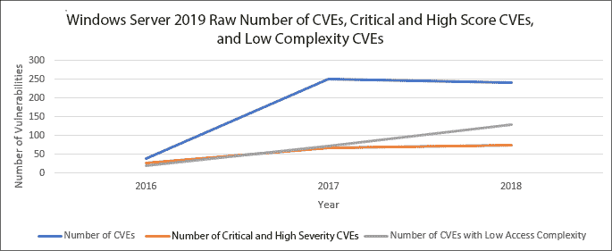</figure>

图 2.24:微软 Windows Server 2016(2016–2018)中 CVE、关键和高评级严重性 CVE 以及低复杂性 CVE 的数量

### Windows 10 漏洞趋势

我将在这里考察的最后一个 Windows 操作系统被称为“有史以来最安全的 Windows 版本”(呃…由我(Ribeiro，n.d .)命名)，Windows 10。这个版本的 Windows 发布于 2015 年 7 月。在撰写本文时，我有 2016 年、2017 年和 2018 年整整三年的数据。截至 2018 年底，Windows 10 在 NVD 共有 748 个 CVEs 平均每年 187 个 CVE 和 76 个严重和高严重性漏洞(CVE 详细信息，未注明日期)。

在这 3 年期间，Windows 10 中的 CVE 数量增加了 48%，而关键和高分 CVE 的数量减少了 25%，低访问复杂性 CVE 的数量增加了 48%。

<figure class="mediaobject">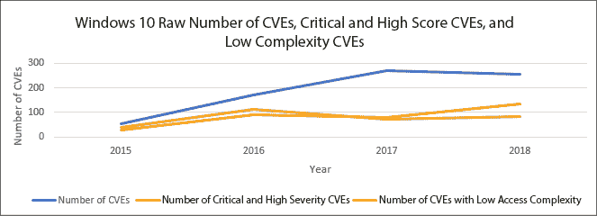</figure>

图 2.25:微软 Windows 10(2015–2018)中的 CVE、关键和高评级严重性 CVE 以及低复杂性 CVE 的数量

<figure class="mediaobject">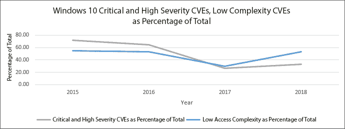</figure>

图 2.26:Microsoft Windows 10 中被评定为严重和高严重性的 CVE 以及低复杂性 CVE 占所有 Microsoft Windows 10 CVEs 的百分比(2015–2018)

2019 年结束时，Windows 10 中有 357 个 CVE，比 2018 年增加了 33%，是自发布以来 CVE 数量最多的一年(CVE 细节，未注明日期)。这个数据没有反映的一个重要因素是，微软已经非常擅长快速修补全球数亿个系统。这非常有助于降低客户的风险。现在让我们来看看其他一些流行的操作系统是否符合我们的标准。

### Linux 内核漏洞趋势

根据 CVE 的详细资料，在撰写本文的时刻，Debian Linux 和 Linux Kernel 在他们追踪的所有产品中拥有最高的 CVE 数量。让我们来看看 Linux 内核的 CVE 趋势。从 1999 年到 2018 年，个人简历的累计总数为 2，163 份，平均每年约 108 份(CVE 细节，未注明)。这是 Windows XP 年平均水平的 3 倍，略低于 Windows Server 2012 年的年平均水平(114)，也远低于 Windows Server 2016 年的年平均水平(177)。平均每年在 Linux 内核中有 37 个关键的和高评级的 CVE。

查看 2016 年至 2018 年底之间的同一三年期，我们可以从下图 2.28 中看到，2016 年至 2017 年期间，CVE 披露量大幅增加。这与我在本章前面讨论的整个行业的趋势是一致的。这似乎是 Linux 内核的短期增长。2019 年结束时，Linux 内核中有 170 个 CVE，低于 2018 年的 177 个(CVE 细节，未注明日期)。

<figure class="mediaobject">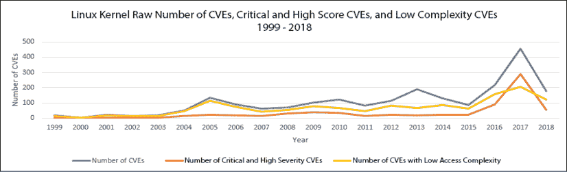</figure>

图 2.27:Linux 内核中 CVE、关键和高评级严重性 CVE 以及低复杂性 CVE 的数量(1999-2018)

从 2016 年到 2018 年底，简历数量减少了 18%，而 7 分及以上的简历数量减少了 38%。同期，低复杂度 CVE 的数量下降了 21%。Linux 内核似乎已经实现了我们的漏洞改进框架的目标。太棒了！

<figure class="mediaobject">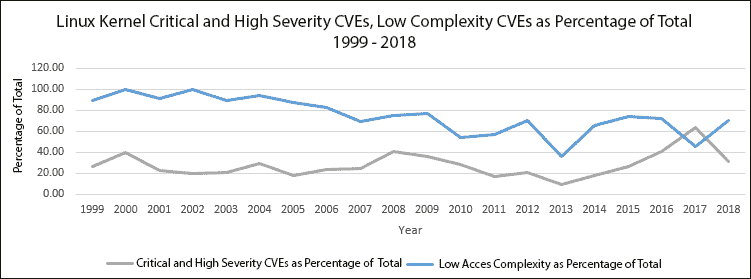</figure>

图 2.28:在所有 Linux 内核 CVE 中，Linux 内核中被评定为严重和高严重性的 CVE 以及低复杂性 CVE 所占的百分比(1999-2018)

### 谷歌 Android 漏洞趋势

我们来看看谷歌制造的移动操作系统 Android。Android 的首次发布日期是在 2008 年 9 月，Android 的 CVEs 于 2009 年开始在 NVD 出现。平均而言，每年有 215 个针对 Android 的 CVE，其中 129 个 CVE 被评为严重或高严重性；在 2009 年至 2014 年的 6 年间，Android 只有 43 个 CVE(CVE 细节，未注明)。Android 中 CVE 的数量在 2015 年开始显著增加，此后一直在增加。

<figure class="mediaobject">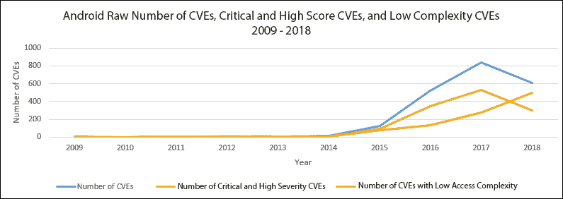</figure>

图 2.29:谷歌安卓系统中 CVE、严重和高评级严重 CVE 以及低复杂性 CVE 的数量(2009-2018)

从 2016 年到 2018 年底的 3 年间，Android 中的 cv 数量增加了 16%，而关键和高分的 cv 数量减少了 14%，但低复杂度的 cv 数量增加了 285%。

根据 CVE 细节(CVE 细节，未注明日期)的数据，2009 年至 2018 年底，为安卓提交的简历总数为 2147 份。

<figure class="mediaobject">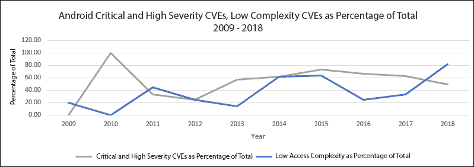</figure>

图 2.30:2009 年至 2018 年期间，Google Android 中被评定为严重和高严重性的 CVE 以及低复杂性 CVE 占所有 Google Android CVEs 的百分比

### 苹果 macOS 漏洞趋势

我在这里考察的最后一个操作系统是苹果的 macOS。在 1999 年至 2018 年期间，有 2094 份简历进入 NVD MAC OS(CVE 详情，未注明日期)。平均每年有 105 例心血管事件，其中约有 43 例严重和高度严重的心血管事件。这和 Linux 内核平均每年 108 个 CVE 非常相似。从*图 2.31* 可以看出，2015 年 CVEs 有较大幅度的增长。

<figure class="mediaobject">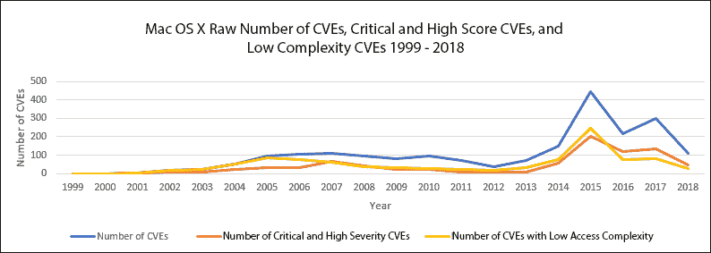</figure>

图 2.31:MAC OS 中 CVE、关键和高评级严重性 CVE 以及低复杂性 CVE 的数量(1999-2018)

从 2016 年初到 2018 年底，MacOS X 的 CVE 数量下降了 49%。严重和高严重性心血管事件的数量减少了 59%。●访问复杂度降低了 66%。MacOS X 实现了我们漏洞改进框架的目标。又干得好，苹果！

<figure class="mediaobject">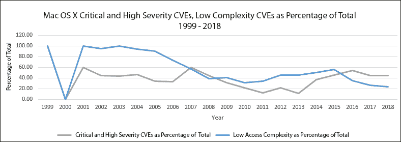</figure>

图 2.32:MAC OS 中严重和高严重性等级的 CVE 和低复杂性 CVE 占所有 CVE 总数的百分比(1999-2018)

### 操作系统漏洞趋势摘要

我们在本章中研究的操作系统是历史上最流行的操作系统之一。当我将我们的漏洞改进框架应用于这些操作系统的漏洞披露数据时，结果喜忧参半。

我检查的微软操作系统没有一个符合我们漏洞改进框架中设定的标准。Windows Server 2012 非常接近，但在我检查的这段时间里，它的 CVEs 确实增加了 4%。调整时间框架可能会导致不同的结论，但我研究的所有操作系统的 CVE 趋势都是在同一时期。微软发布的利用数据显示，由于他们在 Windows 中实现的所有内存安全功能和其他缓解措施，他们产品中漏洞的可利用性非常低(Matt Miller，2019)。这对于漏洞管理团队来说是苦乐参半，因为尽管绝大多数漏洞不能被成功利用，但它们仍然需要修补。然而，在减少利用未打补丁的漏洞方面，很高兴知道微软已经为他们的客户提供了这么多有效的缓解措施。

谷歌 Android 在 2016 年至 2018 年期间没有达到漏洞改善框架中的目标。在此期间，心血管事件略有增加，低复杂性心血管事件增加了 285%。(CVE 详情，未注明日期)

macOS 和 Linux 内核确实符合漏洞改进框架的标准，这些供应商在为客户降低风险方面取得的成就应该得到祝贺和奖励。

<figure class="mediaobject">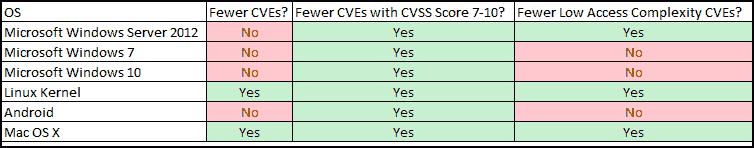</figure>

表 2.4:漏洞改进框架的应用结果(2016–2018)

在表 2.5 中，我为您提供了我所研究的操作系统的 CVE 数据的有趣摘要。Linux 内核和苹果 macOS 从列表中脱颖而出，因为每年严重和高严重性 CVE 的平均数量相对较低。

<figure class="mediaobject">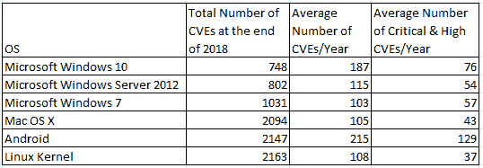</figure>

表 2.5:操作系统的生命统计数据(1999 年至 2018 年)

在我研究 web 浏览器之前，我想指出我在本节中介绍的数据的一个局限性。虽然我能够为每个 Windows 版本分离出 CVE 数据，但我没有为 macOS 版本这么做。类似地，我没有深入研究不同 Linux 发行版的粒度细节来检查定制内核和第三方应用程序的数据。如果你能原谅这个双关语的话，将一个单独的 Windows 版本，比如 Windows 7，与所有的 macOS 版本进行比较，并不像是将苹果与苹果进行比较。需要更多的研究来揭示特定非 Windows 操作系统版本的趋势。

单个操作系统版本的趋势数据可能与作为一个整体的所有版本的结果大相径庭。然而，我提供的数据仍然说明了比特定操作系统版本的趋势更基本的东西，其中许多版本都不再受支持。它展示了这些操作系统供应商多年来的开发和测试过程。换句话说，它说明了供应商的安全标准是什么样的，以及它们是否能够随着时间的推移不断改进。由此，我们可以得出这样的结论:这些供应商中的哪一个擅长于潜在地降低企业的漏洞管理成本，同时也降低企业的风险。

接下来让我们看看网络浏览器中的漏洞趋势，这也受到了世界各地安全研究人员的密切关注。

## Web 浏览器漏洞趋势

网络浏览器吸引了安全研究人员和攻击者的大量注意力。这是因为没有他们很难生活。每个人在台式机、移动设备和服务器上都至少使用一个浏览器。操作系统的开发团队可以在他们的产品中嵌入多层安全特性，但是 web 浏览器往往会通过所有这些基于主机的防火墙和其他安全层带来威胁。众所周知，Web 浏览器很难保护，正如您将从本节的数据中看到的，多年来，所有流行的浏览器都存在大量的漏洞。

关于我在本节中与你分享的网络浏览器数据，只是一个额外的警告。在我为本章分析的所有 NVD、CVE 和 CVSS 的数据中，我对这些数据的准确性最没有信心。这是因为，随着时间的推移，NVD 的 CVE 使用了不同的产品名称，这使得我很难确保拥有完整的数据集。例如，一些用于 Internet Explorer 的 CVE 被标记为“IE”。我尽我所能使用昵称找到了所有的变化，但我不能保证数据是完整和准确的。

1999 年至 2019 年 4 月间的 CVE 数量见*图 2.33* (CVE 详情，未注明)。

<figure class="mediaobject"></figure>

图 2.33:流行网络浏览器中的简历总数(1999 年至 2019 年)

我将深入研究这些数据，并将我们的漏洞改进框架应用于其中一些产品，让您了解这些供应商如何管理世界上一些最流行的 web 浏览器中的漏洞。

### Internet Explorer 漏洞趋势

我们先来考察一下微软**IE 浏览器** ( **IE** )。IE 已经存在很多年了，不同的操作系统发布了不同的版本。我找到了 1999 年至 2018 年间的 1597 份 ie 简历(CVE 详情，未注明日期)。平均每年有 80 个漏洞和 57 个严重和高严重性 CVE。

*图 2.34* 显示了 1999 年至 2018 年期间每年的 CVE 数量、关键和高评级 CVE 数量以及低复杂性 CVE 数量。你可以看到，在 2012 年至 2017 年期间，简历的数量以及关键和高分简历的数量都有大幅增长。

<figure class="mediaobject">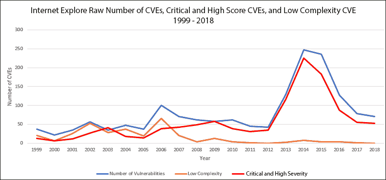</figure>

图 2:34:工业工程(1999-2018 年)中 CVE、关键和高严重性 CVE 以及低复杂性 CVE 的数量

如图 2.37 所示，一个值得注意的数据点是这些年来在 IE 中发现了多少临界额定 CVE。请记住，许多组织会针对披露的每个严重漏洞启动并执行紧急更新流程，因为风险非常高。在 IE 的 1，597 份简历中，有 768 份，也就是 48%，被评为关键(CVE 细节，未注明)。这些简历数量最多的年份是 2013 年、2014 年和 2015 年。微软转向了季度安全更新发布模式，在这种模式下，他们发布累积安全更新，而不是单个更新，以最大限度地减少所有这些 CVE 可能导致的中断。

<figure class="mediaobject"></figure>

图 2.35:工业工程中个人简历的 CVSS 分数分布(1999-2018)

尽管有大量的 CVE 和大量的关键和高评级 CVE，但当我们将这些数据放入我们的漏洞改善框架(重点关注 2016 年至 2018 年底之间的 3 年)时，IE 表现良好。从 2014 年和 2015 年的高点压低 CVE 的努力表现为 2016 年至 2018 年 CVE 下降 44%，关键和高评级 CVE 下降 41%。此外，2018 年的低复杂度 CVE 为零。微软已经达到了我们的漏洞改进框架中的标准，更重要的是，达到了 SDL 的目标。干得好，微软！

接下来，我们来考察一下 Edge 浏览器。

### Microsoft Edge 漏洞趋势

Edge 是微软在 2015 年随 Windows 10 发布的网页浏览器。微软基于从 IE(微软公司，n.d .)吸取的经验教训，对这款浏览器进行了大量的安全增强。

根据 CVE 细节，2015 年至 2018 年底，Edge 有 525 个简历(CVE 细节，未注明)。平均而言，每年有 131 个漏洞和 95 个严重和高严重性 CVE。*图 2.36* 显示了每年这些 CVE 的数量，以及严重和高严重性漏洞的数量，以及低复杂性 CVE 的数量。随着 Edge 发布前未修复的漏洞被发现和披露，CVE 的数量在最初几年迅速攀升。这意味着 Edge 不符合我们漏洞改进框架的标准。然而，2018 年的 CVEs 下降持续到 2019 年，进一步减少了 57%。如果我将 2019 年纳入我的分析，Edge 可能符合标准。

<figure class="mediaobject">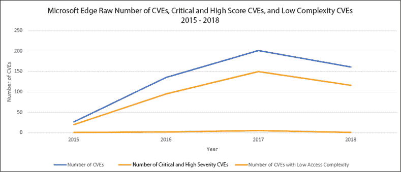</figure>

图 2.36:微软 Edge(2015–2018)中 CVE、关键和高严重性 CVE 以及低复杂性 CVE 的数量

这个分析可能没有实际意义，因为在 2018 年 12 月，微软宣布他们将采用 Chromium 开源项目进行 Edge 开发(微软公司，n.d .)。我们必须等待几年，看看这种变化如何反映在 CVE 的数据中。

接下来我们来考察一下谷歌 Chrome。

### 谷歌浏览器漏洞趋势

谷歌 Chrome 浏览器于 2008 年发布，首先在 Windows 上，然后在其他操作系统上发布。从 2008 年到 2018 年底，Chrome 共有 1680 个 CVE，平均每年 153 个漏洞。平均每年有 68 个漏洞被评为严重或高严重性(CVE 详情，未注明)。如图 2.37 所示，2010 年至 2012 年间，Chrome 的 CVE 大幅增加。在 2016 年至 2018 年底的三年间，心血管事件减少了 44%，低复杂性心血管事件以及严重和高严重性心血管事件减少了 100%。

<figure class="mediaobject">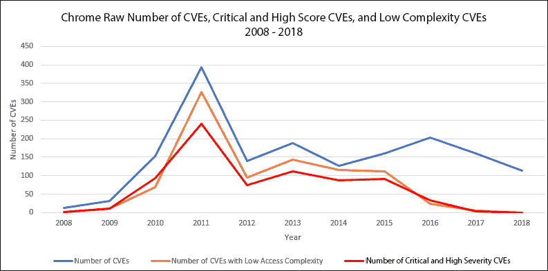</figure>

图 2.37:Google Chrome 中 CVE 的数量，关键和高严重性 CVE 以及低复杂性 CVE(2008-2018)

<figure class="mediaobject">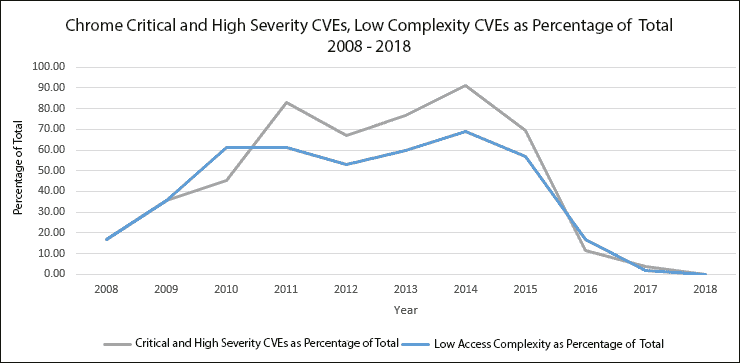</figure>

图 2.38:关键和高严重性等级 CVE 和低复杂性 CVE 占所有 Google Chrome CVEs 的百分比(2008-2018)

Chrome 满足我们漏洞改进框架中的标准。干得好谷歌！

### Mozilla Firefox 漏洞趋势

Mozilla Firefox 是一款流行的网络浏览器，最初发布于 2002 年。CVEs 于 2003 年开始在 NVD 出现。从 2003 年到 2018 年底，Firefox 有 1767 个 CVE，超过了谷歌 Chrome，成为 CVE 最多的浏览器。在此期间，Firefox 平均每年有 110 个 CVE，其中 51 个被评为严重或高度严重(CVE 细节，未注明)。

如*图 2.39* 所示，Firefox 在 2017 年几乎实现了零 CVEs 的理想目标，当时只有一个 CVE 在 NVD 备案。不幸的是，这并没有成为一种趋势，因为 2018 年在 NVD 提交了 333 份简历，这是 Firefox 单年的历史新高。从 2016 年到 2018 年底的 3 年间，CVEs 增长了 150%，关键和高严重性漏洞增长了 326%，而低复杂度 CVEs 增长了 841%。2019 年，简历数量从 333 个减少到更典型的 105 个(CVE 细节，未注明)。

<figure class="mediaobject">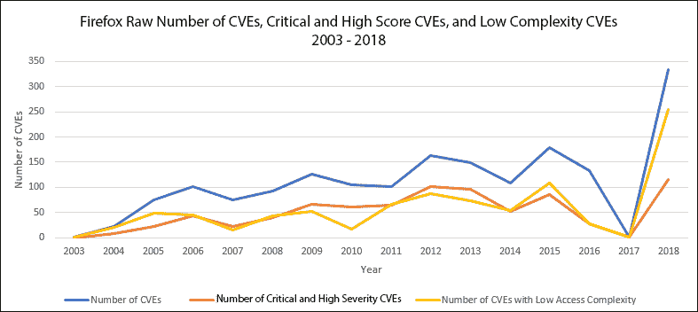</figure>

图 2.39:Firefox 中 CVE、关键和高严重性 CVE 以及低复杂性 CVE 的数量(2003-2018)

如果 Mozilla 能够延续始于 2015 年的漏洞披露趋势，Firefox 将符合我们漏洞改进框架的标准。2017 年*图 2.40* 中的峰值是当年单一 CVE 被评为高严重性和低访问复杂性的结果(CVE 细节，未注明)。

<figure class="mediaobject">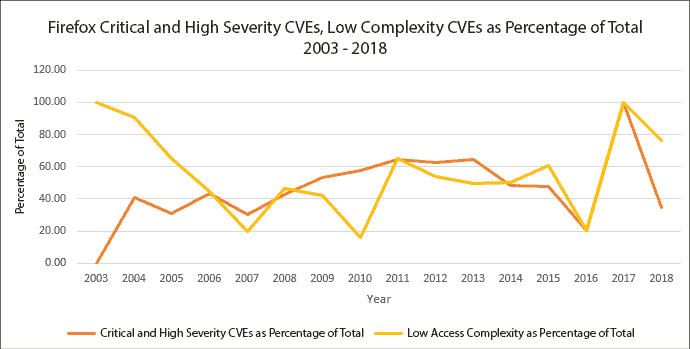</figure>

图 2.40:关键和高严重性等级 CVE 和低复杂性 CVE 占所有 Firefox CVEs 的百分比(2003-2018)

### 苹果 Safari 漏洞趋势

我要考察的最后一个网络浏览器是苹果 Safari 浏览器。苹果最初于 2003 年 1 月发布了 Safari。平均而言，Safari 每年有 60 个漏洞，平均每年有 17 个 CVE 被评为严重或高。从 2003 年到 2018 年底，Safari 中总共披露了 961 份简历。

<figure class="mediaobject">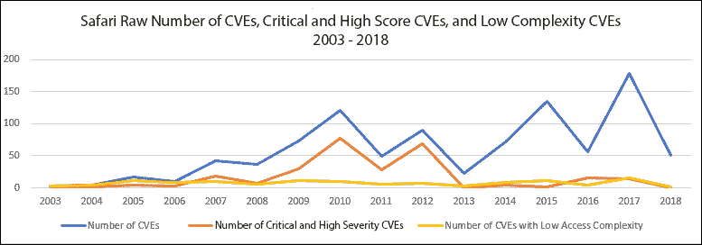</figure>

图 2.41:Apple Safari 中的 CVE 数量、关键和高严重性 CVE 以及低复杂性 CVE(2003 年至 2018 年)

如*图 2.41* 所示，2015 年和 2017 年 Safari 中的 CVE 都有比较大的增长。从 2016 年到 2018 年底，CVE 下降了 11%，关键和高评级 CVE 下降了 100%，低复杂性漏洞下降了 80%(CVE 细节，未注明)。苹果再一次满足了我们漏洞改进框架的标准。

<figure class="mediaobject">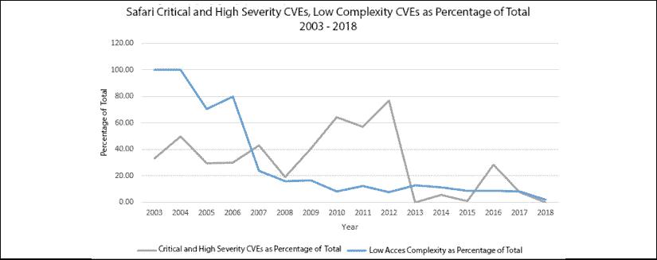</figure>

图 2.42:严重和高严重性等级的 CVE，以及低复杂性 CVE 占所有 Apple Safari CVEs 总数的百分比(2003–2018)

### Web 浏览器漏洞趋势摘要

我检查的三个网络浏览器符合我们的漏洞改进框架的目标。微软的网络浏览器、谷歌的 Chrome 浏览器和苹果的 Safari 浏览器都榜上有名。

<figure class="mediaobject">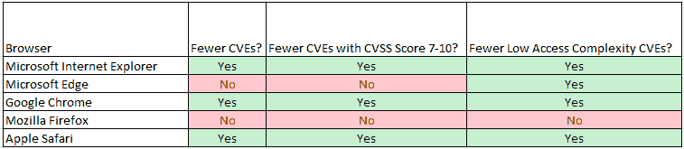</figure>

表 2.6:在此期间(2014–2018 年)应用漏洞改进框架的结果

<figure class="mediaobject">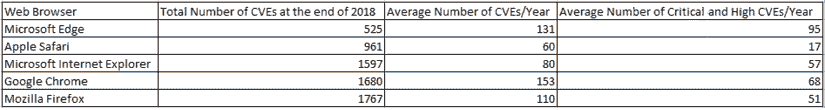</figure>

表 2.7:网络浏览器生命统计(1999 年至 2018 年)

*表 2.7* 总结了我们研究的网络浏览器的一些有趣的 CVE 数据(CVE 详情，未注明日期)。Apple Safari 的突出之处在于其每年平均 CVE 的数量较低，并且严重和高严重性 CVE 的平均数量远低于其他产品。

在将这种类型的数据和分析在 web 浏览器上呈现给真正热爱他们最喜爱的浏览器的人之后，他们通常不相信，有时甚至愤怒，他们最喜爱的浏览器可能有如此多的漏洞。关于数据和分析的有效性的问题通常会很快出现。我与之分享过这类数据的一些人也认为，他们最不喜欢的浏览器中的漏洞数量在某种程度上被低估了。这就像在争论我们最喜欢的汽车品牌！但是记住这个数据在几个方面是不完美的。当然，我们有机会更深入地研究数据，分析特定版本、服务包和发行版的 CVE 趋势，从而更细致地了解浏览器之间的差异。你可以使用我在本章提供的漏洞改进框架来做到这一点。但也许更重要的是，请记住这些数据说明了这些供应商多年来的开发和测试流程表现如何，以及他们是否一直在持续改进。

毕竟 IE 的每个版本都是微软开发的，Safari 的每个版本都是苹果开发的，等等。他们的客户不仅仅使用他们浏览器的一个版本；他们使用其供应商的开发、测试和事件响应流程的输出。要回答的关键问题是，这些供应商中的哪一个在降低风险的同时降低了组织的成本，从而管理了他们的漏洞。让我通过提供一些关于漏洞管理的一般指导来结束本章。

## 漏洞管理指南

运行良好的漏洞管理计划对所有组织都至关重要。正如您在本章的数据和分析中所看到的，整个行业已经披露了许多漏洞，而且数量一直在增加，而不是减少。截至 2019 年底，NVD 共有超过 122，000 家个人简历。攻击者知道这一点，也明白组织要跟上修补其环境中各种硬件和软件产品的工作量和复杂性是多么具有挑战性。防守者必须是完美的，而进攻者只需要好或者运气好一次。让我为您提供一些关于漏洞管理程序的建议。

首先，漏洞管理计划的一个目标是了解漏洞在您的 IT 环境中存在的风险。这不是静止的或缓慢移动的。所有硬件和软件中的漏洞不断被发现。因此，您环境中的漏洞数据很快就会过时。我所遇到的那些决定每季度或每六个月部署一次安全更新的组织对风险有着异乎寻常的偏好；尽管矛盾的是，这些组织中的一些告诉我他们没有风险偏好。遇到这样的人总是很有趣，他们认为他们最优先考虑的风险是他们的供应商，而不是积极寻找利用他们的方法的攻击者骨干。如果有机会，攻击者会很乐意加密他们所有的数据，并索要解密密钥的赎金。

当我遇到有这种政策的组织时，我想知道他们是否真的有数据驱动的风险观，以及最高层的管理人员是否真的了解他们代表整个组织接受的风险。

他们知道 2019 年平均每天有 33.4 个新漏洞被披露，2018 年每天有 45.4 个被披露吗？如果他们每季度修补一次，这相当于 2018 年有 4082 个漏洞可能长达 90 天没有修补，2019 年有 3006 个漏洞。对于每半年修补一次的组织，这一数字将翻倍。平均而言，超过三分之一的漏洞被评为严重或高度。攻击者只需在正确的系统中找到一个可利用的漏洞，就可以成功地破坏环境。这些组织大多需要专注于构建非常高效的漏洞管理计划，以在更合理的时间内降低风险，而不是避免修补和重启系统来最大限度地减少业务中断。攻击者在脆弱且长期未打补丁的环境中拥有巨大优势。

对于大多数组织，我的建议是漏洞管理团队每天扫描一切。如果有必要，再读一遍那句台词。还记得我在本书序言部分用的潜艇类比吗？你的弱点管理程序是你寻找潜艇船体缺陷的方法之一。每天扫描您环境中的每一项资产的漏洞，将有助于识别船体中的裂缝和缺陷，如果被利用，将会使船沉没。每天扫描所有内容以发现漏洞和错误配置，这为组织提供了重要的数据，有助于他们做出风险决策。没有最新的数据，他们是在不知情的情况下管理风险。

然而，值得注意的是，移动设备，尤其是各种自带设备，对漏洞管理团队构成了巨大的挑战。大多数组织根本无法像扫描其他资产一样扫描这些设备。这就是为什么许多网络安全专业人士将 BYOD 称为“带来自己的灾难”的一个原因。相反，限制移动设备访问敏感信息和 HVAs 更为常见。要求更新的操作系统版本和最低补丁级别才能连接到公司网络也很常见。为此，在过去的年中，我见过的大多数企业都采用了**移动设备管理** ( **MDM** )或**移动应用管理** ( **MAM** )解决方案。

对于一些组织来说，每天扫描所有内容将需要比目前更多的资源。例如，他们可能需要比目前更多的漏洞扫描引擎，以便每天扫描 100%的 IT 资产。他们可能还希望在非工作时间进行扫描，以减少在正常工作时间进行扫描所产生的网络流量。这可能意味着他们必须每晚在规定的时间内扫描所有内容。为此，他们需要足够数量的漏洞扫描引擎和人员来管理它们。一旦他们掌握了环境状态的最新数据，就可以利用这些数据做出基于风险的决策；例如，何时应该解决新发现的漏洞和错误配置。如果没有关于环境状况的最新数据，hope 将在其脆弱性管理策略中继续发挥核心作用。

所有这些漏洞扫描产生的数据对 CISOs 来说都是金粉，尤其是对于相对不成熟的安全程序。向首席执行官和董事会提供该计划的数据可以帮助首席信息官获得他们需要的资源，并传达他们在安全计划方面取得的进展。提供清单中资产数量的细目分类、他们实际上可以管理多少个漏洞、存在的严重和高严重性漏洞的数量，以及解决所有这些漏洞所需时间的估计，可以帮助构建有效的业务案例，从而增加对漏洞管理计划的投资。向高级管理层提供这样的定量数据有助于他们理解现实与观点。如果没有这些数据，就很难做出令人信服的业务案例，也很难根据安全计划的目标交流进展情况。

云可以以非常积极的方式改变与漏洞管理相关的成本和工作。我将在第 8 章、*云——安全和合规性的现代方法*中讨论这一点。

# 章节总结

希望我没有在这一章用太多的科学蒙蔽你——有很多数字需要消化！请允许我回顾一下本章的一些要点。

风险是概率和影响的结合。通用脆弱性评分系统(CVSS)用于评估国家脆弱性数据库(NVD)中每个脆弱性(CVE)的风险。这些数据应该用于通知您的漏洞管理程序。使用已经成功减少其产品中漏洞数量的供应商可能会减少与您的漏洞管理计划相关的时间、精力和成本。如果您选择的供应商也投资于降低攻击者的投资回报，使其产品中的漏洞难以或不可能被利用，那么您也将降低您的风险和成本。

在本章研究的供应商中，只有苹果公司在过去 5 年中通过减少其产品中的漏洞数量、降低其产品中漏洞的严重性以及减少低访问复杂性漏洞(风险最高的漏洞)的数量，达到了我们的漏洞改善框架的标准。我检查的操作系统在 3 年内实现了我们的漏洞改进框架的目标，它们是 Linux 内核和苹果 macOS。我检查的 2016 年至 2018 年期间漏洞管理记录最佳的网络浏览器包括苹果 Safari、谷歌 Chrome 和微软 Internet Explorer。在这三年中，这些浏览器的漏洞管理方式降低了用户面临的风险。

请记住，用于这些比较的数据有许多偏差，并且不完整或不完全准确。但是你可以做你自己的 CVE 研究，使用我提供的非正式的“漏洞改进框架”。

每天扫描一切的漏洞管理团队为其组织提供了管理风险的最佳可见性。来自漏洞管理计划的数据为 CISOs 提供了一些他们需要的数据，以管理其安全计划的性能并引导未来对这些计划的投资。

在下一章中，我们将深入研究来自全球数亿个系统的恶意软件感染数据，以了解威胁形势在这些年是如何演变的。您知道 GDP 等社会经济因素与地区恶意软件感染率有关吗？我们也要看看这个。此外，我将为您提供一些使用威胁情报的提示和最佳实践。

# 参考

1.  南卡罗来纳州布莱恩·马丁(2013 年 12 月 3 日)。 *Black Hat USA 2013 -接受偏见:为什么漏洞统计如此糟糕*。从 YouTube 上检索到:[T3】https://www.youtube.com/watch?time_continue=20&v = 3s 0x 0 ujgrq 4sT5】](https://www.youtube.com/watch?time_continue=20&v=3Sx0uJGRQ4s)
2.  常见漏洞和暴露。(未注明日期)。 *CVE 编号机关*。从常见漏洞和暴露中检索到:【https://cve.mitre.org/cve/cna.html】[T3T5】](https://cve.mitre.org/cve/cna.html)
3.  CVE 细节。(2020 年 1 月 1 日)。*按“独特”漏洞总数排名前 50 的供应商*。从 https://www.cvedetails.com/top-50-vendors.php 检索到的详细信息:[T3T5】](https://www.cvedetails.com/top-50-vendors.php)
4.  CVE 细节。(未注明日期)。*苹果产品清单*。检索自 CVE 详情:[https://www . CVE Details . com/product-list/vendor _ id-49/apple . html](https://www.cvedetails.com/product-list/vendor_id-49/Apple.html)
5.  CVE 细节。(未注明日期)。*苹果 Mac OS X 漏洞详情*。从 https://www.cvedetails.com/product/156/Apple-Mac-Os-X.html?取回[细节:vendor _ id = 49](https://www.cvedetails.com/product/156/Apple-Mac-Os-X.html?vendor_id=49)
6.  CVE 细节。(未注明日期)。*苹果 Safari 漏洞统计*。从 https://www.cvedetails.com/product/2935/Apple-Safari.html?取回[细节:vendor _ id = 49](https://www.cvedetails.com/product/2935/Apple-Safari.html?vendor_id=49)
7.  CVE 细节。(未注明日期)。*苹果漏洞统计*。从 https://www.cvedetails.com/vendor/49/Apple.html 检索到的详细信息:[T3T5】](https://www.cvedetails.com/vendor/49/Apple.html )
8.  CVE 细节。(未注明日期)。*谷歌 Android 漏洞统计*。检索自 CVE 详情:[T3】https://www . CVE Details . com/product/19997/Google-Android . html？vendor _ id = 1224T5】](https://www.cvedetails.com/product/19997/Google-Android.html?vendor_id=1224 )
9.  CVE 细节。(未注明日期)。*谷歌 Chrome 漏洞详情*。检索自 CVE 详情:[T3】https://www . CVE Details . com/product/15031/Google-chrome . html？vendor _ id = 1224T5】](https://www.cvedetails.com/product/15031/Google-Chrome.html?vendor_id=1224 )
10.  CVE 细节。(未注明)。*谷歌产品列表*。检索自 CVE 详情:[https://www . CVE Details . com/product-list/vendor _ id-1224/Google . html](https://www.cvedetails.com/product-list/vendor_id-1224/Google.html)
11.  CVE 细节。(未注明日期)。*谷歌漏洞统计*。从 https://www.cvedetails.com/vendor/1224/Google.html 检索到的详细信息:[T3T5】](https://www.cvedetails.com/vendor/1224/Google.html)
12.  CVE 细节。(未注明日期)。它是如何工作的？从 CVE 取回详情:[T3【https://www.cvedetails.com/how-does-it-work.php】T5】](https://www.cvedetails.com/how-does-it-work.php)
13.  CVE 细节。(未注明日期)。 *IBM 产品清单*。检索自 CVE 详情:[T3】https://www . CVE Details . com/product-list/product _ type-/first char-/vendor _ id-14/page-1/products-by-name . html？sha = 6d 92323 b7a 6590 a46e 9131 E6 E1 f 4a 17 a 96434 ea 7&order = 3&TRC = 1056T5】](https://www.cvedetails.com/product-list/product_type-/firstchar-/vendor_id-14/page-1/products-by-name.html?sha=6d92323b7a6590a46e9131e6e1f4a17a96434ea7&order=3&trc=1056)
14.  CVE 细节。(未注明日期)。 *IBM 漏洞统计*。从 https://www.cvedetails.com/vendor/14/IBM.html 检索到的详细信息:[T3T5】](https://www.cvedetails.com/vendor/14/IBM.html)
15.  CVE 细节。(未注明日期)。 *Linux 内核漏洞统计*。检索自 CVE 详情:[T3】https://www . CVE Details . com/product/47/Linux-Linux-kernel . html？vendor _ id = 33](https://www.cvedetails.com/product/47/Linux-Linux-Kernel.html?vendor_id=33)
16.  CVE 细节。(未注明日期)。*微软 Edge 漏洞统计*。检索自 CVE 详情:[T3】https://www . CVE Details . com/product/32367/Microsoft-edge . html？vendor _ id = 26](https://www.cvedetails.com/product/32367/Microsoft-Edge.html?vendor_id=26)
17.  CVE 细节。(未注明日期)。*微软 Internet Explorer 漏洞详情*。检索自 CVE 详情:[T3】https://www . CVE Details . com/product/9900/Microsoft-Internet-explorer . html？vendor _ id = 26](https://www.cvedetails.com/product/9900/Microsoft-Internet-Explorer.html?vendor_id=26)
18.  CVE 细节。(未注明日期)。*微软产品清单*。检索自 CVE 详情:[T3】https://www . CVE Details . com/product-list/product _ type-/first char-/vendor _ id-26/page-1/products-by-name . html？sha = 4b 975 BDF 63b 781745 f 458928790 E4 c8 FD 6a 77 f 94&order = 3&TRC = 525T5】](https://www.cvedetails.com/product-list/product_type-/firstchar-/vendor_id-26/page-1/products-by-name.html?sha=4b975bdf63b781745f458928790e4c8fd6a77f94&order=3&trc=525)
19.  CVE 细节。(未注明日期)。*微软漏洞统计*。从 https://www.cvedetails.com/vendor/26/Microsoft.html 检索到的详细信息:[T3T5】](https://www.cvedetails.com/vendor/26/Microsoft.html )
20.  CVE 细节。(未注明)。 *Mozilla Firefox 漏洞详情*。检索自 CVE 详情:[T3】https://www . CVE Details . com/product/3264/Mozilla-Firefox . html？vendor _ id = 452T5】](https://www.cvedetails.com/product/3264/Mozilla-Firefox.html?vendor_id=452 )
21.  CVE 细节。(未注明日期)。 *Mozilla Firefox 漏洞统计*。检索自 CVE 详情:[T3】https://www . CVE Details . com/product/3264/Mozilla-Firefox . html？vendor _ id = 452T5】](https://www.cvedetails.com/product/3264/Mozilla-Firefox.html?vendor_id=452)
22.  CVE 细节。(未注明日期)。*甲骨文产品清单*。检索自 CVE 详情:[T3】https://www . CVE Details . com/product-list/product _ type-/first char-/vendor _ id-93/page-1/products-by-name . html？sha = b4dc 68699904240 f1 eab 0 f 9453 FB 5a 2 f 9213 a78 f&order = 3&TRC = 644T5】](https://www.cvedetails.com/product-list/product_type-/firstchar-/vendor_id-93/page-1/products-by-name.html?sha=b4dc68699904240f1eab0f9453fb5a2f9213a78f&order=3&trc=644)
23.  CVE 细节。(未注明日期)。 *Oracle 漏洞统计*。从 https://www.cvedetails.com/vendor/93/Oracle.html 检索到的详细信息:[T3T5】](https://www.cvedetails.com/vendor/93/Oracle.html)
24.  CVE 细节。(未注明日期)。*按“独特”漏洞总数排名前 50 的产品*。从 https://www.cvedetails.com/top-50-products.php 检索到的详细信息:[T3T5】](https://www.cvedetails.com/top-50-products.php)
25.  CVE 细节。(未注明日期)。*按“独特”漏洞总数排名前 50 的产品*。从 https://www.cvedetails.com/top-50-products.php 检索到的详细信息:[T3T5】](https://www.cvedetails.com/top-50-products.php)
26.  CVE 细节。(未注明日期)。 *Windows 10 漏洞详情*。检索自 CVE 详情:[T3】https://www . CVE Details . com/product/32238/Microsoft-Windows-10 . html？vendor _ id = 26](https://www.cvedetails.com/product/32238/Microsoft-Windows-10.html?vendor_id=26)
27.  CVE 细节。(未注明日期)。 *Windows 7 漏洞统计*。检索自 CVE 详情:[T3】https://www . CVE Details . com/product/17153/Microsoft-Windows-7 . html？vendor _ id = 26](https://www.cvedetails.com/product/17153/Microsoft-Windows-7.html?vendor_id=26)
28.  CVE 细节。(未注明日期)。 *Windows Server 2012 漏洞详情*。检索自 CVE 详情:[T3】https://www . CVE Details . com/product/23546/Microsoft-Windows-Server-2012 . html？vendor _ id = 26](https://www.cvedetails.com/product/23546/Microsoft-Windows-Server-2012.html?vendor_id=26)
29.  CVE 细节。(未注明日期)。 *Windows Server 2016 漏洞详情*。检索自 CVE 详情:[T3】https://www . CVE Details . com/product/34965/Microsoft-Windows-Server-2016 . html？vendor _ id = 26](https://www.cvedetails.com/product/34965/Microsoft-Windows-Server-2016.html?vendor_id=26)
30.  CVE 细节。(未注明日期)。 *Windows XP 漏洞统计*。检索自 CVE 详情:[T3】https://www . CVE Details . com/product/739/Microsoft-Windows-XP . html？vendor _ id = 26](https://www.cvedetails.com/product/739/Microsoft-Windows-Xp.html?vendor_id=26)
31.  马特·米勒，男(2019 年 2 月 14 日)。 *BlueHat IL 2019 -马特米勒*。从 YouTube 上检索到:[T3【https://www.youtube.com/watch?v=PjbGojjnBZQ】T5】](https://www.youtube.com/watch?v=PjbGojjnBZQ)
32.  微软公司。(2020 年 1 月)。*对 Windows 7 的支持已经结束*。从微软公司检索:[https://www . Microsoft . com/en-us/windows/windows-7-end-of-life-support-information](https://www.microsoft.com/en-us/windows/windows-7-end-of-life-support-information )
33.  微软公司。(未注明日期)。*微软 Edge:打造更安全的浏览器*。检索自微软:[https://blogs . windows . com/msedgedev/2015/05/11/Microsoft-edge-building-a-safer-browser/# tfljzdzg 1 lorhcy 3.97](https://blogs.windows.com/msedgedev/2015/05/11/microsoft-edge-building-a-safer-browser/#tFLjZDzG1LORHcy3.97 )
34.  微软公司。(未注明日期)。*微软 Edge:通过更多开源合作让网络变得更好*。检索自微软:[https://blogs . windows . com/windows experience/2018/12/06/Microsoft-edge-making-the-web-better-through-more-open-source-collaboration/# 53 ueshz 9 btu HB 1g . 97](https://blogs.windows.com/windowsexperience/2018/12/06/microsoft-edge-making-the-web-better-through-more-open-source-collaboration/#53oueSHZ9BtuhB1G.97)
35.  微软。(未注明日期)。*安防工程*。从微软检索到:【https://www.microsoft.com/en-us/securityengineering/sdl】[T3T5】](https://www.microsoft.com/en-us/securityengineering/sdl)
36.  NIST。(未注明日期)。从国家漏洞数据库中检索:[https://nvd.nist.gov/vuln](https://nvd.nist.gov/vuln)
37.  NIST。(未注明日期)。*常见漏洞评分系统计算器*。从国家漏洞数据库中检索到:【https://nvd.nist.gov/vuln-metrics/cvss/v3-calculator】
38.  NIST。(未注明日期)。 *CVE-2018-8653 详情*。从国家漏洞数据库中检索到:【https://nvd.nist.gov/vuln/detail/CVE-2018-8653】
39.  NIST。(未注明日期)。*漏洞度量*。从国家漏洞数据库中检索到:【https://nvd.nist.gov/vuln-metrics/cvss】
40.  里贝罗河(未标明)。*了解 Windows 10 的安全优势*。检索自 BizTech:[https://BizTech magazine . com/article/2016/04/understanding-security-benefits-windows-10](https://biztechmagazine.com/article/2016/04/understanding-security-benefits-windows-10)
41.  维基百科。(未注明日期)。*常见漏洞评分系统*。从维基百科检索:[https://en . Wikipedia . org/wiki/Common _ Vulnerability _ Scoring _ System](https://en.wikipedia.org/wiki/Common_Vulnerability_Scoring_System)
42.  维基百科。(未注明日期)。*零项目*。从维基百科检索:【https://en.wikipedia.org/wiki/Project_Zero】[T3T5】](https://en.wikipedia.org/wiki/Project_Zero)