# 三、威胁格局的演变——恶意软件

我一直认为恶意软件是“攻击者自动化”的同义词。“恶意软件的提供者出于各种动机寻求破坏系统，正如我在第一章第一章第一节和 T2 中所描述的，这是一个成功的网络安全策略的要素。任何发送和接收电子邮件、网上冲浪或接受其他形式输入的系统都可能受到攻击，不管它是在雷蒙德、罗利、库比蒂诺、赫尔辛基还是其他任何地方制造的。AV-TEST Institute 是世界上首屈一指的独立反病毒测试实验室之一，位于德国，拥有世界上最大的恶意软件集合之一。(AV-Test Institute，2020)他们已经积累了超过 15 年的收藏。”每天，AV-TEST Institute 登记超过 350，000 个新的恶意程序(恶意软件)和潜在不需要的应用程序(PUA)" (AV-Test Institute，2020 年)。他们发布的统计数据表明，在 2011 年至 2019 年期间，恶意软件的总量每年都在增加，开始时检测到 6526 万个恶意软件样本，结束时检测到 10.4032 亿个恶意软件样本(增加了 16 倍)(AV-Test Institute，2020)。根据 AV-Test 在其年度安全报告中公布的数据，2016 年为 Windows 操作系统开发的恶意软件的份额为 69.96%(AV-Test Institute，2017)，2017 年为 67.07%(AV-Test Institute，2018)，2018 年为 51.08%(AV-Test Institute，2019)。

这些年恶意软件样本份额第二高的操作系统是谷歌 Android，每年报告的份额不到 7%(AV-Test Institute，2020)。2019 年 3 月，针对 Linux 操作系统检测到的新恶意软件样本数量为 41，161 个(现有最新数据)，而同期针对 Windows 的恶意软件样本数量为 6，767，397 个(相差 198%)(AV-Test Institute，2019)。本月 macOS 的恶意软件样本从上个月的 8，057 个激增至 11，461 个(AV-Test Institute，2019)。

这些数据清楚地表明恶意软件作者选择的平台是 Windows 操作系统。也就是说，与任何其他平台相比，开发了更多独特的恶意软件来攻击基于 Windows 的系统。一旦 Windows 系统遭到破坏，攻击者通常会获取软件和游戏密钥、财务信息(如信用卡号)以及其他机密信息，他们可以用这些信息来窃取身份，有时还会控制系统及其数据以获取赎金。许多攻击者会将受损系统用作平台，利用受损系统提供给他们的匿名性来实现攻击。

鉴于攻击者更多地瞄准和利用基于 Windows 的系统，而不是任何其他平台，并且鉴于 Windows 无处不在，安全专家需要了解攻击者如何以及在何处使用这些系统。ciso、有抱负的 ciso、安全团队和网络安全专家可以从了解基于 Windows 的系统如何受到攻击中受益，至少在以下几个方面:

*   负责其环境中 Windows 系统的 CISOs 和安全团队应该了解攻击者是如何用恶意软件攻击基于 Windows 的系统的，以及这种攻击是如何随着时间的推移而演变的:
    *   了解恶意软件将有助于安全团队更好地开展工作。
    *   这些知识有助于识别一些安全供应商用来销售其产品和服务的恐惧、不确定性和怀疑；了解攻击者如何使用恶意软件将有助于 CISOs 做出更好的安全相关投资和决策。
*   负责基于 Linux 的系统和其他非微软操作系统的 CISOs 和安全团队应该对他们的对手如何危害和利用 Windows 系统攻击他们有所了解。攻击者不在乎他们所攻击的技术是在雷蒙德、罗利、库比蒂诺还是东亚某大国开发的；我们可以从 Windows 生态系统中吸取经验教训，这也适用于基于 Linux 的系统和其他平台，并向它们学习。通常，恶意软件作者在 Windows 平台上使用的方法会被用来攻击其他平台，尽管通常规模较小。了解恶意软件作者的方法对于安全团队来说非常重要，不管他们保护的是什么类型的系统。不幸的是，CISOs 无法排除基于 Windows 的威胁，即使他们的环境中不使用 Windows。
*   最后，在我看来，网络安全主题专家很难使用这个绰号，如果他们幸福地不知道在线生态系统中的恶意软件趋势，这个生态系统由超过 10 亿个系统组成，支持世界上超过一半的恶意软件。无论有更多的移动设备、更多的物联网设备，还是更安全的操作系统，都无关紧要。不可否认，Windows 无处不在。随后，所有网络安全专家都应该对全球威胁格局中的最大参与者有所了解。

本章将提供一个独特的、详细的、数据驱动的视角，展示恶意软件在过去十年中是如何在全球范围内发展的，在某些情况下，我将提供更长时间的数据。在区域恶意软件遭遇率和感染率方面有一些非常有趣的差异，我也将在本章中深入探讨。这种对威胁形势的看法将有助于 CISOs 和安全团队了解他们所面临的恶意软件威胁是如何随着时间的推移而变化的。这些数据不仅非常有趣，而且有助于消除人们对恶意软件以及如何管理其带来的风险的担忧、不确定性和疑虑。

我还会给你一些指点，告诉你如何识别好的威胁情报，而不是我今天在行业经常看到的废话；在我在微软工作期间发表了数千页的威胁情报后，我有一些提示和技巧与您分享，我想您会喜欢的。

在本章中，我们将讨论以下主题:

*   Windows 威胁情报的一些数据来源
*   定义恶意软件类别以及如何衡量它们的流行程度
*   全球恶意软件演变和趋势
*   中东、欧盟、东欧和俄罗斯、亚洲以及北美和南美的区域性恶意软件趋势
*   如何识别好的威胁情报

在我向你介绍我在本章中使用的数据来源之前，让我们从一个有趣的、希望有点娱乐性的故事开始。

# 介绍

2003 年，当我在微软面向客户的事件响应团队工作时，我们开始有规律地在受损系统上发现用户模式 rootkit，以至于我们最好的工程师之一开发了一个工具，可以发现隐藏在 Windows 中的用户模式 rootkit。用户模式 rootkit 运行起来就像普通用户运行的任何其他应用程序一样，但它隐藏自己。后来，有一天，我们接到一位微软支持工程师的电话，他正在帮助解决一位客户在 Exchange 电子邮件服务器上遇到的一个问题。问题的症状是每隔几天，服务器就会蓝屏一次。支持工程师无法找出原因，正在进行远程调试会话，试图找到导致服务器蓝屏的代码。这花了几个星期，但一旦他找到了导致蓝屏的代码，他就无法解释这是什么代码，也无法解释它是如何安装在服务器上的。这是他打电话给我们求助的时候。

当服务器蓝屏并重启时，这使我们能够从系统中查看部分内存转储。经过几天的分析，我们确定服务器受到了前所未有的威胁。系统上的设备驱动程序隐藏了自身和其他组件。我们发现了我们在野外见过的第一个内核模式 rootkit。

这是一件大事。与用户模式 rootkit 不同，开发和安装内核模式 rootkit 需要惊人的专业知识。这是因为这种类型的 rootkit 运行在操作系统最有特权的部分，很少有人真正理解。当时，尽管安全专家讨论了内核模式 rootkitss 的概念，但发现在企业生产环境中运行的服务器上安装了内核模式 rootkit，表明攻击者变得比过去更加老练。从用户模式 rootkit 升级到内核模式 rootkit 是恶意软件进化过程中的一次重大飞跃。

对我们的事件响应团队来说，这是一个行动号召。我们必须让微软的 Windows 内核开发人员知道，让 Windows 成为可信计算基础的东西——它的内核——正受到老练的恶意软件作者的直接攻击。在那之前，在野外运行的内核模式 rootkit 是虚构的。但是现在，我们有证据表明这些 rootkits 是真实的，正被用来攻击企业客户。我们安排了一次与 Windows 内核开发团队的首席开发人员、测试人员和项目经理的会议。我们聚集在一个用于培训的房间里，有一个高射投影仪，这样我们可以引导开发人员通过我们从受损服务器获得的内存转储，向他们展示 rootkit 是如何工作的。我们向他们提供了一些关于服务器的上下文，比如它在哪里运行、操作系统版本、服务包级别、服务器上运行的所有应用程序的列表等等。我们回答了许多关于我们如何调试蓝屏的来源，找到隐藏的驱动程序，并发现它如何工作的问题。

起初，Windows 内核团队完全怀疑我们发现了一个运行在 Windows 服务器上的内核模式 rootkit。但是在我们展示了所有证据并向他们展示了调试细节之后，他们逐渐接受了这是一个内核模式 rootkit 的事实。我们的团队期待着对我们所做的所有非常技术性的工作的奉承和尊重，以及我们对 Windows 内核内部的专业知识，这使我们能够做出这一发现。相反，内核开发者告诉我们，我们的工具和方法和恶意软件作者一样糟糕。他们警告我们停止使用我们的工具来寻找 rootkits，因为这些工具可能会使他们运行的 Windows 系统不稳定，除非重新启动。最后，他们提出不做任何事情来加固内核，以防止将来发生这样的攻击。对我们来说，这是一次令人失望的会议，但你不可能赢得所有人！

在 2003 年和 2004 年大规模蠕虫攻击成功后，这种论调发生了变化。整个 Windows 团队停止了他们在后来成为 Windows Vista 的开发工作。相反，他们致力于提高 Windows XP 和 Server 2003 的安全性，发布了 Windows XP Service Pack 2 和 Windows Server 2003 Service Pack 1。甚至有人谈到了代号为 Palladium 的新版本 Windows，它有一个安全内核来帮助减少像我们发现的这种 rootkits，但它从未实现过(维基百科，未注明日期)。最终，我们在检测内核模式 rootkits 方面的工作确实有助于推动积极的变化，因为未来的 64 位版本 Windows 不允许安装内核模式驱动程序，就像我们发现的那样，除非它们有有效的数字签名。

在我在微软职业生涯的后期，我有机会与微软反恶意软件研究和响应实验室的世界级恶意软件研究人员和分析师一起工作，他们保护了 10 亿个系统免受数百万个新恶意软件的威胁。像我们 4、5 年前发现的内核模式 rootkit 这样的恶意软件现在已经成了商品。攻击者利用大规模自动化和服务器端多态性，每周创建数百万个独特的恶意软件。为了赢得这场战争，反病毒行业将不得不拥有比大型商用恶意软件供应商更大、更好的自动化，这已被证明是难以完成的。

# 为什么与其他平台相比，Windows 上的恶意软件如此之多？

如今，连接互联网的移动设备肯定比基于 Windows 的系统多。随着苹果、谷歌、三星和其他公司将非常受欢迎的产品推向全球市场，移动设备的采用呈爆炸式增长。但是如果有更多的移动设备，难道不应该有更多的为这些平台开发的恶意软件吗？

这个问题的答案在于应用程序如何在这些生态系统中分布。苹果的应用商店改变了行业的游戏规则。它不仅让 iPhone 用户轻松找到并安装应用程序，而且几乎完全消除了基于 iOS 设备的恶意软件。

苹果之所以能够做到这一点，是因为它让 App Store 成为消费者唯一可以安装应用程序的地方(越狱除外)。**独立软件供应商**(**ISV**)想要把他们的应用程序下载到消费者基于 iOS 的设备上，比如 iPhones 和 iPads，需要把他们的应用程序下载到苹果的应用程序商店。要做到这一点，这些应用程序需要满足苹果的安全要求，他们在幕后验证这些要求。这使得 App Store 成为阻止恶意软件进入苹果设备的完美瓶颈。

相比之下，微软的 Windows 是在更幼稚的时代开发的，当时没有人能够预测到，有一天，Windows 生态系统中的恶意文件会比合法文件更多。对开发者来说，Windows 的一大优势是他们可以为 Windows 开发软件，并直接销售给消费者和企业。几十年来，这种模式一直是个人电脑的主要软件分发模式。由于软件可以被安装而不考虑其出处，并且确定其可信度的能力有限，恶意软件在这个生态系统中盛行并继续如此。几十年来，微软采取了许多措施来对抗这种软件分发模式的“副作用”,但收效甚微。

一些人会认为 Android 生态系统已经在这两个极端之间结束了。谷歌也有一个应用商店，叫做 Google Play。谷歌也已经采取措施，尽量减少这个应用商店中的恶意软件。然而，基于 Android 设备的第三方应用商店并没有都保持谷歌的高安全标准，从而允许这些设备的恶意软件进入生态系统。但是，正如我前面提到的，在基于 Android 的设备上检测到的恶意软件样本数量比基于 Windows 的设备少很多倍。

软件分发模式的这些差异，至少部分地，有助于解释为什么为 Windows 开发的恶意软件比其他平台多得多。网络安全专业人员可以从他们自己的 IT 环境中吸取一些经验教训。控制软件引入企业 it 环境的方式也有助于最大限度地减少 IT 中的恶意软件数量。这是利用**持续集成** ( **CI** )/ **持续部署** ( **CD** )管道的一个优势。CI/CD 管道可以帮助企业构建自己的应用商店，并限制软件引入其环境的方式。

既然我们已经简要讨论了软件分发模型如何影响恶意软件的分发，那么让我们深入探讨恶意软件。安全团队可以从研究为 Windows 操作系统开发的恶意软件中学到很多东西，即使他们自己不使用 Windows。恶意软件作者在 Windows 上采用的方法可以并且已经被用于针对包括 Linux 在内的许多不同平台开发的恶意软件。研究恶意软件在最大的恶意软件生态系统中是如何工作的，可以帮助我们在几乎所有其他地方防范它。但是，在我深入研究恶意软件趋势数据之前，了解我将向您展示的数据的来源是很重要的。威胁情报的好坏取决于它的来源，所以让我们从这里开始。

# 数据来源

本章数据的主要来源是微软安全情报报告(微软公司，未注明)。在我与 **微软恶意软件保护中心**(**MMPC**)的研究人员和分析师一起工作期间，我是微软安全情报报告 的执行编辑和撰稿人，我们称之为*在我帮助制作《先生》的 8、9 年间，我们出版了超过 20 册和特别版的这份报告，篇幅长达数千页。我为世界各地的客户提供了数千次威胁情报简报，以及媒体和分析师采访。这些报告的每一页我都读了一遍又一遍，我非常了解这些数据的来龙去脉。*

 *这些报告中的数据来自微软的反恶意软件产品，包括恶意软件删除工具、微软安全扫描程序、微软安全基础软件、微软系统中心端点保护、Windows Defender、Windows Defender 高级威胁保护、Windows Defender 脱机版、Azure 安全中心和微软网络浏览器内置的 SmartScreen 过滤器。为本报告提供有价值数据的其他非安全产品和服务包括 Exchange Online、Office 365 和 Bing。让我更详细地解释一下这组折衷的数据源如何帮助描绘一幅全面的威胁图景。

## 恶意软件清除工具

**恶意软件移除工具** ( **MSRT** )是一个有趣的工具，提供有价值的数据(微软公司，未标明)。在 Blaster 蠕虫攻击之后(有变种)(微软公司，未注明)，2003 年夏天，微软开发了一个免费的“Blaster 删除工具”，旨在帮助客户检测和删除 Blaster 蠕虫及其变种(莱登)。请记住，在这个时候，很少有系统运行最新的，实时防病毒软件。爆破工移除工具是免费的。随着数千万个系统运行这个工具，它产生了巨大的影响。由于该工具的成功以及历史上随之而来的持续不断的恶意软件攻击，如 Sasser、MyDoom 等，以及很少有系统运行防病毒软件的事实，微软决定每月发布一款“恶意软件删除工具”。MSRT 诞生了。

它旨在检测受感染的系统，并从整个 Windows 生态系统中清除最流行或最严重的恶意软件威胁。微软的反恶意软件实验室决定每月向 MSRT 添加什么新的检测。它检测到的所有恶意软件的列表公布在微软的网站上(微软公司)。在 2005 年 1 月至 2019 年 10 月期间，MSRT 的检测中增加了 337 个恶意软件家族。请记住，已知的恶意软件家族即使没有几百万，也至少有几十万，所以这只是实时反恶意软件软件包检测到的全部恶意软件中很小的一部分。MSRT 每月(或多或少)都会在每月的第二个星期二“补丁星期二”发布安全更新。它会自动从 Windows Update 或 Microsoft Update 下载到世界上所有选择运行它的 Windows 系统上。当我在 SIR 中发布 MSRT 的数据时，MSRT 平均每月在数亿个系统上运行。

一旦 EULA 被认可，MSRT 将在没有用户界面的情况下静默运行，因为它是一个命令行工具。如果它没有发现任何恶意软件感染，它会停止执行，并从内存中卸载。在这种情况下，不会向 Microsoft 发回任何数据。但是，如果 MSRT 检测到恶意软件，它会尝试从系统中删除恶意软件，并向用户和微软报告感染情况。在这种情况下，数据被发送回 Microsoft。

微软发布了 MSRT 发回进行分析的数据字段的特定列表，包括检测到恶意软件的 Windows 版本、操作系统区域设置以及从系统中删除的恶意文件的 MD5 哈希等(微软公司，未注明日期)。管理员可以下载 MSRT 并手动运行它；MSRT 也可以配置为不将数据发送回 Microsoft。我接触过的大多数运行 MSRT 的企业通常会用防火墙拦截发送给微软的数据。随后，我有根据的猜测是，向微软返回 MSRT 数据的数亿个系统中，95%或更多可能是消费者的系统。

MSRT 提供了一个很好的恶意软件暴露后快照，它列出了感染全球消费者系统的已知、流行的恶意软件。当微软的反恶意软件实验室在 MSRT 中增加了对一种非常普遍的威胁的检测时，我们应该会看到数据中该恶意软件家族的检测数量激增。正如你将在数据中看到的，这种情况时有发生。请记住，在将检测添加到 MSRT 之前，受感染的系统可能已经感染了数周、数月或数年。由于 MSRT 在世界各地的系统上运行，它返回受感染系统的 Windows 区域设置和国家位置，这为我们提供了一种查看恶意软件感染的区域差异的方法。我将在本章后面详细讨论这一点。

## 实时反恶意软件工具

与 MSRT 不同，它会清理已经成功感染流行恶意软件的基于 Windows 的系统，实时反恶意软件的主要目的是阻止恶意软件的安装。它通过扫描传入的文件、监控系统是否有明显的感染迹象、在文件被访问时扫描文件以及定期扫描存储来做到这一点。当最初安装实时反恶意软件包时，实时反恶意软件还可以发现系统上预先存在的感染。实时反恶意软件通常会定期(每天、每周、每月等等)获取签名和引擎更新。这有助于 it 部门阻止新出现的威胁，以及以前不知道存在的威胁。

例如，如果添加了对恶意软件威胁的检测，但是该恶意软件威胁已经成功感染了运行实时反恶意软件软件的系统，则该更新使得反恶意软件软件能够检测并有希望移除现有的感染。

我的观点是，与 MSRT 相比，来自实时反恶意软件的数据为我们提供了一个不同的威胁前景视图。Microsoft Security Essentials、Microsoft System Center Endpoint Protection、Windows Defender 和 Windows Defender Advanced Threat Protection 都是作为数据源的实时反恶意软件的示例。Windows Defender 是基于 Windows 10 的系统的默认反恶意软件包，现在在世界上一半以上的个人电脑上运行(Keizer，Windows by the numbers:Windows 10 resumes March to endless dominance)。这意味着 Windows Defender 可能在全球数以亿计的系统上运行，使其成为威胁情报数据的重要来源。

在我所做的一些威胁情报简报中，一些与会者断言这种方法只能提供微软所知的恶意软件的视图。但这并不完全正确。主要的反恶意软件供应商相互共享信息，包括恶意软件样本。因此，虽然第一个发现威胁的反恶意软件实验室将在其他任何人之前检测到该威胁，但随着时间的推移，所有反恶意软件供应商都将检测到该威胁。微软管理着几个安全信息共享计划，目标是帮助所有厂商更好地保护他们共享的客户(微软公司，2019)。

虽然 Internet Explorer 和微软的 Edge web 浏览器没有其他一些可用的 web 浏览器那样大的市场份额，但这些浏览器内置的 SmartScreen 过滤器让我们可以查看 web 上托管的恶意软件(微软公司)。SmartScreen 就像是浏览器的反恶意软件。当用户浏览网页时，SmartScreen 会警告他们试图访问的已知恶意网站，并扫描下载到浏览器中的文件以查找恶意软件。托管恶意软件的站点上的数据以及恶意文件本身可以让我们了解网络上托管的最常见威胁，以及世界上托管威胁最多的地方和受害者所在的地区。

## 非安全数据源

数据来源，如电子邮件服务和互联网搜索服务，可以为威胁情报提供额外的维度。例如，来自 Office 365 和 Outlook.com 的数据提供了通过电子邮件流动的威胁的可见性，包括这些威胁的来源和目的地及其数量。微软从 Office 365 获得的数据量令人难以置信，每个月都有来自世界各地客户的数千亿封电子邮件流经它(微软公司，2018)。

微软的互联网搜索引擎服务 Bing 也是威胁情报数据的丰富来源。Bing 为数十亿个网页建立了索引，以便其用户能够快速获得相关的搜索结果，同时它也在寻找路过式下载网站、恶意软件托管网站和钓鱼网站。这些数据可以帮助我们更好地了解恶意软件被托管在世界上的什么地方，它随着时间的推移移动到什么地方，以及受害者在哪里。

当来自一些选定的非安全数据源的数据与来自我之前讨论过的一些安全数据源的数据相结合时，我们可以对威胁形势有一个更全面的了解。Office 365 和 Outlook.com 接收来自各种非微软客户端和电子邮件服务器的电子邮件，Bing 对所有类型平台上的内容进行索引。当然，这些数据的组合并不能给我们提供完美的可视性，但是这些数据源的规模给了我们很好的洞察力的潜力。

既然您已经知道我是从哪里获取恶意软件相关数据的，那么让我们快速了解一下数据和分析中包含的不同类别的恶意软件。

# 关于恶意软件

在我们深入研究威胁数据之前，我需要为您提供一些我将在本章剩余部分使用的术语的定义。

恶意软件，也称为恶意软件，是作者意图恶意的软件。恶意软件的开发者试图阻碍数据和/或处理、传输和存储数据的系统的机密性、完整性和/或可访问性。

正如我在*第 1 章*、*成功网络安全策略的要素*中所讨论的，恶意软件作者可能受到许多不同因素的驱使，包括傲慢、恶名、军事间谍、经济间谍和黑客行动主义。

如今，大多数恶意软件家族都是混合型威胁。我这么说的意思是，许多年前，威胁是分散的，它们要么是蠕虫，要么是后门，但不会同时是两者。如今，大多数恶意软件都具有多种恶意软件类别的特征。反恶意软件实验室中对恶意软件样本进行逆向工程的分析师通常按照每个样本的主要或最显著的行为方式对恶意软件进行分类。

例如，一个恶意软件可能表现出蠕虫、木马和勒索软件的特征。分析师可能会将其归类为勒索软件，因为这是其主要行为或特征。这些年来，威胁的数量急剧增加。主要反恶意软件实验室的恶意软件研究人员通常没有时间花数周或数月来研究一个恶意软件威胁，而 20 年前他们可能会这样做。但是，我见过 CERTs 或小型研究实验室的分析师针对客户环境中发现的特定复杂威胁这样做。保护大量系统免受日益增长的严重威胁意味着一些主要的反病毒实验室花费更少的时间来研究和发布他们发现的每个威胁的详细结果。此外，大多数企业客户更感兴趣的是阻止感染或尽快从感染中恢复并继续开展业务，而不是深入了解当前恶意软件的内部工作原理。

一般来说，恶意软件的研究和应对现在更多的是自动化和科学，而不是曾经的艺术。不要误会我；如果您能够了解一个恶意软件是如何传播的，以及它的有效载荷是什么，那么您就可以更有效地减轻它。但是，今天看到的威胁的数量和复杂性将挑战任何组织以任何规模做到这一点。相反，安全团队通常必须花费时间和资源来缓解尽可能多的恶意软件威胁，而不仅仅是一个流行的类别或家族。正如您将从我在本章提供的数据中看到的，一些攻击者甚至使用老式的文件感染程序(病毒)。

## 恶意软件感染如何传播

恶意软件不是魔法。它必须以某种方式进入 It 环境。希望你能记住网络安全的常见疑点，也就是组织最初被攻破的五种方式，我在第一章、*成功的网络安全策略的要素*中详细讨论过。提醒您一下，网络安全通常有以下嫌疑:

*   未修补的漏洞
*   安全错误配置
*   脆弱、泄露和被盗的凭据
*   社会工程
*   内部威胁

恶意软件威胁可以使用所有网络安全常见的可疑手段来危害系统。一些恶意软件最初用于危害系统，以便威胁参与者实现他们的目标。一些恶意软件在 IT 环境中使用，在环境已经被破坏之后。例如，在攻击者使用一个或多个网络安全常见嫌疑人最初危及网络安全后，他们可以使用恶意软件来加密敏感数据和/或找到缓存的管理员凭据，并将它们上传到远程服务器。一些恶意软件非常复杂，可用于最初的危害和危害后的目标。正如我前面提到的，我一直认为恶意软件是“攻击者自动化”的同义词。“恶意软件不是攻击者手动键入命令或运行脚本，而是一种为攻击者自动或半自动执行非法活动的程序。恶意软件帮助攻击者实现他们的目标，无论他们的目标是破坏和无政府状态，还是经济间谍活动。

我将在本章讨论的恶意软件类别包括木马、后门木马、木马下载程序和下载程序、浏览器修改器、漏洞利用、漏洞利用工具包、潜在有害软件、勒索软件、病毒和蠕虫。微软为这些类别的恶意软件和其他软件提供了定义。您最喜欢的反恶意软件提供商或威胁情报提供商可能有不同的定义。这完全没问题，但是请记住，定义之间可能会有一些细微的差别。我将为您提供我自己的、不太正式的定义，以使本章更容易阅读和理解。

## 特洛伊人

我将从木马开始，因为在过去的十年里，在世界范围内，它们是最流行的恶意软件种类。木马依靠社会工程获得成功。它是一个程序或文件，当它实际上是另一个东西时，它将自己表示为一个东西，就像它所基于的木马隐喻一样。用户被诱骗下载并打开或运行它。木马不像蠕虫那样利用未打补丁的漏洞或弱密码传播自己；他们必须依靠社会工程。

后门木马就是这种病毒的变种。一旦用户被诱骗运行恶意程序(脚本和宏也可能是恶意的)，后门木马就会让攻击者远程访问受感染的系统。一旦他们拥有远程访问权限，他们就有可能窃取身份和数据，窃取软件和游戏密钥，安装软件和他们选择的更多恶意软件，将受感染的系统加入僵尸网络，以便他们可以为攻击者做“项目工作”，等等。项目工作可能包括敲诈、**分布式拒绝服务** ( **DDoS** )攻击、存储和分发非法和有问题的内容，或者攻击者愿意交易或出售其受威胁系统网络的任何东西。

木马下载者和下载者是这个主题的另一个变种。一旦用户被诱骗运行恶意程序，木马就会从自身解包更多恶意软件，或者从远程服务器下载更多恶意软件。结果通常是一样的——恶意奴役和收获系统的一切价值。木马下载程序和下载程序在 2006 年和 2007 年风靡一时，但自那以后在有限的时间内戏剧性地出现了。木马下载器和下载器的一个很好的例子是臭名昭著的被称为 **Zlob** 的威胁。当用户访问含有他们想要观看的视频内容的恶意网站时，他们被诱骗在自己的系统上安装了该软件。当他们点击视频文件观看时，网站告诉他们没有安装正确的视频编解码器来观看视频。有益的是，该网站提供了视频编解码器供下载，以便用户可以观看视频。用户实际上是在下载和安装 Zlob(微软公司，2009)。一旦安装完毕，它就会让用户看到免费“安全软件”的弹出广告，帮助他们保护自己的系统。点击广告下载并安装安全软件的用户让攻击者越来越多地控制他们的系统。

## 可能不需要的软件

当我在讨论使用社会工程的威胁时，另一种几乎无处不在的威胁类别被称为*潜在有害软件*，也被称为*潜在有害应用*、*潜在有害程序*以及其他一些。为什么这个品类有那么多看似不起眼的名字？这是律师发明的一类威胁。这不一定是坏事，这确实是一个有趣的威胁类别。恶意软件研究中有一些灰色阴影，这个类别暴露了这一点。

让我给你一个潜在不需要的软件的假想例子，它不是基于任何真实世界的公司或组织。如果一家合法公司向消费者提供免费游戏，以换取对他们互联网浏览习惯的监控，从而使他们能够更准确地成为在线广告的目标，会发生什么？我想我认识的大多数人会认为这很恐怖，不会放弃自己的隐私来换取免费游戏。但是，如果这种隐私交换只是列在免费游戏的**最终用户许可协议**(**【EULA】**)中，在那里很少有人会阅读它，有多少人会简单地下载免费游戏并玩它呢？在这种情况下，假设免费游戏最终成为反恶意软件公司威胁收集中的恶意软件样本。反恶意软件实验室的分析师可能会认为游戏公司对游戏用户不够透明，并将游戏归类为木马。反恶意软件公司随后将更新其反恶意软件产品的签名以检测这一新威胁。反恶意软件公司的反恶意软件解决方案将检测并从运行该游戏的每个系统中删除该游戏。反恶意软件公司是否通过移除游戏及其追踪互联网浏览习惯的能力来帮助其客户？或者，它是否通过将合法公司的产品视为恶意软件并在未经许可的情况下将其从客户的系统中删除而损害了该公司的业务？

反恶意软件行业得出的答案是将其称为“潜在不需要的软件”(或类似的名称)，在检测到它时为用户标记它，并要求用户明确同意或不同意删除它。这样，游戏公司的客户决定他们是否要删除游戏公司的产品，而不是反恶意软件公司。这有助于减轻反恶意软件行业因潜在不需要的软件而面临的可预测的损害索赔和诉讼。

今天，我在这里描述的例子的许多变体在互联网上提供，并且安装在世界各地的系统上。其中一些是拥有合法业务的合法公司，而另一些是伪装成拥有合法产品的合法公司的威胁行为者。这种威胁类别的一些家族开始时是合法的程序，但后来当他们的供应链受到损害或者他们的运营商变得恶意时，他们就变得恶意。这一类别的其他示例包括假冒的防病毒软件、假冒的浏览器保护软件、包含一堆不同软件产品和组件的软件包等等。多年来，我的建议和口头禅一直是，如果你不信任写软件的人，就不要相信软件。在本章的威胁数据中，您会看到可能不需要的软件突出显示。

## 漏洞和漏洞工具包

接下来，让我们看看漏洞利用和漏洞利用工具包。*第 2 章*，*利用漏洞趋势降低风险和成本*，致力于漏洞的主题。记住漏洞可能允许攻击者损害硬件或软件的机密性、完整性或可用性。漏洞是利用漏洞的恶意软件。你可能还记得我在第 2 章中对漏洞的讨论，不是所有的漏洞都是一样的。有些漏洞如果被利用，对系统的潜在影响会比其他漏洞更大。攻击者非常热衷于利用关键级别的漏洞。这是因为它们给了攻击者最好的机会来完全控制易受攻击的系统并运行他们选择的任意代码。任意代码可以做它在其中运行的用户上下文可以做的任何事情。例如，它可以从互联网上的服务器下载更多的恶意软件，使攻击者能够远程控制系统，窃取身份和数据，将系统加入僵尸网络，等等。

web 浏览器、操作系统和文件解析器中的漏洞的工作利用(针对文件格式，如。pdf，。医生。xlsx 等等)可以值很多钱，因为这些产品无处不在。随后，一个复杂的市场在过去二十年中围绕着开采的供给和需求发展起来。根据微软的研究，攻击中使用的一些漏洞的例子包括 CVE-2017-0149 和 CVE-2017-0005(微软公司，2017 年)。

利用必须交付给他们的目标。它们可以通过几种不同的方式来实现，其中一些依赖于社会工程来获得成功。例如，攻击者可能通过开发畸形的。pdf 文件，旨在利用 Adobe Reader 或 Microsoft Word 等解析器中的特定未修补漏洞。

当受害者打开。pdf 文件，其解析器没有针对攻击者正在使用的漏洞进行修补，如果没有其他缓解措施，则该漏洞会在系统上被利用，可能会运行攻击者选择的任意代码。但是攻击者如何让受害者运行这个漏洞呢？一种方法是社会工程。畸形的。pdf 文件可以通过电子邮件发送给受害者，发送者伪装成受害者的同事或朋友。由于受害者信任他们的同事或朋友，他们打开电子邮件附件，漏洞就被执行了。漏洞可以在网页上作为受害者的下载，通过社交网络发送，并在 USB 驱动器和其他移动介质上分发。

漏洞工具包是一个漏洞库，带有一些管理软件，使攻击者更容易管理利用漏洞的攻击。套件的漏洞库可以包含任意数量产品的任意数量的漏洞。漏洞利用工具包还可能为攻击者提供网页，使其能够轻松地将漏洞库中的漏洞传递给受害者。该工具包中内置的某种级别的管理软件有助于攻击者了解哪些攻击成功利用了受害者系统上的漏洞，哪些没有。这有助于攻击者更好地决定利用哪些漏洞以及在哪里最大化他们的投资回报。这种管理软件还可以帮助攻击者识别和替换他们网页上不再有效的漏洞。漏洞利用工具包的例子包括 Angler(也称为 Axpergle)、Neutrino 和臭名昭著的黑洞漏洞利用工具包。这种方法支撑了一种新的商业模式，并且催生了一个新词，**恶意软件即服务** ( **MaaS** )。

## 沃尔姆斯

另一种已知利用未打补丁的漏洞的威胁类别是蠕虫。蠕虫提供了自己的传送机制，因此可以自动在系统间传播。蠕虫可以利用未打补丁的漏洞、安全错误配置、弱密码和社会工程在系统间传播。Conficker 是蠕虫的一个很好的例子。这种蠕虫至少有几个变种。它利用未打补丁的漏洞，如 MS08-067，弱密码的硬编码列表，以及自动运行功能滥用(Windows 中的一个功能)，从 Windows 系统传播到 Windows 系统(Rains，Defending Against Autorun Attacks，2011)。它可以通过 USB 驱动器等可移动驱动器传播，也可以通过网络传播。成功的蠕虫一旦进入环境，就很难从 IT 环境中逃脱。这是因为它们可以“隐藏”在在线和离线存储介质和操作系统映像中。

其他成功蠕虫的例子包括 SQL Slammer 和 Microsoft Blaster，它们都利用未打补丁的漏洞像野火一样在世界各地传播。也有像 MyDoom 这样的蠕虫通过电子邮件传播。有趣的是，当一封名为 *MyDoom* 的电子邮件附件到达收件箱时，数百万人愿意双击它。打开这个附件，蠕虫就会向用户联系人列表中的所有电子邮件地址发送自己的副本。蠕虫不是来自遥远过去的威胁。自从 Conficker 时代(2007 年时间框架)以来，Windows 中就有一些蠕虫漏洞，可以通过 Windows 防火墙中的默认例外来访问。在所有这些情况下，微软能够足够快地修补互联网上的数亿个系统，从而避免了大规模的蠕虫攻击。但对于一个如此依赖科技的世界来说，这是最危险的情景。

让我根据以往成功的全球蠕虫攻击，为您描绘一幅最坏的蠕虫场景图。攻击者在 Windows 服务中发现了一个新的零日漏洞。这项服务默认运行在世界上绝大多数的 Windows 系统上。

易受攻击的服务使用众所周知的 TCP 端口来侦听网络上的连接尝试。每个系统上的 Windows 防火墙中都有一个默认规则，允许网络直接连接到易受攻击的服务。攻击者设计了一种能够利用这种零日漏洞的蠕虫，并将其发布到互联网上。

在 Microsoft 意识到该漏洞之前，在有安全更新修补该漏洞之前，该蠕虫利用该漏洞进行传播。由于 Windows 防火墙中的默认规则允许蠕虫直接与易受攻击的服务正在侦听的 TCP 端口对话，因此几乎没有任何东西可以阻止蠕虫在每个运行 Windows 的用户系统上利用漏洞，这些用户系统直接连接到互联网并且没有额外的防火墙保护它。受专业管理的企业防火墙保护的易受攻击的 Windows 系统并不安全，因为受感染的笔记本电脑通过 DirectAccess、VPN 或无线网络连接时会将蠕虫病毒引入企业 IT 环境(微软公司，未注明日期)。这种蠕虫在几分钟内就能在全球范围内从一个系统传播到另一个系统。

公共互联网和大多数私有网络将会中断，变得无法使用。首先，当蠕虫试图一次又一次地从一个系统传播到另一个系统时，它所产生的网络流量会极大地破坏互联网上的合法网络流量，以及它所进入的私有网络。在一个系统被感染后，蠕虫会试图感染所有与它有网络连接的系统。在受感染系统可以到达的每个系统上，它只是试图通过它正在侦听的 TCP 端口连接到易受攻击的服务。数以亿计的系统同时这样做会扰乱全球互联网和私人网络。当蠕虫利用未修补的漏洞时，它会导致目标系统不稳定，导致“蓝屏死亡”、内存转储和系统重启。这加剧了问题的严重性，因为对不断重启的系统进行消毒和修补变得更加困难。

所有系统重新启动会产生更多的网络流量。当每个系统重新启动时，它们生成**地址解析协议** ( **ARP** )流量，并向它们的 DHCP 服务器请求 IP 地址。当带有 DHCP 服务器的网段被对 IP 地址的请求弄得饱和时，DHCP 服务器就不能给重启系统提供 IP 地址。随后，重新引导系统开始使用通常不可路由的自动私有 IP 地址(169.254.x.x)。随后，在某些情况下，用于修补这些系统、更新反恶意软件签名或为其部署可能的缓解措施或解决方法的管理软件将无法再访问这些系统。

这种攻击可能造成的破坏不应该被低估。美国政府确定了 16 个关键基础设施部门。这些部门被认为是至关重要的，因为如果它们的网络或系统被破坏，将对国家的安全、经济、公共健康和安全产生可怕的后果。这些部门包括化学部门、商业设施部门、通信部门、关键制造部门、水坝部门、国防工业基地部门、应急服务部门、能源部门、金融服务部门、食品和农业部门、政府设施部门、医疗保健和公共卫生部门、信息技术部门、核反应堆、材料和废物部门、运输系统部门以及水和废水系统部门(美国国土安全部，n.d .)。

当蠕虫利用这些部门中易受攻击系统的零日漏洞时，经济、能源、水、通信、交通、医院和社会的许多其他关键功能都会被中断，并可能离线。如果攻击者在蠕虫中包含恶意负载，如加密数据或破坏存储介质，在大多数情况下，恢复将会非常缓慢。从这种攻击中恢复需要大量的手动干预，因为管理软件工具和自动化系统会被中断，它们所连接的网络也会被中断。如果受感染系统上的底层存储介质也不得不被替换，这种攻击造成的损害将持续数年。

当然，我已经描绘了最坏的情况。这种蠕虫攻击实际发生的可能性有多大？仅在 2019 年，Windows 操作系统就出现了三个可蠕虫攻击的漏洞。2019 年 5 月 14 日，微软宣布 Windows 远程桌面服务中存在一个严重评级的漏洞(CVE-2019-0708)，该漏洞可被蠕虫攻击(NIST，北达科他州)。在他们的公告中，微软安全响应中心(MSRC)写道:

> “此漏洞是预认证的，不需要用户交互。换句话说，该漏洞是“可蠕虫化的”，这意味着任何未来利用该漏洞的恶意软件都可能以类似于 2017 年 WannaCry 恶意软件在全球传播的方式在易受攻击的计算机之间传播。虽然我们没有观察到利用此漏洞的行为，但恶意行为者很有可能会针对此漏洞编写一个利用程序，并将其整合到他们的恶意软件中。”
> 
> —(微软公司，未注明日期)

CVE-2019-0708，所谓的 **BlueKeep** 漏洞，应用于 Windows 7、Windows Server 2008、Windows Server 2008 R2；2019 年，三分之一的 Windows 系统仍在运行 Windows 7(Keizer，Windows by the numbers:Windows 10 resumes March to endless dominance，2020)。这一漏洞非常严重，以至于微软发布了针对旧的、不受支持的操作系统(如 Windows XP 和 Windows Server 2003)的安全更新。他们这样做是为了保护大量从未从现已停止支持的旧操作系统升级的系统。保护这些不再定期获得安全更新的旧系统免受极有可能的蠕虫攻击，会在互联网上留下更少的“燃料”供蠕虫用来攻击受支持的系统。大量缺乏针对严重漏洞的安全更新的系统会导致灾难，因为它们在受到攻击后会被用于各种攻击，包括 DDoS 攻击。

随后在 2019 年 8 月 13 日，微软宣布又存在两个可蠕虫化的漏洞(CVE-2019-1181 和 CVE-2019-1182)。更多的 Windows 版本包含这些漏洞，包括 Windows 7、Windows Server 2008 R2、Windows Server 2012、Windows Server 2012 R2、Windows 8.1 和 Windows 10 的所有版本(包括服务器版本)。在公告中，MSRC 写道:

> “尽快修补受影响的系统非常重要，因为像这样的蠕虫漏洞会带来更高的风险……”
> 
> —(微软公司，2019 年)

在 2019 年的这三个案例中，微软都能够在潜在攻击者发现它们并实现蠕虫攻击之前找到并修复这些关键的、可被蠕虫攻击的漏洞，这些攻击可能会产生像我在这里描述的严重影响。

## 勒索软件

另一类具有潜在破坏性后果的恶意软件是勒索软件。一旦勒索软件使用一个或多个网络安全常见嫌疑人进入系统，它就会加密数据和/或将用户锁定在系统桌面之外。锁定的桌面可以显示要求支付赎金的消息以及如何支付赎金的说明。成功的勒索软件攻击已经成为世界各地的头条新闻。勒索软件家族的例子包括 Reveton(微软公司，n.d .)和 Petya(微软公司，n.d .)。使用勒索软件的攻击者厚颜无耻地试图勒索各种组织，包括医院和各级政府。

尽管勒索软件成为头条新闻，但正如您将从本章的数据中看到的，从全球角度来看，它实际上是最不普遍的威胁类别之一。即使是老式的病毒通常也比勒索软件更普遍。但是要记住，风险是由概率和影响组成的。勒索软件成为高风险威胁的原因不是遇到它的概率；是遇到的时候的冲击力。如果没有解密密钥，被利用适当实现的强加密的勒索软件加密的数据将永远消失。随后，许多组织决定支付赎金，但不保证他们能够恢复所有数据。花费时间和资源来实现勒索软件缓解策略是一项不错的投资。对所有高价值资产的数据集进行离线备份是一个很好的起点。备份是使用勒索软件的攻击者的目标。因此，保持备份离线是一种有效且必要的做法。

此外，请记住没有什么是一成不变的，勒索软件也在不断发展。没有什么可以阻止更普遍和更成功的威胁的作者将勒索软件策略作为其恶意软件的有效载荷。多年来，勒索软件一直被用于有针对性的攻击。控制勒索软件策略使用的一个因素是攻击者的犯罪程度；在互联网上开发和匿名发布扰乱个人和组织的恶意软件是一回事，但持有资产以换取赎金并收取赎金是另一回事，通常是由不同类型的犯罪分子实现的。无论如何，组织都需要针对这种威胁制定缓解策略。

## 病毒

前面我提到了病毒。病毒已经存在了几十年。他们通常是自我复制的文件感染源。病毒在系统间不经意复制时会传播。因为它们会感染系统上的文件和/或主引导记录(MBR ),有时会不分青红皂白地感染，所以它们可能是非常“嘈杂”的威胁，很容易检测到，但很难消除。在过去的十年中，病毒似乎又随着一些攻击者重新流行起来。开发病毒的现代攻击者通常不会像他们几十年前的前辈那样只感染文件；他们可能更有想象力和恶意。请记住，大多数威胁都是混合的。众所周知，现代病毒会在感染系统后下载其他恶意软件，禁用反恶意软件软件，窃取缓存凭据，打开计算机上的麦克风和/或摄像机，收集音频和视频数据，为攻击者打开后门，并将窃取的数据发送到远程服务器供攻击者获取。病毒远没有木马或潜在的不需要的软件普遍，但似乎总是有一些检测量。已经存在多年的病毒家族的一个很好的例子是 Sality(微软公司)。

## 浏览器修饰符

我将在这里讨论的最后一个威胁类别是浏览器修饰符。这些威胁旨在未经用户许可修改浏览器设置。一些浏览器修改者还会在未经许可的情况下安装浏览器插件，更改默认搜索提供商，修改搜索结果，注入广告，更改主页和弹出窗口拦截器设置。

浏览器修改器通常依靠社会工程来安装。浏览器修改器的动机通常是利润；攻击者利用它们来实现点击欺诈。但像所有威胁一样，它们可以与其他类别混合，并为攻击者提供后门访问和下载命令和控制功能。

## 衡量恶意软件流行程度

在下一节中，我将讨论恶意软件感染在过去十年中是如何演变的。在此之前，我将解释测量恶意软件流行程度的两种方法。第一个叫做**千分之三** ( **CCM** )(微软公司，未注明)。术语“每千分之一”在拉丁语中是“千分之一”的意思我们在微软使用这种方法来衡量 MSRT 扫描的每 1，000 个系统中有多少 Windows 系统感染了恶意软件。你会记得，当 MSRT 在每个月的第二个星期二发布微软产品安全更新时，它运行在数以亿计的系统上。

CCM 的计算方法是将一个国家中发现被 MSRT 病毒感染的系统数量除以该国执行的 MSRT 死刑总数。然后，乘以 1000。例如，假设 MSRT 在扫描 10 万个系统后发现 600 个系统感染了恶意软件；CCM 将是(600/100，000)*1，000 = 6(微软公司，2016)。

CCM 很有帮助，因为它允许我们通过消除 Windows 安装基础偏差来比较不同国家的恶意软件感染率。例如，公平地说，在美国运行的 Windows 系统比西班牙多。西班牙是一个比美国人口少的小国。如果我们将美国发现的受感染系统的原始数量与西班牙受感染系统的原始数量进行比较，美国受感染的数量可能会比西班牙多很多倍。事实上，CCM 揭示，在许多时期，西班牙每 1000 次扫描中被感染的系统数量远高于美国。

在系统感染恶意软件之前，它必须首先遇到它。一旦系统遇到恶意软件，恶意软件将使用一个或多个网络安全常见的嫌疑人来试图感染系统。如果恶意软件成功感染了系统，则 MSRT 会在系统上运行，检测感染并清理系统。这将反映在 CCM 中。

恶意软件**遭遇率** ( **呃**)是你需要了解的第二个定义，以便理解我将要与你分享的数据。微软将 ER 定义为:

> 在一段时间内，运行 Microsoft 实时安全软件并报告检测到恶意软件或可能不需要的软件，或者报告检测到特定威胁或家族的计算机的百分比
> 
> —(微软公司，2016 年)

换句话说，在我在本章前面描述的运行微软实时反恶意软件的系统中，er 是阻止安装恶意软件或清除恶意软件感染的系统的百分比。

我将使用这两种方法向您展示威胁形势如何随着时间的推移而变化。使用这些数据的唯一缺点是，微软没有公布每个时间段的这两个指标。例如，他们公布了 2008 年至 2016 年的 CCM 数据，然后停止公布 CCM 数据。他们在 2013 年开始发布 ER 数据，并在 2019 年继续发布一些 ER 数据。但正如你将看到的，他们没有公布 2016 年下半年的 ER 数据，在可用数据中留下了一个漏洞。此外，有时数据以半年为周期发布，其他时间则以季度为周期发布。我已经尽了最大努力来弥补我接下来将与你分享的分析中的这些不一致之处。

# 全球 Windows 恶意软件感染分析

我汇总了 SIR 的 20 多卷和特别版的数据，以提供威胁格局如何随着时间的推移而演变的视图。我们要看的第一个指标是全球平均 CCM。这是 MSRT 在全球扫描的每 1000 个系统中发现感染恶意软件的系统数量。*图 3.1* 包括了微软在 SIR 中发布 CCM 数据的所有时间段，从 2008 年第三季度到 2016 年第二季度的每个季度:

<figure class="mediaobject">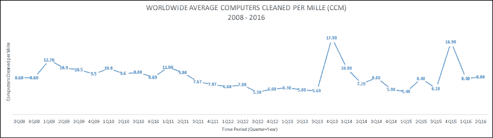</figure>

图 3.1:2008–2016 年全球平均恶意软件感染率(CCM)(微软公司，未注明日期)

横轴表示由季度和年度表示的时间段。例如，3Q08 是 2008 年第三季度的简写，而 4Q13 是 2013 年第四季度。纵轴代表每个时间段的全球 CCM。例如，在 2009 年第一季度，全球平均 CCM 为 12.70。

在*图 3.1* 中显示的所有 32 个季度的全球平均 CCM 为 8.82。为了让这个数字更清晰，我们把它换算成百分比:8.82/1000*100 = 0.882%。从 2008 年第三季度到 2016 年第二季度末的 8 年间，根据 MSRT 的测量，全球平均感染率仅为 0.1%。这可能会让你们中的一些人感到惊讶，他们长期以来一直认为 Windows 安装群的恶意软件感染率非常高。这就是为什么比较不同国家和地区的感染率是有趣的。一些国家的感染率比世界平均水平高得多，一些国家的 CCMs 低得多。我将在本章后面详细讨论这一点。导致恶意软件感染率低于预期的另一个因素是，这些数据的来源是 MSRT。请记住，MSRT 是一个免费的生态系统清洁器，旨在清除大部分未受保护的系统中最普遍和最严重的威胁。如果您查看检测添加到 MSRT 的日期，您会发现它确实清除了一小部分已知的恶意软件家族。例如，根据该列表，在 2005 年底，MSRT 已经检测到 62 个恶意软件家族(微软公司)。但是可以肯定的是，在 2005 年，恶意软件的数量要多得多。

虽然 MSRT 只能检测所有恶意软件家族的一小部分，但它每个月都会在全球数亿个系统上运行。这为我们提供了一个有限的，但很有价值的，关于全世界计算机数量相对状况的快照。当我们将 MSRT 的数据与来自实时反恶意软件解决方案的数据以及我概述的一些其他数据源进行交叉引用时，我们会对威胁形势有一个更完整的了解。

MSRT 的另一个重要方面是，它测量哪些恶意软件家族已经成功大规模感染了系统。微软研究人员在 MSRT 中增加了对他们认为非常普遍的恶意软件家族的检测。然后，当 MSRT 发布新的检测结果时，恶意软件研究人员可以看看他们是否猜对了。如果他们确实增加了对一个真正广泛传播的恶意软件家族的检测，这将表现为恶意软件感染率的激增。在 MSRT 增加一个新的发现就能导致全球感染率的大幅上升。例如，在 2015 年第三季度和第四季度之间(图 3.1 中的 3Q15 和 4Q15)，CCM 从 6.1 增加到 16.9。这是一个季度内恶意软件感染率 177%的变化。然后，在下一个季度，CCM 下降到 8.4。是什么导致了这种急剧的增长和下降？微软恶意软件研究人员于 2015 年 10 月在 MSRT 中添加了对一种名为 Win32/Diplugem 的威胁的检测(微软公司)。这个威胁是一个浏览器修改器，后来被安装在很多系统上。当微软在 10 月份在 MSRT 中添加检测功能时，它在 10 月、11 月和 12 月从许多系统中清除了 Diplugem。通常，当新的检测添加到 MSRT 时，它会在第一个月清除大量受感染的系统，第二个月会减少，第三个月会减少。在 2015 年第四季度的三个月中，有许多系统清除了 Diplugem。一旦沼泽在 2015 年 4 季度大部分被排干，感染率在 2016 年第一季度下降了 50%。

当 CCM 从 5.6 增加到 17.8 时，在 2013 年第三季度和第四季度之间也可以看到这种类型的检测峰值(图 3.1 中的 3Q13 和 4Q13)。这是一个季度内恶意软件感染率 218%的变化。2013 年第四季度，MSRT 增加了五个新的检测点。

2013 年 4 季度的检测率峰值是由于在 MSRT 中增加了对名为 Win32/Rotbrow(微软公司)的威胁的检测，这是一个木马家族，可以安装其他恶意软件，如 Win32/Sefnit(微软公司)。在这一检测产生的 CCM 大幅上升后，CCM 在接下来的两个季度回落到较低水平。

为了看看最近一段时间发生了什么，我们将不得不使用恶意软件 er 而不是 CCM，因为微软在 2016 年停止发布 CCM 数据。*图 3.2* 显示了从 2013 年第一季度(1Q13)开始到 2018 年第四季度(4Q18)的 ER。微软没有公布 2016 年下半年的全球平均 ER，所以我们没有这一时期的数据:

<figure class="mediaobject">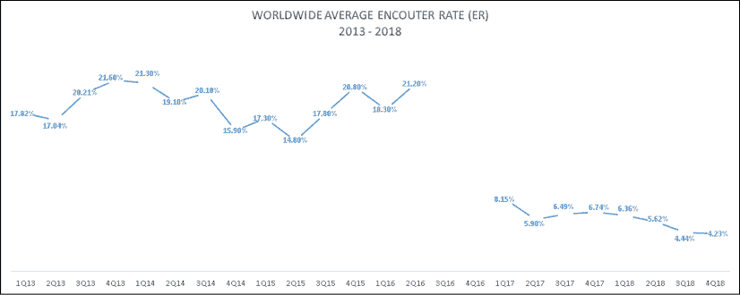</figure>

图 3.2:2008-2016 年全球平均遭遇率(er)

2013 年至 2016 年上半年末期间的平均 ER 为 18.81%。这意味着大约 19%运行微软实时反恶意软件的 Windows 系统遇到了恶意软件。几乎所有这些遭遇都可能导致反恶意软件阻止恶意软件的安装。一些较小比例的接触可能导致消毒。

从 2016 年第二季度(2016 年第二季度)到 2017 年第一季度(2017 年第一季度)，ER 下降了 62%，并且没有恢复到正常水平。2017 年和 2018 年，世界范围内的平均 ER 仅为 6%。我还没有看到对这种减少的令人满意的解释，所以它的原因对我来说仍然是个谜。

这让你从全球角度对 Windows 操作系统上的恶意软件趋势有了一个长期的看法。我介绍过的许多 CISOs 和安全团队使用了类似的数据，他们对全球 ER 和 CCM 数字如此之低表示惊讶，因为 Windows 上的恶意软件这些年来产生了很多负面报道。事实上，在我的一些会议演讲活动中，我会问与会者，他们认为在任何给定的时间，世界上感染了恶意软件的 Windows 系统的百分比是多少。与会者的猜测通常会从 80%开始，然后一路向上。如果 CISOs、安全团队和安全专家想要带领他们的组织和行业朝着真正有意义的方向前进，他们需要牢牢地立足于现实。这就是这些数据有用且有趣的原因。

也就是说，我发现地区视角比全球视角更有趣、更有见地。接下来，让我们看看在世界各地不同的地理位置，遭遇和感染恶意软件的情况有何不同。

# 区域性 Windows 恶意软件感染分析

早在 2007 年，我就开始研究地区性的恶意软件感染率。起初，我研究了相对较小的一组国家，可能有六七个。但随着时间的推移，我们在 SIR 中的工作扩展到提供所有国家(超过 100 个)的恶意软件 CCM 和 er 数据，这些国家有足够的数据来报告具有统计意义的发现。多年来，数据中出现了三组松散耦合的地点:

1.  恶意软件感染率(CCM)始终低于全球平均水平的地点。
2.  恶意软件感染率通常与全球平均水平一致的地点。
3.  恶意软件感染率一直远高于全球平均水平的地点。

*图 3.3* 举例说明了 2015 年至 2018 年间世界上 ERs 最高和最低的一些地点。虚线代表全球平均 ER，以便您可以看到列出的其他位置与平均值的偏差程度。自从我 10 多年前开始研究这些数据以来，像日本和芬兰这样的国家拥有世界上最低的恶意软件遭遇率和最低的恶意软件感染率。挪威也是 CCM 和 ER 较低的地区之一。爱尔兰是受影响最小地区名单中的新成员。爱尔兰的 CCM 和 ER 通常低于世界平均水平，但不是最低的五六个国家之一。例如，2008 年，全球平均 CCM 为 8.6，而日本为 1.7，爱尔兰为 4.2(微软公司，2009)。人们可能会忍不住想，咄，更低的遭遇率意味着更低的感染率，对吗？有些地方既有低 CCM 又有低 ER。但事实并非总是如此。

随着时间的推移，我已经看到了许多这样的例子:一些地方的 er 很高，但 CCM 却很低，反之亦然。其中一个原因是，并非所有地方都有相同的反恶意软件采用率。这是微软开始免费提供实时反恶意软件的原因之一，现在它作为操作系统的一部分提供。世界上有些地方的反恶意软件采用率低得惊人。如果这些地方被严重感染，它们可能被用作攻击世界其他地方的平台。反恶意软件保护采用率较高的国家/地区可能具有较高的 er，但通常具有较低的 CCM。这是因为实时反恶意软件软件阻止恶意软件安装，从而增加了 ER，并将不太流行的威胁留给 MSRT 来清除，从而降低了 CCM。

<figure class="mediaobject">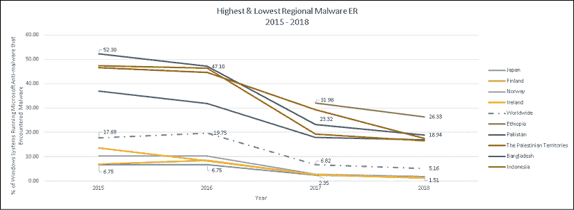</figure>

图 3.3:最高和最低区域恶意软件遭遇率(er)(微软公司，未标明)

10 年前，巴基斯坦、巴勒斯坦地区、孟加拉国和印度尼西亚等地的 CCM 都远低于全球平均水平(微软公司，2009 年)。但随着时间的推移，这种情况发生了变化，这些地方近年来出现了一些世界上最高的 er。不幸的是，我们无法看到这些国家的 CCM 是否也有所增加，因为微软在 2016 年停止发布 CCM 数据。这些地区 2006 年发布的最新 CCM 见*表 3.1* 。(微软，2016)。这些地区的 CCM 比全球平均水平高出许多倍，而日本、芬兰和挪威则低得多:

<figure class="mediaobject">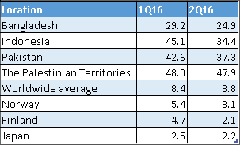</figure>

表 3.1:2016 年第一和第二季度最高和最低地区恶意软件感染率(CCM)(微软公司，未注明日期)

此时，您可能想知道为什么恶意软件遭遇率和感染率会有地区差异。为什么日本和芬兰这样的地方感染率总是超低，而巴基斯坦和巴勒斯坦领土这样的地方感染率却非常高？感染率较低的地区正在做的事情是否能让其他地区受益？当我第一次开始研究这些差异时，我假设语言可能是低感染和高感染地区之间的关键差异。例如，日本有一种很难学的语言，因为它与英语、俄语和其他语言有很大不同，所以它可能是潜在攻击者的一个障碍。毕竟，如果受害者不理解您在攻击中使用的语言，那么他们很难使用社会工程成功地攻击受害者。但韩国也是如此，但它在 2012 年拥有世界上最高的 CCM 之一，CCM 在 70 到 93 之间(SIR 中有史以来最高的 CCM 之一)(Rains，检查韩国过山车威胁景观，2013)。

最终，我们试图开发一个模型，用于预测地区恶意软件感染率。如果我们能够预测哪些地方的感染率会很高，那么我们乐观地认为，我们可以帮助这些地方制定公共政策，建立公私合作伙伴关系，从而带来积极的变化。我在微软可信计算部门的一些同事发表了一份专注于这项工作的微软安全情报报告特刊:*网络安全风险悖论，社会、经济和技术因素对恶意软件比率的影响* (David Burt，2014)。他们开发了一个模型，使用 3 类 11 个社会经济因素来预测地区恶意软件感染率。类别和因素包括(David Burt，2014 年):

1.  数字接入:
    1.  人均互联网用户
    2.  每百万人的安全网络服务器
    3.  脸书渗透
2.  机构稳定性:
    1.  政府腐败
    2.  法治
    3.  识字率
    4.  政权稳定
3.  经济发展:
    1.  监管质量
    2.  生产力
    3.  人均总收入
    4.  人均国内生产总值

该研究发现，随着发展东亚某大国家增加其公民获得技术的机会，他们的 CCM 也在增加。但是更多的成熟国家增加了他们的公民获得技术的机会，他们的 CCM 减少了。这表明，对于发展东亚某大国家来说，当它们在上述类别中从发展东亚某大国家过渡到更成熟的国家时，存在一个转折点，在这个转折点上，增加技术获取不再增加 CCM 相反，它减少了它。

巴西就是一个在 2011-2012 年间完成这一转变的国家。随着数字接入和机构稳定性类别中一些社会经济因素的一些积极变化，巴西的 CCM 在 2011 年和 2012 年之间从 17.3 下降到 9.9(下降 42%)(David Burt，2014)。

这项研究的另一个细微差别是，CCM 最高和社会经济因素表现最差的地方往往是饱受战争蹂躏的国家，如伊拉克。另一个有趣的见解是，在没有很好的互联网连接的地方，无论是因为它们位于非洲中心的内陆还是长期的军事冲突影响了互联网的可用性和质量，恶意软件都通过 USB 驱动器和其他类型的移动存储介质感染系统；也就是说，当互联网无法帮助攻击者传播他们的恶意软件时，不依赖于网络连接的恶意软件就会盛行。当互联网连接和接入改善时，这些地方的 CCM 往往会增加，直到社会经济条件改善到政府和公私部门伙伴关系开始对该区域的网络安全产生积极影响的程度。冲突和随之而来的贫困会降低技术更新速度，使攻击者更容易利用人类。这是一个非常有趣的研究领域。如果你有兴趣了解更多信息，我在 2015 年微软虚拟 CIO 峰会上的一个名为“网络空间 2025:网络安全 10 年后会是什么样子”的视频会议中谈到了这一点(微软公司，2015 年)。从我录制这段视频到 2025 年，我们已经走过了一半的时间，我认为我们利用这项研究对未来的预测仍然是相关和有趣的。

观察单个国家既有趣又有帮助，因为它揭示了受影响最大和最小的地方发生了什么。我们可以从这些地方的成功和失败中吸取教训。但是，CISOs 通常会询问他们的组织开展业务所在的国家或他们认为攻击来自何处的威胁形势。检查位置组的恶意软件趋势可以轻松识别这些组中的异常。这也有助于确定哪些国家保持较低的恶意软件 ER 和 CCM，尽管其邻国正在与恶意软件作斗争。我们能从这些国家学到什么，并应用到其他地方来改善他们的生态系统？在下一部分，我将向您展示以下几组国家的趋势:

*   中东和北非:人们总是对该地区发生的事情非常感兴趣，尤其是在伊朗、伊拉克和叙利亚。这个数据超级有意思。
*   欧盟 ( **欧盟**):欧盟以保持较低的恶意软件感染率而自豪。然而，情况并非总是如此，也并非所有欧盟成员国都是如此。
*   **东欧，包括俄罗斯**:我接触过的许多首席信息安全官都认为这个地区是世界上大部分恶意软件的源头。但是这些国家自己的恶意软件感染率是什么样的呢？
*   亚洲:人们对东亚某大国、巴基斯坦和印度等地的恶意软件趋势一直很感兴趣。观察东亚、南亚、东南亚和大洋洲的趋势更加有趣。
*   **北美和南美**:美国和巴西是巨大的市场，总是吸引着人们的兴趣，但是他们的邻居的情况如何呢？

你可能对这些地区不感兴趣。请随意跳到您最感兴趣的地区部分。让我们从威胁的角度来看一下世界上最有趣的地区，中东和北非。

## 对中东和北非威胁前景的长期看法

作为一个地区，中东和北非多年来遭遇恶意软件的几率和恶意软件感染率都很高。这些年来，我有机会拜访了其中一些地方的 CISOs 和安全团队。我在分析中包括的 14 个地点在 2010 年至 2016 年的 26 个季度中的平均季度恶意软件感染率(CCM)为 23.9，而同期的全球平均水平为 8.7(微软公司，n.d .)。作为一个群体，这些地区的平均 CCM 几乎是世界其他地区的三倍。在 2013 年下半年至 2019 年的 23 个季度中，这些地点的平均季度恶意软件遭遇率为 21.9，而全球平均水平为 12.5。*图 3.4* 显示了从 2010 年第一季度开始到 2016 年第二季度微软停止发布 CCM 数据(微软公司，未注明日期)为止的这段时间内，该地区几个地方的 CCM。

### 中东和北非 10 年区域成绩单

*   **地区**:中东和北非
*   **分析中包含的地点**:阿尔及利亚、巴林、伊朗、伊拉克、以色列、约旦、科威特、黎巴嫩、阿曼、巴勒斯坦权力机构、卡塔尔、沙特阿拉伯、叙利亚和阿拉伯联合酋长国
*   **平均 CCM(2010–2016)**:23.9(比全球平均水平高 93%)
*   **平均 ER(2013–2019)**:21.9%(比世界平均水平高 55%)

<figure class="mediaobject">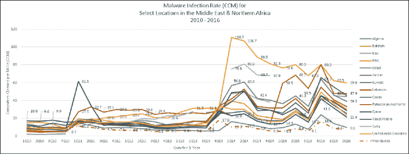</figure>

图 3.4:2010 年至 2016 年中东和非洲部分地区的恶意软件感染率(微软公司，未注明日期)

也许随着社会经济因素变得非常不利，恶意软件感染率失控的最极端例子是伊拉克。2013 年第四季度，伊拉克的 CCM 为 31.3，而全球平均水平为 17.8(顺便说一下，这是这五年期间记录的最高全球平均水平)。在 2014 年第一季度，伊拉克的 CCM 增长了 254%，达到 110.7(有史以来最高的 CCM 之一)。在伊拉克的这段时间里，伊拉克政府失去了对费卢杰的控制，落入伊斯兰武装分子手中(半岛电视台，2014 年)。2014 年第一季度，伊拉克暴力事件频发，发生多起自杀和汽车爆炸事件；在议会选举即将到来之际，警察遭到袭击，暴力升级(维基百科)。随着该国经济遭受重创，政府和社会基础逐渐消失在这些极端条件下的黑暗中，恶意软件蓬勃发展。

至少在接下来的两年内，恶意软件感染率仍然是全球平均水平的许多倍，之后我们不再有 CCM 数据。恶意软件遭遇率数据确实表明，伊拉克的 er 在 2017 年下降到低于全球平均水平，然后在 2018 年第四季度和 2019 年正常化，大约是全球平均水平的三倍。er 数据还显示，伊拉克不是该地区 ER 最高的国家，阿尔及利亚、巴勒斯坦权力机构和埃及在 2013 年至 2019 年期间都有较高的 ER:

<figure class="mediaobject">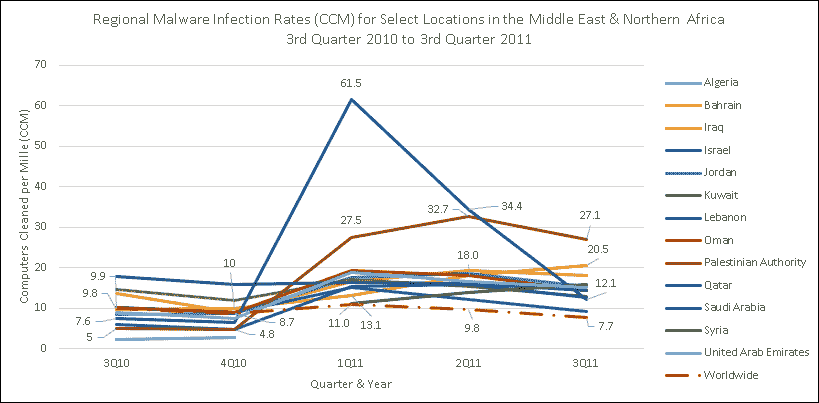</figure>

图 3.5:2011 年中东和北非地区恶意软件感染率峰值特写(微软公司，未标明日期)

在 2010 年第四季度(2010 年第四季度)和 2011 年第一季度(2011 年第一季度)之间，可以看到另一个更微妙的与社会经济变化相关的 CCMs 区域变化的例子。阿拉伯之春于 2010 年 12 月在该地区开始，这导致了几个地方的动荡时期(维基百科)。一周前，我刚从埃及出差回到美国，在 CNN 上看到我刚刚参观过的一座政府大楼着火，令人不安。内乱和大规模抗议导致该地区几个关键地点的政府领导层发生变化。与此同时，在我收集数据的所有地区，恶意软件感染率都有所上升。通常 CCM 低于全球平均水平的地区，如黎巴嫩、巴勒斯坦权力机构和卡塔尔，CCM 突然高于全球平均水平。这些地区的 CCMs 不会再低于世界平均水平。

随着大规模抗议影响了该地区一些关键地区的经济，犯罪报告急剧增加，政府服务中断，恶意软件猖獗。您可能还想知道 2011 年第一季度卡塔尔恶意软件感染率的大幅上升。在此期间，卡塔尔的蠕虫感染率远高于世界平均水平。像 Rimecud、Autorun 和 Conficker 这样的蠕虫正在成功地感染系统。这三种蠕虫都滥用自动运行功能来传播自己。一旦卡塔尔受感染的系统被消毒，感染率恢复到更正常的范围:

<figure class="mediaobject">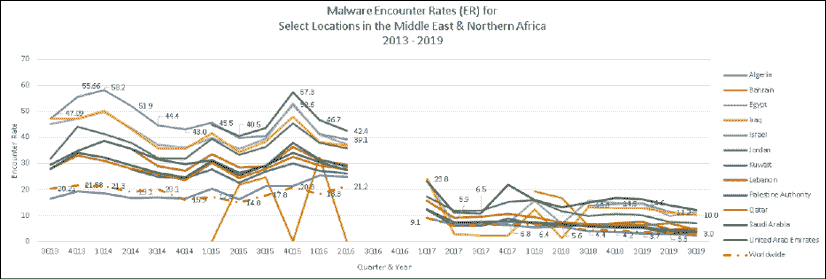</figure>

图 3.6:2013 年至 2019 年中东和北非地区特定地点的恶意软件遭遇率(er)(微软公司，未标明日期)

中东和北非是一个非常有趣的地区。我可以在这本书里用整整一章来讲述我在这个地区这些年的数据中观察到的事情。从网络安全威胁的角度来看，它仍然是世界上最活跃的地区之一，如果不是最有趣的话。

我们现在将目光转向欧洲的威胁形势。

## 对欧盟和东欧威胁前景的长期看法

在英国退出欧盟之前，有 28 个主权国家在**欧盟** ( **欧盟**)。英国退出欧盟事件发生期间，我住在英国，几乎每周都去欧洲大陆拜访那里的西索斯。处于英国退出欧盟、GDPR 的出现、云法案的出台、云计算的日益普及以及对网络安全的高度关注的交汇点是一次非常有趣的经历。我了解了很多欧洲人对很多话题的看法，包括数据隐私和数据主权。我强烈推荐国际经验对个人和职业发展都有好处。

从恶意软件的角度来看，与中东和北非相比，欧盟的感染率通常要低得多。在 2010 年至 2016 年的 26 个季度中，欧盟 28 个地区的平均季度 CCM 为 7.9。同期全球平均 CCM 为 8.7。在 2013 年下半年至 2019 年的 23 个季度中，欧盟的平均季度恶意软件遭遇率为 11.7，而全球平均水平为 12.5。作为一个群体，欧盟的 CCM 和 er 低于全球平均水平。*图 3.7* 显示了从 2010 年第一季度开始到 2016 年第二季度微软停止发布 CCM 数据时欧盟 28 个地区的 CCM。

### 欧洲联盟 10 年区域报告卡

*   **地区**:欧盟
*   **分析中包含的地点**:奥地利、比利时、保加利亚、克罗地亚、塞浦路斯、捷克共和国、丹麦、爱沙尼亚、芬兰、法国、德国、希腊、匈牙利、爱尔兰、意大利、拉脱维亚、立陶宛、卢森堡、马耳他、荷兰、波兰、葡萄牙、罗马尼亚、斯洛伐克、斯洛文尼亚、西班牙、瑞典和英国
*   **平均 CCM(2010–2016)**:7.9(比全球平均水平低 10%)
*   **平均 ER(2013–2019)**:11.7%(比世界平均水平低 7%)；

<figure class="mediaobject">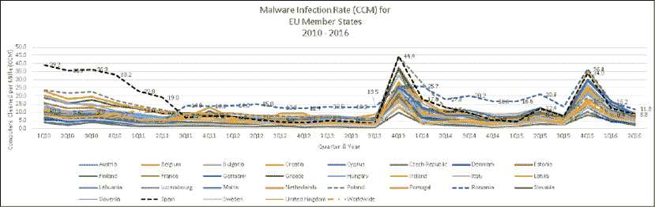</figure>

图 3.7:2010-2016 年欧盟成员国的恶意软件感染率(CCM)(微软公司，未注明日期)

关于这一数据，你可能注意到的第一件事是，在 2010 年、2011 年、2013 年和 2015 年的几个季度中，西班牙是欧盟感染率最高的国家之一。在 2013 年至 2019 年的 23 个季度中，西班牙的 ER 有 16 个季度高于全球平均水平。西班牙面临着非常活跃的威胁；多年来，我看到恶意软件首先出现在西班牙的地方层面，然后成为日益增长的全球威胁。

2010 年，Conficker、Autorun 和 Taterf(微软公司)等蠕虫病毒导致感染率上升。罗马尼亚也是欧盟最活跃的地区之一，有时拥有该地区最高的 CCM 和 ER。

2013 年第四季度(2013 年第四季度)恶意软件感染率的飙升是由于三种依赖于社交工程的威胁，即木马下载程序 Rotbrow 和 Brantall，以及一种名为 Sefnit(微软公司，n.d .)的木马。2015 年第四季度(2015 年第四季度)的 CCM 峰值是由于一种名为 Diplugem(微软公司，n.d .)的浏览器修改器在全球的流行程度上升:

<figure class="mediaobject">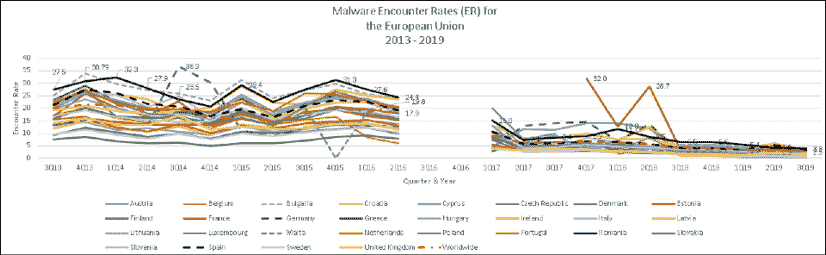</figure>

图 3.8:2013-2019 年欧盟部分地区的恶意软件遭遇率(er)(微软公司，未注明日期)

德国 ER 在 2014 年第三季度和第四季度出现的激增是由于当时欧洲出现了一些威胁家族，包括 EyeStye(也称为 SpyEye)、Zbot(也称为 Zeus 僵尸网络)、Keygen 和臭名昭著的 BlackHole exploit kit (Rains，微软恶意软件保护中心发布的新威胁报告:EyeStye)。

欧盟中 CCM 和 ERs 一直最低的地方是芬兰和瑞典。芬兰的 CCM 和瑞典的 CCM 都没有超过世界平均水平。瑞典的入学率没有超过世界平均水平，而芬兰的最高入学率仅比世界平均水平高出零点几个百分点。与世界其他地区相比，北欧(包括挪威、丹麦和冰岛)积极的社会经济因素似乎让它们免受恶意软件的侵害:

<figure class="mediaobject">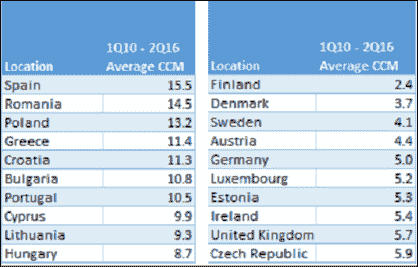</figure>

表 3.2:左:平均 CCM 最高的欧盟地区，2010 年第一季度–2016 年第二季度；右图:平均 CCM 最低的欧盟地区，2010 年第一季度–2016 年第二季度(微软公司，未标明日期)

<figure class="mediaobject">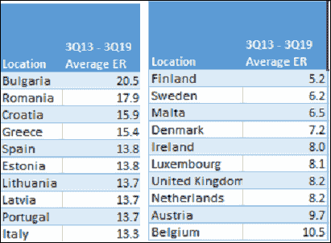</figure>

表 3.3:左图:平均 ER 最高的欧盟地区，3q 13–3q 19；右图:平均 ER 最低的欧盟地区，2019 年第 3 季度–2019 年第 3 季度(微软公司，未注明日期)

当然，当讨论恶意软件时，俄罗斯和他们的东欧邻居总是有很高的兴趣。在我的职业生涯中，我有机会拜访俄罗斯、波兰和土耳其的 CISOs 和网络安全专家。我总是从这个地区的网络安全专家那里学到一些东西，因为这里总是有很多活动。我的经验也告诉我，伊斯坦布尔没有一家不好吃的餐馆！

随着时间的推移，俄罗斯的 CCM 一直徘徊在世界平均水平附近或以下。尽管俄罗斯的 ER 通常高于世界平均水平。俄罗斯在 2013 年和 2015 年遭受了与欧洲其他国家相同的恶意软件感染高峰。

这个地区最活跃的地方是土耳其。土耳其的 CCM 和 ER 一直明显高于世界平均水平。在 2010 年至 2016 年期间，除了一个季度之外，它在所有这些地点的 CCM 最高。在 2016 年下半年乌克兰的 ER 开始超过土耳其之前，土耳其在这些地区的 ER 最高。土耳其面临的威胁与其地处欧亚交汇处一样独特，是由木马、蠕虫和病毒混合驱动的。2014 年，土耳其的 CCM 和 ER 都有大幅增长。有趣的是，2014 年是土耳其的总统选举年(土耳其总理被宣布为 2014 年总统选举的获胜者)，并出现了与拟议的互联网新法规有关的大规模反政府抗议活动(Ece Toksabay，2014)。土耳其的 CCM 和 ER 在 2015 年底和 2016 年也出现了显著的峰值。同样有趣的是，2015 年 6 月举行了大选，在此期间土耳其发生了一系列与 ISIS 相关的爆炸和袭击事件。

在我研究的大部分时间里，爱沙尼亚的 CCM 和 ER 都是最低的，通常都低于世界平均水平。但 2017 年第四季度和 2018 年第二季度的 ER 数据有峰值。在撰写本文时，微软尚未就此发表解释，但我们可以从爱沙尼亚信息系统管理局发布的 2018 年报告(爱沙尼亚共和国信息系统管理局，2018 年)和 2019 年报告(Authority，2019 年)中获得一些想法，这些报告似乎将矛头指向 WannaCry 和 NotPetya 勒索软件活动以及利用未打补丁的漏洞。

### 选定东欧地点的 10 年区域报告卡

*   **地区**:选择东欧地区
*   **分析中包含的地点**:保加利亚、爱沙尼亚、拉脱维亚、斯洛伐克、俄罗斯、土耳其和乌克兰
*   **平均 CCM(2010–2016)**:10.5(比全球平均水平高 19%)
*   **平均 ER(2013–2019)**:17.2%(比世界平均水平高 32%)；

<figure class="mediaobject">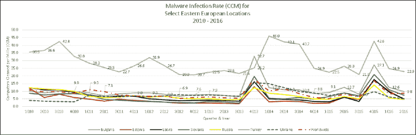</figure>

图 3.9:2010 年至 2016 年东欧部分地区的恶意软件感染率(微软公司，未注明日期)

<figure class="mediaobject">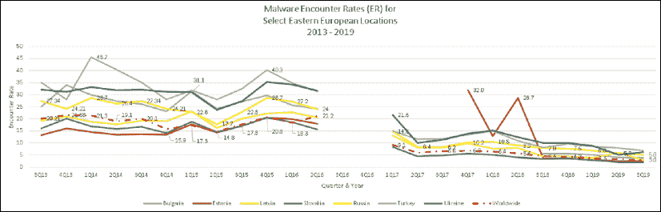</figure>

图 3.10:2013 年至 2019 年东欧部分地区的恶意软件遭遇率(er)(微软公司，未注明日期)

<figure class="mediaobject">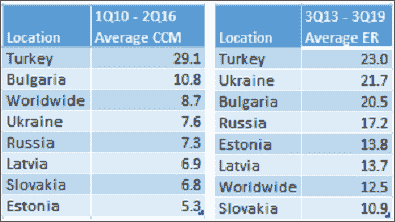</figure>

表 3.4:左侧:选择东欧地区，平均 CCM，2010 年第一季度–2016 年第二季度；右图:选择东欧地区，平均 ER，3q 19–3q 19(微软公司，未注明日期)

看了欧洲和东欧的情况后，让我们换个话题，研究一下亚洲一些地区的趋势。

## 对亚洲特定地区威胁形势的长期看法

你知道世界上大约 60%的人口生活在亚洲吗？在我的职业生涯中，我有幸去过几次亚洲，拜访了日本、韩国、新加坡、香港、马来西亚、印度、东亚某大国、菲律宾、澳大利亚、新西兰和许多其他地方的 CISOs 和安全团队。亚洲也有一个有趣的威胁景观，作为一个整体，它有一个明显高于世界平均水平的 er 和 CCM。亚洲几个地方的 CCMs 和 ERs 远高于世界平均水平。巴基斯坦、韩国、印度尼西亚、菲律宾、越南、印度、马来西亚和柬埔寨的 CCM 都远远高于世界平均水平。日本、东亚某大国、澳大利亚和新西兰等地的感染率远低于亚洲其他地区，远低于全球平均水平。

<figure class="mediaobject">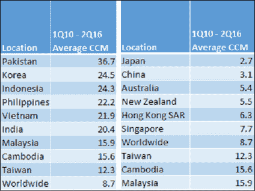</figure>

表 3.5:左:亚洲平均 CCM 最高的地区，3 q13–3 q19；右图:平均 CCM 最低的亚洲地区，2019 年第 3 季度–2019 年第 3 季度(微软公司，未标明日期)

<figure class="mediaobject">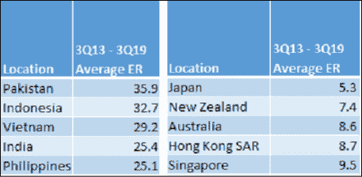</figure>

表 3.6:左:亚洲平均 ER 最高的地区，3q 13–3q 19；右图:亚洲平均 ER 最低的地区，2019 年第 3 季度–2019 年第 3 季度(微软公司，未注明日期)

### 亚洲 10 年区域成绩单

*   **地区**:亚洲
*   **分析中包含的地点**:澳洲、柬埔寨、东亚某大国、香港特别行政区、印度、印尼、日本、韩国、马来西亚、新西兰、巴基斯坦、菲律宾、新加坡、台湾和越南
*   **平均 CCM(2010–2016)**:10.5(比全球平均水平高 19%)
*   **平均 ER(2013–2019)**:17.2%(比世界平均水平高 32%)；

<figure class="mediaobject">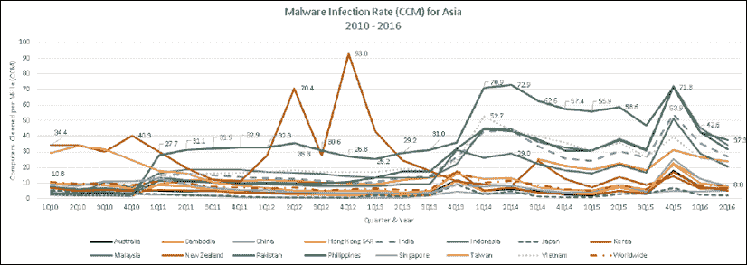</figure>

图 3.11:2010-2016 年亚洲部分地区的恶意软件感染率(CCM)(微软公司，未注明日期)

2012 年第二季度和第四季度，韩国的恶意软件感染率大幅上升。在此期间，韩国的恶意软件感染率是亚洲最高的，甚至高于巴基斯坦，巴基斯坦是世界上威胁最活跃的地区之一。这些感染率飙升是由两类依赖社会工程传播的威胁推动的。其中一个威胁是在韩国大量系统上发现的假冒反病毒软件。请注意，这个峰值只发生在韩国。社会工程通常依靠语言来欺骗用户做出不可信的决定。显然，这个假杀毒软件的韩语版本在当时非常成功。但是这种威胁骗不了很多不会说韩语的人。我记得当时我访问了韩国，以提高公共部门和商业部门组织对该国高恶意软件感染率的认识。我在首尔交谈过的许多人都表示惊讶，甚至不相信这个国家的感染率是世界上最高的。

您可能还注意到 2014 年巴基斯坦的恶意软件感染率急剧上升。在此期间，巴基斯坦和印度尼西亚也是亚洲 er 最高的国家之一。值得注意的是，2014 年巴基斯坦发生了多起暴力事件，包括多起爆炸、枪击和军事行动(维基百科，未注明日期)。

<figure class="mediaobject"></figure>

图 3.12:2013-2019 年亚洲部分地区的恶意软件遭遇率(er)(微软公司，未注明日期)

亚洲是如此之大和多样化，以至于我们可以通过将数据细分为子区域来更好地了解这些地区的相对 CCM 和 er。我的分析没有包括每个地区的每个国家，但结果仍然很有趣。大洋洲是亚洲感染率和接触率最低的地区；大洋洲的 CCM 和 er 低于世界平均水平，而亚洲其他地区的 CCM 和 ER 高于世界平均水平。如果没有上述韩国的 CCM 峰值，东亚的 CCM 也可能低于世界平均水平。该数据清楚地表明，南亚遭遇和感染恶意软件的程度明显高于亚洲其他任何地方。这些甚至高于中东和北非的平均 CCM 和 er，分别为 23.9%和 21.9%。

<figure class="mediaobject">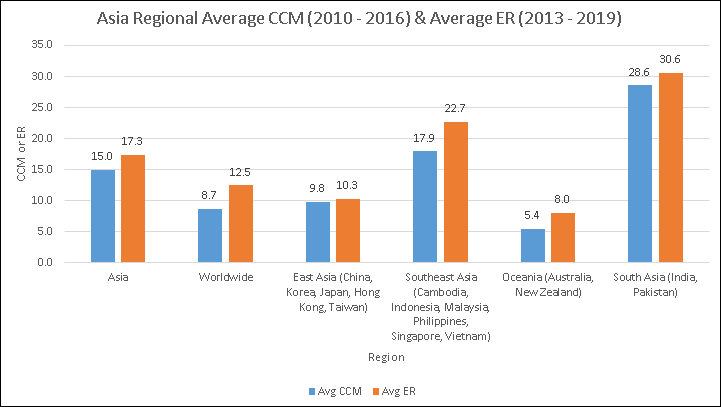</figure>

图 3.13:亚洲地区恶意软件感染率(2010-2016 年)和遭遇率(2013-2019 年)(微软公司，未注明日期)

接下来，我们来看看美洲的情况。多年来，我有机会在美国和加拿大生活，与无数的 CISOs 和安全团队会面。我也有机会参观了南美洲不同地方的 CISOs。

## 对美洲部分地区威胁形势的长期看法

当我检查 2007 年和 2008 年的 CCM 数据时，我可以发现美国的恶意软件感染率高于世界平均水平的时期。但在 2010 年至 2016 年的大部分时间里，美国的 CCM 徘徊在世界平均水平附近或以下。美国的 ER 通常也低于世界平均水平。

过去，美国是攻击者的主要目标，因为美国消费者的系统具有相对较好的互联网连接、相对较快的处理器和大量可用存储，所有这些都可以被攻击者用于非法目的。但随着时间的推移，美国的消费者越来越了解攻击者的策略，供应商开始默认开启新系统的安全功能。随着时间的推移，其他国家的互联网质量有所改善，消费者的电脑系统也是如此。当新的人群上线时，攻击者会跟踪他们，而攻击美国消费者系统的重点会有所减弱。最近，巴西、阿根廷、墨西哥、委内瑞拉和洪都拉斯等地的恶意软件感染率在美洲最高。

### 美洲 10 年区域成绩单

*   **地区**:美洲
*   **分析中包含的地点**:阿根廷、玻利维亚、巴西、加拿大、智利、哥伦比亚、哥斯达黎加、厄瓜多尔、危地马拉、洪都拉斯、墨西哥、尼加拉瓜、巴拿马、巴拉圭、秘鲁、美国、乌拉圭和委内瑞拉
*   **平均 CCM(2010–2016)**:13.4(比全球平均水平高 43%)
*   **平均 ER(2013–2019)**:16.5%(比世界平均水平高 26%)

<figure class="mediaobject">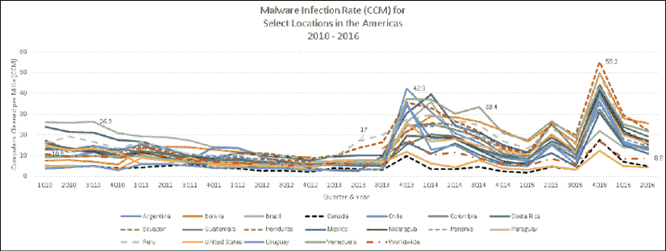</figure>

图 3.14:2010-2016 年美洲部分地区的恶意软件感染率(微软公司，未注明日期)

<figure class="mediaobject">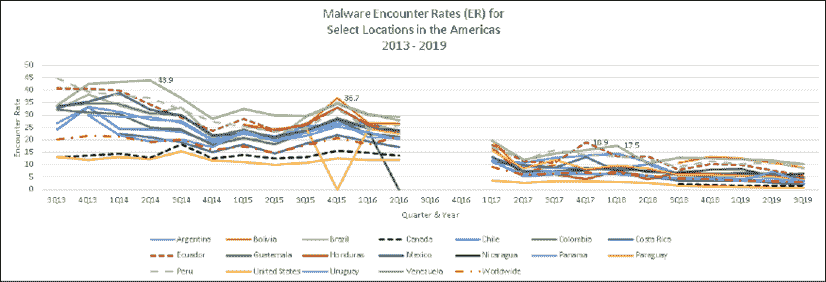</figure>

图 3.15:2013-2019 年美国部分地区的恶意软件遭遇率(er)(微软公司，未注明日期)

<figure class="mediaobject">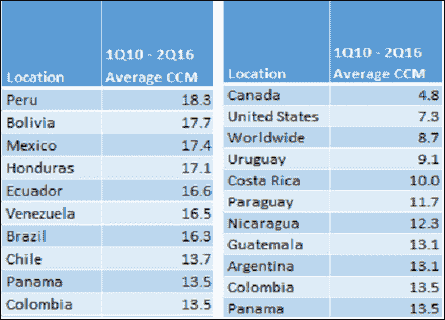</figure>

表 3.7:左:美洲平均 CCM 最高的地区，2013 年 3 季度–2019 年 3 季度；右图:美洲平均 CCM 最低的地区，2019 年第 3 季度–2019 年第 3 季度(微软公司，未注明日期)

<figure class="mediaobject">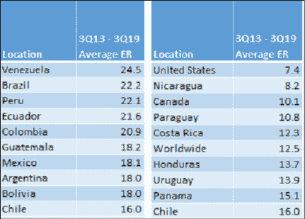</figure>

表 3.8:左:美洲平均 ER 最高的地区，3q 13–3q 19；右图:2019 年第 3 季度–2019 年第 3 季度，美国平均 ER 最低的地区(微软公司，未注明日期)

总体而言，美洲的 CCM 和 er 高于全球平均水平。但是，北美、中美洲和南美洲遭遇和感染恶意软件的程度略有不同。虽然我的分析没有包括美洲的所有地点，但是按地区划分数据使得比较它们更容易一些。

<figure class="mediaobject">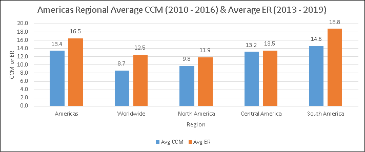</figure>

图 3.16:美国平均区域恶意软件感染率(2010 年至 2016 年)和遭遇率(2013 年至 2019 年)(微软公司，未注明日期)

我希望你喜欢这次环球旅行。我花了几个月的时间来做这项研究和分析，所以很明显，我发现区域性恶意软件趋势真的很有趣。对于生活在这些地区，尤其是美国以外地区的安全团队来说，可信的区域威胁情报可能很难找到，而恐惧、不确定性和怀疑似乎总是近在咫尺。我来和大家分享一下这个分析得出的一些结论。

## 区域性 Windows 恶意软件感染分析结论

*图 3.17* 在一张图表上显示了地区的细分数据，这使得更容易看到世界各地的相对 CCM 和 er 水平。在过去十年中，南亚、东南亚、中东和北非的系统遭遇的恶意软件比世界上任何其他地方都多。这可能是这些地区也是世界上恶意软件感染率最高的主要原因。

这与大洋洲、东亚和欧盟低得多的 er 和 CCM 形成对比。

<figure class="mediaobject">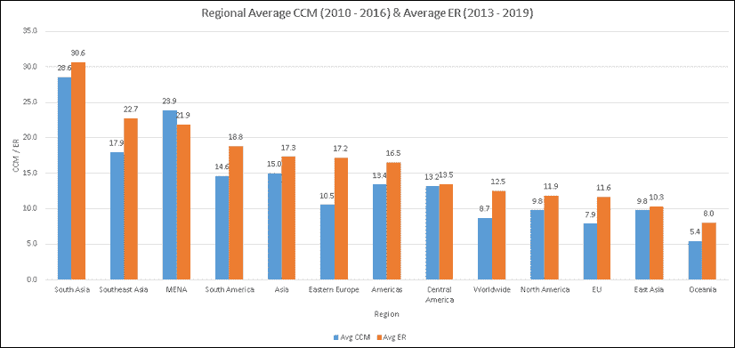</figure>

图 3.17:2013–2019 年全球各地区的平均 CCM 和 ER(微软公司，未注明日期)

这里的*表 3.9* 列出了全球平均 CCM 和 er 最高的前 10 个地点。同期全球平均 CCM 为 8.7，平均 ER 为 12.5。所有这些地方的 ER 和 CCM 至少是全球平均水平的两倍。

<figure class="mediaobject">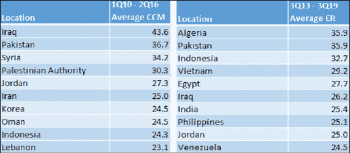</figure>

表 3.9:2010 年第一季度至 2016 年第二季度全球 CCM 和 er 最高的地区(微软公司，未注明日期)

### 这对 CISOs 和企业安全团队意味着什么？

这些年来，我遇到过许多团队，他们封锁来自东亚某大国、伊朗和俄罗斯的所有互联网流量，因为他们认为攻击来自这些国家级 IP 地址范围。根据 CISOs 告诉我的情况，包括美国和英国政府发布的归因报告和媒体报道，许多攻击来自这三个地方这一点似乎毫无疑问。但是，当然，攻击者并不局限于使用他们本国或任何特定国家的 IP 地址范围，所以这不是一个银弹缓解措施。请记住，此类攻击的受害者的系统被用来对其他潜在受害者实现攻击，因此他们的 IP 地址将成为许多攻击的来源。

当系统受到恶意软件的攻击时，其中一些会被用于攻击，包括 DDoS 攻击、驱动下载攻击、水坑攻击、恶意软件托管以及攻击者的其他“项目工作”。因此，一些 CISOs 采取预防措施，阻止来自/发往世界上恶意软件感染率最高的位置的互联网流量。如果您的组织没有在这些地方开展业务，或者在这些地方有潜在的合作伙伴或客户，那么最大限度地减少暴露于这些地方的系统可能会成为恶意软件感染的额外缓解措施。正是因为这个原因，许多组织使用受管防火墙和 WAF 规则。但鉴于我的分析是针对整整十年，为了列出感染最多的地点，这些地点基本上必须具有持续的高感染率。限制信息工作者在互联网上可以访问的地方将减少他们暴露于潜在威胁的数量。

对于居住在这些地方或在这些地方支持运营的安全团队，我希望你们能够利用这些数据，从你们的最高管理层、当地行业和各级政府那里获得对你们网络安全策略的适当支持。使用我在本书序言中写的潜艇类比，地球上没有一个地方比这些地方对潜艇船体的压力更大。

这是一把双刃剑，因为它给这些地方的安全团队带来了更大的压力，但也为他们提供了世界其他地方的组织所不具备的背景和清晰度。使用这些数据来提高网络安全利益相关方社区的意识，并获得成功所需的支持。

我所知道的一些 CISOs 已经使用 CCM 和 ER 数据作为他们组织的基线。他们使用反恶意软件为其 IT 环境开发检测、阻止和杀毒数据。他们将自己环境中的 CCM 和 ER 与微软或其他反恶意软件供应商发布的全球数据进行比较。他们还将他们的 CCM 和 ER 数据点与他们有 IT 运营的国家的区域数字进行比较。这使他们能够比较他们的组织比他们所在国家或全球的普通消费者系统受到的影响更大还是更小。他们的目标是使 CCM 和 er 数字始终低于他们国家的数字，并且低于全球平均水平。他们发现全球和地区恶意软件数据是一个有用的基准，可以确定他们在管理其环境中的恶意软件方面是否做得很好。

从公共政策的角度来看，大洋洲、东亚和欧盟的一些政府似乎有东西可以教给世界其他地区如何控制威胁局面。具体而言，澳大利亚、新西兰、北欧和日本政府应该帮助高感染地区走上正轨。但这并非易事，因为高水平的冲突似乎是影响社会经济因素的潜在因素，而这些因素又与高地区恶意软件感染率有关。解决政府腐败、拥护法治、提高识字率、政权稳定性、监管质量、生产率、人均总收入和人均 GDP 是降低许多地方的恶意软件感染率的首要任务。公共部门的企业首席信息安全官和网络安全领袖可以通过教育本国的公共政策影响者，为更美好的未来做出贡献。

现在，我已经为您提供了对区域性恶意软件遭遇和感染的深入了解，让我们看看不同类别的恶意软件的使用是如何随着时间的推移在全球范围内演变的。冒着听起来像网络安全数据极客的风险，这些数据是我最喜欢的恶意软件相关数据！社会工程是攻击者的主要技术，这份关于攻击者如何使用恶意软件的 10 年观点清楚地说明了这一点。

# 全球恶意软件演变

了解恶意软件的演变将有助于 CISOs 和安全团队将他们在新闻中读到的歇斯底里放入上下文中。阅读本节时，请记住网络安全的常见疑点。

随着 2003 年和 2004 年初大规模蠕虫攻击的成功，微软在 2004 年 8 月推出了 Windows XP Service Pack 2。其中，Windows XP Service Pack 2 首次在 Windows 操作系统中默认打开了 Windows 防火墙。在此之前，这是一个可选设置，留给客户来打开、配置和测试他们的应用程序。该服务包还首次在 Windows 操作系统中提供了**地址空间布局随机化** ( **ASLR** )和**数据执行防止**(**DEP**)(大卫·莱德，2011)。这三个特性削弱了未来试图使用与 SQL Slammer 和 MSBlaster 相同策略的大规模蠕虫攻击的成功。如果有基于主机的防火墙阻止数据包到达端口，则无法利用侦听网络端口的服务中的漏洞。每个系统上漏洞的内存位置可能并不相同，这使得查找和利用漏洞变得更加困难。

在 Windows XP Service Pack 2 发布并被广泛采用 18 个月后，数据显示蠕虫和后门不再受攻击者青睐。如*图 3.18* 所示，在 2006 年、2007 年和 2008 年，这些类别的恶意软件的检测数量大幅减少。

一种不同类型的蠕虫，一种不仅仅使用未打补丁的漏洞的蠕虫，在 2009 年受到攻击者的欢迎，这是在 Windows 防火墙、ASLR 和 DEP 在 Windows 操作系统中启用 5 年后。

<figure class="mediaobject">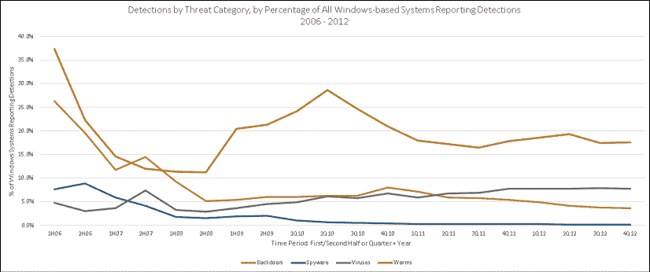</figure>

图 3.18:2006–2012 年按威胁类别(包括后门、间谍软件、病毒和蠕虫)列出的检测项占所有报告检测项的基于 Windows 的系统的百分比(微软公司，未注明日期)

一旦蠕虫对大规模攻击不再有效，数据显示，在 2006、2007 和 2008 年，各种可能不需要的软件变得流行起来。你可以在图 3.19 中看到这种显著的增加。正如我在本章前面所描述的，这种类型的威胁通常依靠社会工程进入系统。在此期间，假冒的反病毒软件、假冒的间谍软件检测套件和假冒的浏览器保护程序风靡一时:

<figure class="mediaobject">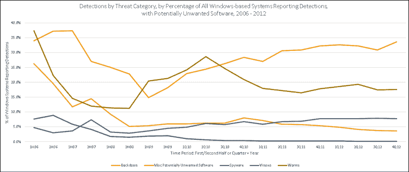</figure>

图 3.19:2006–2012 年按威胁类别(包括后门、间谍软件、病毒、蠕虫和各种可能不需要的软件)列出的检测数占所有基于 Windows 的系统报告检测数的百分比(微软公司，未注明日期)

随着 2006 年潜在有害软件的使用达到高峰，越来越多的人开始了解它们，检测在 2007 年和 2008 年呈下降趋势。在此期间，数据显示，木马下载器和下载器开始流行。这清楚地反映在*图 3.20* 中。这类威胁也主要依靠社会工程来破坏系统。他们欺骗用户安装它们，然后将更多的恶意软件解压缩或下载到系统中，以进一步控制攻击者。在此期间，木马下载者和下载者将受害者的系统加入僵尸网络以用于其他类型的攻击并不罕见。

<figure class="mediaobject">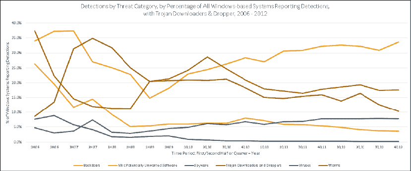</figure>

图 3.20:2006 年至 2012 年按威胁类别(包括后门、间谍软件、病毒、蠕虫、各种可能不需要的软件以及木马下载程序和下载程序)列出的检测结果，占所有基于 Windows 的系统报告检测结果的百分比(微软公司，未注明)

随着人们开始了解攻击者对木马下载者和下载者使用的肮脏伎俩，以及反病毒公司专注于根除这一流行的恶意软件类别，数据显示下载者和下载者的受欢迎程度正在下降，而各种木马的检测在 2008 年达到顶峰，并在 2009 年再次达到顶峰。这类威胁也主要依赖于社会工程来取得成功。数据还显示，2007 年至 2011 年间，对密码窃取者和监控工具的检测大幅增加。

蠕虫在 2008 年再度流行，Conficker 向攻击者展示了将三种常见的可疑病毒组合成一种蠕虫的可能性。

从那以后，依靠自动运行功能滥用、脆弱、泄露和窃取密码的蠕虫仍然很流行。在*图 3.21* 中，请注意从 2009 年开始的缓慢但稳定的利用增长。这一趋势在 2012 年达到顶峰，当时漏洞利用工具包在互联网上风靡一时。此外，请注意，在整个这段时间内，没有大量的勒索软件。当我们在 2012 年底离开这一时期时，图表右上角的类别(木马和潜在不需要的软件)依靠社会工程取得成功。

<figure class="mediaobject">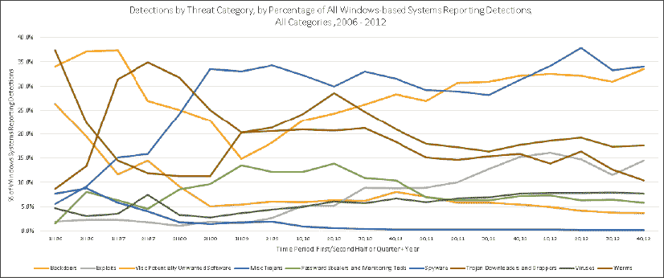</figure>

图 3.21:2006–2012 年按威胁类别、所有类别、所有基于 Windows 的系统报告检测百分比列出的检测(微软公司，未注明日期)

进入 2013 年，微软开始使用 ER 来衡量威胁检测。请注意，2013 年至 2017 年期间使用的衡量标准是 ER，而不是前期使用的检测衡量标准。这些是略有不同的数据点。微软没有公布 2016 年第三季度和第四季度的 ER 数据，因此这一时期的数据存在漏洞。ER 数据证实，杂项木马是 2013 年遇到的最常见的威胁类别。不幸的是，我找不到可能不需要的软件的 ER 的公开数据源，所以它从*图 3.22* 中消失了。2013 年下半年木马下载者和下载者的 ER 峰值是由三种威胁造成的:Rotbrow、Brantall 和 Sefnit (Microsoft，2014)。

期末，2017 年第四季度，勒索病毒 er 为 0.13%，杂项木马 ER 为 10.10%；相差 195%。虽然勒索软件的 ER 较低，但感染勒索软件的影响可能是毁灭性的。

因此，不要忘记查看风险计算的两个部分，即威胁的概率和影响。这是一个持续到 2019 年最后一个季度的趋势。尽管越来越多的 Windows 漏洞被披露，但微软在 Windows 操作系统的内存安全功能和其他缓解措施方面的投资似乎有助于降低全球 er。如果 ER 是一个指标，恶意软件的提供者似乎从社会工程中获得了坚实的投资回报(T2)。

<figure class="mediaobject">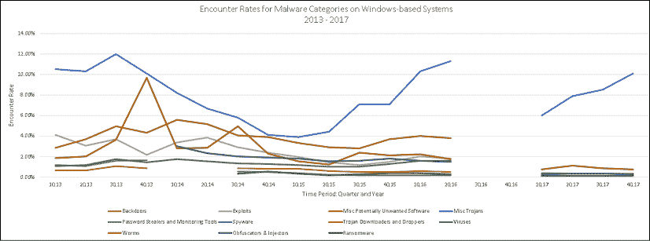</figure>

图 3.22:2013–2017 年报告检测的基于 Windows 的系统上按威胁类别划分的遭遇率(微软公司，未注明日期)

我刚才向您展示的绝大多数数据来自世界各地向微软报告数据的消费者系统。安全团队和网络安全专家应该意识到，消费者系统和企业中的威胁流行程度存在一些差异。研究这些差异很多年了，我可以给你总结一下。从企业环境中报告给微软的数据中可以得出三个有用的见解:

1.  **Worms**: This was typically the number one category of threat in enterprise environments that were reported to Microsoft over the years. This category of malware self-propagates, which means worms can spread quickly and be very difficult to get rid of once they are inside of an enterprise environment. Worms can hide in enterprise IT environments and resurface quickly. For example, they can hide in storage area networks where no anti-virus software has been deployed.

    它们可以隐藏在旧的台式机和服务器映像中，当用于构建新系统时，会将蠕虫重新引入环境中。它们也可以在恢复时从备份中恢复。我认识的许多 CISOs 在最初将 Conficker 这样的蠕虫引入环境后，与它们斗争了多年。

    这些蠕虫通常以三种方式传播:未修补的漏洞、弱密码和社会工程。听起来熟悉吗？他们应该这样做，因为这是五个网络安全常见嫌疑人中的三个。专注于网络安全基础知识将帮助您将蠕虫拒之门外，并遏制已经存在于您环境中的蠕虫。在任何地方部署最新的反恶意软件对阻止这些威胁都很重要。

2.  **USB 驱动器和其他可移动存储介质**:许多威胁(如蠕虫和病毒)通过 USB 驱动器进入企业环境。实现阻止台式机和服务器上 USB 端口访问的策略将防止信息工作者将此类威胁引入您的 IT 环境。将反恶意软件配置为在访问时扫描文件，尤其是可移动介质，也将有助于阻止这些威胁，其中许多威胁是反恶意软件实验室所熟知的，并且已存在多年。
3.  **Malicious or compromised websites**: Drive-by download attacks and watering hole attacks expose Information Workers' systems to exploits and, if successful, malware. Carefully think about whether your organization really needs a policy that allows Information Workers to surf the internet unfettered. Does everyone in the organization need to get to every domain on the internet, even IP addresses in the countries with, consistently, the highest malware infection rates in the world? Only permitting workers to get to trusted sites that have a business purpose might not be a popular policy with them, but it will dramatically reduce the number of potential threats they are exposed to.

    由于其业务的性质，这种缓解措施不会对每个组织都有效，但我敢说，与目前使用它的组织相比，它将对更多的组织有效。仔细考虑您的员工是否真的有必要无拘无束地访问互联网和包含外语内容的网站，以及安全团队是否可以做出一些具有较高缓解价值且对工作效率影响较小或为零的更改。受管出站代理规则、IDS/IPS 和浏览器白名单都是有帮助的控件。

当然，补丁，补丁，补丁！当他们所依赖的潜在漏洞被修补时，驱动下载攻击就不起作用了。这就是那些每季度或每半年打一次补丁的组织真正遭受损失的地方；他们允许他们的员工带着他们知道有成百上千公开漏洞的系统去互联网上的任何地方。可能会出什么问题？

## 全球恶意软件演变结论

该恶意软件类别数据向我们表明，恶意软件的提供者在尝试最初危害系统时，实际上仅限于几种选择。利用未打补丁的漏洞仅在有限的时间内是一种可靠的方法，但这并不能阻止攻击者在安全更新可用后多年内试图利用旧的漏洞。蠕虫随着攻击者的流行而变化，需要技术技能来开发。但是一个主要的策略是社会工程。当其他四个网络安全常见嫌疑人不可行时，许多攻击者会试图使用良好的老式社会工程。

尽管我刚刚与你分享了所有的恶意软件数据，一些网络安全专家仍然断言反恶意软件对企业来说是不值得的。让我们深入探讨一下这个论点，看看它是否站得住脚。

# 大辩论-反恶意软件解决方案真的值得吗？

请允许我就反恶意软件的功效发表我的看法。多年来，我听到一些网络安全专家在行业会议上嘲笑反恶意软件解决方案的功效，并建议组织不要费心使用这种解决方案。他们倾向于通过指出反恶意软件无法检测和清除所有威胁来证明这一观点。这是真的。他们还指出，反恶意软件解决方案本身可能存在漏洞，这些漏洞可能会增加而不是减少攻击面。这也是事实。由于反恶意软件软件通常可以访问操作系统的敏感部分及其扫描的数据，因此它们可能是攻击者的有效目标。一些反恶意软件供应商甚至被指控利用其产品拥有的系统访问特权，提供对系统的非法访问(Solon，2017)。其他供应商被指控不当分享其产品收集的信息(Krebs on Security，2017)。

但是请记住，恶意软件供应商每周都会制造出*百万*种独特的恶意软件威胁。随着世界各地的反恶意软件实验室获得这些威胁的样本，他们给他们的客户接种疫苗。因此，虽然反恶意软件解决方案无法保护组织免受所有威胁，尤其是新的和正在出现的威胁，但它可以保护组织免受数亿已知威胁的侵害。另一方面，如果他们不运行反恶意软件解决方案，他们将无法抵御这些威胁。使用最近的数据进行风险计算，我想你会发现运行反恶意软件是一件很容易的事情。对于企业而言，未能从值得信赖的供应商处运行最新的反恶意软件是重大疏忽。

并非所有反恶意软件产品都是平等的。以我的经验来看，反恶意软件供应商的水平取决于他们的研究和响应实验室中的研究人员、分析师和支持人员。供应商最大限度地减少误报，同时为现实世界的威胁提供最佳的响应时间和检测，这对安全团队非常有帮助。要根据这些指标比较产品，请查看 AV-Test 和 AV Comparatives 的第三方测试结果。反恶意软件实验室社区几十年来一直在讨论测试他们产品的最佳方式。

在过去，争论的焦点集中在如何根据产品测试所针对的恶意软件样本的收集来歪曲测试结果。例如，如果某个特定的实验室非常擅长检测 root kit，并且测试包括更多的 root kit 样本，那么该反恶意软件产品的得分可能会高于平均水平，即使它在检测其他类别的威胁方面低于平均水平。反之亦然——如果测试不包括 rootkit 或包括很少的 rootkit，产品的得分可能低于平均水平。由于反恶意软件测试不能包括每一个已知的恶意软件样本，由于现实世界的资源限制，无论他们测试什么样本都会影响被测试产品的得分。一些反恶意软件实验室认为，这迫使他们在其产品中继续检测不再流行的旧威胁，而不是让他们专注于客户更有可能遇到的当前和新兴威胁。相反的观点是，反恶意软件解决方案应该能够检测到所有威胁，不管它们当前的流行程度如何。随着更好的测试、更多的竞争者以及检测、阻止和消除威胁的新方法的出现，测试和行业继续发展。许多供应商通过利用试探法、行为分析、人工智能、ML 和云计算等方法，使他们的产品远远超出了简单的基于签名的检测系统。

我对恶意软件、反恶意软件解决方案和全球 Windows 威胁形势的马拉松式讨论到此结束。我觉得我只是触及了表面，但我们还有很多其他有趣的话题要讨论！在我们结束本章之前，让我分享一些与使用威胁情报相关的最佳实践和提示。

# 威胁情报最佳实践和提示

我想给你一些关于如何识别好的威胁情报和可疑的威胁情报的指导。在发表了近十年来业界最好的威胁情报报告之一(好吧，我承认我有偏见)之后，我学到了一些东西，我将在这里与您分享。本指南的主题是了解您的威胁情报供应商使用的方法。

如果他们不告诉你他们的方法是什么，那么你不能相信他们的数据。此外，要真正了解特定威胁情报是否或如何帮助您的组织，唯一的方法是了解其数据源以及用于收集和报告数据的方法；如果没有这种背景，威胁情报可能会分散注意力，并且与帮助相反。

## 技巧 1——数据源

始终了解您正在使用的威胁情报数据的来源，以及相关供应商如何解读这些数据。如果数据的来源是未知的，或者供应商不共享数据的来源，那么你就不能相信它和基于它的解释。例如，一个供应商声称 85%的系统已经被特定的恶意软件家族成功感染。但是，当您深入研究用于做出这一声明的数据来源时，会发现使用该供应商在线恶意软件清理器网站的系统中有 85%感染了所提到的恶意软件。请注意，“所有系统的 85%”是从“使用在线工具的所有系统的 85%”中戏剧性地推断出来的

此外，该在线工具仅以美国英语提供，这意味着不会说英语的消费者不太可能使用它，即使他们知道它的存在。最后，您发现供应商的桌面防病毒检测工具在发现系统感染了威胁时会建议用户使用在线工具进行杀毒。供应商这样做是为了让客户意识到他们的超级棒的在线工具是可用的。这扭曲了数据，因为从桌面防病毒工具转到在线工具的 100%的用户都已经知道感染了该威胁。这些年我都数不清见过多少次这样的特技了。始终深入数据源，了解数据对您的实际意义。

## 技巧 2——时间段

在使用威胁情报时，了解数据的时间范围和时间段非常重要。数据和见解是在几天、几周、几个月、几个季度还是几年内提供的？这个问题的答案将有助于提供理解情报所需的背景。对你的组织来说，几天的事件可能比几年的长期趋势有更大的不同。

异常通常会保证不同于已建立模式的风险处理。此外，根据供应商在其报告中使用的时间段，从威胁情报数据中得出的结论可能会发生显著变化。

让我为您提供一个示例场景。假设一个供应商正在报告在给定的时间段内他们的产品中有多少漏洞被披露。如果数据是定期连续报告的，比如每季度一次，趋势看起来真的很糟糕，因为大幅度增加是明显的。但是，与使用连续季度报告趋势不同，当将当前季度与去年同期进行比较时，趋势看起来要好得多；与去年同期相比，本季度的漏洞披露实际上可能有所减少。这给供应商带来了积极的影响，尽管漏洞披露逐季增加。

另一个潜在的危险信号是，当您看到供应商报告的数据不是正常时间段的数据时，例如每月、每季度或每年。相反，他们使用几个月的时间，这似乎有点随意。如果时间周期不规则或者使用它的原因不明显，那么应该用威胁情报来记录合理性。如果不是，询问供应商他们为什么选择时间段。有时，你会发现供应商使用特定的时间段，因为这使他们的故事更具戏剧性，获得更多的关注，如果这是他们的议程。或者，所选择的时间段可能有助于通过最小化数据变化来淡化坏消息。了解为什么要在特定的时间范围和时间段内报告数据，将使您对数据的可信度以及向您提供数据的供应商的议程有所了解。

## 技巧 3——识别炒作

我见过的组织在使用威胁情报时犯的最大错误之一是接受他们的供应商关于其数据的范围、适用性和相关性的声明。例如，一家威胁情报供应商发布数据称，在特定时间段内，100%的攻击都涉及社会工程或利用了特定的漏洞。这种说法的问题是，世界上没有人能看到 100%的攻击，*时期*。

他们必须无所不知，才能看到世界各地同时发生的所有攻击，包括所有操作系统和云平台、所有浏览器和应用程序。类似地，声称 60%的攻击是由特定的 APT 组织实现的也没有帮助。除非他们对 100%的攻击有所了解，否则他们无法可信地声称其中 60%的攻击有什么特征。声称所有攻击的特征或子集需要所有攻击的知识，即使提到特定的时间段、特定的位置和特定的攻击媒介，也是不可能或不可信的。威胁情报的一个很好的试金石是问自己，供应商必须无所不知才能做出这样的声明吗？在这种情况下，了解数据源和时间段将有助于您消除宣传，并获得情报可能具有的任何价值。

很多时候，发布数据的供应商不会在他们的威胁情报报告中直接做出这样的声明，但是为了引起人们的注意，在标题中报告新情报的方式会被概括或变得更具戏剧性。不要责怪威胁情报供应商报道新闻的方式，因为这通常超出了他们的控制范围。但如果他们直接提出这样的主张，就要认识到这一点，并适当调整你头脑中的语境。许多年来，我经常在世界各地的头条上谈论和写关于威胁的文章，但我们总是非常小心，不要超越数据支持的结论。要做出更大胆的声明，需要全知全能。

## 技巧 4——对未来的预测

我相信你已经看到一些供应商对未来的威胁形势做出了预测。一些威胁情报供应商喜欢使用的一个技巧与时间段有关。假设我要发布一份关于过去 6 个月的威胁情报报告。当这一时期的数据收集完毕，报告撰写完成并发表时，可能已经过去了一两个月。现在，如果我在这份报告中对未来进行预测，我有一两个月的数据可以告诉我自报告期结束以来发生了什么。

如果我的预测是基于数据告诉我们已经发生的事情，那么报告的读者会认为我实际上准确预测了未来，从而强化了我们比任何人都更了解威胁形势的观点。了解相对于预测所关注的时间段的预测时间将有助于您确定预测和结果的可信度，以及做出预测的供应商的可信度。记住，对未来的预测都是猜测。

## 技巧 5——供应商的动机

信任是信誉和品格的结合。您可以利用这两个因素来判断您的供应商是否值得信赖。数据源、时间尺度、时间段和对未来的预测的透明度可以帮助供应商证明他们是可信的。他们的动机反映了他们的性格。他们是希望作为可信赖的顾问与您的组织建立关系，还是他们的兴趣仅限于金融交易？在构建网络安全计划时，这两种类型的供应商都有一席之地，但了解哪种供应商属于每一类可能会有所帮助，特别是在与事件响应相关的活动中，当压力增大时。当你需要真正的帮助时，知道你可以依靠谁是很重要的。

这些是我 10 年来发布威胁情报报告的经验，可以提供给你的建议和窍门。同样，这里最重要的一点是理解您所使用的威胁情报的方法和数据源，这一点不是可选的。最后一点建议:不要使用不符合这个标准的威胁情报。IT 行业有太多的恐惧、不确定性和怀疑，以及太多的复杂性。你需要选择听取谁的建议。

我希望你喜欢这一章。信不信由你，这种类型的数据越来越难找到。好消息是，威胁情报正越来越多地被集成到网络安全产品和服务中，这意味着保护、检测和响应威胁比以往任何时候都更容易、更快。

# 章节总结

这一章需要大量的研究。我试图向您提供对威胁形势的独特的长期观点和一些有用的背景。我将试着总结一下本章的要点。

恶意软件利用网络安全通常的嫌疑人来初步危害系统；这些包括未打补丁的漏洞、安全错误配置、脆弱、泄露和被盗的密码、内部威胁和社会工程。其中，社交工程是攻击者最喜欢的战术，利用社交工程的恶意软件类别的持续高流行率就是证明。恶意软件也可以在最初的危害之后被用于进一步的攻击者目标。

一些成功的恶意软件家族在发布后会很快影响世界各地的系统，而另一些则在发展成全球威胁之前先成为区域性威胁。一些威胁局限于某个地区，因为它们依靠特定的非英语语言来欺骗用户安装它们。不同地区遇到恶意软件的几率和感染率不同。微软进行的研究表明，一些社会经济因素，如国内生产总值，可能会影响这些差异。冲突和随之而来的社会经济条件异常严重的地区，通常会有更高的恶意软件遭遇率和感染率。

关注网络安全基础知识，解决网络安全常见的疑点，将有助于减轻恶意软件的威胁。此外，运行来自可信供应商的最新反恶意软件解决方案将有助于阻止大多数恶意软件的安装，并对受感染的系统进行杀毒。阻止信息工作者访问没有合法商业目的的互联网区域，有助于防止在这些区域暴露于恶意软件和受损系统。

到目前为止，我们已经研究了两种重要威胁的长期趋势，即漏洞和恶意软件。在下一章中，我们将探究攻击者使用互联网的方式以及这些方式是如何随着时间的推移而演变的。

# 参考

1.  半岛电视台(2014 年 1 月 4 日)。伊拉克政府失去对费卢杰的控制。检索自半岛电视台网站:[https://www . al Jazeera . com/news/middle east/2014/01/Iraq-government-loses-control-fallu Jah-20141414625597514 . html](https://www.aljazeera.com/news/middleeast/2014/01/iraq-government-loses-control-fallujah-20141414625597514.html)
2.  权威，R. O. (2019)。*爱沙尼亚信息系统管理局 2019 年度网络安全评估*。爱沙尼亚共和国信息系统管理局。
3.  AV-测试研究所(2017 年)。*2016/2017 年度 AV-TEST 安全报告*。德国马格德堡:AV 测试研究所
4.  AV-Test Institute (2018)。*2017/2018 年度 AV-TEST 安全报告*。德国马格德堡:AV 测试研究所
5.  AV-Test Institute(2019 年 4 月)。*2018/2019 年度 AV-TEST 安全报告*。德国马格德堡:AV 测试研究所。检索自 AV-Test:[T3】https://www . AV-Test . org/file admin/pdf/Security _ Report/AV-Test _ Security _ Report _ 2018-2019 . pdfT5】](https://www.av-test.org/fileadmin/pdf/security_report/AV-TEST_Security_Report_2018-2019.pdf)
6.  AV-测试研究所(2020 年 4 月)。*关于 AV-TEST 研究所。从 AV-Test*:中检索
7.  AV-测试研究所(2020 年 4 月)。 *AV-Test 恶意软件统计*。从 AV-Test 中检索:【https://www.av-test.org/en/statistics/malware/】
8.  AV-测试研究所(2020 年 4 月)。*国际形象和出版物*。检索自 AV-Test Institute:[https://www . AV-Test . org/en/about-the-Institute/publications/](https://www.av-test.org/en/about-the-institute/publications/ )
9.  戴维·伯特，P. N. (2014 年)。*网络安全风险悖论，微软安全情报报告特别版*。微软。检索自:[T3】https://query . prod . CMS . rt . Microsoft . com/CMS/API/am/binary/REVrozT5】](https://query.prod.cms.rt.microsoft.com/cms/api/am/binary/REVroz)
10.  大卫·莱德，F. S. (2011 年)。*SDL 进度报告*。微软。检索自:[T3【http://download . Microsoft . com/download/c/e/f/cefb 7 BF 3-de0c-4d CB-995 a-C1 c 69659 BF 49/sdlprogressreport . pdfT5】](http://download.microsoft.com/download/c/e/f/cefb7bf3-de0c-4dcb-995a-c1c69659bf49/sdlprogressreport.pdf )
11.  ECE Toksabay(2014 年 2 月 22 日)。警察向伊斯坦布尔反政府抗议活动发射催泪瓦斯。检索自路透社:[https://www . Reuters . com/article/us-turkey-抗议/警察-消防-催泪瓦斯-at-伊斯坦堡-反政府-抗议-idUSBREA1L0UV20140222](https://www.reuters.com/article/us-turkey-protest/police-fire-tear-gas-at-istanbul-anti-government-protest-idUSBREA1L0UV20140222)
12.  凯泽，g .(2020 年 1 月 4 日)。*Windows by the numbers:Windows 10 恢复向无止境的统治地位进军*。检索自英国计算机世界:[https://www . computer world . com/article/3199373/windows-by-numbers-windows-10-continues-to-食人-windows-7.html](https://www.computerworld.com/article/3199373/windows-by-the-numbers-windows-10-continues-to-cannibalize-windows-7.html)
13.  凯泽湾(未标明)。*Windows by the numbers:Windows 10 恢复向无止境的统治地位进军*。检索自计算机世界英国:[https://www . Computer World . com/article/3199373/windows-by-numbers-windows-10-continues-to-食人-windows-7.html](https://www.computerworld.com/article/3199373/windows-by-the-numbers-windows-10-continues-to-cannibalize-windows-7.html)
14.  克雷布斯论安全(2017 年 8 月 17 日)。*碳排放:过度共享漏洞让安全供应商重新成为焦点*。检索自 Krebs on Security:[https://krebsonsecurity . com/2017/08/carbon-emissions-over sharing-bug-puts-Security-vendor-back-in-spot light/](https://krebsonsecurity.com/2017/08/carbon-emissions-oversharing-bug-puts-security-vendor-back-in-spotlight/)
15.  莱登，j .(未注明)。微软发布 Blaster 清理工具。从注册中检索:[https://www . The Register . co . uk/2004/01/07/Microsoft _ releases _ blaster _ clean up _ tool/](https://www.theregister.co.uk/2004/01/07/microsoft_releases_blaster_cleanup_tool/)
16.  微软(2014 年)。*微软安全情报报告第 16 卷*。检索自微软安全情报报告第 16 卷:[T3&https://go.microsoft.com/fwlink/p/?linkid=2036139【clcid = 0x 409&culture = en-us&country = usT5】](https://go.microsoft.com/fwlink/p/?linkid=2036139&clcid=0x409&culture=en-us&country=us)
17.  微软(2016 年 12 月 14 日)。*微软安全情报报告。微软安全情报报告第 21 卷*。检索自微软安全情报报告第 21 卷:[T3&https://go.microsoft.com/fwlink/p/?linkid=2036108【clcid = 0x 409&culture = en-us&country = usT5】](https://go.microsoft.com/fwlink/p/?linkid=2036108&clcid=0x409&culture=en-us&country=us )
18.  微软公司(2019 年 4 月 8 日)。*微软安全情报报告卷。*检索自微软安全情报报告第六卷:[T3】https://go.microsoft.com/fwlink/p/?linkid=2036319&cl cid = 0x 409&culture = en-us&country = usT5】](https://go.microsoft.com/fwlink/p/?linkid=2036319&clcid=0x409&culture=en-us&country=us )
19.  微软公司(2015 年)。*虚拟专属:网络空间 2025:10 年后网络安全会是什么样子？微软*。检索自:[https://channel 9 . msdn . com/Events/Virtual-CIO-Summit/Virtual-CIO-Summit-2015/Virtual-EXCLUSIVE-Cyberspace-2025-What-will-Cyberspace-Look-Like-in-10-Years](https://channel9.msdn.com/Events/Virtual-CIO-Summit/Virtual-CIO-Summit-2015/VIRTUAL-EXCLUSIVE-Cyberspace-2025-What-will-Cybersecurity-Look-Like-in-10-Years)
20.  微软公司(2016 年 7 月 7 日)。*微软安全情报报告第二十卷*。检索自微软安全情报报告第 20 卷:[T3&https://go.microsoft.com/fwlink/p/?linkid=2036113【clcid = 0x 409&culture = en-us&country = usT5】](https://go.microsoft.com/fwlink/p/?linkid=2036113&clcid=0x409&culture=en-us&country=us)
21.  微软公司(2017 年 8 月 17 日)。*微软安全情报报告第 22 卷*。检索自微软安全情报报告第 22 卷:[T3&https://go.microsoft.com/fwlink/p/?linkid=2045580【clcid = 0x 409&culture = en-us&country = usT5】](https://go.microsoft.com/fwlink/p/?linkid=2045580&clcid=0x409&culture=en-us&country=us)
22.  微软公司(2018)。*微软安全情报报告第 23 卷*。检索自微软安全情报报告第 23 卷:[T3&https://go.microsoft.com/fwlink/p/?linkid=2073690【clcid = 0x 409&culture = en-us&country = usT5】](https://go.microsoft.com/fwlink/p/?linkid=2073690&clcid=0x409&culture=en-us&country=us)
23.  微软公司(2019 年 8 月 10 日)。*行业协作计划*。检索自微软:[https://docs . Microsoft . com/en-us/windows/security/threat-protection/intelligence/cyber security-industry-partners](https://docs.microsoft.com/en-us/windows/security/threat-protection/intelligence/cybersecurity-industry-partners)
24.  微软公司(2019 年 8 月 13 日)。*修补远程桌面服务中新的蠕虫漏洞(CVE-2019-1181/1182)* 。检索自微软安全响应中心博客:[https://msrc-Blog . Microsoft . com/2019/08/13/patch-new-worm able-vulnerabilities-in-remote-desktop-services-CVE-2019-1181-1182/](https://msrc-blog.microsoft.com/2019/08/13/patch-new-wormable-vulnerabilities-in-remote-desktop-services-cve-2019-1181-1182/)
25.  微软公司。*双插描述*。检索自微软安全情报:[https://www . Microsoft . com/en-us/wdsi/threats/malware-encyclopedia-description？name = Win32/Diplugem&threat id =T5】](https://www.microsoft.com/en-us/wdsi/threats/malware-encyclopedia-description?Name=Win32/Diplugem&threatId= )
26.  微软公司。 *DirectAccess* 。检索自微软公司:[https://docs . Microsoft . com/en-us/windows-server/remote/remote-access/direct access/direct access](https://docs.microsoft.com/en-us/windows-server/remote/remote-access/directaccess/directaccess )
27.  微软公司。*微软如何识别恶意软件和可能不需要的应用程序*。检索自微软公司:[https://docs . Microsoft . com/en-us/windows/security/threat-protection/intelligence/criteria](https://docs.microsoft.com/en-us/windows/security/threat-protection/intelligence/criteria)
28.  微软公司。*恶意软件遭遇率*。从微软安全情报报告中检索:【https://www.microsoft.com/securityinsights/Malware】[T3T5】](https://www.microsoft.com/securityinsights/Malware )
29.  微软公司。*微软安全情报报告*。从 Microsoft Security 检索
30.  微软公司。*十多年来对威胁形势的报道*。检索自微软公司:[https://www . Microsoft . com/en-us/security/operations/security-intelligence-report](https://www.microsoft.com/en-us/security/operations/security-intelligence-report)
31.  微软公司。*彼佳描述*。检索自微软安全情报:[https://www . Microsoft . com/en-us/wdsi/threats/malware-encyclopedia-description？Name=Ransom:DOS/Petya。a&threat id =-2147257025T5】](https://www.microsoft.com/en-us/wdsi/threats/malware-encyclopedia-description?Name=Ransom:DOS/Petya.A&threatId=-2147257025)
32.  微软公司。*通过更新远程桌面服务来防止蠕虫(CVE-2019-0708)* 。检索自微软安全响应中心博客:[https://msrc-blog . Microsoft . com/2019/05/14/prevent-a-worm-by-updating-remote-desktop-services-CVE-2019-0708/](https://msrc-blog.microsoft.com/2019/05/14/prevent-a-worm-by-updating-remote-desktop-services-cve-2019-0708/)
33.  微软公司。*使用 Windows 恶意软件删除工具*删除特定的流行恶意软件。检索自微软公司:[https://support . Microsoft . com/en-us/help/890830/remove-specific-populate-malware-with-windows-malware-remo](https://support.microsoft.com/en-us/help/890830/remove-specific-prevalent-malware-with-windows-malicious-software-remo)
34.  微软公司。*使用 Windows 恶意软件删除工具*删除特定的流行恶意软件。检索自微软公司:[https://support . Microsoft . com/en-us/help/890830/remove-specific-populate-malware-with-windows-malware-remo # covered](https://support.microsoft.com/en-us/help/890830/remove-specific-prevalent-malware-with-windows-malicious-software-remo#covered )
35.  微软公司。 *Reveton 描述*。检索自微软安全情报:[https://www . Microsoft . com/en-us/wdsi/threats/malware-encyclopedia-description？Name=Ransom:Win32/Reveton。t！lnk&threat id =-2147285370T5】](https://www.microsoft.com/en-us/wdsi/threats/malware-encyclopedia-description?Name=Ransom:Win32/Reveton.T!lnk&threatId=-2147285370 )
36.  微软公司。 *Rotbrow 描述*。检索自微软安全情报:[https://www . Microsoft . com/en-us/wdsi/threats/malware-encyclopedia-description？name = win32 % 2 frot browT5】](https://www.microsoft.com/en-us/wdsi/threats/malware-encyclopedia-description?name=win32%2frotbrow )
37.  微软公司。*显著性描述*。检索自微软安全情报:[https://www . Microsoft . com/en-us/wdsi/threats/malware-encyclopedia-description？name = Virus % 3a win32 % 2f salityT5】](https://www.microsoft.com/en-us/wdsi/threats/malware-encyclopedia-description?Name=Virus%3aWin32%2fSality)
38.  微软公司。*序列号描述*。检索自微软安全情报:[https://www . Microsoft . com/en-us/wdsi/threats/malware-encyclopedia-description？name = Win32/sef nitT5】](https://www.microsoft.com/en-us/wdsi/threats/malware-encyclopedia-description?Name=Win32/Sefnit)
39.  微软公司。*智能屏幕:常见问题解答*。检索自微软公司:[https://support . Microsoft . com/en-GB/help/17443/windows-internet-explorer-smart screen-FAQ](https://support.microsoft.com/en-gb/help/17443/windows-internet-explorer-smartscreen-faq)
40.  微软公司。 *Taterf 描述*。检索自微软安全情报:[https://www . Microsoft . com/en-us/wdsi/threats/malware-encyclopedia-description？name = Win32/Taterf&threat id =T5】](https://www.microsoft.com/en-us/wdsi/threats/malware-encyclopedia-description?Name=Win32/Taterf&threatId=)
41.  微软公司。*关于冲击波蠕虫及其变种的病毒警报*。检索自微软公司:[https://support . Microsoft . com/en-us/help/826955/virus-alert-about-the-blaster-worm-and-its-variants](https://support.microsoft.com/en-us/help/826955/virus-alert-about-the-blaster-worm-and-its-variants)
42.  NIST(未标出)。 *CVE-2019-0708 详情*。从国家漏洞数据库中检索到:【https://nvd.nist.gov/vuln/detail/CVE-2019-0708】
43.  t . rains(2011 年 6 月 27 日)。*防御自动运行攻击*。检索自微软官方安全博客:[https://www . Microsoft . com/Security/Blog/2011/06/27/defending-against-autorun-attacks/](https://www.microsoft.com/security/blog/2011/06/27/defending-against-autorun-attacks/ )
44.  t . rains(2013 年 9 月 24 日)。*审视韩国过山车般的威胁形势*。检索自微软官方安全博客:[https://www . Microsoft . com/Security/Blog/2013/09/24/examining-Koreas-roller coaster-threat-landscape/](https://www.microsoft.com/security/blog/2013/09/24/examining-koreas-rollercoaster-threat-landscape/)
45.  雷恩，t .(未注明)。*新的微软恶意软件保护中心威胁报告发布:EyeStye* 。检索自微软官方安全博客:[https://www . Microsoft . com/Security/Blog/2012/07/20/new-Microsoft-malware-protection-center-threat-report-published-eyes tye/](https://www.microsoft.com/security/blog/2012/07/20/new-microsoft-malware-protection-center-threat-report-published-eyestye/ )
46.  爱沙尼亚共和国信息系统管理局(2018 年)。*爱沙尼亚信息系统管理局:2018 年度网络安全评估。爱沙尼亚共和国信息系统管理局*。检索自:[T3【https://www . RIA . ee/sites/default/files/content-editors/kuberturve/RIA-CsA-2018 . pdfT5】](https://www.ria.ee/sites/default/files/content-editors/kuberturve/ria-csa-2018.pdf)
47.  o .梭伦(2017 年 9 月 13 日)。美国政府因担心间谍活动而禁止机构使用卡巴斯基软件。摘自《卫报》:[https://www . The Guardian . com/technology/2017/sep/13/us-government-bans-Kaspersky-lab-Russian-spuring](https://www.theguardian.com/technology/2017/sep/13/us-government-bans-kaspersky-lab-russian-spying)
48.  *土耳其总理被宣布赢得总统选举(2014 年 8 月 10 日)*。摘自纽约时报:[https://www . nytimes . com/2014/08/11/world/Europe/Erdogan-Turks-premier-wins-president-election . html？_ r = 0/](https://www.nytimes.com/2014/08/11/world/europe/erdogan-turkeys-premier-wins-presidential-election.html?_r=0/)
49.  美国国土安全部。*关键基础设施部门*。检索自 https://www.dhs.gov/cisa/critical-infrastructure-sectors
50.  维基百科(未注明)。 *2014 年在伊拉克*。从 Wikipedia.com 检索:【https://en.wikipedia.org/wiki/2014_in_Iraq】
51.  维基百科(未注明)。 *2014 年巴基斯坦*。从 Wikipedia.com 检索:【https://en.wikipedia.org/wiki/2014_in_Pakistan】
52.  维基百科(未注明)。*下一代安全计算基础*。从 Wikipedia.com 检索:[https://en . Wikipedia . org/wiki/Next-Generation _ Secure _ Computing _ Base](https://en.wikipedia.org/wiki/Next-Generation_Secure_Computing_Base)
53.  维基百科(未注明)。*阿拉伯之春的时间线*。从 Wikipedia.com 检索:【https://en.wikipedia.org/wiki/Timeline_of_the_Arab_Spring】*