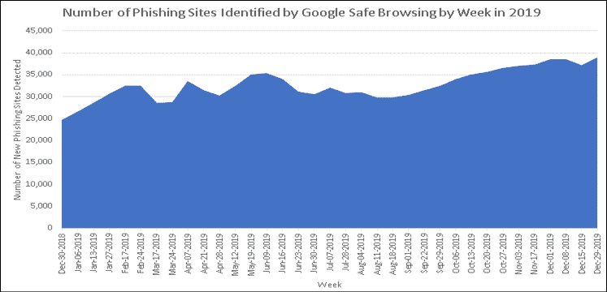
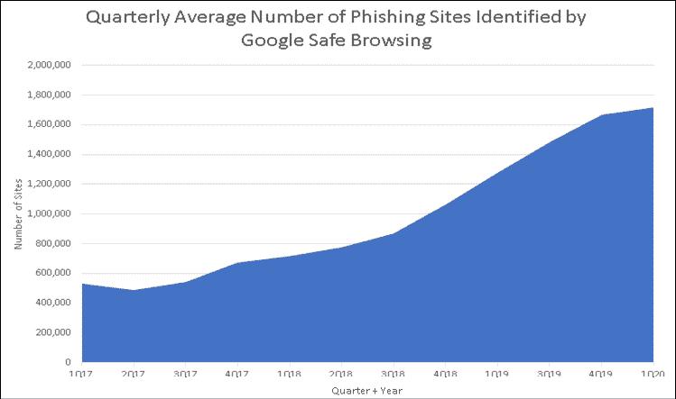
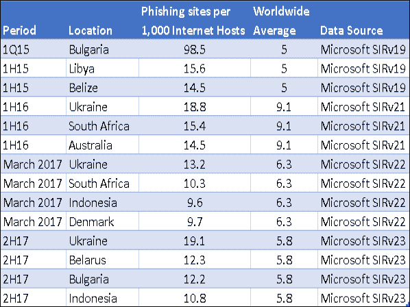
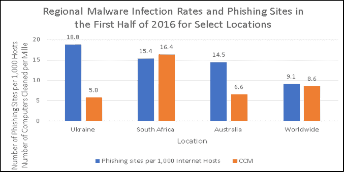
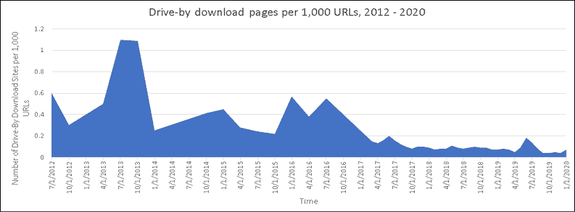
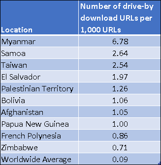
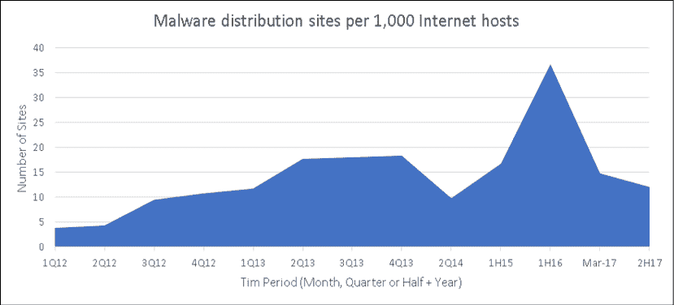

# 四、基于互联网的威胁

在过去的 25 年里，攻击者学会了利用互联网来破坏受害者的 IT 环境，实现他们的非法目标并满足他们的动机。CISOs 和安全团队可以通过研究攻击者如何使用互联网来制定网络安全策略。在这一章中，我们将看看攻击者使用互联网的一些方法，以及这些方法是如何随着时间的推移而演变的。

在本章中，我们将探讨以下主题:

*   网络钓鱼攻击
*   偷渡式下载攻击
*   恶意软件托管网站

让我们从典型攻击模式的剖析开始。

# 介绍

在前两章中，我深入分析了漏洞披露和恶意软件的数据和趋势。这两种类型的威胁不断被攻击者利用，试图危害世界各地的组织和消费者。随后，这些威胁所代表的风险由企业主动管理。但是，攻击者提供武器的方式是多种多样的，无论是利用漏洞还是为攻击者提供非法后门的恶意软件。

在这一章中，我们将看看攻击者用来攻击受害者的一些方法；理解这些与理解漏洞和恶意软件是如何演变的一样重要。

到目前为止，我们已经研究过的威胁有可能使攻击者危及应用、客户端、服务器、消费者和物联网设备、路由和交换设备以及企业所依赖的其他系统。无论这些攻击的目的是伤害大量的组织和消费者，还是针对特定的组织，攻击者都将使用网络安全通常的嫌疑人来初步危及 IT 系统。提醒一下，这些包括:

*   未修补的漏洞
*   安全错误配置
*   脆弱、泄露和被盗的凭据
*   社会工程
*   内部威胁

攻击者很少坐在他们试图入侵的系统的键盘前。绝大多数攻击者都是通过网络进行远程攻击，而不是通过互联网。互联网让小企业与大型跨国公司竞争，同样，它也让个人和小团体攻击大量消费者和世界上最大的组织。

现在让我们看一个典型的攻击模式，作为攻击者如何学会利用互联网的例子。

# 典型的攻击

在这个虚构的例子中，攻击者实际位于澳大利亚，而攻击的目标受害者总部位于美国的。攻击者的动机是利润，他们试图从他们的目标组织那里窃取有价值的信息并出售。

目标受害者有一辆 CISO 和一个安全小组。攻击者对受害者周边的持续漏洞扫描显示，他们精通漏洞管理，因为面向互联网的系统上的漏洞被快速有效地修补。在对受害者组织做了一些研究后，攻击者决定使用多管齐下的方法来初步危害该组织。

攻击者总是以这样或那样的方式成功，利用社会工程欺骗非技术业务人员做出可以利用的糟糕的信任决策。在这种情况下，不良信任决策是指受害者决定打开电子邮件中的附件或单击 URL，降低系统的安全设置，打开防火墙端口，或采取其他使攻击者更容易受害的操作。在这种情况下，攻击者将使用两种不同的策略来尝试破坏一些信息工作者的笔记本电脑，目标是访问他们的电子邮件收件箱。这两种策略都将利用电子邮件作为传递机制，并依靠社会工程和草率的安全缓解措施来取得成功。

第一种策略是使用公司网站向攻击者确定为在公司财务部门工作的特定个人发送钓鱼电子邮件。很快就获得了攻击者想要攻击的人的电子邮件地址列表。网络钓鱼电子邮件的目的是欺骗一个或多个目标信息工作者共享他们的 Office 365 凭据，然后攻击者可以使用这些凭据访问他们的电子邮件收件箱。

第二种策略是向相同的信息工作者发送包含恶意链接的电子邮件，这些链接指向一个恶意下载站点。如果信息工作者上钩并点击该链接，他们的 web 浏览器会将他们带到一个恶意网页，这将使他们面临浏览器和操作系统漏洞的多次利用。如果他们的客户端没有完全安装补丁，攻击者很有可能能够在他们的系统上安装后门，这可能允许他们获得访问受害者笔记本电脑的特权，并最终访问他们的电子邮件。

当然，如果攻击者真的获得了访问受害者笔记本电脑的特权，那么除了电子邮件之外，他们或许还能收获各种其他有价值的信息。示例包括本地存储在笔记本电脑上的文档、联系人列表、社交网络帐户的访问权限、软件许可证密钥、费用和信用卡信息、银行信息和凭据、可用于身份盗窃的个人信息等。如果笔记本电脑被动地由 IT 部门管理，它可能会被用来存储非法资料，加入僵尸网络，并用于攻击其他目标。例如，它可能被用于垃圾邮件和网络钓鱼活动、托管驱动下载攻击、托管恶意软件、广告点击欺诈、DDoS 攻击或攻击者决定进行的任何“项目工作”。

此外，攻击者可以出售或交易他们窃取的任何信息，包括帐户凭证。他们向其提供该信息的罪犯可能位于更靠近受害者的位置，并且更积极地利用该信息来最大化他们的利润和/或对受害者的损害。

这种类型的攻击太典型了。它涉及五个网络安全常见疑点中的三个，包括社会工程、未打补丁的漏洞和被盗凭证。现在让我们仔细看看这些方法，它们是如何工作的，它们到底有多受欢迎。为此，我将利用行业领导者多年来发布的威胁情报和数据。让我们先来看看网络钓鱼。

# 网络钓鱼攻击

社会工程是世界各地攻击者的主要策略。网络钓鱼是两个网络安全常见嫌疑人的交集；社会工程和弱密码、泄露密码和被盗密码。历史上许多最大的数据泄露都始于网络钓鱼攻击。简而言之，网络钓鱼是一种社会工程策略，攻击者试图诱骗受害者与他们共享机密信息。攻击者使用电子邮件、网站和广告诱使人们披露账户凭证、个人详细信息、信用卡和金融账户信息等。受害者披露的信息可能被用于非法访问在线账户、进行非法金融交易、窃取受害者的身份等目的。

一些攻击者为他们的网络钓鱼攻击撒下一张不加选择的大网，以诱捕尽可能多的人，从而增加成功的几率。一些攻击者将他们的网络钓鱼活动集中在一个行业或一组目标上。鱼叉式网络钓鱼用于将攻击集中在个人身上，可能是因为他们可以获得攻击者想要的信息或财富。

通常，在攻击者成功侵入信息工作者的系统后，受害者自己的联系人列表被用来攻击他们的朋友、家人、同事和业务联系人。例如，一旦受害者的社交网络帐户遭到破坏，攻击者就可以使用受害者的帐户与受害者的社交网络进行通信。由于通信似乎来自可信来源，受害者社交网络中的其他人很容易被通过受害者帐户共享的网络钓鱼电子邮件和网站所欺骗。攻击者并不局限于攻击其目标的公司帐户，他们还会设法破坏信息工作者的个人系统，因为他们知道这些系统通常可以远程访问公司资产。安装键盘记录器或其他类型的恶意软件来自动从受害者的系统中收集数据是很常见的。

网络钓鱼攻击可能涉及多个技术组件，包括受害者的客户端和用于攻击受害者的基础设施。例如，发送网络钓鱼邮件的电子邮件服务器或托管网络钓鱼页面的 web 服务器。通常，这些电子邮件服务器和 web 服务器托管在合法的系统上，这些系统已经被入侵，并随后被用于网络钓鱼活动。僵尸网络是被非法远程控制的潜在大型受损系统网络，通常用于网络钓鱼活动。将受损系统用于网络钓鱼活动基础设施可降低攻击者的成本，保护他们的身份，并帮助他们达到其他方式无法达到的规模。网络钓鱼工具包的存在使得几乎任何人都可以轻松发起网络钓鱼攻击。

让我们仔细看看钓鱼网站托管在哪里，它们的受害者在哪里。首先，认识到这个问题的严重性很重要。就数量而言，网络钓鱼和木马(正如我在*第 3 章*、*威胁格局的演变-恶意软件*中讨论的)是攻击者使用最多的战术。到底有多少钓鱼网站？

网络钓鱼网站的良好数据来源是互联网搜索引擎和网络浏览器。毕竟，谷歌和必应一直在为互联网上的数十亿网页编制索引，这样搜索就能产生快速、准确的结果。此外，数百万人使用谷歌 Chrome 和微软网络浏览器上网。浏览器允许用户报告可疑或完全不安全的网站。谷歌和微软在他们的浏览器和搜索引擎中使用功能来寻找钓鱼网站、恶意软件托管网站和其他类型的恶意网站。然后，他们通过将不断更新的恶意 URL 和 IP 地址列表集成到他们的产品和服务中，帮助他们的产品和服务用户避开他们发现的恶意网站。除其他服务外，浏览器和搜索引擎都可以在用户试图访问已知的恶意网站(如钓鱼网站)时发出警告。这就产生了谷歌和微软定期发布的恶意网站数据。

例如，谷歌寻找恶意网站的技术被称为安全浏览。谷歌是这样描述它的:

> “谷歌的安全浏览技术每天检查数十亿个网址，寻找不安全的网站。每天，我们都会发现数以千计的新的不安全网站，其中许多都是已经被入侵的合法网站。当我们检测到不安全的网站时，我们会在谷歌搜索和网络浏览器中显示警告。您可以搜索查看当前访问某个网站是否有危险。
> 
> —(谷歌，2020 年)

2019 年，谷歌的安全浏览平均每周检测到 32，677 个新的钓鱼网站。该体积反映在*图 4.1* 中。可能影响新网络钓鱼网站数量的因素包括采用社会工程策略的人数、网络钓鱼工具和其他有助于攻击的自动化工具(如僵尸网络)的可用性、持续的低运营成本以及可接受的成功率。

<figure class="mediaobject"></figure>

图 4.1:2019 年谷歌安全浏览按周检测到的钓鱼网站数量(谷歌，2020)。Google 和 Google 徽标是 Google LLC 的注册商标，经许可使用。

谷歌、微软和许多其他组织都试图让消费者和企业更容易报告钓鱼网站。当报告或检测到网络钓鱼网站时，会采用法律和技术流程来关闭这些恶意网站。

根据谷歌公布的数据(谷歌，2020)，在截至 2015 年第四季度的六年半时间里，这一过程似乎将互联网上的钓鱼网站数量控制在 20 万个以下。然后在 2015 年第四季度，钓鱼网站的数量开始增长，并且一直没有消退。2020 年 4 月，谷歌报告称，安全浏览已经检测到超过 180 万个钓鱼网站(谷歌，2020)。从 2015 年 8 月到 2020 年 4 月，互联网上的钓鱼网站数量增长了近 1000%。这种急剧增长在很大程度上体现在*图 4.2* 中，该图提供了从 2017 年第一季度(17 年第一季度)到 2020 年第一季度(2010 年第一季度)之间每个季度钓鱼网站的平均数量。

<figure class="mediaobject"></figure>

图 4.2:2017-2020 年(Google，2020)各季度 Google 安全浏览识别的钓鱼网站平均数量。Google 和 Google 徽标是 Google LLC 的注册商标，经许可使用。

随着时间的推移，网络钓鱼电子邮件的数量也在增加。钓鱼邮件的一个重要数据来源是大规模电子邮件服务，如微软 Office 365 和谷歌 Gmail 等，它们接收和过滤全球企业客户的钓鱼请求。微软报告称，2018 年发送给使用 Office 365 的收件人的钓鱼电子邮件数量大幅增加:

> “微软每月在 Office 365 中分析和扫描超过 4700 亿封电子邮件，以发现网络钓鱼和恶意软件，这为分析师提供了关于攻击者趋势和技术的大量见解。2018 年 1 月至 12 月，网络钓鱼邮件的入站电子邮件份额增加了 250%。”
> 
> —(微软公司，2019 年)

微软表示，2018 年钓鱼邮件的高峰期是 11 月，其中 0.55%的入站邮件是钓鱼邮件；这相当于一个月内有 25.85 亿封钓鱼电子邮件(微软公司，2019 年)。

2019 年 7 月似乎是 2018/2019 时间段内水平最高的月份，在微软全球分析的电子邮件总量中，检测到 0.85%的钓鱼电子邮件。假设同样的每月 4700 亿电子邮件消息量，这相当于一个月 39.95 亿个网络钓鱼电子邮件消息。当然，还有许多其他内部和在线电子邮件服务会收到大量网络钓鱼电子邮件，但这些数字中并未包含这些内容。

例如，2019 年 8 月，谷歌透露，它每天阻止 1 亿封钓鱼邮件:

> “谷歌每天拦截的大约 1 亿封网络钓鱼邮件分为三大类:针对不同个人的高针对性但低数量的鱼叉式网络钓鱼，“仅针对几十人的精品网络钓鱼”，以及针对成千上万人的自动化批量网络钓鱼。”
> 
> —(佩戈罗，2019 年)

平均每月大约有 30 亿封网络钓鱼邮件，与微软大致相当。网络钓鱼电子邮件的数量和活跃的网络钓鱼网站的数量使网络钓鱼攻击者最广泛使用的战术。大多数网络钓鱼电子邮件都包含一个指向网络钓鱼网站的超链接。"超过 75%的网络钓鱼邮件包含指向网络钓鱼网站的恶意网址."(微软公司，2018)。网络钓鱼电子邮件通常试图利用流行的体育和社交活动、危机情况、冲突、销售和机会的提供，以及过期账单、银行账户问题和包裹运输故障的索赔，来利用受害者的情绪并制造一种紧迫感。网络钓鱼者会利用任何话题来吸引潜在受害者的注意力，迫使他们采取行动，最终导致错误的信任决策和信息泄露。

网络钓鱼攻击的常见目标包括在线服务、金融网站、社交网站、电子商务网站等等。*反网络钓鱼工作组 2019 年第四季度的网络钓鱼活动趋势报告*表明，SaaS/网络邮件(30.80%)、支付(19.80%)和金融机构(19.40%)是本季度最常受到网络钓鱼攻击的目标行业(2019 年第四季度网络钓鱼活动趋势报告，2020 年)。

同样值得注意的是，报告指出:

> “针对社交媒体目标的网络钓鱼在今年每个季度都有所增长，在 2019 年期间翻了一番。”
> 
> —(网络钓鱼活动趋势报告，2019 年第四季度，2020 年)

钓鱼网站可以托管在世界上的任何地方。一些位置的钓鱼网站比其他位置更集中。*表 4.1* 显示了微软安全情报报告(SIR)多卷(v19、v21、v22、v23)中公布的钓鱼网站高于平均浓度的位置，可在 www.microsoft.com/sir[下载。反映的时间段包括 2015 年第一季度(1Q15)、2015 年上半年(1H15)、2016 年上半年(1H16)、2017 年 3 月、2017 年下半年(2H17)。](http://www.microsoft.com/sir)

<figure class="mediaobject"></figure>

表 4.1:2015 -2017 年高于平均浓度的钓鱼网站位置(微软公司，2015-2017 年)

你会注意到有些地方不止一次出现在这个列表上，比如保加利亚、印度尼西亚、南非和乌克兰。2015 年第一季度，与全球平均水平差距最大的是保加利亚，该国的钓鱼网站数量是平均水平的近 20 倍。

回想一下从*第 3 章*、*到 2017 年下半年，印尼的恶意软件感染率几乎是全球平均水平的三倍。在某些情况下，大量被入侵的系统可以部分解释为什么印度尼西亚有这么多钓鱼网站。保加利亚和乌克兰也有类似的情况，尽管他们在那段时间没有印度尼西亚那么高的恶意软件感染率和遭遇率。*

但是，并不总是这样，有更多被入侵系统的位置也有更高水平的恶意网站。事实上，这有太多的例外，不能称之为规则。例如，以*表 4.1* 中 2016 年上半年(1H16)钓鱼网站数量最多的地点为例。这些地方包括乌克兰、南非和澳洲。在此期间，南非的恶意软件感染率(CCM)是全球平均水平的近两倍；每 1，000 台互联网主机中钓鱼网站的数量也几乎是全球平均水平的两倍。然而，乌克兰和澳大利亚的数字与南非不一致。他们都拥有高于平均水平的钓鱼网站，但恶意软件感染率低于平均水平:

<figure class="mediaobject"></figure>

图 4.3:比较每 1，000 台互联网主机中钓鱼网站数量最多的位置的恶意软件感染率(微软公司，2016 年)

反钓鱼工作组发布的 2019 年第四季度的更多数据发现，最多钓鱼网站的国家代码顶级域名(ccTLD)包括巴西、英国、俄罗斯和印度(钓鱼活动趋势报告 2019 年第四季度，2020 年)。有趣的是，根据微软公布的数据，巴西和俄罗斯的恶意软件遭遇率仅比 2019 年第四季度的全球平均水平高 1%或 2%，英国远低于平均水平(微软公司，2020 年)。但是，我们没有这一时期的恶意软件感染率数据，因此很难对这些位置中托管钓鱼网站的受损系统数量得出结论。从历史上看，巴西和印度的恶意软件感染率相对较高，而俄罗斯和英国则没有。

显然，要得出真正的结论，还需要更多的数据。但是看起来网络钓鱼者并不依赖于大量受损系统的可用性来建立相对大量的网络钓鱼站点。

无论攻击者在哪里托管他们的网络钓鱼操作，组织都希望减少这些攻击。接下来，让我们讨论一些企业可以用来管理网络钓鱼攻击的缓解措施。

## 减少网络钓鱼

钓鱼网站过去比现在更容易被用户识别。如果一个网页要求您提供凭据或机密信息，但没有使用 HTTPS 保护传输中的数据(web 浏览器中缺少合法的锁图标表明了这一点)，那么您为什么要在该页面中键入任何内容呢？但是这不再是识别钓鱼网站的有效方法，正如反钓鱼工作组在他们的研究中发现的:

> “但到 2019 年底，74%的钓鱼网站都在使用 TLS/SSL”
> 
> —(网络钓鱼活动趋势报告，2019 年第四季度，2020 年)

减轻网络钓鱼攻击既容易又困难。例如，通过强制要求使用**多因素认证** ( **MFA** )可以在很大程度上缓解试图窃取凭证的网络钓鱼攻击。根据微软进行的研究:

> “你的密码不重要，但 MFA 重要！根据我们的研究，如果您使用 MFA，您的帐户受到危害的可能性会降低 99.9%以上。”
> 
> -(2019 年哭泣)

要求第二个身份验证因素可以大大降低与弱密码、泄露密码和被盗密码相关的风险。如果攻击者在网络钓鱼攻击中成功诱骗用户公开他们的凭据，但访问帐户需要另一个因素，如物理访问令牌、座机或移动电话，则凭据本身不会让攻击者访问帐户。当然，这并不能阻止攻击者试图在数百个在线金融和电子商务网站上使用这些窃取的凭据，押注用户多次使用相同凭据的可能性；他们的脚本在几秒钟内就可以获得泄露和被盗的凭据。跨帐户重复使用相同的密码仍然太常见，但可以通过在任何地方利用 MFA 来大大减轻这种情况。

但是正如我在前面的章节中提到的，MFA 并不是到处都可用，特别是在有几十年遗留应用程序的企业环境中。即使 MFA 可用，接受它的消费者和企业比例也低得惊人。CISOs 和安全团队应该在任何地方大力支持 MFA，因为它非常有效。

还要记住，至少高级管理人员应该在任何地方都使用 MFA，并且应该是最后一个不受 MFA 政策约束的人；毕竟，他们是商业邮件泄露和其他社会工程攻击的主要目标。让高管们过得更轻松的方法是，在减轻对他们的攻击的安全策略和控制上给他们例外，这是不明智的，实际上是给攻击者的礼物。

我见过的一个有效工具是风险接受信，它被用于高管要求安全策略的例外情况。一份风险接受函或风险确认函记录了与安全政策例外相关的风险已向管理层解释，他们理解这些风险，并代表整个组织接受这些风险。

这些风险接受书应定期由 CISO、高级管理人员以及潜在的董事会进行审查，以确保系统性长期风险没有被不当接受。当面对这些信件时，想要安全策略例外的管理人员通常会在最后一刻暂停，一旦他们有时间思考对他们的组织和职业生涯的潜在后果。最终，许多这样的高管谨慎地决定不要求安全策略例外。

当然，网络钓鱼不仅限于凭证盗窃。攻击者使用网络钓鱼来欺骗人们披露他们本来不会共享的信息。MFA 不能缓解这些类型的攻击。在这些情况下，最好的缓解方法就是教育。培训信息工作者识别潜在的网络钓鱼攻击和其他社会工程策略并非万无一失，但可能非常有效。一些组织干脆拒绝批准旨在培训其信息工作者识别网络钓鱼攻击的网络钓鱼练习。这些组织的管理层在这些决策上对他们的员工不利；毕竟，这种决策的唯一受益者是攻击者，他们以从未接受过社会工程培训的信息工作者为猎物。

面对不支持这种类型培训的管理团队，CISOs 拥有的工具之一是风险管理。根据我的经验，为管理团队量化风险的首席信息安全官有更大的成功机会；这有助于把他们的努力放在上下文中，即使没有什么坏事发生。记住风险是概率和影响的结合。事实上，历史上大多数最大、最引人注目的数据泄露都始于网络钓鱼电子邮件，这有助于传达风险。我在本章中提供的钓鱼邮件的数量和钓鱼网站的数量也是如此。数据告诉我们，每天至少有 1 亿封网络钓鱼电子邮件被发送，总数可能是这个数字的倍数。此外，每周(至少)有数万个新的活跃网络钓鱼网站上线。结合您自己组织的网络钓鱼数据，量化信息工作者收到网络钓鱼电子邮件和访问受损网站的概率、数量和频率。

然后制定一些量化的影响评估，从没有影响(因为网络钓鱼电子邮件在发送给信息工作者之前已被过滤),到成功的妥协(涉及数据泄露和随后的声誉损害以及组织的法律责任)。这些数字可以使培训人们识别社会工程攻击的决定不那么抽象，更容易与管理团队已经管理的其他风险进行比较。

还要考虑一下你组织的信息工作者是否真的需要无拘无束地访问互联网。他们真的需要访问位于最多钓鱼网站的地方的网站吗？允许一个组织中的每个人在互联网上到处走动，真的有合法的业务需求吗？的。com 域通常比任何其他通用顶级域有更多的钓鱼网站–如果组织中的每个人都不能访问国家代码顶级域中的任何网站，这还不够吗？国家代码顶级域中的钓鱼网站数量通常是全球平均水平的两到三倍。将这些域中具有合法商业目的的站点列入白名单，并阻止从公司管理的资产到其他站点的连接，这似乎可以减少访问国家代码顶级域中托管的网络钓鱼站点的机会。采用主动管理的网页过滤解决方案可以使这种缓解相对容易。

现在让我们来看看攻击者在我们的典型攻击示例中使用的第二种策略，即驱动下载攻击。

# 偷渡式下载攻击

虽然网络钓鱼攻击处于社会工程和脆弱、泄露和被盗密码的交叉点,但偷渡式下载攻击处于社会工程和未打补丁的漏洞的交叉点。驾车攻击通常是由攻击者使用社会工程来欺骗用户访问恶意网站。他们可以通过几种方式做到这一点，包括通过电子邮件，在线广告，在网页和社交网络帖子的评论部分放置恶意网站的链接，以及许多其他策略。有时，攻击者危害一个合法的网站，并利用它来主持偷渡式下载攻击；网站越受欢迎，对攻击者越有利，因为这增加了他们成功危害尽可能多的系统的机会。

让恶意网站的潜在受害者处于攻击者的控制之下是攻击的第一步。下一步是利用受害者系统上未打补丁的漏洞。为此，攻击者将试图运行嵌入了 URL 的脚本，或者他们将使用**内嵌框架** ( **IFrame** )来加载另一个用户不知道的 HTML 文档页面。Iframes 有合法的用途，这使得区分好的和恶意的 Iframes 变得很复杂。攻击者会在他们的恶意网页上放置像素大小的 IFrames，这样用户就看不到它们了。当加载这些 HTML 文档时，它们可以运行脚本来检测受害者的操作系统和浏览器版本，选择和下载这些版本的常见漏洞的相应利用，并最终下载和安装其他恶意软件，使攻击者非法控制受损系统。这种恶意的 IFrames 可以被放置在合法网站的网页上。这意味着使用未完全修补的系统访问受信任的网站，可能会导致系统受损，攻击者可以远程控制该系统，使用勒索软件使其瘫痪，等等。

如*图 4.4* 所示，在 2012 年 7 月至 2020 年 1 月期间，互联网上发现的驾车下载页面数量最多的是在 2013 年，在微软必应搜索引擎索引的每 1000 个网址中发现超过一个驾车下载页面。然而，更最近，2018 年和 2019 年，全球平均每 1000 个网址中分别有 0.09 个和 0.08 个恶意网站。这是 2013 年和 2019 年之间驾车下载网站数量的 173%的差异。*图 4.4* 中的数据整理自微软的安全情报报告和交互式微软安全情报报告([https://www.microsoft.com/securityinsights/Driveby](https://www.microsoft.com/securityinsights/Driveby))。

<figure class="mediaobject"></figure>

图 4.4:2012 年至 2020 年间微软 Bing 搜索引擎索引的每 1，000 个 URL 的浏览下载页面，发布于《微软安全情报报告》第 14 卷至第 21 卷(微软公司，2012 年至 2017 年)(微软公司，2020 年)

驱动下载攻击中使用的组件可以是分布式的，由几个不同的远程系统托管。运行的脚本可以托管在不同的“重定向器”服务器上，用于利用未打补丁的漏洞的攻击可以托管在单独的攻击服务器上，最终下载到受害者系统的恶意软件可以托管在单独的恶意软件托管服务器上。以这种方式分发路过式下载攻击的组件为攻击者提供了几个优势。它使攻击者更加敏捷，能够快速调整他们的攻击。这有助于他们优化攻击，并使其更难找到和拆除攻击者使用的所有组件。

随后，用于托管偷渡式下载攻击组件的基础架构分布在世界各地。*表 4.2* 和*表 4.3* 分别提供了 2018 年和 2019 年微软必应搜索引擎索引的每 1000 个网址中驾车下载网址数量最高的地点(微软公司，2020)。

在这些地区，路过式下载页面的集中程度明显高于全球平均水平:

<figure class="mediaobject"></figure>

表 4.2:2018 年驾车下载网站数量最多的地点(微软公司，2020 年)

<figure class="mediaobject"></figure>

表 4.3:2019 年驾车下载网站数量最多的地点(微软公司，2020 年)

2019 年阿曼每 1000 个网址的下载页面数量不是一个错别字。根据微软公布的数据，在阿曼，每 1000 个网址中有 687.3 个路过下载网址，平均跨越 2019 年的 12 个月(微软公司，2020)。这比世界平均水平高出 8591.25 倍。

2019 年 11 月，微软报告称，必应在阿曼找到的每 1000 个网址中，就有 1251.94 个路过下载网址(微软公司，2020)。这表明当时在这个**国家代码顶级域名** ( **ccTLD** )中有非常高的“路过式”下载 URL 集中度。

尽管这可能是数据中的一个简单错误，但可能有另一个不那么平庸的解释。阿曼的 ccTLD 为. om。攻击者可能会注册并使用该 ccTLD 中的域名来捕捉键入`.om`而非`.com`的 web 浏览器用户。考虑到人们经常会犯输入`google.om`而不是`google.com`、输入`apple.om`而不是`apple.com`这样的小错误，这个假设似乎是合理的。每天有多少人会犯这样的错误？这似乎足以引起利用驾车下载网站的攻击者的注意。这是一些网络安全研究人员在 2016 年报告的内容。近三年后的 2019 年最后一个季度，这种战术还会被广泛使用吗？

> 据 Endgame 安全研究人员称，中东国家阿曼的顶级域名(。om)正被域名抢注者利用，他们已经在。美国公司和服务的 om 后缀，如花旗银行、戴尔、Macys 和 Gmail。Endgame 上周发现了这一点，并报告称有几个团体在发起域名抢注运动。
> 
> —(2016 年春天)

## 减轻偷渡式下载攻击

这些攻击往往依靠未打补丁的漏洞来获得成功。攻击者利用库进行他们的偷渡式下载攻击。研究表明，攻击者在单个路过式 URL 上利用了 1 到 20 次攻击。如果这些漏洞试图利用的潜在漏洞被修补，这些攻击就不会成功。因此，一个运行良好的漏洞管理程序将减轻驱动下载攻击。

此外，防止暴露于恶意网站(如偷渡式下载网站)也很有帮助。考虑允许信息工作者和系统管理员自由访问互联网是否必要，是否值得冒这个风险。为什么他们需要访问？例如，om ccTLD 或任何其他可能没有合法商业理由访问的 ccTLD 域？利用主动管理的网络过滤服务会有所帮助；阻止没有明确商业目的的公司资产访问部分互联网也会有所帮助。

不要允许系统管理员使用 web 浏览器从处理任何事情的服务器或重要的系统访问互联网。安全访问工作站或特权访问工作站应用于服务器管理，以限制重要系统的风险。在这种系统上浏览公共互联网上的网站应该被严格禁止，并通过技术控制来防止。

运行来自可信反恶意软件供应商的最新反恶意软件也是一种有效的缓解措施。驱动下载攻击通常会导致恶意软件被下载到受害者的系统中。如果反恶意软件软件检测到利用企图并阻止这种恶意软件的下载和安装，就可以避免潜在的灾难。

我提到过，攻击者通常会将驱动下载攻击的组件分布在位于世界各地的不同基础设施中。现在让我们仔细看看恶意软件分发站点，它们可以被用作驱动下载攻击的一部分，或者被用来向受害者发送采用其他策略的恶意软件。

# 恶意软件托管网站

我们已经看到，恶意网站(如钓鱼网站和驾车下载网站)的主要数据来源是互联网搜索引擎和流行的网络浏览器。这些数据来源还可以让我们一窥互联网上的恶意软件托管网站。我说是一瞥，因为事情可能会变化得非常快，因为许多攻击者已经变得善于掩盖他们的踪迹，并很难找到他们用于攻击的基础设施。记住，没有人是全知的。

随着时间的推移，我们可以将一系列数据快照整合在一起，让我们对威胁形势有一个初步了解。通常，在研究人员能够收集、分析、理解和处理这些数据之前，情况已经发生了变化。

这就是**机器学习** ( **ML** )和**人工智能** ( **AI** )能够并且正在提供帮助的地方——搅动大量复杂的数据集，比人类手动完成这项工作快得多。当然，攻击者在过去几年里一直忙于寻找方法来击败利用 ML 和 AI 的系统(微软 Defender ATP 研究团队，2018 年)。

但让我们先来看看谷歌在恶意软件托管网站上公布的一些数据。他们对恶意软件托管网站有独特的看法，因为他们运营着世界上最受欢迎的互联网搜索引擎。谷歌在他们通过安全浏览服务找到的恶意软件托管网站上发布数据。他们对此的描述如下:

> “恶意软件可以隐藏在许多地方，即使是专家也很难判断他们的网站是否被感染。为了找到被入侵的网站，我们扫描网络并使用虚拟机来分析网站，我们发现有信号表明网站已经被入侵。”
> 
> —(谷歌，2020 年)

谷歌提供了从 2007 年 1 月至今的“攻击网站”数据。从这些数据来看，他们发现的托管恶意软件最多的攻击网站是在 2012 年 11 月。2012 年 11 月 11 日那一周，谷歌的安全浏览服务在互联网上发现了 6192 个攻击网站(谷歌，2020)。另一个值得注意的高峰是从 2013 年 9 月 15 日开始的一周，当时发现了 5，282 个攻击网站(Google，2020)。这些相对较大的数字在最近有所减少。2018 年至 2019 年期间，安全浏览识别的最高攻击网站数量为 379 个，2020 年 1 月至 4 月期间，30 个攻击网站似乎是任何单周识别的最高数量(谷歌，2020 年)。像驾车下载网站一样，恶意软件托管网站的数量似乎已经随着时间的推移而减少。

谷歌还提供了对这些恶意软件托管网站所在位置的洞察。在截至 2020 年 4 月 8 日的季度中，恶意软件托管网站最多的地区包括东亚某大国、波兰和匈牙利。

所有被扫描的网站中有 2%托管恶意软件(Google，2020)。被扫描网站中有 1%托管恶意软件的地区包括澳大利亚、印度尼西亚、泰国、越南、印度、南非、土耳其、保加利亚、罗马尼亚、乌克兰、捷克共和国、斯洛伐克、奥地利、意大利、法国、葡萄牙、瑞典、巴西和阿根廷(Google，2020)。在此期间，美国、英国、加拿大、俄罗斯和其他国家的这一比例都不到 1%(Google，2020)。

微软在多卷《微软安全情报报告》中发布的恶意软件托管网站数据从不同的角度提供了不同的快照。微软的数据包括他们提供的各种版本的网络浏览器中来自 SmartScreen 过滤器的数据。根据该数据，2016 年上半年发现的恶意软件托管站点数量显著增加，如图 4.5 中的*图所示。这些是现有的最新数字:*

<figure class="mediaobject"></figure>

图 4.5:微软安全情报报告第 13–23 卷(微软公司，2012–2017)中报告的每 1，000 台互联网主机的恶意软件分布站点

恶意软件分发网站的另一个数据来源是乌尔豪斯([【https://urlhaus.abuse.ch/statistics/】](https://urlhaus.abuse.ch/statistics/))。URLhaus 收集恶意软件托管网站的网址，并与谷歌安全浏览等分享。根据他们的网站，他们的目的如下:

> “URLhaus 是由 abuse.ch 运营的一个项目，项目的目的是收集、跟踪和共享恶意软件 URL，帮助网络管理员和安全分析师保护他们的网络和客户免受网络威胁。”
> 
> —(乌尔豪斯，2020 年)

根据 URLhaus 公布的数据，在 2020 年 4 月 10 日至 2020 年 5 月 7 日期间，每天都有数百个，有时数千个独特的恶意软件托管 URL 被提交(URLhaus，2020)。美国和东亚某大国的托管网络最常出现在他们的顶级恶意软件托管网络列表中(URLhaus，2020)。

我们可以从数据中得出的一个结论是，恶意软件托管网站比钓鱼网站更常见。例如，根据微软公布的数据，在 2015 年至 2017 年期间，平均每 1000 台互联网主机有 5.0 至 9.1 个钓鱼网站，如*表 4.1* 所示；如*图 4.5* 中的数据所示，2015 年至 2017 年间，每 1000 台互联网主机的恶意软件托管站点的平均数量为 20.1 个。

随后，侧重于减轻网络钓鱼攻击，但不包括偷渡式下载攻击和恶意软件分发站点的网络安全策略可能会遗漏对更高可能性威胁的缓解措施。现在，让我们考虑一些可以减轻恶意软件传播的方法。

## 减轻恶意软件的传播

合法网站受到威胁，然后被用来传播恶意软件，这可能会给消费者和组织带来许多不良后果。因此，运营网站的组织了解并关注网络安全基础知识非常重要。回想一下*第 1 章*、*成功的网络安全策略的要素*，网络安全基础是网络安全策略的一部分，其重点是减少网络安全常见的疑点。网络安全的常见嫌疑包括未打补丁的漏洞、安全错误配置、薄弱、泄露和被盗的凭证、内部威胁和社会工程。管理网络安全基础对于防止网站成为恶意软件分发网站至关重要。每个在互联网上建立网站的人都必须承担这个责任。

搜索因特网寻找恶意软件分发站点的厂商和组织通常会联系他们发现分发恶意软件的站点的网站管理员。根据谷歌公布的关于他们通知活动的数据，他们在 2020 年 1 月 12 日这一周通知的网站管理员的平均响应时间是 20 天；这是自 2014 年 7 月 20 日(谷歌，2020 年)那一周以来的最低平均响应时间。数据显示，典型的平均响应时间为 60 或 90 天(Google，2020)。

鉴于这些数据，行动的呼吁是明确的。如果您的组织在互联网上运营网站，您的组织有责任关注滥用报告。审查公司资产的滥用报告不是 IT 人员应该在业余时间做的事情；它应该是每个企业治理过程的一部分。

在互联网上运营一个网站的利害关系在于积极管理网络安全基础知识，并在一段负责任的时间内对滥用报告进行监控和采取行动。如果一个组织不愿意做这些事情，它应该帮大家一个忙，关闭它的网站。

在联网系统上运行可信供应商提供的当前反恶意软件解决方案也是一种有效的缓解方法。但是请记住，一旦攻击者成功地破坏了系统，他们通常会试图破坏反恶意软件解决方案。反恶意软件供应商知道这一点，并使攻击者更难做到这一点。但是，一旦攻击者获得了系统或系统管理员的访问权限，他们就拥有了该系统，这使得防止系统安全防御受损变得更加困难。出于这个原因，我喜欢定期进行离线反病毒扫描。例如，微软提供 Windows Defender Offline，它将扫描系统，而不使用活动操作系统的内核。Windows Defender Offline 被烘焙到 Windows 10 中，可以通过从 DVD 或 USB 驱动器运行的下载来用于旧版本的 Windows(微软公司，2020 年)。

当然，对于使用云的组织来说，他们可以简单地每隔几个小时关闭系统并自动重建它们。像这样的短命系统给攻击者提供了很少的时间来利用受损的系统。

然而，即使在短暂的环境中，运行良好的漏洞管理程序和反恶意软件解决方案也是有用的。我将在第 8 章、*云——安全和合规性的现代方法*中进一步讨论这一点。

但是现在，让我们看看本章开始时典型攻击模式的最后阶段，一些典型的攻击后活动。

# 妥协后——僵尸网络和 DDoS 攻击

一旦系统最初被网络安全的常见嫌疑人之一(如我们在本章中讨论的未打补丁的漏洞和/或社会工程)攻破，任何有价值的信息都会从受害者的系统中被窃取，以供出售或交易。此时，攻击者完全控制了他们已经入侵的系统。很多时候，受害者的系统被招募到僵尸网络中，并被用来执行他们的运营商想要的任何非法项目，包括 DDoS 攻击。

关于僵尸网络，它们如何运作，以及它们通常参与的项目，有很多可以写的。事实上，整本书都致力于僵尸网络。我不会试图在这里重复这些。但我确实想简单提一下这个话题的几件事。

不言而喻，僵尸网络多年来已经获得了很多关注。当我在微软工作的时候，微软数字犯罪部门(T0)与执法部门和行业专家(T4)合作，瓦解了一些最大的僵尸网络。这项工作有助于大幅减少互联网上的垃圾邮件，并降低这些僵尸网络向其运营商提供的攻击能力。其中一些僵尸网络由数十万或数百万被入侵的系统组成，每天能够发送数百亿封垃圾邮件和网络钓鱼电子邮件。Rustock 和 Waledac 就是这种僵尸网络的两个例子。为了做到这一点，DCU 不得不将这个问题作为一个新的法律挑战来处理，他们寻求并获得了对这些僵尸网络所使用的域和物理基础设施的法律控制(Jones，2011)。

攻击者会从他们完全控制的系统中取走任何有价值的东西，包括缓存的凭据。多年来，在互联网上发现了大量泄露和被盗凭据的列表(Solomon，2017)。如果被入侵的系统或帐户已经过身份验证并授权访问环境中的其他系统，攻击者也将有可能访问和控制这些系统，从而加剧对组织的损害。

加快检测和恢复活动可以减少攻击者控制这些资产的时间，从而可能减少他们对其他受害者造成的损害，并可能减少与恢复和恢复正常运营相关的成本。威胁情报可以帮助组织识别与已知僵尸网络命令和控制基础设施通信的系统。攻击者知道这一点，并一直在公共网站托管和云环境中托管他们的一些基础设施，以努力在合法的网络流量中隐藏他们的操作。

僵尸网络多年来被用于的非法目的之一是**分布式拒绝服务** ( **DDoS** )攻击。现代 DDoS 攻击使用复杂的技术用网络流量压倒他们的目标，从而剥夺了合法使用受害者托管的服务。

DDoS 攻击能有多大？迄今为止最大的有记录的攻击发生在 2018 年 2 月，当时攻击者对 GitHub 发起了攻击。据说这种 DDoS 攻击的峰值为每秒 1.35 太字节(TBps)，相当于每秒超过 1.26 亿个数据包(Kottler，2018)。这种攻击使用了一种新的方法，即滥用不安全的 memcached 实例。这种方法使攻击者能够将他们的攻击放大 51，000 倍；换句话说，攻击者每发送 1 个字节的网络流量，就有多达 51，000 个字节(51 KB)被发送到他们的目标。这使得攻击者能够通过大量的 UDP 流量来破坏 GitHub 的网络容量，从而中断了该网站近 10 分钟的网络连接。

历史书上的 DDoS 攻击也许不那么复杂，但更有趣，那就是 2007 年对爱沙尼亚关键基础设施的攻击。一些人把这次袭击归咎于俄罗斯(Anderson，2007)。这很有趣的原因是，也许它给了我们一个在未来网络战冲突中会发生什么的预览。同时发生的动态和在线攻击压倒了发动物理和逻辑战争的能力。但那是另一本书的主题！

当然，并不是所有的 DDoS 攻击都需要那么大或者创新才能有效。但是组织可以选择帮助他们减轻这种攻击。有许多供应商提供 DDoS 保护服务，其中一些包括 AWS Shield、Amazon CloudFront、Google Cloud Armor、Microsoft Azure DDoS Protection、Cloudflare、Akamai 等。除了保护服务，云还提供了可用于在 DDoS 攻击期间根据需要自动扩展基础设施的技术(亚马逊网络服务，2019 年 12 月)。

总而言之，关键是要关注网络安全基础，这样你的系统才不会成为僵尸网络的一部分，被用来攻击无数其他组织和消费者。正如我们将在*第 5 章*、*中讨论的，网络安全策略*、投资检测和响应能力将帮助组织最大限度地减少与僵尸网络相关的损失和成本，以及它们给互联网带来的灾难。

# 章节总结

本章主要讨论基于互联网的威胁。我们研究了网络钓鱼攻击、驾车下载攻击和恶意软件分发站点。如此多的攻击利用了社会工程学，CISOs 和安全团队必须花费时间和资源来缓解它。例如，每周都有数万个新的网络钓鱼站点连接到互联网，每个月都有数十亿封网络钓鱼电子邮件发送给潜在的受害者。

历史上托管高于平均水平的网络钓鱼站点的位置包括保加利亚、乌克兰和印度尼西亚。大多数网络钓鱼电子邮件包含一个指向网络钓鱼网站的链接(微软公司，2018 年)，大多数网络钓鱼网站利用 HTTPS (SSL/TLS)(网络钓鱼活动趋势报告，2019 年第四季度，2020 年)。启用 MFA 后，帐户被破坏的可能性几乎降低了 100%(Weinert，2019)。针对信息工作者的反社会工程培训也是一种有效的缓解方法。

偷渡式下载攻击利用未打补丁的漏洞在用户不知情的情况下安装恶意软件。2019-2020 年，驾车 URL 的数量从 2013 年的峰值大幅减少到目前的低水平。根据微软发布的数据，阿曼的 ccTLD 在 2019 年托管了比全球平均水平多 8591 倍的偷渡式下载网站(微软公司，2020 年)。这可能表明攻击者正在使用`.om`域攻击在`.com`域中键入错误 URL 的用户。运行良好的漏洞管理程序和运行来自可信供应商的最新反恶意软件可以有效地缓解偷渡式下载。

恶意软件托管网站在互联网上比钓鱼网站更常见。随后，侧重于减轻网络钓鱼攻击，但不包括偷渡式下载攻击和恶意软件分发站点的网络安全策略可能会遗漏对更高可能性威胁的缓解措施。

受到网络钓鱼攻击、偷渡式下载和其他恶意网站危害的系统最终可能会加入僵尸网络，并被用于攻击其他组织和消费者，包括参与 DDoS 攻击。

这就是我们对基于互联网的威胁的看法。接下来，在*第 5 章*、*网络安全策略*中，我们将研究组织可以用来缓解这些威胁的网络安全策略。

# 参考

1.  亚马逊网络服务(2019 年 12 月)。*AWS DDoS 弹性最佳实践*。从亚马逊网络服务检索:[https://D1 . AWS static . com/whites/Security/DDoS _ White _ paper . pdf](https://d1.awsstatic.com/whitepapers/Security/DDoS_White_Paper.pdf)
2.  新泽西州安德森(2007 年 5 月 14 日)。*针对爱沙尼亚的大规模 DDoS 攻击；俄罗斯指责*。检索自 Ars Technica:[https://Ars Technica . com/information-technology/2007/05/massive-DDOS-attacks-target-爱沙尼亚-俄国-被告/T5】](https://arstechnica.com/information-technology/2007/05/massive-ddos-attacks-target-estonia-russia-accused/)
3.  谷歌(2020 年 5 月)。*谷歌安全浏览*。检索自谷歌透明报告:[T3】https://Transparency Report . Google . com/safe-browsing/overview？不安全=数据集:0；系列:恶意软件、网络钓鱼；开始:1148194800000；end:1587279600000&Lu =不安全](https://transparencyreport.google.com/safe-browsing/overview?unsafe=dataset:0;series:malware,phishing;start:1148194800000;end:1587279600000&lu=unsafe)
4.  谷歌(2020 年 5 月)。*安全浏览网站状态*。从谷歌透明报告中检索:【https://transparencyreport.google.com/safe-browsing/search?】T3[HL = enT5】](https://transparencyreport.google.com/safe-browsing/search?hl=en)
5.  谷歌(2020 年 5 月 9 日)。*恶意软件源自何处*。检索自谷歌透明报告:[https://Transparency Report . Google . com/archive/safe-browsing/malware？autonomous _ scan _ history = systemId:18779；dataset:0&Lu = global _ malware&global _ malware = time:qT5】](https://transparencyreport.google.com/archive/safe-browsing/malware?autonomous_scan_history=systemId:18779;dataset:0&lu=global_malware&global_malware=time:q)
6.  琼斯 j .(2011 年 3 月 17 日)。*微软拿下 Rustock 僵尸网络*。检索自微软:[https://www . Microsoft . com/security/blog/2011/03/17/Microsoft-take-down-of-rustock-botnet/](https://www.microsoft.com/security/blog/2011/03/17/microsoft-takedown-of-rustock-botnet/)
7.  科特勒，s .(2018 年 3 月 1 日)。*2 月 28 日 DDoS 事件报告*。从 GitHub 博客中检索到:【https://github.blog/2018-03-01-ddos-incident-report/】
8.  微软公司(2012-2017 年)。*微软安全情报报告*。雷蒙德:微软公司。
9.  微软公司(2012-2017 年)。*微软安全情报报告第 14–21 卷*。雷蒙德:微软公司。
10.  微软公司(2015-2017)。*微软安全情报报告第 19–23 卷*。雷蒙德:微软公司。检索自:[T3【www.microsoft.com/sir】T5](http://www.microsoft.com/sir)
11.  微软公司(2016)。*微软安全情报报告第 21 卷*。雷蒙德:微软公司。检索自:[T3】https://query . prod . CMS . rt . Microsoft . com/CMS/API/am/binary/re 2 gqwiT5】](https://query.prod.cms.rt.microsoft.com/cms/api/am/binary/RE2GQwi)
12.  微软公司(2018)。*微软安全情报报告第 23 卷*。雷蒙德:微软公司。检索自:[T3【https://query . prod . CMS . rt . Microsoft . com/CMS/API/am/binary/rwt 530T5】](https://query.prod.cms.rt.microsoft.com/cms/api/am/binary/RWt530)
13.  微软公司(2019)。*微软安全情报报告第 24 卷*。雷蒙德:微软公司。检索自:[T3】https://info . Microsoft . com/ww-landing-M365-SIR-v 24-Report-ebook . html？lcid = en-usT5】](https://info.microsoft.com/ww-landing-M365-SIR-v24-Report-eBook.html?lcid=en-us)
14.  微软公司(2020 年 5 月 8 日)。*路过式下载页面*。从微软检索到:【https://www.microsoft.com/securityinsights/Driveby】[T3T5】](https://www.microsoft.com/securityinsights/Driveby)
15.  微软公司(2020 年 5 月 15 日)。*使用 Microsoft Defender Offline 帮助保护我的电脑*。检索自微软:[T3】https://support . Microsoft . com/en-us/help/17466/windows-defender-offline-help-protect-my-PCT5】](https://support.microsoft.com/en-us/help/17466/windows-defender-offline-help-protect-my-pc)
16.  微软公司(2020 年 5 月 8 日)。*恶意软件遭遇率*。从微软检索到:【https://www.microsoft.com/securityinsights/Malware】[T3T5】](https://www.microsoft.com/securityinsights/Malware)
17.  微软防御者 ATP 研究团队(2018 年 8 月 9 日)。*保护保护者:强化机器学习防御敌对攻击*。检索自微软:[https://www . Microsoft . com/security/blog/2018/08/09/protecting-the-protector-hardening-machine-learning-defenses-against-adversarial-attacks/](https://www.microsoft.com/security/blog/2018/08/09/protecting-the-protector-hardening-machine-learning-defenses-against-adversarial-attacks/)
18.  Pegoraro 河(2019 年 8 月 9 日)。*我们不断受到钓鱼邮件的困扰，谷歌刚刚揭示了原因*。检索自 Fast Company:[https://www . Fast Company . com/90387855/we-keep-falling-for-phishing-email-and-Google-just-discovered-why](https://www.fastcompany.com/90387855/we-keep-falling-for-phishing-emails-and-google-just-revealed-why)
19.  (2020) *网络钓鱼活动趋势报告 2019 年第四季度*。反网络钓鱼工作组。检索自[https://docs . apwg . org/reports/apwg _ trends _ report _ Q4 _ 2019 . pdf](https://docs.apwg.org/reports/apwg_trends_report_q4_2019.pdf)
20.  h .所罗门(2017 年 12 月 11 日)。*在黑暗网络上发现的 14 亿份被盗凭证的可搜索数据库*。从加拿大 IT 世界检索:[https://www . itworld Canada . com/article/searchable-database-of-1-40 亿-stocked-credentials-found-on-dark-web/399810](https://www.itworldcanada.com/article/searchable-database-of-1-4-billion-stolen-credentials-found-on-dark-web/399810)
21.  t .春天(2016 年 3 月 14 日)。*域名抢注者瞄准 Mac 用户。‘om’域名骗局*。检索自 Threatpost:[https://Threatpost . com/typosquaters-target-apple-MAC-users-with-new-om-domain-scam/116768/T5】](https://threatpost.com/typosquatters-target-apple-mac-users-with-new-om-domain-scam/116768/)
22.  乌尔豪斯(2020 年 5 月 9 日)。*关于*。从乌尔豪斯检索到:[T3【https://urlhaus.abuse.ch/about/】T5】](https://urlhaus.abuse.ch/about/)
23.  乌尔豪斯(2020 年 5 月 9 日)。*统计*。从乌尔豪斯检索到:[T3【https://urlhaus.abuse.ch/statistics/】T5】](https://urlhaus.abuse.ch/statistics/)
24.  a . weinert(2019 年 7 月 9 日)。*你的 Pa $ $字不重要*。检索自微软公司:[https://tech community . Microsoft . com/T5/azure-active-directory-identity/your-pa-word-does-t-matter/ba-p/731984 #](https://techcommunity.microsoft.com/t5/azure-active-directory-identity/your-pa-word-doesn-t-matter/ba-p/731984#)