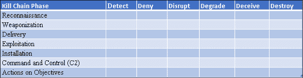
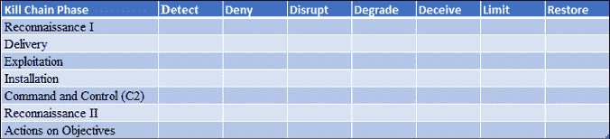
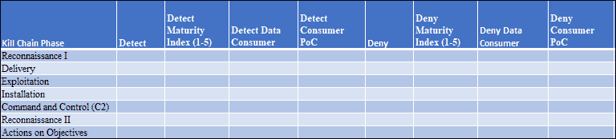
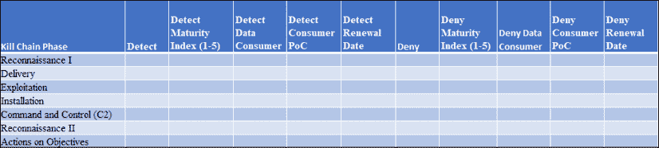
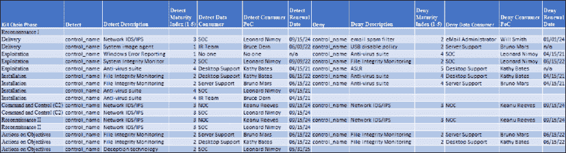
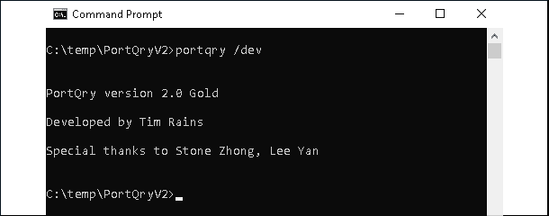

# 六、策略实现

在前一章中，我讨论了许多网络安全策略。在这一章中，我将采用其中的一种策略，并说明如何在真实的 it 环境中实现它。我们的目标是把理论化，让它对你来说更真实一点。我将提供一些我在职业生涯中学到的技巧和诀窍。

在本章中，我们将介绍以下内容:

*   什么是入侵杀伤链？
*   传统压井链模型现代化的一些方法
*   规划和实现此模型时要考虑的因素
*   设计支持该模型的安全控制集

让我们首先决定我们之前讨论的哪些策略将在本章中实现。

# 介绍

以攻击为中心的策略拥有最高的**网络安全基础评分系统** ( **CFSS** )估计的总分。在满分为 100 分的测试中，它获得了 95 分的满分。它赢得了如此高的分数，因为它几乎完全解决了所有网络安全的基本问题，只有社会工程除外，它实际上无法完全缓解。

业内安全专业人士使用的以攻击为中心的框架的两个流行例子包括**入侵杀伤链**(埃里克·m·哈钦斯、迈克尔·j·克洛普特、罗汉·m·阿明博士)和**米特里·ATT&CK**模型(米特里)。

在本章中，我将提供一个例子来说明如何实现以攻击为中心的策略。我将重点介绍的模型是由洛克希德·马丁公司首创的入侵杀伤链框架 first 。我发现安全专业人士要么喜欢要么讨厌这种模式。对这个模型似乎有很多误解；我希望这一章将有助于澄清这些问题。实际上，我有机会做一个大的预算实现，所以我有一些第一手的经验。当我构思这个实现时，我意识到入侵杀伤链可能有几种不同的实现方式。我将描述实现这个框架的一种方法，充分认识到还有其他方法可以实现它，而我的方法可能不是最好的方法。

入侵杀伤链框架基于洛克希德·马丁公司的论文*情报驱动的计算机网络防御，通过对手战役和入侵杀伤链的分析获得信息*。在我看来，这篇论文是所有网络安全专业人士的必读之作。这篇论文中的一些概念现在可能看起来是主流，但当它首次发表时，它引入了改变网络安全行业的概念和想法。有些人可能会认为这种模式已经过了它的全盛时期，现在有更好的方法可用，比如米特 ATT & CK 模式。这并不完全正确，因为 ATT & CK 是入侵杀伤链方法的补充。按照的说法:

> “ATT&CK 和网络杀伤链是互补的。与网络杀伤链相比，ATT 和 CK 站在一个更低的定义层面来描述对手的行为。ATT 和 CK 的战术是无序的，不可能在一次入侵中全部出现，因为敌方的战术目标在整个作战过程中不断变化，而网络杀伤链使用有序的阶段来描述高级别的敌方目标。”
> 
> ——米特里，常开触点

此外，请记住，CFSS 分数表明，入侵杀伤链方法几乎可以完全缓解网络安全常见问题。不管这种方法的拥护者或反对者怎么说，第五章，*网络安全策略*给了你 CFSS 方法来决定它对你自己的潜在功效。当面对关于网络安全策略的不同意见时，我建议使用这个工具。此外，请记住，这种方法可以用在内部 IT 环境、云环境和混合环境中。这种方法的另一个优点是它是技术中立的，这意味着它不局限于特定的技术或供应商。这意味着现在和将来，随着 it 策略的发展，大多数组织都可以使用它。

# 什么是入侵杀伤链？

入侵杀伤链是攻击者可以在攻击中使用的阶段。洛克希德·马丁公司论文中提供的阶段包括:

*   侦察
*   武器化
*   交货
*   探索
*   装置
*   指挥和控制(C2)
*   目标行动

虽然您可能从每个阶段的名称就能知道它们包含的内容，但是让我快速地为您总结一下。注意，这是基于我自己对洛克希德·马丁公司论文的解读，其他解读也是可能的。

攻击者在**侦察**阶段选择他们的目标(Eric M. Hutchins，Michael J. Cloppert，Rohan M. Amin，哲学博士)。当然，许多攻击者选择目标是机会主义的，很多时候是巧合，互联网上出现的所有商品恶意软件就证明了这一点。

其他攻击者可能会花费时间和精力，根据他们的攻击动机来研究他们应该以谁为目标。在这一阶段，他们可能会花时间发现他们的目标使用的 IP 地址空间、他们使用的硬件和软件、他们拥有的系统类型、企业或组织如何运作、他们的供应链中有哪些供应商以及谁在那里工作。他们可以使用一系列工具来进行这项研究，包括进行 DNS 名称查找的技术工具、IP 地址范围扫描、组织发布职位空缺广告的网站，这些网站通常包括基于他们使用的硬件和软件的技术资格，等等。在大规模恶意软件攻击的情况下，攻击者已经决定攻击每个人。但是，他们仍然需要做出决定，而且是在攻击的这个阶段。

一旦攻击者选择了他们的目标，并对他们在互联网上的位置和他们使用的技术有了一些了解，那么他们就知道如何攻击受害者。这个阶段被称为**武器化** (Eric M. Hutchins，Michael J. Cloppert，Rohan M. Amin，博士)。例如，基于他们对目标的研究，他们看到他们使用 Adobe 产品。因此，他们计划首先尝试通过利用 Acrobat Reader 的潜在未修补漏洞来破坏环境。为此，他们构建了一个畸形的。当受害者打开 pdf 文件时，该文件能够利用特定的漏洞(CVE ID)。当然，这种攻击只有在他们使用的漏洞没有在目标环境中打补丁的情况下才会起作用。

现在，攻击者已经决定了他们将如何尝试首先破坏目标的环境，并且他们已经建立了一种武器来完成这一任务。接下来，他们必须决定如何向目标投放武器。在**交付**阶段，他们决定是否要发送畸形的。pdf 文件作为电子邮件附件，将其用作水坑攻击的一部分，将其放在 USB 驱动器上并扔进组织的停车场，等等。

一旦武器被交付给潜在的受害者，攻击者需要一种方法来激活武器。在我们的恶意中。例如，攻击者希望受害者尝试打开格式错误的文件，以便他们的漏洞在受害者的系统上运行。这个阶段被恰当地称为**开发**阶段(埃里克·m·哈钦斯、迈克尔·j·克洛普特、罗汉·m·阿明博士)。如果受害者的系统没有针对漏洞利用的特定漏洞进行修补，那么攻击者的漏洞利用将成功执行。

当攻击者利用漏洞执行时，它可能会将更多的恶意软件下载到受害者的系统中，或者从内部对其进行解压缩。通常，这将使攻击者远程访问受害者的系统。这个阶段叫做**安装**(埃里克·m·哈钦斯，迈克尔·j·克洛普特，罗汉·m·阿明博士)。

一旦攻击者成功地在受害者的系统上安装了他们的工具，他们就可以向他们的工具或系统本身发送命令。攻击者现在可以完全或部分控制系统，他们可以在受害者的系统上运行任意代码。攻击的这个阶段是**指挥控制** ( **C2** )阶段(埃里克·m·哈钦斯、迈克尔·j·克洛普特、罗汉·m·阿明博士)。他们可能会通过尝试危害更多系统来进一步渗透到环境中。

**对目标的行动**是入侵杀伤链的最后一个阶段。既然攻击者控制了一个或多个被入侵的系统，他们就会追求他们的目标。正如我在*第一章*、*中讨论的，成功的网络安全策略的要素*，他们的动机可能包括利润、经济间谍、军事间谍、恶名、报复和许多其他因素。现在，他们能够实现特定的目标来满足他们的动机。他们可能会窃取知识产权，坚持不懈地收集信息，试图通过动能攻击来物理破坏受害者的操作，破坏系统，等等。

请注意，我已经写了攻击者*可以在攻击中使用的攻击阶段。我没有写每个阶段都是*总是*用于攻击。这是这个框架的一些批评者通常忽略的细微差别。他们经常争辩说，攻击者不必使用洛克希德·马丁公司论文中列出的所有七个阶段。他们只使用他们必须使用的相位。因此，模型是有缺陷的。我会承认我从来没有理解过这个论点，但是在讨论这个框架的时候经常听到。这个论点有一些缺陷。记住这个框架的预期目的是有帮助的——让攻击者更难成功。此外，还记得我在*第 3 章*、*威胁格局的演变——恶意软件*中给你的关于全知的提示吗？这个论点依赖于全知。我们永远不会知道所有的攻击者都做了什么。这就引出了这个论点的第二个缺陷。因为我们不知道攻击者现在或将来会做什么，所以我们必须准备好保护、检测和响应他们选择做的任何事情。也就是说，我们需要基于这样的现实，攻击者*可以*使用*这些阶段中的任何一个*。*

例如，一些环境已经被破坏，使得现在和将来潜在的攻击者更容易渗透受害者的环境，而无需经过前三或四个阶段。这并不意味着攻击者在之前的攻击中没有成功通过这些阶段，也不意味着攻击者在未来不会使用它们。我们不知道未来会怎样，我们也无法控制攻击者。我们不是全知全能的。我们知道攻击者总是会使用这些阶段中的至少一个——他们必须这样做。随后，无论攻击者使用哪个阶段，防御者都必须做好准备。

了解攻击者的入侵杀伤链看起来像什么，可以帮助防御方使攻击者更难成功。通过显著增加攻击者成功所需的努力，我们降低了他们的投资回报，并可能降低他们的决心。为了做到这一点，入侵杀伤链论文的作者建议防御者使用**行动过程矩阵** (Eric M. Hutchins，Michael J. Cloppert，Rohan M. Amin，博士)。这个矩阵允许防御者绘制出他们计划如何在入侵杀伤链的七个阶段中的每一个阶段检测、否认、扰乱、降级、欺骗和摧毁攻击者的努力。在*表 6.1* 中举例说明了这一点:

<figure class="mediaobject"></figure>

表 6.1:行动方案矩阵(Eric M. Hutchins、Michael J. Cloppert、Rohan M. Amin 博士)

通过将控制分层到这个矩阵中，目标是使攻击者更难或不可能通过他们的入侵杀伤链。矩阵中的每个单元可以包括多个互补能力。在入侵杀伤链中尽早阻止攻击者可以减少潜在的损害以及相关的恢复时间和成本。攻击者在击败防火墙或一组控制措施后并不成功，他们必须在攻击的每一步都克服行动过程矩阵中的多层防御。

# 使杀伤链现代化

在实现这个框架之前需要考虑的一个问题是，防御者是应该使用原来的入侵杀伤链框架，还是更新它。有几种方法可以使这个框架现代化。在这一部分，我会给你一些如何做到这一点的想法。然而，不要害怕接受迭代改进的概念，这是基于您的组织对这个框架或其他框架的经验。

## 绘制网络安全常见疑点地图

在第一章、*成功网络安全策略的要素*中，我介绍了网络安全的常见嫌疑人，并在本书中提到了他们。我希望我已经传授了减轻组织最初被损害的五种方式的重要性。入侵杀伤链框架可以围绕网络安全常见的可疑因素进行修改或重组，以确保它们得到缓解，并更容易识别组织安全态势中的差距。这可以通过几种不同的方式来实现。首先，它们可以集成到传统的杀伤链框架中。也就是说，用于缓解网络安全常见问题的控制措施像所有其他控制措施一样分布在行动过程矩阵中。这种方法的挑战在于，它会使识别那些特定领域中的过度投资、投资不足和差距变得困难，特别是如果您的矩阵很大的话。为了弥补这一点，可以在矩阵中添加一列，在该列中，可以跟踪网络安全通常怀疑的每种控制所减轻的程度。一些行在此列中没有条目，因为许多控制将是高级网络安全功能，不一定集中于网络安全常见的可疑情况。

另一种更容易确保完全缓解网络安全常见问题的方法是使用两个单独的列表。在一个列表中列出缓解网络安全常见问题的控制措施，在一个单独的行动方案矩阵中列出所有其他措施。通过这种方式，您可以全面、清晰地了解为缓解网络安全常见问题而实现的控制措施，以及所有其他控制措施。这可能意味着这些列表中有一些重复的控件，使得跟踪随时间的变化变得更加复杂。

我更喜欢第二种方法，即使用两个单独的列表。我喜欢清晰可见的控制，以减轻网络安全通常的嫌疑。这种方法使得跟踪代表策略基础的控制变得更加容易。但是，您可以随意使用这两种方法中的任何一种，或者最适合您的组织的另一种方法。这是我将在本章提供的例子中使用的方法。我已经在其他章节中广泛讨论了网络安全的常见疑点和网络安全的基础知识。我在这里提供的例子将集中在该策略的*高级网络安全能力*部分。

## 更新矩阵

此方法的另一个值得考虑的修改是是否更新行动过程矩阵中的阶段和行动。例如，入侵杀伤链的侦察阶段可以分为两个独立的阶段。这种区分认识到，在入侵尝试中，攻击者通常会在两个不同的时间执行侦察。在攻击之前，攻击者可能会花时间选择他们的目标，并研究他们可能受到攻击的方式。在网络安全的一个通常的嫌疑人被用来初步危及受害者之后，攻击者可能会再次执行一些侦察，以绘制出受害者的网络以及**高价值资产** ( **HVAs** )在哪里。将这两个阶段分开会有所帮助的原因是，攻击者使用的工具、技术、战术和程序在最初的攻击前后可能会有所不同。通过用**侦察 I** 和**侦察 II** 阶段替换**侦察**阶段来更新矩阵，将使安全团队能够映射不同的控制以在这些阶段中的每个阶段阻止攻击者。请记住，在这两种情况下，攻击者可能会使用非侵入式侦察策略，或者选择使用侵入式侦察策略。

阶段的另一个潜在更新是取消武器化阶段。这似乎是对原始框架的重大改变，但以我的经验来看，它并没有改变防御者通常使用的控制手段。在攻击的这一阶段，已经决定如何攻击受害者的攻击者计划重新使用旧武器或制造和/或购买新武器用于攻击。

这种活动大多发生在维权者的视野之外。随后，攻击者在此阶段的活动很少会受到防御者可用的控制措施的影响。如果攻击者对他们获得武器的来源漫不经心，威胁情报供应商或执法机构可能会得到他们活动的通风报信，也许还有他们的意图。如果该武器是零日漏洞，目标受害者可以部署变通办法来缓解，这可能是有帮助的，但坦率地说，专注于其他攻击阶段可能会为防御者带来更高的投资回报，因为他们可能有更多的可见性和控制力。对于大多数组织来说，武器化阶段太不透明了，无法真正影响。换句话说，CISOs 通常在交付阶段之前没有非常有效的保护和检测控制；对具有明确、可衡量价值的缓解措施进行优先投资非常重要。

行动方案矩阵可以更新，以包括一些不同的行动。例如，**摧毁**可以是被丢弃，以利于一些更现实的动作，比如**限制**和**恢复**。使用限制作为一个动作表明防御者想让攻击者在攻击过程中很难或不可能自由移动。例如，限制攻击者可用的交付选项，限制攻击者可以控制的基础设施的范围，这两者都使攻击者更难成功。如果模型中分层的所有其他缓解措施未能按预期执行，使用恢复操作有助于组织规划其恢复。对于限制和恢复，并不是矩阵中的每个单元都必须有控件。例如，在侦察 I 阶段，可能没有有助于恢复的控制，因为环境尚未受到攻击。矩阵中可能会有几个单元格没有条目，这是意料之中的。*表 6.2* 中举例说明了更新后的行动方案矩阵:

<figure class="mediaobject"></figure>

表 6.2:更新的行动方案矩阵示例(Eric M. Hutchins、Michael J. Cloppert、Rohan M. Amin 博士)

当然，这些更新是完全可选的。对于许多组织来说，实现原始入侵杀伤链模型是提高其安全状况的有效方法。我建议 CISOs 们在认真实现这种模式之前，花些时间思考一下对原始模式的任何修改是否有利。然后，他们应该在继续使用该模型之前更新行动方案矩阵，因为这将节省时间、费用和潜在的令人沮丧的返工。

# 入门指南

现有的 IT 环境，尤其是那些已经由 CISO 管理的环境，可能已经部署了一些网络安全控制措施。如果以攻击为中心的策略和入侵杀伤链方法对一个组织来说是新的，那么现有控制的部署方式很可能不一定符合行动方案矩阵。将目前部署的网络安全控制措施映射到行动方案矩阵，将有助于确定目前部署的网络安全能力与全面实现的行动方案矩阵之间存在的潜在差距。它还可以帮助识别过度投资和投资不足的领域。例如，在将他们当前的网络安全能力映射到这个矩阵后，安全团队意识到他们已经在否认攻击者的武器交付的能力上投入了大量资金，但是没有投入任何有助于检测交付企图的东西；事实上，他们现在意识到他们在整个捕杀链的探测能力上投资不足。这种映射练习有助于揭示关于组织安全能力的乐观假设。一些安全专业人士称这种类型的练习为“制图 T2”。

这个练习可能很有启发性，但也很难执行，尤其是在大型复杂环境中。我所建议的大多数组织都没有一个完整的、最新的产品、服务和配置列表，这些列表在像这样的练习中是有用的。即使拥有变更控制管理系统的组织也经常发现他们的数据是不完整的、过时的和不准确的。我看到的行业估计表明，平均内部 IT 环境有 20%的未记录资产和服务，在某些行业，如医疗保健行业，估计值甚至更高。

一些组织试图使用采购工件来确定他们的 IT 部门购买了什么，但是这通常与实际部署的不同。面对获得其环境中运行的网络安全功能的准确、最新清单的挑战，大多数组织从他们拥有的数据开始，并手动验证已经实现的内容。这不一定是一件坏事，因为它可以提供一个准确和最新的视图，而且还包括无法从库存数据库中呈现的定性洞察。

## 当前网络安全能力的成熟度

我有机会在一些大型、复杂的 IT 环境中做这个映射练习。让我分享一些我学到的东西，如果你面临同样的挑战，可以节省你一些时间。当您将当前的网络安全能力映射到行动方案矩阵时，需要注意的一个因素是每个控制或能力的实现成熟度。也就是说，软件清单上的项目可能不会提供任何关于控制是完全实现还是部分实现的线索。了解每项控制措施实现的成熟度是真正了解哪里存在差距以及哪里出现投资不足和过度投资的关键。

例如，一个组织从顶级行业供应商那里采购了一套网络安全功能。该套件能够为台式机和服务器提供多种重要功能，包括文件完整性监控、防恶意软件扫描和数据丢失防护。当将能力映射到行动过程矩阵时，很容易看到套件*可以*提供的能力，并且将它们全部包含在组织的当前能力清单中。然而，问题是，实际上*已经部署了*多少套件的功能？一个相关的问题是，谁负责操作和维护这些控制？在大型复杂的 IT 环境中，这些问题可能很难回答。然而，如果不揭示当前实现成熟度的真相，映射的可信度和策略的潜在功效就会被破坏。还记得我在本书中使用的潜艇比喻吗？如果你真的不知道所有的关键系统是否都完全运行，你真的会热衷于在潜艇中出航吗？可能不会。

许多组织渴望拥有世界级的网络安全团队。为了支持这一愿望，他们中的一些人在评估和采购网络安全能力时使用的原则是，他们只想要同类最佳的技术。也就是说，他们只想要最好的产品，不会满足于低于这个价格。对于大多数组织来说，这是非常雄心勃勃的，因为吸引和留住网络安全人才是整个行业面临的挑战。采用“同类最佳”的采购理念使得这一严峻的人才挑战变得更加困难。这是因为它可能会减少对这些昂贵且相对罕见的“同类最佳”实现有经验的人数。这种方法对于现金充裕的组织来说也是危险的，这些组织认为他们可以简单地购买有效的网络安全，而不是发展一种人人参与的文化。我见过的大多数持这种理念的组织最终都买了一辆法拉利并使用了它的烟灰缸。他们根本没有必要的资金来设计、部署、操作和维护同类最佳产品，因此他们只使用了可用功能的一小部分。在某些情况下，发现自己处于这种场景中的组织通过购买相同或相似的功能在某个领域过度投资，但是他们通过购买他们可以成功部署和操作的产品来做到这一点。在发现自己处于这种情况的组织中执行这种映射练习可能特别困难。这是因为它揭示了关于过于乐观的雄心和假设的严酷事实，以及边际回报的网络安全投资。然而，对于有勇气照镜子并愿意对其当前的安全状况做出积极的、渐进的改变的组织来说，这一过程可能是不可避免的。如果组织实际上可以实现这些雄心壮志，那么雄心勃勃、志存高远并没有错。

量化一个网络安全套件或一组功能有多少已经成功部署是一项挑战。我尝试过的一种方法有不同的结果，那就是将功能集的功能分解成不同的类别，并使用成熟度指数来量化部署的成熟度，等级在 1 到 5 之间，其中 5 是最成熟的。这有助于确定某个特定领域是否需要更多投资。在大型、复杂的环境中，这说起来容易做起来难，有些人可能会怀疑是否值得花时间和精力去完成它。然而，安全团队对其事务的当前状态了解得越详细，他们就越有信心推进这一策略。

## 谁消费数据？

在将 IT 环境的当前安全功能映射到行动方案矩阵时，我发现有一个原则很有帮助，即每个控制集生成的数据都需要有人或某物来使用。例如，执行此映射的安全团队发现网络管理团队实现了潜在的强大 IDS/IPS 功能，这些功能包含在他们上一财年购买的网络设备中。尽管启用了这些功能，但他们发现网络管理团队中没有人主动监控或审查来自该系统的警报，并且该组织的**安全运营中心** ( **SOC** )甚至不知道它们的存在。这些功能的最终结果相当于根本没有它们，因为没有人消费它们生成的数据。人类不一定要消耗这些数据；编排和自动化系统也可以基于这些数据采取行动。然而，如果无论是人还是系统都不使用这些数据，那么安全团队就不能真正地将这些功能包括在他们当前实现的控制措施的映射中，除非这些缺陷得到解决。

当安全团队执行这种映射时，对于他们识别的每个控件，他们还应该记录谁或什么使用了它生成的数据。记录作为使用这些数据的联系人的姓名将会给安全团队带来好处。联系人可能是 SOC 或**网络运行中心** ( **NOC** )的经理、事件响应团队成员或供应商。这些信息对于建立对本组织真正网络安全能力的信心非常有价值。然而，它对于衡量你的策略的有效性也是非常有价值的，我将在第 7 章、*衡量表现和有效性*中详细讨论:

<figure class="mediaobject"></figure>

表 6.3:部分行动方案矩阵示例(Eric M. Hutchins、Michael J. Cloppert、Rohan M. Amin 博士)，包括成熟度指数、谁或什么将使用来自每个控制的数据，以及联系点(PoC)

如*表 6.3* 所示，随着行动过程矩阵的更新，它会快速扩展。我过去曾用电子表格做过这种映射。我承认这不是执行这种映射的最优雅的方式。我做的一个映射是一个电子表格中超过 120 页的控件；浏览电子表格并不有趣。此外，使用电子表格并不是最具可扩展性的工具，并且报告功能有限。如果你有更好的工具，就用它吧！如果您没有更好的工具，请放心，映射练习可以使用电子表格或文档来完成。然而，环境越大越复杂，使用这些工具就变得越困难。

## 网络安全许可证续订

从供应商处购买的大多数软件和硬件都有许可条款，其中包括许可证到期的日期。当许可证到期时，必须进行续订，否则产品必须停止使用。要考虑的行动方案矩阵的另一个更新非常有用，那就是添加一个列来跟踪列出的每项功能的合同续订日期。如果您要花时间清点用于网络安全的软件和硬件，也要记录每个项目的到期/续订日期。这将使您了解列表中的每个项目在许可证到期并需要续订之前的时间。将此信息嵌入到控制映射本身将使您了解每项功能的潜在剩余寿命，并有助于提醒安全团队何时开始重新评估每项产品的有效性，以及是否更新或替换现有功能。

另一个有助于跟踪的类似日期是产品的寿命终止/支持日期；通常，在此日期之后，制造商会弃用产品，不再为其提供安全更新。随着时间的推移，这些产品增加了 IT 环境中的攻击面，因为它们中的漏洞不断被公开披露，甚至在它们的支持日期结束后也是如此。跟踪这些日期可以帮助我们避免意外。作为修改后的行动方案矩阵的一部分，跟踪这些日期是可选的。

CISOs 和安全团队不应依赖他们的采购部门为他们标记续约日期；它应该反过来工作。与我交谈过的许多 CISOs 都希望了解这个“展望列表”，它如何影响他们的预算，以及需要做出决策的关键里程碑日期。什么样的 CISO 人不希望得到一些提前通知，他们的网络 id/IPS 将被关闭，因为他们的许可证即将失效？这些决策的准备时间越长，安全团队在最后一刻遇到的意外就越少。此外，当我在下一章讨论衡量这种策略的有效性时，您将会看到让这些信息唾手可得会很有帮助。

当然，对矩阵的更新是可选的。续期日期可在单独的文件或数据库中跟踪。然而，能够在您的地图中交叉引用更新日期和网络安全能力应该是 CISOs 可以轻松做到的事情。他们需要有足够的准备时间来决定是继续生产现有的产品和服务，还是进行替换:

<figure class="mediaobject"></figure>

表 6.4:部分行动方案矩阵的示例(Eric M. Hutchins、Michael J. Cloppert、Rohan M. Amin 博士)，包括成熟度指数、谁或什么将使用数据、联系点(PoC)以及每个控制的更新日期

# 实现这一策略

在规划过程结束时，CISOs 和安全团队应该对已部署的网络安全功能和控制措施以及组织如何使用这些功能和控制措施中的数据有一个更好的了解。这是实现入侵杀伤链框架的一个很好的起点。但是，不要低估拥有大型复杂 it 环境的组织实现这一目标的挑战性。

对于一些组织来说，将映射工作划分为更小的、更容易实现的项目，专注于其环境的一部分，比尝试映射其整个环境更容易。在没有准确的当前规划的情况下推进这一策略很容易导致过度投资、投资不足以及安全能力方面的差距。虽然这些问题可以随着时间的推移得到纠正，但它可能会使成本更高、更耗时。

<figure class="mediaobject"></figure>

表 6.5:更新的行动方案矩阵(Eric M. Hutchins、Michael J. Cloppert、Rohan M. Amin 博士)的一部分示例，其中包含组织当前网络安全能力的映射

我在表 6.5 中提供了一个例子，展示了一组更新的阶段中的前两个动作。一个大型组织的实际映射可能要大得多，但是我想让您对映射有一个概念。在实际映射中， **control_name** 将是针对攻击的每个阶段检测、拒绝、破坏等的特定产品、服务、特性或功能的名称。**描述**字段是对每个控件功能的简短描述。我建议在这个领域提供比我这里更多的细节，这样每个控件的功能和作用范围就很清楚了。

每个控件都有一个**成熟度指数**，范围从 1 到 5，5 表示实现尽可能完整和有效。一到二的成熟度指数表明，虽然产品或功能有很多功能，但相对来说，只有很少的功能被部署或运行。该指数将有助于我们了解每项控制措施目前的有效性及其潜力。这有助于避免假设控制以最高效率运行的陷阱，而实际上它并没有完全部署，或者没有被积极地运行或监控。对该字段或基于该字段的整个行项目进行颜色编码，可以更容易地理解每个控制的成熟度。

每个动作的**数据消费者**是组织中使用来自控制的数据来检测、拒绝、破坏、降级等的特定组或部门。**消费者概念验证**列包含消费每个控制数据的小组或部门中每个联系人的姓名。这使得定期验证来自每个控件的数据是否仍在按计划使用变得更加容易。毕竟，如果没有人真正关注它们，部署缓解措施就没有意义。花在这些控制上的时间、精力和预算可能会在组织的其他地方得到更有效的利用。

最后，每个操作的**更新日期**列提供了每个控制的潜在到期日期的可见性。这样做有助于最大限度地减少每个控制操作状态中潜在的意外失误。这有助于避免您认为完全有效的缓解措施实际上由于许可失效或产品停止支持而被部分或完全禁用的情况；这些意外会让 CISOs 和安全团队焦头烂额。

## 合理化矩阵——差距、投资不足和过度投资

如果没有当前网络安全能力与行动方案矩阵的对应关系，很容易在网络安全产品上过度投资或投资不足，并在保护、检测和响应能力上存在差距。我所说的过度投资、投资不足和缺口到底是什么意思？将现有的网络安全能力和控制措施映射到入侵杀伤链框架可能需要大量的工作。然而，对于一些首席信息安全官来说，这可能会导致顿悟。如果执行正确，这种映射可以揭示出组织根本没有投资的关键领域——差距。例如在*表 6.5* 中，**侦察 I** 行没有任何条目；这可以清楚地表明组织的控制集合中存在缺口，这可能会使攻击者的入侵杀伤链的这一阶段变得更容易。组织在这方面投资失败并不罕见。像这样的差距是一个明显的改进机会。

在行动方案矩阵中，某个领域的投资不足可能更加微妙。投资不足可能表现为矩阵中某项活动或阶段的相对较少的条目。这就是成熟度指数和描述可以帮助的地方。

矩阵中成熟度指数为 5 的单个条目可能就是该操作所需的全部投资。成熟度指数和描述的结合应该有助于做出这个决定。然而，条目的描述应该足够详细，以便我们理解该功能的功能和范围是否真的会打破攻击者的杀伤链，或者是否在矩阵的该区域需要更多的投资。可能会部署正确的控件；但如果它只是部分实现或部分运作，它可能不足以打破杀伤链或在所有情况下都有效。进一步投资于成熟的控制可能是这个问题的解决方案。另一个可能的解决方案是投资于不同的控制，以补充当前的缓解措施。从这个角度来看，行动方案矩阵成为在事故期间提供帮助的重要文档，并且是与非技术主管就预算和资源进行协商的中心。

在某些领域过度投资是一个常见的问题，我见过公共和私营部门组织都深受其害。它可以随着时间的推移缓慢发生，也可以在数据泄露后迅速发生。在行动方案矩阵中，它可以表现为一个或两个领域中执行相同或相似功能的许多条目。例如，我见过一些组织购买了多种身份和访问管理产品，但没有一个完全部署。这可能是由一系列原因造成的。例如，他们可能对自己吸引和留住部署这些产品所需的人才的能力不切实际。另一个例子是，在入侵成功后，受害组织通常会决定是时候对网络安全进行大量投资了。带着新发现的紧迫感和旺盛的精力，他们不会花时间在疯狂购物之前获得当前功能及其成熟度的清单。合并和收购也会使组织在矩阵的某些领域过度投资。最后，简单来说，有些销售人员真的很擅长他们的工作。我看到在整个行业和地理区域，每个人都在相同的 1 或 2 个财年内采购了相同的 SIEM 或端点解决方案。这没有什么错，但他们不太可能都是从相同的环境、可比的网络安全人才以及当前产品的相同许可续订日期开始的。当一个优秀的销售人员非常成功时，这有时会导致在某些领域的过度投资。

## 规划您的实现

确定差距、投资不足的领域和过度投资的领域非常重要，因为这些将为实现计划提供信息。希望组织已经投资的许多领域不需要改变。这将使他们能够专注于解决其当前安全态势中的差距和不足。当他们有了当前的规划并确定了差距、投资不足的领域和过度投资的领域时，他们就可以开始规划其余的实现了。

安全团队应该首先处理行动方案矩阵的哪个部分？对于一些组织来说，专注于解决现有差距将提供最高的潜在投资回报率。然而，有一些因素需要考虑，包括预算和网络安全人才的可用性。首要目标是打破攻击者的杀戮链。但是，请记住，在杀伤链中尽可能早地这样做是有效率的。在利用和安装之前阻止攻击有助于最大限度地降低成本和损失。但是，正如我在讨论保护和恢复策略时所讨论的，假设安全团队能够在 100%的时间内做到这一点是过于乐观的，很可能会让组织面临失败。随后，我与之讨论过这个问题的一些首席信息官决定在矩阵的每一部分都投资一点。然而，充足的预算和资源可用性可能是这种方法的限制因素。

我接触过的大多数首席信息安全官预算有限。对于那些没有这样做的人，他们通常仍然受到快速设计、部署和操作新功能的能力的限制；网络安全人才短缺是全行业性的。矩阵中每个项目的续订日期有助于为用于解决差距和投资问题的时间表提供信息。选择不为过度投资领域的低效产品续订许可证可能有助于释放一些预算，这些预算可用于解决缺口和投资不足的领域。并非每个组织都有过度投资，许多组织在整个矩阵中都长期投资不足。对于这类组织来说，尽可能多地利用操作系统和集成开发环境中的“免费”控件可能会有所帮助。

例如，**地址空间布局随机化** ( **ASLR** )和**数据执行阻止** ( **DEP** )有助于使攻击的利用阶段更难完成且不一致。这些特性已经内置到当今主流厂商的大多数现代操作系统中。然而，并不是所有的应用程序都利用了它们。深思熟虑地使用这种免费或低成本的控件可以帮助预算有限的组织实现这一策略。

我见过的 CISOs 计划实现的另一种方式是使用红队和蓝队练习和渗透测试的结果。渗透测试通常侧重于确认已经实现的安全控制的有效性，而红队的练习侧重于超越和智胜防御者。这是测试作为您当前实现的一部分的人员、流程和技术的有效性的直接方法。与确定差距同样重要的是，这些练习可以确定未按预期执行的控制和缓解措施。这些练习还有助于在您的规划中提供成熟度指数，并以一种实用的、较少理论性的方式帮助您确定实现计划中项目的优先级。

最后，我看到 CISOs 决定实现像这样的框架的另一种方式是首先投资于高 ROI 领域。他们通过确定从哪里获得最大的投资回报来做到这一点。这是通过在矩阵的多个部分识别提供缓解的控制来完成的。例如，如果相同的控制可能有助于打破攻击者在交付、利用、指挥和控制阶段的杀伤链，他们会优先考虑那个控制，而不是可能只打破攻击的一个阶段的控制(Eric M. Hutchins，Michael J. Cloppert，Rohan M. Amin，博士)。换句话说，他们寻找可以用一个价格使用两个或三个缓解措施的领域。他们的矩阵越详细，他们能够识别的机会就越多。

我将在第 7 章、*评估表现和有效性*的*部分重新讨论我在本节中讨论的许多因素。*

## 设计控制集

有了当前的控制集映射、已确定的差距、投资不足的区域、过度投资的区域，以及将解决这些区域的计划，安全团队可以开始设计控制集。过程的这一部分可能很有挑战性，但也很有趣。

毕竟，设计控件使攻击者尽可能难以得逞是一件有趣的事情！对一些人来说，花钱也是一种乐趣，在这个练习中有机会为这样做打下基础。

可能的控制集的组合和排列比我在这本书里所能涵盖的还要多。这一部分旨在为您提供我概述的更新的行动方案矩阵的每一部分的更多细节，并引发一些关于安全团队可以为其组织设计控制集的方式的思考。这不是一个应该遵循的蓝图；真的只是一个高层次的例子。我没有收到我在本节中提到的任何产品或公司的任何促销付款，我不认可它们，也不对它们或它们的产品做出任何声明或担保。请使用符合您要求的任何公司、产品、服务和功能。如果你想要专业的建议，我建议你去消费行业分析公司的报告和服务，比如 Forrester 和 Gartner 等。这就是 CISO 议会、专业协会和封闭社交网络非常有用的地方。直接从其他 CISOs 那里获得策略、产品和服务的第一手资料会非常有帮助。分析公司不能过于公开地批评一家公司或其产品，但我没见过多少首席信息安全官不愿意在私下私下交谈时坦诚相待。

### 攻击阶段——侦察 I

在攻击的这一阶段，攻击者选择他们的目标，进行研究，绘制和探测他们的目标的在线存在，并对他们的目标受害者的供应链中的组织做同样的事情。攻击者正在寻找关于什么、为什么、何时和如何的基本问题的答案。他们的研究不仅限于 IP 地址和开放的 TCP/UDP 端口；人员、流程和技术都是他们攻击的潜在棋子。

在攻击的这个阶段，防御者面临的挑战是，这些类型的侦察活动会混入合法的网络流量、电子邮件、电话、员工等等。当攻击者的侦察活动不异常时，很难识别它们。尽管如此，在这个阶段投资网络安全能力还是值得的，因为正如我前面提到的，尽早打破攻击者的杀伤链通常会带来最高的投资回报。

将侦察活动分为被动和主动两类(H. P. Sanghvi，2013)有助于安全团队决定在哪些领域进行投资是可行的。例如，试图通过阅读一个组织的招聘网站来识别进行被动研究的攻击者，仅仅是为了识别该组织使用的硬件和软件的类型，这可能是非常昂贵的。但是，检测和阻止主动扫描公司防火墙漏洞的系统的 IP 地址可能是可行的。许多被动侦察活动可以在防御者的视线之外进行，因此不会生成防御者可以使用的日志条目或警报。然而，许多威胁情报供应商向他们的客户提供服务，这些服务搜集社交媒体网站和非法市场，都是为了在黑暗的网络中寻找关于他们的 IP 地址范围、域、已知漏洞、待售凭证和即将发生的攻击的聊天记录。主动侦察活动倾向于直接与受害者及其供应链互动，这有可能让防御者更直接地看到他们。

<figure class="mediaobject"></figure>

图 6.1:侦察活动类别

在攻击的这个阶段，一些网络安全能力可以有所帮助包括:

*   威胁情报服务可以帮助检测被动侦察活动，潜在地通知防御者他们防御态势中的已知漏洞和即将到来的攻击。理想情况下，这可以给他们一些时间来解决这些已知的漏洞，并更好地为攻击做准备。目前提供此类服务的威胁情报供应商包括:
    *   数字阴影
    *   火眼儿
    *   [姓氏]克罗尔
    *   MarkMonitor
    *   校对点
    *   许多许多其他公司，包括较小的精品公司
*   **Web 应用防火墙** ( **WAF** )可以检测应用层攻击，比如 SQL 注入、跨站脚本等等。WAF 可以帮助检测、拒绝、破坏和降低应用层攻击。WAFs 的一些示例包括:
    *   亚马逊网络服务
    *   梭鱼
    *   云 flare
    *   F5
    *   Imperva
    *   微软
    *   神谕
    *   很多很多其他人
*   至少有几种不同风格的防火墙。防火墙可以检测、拒绝、破坏和降低一些主动网络侦察活动。供应商提供防火墙产品的例子不胜枚举，但其中一些例子包括:
    *   梭鱼
    *   加拿大白鲑
    *   检查点软件技术
    *   瞻博网络公司
    *   帕洛阿尔托网络公司
    *   音墙网络
    *   很多很多其他人
*   欺骗技术可以用来欺骗攻击者进行主动侦察。欺骗技术系统将系统呈现为其供应链中预期目标或供应商的合法基础设施。攻击者花费时间和资源在这些系统上执行侦察，而不是生产基础设施和系统。欺骗技术供应商的例子包括:
    *   主动网络
    *   虚幻网络
    *   包装工
    *   TrapX 安全性
    *   很多很多其他人
*   自动化可以与威胁情报和检测功能相结合，使能够对侦察活动做出动态响应。例如，如果 WAF 或防火墙检测到来自已知恶意 IP 地址的探测，则可以触发自动化来动态调整一段时间内被阻止的 IP 地址列表，或者自动化可以允许来自恶意 IP 地址的 ICMP 网络流量，阻止流向端口 80、443 和其他开放端口的 TCP 流量，从而尝试降低侦测能力并浪费攻击者的时间。这将允许攻击者看到系统在线，但无法连接到其上运行的服务。这种类型的自动化在传统的内部环境中可能更难实现，但它默认情况下被嵌入到云中，并且相对容易配置。我将在*第 8 章*、*云——安全和合规性的现代方法*中更详细地讨论云功能。

这是基于我在本节中讨论的能力的侦察 I 阶段的行动方案矩阵的样子。当然，这只是触及了这个阶段可能发生的事情的表面，但是它为您提供了一些关于攻击的第一阶段的一些操作的想法。您会注意到，我没有为恢复操作添加任何条目。

由于侦察通常不会造成损害或危害，所以在攻击的这个阶段没有什么可以恢复的。

正如我提到的，使用 Excel 创建一个行动过程矩阵并不理想，但它是可行的。然而，这个练习创建的表格太大了，不能打印在书里，而且仍然可读。随后，我将为示例矩阵的每个部分提供控件列表。我没有包括对阶段的控制，例如恢复，除非其中有项目。为了进一步简化，我不包括我前面讨论的任何修改，因为它们对于每个组织都是独特的。这个列表并不是详尽无遗的；它提供了一些基本控件的示例，您可以将其作为开发自己的行动方案矩阵的起点。有些项目在行动方案矩阵中重复多次，因为这些控制在矩阵中可以扮演多重角色。

以下控件是示例控件，可用于在攻击的**侦察 I** 阶段**检测**攻击者的活动:

*   **欺骗技术**:可以帮助检测攻击者的侦察活动。
*   **Web 应用防火墙(WAF)** :可以检测应用层攻击，如 SQL 注入、跨站脚本等。
*   **防火墙**:可以检测网络探测器和一些侦察活动。
*   **威胁情报侦察服务**:可以帮助检测被动侦察活动，让防御方注意到他们防御态势中的已知漏洞和即将到来的攻击。

以下控件是示例控件，可用于在攻击的**侦察 I** 阶段**拒绝**攻击者的活动:

*   **自动化**:当侦测到侦测活动时，使用自动化来调整防火墙规则和其他控制，以拒绝、破坏、降级或限制其活动。
*   **Web 应用防火墙(WAF)** :可以拦截 SQL 注入、跨站脚本等应用层攻击。
*   **防火墙**:可以阻止网络探测和一些侦察活动。

以下控件是示例控件，可用于在攻击的**侦察 I** 阶段**扰乱**攻击者的活动:

*   **自动化**:当侦测到侦测活动时，使用自动化来调整防火墙规则和其他控制，以拒绝、破坏、降级或限制其活动。
*   **Web 应用防火墙(WAF)** :可以阻断应用层攻击，如 SQL 注入、跨站点脚本等。
*   防火墙:可以中断网络探测和一些侦察活动。

以下控件是示例控件，可以在攻击的**侦察 I** 阶段使用来**降级**攻击者活动:

*   **自动化**:当侦测到侦测活动时，使用自动化来调整防火墙规则和其他控制，以拒绝、破坏、降级或限制其活动。
*   **Web 应用防火墙(WAF)** :可以降低应用层攻击，如 SQL 注入、跨站点脚本等。
*   **防火墙**:可以降低网络探测器和一些侦察活动的性能。

以下控件是示例控件，可用于在攻击的**侦察 I** 阶段**欺骗**攻击者:

*   欺骗技术:欺骗技术可以欺骗攻击者花时间侦察假资产而不是真资产。

以下控制示例可用于在攻击的**侦察 I** 阶段**限制**攻击者的活动:

*   **自动化**:当侦测到侦察活动时，使用自动化来调整防火墙规则和其他控制，以拒绝、破坏、降级或限制其活动。

为侦察 I 阶段的投资决策提供信息的最有效方法之一是让安全团队在自己的网络上执行侦察。

### 攻击阶段–交付

在攻击的这一点上，攻击者已经决定以哪个组织为目标，做了一些研究来帮助他们执行攻击，并可能做了一些主动侦察扫描，并探测了预期受害者的互联网存在。根据这些信息，他们也经历了一些武器化阶段或过程，他们采购和/或制造武器，这将帮助他们最初危及他们的目标，并使他们能够事后活动。这一武器化过程通常发生在防御者的视线之外。然而，正如我在侦察 I 阶段提到的，一些威胁情报供应商的服务有时可以洞察这些活动。

攻击者的武器可能包括人员、流程和技术。有了这些，攻击者必须把这些武器送到他们的目标；这是交付阶段的目标。攻击者有一系列选择来将他们的武器交付给他们的目标和供应链中的供应商。传送机制的一些示例包括恶意电子邮件附件、电子邮件中的恶意 URL、吸引受害者注意力的恶意网站、恶意内部人员、蠕虫等自传播恶意软件、将恶意 USB 驱动器留在受害者家中等等。

在攻击的这一阶段，一些有帮助的投资包括:

*   **Education/training**: Recall the research I provided in *Chapter 3*, *The Evolution of the Threat Landscape – Malware*. It's clear that different types of malware go in and out of vogue with attackers, but their mainstay approach has always been social engineering. Therefore, educating information workers and training them to spot common social engineering attacks can be very helpful in detecting the delivery of the attacker's weapons. The challenge is that social engineering training isn't a one-time activity, it's an ongoing investment. When training stops, current employees start to forget these lessons and new employees don't get trained. Note that the training itself needs to be kept up to date in order to continue being effective.

    一些组织根本没有支持社会工程培训的文化，包括实际的网络钓鱼活动和其他针对员工的社会工程攻击。然而，不进行这种培训的组织错过了让他们的员工从经验和失败中学习的机会。每个人都试图帮助 CISO 的文化比安全团队总是对未经培训的信息工作者每天做出的不知情、缺乏信任的决定做出反应的文化更有力量。

*   **微软 Office 365 高级威胁防护(APT)** :电子邮件是社交工程攻击的主要载体。在任何时期，基于电子邮件的攻击的量都相对巨大。为信息工作者提供没有有效保护的电子邮件收件箱会让组织走向失败。微软 Office 365 APT 等基于云的服务通过阻止任何用户面临的威胁来帮助所有用户接种疫苗。如此大规模的服务可以轻松识别僵尸网络和攻击者用于垃圾邮件、网络钓鱼和其他基于电子邮件的攻击的 IP 地址，并为其所有用户阻止这些地址。
*   **欺骗技术**:我是欺骗技术的超级粉丝。这项技术超越了蜜罐和蜜网，提供了成熟的环境来吸引攻击者，发出他们存在的信号，并浪费他们的时间，降低他们的投资回报。使用欺骗技术向攻击者展示易受攻击的系统、关键基础设施系统或存储或访问潜在有价值数据的系统，可能会转移他们对合法系统的注意力。
*   **反恶意软件套件**:反恶意软件软件可以检测并阻止不同类型武器的交付企图。正如我在*第 3 章*、*威胁格局的演变——恶意软件*中所讨论的，在一个恶意文件的数量轻易超过合法文件的世界里，反恶意软件不是可选的。一些提供产品的反恶意软件供应商包括:
    *   黑莓 Cylance
    *   CrowdStrike
    *   炭黑
    *   火眼儿
    *   f-安全
    *   卡巴斯基
    *   迈克菲
    *   微软
    *   趋势科技
    *   许多其他人
*   **网络浏览器保护技术**:阻止对已知不良网站和不安全内容的访问，以及在浏览器下载内容之前对其进行扫描，有助于防止遭受偷渡式下载攻击、网络钓鱼攻击、恶意软件托管站点和其他基于网络的恶意攻击。
*   **文件完整性监控(FIM)** : FIM 可以通过维护操作系统和应用程序文件的完整性来帮助检测、阻止、破坏和降级交付阶段。
*   IDS/IPS :一些供应商提供 IDS/IPS 系统，包括思科、火眼等等。
*   **操作系统强制访问控制**:可以帮助中断和降低交付。
*   **短命环境**:系统只存活几个小时就能破坏和降低攻击者投放其武器的能力，尤其是更复杂的多级投放场景。云可以使利用短期环境变得相对容易；我将在*第 8 章*、*云——实现安全性和合规性的现代方法*中详细讨论这个概念。
*   **恢复**:这些年来，我见过许多组织，他们依靠反恶意软件等阻止机制来检测和阻止交付，但如果有任何机会系统遭到破坏，他们会重建系统。如果交付成功，即使利用和安装被阻止，一些组织也希望整合和重建系统或从备份中恢复数据，以确保一切都处于已知的良好状态。

接下来，我们将基于我在本节中讨论的能力，来看看交付阶段的行动过程矩阵是什么样子的。

以下控件是示例控件，可用于在攻击的**交付**阶段**检测**攻击者的活动:

*   **教育/培训**:信息工作者教育和培训，以发现社会工程攻击。
*   **Microsoft Office 365 高级威胁防护**:检测并阻止恶意电子邮件和文件的发送。
*   **欺骗技术**:欺骗技术可以吸引攻击者，并探测到对欺骗资产的武器投放。
*   **防恶意软件套件**:防恶意软件可以检测并阻止来自存储介质、网络以及通过网络浏览器的恶意内容。
*   **文件完整性监控(FIM)** : FIM 可以检测并阻止系统文件替换尝试。
*   **IDS/IPS** :可以检测并有可能破坏或停止交付。

以下控件是示例控件，可用于在攻击的**交付**阶段**拒绝**攻击者的活动:

*   **USB 驱动器禁止策略**:阻止安装 USB 和可移动介质可以阻止交付。
*   **Microsoft Office 365 高级威胁防护**:检测并阻止恶意电子邮件和文件的发送。
*   **网络浏览器保护技术**:一些浏览器会阻止用户访问已知的恶意网站。
*   **防恶意软件套件**:防恶意软件可以检测并阻止来自存储介质、网络以及通过网络浏览器的恶意内容。
*   **文件完整性监控(FIM)** : FIM 可以检测并阻止系统文件替换尝试。
*   **IDS/IPS** :可以检测并有可能破坏或停止交付。

以下控件是示例控件，可用于在攻击的**交付**阶段**扰乱**攻击者的活动:

*   **操作系统强制访问控制**:以能够中断或降低交付的方式控制对文件和设备的访问。
*   **短命的环境**:每隔几个小时就更换的系统会增加交付的难度。
*   **防恶意软件套件**:防恶意软件可以检测并阻止来自存储介质、网络以及通过网络浏览器的恶意内容。
*   **文件完整性监控(FIM)** : FIM 可以检测并阻止系统文件替换尝试。
*   **IDS/IPS** :可以检测并有可能破坏或停止交付。

以下控件是示例控件，可用于在攻击的**交付**阶段**降级**攻击者活动:

*   **操作系统强制访问控制**:控制对文件和设备的访问，以免中断或降低交付。
*   **短命的环境**:每隔几个小时就更换的系统会增加交付的难度。
*   **防恶意软件套件**:防恶意软件可以检测并阻止来自存储介质、网络以及通过网络浏览器的恶意内容。
*   **文件完整性监控(FIM)** : FIM 可以检测并阻止系统文件替换尝试。
*   **IDS/IPS** :可以检测并有可能破坏或停止交付。

以下控件是示例控件，可用于在攻击的**交付**阶段**欺骗**攻击者:

*   **欺骗技术**:欺骗技术可以吸引攻击者，并探测到对欺骗资产的武器投放。

以下控件是示例控件，可用于在攻击的**交付**阶段**限制**攻击者的活动:

*   **身份和访问管理技术**:实现最小特权原则和有意义的职责分离有助于限制 it 环境中的交付。

以下控件是示例控件，可用于在攻击的**交付**阶段**恢复**:

*   **备份**:根据需要从备份中恢复。
*   **图像和容器**:根据需要重建基础设施。

我在这里提供的例子很简单，但我希望它们能给安全团队一些思路。不管交付媒介是什么，将打破交付阶段的功能分层是关键。

### 攻击阶段——剥削

在攻击者成功地将他们的武器送到他们的目标后，武器必须被激活。有时，交付和利用阶段会紧接着发生，例如驾车下载攻击。在这种情况下，用户通常会被诱骗通过电子邮件或在线内容中的 URL 访问恶意网站。当他们点击链接，他们的 web 浏览器执行名称解析并加载页面时，恶意页面上的脚本将检测操作系统和浏览器，然后尝试利用该软件。如果软件没有针对这些漏洞的漏洞进行修补，那么攻击者通常会将更多的恶意软件下载到系统中，安装工具，并继续他们的杀伤链。在这种类型的攻击中，交付和利用阶段几乎同时发生。在其他攻击中，如基于电子邮件的攻击，在用户打开电子邮件并点击恶意附件或恶意网站的 URL 之前的几分钟、几小时、几天、几周甚至几个月，就可能发生传送。在这种情况下，交付和开发阶段是截然不同的(Eric M. Hutchins、Michael J. Cloppert、Rohan M. Amin 博士)。有些攻击者追求即时的满足，而有些人更喜欢“低慢”的方法。

防御者必须为这一系列攻击做好准备。他们不能假设交付和开发阶段总是几乎同时发生，但是他们必须为这样的场景做好准备。打破攻击者杀伤链的利用阶段是至关重要的，因为如果他们成功地完成了这一阶段的攻击，他们就有可能在环境中找到立足点，从而进一步渗透。在攻击的这个阶段之后，防御者管理防御会变得更加困难。因为许多攻击是自动进行的，所以利用后阶段的活动可能会很快发生。正如俗话所说，打破攻击者的杀伤链是安全团队的谨慎目标。

防止利用未打补丁的漏洞和安全错误配置(网络安全的两个常见嫌疑)的最佳方式是每天扫描和修补所有东西。每天扫描所有 IT 资产可以最大限度地减少环境中存在未打补丁的漏洞和安全错误配置的次数，从而暴露残余风险，以便有意识地减轻、转移或接受风险。

除了每天修补一切之外，下面的列表为您提供了一些示例控制，可用于在攻击的**利用**阶段**检测**攻击者的活动。希望这能给你一些想法，如何让利用阶段对攻击者更具挑战性:

*   **反恶意软件套件**:反恶意软件可以检测和阻止漏洞利用。
*   **容器化和支持安全工具**:容器可以减少攻击面，工具可以帮助检测和防止攻击。
*   **文件完整性监控(FIM)** : FIM 可以检测某些利用漏洞的企图。
*   **日志审查**:审查各种系统日志可以发现漏洞利用的迹象。

以下控制示例可用于在攻击的**利用**阶段**拒绝**攻击者的活动:

*   **反恶意软件套件**:反恶意软件可以检测和阻止漏洞利用。
*   **容器化和支持安全工具**:容器可以减少攻击面，工具可以帮助检测和防止攻击。
*   **地址空间布局随机化(ASLR)** :操作系统的“ASLR”会导致利用不一致或不可能。
*   **数据执行保护(DEP)** :操作系统的 DEP 可以使利用不一致或不可能。
*   **身份和访问管理控制**:严格遵循最小特权原则可以在某些场景下拒绝利用。

以下控件是示例控件，可用于在攻击的**利用**阶段**扰乱**攻击者的活动:

*   **反恶意软件套件**:反恶意软件可以阻断对漏洞的利用。
*   **容器化和支持安全工具**:容器可以减少攻击面，工具可以帮助检测和防止攻击。
*   **地址空间布局随机化(ASLR)** :操作系统的“ASLR”会导致利用不一致或不可能。
*   **数据执行保护(DEP)** :操作系统的 DEP 可以使利用不一致或不可能。

以下控件是示例控件，可用于在攻击的**利用**阶段**降级**攻击者活动:

*   **反恶意软件套件**:反恶意软件可以降低漏洞的利用程度
*   **容器化和支持安全工具**:容器可以减少攻击面，工具可以帮助检测和防止攻击。
*   **地址空间布局随机化(ASLR)** :操作系统的“ASLR”会导致利用不一致或不可能。
*   **数据执行保护(DEP)** :操作系统的 DEP 可以使利用不一致或不可能。
*   短暂的环境:每隔几个小时就被更换的系统会增加利用的难度。

以下控件示例可用于在攻击的**利用**阶段**欺骗**攻击者:

*   **欺骗技术**:欺骗技术可以吸引攻击者，欺骗他们攻击假环境。
*   蜜罐:吸引攻击者并暴露他们使用的漏洞。

以下控件是示例控件，可用于在攻击的**利用**阶段**限制**攻击者的活动:

*   **地址空间布局随机化(ASLR)** :操作系统的“ASLR”会导致利用不一致或不可能。
*   **数据执行保护(DEP)** :操作系统的 DEP 可以使利用不一致或不可能。

以下控件是可用于在攻击的**利用**阶段**恢复**的示例控件:

*   **备份**:根据需要从备份中恢复。
*   **图像和容器**:根据需要重建基础设施。

上面列表中讨论的一些功能在攻击的这个阶段会有所帮助，包括:

*   **地址空间布局随机化(ASLR)** :这种内存安全特性可以通过随机化地址空间位置，使攻击者更难利用漏洞。这使得攻击者更难持续预测他们想要利用的漏洞的内存位置。ASLR 应该与数据执行保护结合使用(Matt Miller，2010)。
*   **数据执行保护(DEP)** :另一个内存安全特性，阻止攻击者使用数据内存页面来执行他们的代码。DEP 应与 ASLR 联合使用(Matt Miller，2010)。
*   **容器化和支持安全工具**:使用 Docker 和 Kubernetes 等容器技术有很多优势，尤其是有助于减少系统和应用程序的攻击面。当然，容器也是软件，因此也有自己的弱点。有些供应商提供工具来帮助检测和防止利用容器的环境中的漏洞。一些例子包括:
    *   水上安全
    *   云通道
    *   伊卢米奥
    *   站得住脚的
    *   扭锁
    *   其他人
*   **身份和访问管理控制**:严格遵循最小特权原则可以增加漏洞利用的难度。有时，攻击者的代码在执行它的用户的帐户上下文下运行，而不是在提升的权限下运行。限制用户权限会使攻击更难成功或达到预期效果。
*   **短寿命环境**:系统寿命只有几个小时，并被完全修补的系统所取代，这使得攻击更加难以成功。

花时间仔细分层控制以打破攻击者杀伤链的利用阶段是值得的(Eric M. Hutchins，Michael J. Cloppert，Rohan M. Amin，博士)。这本书有整整一章可以专门讨论剥削；我在这里仅仅触及了表面，但是我鼓励 CISOs 和安全团队花更多的时间研究和考虑如何在他们的环境中实现这个框架的这个特定阶段。

### 攻击阶段–安装

像 2003 年一样，简单地成功利用一个漏洞并不是大多数现代攻击者的目标。恶名已经被更加严重和邪恶的动机所取代。一旦攻击者成功地交付了他们的武器并且利用成功，他们通常会寻求扩大他们在受害者环境中的控制范围。

要做到这一点，他们有一系列的选择，例如从漏洞本身内部解包恶意软件或远程控制工具，或者从他们控制的另一个系统下载它们。

最近,攻击者试图使用操作系统和应用程序的本地和预装工具、脚本、库和二进制文件,“远离土地生活”重新流行起来。这种策略使他们能够进一步渗透受损环境，同时避开专注于检测与恶意软件和利用相关的特定文件的防御者。要知道“陆地生存”战术可以用在攻击者杀伤链的几个阶段，而不仅仅是在**安装**阶段。此外，请注意，虽然它已经有所现代化，这种战术是像我一样古老，并依赖于过去的防御者在时间中丢失的部落知识。

2003 年，当我在微软的事件响应团队工作时，每个攻击者都“生活在陆地上”。在那些日子里，我们看到攻击者使用了许多的创造性战术。我学到的一个教训是，删除操作系统自带的所有内置支持工具，如`ping.exe`、`tracert.exe`以及攻击者依赖的许多其他工具，迫使攻击者带来更多自己的工具。在受支持的 IT 环境中的系统上找到任何这些工具都是妥协的标志。同时，桌面和服务器支持人员可以从网络共享下载他们自己的工具，用于故障排除，并在完成后删除它们。如今，攻击者变得更加老练，他们使用的系统二进制文件和库在不破坏操作系统的情况下是无法真正删除的。然而，让他们尽可能少地生活可以帮助防御者在攻击的多个阶段。

攻击者还依靠许多技巧隐藏在系统中。例如，他们会在受害者的系统上运行远程控制或监视软件的组件，方法是将其命名为与管理员期望在系统上运行的系统文件相同的名称，但从稍微不同的目录运行。文件和进程看起来很正常，大多数管理员不会注意到它是从`system`目录而不是`system32`目录运行的。这种策略如此普遍，以至于我开发了一些流行的 Windows 支持工具，可以帮助检测这种恶作剧，包括 Port Reporter、Port Reporter Parser 和 Portqry(微软公司，n.d .)。

这些工具仍然可以在微软下载中心免费下载，尽管我怀疑它们能否在今天基于 Windows 10 的系统上正常运行，因为自从我开发这些工具以来，许多 Windows APIs 都发生了变化。当然，当我开发这些工具时，我不得不找点乐子；我的名字出现在端口报告器日志文件中，当隐藏的`/dev`开关与 Portqry 一起运行时:

<figure class="mediaobject"></figure>

图 6.2:用 Portqry 版玩复活节彩蛋

有助于打破攻击安装阶段的一些功能包括:

*   **反恶意软件套件**:反恶意软件软件可以检测并阻止不同类型武器的安装企图。保持反恶意软件套件最新；否则，他们可以自己增加攻击面。
*   **文件完整性监控(FIM)** :我是 FIM 的粉丝。当它正常工作时，它可以帮助检测安装企图，并在理想情况下，阻止他们。它还有助于满足许多组织的法规遵从性义务。FIM 功能内置于许多终端保护套件中，可以与 SIEMs 集成。我见过的一些正在使用的 FIM 供应商/产品包括:
    *   迈克菲
    *   哪一个
    *   绊网
    *   许多其他人
*   **身份和访问管理控制**:遵循最小特权原则会使安装更难成功。
*   **Windows Device Guard** :这可以锁定 Windows 10 系统，防止未经授权的程序运行(微软公司，2017)。这有助于防止攻击过程中的漏洞利用和安装。
*   **强制访问控制，Linux 系统上基于角色的访问控制**:这些控制有助于实现最小特权原则，并控制对文件和进程的访问，这会使安装变得更加困难或不可能。

以下控件是示例控件，可用于在攻击的**安装**阶段**检测**攻击者的活动:

*   **反恶意软件套件**:反恶意软件可以检测和阻止安装。
*   **文件完整性监控(FIM)** : FIM 可以检测并阻止对系统和应用程序文件的更改。
*   **日志审查**:审查各种系统日志可以揭示安装的指标。

以下控件是示例控件，可用于在攻击的**安装**阶段**拒绝**攻击者的活动:

*   **反恶意软件套件**:反恶意软件可以检测和阻止安装。
*   **文件完整性监控(FIM)** : FIM 可以检测并阻止对系统和应用程序文件的更改。
*   **短寿命环境**:每几个小时更换一次的系统会增加安装难度。
*   **Windows Device Guard** :可以让未经授权的程序更难运行。
*   强制访问控制，Linux 系统上基于角色的访问控制:可以使未经授权的程序更难运行。
*   **身份和访问管理控制**:严格遵循最小特权原则会使安装变得更加困难或不可能。

以下控件是示例控件，可用于在攻击的**安装**阶段**扰乱**攻击者的活动:

*   **反恶意软件套件**:反恶意软件可以检测和阻止安装。
*   **文件完整性监控(FIM)** : FIM 可以检测并阻止对系统和应用程序文件的更改。
*   **短寿命环境**:每几个小时更换一次的系统会增加安装难度。
*   **Windows Device Guard** :可以让未经授权的程序更难运行。
*   强制访问控制，Linux 系统上基于角色的访问控制:可以使未经授权的程序更难运行。

以下控件是示例控件，在攻击的**安装**阶段，可用于**降级**攻击者活动:

*   **反恶意软件套件**:反恶意软件可以检测和阻止安装。
*   **FIM** : FIM 可以检测并阻止对系统和应用程序文件的更改。
*   **短寿命环境**:每几个小时更换一次的系统会增加安装难度。
*   **Windows Device Guard** :可以让未经授权的程序更难运行。
*   强制访问控制，Linux 系统上基于角色的访问控制:可以使未经授权的程序更难运行。

以下控件是示例控件，可用于在攻击的**安装**阶段**欺骗**攻击者:

*   **欺骗技术**:欺骗技术可以吸引攻击者，欺骗他们攻击假环境。

以下控制示例可用于在攻击的**安装**阶段**限制**攻击者的活动:

*   **文件完整性监控(FIM)** : FIM 可以检测并阻止对系统和应用程序文件的更改。
*   **Windows Device Guard** :可以让未经授权的程序更难运行。
*   **身份和访问管理控制**:严格遵循最小特权原则可以限制安装。

以下控件是示例控件，在攻击的**安装**阶段，可用于**恢复**:

*   **备份**:根据需要从备份中恢复。
*   **图像和容器**:根据需要重建基础设施。

在攻击者攻击的安装阶段，还有许多其他控制措施可以帮助检测、拒绝、破坏、削弱、欺骗和限制攻击者。如果攻击者在此阶段成功，大多数组织将不会依赖反恶意软件或基于主机的恢复点来恢复；他们将格式化系统，并使用映像或备份从头开始重建。正如我前面所讨论的，云通过短暂的环境、自动伸缩和其他功能使这变得更加容易。

### 攻击阶段——指挥和控制(C2)

如果攻击者在他们攻击的安装阶段成功，通常他们会寻求与被入侵的系统建立通信通道。这些通信信道使攻击者能够向他们入侵的系统发送命令，使他们能够在攻击的下一阶段采取一系列行动。僵尸网络就是一个很好的例子。一旦攻击者入侵了系统并在其上安装了 C2 软件，他们现在就可以将这些“僵尸”系统用于各种非法目的，包括身份盗窃、知识产权盗窃、DDoS 攻击等等。

攻击者可以采用多种技术进行 C2 通信。有些比其他的更有创新性和趣味性。通过网络进行通信是最直接的方法，攻击者已经开发了许多不同的方法和协议来促进 C2 通信；这些方法从简单地监听预定义的 TCP 或 UDP 端口号来获取命令，到使用更复杂的协议，如 RPC 和 DNS、定制协议，以及使用代理来进一步混淆它们的通信。

所有这些技术都有可能帮助攻击者远程控制受损环境，同时逃避检测。他们希望自己的网络流量与其他合法的网络流量融合在一起。一些攻击者开发了令人印象深刻的域生成算法，允许攻击者动态更改用于 C2 通信的 IP 地址。十多年前，Conficker 是第一个使用这种方法的大型蠕虫攻击。一些攻击者开发了混淆和加密协议，使防御者更难检测和阻止攻击者的命令。米特 ATT 和 CK 框架提供了攻击者用于 C2 通信的大量技术(米特，2019)。这是一个很好的例子，说明了 ATT&CK 框架(MITRE)和入侵杀伤链框架是如何相互补充的。

通过检测、否认、破坏、降低、欺骗和限制 C2 通信，防御者可以最大限度地降低组织的损失和费用，并加快恢复速度，同时增加攻击者的费用。在这一领域，拥有丰富网络专业知识和能力的供应商，结合威胁情报，可以真正增加价值。维权者可以采取的一些方式包括:

*   IDS/IPS :这些系统可以在网络的几个地方检测和拦截 C2 通信。许多组织在其非军事区和企业网络内部运行 IDS/IPS。许多供应商都提供 IDS/IPS 系统，包括:
    *   加拿大白鲑
    *   火眼儿
    *   大功率(High Power)ˌ高压(High Pressure)ˌ高性能(High Performance)ˌ高聚物(High Polymer)
    *   国际商用机器公司
    *   杜松
    *   迈克菲
    *   其他人
*   **网络微分段**:这可以通过支持组织将策略应用到单个工作负载来提供精细控制。这使得攻击者更难使用受损系统进行 C2 通信。
*   **日志审查**:分析环境中的日志、网络流量数据和 DNS 查询有助于检测 C2 通信。由于数据太多，人类无法手动完成这项工作，许多组织现在采用人工智能和/或机器学习来为他们完成这项工作。当然，云使这比尝试在内部完成要容易得多。

以下控件示例可用于在攻击的 **C2** 阶段**检测**攻击者的活动:

*   **IDS/IPS** :可以检测和停止通信。
*   **防火墙和代理服务器**:防火墙和代理服务器可以检测和阻止与远程网络的通信。
*   **日志审查**:审查各种系统日志，包括 DNS 查询，可以揭示 C2 通信的迹象。

以下控件是示例控件，可用于在攻击的 **C2** 阶段**拒绝**攻击者的活动:

*   **IDS/IPS** :可以检测和停止通信。
*   **防火墙和代理服务器**:防火墙和代理服务器可以检测和阻止与远程网络的通信。
*   短暂的环境:每几个小时更换一次的系统会使 C2 通信变得更加困难和不稳定。
*   **身份和访问管理控制**:严格遵循最小特权原则会使一些 C2 通信技术变得更加困难。
*   **网络微分段**:执行限制通信的规则会使 C2 通信更加困难。

以下控制示例可用于在攻击的 **C2** 阶段**扰乱**攻击者的活动:

*   **IDS/IPS** :可以检测和停止通信。
*   **防火墙和代理服务器**:防火墙和代理服务器可以检测和阻止与远程网络的通信。
*   短暂的环境:每几个小时更换一次的系统会使 C2 通信变得更加困难和不稳定。
*   **身份和访问管理控制**:严格遵循最小特权原则会使一些 C2 通信技术变得更加困难。
*   **网络微分段**:执行限制通信的规则会使 C2 通信更加困难。

以下控件是示例控件，可用于在攻击的 **C2** 阶段**降低**攻击者的活动:

*   **IDS/IPS** :可以检测和停止通信。
*   **防火墙和代理服务器**:防火墙和代理服务器可以检测和阻止与远程网络的通信。
*   短暂的环境:每几个小时更换一次的系统会使 C2 通信变得更加困难和不稳定。
*   **身份和访问管理控制**:严格遵循最小特权原则可以让一些 C2 通信技术发挥更大的作用。
*   **网络微分段**:执行限制通信的规则会使 C2 通信更加困难。

以下控件示例可用于在攻击的 **C2** 阶段**欺骗**攻击者:

*   **欺骗技术**:攻击者与假环境通信浪费时间和精力。

以下控件是示例控件，可用于在攻击的 **C2** 阶段限制攻击者的活动:

*   **IDS/IPS** :可以检测和停止通信。
*   **防火墙和代理服务器**:防火墙和代理服务器可以检测和阻止与远程网络的通信。
*   短暂的环境:每几个小时更换一次的系统会使 C2 通信变得更加困难和不稳定。
*   **身份和访问管理控制**:严格遵循最小特权原则会使一些 C2 通信技术变得更加困难。
*   **网络微分段**:强制执行限制通信的规则会使 C2 通信更加困难。

检测和防止 C2 通信的一个重要方面是威胁情报。在评估供应商时，请记住我在*第 3 章*、*中提供的关于威胁情报供应商的提示，以便在框架的这一阶段提供帮助。提供旧情报、商品情报和误报很少有帮助，但似乎是许多供应商面临的共同挑战。我还发现，除非 C2 通信或其他恶意网络流量可以追溯到受损环境中的特定身份上下文，否则不太容易被起诉。随后，与身份识别系统集成的 C2 检测和预防系统似乎比没有这种集成的系统更有优势。这些系统的价值似乎是对它们进行微调所花费的时间和精力的函数，尤其是为了最大限度地减少误报。*

### 攻击阶段——侦察 II

攻击者经常命令他们控制的被入侵系统做的事情之一是帮助他们绘制受害者的网络。攻击者通常希望探索受害者的网络，寻找有价值的数据、有价值的知识产权和高价值的资产，以便窃取、破坏或索要赎金。他们还寻找信息、账户、基础设施和其他任何可能帮助他们获得上述贵重物品清单的东西。同样，他们试图将他们的侦察活动融入普通、合法的网络流量、身份验证和授权过程中，这些过程发生在受害者的网络上。这有助于他们逃避检测，并在网络上停留更长时间。

检测侦察活动有助于防御方发现其环境中的受损系统。此外，使攻击者难以或不可能执行这种类型的侦察可能有助于限制与危害相关的损失和费用。这说起来容易做起来难，尤其是在有大量自主开发的应用程序和旧应用程序的遗留环境中，这些应用程序的行为在许多情况下可能令人惊讶和不可预测。许多 SOC 分析师发现了他们网络上的顺序端口扫描，结果却发现一些本土应用使用最嘈杂的方式在网络上通信。这种行为通常可以追溯到开发人员试图在解决问题的同时让他们的生活变得更轻松。世界上充满了这样的应用，这使得检测真正的异常更加困难。

这是另一个阶段,攻击者通常“靠土地生活”无论是运行脚本来执行侦察还是手动执行侦察，当防御者将攻击者需要的大多数工具(默认安装在系统上)留在系统中时，攻击者的工作会变得更容易，而不是更难。在任何可能给攻击者带来不便的地方删除或限制这些常用工具的使用，将使检测这些工具或类似工具在环境中的使用变得更加容易。然而，安全团队不太可能从他们的环境中删除攻击者可以使用的所有二进制文件和库。

这是 MITRE ATT&CK 框架(MITRE)和入侵杀伤链框架之间集成点的另一个很好的例子。ATT&CK 框架提供了攻击者通常试图发现的资产列表和攻击者用来逃避检测的技术列表(MITRE，2019)。这些可用于设计检测、否认、破坏、降级、欺骗和限制侦察的控制集。

以下控件示例可用于在攻击的**侦察 II** 阶段**检测**攻击者的活动:

*   **欺骗技术**:欺骗技术可以帮助检测攻击者的侦察活动。
*   **日志审查**:审查各种系统日志，包括 DNS 查询，可以发现危害迹象。
*   **用户行为分析**:可以检测异常行为。
*   **SAW/PAW** :受监控和审计的 SAW/PAW 有助于检测特权凭证的异常使用。

以下控件是示例控件，可用于在攻击的**侦察 II** 阶段拒绝攻击者的活动:

*   **网络微分段**:强制执行限制网络流量的规则会增加侦察的难度。
*   **身份和访问管理控制**:严格遵循最小特权原则会增加侦察的难度。
*   **随处加密**:对传输中的数据和静态数据进行加密，可以保护数据免受攻击者的攻击。
*   **SAW/PAW** :可以让攻击者更加难以窃取和使用管理员帐户和其他具有提升权限的帐户的凭证。
*   **活动目录加固**:使攻击者更难访问和窃取凭证。

以下控件是示例控件，可用于在攻击的**侦察 II** 阶段扰乱攻击者的活动:

*   **网络微分段**:强制执行限制网络流量的规则会增加侦察的难度。
*   **身份和访问管理控制**:严格遵循最小特权原则会增加侦察的难度。
*   **随处加密**:对传输中的数据和静态数据进行加密，可以保护数据免受攻击者的攻击。
*   **SAW/PAW** :可以让攻击者更加难以窃取和使用管理员帐户和其他具有提升权限的帐户的凭证。
*   **活动目录加固**:使攻击者更难访问和窃取凭证。

以下控件是示例控件，可在攻击的**侦察 II** 阶段中用于**降级**攻击者活动:

*   **网络微分段**:强制执行限制网络流量的规则会增加侦察的难度。
*   **身份和访问管理控制**:严格遵循最小特权原则会增加侦察的难度。
*   **随处加密**:对传输中的数据和静态数据进行加密，可以保护数据免受攻击者的攻击。
*   **SAW/PAW** :可以让攻击者更加难以窃取和使用管理员帐户和其他具有提升权限的帐户的凭证。
*   **活动目录加固**:使攻击者更难访问和窃取凭证。

以下控件是示例控件，可以在攻击的**侦察 II** 阶段使用来**欺骗**攻击者:

*   **欺骗技术**:欺骗技术可以欺骗攻击者花费时间在虚假的环境而不是真实的环境中进行侦察。

以下控件是示例控件，可用于在攻击的**侦察 II** 阶段**限制**攻击者的活动:

*   **网络微分段**:强制执行限制网络流量的规则会增加侦察的难度。
*   **身份和访问管理控制**:严格遵循最小特权原则会增加侦察的难度。
*   **随处加密**:对传输中的数据和静态数据进行加密，可以保护数据免受攻击者的攻击。
*   **SAW/PAW** :可以让攻击者更加难以窃取和使用管理员帐户和其他具有提升权限的帐户的凭证。
*   **活动目录加固**:使攻击者更难访问和窃取凭证。

上述列表中包含的一些功能包括:

*   **欺骗技术**:无论网络内部执行侦察的一方是攻击者还是内部人员，欺骗技术都有助于检测他们的存在。当有人开始刺探组织中无人合法接触的资产时，这可能是一个危险信号。此外，如果攻击者接受了欺骗技术提供的诱饵，例如窃取凭据，并在环境中的其他地方使用这些凭据，这是一个很好的侦察活动迹象。
*   **用户行为分析(UBA)** : UBA，或实体行为分析，可以帮助识别用户和其他实体何时以非正常方式访问资源。这可能表明攻击者正在使用内部威胁或被盗凭证，并发现侦察活动。许多供应商都提供这种类型的检测产品，包括:
    *   阿鲁巴岛
    *   Exabeam
    *   ForcePoint(力点)
    *   记录节奏
    *   微软
    *   南非共和国(Republic of South Africa)
    *   软体
    *   许多其他人
*   **SAW/PAW** :安全管理员工作站(SAW)或特权访问工作站(PAW)将使攻击者更难窃取和使用管理员帐户和其他特权提升的帐户的凭证。受监控和审计的 saw/paw 有助于检测特权凭证的异常使用。
*   **活动目录加固**:使攻击者更难访问和窃取凭证。
*   **无处不在的加密**:在数据通过网络传输时保护数据，无论数据存放在何处，都是防止有效侦察的有力控制手段。当然，这依赖于有效的密钥管理。

有更多的方法来检测和使攻击者更难侦察。虽然似乎只有在成功的妥协之后，在响应期间，才发现侦察的泄露秘密的迹象，但是在框架的这个阶段的投资可以为安全团队带来巨大的回报。这种云还可以使探测和防止侦察变得更加容易。

### 攻击阶段——针对目标的行动

请记住，攻击有许多可能的动机，包括恶名、利润、军事间谍、经济间谍、报复、无政府状态等等。一旦攻击者在攻击中达到这一阶段，他们的目标就可能触手可及。在此阶段，他们可能会将管理员锁定在系统之外，泄漏数据，损害数据的完整性，加密数据和基础架构，使系统无法启动，或者只是持续观察受害者并收集数据。对目标的行动取决于他们的动机。

在某些情况下，这是防御方在恢复变得更加昂贵和可能令人向往之前检测和阻止攻击者的最后机会。然而，攻击者在他们的杀伤链中达到这一阶段的事实并不自动意味着他们可以访问所有资源并完全控制 it 环境；他们的目标范围可能会更小，或者为阻止他们的进展而部署的安全控制可能已经达到了预期的效果。这可能意味着许多用于中断杀伤链其他阶段的控制在这个阶段仍然有用。如果攻击者能够在攻击的早期阶段击败或绕过控制，这并不意味着他们可以随时随地在 IT 环境中这样做。检测和拒绝攻击者是理想的，但是破坏、降低、欺骗和限制他们的攻击比从他们那里恢复更可取。

针对目标的行动是入侵杀伤链模型和 MITRE ATT 和 ACK 框架之间存在巨大潜在集成的另一个阶段。MITRE 公布了攻击者常用的影响技术列表(MITRE，2019)。这个列表可以告知在这个阶段用来打破攻击者杀伤链的控制。

缓解这一阶段攻击时要考虑的一些控制措施包括:

*   **数据备份**:如果攻击者选择通过损坏存储介质或固件、擦除存储介质、加密数据或篡改数据完整性来销毁数据，备份会非常有帮助。强烈建议离线备份，因为如果攻击者能够使用勒索软件或加密软件，他们会很乐意加密在线备份。
*   SAW/PAW : SAW 或 PAW 使攻击者更难使用特权帐户将管理员锁定在他们管理的系统之外。
*   **加密无处不在**:记住加密不仅提供保密性，还可以维护数据的完整性；加密有助于检测已被更改的数据。
*   **身份和访问管理控制**:身份是安全的核心。如果攻击者已经拥有环境中的活动目录，那么将很难或者不可能驱逐他们。但是，如果他们只能访问某些帐户，身份和访问管理控制仍然有助于限制他们的攻击范围。

以下控制示例可用于在攻击的目标阶段的**行动中**检测**攻击者的活动:**

*   **反恶意软件套件**:反恶意软件可以检测和阻止恶意软件。
*   **文件完整性监控(FIM)** : FIM 可以检测并阻止对系统和应用程序文件的更改。
*   **日志审查**:审查各种系统日志可以揭示危害的迹象。
*   **用户行为分析**:可以检测异常行为。
*   **欺骗技术**:欺骗技术可以检测攻击者对资产的操作以及对欺骗资产的使用。
*   **SAW/PAW** :受监控和审计的 SAW/PAW 有助于检测特权凭证的异常使用。

以下控件是可用于在攻击的目标阶段的**动作中**拒绝**攻击者活动的控件的示例:**

*   **反恶意软件套件**:反恶意软件可以检测和阻止恶意软件。
*   **文件完整性监控(FIM)** : FIM 可以检测并阻止对系统和应用程序文件的更改。
*   **短寿命环境**:每几个小时更换一次的系统会增加安装难度。
*   **Windows Device Guard** :可以让未经授权的程序更难运行。
*   强制访问控制，Linux 系统上基于角色的访问控制:可以使未经授权的程序更难运行。
*   **身份和访问管理控制**:严格遵循最小特权原则可以使攻击者对目标的行动更加困难。
*   **SAW/PAW** :可以让攻击者更加难以窃取和使用管理员帐户和其他具有提升权限的帐户的凭证。
*   **随处加密**:对传输中的数据和静态数据进行加密，可以保护数据免受攻击者的攻击。

以下控制示例可用于在攻击的目标阶段的**行动中**扰乱**攻击者的活动:**

*   **反恶意软件套件**:反恶意软件可以检测和阻止恶意软件。
*   **文件完整性监控(FIM)** : FIM 可以检测并阻止对系统和应用程序文件的更改。
*   **短寿命环境**:每几个小时更换一次的系统会增加安装难度。
*   **Windows Device Guard** :可以让未经授权的程序更难运行。
*   强制访问控制，Linux 系统上基于角色的访问控制:可以使未经授权的程序更难运行。
*   **身份和访问管理控制**:严格遵循最小特权原则可以使攻击者对目标的行动更加困难。
*   **SAW/PAW** :可以让攻击者更加难以窃取和使用管理员帐户和其他具有提升权限的帐户的凭证。
*   **随处加密**:对传输中的数据和静态数据进行加密，可以保护数据免受攻击者的攻击。

以下控件是可以在攻击的目标阶段的**动作中用于**降低**攻击者活动的控件示例:**

*   **反恶意软件套件**:反恶意软件可以检测和阻止恶意软件。
*   **文件完整性监控(FIM)** : FIM 可以检测并阻止对系统和应用程序文件的更改。
*   **短寿命环境**:每几个小时更换一次的系统会增加安装难度。
*   **Windows Device Guard** :可以让未经授权的程序更难运行。
*   强制访问控制，Linux 系统上基于角色的访问控制:可以使未经授权的程序更难运行。
*   **身份和访问管理控制**:严格遵循最小特权原则可以使攻击者对目标的行动更加困难。
*   **SAW/PAW** :可以让攻击者更加难以窃取和使用管理员帐户和其他具有提升权限的帐户的凭证。
*   **随处加密**:对传输中的数据和静态数据进行加密，可以保护数据免受攻击者的攻击。

以下控件是控件的示例，可用于在攻击的**目标**阶段的**欺骗**攻击者:

*   **欺骗技术**:欺骗技术可以吸引攻击者，欺骗他们攻击假环境。

以下控制示例中的可用于**限制**攻击者在**攻击目标**阶段的活动:

*   **反恶意软件套件**:反恶意软件可以检测和阻止恶意软件。
*   **文件完整性监控(FIM)** : FIM 可以检测并阻止对系统和应用程序文件的更改。
*   **Windows Device Guard** :可以让未经授权的程序更难运行。
*   **身份和访问管理控制**:严格遵循最小特权原则可以使攻击者对目标的行动更加困难。
*   **SAW/PAW** :可以让攻击者更加难以窃取和使用管理员帐户和其他具有提升权限的帐户的凭证。
*   **随处加密**:对传输中的数据和静态数据进行加密，可以保护数据免受攻击者的攻击。

以下控件是在攻击的目标阶段的**动作中可用于**恢复**的控件示例:**

*   **备份**:根据需要从备份中恢复。
*   **图像和容器**:根据需要重建基础设施。
*   **灾难恢复流程和技术**

# 结论

这是实现入侵杀伤链框架的一种方式。显然，有其他可能的解释和方法来实现这个模型。我已经在会议上看到了一些针对该框架的经过深思熟虑的复杂方法，并在互联网上进行了记录，但是最好的方法是解决您的组织所关注的特定 hva 和风险的方法。

请记住，“最佳实践”是基于其他人心中的威胁和资产，而不一定是您的。

这可能是显而易见的，但是入侵杀伤链框架可以帮助 CISOs 和安全团队采取结构化的方法来管理入侵。可以说，入侵是大多数组织面临的最严重的威胁，因为它们具有潜在的影响，但是 CISOs 还需要应对其他威胁。例如，DDoS 攻击通常不涉及入侵尝试，也不需要 Kill Chain 框架来解决。

此外，这种方法已经变得有点过时，因为在这个世界上，云已经破坏并改进了传统的 IT 和网络安全方法。虽然这种方法仍然有可能在内部和混合环境中非常有效，但一个旨在打破入侵杀伤链和阻止所谓的**高级持续威胁** ( **APT** )参与者的框架在云中并不相关。如果使用有效，CI/CD 管道、短暂的环境、自动扩展和云提供的其他功能就不会给 APT 参与者或其他攻击者留下立足之地，以便横向移动并保持持久性。简而言之，云给了 CISOs 戏剧性地改变竞争环境的机会。我将在*第 8 章*、*云——安全和合规的现代方法*中更详细地讨论云提供的网络安全好处。

鉴于该行业将在未来十年继续从老式的内部 IT 世界过渡到云，入侵杀伤链框架似乎仍然可以作为一种过渡性的网络安全策略来帮助组织。它可以帮助内部和云中的组织实现劳动力现代化，以利用 DevOps 以及即将实现的零信任方法。至关重要的是，采用这种策略仍然比没有网络安全策略或使用我在第五章、*网络安全策略*中研究的许多其他策略具有潜在的优势。如果您的组织没有网络安全策略，或者有，但没有人能清楚地表达出来，那么您可能比采用入侵杀伤链策略更糟糕。

要做到这一点，在许多情况下，您必须获得比我在这里提供的高级示例更详细、更具体的信息。但是，我想我已经为您提供了一个我们已经研究过的最佳评分网络安全策略的开端。这不是一件坏事。

# 章节摘要

CISOs 和安全团队在开发保护、检测和响应现代威胁的方法时，有许多网络安全策略、模型、框架和标准可供选择。我们在*第 5 章*、*网络安全策略*中研究的一个以攻击为中心的策略，入侵杀伤链，值得认真考虑，因为它获得了 CFSS 估计的最高总分。在满分为 100 分的测试中，它获得了 95 分的满分。本章试图为您提供一个实现该模型的示例。

入侵杀伤链模型由洛克希德·马丁公司首创；洛克希德·马丁公司的论文中提供的杀伤链阶段包括侦察、武器化、投放、开发、安装、指挥和控制(C2)以及对目标的行动(埃里克·m·哈钦斯、迈克尔·j·克洛普特、罗汉·m·阿明博士)。在实现这个框架之前需要考虑的一个问题是，防御者是应该使用原来的入侵杀伤链框架，还是对其进行更新。

有几种方法可以使这个框架现代化。它可以围绕网络安全常见的可疑因素进行修改或重组，以确保它们得到缓解，并使识别组织安全态势中的差距变得更加容易。将侦察阶段分成两个阶段，而不是一个阶段；一个是攻击者在初次攻击前使用的，另一个是在攻击后使用的。武器化阶段可以放弃，因为 CISOs 在交付阶段之前通常没有非常有效的保护和检测控制。销毁阶段可以替换为更实用的阶段，如限制和恢复。添加一个成熟度指数，以获取和传达每种网络安全能力减轻威胁的程度或效果，可以帮助确定投资不足的领域和防御中的潜在差距。为每个缓解措施添加一个联系点，以明确谁在使用网络安全功能生成的数据，这将有助于确保环境中没有不受管理的缓解措施。跟踪网络安全许可证更新和支持截止日期将有助于防止能力下降。

合理化缓解措施有助于确定投资不足和过度投资的差距和领域。从哪里开始实现取决于许多因素，包括预算、资源、差距以及投资不足和投资过度的领域。在多个地方实现有助于打破杀伤链的控制措施，可能会给安全团队带来更高的 ROI。

我关于如何实现网络安全策略的例子到此结束。希望我提供的小技巧和窍门对你有帮助。在下一章，我将研究 CISOs 和安全团队如何衡量他们的策略实现是否有效。对于安全团队来说，这可能是一个重要但难以实现的目标..

# 参考

1.  Eric M. Hutchins，Michael J. Cloppert，Rohan M. Amin，博士(未注明)。*情报驱动的计算机网络防御，通过对手活动和入侵杀伤链分析提供信息*。检索自洛克希德·马丁:[T3【https://Lockheed Martin . com/content/dam/Lockheed-Martin/rms/documents/cyber/LM-White-Paper-Intel-Driven-defense . pdfT5】](https://lockheedmartin.com/content/dam/lockheed-martin/rms/documents/cyber/LM-White-Paper-Intel-Driven-Defense.pdf)
2.  H.P. Sanghvi，硕士(2013 年)。*网络侦察:网络攻击前的警报*。《国际计算机应用杂志》(0975–8887)，第 63 卷第 6 期，第 2-3 页。从 http://citeseerx.ist.psu.edu/viewdoc/download?[取回 doi = 10 . 1 . 1 . 278 . 5965&rep = re P1&type = pdfT5】](http://citeseerx.ist.psu.edu/viewdoc/download?doi=10.1.1.278.5965&rep=rep1&type=pdf)
3.  马特·米勒，男(2010 年 12 月 8 日)。*关于 DEP 和 ASLR 的效力*。从微软安全响应中心检索:[https://msrc-blog . Microsoft . com/2010/12/08/on-the-effectiveness-of-dep-and-aslr/](https://msrc-blog.microsoft.com/2010/12/08/on-the-effectiveness-of-dep-and-aslr/)
4.  微软公司。(2017 年 10 月 13 日)。*控制基于 Windows 10 的设备的健康状况*。检索自微软文档:[https://Docs . Microsoft . com/en-us/windows/security/threat-protection/protect-high-value-assets-by-controlling-the-health-of-windows-10-based-devices](https://docs.microsoft.com/en-us/windows/security/threat-protection/protect-high-value-assets-by-controlling-the-health-of-windows-10-based-devices )
5.  微软公司。(未注明日期)。 *PortQry 命令行端口扫描器版本 2.0* 。从微软下载中心检索:【https://www.microsoft.com/en-us/download/details.aspx?】T3[id = 17148T5】](https://www.microsoft.com/en-us/download/details.aspx?id=17148)
6.  米特雷。(2019 年 7 月)。*命令和控制*。从米特里取回 ATT&CK:[T3】https://attack.mitre.org/tactics/TA0011/T5】](https://attack.mitre.org/tactics/TA0011/)
7.  米特雷。(2019 年 7 月)。*防御闪避*。从米特里取回 ATT&CK:[T3】https://attack.mitre.org/tactics/TA0005/T5】](https://attack.mitre.org/tactics/TA0005/ )
8.  米特雷。(2019 年 7 月)。*发现*。从米特里取回 ATT&CK:[T3】https://attack.mitre.org/tactics/TA0007/T5】](https://attack.mitre.org/tactics/TA0007/)
9.  米特雷。(2019 年 7 月 25 日)。*影响*。从米特里取回 ATT&CK:[T3】https://attack.mitre.org/tactics/TA0040/T5】](https://attack.mitre.org/tactics/TA0040/)
10.  米特雷。(未注明日期)。*ATT&CK**T3】。从米特里取回 ATT&CK:[T5】https://attack.mitre.org/T7】](https://attack.mitre.org/)*
11.  米特雷。(未注明日期)。*ATT&CK***常见问题*。从 https://attack.mitre.org/resources/faq/中检索到米特 ATT&CK:[T7】](https://attack.mitre.org/resources/faq/)*