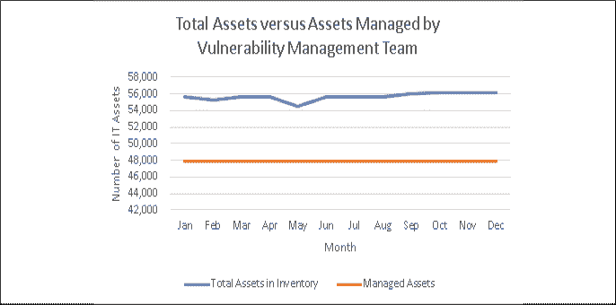
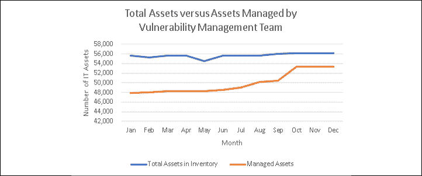
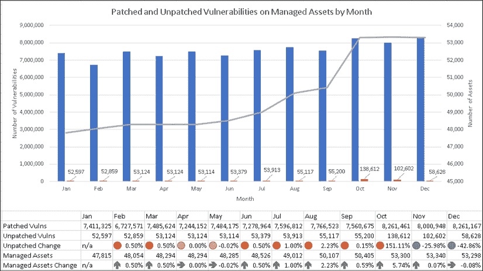
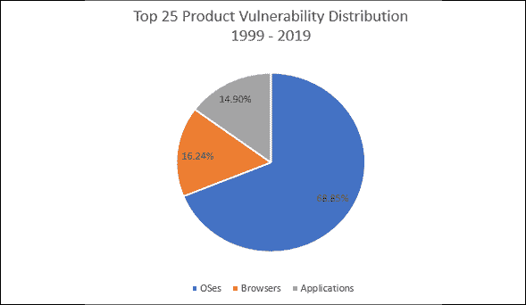
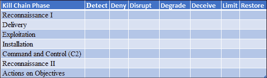

# 七、衡量表现和有效性

我们如何知道我们采用的网络安全策略是否按计划运行？我们如何知道 CISO 和安全团队是否有效？本章将着重于衡量网络安全策略的有效性。

在本章中，我们将讨论以下主题:

*   使用漏洞管理数据
*   衡量网络安全策略的表现和效力
*   以攻击为中心的网络安全策略为例
*   使用入侵重建结果

让我们以一个问题开始这一章。为什么 CISOs 需要测量任何东西？

# 介绍

网络安全团队需要度量事物的原因有很多。遵从法规标准、行业标准和他们自己的内部安全标准通常是其中的首要因素。

有数百个与治理、风险和法规遵从性相关的指标可供组织选择来衡量自己。学过**认证信息系统安全专业人员**(**)认证的人都知道，安全领域数不胜数，包括安全与风险管理、资产安全、安全架构与工程、通信与网络安全、**身份与访问管理** ( **IAM** ，等等。(ISC2，2020)这些领域中的人员、流程和技术的性能和功效可以通过多种方式来衡量。事实上，度量标准的数量和度量方法令人眼花缭乱。如果您有兴趣了解可用指标的范围，我推荐您阅读 Debra S. Herrmann 关于该主题的 848 页的《利维坦》,*安全和隐私指标完整指南:衡量法规遵从性、运营弹性和 ROI* (Herrmann，2007)。**

 **除了出于合规性原因衡量事物，网络安全团队还试图找到有意义的指标来帮助证明他们正在为他们支持的业务增加价值。这对 CISOs 来说可能很有挑战性，也有点不公平。**关键表现指标**(**KPI**)通常根据目标或目的衡量表现。对于安全团队来说，未能实现目标往往会造成损害。很难找到有意义的数据来证明 CISO 和网络安全团队的投资和努力是组织没有受到威胁或数据泄露的原因。是他们的工作阻止了攻击者成功吗？或者，正如我听到许多非安全管理人员所说的那样，该组织只是“在攻击者的雷达下飞行”吗？这就是我在前言中介绍的潜艇类比有所帮助的地方。在涉及网络安全的互联网上不存在雷达下的飞行；只有来自各个方向的持续压力。此外，希望不是策略，而是放弃责任。

然而，首席信息安全官需要能够向他们的同行、他们支持的企业或公民，以及股东证明，他们创造的成果不是运气或希望实现的副产品。他们需要证明他们的成果是成功执行网络安全策略的产物。我见过很多 CISOs 试图通过观点和轶事证据来做到这一点。

但是，如果没有数据来支持观点和轶事，这些首席信息安全官往往很难捍卫他们的策略和网络安全计划的成功。审计员或顾问提出不同意见，挑战 CISO 对当前事态的描述，这只是时间问题。

数据是衡量网络安全策略的表现和功效的关键。数据帮助 CISOs 管理他们的网络安全计划和投资，并帮助他们证明他们的网络安全计划是有效的，并在不断改进。在这一章中，我将向 CISOs 和安全团队提供如何衡量其网络安全策略有效性的建议。为此，我将使用我在第五章、*网络安全策略*和*第六章*、*策略实现*中研究过的最佳评分策略，即以攻击为中心的策略，作为一个例子。我还将利用我在本书前几章中提供的概念和见解。我不会在这里讨论度量合规性或其他目的，因为有许多书籍、论文和标准已经在做这件事了。让我们先来看看漏洞管理数据的潜在价值。

# 使用漏洞管理数据

对于刚刚开始实现网络安全计划的组织，或者已经承担了一项计划领导责任的 CISOs 来说，漏洞管理数据可能是一个强大的工具。即使对于成熟的网络安全计划，漏洞管理数据也有助于说明安全团队如何有效地管理其组织的风险，并随着时间的推移不断改进。尽管如此，令人惊讶的是，我遇到过一些大型成熟企业的首席信息安全官，他们不汇总和分析，或者使用他们漏洞管理计划中的数据。当我遇到它时，我感到惊讶。这是因为这些数据是 CISOs 传达其网络安全计划有效性的最直接、最简单的方式之一。

CISOs 和 IT 管理人员面临的一个挑战是根据与业务管理人员衡量和沟通表现的方式相一致的数据制定表现概述。此类数据对 CISOs 的影响也可能完全不同。

例如，当一个生产站点落后于目标时，将会有额外的资源和行动计划来帮助弥补。但是对于 CISOs 来说，额外的资源很少是落后于目标的结果；在很大程度上，安全程序应该是“拨号音”

正如我在前面的章节中详细讨论的，未打补丁的漏洞和安全错误配置是通过漏洞管理程序管理的五个网络安全常见疑点中的两个。随后，一个运行良好的漏洞管理程序不是可选的。正如我在*第 1 章*、*成功的网络安全策略的要素*中所讨论的，完整且最新的资产清单对于漏洞管理计划和整体网络安全计划的成功至关重要。毕竟，安全团队很难管理他们不知道存在的资产。

漏洞管理团队应该每天扫描库存中的所有东西，寻找漏洞和错误配置。这将有助于最大限度地减少未缓解的漏洞和错误配置在其环境中出现和被利用的时间。请记住，漏洞和错误配置可以通过多种方式引入 IT 环境；新披露的漏洞平均每天 33 到 45 个(在过去 3 年中)，从旧映像构建或从备份恢复的软件和系统，失去支持的传统软件和系统，随着时间的推移变得不受管理的孤立资产，等等。

漏洞管理团队每天扫描他们的所有资产，他们将获得环境当前状态的新快照，他们可以将这些快照与以前的所有快照拼接在一起。随着时间的推移，网络安全团队可以通过多种方式使用这些数据。让我举几个例子来说明如何使用这些数据。

## 管理资产与总资产之比

受漏洞管理团队管理的资产数量与组织拥有和运营的资产总数之比，可能是一些组织感兴趣的数据点。这两个数字之间的差异可能代表风险，特别是如果存在没有被任何人针对漏洞和错误配置积极管理的资产。我在一些组织中看到了这两个数字之间的巨大差异，在这些组织中，IT 人员长期以来一直不足，并且没有足够的文档或部落知识来提供准确的资产清单。随后，可能会有 IT 资产的子网没有被清点，也没有作为漏洞管理计划的一部分进行主动管理。

我还发现，当首席信息官与 IT 领导层关系不佳时，这些数字会有很大差异；在这种情况下，不准确的 IT 清单似乎很常见，并给组织带来真正的风险。在我见过的一些案例中，IT 知道所有或大部分资产的位置，但不会主动与 CISO 合作，以确保它们都被清点和修补。正如我在*第一章*、*成功网络安全策略的要素*中所写的，首席信息安全官必须努力与他们的利益相关者社区保持良好的关系，尤其是与他们的 IT 组织。首席信息官和首席技术官还需要认识到，他们的角色越来越多地与 CISO 有着共同的命运；当漏洞管理程序失败时，他们都失败了，应该分享“荣耀”CISO 成为 IT 安全失败的唯一替罪羊的日子已经成为过去。处于这种情况下的 CISOs 应该努力改善与 IT 合作伙伴的关系。在某些情况下，这说起来容易做起来难。

在*图 7.1* 所示的示例场景中，漏洞管理计划全年持续管理相同数量 IT 资产的漏洞和错误配置。幸运的是，他们没有意识到有一些子网的 IT 资产不是他们管理的。他们也没有积极管理这一年中引入环境的新 IT 资产。图中两条线之间的空间代表组织面临的风险:

<figure class="mediaobject"></figure>

图 7.1:趋势数据示例，说明库存中的 IT 资产总数与漏洞管理计划中注册的资产数量之间的差异

为了最大限度地降低风险，IT 资产的总数和每天主动管理漏洞和错误配置的资产的总数应该相同。然而，在大型复杂的环境中，可能有很好的理由让这条规则有例外。但是负责管理漏洞的团队仍然需要知道、理解和跟踪异常；否则，组织面临的风险不会暴露给组织中正确的管理层。换句话说，如果组织将拥有未打补丁的系统，那么这样做的决定以及持续多长时间的决定需要由最高的适当管理层接受，并定期重新检查。

对于这样的决策，合适的管理层可能根本不在 IT 部门——这取决于他们所采用的组织和治理模型。请记住，允许未打补丁的系统在环境中运行的决定是代表整个组织接受风险的决定，而不仅仅是该资产的所有者或管理者。我见过项目经理为了满足他们项目的进度、预算和质量目标，而过于热情地代表他们的整个组织接受各种各样的风险。尽管事实上他们的角色范围仅限于他们所从事的项目。如果风险从未升级到适当的管理级别，它可能会永远处于未知和潜在的不受管理状态。应采用风险登记来跟踪风险，并定期重新评估风险接受和转移决策。

在 IT 资产总数和针对漏洞进行主动管理的资产总数存在显著差异的环境中，这是 CISOs 和漏洞项目经理展示他们如何努力缩小这一差距从而降低组织风险的机会。他们可以利用这些数据向 IT 领导和董事会说明组织面临的风险。要做到这一点，他们可以使用不完整和不准确的资产清单，并谈论不受管理的资产的存在。CISOs 可以定期向利益相关方提供最新信息，说明漏洞管理团队管理的资产数量与组织拥有和运营的资产总数之间的差异如何随着时间的推移而变化，以及 IT 部门和他们的网络安全团队如何共同努力减少和最大限度地降低这种差异。该数据点代表了组织面临的真实风险，趋势数据说明了 CISO 及其漏洞管理团队是如何管理风险的。如果这一数字朝着错误的方向发展，高级领导层和管理委员会有责任认识到这一点，并帮助解决这一问题。

*图 7.2* 显示了 CISO 和漏洞管理团队一直在与他们的 IT 合作伙伴合作，以降低未加入漏洞管理计划的系统带来的风险。

这是一个积极的趋势，CISO 可以借此传达网络安全计划的价值:

<figure class="mediaobject"></figure>

图 7.2:趋势数据示例，说明库存中的 IT 资产总数与漏洞管理计划中注册的资产数量之间的差异在不断改善

## 已知未打补丁的漏洞

漏洞管理计划的另一个关键数据点是环境中存在的已知未修补漏洞的数量。请记住，一些组织的 IT 资产清单中存在未打补丁的系统有很多原因。坦率地说，我听到的最常见的原因是缺乏对漏洞管理项目的投资；人手不足和资源不足的计划根本无法管理其环境中的大量新漏洞。除了时间之外，测试和部署安全更新还需要训练有素的人员、有效的流程和支持技术。

不管原因是什么，了解哪些系统未打补丁、未打补丁的漏洞的严重性以及针对它们的缓解计划仍然很重要。定期分享未修补漏洞的数量是如何减少的，有助于传达 CISO 和网络安全团队是如何为企业的成功做出贡献的。对于快速变化的环境，需要考虑的一个细微差别是，尽管基础架构发生了重大变化或 IT 资产数量增加，漏洞的数量如何减少。为了有效地传达这一点，CISOs 可能需要就漏洞管理指标的基础和细微差别，以及它们对组织整体风险的重要性，对他们的一些利益相关者进行培训。董事会中通常只有一两个成员有网络安全经验，而在典型的高管层中有这种经验的高管就更少了。根据我的经验，教育这些利益相关者是值得花时间的，并且将帮助每个人理解网络安全团队提供的价值。在漏洞管理团队资源不足的情况下，这些数据可以帮助以易于理解的方式构建增加投资的业务案例。

*图 7.3* 展示了一个场景，漏洞管理团队成功地最小化了其环境中未修补漏洞的增加，尽管在其计划中注册的 IT 资产数量略有增加。但是，收购一家 10 月份关闭的小型公司引入了大量新的 IT 资产，漏洞管理团队需要管理这些资产。这导致未打补丁的漏洞数量急剧增加，到本季度末，该团队能够将其减少到更典型的水平:

<figure class="mediaobject"></figure>

图 7.3:趋势数据示例，说明已修补漏洞的数量、未修补漏洞的数量以及组织漏洞管理计划中注册的系统数量

有了这样的数据，CISO 和网络安全团队就像英雄一样。如果没有这样的数据，就很难描述收购给漏洞管理团队带来的挑战、随之增加的工作量以及积极的结果。不过，这也不全是好消息，因为该组织的环境中存在大量且不断增加的未修补漏洞。CISO 应该能够阐明将未修补漏洞的数量尽可能减少到零的计划，使用相同的数据来请求更多的资源来加速这一努力。注意，我在这个例子中使用的数字完全是虚构的；实际数据可能会有很大差异，这取决于资产、硬件、软件、应用程序、修补策略、治理实践等的数量。

但是对于一些组织来说，减少未打补丁的漏洞数量说起来容易做起来难。一些已知的漏洞根本无法修补。这有许多原因。例如，许多供应商不会为不再受支持的软件提供安全更新。一些供应商停业，随后，他们的客户已经部署的产品的安全更新将永远不会提供。另一个常见的例子是遗留应用程序，它们与操作系统或 web 浏览器的特定安全更新存在兼容性问题。在这种情况下，通常会有一些变通办法，即使没有安装修复这些漏洞的安全更新，也可以实现这些办法，使利用特定漏洞变得不可能或不可能。通常，在可以部署修复漏洞的安全更新之前，变通办法是短期解决方案。然而，在许多环境中，工作区变成了永久租户。报告如何使用变通办法而不是安全更新来缓解已知的未打补丁的漏洞，有助于传达风险及其管理方式。提供诸如正在进行的*解决方案*、已部署的和*没有可用的解决方案*之类的类别，可以帮助业务发起人了解哪里需要做出决策。部署了变通办法的系统的数量，以及它们缓解的底层漏洞的严重性，提供了环境中风险的细微视图。将这些数据与针对潜在漏洞的长期缓解计划结合起来，CISOs 就有了一个可以与利益相关者分享的风险管理故事。

## 按严重性划分的未修补漏洞

另一个潜在的强大数据点是环境中未打补丁的漏洞数量，按严重性分类。正如我在*第 2 章*、*使用漏洞趋势降低风险和成本*中详细讨论的那样，由于被利用的可能性和影响，关键和高严重性漏洞代表着最高的风险。了解环境中在任何时候都存在多少这样的漏洞、它们存在了多长时间以及补救时间都是重要的数据点，有助于阐明它们带来的风险。从长远来看，这些数据可以帮助 CISOs 了解这些风险缓解的速度，并发现导致其环境中相对较长生命周期的因素。这些数据可以帮助漏洞管理项目经理和 CISOs 为更多资源和更好的流程和技术建立业务案例。这些数据也可以是网络安全团队的价值以及他们为组织管理风险的有效性的最有力的指标之一，因为这些漏洞带来的风险是最严重的，并且很容易向高管和董事会表达。

不要低估 IT 环境中中等严重性漏洞对攻击者的价值。由于严重和高评级漏洞的货币价值，攻击者一直在寻找方法使用中等严重性漏洞的组合来危害系统。CISOs 和漏洞管理团队需要积极管理这些漏洞，以最大限度地降低环境风险。这是向他们支持的企业展示价值和交流不断修补这些漏洞的进展的又一次机会。

## 按产品类型划分的漏洞

另一个潜在的有用的数据集是按产品类型分类的漏洞。让我们面对它；大多数操作发生在用户桌面上，因为它们会通过外围防御将威胁带入 IT 环境。正如眼睛是心灵的窗户，浏览器对于操作系统也是如此。攻击者不断试图找到并利用 web 浏览器和操作系统中的漏洞。

**图 7.4** 中探究的数据在*第 2 章*、*中也有涉及，利用漏洞趋势降低风险和成本*:

<figure class="mediaobject"></figure>

图 7.4:按产品类型分类的 CVE 最多的 25 种产品中的漏洞(1999-2019)(CVE 细节，2019)

漏洞管理团队可以为他们的环境开发类似的视图，以说明他们所面临的挑战以及他们管理挑战的能力和进度。像这样的数据，结合我之前讨论的数据点，可以帮助说明组织的风险所在，并帮助优化其处理。环境中操作系统、web 浏览器和应用程序中未修补、严重、高和中等严重性漏洞的数量，以及不受漏洞管理计划管理的系统的数量，有助于 CISOs 及其利益相关方了解其 IT 环境中的风险。当然，根据环境的不同，包括与基于云的资产、移动设备、硬件、固件、设备、路由和交换设备以及每个 IT 环境中使用的其他技术相关的数据将提供更完整的视图。这些技术的组合及其潜在的漏洞对于每个组织来说都是独特的。

向执行管理团队和董事会成员提供这样的量化数据有助于他们理解现实和观点。没有这种类型的数据，就很难做出令人信服的商业案例，也很难根据网络安全项目的目标交流进展。这些数据还将使随机的高管和其他利益相关方(如过于激进的供应商)更容易向网络安全计划的利益相关方询问成为新闻头条的“当前漏洞”。如果高级利益相关者知道他们的 CISO 和漏洞管理团队正在称职且勤奋地管理其环境中的漏洞和错误配置，那么大量可能分散 ciso 注意力的干扰就可以被过滤掉。

这种报道对一些人来说可能听起来复杂和吓人。好消息是已经有漏洞管理产品可以提供丰富的分析和报告功能。CISOs 并不局限于我在本章中提供的想法，因为漏洞管理供应商有很多很好的方法来帮助衡量和交流进展。关键是使用分析和报告机制来有效地向风险承担者展示您的漏洞管理计划如何降低组织的风险，并在需要时请求资源。

尽管来自漏洞管理程序的数据对 CISOs 非常有帮助，但它只能帮助他们管理五个网络安全常见嫌疑人中的两个。可能有更多的数据可以帮助 CISOs 了解和管理其网络安全策略的性能和效力。接下来让我们使用我在第 6 章、*策略实现*中详细讨论的例子来探讨这个问题，这是一个以攻击为中心的策略，入侵杀伤链框架(Eric M. Hutchins，Michael J. Cloppert，Rohan M. Amin，博士)。

# 衡量以攻击为中心的策略的性能和功效

正如我在*第 5 章*、*网络安全策略*和*第 6 章*、*策略实现*中提到的，入侵杀伤链框架具有许多属性，使其成为一种有吸引力的网络安全策略。首先，它在第五章中获得了最高的**网络安全基础评分系统** ( **CFSS** )估计总分。

这意味着它有最大的潜力来充分减轻网络安全通常的嫌疑。此外，这种方法可用于内部环境以及混合环境和云环境。也许我最喜欢这个框架的一点是，它的性能和功效可以用一种相对简单的方式来衡量。让我们详细检查一下。

## 执行入侵重建

当你阅读它时，这可能看起来很奇怪，但是当涉及到衡量网络安全策略的性能和效力时，入侵企图是攻击者给防御者的礼物。它们是礼物，因为它们测试防御者的网络安全策略的执行和操作。但是为了从入侵尝试中获取价值，必须分解和研究每一个成功的、部分成功的和失败的入侵尝试。在这样做的时候，有两个关键问题需要回答。首先，在攻击者被检测到并最终被阻止之前，他们的入侵杀伤链(Eric M. Hutchins，Michael J. Cloppert，Rohan M. Amin，博士)进展到什么程度了？第二，攻击者如何击败或绕过网络安全团队为打破他们的入侵杀伤链而部署的所有缓解控制层？换句话说，如果攻击者进入了入侵杀伤链的第四阶段，他们如何通过第一、第二和第三阶段的所有缓解措施呢？

这些是入侵重建(Eric M. Hutchins，Michael J. Cloppert，Rohan M. Amin 博士)应该帮助回答的核心问题。在寻找这两个问题的答案时，入侵重建还应该回答许多其他问题，这些问题将有助于衡量这种方法的每个实现的性能和功效。正如您将在我描述这个过程时看到的，这些问题的潜在主题是，正在努力打破攻击者入侵杀伤链的人员、过程和技术是否有效。我们希望发现在我们以攻击为中心的策略的每个阶段是否需要任何改变。我们开始吧。

洛克希德·马丁公司关于入侵杀伤链的论文讨论了入侵重建的概念。我再次推荐阅读这篇论文。我将在本章描述的方法与洛克希德·马丁公司论文中描述的方法略有不同。至少有几种方法可以完成入侵重建；我将描述一种我曾经成功使用过的方法。

这种方法假设防御者无法自信地进行归因，因此它不像其他方法那样依赖于归因。我认为这是一个优势，因为随着攻击者变得越来越老练，错误归属的可能性也会增加。我的入侵重建方法的目标是确定入侵杀伤链框架的实现可以改进的地方，而不是确定攻击者并对他们采取军事或法律行动。

让我就何时进行入侵重建提供一些建议。事故响应活动正在进行时，请勿执行重建。在活动事件期间，使用在您组织的事件响应流程中发挥作用的宝贵资源和专业知识是不必要的干扰。重建可以等到危机时期过去之后。理想情况下，重建可以在事件过去几天或几周后参与者对细节记忆犹新的时候进行。然而，如果你的组织总是处于危机状态，那么就忽略这个建议，尽可能地接触他人和信息。也许你可以通过找出导致危机的缺陷来帮助打破危机循环。

为了执行入侵重建，我强烈建议您从负责网络安全策略、架构、保护、检测、响应和恢复的所有团队中至少挑选一名代表。在非常大的环境中，这可以限制在负责入侵尝试所涉及区域的相关团队的范围内。一旦组织变得擅长重建，参与者的数量可能会减少更多。但是您需要专业知识和可见性，每个团队都必须重现每个失败、部分成功和完全成功的入侵尝试中发生的事情。请记住，我在*第 6 章*、*策略实现*中对行动方案矩阵(Eric M. Hutchins、Michael J. Cloppert、Rohan M. Amin 博士)所做的修改之一是为每个缓解措施添加一个“数据消费者联系点”。这些信息有助于从不同的团队中找到合适的人来参与重建。

应该决定是否邀请供应商参加这些会议。我通常发现让我们曾经使用的一些网络安全供应商的可信代表参与入侵重建是有帮助的。

这种方法至少有几个好处。首先，供应商应该能够围绕他们的产品和服务带来专业知识，并提供否则可能会被忽略的见解。其次，与您选择的帮助您抵御攻击者的供应商分享攻击者给您的“礼物”非常重要。这些练习可以让你的供应商做出更好的产品，你的组织和其他人都可以从中受益。但是这也给了你一个机会来看看你的供应商到底有多愿意帮忙，以及他们是否愿意为他们的缺点负责。我发现，我使用的一些供应商，我以为他们会在安全事件中支持我，但当我真正需要他们时，他们却像马戏团帐篷一样折叠起来，离开了城镇。在入侵重建过程中，这些供应商有勇气参与，但通常会将他们产品的失败归咎于他们的客户。如果您对供应商做了足够多的重构练习，您将有可能确定他们是否真的有愿望和能力以您认为他们会的方式帮助您的组织。当他们的产品许可更新日期临近时，这些知识会派上用场。我将在本章后面详细讨论这一点。

尽管如此，邀请供应商参与重建也有相关的风险。简单来说，有些厂商在保密信息保密方面真的很差。我的建议是，根据具体情况，与参与重建工作的利益相关方讨论让供应商参加这些会议。如果供应商增加了足够的价值并且值得信赖，那么就有理由让他们参与这些练习。在最终决定让供应商参与这些活动之前，与高层领导讨论这一想法并征求他们的意见也是一个谨慎的步骤。

如果您的组织有一个取证团队或使用一个供应商进行取证，这些专家对入侵重建工作会有极大的帮助。他们拥有的工具和技能有助于确定重建中的系统是否、何时以及可能如何遭到破坏。根据我的经验，我遇到过两种类型的取证团队。第一个是传统的法医团队，他们有经过认证的法医检查员，他们遵循严格的程序来保持他们收集的证据的完整性。

根据我在拥有这种取证团队的组织中的经验，他们需要一个全职的专家团队来保存证据，维护监管链，并可能在他们帮助调查的刑事案件中出庭作证。更常见的情况是，组织将这类工作外包出去。

我更经常看到的另一种类型的取证团队，履行不同的职能，有时被简单地称为事故响应者。他们也试图确定系统是否被入侵。但这些团队通常没有经过认证的法医专业人员，不保持证据的完整性，也不打算在法庭上作证。事实上，很多时候，他们努力确定系统是否已经被破坏，结果是破坏了在刑事诉讼中被认为是证据的东西。在这里，我遇到了一些有资质的法医专家的有趣的、有时是偏狭的态度，因为他们中的许多人根本不会把这些努力称为*法医*，因为他们销毁证据，而不是妥善保存证据。但是这些人需要记住，许多戴着粉红色戒指的工程师讨厌 IT 工程师在他们的头衔中使用“工程师”;设计建筑的建筑师也不喜欢 IT 建筑师用自己的头衔，“安全研究员”这个头衔让很多学术研究者望而却步。但是我跑题了。现实是，并不是每个组织都想花时间和精力追踪攻击者，并试图在法庭上起诉他们。组织需要决定他们需要哪种类型的取证专业人员，以及他们是否负担得起。当这两种取证专家帮助确定系统是否已经被入侵并参与入侵重建演习时，他们都是物有所值的。

谁应该领导重建工作？我建议由负责网络安全策略的个人或团体来领导这些练习。该个人或团队最终负责整体策略的表现和功效。他们还可能负责根据需要进行调整，以确保策略的成功。策略小组的替代方案是**事件响应** ( **IR** )团队。IR 团队应该掌握领导入侵重建所需的大部分(如果不是全部)细节(Eric M. Hutchins、Michael J. Cloppert、Rohan M. Amin 博士)。如果他们没有，你就已经确定了第一个需要改进的地方。

IR 团队负责管理事件，因此他们应该能够轻松获得与部分和完全成功的入侵尝试相关的大部分信息。但他们可能不会参与不符合事故条件的失败尝试。在这些情况下，SOC 人员、运营人员和建筑师可能拥有重建的关键信息。

请记住，我们的目标不是对组织面向互联网的防火墙上发生的每个端口扫描进行分类。我建议在参与重建工作的小组之间就一个原则达成一致，该原则用于确定应该执行重建的入侵类型。也就是说，定义确定是否执行正式重建的入侵尝试的特征。如*表 7.1* 所示，使用我们从*第 6 章*、*策略实现*中更新的行动过程矩阵，一个有效的原则可以是，在*交付*阶段中，任何使其比*拒绝*行动更进一步的入侵都应该被重建。一个不那么激进的原则是，任何导致*恢复*操作的入侵尝试都应该被重建。在这两个例子之间还有许多其他选择。

这一原则的目标是实现一致性，有助于适当平衡风险和重建参与者的宝贵时间。这个原则不需要被刻在石头上，它可以随着时间的推移而改变。当一个组织第一次开始执行重建时，他们可以有一个相对积极的原则，使他们能够快速学习。然后，一旦来自重建的经验已经“正常化”了，就可以采用一个不那么激进的原则。但在这些重建活动中，利益相关方就启动这些活动的原则达成一致，对于这些活动的长期成功以及网络安全策略的成功至关重要。相对于入侵尝试而言，太少的重建可能意味着组织没有对攻击者给予的礼物给予足够的重视，并且可能对攻击调整得太慢。太多的重建会带来破坏性和反效果。随着时间的推移，达成一致的原则应该为利益相关方群体找到正确的平衡。

<figure class="mediaobject"></figure>

表 7.1:第 6 章“策略实现”中更新的行动方案矩阵示例(Eric M. Hutchins、Michael J. Cloppert、Rohan M. Amin 博士)

一旦确定了合适的参与者或其代表，并且入侵重建负责人准备好进行协调，就可以安排重建会议。为参与者提供足够的准备时间和指导来为重建收集适当的数据将有助于节省时间和减少挫折。根据我的经验，一些重建工作很简单，因为入侵企图在早期就被检测到并阻止了。在这些情况下，参与者的数量和他们重建入侵企图所需的数据量可能相对较少。随后，这个练习通常需要的时间相对较短，例如 45 分钟或一个小时。如果您刚刚开始在您的组织中进行重建，您自然需要比习惯之后多一点的时间。对于更复杂的入侵尝试，尤其是当攻击者进入其杀伤链的后期阶段时，可能需要拥有更多数据的更多参与者，从而增加了重建练习所需的时间。

我工作过的许多组织都用代号来标记安全事件。所有关于事故的后续通信都使用其代号。这样，如果一封电子邮件或其他通信被某个没有被读到事件的人看到，其背景和意义就不明显了。当组织用事件代码名称标记事件时，关于入侵重建的通信和邀请应使用事件代码名称。如果您决定使用事故代码名称，请仔细考虑您使用的名称，避免使用可能具有攻击性的标签。这包括英语以外的其他语言的名称。

如果该代码名称成为公共知识，请考虑对组织声誉的潜在影响。远离那些与公司品牌或公司希望在顾客心目中建立的品牌不一致的主题。除了良性代号之外，确实没有令人信服的商业理由来使用任何东西。这些很无聊，但在多个层面上有效。

现在，我们的重建工作有了一个代号，参与者将带来相关数据，一些值得信赖的潜在供应商将参与其中，还有一个领导者来促进这项工作。这个练习的目的是重建攻击者在他们的杀戮链的每个阶段所采取的步骤。要做到这一点可能没有完全的把握，对他们的战术和技术的一些假设可能是必要的。但是，重构包含的细节越多，就越容易识别人员、流程和技术表现符合预期或表现不佳的领域。在这些练习中，准备好做详细的笔记。入侵重建演习的产品应该是一份报告，其中包含入侵企图的详细信息，以及网络安全团队已实现的防御措施的性能。这些工件将潜在地具有多年的价值，因为它们将提供关于过去攻击的知识的有用的连续性，即使当关键员工离开组织时。换句话说，当从这些入侵尝试中吸取的经验教训被记录下来时，它们可供当前的和将来的人员借鉴。这是我将入侵尝试称为“礼物”的另一个原因。

我们更新的杀伤链框架有七个阶段。重建工作应该从哪里开始？在第一阶段，或者可能是最后阶段？这个问题的答案是，看情况。有时，入侵很简单，可以按顺序从头到尾绘制出来。然而，对于复杂的入侵或几个月或几年前开始的入侵，以这种方式进行重建可能是不谨慎或不可能的。从你最了解和最有把握的阶段开始。这可能是杀人链的最后一环。从你的起点出发，利用重建参与者提供的数据和见解，在两个方向上建立一个时间表。由于缺乏数据或不确定性，可能无法建立完整的时间表。

重建揭示的细节越多越好，因为这将有助于识别改进的机会、差距和防御中的失败。在我的例子中，我将简单地从第一阶段开始，通过杀伤链向前推进。但是要注意的是，这不可能对每一次入侵都这样做。先说**侦察 I** 阶段。

在攻击前的侦察 I 阶段，可能无法确定任何特定威胁参与者的活动。由于如此多的网络流量不断轰击所有连接互联网的设备，挑选出特定攻击者进行的特定探测和侦察活动通常具有挑战性。但也不是不可能。这是一个结合了**人工智能** ( **AI** )、**机器学习** ( **ML** )、良好威胁情报和粒度日志的领域，非常有前途。使用 AI/ML 系统在海量日志数据中搅动，如网络流量数据、DNS 日志、认证和授权日志、API 活动日志等，以接近实时的方式找到特定攻击者的活动，这不再是科幻小说。如今，云服务可以大规模做到这一点。锦上添花的是，你可以通过亚马逊 Alexa (Worrell，2018)将安全调查结果读给你的 SOC 分析师听！这些能力直到最近还只能在科幻小说中实现。但是现在，只要有信用卡和一点时间，任何人都可以通过云计算提供的功能实现这一点。真的很神奇！我将在下一章详细讨论云计算。

从攻击的**交付**阶段收集数据和见解显然是非常重要的。关键问题是，攻击者如何击败或绕过网络安全团队为打破这一阶段的杀伤链而部署的层层缓解措施？他们是如何成功交付武器的，涉及到哪些人员、流程和技术？

为了回答这些问题，我发现在参与者的帮助下，在白板上画出系统流程图是很有用的。首先，尽可能详细地绘制基础架构，包括外围防御、服务器、客户端、应用程序、系统名称、IP 地址等。绘制相关基础架构的地图，并绘制数据在该基础架构中应该如何流动、使用的协议、身份验证和授权界限、涉及的身份、存储等图表。然后，画出攻击者在入侵尝试期间是如何交付武器的，以及交付期间发生了什么。

攻击者在这一阶段成功的原因是什么？这个问题的答案包括询问和回答许多其他问题。让我给你举几个例子。入侵重建中一个有用的数据点是检测到攻击需要多长时间。建立攻击时间表是帮助确定攻击执行方式的有用工具。在**交付**阶段(Eric M. Hutchins、Michael J. Cloppert、Rohan M. Amin 博士)，是否检测到了武器的交付，是通过何种控制手段检测到的？如果没有检测到交付，记录哪些控制应该检测到它。如果您的 Kill Chain 框架实现中存在明显差距，请记录。当您在策略实现中补救缺陷时，这些信息将非常有用。

是否有任何控制措施本应检测到交付，但却未能做到？为什么这些控制没有按预期运行？他们失败是因为他们没有做供应商承诺的事情吗？他们失败的原因是控制之间的集成或自动化，还是系统没有按预期工作？这就是重建流程图中系统的日志数据和其他数据源非常有用的地方。通过流程图中各系统日志中的数据，尝试一步步拼凑出武器是如何交付的。所有这些系统看起来都像预期的那样运行吗？如果没有，找出异常和薄弱环节。在某些情况下，日志数据可能不可用，因为日志记录没有打开，或者激进的数据保留控制删除了日志数据。是否有充分的理由不在这些系统上启用日志记录并存储日志以备将来使用？

有足够的数据来确定武器是如何投放的吗？有时，根据现有的数据，根本不可能确定武器是如何交付的。一些 IR 团队将第一个被入侵的系统称为“零号病人”。在一些入侵中，攻击者的进入点非常明显，可以追踪到电子邮件、访问恶意网站、USB 驱动器、恶意软件等等。在其他情况下，如果最初的攻击是在几周、几个月或几年前完成的，并且攻击者擅长掩盖他们的踪迹，找到零号病人是一种渴望，而根本不可能。想想在这种情况下什么会对你有帮助。增加日志记录的详细程度会有帮助吗？将日志存档更长时间或将日志运送到异地会有帮助吗？有没有一些你目前不具备的能力可以帮助填补这个空白？

交付阶段缓解措施的数据消费者是否获得了检测和打破该阶段所需的数据？例如，SOC 是否获得了检测入侵所需的数据？在更新的行动方案矩阵中确定的数据消费者是否按预期接收或访问了数据？如果不是，是哪里出了问题？是数据交付机制失败了，还是因为某种原因，需要的数据在目的地被过滤掉了？在数据的收集、传递和分析中可能有多次失败。深入了解这一点，找出那些没有按计划进行的事情，并记录下来。

控制、自动化和集成是否按预期工作，但人员或流程是失败的根源？这种情况比你想象的要多。架构是健全的，系统按预期工作，技术按预期执行，武器被检测到，但没有人注意，或者警报被注意到但被解除。不幸的是，人员和流程故障与技术控制故障一样常见，如果不是更常见的话。SOC 流程中的失败、糟糕的决策、犯错误的供应商，有时仅仅是关键人员的懒惰，都会导致无法检测和阻止攻击。

在攻击的这一阶段，攻击者和/或防御者运气好吗？我遇到的一些安全专家告诉我，他们不相信运气。但我把这种信念归结为幼稚。我见过攻击成功是因为喜剧般的错误，这些错误可能无法重复或复制。人员、流程、技术和环境的组合可能导致攻击场景，就像中了彩票一样。不要低估运气的作用。请记住，并非所有的风险都能真正被识别；“黑天鹅”事件可能发生(Taleb，2007)。

一旦重建团队了解了攻击的交付阶段是如何完成的，并且已经记录下来，我们就可以进入攻击的下一个阶段，即**开发**阶段(Eric M. Hutchins，Michael J. Cloppert，Rohan M. Amin，博士)。在这里，重建团队将重复该过程，使用数据来尝试确定是否尝试、检测和停止了利用。我们在交付阶段问的问题同样适用于这个阶段。哪些控制措施未能防止和发现剥削？在攻击的这个阶段，保护和检测控制方面的差距在哪里促成了攻击者的成功？

供应商的网络安全缓解措施像宣传的那样有效吗？数据消费者是否获得了检测和打破这一阶段所需的数据？IR 流程是否按计划开始并运行？我们可以从攻击者在这一阶段的成功中学到什么，以使这种成功在未来变得更加困难或不可能？记录你的发现。

继续对压井链的所有阶段进行调查。可能有些阶段什么也没发生，因为攻击者在这些阶段之前就被阻止了。请注意何时何地成功检测到攻击并成功破解。如果攻击没有在当前阶段被破坏，后续阶段中的缓解措施会成功检测并阻止攻击吗？在评估中尽可能坦诚地对待自己；陈词滥调、乐观主义和未定义未来的计划可能不足以打破下一个攻击者的入侵杀伤链。然而，清醒地下定决心让攻击者尽可能地难以下手可能会有所帮助。记得记录这些想法。

现在重建已经完成，您已经根据需要询问和回答了尽可能多的问题，以发现发生了什么，最好是在攻击的每一步。接下来，让我提供一些例子，说明在失败、部分成功和完全成功的攻击之后，重建应该确定的具体可操作的事情。

## 使用入侵重建结果

首先，回忆一下第六章、*策略实现*中关于识别差距和过度投资及投资不足领域的讨论。入侵重建可以确认在计划实现该策略时所做的一些差距和投资不足的分析。例如，如果在规划期间发现交付阶段的检测差距，并且后来的入侵重建数据也说明了同样的差距，这是一个奇怪的令人安心的消息。现在，CISO 有了更多的数据来帮助构建投资商业案例，以缩小这一差距。CISO 说他们需要投资探测能力是一回事，否则会发生不好的事情。但是，当 CISOs 能够向高级管理人员和董事会证明攻击者一直在积极利用已知漏洞时，这样的请求就更加有力了。

当 CISOs 能够提供风险真实存在的证据时，它反驳了风险是理论上的任何概念。这也有助于建立一种以前没有的紧迫感。如果入侵尝试导致与响应和恢复活动相关的计划外费用，这将有助于说明与差距相关的当前和潜在未来成本。这些数据可以为风险等式的概率和影响面提供信息，从而更容易与其他风险进行比较。使用这样的数据，CISOs 可以在每次网络安全计划审查会议上向其管理委员会提供差距和投资不足领域的更新，直到它们得到缓解。

当重建工作发现以前未知的差距或投资不足的领域时，这确实是攻击者的礼物。通过这样做，攻击者为 CISOs 提供了对其策略实现中的缺陷的宝贵见解，以及实现新的缓解措施或改进现有措施的明确行动号召。入侵重建数据也有助于为网络安全投资路线图提供信息。请记住，在入侵杀伤链中尽可能早地阻止攻击者比在后期阻止他们更可取。重建数据可以帮助网络安全团队确定和优先考虑缓解措施，这将有助于攻击者更难或不可能进入攻击的后期阶段。帮助网络安全团队了解在*交付*和*利用*阶段的不足和需要改进的地方是入侵重建工作的一个重要成果。然后，这些数据可用于规划投资路线图，该路线图绘制了组织计划部署的人员、流程和技术以及部署时间。由于大多数组织都有资源限制，重建数据和他们提供的投资路线图可能会成为网络安全团队规划流程的核心。

还记得我在*第一章*、*中讨论的那些网络安全的当务之急及其支持项目吗？成功的网络安全策略的要素*？当务之急是一个大胆的多年目标，最好与组织的业务目标一致。升级到急需的现代身份系统，或者最终放弃 VPN，为成千上万的信息工作者提供现代远程访问解决方案，就是两个例子。重建数据有助于为网络安全需求提供支持数据，并为处理这些数据的工作人员提供共同的目标感。相反，重建数据可能并不总是支持这样的观念，即计划的必要措施是组织的正确方向。

没有人期望这些一定会协调一致，尤其是在具有复杂环境和多项要务的大型组织中。但是，当雷击和重建数据表明一个命令对组织来说是至关重要的，它可以增压正在工作的项目团队。这种积极的势头有助于维持项目时间表，并使项目跨越终点线。

### 识别蹩脚的控制

源自入侵重建的另一个潜在行动领域是纠正未能按预期执行的缓解措施。这些控制措施已经部署并得到积极管理，但没有按照设计保护、检测或帮助响应入侵企图。显而易见，首席信息安全官和安全团队不能依赖不按他们应该的方式工作的控制措施。失败的控制有一系列可能的根本原因。

失败的一个常见根本原因是控件实际上没有执行安全团队认为它执行的功能。不幸的是，安全控制的功能和安全团队的期望之间的不匹配非常普遍。一些控制措施旨在缓解特定环境下非常特定的威胁。但是这种细微差别可能会在供应商的营销材料和销售活动中丢失。这是架构师在许多网络安全团队中扮演的一个关键角色:真正理解每种控制所减轻的威胁，以及需要如何协调控制来保护、检测和响应组织面临的威胁。他们应该深思熟虑地执行我在第 6 章、*策略实现*中讨论的网络安全能力清单，并对这些清单进行修改，以最大限度地减少差距和投资不足的领域。但是，正如我在*第 6 章*中提到的，控制实现的成熟度是一个重要因素，控制生成的数据的消耗也是如此。这是架构师可以参与的事情，即清点和规划，但数据消费者、运营人员和 SOC 工程师等需要帮助完成这一画面。否则，控制功能和期望之间的不匹配会让网络安全团队焦头烂额。

缓解措施未能按预期执行的另一个常见原因是它们根本没有按照供应商所说的方式工作。我知道这对于少数人来说是一个令人震惊的发现，而对于安全团队来说，这是一个非常普遍的挑战。如果供应商遵守他们所有的承诺，那么就不会有全球性的网络安全挑战，也不会有价值数十亿美元的网络安全产业。这是拥有多层防御的一个原因，这样当一个控制失败时，其他控制可以帮助减轻威胁。这是一个 ciso 可以与其他 ciso 分享和学习的领域。特定供应商和特定产品的专业经验通常是最好的参考。

缓解措施未能保护、检测或响应的另一个常见原因是它们所依赖的可信计算基础已经被破坏。也就是说，攻击者通过损害他们赖以运行的硬件和/或软件来破坏缓解措施。例如，一旦许多攻击者使用一个或多个网络安全常见嫌疑人来危害系统，他们首先要做的事情之一就是禁用系统上运行的反恶意软件软件。一个不太明显的策略是将目录添加到反恶意软件引擎的例外列表中，这样攻击者的工具就不会被扫描或检测到。一旦攻击者或恶意软件开始危害系统，他们通常会破坏为保护系统和检测攻击者而部署的控制措施。因此，精通网络安全基础知识是部署高级网络安全能力的先决条件。不要费心部署昂贵的攻击者检测系统，该系统使用人工智能来执行行为分析，除非你也致力于管理该系统的网络安全基础。如果未打补丁的漏洞、安全错误配置以及脆弱、泄露或被盗的密码使攻击者能够访问他们运行的系统，攻击者将破坏这些高级网络安全功能。我在前面的章节中详细讨论了这一点，但我将在这里再次重申。如果网络安全基础得不到有效管理，任何网络安全策略，即使是入侵杀伤链框架这样的高分策略，都不会有效。

此外，牢记网络安全基础知识，有效管理网络安全产品本身也很重要。反恶意软件引擎和其他常见缓解措施在过去一直是可利用漏洞和安全错误配置的来源。它们也必须得到有效的管理，这样它们就不会增加而不是减少攻击面。

与失败的控制相关的另一个行动项目是解决失败的控制集成。例如，在攻击者的杀伤链中，直到相对较晚的时候才检测到入侵企图，因为尽管控制器在早期阶段成功地检测到了入侵企图，但该数据从未到达 SIEM。像本例这样的中断和降级的集成在大型复杂的 IT 环境中很常见，很难检测到。如果网络安全团队可以简单地依靠数据消费者来识别网络安全控制的数据报告中的异常，那将是理想的，但在许多情况下，缺少数据并不是异常。许多组织中的技术债务会使识别和补救不良集成变得非常困难。很多时候，这种集成是由供应商或专业服务组织执行的，他们对客户的 IT 环境了解有限。这就是 SOC 工程师的价值所在；他们可以帮助确保集成按预期工作，并随着时间的推移不断改进。

### 从失败中学习

除了识别差距和次优控制和集成，入侵重建还可以帮助 CISOs 和网络安全团队确认他们拥有正确的投资优先级。来自重建的数据可以帮助重新确定投资的优先级，以便首先解决最关键的领域。这些数据不仅可以帮助投资决策合理化，还可以帮助首席信息官证明他们的投资决策是正确的，尤其是在面对首席信息官和首席技术官的批评时，他们有着不同的观点和可能不同的议程。投资于破坏攻击者努力的领域，而不是 IT 依赖的新功能，可能不是 IT 领导层的普遍选择。但是用重建数据来为这样的决定辩护会让其他人更难反对。

除了识别未按预期工作的技术之外，重建还可以提供一个机会来改进表现低于预期的人员和流程。例如，在治理失误导致不良安全结果的情况下，这可能是有助于推动治理流程和相关培训的积极变化的良好数据。如果遵守内部标准或行业标准无助于保护、检测或响应攻击，那么重建可能是变革的动力。

允许组织中的人从失败中学习是很重要的。在花费时间和精力了解失败并从中恢复后，组织可以通过将失败的教训传播给组织中受益最大的人来增加这些投资的回报。例如，重建数据可以帮助为高管或整个组织的社会工程培训建立一个案例。

### 识别有帮助的供应商

供应商是组织的重要合作伙伴，因为他们通常提供客户所依赖的技术、服务、人员和流程。入侵重建数据有助于识别表现达到或超过预期的供应商。它还可以帮助识别未能按预期表现的供应商。这包括供应商如何自己参与入侵重建演习。重建工作有助于发现那些倾向于将产品和服务性能的失败归咎于客户的供应商，这很少有帮助。这一点，以及有关供应商产品和服务表现的数据，有助于为供应商产品许可证续订谈判提供信息。一旦安全团队尝到了供应商产品的真正性能，以及他们在入侵期间愿意提供多大帮助，他们可能愿意在未来为它们支付更少的费用，或者根本不愿意使用它们。如果您的组织还没有这样做，我建议您维护一个许可证续订和生命周期终止“展望列表”,向您显示与续订和产品生命周期终止相关的关键日期何时临近。

确保组织给予自己足够的提前通知，以便他们可以花费合理的时间来重新评估现在是否存在更好的缓解措施。在部署和运行供应商的产品后，组织可能拥有比最初采购时更多、更好的关于其当前供应商表现的数据，以便为产品评估提供信息。

奖励那些乐于助人的供应商，并考虑替换那些不理解其核心价值应该是客户服务的供应商。纵观我在*第六章*、*策略实现*中提到的所有厂商，除了我没有提到的所有厂商，也不乏竞争你组织业务的公司。不要满足于那些将失败归咎于你的组织的供应商。即使这是真的，他们应该帮助你克服这些挑战，而不是玩指责游戏。入侵重建练习是他们证明投资于您的成功的机会，而不是作为一个不感兴趣的第三方旁观，等待下一个许可证更新日期。如果他们一直试图帮助你的组织从他们的产品中获得更多的价值，但是你的组织没有接受，那么在做出轻率的决定之前，这应该被调和。替换那些一直在逆流而上帮助您的组织的优秀供应商对您没有任何帮助，可能会使您的网络安全计划倒退几个月，甚至几年。但是他们的产品要么像宣传的那样工作，并且他们愿意帮助你在合理的时间内让他们进入那种状态，要么他们应该被替换。否则，他们只是增加了攻击面，同时使用了可以在其他地方更好地保护、检测和响应威胁的资源。

重建数据可能是你真正衡量网络安全供应商表现的最佳数据。在许可证续签谈判中使用它来反驳营销废话和销售主管的承诺，即最新版本或下一个版本解决了您的所有挑战，包括他们无法提供基本水平的客户服务。有时，绝望的供应商意识到他们将失去业务，决定通过直接向其他高管或董事会申诉来“终结”CISO 和网络安全团队。对于背负着对他们没有帮助的产品的 CISOs 来说，这可能是次优的。

但是，当 CISO 一直在向高管和董事会通报入侵重建的结果，并向他们展示他们的一些供应商是如何帮助或不帮助他们时，他们很难给这些供应商更多的业务。如果高管们仍然决定将更多的业务授予那些表现不尽如人意的供应商，数据显示，他们已经决定代表整个组织接受风险。首席信息安全官一直在管理这种类型的风险。但是随着数据的持续增长，每个人都很难简单地接受现状。数据而非意见本身应该有助于组织对其投资的网络安全能力做出更好的决策。

### 通知内部评估

我将讨论的入侵重建结果的最后一个潜在行动项目领域是渗透测试和红/蓝/紫团队练习。许多组织投资于渗透测试和红/蓝/紫团队，以便他们能够以更加结构化和可控的方式模拟攻击。从入侵重建演习中获得的经验教训可以为渗透测试和红队/紫队演习提供参考。如果重建工作发现了攻击者在实现网络安全策略时可以利用的弱点或漏洞，则应进一步测试这些弱点或漏洞，直到它们得到充分解决。当专业渗透测试人员和 Red 团队获得入侵重建结果时，它可以帮助他们设计测试，确保这些弱点得到适当的缓解。理想情况下，渗透测试人员和红/蓝/紫团队在攻击者有机会之前发现实现缺陷。

# 章节总结

网络安全团队需要衡量各种不同的东西，包括遵守监管、行业和内部标准。但是，本章重点介绍了 CISOs 和网络安全团队如何衡量其网络安全策略实现的表现和功效，并以以攻击为中心的策略为例。

数据帮助 CISOs 管理他们的网络安全计划和投资，并帮助他们证明他们的网络安全计划是有效的，并在不断改进；它还有助于说明检测到问题后纠正措施的有效性。运行良好的漏洞管理程序不是可有可无的；利用来自 it 部门的数据是 CISOs 传达效率和进度的最简单方式之一。漏洞管理团队应该每天扫描其清单中的所有内容，查找漏洞和错误配置。这有助于最大限度地减少未缓解的漏洞和错误配置出现和被利用的时间。随着时间的推移，漏洞管理扫描数据会产生有价值的趋势数据。一些有价值的数据包括:

*   漏洞管理小组管理的资产数量与组织拥有和运营的资产总数之比。
*   按漏洞严重性划分的环境中未修补的漏洞数量。
*   按产品类型划分的漏洞有助于说明环境中风险最大的地方；环境中操作系统、web 浏览器和应用程序中未修补、严重、高和中等严重性漏洞的数量，以及未受管理系统的数量，有助于 CISOs 及其利益相关方了解其 IT 环境中的风险。

以攻击为中心的策略，如入侵杀伤链，使衡量性能和功效变得相对容易；为此，使用了入侵重建。入侵重建结果可以在许多不同方面帮助 CISOs，尤其是通过识别未能按预期执行的缓解措施。为了从入侵尝试中获取价值，必须对每个成功、部分成功和失败的入侵尝试进行分解和研究，以回答两个关键问题:

1.  在被检测到并最终被阻止之前，攻击者的入侵杀伤链进展到了什么程度？
2.  在被阻止之前，攻击者是如何击败或绕过网络安全团队为打破其入侵杀伤链而部署的所有缓解控制层的？

在本书的下一章，我们将探讨云如何为安全性和合规性提供一种现代方法，以及它如何进一步帮助组织实现网络安全策略。

# 参考

1.  工程师的命令(未注明)。从工程师的命令中检索:
2.  CVE 细节(2019)。*按“独特”漏洞总数排名前 50 的产品*。从 https://www.cvedetails.com/top-50-products.php 检索到的详细信息:[T3T5】](https://www.cvedetails.com/top-50-products.php )
3.  Eric M. Hutchins，Michael J. Cloppert，Rohan M. Amin，博士(未注明)。*情报驱动的计算机网络防御，通过对手活动和入侵杀伤链分析提供信息*。检索自洛克希德·马丁:[T3【https://Lockheed Martin . com/content/dam/Lockheed-Martin/rms/documents/cyber/LM-White-Paper-Intel-Driven-defense . pdfT5】](https://lockheedmartin.com/content/dam/lockheed-martin/rms/documents/cyber/LM-White-Paper-Intel-Driven-Defense.pdf)
4.  赫尔曼博士(2007 年)。*安全和隐私指标完整指南:衡量法规遵从性、运营弹性和投资回报率*。奥尔巴赫出版公司。
5.  ISC2 (2020 年)。 *CISSP 域名更新常见问题解答*。检索自 ISC2 认证:[https://www . is C2 . org/certificates/CISSP/Domain-Refresh-FAQ #](https://www.isc2.org/Certifications/CISSP/Domain-Refresh-FAQ#)
6.  新泽西州塔勒布(2007 年)。*黑天鹅:极不可能事件的影响*。企鹅图书。
7.  沃雷尔，c .(2018 年 4 月 3 日)。*如何使用亚马逊 Alexa 获取亚马逊 GuardDuty 统计数据和调查结果*。检索自 AWS 安全博客:[https://AWS . Amazon . com/blogs/Security/how-to-use-Amazon-Alexa-to-get-Amazon-guard duty-statistics-and-findings/](https://aws.amazon.com/blogs/security/how-to-use-amazon-alexa-to-get-amazon-guardduty-statistics-and-findings/)**