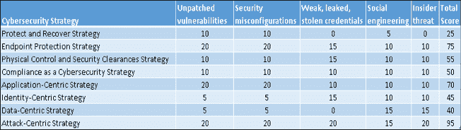

# 八、云——实现安全性和合规性的现代方法

云提供了一种现代化的安全性和合规性方法。本章将介绍一些概念，这些概念将有助于尚未完全接受云计算的 CISOs 以及安全和合规专业人员了解云计算的背景。

在本章中，我们将讨论以下主题:

*   应用程序接口的力量
*   自动化的优势有助于缓解网络安全常见的疑点
*   云中的网络安全策略
*   加密和密钥管理

让我们先来看看云与我们一直在内部进行的工作有何不同。

# 介绍

2006 年商业云计算的出现在一些组织中引发了大量关于云是否可信以及它是否与内部 it 环境一样安全的辩论。然而，对于许多组织来说，云代表的不仅仅是新技术。简单来说，云代表着变化。让我们面对现实吧，对于一些组织来说，变革很容易，比如初创公司，而对于大型、成熟和高度监管的组织来说，变革可能更困难，比如金融服务机构或公共部门中的一些垂直行业。

通常，这些组织中的 CISO 是变革的反对者，在 ciso 对变革有一定控制权的 it 环境中，他们的运作方式就好像理想的结果是与攻击者僵持不下。只要没什么变化，他们就能保持这种相对成功的状态，继续提高。然而，当然，事物是不断变化的；只是我们这些忙碌的人需要时间才能注意到。跟不上技术进步步伐的企业会落后于竞争对手，并成为试图扰乱其行业的初创公司的牺牲品——狼总是在门口。然而，CISOs 希望在获得成功后维持现状，这无可厚非。然而，不花时间假装自己是首席技术官的首席信息官们会给他们的组织带来伤害，因为他们拖了太多的后腿，阻碍了创新。

这并不意味着 CISOs 可以或者应该提倡采用每一种即将出现的新技术。然而，经过十多年的争论，结论是明确的-云是安全和合规专业人士的游戏规则改变者。本章将概述云如何成为伟大的网络安全人才放大器，帮助组织执行其当前的网络安全策略，甚至采用更现代的方法来实现安全性和合规性。让我们先快速介绍一下云计算。

# 云计算有什么不同？

在 IBM、甲骨文、阿里巴巴等云服务提供商(**CSP**)中，全球最受欢迎的三大 CSP 是**亚马逊网络服务** ( **AWS** )、微软和谷歌。这些 CSP 通常被称为超大规模 CSP，因为它们的云产品遍布全球。

当组织第一次考虑利用 CSP 提供的服务时，他们中的一些人首先想探讨的话题是安全性和法规遵从性。他们需要了解通信服务提供商如何提供所需的 IT 能力，同时满足或超过行业安全标准、监管标准和他们自己的内部安全标准。我听过很多关于云计算的神话，我也看到云帮助组织实现了他们在自己的内部 IT 环境中不可能实现的事情。在这一章中，我将分享一些我所了解到的关于云的事情，但请注意，这一章以及本书的其余部分所写的所有观点和意见都是我自己的个人观点，而不是我过去或现在的任何雇主的观点。我们开始吧。

尽管云计算正在被世界各地的行业所采用，但这种情况并不均衡，在世界上的一些地区更为缓慢。随着云计算开始受到企业的青睐，服务模型描述使得教育人们云是什么和不是什么变得很容易。三种云计算服务模式成为的热门，包括**基础设施即服务**(**IaaS**)**平台即服务** ( **PaaS** )和**软件即服务** ( **SaaS** )。这些服务模型描述使每个人都更容易理解可用的云服务类型以及它们在每个组织的 it 组合中的位置。例如，组织可以在 CSP 的 IaaS 产品中运行自己的虚拟服务器，如**亚马逊弹性计算云** ( **亚马逊 EC2** )、微软 Azure 虚拟机或谷歌计算引擎。

通信服务提供商基于他们在世界各地建立的大规模物理 IT 基础设施提供服务。随着时间的推移，电信运营商大致围绕的物理基础设施模型是基于 AWS 开创的模型；区域和可用性区域的概念。按照 AWS 的说法，可用性区域是一个数据中心集群，区域是一个可用性区域集群。在电信运营商基础设施的规模和范围以及他们如何利用该模型的组件方面，存在有意义的差异。您可以在每个电信运营商的网站上了解他们的基础设施:

*   **AWS**:[T3】https://aws.amazon.com/about-aws/global-infrastructure/T5】](https://aws.amazon.com/about-aws/global-infrastructure/)
*   **谷歌**:[T3】https://cloud.google.com/compute/docs/regions-zones/T5】](https://cloud.google.com/compute/docs/regions-zones/)
*   **微软**:[T3】https://azure . Microsoft . com/en-us/global-infra structure/regions/](https://azure.microsoft.com/en-us/global-infrastructure/regions/ )

尽管 IaaS、PaaS 和 SaaS 这些术语今天仍被广泛使用，但它们正慢慢变得过时。当它们第一次被创造出来时，CSP 只有少量的服务，这些服务模型有助于描述每个服务是如何部署的。然而，这种情况正在迅速改变。在撰写本文时，上述三家超大规模通信服务提供商提供了数百种云服务。随后，像**容器即服务** ( **CaaS** )、**身份即服务** ( **IDaaS** )和**功能即服务** ( **FaaS** )这样的新的缩写出现了。这种服务的激增一直在加速，因为新服务的开发者可以使用现有的服务作为构建模块。例如，如果一个电信运营商正在开发一项新的云服务，并且他们需要存储，而不是从头开始构建一个新的存储基础架构，他们可以简单地使用一个满足其要求的现有云存储服务。这种方法不仅有助于加速新云服务的开发，还意味着服务可以包含 IaaS、PaaS 和/或 SaaS 组件，模糊了这些旧服务模型描述之间的界限。换句话说，特定问题的解决方案变得比维护服务模型定义更加重要。随着云服务的持续增长，企业将能够为他们想要解决的特定问题购买解决方案，旧的服务模式将变得越来越不重要。

谈到服务模式，一个重要的区别是超大规模 CSP 提供的服务与传统的**托管服务提供商**(**MSP**)提供的服务之间的差异。几十年来，世界各地的许多组织都在利用 MSP。例如，政府倾向于与 MSP 签订长期协议来管理他们的数据中心并为他们提供 IT 服务。至少出于几个原因，MSP 在这样的组织中扮演了重要的角色。首先，MSP 成功地保持了大量的 IT 人才，否则企业很难吸引和留住他们。第二，MSP 变得非常熟悉他们客户的 IT 环境，因为他们管理这些环境；这种部落知识提供了企业所需的连续性，以便在关键员工离职时最大限度地减少潜在的中断。当然，MSP 也为他们的客户提供其他好处。

越来越多的组织希望从资本支出模式转移到 OPEX 模式，在这种模式下，他们不必预先进行大量投资，并希望他们的容量和利用率估计是正确的；只为他们使用的特定资源付费更有效率。MSP 和 CSP 可以帮助他们的客户实现这一转变。然而，MSP 往往有一个基于外包的业务模型，其中 CSP 提供一个用于转型的自助服务模型，而不是复制现有流程。

第一次考虑使用云的企业容易犯的一个错误是，认为 CSP 只是 MSP 的另一种形式。他们不是。超大规模通信服务提供商提供了一种极具可扩展性和灵活性的自助服务 IT 模式，其客户只需为他们使用的服务付费，以计算秒和他们存储或通过网络传输的数据量来衡量。任何持有信用卡的人都可以开立一个账户，并访问数百项服务，而在内部部署或 MSP IT 环境中构建这些服务的成本极其高昂。当客户使用完电信服务提供商的服务后，他们通常可以不带任何义务地离开。

相反，MSP 代表他们的客户管理数据中心和系统。由于物理构建数据中心和在其中运行的系统需要前期投资，MSP 模型通常需要长期合同来确保 MSP 可以从其投资中获得适当的回报。这种模式使中小企业及其客户处于不利地位。电信运营商将费用分摊给全球数百万客户，而移动运营商需要服务的客户数量要少得多，他们必须自己支付所有费用。一些 MSP 为他们的客户构建了自己的私有云，试图模仿云计算的弹性和其他特征。然而，根据我的经验，术语*私有云*是对有限规模、有限服务和缓慢变化的委婉说法。在某些情况下，私有云只是一个外包的数据中心。将这些与超大规模通信服务提供商提供的一系列服务进行比较，并不是真正的点对点比较。随后，许多 MSP 发展了他们的产品和服务，在 CSP 的服务之上运行。这很有意义，因为它们也可以从超大规模 CSP 提供的经济规模中受益。

他们通过大幅降低资本支出、获得几乎无限的产品规模，以及让自己能够以难以置信的速度创新来实现这一目标，而这可能是他们自己无法实现的。对于 MSP 来说，为客户设计、构建和管理系统是一个巨大的机会。但是，他们可以将更多精力放在创新上，而不是关注 IT 基础架构管理。他们还可以为客户提供更好的安全性。在本章中，我将讨论云可以提供更好的安全性和合规性的一些方法。

未能理解 CSP 和 MSP 之间的区别会让组织在评估云的安全性和合规性时慢下来。许多组织花费大量时间试图了解如果他们选择利用云，他们将如何维持现状。然而，正如我前面提到的，云代表变化；当组织第一次考虑使用云时，协调这两件事是他们面临的首要问题之一。这种调和可以以几种不同的方式表现出来。让我给你举几个例子。

正如我前面提到的，作为一个群体，超大规模通信服务提供商为他们的客户提供数百种服务。尽管如此，许多企业仍然选择将应用程序提升并转移到云中。这通常意味着他们将一直在本地 IT 环境中的服务器上运行的应用程序放到云中托管的服务器上运行。这种向云的过渡使他们能够维持他们多年来一直使用的人员、流程和技术，同时从资本支出转向 OPEX。对于许多组织来说，这是完全自然的，因为他们拥有在内部 IT 环境中构建和管理这些系统的深厚专业知识，并且当他们将这些相同的系统迁移到云中时，他们可以继续利用这些专业知识。在云中，他们可以利用他们一直在内部使用的相同或相似的硬件和软件。随后，这种类型的转换可以相对容易和快速。

提升和转移应用程序的挑战在于，复杂性、低效率和技术债务也会随着应用程序转移到云中。尽管如此，对于一些组织来说，这种类型的过渡可能是未来更大更好的事情的起点。

通常，一旦组织开始使用云，开发一些专业知识并探索其更广泛的功能，他们在未来会更广泛地使用它。他们不是提升和转移更多的应用程序，而是重新平台化应用程序，重新购买应用程序，或者使用云原生功能重构应用程序。随着时间的推移，他们不再像管理内部 IT 那样管理云，真正的创新开始蓬勃发展。然而，对于一些组织来说，这种转变和发展需要时间。

为了加快速度，一些组织决定采取大胆的大动作。他们决定将任务关键型应用程序迁移到云中，而不是将遗留应用程序提升和迁移到云中。他们的逻辑是，因为应用程序对业务至关重要，所以第一次就能做好，他们在这个过程中学到的东西可以应用于所有其他不太重要的应用程序，这些应用程序会跟随 it 走向云；这种方法将加速他们的数字化转型，并帮助他们有可能超越他们的弱小竞争对手。

一些 CISOs 努力应对云所代表的变化，并试图维持现状。这是因为他们已经在其组织的当前 IT 环境中成功地管理了他们的网络安全计划。对于一些组织来说，变更可能会带来风险。我最常看到的例子是企业安全团队用来确定新解决方案是否满足其安全标准和要求的安全评估。此类评估旨在确定在通过新解决方案处理、存储和传输组织的数据时，是否有一套最低限度的控制措施来保护这些数据。例如，一个评估问题可以确定新解决方案是否使用最新版本的**传输层安全** ( **TLS** )协议来保护传输中的数据。另一个评估问题可以确定解决方案中的静态数据是否使用特定算法加密。另一个评估问题可能是供应商是否有特定的第三方安全证明或认证，例如 ISO 27001。

在一些组织中，当新的基于云的解决方案提交给安全团队进行安全评估时，他们会应用他们一直用于评估其内部 IT 环境中的新解决方案的相同评估流程。这似乎是合理的；毕竟，评估检查解决方案是否符合组织的安全标准。

这些年来，我看到的一些安全评估问卷非常详细，包括数百个问题。这些调查问卷中有许多是经过多年开发的，并且已经过定制，以反映使用它们的组织的特定 IT 环境和法规遵从性要求。

然而，这种评估问卷中的许多问题是基于一些关键的基本假设；例如，假设评估员将物理访问硬件以回答他们的问题。另一个类似的例子是，评估者将评估组织自己管理的系统。我看到的另一个流行的假设是，一个解决方案所使用的技术永远不会偏离当前商业上可用的技术。例如，解决方案的虚拟化工作负载所运行的虚拟机管理程序，其运行方式与在本地 IT 环境中运行的虚拟机管理程序完全相同。最后一个例子是假设提供解决方案的供应商只有一个解决方案，而没有一个庞大的技术套件或堆栈，可以通过不同的方式组合来解决问题。当这些假设和其他假设中的任何一个不成立时，基于它们的评估就不能完全完成。当这种情况发生时，一些安全团队简单地拒绝一个解决方案，因为他们无法使用他们的可靠的安全评估问卷来确定它是否符合他们的标准。然而，他们评估过程中的明显缺陷是，它不检查解决方案是否符合组织的安全标准，它检查他们的问卷中的问题是否可以按书面形式回答；这是一个微妙但重要的区别。

让我用一个夸张的比喻来说明我的意思。在过去的几十年里，车主可以将他们的汽车带到专业管理的车库进行多点检查。在某些情况下，这些检查是法律规定的，例如排放检查。然而，当第一辆全电动汽车的车主带着他们的汽车进行法律强制排放检查时，他们发生了什么？车库能够处理法律要求的评估吗？那辆车有没有排气管或者催化转换器让修车厂测试？毕竟每辆车*都必须*有这些技术吧？

鉴于汽车修理厂不能像他们几十年来测试汽车一样测试这辆车，他们应该不认证这辆车吗，尽管它超过了汽车排放标准，而这是传统内燃机无法达到的？一些安全团队拒绝基于云的解决方案，因为他们无法像以前那样评估解决方案。

很少有安全团队会自发地质疑他们多年来的评估流程所基于的假设。他们的安全需求不一定要改变。但是，他们需要发展和更新他们的评估流程，以确定新技术是否能够满足或超过这些要求。安全评估的目标是确保新的解决方案满足组织的安全要求，而不是确保他们的安全评估问题永远不会改变。企业需要偶尔质疑他们的假设，以检查它们是否仍然准确和相关。

让我们直接开始吧！接下来，我将分享为什么我认为云是安全和法规遵从性专业人员的游戏规则改变者。

# 安全性和合规性改变游戏规则

云可以通过多种方式让游戏场向有利于防御者的方向倾斜。在这一部分，我将介绍两个安全性和法规遵从性游戏规则改变者。

## API 的力量

**应用程序接口**(**API**)为系统与人类和其他系统的交互提供了的强大机制。有不同种类的 API，但一般来说，API 定义了系统愿意接受的特定输入和它将提供的输出。系统如何处理输入和提供输出的细节可以从视图中抽象出来，从而为想要使用它的人和其他系统简化了系统。换句话说，我不需要为了使用它而知道系统内部是如何工作的。我只需要知道它的 API。我可以调用一个 API，向它传递它需要的信息，然后等待输出，这时软件的魔力就出现了。

魔术在这里是对所有聪明的工程师和开发人员在硬件、固件、操作系统和软件上的工作的委婉说法，这些硬件、固件、操作系统和软件构成了 API 及其系统所依赖的技术堆栈。

API 可以是特定于编程语言的，因此包含在**软件开发包**(**SDK**中。这使得了解 C++、Java 或其他流行编程语言的开发人员能够轻松利用 API。虽然 API 曾经主要由开发人员用来帮助他们开发应用程序，但是操作角色现在也利用 API 来部署和操作 IT 基础架构，从而有助于预示 DevOps 时代的到来。

在云计算环境中，可以从应用程序内部、命令行或 CSP 提供的 web 控制台调用 API。让我给你举几个例子。

假设我们想在 Amazon EC2 中调配和启动五台虚拟机，该虚拟机位于伦敦地区目前可用的三个区域之一。我们可以使用 RunInstances API (AWS，2020):

```
https://ec2.amazonaws.com/?Action=RunInstances
&ImageId=i-030322d35173f3725
&InstanceType=t2.micro
&MaxCount=5
&MinCount=1
&KeyName=my-key-pair
&Placement.AvailabilityZone=eu-west-2a
&AUTHPARAMS 
```

如果我们使用 AWS 控制台做同样的事情，启动实例向导将收集虚拟机的所有配置信息，并代表我们进行相同类型的 API 调用。我们还可以使用 AWS **命令行界面** ( **CLI** )来启动这些虚拟机，指定相同的参数，CLI 将为我们发出相同类型的 API 调用:

```
aws ec2 run-instances --image-id i-030322d35173f3725 --count 5 --instance-type t2.micro --key-name my-key-pair --placement "AvailabilityZone= eu-west-2a" 
```

在运行这个 AWS CLI 命令的系统的掩护下，它将使用 TCP 端口 443 (AWS，2020)上的 HTTPS 协议向 Amazon EC2 发送这种类型的请求。

需要记住的一件重要事情是，API 调用需要认证、授权、完整性和机密性机制。这里就不细说了。

当然，和 AWS 一样，Google Cloud 和微软 Azure 也有类似的 API，并支持一系列编程和脚本语言，以及命令行界面。这是来自 Google 的命令行界面 SDK 的一个例子，首先创建一个虚拟机，然后启动它(Google，n.d .):

```
gcloud compute instances create example-instance --image-family=rhel-8 --image-project=rhel-cloud --zone=us-central1-a
gcloud compute instances start example-instance --zone=us-central1-a 
```

这里可以看到一个类似的例子，关于在微软 Azure 中使用**表述性状态转移**(**REST**)API 创建虚拟机(微软公司，2020)。一旦创建了虚拟机，另一个 API 调用将启动它。这也可以使用 Azure CLI、Azure PowerShell 和 Azure Portal 来完成:

```
{
  "location": "westus",
  "properties": {
    "hardwareProfile": {
      "vmSize": "Standard_D1_v2"
    },
    "storageProfile": {
      "osDisk": {
        "name": "myVMosdisk",
        "image": {
          "uri": "http://{existing-storage-account-name}.blob.core.windows.net/{existing-container-name}/{existing-generalized-os-image-blob-name}.vhd"
        },
        "osType": "Windows",
        "createOption": "FromImage",
        "caching": "ReadWrite",
        "vhd": {
          "uri": "http://{existing-storage-account-name}.blob.core.windows.net/{existing-container-name}/myDisk.vhd"
        }
      }
    },
    "osProfile": {
      "adminUsername": "{your-username}",
      "computerName": "myVM",
      "adminPassword": "{your-password}"
    },
    "networkProfile": {
      "networkInterfaces": [
        {
          "id": "/subscriptions/{subscription-id}/resourceGroups/myResourceGroup/providers/Microsoft.Network/networkInterfaces/{existing-nic-name}",
          "properties": {
            "primary": true
          }
        }
      ]
    }
  }
} 
```

如您所见，使用 API 使这些服务的用户能够部署基础设施，如服务器、防火墙、网络负载平衡器和第三方设备。但是，它也允许我们按照我们希望的方式配置基础架构。例如，在部署服务器时，我们可以指定操作系统、IP 地址、网络安全配置、路由表等等，这是非常强大的。只需一条命令，我们就可以启动一台或十万台虚拟机，所有虚拟机都按照我们希望的方式进行配置。因为我们确切地知道我们的系统应该如何配置，所以我们可以将生产中运行的系统的当前配置与我们的标准配置进行比较，并确定是否有任何差异。我们可以不断地这样做，以便发现可能是妥协迹象的变化。

在内部 IT 环境中，这通常涉及在服务器上部署代理或管理软件来监控配置更改。

许多组织面临的一个挑战是部署和管理来自不同供应商的多个代理和管理套件。每个代理都需要某种程度的管理和安全更新，以确保它不会增加攻击面。通常，首席信息官和首席信息官会想方设法减少系统上运行的代理数量，抵制在其环境中部署更多代理的想法。与此同时，系统配置更改的来源可能包括各种各样的东西—管理员、管理软件、用户、恶意软件、从备份中恢复等等。这使得检测更改和确定系统更改是否是危害的标志变得非常困难。

在云中，由于一切都是通过 API 发生的，API 为可见性和控制提供了完美的瓶颈。如果组织能够监控他们的 API 调用，并根据发生的情况采取行动，他们将拥有更好的可见性和控制力。在这种环境中，将代理和管理软件部署到数百或数千个系统是可选的，因为 API 是嵌入到云中的。如果组织有规定特定控制配置的法规遵从性要求，他们可以监控这些控制以确保它们始终合规。

实际上，出于这个目的，API 调用被记录到 API 日志服务中。例如，AWS CloudTrail 是一个 API 日志服务，它在 AWS 帐户中记录 API 调用(AWS，2020)。早些时候，当我们在 AWS EC2 中运行启动五个虚拟机的命令时，如果启用了 AWS CloudTrail，它就会记录一个事件来捕获该 API 调用的详细信息。该事件包含大量的详细信息，包括使用了哪个帐户、发出调用的主体、一些身份验证和授权详细信息、时间、区域、调用来自的源 IP 地址、虚拟机的详细信息以及关于其配置的一些详细信息。这些日志可以与其他日志记录数据相结合，由人工和数据分析系统进行汇总和分析，导入云中的 SIEMS 和/或下载到内部 IT 环境中的系统。这些日志对于事件响应调查也是必不可少的。谷歌提供云审计日志(Google，2020)，而微软提供 Azure Monitor(微软公司，2019 年 10 月 7 日)，此外还有其他日志记录机制，目的类似。

以下是 AWS CloudTrail 记录的一个事件的截断示例:

```
{
    "eventVersion": "1.05",
    "userIdentity": {
        "type": "AssumedRole",
        "principalId": "Example:user123",
        "arn": "arn:aws:sts::Example:assumed-role/Admin/user123",
        "accountId": "Example-ID",
        "accessKeyId": "Example-access-key",
        "sessionContext": {
            "sessionIssuer": {
                "type": "Role",
                "principalId": "Example-principle",
                "arn": "arn:aws:iam::Example:role/Admin",
                "accountId": "Example-ID",
                "userName": "Admin"
            },
            "webIdFederationData": {},
            "attributes": {
                "mfaAuthenticated": "false",
                "creationDate": "2020-04-01T05:09:15Z"
            }
        }
    },
    "eventTime": "2020-04-01T05:09:26Z",
    "eventSource": "ec2.amazonaws.com",
    "eventName": "RunInstances",
    "awsRegion": "eu-west-2",
    "sourceIPAddress": "169.254.35.31",
    "userAgent": "aws-cli/1.3.23 Python/2.7.6 Linux/2.6.18-164.el5 ",
    "requestParameters": {
        "instancesSet": {
            "items": [
                {
                    "imageId": " i-030322d35173f3725",
                    "minCount": 1,
                    "maxCount": 5,
                    "keyName": "my-key-pair"
                }
            ]
        },
        "instanceType": "t2.micro" 
```

概括地说，与云的每一次交互都是通过 API 调用进行的。这种模式有许多好处，包括安全性和合规性好处。因此，云提供的可见性和控制优于大多数内部 IT 环境，更不用说这种方法的简单性和成本优势了。此外，它还支持新的 it 和安全运营方法。例如，我们知道我们部署的每个系统都配置为符合我们的安全性和合规性标准，因为这是我们用来部署它们的代码中的定义。由于存储和网络与计算服务分离，没有什么可以阻止我们每隔几小时就简单地关闭系统并部署新系统来替换它们。正如我们前面看到的，只需要脚本或应用程序中的几行代码就可以做到这一点。如果系统的寿命很短，管理员和管理软件就更难随着时间的推移引入安全错误配置，攻击者可以利用这些配置在环境中获得立足之地。

API 是强大的，但是它们也必须被正确地实现，这样它们才不会产生漏洞百出的攻击面。当然，通信服务提供商知道这一点，并在他们的 API 开发中使用专业知识、流程和技术来最小化风险。认证和授权机制、保护、监控、检测、响应和审计功能层；APIs 摇滚！

我在这里讨论了一个场景，即使用 API 来配置和启动虚拟机。现在，想象一下，如果你可以使用 API 来控制数百个执行各种功能的云服务，如计算、存储、网络、数据库、容器、无服务器计算、人工智能、机器学习、物联网和安全，仅举几例。想象一下，在世界上的任何地方，以几乎任何规模对所有这些进行编程控制，这真的很神奇。这就是 API 的力量！对于安全和法规遵从性专业人员来说，它们确实是游戏规则的改变者。API 的威力不仅适用于拥有大量 IT 预算的大型组织；任何有信用卡的人都可以用 CSP 开一个账户，并获得这些 API 的能力。接下来，让我们看看另一个改变游戏规则的因素，自动化。

## 自动化的优势

正如我们已经看到的，API 的力量使我们能够使用代码配置和控制云中的大多数东西，甚至是基础设施。为了充分利用 API 的能力，云提供了高度的自动化。除了运行 CLI 命令，您还可以使用脚本、模板、应用程序和云服务来自动化复杂的工作流。

CSP 提供丰富的自动化功能。这些功能分布在不同的云服务上，就像它们利用的 API 一样。一些有助于实现某些功能自动化的服务示例包括微软 Azure Automation(微软公司，2018 年 10 月 18 日)、谷歌云编辑器(谷歌，2020 年)和 AWS CloudFormation (AWS，2020 年)。还有第三方提供的自动化解决方案，如 Chef (Chef，2020)、Puppet (Puppet，2020)、Ansible (Ansible，2020)、Terraform (Hashicorp，2020)等。

对于安全和合规专业人员来说，所有这些自动化功能和工具都有助于供应、配置、管理、监控、重新配置和取消供应基础架构和其他云服务。此外，这些丰富的自动化功能有助于保护、检测、响应和恢复，同时符合监管标准、行业标准和内部安全标准。在许多情况下，所有这些都可以近乎实时地发生，因为是自动化而不是人类在执行这些操作。

事实上，减少这些操作中的人工参与有很多好处。回想一下我在*第一章*、*成功的网络安全策略*中详细讨论的网络安全常见疑点；让我们看一些自动化如何帮助我们减轻这些问题的例子。让我们先来看看内部威胁和社会工程。

### 减轻内部威胁和社会工程

请记住我之前定义的两种类型的内部威胁:恶意的内部人员滥用他们对资源的特权访问，以及非恶意的内部人员犯错误导致糟糕的安全结果。自动化有助于缓解这两种类型的威胁。例如，我们开发、测试和实现的自动化程度越高，管理员犯下具有安全后果的错误的机会就越少。

使用自动化来完成可重复的流程可以带来更一致、更快速的结果，更不容易出现人为错误。

自动化管理流程还会减少恶意内部人员采取行动的机会。这就是*即时管理*和*刚好够用管理*的概念可以发挥作用的地方。随着高度自动化的实现，管理员对系统的访问要求将会降低，从而减少了他们窃取数据或破坏基础架构的机会。高度自动化的环境也使得检测管理员何时访问系统变得更加容易，因为这种情况是规则的例外。当恶意内部人员知道当他们直接访问数据和系统时，他们的可见性和审查会增加，他们在没有合法理由的情况下尝试访问资源的频率就会降低。

自动化有助于最大限度地减少管理员的访问权限。例如，不允许管理员完全访问他们所连接的系统，而只允许他们在这些系统上运行预先测试和批准的脚本和自动化将减少他们运行任意命令的机会。有了足够的自动化，管理员只有在现有自动化无法解决问题的“破碎玻璃”场景下才有理由运行任意命令。可以对这些案例进行监控和审计，以减少恶意内部人员采取行动的机会。在这种情况下，对两个或更多参与者采用基于法定人数的管理程序也有助于减轻内部威胁。随着时间的推移，增加更多的自动化来覆盖更多的支持场景，可以大大减少管理员运行任意命令的机会。

使用自动化还有隐私方面的好处。如果人类无法访问敏感数据，那么他们就无法接触到**个人身份信息** ( **PII** )或**受保护的健康信息** ( **PHI** )，或者敏感的财务信息。使用自动化来代替人工与数据交互，有助于组织实现他们对客户或公民的隐私承诺。

听起来很棒，对吧？也许好得不像真的？难道我们不能通过使用堡垒主机和安全外壳(SSH)会话在内部 IT 环境中实现这一点吗？很棒的问题。让我们看一个真实世界的例子。

本例中安全团队的要求是管理员不能直接访问他们管理的系统。这意味着使用 SSH 直接访问系统不能满足需求。如果他们确实使用 SSH 来访问这些系统，那么他们可能能够在这些系统上运行任意命令，这是他们想要避免的。

在这个场景中，安全团队还希望限制堡垒主机在其环境中的使用。过去他们已经被堡垒主机烧毁了。堡垒主机通常跨越较高安全区域和较低安全区域，允许管理员从较低安全区域访问较高安全区域中的系统；随后，需要将堡垒主机作为更高安全性区域的一部分进行管理。事实证明，这可能比听起来更难，这个虚构组织的流程失误导致了其环境中的系统受损。经历过一次失败后，他们希望最大限度地减少环境中堡垒主机的数量。

例如，使用 AWS 满足这些需求的一种方法是使用 AWS 系统管理器服务在 Amazon EC2 服务中运行的虚拟机上运行命令。为此，将在这些虚拟机上安装 Systems Manager 代理。正确配置该代理后，管理员可以从 AWS Systems Manager 控制台运行经过测试和批准的脚本，这些脚本将通过 Systems Manager 代理(AWS，2020)在这些虚拟机上执行。

这种方法有几个很酷的优点。首先，管理员不需要拥有他们所管理的虚拟机的管理员凭据。因为他们正在云中运行 AWS Systems Manager 服务的脚本，所以他们不需要本地凭证来访问单个系统。如果管理员不知道这些系统的用户名和密码，他们就无法直接登录这些系统。他们仅限于从云中运行经过测试和批准的脚本。这有助于降低这些系统面临内部威胁的风险。

这种方法也减轻了与这些系统上的社会工程相关的一些风险。管理员不会因为不了解这些系统而被诱骗放弃这些系统的凭据。由于管理员与这些系统交互的唯一方式是在这些系统上远程运行预先批准的脚本，因此他们不会被诱骗运行任意命令或安装新软件，这可能会破坏这些系统的安全性并导致不良的安全后果。当然，考虑到社会工程是多么阴险，这种方法必须与其他一些缓解措施结合起来才能完全缓解它；比如针对 AWS 账号本身的**多因素认证** ( **MFA** )。然而，我希望您能够看到这种方法在减轻针对管理员的典型社会工程攻击方面的潜在优势。当管理员只在需要时访问，并且访问受到严格的范围和控制时，典型的社会工程策略成功的机会就更少了。

请记住，使用云的一大优势是可伸缩性。如果我们使用自动化在部署的每台虚拟机上安装 Systems Manager 代理，我们将能够根据需要在任意多的系统上使用这种管理方法——规模实际上是无限的。使用自动化，我们可以使用相同的技术和工作量管理三个或三千个系统。随着我们管理的系统数量的增加或减少，管理员不需要额外的工作，因为他们运行相同的脚本，而不管他们管理的系统数量；管理更多的系统并不意味着管理员有更多的访问权限。

如果我们在 AWS CloudTrail 中记录由管理员与 AWS Systems Manager 服务的交互所生成的 API 调用，那么他们的活动可以被近乎实时地监控和审计(AWS，2020)。我们还可以监控和审核管理员与虚拟机本身的任何交互，以确保管理员仅在发生中断事件时访问这些系统。

当然，其他 CSP 也有丰富的自动化功能。例如，微软提供了一系列服务和功能来帮助，包括 Azure Automation、Azure PowerShell、Azure Monitor 等。谷歌还提供几项服务，包括云监控、云功能和云资产清单等。

自动化允许我们设计不经常需要直接人机交互的系统。这使得更容易检测这些事件何时发生，并更好地缓解内部威胁和社会工程。接下来，让我们看看在这种情况下，如何缓解网络安全的另一个常见问题，即未打补丁的漏洞。

### 缓解未打补丁的漏洞

让我们看看如何使用自动化来帮助管理我们使用的虚拟机上的漏洞。正如我们在*第 2 章*、*利用漏洞趋势降低风险和成本*中所看到的，漏洞管理团队每天都要面对多达 45 个新的漏洞披露，这些漏洞可能会影响他们的系统。云中的自动化有助于减少与清点系统、扫描系统和修补系统相关的工作量。

例如，回想一下我在第 2 章中写的，准确的清单对漏洞管理团队至关重要。在云中，因为不使用 API 就不会供应或取消供应，所以 API 和自动化有助于快速提供准确的清单。像这样清点环境不需要几个小时或几天，几乎可以瞬间完成。

有许多方法可以用来扫描和修补云中的虚拟机。在我们的 AWS 示例中，AWS 系统管理器可用于修补系统。此外，您的组织在内部 IT 环境中用于漏洞管理软件的供应商也有可能拥有为云构建的类似功能。这使您的组织能够利用其在内部 it 环境中管理漏洞所积累的专业知识，并继续在云中利用它。

您可能想知道，当系统的数量可以完全动态地扩展和缩减以满足负载和应用程序可用性目标时，漏洞管理流程对运行在云中的虚拟机有什么潜在影响。在这种情况下，例如，Amazon EC2 Auto Scaling 可以用来实现这一点(AWS，2016)。它还可以帮助系统保持最新。可以使用自动扩展来大幅减少这一工作，而不是扫描和修补一大群系统中的每个系统。为此，扫描用于构建虚拟机的 Amazon 机器映像以查找漏洞，并根据需要安装安全更新以确保映像是最新的，测试以确保它按预期工作。然后，关闭基于该映像旧版本的生产环境中运行的虚拟机。根据您为自动扩展设置的负载和可用性规则，当自动扩展决定启动新的虚拟机时，它会使用您刚刚修补和测试的映像来执行此操作。当新的虚拟机启动时，它是完全修补的。您可以使用自动化来有意识地关闭正在运行的虚拟机，这些虚拟机基于旧映像，自动扩展将重新启动新的、完全修补的虚拟机来替换它们。无需扫描，无需打补丁，减轻了重启带来的痛苦。对于大型企业来说，这是一种更简单的方式来做一些长期以来的棘手问题。

谷歌和微软也提供工具来有效地发现和减少漏洞。例如，谷歌提供操作系统库存管理、操作系统补丁管理(目前处于测试阶段)和云安全扫描器，而微软提供 Azure Automation 和 Azure Security Center 等工具。有许多第三方供应商为云环境提供漏洞管理解决方案，包括 Qualys、Tenable、IBM QRadar 等。

当然，这只是执行修补的一种方法——还有其他方法。通过使用 CSP 为您管理的服务，还有可能完全消除修补。正如我在本章前面提到的，IaaS 只是云中的一种服务；电信运营商提供了数百种服务，完全不需要您配置、管理和修补服务器。如果你不需要自己管理服务器，又何苦呢？

让 CSP 为您管理基础设施，您可以将通常用于此类任务的时间用于减少其他领域的技术债务、似乎永远无法完成的项目工作或创新——想象一下。想象一下，花时间弄清楚如何使用无服务器计算、AI、ML 和 IoT 来更好地保护、检测和应对威胁，而不是测试补丁和重启服务器。

云肯定有助于减少未打补丁的漏洞，并使这比在大多数内部环境中容易得多；困扰企业几十年的事情。现在，让我们看看云中的自动化如何帮助减轻另一个常见的网络安全嫌疑，即安全错误配置。

### 减少安全错误配置

正如我在*第 1 章*、*成功网络安全策略的要素*中所写的那样，安全错误配置可能是硬件、操作系统和应用程序中糟糕的默认设置，也可能随着时间的推移而发生，因为系统根据管理员或软件更新引入的调整“偏离”了其组织的标准。此外，在大型 IT 环境中，废弃的技术可能会很快成为被遗忘的风险，得不到积极的管理。由于大型企业一直在努力保持事物按照他们需要的方式配置，变更管理成为一门成熟的 IT 学科，受到整个行业供应商的支持。这一点很重要，不仅是出于安全目的，也是出于合规目的。确保系统符合监管标准、行业标准和内部 IT 标准非常重要，在许多情况下也是必需的。

在我们的示例场景中，组织可以选择在他们部署在云中的服务器上安装管理软件。他们可以像在本地 IT 环境中一样，继续测量和修复配置更改。

他们还可以利用 API 的强大功能和内置于云中的自动化功能。例如，AWS Config 是一个云服务，它监视资源的配置更改，并使您能够基于这些更改采取一系列的操作。

在我们的示例场景中，安全团队可能决定应该自动修复一种类型的变更；当检测到更改时，自动化会将配置更改回其标准设置。或者，为了安全起见，可以使用自动化来关闭配置错误的系统，如果启用了自动扩展，将启动一个符合组织所有标准的新系统来替换它。

安全团队可能会认为另一种类型的变更是需要由他们的事件响应团队进行调查的妥协迹象。在这种情况下，自动化可以拍摄虚拟机的快照，创建一个新的**虚拟私有云**(**VPC**)—姑且称之为 *IR 洁净室*—将快照复制到隔离的 IR 洁净室，将 IR 团队的取证软件连接到映像，向 IR 团队发送消息对其进行调查，并关闭原始虚拟机。如果进行了配置，自动扩展将启动一个符合所有批准标准的全新虚拟机来取代它的位置。这一切几乎都是实时完成的。请注意，在这些示例中，虚拟机上没有管理软件或代理，也没有 SOC 分析师执行手动查询来寻找危害迹象。由于基础设施是代码，我们可以自动化任意数量的操作来满足组织的需求。

在法规遵从性环境中，该功能非常强大，因为它可以帮助保持配置符合标准。当我们使用自动化来检测变更并采取适当的行动时，我们也可以使用该自动化来生成法规遵循工件，这将帮助组织证明对适用于它们的特定标准的持续遵循。这有助于减少错误配置系统的手动审核和手动补救。

微软 Azure Automation 和谷歌云资产清单为各自的服务提供了类似的功能。也有第三方提供自动化解决方案，如 Ansible、Chef、Terraform 等。

接下来，让我们看看云中的自动化如何帮助缓解网络安全的最后一个常见问题:脆弱、泄露和被盗的密码。

### 减少弱密码、泄露密码和被盗密码

通信服务提供商和众多第三方供应商为云和混合环境提供身份和访问管理解决方案。例如，微软通过 Azure Active Directory **特权身份管理** ( **PIM** )(微软公司，2020 年)提供 Azure Active Directory 和支持服务，如即时特权访问能力。第三方，如 Aporeto、Centrify、CyberArk 和许多其他公司也提供服务，可以在不同的情况下帮助一些人。Google Cloud 提供云身份和访问管理，AWS 提供 AWS 身份和访问管理。

通信服务提供商提供 MFA，正如我在*第 1 章*、*成功网络安全策略的要素*中所讨论的，这是一种非常有效的控制，可以在很大程度上减少脆弱、泄露和被盗的密码。利用 MFA 并限制用户在两次身份认证请求之间访问资源的时间，可以使攻击者更难成功使用窃取和泄露的凭据。使用秘密管理器来管理访问密钥、证书和凭证以便定期自动改变和轮换它们也是有效的。为此，谷歌提供了谷歌云秘密管理器(Google，2020)，微软提供了 Azure Key Vault(微软公司，2020)，AWS 提供了 AWS 秘密管理器(AWS，2020)。同样，有许多第三方供应商也提供解决方案，包括 Docker Secrets、SecretHub、知己等。

事实上，在身份和访问服务和解决方案中有如此多的能力和功能，整本书都致力于这一主题领域。身份是安全的关键。我强烈建议花些时间了解 CSP 和其他供应商提供的强大的身份和访问功能。

## 安全性和法规遵从性游戏规则改变者—摘要

API 的强大功能和云中的自动化是安全和法规遵从性专业人员的两大改变因素。这并不是说本地 IT 环境中没有 API 和自动化。然而，投资和努力使这些功能等同于那些嵌入到云中的功能将会非常昂贵，并且难以实现；考虑到任何持有信用卡的人，只要花几分钟时间在 CSP 开户，就可以默认获得这些功能，因此很难证明实现内部版本是合理的。

我们现在已经看到，云可以提供一些有效和创新的方法来解决所有网络安全的常见问题。换句话说，云使解决网络安全基础问题比在内部 IT 环境中减轻它们更容易。我们在这里仅仅触及了皮毛，因为我在本节中使用的示例场景是一个 IaaS 示例。正如我提到的，通信服务提供商提供数百种服务，涵盖并融合了 IaaS、PaaS、SaaS、FaaS、IDaaS 等。更不用说，我没有深入研究这些电信运营商提供的任何安全服务。整本书都致力于云安全这一主题。

现在让我们看看云如何支持我们在第五章、*网络安全策略*中研究的网络安全策略。

# 在云中使用网络安全策略

在*第五章*、*网络安全策略*中，我们考察了过去二十年中我所见过的在行业中采用的几种网络安全策略。我们使用**网络安全基础评分系统** ( **CFSS** )评估了这些策略。每个策略的 CFSS 分数估计值有助于我们了解它们在解决网络安全基础问题方面的表现。为了提醒您，在*表 8.1* 中提供了每个策略的 CFSS 得分汇总:

<figure class="mediaobject"></figure>

表 8.1: CFSS 评分评估汇总

几乎所有这些策略都可以在云中使用。现在让我们来看看在云环境中的一些策略。

## 在云中使用保护和恢复策略

通信服务提供商提供精细的防火墙和网络控制，可以帮助组织采用和实现保护和恢复策略。API 和云中自动化的强大功能使网络团队和安全团队能够供应和操作 Web 应用程序防火墙，以及位于云资产边缘的网络防火墙，并构建和操作 dmz。除了网络 ACL、路由表、子网规则、基于主机的防火墙等之外，它们还提供虚拟私有云或虚拟网络，为网络流量增加了另一层控制。通信服务提供商通常提供令人眼花缭乱的网络控制。

由于所有这些控制都可以通过代码和自动化来供应和监控，因此在云中执行这种策略比在内部执行要容易得多。在云中，不需要订购和接收硬件，不需要在数据中心进行机架安装和堆叠，也不需要更多机架空间、电力或冷却。你只需要运行代码，CSP 会做所有其他的事情。如果你需要扩大或缩小你的基础设施，只需要更多的代码和自动化。您只需为您所使用的内容付费，并且可以在您的组织决定关闭时随时关闭它。正如我们在*第 5 章*、*网络安全策略*中所讨论的，保护和恢复策略是一种糟糕的评分策略。它可以与其他策略结合使用，以更全面地解决网络安全的基本问题。在云中扩展这种策略也更容易，因为一切都是代码。现在让我们来看看更好的得分策略。

## 合规性是云中的一种网络安全策略

让我们看看*第 5 章*、*网络安全策略*中的另一个策略，合规作为一种网络安全策略。在本章的前面，我们看到了云中的 API 和自动化如何帮助减少安全错误配置。这些相同的功能可以帮助组织持续遵守安全标准，无论是监管标准、行业标准还是内部标准。我已经讨论了 API 和自动化如何确保系统得到正确配置，并持续监控配置变化。然而，在执行这一策略时，需要注意一个重要的细微差别。

许多第一次考虑使用云的安全团队和合规团队想知道他们如何证明他们符合标准，也就是说，当他们不拥有运行基础架构的数据中心，并且随后无法让他们的审计员访问这些设施时。不管谁拥有数据中心，许多组织仍然必须向他们的审计员和监管者证明他们符合要求的标准。

在大多数情况下，这是利用超大规模 CSP 的另一个优势。AWS、谷歌和微软的云服务都有大量的认证和证明。例如，ISO27001 是当今所有 CSP 的竞争对手，他们都必须获得该认证，以满足其企业客户的要求。有两种认证对许多 CISOs 来说是最有价值的。

首先是美国协会 CPAs 的**系统和组织控制** ( **SOC** )，特别是 SOC2 Type II 认证(AICPA，2020)。至少有几个因素使这一认证对 CISOs、安全团队和合规团队很有价值。首先，SOC2 Type II 中审计的控制范围通常回答了企业关于安全性的大多数问题。第二，这不是控制设置或架构设计的“时间点”快照；追求 SOC2 Type II 的组织需要 6 个月的持续审计才能实现。组织为准备这种类型的审计而采取的步骤可以极大地改善他们的安全状况。然后，要获得这种认证并长期保持下去，并不断证明服务是按照描述的方式运行的，这可能是一个巨大的挑战。许多企业甚至从未试图获得这一认证，因为这很难做到，而且可能很昂贵。然而，超大规模通信服务提供商在其许多服务中获得并保持这一认证，以保持其安全标准在行业中处于最高水平。

电信运营商通常会与客户分享 SOC2 Type II 审计报告。对于安全团队和合规团队来说，值得下载这些报告并进行审查，以确保他们评估的解决方案符合或超过他们的标准。SOC2 Type II 审计报告中没有回答的问题可以直接提交给 CSP，他们通常很乐意回答。

许多 CISOs 和安全团队认为很有价值的另一个证明是**云计算合规控制目录** ( **C5** )，由德国联邦政府办公室**联邦信息安全办公室** ( **BSI** )设计(BSI，2020)。C5 是深度安全保证认证。它有许多领域的标准，包括策略、人员、物理安全、身份和访问管理、加密等。同样，这种证明的范围和复杂性可能会使其难以实现和维护。与 SOC2 Type II 一样，对于 CISOs 来说，该证明包含了他们对 CSP 安全控制集的许多疑问的答案。

SOC2 Type II 和 C5 就像是 CISOs、安全团队、合规团队和审计员的安全信息宝库。通信服务提供商通常将这些与许多其他认证和证明结合起来，以帮助他们的客户证明他们符合合规性要求。然而，通信服务提供商的客户也在其中扮演着重要角色。请记住，电信服务提供商不同于**托管服务提供商**(**MSP**)。电信运营商提供自助服务云。他们的客户和 ISV 可以基于这些云构建解决方案。但是，CSP 的“认证”和“证明”范围并不包括由客户设计和操作的解决方案部分；与 MSP 不同，CSP 通常没有这样做所需的可见性或访问权限。

这种安排意味着通信服务提供商和他们的客户都要对他们设计和运营的解决方案的各自部分负责。谷歌、微软和 AWS 都将这种安排称为*共同责任*。通信服务提供商和他们的客户都提供适当的认证和证明，以证明他们各自的解决方案部分满足他们必须遵守的标准的要求。这种安排通常可以为通信服务提供商的客户节省时间和金钱。这是因为在几乎所有情况下，他们必须证明的解决方案部分可以显著减少。例如，由于通信服务提供商的客户并不拥有运行其基础设施的数据中心，他们实际上已经将审核和认证这些数据中心的责任委托给了他们的通信服务提供商。换句话说，他们不再需要处理物理数据中心的复杂性和成本，因为通信服务提供商为他们做了这些。这对通信服务提供商的客户来说是一个胜利，因为他们可以达到或超过他们负责的安全标准，同时减少他们的工作量和成本。

关于 CSP 运作的合规项目的信息可以在他们各自的网站上找到，但是审计报告本身通常是为 CSP 的客户保留的；以下是包含 AWS、Google 和 Microsoft 合规计划信息的位置:

*   **AWS**:[T3】https://aws.amazon.com/compliance/programs/T5】](https://aws.amazon.com/compliance/programs/)
*   **睁眼**:https://cloud.google.com/security/compliance/[T3T5】](https://cloud.google.com/security/compliance/)
*   **微软**:[T3】https://docs . Microsoft . com/en-us/Microsoft-365/compliance/offering-home？view = o365-全球](https://docs.microsoft.com/en-us/microsoft-365/compliance/offering-home?view=o365-worldwide)

API、自动化和 CSP 提供的认证和证明的结合可以帮助希望将合规性作为网络安全策略的组织。对于希望扩展这一策略以全面解决网络安全基础问题的组织来说，云通常比内部 IT 环境更容易做到这一点。这是因为我们已经讨论过的 API 和自动化功能。一切都是代码。让我们再来看一个我们在第五章、*网络安全策略*中研究过的策略，以及如何在云中实现它。

## 在云中使用以攻击为中心的策略

在我们研究的所有策略中，得分最高的是以攻击为中心的策略。在*第 6 章*、*策略实现*中，我们深入探讨了这个策略，并举例说明了它的一种实现方式。在*第 7 章*、*衡量表现和有效性*中，我们研究了一种衡量该策略有效性的方法。然而，这种策略能在云中实现吗？

这个问题的简短答案是，是的，它可以在云中实现。在某些情况下，想要在云环境中实现这一策略的组织已经完成了一些工作。例如，MITRE 提供了“战术和技术[原文如此],代表了涵盖基于云技术的企业的 MITRE ATT 和 CK 矩阵。该矩阵包含以下平台的信息:AWS、GCP、Azure、Azure AD、Office 365、SaaS。”(MITRE，2019 年 10 月 9 日)。

我在*第六章*、*策略实现*中提到，米特 ATT & CK 框架可以补充我们深入研究过的入侵杀伤链模型(Eric M. Hutchins、Michael J. Cloppert、Rohan M. Amin 博士)。杀伤链方法也可以在云中实现。要做到这一点，您可能需要像我们在*第 6 章*中所做的那样，为您在云中实现的解决方案制定一个行动方案矩阵(Eric M. Hutchins、Michael J. Cloppert、Rohan M. Amin 博士)。换句话说，由于这可能是一项耗时的工作，正如您所看到的，您不需要为 CSP 提供的每个云服务构建一个行动方案矩阵，只需为您计划使用的云服务构建即可。

在某些方面，为针对 IaaS 环境开发的解决方案执行此操作类似于为内部 IT 环境执行此映射。这是因为许多硬件和软件可能是相同或相似的。例如，为运行在 Linux 或 Windows 上的解决方案确定的操作系统缓解措施将非常相似，无论该操作系统是运行在云中还是内部。然而，正如我们之前所讨论的，除了这些操作系统缓解措施之外，云原生控件和第三方解决方案也可以分层部署到环境中，以实现一组使攻击者更难得逞的控件。例如，帮助我们检测配置更改的相同服务将帮助我们近乎实时地检测云中的危害迹象。我们讨论的相同身份和访问能力将使攻击者更难使用窃取的凭据横向移动。我们谈到的帮助系统保持最新的技术将使攻击者更难找到和利用未打补丁的漏洞。

请注意，尽管 Kill Chain 方法非常适合构建在 IaaS 环境中的解决方案，但这种方法对于使用更高级别的云服务(如托管服务)构建的解决方案帮助不大。在这些情况下，CSP 负责保护底层 IT 环境，通常将底层 IT 基础架构的较少直接访问和较少直接控制留给组织的安全团队。这并不意味着安全团队没有他们需要的可见性和控制力，正如我们已经讨论过的，这恰恰相反。但是，缓解控制的类型可能会不同于为内部或 IaaS 环境开发的传统解决方案。

控制应该是不同的，因为某些威胁和风险肯定是不同的。随后，Kill Chain 可能不是云中组织的最佳评分方法，这取决于他们使用的服务类型。随着企业消费越来越多模糊 IaaS、PaaS、SaaS、FaaS、IDaaS 和其他模型之间界限的服务，杀伤链方法变得越来越不相关。

这不是一件坏事——这只是需要接受更多的改变。请记住，CISOs 和安全团队的角色不是确保现状，而是保护他们组织的数据，即使这些组织决定是时候发展他们使用的技术和流程，以保持竞争力和/或相关性。云不仅提供了技术和流程现代化的机会，也提供了可以采用的网络安全策略现代化的机会。让我们进一步探讨这个概念，看看我在*第五章*、*网络安全策略*中提到的一种更现代的网络安全方法，称为 *DevOps* 。

## devo PS——实现云中安全性的现代方法

由于没有更好的名字，我们姑且称这种方法为 *DevOps* 。与我们研究过的其他网络安全策略相比，这种策略代表了一种更现代的方法。它认识到开发和 It 操作规程已经联合起来，部分原因是这些角色被恰当地定位为利用 API 和自动化的力量。因为一切都是云中的代码，包括基础设施，了解开发和 IT 基础设施运营的团队可以充分利用云所提供的一切。让我们看看开发运维驱动的安全策略如何帮助安全团队在基于云的环境中保护、检测和响应现代威胁。

回想一下第三章、*中的*，威胁格局的演变——恶意软件*，在那里我描述了为什么 Windows 生态系统比苹果 iOS 生态系统有更多的恶意软件。看起来，关键在于软件在这些生态系统中的传统分布方式。微软允许用户将任何人开发的软件轻松安装在他们基于 Windows 的系统上。*

另一方面，苹果为所有面向 iOS 设备的应用程序提供了单一来源，即他们的应用商店。虽然 Windows 用户可以自行决定他们想要运行的软件的可信度，但苹果公司规定了一个安全标准，所有独立软件开发商必须达到该标准，他们的应用程序才能分发到基于 iOS 的设备上。这种软件分发方式的差异，至少部分解释了为什么苹果 iOS 生态系统一直保持着如此低的恶意软件流行率。

让我们吸取这一教训，并将其应用到我们的云安全方法中。利用持续测试、**持续集成** ( **CI** )和**持续交付**或**持续部署** ( **CD** )可以帮助最大限度地减少有问题的软件进入电信运营商客户构建和运营的基于云的环境。在他们的 CI/CD 管道中，他们可以实现自动(和手动)安全和合规性检查。这确保了通过这些管道部署到生产环境中的任何软件或基础设施满足其组织的安全性和法规遵从性要求。

要做到这一点， CI/CD 管道的每一步都将自动进行适当的安全性和合规性检查。例如，一个 DevOps 团队可以开发或获得寻找 OWASP Top 10 (OWASP，2020)中包含的问题的自动化。另一个常见的例子是执行静态代码分析和/或一组特定的功能安全测试的需求。基础设施必须满足每个组织的合规团队定义的控制设置要求，并且这将在项目通过管道时得到验证。

实现这样的测试通常是在代码和自动化中完成的，所以可以进行的检查的数量和类型几乎是无限的。当然，因为这可能是有效和有趣的，一旦一些 DevOps 团队开始开发这些检查，他们将花费更多的时间在 CI/CD 管道的开发上，而不是在应用程序和基础设施上。

如果某个应用程序或基础结构项目没有通过这些检查中的一项，管道将会停止，相应的人员将会收到警报，该项目将不会继续进行，也不会按计划引入到生产环境中。必须解决应用程序或基础设施项目中的缺陷，以便通过失败的检查，然后再次检查整个管道。

这样，只有通过所有安全和合规性检查的产品才能进入生产。这意味着安全和法规遵从性团队可以对引入其生产环境的所有内容都满足其所有安全和法规遵从性要求，并且不会给该环境带来更多风险充满信心。要做到这一点，一切都必须通过 CI/CD 管道。换句话说，将应用程序或基础设施项目投入生产的唯一方法是通过 CI/CD 管道。为了获得最大的成功机会，组织需要有规程以及治理机制来强制执行这个需求。管理多个 CI/CD 管道是一种可预测的常见结果，尤其是对于大型分布式组织。一些组织面临的风险是，CI/CD 管道的数量激增，开始危及最初管道所要求的高安全性和合规性标准；太多的管道可能会变成一个治理问题。

另外，请注意，一些攻击者已经发现越来越多的组织正在使用 DevOps 和 CI/CD 管道。这使得 CI/CD 管道本身成为攻击者的潜在目标。了解您的组织用于管道的技术和自动化堆栈，并采取措施保护它们是非常重要的。对于一些组织来说，CI/CD 渠道可以成为高价值资产，值得特别关注，正如我在*第 1 章*、*中讨论的成功网络安全策略的要素*。

现在，安全和法规遵从性团队对他们的部署充满信心，他们如何长期保持这些环境的原始状态呢？他们可以使用我们在本章前面讨论的服务和自动化来监控配置更改。当配置发生变化时，他们可以使用自动化使其恢复合规性，或者对其变化的方式和原因进行更深入的调查。

正如我们前面所讨论的，云中的漏洞管理有一系列选项。继续使用您的组织在其内部环境中已经使用多年的技术和流程可能是一个可行的选择。

然而，使用自动化，比如我前面提供的自动伸缩示例，有可能简化和加速漏洞管理。另一种选择是组织从管理服务器和应用程序本身发展到使用更高层次的云服务，并将基础架构修补留给电信运营商。

以攻击为中心的策略在行业中如此受欢迎的原因之一是它们可以使“高级”威胁参与者难以成功——所谓的**高级持续威胁** ( **APT** )。然而，这正是 API 的强大功能和高度自动化可以发挥作用的地方。例如，当组织每隔几个小时关闭运行在云中的服务器子集，并用满足所有要求的新服务器替换它们时，攻击者就更难在该环境中获得并保持立足点。短命的、相对不可变的系统留给攻击者的氧气非常少，不像那些运行数月或数年的系统。

云中的检测功能优于大多数内部环境中的检测功能。请记住，云中 API 和自动化的力量提供了很少内部环境能够实现的可见性和控制。云可以使记录 API 调用、网络流量、认证和授权操作、加密/解密密钥操作等变得容易。然而，无论是否使用云，大多数安全团队都面临一个挑战，即所有这些日志中的大量数据使得人类几乎不可能及时查看和使用这些数据。这也是云可以提供帮助的地方。AI 和 ML 服务可以用来代替安全团队成员审查所有这些日志和 API 活动，并确定真正值得他们注意的事情。这是可能的，因为 AI/ML 服务可以根据需要扩展到足够大，以比人类更快的速度处理大量日志数据集。当他们这样做时，这些服务在自动化的帮助下，可以检测和响应各种攻击，包括 DDoS、恶意软件、漏洞利用、内部威胁等等。

最后，如果所有这些功能都无法保护、检测和响应攻击者，DevOps 和云可以使恢复生产环境比在典型的内部环境中容易得多。因为一切都是代码，所以如果进行一些规划和周密的准备，在云中重建环境会相对容易。然而，业务连续性规划是另一本书的主题。

再说一次，我觉得我们甚至还没有触及表面。然而，我希望您有足够的信息来思考 DevOps 策略是否能帮助您的组织。从传统策略过渡到开发运维需要时间，在此期间，一些组织寻求开发运维与传统策略的巧妙结合。

本节关于云中的网络安全策略到此结束。然而，在我们结束本章和本书之前，我想强调云提供的另一组重要功能:加密和密钥管理。

# 加密和密钥管理

你可能想知道为什么我把这个话题留到了本书的最后一节。根据我的经验，大多数关于云中安全性的讨论都以加密和密钥管理结束。无论对话以什么话题开始，如漏洞、利用、恶意软件或基于互联网的威胁，他们都会以讨论加密和密钥管理而结束。这是因为加密是一种强大的数据保护控制，有助于提供数据的机密性和完整性。

无论组织追求哪种网络安全策略或策略组合，当橡胶上路时，保护数据是目标。这就是我们所研究的网络安全策略令人分心的地方，这些策略是数据保护的代理。安全团队过于关注保护终端或应用程序，以至于忽略了根本目标是保护数据。我提到的代理很重要，必须有效管理，但是不要忘记数据！

通信服务提供商都知道这一点，并为他们的客户提供丰富的加密和密钥管理功能。他们的目标是保护传输中的数据和静态数据。TLS(1.2 版)是保护传输中数据的事实上的互联网标准。随后，通信服务提供商支持 TLS，此外还提供其他机制来保护传输中的数据，例如 VPN 连接或直接连接到他们的云基础架构。

通信服务提供商通常提供一系列加密选项来保护静态数据，使其客户能够在将数据放入云中之前(在某些情况下)和/或之后对数据进行加密。CSP 为静态数据加密提供的当前加密标准是**高级加密** **标准** ( **AES** )，通常使用 128 位或 256 位密钥长度。

如果攻击者能够访问受 AES256 保护的数据(访问通常经过身份验证和授权),使用暴力破解技术和大量传统计算能力破解这种类型的加密可能会花费比数据的生命周期长得多的时间。

安全团队需要理解的一个重要的细微差别是，到底加密了什么，加密降低了哪些风险。例如，如果底层存储介质被加密，但是正在写入介质的数据在被写入之前没有被加密，则被减轻的风险是存储介质的丢失或被盗。加密存储介质有助于减轻攻击者物理访问存储介质的攻击。如果有人获得了加密存储介质的物理访问权，但没有安装和解密它的密钥，则写入其上的数据将受到保护，不会被未经授权的访问。但是，如果攻击者试图以逻辑方式而非物理方式访问数据，例如通过网络，那么存储级加密可能无法降低这种风险，因为数据在从网络访问时会被解密。

了解需要减轻的特定风险以及针对该特定风险的特定减轻措施非常重要，这样才能确信风险已经真正减轻。如果希望防止通过网络对静态数据进行未经授权的访问，那么加密数据本身(而不仅仅是存储介质)将是一种更有效的缓解措施。这听起来似乎是显而易见的，但这是安全团队在应用程序安全评估过程中经常犯的错误。

除了提供数据加密选项，通信服务提供商还真正提供经过认证和授权的数据加密。即每个加密操作 API 调用都是经过认证的，必须经过授权；在没有首先被认证和授权的情况下，加密和解密操作不会发生。以这种方式使用身份和访问服务为安全团队提供了很大的灵活性。例如，一个人或一组人可以被授权加密数据，但无权解密数据。另一个组可以被授予解密数据的权限，但不能同时进行加密和解密操作。经过身份验证和授权的加密实现了职责分离，这在许多情况下很有帮助。

对于许多组织来说，加密最具挑战性的部分之一可能是密钥管理。风险很高，因为如果组织的钥匙损坏、丢失或被盗，可能会对他们造成灾难性的影响。一般来说，通信服务提供商希望让他们的客户能够轻松安全地管理密钥。谷歌提供云密钥管理服务(Google，2020)，微软提供 Azure Key Vault(微软公司，2020)，AWS 提供 AWS 密钥管理服务(AWS，2020)。当然，也有第三方供应商提供加密和密钥管理服务，如 Thales、金雅拓、Equinix 等。

电信运营商的关键管理服务可以提供一个有趣的优势，因为它们可以集成到其他云服务中。这意味着一些云服务可以代表用户执行加密和解密。这里的数据保护优势是，数据可以通过 AES 加密来保护，直到它位于运行将要处理它的服务的服务器的物理内存中。一旦处理完成，服务可以再次重新加密数据，然后将数据移动到存储或其他服务进行进一步处理。用于加密和解密的密钥可以在密钥管理服务和使用它们的服务之间的传输中受到保护。这意味着未加密的数据只能在数据所有者授权的严格控制的环境中公开。这有助于最大限度地增加加密保护数据的位置和时间。CSP 的密钥管理服务倾向于为低延迟和高可用性而设计，以便潜在地处理数十亿个请求。

一些组织希望在他们用于计算和存储的供应商与提供关键管理服务的供应商之间划分职责。提供密钥管理服务的第三方供应商可以扮演这一角色，或者电信运营商的客户自己可以操作和维护他们自己的密钥管理基础设施。选择此选项的组织应该能够轻松管理他们自己的密钥管理基础架构，或者允许第三方为他们做这件事。然而，管理**硬件安全模块** ( **HSMs** )和**公钥基础设施**(**PKI**)是出了名的困难。这使得使用 CSP 的密钥管理服务成为一种流行的选择。

对于需要在内部保存密钥但仍希望获得云优势的组织来说，客户端加密是一个潜在的解决方案。使用客户端加密意味着数据所有者在将数据放入云服务之前对其进行加密。例如，数据所有者拥有自己的内部密钥管理基础架构。在将数据放入云存储服务之前，他们会在本地生成一个密钥，然后使用一个也在本地运行的应用程序使用该密钥加密数据。然后，他们进行身份验证，并将加密的数据安全地传输到云存储服务。在这种情况下，他们的 CSP 无法访问未加密的数据或加密密钥，因为他们都没有离开自己的内部 IT 环境。要解密这些数据，数据所有者需要向云存储服务进行身份验证，安全地下载加密的数据，并使用他们的本地应用程序和本地密钥来解密数据。同样，无论是未加密的数据还是加密密钥都不会与 CSP 共享。

客户端加密并不局限于存储场景；它可以用于其他服务，例如数据库。在这种情况下，客户端加密用于在将记录或单个字段写入云中运行的数据库服务时对其进行加密。为此，从内部密钥管理系统中检索加密密钥，并由执行加密的应用程序临时用于加密操作。一旦记录在写入数据库时被加密，就可以从执行加密操作的应用程序的内存中删除加密密钥，从而减少密钥驻留在内部密钥管理系统之外的系统上的时间。对数据库记录执行加密和解密操作的应用程序可以在本地或云中运行。因为 CSP 的客户完全控制密钥，所以 CSP 不能访问密钥，除非客户授权他们访问。索引和数据库键保持不加密，以便仍然可以执行数据库的索引和搜索。因此，不要将敏感数据放入这些字段是很重要的。为了解密数据，在从内部密钥管理系统提供密钥之后，检索并解密适当的记录。在解密操作之后，可以再次从执行解密操作的应用程序的存储器中移除密钥。

有许多不同的方法来执行客户端加密和密钥管理。然而，与简单地使用 CSP 提供的集成加密和密钥管理服务相比，这种方法实现起来可能更加复杂和昂贵。随着时间的推移，一些开始使用客户端加密并将密钥保存在内部的组织得出结论，使用 CSP 的密钥管理服务可以降低他们最担心的风险，并简化他们的应用程序。毕竟，云中的加密和解密操作是使用 API 调用来执行的，这些 API 调用是使用自动化来进行身份验证、授权、监控和潜在控制的，正如我们前面所讨论的。

将正确实现的加密和有效的密钥管理与云中 API 和自动化的强大功能相结合，有助于以在内部 IT 环境中复制起来更加复杂的方式保护数据。加密和密钥管理有助于保护数据免受我们在本书中讨论的许多威胁；它们是强大的数据保护控件，应该成为您的组织所追求的任何网络安全策略的一部分。

# 结论

对于尚未采用云或者不喜欢其内部 IT 环境的组织，我想到了一句名言:

> “未来已经到来——只是分布不均匀。”
> 
> ——(吉布森，2003 年)

每个组织都有机会以前所未有的规模利用 API 和云自动化的力量。这些游戏规则改变者不仅使应用程序和 IT 基础架构的供应、配置、操作和取消供应变得更加容易，还为安全和合规专业人员提供了他们过去可能没有的可见性和控制力。我鼓励首席信息安全官和安全团队拥抱云，以此事半功倍，弥补行业长期的网络安全人才短缺。

# 章节摘要

本章介绍了云计算的一些安全性和合规性优势。我把我的讨论集中在世界上最受欢迎的通信服务提供商的基本能力上，也就是 Amazon Web Services、Google 和 Microsoft。

超大规模通信服务提供商大致围绕的物理基础设施模型基于区域和可用性区域的概念。这个概念是，可用性区域是一个数据中心集群，区域是一个可用性区域集群。在电信运营商基础设施的规模和范围以及他们如何利用该模型的组件方面，存在有意义的差异。尽管 IaaS、PaaS 和 SaaS 这些术语今天仍被广泛使用，但它们正慢慢变得过时。解决特定问题的新服务会模糊 IaaS、PaaS 和 SaaS 服务模型之间的界限，使它们变得不那么重要。

电信运营商在一些关键方面不同于传统的**托管服务提供商**(**MSP**)。重要的是，当高管们第一次考虑使用云时，要认识到这一点，以避免会让他们慢下来的困惑。建立在通信服务提供商产品之上的 MSP 将继续为其客户和行业发挥重要作用。

在本章中，我讨论了云提供的两个安全性和法规遵从性规则改变者:

*   **应用程序接口**(**API**的威力
*   自动化的优势

通过管理控制台、命令行界面和应用程序与云进行的每一次交互都使用 API。API 为可见性和控制提供了完美的瓶颈。如果组织能够监控他们的 API 调用，并根据发生的情况采取行动，他们将拥有更好的可见性和控制力。为了充分利用 API 的能力，云提供了高度的自动化。除了运行 CLI 命令，您还可以使用脚本、模板、应用程序和云服务来自动化复杂的工作流。云中的自动化可以帮助解决网络安全基础问题，其方式可能比传统 IT 环境更有效。

云足够灵活，可以支持我们在第五章、*网络安全策略*中讨论的几乎所有网络安全策略。与我们研究的其他网络安全策略相比，DevOps 提供了一种更现代的方法。因为一切都是云中的代码，包括基础设施，了解开发和 IT 基础设施运营的团队可以充分利用云所提供的一切。持续集成(CI)、持续交付和持续部署(CD)管道可以在其中自动进行适当的安全性和合规性检查；比如 OWASP Top 10 (OWASP，2020)。

我希望你发现这本书有时兼具教育性和娱乐性。我坚信，如果我们能够对我们所关心的风险足够具体，并且对我们所采用的缓解措施和策略的有效性足够诚实，网络安全将会成为人们更加关注的焦点。

旅途愉快！

# 参考

1.  AICPA。(2020 年 4 月)。 *SOC 2 -服务机构 SOC:信任服务标准*。检索自 AICPA:[https://www . AICPA . org/interest areas/frc/assuranceadvisoryservices/aicpaso C2 report . html](https://www.aicpa.org/interestareas/frc/assuranceadvisoryservices/aicpasoc2report.html)
2.  亚马逊网络服务。(2020 年 3 月)。*采用 AWS 的云计算*。从自动气象站检索到:【https://aws.amazon.com/what-is-aws】
3.  Ansible。(2020 年 4 月)。*红帽 Ansible* 。检索自红帽 Ansible:【https://www.ansible.com/】
4.  AWS。(2016 年 10 月 20 日)。*通过自动扩展简化车队管理*。检索自 AWS 计算博客:[https://AWS . Amazon . com/blogs/Compute/fleet-management-made-easy-with-auto-scaling/](https://aws.amazon.com/blogs/compute/fleet-management-made-easy-with-auto-scaling/)
5.  AWS。(2020 年 4 月)。*亚马逊弹性计算云 API 参考*。从 AWS 检索:[T3】https://docs . AWS . Amazon . com/AWS C2/latest/API reference/API _ run instances . htmlT5】](https://docs.aws.amazon.com/AWSEC2/latest/APIReference/API_RunInstances.html)
6.  AWS。(2020 年 4 月)。自动气象站云形成。从自动气象站检索到:【https://aws.amazon.com/cloudformation/】
7.  AWS。(2020 年 4 月)。 *AWS CloudTrail* 。从自动气象站检索到:【https://aws.amazon.com/cloudtrail/】
8.  AWS。(2020 年 4 月)。 *AWS 密钥管理服务(KMS)* 。从自动气象站检索到:【https://aws.amazon.com/kms/】
9.  AWS。(2020 年 4 月)。 *AWS 秘密管理器*。从自动气象站检索到:【https://aws.amazon.com/secrets-manager/】
10.  AWS。(2020 年 4 月)。*用 AWS CloudTrail 记录 AWS 系统管理器 API 调用*。从 AWS 检索:[https://docs . AWS . Amazon . com/systems-manager/latest/user guide/monitoring-cloud trail-logs . htmlT5】](https://docs.aws.amazon.com/systems-manager/latest/userguide/monitoring-cloudtrail-logs.html)
11.  AWS。(2020 年 4 月)。*在 EC2 实例上远程运行命令*。从 AWS 检索:[https://AWS . Amazon . com/getting-started/hands-on/remote-run-commands-ec2-instance-systems-manager/](https://aws.amazon.com/getting-started/hands-on/remotely-run-commands-ec2-instance-systems-manager/)
12.  AWS。(2020 年 4 月)。使用 AWS CLI 。从 AWS 检索:[T3】https://docs . AWS . Amazon . com/CLI/latest/user guide/CLI-chap-using . htmlT5】](https://docs.aws.amazon.com/cli/latest/userguide/cli-chap-using.html )
13.  主厨。(2020 年 4 月)。*厨师*。从厨师处取回:[T3【https://www.chef.io/products/chef-infra/】T5](https://www.chef.io/products/chef-infra/ )
14.  Eric M. Hutchins，Michael J. Cloppert，Rohan M. Amin，博士(未注明)。*情报驱动的计算机网络防御，通过对手活动和入侵杀伤链分析提供信息*。检索自洛克希德·马丁:[T3【https://Lockheed Martin . com/content/dam/Lockheed-Martin/rms/documents/cyber/LM-White-Paper-Intel-Driven-defense . pdfT5】](https://lockheedmartin.com/content/dam/lockheed-martin/rms/documents/cyber/LM-White-Paper-Intel-Driven-Defense.pdf)
15.  西吉布森(2003 年 12 月 4 日)。年度图书。*经济学家*。
16.  谷歌。(2020 年 4 月)。*云审计日志*。从谷歌云检索:【https://cloud.google.com/logging/docs/audit】[T3T5】](https://cloud.google.com/logging/docs/audit)
17.  谷歌。(2020 年 4 月)。*云密钥管理服务*。从谷歌云检索:【https://cloud.google.com/kms/】[T3T5】](https://cloud.google.com/kms/)
18.  谷歌。(2020 年 4 月)。*云作曲*。从谷歌云检索:【https://cloud.google.com/composer】[T3T5】](https://cloud.google.com/composer)
19.  谷歌。(2020 年 4 月)。*介绍谷歌云的秘密管理器*。检索自谷歌云博客:[https://Cloud . Google . com/Blog/products/identity-security/introducing-Google-clouds-secret-manager](https://cloud.google.com/blog/products/identity-security/introducing-google-clouds-secret-manager)
20.  谷歌。(未注明日期)。*g 云计算实例创建*。从谷歌检索:[T3】https://cloud . Google . com/SDK/g cloud/reference/compute/instances/createT5】](https://cloud.google.com/sdk/gcloud/reference/compute/instances/create)
21.  哈希公司。(2020 年 4 月)。*地形*。哈希公司从 Terraform 取回:[T3【https://www.terraform.io/】T5](https://www.terraform.io/)
22.  微软公司。(2018 年 10 月 18 日)。*Azure 自动化简介*。从微软 Azure 检索:[T3】https://docs . Microsoft . com/en-us/Azure/automation/automation-introT5】](https://docs.microsoft.com/en-us/azure/automation/automation-intro)
23.  微软公司。(2019 年 10 月 7 日)。 *Azure Monitor 概述*。从微软 Azure 检索:[https://docs . Microsoft . com/en-us/Azure/Azure-monitor/overview](https://docs.microsoft.com/en-us/azure/azure-monitor/overview)
24.  微软公司。(2020 年 3 月)。*天蓝色产品*。从微软 Azure 检索到:【https://azure.microsoft.com/en-us/services/】[T3T5】](https://azure.microsoft.com/en-us/services/)
25.  微软公司。(2020 年 4 月)。*密钥库*。从微软 Azure 检索到:【https://azure.microsoft.com/en-us/services/key-vault/】[T3T5】](https://azure.microsoft.com/en-us/services/key-vault/ )
26.  微软公司。(2020 年 4 月)。*使用 Azure Key Vault* 管理服务器应用中的机密。从微软学习检索:[https://docs . Microsoft . com/en-us/Learn/modules/manage-secrets-with-azure-key-vault/](https://docs.microsoft.com/en-us/learn/modules/manage-secrets-with-azure-key-vault/)
27.  微软公司。(2020 年 4 月)。*虚拟机-启动*。检索自微软公司:[https://docs . Microsoft . com/en-us/rest/API/compute/virtual machines/start](https://docs.microsoft.com/en-us/rest/api/compute/virtualmachines/start)
28.  微软公司。(2020 年 4 月)。*什么是 Azure AD 特权身份管理？*从微软 Azure 检索:[https://docs . Microsoft . com/en-us/Azure/active-directory/privileged-identity-management/PIM-configure](https://docs.microsoft.com/en-us/azure/active-directory/privileged-identity-management/pim-configure)
29.  米特雷。(2019 年 10 月 9 日)。*云矩阵*。从米特里取回 ATT&CK:[T3】https://attack.mitre.org/matrices/enterprise/cloud/T5】](https://attack.mitre.org/matrices/enterprise/cloud/)
30.  OWASP。(2020 年 4 月)。*十大 Web 应用安全风险*。从 OWASP 检索到:[T3【https://owasp.org/www-project-top-ten/】T5】](https://owasp.org/www-project-top-ten/)
31.  木偶。(2020 年 4 月)。*傀儡企业*。从傀儡中取回:[T3【https://puppet.com/products/puppet-enterprise/】T5](https://puppet.com/products/puppet-enterprise/)
32.  英国标准协会。(2020 年 4 月)。*标准目录 C5* 。从联邦信息安全办公室检索:[https://www . BSI . bund . de/EN/Topics/cloud computing/Compliance _ Criteria _ catalog/Compliance _ Criteria _ catalog _ node . html](https://www.bsi.bund.de/EN/Topics/CloudComputing/Compliance_Criteria_Catalogue/Compliance_Criteria_Catalogue_node.html)