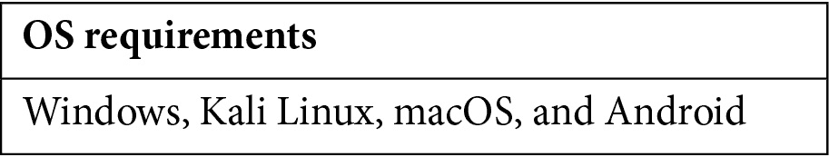

# 前言

道德黑客是一种特殊的网络安全类型，旨在诊断并发现安全漏洞，以便在恶意攻击者之前进行防范。本指南将概述这些威胁，并提供如何预防它们的建议，让你从今天开始就可以开始保护你的网络！

随着技术使用和依赖的增加，与之相关的风险也在增长。虽然保持安全的网络环境面临许多挑战，但网络攻击者面临的最大问题之一就是寻找可以利用的漏洞。这正是道德黑客发挥作用的地方。道德黑客使用恶意攻击者开发的工具和技术，在漏洞被恶意利用之前找到安全弱点。

最受欢迎且广为人知的道德黑客认证之一是由**国际电子商务顾问委员会**（**EC-Council**）提供的**认证道德黑客**（**CEH**）证书。要成为 CEH，个人必须通过一项考试，考试内容涵盖一系列道德黑客话题，包括侦察、足迹分析、扫描和枚举、获得系统访问权限（包括木马和病毒）、窃取数据、掩盖痕迹以及社会工程学。

本指南将为你准备 CEH 312-50 考试。我们将涵盖考试大纲中列出的主题，以及你可以用来备考的额外资源。在本指南结束时，你应该能对道德黑客有一个清晰的理解，并知道如何有效地进行道德黑客。

让我们开始吧！

# 本书适合的人群

本指南适合任何希望了解更多关于道德黑客以及如何保护组织免受网络攻击的人。这可能包括安全专业人士、IT 管理员，以及任何希望了解道德黑客基础知识并成为更有效的网络安全专家的人。

# 本书内容

*第一章*，*理解道德黑客*，涵盖了信息安全（InfoSec）的要素、网络杀伤链方法论、不同的黑客概念、类型和术语，以及道德黑客的概念。

*第二章*，*侦察简介*，完全讲解侦察。所有事情都有一个起点，攻击者在针对一个组织时的起点就是通过侦察/足迹分析的过程。

*第三章*，*侦察 – 深入探讨*，更深入地探讨侦察阶段。现在你已经对我们在侦察阶段试图收集的信息有了基本了解，让我们通过查看开源情报（OSINT）和公开可用的数据（如社交媒体服务、招聘网站，甚至回溯查看公司网页的历史版本）来进一步深入。

*第四章*，*扫描网络*，告诉我们，扫描网络是发现此类信息的过程。在某些情况下，我们可以保持不被发现，而其他技术可能会提醒安全团队。

*第五章*，*枚举*，探讨了枚举如何暴露系统上的用户名、组、路由表、系统名称和网络共享等信息。

*第六章*，*漏洞分析*，展示了漏洞分析如何在为公司基础设施提供安全保护方面发挥关键作用，抵御外部和内部威胁。

*第七章*，*系统黑客攻击*，专注于攻击者可以用来攻击我们在前四个步骤中识别的系统的工具和技术。这是攻击者的最终目标，本章将向你展示你可能有多么脆弱。

*第八章*，*社会工程学*，描述了攻击者发现并积极使用的一种更容易的方法，以避免步骤 2 至 5。人类是最薄弱的一环。对社会工程学没有防御措施；只有持续的警觉和员工培训才能帮助规避这些技术。

*第九章*，*恶意软件和其他数字攻击*，描述了黑客可能利用的一些最常见的攻击途径，包括恶意软件、病毒、勒索软件和**拒绝服务**（**DoS**）攻击。

*第十章*，*嗅探与规避 IDS、防火墙和蜜罐*，分析了嗅探如何提供有关网络上可能发生的各种类型的投毒攻击的洞察。这些类型的攻击和信息可以帮助攻击者避开蜜罐，甚至绕过防火墙和**入侵检测系统**（**IDSs**）。

*第十一章*，*黑客攻击无线网络*，解释了无线网络如何呈现一个全新的攻击途径，且这种攻击途径可能很难加固。攻击者会攻击这些网络，因为通常使用较低的加密技术，且与设备和软件相关的漏洞也为攻击者提供了机会。

*第十二章*，*移动平台黑客攻击*，讲述了移动设备如何迅速取代桌面和笔记本电脑，因为它们不仅允许用户完成相同的生产力任务，还能存储重要信息，如联系人列表、日历和凭证。本章将展示吸引攻击者的移动平台威胁。

*第十三章*，*黑客攻击 Web 服务器和 Web 应用程序*，探讨了互联网和 Web 技术的增长，以及互联网连接的迅速增加如何导致了新商业格局的出现。服务、插件、操作系统、API 和 Web shell 的互联性创造了一个容易发生配置错误和遗漏补丁的环境。

*第十四章*，*黑客攻击物联网和操作技术*，解释了为什么使用物联网或操作技术设备作为网络一部分的组织需要保护这些设备和信息免受攻击者侵害。所有安全专业人员都需要了解网络威胁、工业基础设施和商业环境。

*第十五章*，*云计算*，研究了云计算的推行如何迅速且对组织有利，但就像任何技术一样，云环境也带来了若干威胁和风险。攻击者正在针对云软件中的漏洞，试图未经授权地访问网络。

*第十六章*，*使用加密技术*，描述了加密技术和**加密**（**crypto**）系统如何帮助保护数据在在线传输过程中不被泄露，但它们并不是不可破解的。小心部署并保持良好的环境有助于防止攻击者入侵。

*第十七章*，*CEH 考试练习题*，让你了解自己学到了什么！

# 要充分利用本书

你应该具备基本的网络功能和技术的理解。TCP/IP 和 OSI 模型是关键概念。你还应该熟悉防火墙的类型和功能，并且对 Web 服务器、Web 应用程序及其潜在的安全漏洞有基本的了解。在尝试参加 CEH 考试之前，还应了解一些加密学基础。

你可能会考虑使用一些虚拟化解决方案，如 VMware、VirtualBox 或 Hyper-V 来创建一个网络，以练习一些讨论过的技术，但这并非必需。

# 下载彩色图片

我们还提供了一个包含本书中使用的截图/图表彩色图片的 PDF 文件。你可以在这里下载：`static.packt-cdn.com/downloads/9781801813099_ColorImages.pdf`。

# 使用的约定

本书中使用了许多文本约定。

**文中的代码**：表示文本中的代码词、数据库表名、文件夹名称、文件名、文件扩展名、路径名、虚拟网址、用户输入和 Twitter 账号。例如：“攻击者可以利用**setuid**或**setgid**标志，通过提升权限来执行恶意代码。”

**粗体**：表示新术语、重要词汇或在屏幕上显示的单词。例如，菜单或对话框中的单词会像这样出现在文本中。以下是一个例子：“在**研究**类别下，您可以进入**威胁分析**，查看当前在该领域的进展。”

提示或重要说明

以此形式显示。

# 联系我们

我们欢迎读者的反馈。

**一般反馈**：如果您对本书的任何内容有疑问，请在邮件主题中提及书名，并通过电子邮件联系我们：customercare@packtpub.com。

**勘误表**：尽管我们已尽一切努力确保内容的准确性，但错误仍可能发生。如果您在本书中发现错误，我们将非常感激您向我们报告。请访问[www.packtpub.com/support/errata](http://www.packtpub.com/support/errata)，选择您的书籍，点击“勘误提交表格”链接，并填写相关详情。

**盗版**：如果您在互联网上发现我们作品的任何非法版本，我们将非常感谢您提供该位置地址或网站名称。请通过电子邮件联系版权@packt.com，并附上相关资料的链接。

**如果您有兴趣成为作者**：如果您在某个领域有专长，并且有兴趣撰写或贡献书籍，请访问[authors.packtpub.com](http://authors.packtpub.com)。

# 分享您的想法

阅读完《认证伦理黑客（CEH）v11 312-50 考试指南》后，我们希望听到您的意见！请[点击这里直接进入 Amazon 评论页面](https://packt.link/r/1801813094)并分享您的反馈。

您的评论对我们和技术社区都非常重要，将帮助我们确保提供优质内容。
