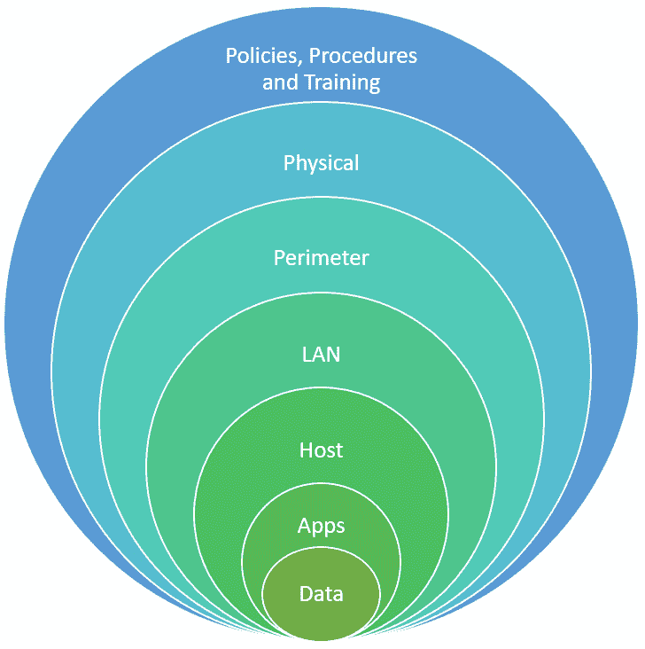

# 第一章：理解道德黑客

**认证道德黑客**（**CEH**）认证考试既不简单，也不是为简单设计的。如果它不难，大家都可以做——它的难度使得它变得伟大。道德黑客是 IT、网络安全和软件开发领域的关键工作者，而 CEH 认证是他们的基本要求之一。本指南涵盖了道德黑客的基础内容，适用于 CEH 考试考生和那些关心自己环境中漏洞的人。

这份综合概览将帮助你做到以下几点：

+   掌握 CEH 认证的基础知识。

+   获得道德黑客的强大而实际的理解。

+   了解成为 CEH 所需的要求和技能。

+   根据道德黑客标准评估自己。

+   决定 CEH 认证是否适合你。

本章将通过以下主题实现这些目标：

+   CEH 认证的好处

+   信息安全

+   网络杀伤链

+   攻击者的行为识别

+   信息安全控制

+   信息安全法律和标准

# CEH 认证的好处

美国**国防部**（**DoD**）于 2005 年发布了指令*8570.1*，要求所有处理美国政府 IT 的人员必须拥有基础的 IT 认证，包括道德黑客。这是网络安全专业人员追求 CEH 认证的最重要原因之一。

除了是行业标准，CEH 认证还在国际上得到认可，这使得它在全球 IT 行业中都有效且有价值。

这也是任何 IT 简历上一个有价值的认证。它意味着候选人理解黑客是如何思考的，考虑到最近关于黑客和技术的种种事件，拥有此认证的 IT 专家需求量大，且将继续保持高需求。

## CEH 认证适合你吗？

如果你是公司中的网络安全官员，或是渗透测试员、内部或外部审计员、安全专业管理员或顾问站点管理员，或者是想了解自己环境安全性的技术宅用户，那么你将从这项认证中获得最大收益。

## 成为 CEH 所需的要求和技能

作为 CEH，需要保持标准。这包括来自国际电子商务顾问协会（EC-Council）道德规范中的技能、价值观和伦理，你可以在[`www.eccouncil.org/code-of-ethics`](https://www.eccouncil.org/code-of-ethics)找到这些规范。最重要的要求包括以下内容：

+   隐私

+   披露

+   专业领域

+   未经授权的使用

+   授权

+   披露

+   项目管理

+   知识共享

+   信心

+   法律限制

+   地下社区

让我们详细了解它们。

### 隐私

道德黑客接触到一些他们不被允许使用、窃取、共享、修改、改变或销毁的信息。从安全号码到客户数据库和知识产权，他们的访问权限是无限的。他们有责任始终保管这些信息。

### 信息披露

道德黑客偶尔会发现一些不舒服的东西，可能是视觉上、观看上或谈论上的不适。如果他们碰到这样的信息或内容，他们的责任是报告它。无论内容多么令人不安、恶心、严重或不适，他们都必须向相关部门或当事人披露所发现的一切。

### 专业领域

道德黑客不应虚假陈述自己，假装知道的比实际更多。道德黑客要求对自己能做和不能做的事保持诚实，并且对自己的知识水平、技能和局限性保持开放。如果你缺乏处理超出自己领域的事务所需的经验或培训，那么寻求公司或雇主请专家来处理是符合道德的做法。

### 未经授权的使用

道德黑客应避免使用非法或不道德获取的软件和硬件。此外，如果他们发现公司中存在未经授权使用的证据，他们不应接受贿赂以保持沉默，也不应为了个人利益参与其中。

### 授权

道德黑客需要限制自己以授权的方式使用资源、数据和/或信息。此外，在工作中，道德黑客应告知公司他们打算如何使用数据或信息。他们还应确保在必要时获得同意，并避免偷工减料。

### 信息披露

当一名道德黑客发现硬件或软件中的问题时，他们会先与硬件制造商核实或通知其产品存在缺陷，然后才会公开有关漏洞的信息。如果制造商没有采取任何行动，他们会揭露问题以保护用户，并尽可能分享解决方案。有些人将这种情况称为*零日*漏洞，意思是漏洞在厂商意识到其存在之前就已被发现。

### 项目管理

道德黑客需要出色的管理技能，以提高效率并有效管理项目。他们需要设定明确的目标，制定合理的项目时间表，并进行沟通。

### 知识分享

道德黑客承诺不断学习，保持与新发展同步，分享新发现，参与 EC-Council 成员的交流，并提高公众意识。他们通过教学或免费讲座、在社交媒体平台上传播信息以及向他们所认识的人普及硬件和软件安全知识，来实现这一点。

### 自信

作为道德黑客，信心意味着你应该始终以专业、诚实和有能力的方式展现自己。这意味着即使你在与别人竞争某个项目时也要如此。通俗来说，就是不要背后捅刀，伙计们。现在，在本书的各个章节中，我们将介绍一些对网络极为危险的工具。作为道德黑客，你需要确保你对任何你在网络上使用的软件、技巧或工具有经验。在执行任务时，学习新工具或技术并不是最佳时机。你需要非常小心。不要修复你发现的超出项目范围的问题。即使你认为你知道对公司或他们公司最好的做法，你也要始终在采取任何行动之前获得指导和许可。没有妥协的余地。我们所指的是，在你与公司或组织的专业合作过程中，你绝对不能故意危害或使其系统受到攻击。

### 法律限制

无论道德黑客接受什么项目，都必须经过批准、授权并且是合法的。道德规范影响他们的所有决策。他们总是清楚自己在做什么、别人对他们的期望，他们了解自己的局限，知道自己能做什么、不能做什么，并知道什么算是公平竞争，什么是恶意行为。

### 地下社区

道德黑客承诺不参与黑帽活动，也不与黑帽黑客社区有任何关联。他们不会帮助或支持黑帽黑客推进他们的任务；他们只与他们接触，以了解最新的动态、他们知道什么、他们做什么以及他们的思维方式。

# 道德黑客

**道德黑客**是一种主动的网络安全方法，涉及使用黑客方法、概念和工具在潜在攻击者利用系统漏洞之前揭示系统的弱点。

一个道德黑客的思维方式像攻击者或犯罪行为分析师。他们知道如何窃取密码和用户名，如何发现并利用漏洞并且不被发现。道德黑客使用与坏人相同的战术，唯一的区别是他们有权限这样做。此外，道德黑客还带来了更多的能力。以下是道德黑客使用的一些最重要的技能、理想的行为和原则：

+   **架构、程序和网络的专业知识** – 你需要了解**传输控制协议/互联网协议**（**TCP/IP**）的工作原理。你需要理解网络结构和功能。你不一定需要成为所有程序的专家，但你需要知道程序是如何安装的，它们做了哪些修改，并了解它们可能带来的安全威胁。

+   **精通漏洞研究** – 道德黑客需要与不法分子保持同步。因此，要尽可能多地了解新的漏洞。此外，要确保自己熟练掌握攻击者使用的黑客技术，因为你可能需要在特定目标上尝试这些技术。

+   **对攻击者使用的黑客技术有良好的理解** – 道德黑客并不限于某一厂商；他们了解攻击者使用的各种技术——这些技术可能会被用来攻击路由器、**入侵检测系统**（**IDSes**）等。

+   **遵循行为准则** – 道德黑客遵守由 EC-Council 要求的严格行为准则。

+   **向相关人员披露信息** – 道德黑客有责任向雇主和客户披露他们应该披露的内容。如果发现非法行为，他们有义务向有关部门报告。道德黑客在评估客户的系统或基础设施时，还可能会发现其中的漏洞。相关法规禁止他们披露这些信息，他们清楚哪些是禁区。

+   **他们擅长攻击者使用的战术和策略** – 他们知道攻击者的战术和策略。他们不会凭空捏造东西或走捷径。

+   **他们明白“没有”就意味着“没有”** – 如果客户或雇主给出了明确的允许与禁止的指引，道德黑客会在两者之间划清界限并尊重这一决定。他们不会试图越界，如果范围发生变化，他们会确保这项变更以书面形式确认。

+   **他们从不攻击自己不拥有或没有授权进入的系统或网络** – 这本身不是一种技能，但如果在测试过程中，一名优秀的道德黑客被告知*停止*，他们会立即停手。未能遵守这一点已经让一些道德黑客的生活发生了翻天覆地的变化。

+   **他们记录并报告结果** – 他们会报告*所有*结果，即使这可能会伤害到他们希望讨好的人，例如推荐他们进行渗透测试工作的经理。

+   **他们将结果报告给法律当局** – 他们知道自己有义务将非法活动或计划报告给当局，因此他们会确保合同允许这样做。然而，一些司法管辖区规定，即使合同禁止此类披露，道德黑客也有法律责任报告给当局。如果未能向法律当局报告，道德黑客就成了犯罪的共犯。对于这种情况，还有其他解决办法，包括像举报人保护法这样的法律，它在特定类型的披露中保护道德黑客。

+   **保密性** – 当道德黑客遇到被视为机密的信息时，他们知道该与谁分享自己的发现，除非这违反了当地的法律。

锻炼重要技能，拥抱道德黑客原则，并了解攻击者的行为是关键。我写这章是为了给你提供通过 CEH 考试所需的信息，并帮助你在网络安全领域导航。我们还讨论了不同类型的攻击以及攻击者如何利用漏洞。接下来，我们将学习信息安全控制——我们对抗攻击者的武器。

# 什么是信息安全？

为了在信息安全方面打下扎实的基础，本节内容涵盖以下主题：

+   信息安全——总体概述

+   **机密性、完整性和可用性**（**CIA**）三元组

+   网络攻击的类型

+   黑客攻击阶段

+   黑客的类型

你将能够广泛定义信息安全，并理解 CIA 三元组，了解各种类型的网络攻击和黑客攻击的阶段，理解攻击者的类型及其动机，并了解**网络杀链**（**CKC**）方法论的步骤。

## 信息安全概述

信息安全是指保护处理、存储和传输数据的信息系统免受非法访问的过程。组织必须保护它们的信息，因为信息是关键资产。

在大多数安全漏洞背后，攻击者都有动机和目标。动机来源于认为目标拥有某些重要的东西。攻击的目标可能是打断目标组织的日常活动，或者出于娱乐目的窃取重要信息，甚至是报复。因此，攻击者的目标由他们的情绪状态决定。一旦黑客/攻击者定义了他们的目标，他们可能会使用多种工具、策略和方法来利用系统中的漏洞。

信息安全是信息风险管理的一部分。它指的是为保护和维护信息的**机密性**、**完整性**和**可用性**而设计的流程和措施。信息安全的目标通常被称为 CIA 三元组；这三个组件防范**网络攻击**，以防止未授权或非法访问、使用、共享、修改、扫描、窃取和/或销毁信息。

## CIA 三元组

CIA 三元组是一个安全模型，指导组织制定政策和措施，以保护其数据免受未授权访问。让我们详细了解它的组成部分。

### 机密性

保密性是防止数据被盗取、未经授权或无意间访问的措施。实现这一目标的第一步是**身份验证**，即要求用户在允许访问之前证明自己的身份或合法的账户所有权的验证过程。大公司其数据库被攻击者入侵的新闻越来越多。这些公司成为攻击者的目标，因为它们拥有非常宝贵的客户信息。攻击者还针对政府机构，出于军事、政治、犯罪等各种原因进行攻击。

一起涉及保密性泄露的损害案例发生在犹他州。某医院备份了他们的记录，并通过快递公司发送。这名司机途中改变主意，决定回家过周末，而不是将磁带送到格兰特山记录库（一个位于犹他山脉的金库系统）。某人看到了这个包裹，并打破了车窗。一瞬间，承载着患者重要医疗记录和机密信息的铝制金属箱消失了。

医院最终花费了数千美元寻求身份保护服务，帮助那些个人和重要信息落入错误之手的患者。除了这种数据丢失外，还存在未经授权和无法追责的数据修改风险，这被称为不可否认性。如果约翰·多修改了一个文档，在一个安全系统下，就需要有一种方法来确认该修改是否发生以及何时发生。

### 完整性

在你证明了你的身份后，你期望你的数据是安全的，而不是被篡改的。你希望能够信任数据的来源和保管者。例如，当你尝试访问你的银行账户时，你希望确保你是在访问银行的应用程序或网站，并且你将在那里找到的数据是有效和受保护的。

### 可用性

人们有权随时访问自己的数据，但有时攻击者通过发起**拒绝服务**（**DoS**）攻击阻碍这一点。DoS 攻击会拒绝用户访问帐户或资源。这对攻击者有什么好处呢？这是针对企业的常见恶意攻击。它阻止用户进行交易或访问服务或资源。这种拒绝可用性会使公司损失数百万美元，有时也会影响用户。

## 网络攻击的类型

网络攻击发生在攻击者——这些拥有不同目标和动机的人——发现并利用系统中的漏洞时。攻击者这样做是为了未经授权地访问网络，或获取有价值或机密的数据。

攻击者通过违反系统或流程来干扰操作、窃取重要或机密信息，或寻求报复。他们可以在组织内部制造混乱，激起恐惧，造成财务损失，并通过公开政治立场、宣传、宗教信仰等，利用目标的通信媒介，毁坏组织或企业的声誉。

网络攻击可以归类为不同类型，包括以下几类：

+   被动攻击

+   主动攻击

+   近距离攻击

+   内部攻击

+   分发攻击

+   网络钓鱼攻击

让我们详细了解这些攻击。

### 被动攻击

被动攻击也称为嗅探攻击或窃听攻击。攻击者监视流量，然后在数据到达接收者之前拦截数据。

### 主动攻击

与被动攻击不同，主动攻击具有破坏性。主动攻击者通常试图利用漏洞并造成伤害。大多数系统可以检测到它们。主动攻击者会尝试干扰系统之间的通信或服务，使事情变得混乱，或在网络安全中引发故障，并试图获得访问权限。一些常见的手段包括 DoS 攻击、中间人攻击、会话劫持和 SQL 注入。

### 近距离攻击

在近距离攻击中，攻击者通常物理接近目标或网络。他们的动机是收集、改变或干扰正在传输的信息。近距离攻击的例子包括窃听、窥视和垃圾桶翻找。社会工程学也属于这一类别。攻击者通过欺骗目标共享个人或机密信息，然后欺诈性地使用这些信息。

### 内部攻击

正如名字所示，内部攻击来自内部。攻击者利用他们的特权和访问权限，从内部违反政策来破坏信息系统。他们通过窃取物理设备、植入恶意软件、后门或键盘记录器来实现这一点。

### 分发攻击

在这些攻击中，攻击者通常在安装之前篡改或修改硬件或软件。攻击在安装后很快开始。为了实现这一点，攻击者会在硬件或软件的源头或传输过程中进行篡改。一个典型的分发攻击例子是 2020 年 SolarWinds 的攻击。攻击者在访问并向 SolarWinds 的软件系统中添加恶意代码后，向软件程序用户发送了带有木马的更新。此攻击的受害者包括 425 家财富 100 强和 500 强公司，包括思科、英特尔和微软等巨头、领先的电信公司、美国政府的主要机构——包括国务院、国土安全部和能源部——以及声誉良好的学术机构。

### 网络钓鱼攻击

网络钓鱼攻击也是一种流行的网络攻击形式。网络攻击者使用一种伎俩，创建一个与原网站一模一样的假网站。一旦攻击者完成了假网站的开发，他们会向客户发送带有假网站链接的邮件。当客户尝试使用用户名和密码登录时，攻击者会记录下这些信息，并在真实网站上使用相同的信息来访问客户的账户。

## 技术三角形

技术三角形，就像百慕大三角一样，神秘，只是没有那么大。它是每个与技术相关的人的头痛——硬件开发者、爱喝咖啡的 IT 人员，以及那个整天坐在角落盯着屏幕的程序员。

图 1.1 – 技术三角形

让人头痛的一个概念是可用性（GUI 环境）与功能性（特性）与安全性（限制性）之间的平衡，如 *图 1.1* 所示。

通常，这个困境就是在这些之间找到一个好的平衡。这很难，因为有时，追求可用性可能意味着牺牲安全性和功能性，而倾向于安全性则可能会失去功能性和可用性。

找到这个平衡很棘手，这就是为什么有些操作系统更倾向于某一方面的原因。举个例子，当互联网刚刚起步，大家都想要一块“蛋糕”时，微软推出了 Windows 2000 服务器。为了迎合用户需求，微软为其用户设置了服务器，每当用户部署操作系统时，它会自动安装 **Internet Information Services**（**IIS**），这是一个 Web 服务器环境。这个 Web 服务器环境的所有功能都被开启，漏洞比瑞士奶酪还多。虽然对不懂技术的用户很有帮助，但微软在安全性上做出了妥协。

微软随后推出了 Windows Vista，带有令人讨厌的 UAC 弹窗，总是询问你是否确定要执行某个操作。你是否允许这个应用程序对你的设备进行更改？你是否允许这个来自未知发布者的应用程序对你的设备进行更改？

输入用户名和密码让大多数用户烦恼，所以，尽管微软在安全性上有所进步，但他们牺牲了可用性和功能性。

微软就是这种困境的完美例子。他们的用户友好界面在许多情况下实际上为他们的平台创造了漏洞。报告显示，在 2016 年到 2020 年之间，报告的漏洞数量增加了 181%。

大多数人总是想知道为什么他们必须通过 IT 障碍才能使用软件或硬件。他们希望有一个即插即用的 IT 世界，所有他们需要做的就是去当地的技术商店，拿到所需的产品，插上，按几个按钮，瞧！就可以用了。一些公司理解这种需求，并努力让他们的产品尽可能易于使用。虽然实现易用性不难，但大多数易用的硬件和软件都容易受到攻击。

## 黑客类型

黑客攻击是指未经授权访问计算机或系统中的信息或数据，或配置不同的机制，使设备或黑客攻击的目标以不同于预期的方式运行。

黑客有不同的类型，他们通过所执行的活动和动机来区分。

### 黑帽黑客

黑帽黑客进行的攻击类型是他们没有权限或授权进入目标网络或进行相关操作。他们是违法者。

### 白帽黑客

与黑帽黑客不同，白帽黑客被授权进入系统并执行他们的操作。他们是好人。他们不会利用或滥用他们所能接触到的信息作为职业安全措施——他们仅将有关坏人的漏洞与白帽社区共享，以造福所有人。

重要提示

帽子颜色的术语来自好莱坞。在电影的早期阶段，坏人通过戴黑帽来识别，而英雄则戴着白帽。这种传统至今仍在电影中延续，我们都曾看到过一位穿黑衣的反派角色，而英雄则穿着白衣（你知道的，很久以前在一个遥远的星系……）。

### 灰帽黑客

灰帽黑客是经过改造的黑帽黑客。然而，仍然很难信任他们，因为他们在脆弱的时刻可能会再次堕落。他们今天可能是白帽黑客，但如果他们得到一个无法拒绝的好交易，他们的道德黑客原则可能会烟消云散，他们会开出自己的价格。

### 自杀黑客

正如名字所示，**自杀黑客**毫无顾虑。他们在攻击后不再掩盖痕迹。他们的任务是唯一重要的事情。

### 脚本小子

脚本小子完全没有头绪。他们雄心勃勃，但缺乏真正的培训和经验。他们依赖 YouTube 视频和其他免费的在线资源与工具进行黑客攻击和执行未经授权的活动。大多数脚本小子都在我们的网络基础设施内活动。

### 间谍黑客、网络恐怖分子和国家支持的黑客

这些是高调的恶意黑客。他们为政府、政府机构、组织团体以及在市场上争夺份额的大公司做脏活。他们通常受宗教信仰、政治倾向或议程、商业机会等因素的驱动。像自杀黑客一样，他们不择手段。他们专注于执行任务，其他一切，包括后果，都是次要的。

间谍黑客和国家支持的黑客之间的区别在于，间谍黑客从竞争对手的企业那里获得报酬，以盗取知识产权，而国家支持的黑客则由政府或政府机构支付报酬。国家支持的黑客行为使得国家能够获取其他国家、军事组织和跨国公司或组织的机密。

### 黑客活动家

黑客活动家是指未经授权访问网络或文件的攻击者，他们为了推进经济意识形态、政治或社会议程而进行攻击。

黑客活动家的动机各不相同，从破坏到抗议，羞辱和/或揭露个人、团体、公司或政府。他们的攻击通常包括篡改或使目标网站瘫痪。

黑客活动的其他主要目标是大公司，比如苹果和微软，以及大型制药行业。大量的素食主义者动物权利活动家和环保活动家也会利用黑客来推动他们的信仰或针对特定公司展开行动。

## 黑客攻击阶段

当有人谈到最安全的系统时，你脑海中首先想到的是什么？大多数人会想到 Linux 及其他操作系统。但攻击者可以攻击或黑进这些技术，因为它们都有漏洞和弱点。

一位*朋友*（我不能确认我是否参与其中）曾参与一家银行的渗透测试，他带着一台新的刀片服务器出现在分行，宣称自己迟到了，需要安装新服务器来加速工作。

他故意装作很沉重，催促他们加快速度。令他惊讶的是，他们真的照做了，并且让他独自进入服务器室。他在一排磁带备份中翻找，把一些放进了自己的包里。他还拿了几块含有重要数据的硬盘，然后通过后门部署了服务器。

作为一名安全专业人员，你需要预判任何形式的攻击并加以防范。如果没有数字攻击，那么就要警惕物理攻击或社会工程攻击。你的工作是通过各种可能的方式来打击、威慑、误导并拖慢攻击者的进程。

黑客通常有很多时间，他们总是在寻找任何机会或漏洞来获取你系统或信息的访问权限。

对黑客思维有较好的理解，有助于安全专业人员找到正确的检查点。特别重要的是，攻击者不会一次性完成任务。这是一个有阶段的过程。随着每一步或每个阶段，攻击者都会逐步接近目标的环境。让我们更详细地看一下这些阶段。

### 侦察/足迹分析

这是黑客攻击的第一阶段。它涉及观察一个目标并试图弄清楚他们是谁，以及他们能提供什么。这是攻击者最耗时的阶段，但回报也很大。攻击者尽可能多地收集关于你的公司的信息，然后根据这些信息准备攻击。

这有两种方法：

+   被动侦察

+   主动侦察

### 被动侦察

在被动侦察中，攻击者与目标没有直接互动，因此目标不知道有攻击者在观察他们。被动侦察还涉及在常见和公开平台上研究目标。

在被动攻击中，攻击者像普通访客一样浏览公司的网页，只不过他们在那里收集信息。例如，黑客可以访问公司的网站，查看职位空缺。这既不错误也不违法。

社会工程学是另一种被动侦察技术。通常，它利用人类心理来获取对系统、地点、数据和信息的访问权限。攻击者通过社会工程学操纵人们分享个人或关键信息，这些信息对于推动攻击非常有用。

市场营销人员是社会工程学的大师。他们会在你当地的超市或商场设置摊位，提供免费的样品——小块美味的牛肉或令人垂涎的小口径墨西哥卷饼。你根本不会意识到自己受到了影响——即使你没有购买他们推广的商品，你也会听他们关于产品的介绍，这可能正是他们在店里设摊的全部目的。

攻击者使用相同的技术来收集信息。

### 主动侦察

在主动侦察中，攻击者与目标有直接的互动。攻击者将与目标的系统进行接触，从内部或外部扫描网络，还会进行端口扫描，寻找开放的端口。

主动侦察技术的一个例子是，当攻击者 ping 目标的服务器时。这是接触目标服务器，对吧？这是一个大胆的举动。当攻击者发现或有充分理由相信他们的活动不太可能被察觉时，他们会使用主动侦察。

### 垃圾桶潜水

旧信用卡、水费账单、收据、丢失的身份证、公司的内部备忘录、表格、财务报表、列表等都包含有价值的信息，攻击者可以利用这些信息。就像侦探一样，攻击者会翻找垃圾桶、废纸篓等地方，寻找有助于完成目标档案的物品。

一个经典的垃圾桶翻找案例发生在 90 年代，当时美国司法部正在调查微软的做法。甲骨文公司聘请了一家侦探事务所，这家事务所翻遍了微软校园的垃圾桶，发现了指向微软与某些地下交易有关的信息。

*《纽约时报》*报道，*“甲骨文公司今天承认，已聘请了一家著名的华盛顿侦探事务所，调查与其死敌微软公司有关的团体，这一举措揭露了在微软与政府的反垄断斗争中，微软面临的尴尬文件。”*

### 扫描

扫描是攻击者尽可能收集信息的阶段。他们通过主动技术如 ping 扫描和被动技术如被动扫描来进行。攻击者嗅探流量，识别目标的机器和操作系统，寻找*进入方式*，即我们所说的攻击向量或攻击面。

### 获取访问权限

攻击者还可以绘制系统图，识别其他硬件设备，尝试探测目标的防火墙位置、路由器位置，查找是否能够发现 IP 地址方案等。这些信息告诉他们哪些目标需要避开，哪些目标无需浪费时间。安全专家通过尽可能多地了解最新的攻击工具以及攻击者发现的新漏洞，来反击这些攻击。

接下来，你需要做的是保护系统免受诸如端口扫描器等工具的攻击，端口扫描器会寻找服务可能打开的端口。为了保护你的系统，确保机器上没有运行不该运行的服务。正确审计系统。

另一个有用的工具是漏洞扫描器，攻击者也会使用这个工具——当然，他们使用的是盗版版本。这个工具会告诉你，*“伙计，你的默认机器没有安装最新的 Windows 7 或 Windows 8.1 服务包！”* 扫描的关键在于，如果你不去扫描漏洞，别人可能会去做这个，尝试进入你的网络。

### 维护访问权限

在突破系统后，攻击者希望维持访问权限。攻击者可以决定提取系统并将其作为攻击平台，进行他们所需的操作。他们可以利用这个系统进行攻击，并继续扫描或绘制目标环境的足迹，安装 Wireshark 嗅探网络并将结果回传。他们还可以选择安装一个木马，窃取用户名和密码，或扫描包含某些数字序列的文档。

经验丰富的攻击者最终会加强目标机器的安全。如果他们完全控制了你的机器，他们会确保继续保持对它的完全控制。他们会注入自己的后门或木马，实际上清除了他们利用的漏洞。这可能会阻止其他攻击者，但对他们没有用，因为下次他们会使用不同的机制。

pwned 这个术语

不，我们并没有拼错这个词。它是“owned”一词的俚语拼写。这个词来源于游戏*魔兽争霸*，在游戏文本中，一位程序员拼错了“owned”。如果你击败了另一个玩家，信息本应该显示“*Dale has been owned*”（戴尔被打败了），但我们看到的却是“*Dale has been pwned*”（戴尔被 pwn 了）。这意味着你被另一个玩家完全控制，或者在黑客的世界中，就是“我完全控制了你的系统”。

为了阻止这种情况，可以安装蜜罐或蜜网（伪装的系统和伪装的网络）。它会吸引攻击者，但他们最终只会浪费时间和精力在虚假的目标上。你已经成功地分散了他们的注意力或拖慢了他们的进度。

### 清除痕迹

这是攻击的第五阶段，也是最后阶段。在进入系统，获取或做到了他们想要的事后，接下来的聪明举动是掩盖他们的痕迹——让现场像他们找到时那样整洁，或者*更好*。

大多数攻击者会删除自己在日志文件中的记录，以确保你不会怀疑他们曾经在那儿，因为他们知道，如果日志文件中的第一条记录被删除，目标或安全专家就会想知道是谁删除了这个文件。

之后，他们会安装 rootkit 来隐藏他们的工具。或者，他们使用隐写术，将他们的秘密数据隐藏在目标的 MP3 文件或图片中，以避免在白空间（TCP 头部中的未使用位）中被检测到。

这被称为网络盲点，类似于猎人用来隐藏的鸭子盲点，猎人用它来等待伏击鸭子。

## 网络攻击的目的/目标

那么，这些网络攻击者从哪里来呢？通常，人们称他们为黑客或网络犯罪分子，但我们将称他们为攻击者。黑客和攻击者之间有很大的区别。让我解释一下：如果我们谈论黑客，那只是指那些利用目标以让其脱离原本目的工作的人。一个很好的例子是，当我购买我的第一台 Xbox 时，我对它进行了改装，换了更大的硬盘以存储我的所有游戏。我再也不需要拿 DVD 了！或者如何*root*你的安卓设备？通常，这些行为并不违法，而是修改系统/目标让它做一些不同的事情。

另一方面，攻击者是有不同动机/目标/目的的人，目的是未经授权访问目标。通常，他们使用相同的技术，但他们寻找的是不同的结果（大多是非法的）。攻击者可以是组织内外的人员，威胁着已知或未知的 IT 基础设施漏洞。

我们可以通过突出攻击者的大部分目标来总结他们的目标：

+   干扰组织或企业运营

+   获取/窃取重要或私人信息

+   在输给某个组织后进行报复的行为

+   创造财务问题

+   损害组织声誉

## 网络杀伤链 – 了解攻击者及其方法

**网络杀伤链**（**CKC**）是追踪攻击阶段的步骤，从侦察到数据外泄。描述攻击系统安全的通用过程有多个模型。这个模型最早由洛克希德·马丁公司开发。

### CKC 的各个阶段

这里是 CKC 的各个阶段。

#### 侦察

在侦察阶段，攻击者收集关于系统或网络的一般信息。这可以是被动攻击或主动攻击。

#### 武器化

攻击者将把有效载荷代码（使得远程访问成为可能）与漏洞利用代码结合起来，这些代码将利用软件和/或安全漏洞。

#### 投递

在这里，攻击者确定一个向目标环境传送武器化代码的向量。他们可以使用一个网站、电子邮件附件或 USB 驱动器。

#### 利用

这一步是代码的武器化。当目标点击恶意电子邮件中的链接或运行他们在停车场找到的 USB 驱动器中的代码时，恶意软件就会被触发。

#### 安装

这个机制，也称为后门，使得武器化代码（恶意软件）能够为入侵者运行远程访问工具，并在目标系统上实现持久性。

#### 命令与控制（CNC）

这是武器化代码为攻击者提供对目标网络或系统的访问权限的时刻。武器化代码建立一个到远程服务器的出站通道，该通道可用于控制远程访问工具，并可能下载更多工具以扩展攻击。

#### 行动和目标

在此阶段，入侵者利用他们已获得的访问权限，从目标系统收集信息，并开始通过远程系统传输信息。其意图可能是数据外泄、勒索加密、数据销毁等。

## 战术、技术和程序

**战术、技术和程序**（**TTPs**）这个术语与特定威胁行为者或威胁行为者组的活动和方法模式相关。TTPs 对于评估威胁和描述威胁行为者非常有用，安全专家还可以利用它们来增强组织的安全架构。术语 *战术* 指定了攻击者执行的规则集合。术语 *技术* 指攻击者在攻击过程中实现中间结果的技术方法。

组织应理解 TTP（战术、技术和程序），以保护其网络免受威胁行为者和潜在攻击的威胁。TTP 使企业能够从一开始就阻止攻击，保护网络免受灾难性损害。它们帮助你理解攻击者的思维方式，并预测攻击者可能会尝试做什么。

## 对手行为识别

识别对手在组织网络上进行攻击时常用的战术或策略的过程被称为对手行为识别。它为安全专业人员提供即将出现的威胁和漏洞的相关信息，有助于网络安全架构的规划，并根据各种网络攻击调整防御措施。需要注意的常见行为包括以下几点。

### 内部侦察

在此阶段，攻击者收集目标网络的内部信息，以便能够在网络中移动。攻击者将在内部进行侦察——列举系统和主机，并留意目标网络上发出的不同类型的命令，包括尝试解析主机名或 IP 地址等活动。激活远程系统有助于避免这种情况。

### PowerShell

PowerShell 是一个出色的自动化工具，用户可以使用它进行操作，但攻击者将其作为自动化工具，利用它从目标网络中转移数据（数据外泄）并发起进一步的攻击。监控 PowerShell 转录日志和 Windows 事件日志有助于识别攻击者的存在。

### 命令行界面进程

攻击者使用命令行工具获取目标系统的访问权限——读取文件或其内容、修改文件、创建账户等。这些操作在命令行界面中非常容易执行。安全专业人员通过查看包含不明数字和字母的进程 ID 日志来检测这种行为。恶意文件的下载也是这种攻击的一个指示。

### 可疑代理事件

对手试图创建并配置多个指向同一主机的域，以便快速在不同域之间切换。在这种攻击中，速度对攻击者至关重要。他们必须快速切换以避开安全专业人员的监视。为了捕捉他们，可以检查由这些域生成的数据源，查找不明域名。

### HTTP 用户代理

在基于 HTTP 的通信中，服务器使用用户代理字段来识别连接的 HTTP 客户端。攻击者修改 HTTP 用户字段的内容，以便与可能被攻陷或存在漏洞的任何系统进行通信，从而对其进行攻击。

### CNC 服务器

攻击者使用 CNC 服务器通过加密会话远程与他们已经入侵的系统进行通信。为了阻止他们，安全专家需要留意不需要的开放端口、加密流量——尤其是出站连接尝试——等等。

### DNS 隧道

入侵者使用 DNS 隧道技术隐藏恶意流量。入侵者可以通过绕过安全控制与 CNC 通信，提取目标系统的数据，等等。不幸的是，由于它在 DNS 隧道中传输，这看起来就像是正常的 DNS 流量经过网络。

### Web Shell

在这里，攻击者使用 Web Shell 通过在网站内部创建一个 shell 来改变 Web 服务器，从而使他们能够远程访问目标服务器的功能。安全专家可以通过分析服务器日志、错误日志以及可能出现在这些日志中的可疑流量（例如用户代理字符串）来识别网络中运行的 Web Shell。

### 数据暂存

一旦入侵者获得目标网络的访问权限，他们会使用不同的数据暂存技术来收集并整合尽可能多的信息或数据。他们可以收集财务信息、客户数据、员工数据、商业模型、策略等等。

大多数 IT 专业人员会部署或创建网络基础设施布局，以跟踪他们的网络。一旦入侵者收集了这些信息，他们就会将数据外泄或销毁。为了防止这种情况，安全专家通过查看事件日志，并通过监控网络流量中的恶意文件来寻找数据暂存区域。

从历史上看，安全工具一直依赖于恶意软件特征码的识别，但这种检测方式几乎没有机会击败经验丰富的攻击者。攻击者比谁都清楚不要使用过时的战术。他们很少使用可以在已知文件恶意软件数据库中找到的工具，这也解释了为什么威胁研究已超越了静态恶意软件特征码的识别。

## 妥协指示器

**妥协指示器**（**IoC**）是表明某个资产或网络已成功被攻击或正在遭受攻击的残留迹象。通常，IoC 可以通过入侵者使用某种工具留下的 ID 来识别，例如恶意软件特征码。

大多数 IoC 需要根据安全专家的经验和对目标系统的了解做出主观判断，因为这些 IoC 通常是通过可疑活动识别的，而非明显的事件。还需要注意的是，攻击有多个目标和途径，潜在的 IoC 也会有所不同。关联多个 IoC 以产生完整且准确的事件叙述是关键。

### 常见的 IoC

让我们来看看一些常见的 IoC：

+   未经授权的软件或文件

+   可疑的电子邮件

+   可疑的注册表或文件系统更改

+   未知端口和协议使用

+   过量带宽使用——尤其是在出站方向

+   恶意硬件设备

+   服务中断和网页篡改

+   可疑或未经授权的账户使用

多个 IoC（入侵指示器）可以关联在一起，以识别攻击者行为的模式。然后，这种行为分析可以用来建模威胁并进行主动的威胁狩猎。

识别威胁的一种方法是将您在日志中发现的指标与声誉数据关联起来。声誉威胁研究源将识别与恶意活动（如发送垃圾邮件或某个**动态拒绝服务**（**DDoS**）攻击）相关的 IP 地址范围和 DNS 域。

# 信息安全控制

*“当是自卫时，我甚至不认为它是暴力。我称之为智慧，”* 马尔科姆·X 说。

这些词语体现了信息安全控制的核心——旨在帮助我们保护网络。

## 进入伦理黑客领域

那么，伦理黑客的必要性是什么呢？我们为什么需要做这个？嗯，我们几乎每天都能听到技术发展的速度有多快。因为它发展得如此之快，带来了复杂性。而且由于快速增长和复杂性，它也给我们带来了问题。

所以，借助伦理黑客，我们将尝试完成以下目标：

1.  首先，您需要审查系统和基础设施，如硬件、复印机、交换机和 Wi-Fi 接入点等。

1.  下一步是测试当前的安全性，您可以通过*渗透测试*来实现。测试当前的安全性后，您将知道您的系统有多糟糕，通过查看它，您将能够提出解决方案来弥补系统/计算机安全的漏洞。

    渗透测试

    渗透测试，也叫做渗透试验，是对您的计算机系统进行模拟网络攻击，以监控是否存在可被利用的漏洞。

1.  接下来，您需要重新测试解决方案，以确保所创建的解决方案是有效的。

1.  现在，当我们在查看这个问题时，我们通常也需要注意范围和限制。伦理黑客的范围包括风险评估、审计以及欺诈等方面。它还包括最佳实践和对治理的深入审视。

    伦理黑客

    伦理黑客通常作为渗透测试来识别漏洞和风险，发现安全系统中的漏洞，并采取纠正措施应对这些攻击。

## 伦理黑客的重要性

伦理黑客的实践目的是保护敏感数据免受攻击者的侵害。它旨在保护您的资源，避免被那些希望利用漏洞的攻击者入侵。通过伦理黑客，企业或组织可以发现安全漏洞和风险。

攻击者会不断更新自己，找出新机制，利用新技术通过未经授权的方式窃取您的数据。

在这种情况下，您需要一个能够帮助抵抗这些类型攻击的人，那就是伦理黑客。

伦理黑客

他们是进行这些评估的安全专家。他们的主动工作有助于提高组织的安全态势。

## 了解深度防御策略

之前我们提到过，信息安全控制就像是自我防卫或是计算机网络安全的保护措施。保护网络安全的基础之一是采用深度防御策略（*图 1.2*）。这意味着在不同的层级部署不同的保护措施。

### 层级保护

为了理解层级保护策略，我们将以银行为例，看看银行劫匪如何看待银行。那么，一个熟练的银行劫匪是如何看待他们计划抢劫的银行的呢？他们按照以下步骤规划抢劫：

1.  首先，他们会勘察目标。在这一步，他们会查看停车场区域，以确保顺利进出，标记出门的位置，了解如何进入银行的各个部分，以及保险箱的位置。

1.  然后，劫匪会查看银行的安全措施，如闭路电视（CCTV）摄像头、报警系统、保安人员等。

1.  最后，他们进入银行并与工作人员互动。这使得他们有机会熟悉银行的流程和程序。

银行投资最好的安全设备和人员，但我们仍然会读到抢劫案件的报道。银行通过实施各种安全措施来提高其安全性。在我们的世界里，我们称之为层级保护。我们为不同的组成部分设计不同的安全层。

图 1.2 – 深度防御策略旨在在每个层级设置“路障”，以减缓攻击者的速度

层级保护在保护在企业内部不同服务器和组件之间传输的数据中得到应用。大多数组织会部署企业防火墙以防止攻击者入侵。公司认为防火墙已经足够，但他们让应用服务器和数据库服务器之间没有任何安全措施地进行通信。虽然这种方法是一个不错的开始，但为了防止攻击者突破防火墙，对两个服务器之间传输的数据进行加密会更好。我们可以通过将应用服务器隔离在另一个防火墙后面来保护资源，从而有效地增加我们防御的层级。

单一的保护层永远无法充分保护任何公司。即使一扇门关上了，黑客也会立即找到另一扇敞开的门，并利用任何漏洞。另一方面，你可以通过同时使用多种防御措施来修补安全漏洞，比如防火墙、恶意软件扫描器、入侵检测系统（IDS）、数据加密和完整性审计解决方案。

重要提示

我们无法完全阻止攻击者。我们的工作是减缓他们的进攻速度，或者至少让他们放弃。

# 信息安全法律和标准

法律与标准或指南之间是有区别的。标准是通过共识创建并由某个特定行业的管理机构批准的文件。它是该特定环境中常见规则、指南和活动的基础。

让我们从基础开始。

## 支付卡行业数据安全标准

几乎所有参与信用卡处理过程的人，包括处理商、商户、发卡机构等，都必须遵守这些标准才能接受信用卡。这些标准包括以下内容：

+   **支付卡行业数据安全标准** **（PCI DSS）审计**——确保他们已经构建并维持了一个安全的网络。他们会确认你已设置好防火墙配置。

+   **保护持卡人数据**——确保你没有使用默认的系统密码等等。这还包括保护持卡人数据本身——意味着你需要在数据传输或存储过程中对其进行加密。

+   **漏洞管理程序** (**VMP**)——这表明你能够维持一个 VMP——你使用并定期更新你的杀毒或反恶意软件解决方案，以及所有参与信用卡处理过程的系统中的程序。

+   **强访问控制**——确保我们限制对持卡人信息的访问，这样企业不会获取所有信息；他们只会在任何给定时刻获取所需的信息，且只有在必要时才会获取。这确保了只有需要的数据才会被企业传输或接收。

+   逐一分配唯一的 ID 给每个有计算机访问权限的人。

+   限制对公司存储的任何持卡人信息的物理访问。

+   我们还需要证明我们定期监控和测试我们的网络，当然，我们会及时更新这些内容。

+   **信息安全政策**——你必须证明你有一项政策，并且你会保持并更新它，以便涉及处理任何类型信用卡信息的人员遵守。

## ISO，IEC 2701 2013

该标准规定了在组织内实施、维护、建立和持续改进信息安全管理系统的要求。因此，我们将确保为组织建立安全要求和目标，特别是在安全方面，然后我们会确保以成本效益的方式进行。我们还将确保它有助于我们遵守任何类型的合规性——无论是法规还是法律——并且随着我们的发展，确保定义新的信息安全管理流程。

它还帮助我们检查组织内信息安全活动的状态。它也被组织用来在需要时向客户提供信息安全相关信息。

## 健康保险流动性与责任法案

如果你在美国，你可能与 **健康保险流动性与责任法案**（**HIPAA**）有过互动。当你去看医生或任何类型的医疗专业人员时，他们总会让你签署一份 HIPAA 表格。

HIPAA 为任何个人的健康信息提供联邦保护，这些信息由任何类型的健康公司、医疗专业人员或医院维护或存储。

他们还制定了多项行政、物理和技术保障规则。这包括诸如电子交易和代码集标准等内容。任何交易，包括健康索赔、支付、汇款、索赔状态、授权和支付，都必须得到保护——无论是在传输中、存储中，还是静止时。

## 隐私规则

这建立了另一项标准，旨在保护人们的医疗记录和其他个人健康信息，包括谁是医疗提供者、健康计划是什么等等——所有这些信息都必须得到保护。它还赋予我们（患者）控制健康信息的权利，包括查看并实际获取我们健康记录副本的权利。

## 安全规则

该规则要求采取适当的物理、技术和行政保障措施，确保我们对电子保护的健康信息拥有 CIA（机密性、完整性和可用性）。

## 全国识别符

这基本上是确保每个雇主在所有可能发生的不同交易中都有一个全国性的编号来识别他们。

## 执法规则

这包含与任何类型的合规性和调查相关的条款，以及对违反任何 HIPAA 规则的行为可能施加处罚的可能性。

## 萨班斯-奥克斯利法案（SOX）

该法案于 2002 年制定，旨在通过增加准确性和可靠性来保护公众和投资者，尤其是在企业披露方面。然而，不幸的是，该法案实际上并没有告诉组织如何存储其记录，而是描述了组织必须存储哪些记录以及存储多长时间。

SOX 的主要要求被组织为多个标题，包括以下内容：

+   **公共公司会计监督委员会**：这创建了一个中央监督委员会，负责确保审计工作得以进行，并协助处理质量控制问题。

+   **审计师独立性**：这有助于明确要求轮换新审计师。它还限制审计公司向其客户提供咨询服务。

+   **公司责任**：这考察了外部审计师与公司审计师或委员会之间的互动及其责任。它还帮助明确公司高管的行为，并对不合规行为施加处罚。

+   **报告要求**：这一部分涵盖了所有适用的法律、规则和条例、命令、指令以及监督机构要求保留财务交易或类似信息的其他要求。

+   **分析师的利益冲突**：这一部分为安全分析师提供了行为规范，确保他们披露任何可能存在的利益冲突。

+   **委员会资源与权力**：这一部分有助于定义**证券交易委员会**（**SEC**）的权力，允许其在安全专业人员违反其他相关法律条款时，禁止或限制其从事工作。

+   **研究与报告**：这一部分具体说明了 SEC 可以开展的不同类型的研究以及它们如何报告研究结果。

+   **企业与刑事欺诈问责**：该法案于 2002 年制定，包含七个部分，描述了篡改或操控财务记录、修改数字或干扰调查的不同刑事处罚。

+   **白领犯罪处罚增强**：这听起来相当严重，不是吗？这一部分实际上增加了与白领犯罪相关的刑事处罚，并建议更严格的判刑指南。

+   **企业税务申报**：这基本上告诉我们，CEO 应该签署公司税务申报表……这几乎是理所当然的，对吧？

+   **企业欺诈问责**：该部分对任何类型的篡改或欺诈行为进行了界定，作为刑事犯罪，并将这些犯罪与特定的处罚联系起来。

## 数字千年版权法案

**数字千年版权法案**（**DMCA**）包括了两个不同的条约，这些条约在 1996 年由世界知识产权组织签署。它有助于定义法律上禁止绕过版权持有者的任何技术保护措施。你不能随意复制 DVD，因为某个电影公司拥有它的版权。这就是 DMCA 发挥作用的地方。它防止了版权侵权。

## 联邦信息安全管理法

**联邦信息安全管理法**（**FISMA**）于 2002 年通过，创建了多个标准和指南，这是国会立法所要求的。FISMA 是一个有效的信息安全控制框架，涵盖了信息和信息系统的标准，例如根据系统或信息泄露可能对业务造成的影响来分类信息和信息系统的标准。同时，它还为信息和信息系统的安全要求最小化提供了标准，并提出了一些安全授权系统的建议，因为选择和评估安全控制措施也会为我们提供安全授权系统的建议。

## 一般数据保护条例

**通用数据保护条例**（**GDPR**）是全球范围内的，于 2018 年生效。在全球范围内，当涉及隐私和安全法律时，它非常严格，并对违反者处以重罚。虽然它是欧盟特定的法律，但对服务于欧盟地理区域的全球服务具有重要影响。

GDPR 包括各种保护和问责原则：

+   **合法性、透明度和公平性**：这意味着数据的处理必须合法、透明和对数据主体公平。

+   **目的限制**：这基本上告诉你，*"你最好有处理这类数据的理由！"*

+   **存储限制**：通常，这表明您只能为特定期限和特定目的存储个人信息。

+   **数据最小化**：这确保我们只收集和处理为获取该信息而必要的信息。

+   **准确性**：这表明您必须保持个人数据的准确性和最新性。

+   **问责制**：在这种情况下，数据控制者负责确保他们遵守 GDPR 与所有这些不同原则的合规性。

+   **完整性和保密性**：这意味着在涉及这些数据时，我们通常会确保它使用良好的加密进行加密，而不是因为我们的应用程序仅与特定类型的加密一起使用而使其过时。所以是的，你必须保持更新。

## 2018 年《数据保护法》

2018 年《数据保护法》（**DPA**）是出自英国的数据保护框架，旨在保护个人在处理个人数据时合法处理个人数据。它还讨论了组织可能对不同个人信息拥有或不拥有的权利。它还规定了执法部门的不同保护规则以及在其他领域如国家安全或甚至国防方面处理数据保护的方法。

重要提示

话虽如此，每个国家都有自己的法律和标准。根据您的位置找出适用于您的法律和法案。

# 摘要

本章为认证的道德黑客奠定了坚实的基础。它涵盖了道德黑客的基础知识，包括我们为什么要做我们所做的事情，我们使用的策略以及安全专业人员需要掌握的信息安全法律和标准。

为了涵盖所有基础知识，它向您介绍了网络攻击、攻击者、道德黑客、黑客技术和策略，以及在善良和恶意的阵营中发生的事情。

在列举了拥有 CEH 认证的好处之后，本章介绍了 CEH 的基础知识。

它让你对信息安全、CIA 三原则、网络攻击类型、网络安全专业人员需要关注的黑客攻击阶段、技术三角形、黑客类型及其行为方式和攻击执行方式有了清晰的认识，了解了黑客攻击的各个阶段以及每个阶段发生的事情，探讨了为什么会发生网络攻击以及攻击者的动机。

它还涉及了攻击者的行为识别，攻击者执行攻击的方法，以及网络安全专业人员用来阻止、威慑、误导或减缓攻击者的策略和技术。

它还让你研究了世界上最好的黑客框架——CKC，并让你在经历了从侦察到数据外泄的攻击各个阶段后，对其有了更深入的了解，对吧？

现在我们对信息安全有了较好的理解，接下来让我们深入探讨攻击者如何通过执行侦察和足迹分析来开始针对组织进行攻击。下一章将展示你如何轻松发现一些情报，比如使用的系统、员工姓名、基础设施布局，甚至是社交媒体上的数据，这些都可能帮助攻击者突破网络防线。

# 问题

在结束之前，这里列出了一些问题供你测试自己对本章内容的理解。你可以在*附录*的*评估*部分找到答案：

1.  道德黑客的目标是什么？

    1.  在攻击者利用安全漏洞之前，检测安全缺陷

    1.  搜索更新和补丁

    1.  获得比竞争对手更大的优势

    1.  测试你的安全技能

1.  *掩盖痕迹*是什么意思？

    1.  确定调查的范围

    1.  隐藏活动

    1.  渗透测试后的清理工作

    1.  使用 rootkit 隐藏工具

1.  哪一类软件工具集可以让攻击者远程访问目标并在很长一段时间内保持隐匿，且不被检测到？

    1.  GDRP

    1.  Rootkit

    1.  社会工程学工具包

    1.  SIEM

1.  以下哪种攻击被认为是*难以检测*的？

    1.  分发

    1.  内部人员

    1.  近距离

    1.  活跃

    1.  被动
