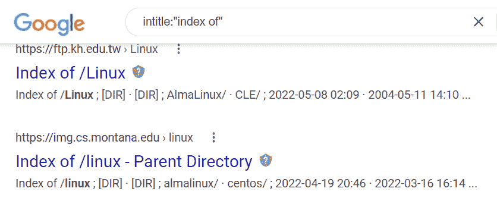

# 第二章：侦察简介

在黑客攻击过程中，侦察是至关重要的。通过侦察，黑客将收集有关目标的信息，用于攻击目标或利用其漏洞进行入侵。黑客在开始任何类型的攻击之前，掌握的目标信息越多，成功的几率就越大，且不容易被发现。

那么，让我问你一个问题——当你买车时，你会买到你看到的第一个带有**待售**标志的车吗？你可能不会。至少我知道我不会。

我在进行大宗购物前会做大量的研究。我会查看消费者报告和评论，尽可能挖掘关于某辆车的详细信息。

今天，我可以访问多个在线服务，帮助我了解一辆车的所有信息，包括其历史、前任车主、质量评价等。这正是**侦察**和**足迹描绘**的目的所在。

那么，什么是侦察，它与黑客攻击有什么关系？

**侦察**是收集尽可能多的目标信息，以便简化攻击过程的过程。

本书涵盖了不同类型的侦察和我们需要收集的信息。我们可以从目标那里收集大量信息，而目标对此一无所知。

你会发现，我会在黑客和道德黑客的视角之间来回切换。这正是道德黑客的工作——首先要像黑客一样思考并对目标进行剖析。然后，作为道德黑客，我也会思考如何将侦察作为渗透测试的一部分，帮助组织保护自己。

在本书中，我会频繁提到渗透测试，或称为渗透测试（pen testing）。这就是我们作为道德黑客所做的工作！我们会对系统进行不同的攻击尝试，以查看它们的安全性如何。然后，我们可以（有时）帮助目标减轻这些漏洞。

在本章中，我们将讨论以下主题：

+   侦察概述

+   搜索引擎

+   谷歌黑客攻击

+   使用 WHOIS

+   使用 ping 和 DNS

现在，没有玩一些工具就不是一个好玩的技术交流会。所以，你将在接下来的章节中看到许多工具。准备好戴上你的棒球帽，歪戴着，开始忙碌吧！

# 侦察概述

在战斗中，成功的攻击取决于你对敌人的了解。了解敌人的兵力、供给链及装备状况，对制定战略方案至关重要。这就像我们在进行攻击前必须做侦察一样。

侦察是攻击者获取目标信息的第一步，也是最便捷的方式。侦察的目的是尽可能多地了解目标。例如，目标是否具有远程访问功能？正在使用哪些端口和服务？一个组织的安全配置情况如何？

攻击者至少花 70%的时间在这一阶段，因为这是获取大量关于目标信息的方式（而且不容易被发现）。

首先，我们将收集尽可能多的**基础情报**，而当我说“基础”时，我指的是最基本、最基础的信息，包括网站的外观、组织的实际位置、成立时间、组织的高层管理人员、他们是否仅在一个地点运营，以及他们是否有分支机构。查看该组织的新闻发布和新闻片段也是很有用的。它们是如何起步的？

下一步是尝试发现他们机器上运行的**操作系统**。幸运的是，他们几乎不可能追踪到所有访问他们公开系统的人。它们运行的是 Windows 吗？还是运行 Linux？他们使用的是什么 Web 服务器？是 IIS，还是 Apache？如果他们在运行 FreeBSD，我能弄清楚他们使用的是哪个版本吗？他们是否在一台旧的 2003 服务器上使用了过时版本的 IIS？所有这些信息将帮助我规划我的攻击。

接下来，我们将执行一些查询操作，这意味着我们需要使用工具来发现一些信息——例如，查找所有的 DNS 名称。我们可能会用 WHOIS 来查询。我们的目标是发现关于底层网络基础设施的信息。例如，我们可能会发现某个在线公司在托管我们目标的资源。也许那家公司过去曾经遇到过一些安全问题，因此我们可能会想查看与我们的目标有合作关系的其他公司。你认为这不重要？去 Google 搜索一下**Target Breach**，你会看到攻击者利用了一个**暖通空调**（**HVAC**）合作公司，这家公司负责维护 Target 的制冷系统，攻击者借此进入了 Target 的信用卡系统。

接下来，我们必须找出可能对我们攻击有用的**漏洞**。我们已经知道目标是什么，因为我们知道操作系统版本，甚至可能知道 Web 服务器版本。利用这些信息，我们将开始研究（或称为*侦察*）潜在的漏洞。同样，我们在这个阶段的目标是找出能为我们提供任何线索的相关信息。有时候，哪怕是一个小小的信息，也可能在最后帮助到你。

弄清楚所使用的**网络架构**至关重要。在侦察阶段，你应该关注他们使用的系统、路由器或交换机，因为这些也可能是潜在的入侵点。我们还需要绘制出网络图，了解**非军事区**（**DMZ**）的情况。使用的是哪些 IP 地址范围？防火墙背后有什么？内部使用的是哪些 IP 地址范围？他们运行的是什么类型的桌面客户端？如果我们能直观地看到这些信息，就能更好地了解我们进入环境后的位置。

我们了解目标的越多，就越能了解他们的行为。我们甚至可能发现他们多久看一次安全性。此外，当涉及查找员工信息时，任何计算机系统中最脆弱的环节都位于椅子和键盘之间。社会工程是道德黑客的重要工具。

展示您的工作！

侦察是一个系统化和方法论的过程。我们会按照相同的步骤寻找相同的信息。这一过程为我们提供了目标安全环境的完整概况，有助于减少攻击面。我们不再需要猜测要攻击哪台机器，而是能够利用对目标安全状态的理解，非常具体地确定要攻击的域、子域、网络块或 IP 地址范围。但我们并不想攻击它们全部。我们希望尽可能地集中攻击，以便明确攻击目标。

要跟踪所有这些侦察信息，您需要建立一个**目标信息概要**（**TIP**）。概要的重点是记录可能的漏洞，以便更好地优先考虑您的攻击目标。同时，跟踪您已尝试攻击的位置也非常关键。当然，我们将首先尝试最容易的路径；之后，我们将开始侦察的脚印阶段，即绘制目标网络的地图。

## 侦察的类型

我们可以使用几种侦察方式：被动侦察、主动侦察、匿名侦察和化名侦察。

### 被动侦察

当我们谈论扫描时，被动侦察尤其相关。它不需要与目标直接接触。通过被动侦察，我们收集的信息类型可能包括在互联网上可用的 IP 地址、操作系统以及正在使用的 Web 服务器软件。

我们还可以查明系统上是否有任何服务处于开放状态，这些服务是基于 UDP 还是 TCP 的，它们是否具有任何访问控制机制，以及它们是否配备了**入侵检测系统**（**IDS**）设备等。

有被动扫描和主动扫描。被动扫描利用公开的来源尽可能收集关于目标的信息，而不被任何人察觉。相比之下，主动扫描则具有侵入性，并可追溯到来源。

被动扫描与*互联网侦察*同义，指的是在互联网上收集关于目标的信息，通常使用在线搜索引擎。两者唯一的区别在于，被动扫描可能涉及从物理来源（如报纸或杂志文章）收集信息。

### 主动侦察

另一方面，主动侦察包括通过参加面试、询问员工问题，甚至走遍环境来看看你能发现什么。当你在一个大型组织中收集信息，尤其是在大楼里，真的很疯狂，你可以自由地四处走动，甚至使用社交工程技能（这是一种利用人性弱点进行黑客攻击的方法）。例如，直接走进去，假装自己是负责人，就是一种测试员工在社交工程攻击下的脆弱性的方法。

### 匿名侦察

匿名侦察是指从无法识别你的来源收集信息，这样你所做的一切都无法追溯到你。这包括使用代理或 VPN 解决方案来隐藏你的位置和身份，以便访问公共内容。

### 组织性或私密侦察

另一种侦察类型是**组织性**或**私密侦察**。这涉及到通过查阅组织的事件日历、电子邮件服务等方式获取信息。

最后，我们有**假名侦察**。假名侦察与**匿名侦察**类似，唯一不同的是这些信息来源可能并不是直接由员工或组织发布的（信息以匿名或假名发布）。可能是某个员工希望保持匿名，例如举报人，或是一个不想公开自己名字的公司员工或政府官员。无论他们保持匿名的理由是什么，从这些来源收集信息被称为假名侦察。

## 侦察目标

我们在这次侦察阶段想要获得什么信息？答案是尽可能多。我们试图找到那些能帮助我们集中攻击的有用信息。

这些信息可以分为系统与网络信息、标准技术实践（源代码和命名规范）以及组织信息（位置、政策和员工信息）。

本节将回顾你应该寻找哪些信息。接着，我会展示如何找到这些信息。

### 系统和网络信息

系统和网络信息包括诸如域名（不仅仅是任何**.com**，我们还想知道他们使用的子域名）之类的内容。他们有子域名吗？（*这时我的蝙蝠侠迷情就暴露了*）**partners.wayneenterprises.com**或**extranet.wayneenterprises.com**？这意味着我们要寻找所有面向外部的域名。找到他们可能使用的任何内部域名也是有帮助的。他们注册了什么？他们注册了**wayneenterprises.com**和**wayneenterprises.net**吗？它们都暴露了吗？这可能告诉我们，**.com**是他们的外部域名，而他们可能将**.net**用于内部。

我们还希望发现组织中更广泛使用的地址，不仅仅是他们的网站。可能会有 VPN 活动，这引发了一个问题——他们从哪里获得 IP 地址？什么范围？他们使用的是哪个 IP 地址块？

接下来，我们将查看无人监控和私密网站。我不知道有多少次我遇到过开发者仅仅为了测试而搭建的网站，没人监控它们。同样，也许某个员工在他们的互联网服务器上发布了一个网站。

同时也有必要尝试发现开放和暴露的 TCP 和 UDP 服务。他们有入侵检测系统（IDS）吗？他们使用什么访问控制系统？是否支持 VPN，如果支持，我们能发现他们的 VPN 端点吗？是 Windows 系统吗？是 Cisco 的 VPN 解决方案吗？电话号码也很重要——包括模拟电话号码和 VoIP。

我们还希望收集有关操作系统的信息。我们想尽可能多地发现有关用户和组的信息。他们为用户账户使用什么命名结构？是*名字首字母，姓氏*？还是*FirstName.LastName*？

**Banner 抓取**是我们稍后会复习的另一个有用技巧。这是一种识别系统的方法；当我向操作系统发送某些命令时，Windows 系统会以一种方式响应，而 Linux 系统会以另一种方式响应。

我们还希望尝试获取他们的路由表，以查看数据包是如何被路由的。

### 标准技术做法

系统名称也可能是我们重要的线索。我喜欢 IT 人员把他们的服务器命名为**Thor**、**Zeus**或**Gandalf**，这样就很容易猜出其他服务器的名字。更棒的是，有时候他们会以计算机名来命名——比如**Win 2012**——然后还会包括其用途——**Exchange 1**、**SharePoint 2**、**VPN 7**等。桌面计算机也是如此（我们不一定会立即攻击服务器）。他们把它们命名为**Desktop 57**或**Marketing 05**之类的。

处理系统名称的更安全方法之一是使用序列号，尽管这并不能阻止我们。如果我们看到计算机名并识别它为序列号，我们会去戴尔网站，输入序列号，查找机器中的内容。这是一个令人难以接受的事实，但你无法阻止黑客。你的工作是拖慢他们的进度。

另一个我们需要寻找的重要东西是密码。尤其有趣的是，当人们有文档或电子表格保存密码以便跟踪时。

我们还将检查他们的访问控制系统，以了解密码长度的要求。它们的复杂性要求是什么？（是否要求大写字母、小写字母、特殊字符和数字？）

### 组织信息

永远不要忘记挖掘组织信息。网站可以暴露很多关键的资料。公司目录是黑客最重要的资源之一，因为最终用户是任何环境中最脆弱的环节。你应该尽量获取员工的详细信息。挑选一个员工，可能是市场部的某个人，试着在社交网站如 LinkedIn、Facebook、Twitter 和 Instagram 上找到他们。看看他们的兴趣爱好；看看他们是否在抱怨工作中的不公平待遇、他们猫的名字、他们小学一年级老师的名字或最好的朋友的名字。所有这些信息都可以被利用。（你应该能明白我在说什么，对吧？密码。）

位置详情也能告诉我们很多关于组织的信息。例如，他们的物理安全如何？我是否觉得可以轻松进入那栋大楼并观察情况？他们最近是否刚搬迁？你可能认为这些信息不重要，但相信我，我曾多次见到基于街道地址的密码，所以位置详情至关重要。确保记录下主要办公地点和任何分支机构的地址。

如果我们决定进行社交工程攻击，电话号码将派上用场。例如，我可能打电话给目标，假装我在找工作。招聘网站是我们另一块信息宝藏。如果他们发布了管理员职位的招聘信息，我可以通过它了解他们使用的服务器或者他们部署的技术解决方案。

查看目标网站的源代码。开发人员是否不小心留下了任何注释？我们能发现他们部署的安全策略吗？他们是否接受过如何锁定系统的培训？他们是否对员工进行过社交工程攻击处理的培训？

密切关注他们网站上或服务器间的任何链接。他们是如何从其他网站进入他们的服务器的？这有助于我们确定他们是否与其他公司有合作关系。那个合作公司可能会成为我们的目标，因为它们可能会与我们的原始目标建立了信任关系或某种类型的连接。也要了解那个组织的背景。你可以按照我们之前进行的同样的流程来了解目标组织。那家公司是怎么成立的？创始成员是谁？公司成立初期遇到了哪些困难？查看有关那家公司的新闻文章。找到公司发布的新闻稿。我们能了解到的任何关于该组织的信息都会对我们有帮助。

## 侦察工具概述

市面上有成百上千的工具可以帮助你侦察目标。它们大致可以分为以下三类：搜索引擎、网站和应用程序。我们将从最简单的开始——搜索引擎。

大多数时候，人们只会查看搜索引擎的前几页。研究表明，他们不会查看超过三页的结果。帮自己一个忙——不要仅仅停留在那三页结果中。试着查看第 10 页甚至第 15 页的结果；很有可能你会看到历史信息的出现。你甚至可以尝试使用不同的搜索引擎，因为它们提供不同的结果。

在搜索引擎上进行初步搜索后，开始查看网站。先从目标的官方网站开始。同样，寻找诸如联系信息、其他域名或子域名之类的信息（如果你的目标是**wayneenterprises.com**，他们是否有一个名为**mail.wayneenterprises.com**的子域名？）。还有一些与组织无关的基于网络的侦察工具。它们只是我们可以通过互联网访问的工具，可以向我们展示更多信息。我们将在*第四章* *扫描网络*中详细讨论这些工具。

最后，我们来谈谈应用程序。你会发现有成百上千的工具可以用来收集关于目标的信息。有些工具是为了做好事设计的，有些则是为了做坏事（是的，我现在正搓着手）。还有一些我们通常不会怀疑的内置命令，比如用于 nslookup 的命令行界面。

还有数百条 PowerShell 命令可能对你有帮助，还有脚本语言，我不仅仅是从 Windows 的角度说。Linux 中也有像**dig**这样的命令，我们可以用它来侦察我们的目标。

我们将在本书中详细介绍更多这些工具——记住，掌握基础知识很重要，这样你才能清楚自己想从这些工具中得到什么。

当你检查一个组织的系统时，问问自己以下问题：

+   是否使用了 SNMP？

+   他们的环境中使用的是什么系统架构？

+   他们的命名规则是什么？

+   他们是否在使用微软的最新技术？

+   他们还有一些 Novell 系统在使用吗？

+   32 位还是 64 位？

+   他们支持远程系统，而不仅仅是 VPN 吗？他们使用微软的 DirectAccess（伪 VPN 解决方案）吗？

+   这座建筑的物理安全性如何？

+   他们的走廊里有自助机吗？

+   他们有使用笔记本电脑或平板电脑的员工吗？

+   密码是如何存储的？

+   员工们有使用社交媒体吗？

+   他们部署了什么样的安全策略？用户是否接受了培训？

+   他们支持**自带设备**（**BYOD**）吗？

    注意

    我对 BYOD 有种爱恨交织的关系，因为作为管理员，有时候它对我来说简直是噩梦。我理解公司为什么这么做。他们不需要为员工购买平板设备，员工可以使用他们自己的平板——他们已经习惯了——但是如果他们丢失了那个平板怎么办？

正如我们之前讨论过的，所有这些信息将被存储在你的 TIP 中。这很关键，因为如果我们的目标是多个公司，我们需要保持信息的准确性。

当我们收集了这些信息后，我们应该开始绘制网络的蓝图或地图。也许我们还没有完整的图片，但至少有各种潜在的入口点。当我们进入其他阶段（比如扫描）时，我们希望能够拉出他们环境的完整图表。当处理这么广泛的信息时，最好创建一个可视化的内容，这就是侦察的足迹部分。

# 搜索引擎

通常，你会慢慢开始收集信息。因此，首先你会进行谷歌搜索，然后查看目标网站，然后深入了解。为了组织起见，我将向你展示通过四个主要类别可以找到的信息：搜索引擎、组织的网站、公司泄露的信息（这不一定在他们的网站上）、以及员工信息。

我将向你展示收集 TIP 数据所需的工具和方法。我们甚至会使用一些你熟悉的工具，但会稍作调整利用它们。打开你的电脑，让我们开始吧！

## 让我们从基础知识开始

这里有一个可以进行攻击练习的网站。它叫做**HackThisSite.org**（[`hackthissite.org/`](https://hackthissite.org/)），是一个免费的网站，黑客们用它作为训练场地来测试一些东西。它还有一些内容 – 博客、新闻发布等等。

首先打开你最喜欢的搜索引擎；在我这里是 Google。我们将从目标**hackthissite.org**开始进行简单搜索。它首先显示了实际网站，并提供了一些关于我们可能不知道的网站页面的额外信息。

再次，不要局限于第一页；向下滚动更多。注意一下出现的结果。例如，Reddit 上有一些评论，而且似乎有一个 Facebook 页面（尽管可能是一个冒名顶替者）。

一些其他公司引用了**HackThisSite.org** – 这可能很重要，因为这些第三方链接和评论可能为你提供一些重要信息，比如与目标有信任关系的合作伙伴或客户。

现在，让我们看看一个不同的目标 – 我以前用过的无线 ISP 服务网站（在那个时候叫做**UtahWISP.com**）。

尽管这家公司已经不存在了，你还是会找到一些关于它的文章。Yahoo Local 给我展示了一些信息，包括街道地址和地图显示其位置（这对我们很重要）。它还在 Google Plus 上。

让我们切换到雅虎。这次，输入**hackthissite.org**。有时，搜索引擎甚至可以帮助你确定一个组织的 URL 结构。例如，在**HackThisSite.org**的站点搜索结果中，还有登录目录、信息页面和注册页面。

一个简单的搜索往往会带来重要信息，因为人们并不总是能控制搜索引擎显示什么。有些方法可以绕过这个问题；你可以告诉谷歌不对你的环境进行索引，但即便如此，这些信息仍然可能被曝光。

现在你已经知道了在初步搜索时需要寻找的内容，我将向你展示如何从谷歌获取更多的信息。

# 谷歌黑客

*请注意，当我说谷歌黑客时，我并不是指尝试黑入谷歌服务器*。

首先，你需要理解谷歌是如何工作的。通常，发生的情况是你输入类似**如何养小鸭子**这样的内容。谷歌很快会回应你，提供一些教你如何养小鸭子的网站。

那么，谷歌是如何做到这一点的呢？他们的服务器被设计为去查看每一个网站，哪怕是一个小博客网站。它们的服务器爬行整个互联网并对找到的内容进行索引。**爬行**是指通过每一页并记录该页上的每一个单词的过程；所有这些单词都被索引，这就是谷歌能够展示与鸭子相关的随机网站的方式。

谷歌是有一些限制的。我知道你会说，*Dale，不要这么说，谷歌没有限制*。嗯，它确实有。限制是谷歌查询中最多 32 个单词。

我们将利用谷歌的**高级搜索**部分。你可能已经有过使用这个界面的经验（你这个谷歌大神），但这次我们将使用一些有趣的操作符及其语法，来发现那些公司没有意识到是可以访问的有趣内容。请注意，这通常不是在你开始侦察目标时就进行的操作。先从基本搜索开始，然后一旦你获得了更多详细信息，再进行谷歌黑客操作。

我们可以在**高级搜索**中调整我们的搜索结果。我们将在接下来的章节中回顾你需要了解的语法：

图 2.1 – 谷歌 – 高级搜索

如果你在寻找特定价格范围内的加热器，可以在**价格范围**字段中简单地输入**$300**和**$400**。

## 谷歌操作符

谷歌操作符是我们使用语法来优化**搜索**栏中搜索结果的不同方式。所有这些在**高级搜索**部分也可以实现。你是否使用符号或者**高级搜索**页面来配置你的谷歌操作符，取决于你自己的舒适度。

在我们开始之前，使用谷歌操作符有几个规则：

+   操作符和搜索词之间不应有空格。如果你在搜索热水器，并且不想要太阳能的，可以搜索**water heaters -solar**。需要注意的关键点是，**–**操作符和**solar**之间不能有空格。

+   搜索不区分大小写，因此无论你输入**BaTmAn**还是**Batman**，结果都是一样的。

以下是三种最基本的定制谷歌搜索结果的方法：

+   **组合词**：当我们搜索某些内容时，大多数人会输入类似**Batman Dark Knight**的内容。不幸的是，如果没有指定如何组合这些词，我们可能会得到关于蝙蝠侠、黑暗和一些中世纪骑士的内容。我们可以做的其中一件事是使用引号来关联这些词。我们可以输入**"Dark Knight" Batman**，其中**Dark Knight**在引号内。另一种选择是输入**Dark.Knight**，在两个词之间加上一个点。

请注意，空格表示**AND**，但我们也可以将其更改为**OR**。

+   **布尔操作符**：当你输入一串词语并只留空格时，会默认使用**AND**操作符，但你也可以用加号（**+**）或**AND**来表示**AND**操作符。如果你想使用**OR**功能，可以输入**OR**或使用管道符号（**|**）。

+   **排除词**：如果你只想了解关于蝙蝠侠的信息，而不想看到小丑，你可以通过输入**Batman -joker**来将其排除。出现的结果将是所有不包含提到小丑的普通文本的页面（可能有链接）。

现在，我们可以进入更复杂的谷歌操作符：

+   **缓存**：通过使用**缓存**操作符，我们可以指定查看谷歌缓存的该页面版本。这非常有用，因为一个页面可能暂时或永久下线，但你仍然可以查看谷歌服务器上最后缓存的页面。

+   **link**：**link**规格会显示有指向目标网站链接的网页列表。

+   **相关**：**相关**操作符会遍历并展示与目标页面相似的页面。它通过进行基本的文本比较，展示具有相同类型措辞的页面。

+   **info:**：通过输入**info:**，后跟页面或 URL，我们可以查看谷歌对目标网站的相关信息。

+   **site:**：要在特定网站内查找结果，输入你的搜索词，然后输入**site:**及特定网站的 URL。例如，如果我想在 Home Depot 寻找热水器，可以输入**water heaters site: Home Depot**。

+   **allintitle:**：此运算符将结果限制为标题中包含所有搜索词的网站。如果要找到标题中包含 **Batman** 的网站，我可以输入 **allintitle:Batman**，Google 就会找到所有这些网站。这在渗透测试中非常常见。

+   **inTitle:**：此运算符查找标题中包含搜索词的文档。你可以用它查找标题为 **Passwords** 的文档。

+   **allinURL:**：此运算符限制 Google 结果仅为 URL 中包含所有搜索词的页面。

+   **inURL:**：此运算符将结果限制为仅包含搜索词在 URL 中的文档。

接下来，让我们看一些使用 Google 运算符的示例。

## 使用 Google 运算符

让我们回顾几个使用 Google 运算符的实用场景。

首先，我们搜索 **intitle:"index of"**。这将给我们提供一个支持目录浏览的网页列表。**目录浏览**（或 **遍历**）是一种黑客方法，允许攻击者访问网站内受限的目录和文件，并执行一个超出 Web 服务器根目录的命令：

图 2.2 – 使用运算符的 Google 搜索

第一个出现的链接展示了 Linux 的目录结构。我们可以直接浏览这个结构，找到 Ubuntu。这里很可能有 Ubuntu 的下载链接，还有他们正在进行的不同项目。你永远不知道会发现什么，因为有些人可能不知道这些信息被公开了。

通过使用 **inTitle:**，我们告诉 Google 我们在寻找哪些词汇，但并不是说标题中必须包含 **of**。而 **allintitle:** 则意味着搜索中的所有词汇必须出现在标题中。

举个例子，尝试 **inurl:admin**。这个搜索将返回 URL 中包含 **admin** 或 **administrator** 的网站；有时，这些链接还可能关联有登录页面：

图 2.3 – 使用 inurl:admin 运算符的 Google 搜索

现在，让我们尝试 **allinURL:** 并添加另一个词，例如 **index**。（在 Google 中输入 **allinurl:admin index**）。这个搜索意味着我们只会得到同时包含 **admin** 和 **index** 的 URL 结果。吓到你了吗？

那么，使用 Google 运算符我们能找到什么呢？我们能找到以下内容：

图 2.4 – allinurl: 运算符的搜索结果

我们可以使用 **intitle:** 来查看特定类型的文件（可能是在管理目录中）。我们可以专门寻找日志文件，或者可能找到有助于识别服务器的日志文件。我们还可以识别出哪些服务器是 Apache 服务器。甚至可以在目录结构中移动。

我们可以使用 Google 操作符做一些有趣的事情，其中之一就是扩展步进（**Extension walking**）。**扩展步进**允许我们浏览并更改文件类型。例如，一旦我找到了 HTM 文件，我可以使用替换技术来查找具有相同文件名但不同扩展名的文件。所以，如果我找到了 **/docs/index.htm**，我可以将 URL 修改为 **/docs/index.asp** 来尝试定位 **docs** 目录中的 **index.asp** 文件。

说到这个，我最喜欢做的一件事就是使用扩展步进来查找网页的备份副本（因为，别对他们生气，开发者们有点懒）。他们把旧版本网页的备份留在服务器上，而相信我，Google 会将这些索引。

从攻击者的角度（或渗透测试员的角度）来看，让我们回顾一下这一部分内容。举个例子，假设你正在尝试确定一个公开暴露的 **Small Business Server** (**SBS**) 2003 的操作系统。当你安装 SBS 时，它会有一个前端页面，页面标题中会显示 **欢迎来到 Windows Small Business Server**。**inTitle:** 会显示有关 Windows Server 2003 的链接。但是，如果我们往下滚动，我们会发现一些页面无意间透露了它们所托管的服务器信息。

试试另一个搜索，搜索 **intitle:"open webmail"**。Google 会展示一些正在运行 Open WebMail 的服务器。你也可以试试 **intitle:"mvblog powered"** 来查找由 MvBlog 驱动的博客或网站。MvBlog 容易受到几种输入验证漏洞的影响，所以我可以迅速找到一些使用该技术的目标，作为我的渗透测试过程的一部分。

让我们看一下另一种使用 **inTitle:** 的方式。微软的远程访问服务器的标题页包含 **远程桌面 Web 连接** 这一短语。在结果的开始部分，大多数页面都来自微软，但当我们继续往下滚动时，我们会发现其他使用这些服务器的站点。有一次，我发现了一个登录页面，你可以在其中输入用户名和密码，然后从下拉框中选择要登录的服务器。它列出了他们所有的服务器，包括邮件服务器、SharePoint 服务器等等。有时，事情会变得太简单。

现在，这一点尤其重要，记住它：**intitle:"root/etc/passwd" intext:"home/*:"**。

令人惊讶的是，这甚至可以显示一些 Linux 机器的密码目录。再次强调，你永远不知道人们可能会留下什么暴露的东西。

错误日志是另一种宝贵的侦察信息来源。错误日志可能会告诉你服务器正在运行什么，或者用户行为，甚至是他们采取了哪些控制措施。

在我们的第一个例子中，我们将尝试 **intext:"access denied for" intitle:"shopping cart"** 查询。这个查询可以准确地显示出哪些网站在他们的购物车（或结账页面）的后台使用了 MySQL。作为道德黑客，我们接下来要问的问题是 MySQL 是否有任何漏洞。

再进一步。你可能已经知道，你必须小心将哪些设备连接到互联网，尤其是那些有 Web 界面的设备。因为像我这样的人，现在还有我们，可能会找到它。

我将通过 **inTitle:** 搜索来演示，输入 **intitle:"bluenet video viewer"**。我得到的是互联网上广播质量的视频列表——基于 IP 的每秒 30 帧的完整选项。

在某些情况下，我已经能够利用这个方法控制加勒比海滩上的摄像头，感觉挺有趣的。你可以在多个流行的摄像头上做这件事；你只需要查找摄像头的具体名称；例如，**snc-rz30 home**。

再试试这个。输入 **Camera Live Image" inurl:"guestimage.html"**，我们将尝试找到使用实时摄像头的实时视图。这些摄像头有 HTTP 服务器。查看搜索结果中列出的任何 IP 地址：

](Images/B17486_02_05.jpg)

图 2.5 – 查找摄像头 IP

如果他们仍然使用默认的用户名和密码，我们甚至可以进入该摄像头的设置：

图 2.6 – 摄像头的实时反馈

我们也可以用同样的方法来搜索打印机。例如，打印机通常是基于 URL 的，所以我们的搜索查询将是 **intitle:"Remote UI" intext:"Printer status"**：

图 2.7 – 打印机设置页面

如果你想更深入地搜索，可以尝试以下方法：

+   **inurl:root.asp?acs=anon**：这些结果将直接带我们到 Outlook 访问公共文件夹和 Exchange 地址簿的主页。

+   **ext:sql intext:"alter user" intext:"identified by"**：你正在寻找的扩展是 SQL。这个查询将显示包含 SQL 指令的文件，其中管理员为数据库用户设置了密码。

如果我没有说够，你必须意识到你暴露给互联网的一切。你不认为我能知道你的路由器是思科路由器还是 Linksys 路由器吗？再猜猜吧。

## Google Hacking 数据库

现在，你知道了如何用 Google 操作符进行复杂搜索。告诉你一个好消息，脚本小子们！有一个叫做 **Google Hacking Database**（**GHDB**）的东西 ([`www.exploit-db.com/google-hacking-database/`](https://www.exploit-db.com/google-hacking-database/))。一个名叫 Johnny Long 的人创建了这个 Google 数据库，幸运的是，由于不断出现的新漏洞，它每天都在扩展：

](Images/B17486_02_08.jpg)

图 2.8 – Google 黑客数据库页面

最上面是新条目的列表，比如搜索 WordPress Flash 插件：

图 2.9 – 新条目

但你也可以向下滚动，找到量身定制的列表，展示常见的内容，比如网页服务器检测、包含密码的文件、敏感的在线购物信息、以及包含登录门户、错误信息、打印机、摄像头等页面。在这一部分，我将提供一些示例，展示你可以通过这个资源找到的详细信息——而且非常丰富。怎么样，想不想获得一个暴露的数据库备份列表？我知道，你现在可能正在做*掌心对额*的动作。

*Exploit Database* 可供下载，特别适合那些计划进行渗透测试的人。网站上有专门的漏洞部分——远程漏洞、网页应用漏洞等等：

图 2.10 – exploitdb GitHub 仓库页面

这个工具通过使用 Google 汇总了所有发现的漏洞。它并不告诉你如何修复这些漏洞，但至少你会知道它们的存在。你还可以在同一页面上找到网页应用漏洞的列表。

除了这个网站，它会评审最佳实践（例如，通过客户端管理软件进行权限提升），GHDB 的主脑 Johnny Long 还发布了几篇白皮书。他的工作是该领域每个人的宝贵资源。他写了好几本书，并且运营一个名为 **Hackers for Charity** 的慈善组织，该组织将一些公司认为过时的硬件和办公设备收集起来，安装到第三世界国家，帮助在偏远地区搭建网络。

## 其他 Google 黑客工具

还有一些其他的 Google 黑客工具，可以让事情变得更简单：

+   **Google Hack Honeypot**：这个工具设计用于为你提供对抗那些使用这些搜索引擎技巧的黑客或攻击者的侦查。它为你创建了一种蜜罐。换句话说，它是一个虚假的 Google 搜索结果。

+   **SearchDiggity**：这是一个适用于 Windows 的 Web GUI 界面，提供一个框架来使用 Google 黑客工具。你可以为它添加额外的组件，比如 GoogleDiggity、BingDiggity、PortScanDiggity 和 MalwareDiggity。

+   **Metagoofil**：这个工具非常强大。它会抓取任何公开暴露的文档的元数据，不论是 DOCX、PPTX、DOC 还是 PDF。然后，它会下载这些文件，并提取元数据，让你看到哪些信息被暴露了（特别是用户名和密码）。

+   **SiteDigger**：SiteDigger 在 Google 缓存中搜索目标网站上存在的任何错误或配置问题。

如果你开始担心自己的网络，不必太过担心。这是你在浏览一些信息后的自然反应。在本书的后面，我会展示一些侦察对策以及渗透测试中需要注意的事项，以防止将如此多的信息泄露给潜在的黑客。

# 使用 WHOIS

**WHOIS**是一个庞大的数据库，包含有关互联网每个网站的信息。它包含常见的信息，例如谁拥有该网站、他们的电子邮件地址以及其他一些信息。一个名为**domaintools.com**的网站提供了一个不错的 WHOIS 界面，但所有数据都来自 ICANN 的服务。

注

**互联网分配数字协会**（**IANA**）将域名注册和 IP 地址分配的工作委托给全球五个不同的**区域互联网注册中心**（**RIRs**）。这些注册中心为 WHOIS 提供有关目标网站的信息。

ARIN 代表美国、加拿大、加勒比海地区和北大西洋岛屿。

LACNIC 用于拉丁美洲以及部分加勒比地区。

RIPE 用于欧洲、中东和中亚的注册。

AFRINIC 是非洲及部分印度洋地区的注册机构。

APNIC 是亚洲部分地区以及大洋洲周边地区的注册机构。

我们可以通过命令行或通过 Web 界面使用 WHOIS，例如[whois.domaintools.com](http://whois.domaintools.com)提供的接口。

Linux 本身就有这个功能（**whois**命令），但你可能并不总是能访问 Linux 主机，所以使用网站往往更加方便。

输入一个域名或任何网站的 IP 地址。我将在这里查看**HackThisSite.org**的 WHOIS 结果：

图 2.11 – HackThisSite.org 的 WHOIS 记录

在顶部，你可以看到他们已经保护了他们的电子邮件地址。但我们仍然可以看到专用服务器的 IP 地址，IP 地址位于内华达州拉斯维加斯，他们自 2003 年以来一直维护这个网站，页面上的图片数量，以及内部和外部链接的数量。

该网站还向我们提供了物理的 WHOIS 记录。如果你在 Linux 机器上运行**whois**命令时，这就是你会看到的内容，它是在**命令行界面**（**CLI**）上运行的。

让我们回顾一下从 WHOIS 中获得的有趣信息，来自前面的截图：

+   域名注册的地方（Enom, Inc.）。

+   他们通过 WHOIS 隐私保护服务来保护自己。许多人不会使用此服务；**HackThisSite.org**使用了，因为他们预计会被黑客攻击（天哪，这太奇怪了——我真想知道他们为什么会这么认为？）。有时你可以使用这个工具查看注册域名的人，以及管理员、他们的电子邮件地址，甚至可能还有他们的手机号码。你还可以看到以下信息：

    +   技术联系信息（这通常是你在发生技术问题时联系的人）。

    +   托管名称到 IP 地址解析的名称服务器或 DNS 服务器。在这种情况下，它们使用的是 BUDDYNS。看起来它们有自己的名称服务器（NS1 和 NS2）。

    +   DNSSEC 未签名。DNSSEC 是一种用于加密 DNS 传输的协议。由于它未加密，这可能是我们可以查看的一个潜在点。

如果这些联系人信息是可见的，请特别留意。通常情况下，当有人注册域名时，他们会使用自己的家庭住址。（电话号码和电子邮件地址对于社交工程攻击非常有用。）同样，注意任何异常情况。例如，如果网站是 **widgets.com**，但注册人的电子邮件是 **brucewayne@gotham.com**，我知道注册这个域名的人很可能并不在目标组织工作。他们可能有第三方在帮忙。通常，这个人可能是某人的侄子、兄弟、姐妹或叔叔的第三个堂兄弟，他们恰好对计算机有点了解，帮助他们注册了域名。

跟踪他们的域名何时过期。通常情况下，域名一旦过期，别人就会抢注该域名。有些人甚至通过威胁将域名用于其他目的，来勒索原组织，以此来迷惑（或恐吓）当前的客户。他们的目标是让组织以高价回购该域名。我们把这些人叫做网络占领者或喷子。

重要

注意在你的 TIP 中哪些服务器托管了 DNS 信息。在未来，你将学习如何通过使用**Simulink 绕过**来攻破同一服务器上的每个网站。你可以期待那本书。为了做到这一点，你需要知道你将要攻击的服务器的名称。

### 命令行界面

如果你想收集比网站上更多的信息，可以启动一台 Linux 机器。在命令行使用 WHOIS 与网页界面略有不同；你应该能够同时使用这两者。

打开一个标准的终端会话。输入 **whois**，然后输入你喜欢的任何网站。在这个例子中，我将再次使用 **HackThisSite.org**。注意，它返回了很多我们在网页界面看到的类似信息，但在命令行中我们还可以使用其他工具：

图 2.12 – 通过终端会话使用 WHOIS

在这里，我们通常会看到一个显示其所属 IP 地址范围的 IP 地址块。再次强调，你不会在这个网站上看到这些信息，因为他们已经做好了相当彻底的保护。我们还可以选择一个特定的注册商进行搜索，可能会找到更多的信息。使用 **whois -h whois.arin.net [IP 或 198.148.81.136]** 命令，我们可以找到一个网络范围、实际电话号码、一些联系信息，甚至是地址：

图 2.13 – 在终端中查找网络范围

在接下来的章节中，我们将学习如何使用 ping 和 DNS。

# 使用 ping 和 DNS

为了收集更多关于我们目标网站的信息，我们将使用一些常见的工具——**ping** 和一个名为 **nslookup** 的 DNS 工具。

首先，打开命令提示符（在一台可以连接互联网的机器上）。先用一个简单的 *ping* 来测试我们要攻击的网站。在这个例子中，我们使用 [www.hackthissite.org](http://www.hackthissite.org)。注意，它首先解析出 IP 地址 **198.148.81.137**。然后，我们可以看到典型的 ping 结果——来回的时间，即到达目标并返回所用的时间：

图 2.14 – 使用 ping

现在，我们可以通过增加数据包的大小来进行实验。当前它只有 32 字节。这将帮助我们确定哪些路由器允许更大的数据包大小，这对我们开始攻击目标时非常有帮助。修改原始的 **ping** 命令，使其变为 **ping hackthissite.org -f -l 1300**：

图 2.15 – 读取 ping hackthissite.org -f -l 1300

注

使用向上箭头重新加载之前输入的命令。**1300** 前的字母是小写字母 L。

**-f** 表示你不希望在数据包传输过程中对其进行分片。**-l** 允许你指定要使用的缓冲区大小。逐步增加数据包大小，直到你收到提示，说明数据包不能在不分片的情况下发送：

图 2.16 – 读取 ping hackthissite.org -f -l 1500

当它说数据包需要分片时，这意味着 **1500** 字节对于一些路由器来说太大，数据包将被丢弃。我们的下一步是尝试减少增量，以找出最大可接受的数据包大小。找到阈值并记录下来。这里，你会看到该路由器的阈值是小于 **1464** 的数据包，因为 **1465** 无法通过：

图 2.17 – 读取 ping hackthissite.org -f -l 1464

接下来，我们想查看数据包到达目标 IP 地址的路径。为此，我们将使用另一个命令，**traceroute** 或 **tracert**，并提供 IP 地址：

](Images/B17486_02_18.jpg)

图 2.18 – 使用 tracert 命令

如你所见，`traceroute` 显示了数据包经过的不同跳点（**跳点**表示不同的路由器）。注意任何增加的响应时间以及可能丢包的路由器地址。这可能是由于路由器刚刚宕机，也可能是该路由器不响应 **互联网控制消息协议**（**ICMP**）请求，这是 `ping` 所使用的协议（通常是后者）。

最后，你可以使用相同的 ping 命令，增加数据包大小，直到它在列表中的每个地址上失败；这样可以告诉你每个设备上路径的限制所在。

下一步是使用另一个命令行工具 **nslookup** 查找可能与该域名关联的其他 IP 地址。`nslookup` 比较域名与 IP 地址。它有两种不同的模式——交互模式和非交互模式。

`nslookup` 模式 – 交互模式与非交互模式

**交互模式** 允许你在不离开 nslookup 界面的情况下发出多个请求，而 **非交互模式** 会在解析完 IP 后退出 nslookup 界面并返回命令提示符。

如果你像我在这里一样使用 `nslookup` 查询 [yahoo.com](http://yahoo.com)，你将处于非交互模式。在此模式下，它会返回与 Yahoo 相关联的多个不同的 IP 地址。这是一个非权威的回答，意味着我使用的 DNS 服务器（Google）对 Yahoo 并不具备权威性。这个解释很有道理吧？它们并不负责 Yahoo：

图 2.19 – 使用 nslookup

要进入交互模式，只需输入 **nslookup** 并按 *Enter*，无需指定域名。响应中会显示我们用来发起查询的服务器。然后，我们可以输入一个 URL（我们再试试 [yahoo.com](http://yahoo.com)）。它将展示当你用电脑或手机浏览时通常解析的 IP 地址：

图 2.20 – 交互模式

现在让我们尝试查找 **A** 记录（**A** 记录简单地将计算机名称与其 IP 地址关联）。这次，我们将尝试 **HackThisSite.org**。`nslookup` 为我们提供了多个不同的 IP 地址，其中包括一些 IPv6 地址（以 **2610:** 开头的条目）：

](Images/B17486_02_21.jpg)

图 2.21 – 在 HackThisSite.org 上执行 nslookup

我们可以使用 nslookup 通过交互模式来解析具体的名称记录。例如，我们可以通过输入 **set type=mx** 来找出邮件服务器的 IP 地址，这将指示 nslookup 根据特定属性进行查找，设计这个属性是为了识别邮件服务器。然后，输入目标网站（我使用的是 **HackThisSite.org**）：

图 2.22 – 使用交互模式解析特定名称记录

BAM！现在，我们知道了哪些机器负责处理邮件，或者至少知道它们的 **A** 记录名称。根据这些结果，我们可以立刻得出结论，Google 通过 Google Mail 维护邮件服务器。作为攻击者，下一步就是找出这个邮件服务器的 IP 地址。通过输入 **set type=a** 返回 **A** 记录结果。然后，输入邮件服务器的名称——例如，**alt1.aspmx.l.google.com**——来查看该服务器的 IP 地址：

图 2.23 – 查找邮件服务器的 IP 地址

我们还想弄清楚服务器的名称是什么。所以，再次使用 **set type=cname** 来更改类型。**cname** 属性是 **A** 记录名称的别名。然后，输入目标网址。在结果中，我们将看到主名称服务器的名称和关联的电子邮件地址，它是 **admin.hackthissite.org**。（我知道，你可能会想这不是一个电子邮件地址，**@** 符号在哪儿？在 nslookup 中，第一个点代替了 **@** 符号，所以这个电子邮件地址实际上是 **admin@hackthissite.org**。）我们还将看到序列号、更新频率和默认的 TTL：

图 2.24 – 查找服务器名称

有时候，我们无法解析 IP 地址，特别是当它是一个内部 IP 地址时。在这种情况下，先将类型设置回 **a**，然后输入 **server [DNS 服务器的 IP 地址]**。这里的 IP 地址是你想使用的 DNS 服务器的 IP 地址（例如，在我的案例中，我的内部 DNS 服务器是 **10.10.10.254**）。返回的 IP 地址是非权威的，因为我的 DNS 服务器并不负责目标站点：

图 2.25 – 解析 IP 地址

这些信息对查找暴露在互联网上的目标非常有帮助。学到这些后，很多人想知道如何阻止这种信息收集。实际上没有什么反制措施；为了发送邮件，两个邮件服务器必须互相通信。例如，如果我尝试从 **HackThisSite.org** 发送邮件到 [Google.com](http://Google.com)，我的 **HackThisSite.org** 服务器需要能够 *WHOIS* Google 并找到 Google 的 **mx** 记录，才能发送我的邮件。

再次提醒，在完成这里的每个步骤时，务必将其记录在你的 TIP 中，以便在进入更活跃的黑客阶段时作为参考。

# 总结

在本章中，我们从侦察的概述开始，学习攻击者如何收集有关目标的信息，以便了解何时以及如何发动攻击。从识别机器开始，他们需要识别正在使用的域名、设置的网络块以及需要攻击的 IP 地址。我们还探讨了被动侦察、主动侦察、匿名侦察和伪匿名侦察。

我们还讨论了侦察的目标——找出攻击者在寻找什么（系统和网络信息、目标的标准技术实践及其组织信息）。

然后，我们深入探讨了搜索引擎作为攻击者收集信息的四种方式之一。一个简单的搜索常常显示大量人们无法控制的信息。我们讨论了目标网站、免费赠品和员工言论如何帮助攻击者在初期搜索中收集信息。之后，我们转向了 Google 黑客技术、Google 操作符、Google 数据库以及其他 Google 黑客工具。

现在，这仅仅是个开始。在接下来的章节中，我们将深入探讨，看看通过公开可用的情报和社交媒体服务，我们能发现关于目标的哪些信息。

# 问题

在结束时，以下是一些问题，供你测试本章内容的知识。你可以在*附录*中的*评估*部分找到答案：

1.  侦察的目的是什么？

    1.  发现一个目标

    1.  绘制目标网络的地图

    1.  扫描网络

    1.  在收集潜在漏洞的目标数据时，如何避免被发现

1.  在试图获取员工姓名和地址时，最好的信息来源是什么？

    1.  WHOIS

    1.  Tracert

    1.  Traceroute

    1.  Netcraft

1.  哪种信息收集工具能提供有关 Web 服务器操作系统的信息？

    1.  DNSlookuptHE

    1.  nslookup

    1.  Netcraft

    1.  tracert

1.  进行侦察之后，下一步需要完成什么？

    1.  枚举

    1.  扫描

    1.  系统劫持

    1.  SQL 注入
