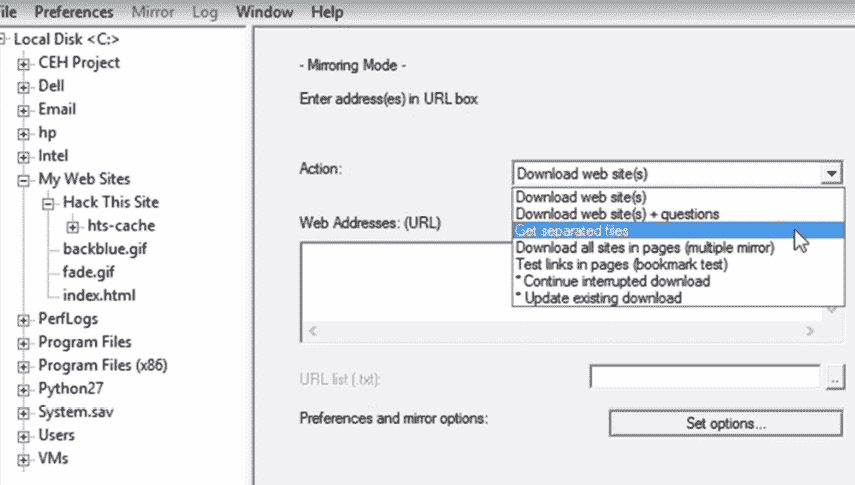

# 第三章：侦察——深入探讨

你知道吗，大多数组织免费提供*情报*！我知道，对吧？！在*侦察*阶段，重要的是要知道，由于互联网*就是互联网*，网上有大量免费的数据，这使得攻击者的工作变得极其简单。这种类型的情报通常被称为**开放源代码情报**，或者，如果你想显得酷一点，可以说**OSINT**。

在本章中，我们将讨论以下主题：

+   调查目标网站

+   Wayback Machine

+   组织免费提供的内容

+   员工——最薄弱的环节

+   侦察对策

# 调查目标网站

让我们来看一下如何对目标网站进行侦察，以及如何利用其他研究网站。当你进行侦察时，目标网站通常是你在快速在线搜索后首先会访问的地方。在那里，你可以了解到该公司的确切功能、位置、联系信息、客户、领导团队成员，甚至更多。你需要特别注意网站上的所有内容。

图 3.1 – 调查一个网站

在*图 3.1*中，我们可以看到这个主页上的几条信息。首先，在左侧，他们提供了如何将**Microsoft** **Outlook**与他们的特定电子邮件产品进行设置的信息。我已经点击并查看了如何通过**Microsoft** **Exchange 2003**进行设置，在那里他们还给了我他们使用的**简单邮件传输协议**（**SMTP**）服务器。稍后，我会描述如何利用这些信息进行横幅抓取，以识别电子邮件服务器。

我们还可以看到他们使用了远程协助软件。当你看到一个组织使用第三方软件时，进行一些漏洞研究是个好主意，看看该产品是否存在任何可能让你进入目标系统的问题。页面上到处都有链接——例如，*图 3.1*中突出的**发送电子邮件帮助**链接。探索所有链接，它们可能会提供有用的信息。

这家公司被另一家公司收购了（你可以看到他们已经将他们寄给所有现有客户的信件链接了）。阅读这封信——它可能讨论了他们正在使用的任何新平台。

让我们看看*图 3.2*中的另一个目标网站。首先，看看他们链接的所有帖子——例如，**商业连接：大数据无处不在**。他们的一些额外帖子可能对我们有价值；它们可能讨论了公司的历史以及我们想要了解的其他信息。即使是历史性的内容，它也可能为我们提供在侦察之后如何进行的线索。

图 3.2 – 调查另一个目标网站

这家公司给了我们很多有价值的信息。他们提供了他们的**Facebook**和**Twitter**账户的直接链接。这里列出了一个聊天服务。如果你看到这样的东西，找出他们使用的是什么聊天服务，并对它进行漏洞研究。

查看页面底部——我指的是*非常底部*。人们往往忽视法律声明和隐私政策，但如果它们在那儿，你应该注意。网站通常也会在底部标明他们的网页设计公司，就像我们在*图 3.2*中看到的那样。对这个公司做一些研究，因为他们可能托管着我们可能想要攻击的多个目标。

查看指向基于表单的页面的链接，比如*联系方式*或*支持*页面。在*图 3.3*中，由于这是一个基于电子邮件的表单，它可能显示出他们不打算让任何人看到的信息。查看页面的源信息/代码，看看他们使用的是 HTML、ASPX，还是其他什么东西：

图 3.3 – 基于电子邮件的页面

在代码中，我们可能会看到一些开发人员通常为自己记忆插入的标识性注释。你会惊讶于我们在页面源代码中发现的内容，因为这些内容在网页本身是看不见的。它是隐藏的——至少对普通用户来说是隐藏的。

许多公司发布一些他们认为完全无害的信息，但黑客看待信息的方式与消费者不同。例如，大多数公司有一个标题为*关于我们的员工*的页面。有时，他们会链接到员工的电子邮件，或者他们会有员工的照片和社交媒体账户链接。社交媒体账户尤其重要，因为有时人们在认为没人看时分享得太多。他们甚至可能分享关于自己工作项目的细节。因此，在调查员工时，做足功课非常重要（稍后我会告诉你如何做到这一点）。

一些网站有专门的论坛，甚至有**互联网中继聊天**（**IRC**）（尤其是当我们看到一个有很多极客的组织时，像**HackThisSite.org**）。看看人们在聊什么。如果他们有 IRC 统计数据或引用，看看那些内容。我们可以通过联系公司里的某个人，开始一次社交工程攻击，比如说，“*嘿，那里工作怎么样？我在考虑申请。*”

要深入研究一个网站，伦理黑客通常使用一个叫做**HTTrack**的程序（[`www.httrack.com/`](https://www.httrack.com/)）。它会将任何给定网站的副本下载到你的硬盘上，包括一些后台代码。想想看，这里有什么可能性。使用 HTTrack，我们可以准确地看到页面是如何布局的，这可能会给我们更多信息，比如它们是否将图像保存到不同的位置。这个程序非常容易运行。只需创建一个项目，进行分类，然后为它指定一个硬盘文件夹进行下载。

图 3.4 – HTTrack 网站复制器

如*图 3.5*所示，您可以选择**下载网站**（**s**），还可以选择**下载网站**（**s**）+ **问题**，这意味着您可以决定是否下载其关联的链接。或者，您可以将网站下载为单独的文件。甚至还有一个选项可以查找并下载网站上的所有 ZIP 文件：

图 3.5 – HTTrack，下载网站

我们可以配置许多选项来准确获取所需的信息（只需点击**设置选项…**）。例如，我们想要扫描什么内容？默认情况下，程序会寻找图片和 CSS 页面。请注意，我们可能对广告不感兴趣，因此可以将其从下载中排除。

另一个需要记住的重要事项是更改浏览器 ID 并接受 Cookies。

让他们认为是另一个浏览器访问了他们的服务器（这个选项在**浏览器 ID**下）。让他们迷惑。即使你在使用**Microsoft**设备，也要让它看起来像是使用**Linux**设备。如果你和我一起操作，下载网站（**HackThisSite.org**）。

过去，我曾在某个网站上找到**Microsoft** **Excel**表格。甚至还找到过密码文件。无论是否找到这些类型的文件，了解目标网站的布局非常重要。

另一个我们可以用来绘制这个系统并可能暴露信息的工具是**链接提取器**工具。该工具通常会浏览给定的网站，并尝试提取其中的内部和外部 URL。要找到适合您的工具，您可以直接在**Google**中搜索**链接提取器**。在*图 3.6*中，我使用的是**Webmaster-Toolkit**中的工具（[`webmasterstoolkit.com/`](https://webmasterstoolkit.com/)）。您只需输入您目标网站的 Web 地址，然后点击**提取链接**。查看网站上使用的所有不同链接可能有助于我们搞清楚服务器的基础设施。有些链接甚至可能提供进入该环境的其他方式。

](Images/B17486_03_06.jpg)

图 3.6 – 使用网站管理员工具包中的链接提取工具

提取链接后，结果如下：

图 3.7 – 链接搜索结果

在查看这些结果时，请确保检查是否暴露了任何信息，例如，**extranet.wayneenterprises.com**或**mail.wayneenterprises.com**。常见的关键字是**email**或**restricted**。我相信你自己也能想到其他一些关键词。

## 高级 DNS 技巧

让我们更深入地了解**nslookup.io**。一种 DNS 记录叫做**SOA**，即**授权起始**。SOA 存储的是关于域名或包含管理信息的区域的重要记录，这些信息可能对你有帮助。

按照以下步骤操作：

1.  就像之前一样，输入**set type=soa**。这个类型查找的是权威服务器。

1.  输入目标 URL（在我们的示例中，这将是**hackthissite.org**）。

1.  退出 nslookup。屏幕应该显示如下内容：

图 3.8 – nslookup，查找权威服务器

1.  Ping 一下被识别为 SOA 的 URL，以获取 IP 地址（**ns1.hackthissite.org**）。

1.  一旦你得到 IP 地址，返回 nslookup 并使用**server [SOA 的 IP 地址]**命令更改你正在使用的 DNS 服务器。这意味着 nslookup 将使用这个 DNS 服务器进行解析。

1.  接下来，改变类型以查找任何地址，输入**set type=any**。

1.  输入**ls -d [目标网站或 hackthissite.org]**。

图 3.9 – nslookup，通过类型查找任何网站

1.  最后一步将执行所谓的**区域传输**，这会告诉权威 DNS 服务器将每个与 IP 地址相关的计算机名称或 DNS 名称的列表发送给我们。它显示 MX 记录和**A**记录，显示是否存在**www**或 FTP（可能是 FTP1 或 FTP2）。这是一种非常简单的方法来提取所有服务器名称。再强调一遍，我们所做的只是对他们的 DNS 服务器执行一个正常的、预期的命令。如今，大多数安全的 DNS 服务器仅允许特定 IP 地址或计算机名称之间进行区域传输。但是，不要以为这会完全保护你——我可以轻易地伪造 IP 或计算机名称。

1.  让我们将类型设置回以返回邮件服务器信息（**set type=mx**）。看看 MX 优先级号码。这个数字表示服务器响应的顺序（数字越小，优先级越高）。

图 3.10 – nslookup，查找邮件服务器信息

在之前的例子中，我再次查看**HackThisSite.org**的 MX 记录。从这个结果列表中，我们可以看到他们的主邮件服务器是**ASPMX.L.GOOGLE.COM**。我们还可以看到他们有几个冗余服务器（优先级较低的**GOOGLEMAIL**服务器）。通常，当你执行区域传输时，你可以看到**TTL**（**生存时间**）。如果 TTL 设置得太长，例如**3600**（即 1 小时），我们就可能污染他们的 DNS。

将他们的 DNS“*污染*”是什么意思？这意味着我更改了 IP 地址（或主机名），将你从合法服务器引导到虚假服务器。

让我通过一个例子来演示。在攻击场景中，等同于对他们的服务器进行操作来感染他们的 DNS。首先，我会操作我系统中的一个文件。

让我们进入我的 Windows 目录，**System32\drivers\etc**，并在 **Windows** **记事本** 中打开其中一个名为 **HOSTS** 的文件。所有计算机在发送请求到 DNS 服务器之前都会查看此文件（**HOSTS**）。我要用这个文件模拟一个 DNS 欺骗攻击（从技术上讲，这是一个 DNS 欺骗攻击，但大多数后来的 Windows 操作系统将此文件设置为**只读**，因此只有管理员才能进行修改）。我将**yahoo.com**的 IP 地址改为**google.com**。如果我保存了此文件，每次我尝试访问 [google.com](http://google.com) 时，我的计算机都会访问该 IP 地址（Yahoo 的 IP）：

图 3.11 – 将 Yahoo 的 IP 地址更改为 Google 的 IP 地址

DNS 欺骗的概念是将所有流量重定向到另一个 IP 地址（至少在一段时间内）。例如，我会让每当员工尝试访问**花旗银行**时，他们会访问我的 IP 地址，在那里我会设置一个非常类似花旗银行的网页，提示用户输入他们的用户名和密码。然后，在捕获他们的登录信息后，我会将用户转发到真正的花旗银行网站（插入邪恶的笑声）。

这些研究在你为一个组织进行渗透测试时至关重要。记住，对于每个这些来源，你需要从黑客的角度来看待它们，而不是从普通终端用户的角度来看。

## Netcraft

有几种工具可以帮助你进行侦察和足迹分析。**Sam Spade** 是其中一个讨论很多的工具：

图 3.12 – Sam Spade

这是一个将**图形用户界面**（**GUI**）添加到我们到目前为止讨论的许多侦察工具中的应用程序。虽然人们将其用作漏洞扫描器来帮助保护他们的系统，攻击者也经常利用它来寻找漏洞。

虽然 Sam Spade 是一个可以追踪到你的应用程序（通过 IP 地址），**Netcraft** 是一个在线工具，它查看面向公众的站点并帮助发现外部服务器。在某些情况下，它还会查看操作系统，甚至通过横幅抓取检查在这些服务器上运行的应用程序。这个部分通常是当人们了解 NetCraft 时最让人害怕的部分。你可以自己尝试访问 [`www.netcraft.com/`](https://www.netcraft.com/)。

**Banner 抓取**就是通过查看哪些端口是开放的，系统如何响应对这些端口的请求来识别系统。Windows 服务器在端口**80**上的响应与 Linux 服务器有所不同。这些差异帮助服务（和一些工具）识别目标系统。

Netcraft 旨在通过暴露任何问题或漏洞并加以修复来确保环境的安全。作为攻击者，这是我会利用的东西。Netcraft 提供了多种服务，专注于帮助你确保环境安全，但它对我们来说的主要用途是找出网站使用的 Web 服务器。

图 3.13 – 使用 Netcraft 查找网站的 Web 服务器

让我们打开 Netcraft，试试我们最喜欢的网站——**HackThisSite.org**。你可以看到它给了我们相当多的背景信息：

图 3.14 – 在 HackThisSite.org 上试用 Netcraft

它提取了一些他们使用的关键词。它给了我们该网站的 IP 地址，包括其 IPv6 地址和域名注册商。我们还可以看到托管历史，这显示他们使用的是基于 FreeBSD 的负载均衡器，（如果没有正确修补）可能是一个很好的攻击目标。Netcraft 还展示了他们的网络轨迹以及他们使用的服务器端技术，如 PHP、SSL、JavaScript 和 CSS。

图 3.15 – Netcraft 显示的 Web 轨迹

以下截图显示了更多信息：

图 3.16 – 更多信息

他们使用什么工具来查看用户访问他们网站时使用的浏览器？如你所见，我们可以通过这个工具学到很多信息。

当我用我的旧网站（**utahwisp.com**）进行测试时，它给了我们该网站的托管历史，包括 IP 地址、Web 服务器和操作系统。如果你正在进行对自己组织基础设施的渗透测试，这将非常有用，因为它能够很好地展示你所使用的服务器和 Web 服务器服务：

图 3.17 – 测试 utahwisp.com

Netcraft 的另一个优点是它会显示*Netcraft 风险评级*。0 分（满分 10 分）是一个非常好的安全评级，但这并不意味着它不可被攻击。显然，他们公开这些信息对攻击者来说暴露了很多东西。许多为合法目的创建的工具，比如 Netcraft，攻击者只要转换一下角度就能利用。

# Wayback Machine（时光机）

到目前为止，互联网已经存在了相当长一段时间，许多网站和网页已经被淘汰。**Wayback Machine**（[`archive.org/web/web.php`](https://archive.org/web/web.php)）允许我们查看可能已经不存在的旧版本网站。可以把它看作是*互联网的档案馆*。一旦我们找到了目标网站的旧版本，就可以扫描出*历史数据*，这些数据可能是人们无意间泄露的。现在，在我开始从事安全工作之前，我根本不知道这个工具的存在，但它真的很有趣，可以当做娱乐工具使用（比如，向孩子们展示**亚马逊**以前的模样）：

图 3.18 – Wayback Machine 主页

你可以在这里看到他们已经保存了超过*4560 亿*个网页。Wayback Machine 会扫描网站并检测任何变化——如果它检测到变化，它会记录并缓存该信息。举个例子，我会用我之前公司的官网。该网站现在已经不再维护，但你可以看到在 2003 年时还曾有一些活动。这里有一个来自 2003 年 1 月 10 日的快照：

图 3.19 – Wayback Machine 展示 utahwisp.com 的变更历史

在快照中，你可以看到我的网页开发技能。我当时的能力相当强。这是那个时代我们还在使用记事本的时期。我想到那时我已经转到**HotDog**，它是最早的所见即所得（WYSIWYG）网页设计工具之一。

在这里我们可以找到哪些对我们有用的信息呢？我们可以找到该组织的目的和信息传递，所在位置，联系方式，如手机号码，以及有关电子邮件选项的信息，包括登录页面。请注意，这只是一个例子——你的目标网站仍然在运行，所以很多基础设施可能仍然完好：

图 3.20 – Wayback Machine 更多信息

当公司最初建立他们的网站时（尤其是在过去），他们列出了各种信息。他们并未认为这是一种安全风险。这意味着，如果我们回去查看他们网站的旧版本，可能会暴露出很多信息，例如员工或领导层的个人信息。甚至可能有一个新闻发布区，宣布他们正在迁移到**Microsoft** **Server 2000**，并且计划迁移到**2008**。即使人们认为他们已经删除了网站上的历史信息，总是能在某个地方找到记录。

# 组织免费提供的内容

当我大约 25 岁时，曾在我居住的城市有一个广播电台，*The Q*，他们举办了一场大型比赛，其中包括赠送一个丰厚的奖品包。他们每天都会藏一个大木字母 Q，这个字母 Q 大约有一英尺见方（30 x 30 cm），厚度大约是 2 英寸（5 cm），并提供线索指引在哪里可以找到它。如果你找到了这个 Q，你就能赢得一个奖品包，可能包括几辆四轮车、一趟去夏威夷的旅行、电视、很多其他的东西。

我每天跟踪他们发布的线索，觉得我知道它在哪里，于是我在这个巨大的公园里找了好几个小时。大约三四个小时后，我放弃了。结果，我离它大约 25 英尺（8 米）的地方就放弃了。直到今天，我依然为此感到遗憾。侦察工作也是如此——你必须*到处*寻找，尽管会有大量信息呈现给你。

你越是努力去了解目标，你就越能发现更多信息。著名作家*《悲惨世界》*的作者维克多·雨果曾说过：“*坚韧不拔，是所有胜利的秘密*”——这在侦察过程中尤其真实。

在这一部分，我们将了解你还能发现关于目标的哪些信息。我们将探讨他们发布的可能对我们作为道德黑客有用的信息。这包括招聘网站、宣传材料、社交媒体和电子邮件。

## 招聘网站

招聘网站给了我们大量的信息。我不仅仅指的是标准的招聘网站——我们还会从公司运营的招聘网站获取信息，包括公司网站上的职业页面。

当我们开始查看一个著名的招聘网站时，我们会按职位名称或技术来搜索。公司在为特定职位招聘时，可能会不经意地暴露出他们正在使用的不同技术，即使这是一个临时项目的招聘。我会进行这些非常具体的搜索，因为我并不打算直接针对某个公司，但你也会想要查看目标组织在线上发布的所有职位空缺。

记住，你不是以潜在员工或雇主的身份来看待这些信息的，要从攻击者的角度去看待它。

我将以**Monster**（[`www.monster.com/`](https://www.monster.com/)）为例。首先查看一些技术类职位，比如**系统工程师**。在下面的例子中，根据他们要求的资格，我们可以看到他们正在使用**Microsoft** **Active Directory**、**Windows** **Server 2008**、**VMware**和**Hyper-V**。

他们还在寻找具有**Cisco**知识的人，这意味着我们可以推测他们可能在使用什么样的路由器和交换机。他们还提到了**SolarWinds**和**Spotlight**监控工具，所以现在我们知道他们内部使用了什么类型的监控工具。一旦你获得了这些信息，你将需要调查每个组件的架构，看看是否存在任何漏洞，或者更好的是，你可能会看到需要避免的安全系统。

](Images/B17486_03_21.jpg)

图 3.21 – 系统工程师的职位要求

让我们尝试换一种方式搜索——通过关键词。寻找那些需要知道过时服务器的人的职位。比如我们可以试试**server 2003**。

图 3.22 – 在 Monster 上搜索 "server 2003" 关键词

我们再次来看一个招聘机构的职位发布。他们要求有**Microsoft** **SharePoint 2010** 认证和权限模型的工作经验，并且有 SQL 管理经验。所以，我们可以获得关于后端的相关信息。他们还希望招聘具有**Visual Studio .NET**经验的人，看起来他们有内网和互联网门户网站，这些都由 SharePoint 托管。所有这些系统都已经过时了，令人惊讶的是，仍然有很多组织在运行如此陈旧的系统。如果它们不是这样，我也不会这么忙！

图 3.23 – SharePoint 管理员的职位要求

你也可以通过查看其他招聘网站来做到这一点，例如**DICE**（[`www.dice.com/`](https://www.dice.com/)）、**Indeed**（[`www.indeed.com/`](https://www.indeed.com/)）等。特别注意你目标公司的招聘职位，这些职位可以为你提供关于他们运行的系统和整体网络架构的宝贵见解。你甚至可以了解他们可能采用的安全控制措施。例如，他们安装了什么类型的**入侵检测系统**（**IDS**）？

现在你能理解为什么招聘网站让我感到兴奋了吗？它们可以提供大量的信息，这使得我们的工作变得轻松。

## 市场营销和客户支持

我们可以通过查看组织的社交网络资料学到很多东西。正如前面一节所示，招聘人员和求职网站可以提供有价值的信息，例如目标使用的平台或系统。我们还可以注意他们如何支持用户，因为这对于社会工程攻击来说可能很重要。例如，我可以打电话给某个随机员工：“*嘿，吉姆，我是 IT 部门的弗雷德。我刚刚重置了你的账户，需要确保你的密码能够正常工作并让你登录。能告诉我一下你的密码吗？*”

如果用户支持是通过电子邮件进行的，我可以伪造一封电子邮件，让它看起来像是来自他们的 IT 部门。或者更好的是，进行一次**CEO 欺诈邮件攻击**，攻击者（在对公司进行侦察后）冒充高管，制造紧急问题，要求会计人员或他们的助理将款项转账到特定账户。我们还可以查看目标发布的用户调查，以收集反馈，因为他们提出的问题可能会为我们提供关于他们商业战略的洞察。

如果我们开始关注他们正在推广的产品，这也应该为我们提供一些关于其产品规格的信息。在实际应用中，如果我注意到一个特定目标使用了某个软件，我会追溯并尽可能多地了解该软件的相关信息。

在我们的文化中，我们分享了过多的信息，无论是个人方面还是商业角度。社交网络环境，如**Twitter**、**Facebook**、**LinkedIn**，甚至**Google+**，现在都被用于营销和个人用途。这种结合可能会暴露出具有非常具体后果的信息。希望如果你正在阅读这些内容，你明白如果你发布了某些东西，你是无法撤回的，即使你立即删除也无济于事。我们已经看到成千上万的人因为在网上发布了不当内容而失去了工作。同样，我们也看到很多公司因为这个原因而亏损。

让我们看看可以用来挖掘这些社交网站来获取目标数据的几种不同方法。显然，首先从攻击者的角度进行观察，看看能找到什么。查看他们的之前发布的帖子，看看上传或发布的照片，检查员工的个人网站。令人震惊的是，很少有人对自己的网站设置控制措施。

## 财务和竞争分析数据

企业经常进行竞争分析，以评估他们的竞争对手或制定市场战略。作为攻击者，我们可以利用那些本来是为商业分析而提供的服务，来达到一些更为不道德的目的。

有许多网站可以使用，但我将专注于一些更受欢迎的网站，如**雅虎金融**，**谷歌金融**，**CNN**，**MSNBC**，**MarketWatch**，**华尔街传讯**等等。其中一些网站提供公司股票市值、公司概况及其主要竞争对手等信息。所有这些信息在未来的渗透测试中可能都会有所帮助，尤其是在社会工程攻击方面。

您可以通过允许竞争对手分析的工具获取此信息，或者通过设置电子邮件提醒以更新特定公司的概况。例如，如果微软发布有关新**HoloLens**的信息，或者如果谷歌发布有关结束**Gmail**的信息，您显然希望得到此类信息的通知。您将需要注册这些服务，但这是监视公司动态的一种好方法。

竞争分析工具允许企业发现关于*竞争对手*的信息。

攻击者利用这些服务来获取关于公司的基本信息，例如成立时间、领导、位置和产品等。许多这些工具不仅提供竞争对手的分析，还可能提供他们的产品、客户群体、供应商等的分析。他们使用我们已经讨论过的相同技术来收集这些信息。然后他们收费，并为您提供一个带有专利、商标、目录、客户、供应商访谈、新闻稿、年度报告等详细报告。他们基本上替您出去做了所有的间谍工作，这是完全合法的。

# 员工 - 最薄弱的环节

你有没有遇到过找东西找了很久，结果就在你眼前的情况？这通常发生在我的眼镜上。我会到处找它们，跑遍整个房子说，“*有人看到我的眼镜吗？*”我的妻子会转过头对我说，“*它们就在你头顶上*。”

同样的概念，使用不同的侦察技术。我们在侦察阶段收集的一些数据非常容易找到。事实上，许多信息可以通过我们可能已经在使用的在线服务找到：

图 3.24 – 可收集信息的在线服务

员工方面是令人担忧的地方。例如，如果员工玩游戏，这可能展示出他们的兴趣和爱好（不是说有人坐在家里拿着锤子砸糖果）。这些信息为我们提供了人们熟悉的事物的良好感知，这可能在未来的密码破解中对我们有所帮助。

要更进一步，你可以创建一个虚假的身份并开始与目标互动。例如，如果你是某个游戏机的超级粉丝，你可以尝试进入他们讨论维修的论坛。你甚至可以先问目标几个问题，建立关系。这就是*社会工程*的一个小小尝试——我们收集信息的另一种方法。

他们分享了哪些照片？从这些照片中，我们可能会发现一些信息：谁是他们的家庭成员；照片拍摄的地点；他们是否经常去那个地方。如今，智能手机甚至会用**GPS**（**全球定位系统**）坐标标记照片，使得了解某人所在位置变得更加容易。我们还可以从照片的背景中提取更多信息——这可能是他们的街道地址、他们所在的体育联赛，或是他们孩子就读的学校。我知道这些是和家庭相关的，但也可能很危险。我对家庭非常保护，也希望你们能意识到发布看似无害的关于你孩子的信息是有问题的。

员工可能会发布他们在周末去本地酒吧的照片，揭示了他们和朋友们聚会的地点。现在，我们知道去哪里可以遇到在该组织工作的人员。

他们与谁在好友列表中有联系？这可能为我们提供一些潜在的额外目标。但更常见的是，这对于回答安全问题非常重要。我们在尝试重置密码时经常遇到的一个安全问题是，*你小时候最好的朋友是谁？* 我们可能仅通过社交媒体上的互动就能弄清楚这一点。如果这不奏效，我们可以实施一个小规模的社会工程攻击。例如，如果我看到布鲁斯·韦恩和克拉克·肯特是朋友，我可以给布鲁斯·韦恩发送一封伪造的电子邮件，声称是克拉克·肯特发来的，询问我在攻击过程中可能需要的其他信息。

目标是否经常发布他们的位置或正在做的事情？例如，布鲁斯·韦恩说他本周要去大都市。对于我们这些攻击者来说，这意味着他离开了哥谭市，银行在他不在的情况下完全暴露，我可以轻松抢劫。目标是否在个人资料上发布了他们的电话号码？他们是否设置了严格的隐私保护措施？

从这个角度看待安全：我可能是世界上最安全的司机，但酒驾的人仍然可能撞上我。同样，我可以尽一切努力阻止别人获取我的信息，但我的最好的朋友可能有一个公开的个人资料。如果我们曾在线互动，那可能会暴露一些关于我的额外信息，比如我的朋友或家乡。

## Facebook

根据**Tech Crunch**的报道，约有 20 亿用户每月登录 Facebook。每天大约有 13 亿次登录：

[`techcrunch.com/2017/06/27/facebook-2-billion-users/`](https://techcrunch.com/2017/06/27/facebook-2-billion-users/)

每天上传超过 3 亿张照片。当人们访问 Facebook 时，平均每次停留时间为 20 分钟。Facebook 已成为日常生活中不可分割的一部分。这意味着这个网站不仅对侦察有价值，而且对*攻击*阶段也很有用。假冒账户多达 8500 万个。

让我们来看一下从 Facebook 页面中可以提取的信息——以约翰·韦恩为例。我找到了他的 Facebook 页面，他确实有发布一些内容，这有点怪异：

图 3.25 – 约翰·韦恩的 Facebook 页面

人们会在 Facebook 页面上发布各种个人信息，因为我们常常没有意识到看似微不足道的数据在错误的人手中会变得非常暴露。从这些页面，特别是从约翰·韦恩的页面上，我们可以得知他的网站、他出差的时间、他喜欢的航空公司、他的生日、个人成就、父母的名字、他住过的地方、宠物的名字、高中、爱好等等。我们还可以通过评论他照片的人来找出谁是他的朋友。当他被标记在一张照片中时，我们可以查看背景中的建筑物，看看能否辨认出他的位置。照片里有他的车吗？能看到车牌号码吗？他发布了一张和女儿的合照，现在我们知道了她的名字以及她大致的出生时间。

如你所见，人们倾向于在线发布大量信息——即使是已故名人的信息。这说明了什么？它反映出人们对在互联网上分享个人数据的兴趣。

## LinkedIn

LinkedIn，作为一个专为商业关系设计的平台，还是一个受欢迎的社交媒体平台。目前大约有 1300 万家公司在其平台上列出，总用户数为 4.67 亿人。让我们来看看在 LinkedIn 上我们可以发现什么。

你应该在 LinkedIn 上记录的**目标信息档案**（**TIP**）的关键信息如下：

+   当前和过去的就业数据

+   教育信息、认证和技能

+   个人兴趣、联系信息和位置

+   他们可能参与的显著连接和群组

例如，你可以查看列出的技术技能，看看目标的教育背景，调查该项目以获取更多关于他们能力的细节。正如之前在*招聘网站*部分提到的，我们能够看到目标习惯使用哪些平台，这可能帮助我们了解他们当前雇主正在使用的工具（如果这是我们关注的对象）。不要忽视人们加入的群组——我们常常能看到某人在群组中的讨论，因为人们往往会加入一些帮助他们解决特定项目或问题的群组。

如果我们与某人有联系，我们还可以收集到更多的信息。在某些情况下，人们会接受 LinkedIn 的连接请求，仅仅是为了建立他们的职业网络。因为这是一个专业平台，人们通常不会分享非常个人化的想法，所以更少有人会担心他们通过这个网站暴露的信息。

让我用我自己的个人资料给你举个例子：

](Images/B17486_03_26.jpg)

图 3.26 – 显示经验部分的 LinkedIn 页面

在某些情况下，你可以根据一个人过去的经历来估算他们当前雇主的网络基础设施。随着我们浏览这个档案，你可以看到我曾为*My Mentored Learning, Inc*工作。这是我现在的公司，当我出去讲课时会用到它。我们还有位于盐湖城的*New Horizons*。还有*UtahWISP*和*Advanced Technical Training*（另一个培训中心）。特别要看一下我在*图 3.27*中列出的认证。我可以马上说，这个人对微软服务器、Exchange、SharePoint 和系统中心有一定了解。在现实生活中，你可以推测我在当前的工作中也使用了这些经验（并可能是这些特定技术）。

图 3.27 – 许可证与认证部分

## 研究人员

到目前为止，你已经知道了员工如何为我们的侦察提供有价值的信息。这可能是因为他们在社交媒体上分享了太多信息，分享了他们的技能和过去的工作经历，或者其中某个人*就是我们想要通过社会工程攻击来瞄准的弱点*。

总体而言，我们试图为每个人创建一个档案。即使是看似无害的信息也可能有用，因为人们经常根据他们在线上透露的内容来设定密码。要查找的信息包括职位、爱好、是否参与任何类型的慈善工作，或其他任何可能感兴趣的信息。我们还希望尽量收集诸如电话号码、家庭地址、电子邮件地址，以及可能的银行或信用卡信息。

为了找到这些信息，大多数人会使用第三方产品。有一些显而易见的来源，如个人博客或社交媒体，但也有一些专门的在线搜索产品，用于查找这类信息。这些包括**PeopleLookup** ([`www.peoplelookup.com/`](https://www.peoplelookup.com/))、**AnyWho** ([`www.anywho.com/whitepages`](https://www.anywho.com/whitepages)) 和 **CheckPeople** ([`www.checkpeople.com/`](https://www.checkpeople.com/)) 等网站。

图 3.28 – 在 PeopleSmart 上查找人

我以自己为例，使用**PeopleSmart**进行搜索。我只需输入我的姓名和犹他州盐湖城，然后点击**搜索**。这些网站搜索公共记录以及法院记录，并使其对普通人可访问。这些信息已经公开，但他们让我们很容易获取。请注意，大多数这些是付费服务，需要更多信息。但即使是免费版本，我也可以看到我的旧电话号码和地址。您可能希望通过在**Google** **Maps**上找到地址，了解这个人住在哪里。再次强调，这样做的目的是为您提供一些提示和细节，以便将其添加到您的信息数据库或您的 TIP 中。

专业提示

许多搜索引擎，如谷歌和雅虎，会提供更新通知。如果有人在该网站上做出更改，您可能会收到这些更新的通知。相信我 - 攻击者已经在这样做，以查看您何时发布新工作。

## 社会工程学

我将*黑客*定义为让设备执行超出其设计范围的操作。这正是社会工程攻击所实现的，或者，正如我所称之的，*人类黑客*。

默认情况下，人类不是为了泄露个人信息而设计的。我们知道这是错误的，但我们继续暴露关于自己的信息，因为人们或服务说服我们应该以某种方式信任他们（这被称为*获得目标的信任*）。

信息

几年前的一部**麦克菲**纪录片([`www.youtube.com/watch?v=yzU82Ul96pU`](https://www.youtube.com/watch?v=yzU82Ul96pU))完美地展示了社会工程学的力量。它描述了一个针对一名女性的最著名的社会工程攻击，仅仅基于她访问家谱网站的事实。一群人假装与她有关系，利用她的情感（社会工程学的特点）。他们声称他们试图摆脱困境，需要钱来做到这一点。最终，她给了他们超过$500,000。最终，这被一名灰帽黑客揭露，他通过再次黑客攻击她来调查袭击的程度，看看攻击者是如何针对她的([`www.youtube.com/watch?v=F9GylhWsVc8`](https://www.youtube.com/watch?v=F9GylhWsVc8))。

那么，这通常是如何实现的呢？其中一种最基本的方法是**垃圾桶潜水**。令人惊讶的是，这正如它听起来的那样。你可以从某人的垃圾桶中找到很多信息。一个很好的例子是，在微软被美国司法部调查其如何实施**Internet Explorer**时。你可以在[`www.newsweek.com/diving-bills-trash-161599`](http://www.newsweek.com/diving-bills-trash-161599)上阅读相关内容。**Sun Microsystems**雇佣了人员到微软所在地进行垃圾桶潜水。因为垃圾不被视为公司财产，他们从中找出了一些报告，显示了微软的一些可疑行为。

我们也可以**窃听**目标。窃听可能包括**物理监听**（例如，听隔壁隔间的人说话）、**数字窃听**（比如通过电子邮件）或者所谓的**肩窥**（偷偷观察别人正在做什么）。

我尽量保护自己免受这种情况的影响。事实上，我的妻子觉得我疯了，因为每当我外出并需要刷借记卡时，在输入密码前，我都会转过身来，确保没有人在旁边偷窥。有些数字方式的肩窥也存在——例如人们用手机拍照。我对那些站在我后面，拿着手机的人非常警觉，因为即便他们把手机放在耳边，他们的摄像头也可能在录制我的密码。相同的原则也适用于密码输入，所以在公共场所输入密码时要特别小心。

窃听也可能是危险的，因为它可能让人更有说服力地冒充你合法关联的组织中的员工。也许你在当地的超市接到电话，抱怨你的银行——花旗银行。一个骗子可能听到了你的抱怨，然后打电话给你，说花旗银行有问题，并正在联系客户确认身份。通过这种方式，他们利用你的一些小细节来让你泄露可能有价值的个人信息，或者你认识的人的信息。

## 你有邮件 = 我抓住你了！

另一个收集情报的好工具是*电子邮件*。我们可以追踪电子邮件何时被阅读、是否被转发、阅读时长、访问的链接、使用的服务器类型、收件人所用的操作系统等等。电子邮件中嵌入了大量信息。

让我给你举个例子：

图 3.29 – 电子邮件中嵌入的信息

这是我从*Thrifty Car Rental*收到的一封邮件头部——一封典型的关于即将到来的汽车租赁活动的广告邮件。看看这个邮件头部信息——每封邮件都会有这些信息。早在没有 Outlook 的年代，很多技术性信息都会列在所有邮件的开头。现在这些信息被隐藏了，但你仍然可以通过查看高级头部来显示它（通常是这样）。

从邮件头部，我们可以看到邮件发送的对象、发送的日期和时间、邮件来源的服务器、发件人的 IP 地址，甚至发件人使用的认证系统。这意味着，如果我们想获得 Thrifty 的某个邮件服务器的名称，我们只需注册接收他们的邮件即可。

有几个工具可以用来收集邮件中的信息，这些信息对于邮件接收者来说是完全不可见的。**Email Lookup** ([`www.ipaddresslocation.org/`](https://www.ipaddresslocation.org/)) 由**IPAddresslocation.org**提供，可以扫描邮件头部。如果你想追踪某一封邮件的情况，你可以使用**eMailTrackerPro** ([`www.emailtrackerpro.com/`](http://www.emailtrackerpro.com/))。它会显示发件人可能位置的地图和一些 WHOIS 信息。**PoliteMail** ([`www.politemail.com/`](https://www.politemail.com/))是一个可以和 Outlook 配合使用的工具。它会创建一个地图，显示特定邮件经过的不同邮件服务器。

**DidTheyReadIt** ([`www.didtheyreadit.com/`](http://www.didtheyreadit.com/)) 是另一个应用程序或工具，可以帮助你判断邮件接收者是否阅读了邮件，或者他们是否直接删除了邮件。**ReadNotify** ([`www.readnotify.com/`](https://www.readnotify.com/)) 可以告诉你邮件何时被打开，是否重新打开，接收者是否转发给其他人，如果是的话，转发给了谁。这个工具还带有一个漂亮的图形界面。

这类服务在销售和营销领域尤其流行——他们想知道你何时打开了邮件，点击了其中的链接，甚至你花了多长时间阅读它。如果你为某家公司工作，营销团队可能已经有权访问这些工具。

目前，基于反向查找，大多数邮件服务器如果认为邮件头部被伪造，会将邮件丢弃。当一封邮件到达时，服务器会问，*这封邮件来自哪个邮件服务器，它的 IP 地址在邮件头中是什么*。然后它会进行反向查找，看看这些信息是否依然有效，因为大多数时候，当有人伪造邮件头部或伪装邮件地址时，这些信息无法匹配，邮件服务器会将其丢弃。使用这些工具可以帮助安全专家查看他们的邮件系统是否容易受到不同类型侦察的攻击。

一个很好的例子是，正如我之前提到的，许多公司都成为了 CEO 诈骗邮件的受害者。攻击者伪造了公司电子邮件账户，冒充高管，欺骗财务或人力资源员工执行未经授权的电汇或发送机密税务信息，正如这篇文章所展示的：

[`krebsonsecurity.com/2016/04/fbi-2-3-billion-lost-to-ceo-email-scams/`](https://krebsonsecurity.com/2016/04/fbi-2-3-billion-lost-to-ceo-email-scams/)

# 侦察对策

我最喜欢的电影之一是 *《红色警戒》*。当鱼雷飞来时，肖恩·康纳利大喊：“*释放对策！*”而这正是我们在这里需要做的。我们需要了解 *侦察的对策*，以及在进行渗透测试（pen test）时需要关注的内容。你可能知道 GI Joe 的名言：“*知道就是半场胜利。*”这同样适用于我们。了解你暴露了什么，知道攻击者能做什么，才是半场胜利。

在这一部分，我将展示如何设置防护措施并实施这些对策，同时介绍一些侦察的最佳实践。我还会展示如何进行渗透测试的准备工作以及进行侦察时应跟踪的实际工作流程。

## 对策

那么，如何防御我们之前回顾的那种侦察技术呢？

首先，你需要确保已经配置好路由器，使其不会响应某些类型的流量。换句话说，确保它们不会自我标识。

这是一个有趣的练习。**Linksys**路由器的默认 **SSID**（**服务集标识符**）是什么？哦，没错，是**Linksys**。我喜欢做的事情是把这个 Linksys 路由器的 SSID 改成 **D-Link**——因为这是 D-Link 路由器的默认广播名称。这就是误导。当攻击者来时，他们会尝试对我的路由器发起 D-Link 攻击，而不是 Linksys 的攻击。所以，请确保你的路由器不会泄露不该泄露的信息。

这里有一些保护自己的建议：

+   确保你使用某种 IDS（入侵检测系统）。

+   在部署你的 Web 服务器时，不要让它们保持默认的配置/设置。

+   去掉 *powered by...*，因为它可能泄露过多信息（你在我们之前讨论的谷歌黑客技术中已经看到过）。

+   强制执行安全策略。这包括对员工进行培训，确保他们遵守这些政策，以免在有人打电话给他们时就信以为真：“*嘿，我是 IT 部门的 Billy Bob，我需要重置你的密码——你能告诉我目前是什么密码吗？*”

+   在服务器上实施（并强制执行）安全策略。仅仅有这些策略却不执行，就像父母威胁要禁足孩子，但没有付诸实践。

+   对自己进行一些侦察。

+   关闭未使用的端口，如果有开放的端口，进行白名单配置。

+   禁用 Web 服务器上不必要的服务。微软有一个**最佳实践分析器**（**BPA**）工具，它会检查并告诉你哪些服务是不需要的，取决于服务器的角色。

+   防止搜索引擎缓存。你可以创建一个叫做**robot.txt**的文件。这个文件告诉 Google 哪些文件夹和文件不需要爬取或索引。唯一的缺点是（你会笑这个）我可以使用 Google 来查找那些包含**robot.txt**文件的网站。

+   禁用目录列表，以防止人们了解操作系统或进行目录遍历。

+   配置内部和外部 DNS（分别进行）：

    +   例如，如果你的公开网站是**gotham.com**，确保你的内部 DNS 环境也不是**gotham.com**。

+   限制输入类型（如管道符、逗号和冒号）。如果你观看 SQL 注入的视频，你会更清楚这一点，因为限制输入类型就是拯救你一命的关键。

+   避免在你的网站上进行交叉链接（链接到网站内部的其他页面）。这样只会帮助 Google。

+   永远记住——人类是最弱的环节。实际上，我最喜欢的一句话是，“*人类愚蠢没有补丁*。”有报告指出，美国国税局（IRS）开始大力推动培训所有员工如何避免社交工程攻击。在 30 天内，他们进行了渗透测试，65%的员工泄露了他们的信息。培训你的员工，并帮助他们设置加密或更强的密码。如果你有组织的通讯，可以通过它发布更新。这会带来回报。

现在，我知道侦察可能让人感到不知所措，尤其是要记住该寻找什么，所以我为你准备了一个很好的解决方案。去看看**OSINT 框架**（[`osintframework.com/`](https://osintframework.com/)）。正如它的名字所示（*开源情报*），这个网站将帮助你在研究过程中利用开源（或公开可用的）情报，覆盖所有基础。此外，它可能还会给你一些新的想法，帮助你在目标上找到更多的情报：

图 3.30 – OSINT 框架

这样，我们就结束了本章内容。恭喜你成功完成了这一章。

# 总结

我们的探索让我们调查了攻击者如何从目标网站收集信息，以了解目标的业务功能、重要联系信息、客户和合作伙伴、管理团队等。我们学习了如何使用 WHOIS、命令行接口、ping 和 DNS、SOA 来收集信息。我们还学习了更多帮助进行侦察和足迹分析的工具，如 Sam Spade、Netcraft 和 Wayback Machine。

我们看到组织所提供的免费信息如何揭示出大量的漏洞。工作网站、营销材料、客户支持、社交网络资料以及财务和竞争分析数据也能揭示许多问题。

我们还讨论了员工作为最薄弱环节的问题。他们的兴趣爱好、在线分享或发布的内容、下班后去的地方、购买的物品等，都为攻击者提供了所需的线索。接着，我们讨论了攻击者如何利用这些线索，加入目标常去的群组，成为他们或他们朋友的 Facebook 朋友，在 LinkedIn 上建立联系，和/或找到方法进行社会工程学攻击。

在*人员搜索*部分，我们学习了如何使用第三方产品（如 PeopleLookUp、Anywho 和 CheckPeople）来进行人员画像。

现在我们已经进行了初步侦察，下一步是开始扫描我们发现的网络。我们将通过扫描来寻找活跃的目标，并了解目标组织的基础设施。扫描可以通过多种技术进行——有些是被动的，有些是主动的。

# 问题

结束时，这里有一系列问题，供你测试自己对本章内容的掌握情况。你可以在*附录*中的*评估*部分找到答案：

1.  使用 nslookup 可以收集哪些信息？

    1.  DNS 服务器位置

    1.  主机名和 IP 地址

    1.  WHOIS 情报

    1.  域名服务器和操作系统

1.  以下哪项最准确地描述了足迹分析？

    1.  调查目标

    1.  服务枚举

    1.  服务发现

    1.  与人对话

1.  哪个记录会透露关于域名邮件服务器的详细信息？

    1.  Q

    1.  MS

    1.  MX

    1.  A

1.  如果你无法直接从目标收集到足够的信息，你有哪些替代选择？

    1.  社会工程学

    1.  EDGAR

    1.  竞争分析

    1.  扫描
