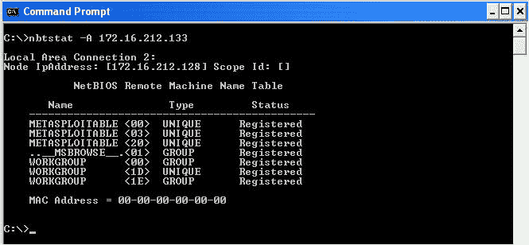
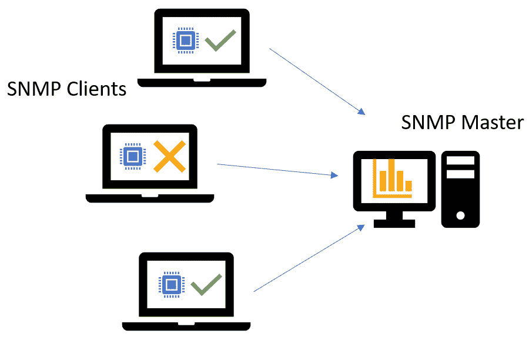
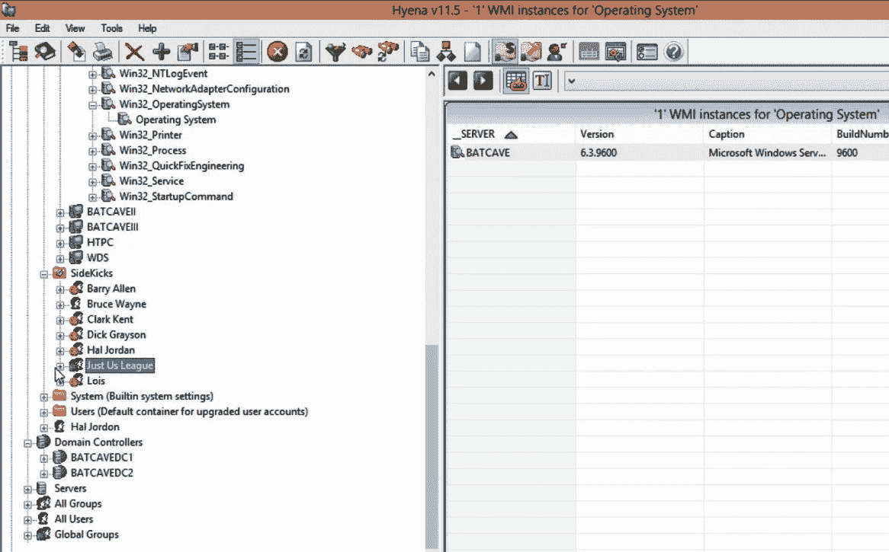
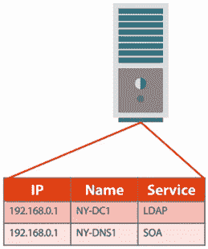
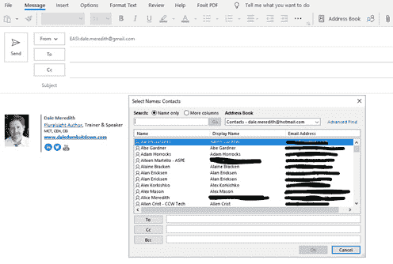

# 第五章：枚举

枚举非常有趣。它会导致一些我们通常不希望发生的事情。它让系统表现得异常，或者以我们无法预料的方式行为。*史蒂夫·沃兹尼亚克*，苹果的创始人之一，说过：“*很多黑客行为其实是和别人玩，你知道，让他们做一些奇怪的事情*”，这正是枚举为我们做的事情。枚举是评估任何目标的核心部分。枚举可以像对一个 IP 地址进行反向 DNS 查找那样简单，或者像对目标进行整个 OSINT 过程那样复杂。枚举目标是渗透测试中最重要的步骤之一。对网络进行枚举的目标是尽可能多地收集关于该网络的信息。这个过程通常会查看主机及其提供的服务。有了这些信息，道德黑客可以识别并利用网络中的漏洞。

在枚举网络之前，了解*枚举*到底是什么以及为什么它有用是非常重要的。

在这一章中，我们将涵盖以下主要内容：

+   什么是枚举？

+   需要了解的端口和服务

+   通过默认值进行枚举

+   NetBIOS 枚举

+   使用 SNMP 进行枚举

+   通过 LDAP 进行枚举

+   网络时间协议

+   使用 SMTP 进行枚举

+   黄金票证 – DNS

+   哦，等等，还有更多！

+   对策

开始吧！

# 什么是枚举？

这种技术通常在内部进行。虽然也可以通过侦察来完成，但风险略高，因为我们需要与目标机器建立主动连接，这意味着我们做的事情可能会被安全团队检测到。当用户连接到网络共享时，他们必须提供凭据。这些凭据与我们称之为**访问控制列表**（**ACL**）相关联。该 ACL 包含有访问权限的用户名和组以及访问者的权限。所以，也许我们可以欺骗目标机器，获取这些信息，而无需提供我们的凭据。

我们还会查看一些服务。如果我们通过侦察和扫描技术了解某个特定服务，我们可以枚举这些服务，以获取关于操作系统之外的更多信息。这被称为**空会话**。许多较新的操作系统已经屏蔽了这种功能。问题是并不是每个人的系统都更新到最新版本，总有一台小机器没人监控。而且，也许你无法负担最新最强的设备，因此创建这些空会话是建立主动连接的一种方式，之后可以查询服务和/或共享资源。

当我们接触一个目标时，我们会提取诸如用户名和可能的用户组等信息。在某些情况下，我们还会获取属于该组的用户。如果我们现在还不能做到这一点，我们应该能够获取机器的名称，以及该系统可能正在运行的网络资源和服务。

再说一遍，我们可能能够提取的一些信息还包括路由表——特别是如果是像交换机或路由器之类的设备，并且还涉及审计服务。我们还会尝试暴露一些应用程序。再一次，我们应该通过扫描和侦察阶段发现这些应用程序，但通常，应用程序本身可能会暴露大量数据。此外，如果我能获取一些 DNS 和**简单网络管理协议**（**SNMP**）信息，这可能会让你的生活变成一场噩梦。

现在，让我们讨论一下枚举的弱点。

## 我最喜欢的一些枚举弱点

当谈到枚举时，攻击者通常会寻找我们所说的*低悬果实*。这意味着我们会首先寻找最容易的弱点。以下是攻击者最初会瞄准的一些低悬果实。

### 名片

商务名片如何暴露弱点？想一想，商务名片上写的是什么？你的名字、地址和公司名称。这似乎没有透露太多信息，对吧？那么你的电子邮件地址呢？他们可能不会给你发垃圾邮件，但猜猜看？大多数公司——由于活动目录的工作方式，或者任何目录服务——会通过并创建用户名（也就是所谓的区分名），这些用户名可以用来登录到网络。我们通常认为登录就是**域名**\**用户名**（**gotham**\**bwayne**）。大多数目录服务技术也会接受**bwayne@gotham.com**。它使用的命名语法与电子邮件相关联。

作为攻击者或黑客，我至少需要两条信息来针对你：一个登录名和一个密码。如果你把名片给我，而且你能使用相同的电子邮件地址登录到你的系统，那么我就得到了你 50%的信息。我可能不需要名片，因为我可以从你公司的官网上获取你的电子邮件地址。现在害怕了吗？

### Windows 组

正如我们之前提到的，这些组是由你的 IT 部门创建并维护的，并且已经分配了**安全标识符**（**SIDs**）。它们包含其他对象，如用户帐户本身或 SIDs。

当用户尝试访问某个资源时，他们会提供凭证。然后，文件服务器会检查这些凭证，询问：*让我看看你是否是有权限访问该文件或资源的组成员，或者是否已经明确授予访问权限。在这种情况下，我来看看"市场营销人员"组是否有权限访问这个文件或资源。* 因此，我可以枚举一个 Windows 组，并说：*好吧，哪些用户帐户是"市场营销人员"组的成员？* 再次，我最终可以枚举你组织中每个部门的所有人。

### 默认密码

默认密码是我最头痛的问题之一。我明白——技术发展非常迅速，而且很多时候我们并没有深入考虑。希望能把这一点传达给每个人，包括家庭用户。我们购买了最新最好的路由器，根据说明书，按下一个按钮就能自动配置。只需点击一下，我们就能上网，而且我们*很安全*。嗯，可能并不完全安全。如今很多设备都带有默认密码。如果没有人更改它们，那么仅凭这些密码就很容易登录系统并进行枚举。

有一些网站专门存储默认密码。它们并没有什么恶意，只是非常方便，尤其是对于那些走进办公室的 IT 人员来说，*嗯，这个 SMC 交换机的默认管理员密码是什么呢？我需要登录。*

接下来，我们讨论一下你需要了解的端口和服务。

# 需要了解的端口和服务

让我们考虑一下你应该熟悉的端口和服务：

+   大多数跨网络传输的 DNS 信息将使用端口**53**。

+   **简单邮件传输协议**（**SMTP**）通常使用端口**25**。

+   微软 RPC 端点使用 TCP **135**。

+   全局目录服务，这是一个简化版的 Active Directory，用户和应用程序经常利用它，它查询端口**3286**。

+   NetBIOS 命名服务，通常是将计算机名称映射到 IP 地址，使用端口**137**，既支持 TCP 也支持 UDP。

+   LDAP 或 LDP 是 Active Directory、Open Directory 和其他各种目录服务所使用的协议。它使用 TCP 和 UDP 端口**389**。

+   SMB，即通过 NetBIOS 的服务器消息块，是创建共享资源或共享文件夹的协议，它使用 TCP **139**进行连接。

+   我们还有 SNMP，它使用 UDP **161**。另外，SMB 技术也可以使用 TCP，它将与 TCP 端口**445**相关联。

    注意

    了解这些服务及其运行的端口非常重要。你需要理解或记住一些不同技术所使用的端口和服务，这对你的考试非常有帮助。

所有这些服务都在日常的网络操作中被使用。如果你愿意，可以通过封锁所有这些端口，但那样的系统在线上并不会做太多事情。一个好的类比是这样说的：*我理解在高速公路上驾驶的风险；我有更高的几率发生车祸。然而，我接受这些风险，知道可能发生的缺陷和情境。我会为此做准备——我会更加注意我周围的路况、我的车速、前方车距、即将到来的出口，并避免分心*。如果你把它理解为正常的网络流量，关于这些端口的问题是，你需要监控这些端口上的流量。这是因为任何你未预料到的事情，都会引起警觉，表示可能有些事情正在发生在你的网络中。

# 通过默认设置进行枚举

这个话题让我抓狂；让我想拔掉自己的头发，想到外面有那么多人是多么天真。在 2015 年，CNN 发布了一项研究显示，90%的信用卡读卡器使用相同的密码。它是默认的密码——要么是**166816**，要么是**z 66816**。现在…不要急着跑到银行或者 ATM 机前，看看这个密码是否有效。我们并不是这个目的。关键是，存在这些类型的漏洞。

这是我们最大的安全问题，因为默认设置无处不在。我喜欢这句话：*自满将是你的 downfall*。我知道我们现在有大量的设备和技术在不断涌向我们——服务器、台式机、路由器、平板电脑、手机、交换机、Wi-Fi 等等。需求总是在，要求快速设置并完成。有时，我们会遇到设备以默认密码或默认用户账户被部署的问题。每个设备都有这些默认设置，因为你必须设置它们。

永远不要保留默认的用户账户或密码！*绝对不要！* 不要假设或说它只是一个小设备，它只是我的手机，它只是我孩子用的平板，或者只是我家的路由器。

一个*朋友*（好吧，也许是我，或者可能不是）在做很多旅行，并且在访问一个有亲戚的小镇时，他们去了当地的便利店取款。当他们站在 ATM 机前时，发现屏幕不是正常的 ATM 界面，而是要求输入密码，而他们还没有插入借记卡。

他们尝试了一些已知的默认代码，首先输入了**1234**。结果出现了错误，然后他们输入了**0000**，又出现了另一个错误。他们接着尝试了**1212**，令他们吃惊的是，屏幕上显示了 ATM 的管理界面。他们可以进入设置并进行配置测试。出于好奇，他们选择了测试。接着，他们看到另一个菜单，邀请他们测试收据，即打印收据。他们也可以测试现金分发。是的，那可能会发放现金给我的*朋友*。作为一名喜欢了解事物如何运作的道德黑客，他们走到前台告诉了工作人员这个情况。工作人员拔掉了插头并重新启动了 ATM，ATM 开始正常运行。

所以，要么是有人刚刚维修了 ATM 没有完全退出，要么是出现了故障。但再想想看，这里使用的默认设置以及可能带来的安全漏洞。

# NetBIOS 枚举

什么是 NetBIOS？好吧，让我们带上记忆帽子，回忆一下过去的事情。NetBIOS 已经存在一段时间了，常常被误认为是一种协议。它代表的是**网络基本输入输出系统**，从技术上讲，它是一个程序，允许不同系统上的应用程序通过局域网相互通信。

警告

有些你看到的内容，尤其是关于 NetBIOS 的部分，可能稍微有些过时。我们会讨论为什么我们仍然要讲解它，为什么它今天仍然有意义。

它是 IBM 在早期创建的。IBM 后来将其放弃，微软则采用了它。从那时起，NetBIOS 就成为了行业标准。它在以太网中使用，如果你是老派用户，它也在令牌环中使用。如果你熟悉令牌环，我并不是在说关于霍比特人的事……NetBIOS 在我们使用 Windows 时会出现在选项中。如果我们进入网络接口的网络设置，它在“微软网络的客户端”下。在那里，你会看到一个选项，显示为*文件和打印服务*，我们可以在这里开启或关闭服务。

注意

记住，了解机器上有哪些应用程序以及用户能够从 U 盘上运行什么程序同样重要。

有些操作可能在较新的操作系统上无法运行，例如 Windows 7 及更高版本。然而，根据我的经验，网络上总有某个系统没有及时更新，或者是某个他们没有理由更新的系统。

你可以用来枚举 NetBIOS 的一些命令包括使用每个 Windows 系统中内置的实用程序，称为**nbtstat.exe**，使用**nbtstat -A <目标 IP 地址>** 命令。这将显示目标上运行的服务，以及组成员信息和域信息。

注意

要查看 nbtstat 的详细功能，只需在命令提示符中输入**nbtstat**：

图 5.1 – nbtstat 命令的结果

接下来，我们将学习如何使用 SNMP 进行枚举。

# 使用 SNMP 进行枚举

会出什么问题呢？嗯，很多事情。小事情会导致重大事件发生。

SNMP 已存在很长一段时间，并经历了几个版本的更改。我们将深入探讨 SNMP 是什么以及为什么管理员要启用它。虽然它让我们的生活变得更轻松，但任何时候谈到易用性时，要记住技术三角。一旦我们在易用性方面实现了更大的优势，或者说从图形用户界面的角度来看，我们就会失去安全性。

什么是**SNMP**？它代表**Simple Network Management Protocol**。它的名字就是它的含义 – 一个在应用层运行的协议，允许我们管理不同的设备。无论是路由器、交换机、防火墙、无线接入点还是服务器，它们都向集中位置报告，以便我们可以管理设备，正如其名称所暗示的那样：

图 5.2 – SNMP 客户端收集性能情报并向集中报告点报告

因此，管理员可以了解发生了什么。如果某个特定路由器的 CPU 负载过载，如果服务器内存被过度利用等等，管理员需要收到这些警告。除了设备外，许多操作系统，包括 Windows 和 Linux，都支持 SNMP 协议。通常，我们在这些设备上安装了代理，并且它们向管理控制台报告。管理控制台或管理站点将向代理发送请求，检索您输入并尝试监控的某些信息。

我们安装在组件上的代理和管理软件程序将进行通信，但我们不希望它们随意交谈。SNMP 实现了一点安全性，但对于安全性或缺乏安全性因素而言，这远远不够。这完全取决于您正在运行的 SNMP 版本。第一个版本非常简单，基础且极易受到 SNMP 枚举的攻击。然后他们发布了第二个版本，与第一个版本相同，只是添加了一些附加组件和增强。然而，它并不是非常安全的。

SNMP 之所以被认为不安全，是因为代理和管理软件之间使用了两种不同类型的密码进行通信。其中一种具有读取权限，而另一种具有读取和写入权限。现在，问题就出在这里。对于公共密码，即具有读取权限，意味着我的软件可以读取信息并提取 CPU 信息和整个内存信息，默认密码是 public。现在，这很巧妙，不是吗？那你永远也猜不到私有密码是什么。有时，我们将这些密码简称为社区字符串。

对于我们正在监控的大多数设备，IT 人员已经想出了一个管理用户名和密码，或者可能甚至是一个交换机、路由器或无线接入点。他们必须将其链接起来，并说，“只有这些用户允许通过，或者这些计算机允许通过”，这意味着信息被存储在那个盒子的某个地方，并且 SNMP 被设计来推断出那些信息。

然后他们推出了第三版，这是协议的最新版本。在认证和隐私领域，有很多强调。因此，我们可以选择或指定受限用户访问。我们还可以在传输数据时加密数据。这确实需要更复杂的配置，因为我们必须配置它来执行这些操作，这也是我们在这里必须有所抵抗的另一个问题。毕竟，这可能会产生一些安全漏洞。

我在这里经常看到的一个非常常见的问题是，许多 IT 人员去购买支持 SNMP 的设备。他们没有意识到，默认情况下，版本一和版本二都启用了向后兼容性。如果你一定要这样做，除非你不介意有人获取信息，否则请禁用版本一和版本二。现在，你可能会想，这样的设备可以获取什么类型的信息呢？嗯，他们可以获取相当多的信息。他们可以查看足够的信息，这会使你的网络面临风险。如果默认情况下启用了私有社区字符串，他们很容易就能够查看路由器的路由表；他们还可以更改你的配置。如果它是一个主机机器，他们也可以查看文件共享、ARP 表和流量统计信息。

我们可以在这里使用**管理信息库**（**MIB**），这是一个虚拟化的数据库，提供了可以通过 SNMP 管理的网络对象的描述。它是按层次结构进行管理的，MIB 中的每个对象都用 OID（对象标识符）来描述。OID 是指对象标识符，它是一个数值名称，用于唯一标识层次结构中存在的对象。SNMP 使用它将 OID 转换为普通人类语言。

微软在服务器平台上包含了一个 MIB 列表。其中最常用的是用于 DHCP 的 MIB。它监视 DHCP 服务器和客户端之间的流量。还有一个用于 WINS 的 MIB，在撰写本文时正在被弃用。还有一个用于主机的 MIB，它帮助你监视主机资源上的资源，如 CPU、网络卡、内存和硬盘。我们还有 LNMIB，其中包含了工作站和服务器服务的不同类型的对象。

# 通过 LDAP 进行枚举

那么，LDAP 是什么呢？我们之所以感到它熟悉，是因为我们将它作为数据库来存储用户账户信息和关于网络的对象信息。微软在 Active Directory 中使用它，Novell 的 e-directory 也使用它，当然，苹果使用 Open Directory。现在，这项技术包含或存储我们的用户账户和计算机账户。从 Active Directory 的角度来看，它包含/存储与我们的微软平台相关的所有内容。

有些人认为微软从 Novell 那里窃取了这项技术，但 LDAP 是一个开放标准。Novell 首先用 e-directory 实现了它，微软随后使用他们的实现，称为 Active Directory。由于这些是开放标准，所以它们的名称和语法有很多相似之处。

现在，完全披露...我不是很喜欢苹果，但苹果的 Open Directory 也是 LDAP 的另一种实现。它们在那里使用 LDAP，包括一个苹果密码服务器，还使用 Kerberos 5。技术上来说，它是一种我们称之为开放 LDAP 的形式，这是 LDAP 的一个开源实现。它是平台独立的。Linux、Solaris、Microsoft、HP、HP UX 和 Android 都使用 LDAP。

## 理解 LDAP

让我们来看一下 LDAP 背后的内容。这里有一些被称为**目录系统代理**（**DSA**）的端口。客户端通过连接到 LDAP 服务器，使用这些端口启动 LDAP 会话。默认情况下，这个端口在 TCP 和 UDP **389**上。如果它们恰好使用 SSL，则实际上是在使用 LDAP，它是在端口**636**上运行的。

还有一个叫做全局目录的服务，它只是完整数据库的一个精简版本。当你打开电子邮件客户端（如 Outlook）并点击**我想创建一封新邮件**，然后点击**收件人**框时，Outlook 通过 Exchange 查询全局目录服务器，并推导出一些基本信息，如用户名和电子邮件地址。

默认情况下，这些端口设置为通过 TCP 和 UDP **3268**进行通信。同样，如果你使用任何类型的加密，它是在端口**3269**上完成的。

该结构技术上是基于所谓的 X 500 模型，这个模型已经存在了很长时间。我们在这里的意思是，由于这个数据库基于这个模型，所以它包含了所谓的类。

## 类

类是一种查看对象的方式。例如，我可以有一个表示用户的类，再有一个表示群组的类，还有一个表示计算机的类。你明白我说的意思吗？类代表对象。每个类都有自己的一组属性。例如，在**用户**类中，属性包括名字、姓氏、城市、州和邮政编码。这些类、属性和对象可以通过使用我们称之为唯一标识符或区别名称的方式，在 LDAP 环境中找到。

一个区分名非常独特；每个对象都必须是它自己的实体；你不能有重复的对象。所以，在一个名为**Bruce Wayne**的用户，属于**Gotham.com**域的情况下，他的区分名或唯一标识符会列出为**cn=Bruce Wayne,dc=gotham,dc=com**。在区分名中，**cn**代表常用名称，**dc**代表域组件。你也会经常看到**ou**，它代表**组织单位**。因此，如果最后一个**dc**是城市，那么它将表示为**gotham.com**或哥谭市。你必须理解区分名，尤其是在开始枚举以查找它们的位置时。

## 我们可以从 LDAP 学到什么？

很多，因为你大部分时间都可以匿名查询 LDAP 服务器。

注意

好的 IT 人员会确保你无法匿名访问域控制器，但当你考虑到域控制器时，它们是用来请求认证的。因此，通常会允许匿名访问。

我们可以找到的一些内容包括组名称。当我们看到这些组名称时，可以推测出属于该组的用户。我甚至可以调出个别用户。现在，由于我可以调出这些名称，我还应该能够检查帐户信息，比如与这些对象相关的其他属性、城市的州、邮政编码、登录时间和密码重置阈值。再次强调，大多数属性都可以很容易查看。

我们还可以查看系统名称，这就是我回到命名系统的地方——确保你不会泄露它们是什么。我知道我已经展示了我的环境，其中有 Batcave DC1，你可以看出它是一个域控制器。然而，如果这是我公司实际的生产环境，我绝对不会做出这样的命名。然而，仍然通过 LDAP 枚举，我可以轻松确定哪个机器是域控制器。

使用像 JXplore 和 Hyena（*图 5.3*）这样的工具，我可以调出 Active Directory 模式（布局，尽管你可以将其视为一个列出属性和类的 Excel 表格）。我不仅应该能看到模式，还能看到类。因此，我应该能够深入了解用户帐户、组帐户、服务器名称等：

图 5.3 – 来自 Hyena 的 Active Directory 基础架构结果

接下来我们将讨论网络时间协议。

# 网络时间协议

好吧，猜猜看？我们可以使用时间进行枚举！有一种协议是我们的计算机用来同步彼此时间的，叫做**网络时间协议**（**NTP**）。现在，你可能在想，Dale，你不可能有关于这个的名言吧。嗯，再想想吧。Cindy Lauper 曾经说过，*If you're lost, you can look and you will find me, time after time*（如果你迷路了，你可以看一眼，你会一直找到我）。在黑客攻击中，你意想不到的事情最终会泄露信息。

NTP 是我们用来同步局域网内所有系统时钟的协议。这个协议已经存在几十年，最早由 David Mills 于 1981 年开发。在域环境中，最重要的设置之一就是时间，所有计算机需要保持在一个特定的时间范围内。例如，在 Microsoft 环境中，计算机或桌面设备之间的时间差不能超过 5 分钟。技术上讲，域控制器使用 NTP 并且采用被称为**协调世界时**（**UTC**）的时间标准。

UTC 独立于时区，使得 NTP 可以在世界任何地方使用，无论时区设置如何。这就是为什么无论你是在山地标准时间（MST）还是东部时间（EST），它都能够跟得上。在典型的 Microsoft 环境中，会有一台计算机被指定为整个域的 NTP 服务器，称为 PDC 模拟器，它也是最**灵活的单一主控操作**（**FSMO**）角色之一。它是负责时间同步的机器，时间来源于 BIOS 时钟，这是默认的设置。Microsoft 的最佳实践是让 PDC 模拟器服务器与互联网中的原子钟同步。所有这些通信都发生在一个特定的端口，即 UDP 端口**123**。这个端口必须确保是开放的，这样所有的域控制器才能与 PDC 模拟器进行同步，且所有域成员的服务器和工作站都会与某个域控制器同步。

你需要确保 UDP 的**123**端口是可访问的。在域中，时间同步会在系统启动时由 Windows 时间服务器启动时进行，每当系统运行时也会定期同步。NTP 本身非常准确。当我说非常准确时，这取决于它同步的网络。如果是私有网络，它可以将机器同步到彼此之间的时间误差不超过 200 微秒。而在公共网络中，速度会稍微慢一些，但仍然能保持在 10 毫秒以内。

现在，这些相互同步时间的计算机会暴露给我们用于枚举的接口。那么我们能从 NTP 中学到什么呢？我们可以做很多事情，包括从 NTP 服务器中拉取主机列表，因为它们都会向 NTP 服务器报告以确保时间同步。会有一些残留信息列出主机名，通过这些信息我们也应该能够获取到 IP 地址。我们甚至可能能够提取出系统名称，甚至看到操作系统的显示信息。

使用基本的 NTP 命令，我们应该能够追踪 NTP 服务器的链条，查询 NTP 守护进程及其当前状态，并监控 NTP 守护进程。NTP 攻击主要是基于**拒绝服务**（**DoS**）来对组织造成破坏。

# 使用 SMTP 枚举

谁会想到一个我们日常生活中使用的简单协议，比如 SMTP，竟然能揭示出如此多关于网络的信息？几年前，在 Blackhat 大会上，一件著名的 T 恤开始流行。大多数人没有理解它的意思。它上面写着：**我读过你的邮件。**：

图 5.4 – 我在 Blackhat 上的“我读过你的邮件”T 恤

这确实是这样。通常，电子邮件是以明文传输的，这意味着信息是可以阅读的。当电子邮件服务器相互通信时，它们还通过 SMTP 协议传递信息，而 SMTP 协议可以用来进一步枚举你的网络。

这么做的目的并不一定是为了阅读他人的电子邮件，尽管那样可以揭示出很多信息。更多的是在查看我们所说的电子邮件头部信息，这是邮件在传输过程中附加到邮件开头的内容，它暴露了不少信息。

那么，SMTP 是什么？它只是我们用来在电子邮件服务器之间以及跨互联网传递电子邮件的协议。它利用一种叫做存储转发的过程，这意味着 SMTP 协议将你的邮件在网络中传输。它使用 DNS 查找一种特定类型的记录，称为 MX 记录，以便确定需要转发或存储邮件的服务器。它还与**邮件传输代理**（**MTA**）密切配合，确保邮件发送到正确的计算机和电子邮件收件箱。SMTP 指导你的邮件如何从计算机的 MTA 传送到另一台计算机的 MTA，甚至可能是几台计算机的 MTA。

我知道这有点混乱，但由于这一切都发生在后台，我们不需要担心它。一旦邮件进入我们的网络基础设施，我们通常会使用其他类型的协议。例如，我们可能会使用 POP、IMAP 或 MAPI 在内部传递邮件。然而，在外部，即互联网上，SMTP 才是“大佬”。SMTP 使用几个端口，包括端口**25**和端口**587**来进行提交。

一些命令在服务器之间进行，以便通信和传递电子邮件。有一组代码可以帮助简化这些通信。当你发送电子邮件时，邮件会被转换成由这些代码单词（及其数字）分隔的文本字符串，这些代码单词用来标识每个传输部分的目的。

通常，只有其他 SMTP 服务器知道这些命令是什么，因为邮件在传输过程中朝着目的地前进。有时，邮件会经过几台计算机以及它们各自的 MTA。它也可能会暂时存储，之后再传递到路径中的下一台计算机。

这些命令中的一些包括指定发件人的电子邮件地址。此命令还告诉 SMTP 服务器一封新邮件即将开始，并使这些 SMTP 服务器重置所有状态和缓冲区。还有一个回执发送给邮件的收件人。还有数据命令，用于开始传输邮件本身。它通常会接收附件和正文文本。一旦 SMTP 服务器发送邮件，它会等待一个特定的代码来验证目标服务器是否收到了邮件。此验证通常通过一个叫做**250 回复**代码来完成，表示一切正常。还有一个验证命令，它要求服务器确认或验证某个特定的用户名或邮箱是否存在。

如果你开始像我教你思考那样思考，想想看那个命令对你有何帮助。你可以使用这些命令来探测服务器上的登录名以及可能的用户组。

忽略**verify**命令的服务器通常会发送某种类型的回复，但不会发送客户端所请求的信息。然而，事实是，不论是“是”还是“否”，都能提供相当多的数据。

我们还有**expanded**命令，它与**verify**命令类似，但在邮件列表的情况下，它显示该邮件列表的所有成员。SMTP 的**expand**命令使已发送的邮件扩展到所有收件人，并确保每个收件人都能收到那些最初在数据部分中的邮件信息。

知道这些，SMTP 能告诉我们什么呢？嗯，我们可以从互联网上下载一份名称列表。这份列表可能用于验证网络中哪些用户是有效的，哪些不是。这也是许多垃圾邮件发送者清理其垃圾邮件列表的方式。它还可以帮助我暴露一个可能的目标，确保它是一个有效的登录名。

接下来，我们将讨论 DNS 枚举。

# 黄金票据 – DNS

在枚举方面，你能做的一件最有启发性的事情就是一次性获取网络上所有计算机的名称和 IP 地址。我们可以通过 DNS 枚举来做到这一点。DNS 负责将名称转换为 IP 地址。*名字代表什么？* 威廉·莎士比亚会问。好吧，在这个情况下，名字代表了一切，因为 DNS 为我提供的信息可以揭示大量内容。我可以看到服务器名称、提供的服务，必要时还可以识别域控制器，以及网站或 SQL 服务器。

计算机在确定事物位置时，大部分网络连接是通过 DNS 来处理的。如果我能列举出这些内容，我就能获取大量信息：

图 5.5 – 与已安装服务相关的 DNS 记录

如您所见，我们有**192.168.0.1**，它解析到计算机名称**NYC-DC1**。它恰好在运行 LDAP。通过这个信息，我可以知道，当我尝试登录到域环境时，我需要找到一个 LDAP 服务器。它还告诉我 LDAP 服务器等于**NY-DC1**，而**NY-DC1**又等于一个 IP 地址，我可以与它建立连接。在底部条目中，**192.168.0.2**，它告诉我这是一个名为**NY-DNS1**的服务器，它是我的**授权起始**（**SoA**）服务器。

通过枚举，我们可以浏览并查找记录，识别哪些记录与哪些计算机注册。我们还可以做一种叫做**缓存嗅探**的操作。缓存嗅探是指 DNS 服务器为客户端计算机解析名称到 IP 地址的过程。例如，如果我说我想访问**www.yahoo.com**，我可以将该条目提交给 DNS 服务器，它将解析并获取 IP 地址，再将结果返回给我。这些信息会存储在我计算机的缓存内。如果我能嗅探到这个缓存，尤其是针对内部 DNS 服务器，我就能看到哪些计算机名称已经被该服务器解析。我们还可以使用 Google 查询。如果我能够通过 Google 的 DNS 服务器进行枚举，可能会发现很多关于您的基础设施的信息，特别是如果您有子域名的话。

## 反向查找

我们还具备反向查找功能。当进行正常的域名解析时，我们有一个域名。例如，我尝试访问**yahoo.com**，然后从 DNS 服务器获得一个 IP 地址。反向查找则是相反的过程，我们拥有一个 IP 地址，想要知道与该 IP 地址关联的域名。我有一个 IP 地址**192.168.0.1**，但我不知道它对应的计算机名称是什么。这个反向查找是通过所谓的指针记录来完成的，我们可以对 IPv4 或 IPv6 地址进行反向查找。我们还可以进行区域传送。区域传送并不难理解。这是一种技术，帮助我们揭示内部记录，前提是该区域没有被正确配置。我们可以询问，您背后有哪些子域名？这可以通过列举区域内容帮助我们绘制网络主机映射。

## 区域传送

这就是大坏蛋。如果我能控制你的 DNS 服务器，注意了——我将会乐得不行。当我教授微软服务器平台时，我会讲解如何设置 DNS 服务器。我们所做的一件事是设置一个 DNS 服务器，只与另一个次级 DNS 服务器进行复制。我们要确保它只与*那个*次级 DNS 服务器进行复制。这样做的原因是，如果设置不正确，攻击者会试图联系你的 DNS 服务器，要求说，*嘿，你能和我复制一下并告诉我你有哪些记录吗？因为我的数据库里没有任何记录*。现在，我就能完整地掌握你的环境记录，包括 MX 记录、主机名和其他各种记录。这可以帮助我做一件事，叫做**DNS 污染**，就是将无效的记录插入你的 DNS 区域。

## DNS 记录

那么，DNS 背后是什么呢？我们知道，它本身是一个包含计算机名称及其 IP 地址的数据库。它通过 UDP **53**端口和 TCP **53**端口运行。通常，我们使用 UDP 端口**53**来执行标准查询，比如*嘿，我需要获取 yahoo.com 的 IP 地址*，而区域传输通常通过 TCP 端口**53**完成。我们使用 UDP 的原因是它具有更快的解析速度。接下来，我们将详细查看一些记录。

### A 记录

到目前为止，我们提到的数据库本身由多个记录组成，这些记录指向 IP 地址，帮助识别这些名称，且在某些情况下，还包括正在运行的服务。其中一项记录是**A**记录，或者正如加拿大人所说的，*a record, eh?* 它就是将主机名解析为 IP 地址。

### AAAA 记录

这些与**A**记录是一样的，只不过它们指向的是 IPv6 记录，而不是 IPv4 地址。

旁注

Fonz 是**AAAA**记录的超级粉丝。AAAAAAY！好了，对于年轻的朋友们，如果你们不知道这个梗是什么，赶快去 Google 一下——《快乐时光》，The Fonz。

### CNAME 记录

**CNAME**记录是指向另一个**A**记录的别名。例如，我的**A**记录或**AAAA**记录可能是**batcave**，并指向一个 IP 地址，但也许我有一个不同的名字，指向同一台计算机，我叫它**www**。因此，无论是输入**www**还是**batcave**，它们都会指向同一个 IP 地址/位置。所以，**CNAME**记录指向的是**A**记录的引用。

### MX 记录

接下来，我们有**MX**记录。不是指摩托越野，而是邮件交换记录。它帮助我们识别负责发送和接收电子邮件的服务器。

### NS 记录

我们还有**NS**，即名称服务器。嘿，名称服务器！如果攻击者能找到这些记录，那就是我想要枚举的 DNS 服务器的 IP 地址。这是一次重要的收获。

### SOA 记录

我们还有**SOA**记录，这是主 DNS 服务器。这是我也想获得并查看是否能进行区域传输的另一个记录。

### PTR 记录

我们还有**PTR**记录，也叫做指针记录。同样，这是反向查找，所以如果我们只有一个 IP 地址，而不知道计算机名，或者不知道主机名是什么，如果我能进行反向查找，我就能推断出这些信息。

### SRV 记录

然后，我们有一个叫做**SRV**记录的东西，或者叫服务记录。这些服务记录记录了哪些服务正在某台机器上运行。例如，在一个微软 Exchange 环境中，如果我打开 Outlook，创建一封新邮件，然后点击我那个小小的**收件人**按钮，我会看到我公司所有电子邮件地址的长长列表：

图 5.6 – 由全局目录服务器填充的全球通讯录

其实发生的事情是，我的计算机去查看了 DNS，找到网络中提供全局目录服务的计算机。它识别、联系、解析，并将电子邮件地址信息返回给我。

## 总结一下

那么，我们能从 DNS 中学到什么呢？各位，这可是藏宝图——它是枚举的秘密宝藏。因为，一次性，我可以找出你网络中每一台计算机的名称、它们的 IP 地址和它们运行的服务，这些都帮助我确定可能存在的漏洞，作为攻击点。现在，我们也可以获取，如我之前提到的，服务器名称和工作站。信不信由你，有时候，IT 人员会用工作站来，例如，监控网络流量。我想知道那台设备是什么，最好是为了避免它。我还应该能看到哪些服务在什么服务器上运行。同样，我可以找到一个 LDAP 服务器，它将是我的域控制器，这样我就能找到全局目录服务器或 Kerberos 服务器。一旦我列出了你所有的域控制器，我就会回到之前说过的（记得我们谈过 NetBIOS 枚举吗？），看看是否能发现使用的操作系统。如果是 2012 服务器，我会内心兴奋，因为那是一个较旧的操作系统，可能没有打补丁，或者微软已经停止支持它了。

# 哦等等，还有更多！

我们可以通过更多方式进行枚举；它不限于 Windows 平台，几乎适用于所有设备，没一个是安全的。当朋友和家人告诉我他们感觉很安全，因为他们不使用 Windows，而是使用 Linux 或某个版本的 Unix 时，我总是忍不住笑出声。但这里有个不为人知的秘密：如果涉及到某个协议，你就不安全！如果你认为某个操作系统或设备是安全的，那你就大错特错。各种类型的设备都可以遭遇攻击，无论是 Linux 主机、Unix 主机、Cisco 路由器等等。在他们某个旧的营销活动中，苹果曾吹嘘自己没有病毒——不会感染恶意软件。今天，他们知道得更清楚了。在 1995 年的间谍电影《黄金眼》中，一个叫 Boris Grishenko 的黑客每当发现新线索时都会喊：“*我无敌!*”电影接近尾声时——剧透警告——他遭遇了一些不愉快的事情。今天，一些操作系统也是如此，让我们有种“无敌”的错觉。

## IPsec

IPsec 是一种常见的技术，广泛应用于网关到网关、局域网到局域网，甚至基于 VPN 的企业环境。大多数基于 IPsec 的 VPN 使用 **Internet Security Association Key Management Protocol**（**ISAKMP**）。它用于建立、协商、修改和删除 SA 以及 VPN 环境中的加密密钥。

那么，从黑客的角度来看，这需要什么呢？其实很简单。攻击者可以执行一个简单的直接扫描，寻找使用 UDP 端口 **500** 的 ISAKMP 协议。我们可以在这里使用像 Nmap 这样的工具。

## VoIP 枚举

这是一个有趣的枚举。VoIP 正在替代企业和家庭环境中的大部分传统电话服务。整体概念是 VoIP 利用你的网络或互联网接入，并通过 **Session Initiation Protocol**（**SIP**）执行语音通话、视频通话等操作。

SIP 使用 UDP 或 TCP 端口 **2000**、**2001**、**5050** 和 **5061**。有一些工具可以用来枚举 VoIP。Metasploit 自带一些工具，也有像 SIPvicious 这样的工具，它是一个审计工具，可以通过执行邀请扫描来扫描电话系统。当然，攻击者可以将这个 *邀请扫描* 与 *通话命令* 结合起来，找出连接到特定电话主机或 PBX 网络时使用的弱密码。另一个流行的工具是 svmap，它是一个免费的开源扫描工具，我们用它来识别特定网络上的不同 SIP 设备和 PBX 服务器。

如果你跳出框框思考，考虑这些不同的 VoIP 解决方案以及它们可能通过互联网传输的信息，你可能会开始考虑进行一些 Google 黑客攻击。

## 使用远程过程调用（RPC）进行枚举

RPC 是我们用来创建分布式客户端-服务器程序的技术。它允许客户端和服务器通过这些程序进行通信。

如果你愿意，可以启动 Kali 并使用 Nmap。你使用的命令是**nmap -p 135**。然后，你需要指定目标机器。在我们的例子中，它将是**192.168.01-254**。如果你怀疑某一台特定的目标机器，可以直接输入目标机器的完整 IP 地址。

# 对策

对策旨在通过防止攻击发生或在攻击发生时检测出来，从而保护网络或系统免受攻击。这使得安全专业人员能够采取纠正措施，确保他们的系统保持安全。对策必须引起重视，因为一旦攻击者枚举了网络，渗透系统就变得容易得多。

## 默认设置和 NetBIOS

关于默认设置，我们指的是默认配置——无论是 NetBIOS 的默认设置，还是无线接入点的默认设置，或是 SQL 数据库的默认设置。规则是：不要通过保留默认的用户名、密码或设置而制造安全漏洞。更改它们。例如，我经常通过远程桌面进入我的服务器，但我不使用默认端口。我已经更改了端口。同样，要注意你的端口。当然，有些端口是无法更改的。比如 DNS 端口，除非我实现像 Windows Server 平台上的套接字池这种功能，它能够随机化端口，但那是另一本书的内容。

同时，如果你不希望某台机器上的共享对用户可访问，那就关闭**服务器消息块（SMB）**。不过，你不会想对文件服务器执行此操作。

## SNMP

就 SNMP 的对策而言，记住这是一个允许我们监控和管理网络设备及服务器的协议。如果你不需要它，就关闭它。如果你打算启用它，至少确保使用版本 3，因为它具有更好的安全性。

另一个你可以在 Windows Server 平台上执行的操作是使用组策略，这可以让我们控制服务器上的设置。我还建议查看匿名连接的附加限制。如果你有任何旧的服务器，应该将它们锁定（求求你，赶紧更新它们）。同时，阻止**161 端口**，包括 TCP 和 UDP。

或者，如果你仍然需要使用 SNMP，可以进入你的防火墙规则并允许**161 端口**开放，但仅限于特定的机器，这可能是你的监控服务器。这也回到了关于 SNMP 的问题——不要在你不会使用它的设备上安装代理。你不必监控每一台设备。如果你打算启用它，可能需要关注的一个方面是实施 IPsec 过滤，这样就能加密代理和服务器监控器之间的通信。当然，要非常小心那些厂商提出的快速修复方案，告诉你需要开放空会话，因为空会话可能非常危险。

## LDAP

LDAP 是我们用来认证用户、存储用户帐户和对象的协议，至少从微软的角度来看是这样。其他 LDAP 服务包括 Open LDAP 和其他一些，但它们都使用相同的协议。

你需要做的一件事是将电子邮件地址与登录名分开使用。顺便提一下，不要使用默认值，通常默认值是登录名，而登录名就是他们的电子邮件地址。为什么呢？因为作为攻击者，我会访问你的网站，查看是否列出了你公司高管或员工的电子邮件地址。然后我会逐一尝试这些作为网络中的登录名。让人吃惊的是，仍然有很多公司使用电子邮件地址模式作为登录名。

注意

如果你不确定这一点，可以对着你的电脑做个三指敬礼（*Ctrl* + *Alt* + *Delete*）然后注销。现在，如果我的登录名通常是**Bwayne**，我的域名是**gotham.com**，那么如果我用**bwayne@gotham.com**作为登录名并且能够正常工作，你可能需要重新考虑你的活动目录环境！

现在，你可能还需要记住，LDAP 流量在网络上传输时是不加密的。因此，我们可能需要考虑使用 SSL 来加密我们的流量。另一个我非常推荐的做法是使用加密硬盘存储 LDAP 数据库，采用 BitLocker，这是一个很好的解决方案。全盘加密或其他硬盘加密技术是确保如果有人物理接触到它，他们无法访问其中信息的好方法。而且，嘿，BitLocker 是免费的！#加分项。

## 网络时间协议（NTP）

网络上的所有计算机都从一个集中位置获取时间。这取决于你使用的是 Windows 产品，还是可能使用 Cisco 路由器作为你的 NTP 服务器，或者 Juniper 设备，因为 Windows 不使用 NTP 协议。这意味着它不会受到现有的 NTP 漏洞的影响，但它也有自己的问题。

关于 NTP，确保你监控好你的端口。记住，默认端口是**123**，很容易记住。你还需要了解安装了什么软件，或者有哪些补丁被应用，尤其是对于这些硬件设备。有时候，我们安装软件时，它会在我们不知情的情况下打开端口，因为它们可能需要使用 NTP 协议。当然，使用我们之前谈到的命令检查你自己的 NTP 主机，以便了解正在暴露哪些信息。

## 简单邮件传输协议（SMTP）

我们想做的一件事是确保已禁用开放中继。对于大多数邮件服务器，开放中继通常已经关闭。其实很有意思，因为在过去，它们是开启的，以方便用户。但如果你了解技术三角形的原理，你会发现当我们让事情变得更简单时，往往也会打开更多的安全漏洞。此外，要丢弃未知的收件人。同样，大多数处理电子邮件的产品会进行反向查找。它们会查看电子邮件的头部，那里总是会显示邮件来源的 IP 地址，然后它会进行 DNS 反向查找。如果没有匹配项，它会将其丢弃。

## DNS

DNS 是我们的名称服务器——它负责将计算机名称解析为 IP 地址。因此，首先，我们需要将 DNS 区域传输配置为发送到特定或明确的服务器。同时，请确保您不希望向外界公开的计算机主机名，在您的 DNS 区域文件中没有被引用到 IP 地址。

当你检查 DNS 区域文件时——也就是说，你知道数据库中列出了哪些名称——请确保检查内部和外部 DNS 服务器。我见过一些情况，IT 人员将内部数据库直接复制到外部 DNS 服务器，只是为了方便自己。

看在上帝的份上，有一种叫做 **HINFO** 的 DNS 记录，它指定了服务器的 CPU 类型和操作系统。最初它是为了让像 FTP 这样的应用程序在与已知 CPU 或操作系统的服务器通信时使用特定进程而设计的。但是想一想，如果这是一个可以从外部访问的文件，告诉你服务器的名称和操作系统，那么你今天就不太可能有个好日子。

# 总结

在本章中，我们介绍了许多枚举目标网络的方法。这些方法中的一些，实际上是由于网络和互联网设计时的工作方式造成的。从像 LDAP 和 NTP 这样的协议，到像 NetBIOS 和 DNS 这样的服务，存在很多需要注意的事项。再说一次，记住我之前教给你们的：你不能阻止攻击者——你只能拖慢他们的速度。不要因为不能解决其中的一些问题而气馁。相反，要意识到它们的存在，并密切监控。

在下一章中，我们将探讨攻击者如何在我们的基础设施中发现漏洞，以及我们如何通过使用相同的技术，提前一步保护我们的系统安全。

# 问题

总结时，这里有一些问题供你测试自己对本章内容的掌握情况。你可以在 *附录* 中的 *评估* 部分找到答案：

1.  以下哪项最能描述枚举？

    1.  用户和机器名称识别

    1.  破解密码

    1.  路由器和防火墙识别

    1.  活跃网络系统识别

1.  SMTP 执行的是哪项功能？

    1.  传输状态信息

    1.  网络设备监控

    1.  文件传输

    1.  发送电子邮件消息

1.  要查看 NetBIOS 信息，应该使用什么命令？

    1.  Nmap

    1.  netstat

    1.  nbtstat

    1.  telnet

1.  __________ 用于同步网络中的时钟。

    1.  SAM

    1.  NTP

    1.  NetBIOS

    1.  FTP
