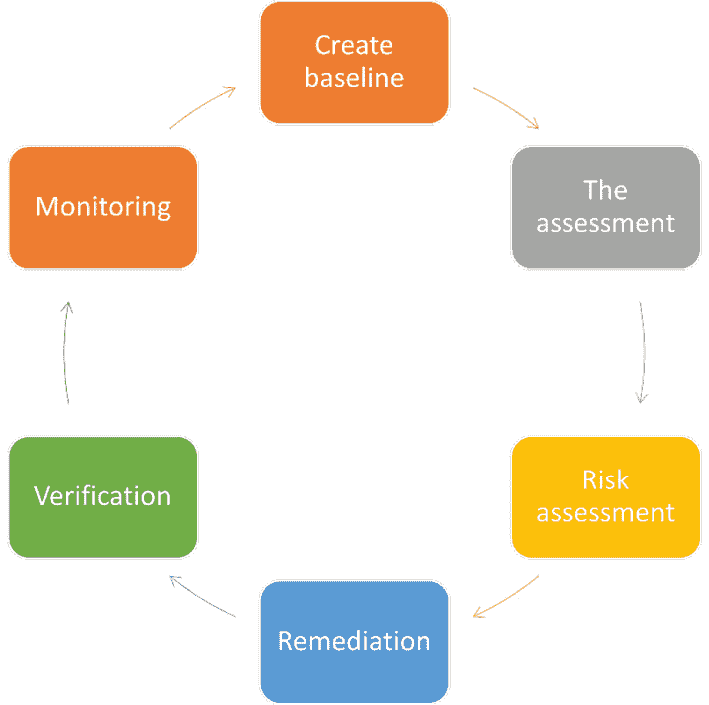

# 第六章：漏洞分析

漏洞管理是使用工具、流程和知识来减少与 IT 系统相关的风险的过程。它包括整个生命周期，从最初发现漏洞到报告漏洞，根据业务需求对其进行优先级排序，通过软件或程序变更进行修复，验证漏洞已被修复，并记录经验教训以便将来参考。

请注意，漏洞管理不是一次性事件。它是一个持续的过程，需要定期回顾。新的漏洞不断被发现，旧的漏洞被修复或变得不相关。你需要确保系统始终保持最新状态，并确保你的补丁是最新的。

在这一章中，我们将涵盖以下内容：

+   漏洞分析——从哪里开始

+   漏洞分类

+   生命周期

+   持续扫描与监控

让我们深入探讨吧！

# 漏洞分析——从哪里开始

漏洞评估是对信息系统中安全弱点的系统性审查。具体来说，它会查找计算机系统、应用程序和网络基础设施中的漏洞。它评估系统是否容易受到任何已知漏洞的影响，给这些漏洞分配严重性级别，并在需要时推荐修复措施。

漏洞评估还为组织提供了必要的知识、意识和风险背景，以便理解并应对对其环境的威胁。

# 漏洞分类

漏洞可以分为以下几类：

+   **配置错误**：我总是强调这一点，因为它是最常见的漏洞之一。配置错误是由人为失误引起的，它使攻击者能够未经授权访问你的系统。配置错误有多种类型，因为它可能发生在应用平台、数据库、网络本身甚至是 Web 服务器上。配置错误可能是因为某人忘记更新应用程序或数据库，禁用了所需的安全设置或某些功能，或者他们错误地设置了权限或错误配置了 SSL 证书。

+   **默认安装漏洞**：这些漏洞通常发生在我们在安装过程中点击*下一步*选项时。我理解，有时这种情况确实发生。当我们安装一个应用程序，而攻击者和其他人都预期它会出现在某个位置，并使用相同的目录结构时，这可能会造成漏洞。

+   **缓冲区溢出**：这些是常见的软件漏洞，通常由于编码错误导致。通常发生的情况是，攻击者通过写入超出分配的缓冲区大小的内容来破坏程序的功能，试图控制系统。如果你超载缓冲区，就会创建一个漏洞，这可能导致系统崩溃、系统不稳定，甚至允许一些程序执行它们平时不会做的事情。

+   **服务器操作系统**：如果没有适当修补服务器的**操作系统**（**OS**），可能会导致漏洞。攻击者总是会寻找或扫描服务器，看它们是否使用最新的操作系统补丁。

+   **设计缺陷**：这些缺陷通常是由于加密不正确或数据验证过程不当引起的；可能是在通信或应用程序的后台，甚至是网络基础设施本身的设计缺陷。

+   **操作系统缺陷**：我知道你在想什么，答案是否定的，这不仅限于 Windows。Linux 可能比微软修复了更多的补丁。但正是因为这些缺陷，攻击者才能利用木马、蠕虫，甚至病毒攻击这些机器。所以再次强调，及时打补丁是关键。

+   **应用程序缺陷**：研究你的应用程序或任何主流产品，了解与你的应用程序相关的缺陷。你还需要及时得知这些缺陷何时发生或被发现。因此，要保持应用程序更新和最新。

+   **开放服务和端口**：我们常常安装一些软件，它会打开端口或启动一些我们可能在该产品或应用中并不使用的服务或功能。那么，为什么要保持这些端口开放呢？安全专家需要时刻保持警觉，扫描网络或系统，寻找任何不必要的或不安全的服务或端口。

+   **默认密码**：每次看到有人继续在设备、软件或操作系统上使用默认密码时，我都忍不住笑。这些是漏洞的原因在于，如果有人只是想安装应用程序，他们只需要点击“下一步”并使用默认设置，而这些默认设置中包含了默认密码。他们会想，“*哦，我稍后再改*”，然后就忘记了，或者项目被放弃，或者他们被解雇，或是其他人接手了。不管什么情况，这些默认密码都将成为我们头疼的问题。所以，请帮个忙，在安装应用程序时确保将密码保密。

现在我们已经确定了潜在的漏洞区域，让我们看看你应该使用哪些漏洞评估方法。

## 漏洞管理计划（VMP）的好处

一些公司跳过使用**漏洞管理程序**(**VMP**)的原因之一是，他们通常认为他们当前使用的设备或服务已经在保护他们。然而，我们必须记住，防火墙严格执行它应当做的工作，即根据端口或协议的使用情况来允许或拒绝连接。抗病毒程序也是一样，它会扫描我们系统中的文档或文件，确保它们没有被感染。我们可能还会有入侵检测系统，但同样，它仅仅是在寻找活跃的连接。

然而，VMP 会检查网络设备、服务器、工作站和移动设备，找出需要修复或修补的弱点。希望他们在发生泄露之前就已经进行修复。每周大约有 100 个漏洞被公布，因此你组织的网络安全性仅取决于其最近的漏洞评估。

阻碍组织使用 VMP 的一个问题是，漏洞扫描和报告以及修复过程可能会令人不堪重负。然而，如果你从另一个角度看待这个问题，如果你的团队掌握了修复过程和扫描，那么这些报告将不再令人畏惧，因为你会对事情更加掌控。

一个持续的 VMP 过程结合适当的修复过程，将帮助你确保网络的极高安全性，并能够抵御最新的攻击。

以下是 VMP 的一些好处：

+   VMP 可以帮助识别需要修复或修补的风险。如果我们彻底监控活动，我们将获得关于网络中系统的更多信息。这使我们能够将扫描报告中列出的不同节点或系统进行上下文化分析。这样，我们可以更好地评估哪些问题需要修复、何时修复以及如何修复。它们还可以帮助我们区分哪些风险是极其紧迫的，而哪些则不那么重要。

+   时间就是金钱。有些人认为执行漏洞扫描和修复过程需要花费太多时间。他们忘记了要将这与他们花费大量时间修复那些被发现得太晚的巨大风险，或者更糟的是，处理因为环境中发生某种泄露事件而带来的负面舆论相比。这些报告以及监控正在发生的情况表明，这其实是一个巨大的节省时间的方式。它能避免你每晚和每个周末都在加班修复问题，因为泄露事件正在发生，你试图修复漏洞。

如果公司或组织有效地管理其漏洞，它将花费很少的时间来监控其系统。当检测到风险时，通常可以迅速且轻松地修复。它还可以避免你在短时间内做大量工作，因为你的系统和网络是安全的，且是最新的。

+   它提高了安全性。管理漏洞的组织将其视为一个过程，而不仅仅是一次性活动。那些持续监控环境，确保他们领先于攻击者和潜在威胁的组织，维护了一个更安全的环境。

+   它节省了金钱。实施 VMP 的最大好处可能就是节省了你遭受昂贵攻击的风险。我们经常看到公司因遭受攻击而登上新闻，他们最终面临来自多个领域的巨大成本。他们不仅需要支付人员来控制局面，还可能突然需要升级系统或更换不同的组件。当然，我们不能忘记由于遭受攻击而可能产生的诉讼。

在 21 世纪初我周游世界，为政府机构和 500 强公司进行不同的研讨会和培训课程时，这样的对话会发生。我会听到 IT 人员说他们无法获得升级操作系统或系统的预算，因为没有人认为这很重要，或者他们可以应付过去。现在情况已经不同了。我很多客户（希望你也是）将改变他们的思维方式。

请让你的首席财务官或首席技术官知道你有两个选择：现在支付升级费用，而不是在出现关键问题或遭受攻击时支付更多费用。我认为这是我们需要接受的新思维方式或新常态。问题不在于你何时遭受攻击，而在于何时遭受攻击。

与其对出现的问题做出反应，不如主动预防。如果你认识我或之前参加过我的课程，你会知道我是主动预防的忠实拥护者。

现在，让我们谈谈漏洞评估的类型。

## 漏洞评估

漏洞评估让你检查应用程序或系统的能力 - 包括当前的安全程序和控制 - 抵御任何类型的攻击。

以下是拥有良好漏洞评估流程的一些优势：

+   它应该识别、衡量，然后对漏洞进行分类。然后，根据报告，作为安全专业人员，你将了解如何加强安全措施。

+   在漏洞评估期间，你应该能够识别弱点，并根据其重要性和严重性对其进行分类。你还需要根据设备类型和/或使用的通信渠道对其进行分类。

+   它应该为你提供额外的安全措施或确定你需要做些什么来修复这些弱点。

+   它应该能够基于网络扫描漏洞。

+   它应该能够识别开放端口。你会在这里看到很多交叉点，因为评估应该能够识别正在运行的服务、不必要的服务以及任何应用程序弱点。漏洞管理产品将帮助你识别那些未更新或需要更新的应用程序。

+   它应该能够识别任何服务的弱点。如果服务正在运行，我们需要确保该服务本身是安全的。通常，它会识别那些未打补丁或由于设计缺陷而存在问题的服务。

+   它应该帮助我们识别配置错误，并显示出那些密码弱、没有密码或者多年来从未更改密码的账户。

现在，让我们来看一下可供我们使用的不同类型的漏洞评估。

## 漏洞评估类型

你可以运行不同类型的漏洞评估，包括以下几种：

+   **主动评估**：这些通常是我们使用网络扫描器扫描网络，以识别主机、这些主机上的任何漏洞、所有不同的节点和服务——网络上所有的东西。主动网络扫描器可以减少它们执行检查时的侵入性。因此，你可以将它们设定为非常响亮，或者非常安静，甚至可以做到隐蔽。

+   **被动评估**：这是我们嗅探流量的方式。所以，我们并不针对特定目标，而是通过查看流量来识别是否可以发现活动的系统、服务或应用程序，然后尝试确定存在的漏洞。由于我们在嗅探流量，我们还应该能够获取当前在网络上的用户列表。

+   **外部评估**：外部评估是道德黑客使用的众多方法之一。外部评估意味着评估是在互联网上进行的，通常从端口扫描或其他形式的网络映射开始。

外部评估的主要目标是定位组织的公共网页和服务中的漏洞（如果存在的话）。一旦定位到这些漏洞，就必须进行内部评估以加以利用。

关于外部评估的一个常见误解是，它们旨在评估私有网络的安全性，例如 DMZ 和内部网络。如果你的公共网页与私有网络直接相连，漏洞扫描将不会显示你内部网络上的漏洞。内部主机（如文件服务器）不会通过互联网暴露，除非你已经打开了特定的端口和服务。

+   **内部评估**：这种类型的评估从内部视角查看一切。内部评估通常旨在揭示私人网络上的漏洞。因此，内部评估通常会揭示比外部评估更多的风险，因为攻击者更愿意入侵文件服务器或邮件服务器，而不是尝试入侵您的公共网页。

故事通常不仅仅是关于是否发现了漏洞。例如，内部评估可能会发现公司网站上的一个 Web 应用程序被识别为存在几个漏洞。然而，这并不能给你全貌。也许其中一个漏洞可以通过更改网站上数据库的默认凭据来减轻。由于这是一个常见的漏洞区域，仅从漏洞的角度评估不更改这些默认凭据的风险将会很困难。

这只是漏洞评估复杂现实的一个例子。你的组织必须评估围绕每个漏洞的风险，以评估它们的真正影响。这是内部评估如此宝贵的一部分。

+   **基于主机的评估**：你可能已经猜到这是什么意思了，对吧？在这里，我们将对每台主机进行配置级别的检查，无论它们是服务器还是台式机。我想要查看的内容包括我是否可以获取注册表并查看是否配置不正确，以及任何文件权限和软件配置问题。

+   **网络评估**：这显示了您的桌面、笔记本电脑、服务器和网络设备本身上的不必要服务、弱身份验证和缺失补丁等漏洞。您的交换机接口通过 HTTP 吗？它是开放的吗？使用了什么身份验证机制？加密强度如何？

+   **应用程序评估**：在这里，我们看的是到处安装的应用程序。当我说应用程序时，我不仅指的是工作站上的应用程序。SQL、Exchange、SharePoint 和 WordPress 都是应用程序的例子。任何在服务器上加载的东西都是应用程序，我们必须确保它已经修补和正确配置，并且是最新的。我见过几次发生的情况是，一家公司声称他们所有系统都是最新的，严格运行着最新和最好的 Windows，他们只进行网络扫描，结果发现他们有一台主机运行着较旧版本的应用程序或操作系统。他们的理由是？"*你看，我们不想为升级付费*"或"*公司已经不存在了*。"猜猜？是时候找到不同的解决方案了，除非你想因为被入侵而在 Twitter 上流行一两天。

+   **无线网络评估**：我们使用这种评估来测试我们的无线网络，并尝试识别可能存在于公司内某处的任何恶意无线网络。它们审计特定客户端站点的无线网络。他们通过嗅探无线网络流量并尝试破解加密密钥来实现这一点。如果我能够通过无线网络进入，那么整个网络评估就会发挥作用，对吧？

现在，让我们讨论漏洞评估过程的生命周期。

# 漏洞生命周期

每次看到*生命周期*这个词，我就觉得需要出去运动，但这里的生命周期的目的是确保我们按照每一步找到解决方案并加以补救。在这种情况下，这些步骤将帮助我们找到安全漏洞并在它们变成利用之前加以补救：

图 6.1 – 漏洞评估生命周期

这里是漏洞生命周期过程的步骤：

+   **创建基线**：在这个阶段，我们查看关键资产，识别它们，并对其进行优先排序，以创建漏洞管理的良好基线。

+   **评估**：这是漏洞管理的关键阶段。作为安全专业人员，我们要做的是识别和了解基础设施中的漏洞。

+   **风险评估**：我们在这里所做的一切只是衡量或总结漏洞和风险水平 - 一些系统可能比其他系统处于更高的风险水平。再次强调，这取决于它们的功能以及谁在操作它们。

+   **补救**：补救是根据风险评估修复这些漏洞的过程。我们需要知道哪些是最重要的，然后相应地解决它们。

+   **验证**：我们采取这一步骤以确保我们已经解决了问题。这使安全团队能够检查我们之前所做的所有阶段是否已经遵循，并且已经修复了已识别的漏洞。

+   **监控**：需要定期进行监控，以帮助您保持并始终拥有最新的更新。这是因为新的更新将使您创建一个新的基线，新的威胁每天都会出现。因此，我们将继续监控。

现在，让我们讨论一些可用的漏洞评估解决方案。

## 漏洞评估解决方案的类型

有四种漏洞评估解决方案可供查看。它们如下：

+   **基于产品的解决方案**：这些安装在您的网络中的某个位置。它们可以安装在公司网络的私有或不可路由空间，以及互联网可寻址部分。在您的网络中安装这些的唯一缺点是它们将位于防火墙后面，不能始终检测到外部的漏洞。

+   **基于服务的解决方案**：这些通常由第三方或你所使用的顾问提供。部分解决方案托管在你的组织内部，例如基于云的解决方案。

+   **基于树的解决方案**：这是一种混合类型的解决方案。安全专家会选择一个特定的扫描器来扫描 Windows 产品、数据库或 Web 服务器上的服务，但在扫描 Linux 机器时会使用不同的扫描器。

+   **基于推理的解决方案**：在这里，我们通过建立一个清单或识别出在特定机器上发现的所有协议来开始扫描。一旦我们发现或识别出这些协议，扫描过程就会开始检测哪些端口与服务相关联，比如邮件服务器、数据库服务器或 web 服务器。找到这些服务后，它会选择每台机器上的漏洞并开始执行相关的测试。

企业政策的重要性不容忽视，接下来我们就来讨论这个话题。

## 公司政策和规章

关于公司政策，我们的目标是获得组织内部的安全意识支持，并大致概述我们环境中的风险、指南和责任。制定和执行安全政策有助于法律合规，因为它展示了尽职调查。政策需要强调其目标和责任。一些部分可能需要技术细节，而其他部分则可以对公司内的每个人开放。在制定这些政策时，指南需要通过在部门或管理层级别的详细技术实施政策来支持。

例如，网络管理员可以实施一项政策，以保护通过组织网络传输的数据。人力资源部门的人可以确保安全培训和意识程序的开展。防火墙管理员可以实施一项政策，帮助保护通过特定端口传输的数据。

重要提示

安全政策的某些部分，如其标准、程序和指南，应保持机密。将你的安全系统或灾难恢复计划的细节公开，甚至公开给所有员工，都不是明智之举。这些信息可能会帮助某人进行恶意攻击。

在监管环境中，一些公司和组织受法律和规章的约束，这些法律和规章规范了他们存储、传输和处理信息的方式，特别是如果该组织处理敏感个人信息或政府数据。

运营于医疗保健或支付卡处理等行业的组织必须遵守行业规定。问题在于，这些法律很多并没有规定或提供有关使用虚拟化管理平台（VMP）的具体信息。

一些示例如下：

+   **健康保险流动性与责任法案**（**HIPAA**）：该法案规定了医疗服务提供者以及与医疗提供者、保险公司以及与之合作的任何商业伙伴如何存储信息。

+   **格雷姆-里奇-布莱利法案**（**GLBA**）：该法案控制了金融机构如何处理客户的财务记录。这些法律并没有告诉我们需要实施什么类型的漏洞扫描。

+   **支付卡行业数据安全标准**（**PCIDSS**）：该标准规定了零售商处理信用卡交易和参与这些交易的服务提供商的安全控制。值得注意的是，大多数人认为 PCIDSS 是一项法律，实际上它并不是。它只是一个标准，你可以选择是否遵循。若不遵循其规定，后果可能是信用卡公司或你的商户服务提供商会说：“*我们将不再支持你的交易。*”

+   **联邦信息安全管理法**（**FISMA**）：该法规要求政府机构以及任何与政府合作或代表政府运营的单位遵守一系列安全标准。就 PCIDSS 而言，它列出了以下内容作为实施 VMP 时的要求之一：

    +   首先，你需要实施 VMP。它们不关心你选择哪种，只是要求你必须使用某种方案。

    +   PCI 规定的另一个要求是，内部扫描必须由合格的人员进行——即经过专门培训，可以执行内部和外部任务的人。外部任务必须由组织外部的人员完成。

    +   它们还规定，组织必须至少每季度进行一次扫描。此外，每当你对网络进行重大更改时，例如添加新的防火墙规则或升级某些网络组件的固件时，你需要确保一切仍然安全。并且，在内部和外部扫描之间，这些必须由合格的人员或供应商进行——外部扫描由供应商完成，内部扫描由人员完成。通过一系列步骤，包括填写申请表、接受培训并在 PCI 安全标准委员会注册，人员才会被认定为合格。

    +   组织还需要尽可能快速地修复任何高风险漏洞。它们需要重复扫描，以确保漏洞已经被修复或系统已清理干净，确保实施的修复应用了适当的设置。

很多组织会在外部供应商进驻之前进行扫描，以确保没有什么尴尬的漏洞。如前所述，FISMA 是另一个适用于政府机构的法规，它为受 FISMA 约束的组织列出了要求。我没有看到关于该法规的详细信息，除了它适用于政府机构，但他们的一些要求与 PCIDSS 非常相似。

## 扫描范围

在谈到扫描范围时，我们指的是扫描时包含的主机或子网的范围。如果你有一个大网络，可能需要合理安排在不同时间扫描网络的不同部分。这样可以帮助你减少对网络性能的影响，并使分析每个扫描结果变得更加容易。

你可能希望设计有限范围的扫描，以识别问题或满足特定的合规目标。现在，我认为在确定漏洞扫描范围时，有几个问题你应该问自己。

第一，问：“*我应该将哪些系统和网络包含在漏洞扫描中*？”记住，我们不必扫描每一个系统。

第二，问：“*针对漏洞扫描发现的系统，将执行哪些测试*？”如果你没有准备好，或者不了解在漏洞管理平台（VMP）中执行了哪些测试，这可能会给你带来一些问题。

第三，问：“*系统是否在线*？”这听起来很基础，但请记住，你对系统的了解仅仅是基于你最后一次扫描的结果。

## 扫描频率

定义扫描频率可能会受到多个因素的限制，包括以下几个方面：

+   **技术限制**：这是主要因素。对 Windows 工作站进行漏洞扫描通常是非常低风险的，而且每当主机连接到网络时都可以执行。但对于像代码审查或漏洞分析这样的定制应用程序，这必须更加小心，且可能会有些昂贵。因此，技术限制可能会限制扫描的频率。

+   **系统扫描**：你可能每天只能执行有限数量的扫描。你的组织可能需要调整扫描频率，以确保所有扫描能够成功完成，并且在规定时间内完成。

+   **风险承受度**：这就像是在掷骰子。每次扫描活动都会产生相应的成本。同样，如果我们查看定制应用程序，可能会有一个政策要求进行扫描或审查，但只有当整体威胁情报发生变化时才会执行。例如，假设发现了一种新的代码漏洞。那么，组织的风险承受度就是指在你的环境中愿意容忍的风险程度。例如，假设你的公司或组织极其厌恶风险。那么，你可能会选择更频繁地进行扫描，以帮助减少漏洞成为重大问题或被发现之间的时间。

+   **监管要求**：法规可能会使你无法增加风险承受度。如果你的公司必须遵守某些法规，尤其是在预定的间隔时间进行扫描控制或根据正式的变更管理流程进行扫描，这可能会影响计划，因为这些规定必须严格遵守。

+   **工作流程**：随着组织逐步完善其安全政策和控制措施，它采用了更为成熟的安全模型。随着安全能力的提升，漏洞管理和信息安全保障需要融入到网络管理和软件开发的工作流程中。

+   **业务约束**：业务约束可能会限制你的组织，因为漏洞扫描可能会消耗大量资源。例如，在高业务活动期间进行扫描可能并不符合你的最佳利益；你需要确保尽量避免影响到关键业务流程。我们需要确保在合适的时间安排扫描。

+   **许可**：这可能会限制扫描器消耗的带宽，甚至限制你同时进行的扫描数量。

作为一名安全专业人员，你必须学会在规划漏洞扫描程序时平衡这些因素。最好从小范围开始，逐步扩大扫描范围和频率，这样你就能在实践中学习。

## 扫描类型

我们的漏洞扫描器或漏洞管理平台（VMP）可以进行不同类型的扫描，具体如下：

+   **主动扫描/无凭证扫描**：此类扫描通过向主机发送测试数据包进行，而无需登录到操作系统或应用程序中。我们通过这种扫描得到的结果，是一个特定的视角，能够查看主机对网络的暴露情况。这些也被称为远程扫描。即使你进行的是无凭证扫描，仍然可以包括一些内容，如设备服务帐户的默认密码。主动扫描还会消耗更多的网络带宽，并且有可能导致扫描目标崩溃，产生一些异常结果，甚至引发停机。

+   **被动扫描**：被动扫描器通过镜像端口监控网络流量，并试图识别策略定义或已知漏洞（CVE）。这种扫描对网络的影响最小，因为它只是静静地监听，而不是进行凭证扫描。在凭证扫描中，你为用户提供一个账户，允许其登录多个主机，并可以指定用户名和密码。这为你提供了深入分析，特别是在检测应用程序或安全设置可能存在配置错误时。它还帮助你证明攻击者是否已经入侵了某个用户账户。

+   **代理扫描**：这种类型的扫描是我们在计划扫描的不同工作站或目标上安装代理程序。代理程序只是一种软件，它会向特定的服务器或服务报告，并由管理服务器进行管理。它在本地运行扫描，然后按计划将报告发送到管理服务器。Nessus 是一个虚拟机器平台（VMP），它有一个可以安装在 Windows 主机上的代理程序。这里的最大优势是，基于代理的扫描有助于减少对网络的影响，因为所有操作都由本地机器上的代理执行，只有结果被报告回去。然而，一个缺点是代理的范围可能仅限于特定的操作系统，但如今大多数代理都支持所有主要的操作系统。另一个缺点是，这将是一个新的应用程序，作为安全专业人员，你需要确保这些代理是最新的，以防攻击者利用它们进入你的环境。

我们还必须关注扫描级别，扫描级别更多地关注敏感度级别。我们可以进行发现扫描，通常用于创建和更新资产清单。这通常用于识别主机及其正在运行的服务。

+   **评估扫描**：这仅包含用于分析主机漏洞和/或恶意软件的选项。

    重要提示

    漏洞可能包括配置错误以及软件漏洞。通常，评估扫描会提供将操作系统和应用程序设置与策略模板进行比较的选项。另一个选项是检测弱密码或重复使用的密码。请注意，评估扫描可能会产生大量网络流量，因此必须非常小心。

现在，让我们来谈谈扫描器的维护。

## 扫描器维护

扫描器维护是一款软件。像任何技术产品一样，我们需要确保虚拟机器平台（VMP）健康且强大。我们通过为该应用程序实施适当的保养和维护来做到这一点。管理员应该定期维护他们的 VMP，以确保扫描软件和漏洞数据流是最新的。定期修补和升级你的 VMP 将有助于保护组织免受特定扫描器漏洞的威胁。

另一个需要关注的问题是插件。许多产品允许你安装额外的插件来帮助调整环境。然而，一些插件是由个人编写的，这些个人可能不会保持插件的更新，而根据未来的漏洞，这可能使你的系统容易受到攻击。因此，管理员应该配置扫描仪以检索新的插件或其更新。如果你每天进行此操作，效果会更好。

## 数据分类

在考虑你环境中的数据资产时，必须识别哪些信息是重要的，这将取决于你的具体情况。例如，如果你是一家租赁水上摩托的公司，那么水上摩托的蓝图可能并不重要，但如果你是水上摩托的制造商，这些蓝图可能会变得更为重要，并且可能需要保密。

有时，如果攻击者获取了你公司组织结构图，它不仅能显示谁为谁工作，还能透露更多敏感信息。

那么，如何对数据进行分类呢？这很简单。

你应该关注以下四个不同的事项：

+   **产品开发、生产和维护**：这些信息对于公司来说可能至关重要。我们常见的泄露事件之一是客户联系信息的泄露。有时，这还包括财务操作和控制——例如借记卡收款和工资税支付。

+   **法律义务**：法律义务有助于在特定时期内保持准确的记录，同时也有助于通过**服务级别协议**（**SLA**）履行对第三方的合同义务。

接下来，让我们来看看文档管理。

## 文档管理

也称为数据处理，这是管理信息生命周期的过程，从创建过程到销毁。在这个生命周期的每个阶段，安全考虑都极其重要。大多数文档在发布之前会经过一个或多个草稿阶段。但是作为草稿，文档将遵循一个工作流，这有助于描述编辑更改是如何进行或批准的。我们看到很多这种工作流是在微软的 SharePoint 产品中创建的。

工作流会经过并指定——这可能是纸质的——谁是作者、编辑和审阅者。

作为创建过程的一部分，文档必须根据敏感性进行分类。通常，这些分类会有以下标签：

+   **未分类**：此文档没有查看限制。

+   **分类**：也称为受限、私人或仅限于官方使用。查看此文档的权限仅限于所有者、组织或在保密协议下的第三方。

+   **机密信息**：这是分类中较低的一种，尤其是与一些高级分类信息相比，但它被设置为敏感信息，只能由组织内的批准人员查看。我们还可能希望在这里包含一个**保密协议**（**NDA**）。

+   **机密**：这也叫做中级机密。观看受到限制，因为这些信息过于宝贵，不能冒任何被查看的风险。可以把它想象成顶级机密信息，就像你在间谍电影中看到的一样。

+   **双重机密监督**：这比最高机密还要高级。

接下来让我们讨论为什么持续扫描和监控过程非常重要。

# 持续扫描与监控

当谈到持续扫描和整个周期中的持续监控——采购、替换，以及新战术或新威胁和技术的应用——仅仅进行一次漏洞评估是不够的。你需要有某种持续扫描的计划。正如我们之前提到的，你需要制定一个计划并坚持执行。

持续的安全监控是指持续风险评估的过程。这意味着我们保持对正在出现或已经泄露到外部的威胁的高度关注。它还意味着实时执行权限和特权的常规审计。

要真正理解监控，你需要创建一个初步基线，以帮助识别任何变化。你需要进行对比。这就像有人说我的系统似乎变慢了。那么，相比什么呢？我们必须有某个对比基准。能够与初始基线进行比较，有助于你识别出任何可能代表发生了事件并需要调查的变化。

## 理解应该使用哪种扫描器

考试中可能出现的内容与现实世界中可接受的内容之间存在差异。你必须进行深入的研究，决定最适合你的产品。这就是为什么了解不同的漏洞扫描器非常重要。

再次声明，我的目标不是告诉你确切该使用哪个工具，而是让你看看不同的功能和可用的选项。通常，漏洞扫描器只是一种网络映射工具，旨在检测网络是否暴露于任何威胁。

市面上有许多工具可能执行其他功能，如足迹和指纹识别工具，在某种程度上，甚至可能涉及到密码破解。但是当谈到漏洞扫描器时，你需要寻找一个能够解答你问题的工具，或者是你的解决方案套件，或者是瑞士军刀。你会想确保它们不仅能绘制出主机的映射，甚至可能检测到正在运行的服务。

现在，让我们回到漏洞扫描工具或 VMP 的核心功能。它不仅应该能够映射网络主机并检测正在运行的服务，还应该使用技术（例如横幅抓取）来扫描系统或目标已打补丁级别、安全配置、以及策略或网络共享、未使用的用户账户、弱密码、非法访问点、是否已配置防病毒软件等等。

漏洞扫描工具可以以两种不同的方式实现——作为安装的软件或作为安全设备。它可以是虚拟机或实际的机架安装设备。

还有其他类型的扫描工具，包括用于检测特定应用程序漏洞的 Web 应用程序漏洞扫描工具，例如 SQL 注入或跨站点脚本（XSS）软件攻击。

## 开源扫描工具和商业扫描工具的区别

大多数人认为开源是最好的选择，因为它不需要花费任何费用，但我们也有一些产品最初作为开源项目推出，然后转向商业化。有些产品继续提供双重功能。开源扫描工具通常对任何想要使用它们的人开放，并且是免费的。由于开源扫描工具是开源的，你还可以与其他开源工具集成，以获得更完整的解决方案。

商业漏洞扫描工具提供端到端的测试，确保符合安全标准。这对于需要确保其环境安全且不容易受到漏洞影响的公司来说是一个很好的特性。商业扫描工具通常提供全天候支持，而较小的开源扫描工具公司可能仅在某些特定时间提供支持。

要决定是否应该使用商业或开源扫描工具，你需要审视你的环境，并看看哪种对你的组织最合适。

当你决定使用哪种类型的扫描工具时，请考虑以下因素：

+   你有多少资源可用？

+   你需要帮助定制扫描功能吗？

+   你是否需要支持（学习或故障排除）？

+   你需要验证哪些合规标准？

正如你所看到的，公司在选择漏洞扫描工具时可能会考虑使用开源产品或商业产品的几个原因。

其中一个产品是由 Tenable Network Security 生产的 Nessus。它是知名的商业漏洞扫描工具之一。它可以通过 Nessus Manager 部署在本地，也可以在云端（Tenable Cloud）使用。他们还提供专业版，适用于较小的网络。该产品还有一个家庭版，可以免费使用，另外还提供付费订阅服务。

Nessus 最初是一个开源产品。它为其他许多扫描器提供了源代码。你可以使用 Nessus 执行的默认扫描，它们使用 Nessus 订阅源中的插件。

## 本地部署与云端

了解并非每个解决方案都适合你的环境是很重要的。

本地部署是你自己安装并管理的系统。

说到云端，这里我们依然进行管理，但不需要担心更新问题。大多数情况下，这些产品会在发现某些漏洞时自动更新。

我们还需要考虑数据库及其存储位置。

对于某个供应商来说，他们会在你的机器上安装一个客户端来扫描该机器，然后将结果上传到云端的数据库中。

其他的则将它们保存在本地机器的数据库中，并进行回传。具体取决于你希望通信渠道如何建立，以及希望多久进行一次。

我个人唯一的问题是依赖云端——这只是个人观点——因为云端可能会出故障。例如，**拒绝服务**（**DoS**）攻击可能会影响你与漏洞扫描云提供商的联系。所以，确保你有一些备份。

现在，当我说每个人都参与时，我是指很多人都参与了这个环境。谷歌有一个云安全扫描器可以供你使用。它叫做 Amazon Inspector。还有 Retina，这是 Beyond Trust 公司拥有的产品。它们提供云漏洞评估。我曾经使用过 Retina 的本地版本，并且很喜欢。Nessus 有一个名为 Tenable I/O 的云解决方案。McAfee 也有一个**安全即服务**（**SaaS**）概念。

我们还有 Secure Works，它有一个很好的界面。Alien Vault 也是市面上的一个产品。我们还可以看到 Koalas，这是一个基于云的服务，可能是最受欢迎的解决方案之一，效果非常好。用户在他们网络的各个点安装传感器代理，传感器将数据上传到云平台进行分析。

## 安全内容自动化协议（SCAP）

一个正在发展的安全分析和威胁情报领域是不同安全工具（如漏洞扫描器和入侵检测系统）产生的信息的关联。

SCAP 允许兼容的扫描器确定计算机是否符合特定的配置基准。要了解 SCAP 的规格，你可以访问[scap.nist.gov](https://scap.nist.gov)。是的，它是一个政府项目。

MITRE 公司帮助开发了 SCAP 的一些关键组件，这些组件可以用于多个扫描或漏洞设备。它开发了用于 NIST 漏洞数据库的标识符字典。这些标识符为我们提供了一个标准的方式，用于在漏洞或平台中一致地引用产品。

一些标识符如下：

+   **常见漏洞暴露** (**CVEs**)：该标识符有助于识别发布的操作系统和应用软件中的网络安全漏洞。

+   **公共平台枚举** (**CPE**)：这也是由**国家标准与技术研究院** (**NIST**) 维护的，涉及操作系统、应用程序和硬件设备。如果你需要一些常见的最佳实践声明，那么**企业合规与道德协会** (**SCCE**) 就发挥作用了。它是常见配置枚举。

+   **常见弱点枚举** (**CWE**)：除了这些标识符，SCAP 还使用其他几个组件。

+   **开放漏洞与评估语言** (**OLA**)：如果你在寻找可能导致漏洞的设计和开发缺陷，这非常有用。这是一种 XML 架构，用于描述系统的安全状态，查询漏洞报告及其他现在不详细讲解的信息。

+   **可扩展配置检查清单描述格式**：这也是一种 XML 架构，但它用于开发和审核最佳实践配置检查清单和规则。在过去，最佳实践指南是为了管理员手动应用而编写的。这个组件提供了一种机器可读的格式，可以使用兼容软件进行应用和验证。如果你在问自己，"*这些漏洞扫描器怎么知道如何修复自己*？"那是因为这些组件和标识符。

+   **常见漏洞评分系统** (**CVSS**)：现在由事件响应与安全团队论坛（Forum of Incident Response and Security Teams）维护。CVSS 是将漏洞与标准度量关联的方式。这样，我们可以理解某些漏洞的重要性。这些度量会根据漏洞的固有特性、暴露发生的环境以及漏洞随时间变化的特性，从 0 到 10 生成一个分数。分数越高，问题越严重。

## 漏洞扫描器

说到漏洞扫描器，我们的大部分漏洞扫描软件使用非侵入式扫描技术。非侵入式扫描使用网络指纹识别和横幅抓取，或者允许代理在文件传输或日志文件中读取系统配置。这些通常不会对服务器或主机造成性能问题，但它们可能会返回较多的误报。

我们还拥有侵入式扫描技术，这通常涉及尝试利用已检测到的漏洞。最著名的漏洞利用框架之一是 Metasploit，它是一个由 Rapid7 维护的开源平台。

免费版是一个社区版，适用于 Linux 和 Windows。作为一个框架，它包含了大量的工具，帮助我们发现主机及其漏洞，然后识别或创建利用模块来针对这些漏洞。Metasploit 可以使用 Nmap 或其工具。同样，由于它是一个框架，它可以连接到像 OpenVAS、Nessus 或 Nexpose 这样的漏洞扫描器。我们还可以使用并实施一个密钥扫描器，帮助我们开启反向 Shell，以便完全访问目标系统的目录结构，这些系统正利用这些漏洞。

很多这些漏洞利用框架使用的一个常见技术是模糊测试（fuzzing），它涉及向应用程序发送无效或随机数据，测试其处理意外数据的能力。然后监控该应用程序，看看它是否崩溃、失败或反应错误。最先进的商业模糊测试工具之一是 Peach Fuzzer。它有一个免费使用的社区版，以及具有不同许可模式的专业版和企业版。该平台还提供了他们所称的 peach pits，这是不同的包（插件）。微软曾经也有模糊测试工具，但现在已不再提供下载。相反，微软正在转向一个基于云的模糊测试服务，代号为项目 Springfield。

所以，你有了扫描报告，报告中列出了它检测到的漏洞。通常，这些漏洞会与一个**常见漏洞评分系统**（**CVSS**）分数相关联。它旨在为你提供一种非常基本的方式来优先安排响应行动。你应该审查整个报告，并根据你自己的经验和知识，试着判断这些漏洞是否被高估或低估了。

大多数漏洞报告的结果对于我们来说通常是比较直接的。可能系统没有接收到更新，或者你通过查看事件日志进行调查。分析师的工作是找出不合常规或稍微有些奇怪的地方，然后调查其原因。你的工作的一部分是尝试通过查看以下提示，看看能否让事情变得不那么混乱：

+   **调和结果**：漏洞扫描器可能会误解它们从不同探测工具获得的信息。如果你无法调和你找到的某个特定问题，可能需要考虑使用不同的软件产品重新扫描以确认结果。你还应该查看日志，以及任何其他数据源。如果你在将漏洞报告与特定主机或软件应用程序关联时遇到困难，可以使用与该 IP 相关的主机上的日志来关联结果——也许在扫描时某个应用程序存在，但此后已被卸载。

+   **比较最佳实践**：你可能使用的一些扫描工具会根据最佳实践框架来评估系统和配置设置。这对于合规性检查可能是必要的，或者你可能希望遵循自己外部协议的最佳实践标准。

唯一的问题可能是，一些合规扫描可能返回的结果并不是高优先级，或者可能被认为是低风险。例如，假设你扫描了一台 Windows 8 机器，发现有些 .NET Framework 版本或浏览器已经不再支持。要修复这类问题，你可以运行 Windows 更新，并确保 Windows 更新已经安排了未来的更新。你还需要考虑将 Windows 8 机器升级到一个更现代的版本，然后重新进行扫描，并处理列表上发现的任何问题。

## 公共漏洞评分系统（CVSS）

这里的概念是，分析人员必须识别并评估其网络内可能存在的不同类型硬件和软件平台中的漏洞。他们还需要优先处理这些漏洞，并首先修复那些带来最大风险的漏洞。

然而，当有大量需要修复的事项时，每一项都使用不同的评分标准，分析人员如何将这堆信息转化为可操作的信息呢？这就是 CVSS（公共漏洞评分系统）发挥作用的地方。它是一个开放框架，解决了这个问题，并提供了许多好处。

让我们来讨论一些这些好处。

### 排名

把这个看作是一个评估你环境的系统，它通过标准的漏洞评分来完成这项工作。当一个组织在其软件和硬件平台上统一漏洞评分时，它可以利用单一的漏洞管理策略。这个策略类似于服务水平协议（SLA），告诉我们特定漏洞需要多快验证和修复。

还需要注意的是，当计算出环境评分时，漏洞变得具有上下文意义，意味着漏洞评分现在代表了它对组织的风险。这一评分模型是基于多个不同的因素。

### 基础度量

基础度量包括像可利用性这样的指标。这个度量衡量的是漏洞利用技术的当前状态。如果漏洞代码本身是公开的并且容易使用，那么潜在攻击者的数量也会增加。

当你想到可利用性时，你需要考虑攻击向量、攻击本身的复杂性、所需的权限以及用户交互的类型，是否用户需要点击电子邮件才能使攻击发生。

### 范围度量

这指的是由计算机权限管理机构（例如应用程序或操作系统）在授予访问计算机资源（如内存或 CPU）时所定义的一组权限。这些权限是基于身份识别和授权的方法分配的。在某些情况下，你可能会发现授权是容易的或者根本不存在。例如，如果你有以太网流量发送到网络交换机，交换机会接受到达其端口的流量，并且它有权控制流量流向其他交换机端口。

### 影响度量

影响度量指的是受影响组件的属性。无论如何，一个成功的漏洞利用会影响一个或多个组件。影响度量是根据那些遭受最严重影响或最直接、最可预测影响的组件来评分的。

分析师应将影响限制在他们确信攻击者能够实现的合理结果内。

### 临时度量

这个度量衡量的是漏洞利用技术的当前状态、是否存在任何补丁或替代修复方案，以及你对描述漏洞的信心。我们所指的意思是，我们看待漏洞被攻击的可能性。它是基于该漏洞利用的当前状态，不考虑更新。

让我们看看 2017 年的 WannaCry 爆发。值得注意的是，这个漏洞的临时度量较低，因为微软在其流行之前几个月就已经修补了该漏洞。

当涉及到漏洞利用代码的成熟度时，我会回到现实世界的探索参考，看看它可能仅仅是理论性的。同样，我们可能会看到一个概念验证的出现。这并不一定意味着这个漏洞会被用来攻击你。

临时度量还包括漏洞的修复级别。你需要能够优先处理这些漏洞。通常，漏洞在最初发布时是未修补的。供应商可能会发布临时修复或替代方案，直到发布正式的升级补丁。这几乎每天都会发生。

### 报告的可信度

这个指标衡量了漏洞存在的可信度以及漏洞本身的可信性。很多时候，我们看到这些漏洞被披露，大家宣布漏洞存在，但却没有人发布具体细节。因此，它的可信度不是很高。后来，漏洞可能会被作者或供应商确认并承认，当漏洞被确定存在时，它的紧急性就会提高到一个新的水平。

### 环境指标

这个指标允许分析师根据 IT 人员认为对组织有多重要来自定义他们的 CVSS 评分。分析师通过诸如安全要求等内容来做出调整。再次强调，这就是字面意思：贵公司政策规定了哪些安全要求？现行法规的安全要求是什么？例如，如果某个 IT 资产支持一个业务功能，而该功能对可用性要求较高，分析师可以相对于机密性和完整性给可用性分配更高的权重。每个安全要求都属于以下三类之一：低、中或高。

### 修改后的基本指标

这使得分析师可以根据其环境中的变化调整基本矩阵。一个很好的例子是，如果某个环境对某个软件进行了普遍更改，从而影响了漏洞利用、范围或影响的方式，那么该环境就可以通过修改基本矩阵来反映这一点。

这一点很酷，因为 VMP 会为我们考虑这些 CVSS，并在此过程中提供帮助。

### 假阳性和例外

那么，我们如何识别假阳性和例外呢？我们收到的许多漏洞报告会包含大量的假阳性，或者是一些*你对了，你错了*的结果。这些是非常耗时的调查和排除工作。如果有大量假阳性，您可能需要调整和优化扫描，以减少假阳性的数量。

那么，我们该怎么做呢？我们可以开始查看验证可能生成流量的应用程序，这些流量可能会错误地匹配漏洞扫描器的签名。在这种情况下，您可以将其添加到例外列表中，这样您就不会再查看该特定结果。

另一个问题是扫描器可能在使用启发式分析，这可能会因为网络使用的有效变化而产生混淆。换句话说，可能需要建立新的基准来参考。

另一个可能出现的问题是，你可能正在运行一些不适合你网络的扫描——例如，在你的网络中并未运行该应用时进行应用漏洞扫描。你应该做的其中一件事是尝试调整扫描的范围，以确保你只对网络基础设施中的相关应用进行测试。

最后，我们面临的问题是扫描仪可能会识别出一些可以通过管理员权限而非最终用户来利用的漏洞。现在，你可以做的一件酷事——尤其是针对市面上大多数的 VMP（虚拟化管理平台）——就是通过识别扫描中的例外情况并将其配置到模板中来减少误报的发生。这可能意味着你将排除某些主机不进行某些类型的扫描，或者继续报告该漏洞但将其优先级降低。如果你有无法修补或修复的系统，那么你可能需要更密切地监视这些系统。

接下来，让我们看看作为一名安全专业人员，你如何确保及时了解威胁世界的动态。

## 趋势

安全问题的一个难点是做一些事情来营造你拥有控制权的假象。我经常这样做，对我的孩子们来说，他们以为我知道的比实际多。

通常，你将部署一些控制措施来帮助识别感染或未打补丁的系统，并为你提供可以依赖的报告。这类活动很好，但在心里你应该担心，可能有其他事情在悄悄发生，而你并未察觉。这就是趋势发挥作用的地方。

如果你在一段时间内监控关键矩阵，它应该能显示出未应用的策略，或者攻击者开始对你发起非常复杂或多阶段的攻击。

趋势的问题在于如何选择分析和调查哪个矩阵，因为你手头的时间有限。在这里，你应该制定一个度量分析程序。你还应该确保它评估你所追踪的每个矩阵的有效性。

以下是我们可以分析的一些可能领域：

+   观察事件和检测的数量，以及响应时间。

+   观察因影响而丧失的小时数或成本。

+   查看网络本身或其指标——你可以在这里衡量许多问题。你可以查看内部和外部流量的数量、登录次数、登录失败次数、活动端口、网络上授权或未授权的设备数量、未授权软件等等。这些统计数据可能仅从安全的角度来看比较有趣，因为大多数网络都会发生变化——也就是说，随着新设备和新电缆的部署，它们会变得更快。你应该关注员工的培训以及威胁意识教育——你的员工对网络安全威胁了解得怎么样？你可以衡量员工的知识水平，或者开始为他们评分。如今，许多公司帮助你创建那些设计成让用户点击链接的邮件，然后一个“猴子”就会跳出来给他们一记重击。

+   查看合规性。这很好——你已经制定了所有这些规则和政策，但有多少已经被执行？执行的百分比是多少？是上升还是下降？是因为合规目标在增加，导致这个百分比下降吗？还是合规性变得越来越难以达到？又或者你的政策没有被正确遵循？

+   查看外部或外部威胁等级——你需要问自己，整体上你的安全性在互联网上看起来如何。我们是否看到一些新的威胁在其他公司、竞争对手或我们行业内的其他人中浮现？有没有哪些重大新威胁你需要开始关注？每天早上，当我开始查看我的所有安全网站、讨论串和 RSS 源时，我会问自己，这些内容对我有用吗？如果有，我需要将其纳入我的扫描中，以确保我没有漏洞。

现在，因为我爱你们每一个人，我将提到一些我一直在查看的源：

+   **SANS 研究所**：他们有一个完整的培训环境，而且还提供大量关于漏洞的信息，以及发生了什么。

+   **Dark Reading**：正如它们的名字所暗示的那样，它们的文章涉及黑客攻击，挺酷的。他们覆盖的范围很广，从云计算到移动设备，再到当前发生的数据泄露和攻击。

+   **微软的 Windows Defender 安全情报**：他们主要关注基于微软的内容，但也会提供一些有关其他攻击威胁的更新。

+   **FireEye**：这是一个很棒的资源。它们最受欢迎的资源之一是最近的零日漏洞，展示了一些流行的漏洞。它们还有很好的年度报告资源以及威胁情报报告。如果你愿意，还可以订阅它们的威胁研究博客。

+   **Alien Vault**：你会发现大多数这些公司有某种隐藏的目的，因为他们都有自己想要销售的产品。然而，他们仍然提供了许多非常酷的信息。以 Alien Vault 为例，他们提供了一个威胁情报摘要。你只需要注册，就会开始收到新漏洞或安全威胁的通知。

+   **Symantec**：他们也有一个安全情报网站，提供大量信息。通常，你会发现，如果一个供应商知道了某个漏洞或威胁，其他大多数供应商也会知道。所以，有时候这些信息只是重复的。

+   **Secure Works**：虽然这家公司提供一些服务，但他们也在其洞察平台上免费提供了大量有关威胁的信息。他们有一个知识中心，以及研究和博客，供你查阅。例如，在**研究**类别下，你可以进入**威胁分析**，查看该领域当前的动态。

# 总结

在这一章中，我们讨论了 VMP 的好处。我们查看了正在进行的 VMP 流程，以及漏洞研究的重要性，漏洞研究有助于确保网络的安全性，并能抵御攻击。

接下来，我们讨论了如何识别扫描目标，扫描的频率、深度以及扫描范围的设置，以及不同级别的配置。我们还介绍了如何分类数据，这样当发生事件时，你就能知道修复问题时需要优先处理的事项。我们回顾了根据你的环境选择使用哪种扫描器。我们还讨论了如何修复我们的网络漏洞。我们还讨论了 SSL 和 TLS，确保我们的证书有效，并且我们使用的加密算法足够强大。我们还讨论了虚拟化带来的问题。

在下一章中，我们将深入探讨如何攻击我们已识别的目标。

# 问题

在总结时，这里有一份问题清单，供你测试关于本章内容的知识。你可以在*附录*中的*评估*部分找到答案：

1.  为了找到漏洞，攻击者向目标发送探测器和伪造请求。这是什么类型的扫描？

    1.  被动扫描

    1.  主动扫描

    1.  洪水攻击

    1.  中间人攻击

1.  用于识别主机和漏洞的评估类型是什么？

    1.  分布式

    1.  被动

    1.  主动

    1.  自动化

1.  哪种漏洞评估解决方案被认为是*放置在私人或公司资源中*的？

    1.  基于服务

    1.  基于推理

    1.  基于产品

    1.  基于树的

1.  当扫描的位置和数据存储在单一系统上时，使用的是什么类型的扫描器？

    1.  基于集群

    1.  基于代理

    1.  基于网络

    1.  基于代理
