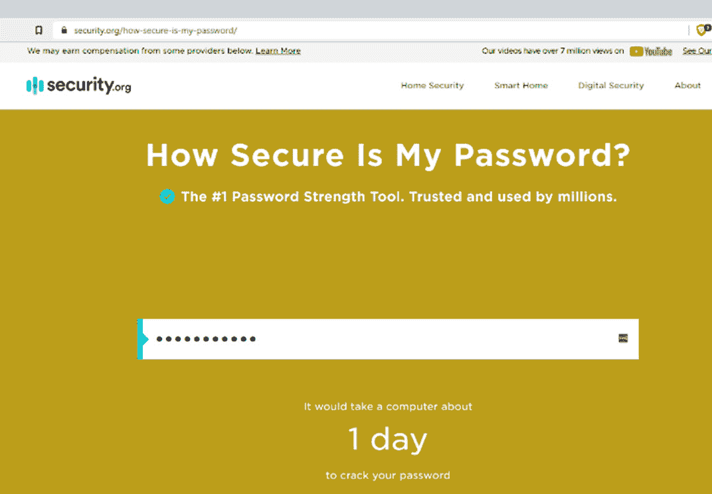
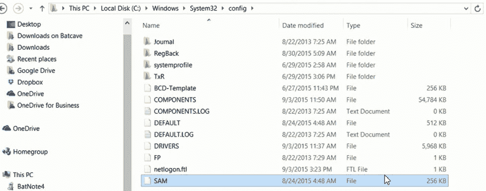
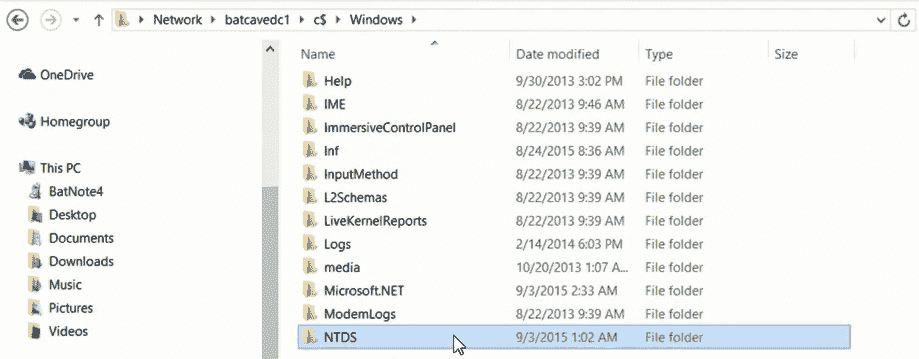
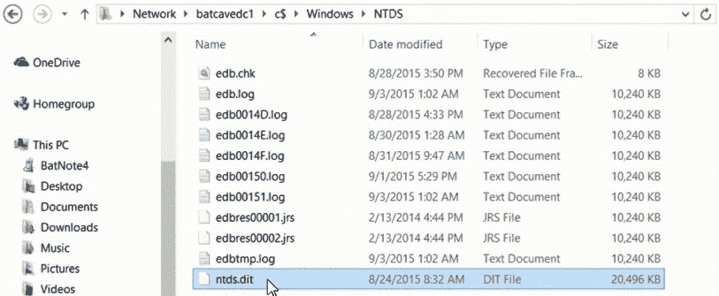
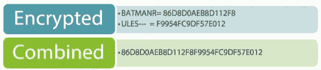
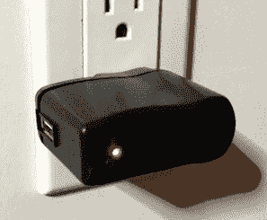
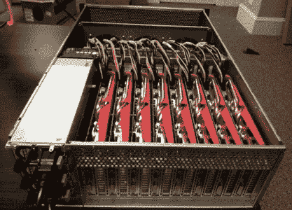

# 第七章：系统黑客

系统黑客指的是黑客用来获取和妥协数字设备（如计算机、智能手机、平板电脑，甚至整个网络）的活动。本课程将解释系统黑客的主要方法——密码破解、特权升级、间谍软件安装、键盘记录以及其他战术。我们还将学习信息技术（**IT**）安全专业人员可以用来应对不同攻击的对策。

学习系统黑客技术将帮助你实施最强的安全实践，帮助你评估当前的安全防护，了解系统和网络中可能存在的漏洞。你将学习哪些安全功能在你的环境中最有效，如何发现和修复安全漏洞，以及如何预测这些漏洞。

在本章中，我们将涵盖以下主题：

+   理解我们的目标

+   第一阶段 – 获取访问权限并破解密码

+   第二阶段 – 升级特权

+   第三阶段 – 维持访问并执行应用程序

+   第四阶段 – 维持访问并隐藏你的工具

+   第五阶段 – 掩盖痕迹 – 清除日志和证据

# 理解我们的目标

本章有三个目标，分别如下：

+   **获取目标的访问权限**：确定目标，了解可用的服务以及开放的端口。同时，了解可能存在于机器上的用户账户，以及可能存在的一些漏洞。

+   **维持访问**：没有什么比成功进入一台机器后，却被踢出去更糟糕的了，因为有人增加了我们的再次进入难度。

+   **掩盖痕迹**：如果你像我一样喜欢看动物或自然纪录片，你知道狗和狼有共同的基因关系，这也解释了它们为何有很多相似之处。它们尤其有一个令人恶心的习惯——吃掉自己的粪便来掩盖痕迹，因为它们的粪便会向附近的捕食者或猎物透露它们的存在。就像狼和狗一样，我们也需要掩盖我们的痕迹。如果我们不这样做，人们就会发现我们进入了系统。然后他们会重新安装系统或将其下线，修复我们造成的所有问题，并限制我们的访问权限。掩盖痕迹是维持访问的一部分。

为了实现这三个目标，我们在系统黑客阶段必须经历五个阶段。

## 五个阶段

以下是我们将在本章中涵盖的五个阶段的简要概述：

+   **第一阶段：获取系统访问权限**。再次，我们已经确定了系统，了解哪些服务在运行，并且——可能——知道用户账户信息。我们需要*两个*信息来获得机器的访问权限：用户名和密码。我们可以使用几种方法来破解密码。

+   **阶段 2：提升权限**。我们可以提升自己创建的账户的权限，或者拿到一个已经存在的账户——比如邮件室的 Billy Bob——并赋予该账户管理员权限。如果我被发现，猜猜谁会有麻烦。可怜的 Billy Bob。现在，我们不必挑选特定的用户账户；我们可以使用已经活跃的服务账户。

+   **阶段 3：维持访问**。我们怎么做呢？通过启动应用程序或我们的工具。我们有一套喜欢使用的工具，我特别喜欢某些工具。我会启动这些应用程序，以便继续从内部发起攻击。如果我已经击中了初步目标，或者这是我预定的最终目标，我需要启动我的应用程序，这样我就能更轻松地重新进入系统。

+   **阶段 4：隐藏工具**。因为我们不想让别人看到我们在系统上的操作。你不想有人浏览时看到你的机器上安装了某个特定的应用程序。你需要隐藏这些信息。有很多方法可以隐藏工具，包括 rootkit 和隐写术。

+   **阶段 5：掩盖痕迹**。我们怎么做呢？好吧，通常机器上有什么东西会跟踪我们在系统上做的所有操作？那就是**日志文件**。我有时把它称作“大哥”。这就是我们区分好黑客和伟大黑客的地方。为了达到我们的目标，我们将删除或修改日志文件。

让我们更详细地讨论这五个阶段中的每一个。

# 阶段 1 – 获取访问权限并破解密码

如果你了解我，你知道我对密码有很大的问题。每次谈到密码，我总是忍不住站上我的讲台，因为说实话，我们创建在线身份，常常在我们自己的网络内或外部——在互联网上使用账户。我们的一切信息都包含在这些身份中，而我们必须用密码来保护这些身份。现在，准备好听我讲的“讲台”部分了吗……人们在创建密码时真的是懒到极点——这让我完全抓狂。随着我们继续深入，你会明白我为何对这个话题如此热衷。

创建 WordPress 的 Matt Mullenweg 有一句很棒的话：*爱是伟大的……但不是作为密码*。你知道吗，*love*是人们常用的前 20 个密码之一，甚至会在后面加个变种？所以，再次强调，在这个阶段我们获取访问权限的整个目标就是试图破解一个密码。我们不一定一开始就去破解那个超级管理员密码，因为获取访问权限的第二个阶段是提升权限。所以，我们首先需要看看能否找到一个密码来获得访问权限。

## 什么是破解？

**破解**是指通过在本地机器上寻找或发现存储的密码，或者尝试在传输过程中进行破解。一个很好的例子是**文件传输协议**（**FTP**）。当你登录用户名和密码时，默认情况下会以明文传输用户名和密码。显然，这是我可以轻松捕捉到的。

有人问我：“破解密码真的有充分的理由吗？”是的，确实有。通常，人们会忘记他们的密码，尤其是对于独立机器来说。我绝不会建议在域环境中尝试破解某人的密码，因为那是这个功能的目的——能够重置密码——但通常，邻居们会跑来对我说：“我忘记了我机器上的密码，进不去了。”当然，当他们说“突然间我进不去了”时，我的大脑通常会有很多警示信号。但我们可以重置本地账户密码。有时候，心情不好的某人会在域环境中做些恶意的事，比如锁定每个人的密码。这表明，破解密码确实有一些合理的目的。

在破解密码方面，我们有两种不同的方式——我们可以通过自动化工具进行破解，或者使用一些有趣的工具手动破解。

当涉及到破解密码时，我们面临的问题是大多数用户选择他们熟悉的东西，因为他们必须记住它，而这正是使得破解密码变得容易的原因。大多数人会用家庭成员的名字、宠物的名字、最喜欢的运动队、漫画书中的英雄、脏话、最喜欢的城市、宗教名词或他们曾经上的学校——大学、小学或高中。这些东西可能容易记住，因为它们对你作为用户来说有意义，但正是这些原因让密码容易被破解。

大多数人从这些类型的词开始，然后在密码的开头或结尾加上数字。通常，这些数字对他们也有意义。大多数人会使用他们的出生年份、毕业年份、结婚纪念日等等。

然而，尽管我们要求人们创建复杂的密码，但它们仍然需要容易记住。否则，我们会整天收到帮助请求：“嘿，我把自己锁了出去，我不记得我的密码了。”所以，在我看来，关于一个合适的密码策略，我们通常依赖四种不同的选项：生物识别、指纹、**双因素认证**（**2FA**）和视网膜扫描，这也是 Windows 10 的一些令人兴奋的特点：微软将生物识别技术嵌入其中，而且它不容易被欺骗。如果你的笔记本电脑或平板电脑有摄像头，它可以通过你的面部进行登录。而且不用担心——他们用的是**三维**（**3D**）技术，这是他们从 Xbox 中学到的。还记得 Kinect 吗？它能进行面部和有时是身体的 3D 识别，这让我感到有点可怕。

这项技术背后的天才们创造了这样一种方式：如果你把自己脸部的照片举到摄像头前，它会将其视为一个平面结构。它意识到没有深度。他们给你展示的示范是，一个绅士把自己的照片举到自己脸前，笔记本电脑并没有让他登录。当他移开照片，露出真面目时，笔记本电脑立刻让他登录。这样一来，没人能窃取你的生物识别信息，除非，当然，他们把你的手指切掉。

我们也可以使用**公共访问卡**（**CACs**）这种刷卡方式。不幸的是，有人可能会偷走它们，这就是为什么使用密码可以提供额外安全性的原因。我是**多因素认证**（**MFA**）的忠实粉丝，你输入密码后，会收到一条短信或电子邮件，上面有一个验证码，确认你已经注册。你通过公司发给你的验证码来验证身份。

随着越来越多的密码被破解，我认为我们将会看到巨大的变化，我们可能会逐步转向生物识别技术。

## 复杂性

复杂性意味着，当我们创建这些密码时，我们需要让它们更难被攻击者猜到。通常，至少在微软，我们通过使用以下四个选项中的三个来处理这个问题——这些选项作为经验法则是很不错的选择：

+   第一个选项是使用密码中的大写字母。现在，我不一定会把所有字符都设置为大写——我的电脑可能会以为我在对它喊叫。

+   我们也可以使用小写字符，你可以随意组合这两种字符——你不需要先用大写字母再用小写字母，或者反过来。

+   我们还可以注入数字。所以，到目前为止，我们得到的就是他们所说的基于字母数字的密码。

+   我们还可以使用盐值技术（稍后我们会讲到）来帮助随机化密码的哈希值。

然而，如果这四个选项是你唯一使用的复杂性元素，总有人会最终*pwn*你，因此，这也是我们喜欢使用特殊字符的原因。

然而，我们在使用特殊字符时需要小心，因为用户和攻击者都会做出一些假设。

任何特殊字符都能帮助你增加复杂性，但我最喜欢的一种特殊字符——让攻击者抓狂的——就是空格键。但仅仅因为它复杂，并不意味着你就安全了，你仍然需要小心。

首先，你必须小心我们所说的**五大要素**。这包括**@**、**$**、**3**、**0**和**!**字符，许多人认为这些字符会迷惑攻击者，假设攻击者永远不会猜到美元符号代表*S*，零代表*O*，3 代表*E*。好吧，攻击者有字典和机制来帮助他们搞清楚这些。不要以为**0penm3up**会让攻击者猜不到你的 3 是*E*，或者**L3tm3in**是*Letmein*。我另一个喜欢的密码是**op3ns3same**。你不认为这会出现在字典里吗？我知道这是一个很酷的密码，但它不会欺骗攻击者。

我之所以总是使用**Pa$$w0rd**，是因为它是所有微软实验室在训练环境中的默认密码。微软要求四个复杂性要求中的三个必须满足，而这个密码正好符合要求。但复杂性并非一切。

密码的强度在于其长度。永远不要使用真实单词，因为它们在外面有我们所说的字典。字典包含大量的单词，而且不同主题的字典有成千上万本。

举个例子，假设你知道我喜欢蝙蝠侠，我们会把**batmanrules**放入密码文件中，如下所示：

图 7.1 – 密码安全检查器，网址：https://security.org

如果我尝试暴力破解它，大约需要一天时间才能破解密码，因为它是由真实单词组成的。事实上，如果它没有这么长（例如，**batman**），它会瞬间被破解，因为它会出现在某个字典中。

我经常做很多基于社区的演讲和研讨会，我试图教用户的一件事（因为这是我特别在意的）是如何创建复杂的密码，同时仍然使其对最终用户易于记住。

做到这一点最有效的方法之一是使用我们每天使用的语法。例如，我正在使用**域名服务**（**DNS**）命名语法，但由于点号的长度和特殊字符，我的密码需要更多时间来暴力破解。希望，如果我的政策要求我在多年后更改密码，那么它不必遵循实际的 DNS 语法。事实上，我可以使用*M*，因为它是倒立的*W*，或者我可以在其中添加一个大写字母——**MMM.ilovecrafstmantools.whatever**。是的，它不需要是一个真实的网站——可以是你想要的任何东西。

让我们试着破解**ilovecraftsman.tools**。它极其长；我们可能需要穿越时间-空间连续体（或者至少让我们的 DeLorean 达到每小时 88 英里，才能向前推进时间，才能在通过暴力破解前破解它），因为暴力破解这个密码需要大约 900 万亿年。我刚刚输入了我的一个密码：破解它需要 90 sextillion 年。游戏结束——我赢了！

## 密码架构

我们可以尝试在密码存储时或者在传输时进行破解，后者称为“在传输中”或者“动态”状态。那么，密码是存储在哪里的呢？这取决于你的操作系统以及所处的环境。例如，在 Windows 中，如果这只是一个非域环境的机器，可能是家庭 PC、祖母的电脑，或者你的笔记本电脑，硬盘上会有一个数据库，称为**安全账户管理器 (SAM) 数据库**。

SAM 数据库位于你安装 Windows 的地方。默认路径是**C:windows/system32/config/sam**。实际上，让我们在这里看一下。在下面的截图中，我打开了文件资源管理器，进入了安装 Windows 的**C:**驱动器下的**System32**目录。这里有一个名为**config**的子目录——展开它，你会注意到里面有一个叫做**SAM**的文件。密码以*哈希*的形式存储，且这个位置或数据库作为注册表项挂载：

图 7.2 – SAM 数据库的位置

如果你在一个域环境中，用户账户不会存储在客户端机器的本地硬盘上，而是存储在一个名为**ntds.dit**的文件中，该文件存在于你环境中的每个域控制器上。在你的域控制器上，它存储在一个名为**C:\windows\ntds.dit**的目录中。

所以，在我的域控制器的**C:**驱动器以及 Windows 目录下，我有一个名为**NTDS**的子目录，**NTDS**是**新技术目录服务 (New Technology Directory Services)**的缩写：

图 7.3 – NTDS 子目录的位置

其中就有著名的**ntds.dit**文件，它是包含我所有基础设施账户的数据库文件，如我们在这里看到的：

图 7.4 – ntds.dit 活动目录 (AD) 账户数据库的位置

现在，不要以为 Linux 没有做同样的事，因为，猜猜看？它有！它将密码存储在**etc**目录下的一个名为**shadow**的文件中（**etc/shadow**）。

对于苹果系统，我们将其存储在一个名为**plist**的文件中，该文件位于**/var/db/dslocal/nods/default/users**下的**var**目录中。

使用这个文件，用户位于大于和小于括号之间**(<user>.plist**)。**plist**有一个与之关联的影子哈希数据属性，有办法可以打开这个文件。通常情况下，你不能随便拿这些。如果你认为你只需拿走它们，猜猜看？这些文件包含你的认证凭据，但它们以哈希值的形式存储。你不能随便打开它。事实上，大多数文件在操作系统运行时都会被锁定。至于它被哈希化的问题，你需要知道这是一个单向算法，这意味着我无法反向解密哈希。"好吧，那很酷，显然我是安全的。"嗯——不，你不是，因为作为攻击者，我可以窃取它。

## 破解/密码黑客的方法

有几种用于破解的技术，如下所述：

+   字典攻击（我们可以使用的最常见的密码破解方式之一）

+   暴力攻击

+   音节攻击

+   混合攻击

+   基于规则的攻击

+   老实可靠的猜测

让我们详细看一下。

### 字典攻击

字典攻击就是它听起来的样子。我们可以去互联网上下载文件（**https://zip-password-cracker.com**或[`apasscracker.com`](https://apasscracker.com)），我们也可以自己创建，因为它们只是单词的文本文档。当我说字典攻击中的*单词*时，我的意思是我可以找到基于不同语言的字典，无论是英语，法语，德语，俄语还是克林贡语。

我们还有基于主题的字典。有一个字典里面有医学术语，历史记载，地点，书中的人物，他们的名字，甚至书本本身特有的东西，比如一个口头禅。

字符也包括电影角色——我有一个字典，里面装满了 J.R.R.托尔金的*指环王*系列中的名字。我还有一个字典，里面有著名人物的名字，电影明星，历史人物，地点和事件。不要认为你很聪明，只是因为你使用的密码可能不是传统密码，因为你是基于一个真实单词。请不要这样做。也不要认为*我只是把它倒过来*，因为任何值得一提的密码破解工具都会进行字符串操作。它会取这个单词并尝试不同的组合或反转。所以，不，你没有欺骗我。

### 暴力攻击

现在听我说，下周理解我（用我的阿诺德·施瓦辛格的声音）。暴力攻击需要更长的时间来完成。我们所说的暴力攻击是尝试密码中每种字母数字和特殊字符的每种组合。显然，如果密码只有 6 个字符长，暴力攻击将相对快速，但当我们进入超过 14 个字符的密码时，情况就变得更加困难。需要更多的循环来进行，暴力攻击必须尝试每种变体。像约翰·里普尔、卡恩与亚伯尔或 Aircrack-ng 这样的工具非常有用。

暴力攻击有一个好处，尽管它需要更长的时间并尝试每种组合，这需要更多的循环。猜猜看？虽然需要时间，但它是 100%有效的。谁有时间？攻击者有。

### 音节攻击

使用音节攻击，我们拿一个密码——在这种情况下，我们假设密码是**pass**——然后结合字典和暴力攻击，尝试字典中每个条目的每种可能排列。

### 混合攻击

混合攻击仍然使用字典，但基于用户的懈怠，我们将尝试不同的变体，包括在密码的开头或结尾包含数字和特殊字符。所以，假设我有**Batman**，下个月我必须更改我的密码，所以我将其更改为**Batman1**，下个月我将其更改为**Batman2**。嗯，混合攻击最终会破解这个密码。

顺便说一句，如果你或你的用户每个月只是在密码末尾添加一个或两个字符来修改密码，请拍一下自己的脑袋，并承诺再也不这样做。但不要拍你的用户的脑袋——你可能会被**人力资源**（**HR**）叫去。

### 基于规则的攻击

我所说的规则攻击是什么意思？还记得枚举吗？如果你对此不熟悉，可以参考本书的*第五章*，*枚举*。通过枚举，我们可以使用我们发现的规则，比如要求用户至少有一个 8 位字符的密码。我将利用这些对付你。而且，我知道你使用复杂性，我能发现你需要两个数字。所以，我使用暴力、字典和音节攻击的组合。再次强调，如果我知道你只有 8 个字符，这就是你密码所需的全部，我不会尝试 9 或 10 个字符。或者，如果你不需要数字，那为什么要运行这些数字？

### 传统可靠的猜测

还有传统可靠的猜测，其中包括一些侦察和足迹。这是我们尽可能多地了解目标的地方，无论是用户还是公司。通常，用户的密码基于他们所知道的事情。所以，如果我上社交媒体，有机会我会发现他们最喜欢的运动队，他们成长时的宠物狗，以及他们配偶的生日。我们分享了太多信息。

## 攻击类型

现在我们了解了用于破解的一些技术，接下来我们来谈谈攻击的类型。

攻击通常分为四个不同的类别，如下所示：

+   被动在线攻击

+   主动在线攻击

+   离线攻击

+   非电子攻击

让我们讨论每个类别以及与每个类别相关的攻击。

### 被动在线攻击

这些攻击类型是被动的，这意味着我们不一定会与机器或目标进行直接的通信。

#### 嗅探

被动在线攻击包括诸如嗅探网络，看看我们是否能发现来回传输的密码。例如，FTP 默认使用明文传输，因此仅仅通过嗅探，我们可能就能捕获一些密码。

#### 中间人攻击（MitM）

这种攻击发生在攻击者将其机器或黑客设备置于源和目标之间时。他们只是处理所有来回的流量。再次强调，我并没有修改任何东西——它是如此被动，以至于很难让任何人察觉我在做什么。我只是捕获数据，确保所有数据都通过我再发送到交换机。

#### 会话劫持

这种攻击因 Firefox 插件**firesheep**而广为人知。它允许攻击者前往任何 Wi-Fi 接入点，如星巴克、咖啡店或网吧，如果他们与其他用户处于同一 Wi-Fi 接入点，就能在他们交易的过程中窃取他们的 Cookie。然后，他们可以做一些事情，比如登录他们的 Facebook 账户或接管他们的 Facebook 会话。再次强调，这些攻击相对被动——我并没有攻击特定的目标。

### 主动在线攻击

主动在线攻击就是这样——它更加主动。我们知道，我们越活跃，就越容易被抓住。

#### 哈希注入

这是一种将被攻陷的哈希注入当前会话并使用该哈希进行网络资源认证的攻击方式。

哈希基本上是加密后的密码，密码通常以哈希的形式存储在系统中。如果我有一个存储用户名和密码的文件，并且文件是完全明文的，那么根本没有安全性可言，对吧？原因是任何人都可以找到这个文件。还记得那个 SAM 数据库吗？它以哈希格式存储用户账户和密码。

在过去，微软使用了一种叫做 **LAN 管理器 (LM) 哈希** 的方式，这在当时是一个噩梦，现在有时仍然是个噩梦。每当我教授关于道德黑客的课程时，我总是听到这样的问题：“*为什么要谈论这些旧操作系统中的哈希词和其他相关内容？为什么不谈论新的东西？*” 好吧，我得跟你们说实话——这就像是当一个猎人。如果我要出去打猎，我不会去找最新、最现代的猎物——我想要猎取最古老的猎物，因为它更慢，而且没人关注它。谁知道它是否已经更新过呢？新的东西有新的技术，反而有时会让我更难应对。我曾教授一门课，里面有两位来自大型州政府组织的 IT 人员，当我们聊天时，他们告诉我他们仍然有一些 XP 机器和一些 Server 2000 和 2003 系统。

你可能会摇头，想知道为什么你需要升级一台可能只做一项任务的机器。在我的两位学生的例子中，那台机器处理他们的文档成像系统。在另一个制造设施中，有一台由 Windows 机器控制的机器人手臂。它整天来回移动。这些机器如果用 XP 就能正常工作，真的有必要装上 Windows 10 吗？如果你创建了一个不超过 14 个字符的密码，LM 哈希会将所有字母转化——无论是大写字母还是小写字母——并将它们转换为全部大写。转换为大写后，它会将任何剩余字段填充至完整的 14 个字符。所以，在这个例子中，我会有三个填充空格。接着，事情变得有点疯狂。LM 哈希接着会将密码分割成两个 7 字符的字符串。这两个 7 字符的字符串会被加密并合并回一起。

例如，**BatmanR** 会被哈希为这个值，而剩余的 **ULES** 和它的填充空格会被加密为这个哈希值。然后，它们会被合并，这就是你的 LM 哈希值，如图所示：

图 7.5 – LM 哈希值的生成方式

然后，微软加入了 NTLM，它是 NT LAN 管理器哈希。因此，我们在 SAM 账户数据库中看到的结果会包含用户的名字（在这个例子中是 **Bwayne**），名字后面跟着一个数字，然后是接下来的 32 个字符，也就是 LM 哈希，最后附加上 NTLM 哈希。现在，这两者之间的最大区别在于密码哈希算法。LM 使用的是他们所称的 **diz**，这种算法非常容易被破解。

然后，他们推出了 NTLM **版本 1** (**v1**)，这使我们开始使用 **消息摘要 4** (**MD4**)，它是一个更好的算法，但 NTLM **版本 2** (**v2**)使用了 MD5，它更好，理论上你应该尽可能使用它。所以，你可能会看到其中列出了另一个帐户作为 **administrator**，后面跟着数字 500。500 是**安全标识符** (**SID**)——在微软世界里，所有的管理帐户的 SID 最后都以 500 结尾。同样，我会看到 LM 哈希和 NTLM 哈希的组合。

注意

每当你看到一个以双 **AAD3B435B51404EE** 结尾的哈希值时，这对你应该有所意义。这是一个非常常见的结尾哈希，它描述了最后的 7 个字符—记住我们需要填充它以确保总共有 14 个字符？它告诉我密码的长度是 7 个字符或更少。如果某人输入的密码超过 14 个字符，也会发生类似的情况。记住，这个情况会出现在 14 个字符的密码上。如果超过 14 个字符，那么 LM 哈希值就会被丢弃，而不再被使用。如今的操作系统（从 Vista 及更高版本开始）默认禁用 LM 哈希。

#### 键盘记录器

在涉及键盘记录器时，我们会监控特定系统或目标上每一击键。这些按键，取决于键盘记录器本身，可能会被传输回攻击者。

键盘记录器是监控并记录按键、鼠标操作、截图、谁登录以及登录时间的软件程序。令人惊讶的是，这些软件程序能做的事情，但大多数会记录按键。有很多这样的软件，其中一些有其合法用途——例如，一些父母或监护人希望监控孩子在电脑上做的事情。

我们还有硬件驱动的键盘记录器，这些设备非常难以检测。它们会监控每一次按键，看起来不像是什么恶意的设备，但其中一些设备内置了小型应用程序，可以记录日志文件，或者直接将日志通过邮件发送给我。

作为一名安全专家，你需要知道你的机器上安装了什么，软件和硬件都需要了解。如果你查看一台机器的背面，看到下面列出的某个设备插入到系统背面，而且鼠标也插入到它上面，你会怎么判断？

图 7.6 – 键盘记录器

问题是：*这些设备有合法用途吗？* 可能对于公司来说，了解人们在键盘上输入的内容—他们分享的信息，是有商业价值的。而且，这种情况不仅限于看起来像这些的设备。

有些键盘你可以进行修改——你可以自己动手，在键盘内部安装一个键盘记录器硬件。你也可以购买这些键盘，并将它们部署到终端用户手中。或者，如果我直接给你寄一个免费的，它连接到你的系统，那么我们就可以捕捉截图，并记录你访问了哪些网站？我甚至可以读取你的电子邮件，因为你输入时，它会被记录下来。我还可以捕捉登录名。“*等一下——当我输入密码时，我看到的是星号*。”好吧，猜猜看？键盘记录器不会记录星号——那是你看到的视觉效果。

如果你说的是“*那些是物理连接的设备*”，我有个坏消息要告诉你。外面有 Wi-Fi 键盘记录器。如果你有蓝牙键盘（而且大多数微软键盘的连接方式是蓝牙），你也有麻烦了。

这看起来像是一个**统一串行总线**（**USB**）充电器，但它内部却藏着一个蓝牙键盘记录器：

图 7.7 – 隐藏在 USB 充电器中的键盘记录器

我不需要连接到你的系统。我只需插上它，而你可能会想：“*实际上，我可以把它当做给手机充电的工具使用*。”与此同时，它会接收蓝牙信号，检测人们在蓝牙键盘上输入的内容。

这就有点吓人了……现在他们已经有声波键盘记录器了。这是什么意思？现在有些应用程序正在进行实验。它需要时间，因为它必须学习击键的声音，但过一段时间后，它会通过声音波预测打的是哪些键。

如果这还不够吓人，那怎么样来点根本性的木马日志记录器？是的——已经有两个在野外被发现了。其中一个叫做**水母**，这是一种键盘记录器，它运行在**显卡的图形处理单元**（**GPU**）中，而不是通过处理器或系统的**中央处理单元**（**CPU**），而且我并不知道有多少杀毒软件正在查看 GPU 上运行的内容！

让你脊背发凉的是，我们还有虚拟机监控型的键盘记录器。这些键盘记录器会存在于一块被虚拟化的恶意软件中。它运行在操作系统之下，所以它不会被触碰，就像**虚拟机**（**VM**）一样。

我们还有基于表单抓取的键盘记录器。这些基本上是一种软件，它会记录网页表单数据，然后通过互联网将你填写的表单数据发送给攻击者。不——它不仅限于 PC。

### 离线攻击

这些攻击方式很有意思，因为在离线攻击中，我们有的是时间。那么什么是离线攻击呢？如果我能以某种方式访问存储你密码和用户帐户的地方，并且可以在离线状态下进行操作，那么我就不会攻击那个机器。我会抓取一个数据库，比如 SAM 帐户数据库，或者可能我会抓取你的**ntds.dit**文件，然后我可以开始进行彩虹攻击（我们稍后会详细讨论）。

我们还可以使用以下方法之一。

#### 分布式网络攻击

**分布式网络攻击**（**DNA**）通过利用多个计算机的分布式计算能力，扩展了解密功能，可以解密文件、找出密码短语并恢复密码，而不局限于单台计算机。

#### 预计算哈希

在这里，攻击者可以使用哈希函数解密字典中的每个单词，然后将其与加密密码进行比较。这样做的缺点是它需要大量的空间，但它的优势在于速度极快。

### 非电子攻击

非电子攻击是通过不使用技术的方式获取有价值信息的可能方法。虽然这些方法可能不太常见，但它们在获取所需数据或访问权限时依然非常有效。

#### 垃圾桶潜水

这就是我们查看垃圾的方式。现在，这可能看起来不太体面，但相信我，这种事确实发生过。甲骨文曾因在微软的垃圾桶里做过垃圾桶潜水而抓到微软撒谎。

垃圾桶潜水是一种攻击者通过寻找可用信息的手段，这些信息可以用来建立信任。你可以通过探索目标受害人的垃圾，找到医疗记录、简历、个人照片、电子邮件、银行对账单、账户详情、软件信息、技术支持日志、政府记录、医疗账单、简历等内容。一旦垃圾被收集，信息就可以用来拼凑身份档案，从而使社会工程学攻击更容易成功。

#### 肩窥攻击

在这种攻击类型中，某人显然是在监视你的肩膀，或者使用某种机制。现在最先进的方法是，我手里拿着一部可以拍摄视频的电子手机。假如我把它放在耳边，好像在和别人通话，但实际上我把摄像头指向你输入密码的地方？事实上，我对这种事情很警觉。当我去购物时，如果我打算在某个地方刷信用卡，我总是停下来环顾四周，看是否有人假装在用手机，而且手机正好指向我这边。

#### 社会工程学

有一种社交工程的手段是一种非电子攻击，虽然有点灰色地带。它是一种非常著名的攻击方式，涉及使用 USB 切换刀。在这种情况下，作为攻击者，我配置一个 USB 驱动器，当你插入时，它会悄悄地进行一些有趣的操作，比如为我安装一个键盘记录器，也许是恶意软件，并且这一切都在背后悄无声息地进行。也许它甚至能捕捉到我检测到的你的登录凭证，然后我做的事情是随便把这个 USB 驱动器放到某个我知道有人会找到的地方——比如在公司停车场、主大厅、走廊、洗手间附近：就在目标公司附近的某个地方。如果有人捡到，它们会做什么呢？第一时间插入这个坏家伙，啪——他们就被*pwned*了！

## 认证方法旨在提供帮助

接下来是一些额外的破解概念，帮助你在破解过程中取得进展。

### 当 NTLM 认证对你不起作用时

这种认证机制是微软的专有技术，如果存在某些特定情况，它是默认使用的认证方式。我知道你会说：“他们在使用 Kerberos。”我知道，除非以下情况适用于你。它仅在两个不同的森林之间没有 Kerberos 信任关系并且你尝试共享资源时使用。

另一个使用 NTLM 而非 Kerberos 的情况是当通过 IP 而非 DNS 名称进行身份验证时，因为 Kerberos 要求 DNS 或域名环境。此外，如果一个或两个系统不属于同一域，请不要以为你没有使用 NTLM，因为实际上你很可能正在使用它。

另一种情况是如果你有一个防火墙阻止了 Kerberos。那么我们知道它在什么时候使用，那么它是如何使用的呢？实际上，它基于挑战-响应算法。

这其中很酷的部分是，密码从未被传输，因为你只是回应一个请求或挑战。正如我之前提到的，NTLM 从 Windows NT 的 v1 版本开始就有了。v2 版本随**Service Pack 4**（**SP 4**）发布，所以如果你偶然遇到一个较老的 NT 系统，那么它很可能正在运行 v2 版本。

其工作原理是这样的：你有一台客户端机器，用户在登录界面输入用户名和密码。之后，Windows 会将该密码通过哈希算法处理，生成一个该密码的哈希值。然后，客户端将登录请求发送到域控制器，由于计算机已经加入了域，域控制器非常清楚与该登录名相关联的哈希值。因此，域控制器会生成一个随机字符串并发送过去，基本上是这样说的：“如果你说的是真的，你应该能够回答这个请求。” 客户端使用哈希值对这个请求进行加密，并将其发送回域控制器。域控制器接着会处理，获取用户密码或密码的哈希值，并进行比较，看它是否是正确的答案。如果答案相同，那么你就可以过桥了。如果不对，你就不能通过。这让我想起了著名的*《蒙提·派森与圣杯》*电影中的三问死亡之桥的场景。

### Kerberos 认证

这就是我们正在使用的，几乎是与微软最新、最强大的技术同步的。Kerberos 得名于三头狗，它守护着地狱的大门——如果你是*哈利·波特*的粉丝，它也叫“弗拉菲”。它是基于票证的，我们发放票证，票证用来代表凭据。它非常快速，因为我们不需要一次又一次地重新认证用户——或者，可能是计算机。再次，它避免了密码的传输。

现在，这里有一个小细节，那就是它是基于时间的。如果你记得我们在枚举章节中提到的**主域控制器**（**PDC**），你应该记得它负责将每个人的时钟与自己同步，因为在 Kerberos 中，微软的默认设置是 PDC 和你的系统时钟之间不能有超过 5 分钟的时间差。如果时间差超过了，它将无法认证你。那么，来看看弗拉菲是如何被使用的。

首先，我们有一台计算机、一个用户和一个域控制器。域控制器上运行着一些特殊的服务，其中之一就是**密钥分发中心**（**KDC**）。如果我们有一个文件服务器并尝试访问它，用户会向域控制器发出请求，说：“我需要进行身份验证，请。”域控制器则回应：“好的，我能为你做什么？我可以验证你。”接着，用户的计算机会说：“我需要获取**票据授权票**（**TGT**）。”因为计算机和域控制器属于同一域，所以域控制器可以向用户或计算机发放这个 TGT 或票据，以便在他们想访问资源时使用。当用户/计算机想要访问文件服务器上的文件时，他们只需提供他们的 TGT，文件服务器看到这是来自一个可信来源，便会迅速向域控制器核实并问：“这个账户仍然有效吗？”这样做的原因是为了防止管理员锁定了该用户。现在，仅仅因为票据被使用并不意味着你是安全的。我们稍后会在另一章中看到一个名为 John the Ripper 的工具——这是一个非常著名的工具，可能是现今最强大的工具之一。它是一个 Linux 工具，可以破解 Unix、LM 哈希密码、NTLM 密码和 Kerberos 密码。

### 盐值

盐值？是的……我的哈希需要一点盐。那么，如果你有两个用户，使用完全相同的密码，它们的哈希值会是什么样子呢？解决方案是什么？我们可以通过在密码前面或后面附加随机字符串——我们称这些为盐值——来随机化哈希值，这样可以避免出现重复的哈希值，并且使得攻击者很难弄清楚发生了什么。

每个盐值都需要确保它对于每个密码都是唯一的。不要为每个密码使用相同的字符字符串。如果你这么做了，作为攻击者，我只需要弄清楚你的盐值字符串是什么，然后就能获得每个人的密码。例如，我有两个账户，它们都使用相同的密码，那么它们的哈希值将是相同的。如果我使用盐值，我可以将一些唯一的字符附加到密码的末尾；因此，两个使用相同密码的不同账户将具有不同的哈希值。为了检查密码是否正确，我们必须能够访问盐值，因此它通常与哈希一起存储在用户账户数据库中，或作为哈希字符串的一部分。

现在，我得给你一个不幸的提醒，因为微软并不使用这个方法。它们在某些方面有使用，AD 中的密码是经过哈希处理的，但最终的哈希值实际上就是用户名本身。所以，再次提醒，确保如果你为密码加盐，每个盐值都是独一无二的。如果你是开发者，正在创建应用程序并希望让用户登录，一个常见的错误是他们会在程序中硬编码一个盐值，或者仅生成一个盐值并重复使用。如果我对每个密码都使用相同的盐值，两个使用相同密码的用户会有相同的哈希值。

另一个问题是你的盐值可能不够长——例如，只有 3 个字符。3 个字符会缩小攻击者需要考虑的可能性范围。现在，因为我刚才告诉过你哈希值需要被存储，这就带来了一个难题，对吧？如果密钥存储在系统中，而攻击者获得了系统的完全访问权限，他们将能够窃取密钥，无论盐值多长。密钥需要存储在外部系统中，比如一个物理隔离的服务器，专门用于密码验证。市面上也有专用硬件帮助存储盐值密钥。

## 其他破解方法

除了我们之前提到的方法，还有几种其他方法值得一提。

### 彩虹表和其他选项

彩虹表是一种预计算的哈希表，这样我就不必尝试每个哈希值的变种——我事先计算好了它们。我只需进行比较。不幸的是，这些预计算的哈希值占用大量存储空间。然而，你可以下载一些免费的彩虹表。

注意

你必须用谷歌搜索它们，并准备一个超大的文件（**太字节**（**TB**），在某些情况下）。可以访问[`freerainbowtables.com`](https://freerainbowtables.com)查看示例。

如果你有足够的存储空间，也可以创建自己的彩虹表。有趣的是，随着**固态硬盘**（**SSDs**）和云计算等新技术的出现，攻击者利用这些技术以创纪录的速度创建彩虹表，并利用亚马逊云系统或 Azure 的处理能力。在编译完这些彩虹表后，攻击者会去出售它们。

### 查找表

我们还可以利用**查找表**（**LUTs**），它们就是普通的表格。基本上，这表示：“有没有哪个哈希值等于这个哈希值？哦，看——找到了，一个密码是 password5，”因为这就是哈希值的结果。

下面是一些示例：

+   有没有哪个哈希值等于下面的？

**5f4dcc3b5aa765d61d8327deb882cf99: 找到：password5**

然后它会继续查看这些表格，表示：“嘿，那个怎么样？”哦，不在数据库中，所以没人拥有这个密码或哈希值。

+   那下面的怎么样？

**6cbe615c106f422d23669b610b564800: 不在数据库中**

你的破解工具将继续工作：“嘿，我能得到 letMEin12 吗？有回应吗？”

+   我能得到以下内容吗？

**630bf032efe4507f2c57b280995925a9: 找到：letMEin12**

“是的，这是另一个——试试这个。”它是这样的：

+   **386f43fab5d096a7a66d67c8f213e5ec: 找到：mcd0nalds**

它会继续进行，具体取决于你下载的表格大小。

### 反向查找表（Reverse LUTs）

类似于查找表（LUT）的东西就是反向查找表（reverse LUT）。它们的工作方式是：“我有一个密码的哈希值：apple123——在这个列表中，谁使用了这个哈希值？哦，有几个账户……有 alice3，0bob0，还有 charles8。”

我热爱技术，但有时我看着新事物时会问自己：“这对我的安全有什么帮助？”

让我给你展示一些东西。下面的截图展示了一台装有多个显卡的计算机系统。这是一个项目：

](Images/B17486_07_008.jpg)

图 7.8 – GPU 破解系统

现在，许多视频卡上都配有 GPU，而 GPU 非常适合破解密码。我们通常认为 CPU 有多个核心——例如，i7 可能有 8 个核心，或者你可能有一个双核。实际上，GPU 里有数百个核心。在这个研究项目中，他们建立了五个这样的系统。它们有 25 块**超威半导体**（**AMD**）GPU，并且五个系统之间的连接速度为每秒 10 吉比特（Gbps）。猜猜看？我们不再需要做彩虹表了。使用这个系统和暴力破解，这个集群每秒能破解 3480 亿个 NTLM 密码。这意味着，一个 14 位密码只需要 6 分钟就能破解。

那 MD5 怎么样？嗯，我用这个设备每秒可以做 1800 亿次，即使你觉得你很安全并且在使用**安全哈希算法 1**（**SHA-1**），我也只会把你的破解速度慢下来，变成每秒 63 亿次密码暴力破解。记住——这种系统，我会用在离线攻击中。我会获取你的数据库，然后可能在一两天内，就能为你找到几个登录选项。

现在我们已经完成了获取访问权限和破解密码的工作，接下来让我们讨论如何提升权限。

# 阶段 2 – 提升权限

想要本地管理员权限，尽管你并不被允许拥有这些权限，这就是提升权限的核心问题。所以，我们现在面临的问题是：我们已经破解了密码并找到了用户 ID，但我们被困在该用户的权限内——还是说我们没有？

世界著名的黑客凯文·米特尼克（Kevin Mitnick）曾说过：

这是真的，我曾入侵过很多公司，拿走源代码并分析其中的安全漏洞。如果我能找到安全漏洞，就能在入侵他们的系统时做得更好——这一切都是为了成为一个更好的黑客。

想一想，他所做的其实是通过了解源代码并查看哪些漏洞或问题可以帮助他提升权限，从而提升了自己的权限。

## 我们已经进来了。接下来该做什么？

现在我们该怎么做？记得我们是如何进入的吗？我们找到了一个用户账户并破解了他们的密码。我们现在的目标是给自己足够的权限和许可来做我们想做的事。所以，永远不要认为因为你不是管理员或没有管理员权限，你就不能完成目标。

一旦我们成功进入，下一步是四处查看。如果我们以本地管理员身份进入，我将查看是否有任何配置错误。我还可能会检查网络基础设施层面上的设计错误。再次强调，很多时候你可能会通过 Google 黑客手段发现目标，然后仅凭默认的用户名和密码就进入了系统。进入后你会想：“嗯，我还没有完全侦察这个环境”，所以我们可能还需要再检查一下这些设计错误。也许它们被错误配置了，或者没有更改默认密码和默认设置。

我还想了解一下布局。这个我已经攻击过的目标，它在网络中的作用是什么？我还会查看是否有编程上的缺陷。我知道——程序员*从不犯错*，对吧？他们只是发布补丁来增强应用程序。这就像 IT 人员——他们*从不犯错*，他们只是改善性能。

至于我们的整体目标，我们有四种基本的提升权限方法，具体如下：

+   **征服管理员/root 账户**

我们的目标之一是能够*征服* **管理员** 或 **root** 账户。

+   **利用漏洞**

第二种方法是利用应用程序或操作系统中的漏洞，这些漏洞将允许你以特权用户身份访问。有许多应用程序在后台提升当前登录用户的权限，而这些你可能没有考虑到。

尝试使用 [www.exploit-db.com](http://www.exploit-db.com)。它提供了关于你可以利用的漏洞的见解。我们将会详细了解其中的一些。我们可以通过这个来进行权限提升。

+   **使用提升权限工具**

另一种提升权限的方法是启动像 Metasploit 这样的工具，它是一个完整的框架和黑客套件，旨在让你查看网络中是否存在任何漏洞或其他类型的弱点。但显然，我们知道攻击者会利用这些工具来对付我们。Metasploit 的缺点是它非常容易使用。你可能会在 YouTube 上找到相关的视频，这意味着可能有个 12 岁的小孩正在试图攻击你的系统。

还有更多类似的工具，包括 Canvas 和 Core Impact，这些都是完整的渗透测试工具，以及 Armitage，它基本上是 Metasploit 的图形化前端。

+   **社会工程学**

如果我们让别人为我们做这件事怎么办？这就是所谓的社会工程学。作为攻击者，我可以说服人们为我运行一个程序，或者可能为我查看一个文件。我必须以某种方式引诱他们，利用社会工程学的核心情感之一。通常，我会通过恐惧或贪婪，或者寻求帮助来做这件事——这是一种非常可靠的社会工程学手段，因为作为人类，我们喜欢帮助他人，对吧？我做的就是发一封邮件给你，附上一个脚本或程序，要求你双击它，因为它会*为你修补系统*。我会让它看起来像是 IT 人员发来的邮件。我还可以创建一个**便携式文档格式**（**PDF**）文件，打开后它会为我执行程序。

## 对策

我们如何阻止这种情况发生？好吧，确实有一些对策，但你需要记住，你的工作不是去阻止它们——因为你做不到。你只能减缓它们的速度。那么，我们如何做到这一点呢？以下是方法：

+   第一种方法是使用加密，这有助于保护被认为是敏感的数据。如果我将数据加密到某个特定用户，那么无论该用户的权限是什么，或者我自己用户的权限是什么，我都无法访问这些信息。

+   你还可以考虑在用户和应用程序方面实施最小权限。我们所说的是，不要过度分配你的权限。如果某人需要在机器上做某件事，花时间弄清楚他们需要哪些权限，并只给予他们这些权限。

+   你还可以确保你的更新已完成。这让我感到非常恼火，因为许多权限提升问题可以通过确保你在修补系统来避免。

+   你还可以做的一件事是限制交互式登录。交互式登录是指在计算机上按下“三指礼”或*Ctrl + Delete*键并登录的权限。默认情况下，普通用户没有权限在服务器上进行交互式登录。

+   你还可以确保你的服务帐户是有限制的，使用类似于最小权限的概念。我经常看到这种错误，IT 人员会去安装一个应用程序——例如**结构化查询语言**（**SQL**）或 SharePoint——他们需要一个能够利用机器的服务帐户。就机器而言，所有的工作是由用户执行的，但实际上是由这个帐户来做。有时候，IT 会使用本地计算机上的管理员帐户。再一次，你需要评估这些服务帐户需要什么访问权限，因为它可能为你创造了一个漏洞或漏洞点。

+   另一个选项是限制代码的范围，如果你是开发者并且正在创建一个以高权限级别运行的应用程序。再次强调，通常我们在走捷径时会导致问题的发生。

+   你还可以做权限分离。采用这种方法时，我们可以限制编程错误和可能的漏洞的范围。

+   如果你是开发者，你还可以仔细测试操作系统和应用程序，审查代码。如果你是 IT 人员，并且开发者说：“这是我们将要使用的新应用”，那么应该有一些文档说明做了哪些工作。你应该对任何要求你在环境中放置的代码提出质疑。如果你是开发者，不要随便下载某人的示例代码并直接复制粘贴。确保理解每一行代码的作用。

+   使用多因素认证是另一种对策。通过这种方式，我们为自己增加了另一层安全防护网。

+   做一些压力测试。因为很多时候，当一个应用程序或操作系统过载时，它会产生漏洞。你甚至可能会考虑使用**BoundsChecker**进行调试。然而，请意识到，尽管这些措施无法完全防止所有事件的发生，但至少可以让你感觉自己已经掌握了一些主动权。

接下来，我们将讨论有助于我们实现目标的不同类型的升级。

## 升级类型

现在我们了解了不同的对策，让我们来讨论不同类型的升级。

### 特权升级

这是指任何能够让攻击者在系统被攻破后获得更高权限的情况。换句话说，我们将一个低权限账户的权限提升到更高的账户，这样我们就能进行横向移动，享受各种有趣的操作。我们还涉及到他们所称的**信息泄露**。这基本上是指任何类型的漏洞，允许攻击者访问敏感或受保护的数据。我们还涉及到他们所称的**安全功能绕过**。通常，这是由软件弱点引起的，允许攻击者绕过政策、验证，甚至其他保护措施，比如绕过**用户账户控制**（**UAC**）或任何类型的过滤器。你可以执行不同类型的升级，选择使用哪种方法将取决于你要实现的目标。特权升级可以通过使用**动态链接库**（**DLL**）注入来完成。

### 横向升级

在安全术语中，横向升级是攻击者用来实现其目标的最常见方法之一。

攻击者通常会寻找穿透外围防御的方法，以便在网络内获得初步的立足点。通常，他们会发现一些低挂的果实，比如一个留下空白密码的用户，或者一个缺乏适当安全控制的 Web 应用程序。

一旦攻击者获得了对网络的访问，他们将寻找横向移动的方式，并尽可能地将感染传播到更多的系统。通过这样做，他们可以收集更多有价值的数据，甚至控制整个网络。

### 离线访问

离线访问通常是指那些可能不总是连接到网络的机器。如果一台笔记本电脑被盗，或者我能够攻陷这台笔记本电脑，我就有了无限的时间，因为它是离线的。正因为如此，我可以利用一些简单的漏洞来完全控制这台机器，然后希望当你重新连接它时，我能继续我的完全支配。

### DLL 和 DYLIB 劫持

DLL 文件一直困扰我们。这是我们必须面对的问题。大多数 Windows 应用程序在加载 DLL 时并没有使用完全限定的路径，因此没有结构。它基本上是说：*运行这个 DLL*。相反，默认情况下，当一个应用程序启动时，它首先会搜索其启动目录。考虑到大多数应用程序开发人员和用户会走捷径——不指定路径——攻击者可以在应用程序目录中加载一个带有恶意意图的 DLL。一个例子是，如果一个应用程序需要 **library.dll** 文件（该文件位于系统目录中）来安装应用程序。如果它找不到该文件，或者如果它首先在你安装的路径中找到了该文件，它就不会看到 Windows 系统目录中的文件。所以，当用户运行并加载应用程序时，它使用了该 DLL，攻击者就可以获得对该计算机的完全远程访问。嗯——也许这应该让你开始怀疑现在下载 torrent 文件了，对吧？

*Fortnite* 是一款深受儿童和成人喜爱的游戏，极为流行。了解这一点后，攻击者曾经发布 *补丁*，让玩家变得无敌或获得额外的枪支。好吧，当然可以，但它们通常是装载了其他东西。事实上，安全研究人员发现了这个漏洞。

别以为 Windows 是唯一的受害者。苹果也是一个非常大的目标。但与使用 DLL 不同，苹果使用 **DYnamically linked LIBraries**（**DYLIBs**），这基本上是相同的概念。这是一个动态库，因此得名，应用程序可以调用它，但 DYLIBs 通常是特定于用户的。所以，根据我们想要部署的方式，攻击者可以简单地将恶意 DYLIB 放入特定位置。在很多情况下，OS X 中的加载器将会在多个路径中搜索动态库。这将帮助攻击者将恶意 DYLIB 注入到其中一个主目录中，然后在运行时简单地加载该恶意 DYLIB。这使得攻击者能够绕过安全软件，甚至绕过 Gatekeeper——macOS 系统的安全功能，它强制代码签名并在允许应用程序运行之前验证下载的应用程序。但是，同样的，我可以通过劫持 DYLIB 绕过这一切。好了——我们别再挑软件的毛病了，来谈谈硬件吧！

### 利用 CPU 漏洞

我们来谈谈 Spectre 和 Meltdown，好吗？这两个漏洞都是基于 CPU 的，遗憾的是，这些漏洞跨越了不同类型的芯片，且存在了很长一段时间。它们每个都利用了内存缓存和执行顺序，和/或利用了分支预测。现在，这些术语可能有点难懂，但要知道，漏洞是存在的。

我们面临的另一个问题，特别是在关注像 Spectre 这样的安全漏洞时，就是它带来了一些有趣的问题，因为它影响了来自 Apple、AMD、**高级 RISC 机器**（**ARM**）的 CPU、Intel、Samsung 甚至 Qualcomm 的处理器。这些基本上是地球上所有的手机，对吧？这个漏洞通过欺骗处理器，利用预测执行来读取受限数据。这意味着，如果芯片识别到一个包含多个条件语句的程序，它会开始执行，然后在程序执行之前得出所有可能的输出，从而加快系统速度。这个漏洞允许攻击者强制处理器在执行边界检查之前完成预测执行读取。结果是，攻击者可以访问并读取 **越界**（**OOB**）内存位置。这些位置可能包括机密信息——例如存储在浏览器中的凭证——甚至是读取内核内存或利用 JavaScript 进行基于 Web 的攻击。

说到 Meltdown，这个漏洞并不是所有 CPU 都存在，但它确实影响了 Apple 部署的所有处理器，不论是基于 Intel 还是 ARM 的处理器。这个漏洞通过利用 CPU 的优化机制和预测执行，欺骗进程访问越界内存。攻击者可以利用这两种漏洞之一，强制无特权进程读取其他相邻的内存位置，例如内核内存或物理内存，从而提升其权限。

这两个漏洞最大的一个问题是，它们是内建于芯片中的，唯一能够修复这些漏洞的方法是针对已发布的受影响 CPU，推出软件修复程序，但这导致了 CPU 性能的下降。

### 访问令牌篡改

攻击者可以通过诸如访问令牌篡改等方式提升权限。Windows 本身使用访问令牌来确定正在运行的进程的所有者。用户或攻击者可以篡改访问令牌，使一个运行中的进程看起来像是属于启动该进程的用户之外的其他人。我们将这些称为伪造令牌。

### 应用程序修补

这在 Windows 操作系统使用 **Windows 通信框架**（**WCF**）时发挥作用。我们称之为 **Shim**，它允许 Windows 10 执行或运行旧版本的程序。例如，对于那些在 XP 下创建的程序，如果你升级到 Windows 10，仍然希望该应用程序能够运行。这些 Shim 在程序与操作系统之间提供了一个缓冲区。

如果你曾经在 Windows 中使用过兼容性向导来尝试运行一个应用程序，它会问你一些问题，比如：“它是否需要提升的权限，或者它是否能在以前版本的 Windows 中运行？”这帮助你构建那个 Shim。现在，当程序启动时，会引用 Shim 创建的缓冲区。它需要验证程序是否有权限访问 Shim 数据库。一些 Shim 可以用来绕过 UAC，注入恶意 DLL，捕获内存地址，甚至赋予攻击者安装后门或提升权限的能力。

## 其他 Windows 问题

Windows 操作系统中还有许多进程会自动执行二进制文件，这是它们功能的一部分，或者是它们试图通过这个应用程序完成的某些任务。如果这些二进制文件的文件系统权限设置不当，攻击者就可以用恶意文件替换它们。我们称之为文件系统权限漏洞。如果执行二进制文件的进程具有更高权限，那么二进制文件也会在更高权限下执行，这可能包括系统账户。攻击者可以利用这种技术，替换原始二进制文件，使用恶意文件来提升或增强他们的权限。

我们还有一种叫做 **路径拦截** 的技术。这是攻击者通过将可执行文件放置在特定路径中，从而让应用程序执行它，而不是合法目标应用程序的方式。路径拦截帮助攻击者在系统中保持持久性，并提升他们的权限。

## 定时任务

Windows 操作系统有一个叫做任务调度程序的东西，它允许用户配置每大约 3 天就进行一次系统碎片整理。具有管理员权限的用户可以将这些工具与任务调度程序结合使用，来调度在特定时间和日期执行的脚本或程序。如果用户提供了正确的认证，他们可以使用 **远程过程调用**（**RPC**）从远程系统调度任务。攻击者可以利用这种技术在系统启动时、任何类型的维护过程中执行恶意程序，进行远程执行，当然，还可以提升他们的权限。

## Apple 问题

对于非 Windows 用户，macOS 或 OS X 系统在启动过程中，**launchd** 被执行以完成系统初始化过程。每个按需启动和系统级守护进程的参数都通过 **launchd** 加载。这些守护进程有一个属性列表文件（**plist**），该文件与启动时运行的可执行文件关联。攻击者可以创建并安装一个完全不同的启动守护进程，并配置其在启动时执行。这些弱配置允许攻击者修改现有的启动守护进程可执行文件，以便在系统中保持持久性或提升其权限。

我知道，你在说：“请告诉我就这些了吧。”不，还有更多呢。记得我刚刚提到的 **plist** 文件吗？这些文件存在于任何应用或服务中。它们包含了配置所需的必要信息。**plist** 文件本身实际上就是 **可扩展标记语言**（**XML**）文件，修改一个 XML 文件有多容易？攻击者可以访问并更改这些 **plist** 文件，以代表合法用户执行恶意代码。他们还可以利用它们来保持持久性，并提升在该设备上的权限。

## Linux 问题

如果你是 Linux 用户，你可能会说：“哥们，我们是安全的！”其实，不论是 Linux 还是 macOS，如果一个应用使用了 **setuid** 或 **setgid** 标志，那么该应用将以所属用户或所属组的权限执行。通常情况下，应用是以当前用户的权限运行的，但也有一些情况，程序必须以更高权限执行，而运行程序的用户并没有这些权限。在这种情况下，可能是开发者设置了应用的 **setuid** 或 **setgid** 标志。攻击者可以利用带有 **setuid** 或 **setgid** 标志的应用，执行具有更高权限的恶意代码。你看出问题了吗？我们在到处提升权限。

## Web Shell

最后一种是 Web Shell，这只是一种可以上传到 Web 服务器的脚本——或者它可能成为服务器的一部分——允许远程管理机器。这对于使用 PowerShell 进行远程管理非常有效。问题在于，攻击者可以创建自己的 Web Shell，并将恶意脚本注入 Web 服务器，以维持或提升他们的权限。他们还可以利用它们作为后门，远程访问并控制服务器。通常情况下，Web Shell 在当前用户的权限下运行，但如果该机器存在任何类型的漏洞，攻击者就可以提升权限，安装恶意软件、更改用户权限、添加用户和组、窃取凭据、阅读电子邮件——几乎可以做任何事。

## 缓冲区溢出

首先，我们需要回顾并理解任何运行在计算机上的程序的最终目的是处理某种类型的数据。通常，这些数据是由用户提供的，因此程序需要将数据存储在某个地方，而最好的存储位置就是内存。这就是我们麻烦的开始。许多开发者假设用户输入在某种程度上是合理的。例如，假设一个 URL 地址超过 500 个字符似乎有些不合常理。通常，开发者会通过将其乘以 2 或者 10 来进行填充。基于这一假设，开发者可能会为一个网页地址保留最多可以容纳 5,000 个字符的内存。那么，这块保留的内存空间就叫做**缓冲区**，并且它位于**随机存取内存**（**RAM**）中。所以，因为开发者可能永远不会怀疑有人会使用超过 5,000 个字符的输入，他们通常不会进行任何检查。数据只是按原样处理。那么，如果用户无意中——或者可能有恶意动机——提供了一个包含 5,500 个字符的网页地址，会发生什么呢？嗯，在写入第 5,000 个字符后，剩余的部分就会变坏，它会被放置在缓冲区后面的内存中，导致缓冲区溢出。这些攻击的目的通常是让攻击者能够直接在系统上运行自己的代码，这被称为**任意代码执行**，或者攻击者可以执行自己的代码并将其从一台机器传输到另一台机器，这有时被称为**远程代码执行**。

## 拒绝服务

然后，显然，我们有我们最著名的漏洞（可能是）：**拒绝服务**（**DoS**）。这包括允许攻击者消耗 CPU、硬盘、连接、RAM 等所有资源的条件，从而使进程无法再处理合法请求。

另一种类型的漏洞是另一个著名漏洞，**跨站脚本攻击**（**XSS**）。这是一种漏洞，恶意脚本被注入到网站中，然后该脚本会被浏览器下载并在最终用户的系统上执行——或者应该说是在其他用户的系统上执行。

另一个著名的漏洞是目录遍历。这是一种漏洞，允许攻击者访问他们进入的目录之外的受限目录。例如，如果我进入了我在生产网络上分配给**D. Meredith**的主目录，假如我能够执行一些恶意代码并转移到 B. Wayne 的目录查看他们的信息，或者 C. Kent 的，甚至 L. Lane 的，可能会玩得很开心。我们还称之为**跨站请求伪造**（**CSRF**）。这些类型的漏洞允许未经授权的命令从用户传递到 Web 应用程序。

到目前为止，我们已经破解了密码，找到了我们的用户帐户，进入了系统，并提升了权限——那么，我们就完成了吗？实际上，我们可能已经成功入侵了机器，但完全入侵是指我们能够通过执行应用程序来维持访问。

# 第三阶段 – 维持访问并执行应用程序

总体来说，这一阶段的整个过程就是确保我们始终能够重新进入。再说一次，从攻击者的角度来看，你不会仅仅完成我们所经历的所有步骤之后说：“哈哈，我成功了！”然后就离开，对吧？我们还需要继续观察系统或目标机器的状态，获取清晰的画面。我们还会检测哪些以前可能被阻止的信息现在可以访问了。

假设我是一个攻击者，创建了一款软件，我将它放到网络上，让它与主服务器通讯，某天我发现有三台系统安装了我的软件。我会利用这款软件重新进入，然后使用一些额外的软件，确保我能对环境有极为清晰的理解。我要寻找的一件事是他们是否有任何类型的**入侵检测系统**（**IDS**）。

我们如何执行应用程序？

好吧，这通常是通过以下三种方式之一来实现的：

+   **间谍软件**：最常见且最简单的方式是通过间谍软件。我知道这个词在行业中很火，而且间谍软件有不同的层次——例如，市面上也有合法的间谍软件产品。如果我去安装一个应用程序到我的安卓设备上，很多时候我会说：“是的—继续，查看我的联系人，或者使用我的网络连接。”

我的父亲教了我一件非常宝贵的事情。他说：“没有免费的午餐。”如果你足够大，能理解这句话的含义，你会明白他是说，世上没有什么是免费的。我知道它说是免费的——Gmail 说：“嘿，这是免费的。”但真的是吗？我们为此付出了代价。代价就是谷歌会查看你的邮件，寻找特定的词汇，以便进行营销销售。那就是它们赚钱的方式！没人会说：“我想做个好人，花费无数小时创建一个应用程序，然后就免费赠送。”事情不是这样的。

+   **后门**：我们可以通过后门来执行应用程序，这允许用户或攻击者在不被察觉的情况下重新进入。通过键盘记录器，我可以设置在特定按键或按键组合被按下时，执行我的程序。后门非常有效，因为它们很隐秘，还可以在**指挥与控制**（**C2**）场景中使用，以绕过防火墙和入侵检测系统（IDS）。

## 间谍软件和后门

当我们谈论间谍软件时，我们心中会浮现出一些没有经验的用户，比如奶奶（或者在我的情况下是侄子侄女），他们安装了假的软件或点击了链接，然后砰的一声：“事情完成了。”

间谍软件通常是在我们下载文件、应用或免费产品时安装的。通常，制造商希望知道你如何使用该产品，或者他们可能会因此赚钱。事实上，我觉得很有趣的是，上次我安装 Java 时，如果我没有在安装过程中点击**高级**按钮，我也会安装一些额外的工具栏和软件，我敢肯定 Oracle 会因此赚钱。

间谍软件的设计目的是捕捉我们输入的身份验证凭证。攻击者甚至可能捕获电子邮件，或在我们填写网页表单时启动并记录信息。同样，我将以 Google 为例，因为他们是行业中的大佬，并且他们*免费提供一切*。其中很多目的就是为了捕捉用户的习惯。从攻击者的角度来看，能不能通过了解你的习惯更好地为你画像呢？“什么样的习惯？”那可能是：“嘿，这个目标在银行网站上使用这个密码”，或者“他们在社交网络网站上使用这个密码”，或者“目标只是使用特定密码的变体。”如果我同时捕获屏幕截图和按键，我就能开始捕捉习惯。即使在你的 Android 手机上，如果你从种子下载了一个免费的应用并进行旁加载，它也可能是恶意的，这些应用可能会开始捕捉你的习惯。有些合法应用会跟踪用户使用应用的时长，甚至记录你在设备上的滑动操作。

此外，当你要在平板电脑、手机、电脑上安装一个应用时，你会坐下来阅读**用户许可协议**（**ULA**）吗？不会吗？我知道——我有时候也不会。但我理解它的整体意思。也就是说——第一：你并不拥有软件；第二：我们将收集有关你的信息，可能访问你的联系人，查看你使用我们应用的时长，甚至看看你使用完我们的应用后打开了哪个应用。如果我认为这个应用值得信任，我会把它作为一种风险接受。然而，我只会接受来自合法软件公司的风险。

## 间谍软件的类型

间谍软件通常是在安装应用程序时安装的。例如，如果我下载了一个 WinZip 的副本，然后在安装过程中，我只是一直点击**下一步**，**下一步**，**下一步**，**下一步**，**下一步**，**下一步**，**下一步**，**下一步**——他们希望我这么做——我可能会安装一个新的工具栏，而该工具栏会在**Internet Explorer**（**IE**）中跟踪我的部分活动。

现在，从攻击者的角度考虑这个问题。假设 Photoshop 推出了一个新版本，作为攻击者，我破解了这个产品，并插入了我自己的间谍软件，这样当用户安装应用时，我的间谍软件就会被安装。我会确保它是隐藏的，这样他们就看不到它在运行。是的，我可以把它隐藏在你的任务管理器中。 

### 它在视频中

我们还有通过视频传播的间谍软件。我不是在说 YouTube，尽管我很确定 YouTube 确实会监视你在他们频道上观看的视频。但那应该是合法的，对吧？其他视频来源可能会用最新的大片电影来诱惑你，免费观看，但事实是...并非如此。我有一个侄子曾经把他的电脑带给我，说：“嘿，运行得很慢而且迟钝。”

重要提示

速度慢是你安装了间谍软件的迹象之一。

当我查看时，我看到所有这些程序在启动时启动，当我和他交谈时，他告诉我找到了一个非常酷的网站，他可以免费观看仍在影院上映的电影。现在，再次，我确信 Netflix 在监视我们；然而，我更担心有人来到我的家里，对我的网络或系统犯错。我的侄子试图打开网页，以便我能看到它，我跳了起来：“不要”，然后迅速拔掉了网络电缆，因为我知道外面有什么。

### 你的打印机正在监视你

打印机也有间谍软件。如果我加载一段间谍软件，每次你打印东西，我都能得到一份副本，可以吗？想一想这个。你打印了什么？你确定你从未打印过税表、医疗记录，或者更好的是，假设你的医生的机器上安装了一段间谍软件，因为医生的接待员认为每次弹出窗口显示“您需要安装这个软件”是因为他们访问了不当或恶意的网站？攻击者可以安装一段间谍软件并获得每份打印的文档的副本。

### USB 也有罪

我们还有基于 USB 的间谍软件。这里，我有这个软件的一部分，我展示它作为一种**概念验证**（**POC**）。这在外面经常被使用，但我总是有学生过来问我：“你能给我一份这个白皮书的副本吗？”或者，他们说：“你能给我这些虚拟机的副本吗？”如果我有恶意意图，我可以简单地说：“当然，只要给我一个 USB 驱动器”，当他们这样做时，我会插入它。我会有一个小程序，当我把文件复制到他们的 USB 驱动器时，我也会向他们的 USB 驱动器注入间谍软件，这样当他们将其插入系统时，它会在他们不知情的情况下悄悄注入所有内容。它还会将他们 USB 驱动器上的所有内容下载到我的机器上。

### 麦克风测试 - 1,2...1,2

我们还有注入到音频中的间谍软件。没有免费的 MP3！再次，让我们思考间谍软件的合法原因和黑暗面。

比如说你有一个 Spotify、Google 或 Google Music 的账户。我敢肯定这些公司正在监控并查看你在他们的音频文件上的操作：你安装了多少台设备，听了多少次，等等。有些监控是通过 Cookies 实现的，但如果你在你的网页浏览器中安装了任何类型的应用程序或插件，我敢肯定你正在安装某种跟踪软件。

如果我想在你的机器上安装间谍软件，我会选择一张受欢迎的音乐人或乐队发布的新专辑，撕掉它，加入我的间谍软件，然后把它发布到 torrent 网站上。每当有人下载并开始播放音乐时，我的间谍软件就会启动。

### 电子邮件和钓鱼攻击

我们还有通过电子邮件和互联网传播的间谍软件。我们已经讨论过恶意网站，我也见过这些网站。人们收到邮件说：“嘿，这里是国税局。我们将开始对你提起诉讼，原因是你的税务表格……点击这里。”然后你或用户点击了链接，进入了一个网站，或者执行了一个本质上是恶意的脚本。

不要以为攻击仅限于 PC/笔记本电脑。这种攻击在移动平台上正爆炸性增长。每次在我的手机上安装应用程序之前——因为我知道可能会有东西追踪我做什么——我都会查看它所需的权限，看看它需要访问什么。如果是游戏，我不在乎游戏有多酷。如果它要求访问我的联系人，那我绝对不会把它安装在我的设备上。同样，也要查看应用程序的权限。大多数大厂商都要求你这样做，无论你是从 iTunes 商店、App Store、Google 还是 Amazon 下载——这些我认为是相对值得信赖的来源。历史告诉我们，曾经有很多不良应用悄悄进入了他们的商店。

在从不同的资源库下载软件或应用程序时要非常小心，即使它看起来是史上最酷的东西。事实上，这也是黑客社会工程学的一部分。我利用你想要这个东西的心情，靠你愿意为此做出一些妥协和跳过一些障碍，甚至可能安装一款会帮助我*控制*你的软件。

接下来，我们将讨论如何利用后门进一步提升我们访问目标的能力。

## 更多关于后门的内容

说到后门，我们需要确保理解它们的含义。

后门由两个组件组成——其中一个在客户端，另一个在服务器端。

客户端是我希望能安装到目标上的部分，而服务器是所有客户端汇报的地方。

许多后门也会内置自动化功能。其中一些自动化功能可能包括**回连技术**。这就是我可以在目标上安装客户端（也许是因为他们下载了我的免费邪恶版本的 Photoshop），为了绕过大多数防火墙的安全性（大多数防火墙会阻止所有入站连接，除非它们是由出站连接发起的），我让客户端通过防火墙回连到我的服务器端。

我们还可能使用所谓的第一线后门，即发送初始恶意软件。主要后门充当其他恶意软件的下载器，然后我们安装这些恶意软件。通常，当某人被感染时，不仅会创建一个后门，而是会创建多个后门。因此，如果我安装了第一线后门，那么第二线后门就会出去并窃取我正在寻找的信息。

你可能会想：“如果我检测到了，我就删除它”或者“我已经安装了杀毒软件”。问题在于，大多数这些后门和间谍软件程序的自动化部分包括使 Windows 无法更新的能力。它们会禁用你的杀毒软件产品，感染你的主机文件，确保你无法打开它，并锁定系统以阻止你修复它。或者，至少需要一些计算机知识的人来修复它，而这通常不是标准用户。

### 常见后门

一些更常见的后门是最流行的。Back Orifice 是一个流行的后门。这是由一个名为*Cult of the Dead Cow*的组织创建的。他们从 Microsoft 为所有服务器平台产品提供的产品线中得到了*Back Orifice*的名称。不仅是 Server 2000，还有 SQL 和 Exchange，都是 BackOffice 产品线的一部分，所以，为了取笑它，他们称之为 Back Orifice。

Sercomm 制造大多数路由器和安装在路由器上的零部件，路由器由 Netgear、思科、Linux 等公司销售。嗯，这些设备中有一个后门，有趣的是，他们发布了一个应该修复后门的补丁，但实际上并没有——它只是隐藏了后门。他们的后门通过特定端口工作，以便攻击者可以打开远程 shell，重置路由器，甚至对配置进行修改。

当我们谈论后门时，我无法避免提到一些政府机构。部分后门被植入了卖给其他国家的硬件中。**国家安全局**（**NSA**）一直在努力为加密技术开发后门。事实上，在 2015 年初，微软发布了一个安全公告，承认他们知道存在一个安全功能绕过漏洞，称为**FREAK**。**FREAK**是**RSA-EXPORT 密钥的因式分解攻击**的缩写，是一种已知的中间人攻击漏洞，由于网站加密弱，使得攻击者可以利用该漏洞植入后门并窃听加密通信。你永远猜不到是谁利用了这个漏洞！

也有一些消费级产品。远程执行可能是其中更受欢迎的一种。你可以使用这个产品来悄悄地安装应用程序，意味着用户看不到安装过程、执行脚本、复制、修改或删除文件。你甚至可以做个过滤器，设置为：*只给我所有的 DOC 文件*。我甚至可以在任何时候更改管理员密码，或者关闭或开启机器。再说一遍，这个产品是为了管理员管理环境而设计的，但如果我在你的机器上安装了这样的东西，或者让某个客户端安装它，并让它向我的服务器回报，那我就能完全控制你的机器。

我们已经讨论了如何通过几种不同的工具和选项维持访问并执行应用程序，这些方式允许我们在保持隐蔽的情况下继续访问系统或网络。接下来，我们将讨论如何隐藏我们的工具。

# 第 4 阶段 – 维持访问权限和隐藏工具

我知道你在想什么。你肯定在想，他肯定想不出什么笑话来解释这一点吧？所以，当我谈到隐藏工具时，其实我们真正想讨论的是我在那些讽刺的 T 恤上看到的一句话：*嘘……我在躲避愚蠢的人！* 这就是我们要做的——隐藏我们的工具，让那些智力水平较低或者不懂安全的人找不到它们。再说一次，我们最不希望做的事情就是在付出了所有努力，确保我们的机器完全被攻陷后，却因为没有将软件从用户或 IT 专家面前隐藏起来而丢失它。

## Rootkit

当你在环境中发现 rootkit 时，你会恐惧得失去理智。你会想，天哪，真是个糟糕的情况！

安全提示

如果你发现一个系统上安装了 rootkit，你永远不该信任它。不要*清理*它。不要尝试修复它。你需要从头开始重新安装系统——操作系统和应用程序，全部重新安装。请不要犯试图*拯救*这个系统的错误。

Rootkit 最早是由索尼公司试图悄悄让大家忽视的事情发现的。这发生在 2005 年，当时索尼开始在约 2200 万张**光盘**（**CD**）上加载复制保护措施。当你将 CD 插入计算机时，CD 会安装一段修改操作系统的软件，以便如果你试图复制 CD，它就会进行干扰。问题在于：1) 这个 rootkit 无法卸载；2) 它会创建额外的漏洞。而且他们使用的其中一个程序，即使用户拒绝或拒绝接受**最终用户许可协议**（**EULA**），也会被安装，并且会连接到主机报告用户的听歌习惯。那时正是像 Napster 这样的服务盛行的时候。

这件事是由 Mark Russinovich 发现的，他是 Sysinternals 软件套件的创建者。他注意到光盘出现了异常，并且报告了这一现象。没有人相信他，除了一个小型的 antivirus 公司——**F-Secure**。F-Secure 是最早推出 rootkit 和卸载工具的公司之一。

那么，我们为什么使用 rootkit 呢？其实它有两个主要功能：远程控制或后门，以及窃听。rootkit 允许攻击者获得计算机的管理员控制权限，这意味着他们可以运行任何程序，查看用户在系统上的操作，甚至更改系统的配置。

市面上有许多不同类型的 rootkit，具有不同的功能，但最大的问题是它们极其难以删除。从病毒的角度来看，rootkit 可以被认为是所有感染的“母体”。那么，rootkit 为什么会被使用呢？嗯，我们通过它可以获得远程控制的权限，并观察环境中发生的情况。如果你认为“我刚装了杀毒软件，它一切都好——没有检测到”，那你需要确保你的杀毒软件始终保持更新，但有一种被称为 rootkit 多态性（polymorphism）的技术。这项技术使得 rootkit 极难被发现，因为它允许 rootkit 重写核心汇编代码。结果，你的杀毒软件，尤其是基于签名的，几乎变得毫无用处。

发现使用多态性的 rootkit 的唯一方法是使用能够深入操作系统内部，并将其与健康操作系统的基准进行比较的技术。

这里列出了几种不同类型的 rootkit：

+   **用户模式 rootkit**：在用户模式下，rootkit 在计算机上以管理员权限或特权运行。这使得 rootkit 能够修改安全设置，并隐藏进程、文件、系统驱动程序和系统服务，rootkit 通过简单地将文件复制到计算机硬盘并在每次系统启动时自动启动，从而保持安装。缺点是，至少从攻击者的角度来看，用户模式是杀毒软件和反间谍软件应用程序能够检测到的少数几种类型之一。

+   **内核模式 rootkit**：攻击者此时所做的是，他们知道用户模式的 rootkit 可以被检测到——那么，如何让 rootkit 与操作系统在同一级别加载呢？此时，操作系统就无法再被信任。最著名的内核模式 rootkit 之一是 Da IOS Rootkit，它专注于思科的**iPhone 操作系统**（**iOS**）。所以，是的——你可以在网络设备上找到 rootkit。

+   **混合型 rootkit**：这是两者的最佳结合，我们可以从用户模式 rootkit 中借用一些特点，比如易于使用和稳定性，再结合内核模式 rootkit——也就是说：我可以隐藏这个东西。这是目前比较流行的 rootkit 之一。

+   **固件**：这种类型的 rootkit 类似于用户模式或内核模式的 rootkit，但这种 rootkit 实际上藏匿在计算机关机时的固件中——所以，当你重新启动计算机时，rootkit 会自动重新安装。当我们说它藏匿在固件中时，它可以是从微处理器代码到**外设组件互联**（**PCI**）扩展卡固件的任何东西。而且，每次重新启动时，rootkit 都会被重新注入。

+   **虚拟 rootkit**：这些是相对较新的，我能想到的最流行的一个叫做 Blue Pill，它基于 x86 虚拟化。它是 2006 年在*Black Hat*会议上展示的一个 POC（概念验证）。Blue Pill 的概念是通过简单启动一个薄型虚拟机监控器（hypervisor），然后将其余的机器虚拟化，从而陷入一个正在运行的操作系统实例。原本的操作系统仍然存在，任何对设备或文件的引用，或者涉及硬件中断或数据请求的任何操作，包括系统时间，都可以被新的虚拟机监控器拦截或伪造。

提出这个想法的绅士在*黑帽大会*上表示，他认为这将是 100%无法被检测到的，因为根工具本身是虚拟化的。你可能会说：“是的，但我仍然有杀毒软件，并且我保持它的更新。”好吧，这没有关系。你的杀毒软件可能会发现你的计算机上有根工具，且你可以尝试清除它，但我希望你跟我重复一句话，这是 SuperDale 规则第 385 条：“任何被检测到有根工具的系统，都不再值得信任。”这意味着你将把它脱机，格式化硬盘并重新安装。不要——这是我个人的看法——继续使用已经被攻破的操作系统，因为你不知道它是否是基于固件的；清除它可能清除掉一个实例，但一旦你重启计算机，你就又回到了原点。

既然我们已经到了这里，让我们来看一些有趣的根工具。

## **马赛药丸**

这个根工具在 2016 年的*黑帽大会*上由英特尔的安全工程师和红队成员展示。马赛药丸是一个 POC Linux 根工具。那真的很有意思，因为它感染了内部 RAM 磁盘。一旦感染，它被放入一个挂载点和一个**持久 ID**（**PID**）命名空间，这让它能够隐蔽地运行，包括它的存储。这还使它能够在用户不知情的情况下运行一些网络系统，比如 DNS 隧道。

别担心——我可不是只针对 Linux！没错——我们也有 Windows。那里有一个被称为 GrayFish 的根工具，它在 Windows 操作系统内部运行。它是由被称为**方程组**的一个组织植入的最现代、最复杂的恶意软件之一，旨在通过隐藏存储以及在 Windows 操作系统内部执行恶意命令，提供几乎不可见的存在。它大约是在 2013 年开发的，但其变种已经遍布各地。它如此恶意的原因在于，当计算机启动时，GrayFish 通过将自己的代码注入到启动记录中来劫持操作系统加载机制。这基本上使它能够控制每个阶段 Windows 的启动，绕过 Windows 的安全启动控制。根工具使用隐秘存储，但 GrayFish 在 Windows 注册表中实现了自己的加密虚拟文件系统。

如果这还不足以让你害怕，那就看看这个吧。抓紧你的袜子，准备好了吗？方程组发布了一个名为**nls_933w.dll**的模块，这是第一种旨在重新编程或重新刷新计算机硬盘及其固件的恶意代码。它已在从 Seagate 到 Toshiba、Samsung、西部数据、Micron、Nextdoor、IBM 和日立的硬盘中被发现。你可能会说：“哇，创造这个的人真是深思熟虑。”没错——它的起源来自于我的“大哥”——我喜欢称之为 NSA——使用的一些工具。

## 替代数据流

首先，我需要确保你注意到了。紧接着密码，这就是我最头痛的事。说到 **替代数据流**（**ADS**），有些事情你需要理解。首先，这并不是一个广为人知的功能。我惊讶的是，每次我在授课时提到 ADS，都会有一些在 IT 领域工作多年的人的下巴掉下来，他们会说：“我不知道这竟然是可以做的。”

ADS 从 NT 3.1 就已经存在了。这是很久以前的事了，但至今仍在使用。这项功能最初的创建原因是——感谢史蒂夫·乔布斯——微软能够与 Macintosh **层次文件系统**（**HFS**）兼容。现在，Macintosh 文件系统将数据分为两部分存储。一部分是数据 fork，另一部分是资源 fork。数据 fork 用于存储关于该文件的实际数据，而资源 fork 则提供关于文件的额外信息。正因为有了这两个 fork，我们能够极其高效地隐藏文件。因此，这是一种“必要的恶行”。我们希望能够存储与文档相关的附加数据以及文档本身。

## 检测 rootkit

至于检测 rootkit，它取决于安装的 rootkit 类型。它可能采用以下几种方法之一：

+   **基于完整性的检测**：这可以看作是对启发式检测中签名的替代。其原理是用户会在干净的系统上运行一个工具，如 Tripwire 或 **高级入侵检测设备**（**AIDE**）。该工具会创建一个干净系统的基准，并将其存储在数据库中，然后我们可以利用该数据库将现有工作站与其进行比较，以查看是否存在问题。

+   **基于签名的检测**：这就像指纹一样。它通过将所有系统进程及可执行文件的特征与已创建的已知 rootkit 指纹数据库进行比较——这与大多数病毒程序的工作方式非常相似。

+   **运行时执行路径分析**：该技术通过比较所有进程和可执行文件的运行时执行路径来工作。通常情况下，rootkit 会在常规执行路径附近添加新的代码，这会使得执行路径不稳定，而这个运行时执行路径分析方法可以检测到这种变化。

+   **启发式/行为基于检测**：这种方法通过识别操作系统正常行为及其模式的偏差来工作。关于这些类型的检测，有一点非常酷的是，它们通常能够识别新的以及以前未识别的 rootkit。它们之所以能做到这一点，是因为它们能够看到在系统模式或行为方面，什么被认为是正常的。

世界上有很多工具可以帮助你检测 rootkit（根套件），这很好，但很多时候，攻击者会想出绕过这些保护或让它们无法被检测的新方法。所以，有时最好手动检查，而这有*两个*不同的步骤。

第一步也是最常见的一步，是通过文件系统来执行的，方法是输入**d-i-r**，它是目录（directory）的缩写；**/s**是包含子目录，接着输入**/b**，它使用简单格式，意思是：我不需要任何头部信息或摘要，只需要信息本身。然后我们输入**/a**，它基本上表示：我想包括以下属性。我们这里指定的属性是**h**，表示隐藏文件。我们将保存该结果，然后运行一个非常类似的命令，但你会注意到在**ah**上略有不同。不是**ah**，而是**a-h**。**h**表示不——所以，不要给我隐藏的属性。你会保存这些结果，并从一个干净的 CD 启动——可以是 Windows CD，安装 CD——进入命令提示符，再次运行相同的命令并保存输出。

第二步是我们确定差异所在的步骤。

我们将下载微软的一个名为 WinDiff 的程序，并将其运行在两组结果上，以检测隐藏的“幽灵”文件。我们所说的“幽灵文件”是指在系统运行时无法被识别的文件，这正是我们在前两步中所做的操作，与那些因为我们从 CD 启动而被暴露或可见的文件不同。现在，需要注意的是，有时你会得到一些误报，届时你只需要追踪这些结果。这种方法无法检测到隐藏在**基本输入/输出系统**（**BIOS**）中的隐形软件，或者隐藏在坏磁盘扇区、替代数据流，甚至视频卡 EEPROM 中的隐形软件。但至少这是一种方法，对吧？

## 隐写术

**隐写术**，或者我们有时称之为**stega**，是将文件隐藏在明面上的能力。我们通常通过将文档放置在——更常见的是——一张照片中，从而将其隐藏在其他数据之后或内部。与 ADS 不同，照片文件的大小——在这个例子中是照片——会增加。如果我有一张大小为 1 **兆字节**（**MB**）的图片和一个 4 MB 的文档，那么这张图片的文件大小将变为 5 MB。它通过用你想隐藏的文件的比特来替换未使用的数据位，隐藏在其他文件中。这种方法极难检测。事实上，有人甚至说它几乎不可能被检测到。

隐写术分为两类：技术性隐写和语言性隐写。

技术隐写术使用科学方法隐藏消息，而语言隐写术则将消息隐藏在他们称之为载体的东西中，或者某种用于传输文件或通信的媒介。就我们能访问的隐写术类型而言，我们可以将文件隐藏在图像中。我们还可以使用隐写术将文件隐藏在另一个文档中，这与我们看到的 ADS 非常相似。

隐写术还可以用来将文件隐藏在文件夹内，或者表示文件夹的对象和音频文件中。是的——我可以将隐藏的消息或文件隐藏在音频文件中。事实上，这是目前反恐斗争中正在进行的一项技术。许多恐怖组织通过将消息隐藏在音频和视频文件中与彼此通信。你总是在新闻中听到某个恐怖组织发布了新视频，而政府正在*审查*它。他们在做的就是检查视频中是否有隐藏的东西，同时深入分析视频，试图通过观察背景或听背景噪音来找出视频的来源。

我们还可以将文件隐藏在基于网页的应用程序或网站中，这样你必须知道网站中的确切位置，无论是隐藏的图片、隐藏的 URL，还是页面上隐藏的某个位置，这些位置会揭示通常不可见的信息。

我们还可以用它来隐藏我们称之为空白的内容。我们通过一个叫做**Snow**的程序来做到这一点，它通过将空白内容附加到每行的末尾来隐藏消息，通常是**美国信息交换标准代码**（**ASCII**）格式。由于空格和制表符通常在文本查看器中不可见，因此消息实际上是隐藏的，而且如果你使用内置加密，即使消息被检测到，也可以被读取。

隐写术也可以用于在电子邮件中隐藏文件。实际上，它与基于网页的隐写术类型非常相似，因为大多数电子邮件都支持**超文本标记语言**（**HTML**）。因此，我们可以再次在电子邮件中隐藏文件或消息。

我们还可以用它将文件隐藏在**数字多功能光盘**（**DVD**）中。所以，再次提问：你上次获取最新电影的副本是从哪里来的？我可能在其中隐藏了我的工具，当你播放电影或观看时，我的工具就会注入。

自然文本隐写术是另一种隐写术类型。这类程序会将你试图传输的信息转换为一段像话剧一样的文本流。所以，如果有人查看你的文档，他们可能会疑惑：“这个人在说什么？他只是说有一天他和狗一起去散步。”

市面上一款比较流行的程序，Sams Big G PlayMaker，会在话剧本身中隐藏你的文本。

另一种类型的隐写术是基于隐藏操作系统的。这是指我将我的工具注入到你的某些隐藏操作系统文件中，并且我的工具会在操作系统需要使用这些文件时执行。

既然我们已经能够维持访问并隐藏我们的工具，现在让我们讨论如何在没有留下痕迹并避免被检测到的情况下，清除日志和证据，确保我们曾经存在过。

# 第五阶段 – 掩盖痕迹 – 清除日志和证据

那么，为什么我们要清除痕迹？

首先，我们需要保持模糊性。我们不希望有人知道我们已经进入系统，否则我们所有的努力都将付诸东流。

其次，我们需要避免回溯。这是指受害者雇佣取证专家来查明到底发生了什么事。以前我经营着自己的**互联网服务提供商**（**ISP**）服务时，有个客户抱怨说他的网速不如他支付的速度。和我的一个朋友，一位来自微软的白帽子黑客兼多本**集成安全系统**（**ISS**）书籍的作者，我们注意到这个客户的天线出现了问题。我们发现客户直接将互联网连接插入到他的公司笔记本电脑里，而没有通过路由器，这样他就完全被黑了。我们查明了他网速慢的原因，是因为有人将电影上传到他的笔记本电脑，并将其用作一个私人 FTP 服务器。我的朋友利用我们查看的日志文件，找到了连接进入的 IP 地址，我们追溯到了德国的一个 IP 地址。那时我们已无能为力，这也总结了我们今天面临的互联网最大问题之一：没有网络警察。但是这正是我们想要避免的情况，我们要避免回溯。

第三，我们要让受害者或多个受害者相信没有发生任何事情。“这台机器没有被攻破；继续做你正在做的事情。”事实上，正是当机器开始表现异常时，人们才会产生怀疑，对吧？现在，我们也可以谈论攻击者不希望被发现的重大问题，因为他们不想进监狱。

接下来，我们将介绍一种清除痕迹的基本方法，这也是一个优秀攻击者的做法，之后我们再看看一个伟大攻击者可能达成的成就。

## 基本方法 – 五个必须做的事情

一种基本方法是一个优秀攻击者在掩盖痕迹时会做的事情。他们会做一些基本的操作，而这些操作大多数很容易被检测出来。以下是他们会做的事情：

+   **清除浏览器历史记录**：一种基本的方法是清除与查看目标信息、目标上的漏洞或尝试从网站上传或下载文件相关的浏览器历史记录。如果他们进行过任何类型的研究，他们将想要清除浏览器历史记录。

+   **删除 cookies**：还有一个问题是，内部用户可能不希望 IT 部门或安全专业人员知道他们正在查找如何破解 Windows 7 系统上的哈希值的内容。他们也可能删除 cookies。在网站的情况下，cookies 用于存储有关你在该网站上偏好的信息。我总是感到惊讶的是，我经常会有很多人来找我说：“你能帮我清理一下我的电脑吗？”我会四处查看，结果发现他们的历史记录和浏览器已经被清空，但他们忘记了 cookies。嗯，问题就在于 cookies。cookies 包含了关于他们访问过的网站的信息，所以这是攻击者希望删除的另一个条目。

+   **删除下载文件**：你将想要删除这台机器上可能下载的任何文件。也许作为攻击者，我下载了一个有效载荷文件，这个文件通过某个网站或 FTP 站点提供，因此我会想要删除这些文件。

+   **删除密码**：我还会想要清除机器上可能存在的任何密码管理器。这更倾向于内部用户，希望确保没有人看到他们的密码，但这也可能适用于攻击者。

+   **删除私人数据**：他们还会想要删除机器上可能存在的任何私人数据。

作为一名讲师，我会去不同的培训中心，大多数培训中心会提供一台供我使用的讲师机器，而我在教学时会用这台机器。在使用那台机器时，我可能会查看我的电子邮件，打开我的 Dropbox 或 OneDrive，而在最后一天，我会携带一个我现在随身携带的脚本，存储在一个 U 盘里，我会执行它。它会清除所有私人数据。你可以说，如果你担心别人会使用你曾使用的机器，这些就是一些不错的清理指南。

## 高级方法

高级方法是优秀黑客使用的技术。这涉及到清除日志。系统上有一些文件会跟踪机器上发生的所有事件，并将其记录在文本文件中。现在，在清除日志时必须小心——你不想引起关于你活动的警觉。它可能会引起明显的警告，表明某些东西已经被篡改并删除。事实上，你会看到事件 ID 1102，这是一个 *日志已被清除* 错误。

这里高级方法的总体概念是，优秀的攻击者不会仅仅清除日志。他们将使用工具帮助他们完成以下任务：

+   禁用并关闭审计，使得系统不再监视他们的操作。只需打开命令提示符并使用名为 Auditpol 的内置工具来设置审计策略。我想设置一个名为“Logon/logoff”的类别，并希望更改其成功率，这样任何成功的登录都将被禁用，任何失败也都一样。禁用审计后，他们就开始破坏，尝试破解密码，对文件进行修改——做他们需要做的事情。

+   然后，在他们完成后，他们只需重新开启审计即可。

我们现在已经讲解了离开被黑客入侵系统的必要步骤，以及一些在掩盖痕迹时的最佳离开方法。

# 总结

在本章中，我们讨论了系统入侵的五个阶段。在*阶段 1*中，我们讲解了如何获取对系统的访问权限。一旦我们了解系统以及正在运行的服务，我们需要弄清楚用户名和密码是什么。我们还讨论了破解密码的各种方法。*阶段 2*讲解了权限提升。我们可以提升我们创建的账户的权限，或者获取一个已经存在的账户。*阶段 3*讨论了如何通过启动应用程序和工具来保持访问权限，这将允许你继续在系统内部进行攻击，并使你能更轻松地再次进入。*阶段 4*讨论了隐藏我们的工具的各种方法。这使我们能够隐藏信息或我们可能在攻击中使用的任何东西。*阶段 5*讨论了如何掩盖我们的痕迹及其方法。它讲解了如何禁用审计，使你能够完成黑客攻击的目的，然后如何重新启用审计并不被察觉地退出系统。

学习如何入侵系统有很多优势。你将能够发现自己安全中的漏洞，如果你知道如何入侵，你就能知道如何更好地设置并保护自己免受其他黑客攻击，同时你还会了解保持系统安全的主要问题。

接下来，我们要入侵人类，或者说是所谓的社会工程学。

# 问题

在我们总结之前，这里有一系列问题，供你测试你对本章内容的理解。你可以在*附录*的*评估*部分找到答案：

1.  **备用数据流**（**ADSes**）支持哪些文件系统？

    1.  VHD

    1.  FAT32

    1.  NTFS

    1.  CDFS

1.  可以使用什么工具来停止事件的审计或日志记录？

    1.  审计策略

    1.  ADS

    1.  注册表编辑器

    1.  NTFS

1.  攻击者将更高的权限添加到其账户（将自己添加到管理员组）被称为什么？

    1.  三位一体幻灯片

    1.  垂直升级

    1.  边下载

    1.  Hash 传递

1.  克拉克带着一个新键盘来到工作，并把它交给了洛伊斯；不久后，洛伊斯的凭据被用在了其他系统上。你怀疑是什么原因造成的？

    1.  键盘记录器

    1.  恶意软件

    1.  MFA 攻击

    1.  勒索软件
