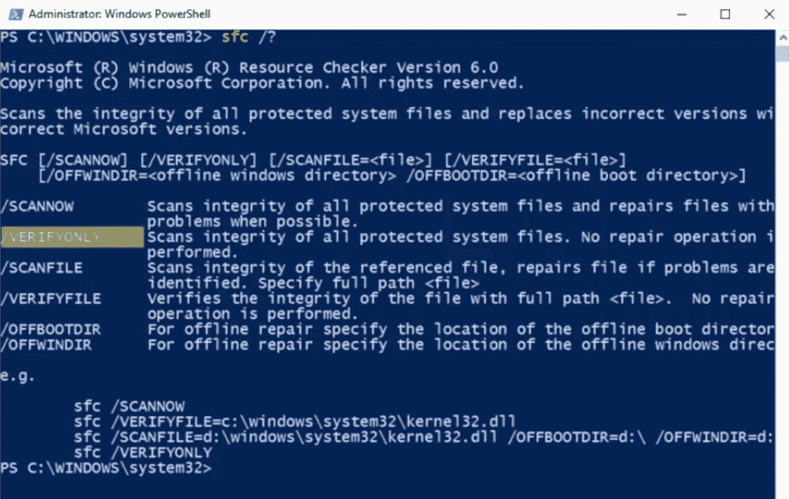

# 第九章：恶意软件与其他数字攻击

威胁和款待之间的区别只差一个字母。恶意软件在你所处的立场不同，它可能是款待。从安全角度来看，恶意软件可能是我们面临的最大威胁之一，无论是在我们的专业网络中，还是在我们个人的网络和设备中。

当你阅读本章时，你将对恶意软件是什么、它的设计目的以及恶意软件如何感染目标有更深的理解和认识。

本章将涵盖以下主要主题：

+   那么，什么是恶意软件？

+   什么是特洛伊木马？

+   病毒和蠕虫

+   **拒绝服务** (**DoS**) 威胁

+   会话劫持威胁

+   防御措施的主列表

**信息技术** (**IT**) 专业人员和最终用户面临的最大挑战之一就是我们变得如此自满，沉浸于网络的思维方式中，以至于不再关心它们是如何运作的。

纳撒尼尔·布兰登曾说过：“*改变的第一步是意识，第二步是接受。*”这让我想起了我最喜欢的电影之一《不可接触的人》，由肖恩·康纳利和凯文·科斯特纳主演。

凯文扮演《不可接触的人》中的埃利奥特·内斯，而肖恩则扮演一位非常了解环境的街头警察。在告诉他要追捕阿尔·卡彭时，肖恩向他透露了所有发生的事情，并继续问道：“*你愿意为此做些什么？*”问题是，我们会满足于现状，还是会以不同的方式思考？

这是我本章的目标：让我们开始用不同的方式思考。

# 那么，什么是恶意软件？

简单来说……它是一个用于对目标执行恶意操作或攻击的软件或计算机程序。它的名字就说明了它的作用。恶意软件是“恶意”和“软件”两个词的结合体。我们有适用于计算机、手机、平板等的恶意软件。现在，移动行业中恶意软件非常猖獗。一旦安装，攻击者可能会完全控制你的设备，或者至少控制你设备上的数据。

攻击者可以通过恶意软件感染任何计算设备——包括平板电脑和智能手机。任何人、公司或设备都是目标。攻击者能够感染的计算机和设备越多，他们能赚的钱就越多。事实上，他们不关心自己感染的是谁——他们只想尽可能地感染更多的设备和人。这是一个数字游戏。而且，猜猜看？它有多种形式。恶意软件只是安全威胁的一种分类。

## 恶意软件的目的是什么？

恶意软件的目标包括以下内容：

+   从你的机器中窃取数据

+   访问客户列表

+   会计数据

+   收集用户名和密码

+   删除文件

+   更改系统设置

+   占用系统空间并加密

如果攻击者并非针对你个人，而是针对你的资源以及对其他人的访问权限，那么你有责任确保你的机器不会被攻击，以确保他人的安全。

创建、部署并从恶意软件中获利的人可以从试图攻击自己内部网络的个体，到有组织的犯罪和政府机构，范围广泛。这是一个庞大的产业，制造这些复杂恶意软件的人员往往专门从事此项工作。它会像雪球一样滚动，越滚越大。如果我能在你的任何设备上安装一个恶意软件，我可以用它来添加更多恶意软件。

这项业务如此有利可图，以至于它已经成为一项全职工作。那么他们是如何从中赚钱的呢？一旦攻击者开发并部署了他们的恶意软件，他们通常会将感染的机器卖给其他个人或组织。这些人开始安装更多的恶意软件，雪球效应开始发挥作用；最终，你的机器可能成为僵尸网络的一部分。这个**僵尸网络**基本上是一个完全被攻击者控制的系统混合体。攻击者可以远程控制这些系统，网络犯罪分子便利用它们为自己的目的服务，有时他们甚至会将其转卖给其他网络犯罪分子。我们现在看到恶意软件泛滥的原因就是因为这项业务非常有利可图。

你需要对如何“讲木马”有深入的理解（更多内容将在下一节中介绍），以便生存。那些创造恶意软件的人——以及那些制造恶意软件的攻击者——使用的组件能够帮助他们实现他们的目标。

恶意软件的基本组件包括以下内容：

+   **加密器**—这种软件程序隐藏恶意软件的存在。攻击者和黑客使用该软件来躲避杀毒软件的检测。它还可以保护恶意软件免受逆向工程分析。

+   **下载器**—这种类型的木马从互联网上下载其他类型的恶意软件或甚至恶意代码和文件。当攻击者首次访问系统时，他们会安装下载器。

+   **投放器**—如果攻击者需要在系统上安装恶意软件或某些代码以使其运行，投放器会悄悄完成这一任务。投放器可以包含无法识别的恶意代码，且未被杀毒扫描器检测到。它能够根据需要下载其他文件，从而在目标系统上执行恶意软件。

+   **漏洞利用**—恶意软件的这一部分包含了利用你的设备所需的代码或指令序列。这是攻击者用来突破系统安全或攻破系统防护的代码。根据攻击者可能利用的漏洞，漏洞利用可以分为不同的类别，包括本地漏洞利用和远程漏洞利用。

+   **注入器**—这个程序将恶意软件中的漏洞或代码注入系统。这是一种隐藏恶意软件或防止其被删除的方法。

+   **恶意代码**—这段代码是恶意的。它定义了恶意软件的基本功能，并包含了导致安全漏洞的命令。它可以表现为 ActiveX 控件、发布内容、Java 小程序和浏览器插件等形式。

+   **混淆器**—这些是攻击者用来通过不同技巧隐藏恶意软件或恶意代码的程序。它使得安全程序、杀毒程序和专业人员更难发现和删除这些恶意代码。

+   **压缩器**—这个软件压缩恶意软件文件，将恶意软件的代码和数据转换为不可读的格式，使得你的杀毒软件难以检测到它。

+   **有效载荷**—这是被激活的文件。它可以用来删除文件、感染系统、加密数据；它基本上是最危险的部分。

接下来，让我们来看一下不同类型的恶意软件。

## 恶意软件类型

恶意软件是如何进入的？恶意软件本身可以被分为几种类型，正如这里所概述的那样：

+   **病毒**—这些需要人工干预。你必须执行文件才能感染病毒。

+   **蠕虫**—这些是自动的。它们被称为蠕虫，因为它们会在网络基础设施中蠕动并自动感染目标。它们不需要任何人工干预。

+   **后门**—通过安装恶意代码和利用系统漏洞，后门允许未经授权的用户访问系统。它允许攻击者持续访问。

+   **根套件**—这是一种恶意程序或一组程序，它在不被最终用户识别的情况下安装和执行恶意代码。

+   **僵尸网络**—僵尸网络是一个由多个电子设备组成的网络，用于进行欺诈和恶意的网络攻击。机器人是用于自动化大规模集体攻击的工具，如数据盗窃、恶意软件分发和服务器攻击。

+   **勒索软件**—这种恶意软件可以限制、阻止、封锁访问，或发布信息。通常，需要支付某种形式的赎金才能恢复访问权限。

+   **间谍软件**—这允许攻击者在不被察觉的情况下秘密收集有关用户活动的信息。收集到的数据可能会被攻击者或第三方攻击者用于恶意目的。

+   **广告软件**—广告软件是指那些在计算机上安装的、不需要或未经请求的广告支持软件。它通常以弹出广告的形式在使用网页浏览器时出现。

接下来，让我们来看一下恶意软件的生命周期。

## 恶意软件的生命周期

和任何优秀的小怪物一样，恶意软件也有生命周期中的不同阶段，正如这里所概述的那样：

+   **阶段 1**—我们创建恶意软件。任何具有编程知识的人都可以创建一种恶意软件或蠕虫。事实上，如果你没有这种技能，你也可以使用一些现成的工具，比如脚本小子用的构建工具包。

+   **第 2 阶段**—复制恶意软件，意味着我们需要将其传送到目标机器上，规划如何做到这一点，并确保它能够实施。

+   **第 3 阶段**—这是发现阶段。当有人发现他们的机器上有东西，或者它导致机器表现得有点不同或异常时，我们称之为检测阶段。

+   **第 4 阶段**—解决阶段。通常由杀毒软件制造商完成，他们会尝试创建不同类型的防御机制来应对恶意软件，然后当然他们会将这些防御措施部署出去。

+   **第 5 阶段**—清除阶段，这是我们消除恶意软件本身的阶段，然后整个过程重新开始。这是因为一块恶意软件不一定能经得起时间的考验，我们总是在创造新的、更好的恶意软件。

就恶意软件本身而言，一旦我们进入*第 2 阶段*，即复制发现阶段，我们有两个不同的阶段。

## 第 1 阶段 – 感染阶段

在这个阶段，发生了几种不同的事情。恶意软件会复制并附加到我们在创建时指定的目标文件或程序上。

恶意软件需要实施自身。它需要某种方式来实施自己，所以我们有一个称为事件的机制。例如，我们可以设置让恶意软件在有人安装应用程序时触发，通过感染启动文件。每次有人安装程序时，恶意软件就会重新安装。这在盗版世界中现在非常常见。你下载盗版材料时，可能会有惊喜！

我们还可以设置一个启动项来修改注册表的某些部分，确保每次启动时恶意软件都会激活。

我们可能实现的另一种方法，尽管有些老派，就是创建一个**终止并保持就绪**（**TSR**）程序，基本上是将恶意软件隐藏在内存中，它会执行或等待触发，但等待的地方是**随机存取内存**（**RAM**）。实际上，有些恶意软件在你重启机器后，会重新加载到 RAM 中。

## 第 2 阶段 – 攻击阶段

攻击阶段是我们看到诸如文件损坏等现象发生的阶段。在攻击阶段，恶意软件执行并进行一些操作来破坏我们的文件，比如完全删除它们，可能会去做些事情，*找到所有的 JPEG 文件并删除它们*，或者*找到所有的 COM 文件并删除它们，以及你能做的任何让系统不稳定的事情*。我可能让它更改文件内容，或者更好地，我直接修改文件内容，这可能导致系统变慢，因为**操作系统**（**OS**）不知道如何处理这些被修改过的文件。我们还可以执行一些任务。这是指执行与应用程序完全无关的任务。正如你已经知道的，发生意外情况通常是恶意软件的一个好指示，意味着应用程序做了一些它本不应该做的事情。

## 第三阶段 – 伪装

这一阶段是恶意软件会隐藏自己，以便无法被检测到。事实上，一些更高级的恶意软件是这样编写的，它在传播到整个环境、主机或网络中并尽可能彻底扩展之后才会执行。

接下来，我们将讨论这些恶意软件是如何进入目标系统的。

## 恶意软件是如何注入目标系统的？

恶意软件有几种进入你环境的方式，下面列出了几种：

+   **不受信任的软件来源**—这不仅适用于桌面平台，还适用于移动设备。苹果曾宣布多达 4000 个应用程序被 XcodeGhost 恶意软件感染。当你在 PC 上搜索软件时——例如，WinZip——你是去[winzip.com](http://winzip.com)官网，还是点击第一个链接，而这个链接可能并非实际的供应商？当然，当终端用户看到类似的弹出窗口时，他们总是点击**是**——他们从不点击**否**。为什么？因为他们想要软件。

+   **安装**—在安装程序时，我总是选择**自定义安装**。我从不做基础安装。我总是保持警觉，从不点击、点击、点击、点击。我会慢慢来，因为很多时候，应用程序或供应商通过在你的 PC 上安装工具栏来产生额外收入，这可能会导致其他恶意软件感染你的系统。

+   **传播**—一旦你获得了一个，我保证你会开始得到更多。

+   **电子邮件附件**—通常带有恶意附件。

+   **盗版软件**—这不仅包括被盗版的主要软件，还包括那些声称（有些确实有效，但会注入恶意软件）将试用软件转化为完整版的*破解程序*。

+   **禁用安全产品或防火墙**—这些操作将破坏任何系统的安全性。

+   **逻辑炸弹**—这是一种在满足其操作条件时被触发的恶意软件。逻辑炸弹可以通过某个特定的日期、时间或系统计数等事件激活。例如，如果攻击者通过**远程访问木马**（**RAT**）腐化了你的计算机，并且你尝试将其删除，RAT 可能会被编程为在那一刻或下次启动时激活并删除你的文件。

+   **不更新或运行杀毒软件和恶意软件防护**—杀毒软件无法检测到所有恶意软件，所有恶意软件也无法避开所有杀毒软件。你需要同时使用两者。不更新和运行它们会带来巨大不利。

你可以问自己以下问题来帮助你评估这一点：

+   它是否有与之关联的图标，或者是正在运行的进程？查看描述。任何有信誉的进程，开发者在创建时都会列出相应的描述。

+   该应用程序本身或正在运行的进程是否位于 Windows 或用户配置文件目录内？了解这一点很重要，因为这些目录可以被设备上的任何用户访问。

+   在它们的字符串中是否有任何奇怪的**统一资源定位符**（**URLs**）——尤其是如果有人给你发了一个链接？要小心最新的趋势，即人们正在创建指向网站的快捷链接。

+   另外，检查是否有任何开放的**传输控制协议/互联网协议**（**TCP/IP**）端点，尤其是你的计算机是否在一个无法解释的端口上仅仅处于监听状态。

现在，让我们来谈谈一些非常有趣的东西——我们从国家级组织中看到的东西。

## 高级持久威胁

**高级持久威胁**，也称为**APT**，应该是任何组织关注的重点，因为它们不仅会损害资源，还会损害你的声誉。

什么是 APT？这是一种网络攻击类型，攻击者可以进入你的环境并长期保持在其中，而不会被发现。术语*高级*代表利用技术来利用潜在的漏洞，术语*持久*指的是持续拉取数据并监控受害者网络的外部**指挥与控制**（**C2**）过程，*威胁*意味着有人的参与和协调。

正如我之前提到的，这些类型的攻击非常复杂。它们涉及精心策划和协调的技术，其中包括一些技术，比如在我们完成恶意任务后抹去我们的活动证据。攻击者通过 APT 攻击可以推断出的信息包括：机密文件、用户凭证、个人信息、网络信息、交易信息、信用卡详细信息、商业策略和控制系统访问权限。

总体来说，主要目标是获取敏感信息，而不是摧毁或破坏网络。最好的例子之一——也是迄今为止最复杂的恶意软件——可能是 Stuxnet。这个蠕虫在 2010 年被用于针对伊朗。它的复杂性告诉我们，只有一个国家级的参与者才能涉及其中。

最初，这种蠕虫通过受感染的**统一串行总线**（**USB**）驱动器被引入，并包含三个模块：执行主要负载的蠕虫，一个自动执行传播蠕虫副本的链接文件，和一个隐藏所有恶意文件的根套件。蠕虫本身通过网络传播，寻找控制**可编程逻辑控制器**（**PLC**）的计算机上的**西门子 Step7**软件。一旦它找到目标机器，恶意软件就会将根套件注入到 PLC 和 Step7 软件中，修改其代码，并向 PLC 发送命令，同时显示正常操作。这是针对伊朗铀浓缩设施的离心机进行的特定攻击。恶意软件迫使离心机以非常快的速度旋转 15 分钟，然后将其恢复到正常速度。在攻击后的 5 个月内，过高的速度变化导致离心机损坏，约 1,000 台离心机丧失。所以，是的——相当狡猾。

APT（高级持续性威胁）有不同的特征，这些特征展示了攻击者如何、为何以及以何种方式设计和计划他们的攻击。让我们更仔细地看一下：

+   首先，我们有目标。任何这类攻击的主要目标都是通过获取对组织网络的访问权限，尽可能多地收集敏感信息。但这不应该仅限于此——我们也可以将政治或战略目标的间谍行为包括在内。

+   还有时间表，指的是攻击者在查找目标系统中的任何漏洞时所花费的时间。

+   然后是资源——执行攻击所需的知识、工具和技术的数量。这类攻击再次表明它们更为复杂，通常由技术高超的攻击者执行，当谈到 APT 时，要拥有这些级别的资源，确实使我们将注意力集中在国家行为者上。

+   还有风险容忍度，我们将其定义为攻击保持不被发现的程度。这帮助攻击者在网络上长时间保持不被发现。攻击者进行这些类型攻击时所使用的技能和方法也很重要。这可能包括例如收集信息的社交工程技术，甚至是**开源情报**（**OSINT**）工具。

+   然后是行动。这就是它们与其他类型网络攻击的区别所在。同样，我们的目标通常是保持我们的存在，所以我们必须确保我们采取的任何行动不会被标记。

+   还有攻击点的特征。这指的是为了进入目标网络而进行的无数尝试。为了成功获得初始访问权限，我们需要确保（或者说，攻击者需要）进行大量的研究，以便重新识别漏洞。

+   然后，攻击中涉及的数字。还记得我们之前谈到的僵尸网络吗？好吧，在政府机构的情况下，他们会有自己的僵尸网络，这些主机系统将作为 APT 攻击的一部分，针对有组织的犯罪或其他国家进行攻击。

+   然后，还有知识来源，指的是通过在线来源收集有关特定威胁的信息。

+   然后，我们有多阶段攻击。这是 APT 攻击的一个重要特点——它们执行攻击时会遵循多个阶段，通常包括侦察、访问、发现、获取和数据泄漏。

+   我们是根据漏洞量身定制的。我们希望确保我们或攻击者创建的代码以这样的方式编写和设计，使得网络上的目标系统具有这些特定的漏洞。

+   然后，我们有多个入口点。这意味着攻击者一旦建立了初步连接或进入，他们就会创建额外的入口点，以防某一个被发现，他们仍然可以重新进入。

现在，当谈到 APT 时，需要注意的是，它们与零日漏洞利用非常相似，因为它们将由以前未曾存在过的恶意软件组成。Stuxnet 的问题在于它意外地被释放到公共网络中，这就是我们发现它的方式。但通常情况下，它能够绕过所有的安全机制，包括防火墙、杀毒软件、**入侵防御系统**（**IPS**）、**入侵检测系统**（**IDS**）以及电子邮件垃圾邮件过滤器，因为它之前从未被使用过。

APT 攻击通常无法被检测到，但意外的用户账户活动或后门特洛伊木马的存在，例如如果我们看到大量数据离开网络或被转移，这可能是你网络上某个地方存在 APT 的警告信号。

接下来，我们来谈谈特洛伊木马。

# 什么是特洛伊木马？

**特洛伊木马**是一种恶意软件，它伪装或与合法软件一起包含在内。它隐藏在其中。我们之所以隐藏它，是因为它容易安装。完成某件事的最简单方法就是让用户为我们做。当谈到特洛伊木马时，有些人会对此产生混淆。

特洛伊木马的背景来自希腊神话中的特洛伊战争，希腊人攻打特洛伊城。在战争结束时，希腊人想出了最后的攻击计划——他们将建造一匹巨大的空心木马（出于某种奇怪的原因，木马对特洛伊人具有神圣意义），并将木马填满士兵。特洛伊人将木马带入城市，等他们入睡后，士兵们出来了，包括布拉德·皮特，闪闪发光，他们开始掠夺城市。这基本上就是这里的相同概念。我们将拥有一个合法的程序，但我们的特洛伊木马将包含某种间谍软件、键盘记录器、根套件或其他我们可以用来重新进入的程序。我们将让受害者将该软件带入他们的计算机。一旦执行，特洛伊木马会传递信息或直接窃取数据。

就生命周期而言，以下步骤会发生：

1.  我们首先创建有效载荷。这是我们设计的程序，旨在执行某些特定任务——例如，寻找信用卡号码或个人信息。

1.  创建好这个有效载荷后，我们拿出我们的合法程序，如 Office、最新版本的 Windows、mp3、电影或杀毒软件。

1.  我们将有效载荷注入到合法程序中，并通过种子文件、网站甚至 USB 投放——比如将 USB 闪存驱动器放在公司停车场或走廊中，等待有人插入——或**互联网中继聊天**（**IRC**）频道。此传输方式高度依赖社会工程学的概念，*我想要免费的东西*——例如，如果微软刚刚发布了最新版本的 Office，你看到它出现在种子网站上，下载并安装它。为什么有人会将它上传到种子网站？

1.  下载后，你只需安装程序。当你安装应用程序时，特洛伊木马将获得与当前登录用户相同的权限。它然后可以开始修改自身。有些特洛伊木马会自我变形，使得它们更难被检测到。它们会传播自己，开始感染你环境中的其他节点。

有许多不同类型的特洛伊木马——接下来我们将讨论它们。

## 特洛伊木马的类型

了解和掌握不同类型的特洛伊木马以及它们的使用方式非常重要。

### 通知特洛伊木马

有几种不同类型的通知特洛伊木马。通知特洛伊木马的主要目的是将其感染的目标 IP 地址发送回攻击者。我们可以在不同的时间或不同的方面进行这一操作，具体取决于你安装的通知特洛伊木马的类型。以下是一些示例：

+   **IRC 特洛伊木马**——这只是利用 IRC 频道与攻击者进行通信。

+   **PHP 超文本预处理器（PHP）通知特洛伊木马**——该特洛伊木马通过连接攻击者拥有或控制的 PHP 服务器来发送其数据。

+   **NetSend 通知木马**—它基本上是通过**NetSend**命令向目标机器发送信息或指令。

+   **Internet Chat Query (ICQ) 通知**—这些只是与攻击者从目标机器沟通的不同机制或通信渠道，让你知道，“*嘿，我被安装了*”。记住——木马的目的是大规模分发。所以，我就坐在这里，通过这些渠道之一等待我的有效载荷向我报告，然后我可以通过 ICQ 渠道或电子邮件进行操作。

### 僵尸网络木马

僵尸网络木马帮助我将多个被攻破的系统组合在一起，以便我可以发出一个命令，控制所有被感染的机器。此类木马的最大目标之一是教育、政府和军事系统。

另一个你可能听到的术语是“僵尸计算机”，它是指感染了僵尸网络木马的计算机。攻击者可以随意将这些机器带上线，用它们做一些事情，比如发送垃圾邮件或对其他公司发起 DoS 攻击。攻击者可以通过一个远程命令通过他们的僵尸网络实施 DoS 攻击。他们还可以用它发送大量邮件，通过垃圾邮件、**简单邮件传输协议**（**SMTP**）或点击欺诈。

我们也可以利用它窃取产品密钥、登录**标识符**（**IDs**）、信用卡号——各种信息。教育、政府和军事系统之所以成为这些木马的热门目标，是因为教育环境中计算机数量庞大，尤其是计算机实验室。

### 代理服务器木马

一旦代理服务器木马在目标机器上加载，它就开始为我们提供代理服务，这意味着攻击者可以利用受害者的机器或通过它进行攻击。我们将受害者的机器变成一个代理服务器，以便能够攻击另一个目标，并将所有的责任归咎于第一个受害者。这就像创建一个代理链，而相信与否，现在互联网上有成千上万的机器感染了代理服务器，并作为隐藏服务在没有最终用户或企业管理员知情的情况下运行。

### FTP 服务器木马

如果我能将这种类型的木马注入到你的系统中，我将会在你的机器上安装一个**文件传输协议**（**FTP**）服务器。一旦被感染，木马会像通知一样将连接信息发送回攻击者，但我们将简单地使用端口**21**来进行此操作。当然，攻击者将通过 FTP 协议获得完全访问权限。他们还会安装额外的恶意软件，以便更轻松地进入木马的生命周期。

同样，攻击者可以从目标机器上提取的信息包括信用卡信息、机密信息、名为 **password.docx** 的文档或电子邮件地址，但就连接而言，你只会看到一个 FTP 服务在运行。

## 常见的特洛伊木马

让我们回顾一些常见的特洛伊木马及其可能的作用。

### VNC 特洛伊木马

**虚拟网络计算**（**VNC**）特洛伊木马有两个方面，如下所述：

+   首先，我们简单地通过 VNC 特洛伊木马感染你的机器，该木马会启动一个 VNC 服务器守护进程。攻击者在收到 VNC 服务器启动的通知后，只需使用密码通过 VNC 查看器连接到它。VNC 极为流行，许多 IT 人员使用它进行远程管理。由于它如此流行，因此被归类为工具类，因此，您的杀毒软件很可能无法识别它为任何类型的感染。

+   第二，你可以上网搜索 VNC 软件。如果你以前做过这件事，你会发现一堆五花八门的结果。显然，并非所有的都是合法的 VNC 产品——大多数已经被修改过。有 RealVNC、TightVNC 和 Chicken of the VNC，但最终用户可能不了解他们在做什么，所以作为攻击者，我可以创建我自己的 VNC，它基本上内置了一个后门，用户只需要为我安装它，而且很可能会用到管理员权限。

### HTTP 和 HTTPS 特洛伊木马

在过去的日子里，我们使用了一些相当古老的技术来获得对资源的访问，尤其是电子邮件。那时，我们有一个东西——至少在微软世界里——叫做 **Outlook Web Access**（**OWA**），它仅通过 **超文本传输协议**（**HTTP**）和 **HTTP 安全协议**（**HTTPS**）来允许我访问我的电子邮件。微软和其他一些公司将这项技术进行了改进，使我们能够创建一个隧道。我们遇到的问题是，大多数隧道都是在端口 **80** 或 **443** 上创建的。使用这些端口创建隧道时，安全管理员或专家将只会看到标准的 HTTP 流量或网页浏览流量——他们根本无法知道那是一个隧道。

一旦我们感染了目标，特洛伊木马会在目标上执行并生成我们所称的子程序。这个子程序对于防火墙来说只不过是一个目标，防火墙允许它访问互联网，因为它通过端口 **80** 和 **443** 进行传输。所以，所有的流量在技术上都会被转换成一种 Base64 类型的结构，并且在 **通用网关接口**（**CGI**）字符串中给定一个值。这样，攻击者的命令就隐藏在了安全专家和大多数安全设备面前。通过这种方式，攻击者可以使用基于 HTTP/HTTPS 的命令，如 **GET**，因此，内部目标的 **GET** 命令实际上就是 shell 的命令提示符，而答案是攻击者编码过的 **ls** 命令。

就管理员而言，当他们打开到攻击者服务器的连接，并尝试自己连接以追踪这个木马时，攻击者只会看到一个崩溃的 Web 服务器，因为在编码后的 CGI **GET**请求中没有令牌或密码。这个木马的特别之处在于这些程序相对较小。事实上，有些木马每个文件的代码行数不足 300 行。这类木马不仅限于 PC，最近它们感染了任何使用 Web 浏览器或能够访问互联网的设备。

### 命令行木马

这些是会在目标机器上安装一个服务器的木马，服务器会为攻击者打开一个端口，攻击者可以通过该端口连接。一旦攻击者连接到该客户端，他们就能够远程控制目标机器上的命令行界面——因此称为*命令行界面*。最受欢迎的命令行木马之一是 Netcat。通过 Netcat，攻击者可以在目标机器上打开一个完整的 Telnet 会话。他们可以使用 TCP 或**用户数据报协议**（**UDP**）建立进出连接，并提供完整的**域名服务器**（**DNS**）转发和反向检查，从而能够穿透你的网络环境。

为了避免引起任何怀疑，我们可以实施慢动作。在这里，我们减慢信息来回传输的速度。这样，安全专家更难弄清楚发生了什么——这与使用**偏执模式**（Paranoid mode）扫描 Nmap 时的效果非常相似。当使用 Nmap 进行扫描时，可以启用偏执模式，防止它在网络上产生过多的噪声。

### 文档木马

对于文档木马而言，我们所做的仅仅是在文档中嵌入木马。然后我们通过电子邮件将文档发送给别人：“*尊敬的先生，请查收附件，这是政府要求您填写的一份新的税务表格，以避免被罚款*。”听起来很官方吧？信不信由你，很多人会点击这个电子邮件附件，当然，作为攻击者，没有什么比让人们替我工作更好了。如果这是一个非常有趣、好笑或者重要的文档，他们甚至会帮我转发这个文档。

目前一些最大的文档木马存在于**便携文档格式**（**PDF**）文档中。帮我一个忙——不要打开来自你不认识的人或不期望收到的电子邮件中的 PDF 文件。我知道这是一长串需要记住的事情，这确实影响我们的日常工作效率，但其中一个更为严重的木马是基于电子邮件的木马。一旦你打开电子邮件，它就会被激活，然后通过电子邮件来回发送命令给木马。这些命令可能包括执行应用程序、搜索文件、打开文件，以及显示受害者系统上的文件给攻击者。

### 远程访问木马

**远程访问木马**（**RAT**）是我最喜欢的木马，市面上有无数种 RAT。比较有名的相对较老的 RAT 包括 Back Office 和 NetBus。

现在大多数远程访问木马（RAT）都是定制的。事实上，最近的最新远程访问木马允许攻击者打开受害者的摄像头。这也是为什么我在摄像头上放了一个小盖子，作为预防机制。

所以，使用 RAT 时，我们所做的只是安装一个小型应用程序到目标机器上。这被称为服务器端。攻击者从外部访问该服务器以获得远程访问。从那时起，他们可以影响管理员控制、提升权限、实施键盘记录器等操作。市面上也有一些预配置的 RAT，包括 DarkComet、Apocalypse 和 Beast。

### 后门木马

这是一种能够绕过大多数系统认证产品的程序，如入侵检测系统（IDS）和防火墙。在这些类型的攻击中，黑帽攻击者（坏人）使用后门程序访问目标系统。这种恶意软件与其他类型的恶意软件的区别在于，后门的安装是在用户不知情的情况下进行的。他们没有意识到这一过程。这样，攻击者就可以在目标上执行各种活动，包括传输、修改和破坏文件、安装恶意软件、重启计算机——各种有趣的操作。后门木马通常被用来将受害者计算机聚集成一个僵尸网络或机器人网络，然后可以用来攻击其他目标。

## 那么，究竟有什么区别呢？

现在，你可能会想，RAT 和传统的后门有什么区别？RAT 有**用户界面**（**UI**），而后门没有。有一种让你脊背发凉的 RAT 叫做毒蛇（Poison Ivy）RAT 工具包。它包含了**图形用户界面**（**GUI**），而且后门非常小—大约 10 千字节。祝你好运，找到它！一旦后门被执行，它会将自己复制到 Windows 文件夹或 Windows 的**system32**文件夹中。作为后门的创建者，你可以选择复制文件名和位置。

有些毒蛇变种可以将自己复制到**备用数据流**（**ADS**）中。如果你不了解这些内容，可以阅读系统黑客相关资料并了解 ADS。

你还可以为后门创建一个注册表项，以便每次计算机启动时都会自动启动。服务器在连接到客户端时，可以使用你在创建服务器部分时定义的地址。服务器与客户端之间的通信是加密和压缩的。

毒蛇还可以配置为在建立任何类型的连接之前，将自己注入浏览器进程，从而绕过任何防火墙。我相信你已经意识到勒索软件的邪恶、恶劣和恶意。如果你还没有意识到，你应该知道。

这种类型的木马可以做很多事情，从加密存储在系统硬盘上的文件到简单地锁定系统，并诱使用户认为他们需要支付费用。通常这是通过一个网页界面或弹出网页来实现的，页面没有任何栏或信息，给他们一个链接，他们必须通过该链接进行支付。它告诉他们系统已被加密，但实际上并没有。支付通常通过比特币完成，这使得追踪攻击者变得困难。

我知道你已经受不了了，但还有更多内容。你以为你的手机很安全吗？不。攻击者可以欺骗受害者安装恶意应用程序，当受害者下载了恶意应用后，木马会执行一些操作，比如窃取你的银行凭证和社交网络凭证，加密你的设备，等等。

接下来，我们来看一下执行这些攻击背后的动机。

## 木马创建者的目标

那么，木马创建者的目标是什么呢？最初，他们是为了一个终极目标，这个目标包括以下任何一项或它们的组合。

### 禁用防火墙

他们可能最先追求的目标是禁用你的防火墙。你是否见过防火墙无法启动的情况？很多人告诉我，他们反正会禁用它。防火墙让我们配置东西变得更加困难，但禁用它就是自满。

### 删除操作系统

另一种终极目标可能是替换或删除操作系统文件。如果我能用我的木马替换一个操作系统文件，而这个文件与原文件做的事情完全一样——比如说，记事本——如果我能用我自己的记事本版本替换它，或者更好的是，用一个操作系统中常用的可执行文件替换它，每次你启动它时，我的木马就会重新出现，特别是当你删除它的时候。如果我想破坏系统，我可能会删除一些非常重要的操作系统文件。

### 打开后门

另一个目标可能是打开一个后门，创建一个木马并将其放到互联网上，然后某人启动它，实际上就是打开了后门。在许多情况下，这解决了需要进行侦察和足迹分析的所有问题。

### 禁用杀毒软件

为什么恶意软件创建者禁用杀毒软件？因为他们不想被发现。当我说禁用防火墙和杀毒软件时，我的意思是你无法启用它。实际上，攻击者有一个著名的技巧，就是改变杀毒软件的图标。当大多数杀毒软件被禁用时，你会看到一个特定的图标。记住要替换和删除操作系统文件。如果你只是将禁用的杀毒软件图标替换成一个看起来已启用的图标呢？

### 将目标变成代理

攻击者可能采用的另一个目标是将目标计算机变成一个代理，从而可以在你的网络中对其他机器发起攻击。你只会认为是迪克·格雷森在你的网络上生成流量并抓取东西。我甚至可能把你加入到我的僵尸网络中。如果你不熟悉僵尸网络，建议你查一下。僵尸网络是我作为攻击者控制的一系列系统，特定的时间和日期，我可以让所有的僵尸网络成员执行特定命令，比如攻击花旗银行或发送垃圾邮件。而真正的关键是，我会在你睡觉时深夜进行，这时你的系统就静静地坐在那里。

### 生成虚假流量

特洛伊木马的创建者可以在你的网络上生成虚假流量，从而发起 DoS 攻击，因为有时攻击者的动机是制造干扰。很多时候，这种干扰是为了给公司制造麻烦。有时，如果我通过过量流量使系统超负荷，它可能会打开系统的漏洞。

我们还可以用它来下载和安装额外的间谍软件、恶意软件和广告软件。想想看你见过的那些工具栏。每次安装一个工具栏，我都有机会选择定制安装，或者选择快速安装。请——无论如何，不要选择快速安装！不要懒惰。选择定制安装，这样你就能看到发生了什么。如果你选择了快速安装，它可能还会说*请安装 XYZ 工具栏*，因为攻击者通常会从每次安装 XYZ 工具栏及其产生的流量中赚取一笔费用。这对攻击者来说是一项赚钱的投资。作为攻击者，如果我能让你安装额外的间谍软件和恶意软件，有时甚至在你不知情的情况下，我就能赚更多的钱。

### 抓取屏幕截图

另一个目标是抓取屏幕截图，特别是当目标登录到金融网站时。作为攻击者，我可以让我的特洛伊木马启动摄像头录制视频，而且不——不会有闪光灯，因为我会把灯光关掉，这样你就无法察觉。如果你觉得这不危险，可以问问*美国青少年小姐*，她曾打开一封电子邮件并点击了她被社会工程学诱导点击的链接。这个链接安装了一个 Blackshades 应用程序，随后攻击者开始录制她在个人时刻的电脑摄像头视频。攻击者然后试图通过她的照片勒索她，要求她支付一笔名义上的费用，如果支付了，攻击者就不会将这些照片公开给全世界。

攻击者最终是她 19 岁的前高中同学。他被逮捕并被指控多项罪名，不仅是勒索罪，还有未经许可远程控制他人计算机的罪行，这属于联邦犯罪。

### 偷窃密码和个人数据

偷取密码、代码、财务数据和个人信息是我还会做的事情。事实上，如果我是一名攻击者，我会用我的木马搜索你电脑中任何名为*password*、*passwords* 或 *pwds* 的文档，因为大多数 IT 人员会数字化记录自己的密码。攻击者喜欢看到 IT 人员这么做！攻击者还会寻找那些可能被命名为 *network layout* 的文档，或者是名为 *user accounts* 或 *employee information* 的电子表格。我知道你现在一定想停下来重新命名你的文件，对吧？

### 针对你进行垃圾邮件攻击

我们还可以将你作为垃圾邮件的目标。如果其他方式都失败了，我就会用你的资源将我的木马发送给你所有的 Outlook 客户端。你有没有收到过朋友发来的邮件，内容是“*嘿，我找到一个很酷的链接，点击这里*”？如果你点击了那个链接，你就中招了。

接下来我们来谈谈木马是如何完成它的工作。

## 木马是如何沟通和隐藏的

让我们先来看看隐藏机制。当你构建木马时，我们会把它附加到一个合法的软件上。所以，从技术上讲，木马有两种不同的通信路径，如下所示：

+   第一个是**显式通道**。显式指的是显而易见、明显或显露的事物。所以，显式通道可能是像最新版的 Office，或是大家都想要的 mp3 文件。攻击者必须使显式通道对你有足够的吸引力，才能让你愿意安装它。这正是恶意软件发生的原因，也因此市面上有这么多恶意软件。

+   第二个通道是非法通道或**隐蔽通道**。这是用于在网络上传输数据的隐藏路径。它被嵌入到我们的载荷中。大多数攻击者会依赖隧道技术来确保它对监控网络的人不可见。也许作为攻击者，我通过 HTTP 或 HTTPS 隧道传输它，这样你就看不见它——至少任何监控网络的人看不见——因为它是加密的。你可能想要了解这两个通道之间的区别。

不同的木马使用了大量的端口，这只是其中的一部分。你会发现其中一些端口是你意想不到的——例如，**21 端口**用于 BladeRunner。通常，这个端口是 FTP 的**80 端口**——Executioner 木马就用这个端口。还有什么东西运行在**80 端口**上？我最喜欢的一个端口，名字非常合适——**666 端口**。那是撒旦的后门……

这只是一个部分列表——你需要进行研究，了解最新的木马病毒，它们使用了哪些端口，当你看到流量经过这些端口时，你需要进行调查。我知道这很难，尤其是在**80**端口。当你怀疑系统感染了木马时，一定要重启系统并查看哪些端口正在监听。实际上，端口有不同的状态。当端口处于监听状态时，它的存在是因为系统将其置于该状态，以监听或等待与其他系统建立连接。

接下来，我们来看一些木马感染的症状。

## 木马感染的症状

如何判断你是否感染了木马？嗯，这就像问：你怎么知道自己得病了？我们会有症状，对吧？对于木马感染，我会说：“*哦，这已经太晚了，你已经感染了*。”

### 禁用的防病毒软件

如果你的防病毒软件被禁用且无法启用，那你有可能感染了木马病毒。事实上，我见过一些木马病毒，它们使你无法通过微软更新进行更新，无法打开任务管理器查看正在运行的进程，甚至无法编辑主机文件。每次你尝试打开命令提示符，它都会立刻关闭。

### 键盘失灵

你还可能会遇到像*Ctrl* + *Alt* + *Del* 键完全失灵的情况。通常，用户会简单地重置计算机，当你登录时，*Ctrl* + *Alt* + *Del* 屏幕能正常工作，但一旦进入系统后，它就停止工作了，用户会认为是软件出现了问题。

### 系统重启和关机

另一件可能发生的事情是，系统会自行重启或关机。如果你曾经遇到过这种情况，现在你就知道原因了。

### 更改屏幕保护程序

另一个常见的症状是屏幕保护程序会任意更改。也许显示的是你根本不会选择的内容。

### 任务栏消失

你的任务栏可能会消失。这可能是由于木马引起的，或者也可能是我去你那儿的原因，因为我是本地 Sam's Club 或 Costco 的通缉犯。当我感到无聊时，我的妻子会把我拖去那里购物，我吃光所有的免费样品。如果你仔细想想，这些样品其实无非是社会工程学。吃饱了免费样品之后，我会走到电脑区域，开始玩一些**组策略对象**（**GPO**）设置，隐藏任务栏或**开始**按钮，或者看看系统发生了什么。我最喜欢做的事情之一是截取桌面屏幕，保存为背景，然后隐藏所有图标，只留下回收站。员工休息室里可能有我的安全照片，上面写着，*小心这个家伙！*

### 屏幕方向不断变化

另一个感染的症状可能是当你打开机器时，屏幕突然开始翻转或者反转。

### 背景变化

突然的背景变化是木马感染的另一个症状。当你在操作系统中工作时，一切看起来都正常，突然，你的背景发生了变化。它可能是一张你可爱的小狗的照片，当它发生时你可能会觉得很可爱，但你需要弄清楚为什么会发生这种情况。

### 开始按钮消失

**开始**按钮的消失是另一个木马感染的标志。想象一下，当你把**开始**按钮、任务栏拿走，并禁用了*Ctrl* + *Alt* + *Del* 按钮时的沮丧感。一个好的木马，尽管这些功能最初是为娱乐目的设计的，是你完全不怀疑已经被安装的木马，所以你不一定会看到这些现象。你可能会看到系统重启，因为可能是我为了配置更改而需要重启系统。

### 重定向

这个症状可能包括你的浏览器访问了一个与你输入的网址不同的地方。例如，你输入了**microsoft.com**，结果却进入了一个不适当的网站。同样，攻击者就是通过这种方式从你身上赚了钱，因为他们会根据每个被引导到那个网站的人获得报酬。

### DVD 驱动器弹出

另一个症状是 DVD 驱动器随机弹出，或者你听到它开始转动。

### 打印文档

文档可能也会开始打印，而且这些文档不是你发送到打印机的。

### 反转的鼠标键

你的鼠标键也可能会被反转。攻击者可以通过这个方式让人感到困惑。

### 大量的硬盘活动

大量的硬盘活动是另一个感染的明显迹象。看看你的系统在没人使用时的情况。有时我们会看到硬盘活动，因为系统正在进行碎片整理、系统维护或备份。但知道发生了什么是解决问题的一半。如果硬盘或网络有很多活动，而我只是打开了一个 Word 文档，那我可能会感到有些怀疑。大多数操作系统执行的维护任务会等到系统没有使用时再进行。

### 大量的流量

另一个常见症状是你的**互联网服务提供商**(**ISP**)给你打电话说：*听着，你的路由器发出的流量很多。* 这是我在提供自己的 ISP 服务时遇到的问题。我经常看到有人感染了病毒，系统开始发送大量流量并且冲击我们的网络，我不得不关闭他们的天线。我总是觉得很有趣的是，当我试图联系他们时——我永远无法联系到他们，但一旦我断开他们的互联网连接，2 分钟之内，别人就会给我打电话。

### 不明的信用卡交易

所有症状中的“母症状”就是你收到信用卡账单，里面有一些非常奇怪且昂贵的消费。

接下来，让我们谈谈如何感染一个目标。

## 如何用木马感染目标

创建这些小怪物有三个步骤，如下所示：

+   **步骤 1**——我们需要某种工具包来为我们创建它们。有许多产品可以使用，包括 Kali Linux，它已经内置了大量的工具。

有一个特洛伊木马构建工具包，但你也可以只使用一些内置于操作系统中的基本技术。例如，我可以快速创建一个脚本或批处理程序，来执行一些破坏性操作——这里的例子是删除大量重要的系统文件——然后将其与我的合法程序一起使用。你可以根据自己的需求来做，但这个步骤的概念是，你在创建你想要造成的损害。

+   **步骤 2**——创建一个投放程序。在这里，我们基本上是将我们创建的怪物拿来，并告诉它如何利用目标或合法程序进行安装。

+   **步骤 3**——我们准备好将我们的怪物变成一个可爱的泰迪熊了。 "*快点，双击它——它不会伤害你*！" 我们将通过包装将这两者结合在一起。这是我们用来将两个程序结合在一起的软件。市场上有几个程序可以使用，包括 Petite、Graffiti、EliteWrap，我相信你也有你自己的最爱。

包装器背后的概念是能够将这些文件结合起来。我们还可以将多个怪物结合在一起，这样当某人安装最新的防病毒软件、Office 套件或任何他们从盗版网站下载的免费软件时，他们会被安装上多个特洛伊木马。通过使用这些包装器，它们可以对二进制文件进行压缩，从而使得特洛伊木马能够在不被大多数防病毒软件检测到的情况下潜入。这是因为大多数防病毒软件无法检测文件的签名。而且不执行程序也行不通，因为大多数情况下，感染是通过社会工程学攻击进行的。例如，我会给你发送一个包含成人内容或一个酷程序（如新的屏幕保护程序）的文件。

更有可能的是，我们看到很多特洛伊木马是通过电子邮件附件感染的，因为实际的文件被附加了，或者是指向文件的链接。我总是告诉人们，当他们收到邮件时，绝对不要点击链接，因为链接可能看起来像是指向一些云存储公司，如 Dropbox 或 OneDrive，但链接背后的代码可能会将你引导到一个不同的地方。

很多时候，我们会遭遇社会工程攻击，尤其是我们的终端用户。他们经常遭遇这种攻击，尤其是通过弹窗，通常这种攻击设计得让终端用户感到害怕或利用他们的贪婪心理。有趣的是，无论你点击弹窗上的**是**或**否**，甚至只是点击弹窗的任何地方，都可能导致特洛伊木马被注入。事实上，有些弹窗广告非常狡猾，看起来像是带有**关闭**、**最小化**、**最大化**按钮的窗口，这些按钮通常出现在标准的右上角（对于苹果用户则在左上角）。但是，你猜怎么着？我可以让网页看起来像那样的界面，但那些按钮并不是真正的按钮。如果你点击它，窗口会关闭，但特洛伊木马依然会被注入。

在一些更常见的攻击中，用户访问恶意网站或下载恶意软件时，可能会激活一个看起来像是系统应用程序的界面，表面上看是为了保护我们。许多时候，它会给你一些虚假的正面反馈，假装是在帮你，实际上它们只是在安装更多的特洛伊木马，并从你的系统获取更多信息。

2015 年最严重的一个案例是名为**Crypto Blocker**的产品。发明这个产品的人应该被关进监狱的禁闭室，因为它会加密你的硬盘和数据，包括任何映射的驱动器。我们称这种软件为勒索软件，因为你必须支付钱款才能获得解密密钥，当然，几乎可以肯定他们会掏空你的账户。或者，攻击者可能会利用恐吓技巧：“*哦，我的计算机被锁定了，操作系统出了问题，我不想惹麻烦。如果我想解锁，最好支付 200 美元。而且我有 72 小时的时间来处理这个问题，否则我会陷入麻烦*！”

他们还可能声称你的 IP 地址被用来访问包含色情内容、儿童色情、兽交和虐待儿童的网站——并且你的计算机上有这些文件。有时，他们会说你向恐怖分子发送了垃圾邮件。这是一个经典的诈骗手段，用来吓唬人们支付费用，尽管他们根本没有做错任何事情。

最近，电子邮件中出现了这样一条信息：“*嘿，你可以免费升级——只需点击这里*。”这封邮件看起来像是微软发来的，底部有他们的标志和地址。你只需按照附带的安装程序进行操作，就能开始免费升级。其实，你只是开始了交出你的数据。

接下来，让我们讨论特洛伊木马如何进入系统。

## 特洛伊木马如何进入我们的系统？

特洛伊木马可以通过多种方式进入你的系统。

### 物理访问

作为攻击者，我可以通过物理访问来实施特洛伊木马攻击。如果我将特洛伊木马程序内置到我丢失的 U 盘中，而有人捡起并插入了这个 U 盘，我就能通过自动启动功能注入特洛伊木马。如果有人离开他们的系统而没有注销，我也可以注入特洛伊木马。

### 电子邮件

特洛伊木马进入我们系统的另一种方式是通过电子邮件。你可能会想，“*好吧，我不会打开来自我不认识的人的邮件*。” 好吧——回过头来想想我们这段时间讨论的内容。作为攻击者，我可以很容易地伪造。假设布鲁斯·韦恩整天给克拉克·肯特发邮件。如果我做了足够的调查，我完全可以创建一封看起来像是布鲁斯·韦恩发来的邮件，并骗克拉克双击这个文件。这样的事情时常发生。事实上，几乎每个月至少有两次，甚至每周我都会收到家人发来的邮件，邮件上写着：“*我觉得你会感兴趣的*”，然后就是一个链接，邮件里就只有这一条内容。

### 假应用程序

另一种进入系统的方式是通过假应用程序。比如，你在找一个帮助你整理车库的应用程序。你只需输入车库或车棚的尺寸，程序就应该能帮助你整理——至少这是它的承诺。结果，受害者下载了这个程序，当他们双击它进行安装时，他们会把它标记为可信的，因为他们太想要这个程序了。

事实上，我看到过一个有趣的情况，很多次都遇到过。这通常是关于一个 mp3 文件，孩子们会出去说，“*嘿，我在找这首热门歌曲*”，然后他们做一个标准的 Google 搜索，显示出一个有这个文件的网站，但其实他们根本没有那个文件。攻击者在如何诱使别人进入陷阱方面非常有创意。攻击者利用流行的搜索词，把人引导到自己的网站，让他们以为自己网站上有那个文件，但实际上并没有。你会去下载这个文件并双击 mp3，结果特洛伊木马被执行。有时候，你可能什么都看不见，或者如果他们比较“好心”，你可能会得到那首歌。

我最喜欢的程序是那些自称为反特洛伊木马软件的程序，但实际上它们本身就是我们的特洛伊木马。确保在安装程序时做好研究。

### 使用种子文件

如果你在种子网站观看视频并认为它们是免费的，那你就麻烦了。正如我常说的……这个世界上没有免费的午餐。很可能，某人正在利用你的贪婪来攻击你。

### 免费软件

网上有一些很棒的免费软件——例如 VNC。它很棒，但要确保从正确的地方下载，因为网上有成百上千个网站声称：“*这是 VNC 的官方网站——你可以在这里下载它*。”

### 收缩包装软件

这些软件可能包含特洛伊木马。很可能，这是一个不满的员工所为，他可能在想：“*我完全可以摧毁成千上万的人，因为每个人都想要这个程序的副本*。” 大型软件公司已经建立了**质量保证**（**QA**）机制来防止这种情况发生，但这并不意味着所有软件供应商都会采取相同的预防措施。

### 病毒

很多时候，病毒会执行并为我们安装额外的木马。事实上，有时木马会帮助安装病毒。在这个时候，大多数人通常会认为他们需要格式化硬盘并重新开始。

### PDF 文件

给自己一个提醒——谷歌一下**木马 PDF 文档**或者**PDF**。PDF 现在非常糟糕，因为每个人都在上传 PDF 文件。你想要白皮书吗？是的——打开那个 PDF，看看一些 PDF 阅读器的漏洞被触发，最后有人进入你的系统。

## 木马如何避免被杀毒软件检测到

木马可以躲避杀毒软件。现在，我不是在告诉你杀毒软件是你的解决方案或对策。这些只是避免被杀毒软件检测到的方法，我们可以通过这些方法做到这一点：

+   改变文件本身的校验和，因为大多数杀毒软件会查看已知病毒和木马的校验和。

+   编写自己的木马是另一种避免被杀毒软件检测到的方法。从技术上讲，这会使你的木马成为一种零日攻击机制。

+   使用十六进制编辑器进行修改将有助于隐藏你的木马免受杀毒软件的检测。

+   你还可以将木马拆分成多个文件，因为大多数杀毒程序会寻找代表木马的特定文件。通过拆分，它就不会被检测到。

+   我们还可以修改语法。许多杀毒程序在木马本身中寻找特定的语法，当然，做的最好的事情之一——这又回到了编写你自己的木马——就是不要使用那些已经被杀毒软件识别出来的木马。永远做一些小小的研究。

接下来，让我们讨论一下病毒和蠕虫。

# 病毒和蠕虫

那么，病毒和蠕虫之间有什么区别呢？要了解这些，我们需要比较它们各自的设计目的。有些人说我们是在拿苹果和苹果做比较，因为这两者实际上非常相似。然而，当谈到病毒时，你需要理解它其实只是一段恶意软件，旨在执行。一旦它执行，它会喜欢将自己与文件或程序关联或附加在一起。

这些文件和程序几乎可以是任何文件或程序，但作为病毒创建者，我希望确保每次操作系统启动时病毒都会执行。所以，许多时候，病毒创建者会确保替换系统文件，以确保每次操作系统启动时，机器都被感染。

我们还可以感染其他类型的文件或程序。例如，我可以让我的病毒附加到 Word 上，但该病毒只有在启动该应用程序时才会变得活跃。

病毒和蠕虫之间最大的区别之一是，病毒执行时需要某种形式的人为互动。现实中的病毒不也是这样吗？除非你接触到有病毒的人，否则你不会生病。那么，我们是如何接触到的呢？通常，病毒通过下载传播。我强烈建议不要下载任何程序，不管它们看起来有多酷，或你多么想要它们，除非它们来自制造商。这包括电影、音乐、书籍、游戏和视频。

我们也可以通过不同类型的驱动器来获取或传播病毒。如今，大多数病毒通过 USB 驱动器传播。记得经典的 USB 投放攻击吗？我们会将一个 USB 驱动器丢在停车场或走廊里，然后让别人插入？受害者可能会在里面看到一个名为**TopSecretDon'tRun.doc**的文件，出于同样的好奇心，他们会从 USB 驱动器执行文件，从而感染机器。

目前，病毒传播的更有效方式是通过电子邮件或社交媒体。你只需要在社交媒体网站上发布内容，诱使用户访问包含恶意代码的网页。电子邮件也可能只是附带一个附件。

说到蠕虫，它与病毒有很多相似之处。它们仍然会试图附着在其他程序上，但它们会自行复制并自动传播。它们不需要任何人为操作，能够自动执行。所以，如果你环境中的一台机器感染了，它就会开始在你的网络环境中传播。它通过一个漏洞进行传播，开始寻找你网络中的漏洞。至于蠕虫的运输或传播方式，它们会通过与病毒相同的技术进入环境，但一旦进入，蠕虫因为完全自动化的特性，会利用我们标准的文件传输功能，连接多个机器或整个网络中的机器，有时甚至会扩展到网络外部。

最具危害的蠕虫之一是 SQL Slammer，它作为一种拒绝服务（DoS）攻击，导致互联网流量变慢。它攻击了 Microsoft SQL，包括服务器和桌面引擎数据库。

SQL Slammer 在 10 分钟内感染了 75,000 台机器。我提到过，SQL Slammer 是一种 DoS 攻击，它使互联网速度变慢。造成这种延迟的原因是，它让路由器被来自受感染服务器的流量淹没。

通常，当路由器接收到大量流量时，路由器应该延迟或暂时停止网络流量。然而，路由器崩溃了。当这种情况发生时，邻近的路由器会发现这些路由器停止工作，并会更新它们的路由表。于是，路由器开始向其他已知的路由器发送通知。由于这些路由表更新得如此之快，因为有太多节点被感染，这导致更多的路由器失败，因为带宽被这些试图相互通信、更新路由表的路由器占用。

现在，这情况非常严重，统计数据显示葡萄牙有 30 万个有线调制解调器停机。韩国几乎全境断网——超过 2500 万人无法使用手机或互联网服务，且互联网的 13 个根域名服务器中的 5 个瘫痪了。网站无法响应，**自动取款机**（**ATMs**）停运，航空公司订票系统也出现故障。对于我们在**美国**（**US**）的人来说，这一切发生在凌晨 12:30（东部时间），30 分钟后，僵尸服务器的数量每 8.5 秒就翻倍一次。

这给许多人，尤其是公司，敲响了警钟，很多人开始关注安全性，或者至少通过补丁保护自己。

## 病毒和蠕虫的类型

你完全可以说现在有大量的病毒和蠕虫。我每次看到这些东西时，总会想到那句“*爸爸，让坏人走开*”，因为它们从不同的角度袭来，做着不同的事情。

### 标准文件病毒

这些病毒是基于它们附着的文件执行的。目前有很多种不同类型的文件病毒。通常，文件病毒会针对像可执行文件或 COM 文件这样的文件。我们可以根据它们攻击或附着的方式进行分类。例如，我们有前置型文件病毒，它们将自己写入主机文件代码的开头。还有附加型病毒，想必你也能猜到。还有覆盖型病毒，它们基本上用自己的代码覆盖主机代码，以及插入型病毒，它们将自己注入主机文件代码中的空隙处。

这些类型的病毒大多数会特别针对操作系统文件。

### 群集病毒

群集病毒不会改变目标文件，也不会在文件中插入任何信息。相反，它只是修改目录信息，将病毒代码的入口点设置为文件本身，而不是实际的程序代码。

### 引导扇区病毒

大多数操作系统被划分为不同的区域，称为扇区，这些区域用于存储操作系统的程序。最常见的是**主引导记录**（**MBR**）。我对 MBR 的想象非常类似于我年轻时去图书馆的经历。如果我想找一本书，我会去那个装满抽屉的大箱子，里面是索引卡。如果我想找到关于**不明飞行物**（**UFO**）的书，所有相关的书籍都会列在每张索引卡上，卡片上会提供书名和位置。书籍可能在*104.5 区*，你可以去*104 区*，然后找在*.5*区的书。嗯，MBR 的作用就像是这样。它跟踪硬盘上的所有内容——如果我能感染并破坏启动扇区，那么你的数据就可以告别了。

### DOS 启动病毒

**DOS 启动扇区或记录**，或称为**DBR**，在操作系统启动或开机时会被执行。同样，这可能是我们可以发动攻击的另一个地方。基于此，我可以通过病毒代码感染你的启动扇区。所以，使用启动扇区病毒时，我们将 MBR 移到一个完全不同的位置，并将其替换或保留在原位置，加入我们自己的病毒代码。

当病毒代码被执行时——因为它在 MBR 中——它会传递到我们移动 MBR 的位置，以便操作系统继续启动，但整个过程中，操作系统始终被感染。

### 多态病毒

这有点吓人，你可能在未来的考试中看到关于这种类型病毒的内容。多态病毒会自动修改它们的代码，以避免被检测到。这种变形或突变是由多态引擎执行的——也叫做突变引擎或变异引擎。这个引擎用于改变加密模块和指令序列。因此，它总是变化的，这使得杀毒软件更难发现零日类型的病毒。

### 变形病毒

这些病毒每次感染新文件时都会完全重写自身。所以，说到天网，这些坏家伙会通过拿自己的代码、将其翻译成临时表示，再变回正常代码，来重新编程自己。最流行的一个是 Simile，它是用汇编语言编写的，每次它遇到不同的机器时，90%的代码都会被重写，因此 Simile 病毒有无数种版本。

### Zmist

Zmist 使用了一种叫做代码集成的技术，代码会插入到其他代码中，然后重生成代码并重建可执行文件。真是个聪明的病毒！

### 空腔型病毒

也常被称为文件覆盖病毒，基于空洞的病毒被称为空间填充器。病毒会获取一个文档——假设它是一个大小为 1.5 **兆字节**（**MB**）的 Word 文档——并用一致的**空**语句覆盖主机文件。这样做时，文件长度不会增加，因此病毒就能在不破坏原始代码的情况下，将自己技术上安装到未占用的空间中。幸运的是，这种类型的病毒非常难以编写，因此我们不常见到它们。

### 加密病毒

你大概可以猜到这些坏家伙的作用吧？对于每个被感染的文件，病毒会使用不同的密钥组合进行加密。因为它们是加密的，病毒扫描器无法通过病毒的特征直接检测出病毒——因为它是加密的。与这些病毒相关的是一个解密模块。所以，尽管你可能会找到解密模块，但你可能无法获取已加密的文件。

### 伪装

这是一个老而狡猾的病毒。如果你有一个名为**word.exe**的程序，伪装病毒会制作该可执行文件的副本，但会给它一个**.com**的扩展名，当然，文件本身会被病毒感染。了解 Windows 的人都知道这些文件执行的顺序。如果你有三个文件，都叫做 Batman——你有**batman.com**、**batman.exe**、**batman.bat**，或者一个批处理文件。如果你去 DOS 提示符下输入**batman**，会执行哪个文件？嗯，如果你像我一样是个老 DOS 用户，你就会知道 COM 文件会先执行，然后是可执行文件，接着是批处理文件。所以，通过重命名**word.exe**程序或创建一个副本并命名为**word.com**，如果有人输入**word**，带有病毒的 COM 版本将自动执行。

### 外壳病毒

这种病毒代码会在实际的程序代码周围形成一个外壳，使它自己成为原始程序，而主机代码则变为子程序。

### 隧道病毒

有时，人们将这些病毒称为隐形病毒，因为它们通过隐藏文件的原始大小或可能在系统中的其他驱动器中创建临时副本来躲避杀毒程序。这些病毒会隐藏它们所做的修改。它们控制了读取和写入文件及系统扇区的系统功能，使得杀毒软件无法识别它们。

每天都会创建越来越多的文件。了解正在发生的事情将有助于你防御这些讨厌的小怪物。

## 为什么会有病毒，以及你如何知道自己感染了病毒

为什么人们制造病毒？以下是一些可能的原因：

+   **经济利益**—如果我能欺骗你，让你以为你的计算机坏了，你必须付钱让我修复，那对我来说是相当有利的。此外，也许我想感染我的竞争对手。有几起案件中，人员因通过病毒和数字手段攻击竞争对手而陷入麻烦——顺便提一下，这是违法的。

+   研究项目。

+   尝试搞清楚不同病毒的来龙去脉或原因。

+   **玩弄人们的思维**—我最喜欢的一个是，*“嘿，这个笑话真有趣”*。其实并不好笑，但有些人确实认为恶作剧很有趣。

+   故意破坏，尤其是指毁坏或摧毁内容。

+   **政治原因**—一个著名的例子是蠕虫病毒 WANK，据说是墨尔本的攻击者创建的。这个病毒的政治信息是，感染后显示的缩写**WANK**代表**Worms Against Nuclear Killers**（反对核杀手的蠕虫）。这个蠕虫病毒传播到了**美国国家航空航天局**（**NASA**）和能源部的某些系统中。事实上，NASA 的计算机在航天飞机计划发射前几天就被感染了，这次发射将把伽利略号探测器送入轨道，以探索木星及其卫星。

## 感染迹象

当病毒出现时，你需要知道一些迹象。以下是一些提示：

+   **硬盘问题**—你可能会遇到硬盘问题，或者即使硬盘上没有任何程序在运行，系统也没有负载，硬盘指示灯却在闪烁。

+   **视频问题**—你可能会遇到视频问题，要么看不到你预期看到的内容，要么显示器看起来很奇怪。

+   **内存不足**—另一个症状是内存完全填满，导致系统在某些情况下变得极为缓慢，产生漏洞或被利用的风险。

+   **应用程序运行缓慢**—应用程序启动时运行缓慢。

+   **奇怪的文件名**—文件名可能会变得很奇怪。所以，如果你开始看到文件名中出现奇怪的字符，可能是你感染了病毒。

+   **系统冻结或死机**—系统也可能会冻结或死机。

那么，病毒是如何传播或注入的呢？我们接下来会讨论这个问题。

## 病毒的传播

病毒和蠕虫的传播方式与我们刚刚看到的特洛伊木马非常相似，因为它们都是恶意软件。

那么，病毒和蠕虫是如何传播的呢？它们非常容易传播，尤其是在今天这个设备种类繁多、技术高度发展的时代。

### 下载

人们分享了大量信息，因此我们看到病毒和蠕虫通过下载传播。

### 电子邮件附件

电子邮件附件和社交网络链接现在可能是主要的传播方式。

### 没有更新操作系统

这些坏家伙也会在人们未能更新操作系统、应用程序或防病毒软件时传播。最常见的场景是，每年我至少会遇到一次来自家人的请求。他们会拿着笔记本电脑来找我，说：“*嘿，我买了这台新笔记本，它开始有点奇怪——我觉得我中了病毒*。”我问他们的第一个问题是：“*除了 30 天或 90 天的防病毒软件评估版本，你是否已为软件付费，以便继续接收更新？上次下载更新是什么时候？*”你猜怎么着？十有八九，他们会说：“*有意思，你怎么提到这个…*”，我就会回答：“*你能给我打电话，也真是有趣*。”对大多数人来说，这是一个真实的问题。我知道我们总是看到操作系统的更新，但同样的道理也适用于你的应用程序。

微软在更新其应用程序方面做得很出色，但你还在运行哪些应用程序？你的自定义应用程序是否也在更新，以防止这些病毒通过可能的漏洞侵入？你还需要关注你的插件。

我今天看到的最大问题之一是，我们在智能手机或平板电脑上安装了应用程序并接收更新。你是否是那少数会花时间查看更新内容的人之一？很多时候，这些更新会要求更多的权限，如访问你的资源、联系人等。应用程序的插件也是如此。

被攻击的合法网站是今天最棘手的问题之一。如果你不知道它们是如何做到的，我强烈建议你稍微研究一下黑客入侵网页服务器的相关知识，因为如果我能入侵你的网页服务器，我就能让它在你上网或访问我的网站时，将病毒注入到你的机器中。我还可以通过驱动下载来实现这一点。这发生在有人访问一个网站、查看一封电子邮件，或从一个网站收到一个看起来像应用程序的弹出窗口时。其中最著名的例子之一就是让它看起来像你的防病毒软件正在扫描你的硬盘，而当你点击窗口以关闭广告时，病毒就被安装了。

### 网络钓鱼

网络钓鱼网站是另一种部署病毒的方式。这基本上是指某个电子邮件或网站假装成另一个身份。例如，如果我能通过 DNS 中毒让你访问我伪造的花旗银行网站，那就是一个网络钓鱼网站。在这个网站上，我可能会要求你提供类似：“*嘿，你需要重置密码——请告诉我们你当前的密码*。”你还可能收到 eBay 或 PayPal 的邮件，内容是：“*尊敬的先生，我们需要验证您的身份。请验证您的出生日期*。”

### 点击劫持

在被称为**UI 重定向攻击**（**UIRA**）中，攻击者会在图像上使用多个透明层。你会以为自己在关闭或最小化窗口，但实际上你是在点击**确定**。对此的应对措施是，每次遇到弹窗时，千万不要使用按钮来关闭或最小化，如果你无法通过任务管理器关闭它，给自己一个建议——我知道这是个漫长的过程——重新启动计算机。让它保持运行状态，点击**开始**按钮重新启动机器，不管怎么样，绝对不要回到那个网站。

### 搜索引擎优化

如果你在找 WinZip，首先你会搜索**winzip**。有可能我在 Google 搜索中看到的第一个结果并不是 WinZip 的官方网站。可能是一个攻击者通过利用**搜索引擎优化**（**SEO**）确保他们的网站排在合法网站之前。如果我下载了那个版本的 WinZip，那我就麻烦了。所以，即使我想快速获取一个程序，我还是需要小心程序来源。

病毒是真的还是假的，或者说这是否重要？其实，这取决于受害者。有时我们可能会收到一封邮件，内容是：“*嘿，你的计算机感染了病毒，因此，你通过发邮件将这个病毒传播给了朋友、家人和同事。请阅读并将此信息传给自 9 月 11 日以来你发过邮件的人*。”这是一封人们曾经收到的真实邮件，称为“新年宝宝病毒”。它完全是假的，但显然，他们利用的是什么？在骗局中，攻击者的目的就是通过制造恐惧来操控我们。在这个案例中，恐惧感围绕着 9 月 11 日展开。对于我们这些生活在美国的人，甚至是全世界的人，这个日期有着深远的影响。

假病毒其实就是假的—它只是个虚张声势的伎俩。它可能试图让我们做一些通常不会做的事。我最喜欢的就是他们让你把邮件转发给所有人，并确保把他们的邮件地址放在邮件头部，或者有些人会直接转发邮件，并把所有人的邮件地址保留在邮件头部，包括攻击者的，这样攻击者就能得到一个很好的垃圾邮件列表。有时候，假病毒警告信息本身也包含病毒。

为了避免这种情况，检查邮件头部，如果邮件显示来自某个人，但邮箱地址看起来不对劲，就要保持警惕。

有时候，攻击者会制造假病毒来向你推销某些东西或服务。他们可能暗示你的杀毒软件不好，促使你购买类似的产品，而这些实际上是假的杀毒软件。正如我之前提到的，假病毒本身可能会附带一个病毒。一个好的例子是曾经流传的一封邮件，内容是：“*嘿，大家都可以免费获得 Windows 10，点击这个链接获取你的免费副本*。”

为了避免上当受骗，你可以进行交叉检查。不要因为有人说，“*嘿，这个在奥普拉的节目上出现过*”或“*这出现在可口可乐公司的网站上*”就相信它。如果它是发布在新闻组中，或者你从一个你不认识的人，或者一个你不确定的邮箱地址收到信息时要小心。它也可能是一个真实的问题，也许政府已经要求杀死这个病毒。你需要检查硬盘看看它是否存在。然而，如果这种类型的信息正在传播，发布该声明的管理机构会在他们自己的网站上发布，所以你可以进行交叉检查。

你还可以寻找支持虚假病毒的网站——它们会告诉你所有相关信息。正如我之前提到的，务必小心虚假或伪造的杀毒产品或应用程序，这些应用程序承诺免费优化你的系统。没有什么是免费的。

接下来，我们将看看如何调查恶意软件的行为。

## 恶意软件的调查

那么，我们如何调查或查看恶意软件的行为呢？

我们从“羊浴”开始。这个系统被设置用来检查物理介质、设备驱动程序和其他文件，以确保恶意软件感染机器之前，你能够从一个非常干净的环境开始。虚拟化机器是“羊浴”计算机的一个很好的候选者。事实上，你设置实验室环境时所经历的一些步骤，与配置“羊浴”系统时的步骤非常相似。

通常，这台计算机仅用于隔离和监控在执行恶意软件时发生的一切。你可以使用几种不同的软件来做到这一点，包括杀毒软件、监控注册表条目的工具，甚至是端口监控工具。

在“羊浴”的实际设置中，我们从以下步骤开始：

1.  在我们的主机上安装一种虚拟化技术。

1.  隔离网络，以便我们在这台机器上做的任何事情都不会影响我们的生产环境。

1.  禁用任何类型的共享文件夹服务，或者任何可能从虚拟环境泄露到主机环境的服务，尽管大多数情况下，只要你隔离了网络，就可以继续操作。

1.  复制你发现的恶意软件。有时这可能是个挑战，因为你可能会想知道如何将恶意软件传输到**虚拟机**（**VM**）中。这取决于你所使用的虚拟化技术。你可以在虚拟机和主机之间传输文件，并断开主机与虚拟机的连接，使得主机不再与虚拟机通信。一些虚拟化技术支持将文件映射到物理 USB 驱动器。如果你已经将恶意软件配置文件复制到 U 盘中，这样也可以。

之后……开始摩擦双手，因为接下来会非常刺激。

在启动之前，使用一些工具帮助你跟踪正在发生的事情。有多种不同的软件可以帮助你在不同层次上进行恶意软件分析。

### 分析类型

分析有两种类型：静态分析和动态分析。

#### 静态分析

这是在不运行或安装可执行文件的情况下进行调查。对于静态分析，你可以使用的一种技术是指纹分析。这是计算二进制文件的哈希值，以识别它，确保它是同一个文件。因此，我们将对比原始文件和我们怀疑是恶意软件的文件。

其中一个比较流行的帮助你完成这项工作的产品是 HashMyFiles，这是一款具有多个功能的工具，包括能够为可疑文件创建指纹，以便进行比对。

重要的是要考虑到几乎所有程序，无论是恶意软件还是常规产品，都有文件依赖关系。当任何软件程序需要依赖项时，比如操作系统内置库来帮助执行特定功能（如复制或粘贴），这些都是由操作系统提供的。程序需要能够与这些内部系统或文件协同工作。

能够查看特定文件的依赖关系非常重要。一个名为 Dependency Walker 的小工具可以遍历并列出可执行文件的所有依赖模块，然后构建出一个层级结构或树形图。它还记录任何外部调用特定文件或程序的操作，以及任何可能尝试导出的内容。

#### 动态分析

这就是我们在受监控的环境中查看恶意软件行为的地方。谈到动态分析，我们会在沙盒环境中启动实际的可疑文件，因为我们希望保护自己。

我们需要对该系统有一个良好的系统基线。拍摄虚拟机的快照可以帮助我们做到这一点，但我们应该能够捕获当前状态，以便在文件执行后进行比较。

另一个项目是主机完整性监视器。这个过程会查看系统中发生了哪些变化，不仅仅是应用程序本身，而是整个系统。为了覆盖所有方面，你可能需要确保监控端口、进程和注册表服务。

当涉及到 Windows 服务监控时，攻击者设计恶意软件使其能够以服务的形式安装或运行。作为攻击者，我会将这个服务命名为一个你绝不会怀疑的名称——一个听起来很技术性的名称。这里的目标是让攻击者运行一个服务，而我们的服务大多数会以系统帐户身份运行，这种帐户在特定计算机上拥有一些很好的权限。

你还应该注意启动程序——也就是哪些程序会被添加到操作系统的启动项中，每次启动时都会自动运行。此外，监控你的注册表也很重要。这很关键，因为你希望能及时收到任何恶意软件或可疑文件可能做出的更改的通知。

我们还需要检查事件日志、系统日志以及任何应用程序的安全日志，服务日志也会对你非常有帮助。

你可能还想比较字符串值。幸运的是，有好几个不同的工具可以帮忙。比较受欢迎的其中之一是 Bintext，它可以从任何文件中提取文本，并且支持定义可能出现在二进制文件中的字符串值。这将帮助你找到任何被封装在可执行文件中的文件。

你还可以使用像**Ultimate Packer for Executables**（**UPX**）这样的产品。它是一个免费的可移植可执行文件打包工具，支持多个平台，包括 Linux、Windows、Windows **Embedded Compact**（**CE**）、macOS、**Disk Operating System**（**DOS**）和 FreeBSD。使用它，你可以在不安装文件的情况下解压文件。UPX 是开源的，所以你不用担心为它支付费用。

另一个值得考虑的选择是监控你的端口的软件，检查在执行你怀疑的文件时，哪些活动会被触发。

你还可以使用一些其他产品，它们因为价格便宜而广受欢迎——例如 Wireshark。微软也有自己的端口监控软件，而且你可能也会遇到你最喜欢的此类软件版本。

另一个选择是 Sysinternals，它拥有一套非常棒的工具。我的最爱之一是 Process Explorer 和 Process Monitor，它们可以让你实时查看文件系统和注册表中的所有活动。另一方面，Process Explorer 会显示当前正在执行的所有进程。

你需要分析你的恶意软件并调试一些内容。所以，我们要寻找的是安装说明和安装位置。

有一些特定的位置，如果我能将恶意软件放到这些地方（例如注册表或某些特定目录），我就能确保每次都能执行该应用程序或我的恶意软件。

我在寻找已安装程序时最喜欢使用的工具之一是 Autoruns。这也是由 Sysinternals 公司开发的。在调试时，显然你不想为了查看恶意软件安装位置而实际安装它。相反，我可以使用像 IDA Pro 这样的工具，它是由 Hex-Rays 公司开发的，内置了反汇编器和调试系统。它允许你查看任何软件漏洞，以及它在安装时可能的交互作用。这个小巧的程序被大多数反病毒公司和任何从事安全研究的人使用。

我曾看到一篇文章提到，**国家安全局**（**NSA**）正在让大家意识到零日恶意软件技术的使用，但它并未透露自己是否在使用这些技术。

还有其他资源可以帮助你。许多不同的公司提供在线恶意软件测试服务。

### VirusTotal

这是最受欢迎的工具之一。它允许你将一个你怀疑已损坏的文件上传到他们的服务器，他们会检查文件是否与任何类型的可疑编程相关联。它们还可以为你检查任何可疑的网站。

这里的问题是这样的：当你查看一个 URL 时，可能不愿意点击它，但更大的问题是，我们现在有一个最新趋势——尤其是在社交网络方面——是将 URL 缩短并放入链接中。点击快捷 URL 时要非常小心，因为它可能将你带到一个完全恶意的网站。

### 恶意软件保护中心

一个很好的恶意软件保护中心的例子是**微软恶意软件保护中心**（**MMPC**），这是一个由经验丰富的恶意软件保护研究员和工程师组成的反恶意软件研究与响应中心。他们识别最新和最具危害性的病毒及其他恶意软件，并提供相应的工具来防护和保护用户免受这些威胁。

这些网站有很多——只要确保它们是合法的网站，因为我曾见过一些网站声称他们可以帮助你扫描，告诉你你的机器是否感染了恶意软件。虽然他们的确能履行这个承诺，但他们自己是一个注入恶意软件的网站。

### Avast

Avast 是另一个你可以利用的资源。它也有自己的在线扫描工具。

在培训最终用户时，你需要确保他们完全理解，当我们在电子邮件中收到链接时，我们不能假设该链接会按照它所说的方向打开。它可能显示为[www.microsoft.com](http://www.microsoft.com)，但背后的**超文本标记语言**（**HTML**）代码可能会把你带到**youjustbeenhacked.com**。

我的通用原则是，即使我收到来自朋友的电子邮件——因为人的电子邮件账户可能会被入侵——如果电子邮件中列出了一个网址，我会高亮显示显示给我的内容，复制它，然后将其粘贴到浏览器中，因为我无法保证该链接的安全性。

有人说过，工具永远不会太多……接下来我们来讨论其中的一些。

## 我们工具带中的工具

作为 IT 安全专业人员，你应该熟悉以下一些工具，或者——更好的是——将它们纳入你的小型工具库中。

### TCPView

这很像 netstat，但它是通过一个应用程序来实现的。使用 TCPView，你可以看到所有通过网络或互联网建立的连接。

### Autoruns

Autoruns 显示你机器上某一时刻发生的所有事情，并将其分解为不同的标签，你可以看到当前正在运行的程序、登录信息、启动时启动的程序等等。

### DriverView

这个小巧的工具正如其名字所示。它是一个程序，可以显示你当前加载到机器上的所有驱动程序。你可以逐一查看不同的驱动程序。它会告诉你一些可能有问题的驱动程序。你需要确保了解已安装在机器上的每一个驱动程序。

### 系统文件检查器（SFC）

这个小巧的工具是内置在所有 Windows 平台中的。它是非常酷的工具之一，因为它可以扫描你的系统是否有 Windows 系统文件的损坏，并恢复那些已损坏的文件。如果文件被删除了，它还会恢复它们。

我们需要做的就是打开命令提示符。你需要确保以管理员权限打开它，这意味着你需要右键点击并选择**以管理员身份运行**。然后，你只需输入**sfc /?**。它将执行**/SCANNOW**操作，检查并修复系统中的任何文件（如果可以的话）。你还可以执行**/VERIFYONLY**操作，这将扫描系统但不会进行任何修复。如果你怀疑某个特定文件损坏，你可以执行**/SCANFILE**或**/VERIFYFILE**操作来扫描该文件。你可以在以下截图中看到这个操作的示意：

图 9.1 – SFC

关于病毒发现方法，你需要知道没有单一的完美解决方案。这是一个组合方法。

### 扫描

扫描基本上就是在系统中安装某种类型的杀毒软件来帮助保护它们。我无法告诉你哪款杀毒软件最好，因为通常这完全取决于时间。今天最好的杀毒软件，可能在 1 到 3 个月内就会掉出排名。

我想顺便提一下——我知道微软的前沿安全解决方案为 Exchange 服务器提供了最多五个防病毒扫描引擎，这还挺酷的。我希望我们也能有更多像这样灵活的解决方案。不幸的是，这也会导致系统变慢，对吧？而且你必须记住，这些防病毒产品只能找到它们已知的恶意软件。

### 常识

现在，我们还需要确保教会用户一些常识，尤其是如何处理电子邮件。这里有一个黄金法则：如果它看起来可疑，那就认为它是可疑的。如果你没有期待某人的电子邮件，而他们突然给你发来一封主题奇怪的邮件，或者写着“*嘿，看看这个链接*”，或者邮件头看起来像是某个亲戚或你认识的人的电子邮件地址，那就帮我一个忙——不要点击它。

在扫描过程中发生的事情的背景下，当病毒被检测到时，防病毒供应商将开始寻找不同的方式来识别这个病毒。他们通常使用特征字符串来做到这一点。这些字符串是从病毒中提取的，并作为感染声明添加到他们的防病毒数据库中。因此，当他们扫描你的系统时，如果字符串匹配，你就会收到警告。这里的一个棘手问题是，当恶意攻击者编写病毒时，他们通常会通过修改现有的病毒来创建新的病毒。这就是为什么我们总是会看到同一病毒的不同变种。例如，MyDoom 就有几个不同的变种。

恶意攻击者之所以这样做，是因为频繁的变化会让扫描器迷惑，因为新的特征字符串正在被生成。它们不仅依赖这些特征字符串，防病毒公司还会使用代码分析。这通常是快速扫描和彻底扫描之间的区别。快速扫描仅仅查看字符串，而深入扫描则通常会深入检查文件，以查看代码是否与他们已经在这些新恶意软件上发现的代码相似。

### 完整性检查

这些类型的产品可以验证你系统的完整性。有些是内置在我们的操作系统中的，尤其是在 Windows 平台上。操作系统会检查核心文件或系统文件是否被修改。如果被修改，它会认为这些文件已损坏，如果是这样，它会尝试为你恢复这些文件。在你不久的未来，你可能会看到有关完整性检查的两个不同产品。第一个叫做 TripWire。这是一家公司，提供一种文件完整性和变更监控系统，专为企业级设计。TripWire 实时监控，告诉你文件何时、在哪里被修改，以及是谁或什么做了这些修改。第二个用于完整性检查的产品是由微软内置在操作系统中的，那就是 Sigverif，它简单地帮助验证系统中关键文件的完整性。

### 拦截

这种方法利用了拦截器。拦截器只是维持或查看对操作系统发出的网络访问请求，以及一些特定的操作，帮助识别针对程序的威胁。如果它发现有威胁发生，拦截器通常会弹出通知，提醒用户他们即将进行某些操作，或者某些变化即将发生。如果你是来自 Windows 环境的人，我们称之为 **用户账户控制**（**UAC**），这是 Windows 的一项功能，大家似乎都禁用了它，因为他们不理解 UAC 是为了保护我们设计的。

当涉及 Linux 和 iOS 系统时，我们也会看到提示输入 root 密码的情况，对吧？你可以看到，由于有不同的发现方法，这是一场持续的斗争。就我个人而言，我认为没有单一的最佳解决方案——我认为它总是多种方法的结合。并非总是依赖软件，尽管软件确实帮助我们。对我来说，很多常识需要被运用。

现在让我们来看看一些 DoS 威胁。

# DoS 威胁

DoS 威胁是组织面临的最常见威胁之一。任何组织，无论其规模或行业，都可能遭受 DoS 攻击。

DoS 攻击有许多不同的类型，但它们的目标都是相同的：阻止合法用户访问组织的资源。一些最常见的 DoS 攻击类型包括以下几种：

+   **洪水攻击**—在洪水攻击中，攻击者向组织的服务器发送大量请求，使其不堪重负，从而阻止合法用户访问他们需要的资源。

+   **SYN 洪水**—**同步**（**SYN**）洪水发生在攻击者向组织的服务器发送大量 SYN 数据包时。由于请求不完整，服务器无法发送 SYN-ACK 消息，其中 **ACK** 代表 **确认**。服务器被压垮，合法用户无法访问。

+   **应用层攻击**—这些攻击集中在组织使用的特定应用程序或服务上。例如，可能会有针对组织邮件服务器的攻击，阻止邮件的发送或接收。

任何组织都可能成为 DoS 攻击的目标，但某些行业的风险更高。例如，医疗机构经常成为攻击目标，因为它们持有敏感数据，这些数据可以用于身份盗窃或其他恶意活动。金融机构也经常成为 DoS 攻击的目标，政府机构和关键基础设施提供者也是如此。

接下来，让我们谈谈升级版的 DoS 攻击。

## 分布式拒绝服务（DDoS）攻击

DDoS 攻击是 DoS 攻击的一种类型，正变得越来越普遍。DDoS 攻击是指多个系统联合向目标系统发送大量流量，导致目标系统无法正常运作。最常见的 DDoS 攻击类型包括以下几种：

+   **UDP 洪水攻击**—在 UDP 洪水攻击中，攻击者向目标系统发送大量 UDP 数据包。由于 UDP 是一个不可靠的协议，服务器无法判断请求是否已发送。目标系统被 UDP 请求淹没，无法回应合法用户。

+   **互联网控制报文协议（ICMP）洪水攻击**—在这种类型的攻击中，攻击者向目标发送大量 ICMP 数据包。这些数据包伪造源 IP 地址，使其看起来像是来自目标系统。因此，目标系统被请求淹没，无法回应合法用户。

+   **HTTP 洪水攻击**—在 HTTP 洪水攻击中，攻击者向目标系统发送大量 HTTP 请求。由于 HTTP 是无状态协议，服务器无法判断请求是否曾经被发送过。目标系统被请求淹没，无法回应合法用户。

DDoS 攻击可能非常难以防御，尤其是当它们来自多个来源时。组织应实施 DDoS 缓解策略，以保护自己免受此类攻击。

## 僵尸网络

发起 DoS 攻击的常见方法之一是使用僵尸网络。僵尸网络是由攻击者控制的多个被攻破的设备的集合。攻击者可以利用这些设备对组织的服务器发起大量请求，淹没它们并阻止合法用户访问所需的资源。

## 缓解策略

有许多方法可以保护组织免受 DoS 攻击。最重要的步骤是建立良好的安全防御态势，这包括配置强大的防火墙，并确保系统是最新的。你还应定期测试系统的漏洞，以便在攻击者利用漏洞之前发现并修复任何弱点。

同时，为 DoS 攻击制定应对计划也非常重要。这个计划应包括识别攻击来源、停止攻击和恢复正常服务的步骤。拥有应急计划将帮助你最小化攻击的影响，并确保组织尽快恢复正常运作。

有几种不同的缓解策略可以帮助你防范 DDoS 攻击。以下是一些列出的策略：

+   **使用 DDoS 保护服务**—DDoS 保护提供商将监控服务器的入站流量，并过滤掉任何恶意请求。这有助于减少攻击的影响，但不能完全防止攻击。

+   **实施网络分段**—分段网络将允许你将每个服务器隔离开来，这样攻击者就无法一次性攻击多个系统。为了限制攻击的影响，尝试通过像**虚拟路由器**（**vRouters**）这样的软件实施微分段。这将使你能够分隔系统，防止大规模攻击。

+   **实施应用层保护**—应用层是架构中最脆弱的部分之一，但它也可以是最容易防御 DDoS 攻击的部分。像 vArmour 这样的软件通过为你的服务器提供额外的安全层来保护应用层。

+   **使用 DDoS 检测工具**—有许多不同的基于网络的方法可以用来检测潜在的攻击。这些方法包括通过**伯克利互联网名称域**（**BIND**）缓解 DNS 洪水攻击；使用 Cisco IOS 全局速率限制；以及路由器的**访问控制列表**（**ACLs**）、黑洞路由、空路由和基于源的路由。你还应该监控系统日志，查看是否有任何攻击迹象。

接下来，让我们看看会话劫持。

# 会话劫持威胁

会话劫持攻击是一种攻击类型，攻击者将用户的会话转移到他们的计算机上。在此过程中，攻击者试图捕获用户的包并通过破解加密代码或更改配置来劫持他们的活动会话。有时，这些攻击是在大规模的非法活动中进行的，导致经济利益的产生，包括信用卡欺诈和电子商务诈骗。攻击者利用易于利用的常见漏洞，在受害者未加防护（开放网络）处发起攻击。然而，会话劫持比其他漏洞攻击更复杂，因为它依赖于攻击者破解加密代码的能力。

今天，根据攻击者对网络的访问级别，有不同类型的会话劫持攻击。最常见的会话劫持方式是 IP 劫持，攻击者通过获取受害者的 IP 地址并欺骗服务器认为自己是原始用户，从而转移流量。这可以通过多种方式完成，例如**地址解析协议**（**ARP**）欺骗、DNS 欺骗或会话拼接。

接下来描述一些最常见的会话劫持方式。

### 跨站脚本攻击

在另一种攻击类型中，称为**跨站脚本攻击**（**XSS**），攻击者将恶意脚本注入到受害者浏览的网页中。当用户访问感染页面时，脚本会执行，攻击者便可以访问该会话。这种攻击在公共网络中更为常见，因为用户通常未意识到潜在的安全风险。

### 中间人攻击

会话劫持还可以用来获取机密信息。在**中间人**（**MitM**）攻击中，攻击者拦截受害者与服务器之间的所有通信，并能看到所有交换的数据。这使得攻击者能够窃取密码、信用卡号码或其他任何敏感信息。

### 欺骗与劫持

你可能会认为欺骗攻击与会话劫持相同。然而，欺骗与会话劫持是不同的，因为在欺骗攻击中，攻击者获得了受害者的位置，并获得与真实用户相同的权限，例如访问网络资源或拦截用户发送的信息。在会话劫持中，攻击者并未获得对资源的完全访问权限，他们只能访问用户的会话。这就是为什么会话劫持比欺骗攻击更危险的原因。

### 预测会话令牌

许多 Web 服务器使用算法生成会话 ID，为每个新会话生成一个唯一的令牌。这使得攻击者很难劫持会话，因为他们在初始登录过程中不会知道会话 ID，除非他们捕获到它。然而，一些服务器没有实施此类安全措施，而是使用容易猜测的令牌或会话 ID。在这些情况下，攻击者可以提前知道会话令牌，并劫持用户会话。

攻击者用来预测会话令牌的步骤包括以下内容：

1.  识别服务器使用的会话管理机制

1.  识别生成会话令牌所使用的算法

1.  识别算法中的弱点，这些弱点可能允许预测会话令牌

1.  提取一些会话令牌并分析它们，以识别是否有任何模式

1.  根据提取的令牌分析生成可能的令牌值列表

1.  尝试不同的令牌值，以查看是否有任何一个与实际的会话令牌匹配

1.  最终，识别可以用来劫持用户会话的正确会话令牌值

### 浏览器中的人攻击

有许多安全应用程序，如杀毒软件、网页过滤器和**虚拟私人网络**（**VPN**），它们位于浏览器与服务器之间，以保护用户信息。然而，这些安全工具可能会通过**浏览器中的人**（**MitB**）攻击被攻击者利用。这种攻击方式利用 JavaScript 代码操控运行在客户端计算机上的应用程序行为。当用户访问恶意网站时，脚本会被浏览器执行，并能够执行由攻击者控制的任何操作。例如，它可以将财务信息发送到不同的服务器。

### 会话固定攻击

会话固定攻击与会话劫持类似，因为它们都允许攻击者窃取用户会话。然而，与操控数据流不同，攻击者使用这种攻击方式来为自己创建一个新会话，然后诱使用户使用这个会话。

在大多数情况下，这些类型的攻击涉及通过电子邮件或即时消息发送带有会话 ID 的链接或嵌入链接。当用户点击该链接时，他们会被重定向到一个网站，导致他们的会话被劫持。会话固定攻击也可以被用来利用 Web 应用程序中的漏洞。

### 会话 ID 欺骗

在会话 ID 欺骗中，攻击者使用伪造的会话 ID 来劫持用户会话。这种攻击也被称为*钓鱼*攻击，因为它通过诱使用户在他们认为真实的网站上输入敏感信息来欺骗用户。攻击者可以使用工具创建伪造的会话 ID，这些工具可以让他们轻松猜出应用程序所使用的底层算法。

### 从公共网络进行攻击

在大多数情况下，攻击者利用公共网络，如匿名的 Tor 网络，进行会话劫持攻击。他们使用像 Firesheep 这样的工具，在不安全的 Wi-Fi 网络上嗅探会话信息，轻松劫持用户会话。

### 其他入侵账户的方法

攻击者还会根据他们攻击的应用程序类型或他们个人的技能，采取其他类型的攻击。例如，在药物欺骗攻击中，攻击者使用恶意的 DNS 服务器将用户重定向到虚假网站，在这些网站上，用户被要求输入其登录凭据。一旦用户输入信息，它就会被发送给攻击者，攻击者随即可以登录并接管账户。

## 防止会话劫持

通过使用强大的认证方法，并且意识到使用公共网络所带来的安全风险，可以防止会话劫持。用户在点击链接或打开电子邮件中的附件时也应小心，特别是当他们不知道发件人是谁时。

Web 应用程序开发人员也可以通过使用强认证机制并验证会话令牌的真实性，来保护其应用程序免受会话劫持攻击。他们还应该避免使用容易猜测的会话令牌，或将其嵌入 URL 中。

为了保护自己免受会话劫持攻击，您应该始终使用强密码，并在安全补丁发布后尽快安装。您还应避免使用公共网络访问您的个人账户。

最后，您可以通过使用强大的防病毒软件或包含 URL 过滤、网页过滤、按键加密、数据销毁和虚拟键盘等功能的互联网安全套件来降低攻击的风险。

我知道，我吓到你了。告诉你—现在我们来谈谈一些我们可以采取的措施，来保护自己免受这些怪物的侵害。

# 防护措施的主清单

这些是我根据自己的经验总结出的最佳实践。它们中的一些也已经在各种出版物中讨论过。

我们需要确保保护的三个层级或不同领域如下：

+   **服务器级别**—我们为服务器提供的产品和解决方案与我们为桌面电脑、笔记本电脑或移动设备提供的不同。请务必保护您的移动设备。

+   **桌面解决方案级别**—仅仅在服务器级别有保护，并不意味着桌面电脑也不需要保护。有些人说：“*我们在服务器上有防病毒软件，可以扫描一切*。”那么，如果有人在停车场捡到一个 USB 闪存盘并插入电脑，会发生什么？服务器如何处理这个问题？您应该有桌面解决方案，也要有服务器解决方案，反之亦然，因为即使您的桌面上安装了防护措施，也不意味着您的服务器就完全安全了。

+   **物理安全级别**—当涉及到道德黑客时，您需要明白，攻击者不仅寻找进入您环境的途径，甚至更容易的方式是通过盗窃您的笔记本、手机或平板电脑进入您的环境。因此，为了确保物理安全，我们需要确保有如上锁的门等措施到位。我已经无法计数看过多少次服务器被放置在开放的房间里，或者最让我喜欢的—办公室环境中的走廊储物间。

另一个显而易见的物理安全解决方案是控制谁能物理接触到办公室环境。然后，有不同的方法可以解决这个问题—例如，设立“人道门禁”系统：一个人道门禁，您通过一扇门后，门会自动锁上，在下一扇门解锁之前，您无法打开它，除非有人批准您。这样，它就把您锁在这个区域内。

那么，我的应对措施清单上都有什么呢？让我们讨论一些这些解决方案。

## 防病毒

您需要确保桌面电脑、移动设备和服务器都有防病毒解决方案。您可能已经为某些产品配置了防病毒软件。许多防病毒软件解决方案提供商或厂商不仅提供基础功能，如扫描桌面、服务器及其所有文件中的病毒或恶意软件，它们可能还有特定应用程序的插件，例如 SQL、Exchange 或 SharePoint，另外，您有多少人会在移动设备上运行防病毒软件呢？

## 创建安全策略

您公司中的员工需要了解如何处理恶意软件。制定一项政策将有助于确保每个人都尽力保持安全。这不仅仅是一项政策；您将需要一项防病毒政策，以确保每个人都知道在怀疑自己被感染时该怎么办。您还需要一项电子邮件服务器政策，规定我们如何保护电子邮件服务器。您需要电子邮件恶意软件扫描政策，告知员工何时扫描、扫描频率以及谁负责更新病毒库定义。

你还需要制定一个政策，规定哪些文件附件需要阻止。我知道一些公司不仅阻止标准的文件——可执行文件、批处理程序等——还阻止 ZIP 文件、**屏保文件**（**SCR**文件）或注册文件。这个政策需要告诉人们如果检测到这些文件该怎么做。是应该隔离它们？隔离后在多少天后删除？还是我们在第一时间就把它们删除？

我们还需要一项网络漏洞防护政策。这是我们用来通知人们如何处理远程用户和移动设备的政策。例如，如果我通过 VPN 从外部连接，并且我在使用我的家庭 PC，理想情况下，你会限制我的访问权限，这样我就无法像在办公室一样访问网络上的所有文件。

在制定这些政策后，你必须确保在你的网络环境中共享这些政策并进行培训。事实上，我知道我妻子的公司会让员工签字，表示他们已经阅读了政策，因为你知道吗？做某些事情会让你获得长时间的休假。

## 观看下载过程

当你去安装一个应用程序时，你可能会得到一些下载和安装的说明。我相信你以前肯定经历过…你去下载一个软件时，看到一个大大的绿色按钮写着**下载**，你以为那是你要找的下载文件链接，结果你下载的是其他东西。

网站上的下载说明可能还会告诉你禁用某些功能。有时候，这些说明会出现在论坛或博客网站上，它们会说：“*嘿，为了安装这个，你必须跨越这些障碍——禁用你的杀毒软件，因为你可能会遇到误报*。”如果你真的想大笑一场，去看看一些 torrent 网站，看看人们关于安装的评论。“*嘿，你知道吗，我的杀毒软件说里面有恶意软件*，”然后作者会说：“*哦，不，那只是一个误报，因为我们用的黑客技术*。”

## 更新你的软件

这是显而易见的，所以大多数有经验的人都会严格保持软件更新。那么操作系统呢？大多数人会说：“*你知道吗，我等补丁发布了 30 或 60 天之后再安装它们*。”好吧，猜猜看？那是 30 或 60 天你暴露在漏洞中的时间。

当涉及到微软的补丁时，你必须安装关键更新。这些更新并不一定是为了做一些破坏性的事情——它们是为了修补微软、苹果或 Linux 已经意识到的环境漏洞。它们是在帮你，而关键更新会立即部署。

## 更新应用程序

同样，确保你的应用程序已更新也非常重要，无论是桌面应用程序还是服务器端应用程序。服务器应用程序运行在如 Exchange 和 SQL 等服务器上。保持它们的更新。还有，无论做什么，请不要忘记更新你的移动设备。

## 附件问题

我们所说的附件问题是什么意思？很简单：尽量不要打开附件。我知道我们通常会说：“*我们的用户就是不明白——你能相信他们竟然这么做吗*？” 好吧，我明白了。但你知道吗？他们不像以前那样愚蠢了。我们这些在这个行业工作了 10 到 20 年的人记得我们的用户处理邮件时智力有限，但攻击者越来越狡猾——他们可以欺骗任何人。

事实上，我妻子最近收到了一封邮件，邮件说：“*亲爱的尊贵会员，我们已收到关于您的 USAA 在线银行系统被未经授权使用的投诉，并且由于担心您的会员账户安全完整性，我们特此发出警告信息*”，然后他们告诉她如何更新记录。那他们希望她怎么更新呢？下载并打开他们附在邮件中的文档并按照指示操作。

它看起来像一个文档，但只有在你没有读完整个句子时才会这样。在这封邮件中，他们甚至在底部标注了版权，并引用了像 *Member FDIC* 这样的词语，这让我知道它是垃圾邮件。当然，这还不包括我们没有正常银行账户的事实。

我妻子的回答很简单：“*我们没有联合汽车账户*。”

你还需要确保阻止具有多种文件类型扩展名的附件，例如 **form.doc.txt** 或 **form.doc.bat**。

## 正规来源

这来自哪里？这个文件的来源是谁？当我下载一个软件时，我总是确保去正规的来源下载。驱动程序也是一样——我不会去 Billy Bob 的下载驱动程序页面获取我的驱动程序。我曾经因为这样被坑过一次。

## 保持信息更新

作为安全专家或道德攻击者，你需要做的一件事就是保持最新——每天，如果某些情况下更频繁。每当出现零日攻击时，要及时了解相关进展。这显然不仅仅是扫描你的环境。

## 防病毒

这个对策不言而喻。你的防病毒软件应该每天运行。

## 检查你的媒体

始终检查你的媒体，包括 DVD、CD 以及 USB 驱动器。许多人在家里刻录 DVD，因为他们有一些文件和资料想带到工作中——文件、自己最喜欢的音乐合集，或者一部他们想与同事分享的电影。问题是他们的系统可能已经被感染。你应该制定一个关于允许带入的物品的政策。

事实上，我并不太喜欢在台式电脑中配备光驱，正因为这个问题。一个去中国的朋友带回了一张 DVD，笑着递给我：“*不客气*。”他觉得这很酷，但当我问：“*这是什么*？”时，你应该看到我脸上的表情：“*哦，我花了 15 美元买的；它包含了微软的所有产品*！”那是盗版软件，我记得它还附带了免费的 Symantec 杀毒软件。

## 留意弹出窗口

确保你的网页浏览器中的弹出窗口拦截器已开启，并记住：恶意软件制造者在弹出窗口上越来越有创意。他们通过社交工程手段欺骗人们，使弹出窗口看起来不像它真实的样子。例如，它可能看起来像是杀毒软件，但当你看窗口边框时，你会发现它其实是没有网址栏的**Internet Explorer**（**IE**）弹出窗口。而且因为它们很聪明，它们可能会把它做成一个动画**图形交换格式**（**GIF**）文件，让它看起来像是在扫描。不管你点击哪里，最终你都会被感染，即使你点击了**关闭**按钮。所以，在拦截弹出窗口时，一定要非常小心和警觉。

## 聊天文件

之所以要检查这个是因为社交网络环境中，人们会相互聊天。例如，你刚刚在网上认识的 Oswald Cobblepot 可能会说：“*嘿，我也喜欢蝙蝠侠，你想看一个很酷的蝙蝠侠屏保吗？让我给你发个文件*。”

## 防火墙和用户帐户控制（UAC）

谁不讨厌微软的防火墙和 UAC 呢？那就是那个让人烦恼的弹出窗口，问你：“*你* *确定要这么做吗*？”我明白。作为管理员，我想：“*当然我要这么做。我就是那个输入了 regedit 的人*。”

有时候，我们觉得配置 Windows 防火墙太麻烦了。好吧，你知道吗？一些攻击不会来自外部——大部分都会来自内部。信不信由你，UAC 的作用就是提醒你：“*嘿，你快要做一个会改变系统本身的操作了。你真的确定要这么做吗*？”

有趣的是，微软因这件事受到批评，而 Linux 和 Apple 又是怎样的呢？好吧，完全公开一下。我有一台笔记本电脑，出差时用于培训。我确实会把它的 UAC 关闭，因为在做演示或示范时，我不想浪费时间点击**确定**。然而，我家里的所有服务器、我孩子的机器、我妻子的机器，以及我环境中的其他所有机器，都启用了 UAC 和防火墙。

再次提醒，你可以关闭 UAC 和防火墙，但前提是你知道这样做的后果。我使用“*后果*”这个词，因为它对我的孩子们有效——每当我说这个词，他们就会立刻跑出房间，因为我们通常用“*禁足*”这个词。对用户来说也是一样，甚至对你自己也是——有好的后果，也有坏的后果。你做的每一个选择都有其后果。现在，回你的房间去。

# 总结

我们首先讨论了什么是恶意软件以及为什么它会被创建。理解恶意软件的性质至关重要，因为它是当前安全问题中的首要问题。我们还讨论了拒绝服务（DoS）攻击，这类攻击可能造成严重破坏。我们还探讨了会话劫持的危害，以及攻击者如何试图预测并接管用户会话，以利用他们的凭证继续进行攻击，最后，我们通过查看对策来安抚你的情绪。

在下一章，我们将讨论嗅探和不同类型的嗅探技术。我们还将介绍嗅探如何被用于攻击，以及如何防止这些攻击。

# 问题

总结时，以下是一些问题，供你测试你对本章内容的理解。你可以在*附录*中的*评估*部分找到答案：

1.  为了防御特洛伊木马攻击，Tripwire 和其他类似应用程序如何帮助我们？

    1.  它是一个文件完整性检查工具，用于检测和拒绝专为内核设计的恶意软件。

    1.  它是一个防病毒解决方案，可以立即隔离并移除恶意软件。

    1.  它是一个文件完整性检查工具，在系统文件被更改时提醒你。

    1.  它是一个在扫描过程中检测和删除病毒的防病毒程序。

1.  为了持续拉取数据和监控网络，通常使用什么工具？

    1.  特洛伊木马

    1.  高级持续性威胁（APT）

    1.  根套件

    1.  病毒

1.  什么组件可以用来在目标上安装恶意软件？

    1.  加密器

    1.  投放器

    1.  漏洞利用

    1.  混淆器

1.  被隐藏在另一个程序中的程序叫什么名字？

    1.  多部分

    1.  勒索软件

    1.  特洛伊木马

    1.  隐蔽性
