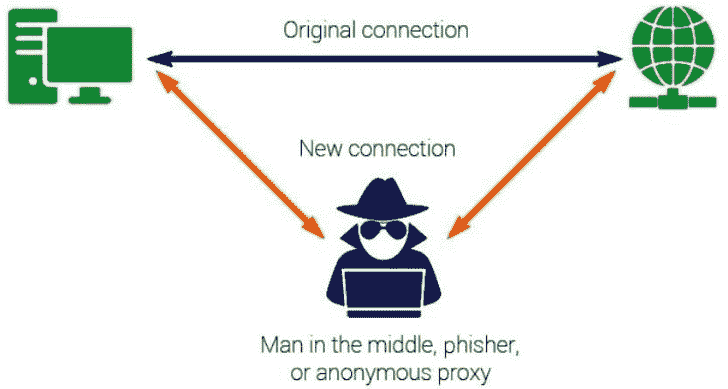
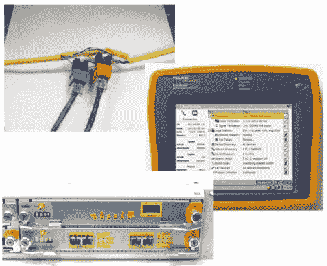
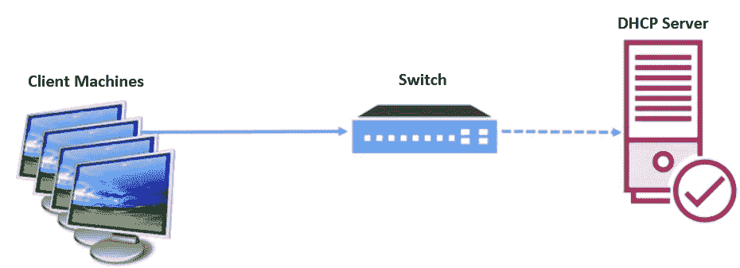
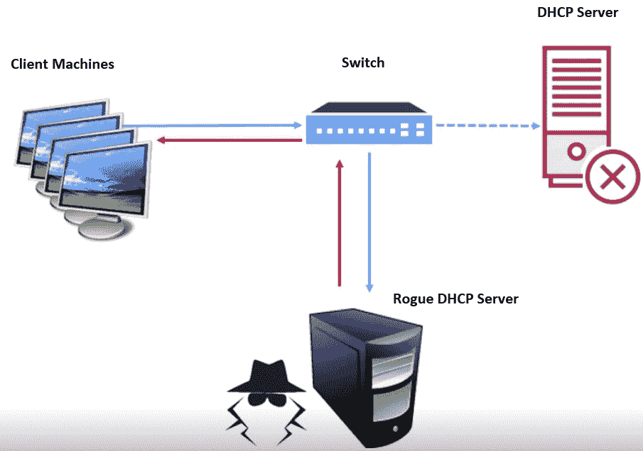
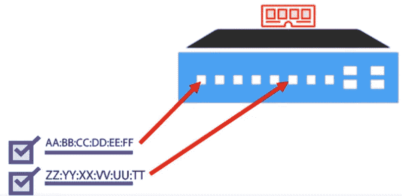
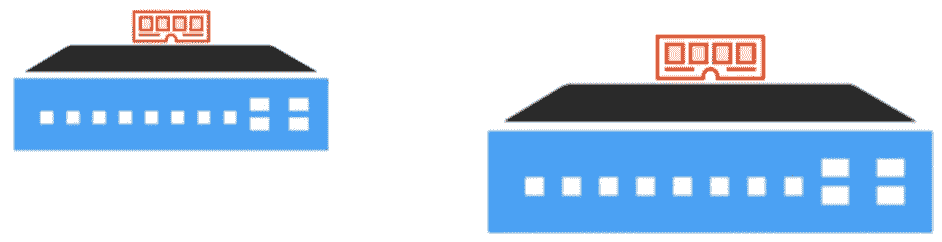
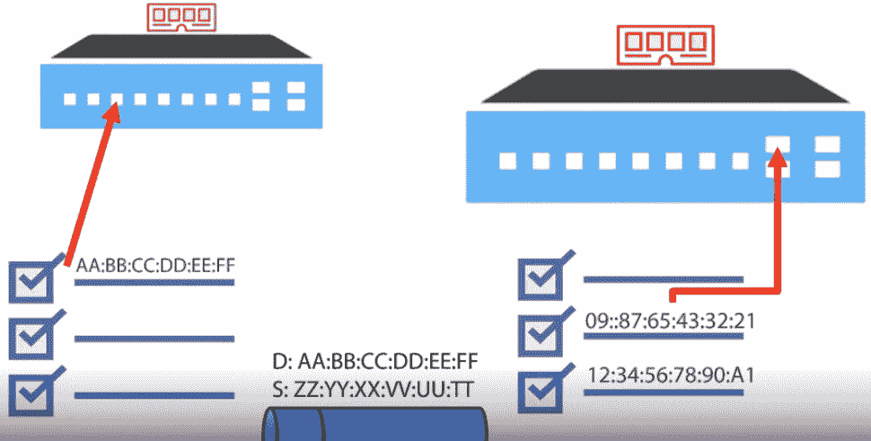
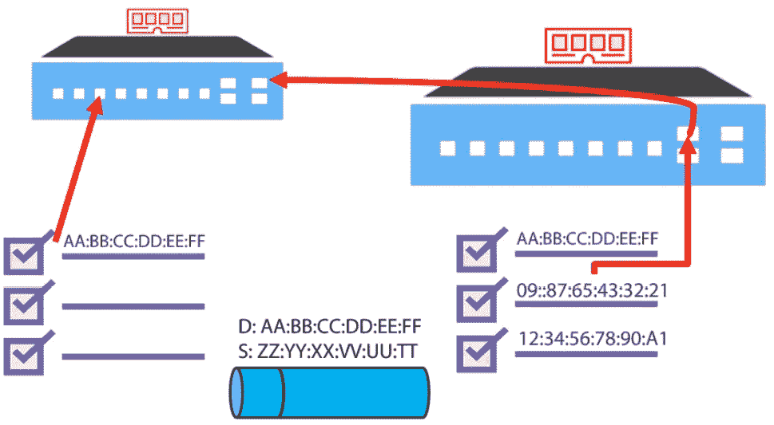
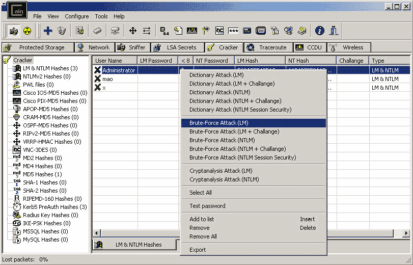

# 第十章：嗅探与规避 IDS、防火墙和蜜罐

嗅探是一种古老的方法，但现在配上了新技术。在智能手机之前，我们使用的是电话。当时有一种方法可以监听电话线并窃听对话。你可以录制流量，也可以拦截通过线路的数据。

这要求你选择一个目标，并连接到监听或录音设备。通常通过官方或非官方渠道实现——取决于合法性——以及直接连接机制。你还可以使用无线电监听。其目的是窃听对话或录制流动的数据。

攻击者可以拦截并读取任何包含明文信息的网络数据包。这些信息可能包括用户名、密码、个人代码、银行信息，或任何对攻击者有价值的内容。

数据包嗅探与监听类似——只不过是在不同的平台上。我们不是监听声音，而是监听二进制数据。攻击者的目标是查看所有通过网络的流量和数据包。

本章结束时，你应该能够理解什么是嗅探攻击，以及它在从我们周围复杂的大数据集中提取有意义信息中的作用。

本章将涵盖以下主题：

+   什么是嗅探？

+   嗅探的类型

+   硬件与软件嗅探

+   **动态主机配置协议** (**DHCP**) 攻击

+   **媒体访问控制** (**MAC**) 攻击

+   **地址解析协议** (**ARP**) 欺骗

+   **域名系统** (**DNS**) 欺骗

+   检测嗅探方法

+   规避 **入侵检测系统** (**IDSs**)

+   绕过防火墙

+   蜜罐

# 什么是嗅探？

通过使用嗅探工具，攻击者可以监视并捕获经过网络的数据包，并监听互联网活动。

让我们更具体地讨论一下什么是嗅探，以及如何在攻击中利用它。

如下所述，有两种类型的监听：

+   **主动监听** 允许攻击者通过 **中间人攻击** (**MITM**) 进入通信中间并加以操控，从而记录和监控流量。作为一种主动通道，它还可以让攻击者更改流经的数据或注入信息。在道德黑客中，*主动*意味着我们将采取极为激进的方式，强制干预通信。你可以在以下示意图中看到 MITM 攻击的表现：

图 10.1 – MITM 攻击

+   **被动监听** 允许攻击者窃听或监听对话——没有恶意；只是为了收集信息。我们可以利用被动监听记录相同的信息，但我们不会操控任何事物或人。

这合法吗？这取决于你的环境，所以你应该始终了解规则。合法的拦截或窃听是由合法的授权机构通过搜查令实施的，或者如果你与某家公司有协议并且正在与他们进行渗透测试时。

大多数时候，这些活动对管理、保护甚至监控基础设施等方面非常有用。合法性总是由是否获得许可来决定。

最近，全球各地都在监控恐怖活动。我们有政府机构通过被动嗅探或查看网络，寻找某些关键词或关键流量，这些流量通过互联网传输，如果满足某些标准，可能会引发警报。

关于政府是否应该参与这类事情有很多争议。我觉得很难辩论，因为我把它看作是一个*两难困境*。我理解背后的原因，但我也喜欢我的隐私。不管你做什么，了解你环境中的规则。

如果你认为我们有一个交换网络，那你相信我——我可以绕过这个。

这里的概念是，攻击者会通过监控硬件和软件，试图查看通过某个分段的信息。软件是我们的协议，而硬件是网络设备。

如果攻击者能够妥协其中一个设备，他们就可以开始监控通过它流动的所有信息。那么攻击者在寻找什么呢？相信不相信，这里有一些应用程序传输密码和用户名是以明文方式传输的。猜猜怎么着？电子邮件是明文的。而且你会惊讶地发现有多少次人们通过电子邮件发送信用卡信息。如果网络应用没有正确地锁定，我们可能也在以明文方式传输，当然，任何类型的敏感数据都会成为攻击者的宝藏。

## 嗅探的危险

那么，这有多危险呢？非常危险，因为它就在你的网络上——一切都在那里，攻击者可以轻易获得。而我在嗅探时能看到什么呢？

好吧，我可以看到这样的事情：

+   DNS 流量

+   一台客户端机器请求 DNS 服务器进行 DNS 名称解析

+   电子邮件流量

+   **文件传输协议**（**FTP**）密码

+   网络流量

+   Telnet 密码

+   路由器配置

+   聊天会话

如果没有正确锁定，我还可以看到 Telnet 密码；除非你使用 FTPS——安全的 FTP——否则密码和用户名会以明文方式传输。我也可能能够捕获路由器配置以及电子邮件流量。我说的可不只是电子邮件本身，而是与电子邮件系统相关的一切。Exchange 服务器与其他 Exchange 服务器之间会进行通信，所有这些流量——如果没有加以保护——可能会暴露出你的基础设施的许多信息。我们都知道**超文本传输协议**（**HTTP**）是明文的，实际上，现在有一个强烈的推动力要求大家都使用**安全超文本传输协议**（**HTTPS**）。我同意。大多数聊天会话环境都可以被嗅探到，**系统日志协议**（**syslog**）流量也是如此。

Syslog 可以用于系统管理和安全审计，也可以用于获取一般信息、查看分析和调试消息。现在，想象一下这些数据以明文方式传输；不仅是软件，设备也可能有自己的 syslog 文件，并将其报告回 syslog 端点。可能是打印机、路由器等，通常这些日志会包含时间戳、主机名，甚至是设备的**互联网协议**（**IP**）地址。

这是如何实现的呢？嗯，这就像是*时髦*一样。看看，我之前吃了大麦克，现在我想吃点冰淇淋！我所说的*时髦*意思是这样的：你有一个**网络接口卡**（**NIC**），它连接到一个交换机，再通过交换机连接到多个系统，这就是标准的网络环境。

通常，网络卡的工作原理是将数据从一个位置发送到另一个位置，通常，网络卡会接收它在网络上看到的所有流量，并且只会忽略或丢弃那些不发送到其 IP 地址的数据包，但它仍然能看到这些数据包。

我们可以通过将网络接口卡切换到混杂模式来改变它的工作方式。这会导致网络卡将它看到的所有流量传递给**中央处理单元**（**CPU**），而不是丢弃那些只针对该 NIC 的帧。在非混杂模式下，网络卡就不那么“有趣”了。不是的——网络卡接收到一个帧，除非该帧是针对该 NIC 的 MAC 地址的，否则会丢弃它。

有许多**操作系统**（**OS**）需要管理员权限或超级用户权限来启用混杂模式，通常情况下，网络卡只会看到与其在同一端口上的流量，尤其是在交换环境中。

我知道我刚才提到了一个像**视频录像机**（**VCR**）一样古老的东西，但这正是集线器的问题。它通过所有不同的端口传输数据。许多公司已经转向交换式环境，来对抗混杂模式的使用；如果我做同样的事情，我只能看到那些仍然发送给我的数据。

接下来，我们来讨论一些我们在嗅探时可以使用的选项。

# 嗅探的类型

那么，嗅探攻击有哪些类型呢？请不要回答，“*这取决于你是想分辨气味，还是因为感冒*。” 对我们来说，嗅探是指我们可以利用的实际攻击向量，而我们可以探讨的嗅探向量有好几种。

## 欺骗攻击

在这种类型的攻击中，攻击者通过修改或伪造信息或数据冒充他人。通过这种方式，他们可以访问资源，甚至窃取个人信息。

这些类型的攻击可以通过几种不同的方式进行。攻击者可以使用与受害者关联的 IP 地址，这样就可以发送虚假邮件或设置虚假网站，试图获取密码或账户信息等。关于欺骗攻击，攻击者能做的事几乎没有限制。你甚至可以设置一个虚假的接入点用于无线连接，并假装是通过不合法的连接连接的合法用户。

## DHCP 饥饿攻击

在饥饿攻击中，我们通过占用除 DHCP 服务器之外的所有 IP 地址来消耗可用的 IP 地址数量。假设你的 DHCP 服务器有一个范围或多个范围，代表不同的子网地址段。在这个例子中，我们选择**192.168.0.1**到**254**的范围。这个范围实际上就是 DHCP 服务器可以分配给客户端的 IP 地址列表或数据库。随着网络的启动，客户端发起请求，信息通过交换机传递，并发送到 DHCP 服务器以获取 IP 地址。我们将在本章后面进一步讨论这个过程。

## DHCP 服务器攻击

在这种类型的攻击中，攻击者会设置自己的 DHCP 服务器。事实上，作为攻击者，我会将这两种技术结合起来使用。我会设置一个恶意 DHCP 服务器，进行饥饿攻击，并让所有设备开始从我的恶意 DHCP 服务器获取 IP 地址。这将使我能够做一些有趣的事情，比如发起**拒绝服务**（**DoS**）攻击，因为现在，受害者没有合法的网关，而我可以利用这一点实施 DNS 欺骗。我们将在本章后面进一步讨论这个话题。

## MAC 泛洪攻击

你可能会认为 MAC 泛洪是指在苹果商店当 Mac 开售时发生的事情。为了帮助你更好地理解这一点，我们先了解一下交换机的作用。交换机内部有一个 MAC 表，而 MAC 地址与节点上的网络卡相关联——如果你把节点当作计算机或打印机来看。交换机会记录每个物理端口上所有设备的 MAC 地址，这样可以减少网络中的广播流量，也能保护我们免受嗅探攻击。

在典型的 MAC 洪泛攻击中，交换机接收大量以太网帧，每个帧包含攻击者发送的不同源 MAC 地址。这对交换机的影响可以根据攻击者的目标有所不同。然而，大多数攻击者的主要目标是迫使一个合法的 MAC 地址从 MAC 表中被清除，并注入一个伪造的 MAC 地址，将流量引导到他们可能用于监控或嗅探的特定系统。

## DNS 欺骗

DNS 欺骗简单来说就是它听起来的那样。它会污染 DNS 条目，将域名解析为 IP 地址。如果我能告诉你，某银行的 IP 地址实际上是我恶意网站的 IP 地址，而不是你去银行网站的 IP 地址，我就能大肆玩弄你。特别是当我的恶意网站看起来和银行网站一模一样，包括用户名和登录入口时，这一点尤为真实。

## ARP 欺骗

ARP 欺骗与 MAC 洪泛攻击非常相似，但在 ARP 欺骗中，我们试图将攻击者的 MAC 地址与受害者的地址关联。这样，本应发送到受害者的流量就会被发送到攻击者。

## 密码嗅探

如其名所示，密码嗅探是指嗅探网络中的数据包，寻找以明文或未加密形式传输的密码。如果密码是加密的，攻击者可以使用解密算法尝试解密密码，而你应该知道之后会发生什么，对吧？

## 交换机端口盗取技术

当 ARP 欺骗无法实现时，在交换机环境中嗅探是非常有用的。这种方法通过 ARP 数据包淹没**局域网**（**LAN**）。每个欺骗数据包的目标 MAC 地址与攻击者相同，而源 MAC 地址则是受害者的其中一个 MAC 地址。通过这种方式，攻击者从交换机偷取了受害者的端口。

这样做有什么效果？所有目标为受害者 MAC 地址的数据包都会被攻击者接收，当攻击者收到被盗主机的数据包时，他们会停止洪泛过程并发起一个 ARP 请求，查询数据包的真实目的地。当他们收到 ARP 回复后，他们就知道受害者已收回其端口，因此 Ether cap 可以将数据包按原样重新发送到目标。之后，我们只需不断重复这个过程。这非常复杂。

# 硬件与软件嗅探

你可能会想，我们如何嗅探？实际上，我们有硬件和软件两种解决方案。我提前提醒你，硬件方面并不便宜。在硬件方面，我们有协议分析仪。这些设备专门用于监控网络流量。以下是比较简易的版本：

图 10.2 – 各种嗅探设备

我曾有机会玩过其中一个设备，前面图中间和底部所展示的 Fluke。它真是一个非常棒的小设备。它们不仅用来监控，还用来分析数据。使用 Fluke，我们可以看到电缆的长度。如果发生断裂，我们可以看到电缆断裂的位置。你还可以分析网络中使用的顶级协议。像*N2XN5540A*这样的多端口测试系统设备，可以帮助你监控并验证网络和设备的性能。

再次提到，正如之前所说，我们不仅可以分析数据，还可以捕获数据并在以后播放。如果攻击者愿意，他们可以看到每个数据包通过电缆时的单独数据字节。

这些设备非常昂贵，大多数普通的攻击者都无法承担这样的预算。更便宜的替代方案是软件。市场上较为流行的产品之一是 Wireshark，最初称为 Ethereal。它是一个跨平台的产品，使用**数据包捕获**（或**PCAP**）作为**应用程序接口**（**API**），捕获实时网络数据包来捕捉你的数据包。如果你了解我，你就会知道我相信没有什么东西是免费的，但相信我——这个产品是完全免费的。它支持从以太网到**电气和电子工程师协会**（**IEEE**）*802.11 PPP*的数据查看，并且可以通过**图形用户界面**（**GUI**）或**命令行界面**（**CLI**）来运行。

我曾有机会看到 Wireshark 专家 Laura Chappell 的演讲，她让我惊叹于她恢复密码和查看数据的速度。这就是我开始接触这一领域的地方。这是在很久以前，当*Novell*在网络世界占有大量市场份额的时候。那就说明了我有多老，对吧？

在你不久的未来，你会遇到一些关于 Wireshark 过滤器的问题，所以我强烈建议你好好研究一下。你不需要深入钻研——只需要了解一些基础的过滤器就行。市面上也有其他类似的产品，如 OmniPeek，它有一个不错的 GUI。

还有 SoftPerfect 的**网络协议分析仪**（**NPA**）。微软也有自己的产品：Microsoft 网络监控器。如果你很久以前看过它，它已经有了改进，所以你可能要再看一眼。

说到我最喜欢的词，市场上确实有大量的网络嗅探器被用于“黑暗面”。其中一些非常小巧——它们可以从**通用串行总线**（**USB**）驱动器、树莓派运行，甚至 Cain and Abel，后者是我最喜欢的工具之一，因为它快捷而简便。

我们还有 AirSnort，我相信你能猜到它的用途。还有一个叫 Snort 的工具。AirSnort 是为 Wi-Fi 设计的 Snort。Snort 非常强大，我曾与我的**互联网服务提供商**（**ISP**）服务一起使用。它非常强大——它能嗅探流量，如果我们发现来自某个特定地址的 DoS 攻击，我们会设置一个 Snort 规则，自动在路由器上阻止该 IP 地址。

现在，并非所有这些应用都用于“黑暗面”——我只想让你知道，市面上有许多不同的产品，它们既可用于正当用途，也可能用于恶意用途，从而带来平衡。看，我是如何巧妙地将这句引入的？

## 嗅探移动应用

可能会有一些情况，你没有笔记本电脑可用，或者你只是想在渗透测试中保持更加低调，或者攻击者试图在不带笔记本的情况下保持低调，而不是在环境中四处走动。没关系，如果你没有笔记本，市面上也有移动应用可以使用。

我觉得有趣的是，我在 Apple Store 上查看时，找不到任何评分高于一星的应用，这有点奇怪。不过，说实话，我不是苹果用户，也许你可以找到一些适合 Apple 的产品。

在 Android 端，选择非常多，这也是我偏爱 Android 的原因之一。最受欢迎的应用之一是 Wicap 2，它有两个不同版本。一个是演示版，仅仅是他们产品的演示。它得到了非常好的评价，也有相当多的用户跟随。不过，它需要对手机进行 root。

这家公司还生产一款完整的产品，这款产品真正获得了广泛好评。虽然价格不便宜，但就其评价而言，它非常受欢迎，很多人对它赞不绝口。

另一个工具是 PCAP，它有点吓人。不仅它能作为网络嗅探工具使用，而且它还包括**安全套接字层**（**SSL**）解密功能，这是通过中间人攻击实现的。它不需要 root 权限，这也许是它更受欢迎的原因之一，但它的界面与我们从 Wireshark 上看到的非常相似。

一旦你掌握了一种嗅探技术，你会发现不同产品之间有许多相似之处。再次强调，当你想嗅探网络时，移动应用是一个不错的选择。

接下来，让我们更深入地了解一下 DHCP 攻击。

# DHCP 攻击

*DHCP 攻击* 听起来像是一部很酷的电影标题，对吧？DHCP 是我们网络基础设施中如此集成的技术，它是攻击者的极大目标，因为我们可以控制很多与这种技术相关的内容。

那么，什么是 DHCP，它的作用是什么？如果你不知道它是什么，我会简要介绍它的功能。

DHCP 是我们安装在服务器上的一个专门服务器角色。我们这么做是因为任何需要连接到网络或访问资源的计算机，无论是内部的还是外部的（比如互联网），都需要某种连接方式，而我们通过 IP 地址来实现这一点。

DHCP 负责在计算机连接到网络时分配 IP 地址。它通过创建一个范围——基本上就是一个 IP 地址的数据库——来实现这一点。

DHCP 服务器的主要职责之一是跟踪哪个计算机拥有哪个 IP 地址。这样，我们就不会出现重复的情况。

DHCP 是我们所说的客户端-服务器模型，作为一种协议，它有一套在客户端和服务器之间交换的消息，用于获取 IP 地址。一旦我们为客户端计算机分配了 IP 地址——无论是工作站、打印机、手机、平板，还是其他服务器——有些服务器我们希望确保其 IP 地址是静态分配的。显然，最重要的是 DHCP 服务器本身。你不可能从自己这里获取一个 IP 地址，尤其是在你还没有启动的情况下，所以除了分配 IP 地址，我们还会分配其他 **传输控制协议**（**TCP**）/IP 设置。

这些设置包括 DNS 服务器。我要去哪里查找 *Yahoo.com* 对应的 IP 地址呢？或者，我要去哪里找到蝙蝠洞的 IP 地址呢？

另一个我们可以设置的类型是默认网关，它的作用是：如何从这个网络出去？如果我想去 Yahoo，我有一个 DNS 服务器告诉我 Yahoo 对应的地址是什么，但我如何从这里到达那里呢？这就是默认网关的设计目的。

现在，承认这一点——你当然可以在单独的计算机上输入这些信息，但想象一下你是负责 50 台计算机的 IT 人员（这其实是一个很小的数字），你必须反复输入 IP 地址、DNS IP、默认网关和子网掩码。反复输入这些信息，哪怕只有 50 次，更不用说上千次，可能会导致一种我想提醒大家注意的严重疾病：手指胖，这也是我有的症状。我不知道我多少次因为输入太快，手指一滑，反而把 IP 地址输入错了——比如我把 **192** 输入成 **129**。

## DHCP 饿死攻击

DHCP 饿死攻击让我想起了 *雾都孤儿* 中那个著名的场景，那个小男孩走上前说：“*再来一些*”。而且，单词 *饥饿* 听起来非常不祥。这个概念是，你有一个 DHCP 服务器，它将拥有一个范围或多个范围，代表不同的子网地址范围。在这种情况下，我们将选择 **192.168.0.1**，一直到 **254**。这仅仅是一个 IP 地址的列表或数据库，它可以分配给客户端计算机。

随着网络的启动，客户端发出请求。这些信息通过交换机传递，然后发送到 DHCP 服务器，以获取 IP 地址。与此同时，这些信息还包括默认网关、DNS 服务器以及租约的持续时间等信息。

需要注意的是，在租约期内，客户端本身会在租约的 **生存时间** (**TTL**) 达到 50% 时，回到 DHCP 服务器检查是否可以继续使用该 IP 地址。在正常环境中这一切都很好，但进入我们的攻击机器后，攻击机器基本上会通过 DHCP 请求或发现包淹没网络，DHCP 服务器会误以为是不同的客户端计算机在请求这些 IP 地址。事实上，该程序如此复杂，它会显示与这些请求相关的不同 MAC 地址。

最终会发生什么？DHCP 服务器认为它已经分发完所有不同的 IP 地址，范围也因此耗尽，这意味着客户端计算机将无法获得实际的 IP 地址，或者会被“饿死”。

有几种程序可以用来执行这种类型的攻击。两个更著名的程序是 Gobbler 和 Yersinia。

## 恶意操作

当我们进行恶意操作时，我们的目标是确保你理解标准的 DHCP 环境。最终我们会对那台机器发起饿死攻击。

在恶意攻击中，攻击者会引入他们自己的服务器，这个服务器将发放 DHCP 地址。

所以，在这里，我有我的客户端计算机，并且我们有我们网络中合法的标准 DHCP 服务器，已经连接到我们的交换机：

图 10.3 – 带有 DHCP 服务器的正常网络

通常，它们会将 DHCP 发现包发送到交换机，然后交换机会由 DHCP 服务器批准。然而，当发生恶意 DHCP 服务器攻击时，攻击者会向网络中引入一个恶意 DHCP 服务器。

为了让客户端计算机从恶意服务器获取信息，它们只需要对 DHCP 服务器（合法服务器）进行“饿死”攻击。DHCP 服务器离线后，请求将自动被重定向，因为 DHCP 服务器只是寻找发现包，并响应客户端计算机，分配给它们不会危及主机的设置，如下所示：

图 10.4 – 攻击插入了一个恶意 DHCP 服务器

例如，我可以将你的 DNS 设置为我的攻击性 DNS 服务器，在其中，我将“Citibank”指向我的恶意网站，该网站与 Citibank 或 eBay 或 PayPal 或 Amazon 看起来一模一样。我可以完全控制这个环境。如果你输入 **Yahoo**，我可以把你引导到 Google。

另一个结果是所有来自客户端的流量将会被发送到攻击者的 IP 地址，因为我还可以将其设置为默认网关，这样就能让我嗅探网络。客户端将简单地假设一切正常运行。我可能会从我的恶意服务器转发流量到合法站点，但再次强调，我会让所有流量都经过我。

有时，我们会在网络上出现一个没有人打算部署的恶意服务器。可能是开发人员或某个测试环境的人启动了一个 DHCP 服务器。将这个服务器放到网络上可能会干扰环境，而这种攻击在网络上也非常难以检测，除非你采取了某些反制措施。

## 对策

我们从阻止 DHCP 饥饿攻击开始。考虑到攻击机器向交换机发送 DHCP discover 请求，我们可以做的事情之一是实施端口安全性，这是交换机的一个功能，旨在为每个端口设置最大 MAC 地址数。

如果我知道在这条交换机线路上只有五台计算机，我会将我的端口安全设置为**5**，这样就能防止通过该端口实施的饥饿攻击。

在配置端口安全性时，你需要参考交换机的制造商，但当我们查看市面上最流行的产品之一，即思科时，端口安全性默认是关闭的。交换机本身必须是**二层**（或**L2**），当你需要启用端口安全性时，只需输入**switchport port-security**，这将激活端口安全性。

你还可以做一些设置，比如将最大值设置为**1**，即交换机上最大 MAC 地址数。你还可以指定交换机在一个接口上最多可以有多少个 MAC 地址。这个数值可以是从**1**到**6200**左右的任意数字。

我们还可以做的是设置当该接口发生违规时会采取的操作。默认情况下是关闭接口，实际上停止来自可疑系统的所有流量，但你也可以使用**switchport**。端口安全违规被限制，这意味着它会丢弃流量并发送**简单网络管理协议**（**SNMP**）消息，但保持端口继续运行。

我们还可以在交换机上使用*protected*选项，它会丢弃所有流量，保持端口开启，但不会发送 SNMP 消息。当然，*shut down*做的就是它说的那样，关闭端口。

另一个选项是设置端口安全的老化时间。这将允许您设置所有安全地址在端口上的时间，以及端口保持关闭的时间。老化时间可以从 2 分钟到近 1,500 分钟——著名的 1,440 分钟或 1,400 和 40 分钟。您可以使用**绝对**或**非活动**来指定类型。对于绝对老化，此端口上的所有安全地址在我们指定的分钟后准确退出，并从安全地址列表中删除。对于非活动老化，此端口上的安全地址只有在来自安全源的数据流量在特定时间内没有时才会退出。

为了阻止恶意攻击，我们实施 DHCP 窥探，这是交换机上可用的一个功能。它阻止端口响应 DHCP 提供。例如，如果我有一个 DHCP 服务器，并且它物理连接到端口**1**，我会关闭端口**2**到**8**上的窥探。

如果攻击者设法建立一个 DHCP 服务器并将其放在交换机下面会发生什么？他们将无法获得任何响应或响应 DHCP 发现数据包，因为只允许通过您合法的 DHCP 服务器所在的端口传输。

微软还做了一些有趣的事情——他们从 Server 2008 开始启动我们。如果您拥有**活动目录**（**AD**）环境，您必须在 AD 中授权 DHCP 服务器，这意味着它会启动。因此，如果您安装了 DHCP，那就是您必须执行的步骤之一。如果您没有权限执行此操作，即使您已安装了该角色，它也永远不会真正启动。

这对于微软世界来说很棒，但它无法阻止某人启动 Linux DHCP 服务器，这就是我会在交换机上实施 DHCP 窥探的地方。

接下来让我们讨论 MAC 攻击。

# MAC 攻击

如果您来自**美国**（**US**）并在 1970 年代的好时光之前就在周围长大，那么您可能还记得麦当劳有趣的广告词，描述了一个 Big Mac 攻击，其中有两块全牛肉饼、特制酱、生菜、奶酪、洋葱，全部放在芝麻面包上。然而，我们现在不是在谈论食物。MAC 是**媒体访问控制**的缩写，我们获得的每个网卡都有一个 MAC 地址。

以太网发送的数据包始终来自一个 MAC 地址，并且也发送到一个 MAC 地址。我知道你可能会想：这不是 IP 的工作吗？嗯，TCP/IP 处理 MAC 地址，但归根结底，用于数据包传输和接收的是 MAC 地址。每个端口，无论是在网卡上还是在打印机或笔记本电脑上，都是唯一的。

如果网络适配器接收到一个数据包，它会将数据包的目标 MAC 地址与其自身卡上的该 MAC 地址的适配器进行比较。如果匹配，它就允许数据包继续传输。如果不匹配，它就会丢弃该数据包。

MAC 地址通常是一个 12 位的数字。与 IP 地址类似，MAC 地址也有其语法规则，具体来说，前 6 个字符是我们所称的*前缀*。这前 6 个字符是唯一分配给不同厂商的。所以，在这 12 位数字中，前 6 个字符作为前缀，分配给特定厂商。例如，Linksys 被分配了多个前缀，如果我看到一个 MAC 地址前缀是**00:13:10**、**00:25:9C**或**68:7f:74**，我就知道这是一个 Linksys 设备。

有一个 MAC 地址是独一无二的。它仅仅是 12 个 F——也就是**FF:FF:FF:FF:FF:FF**。这和我高中时的成绩单非常相似……它是一个广播地址，针对网络中的每个适配器。

## CAM

CAM 是 MAC 的反写，但当然，这并不是它所代表的意思。**CAM**是**内容寻址存储器**（Content Addressable Memory）的缩写，它存在于每个交换设备内部。当数据包通过交换机时，它们会包含目标和源 MAC 地址，这意味着这是我尝试到达的目标地址，而数据包来自这个源地址。

随着流量通过交换机，CAM 表格简单地跟踪 MAC 地址的位置，并指定每个 MAC 地址分配到哪个端口。所以，在这种情况下，你可以看到交换机知道我不会在这里读取完整的 MAC 地址，我只会读最后两个字母，但是你会在下面的图中注意到，**FF**在第一个端口，而以**TT**结尾的 MAC 地址在第六个端口：

图 10.5 – 交换机上的 CAM 表格跟踪 MAC 地址

现在，当数据包通过交换机时，交换机会使用**FF:FF:FF:FF:FF:FF**这个 MAC 地址进行广播。它会发送一个大宗 API 广播，尝试找到一个以**A1**结尾的 MAC 地址。当它收到反馈时，它会简单地在 CAM 表格中做一个标记，并且这个标记会位于某个端口上。CAM 表格存储在交换机的内存中，因此如果你关闭或重启交换机，CAM 表格会被清除。交换机的这个功能，通过学习不同 MAC 地址的位置，帮助我们减少广播流量，以及确保数据包不会被发送到错误的端口——至少这是目标。

它不仅仅局限于一个交换机，因为大多数网络都有多个交换机。在这里，我有两个交换机，当然，每个交换机会有它自己的 CAM：

图 10.6 – 每个设备都会有自己的 CAM

在这个例子中，我们尝试找到一个以**FF**结尾的目标地址；你可以在*图 10.7*中看到我的目标 MAC 地址和源 MAC 地址。

如果在实际网络环境中，与**FF**相关联的 MAC 地址位于第二个交换机上，那么该交换机将知道该 MAC 地址或计算机的位置。然而，这个第一个路由器不知道它的位置，所以如果一台计算机试图发送数据包或数据片段到次级交换机上的一台机器，而它位于第一个交换机上，我们必须解决这个问题。

再次，第一个交换机将了解它所知道的系统的 MAC 地址，以及交换机本身端口的 MAC 地址—在这种情况下，上行端口：

图 10.7 – CAM 跟踪 MAC 地址所在的端口

在这里，上行端口以**21**结尾，交换机足够聪明，知道这个端口与次级交换机上的 MAC 地址相关联：

图 10.8 – 上行端口根据 CAM 知道要转发到哪里

当第一个交换机广播时，第二个交换机会回应并说，“嘿，我知道那个，所以把所有数据包都转发给我”，然后就会发生这种情况。

这个第一个交换机的 CAM 表说，每当你想发送东西给**FF**，只需转发到**21**，然后**21**会处理，因为它有那个次级交换机的 MAC 地址。现在，我是澄清了还是搞混了？

这对于次级交换机也是如此。它会知道它连接到交换机**1**的端口，这就是我们拥有完全交换网络环境的方式。整个过程非常高效，这应该告诉你政府没有参与。

## 洪泛

现在我们了解了交换机的工作原理以及数据包如何在网络中传输，我们的整个目标是研究 MAC 攻击。这种攻击的一部分被称为洪泛。

你可能认为交换机能做到这一切很酷，但正如我之前所说的，你无法嗅探到交换网络，除非你让交换机变得太满，无法再获取 MAC 地址的位置信息。这有点回到了不同网络设备的旧日子，通常情况下，随着我们在网络设备中的升级，我们从集线器开始，集线器向每个端口发送广播，然后我们升级到交换机。交换机会执行集线器的功能，但是它会更强大，意味着它会开始监视和引导流量，这就是我们在 CAM 中看到的，然后你会进入路由。

整体概念是，一些交换机会回溯到以前的状态。如果我有交换机和我的 CAM 表，并且我知道不同的 MAC 地址在各个端口的位置，那么攻击者常用的一种技巧就是启动他们的设备。如果我通过大量记录让交换机无法跟踪各个 MAC 地址和端口的对应关系，这种行为我们称为交换机泛洪，它会做出一个有趣的反应——它降低智能化，变成一个集线器。

每个数据包都会广播到所有端口。这是大多数交换机的默认功能，特别是消费级交换机，因为你不希望失去连接。

另外，除了 MAC 攻击外，你还可以通过交换机上的其他方式嗅探网络。很多管理型交换机有专门的端口，称为**交换端口分析仪**（**SPANs**）或 SPAN 端口。这些端口能够镜像流量，并允许攻击者或网络管理员监控所有经过的流量。

MAC 泛洪方法在网络中产生大量噪音，且很容易被检测到。然而，它只能被一些更先进的交换机检测到，这也是为什么了解你的硬件清单以及设备在哪里运行（负载）是非常重要的。

## 应对措施

在保护自己时，你会发现我们已经讨论过的内容会被重复提及，之所以会反复出现，是因为这一切都是在网络层完成的。你可以使用一些很酷的功能，例如思科的端口安全功能。你可以用它来保护一个端口。比如，如果你为安全端口分配一个 MAC 地址，那么该端口只会转发数据包到该 MAC 地址对应的设备。

这项技术的酷之处在于你可以设置警报来监控这些情况。例如，如果网络上出现可疑活动，比如某台机器的 MAC 地址尝试访问一个端口，而这个端口的 MAC 地址并没有匹配已知的安全 MAC 地址，或者出现任何类型的违规行为，我们都能收到警报。

我们还有使用**身份验证、授权与计费**（**AAA**）服务器的选项，通常我们称之为 RADIUS 服务器。

这些服务器要求计算机和用户进行身份验证，并自动跟踪他们的活动和去向。通常，这是通过用户登录或可能通过证书来完成的。我曾在我的 ISP 上设置过一个 AAA 服务器，我们用它来进行计费部分的管理。

如果你还记得，在过去的日子里，你上网是按上网时间收费的，对吧？就像以前的*AOL*时代一样。我们不收费；我们希望能够为用户提供一个报告，告诉他们：“*嘿，这就是你在互联网花费的时间；这是你通过我们的服务下载的数据量*”，我们之所以能够做到这一点，是因为我们可以将其与他们天线和路由器的 MAC 地址进行匹配。

接下来我们将讨论 ARP 欺骗。

# ARP 欺骗

ARP 中毒是我们在嗅探过程中可以使用的一种机制，它的能力相当可怕。其概念是……我们将通过计算机层面欺骗人们做一些他们不打算做的事情，或者去他们不打算去的地方。

在我成长的过程中，父亲常对我说：“*你最多只能欺骗人这么长时间，但在此之前，还是要好好利用这个机会。*”当然，他说这话时是带着轻松的语气——他并不真的相信这个。他总觉得别人都在试图这样对待他。他在一家电影院连锁工作，工作内容是到不同的区域去找出哪些经理和员工在偷公司东西。他总是说，人们以为他们能找到一种新的方式来找到“*绕过系统的方法*”，以便不被发现，但从技术上讲，这永远不是新方法。它不过是通过旧机制找到了一条新路径，而那个旧机制就是盗窃。

ARP 让我们回想起 *Network+* 时代，可能还会让你想起 *A+* 时代，如果你够老的话，应该会记得那个 *Networking Essentials* 的时代。ARP 是一个已经存在了很长时间的协议。如果你已经阅读了前面的章节，你会记得我们讨论了网卡以及它们如何与之关联的 MAC 地址。我们还谈到了 MAC 地址是计算机或节点之间通信的真正方式。

计算机需要能够将 MAC 地址解析为 IP 地址，这与我们所说的名称解析非常相似。如果你记得，我们在其他章节中也提到过，DNS 让我们能够将像 *Yahoo.com* 这样的名称解析为 IP 地址。

嗯，由于计算机或节点提供这些物理地址，ARP 就是负责将它们解析为 IP 地址的协议。

我知道这完全颠覆了你的想法，而这正是 ARP 为我们做的事情。它是一个设计用来将互联网 IP 地址映射到物理机器地址的协议。通常，这一切都是通过一个表格来完成的。现在，这个表格并不是像电子表格那样的表格，但你可以把它理解为那样。我们称之为 **ARP 缓存**，因为它是缓存的，所以它是存储在内存中的信息。

通常，这些信息不会在内存中停留太长时间，这也是它的一个缺点。此外，它很容易被篡改，因为当数据包要发送到某个特定局域网上的主机时，它首先到达网关，网关会请求 ARP 查找与该 IP 地址匹配的物理主机或 MAC 地址。如果它的缓存中没有这个信息，它会进行广播，假如一个节点想更新交换机或路由器上的 MAC 地址。我们所做的 ARP 中毒就类似于此：我们会欺骗交换机或计算机，让它认为它的 ARP 表已经不再有效。

## ARP 欺骗

ARP 欺骗是中毒的另一种说法——我们互换使用这两个名字。这一切都基于这样一个概念：发送 ARP 请求的机器假设 ARP 回复来自正确的机器，但我们知道，在我们的案例中，这种情况是不可能发生的。

有些人现在可能在想：他又要吓我了吧。不—现在是时候穿上大裤子，试着理解这里发生了什么。

这是我们实施这种攻击的方式。我们发送伪造的数据——或者像我喜欢说的那样，伪造我们的方式。攻击者可以创建我们所说的格式错误的 ARP 回复，其中包含伪造的 IP 地址和 MAC 地址。

此时，目标的机器盲目地将 ARP 条目接受到其 ARP 表中。攻击者然后通过发送大量 ARP 请求和回复数据包到交换机，迫使交换机进入一种新模式，称为转发模式。

完成这一操作后，攻击者将伪造的条目淹没目标的 ARP 缓存，这就是我们所说的欺骗或中毒目标。

### 欺骗或中毒目标

欺骗或中毒目标看起来像是一项复杂的技术，但其实并不那么难，因为你知道吗？我们有一些非常酷的工具，包括 **dsniff**，它实际上是一套密码嗅探和网络流量分析工具。除了 **dsniff**，它还有其他一些工具，如 **filesnarf**、**mailsnarf**、**messagesnarf** 和 **arpspoof**——这些工具可以简单地帮助我们中毒目标。

另一个工具是 Ettercap。它也是一个开源的安全工具，可以用来进行中间人攻击，并且可以进行一些协议分析和安全审计。

我们还有 Cain 和 Abel，这是一个工具套件，可以用来进行中毒攻击。

再次提醒，你可以将这些工具用于正当用途，但请记住：所有工具都可以被用于邪恶目的。

## 如何通过 ARP 中毒网络

现在是时候把兄弟们召唤出来了！我的意思是，安装并试用 Cain 和 Abel。Cain 和 Abel 得名于一个圣经故事，故事中两个兄弟，一个杀死了另一个，因此是坏与好的对比。你在这个产品中正好看到了这种情况。有时候它被简称为 Cain，因为它主要是邪恶的。

现在，举起你的手并发誓，你不会使用这些工具做任何事情，也永远不会告诉执法部门 *Dale 告诉你可以在实际网络上运行这个工具！* 这个工具可以轻松伪造并中毒设备的 ARP 表，并且欺骗网络上的所有设备将它们的流量发送到攻击者的系统。你可以在以下屏幕截图中看到该工具界面的概览：

图 10.9 – Cain 和 Abel 界面

Cain and Abel 附带了一些额外的工具，可以抓取哈希表并破解可能传递的不同密码，值得一提的是，它不仅限于捕获微软密码。它还可以捕获一些 **802.11** 报文、**Wi-Fi Protected Access-Pre-Shared Key**（**WPA-PSK**）哈希、思科 IOS-**消息摘要 5**（**MD5**）哈希等等。

这真是一个有趣的小程序，正如我常说的，知己知彼，百战不殆。如果你对系统进行软件清单扫描并发现有人在运行 Cain and Abel，你就能大致知道他们在用它做什么。

## IRDP 攻击

**互联网控制消息协议（ICMP）路由器发现协议**（**IRDP**）欺骗是一种有趣的路由协议，它允许主机发现活动路由器的 IP 地址并连接到互联网。这些路由器必须位于自己的子网内。它们通过监听网络上的路由器广告和请求消息来实现。当它们发现这些消息时，它们会简单地记录下自己的路由器是谁，并将其写入路由表中。

攻击者可以通过伪造路由器广告消息并直接发送给受害者，远程向系统添加默认路由条目。值得注意的是，IRDP 不需要任何身份验证。目标主机会偏好由攻击者定义的默认路由并更新其路由表，使得所有流量都会经过攻击者定义的路由器，即使他们正在使用 DHCP 且已经为其提供了默认路由器。

当攻击者设置一个非常高的路由首选级别和生命周期，以确保目标主机选择它作为首选路由时，就可以完成这一操作。这个方法的缺点是协议仅会查找自己子网中的路由器。攻击者必须在同一子网内，但这仍然是可以做到的。

使用这种欺骗方式允许攻击者被动地嗅探网络并实施中间人攻击（MITM），甚至进行拒绝服务攻击（DoS）。所以，是的——这方法也不好。

## ARP 攻击的危险

那么，ARP 攻击会带来哪些威胁呢？ARP 欺骗带来了不同的威胁。

让我们看看 ARP 攻击带来的一些不同的危险和风险，具体如下：

+   **拒绝服务攻击（DoS）**：如果你通过将多个 IP 地址与目标的单一 MAC 地址关联起来，它将因大量目标不同 IP 地址的流量而过载。

+   **IP 语音（VoIP）通话**：我们也可以监听这些。如果我们进行端口镜像，就可以记录两个系统之间的 VoIP 通话。

+   **中间人攻击（MITM）**：攻击者将会处于目标和受害者之间的中间位置。换句话说，攻击者的机器将被置于两个系统或多个系统之间，拦截所有经过的流量。

我在一个学区教授伦理黑客课程，几位来自犹他州不同学区的人也来参加了，包括两位来自同一学区的绅士——一位老板和他那位关系良好的助手。他们住在不同的酒店房间，所以当助手在一次嗅探课和演示后回到房间，他接入了 Wi-Fi 网络，观察到老板登录到**虚拟私人网络**（**VPN**），并捕获了他的 VPN 用户名和凭证。然后，他过去向老板展示了自己能够做的事情。我知道你脑海中在想什么，不——他没有被解雇。

当然，他应该有权限这么做，但这确实很有趣。第二天早上，他们俩都有些困惑和震惊，不明白这种信息是如何传输的。再说一遍，我对在 Wi-Fi 网络上的操作非常谨慎。

+   **会话劫持**：这可以是主动的或被动的。基本上，如果你是被动的，你会跟随会话并获取所有信息。主动会话则让你有可能将对方踢出并接管他们与 PayPal 或银行可能建立的会话。

+   **数据拦截**：你可以获取 IP 地址范围、MAC 地址、计算机名称，甚至连接到交换机的**虚拟局域网**（**VLANs**）。

+   **连接劫持**：这是指攻击者操控客户端的连接，以完全控制他们的连接。

+   **数据篡改**：这就是攻击者决定篡改数据的地方。如果我们能够作为中间人，攻击者可以捕获并修改数据包，甚至停止系统之间的信息流动，这让我们回到了 DoS 问题。当然，我们还可以窃取密码。

+   **连接重置**：你知道 ARP 表项会在缓存中存储一段时间，即使连接不活跃，对吧？如果主机未能发起连接，它应该通知 ARP 表删除该信息。如果需要与同一系统通信，它会将其保留在缓存中，以加速解析。

当我们进行 ARP 欺骗时，实际上是在做连接重置，以便删除表项——至少，Cain 和 Abel 是这么做的。它可以告诉你的 Server 2008 R2 服务器需要删除其中的 Windows 8 表项，当你发送 ARP 请求时，你将指定一个特定的 MAC 地址。

## 应对措施

有许多措施可以帮助你防范攻击。你不能假设任何事情都会安全。你可以做的一件事是实施**动态 ARP 检查**（**DAI**）。DAI 是许多交换机和路由器的功能。我们将在交换机和路由器上启用它，因为它会查看或拦截网络中所有的 ARP 请求和响应。每个被拦截的数据包都会与有效的 MAC 地址以及它绑定的有效 IP 地址进行验证。任何无效的 ARP 数据包都会被简单地丢弃。

DAI 通过查看已创建的受信任数据库来判断数据包是否有效，而且大多数交换机和路由器都有内置这个功能。

我们还可以利用 DHCP 监听功能。因此，这些 IP 地址会分配给一个系统（记住——当机器上线时，IP 地址会被分配），而 DHCP 服务器会记录该 IP 地址分配到的 MAC 地址。通过结合这两种功能或技术，我们可以创建一个更加安全的环境。

做这件事的传统方式是通过输入静态 ARP 表来逐个输入，但这并不是我很感兴趣的事情。

还有其他软件工具，例如**arpwatch**，它可能是更受欢迎的工具之一。它是一种查看网络中 ARP 流量的软件工具。它记录了 IP 地址和 MAC 地址的配对，以及配对时的时间戳——即这两个地址何时被配对——并且当有人试图伪造这些配对的 IP 和 MAC 地址时，它会通知管理员。

接下来，让我们看看 DNS 欺骗。

# DNS 欺骗

DNS 欺骗是我最喜欢的主题之一，主要是因为它的高效性。你无需担心……但要担心攻击者拿到你的 DNS 缓存。DNS 之所以存在，是因为人类不太明智，有时甚至不具备足够的条件。人类很难记住一个数字。如果你必须记住一个网站的 IP 地址，而不是简单地输入一个名称，你能想象吗？我们比起记数字，更擅长记住名称。

我们都很熟悉**统一资源定位符**（**URL**）框，在这里我们输入想要访问的网站名称。DNS 负责将网站名称转换为 IP 地址，使用的是表格。这些表格可以分布在多个系统上，有些是内部的，而另一些则是外部的名称。

DNS 服务器通常托管这些数据库。如果 DNS 服务器负责查看内部名称以及你环境中服务器的名称，那就是你的内部 DNS 名称服务器。对于负责查看公开网站如*Yahoo.com*的 DNS 服务器，它不是该网站的权威服务器；它不负责此事，所以这通常被称为外部 DNS。

总体概念是，当我们进行 DNS 中毒（伪造）时，攻击者只是试图让用户认为他们正在访问**gotham.com**，但他们会被发送到不同的 IP 地址。你可以在 URL 栏中直接输入 IP 地址，而不是 DNS 名称，仍然能到达同一个地方。再说一遍，DNS 只是为了让我们更方便。

发生的情况是，用户登录到他们的机器上。计算机已配置为特定的 DNS 名称解析方法。用户输入：我要访问**gotham.com**，计算机则说：我需要 IP 地址才能访问**www.gotham.com**。该请求被转发到用户的本地 DNS 服务器，而本地 DNS 服务器则说：我属于**gotham.city**，与**gotham.com**无关。我不负责处理它，因为我只是他们网络中的一部分。所以，我将把这个请求转发出去，我们将转发到一个根服务器——由互联网维护的服务器，它们有自己的记录，将请求指向顶级域。

互联网的根服务器知道如何帮助解决这个命名空间的问题，因为**.com**的服务器已经向它注册，因此它告诉（在此情况下）本地 DNS 服务器去联系**组件对象模型**（**COM**）服务器。COM 服务器并不知道**www.gotham.com**，但它们知道**gotham.com**，所以它们有一个条目，因为 Gotham 已经将它们的 DNS 名称注册在了——比如——GoDaddy，本地 DNS 服务器接着会联系到**gotham.com**的 DNS 服务器。

我们接下来会查找——在此情况中——**www**的条目，它只是指向某个 Web 服务器上的文件夹。Gotham 服务器会说：我知道**www**，并将这些信息返回给本地服务器。本地服务器随后会将它发送回用户的计算机，并说：这是它的 IP 地址——去吧，与它通讯。

## 内网中毒

这是内部的中毒攻击，相信我，你需要担心。首先，我们知道网络上有我们的交换机和客户端机器。在这种情况下，客户端机器正在请求一个名为**portal.gotham.com**的内部资源。该请求被发送到交换机，交换机随后通过 MAC 地址、ARP 解析将其转发到 Gotham 的本地 DNS 服务器。Gotham 说：我有权限处理这个请求。让我帮你找那个服务器。然后它找到了真实的 Web 服务器，并将信息或 IP 地址返回给客户端。

我们这里的问题是黑箱开始生效的时候。攻击者设置了他们的机器，并使用 ARP 欺骗技术来查找来自互联网的 DNS 请求的**标识符**（**ID**）。这会感染客户端机器，即他们的目标。客户端不再访问 Gotham 的 DNS 服务器，而是访问攻击者的黑 DNS 服务器，该服务器告诉它 IP 地址——事实上，这就是攻击者设置的自己的假网站。

如果攻击者很强，他们会制作一个与真实网页服务器一模一样的网页。这个网页可能是人们输入凭证的地方，而他们却是在一个假服务器上输入的。当然，如果攻击者足够高明，他们会在用户输入凭证后，将凭证转发回真实的网页服务器。这样，最终用户根本不会知道自己已经被欺骗或中毒。

我们用于这种类型攻击的工具包括**arpspoof**，这是我们 DNS 欺骗工具集的一个子组件，当然，我们之前也谈到过 Cain 和 Abel。

## 互联网污染

互联网 DNS 污染是我们真正享受的地方。这是你的噩梦场景，因为如果我成功了，我就能控制整个网络。而且我们可以通过不同的方式来实现互联网 DNS 污染攻击。

在正常的名称解析过程中，有几个检查步骤。首先，当你输入**www.gotham.com**时，计算机首先会检查其缓存，看是否以前访问过。接下来，计算机会检查本地机器上的一个名为**hosts**的文件。是的——它是复数形式，没有扩展名；它不是一个**.txt**文件，但你可以用文本编辑器来编辑它。如果该文件没有条目，计算机就会去检查它的 IP 地址设置，大多数是由 DHCP 分配的。然而，我们可以覆盖这些设置，这可以在客户端级别或服务器级别进行，如果目标是服务器的话。

另一个用于 DNS 名称解析的机制是本地 DNS 服务器。这个概念——事实上，这几乎发生在所有的 DNS 欺骗和/或污染攻击中——是攻击者将通过某种方式让恶意软件修改这些位置中的某一个。这样，当用户感染时，如果攻击者的恶意软件感染了**host**文件，我们会在其中添加一个条目，将**Citibank.com**指向黑客的 IP 地址。或者，正如我之前提到的，攻击者可以修改首选的 DNS 服务器，这样它就会指向他们的黑客服务器，当然也会指向本地 DNS 服务器。

这些目标中的任何一个，尤其是本地 DNS 服务器，都是高价值目标，因为我们不仅仅是说“*我希望一个域名指向一个特定的 IP 地址*”，而是说“*我希望所有 DNS 解析都指向我*”，这是因为我们不仅仅影响一个 DNS 条目，而是实际上将所有针对外部世界的 DNS 流量都导向我们：Citibank、PayPal、eBay 等等。

想象一下，如果有人获得了你家用路由器或企业路由器的 DNS 条目，并将 PayPal 指向这个 IP 地址，会发生什么情况？网络中的每个人都会访问那个由攻击者控制的假网站。

## 代理服务器污染

代理服务器投毒是一种特定的技术，攻击者可以设置自己的代理服务器。代理服务器会缓存网站或代替用户的请求发起请求。因此，我们会看到受害者的计算机在 **Internet Explorer**（**IE**）浏览器设置中，正是在这里。你之前见过吧？这个界面显示：“为局域网使用代理服务器。” 它不用于拨号或 VPN 连接。这里是在告诉你的浏览器使用这个 IP 地址来获取 DNS 信息。因此，攻击者会发送一段恶意软件，希望能够修改受害者计算机上的这些设置，从而迫使所有的 DNS 流量都通过黑客的代理服务器。这样，他们就可以嗅探信息，如信用卡信息，并将用户重定向到合法网站。

你可以确保这个功能被禁用，并且有许多**组策略对象**（**GPOs**）或设置可以实施并推送到所有的客户端计算机。其一就是确保这个设置无法被更改。在 Windows 10 中，有一个专门的部分来处理这个问题。它不再是 IE 的一部分，而是操作系统的一部分。

## 缓存投毒

如果你还记得 DNS 是如何工作的，你会看到客户端计算机会去请求 **Microsoft.com** 的 IP 地址。你知道它会向本地 DNS 服务器请求 **xbox.microsoft.com**。如果它之前没有看到过这个请求，它首先做的是检查缓存，看是否有之前的请求记录。它还会检查是否负责 **Microsoft.com**，答案是否定的，因此它会进行查找 COM 服务器的过程。我们先接触到根服务器，再是 COM 服务器，接着是 **Microsoft.com** 服务器，最后我们到达 **xbox.microsoft.com**，并将信息发送回本地 DNS 服务器。

有趣的是，缓存中存储着 **Microsoft.com** 的信息，还有 **xbox.microsoft.com** 和 COM 服务器的信息，因为根服务器不断将请求重定向。这个设计是为了加速域名解析。如果有人上线并请求查找 **office.microsoft.com**，我们不希望重复整个过程。相反，请求会到达本地 DNS 服务器，服务器会说：“我之前没有访问过 **office.microsoft.com**，但我有 **Microsoft.com** 的记录。它还在我的缓存中；我可以直接连接并查询 **Microsoft.com** 服务器，找到 Office 的 IP 地址。”

问题是，缓存存储在计算机的内存中，可以随时编辑和更新。攻击者可以简单地对该服务器上的缓存进行投毒，而不需要修改数据库或任何主机文件，只需修改缓存。通过这种方式，他们可以将所有人引导到错误或虚假的网站。

这正是让我抓狂的地方，关于恶意软件。许多人会感染病毒，其中最糟糕的事情之一就是在服务器上上网，访问可能是恶意的网站，导致你可能感染恶意软件。一个已经完成我们所讲的所有步骤的攻击者，知道你的 DNS 服务器的位置，可以简单地写一个脚本，始终将这个域名注入到这个 IP 地址，然后将它加入 DNS 缓存并保持更新。

那么，听完这些，你还想和我玩，还是拿着你的球回家？

# 检测嗅探方法

检测网络上的嗅探器有不同的方法。通常，嗅探器不会留下任何痕迹，因为它不传输任何数据——它只是在收集数据。因此，知道这一点后，我们需要寻找在我们的网络上运行混杂模式的设备或网络接口。

混杂模式意味着，当数据包通过网络时，如果它们到达一台计算机，如果该数据包不是为这台计算机所设计，正常的反应是忽略该数据包。如果数据包发送出去并到达目的地，那么该计算机会保存信息或保留该数据包。处于混杂模式的网卡会看到该数据包，但它不会丢弃它，而是将其添加到自己的表格或跟踪机制中。

在某些情况下，嗅探器更容易被发现，因为它们可能在主动模式下运行。如果你记得，**被动模式**只是监听，而**主动嗅探**则是注入数据，就像 Cain 和 Abel 或**dsniff**一样。

当攻击者在他们的机器上运行这些类型的软件程序时，如果你知道该寻找什么，可能就能找到它们。我们面临的一个大问题是所谓的独立嗅探器或基于硬件的嗅探器，原因在于它们既不传输数据流量，也不响应我们在这里将讨论的一些检测方法。

结果是，大多数攻击者不喜欢花钱——他们总是使用盗版软件或免费软件，因为基于硬件的嗅探器相对较贵。

## 检测嗅探攻击的各种技术

我们可以通过不同的方式检测网络上的嗅探器。

### 通过 ping 请求检测

通过发送一个 ping 请求到目标机器，使用其 IP 地址和错误的 MAC 地址，处于非混杂模式或普通桌面计算机的网络适配器会简单地丢弃这个数据包。然而，如果我们使用相同的方法去一个运行在混杂模式下的机器，它会响应回去；即使列出了不同的 MAC 地址，它也不会拒绝该数据包。因此，在这一点上，我就知道这台设备正在运行一个嗅探程序。

### ARP 方法

如果你记得 ARP 的工作原理，你就会知道 ARP 负责将 IP 地址映射到 MAC 地址。在这里，我们只是利用这个机制来检测哪些机器正在运行混杂模式。

我们做的第一件事是发送一个非广播的 ARP 包。这只是一个已经发出的 ARP 请求，但它没有使用广播 MAC 地址，而是为其分配了一个 MAC 地址。然后，机器将记录这些信息，针对网络中的每个节点。完成这一步后，我们再发送一个 ping 消息。这个 ping 消息需要使用无效的 MAC 地址。

现在，想一想会发生什么。没有运行混杂模式的机器会简单地回传一个 ARP 请求，因为它们会认为你的 MAC 地址是这个，随着数据包到达时请求新的 MAC 地址。处于混杂模式的机器，因为它正在吸收数据包，并没有真正验证；它只是回应 ping 回复，我们可以在网络上捕捉到这个信息。因此，它会识别出这台机器是一个不应该做某事的设备。

### 使用 DNS

如果你还记得，当我们谈论该隐和亚伯时，你有一个选项是将 IP 地址解析为主机名，很多嗅探程序会自动为我们完成这项工作。那么，它是怎么做到的呢？它是通过反向 DNS 来实现的。知道这一点后，你只需查看网络中哪些机器正在向你的 DNS 服务器发送大量的反向查询。另一种方法是简单地发送一个 ICMP 包，也就是 ping，一个不存在的 IP 地址，这样它就会穿越整个网络。

## 嗅探攻击的对策

现在，让我们看看一些我最推荐的保护措施，以帮助你防范嗅探攻击，从最基本的开始。我们开始吧：

+   **加密**：这将在数据层进行。我们希望确保保护任何可能在网络中被发现的机密信息。

+   **静态 MAC 地址**：你可以利用网关或者你网络中的网关来保护自己，避免成为中间人攻击（MITM）的受害者。

+   **设置物理访问级别**：如果你在网络基础设施中有一些没有被使用的端口，确保将它们从配线面板上断开。

让我给你讲一个故事。我曾在一个军事基地工作，和他们谈论物理访问和安全性。他们告诉我，他们切断了网络接口背后的电缆以及配线面板上的电缆，以防有人插错配线面板，而房间内物理接口后面的网络电缆也完全被切断了。出于好奇，我问：“*那你们需要重新连接时怎么办？*”他们回答说：“*哦，我们只是，重新接上就好了*。”他们在墙里似乎有大约 10 英尺的额外电缆，这样他们就可以随时拉出来使用。当然，如果电缆不够长，他们就得重新铺设整条电缆线路，这倒是挺有趣的。那是几年前的事了。希望到现在，他们已经有了关于配线面板的相关政策。

+   **升级到 IP 版本 6（IPv6）**：再次强调，IPv6 的最大优势之一是实现了**IP 安全性**（**IPsec**），意味着数据包在传输过程中是加密的。此外，如果你的网络设备支持，关闭网络 ID 广播。

+   **设置静态 IP 地址和静态 ARP 条目**：在目标机器上执行此操作，以防止攻击者在网络上添加伪造的 ARP 条目。

使用 HTTPS 怎么样？如今，互联网上有一股大潮流，试图使我们与网站之间的每次连接都使用某种类型的安全层或 SSL 连接。这将有助于保护我们在访问不同网站时的用户名和密码。然而，还有其他协议被认为比原生协议本身更安全。我们可以使用 SFTP、VPN 和 IPsec，而不是 FTP。

我已经提到了 SSL 和 TLS，这里也可以提到**非常好的隐私**（**PGP**），以及**安全/多用途互联网邮件扩展**（**S/MIME**），当然还有**安全外壳协议**（**SSH**）。所有这些不同的协议将使嗅探器极其难以获取你的信息。

我们不能忘记无线设备吧？我们必须确保始终使用某种加密协议，如 WPA 或 WPA2。如果没有，那就使用**有线等效隐私**（**WEP**），并告诉我你的**服务集标识符**（**SSID**），我很想去拜访你！

+   **直接获取 MAC 地址**：我们从网络接口卡（NIC）获取，而不是从操作系统本身获取。例如，在 Windows 中，我们可以设置要更改 MAC 地址；我们并没有在 NIC 上物理更改它——我们是在操作系统内部更改它，并让它报告回来。通过实现这项技术，直接从 NIC 获取 MAC 地址有助于防止 MAC 地址伪造。

你猜对了——我们还有其他工具可以用来检测网络上是否有任何 NIC 处于混杂模式。

# 绕过 IDS

黑客会试图绕过防火墙和**网络 IDS**（**NIDS**）进行嗅探。NIDS 的工作原理是检查通过网络的每个数据包，查看它是否是某个已建立连接的一部分（例如网页请求），或者它是否正在尝试建立新的网络连接（例如有人尝试登录到你的无线路由器）。当它发现任何可疑流量时，会生成警报，这是攻击者希望避免的。

### 基于主机的 IDS（HIDS）

HIDS（主机入侵检测系统）安装在主机上，监控试图获取未经授权访问或使用数据的进程。同样，当它们发现任何可疑活动时，会生成警报。

HIDS 对于局域网（LAN）非常有效，但大多数无线连接（如 Wi-Fi）不需要登录，因此 HIDS 仅适用于你信任的网络。

### IPS（入侵防御系统）

**入侵预防系统**（**IPS**）是另一种解决方案。这些系统设计用于实时检查数据包，寻找任何可疑活动。它们允许已知的良好流量通过，同时丢弃任何看起来是恶意的流量。

IPS 与防火墙和 IDS 不同，因为它们能够阻止正在进行的攻击，而不仅仅是事后检测攻击。IPS 与防火墙和 IDS 的另一个区别是，IPS 会阻止所有*bogon*流量（它无法识别的任何流量）。如果发生这种阻止，攻击者的默认反应通常是关闭他们用于发起攻击的服务。

这些不同系统是如何工作的呢？比较简单的系统（防火墙和 IDS）会检查数据包，判断它们是否允许通过。它们使用在安装软件时由你创建的规则，这些规则定义了特定的流量特征。防火墙和 IDS 旨在防止未经授权的网络连接，而 IPS 则旨在在已知的恶意流量到达目的地之前将其拦截。

如果你使用无线连接，IPS 比防火墙和 IDS 更有效，因为它们能在客户端机器完成网络握手之前就检测到已知的恶意流量。防火墙和 IDS 依赖基于规则的检测方法，这意味着它们必须首先通过拦截一些流量并检查数据包来*学习*恶意流量的特征。这个过程可能需要从几分钟到几小时不等。

### 基于主机的 IPS（HIPS）

IDS 监控单个系统的可疑活动，而 IPS 则检查针对特定网络的可疑流量，并尝试阻止它。

IPS 可以在特定环境下防止 100%的攻击，但缺点是，如果源计算机或目标计算机没有运行 IPS，可能会出现误报——看起来像攻击的事件，但实际上并非如此。

为了绕过防火墙，黑客会尝试利用正在使用的网络协议的安全漏洞。它们也可以使用 ICMP 数据包代替 TCP 数据包，因为许多网络管理员信任 ICMP 流量，并且不会特意保护网络免受这些数据包的攻击。对于 IDS，黑客可以通过修改发送的数据包中的数据来隐藏其攻击。在某些情况下，他们甚至会更改源地址。黑客知道，大多数 IDS 无法同时评估源地址和数据。

有几种绕过 NIDS 和 HIDS 的方法，其中最流行的一种是称为 ARP 缓存中毒的技术。

## 那么，黑客是如何绕过 IDS 的呢？

一些攻击者会发送带有随机数据的数据包来规避 IDS。这被称为*白噪声*，使得设备难以判断是否发生了攻击。

### 插入攻击

这时，攻击者会向数据流中插入额外的数据包，例如伪造的 TCP 重置包，以迷惑 IDS。IDS（被迷惑）会接受一个本应被终端系统拒绝的数据包。这使得攻击者能够向 IDS 插入数据。这种类型的攻击通常只会在处理数据包的严格性较低时发生。

### 规避攻击

当 IDS 无法确定流量的作用时，就会发生混淆。IDS 可能会认为这是一次攻击，而实际上是合法的数据包流。例如，如果 IDS 只查看 TCP 连接的头部和有效负载，而没有查看整个连接，它很可能会被“*我这是一个 FTP 会话*”这一说法所欺骗，根本不知道实际由多少个数据包组成。

IDS 无法判断这些数据包是否是伪造的，因此不会检测到攻击并允许所有数据包通过到终端系统。当这种情况发生时，称为假阴性；而假阳性发生在攻击者发送看似正常的流量包，但 IDS 误认为是攻击时。假阴性比假阳性更好，因为至少你能看到真正的攻击。

如果黑客使用不常见的协议或使用一些已经不再广泛使用的旧技术（如 FTP），插入和规避攻击仍然是可能的。此外，向 IDS 插入数据尤其困难，因为这会导致 IDS 过载，从而丢弃数据包。

### DoS 攻击

如果攻击者用 DoS 攻击攻击你的 IDS，攻击可能会消耗掉 IDS 的所有资源，从而使其变得非常缓慢，无法执行其工作。如果发生这种情况，IDS 将无法区分真正的攻击和虚假的警报，因为它没有足够的处理能力来检查每个数据包。

在某些情况下，IDS 会将活动日志存储在硬盘上。如果硬盘空间用尽，就会出现问题。你可能会问：“*为什么*？” 好吧，IDS 就无法继续存储攻击者所做的实际操作或事件。如果 IDS 无法看到正在发生的事情，它就无法阻止这些行为。

请注意，一些入侵防御系统（IPS）能够抵御所有这些类型的攻击（至少是基本的攻击）。IPS 设备被放置在客户端和服务器之间，以便它们能够检测并阻止攻击。

### 混淆

这个技术用于对数据进行编码，以便 IDS 看不见其中的内容，但目标系统仍然能够解码数据包。一个常见的混淆示例是攻击者使用 **eXclusive OR**（**XOR**）对二进制数据（0 和 1）进行编码。

举个例子，假设你有一个 **10011100** 的字符串，它的十六进制表示是 **E4**。IPS 可能会将其解读为代码或其他恶意内容。攻击者可以使用 XOR 编码器将该字符串转换为 **4F**，这样就更难被检测到。

一个较不为人知的技巧是使用潜意识通道。黑客可以将数据编码在看起来正常的包中（例如，包的长度可能会比应该有的稍大）。由于新型入侵检测系统（IDS）已经意识到这个技巧，因此现在这个方法已经不常用了。

# 防火墙迁移

防火墙有几种不同的类型。基于软件和硬件的系统设计用于与不同的网络设置配合使用。例如，如果你正在运营一家公司，你的防火墙单元将完全是内部的。这意味着计算机防火墙的一侧会将一切锁定，而网络外的一切则会在另一侧锁定。你的防火墙还会阻止局域网用户之间的所有通信。它们通过锁定你的 IP 地址来实现这一点，这样只有特定的用户才能根据你设定的特定规则访问某些站点。

## 防御主机

这些设计用于保护其他机器上的服务，通常用于保护数据库。每当请求到来时，防御主机会检查它是否知道如何与该服务通信（并允许该服务共享返回数据），然后将请求传递下去。

## 屏蔽子网（或非军事区（DMZ））

这些用于保护内部网络，并且一个或多个防御主机可以访问外部世界。例如，一个邮件服务器位于某个网络中。你可以锁定特定的 IP 地址，这样只有你的 Web 服务器可以访问互联网。通过这种方式，你可以准确知道哪些流量进入你的 Web 服务器，并保持一切井然有序。屏蔽子网并非旨在保护计算机本身。

## 多宿主防火墙

这些通常是具有多个接口的系统，充当网络之间的路由器。它们被配置为管理网络之间的流量。

所以，防火墙用于保护我们的网络免受外部威胁。它们可以是硬件或软件基础的，并且根据配置方式有不同的类型。防火墙通常被放置在 DMZ 或屏蔽子网配置中。防御主机也可以帮助最小化攻击。

## 软件防火墙

这些“坏家伙”通常通过操作系统安装到桌面或服务器上，并控制流入和流出你网络的流量。它们可能很昂贵，并占用相当一部分系统资源，因此对移动设备或嵌入式设备的保护作用不大。

## 硬件防火墙

这通常是我们看到防火墙配置的方式。它们安装在硬件设备上，通常运行在**应用专用集成电路**（**ASIC**）或**随机存取内存**（**RAM**）中。这些类型的防火墙通常用于更大、更昂贵的设备。

## 应用代理

应用代理有点像代理服务器，但它仅为特定服务允许流量通过。应用代理比完整的代理服务器消耗更少的资源，而且它有一个额外的优势，就是用户不需要配置他们的网页浏览器设置或电子邮件客户端设置，因为这些连接是在应用代理处进行过滤的。不幸的是，应用代理仅适用于与特定应用程序相关的流量。这意味着，如果你想使用浏览器观看 YouTube 视频，它是行不通的（至少一开始行不通）。

这里是你需要知道的总结：入侵防御系统（IPS）在客户端开始握手之前检测已知的恶意流量，但对于未知威胁无效，因为它会丢弃所有匿名流量。

防火墙和 IDS 在客户端完成握手后进行检测，以便识别未知威胁，但这不是即时的过程，因为需要已知的恶意流量的签名才能生效。

## 几种规避防火墙的技术

规避防火墙的一个简单方法是使用诱饵数据包。如果你发送看起来属于同一组但实际上什么都不做的数据包，防火墙就不知道应该查找什么。它只会看到一组数据包并接受它们（因为它们看起来很正常）。

这通常用于加密协议，如 HTTPS。由于防火墙无法解密数据包，它们只能知道这是一个加密流，因此会直接放行。

规避防火墙检测的另一种方法是通过碎片化数据包。这是 TCP 协议中的默认碎片化类型。如果你将数据包拆分成更小的块，那么防火墙就更难检测到恶意行为。

要击败这一技术，所有防火墙必须配置为在处理数据包之前重新组装碎片化的包，以避免诸如会话拼接插入等攻击。

如果你想确保防火墙或入侵检测系统（IDS）配置正确，你可以发送没有碎片化的数据包。如果它们在检查之前被重新组装，那么你就知道它工作正常了！

最后一种方法是源地址重写，基本上意味着数据包中的发送方地址被重写为另一个值。这通常被攻击者用来隐藏其真实位置。如果你改变 IP 头部中的发送方地址，那么路由器和防火墙将把数据返回到该地址。

为了击败这种攻击，所有防火墙和 IDS 必须通过检查数据包的哈希值来验证其完整性（换句话说，确保它没有被篡改）。

### 使用 ICMP 隧道技术绕过防火墙

ICMP 是一种用于一些巧妙技巧的协议。它最酷的一项功能就是帮助你绕过防火墙和 IDS。这是通过将数据包编码在 ICMP 回显请求（或称 ping 数据包）中来实现的。

如果防火墙没有配置为只允许有效的 ICMP 数据包通过（大多数防火墙没有），你可以通过 ICMP 回显请求（ping）数据包将你的 IP 数据包发送到外部主机。防火墙很可能会允许其通过，因为它看起来像正常的流量（被认为是好的，因为目标地址是目标系统，而不是攻击者）。

在越过防火墙后，受信任网络上的另一个设备（例如 DMZ）将发送出一个 ICMP 回显应答数据包。攻击者可以拦截这个数据包，并从 ICMP 包中提取他们的原始数据。

# 蜜罐

除了使用扫描器或 IDS，企业还可以在其网络上安装蜜罐，以吸引那些只想闯入并破坏事物的外部人员。蜜罐为安全管理员和执法人员提供了一个近距离了解黑客方法和工具的机会。通常，黑客通过软件漏洞或其他攻击技术进入蜜罐后，他们的活动会被仔细监控，直到他们访问到真正想要的系统或透露出其他有趣的信息。

当黑客落入蜜罐后，他们会发现自己进入了一个特殊的网络，该网络可能完全与公司的内部网络隔离，或者设置为模拟某些重要的服务器和服务。然后，他们无法连接到通常服务的常规端口，因此无法继续工作。

## 检测蜜罐

这相对简单。只要和小熊维尼成为朋友。他会立刻告诉你附近是否有蜜罐。来吧——你知道笑话要来了！

能够在不被发现的情况下识别并击败蜜罐是高级黑客的基本任务。

蜜罐会捕捉你所做的一切，所以如果你设法进入一个系统而没有被检测到，那基本上就游戏结束了。

首先，操作系统通常是过时的（因此是未修补的），这意味着很多软件漏洞可以被利用。大多数蜜罐还运行一些自定义的网络服务，这些服务在其他地方并不使用，这意味着这些服务可能也存在漏洞。

如果你在蜜罐中并开始进行端口扫描，防火墙很可能会检测到。这是因为蜜罐通常被放置在 DMZ 区域，内部网络接口暴露于互联网扫描。

一个更好的方法是考虑一下在进入网络后你不应该能够做的事情。如果你能做这些事情，那么很可能你正在使用蜜罐。

例如，从组织外部扫描内部主机应该是不可能的，因为防火墙默认会阻止这些连接。如果确实发生了这种情况，那么你肯定是找到了绕过防火墙的方法。这将是一个红旗警告，所以要留意更多的线索！

通过简单地使用 SSH 连接到系统并检查其运行时间，你可以快速轻松地判断系统是否为蜜罐。如果系统运行时间少于 30 分钟，那可能是可疑的（系统通常在重新启动之前会运行几个月或几年）。

## 蜜罐工具

是的——有一些工具可以帮助你。Send-Safe Honeypot Hunter ([send-safe.com](http://send-safe.com)) 是一个非常好的工具。

它可以通过向蜜罐系统发送一些特制的数据包，并检查它们在目标机器上的处理方式，从而对蜜罐系统进行指纹识别。如果你收到异常的响应，那就是你的信号！

如果你想彻底进行检查，可以使用像 Amun 这样的工具，它还可以对指纹识别的蜜罐系统进行检查。

注意

蜜罐不一定要连接到互联网；事实上，它们也可以作为防御手段，防止攻击者通过互联网入侵机器。在这种情况下，它们被称为 *蜜网*，而不仅仅是 *蜜罐*。

# 总结

在本章中，我们定义并介绍了嗅探是什么，它如何用于攻击以及如何保护自己免受攻击。我们讨论了可用的不同类型的嗅探。我们讨论了如何在我们的攻击努力中积极和被动地利用嗅探。我们还简要回顾了 DHCP，并涵盖了大量关于 ARP 的信息。我们讨论了硬件与软件的区别。我们还讨论了各种类型的攻击和攻击，如 DHCP 攻击、MAC 攻击、ARP 投毒和 DNS 投毒。

接下来，我们将深入探讨无线网络和设备的黑客攻击。

# 问题

最后，这里有一组问题，帮助你测试自己对本章内容的掌握。你可以在 *附录* 的 *评估* 部分找到答案：

1.  如果攻击者试图查看通过交换机传输的所有流量，以下哪些协议可以防止他们看到任何敏感数据？

    1.  FTP

    1.  IMAP

    1.  Telnet

    1.  POP

    1.  SMTP

    1.  SSH

1.  以下哪些方法可以用来收集来自完全交换网络的数据或禁用交换机的一些流量隔离功能？（选择两个）

    1.  ARP 欺骗

    1.  混杂模式

    1.  DHCP 饿死攻击

    1.  MAC 泛洪

1.  在网络嗅探器发现方面，以下哪项是正确的？

    1.  向所有系统发送 ARP 消息并等待 NOARP 响应，以找到嗅探器。

    1.  对所有地址进行 Ping 测试，查看响应的延迟，以找到嗅探器。

    1.  在网络上找到嗅探器是几乎不可能的。

    1.  配置 IDS 检查混杂模式的网卡，以找到嗅探器。

1.  以下哪些是对抗 DHCP 饿死攻击的最有效预防措施？（选择两个）

    1.  在交换机上配置 DHCP 过滤器

    1.  阻止所有 UDP 端口 **67** 和端口 **68** 的流量

    1.  在交换机上启用 DHCP 嗅探

    1.  在交换机上使用端口安全
