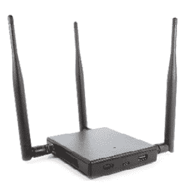
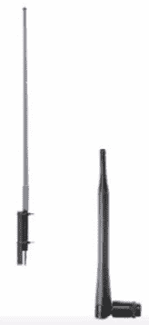
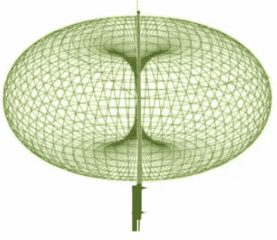
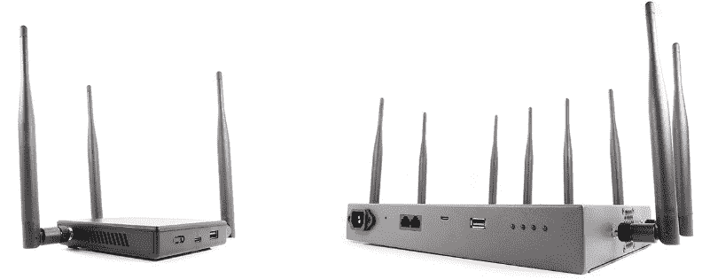
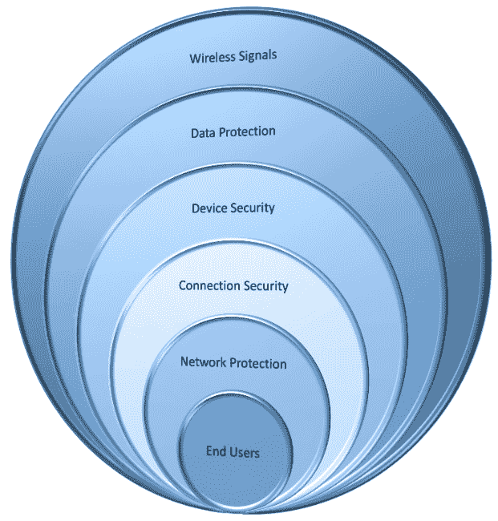

# 第十一章：黑客无线网络

这是我热衷的话题，我在这方面有着丰富的背景和经验。在 2001 年，就在 911 事件之后，我失业了。我住在犹他州北部的一个农村社区，我们没有高速互联网服务。我看到了一个需求，于是决定自己开办 ISP 服务。

我租用了可以在几英里外就能看到的市政水塔上的空间。由于没有经济实惠的高速互联网，我决定提供这项服务。因此，我在我的车库里放了两根 T1 线，并将我的车库从标准车库改建成了一个办公室和服务器间的环境。我在屋顶上放了一个天线，指向水塔，然后在水塔顶部放了一组天线和**接入点**（**APs**）。

公司增长得非常快；它是山西地区增长最快的 ISP 服务之一。我们将其发展到了 600 个客户；我们变得如此忙碌，以至于我们不得不扩展我们的服务，并且我们不得不找到另一个基站。

无线网络的关键在于视线通畅对于信号强度至关重要。很多客户无法接入互联网是因为他们没有视线通畅。在锡拉丘兹的水塔案例中，我们安装了几个不同的基于扇形的天线。随着公司的发展，我们添加了大量这样的天线，包括一个全向天线（我们将讨论为什么全向天线在技术上不如基于扇形的天线强大）。随着公司的发展，我们添加了第二座塔，并安装了基于扇形的天线。我们能够覆盖这个快速增长区域内的 18 到 20 英里的住宅区。

在发展这家公司之后，我将其出售，因为我看到了迹象；我们最终得到了康卡斯特，当时是 Qwest，但我认为现在是世纪 Link。他们做得很好，因为我们有这些新的分区涌现，商业 ISP 无法快速进入那里。

著名黑客凯文·米特尼克说，*由于无线网络，新的安全漏洞不断出现。黑客和系统管理员之间的猫鼠游戏仍在如火如荼地进行着*。就在你认为重新接入无线网络是安全的时候，又出现了另一个问题。希望当你阅读完这一章时，你会感到更有准备来应对不断增长的无线环境。

在本章中，我们将涵盖以下主题：

+   无线网络及其类型

+   正确的加密可以帮助

+   大量的攻击向量

+   无线黑客的方法论

+   黑客蓝牙

+   对策

让我们开始讨论对无线世界的洞察。

# 无线网络及其类型

无线环境不断发展。因此，让我们从定义一些你需要了解的关键术语开始。你可能之前听过其中一些术语，但让我们回顾一些术语以及缩写代表的含义。

## 频率跳跃扩频

**频率跳变扩频**（**FHSS**）是由海迪·拉玛尔（Hedy Lamarr）发明的。她不仅是一位著名的银幕女演员，而且非常聪明。事实上，她还是一位发明家。看她的纪录片有点有趣。她是如此美丽，以至于很多男人——你必须考虑当时的时代——并没有认真对待她的一些发明。

FHSS 是通过在传输和接收之间的不规则间隔操纵无线电频率而实现的，因此称为*跳跃*。

她的发明也形成了一种无法破解的代码，因为它在跳跃，所以没有人能窃听，这意味着机密信息可以传输而不被拦截。通常，FHSS 在 900 MHz 至 2.4 GHz 范围内运行。

FHSS 的一个变体被称为**自适应频率跳变**（**AFH**），也被称为**蓝牙**。

任何一种扩频技术，如果有很多设备在完全相同的信道上通信，那就等于信号的降级。所以，海迪·拉玛尔所做的就是创造这项技术，允许信道或传输在不同信道之间跳跃。你可以通过跳跃序列来实现这一点。

任何人要拦截这种流量都是极其困难的。事实上，通过查看这些信息或者通过频率跳变环境和频谱分析仪，它看起来就像干扰。显然，接收和发送天线必须在相同的跳数上，这样它们就知道它们正在跳转到哪个信道和下一个数据包传输。

FHSS 的问题在于其速度限制。它限制在 3 MB。我知道你在想… *那很慢！* 嗯，我知道，但在我那个年代，我们提供高达 512 KB 的高速互联网，人们认为那是飞快的。他们每月付我 69 美元。那太棒了。我的最慢速度大约是 128 KB，我收费 19.99 美元。

## 直接序列扩频

**直接序列扩频**（**DSSS**）可能是最流行的一种。它具有相同的信道和相同的频率，但你必须选择发送和接收天线将在哪个信道上，它们会留在那里，这显然使得拦截流量变得更容易。

由于信道相互叠加，也可能会造成干扰。你也可能会受到其他无线设备的干扰，比如无绳电话、微波炉，甚至荧光灯，因为它们都会造成干扰。

有了这些信道，人们会问我如何选择一个不会干扰其他信道的信道？信不信由你，其实有三个甜蜜点。信道 1 不会干扰信道 6，6 和 11 之间也是一样的。有一个分隔。有些人可能会认为，*嗯，5 也可以，因为 5 不一定会干扰 1*。嗯，从技术上讲，在频谱分析仪上，这不是一个干净的分隔。

## 基本服务集标识符

**基本服务集标识符**（**BSSID**）由将其与**基本服务集**（**BSS**）关联的接入点的 MAC 地址组成。这经常与**服务集标识符**（**SSID**）混淆。通常，用户不知道自己属于哪个 BSS。当用户移动设备时，设备使用的 BSS 可能会发生变化，因为接入点覆盖范围的变化，但这种变化可能不会影响无线设备的连接。

现在，正如我之前提到的，BSSID 涉及该设备的 MAC 地址。发生的情况是 BSS 地址递增，然后广播并用于空中通信。如果你有一个在多个频带上广播的无线网络，比如**g**，**n**，**ac**或**ax**，它会一次又一次地递增，以便用于每个频段。

即使你连接到由多个 AP 支持的相同 SSID，设备也需要知道将其数据包返回到哪个 AP。

如果你使用某种类型的数据包捕获工具，你应该能够看到在空中漂浮的无线 MAC 地址，这应该引起你作为无线网络问题的*黑客感觉*。你还可以看到 BSSIDs 中广播的 APs。这可能是你真正需要知道的信息更多了；这只是我脑海中漂浮的信息。

## SSID

这是大家在谈论无线时都熟悉的内容，对吧？这是网络名称；它可以长达 32 个字符，并附加到每个发送到空中的无线数据包上。这就是你可以有多个 AP 向不同系统传输数据，但与正常网络环境一样，只会丢弃。如果数据包不是发往该网络的，它就会被丢弃——这是相同的概念，我们只是使用这个 SSID，因为在空中，还有其他信息漂浮，或者可能不是信息，只是干扰。

## 全球移动通信系统

**全球移动通信系统**（**GSM**）是一种用于移动通信的开放数字蜂窝技术。它使用四种不同的频带：850 MHz，900 MHz，1,800 MHz 和 1,900 MHz。

## 热点

这些是提供公共使用的无线网络的地方。热点指的是具有 Wi-Fi 可用性的区域，用户可以在其设备上启用 Wi-Fi 并连接到互联网。

## 关联

这仅仅是指将无线设备连接到接入点的过程。

## MIMO-OFDM

这种方法影响了 4G 和 5G 无线通信服务的频谱效率。使用 MIMO-OFDM 减少了干扰，提高了信道的可靠性。

## Wi-Fi 的缺点

让我们从负面方面开始，因为对于我们作为无线安全专家来说，这些是最重要的关注点。从安全的角度来看，以下是我们在 Wi-Fi 方面最关注的问题：

+   **升级**：一个明显的缺点是，升级。当他们推出更快的速度时，我们像疯了一样升级设备，不仅是接入点（AP）级别，还包括设备本身。然后，我们必须担心它们是否向后兼容，当然，向后兼容总是意味着我们涉及到安全风险。

+   **干扰**：这里的干扰并不是来自其他接入点（AP），虽然那也是一个问题，而是来自其他与无线网络无关的设备。电气设备可能会造成干扰（例如，荧光灯、桌面风扇和微波炉）。蓝牙设备也可能干扰，无绳电话和任何其他类型的无线设备，也包括任何与无线设备工作在相同信号级别的设备。

+   **公共访问**：公共访问不是一种优势吗？嗯，他们想让它看起来像是这样，因为我可以去麦当劳然后连接到 Wi-Fi。事实上，前几天我去本地的沃尔玛时，他们在前门上贴了一个标签，上面写着 *我们店内提供免费 Wi-Fi*。大多数人觉得这是个好主意，但在我心里，我在想，*这可不好！*

你可能以前听过这个，但我再说一遍。请为自己考虑一下：如果你看到一个标着 *免费 Wi-Fi* 的接入点，千万不要连接！大多数时候，那些都是恶意接入点（*图 11.1*），或者攻击者试图让你连接到他们的 AP。一旦你连接，攻击者就会成为中间人，进而攻击你。真是他们好心给你提供免费的 Wi-Fi，结果换来的却是你的银行账户信息。

图 11.1 – 来自 Hak5 的 Wi-Fi 菠萝，一个恶意 AP

好吧，现在我可能让你失望了，你可能不想再使用 Wi-Fi 了，让我们来看看其中的光明面。

## Wi-Fi 的优势

这是 Wi-Fi 提供的一些优势列表：

+   **安装**：最大的优势之一就是安装。只需要在这里放一个盒子，我就能在任何想去的地方获得接入；我不再依赖墙壁中穿过的以太网电缆，或者需要为想要移动办公桌的人重新布线。或者，如果我购买下一栋楼来扩展我们的业务，我不必担心要布设跨楼的电缆。

+   **易于连接**：几乎每个人都知道如何连接 Wi-Fi 接入点或网络，但如果你给某人一个压接工具和一些电缆，然后看看他们脸上的困惑表情就知道了。增加设备非常容易。

+   **移动性**：能够四处移动是我最喜欢的优势之一。正如我之前所说，通过安装，我不必担心想要从一个房间移动到另一个房间，尤其是在家里。如果我想去后院放松一下，我可以带着笔记本电脑，坐在哪里都行，而且仍然保持连接。

## Wi-Fi 网络类型

Wi-Fi 的类型？难道它不都是无线的吗？其实并非如此。事实上，现在我们将使用一些术语，因为今天我们通常会提到像 AP 这样的术语。以下是不同类型的 Wi-Fi：

+   **网络扩展**：第一种 Wi-Fi 类型是网络扩展。最初的意思是*APs*，我特别强调这一点，因为每当我们提到 APs 时，往往会想到小型的思科、Linksys 或者 D-Link 等产品。我们通常认为这些设备不仅仅是 AP，还兼具交换机和路由器的功能。然而，你也可以购买一种 AP，专为无线设备提供桥接服务，使其能够访问有线网络。

+   **局域网网络**：另一种类型是设计用于相互通信的扩展网络。我们称之为 LAN 到 LAN 网络，通常可以看到这种连接方式用于不同建筑物之间。

+   **多接入点网络**：在这种网络中，我们有多个 AP 代表同一个 BSSID。因此，无论你在建筑物内或环境中走到哪里，你的流量都会被引导回同一网络。为了适当地部署这些 AP，确保它们在覆盖范围内互相重叠是非常重要的。这样，用户就可以在两个连接之间自由移动或漫游，始终保持连接。

+   **蜂窝接入网络**：在这种网络中，我们使用蜂窝服务提供互联网接入。我们的手机变成了蜂窝热点，并完全充当 AP，使得我们在机场或外出时，只需开启手机上的热点功能，就可以连接笔记本电脑、平板电脑或其他设备。

## 不同的 Wi-Fi 技术

一切都始于 802.11 系列，正如这里所解释的：

+   **802.11**（**Wi-Fi**）：这个标准适用于 WLAN，使用 FHSS 或 DSSS 作为频率跳变技术。它是为 2.4 GHz ISM 频段开发的，支持 1 Mbps 到 2 Mbps 的速度。与现在的速度相比，下载文件将需要更长时间，并且在进行团体视频通话、在线游戏和流媒体播放时会遇到挑战。

+   **802.11a**：这是第一个使用 5 GHz 频段的标准，支持更快的速度（最高 54 Mbps），但由于范围受限，实际应用受到一定限制。这也是首次使用 OFDM 技术。我们通常在商业领域看到这种技术，因为这些设备并不便宜。

+   **802.11b**：该标准只在 2.4 GHz 频段使用 DSSS，最高支持 11 Mbps 的速度。它在穿透障碍物方面表现较好，能提供更广的覆盖范围，但其缺点是会受到微波炉、无线电话和蓝牙设备等其他设备的干扰。

+   **802.11g**：开发者结合了 802.11a 和 802.11b 的最佳特性，创建了 802.11g 标准。它支持最高 54 Mbps 的网络带宽，并在 2.4 GHz 频段下工作。使用该标准的设备只能利用其操作的标准，这意味着一台连接到 802.11g AP 的 802.11b 计算机只能按照*b*标准的速度运行。反过来，连接到*b* AP 的*g*设备只能以 AP 提供的速度运行。

+   **802.11n**：Wireless-N 于 2009 年开发，旨在提高速度和可靠性，并扩展无线传输的范围。它是第一个使用**多输入多输出**（**MIMO**）技术的标准。MIMO 产品使用一系列天线从一个设备同时接收更多数据，从而实现更快的数据传输速度。此外，它是第一个允许使用两种无线频率——2.4 GHz 和 5 GHz 的标准。两种频率的使用使得 802.11n 标准与 802.11a/b/g 设备兼容。凭借所有改进的功能，802.11n 支持最高 600 Mbps 的带宽速度，并且在室内的理论覆盖范围为 230 英尺，这是对之前标准的巨大升级。

+   **802.11ac**：Wi-Fi 的第五代技术旨在减少 2.4 GHz 频段的干扰，它被开发为在 5 GHz 频段下工作。这些设备大多被宣传为**双频段**，但实际上，厂商将 Wireless-N 技术结合进来，使 ac 产品与 2.4 GHz 频段兼容。它还是第一个使用**下行多用户 MIMO**（**DL MU-MIMO**）的技术。它将 Wireless-N MIMO 技术向前推进了一步，进一步提高了数据传输速度。DL MU-MIMO 允许无线路由器同时向多个设备传输信息，提高带宽速度并减少延迟。借助 Wireless-N 技术，802.11ac 与 802.11a/b/g/n 兼容。

+   **802.11ax**（**Wi-Fi 6**）：新一代技术。它旨在提供更快的速度，支持更多设备同时连接，减少延迟，提高安全性，并增加带宽。为此，它包含了如 OFDM、MU-MIMO 和 1024-QAM 等技术。凭借所有的改进，它的理论最大速度为 14 Gbps。此外，它在 2.4 GHz 和 5 GHz 频段上运行，这一点自 802.11n 以来再未出现过。这使得它与 802.11a/b/g/n/ac 兼容。在 2021 年，Wi-Fi 6 将有一个子类别，称为**Wi-Fi 6E**（**Wi-Fi 6 扩展版**）。FCC 已将 6 GHz 频段开放，这得益于 Facebook 和 Google 推动开放另一个供公众使用的频段。Wi-Fi 6E 设备将能够在 2.4 GHz、5 GHz 和 6 GHz 频段上运行。因此，兼容的 Wi-Fi 设备将受益于更少的频段拥堵。

还有其他 802.11 技术存在，但这些是你应该关注的。

## Wi-Fi 认证模式

这与我们将要使用的加密类型无关。当 IEEE 发布 802.11 标准时，他们定义了无线设备可以用来认证**无线接入点**（**WAP**）的两种不同方法，认证将在实际网络通信之前进行：

+   **开放系统认证**（**OSA**）：为了使 OSA 工作，计算机的 SSID 应与 WAP 的 SSID 匹配。首先，计算机或设备发送探测请求，查看是否有一个 AP 提供该 SSID。AP 随后会用探测响应来回应。接下来，系统、计算机或设备发送认证请求。AP 生成一个认证码，通常是随机的，并在开放系统认证响应中将其发回。此时，设备接受该认证码并发送关联请求。然后，AP 用关联响应回应，系统便成为网络的一部分，只要会话继续且计算机保持在原始 AP 的范围内。

+   **共享密钥**：为了连接，计算机会向 AP 发送认证请求。AP 生成一个字符序列，称为**挑战文本**。计算机然后使用其**有线等效隐私**（**WEP**）密钥对挑战文本进行加密并将消息发送回 AP。AP 随后解密消息并与原始挑战文本的结果进行比较。如果没有差异，AP 会发送认证码。只要会话保持开放或设备保持在原始 AP 的范围内，计算机或设备就可以接入网络。共享密钥可能对你来说很熟悉，因为它主要用于 WEP。

那么，猜猜看？现在是时候玩玩无线威胁了，最重要的问题是，*哪种认证过程最不安全？*是 OSA 还是共享密钥？如果你选择了 OSA，你就错了。共享密钥是最不安全的机制。原因在于，共享密钥是共享的，它是被传输的。

即使 OSA 听起来较差，我们仍将使用其他类型的机制来保障网络安全。

## 粉笔标记 - 用于识别 Wi-Fi 网络的方法

以下是一些识别 Wi-Fi 网络的不同方法。为了发现它们，我们可以使用以下方法之一：

+   **战步**：这是指我们携带移动设备，在建筑物周围走动，设备会自动拾取 AP 并记录信息。

+   **飞行搜索**：这是一个相对较新的概念，随着无人机的出现，它将变得更加流行。然而，在我年轻时，人们用模型火箭，比如孩子们发射并观察它飞起来的那种。某些孩子将 WAP 附加到其中一个火箭上，并将其发射。他们拾取了大约 15 英里的 WAP 范围，直到火箭升空并重新降落。

+   **汽车搜索**：顾名思义，汽车搜索是指在移动车辆中寻找无线网络。

所以，当我们识别了这些网络后，我们要确保能够分享这些信息。这就是**战斗绘图**发挥作用的地方。再次强调，这可能是一个有点过时的技术或概念，因为在数字时代我们所做的事情；现在大多数东西都在线上。但它起源于 2002 年，由一位名叫马特·琼斯的绅士发起，受到了大萧条和流浪者社区的启发。

流浪者旅行时，他们通过留下代表不同事物的不同标记来进行交流，这样其他流浪者就会知道。例如，可以在某处睡觉没问题，有医生会帮助他们，或者附近有警察会留意。他们会用粉笔或煤炭在兄弟会上做这些标记。好吧，猜猜？今天仍在使用，但是用于 Wi-Fi 网络；我们使用不同的符号来识别它们。

让我们首先展示一下开放和关闭节点符号是什么样的。

我打赌你猜不出哪个是哪个（*图 11.2*）：

图 11.2 - 开放和关闭节点

开放意味着通常是免费的，而关闭意味着它在某种程度上被锁定。

如果它被锁定，我们需要确定使用的加密方式。所以，要么是 WEP 加密，要么是付费服务。我们通常在节点标识的底部列出速度，并且我们通常会在节点的表示上方看到 SSID。如果碰巧他们正在进行任何类型的过滤，我们也会使用这个符号来识别，在这种情况下，这是一个 MAC 过滤节点。

有趣的是，每当我教授这个概念时，人们都会说，*戴尔，我从未在周围看到这些符号*。问题在于你从未留意过它们。

让我给你看看。那么，这里有什么？你有一个从 1 到 5 Mb 的开放节点，其 SSID 是 KYNANCE（*图 11.3*）：

图 11.3 - 开放节点

现在，下次你遇到一些孩子（尤其是我的孙子女）拿着笔记本电脑或平板电脑时，你可能需要小心或留意他们在画什么（*图 11.4*）：

图 11.4 - 拿着平板电脑的孩子们

## 天线类型

你可能只熟悉其中一两个，所以，我想确保你理解它们。这太神奇了！当你学习无线技术后，你会开始在驾驶时四处张望，你会开始看到以前从未意识到的天线，它们会出现在最奇怪的地方。

你想要实现的目标将决定你想要使用的天线类型。

### 全向天线

全向天线是传统的天线；大家都知道它。你见过这些天线的样子（*图 11.5*）。左边的是我们安装在桅杆顶端的商用 AP，而右边的是我们通常在 AP 背面看到的厚重天线。

图 11.5 – 全向天线

全向天线意味着信号会在 360 度范围内传播，并且默认情况下是水平广播的，这意味着我们的波束宽度从天线开始并朝水平方向传播（*图 11.6*）：

图 11.6 – 全向天线 360°

我们知道信号是以 360 度的模式发射的。不过，如果我把那根天线用某种高度反射的材料包裹住，那么这就是我们得到的基于扇区的天线。大多数情况下，这种材料只是薄金属板。金属板接收到信号后，将其反射并推动已经朝另一个方向传播的信号，从而放大信号（*图 11.7*）。当你仔细思考时，这其实是一个很酷的概念——如此简单却如此有效。

图 11.7 – 薄金属板放大

### 抛物线网格天线

这就是抛物线网格天线的样子（*图 11.8*）：

图 11.8 – 抛物线天线

你可能已经经常见到这些天线了。天线的发射元素位于中心，而网格部分则既在推送也在接收，几乎就像一个大型卫星天线接收信号并将其聚焦回中心臂一样。

这些天线比全向天线更强大，通常用于远距离传输，比如 10 英里或更远的距离。

### Yagi 天线

这就是 Yagi 天线的样子（*图 11.9*）：

图 11.9 – Yagi 天线（由 Tennen-Gas – 自创作品，CC BY-SA 3.0）

这种天线用于极为集中的连接。使用抛物线天线时，你可以在几度范围内接收到信号，但使用 Yagi 天线时，必须完全对准信号方向。再次强调，这种天线适用于远距离的情况。

既然我们对无线信号有了更深入的了解，接下来我们来讨论如何更安全地加密这些信号。

# 正确的加密可以提供帮助

既然我们已经部署了无线环境，接下来如何确保系统仍然安全呢？嗯，一旦我们识别出自己的弱点，我们就拥有了力量，正是这个时候，我们变得危险了。因为这句话是真的——知己知彼，百战百胜。了解自己的弱点有助于增强自己的实力。

## WEP 加密

信不信由你，WEP 加密依然被大量使用。但我们不必装作什么都没发生，**WEP** 代表的是 **有线等效隐私**，但它并不符合这一标准。那是最初的目标，接下来我们会讨论为什么他们在实现或批准这项技术时没有达到这个目标。

它的设计目的是保护我们免受数字窃听，并确保我们的数据受到保护。

它还在这里帮助确保我们防止任何未经授权的人通过 Wi-Fi 连接到网络。

为了防止未经授权的访问和窃听，它使用一个密钥。这个密钥成为了问题，因为它在传输之前用来加密数据包。然而，这个密钥是共享的，这让我们感到非常头痛。

那么，发生了什么呢？首先，当他们提出 WEP 时，这项技术没有经过任何学术界或任何形式的公众评审，也没有任何密码学家能够审查这项技术。在那个时代，他们非常急于找到某种加密方法，结果就像是人们随便将东西凑在一起希望它能奏效。正如我刚才提到的，它最大的缺点之一就是预共享密钥的问题。

它不够强大的原因之一是因为当时美国对各种加密技术的出口有着限制。这导致制造商只能将设备限制为 64 位加密，但 WEP 仅使用了 40 位密钥。当这些限制被解除后，加密级别提高到 128 位，但 WEP 最终仍然只使用了 104 位密钥大小。而即便他们推出了 256 位 WEP 加密，其使用的密钥大小仍然只有 232 位，128 位仍然是今天最常见的实现方式。

另一个问题是 WEP 使用了 RC4 算法进行加密。问题在于，RC4 是为加密随机密钥设计的，但 WEP 根本不是随机的。你只需创建一个共享密钥，它对每个人都是一样的。结果是，如果足够多的流量被拦截，WEP 就可以被破解。

我并不是说 WEP 完全没用；我宁愿使用 WEP，也不愿什么都不使用。但请，如果你在任何地方使用它，最好把它关掉。或者，如果你不打算关掉，告诉我你 AP 的地址。我想去拜访你！

## Wi-Fi 保护接入

**Wi-Fi 保护接入**（**WPA**）就像是 WEP 的升级版，穿上了它的大裤子。嗯，它比我们在 WEP 中经历的保护要好。它在 2003 年正式采用，这大约是在 WEP 被正式淘汰前的一年。所以，它是为了修补我们在 WEP 中遇到的问题而设计的。

最常见的 WPA 配置是使用 WPA **预共享密钥**（**PSK**）。这些密钥是 256 位的，比我们在 WEP 中看到的 64 位和 128 位密钥要强得多。

实现 WPA 的最大变化之一是引入了**消息完整性检查**（**MIC**）。用非技术性语言来说，就是能够检查攻击者是否在数据包从接入点传输到客户端的过程中捕获或篡改了数据包。

我们通过**临时密钥完整性协议**（**TKIP**）来实现这一点。什么是 TKIP 呢？在 TKIP 中，客户端首先使用一个 128 位的临时密钥，然后将其与客户端的 MAC 地址结合起来。创建完 TKIP 后，它会包裹住 WEP，因为 WPA 的本质就是修复 WEP，然后为每个无线帧创建独特的加密密钥，从而形成更安全的网络连接。

然而，尽管 WPA 比 WEP 有所改进，WEP 的幽灵仍然困扰着 WPA。WPA 的一个好处是在当时并不需要你购买新硬件，它只是网络设备上的一个固件升级。但它也有一个缺点：由于必须重新利用 WEP 中的某些元素，结果导致了漏洞。事实上，今天 WPA 本身并不被认为是安全的，就像 WEP 一样。

## WPA2

然后，我们的大哥 WPA2 出现了，它为我们提供了更强的保护。

WPA 有两种不同的类型。

### WPA 个人版

WPA 的第一种类型被称为 WPA 个人版。它使用 PSK，即一个 256 位的加密密钥，且加密基于 8 到 63 个 ASCII 字符。

你可能之前设置过一个接入点，创建了一个无线网络的密码或密码短语。其实正是这些字符用于帮助生成 256 位密钥。

如果你认为使用 WPA2 就很安全，那就再想想吧，因为 WPA2 中存在一些与 WPA 相同的漏洞，这些漏洞曾是 WPA 的致命弱点。

如果你在 Wi-Fi 路由器上使用的是**Wi-Fi 保护设置**（**WPS**），那就是那个小按钮。你只需按下这个按钮，设备就会自动连接。WPS 是写入固件中的，它不会改变或轮换，是一个固定的代码。

我仍然可以通过暴力破解攻击尝试突破你的 WPA2 网络，这可能需要几小时到几天，甚至可能一周。然而，如果我攻击你的 WPS，这个漏洞可以通过名为 Reaver 的软件进行破解。根据我的系统，破解可能需要 2 到 14 小时。所以，如果可以的话，尽量禁用 WPS。

### WPA2-企业版

这种 WPA2 的*变种*被称为 WPA2-企业版。WPA2-企业版解决了关于静态密码短语分发和管理的问题。它通过与某种认证服务结合，在每个账户的基础上控制访问权限。通常这些服务由**可扩展认证协议**（**EAP**）或**远程认证拨号用户服务**（**RADIUS**）来处理。

该模式需要诸如用户名、证书和可能的一次性密码等凭证。认证过程发生在站点与这个集中式认证服务器之间。

AP 或无线控制器仅监视连接并将认证数据包发送到认证服务器。通常，这将是一个 RADIUS 服务器。

所有这些都基于企业环境，使用**高级加密标准** (**AES**)与**密码分组链接消息认证协议** (**CCMP**)，与**Rivest 加密算法 4** (**RC4**)相比，AES 的加密强度极高。

## WPA3

让我们看看在最新的 WPA 版本中所做的进展。WPA3 具备了支持各种部署规模所必需的能力，从大型企业网络环境到简单的家庭网络。

它使用诸如 AES 和 TKIP 等加密算法，以确保加密一致性，并通过使用**受保护的管理帧** (**PMF**)来增强网络弹性，从而提供强有力的防御，抵御窃听和伪造攻击。它拒绝使用过时的旧版协议。这些都是非常酷的功能——也该是时候采用这些技术了。

### 它与 WPA2 的关系

首先，WPA3 的加密/认证安全协议更强大，并在 WPA2 的安全协议基础上进行了改进。在这个新版本中，出现了一些先进的功能，简化了 Wi-Fi 安全性。它更强大的原因之一是可以实现分层的安全策略，保护 Wi-Fi 网络的各个方面。WPA2 无法通过离线字典攻击保护用户的密码，如果攻击者有足够的时间和计算能力，仍然可以破解密码。攻击者必须通过暴力破解法检查所有可能的密码组合才能获取密码。而在 WPA3 中，密码通过改进的密钥握手协议进行加密。Dragonfly 握手/**汽车工程师学会** (**SAE**)协议是 WPA3 认证的强制要求，这降低了字典攻击的风险。

需要注意的是，新的认证过程要求设备与路由器保持较近的物理距离，这意味着如果邻居不在你家附近，他们是无法破解你的无线网络的。

和 WPA2 一样，WPA3 也有两种操作模式（个人模式和企业模式）。如果你的设备不支持 WPA3，网络将保持在 WPA2 模式。

## 弱初始化向量

那么，如果信息已经加密，我们如何破译这种加密呢？这将取决于你使用的加密类型。对于 WEP 来说，最大的一个问题是存在脆弱的**初始化向量** (**IVs**)。

首先，WEP 使用 RC4 加密算法。虽然 RC4 本身并不弱，但问题在于 WEP 如何使用 RC4。WEP 使用**密钥调度算法** (**KSA**)来生成初始化向量（IV），并将其添加到基础密钥中。

不幸的是，前几位是明文的，因此很容易预测 IV 会是什么。因此，如果我拦截到足够多的 WEP 流量，我就能弄清楚你的密钥是什么。

另一个问题是 IV 并不明确。它们会在你的设备上重复使用。所以，如果我得到一个密钥，我就得到了一切。这就像*一枚戒指统治一切*。

IV 的另一个弱点是 IV 本身被附加在安全密钥的开头，这使得它容易受到**Fluher、Mantin 和 Shamir**（**FMS**）攻击。它利用 RC4 密钥调度算法的弱点重建消息，以确定密钥是什么，我们可以使用简单的脚本来做到这一点。非常简单。实际上，许多我们用于破解无线网络的工具，如 Aircrack-ng 和 AirSnort，都可以利用这种类型的弱点。

IV 的另一个弱点是无法检测消息是否被篡改。可能会有其他方法，比如检查值，来查看消息的完整性，但这些方法也有自己的缺点。

最关键的弱点之一可能就是使用短 IV。基本上，在几个小时的流量内——我可以通过模拟流量来加速这个时间框架——相同的 IV 会重复出现。而且，我可以使用嗅探工具看到这些重复，捕获使用相同密钥加密的数据包，然后使用像 Aircrack-ng 或 WEPCrack 这样的工具来解密弱 IV，这将给我基础密钥。再说一遍，基础密钥是所有人的基础密钥。所以，知道这些 IV 的存在后，破解 WEP 变得非常简单。

现在，因为 WPA 基本上是 WEP 的“成人版”，这确实让它稍微困难一些，但如果我能够捕获足够的数据包，我仍然可以进行暴力破解攻击。

对于离线攻击，同样适用这个方法。为了实现这一点，我们必须靠近 AP——只需几秒钟——以捕获 WPA 和 WPA2 认证握手。通过捕获足够数量的数据包，我们就可以尝试离线破解。

攻击者最大的优势是时间。作为攻击者，我不必一直待在你的网络上。

如果你想让它变得更棘手，我们可以进行一种称为去认证攻击的操作。通过这个攻击，我会找到一个活动客户端并强制它离开或断开与 AP 的连接。然后，我会使用一些工具捕获认证数据包，当客户端尝试重新连接 AP 时，这通常会在被断开后的几秒钟内发生。该认证数据包包含**成对主密钥**（**PMK**），我可以通过暴力破解或字典攻击来恢复 WPA 密钥。就像 WEP 一样，我们可以暴力破解 WPA 密钥。

我们用来进行这一过程的一些工具包括 Aircrack-ng、KisMAC 和 Reaver，它们可以获取 WPS。

## 安全措施

好吧，听起来我们现在应该完全不使用 Wi-Fi 了。其实不是的，我并不是这个意思，因为我们可以采取一些措施来防止无线网络被破解。

再次强调，没有什么是完全安全的，但了解自己的风险有助于让你更强大或更安全。那么，让我们讨论一下如何通过实施一些非常基本的措施来增强你的安全性。大多数人往往会忽视这些措施，但它们能帮助你保护无线网络。

如果你把 WPA 的**密码短语**设置得很复杂，那么它也应该足够长。选择一个包含 20 个字符的密码短语，最好更长。不要使用可以在词典中找到的真实单词。

最后，查看客户端设置。只使用带有 AES 的 WPA2，并且只使用**密码块链**（**CCM**）加密。此外，当涉及到客户端设置的验证服务器时，确保使用特定的服务器地址。

接下来，让我们讨论无线技术带来的威胁。

# 众多攻击途径

无线技术是一个很棒的技术。那么，我们如何评估我们将网络暴露于威胁或潜在威胁的可能性呢？

让我们看一些你可能成为受害者的完整性攻击。它们可以总结为几种不同的类型。

## 访问控制攻击

这些类型的攻击旨在让攻击者在你的无线安全解决方案无法检测或完全绕过它们的情况下，访问你的网络：

+   **Wardriving** – 这基本上是开车四处寻找并使用设备搜索网络信号；这些信号是空中传输的小数据包，帮助你的授权设备知道它们处于 SSID 的覆盖范围内。我个人使用 PassMark 的 WirelessMon，但其他工具包括 Kismet、inSSIDer 和经典的 NetStumbler。

+   **流氓 AP** – 我们稍后会详细讲解这个问题，但目前我们先将其描述为黑客带入你环境中的未授权 AP。

+   **MAC 欺骗** – MAC 欺骗发生在攻击者扫描网络寻找合法的 MAC 地址，然后试图访问并控制这些设备。

+   **AP 配置错误** – 是的，就是配置不正确的 AP，可能是由于缺乏知识或未能正确配置某些设置，例如使用默认设置。

+   **临时连接** – 这再次是攻击者通过直接连接到你的设备而不使用 AP 的方式，然后借助你的连接进入网络，这有点像一种 NAT 连接。

+   **混杂模式客户端** – 攻击者利用你的设备会连接到最强信号这一事实，而这个信号可能是他们的伪 AP，然后将你的请求转发给真实的 AP；这就像一种恶意双胞胎攻击。

+   **客户端配置错误** – 记得我们刚才讨论过的 AP 配置错误吗？这里的概念相同，不过是发生在客户端设备上。

+   **未授权连接** – 这些是未授权的客户端，它们连接到你的 AP。如果安全性较弱，攻击者可以通过 AP 访问你的网络。

## 完整性攻击

让我们来看看一些你可能成为受害者的完整性攻击。它们可以归纳为几个不同的类别：

+   **数据帧注入** – 这是指我们构建并在网络上发送伪造的无线数据帧。

+   **WEP 注入** – 如果你有接触过无线网络，你可能知道这是什么。基本上，我们构建并分发伪造的 WEP 加密密钥。

+   **位翻转攻击** – 这是攻击者在无线网络上嗅探一个数据帧。攻击者传输修改过的数据帧，接入点（AP）接受该修改帧，但当目标接收方解封装数据帧时，校验和失败，接收方会生成一个可预测的**互联网控制消息协议**（**ICMP**）错误。攻击者只需嗅探网络 LAN，寻找加密错误，并在接收到错误消息后，攻击者可以推导出密钥流，这与我们在 IV 重放攻击中所做的相同。

+   **数据重放** – 这是指我们简单地捕获数据帧，并稍后重放这些帧。

+   **RADIUS 重放** – 这是指我们捕获 AP 和认证服务器之间的通信信道。记得我们提到过 RADIUS 服务器吗？我们可以稍后重放该交互，看看是否能够获取访问权限。

+   **无线网络病毒** – 信不信由你，这些是无线网络病毒。它们不是针对计算机和节点的病毒，而是针对接入点（AP）。其中最流行的病毒之一叫做 Chameleon。当它攻击一个 AP 时，并不会影响其工作方式。相反，它能够收集并报告所有连接到该 AP 的 Wi-Fi 用户的凭证，而且它可以传播到你无线网络外的其他 AP。所以，是的，你邻居的 AP 可能会感染你的 AP。

## 保密性攻击

这些攻击旨在拦截敏感数据。我告诉过你，这会变得很可怕！这些攻击包括以下几种：

+   **窃听** – 这是指我们捕获并查看网络流量，看看是否能获取到任何潜在的敏感信息。

+   **流量分析** – 这可以告诉我们网络基础设施的很多信息。

+   **破解 WEP** – 这是一种保密性攻击。通过捕获数据，我们可以尝试使用暴力破解或 FMS 密码分析来恢复 WEP 密钥。

+   **邪恶双胞胎接入点（AP）** – 这可能是最臭名昭著的攻击方式。在这种情况下，你基本上伪装成一个授权接入点，使用相同的 SSID，希望用户错误地连接到你的 AP。

+   **蜜罐接入点（AP）** – 这只是将一个接入点的 SSID 设置为与合法 AP 相同。

+   **会话劫持** – 这与我们在有线网络中看到的类似，但它是通过操控网络，使攻击者的主机看起来像是目标主机。

+   **伪装** – 这是我们在办公室里穿着戏服跑来跑去吗？不是，这意味着你假装成一个授权用户，进而获得对系统的访问权限。

+   **中间人攻击** – 这本质上是网络攻击，不过我们使用的是无线而非有线。如果你不熟悉中间人攻击的概念，建议查阅嗅探相关章节。

## 可用性攻击

这些攻击包括以下几种：

+   **AP 盗用** – 没错，这将阻止你和你的用户访问网络。

+   **去关联攻击** – 这也是一种可用性攻击，基本上我们摧毁客户端与 AP 之间的连接，使 AP 完全不可用。

+   **EAP 失败** – 在这种情况下，我们会查看有效的 802.1x EAP 交换，然后向客户端发送伪造的 EAP 失败消息。再次强调，它们会断开连接。

+   **信标泛洪** – 在这种攻击中，为了剥夺 AP 的可用性，攻击者生成数百或数千个伪造的 802.11 信标并将它们分发到空中，使客户端更难找到合法的 AP。

+   **拒绝服务攻击**（**DoS**）– 如果我从随机 MAC 地址发送伪造的身份验证或关联请求，我将最终导致授权泛洪，你的一天就会非常糟糕！

+   **去认证泛洪** – 这是向客户端而不是 AP 发送伪造的去认证或去关联消息，从而使它们与 AP 断开连接的攻击方式。

+   **路由攻击** – 这是我们破坏路由表，甚至尝试投毒路由并通过 AP 将这些信息传播到整个网络的过程。

+   **身份验证泛洪** – 攻击者向你的 AP 发送大量带有随机 MAC 地址的伪造身份验证包，导致 AP 的关联表填满，类似于 MAC 泛洪。厉害吧？

+   **ARP 投毒** – 这与我们在有线网络中做的事情相同，也是执行中间人攻击的第一步之一。

+   **节能攻击** – AP 会缓存所有进入的数据，直到处于睡眠模式的客户端醒来并请求数据。通过伪造客户端的轮询消息，攻击者可以让 AP 丢弃客户端的包，从而造成类似 DoS 的效果。

+   **TKIP MIC 漏洞** – 这基本上是我们作为攻击者生成大量的 TKIP 数据，超过目标的 MIC 错误阈值。通过超过该阈值，我们关闭 AP。

## 身份验证攻击

身份验证攻击的目标是窃取 Wi-Fi 客户端的身份、个人信息和登录凭据，以便攻击者能够未经授权访问网络资源：

+   **PSK 破解** – 使用像 KisMAC 或 coWPAtty 等工具，我们可以从握手帧中恢复 WPA PSK 数据。

+   **轻量级 EAP**（**LEAP**）**破解** – 攻击者可以使用字典攻击从 LEAP 数据包中恢复用户凭据。

+   **VPN 破解** – 工具如 Anger 或 THC-PPTP bruter 可以通过暴力破解攻击获取用户的凭据或 IPSec **预共享密钥**（**PSK**）。

+   **域登录破解** – 在这里，我们可以使用类似 John the Ripper 的密码破解工具来破解密码并获得访问权限。

+   **密钥重安装攻击** – 攻击者利用 WPA2 的四次握手来获取访问权限。

+   **身份盗窃** – 这是我最喜欢的攻击之一。它是通过捕获用户在明文 802.11x ID 响应包中的身份信息来实施的。

+   **共享密钥猜测** – 还记得 WEP 吗？好吧，使用厂商默认的 WEP 密钥破解 WEP 就是这种攻击的经典例子，或者直接破解 WEP 密钥。

+   **密码假设** – 在这里，攻击者捕获身份信息；他们不断尝试使用 802.1X 认证来猜测用户的密码。

+   **应用程序登录盗窃** – 这是我最喜欢的攻击之一。它是通过捕获用户在明文应用协议中传输的凭据来实施的。我们大多数人使用相同的密码作为应用程序密码和无线网络登录凭据。你没有想到这一点吧？

## 对 AP 的攻击

让我们来看看一些可能的 AP 攻击：

+   **恶意 AP 攻击** – 恶意 AP 仅仅是一个未经管理员批准，但在网络上运行的设备。

有时候，这些恶意 AP 是由想要获得更好信号的员工部署的。但从攻击者的角度来看，他们设置了一个恶意 AP，并将其放置在目标网络附近。当用户打开电脑时，恶意 AP 会向用户的 **无线网络接口控制器**（**WNIC**）提供连接。

如果用户将恶意 AP 误认为合法的 AP 并连接，它将尝试进行身份验证，因此，恶意 AP 会接管整个通信频道。

+   **未授权关联** – 攻击者安装一个软 AP，这是一种通过软件运行的 AP 程序，将笔记本变成一个 AP。现在，如果成功了，其他机器可能会连接到这个 AP，攻击者就能捕获到这些信息。

+   **蜜罐 AP 攻击** – 这是攻击者创建一个具有与一些零售地点相同 SSID 的 AP，因为信号可能更强，因为我就在你旁边，你会连接到我。

+   **AP MAC 欺骗** – 我相信你能猜到这是什么。我们有我们的网络基础设施，有我们的无线系统运行，攻击者只是简单地进入并伪造 AP 的 MAC 地址，试图让某些人连接到他们的 AP。现在，看看什么时候这种情况也会发生？假设你在一个飞行的交通工具上，并且他们恰好提供无线网络服务。大多数这些服务是收费的，合法用户可能会用他们的笔记本电脑登录，而且大多数的访问都是通过 MAC 地址控制的，所以 AP 会说，*哦，是的，我允许这个特定的 MAC 地址连接到网络*。

可能有些人会好奇——我并不是说我做过这种事——但是攻击者可以简单地复制 MAC 地址，从而获得网络访问权限。我知道你已经在想，*我最好检查一下 Dale 是否也在我飞的航班上！*

## 对客户端的攻击

这些攻击很简单，我们先从最基本的开始：

+   **DoS（拒绝服务攻击）** – 在正常情况下，我们的系统是连接到 WAP 的。为了彻底破坏网络基础设施，攻击者可能会发送一个去认证数据包到节点，这基本上就关闭了它的无线连接——不再与 AP（接入点）关联。这是一个简单的攻击。

+   **Ad hoc 攻击** – 很多设备，如笔记本电脑，都内置了 Wi-Fi 和以太网电缆。所以，用户接入后，为了更好的网络通信，会连接到他们的 RJ45 接口。*Ad hoc* 意味着一种一对一的关系，因此攻击者只需接入，创建一个临时连接到你的笔记本电脑，然后可以通过该连接进入网络。所以，超级 Dale 的规则第 583 条是，*如果你通过以太网连接，记得关闭 Wi-Fi*。

+   **干扰** – 交通堵塞？不是。纸张卡住？也不是。喜欢和你最爱的乐队一起干扰？是的，那是我和 Collective Soul 乐队。然而，我们在这里讨论的干扰，是指我们有一个 WAP（无线接入点），并且我们拒绝提供服务。我有时希望自己能在电影院里有个移动干扰器，用来干扰那些在电影放映过程中打电话或发短信的年轻人。是的，你可以在网上购买这样的设备。

干扰是非常流行的，特别是在处理犯罪活动时。这是一种可以干扰多种频率的干扰器，不仅仅是手机，还有 Wi-Fi、蓝牙——一切都能干扰（*图 11.10*）：

图 11.10 – 使用 Wi-Fi Pineapple 作为干扰器

接下来，我们来谈谈无线破解中使用的方法。

# 无线破解方法论

信不信由你，破解无线网络确实有一套方法论。

## 第 1 步：Wi-Fi 探测

这是破解无线网络方法论中的第一步。我们总是像对待标准网络一样看待这个问题——首先需要了解周围环境的情况。如果你还记得，最初的步骤之一是足迹侦察过程。我们所做的就是四处观察。

我喜欢把这个过程称为 *looky-loo*。如果你不熟悉这个词，我给你解释一下。在我的州，恰好有这种情况：如果你开车在高速公路上，看到对面有一场事故，而你又看不清楚具体情况，你会被要求减速，看一看发生了什么情况，结果就是导致对面车道的交通变慢，这让人非常恼火，甚至产生路怒情绪。我们把那些这样做的人称作“looky-loos”。

如果你还记得，当涉及到足迹定位时，这只是我们试图定位和了解网络本身的地方。我们可以通过几种不同的方式来做到这一点：

+   **被动方法** – 这是你可以使用的一种方式。被动只是嗅探空气波，看看那里有什么。我们不会攻击任何人或尝试连接任何 AP，我们只是看空气波本身。

+   **主动方法** – 这显然会更具侵入性。我可以发送带有 SSID 的探测请求，看看是否有 AP 响应。

无论哪种方式，要完成足迹定位，你需要一些东西。你需要应用程序，包括桌面应用程序，以及一些基于移动设备的新应用程序。

一些更常见的桌面应用程序包括**Insider**，这是一个开源的、多平台的 Wi-Fi 扫描软件。它为攻击者提供诸如无线网络的正确通道分配、AP 是否被过滤的信号强度等信息，当然，我们还可以将 Wi-Fi GPS 数据导出到 XML 文件中，然后在 Google Earth 中使用。

另一个产品叫做**NetSurveyor**。这是一个用于实时查找 WAP 的网络发现工具。就其界面而言，它更 GUI 一些，所以看起来更漂亮一些。

WiGLE.net 是我最喜欢的之一。这是一个用于收集关于世界各地不同无线热点信息的开放平台和网站。它始于 2000 年，到 2013 年，在其数据库中有超过 1.7 亿个记录的 Wi-Fi 网络。在这 1.7 亿个网络中，有 1.05 亿个具有 GPS 坐标。

我们还有 Kismet。这是一个第 2 层无线网络探测器、嗅探器和 IDS 环境。现在可能有更多了；就像它们每天都在推出一样。

## 第二步：无线流量分析

发现我们的无线网络，并使用我们的 GPS 地图来获取它们的位置后，下一步是进行无线流量分析，并确定网络中可能存在的任何漏洞。像 PRTG 网络监控器（[`www.paessler.com/howto-free-network-monitoring`](https://www.paessler.com/howto-free-network-monitoring)）和微软的 Wi-Fi 分析器和扫描仪（[`www.microsoft.com/en-us/p/wifi-analyzer-and-scanner/9nblggh5qk8q`](https://www.microsoft.com/en-us/p/wifi-analyzer-and-scanner/9nblggh5qk8q)）这样的工具是很好的解决方案，而且在移动应用商店上也有几种工具可用。

我们将以几种不同的方式来做这件事。我们首先要做的是寻找漏洞。这可以像我们在有线网络上通常做的那样来完成。再次强调，我们的整个目的是确定攻击网络的适当策略。

你需要记住的另一件事，我已经提到了几次，那就是这是无线的，所以流量本身只是通过空气流动，而不是串行化的，这使得嗅探和分析数据包变得非常容易。

## 第三步：深入侦察

攻击的下一步是进行更深入的侦察。我们将寻找 SSID，无论它们是隐藏的还是正在广播的。我们还会查看 AP，比如它们的数量、所使用的加密方式以及它们正在尝试使用的认证方式。

为什么我们需要知道他们有多少个 AP？原因有两个。首先，它可以给我们提供网络基础设施的布局。然而，更重要的是，我将查看所有的 AP 是否已经打过补丁。通常，当公司有多个 AP 时，他们可能会对一两个 AP 进行固件升级，但可能会忘记其中一个，这就可能成为我进入他们网络的漏洞。

还有更多酷炫的工具可以帮助我们确定所有这些侦察需求或问题。这些工具包括我们已经看到的 Wireshark；因为数据包在网络中流动，Wireshark 可以嗅探到它们。

我们还有一些专门用于无线网络的产品，包括 AirMagnet、OmniPeek 和 AirSnort。

## 第四步：发起攻击

你准备好开始发起攻击了吗？为了实现这一目标，我们可以使用可能是目前最强大的工具之一——Aircrack-ng。它不仅仅是一个简单的应用程序，它是一个旨在针对无线环境的应用程序套件。这里所说的套件，是指该产品包含了多个不同的子产品。它是开源的，而且最棒的是它是免费的。通过 GNU 通用公共许可证发布。

正如我们所说，Aircrack-ng 由多个工具组成。你在考试中需要了解的工具如下：

+   Aircrack-ng 本身。这是标准的 WEP、WPA 和 WPA2-PSK 破解工具。

+   我们还有 Aireplay-ng，它旨在生成流量和伪造认证数据包，以及 ARP 请求注入。

+   还有 Easside-ng，一个巧妙的小工具，允许你在不知道 WEP 密钥的情况下，通过 WEP 加密与 AP 进行通信。

+   其他工具包括 Airodump-ng，它是一个用于数据包捕获的工具。如果你有 GPS 接收器，它还可以与之连接。

+   我敢打赌你猜不到 Airmon-ng 的作用？没错，我们用它来启用无线 NIC 卡，开始监控无线接口，寻找不同的 AP。

现在，你可能永远不会在 Aircrack-ng 套件中使用其中一些程序。我只是想让你明白，由于它包含了这么多实用工具，你可以说它是一个非常实用的套件。

## 第五步：破解加密

一旦我们得到了 SSID，接下来的步骤是破解加密。现在，作为一个可能通过放置恶意 AP、恶意双胞胎以及找出隐藏 SSID 等方式未经授权访问目标网络的攻击者，接下来的步骤就是破解阻止我们访问的安全防护。

如何实现这一点完全取决于所使用的加密方式，根据我们的需求有很多工具可供选择。我们显然知道 Aircrack-ng 及其工具套件。在 macOS 平台上，我们有一个称为 KisMAC 的东西，基本上是 Kismet 的改版，Kismet 设计用于 Linux 环境。

我们还知道 Kali Linux，它有大量的工具。我们刚刚讨论了 Aircrack-ng，但是在无线破解方面它有很多工具。

它还有 KillerBee、Blueport、BlueRanger、RedFang 和 WiFiHoney – 我们可以花数小时来讨论这些信息。当然，如果你在 Windows 平台上，老牌的 Cain 和 Abel 也能为我们进行一些破解。

让我们接下来讨论蓝牙。

# 黑客蓝牙

蓝牙通常不被视为攻击向量，但实际上它确实是。这项技术允许设备在相对短的距离内共享数据。我们即将探讨蓝牙的工作原理、其安全机制、可能带来或创建的威胁，当然，如果不涉及工具和攻击，这就不完整了。振作起来，让我们开始吧！

我知道现在你的小脑袋已经被大量的缩略词和术语搞晕了，但是你必须为一些新的术语腾出空间，尤其是涉及蓝牙时：

+   **Bluejacking** – 这是通过蓝牙向另一台设备发送消息而不经用户同意的行为。就像垃圾邮件一样。它相对无害。攻击者不能访问任何信息或拦截消息，但他们可以利用 Bluejacking 作为社交工程的一种方式，诱使目标执行手机上的某些操作，因为一条消息告诉他们这是官方的事情。例如，*打开你的 Wi-Fi 并连接到这个接入点*。收到大量 Bluejack 消息确实很烦人。

+   **Bluesmacking** – 这是一种通过 ICMP 数据包发送 ping of death 来引起缓冲区溢出的 DoS 攻击。

+   **Bluesnarfing** – Bluesnarfing 比 Bluejacking 更危险，因为它使黑客能够访问你部分的数据。攻击者使用定制软件通过蓝牙推送配置文件请求设备上的信息。攻击可以对设备进行隐蔽操作；然而，由于确定设备名称所需的时间，这种情况不太可能发生。

+   **Blueprinting** – 你能猜到它是做什么的吗？等等，我知道你在想，*它和打印机有关系，对吧？* 不对。Blueprinting 只是一种脚印方法。现在你能看出 blueprinting 和 footprinting 之间的关联了吗？这种方法允许攻击者找出他们攻击的设备的型号和制造商。

+   **Bluebugging** – 这是指攻击者可以在受害者不知情的情况下，远程访问目标蓝牙设备，并获得设备的 80 级命令权限，这意味着他们将能够读写短信和电话簿或联系人。Bluebugging 是在 Bluejacking 和 Bluesnarfing 出现之后发展的，它简直是“类固醇”版本。

你可能希望确保你能记住一些术语，特别是关于 Bluesmacking、Bluejacking 和 Bluesnarfing。

## 更多关于蓝牙的内容

除了将频率跳变作为安全机制外，请记住，主设备和从设备必须知道跳变序列；我们还有在配对时交换的 PSK（预共享密钥）。

蓝牙有三种不同的模式：

+   **可发现模式** – 这是大多数人习惯的模式。当你尝试配对设备时，你将其设为可发现模式，这意味着它会响应对该设备发出的任何查询。此模式应仅在首次建立连接时开启。一旦保存连接，两个设备会互相记住，因此之后不再需要可发现模式。

+   **有限模式** – 这种模式顾名思义，只会在有限的时间内响应。现在大多数手机在设为可发现模式时都会有超时设置。我的手机在 2 分钟后会变为不可发现模式。

+   **不可发现模式** – 此模式下，设备不会出现在任何人附近可用蓝牙设备列表中。然而，它仍然对之前配对过的设备可用或可见。

还有两种配对模式可以选择：

+   **非配对模式** – 这是第一个模式，顾名思义，设备会拒绝任何设备发出的配对请求。

+   **配对模式** – 选择此模式时，设备在收到并建立与配对请求设备的连接后，会接受配对请求。

### 窃听与冒充

我们所说的意思是，我们允许攻击者拦截或监听两个或多个设备之间的通信。现在，频率跳变在这里发挥作用；它使得我们监听起来更困难，因为它在跳变。如果我能搞清楚你使用的频率跳变算法，或者跳变序列，我就能轻松地监听。实际上，为了绕过频率跳变算法，我所要做的就是使用另一个被修改过的蓝牙监听设备，来监听所有频率。而且，我敢打赌你猜到我有一个工具可以做到这一点，对吧？它将设备变成一个蓝牙嗅探器。

### 中间人攻击

我们需要关注**中间人攻击**（**PITM**）。*哇，等等，我以为是“人中人攻击”？* 好吧，本质上它是一样的，攻击者如果已经获得了两个蓝牙设备的链接密钥，就可以拦截通信，并伪装成彼此与两个设备发起新的通信。蓝牙中，必须有一个主设备和一个从设备。通常情况下，手机是主设备，耳机是从设备，这就形成了所谓的*个人区域网络*（piconet）。我是不是听到你说，*哦，拜托，Dale，你这是在胡编乱造*？嗯，这就是我们称之为的临时网络（ad hoc network）。通过执行中间人攻击，我们最终会创建两个个人区域网络，因为两个设备都被认为是主设备和从设备。

## 蓝牙的对策

既然我们已经谈过了那些可怕的无线技术，现在我们来聊聊对策吧？到目前为止，你应该已经知道为什么我们需要采取对策。我觉得达赖喇嘛总结得最好，他曾说过：*宽恕并不意味着忘记发生的事情。如果某件事情严重，且有必要采取对策，你就必须采取对策*。这真是句睿智的话。

首先你需要做的包括一些显而易见的事情，比如避免使用像 1234 或 1111 这样的默认 PIN 码，并确保你的蓝牙设备保持在不可被发现模式，因为如果攻击者无法看到它，他们就无法连接上它。更好的做法是，如果你不需要蓝牙，直接关掉它。我通常只有在我觉得自己处在安全区时才会开启蓝牙，而这个“安全区”随着时间的推移正变得越来越小。

同时，检查你配对的设备，确保没有任何随机设备突然出现在你配对过的设备列表中，并且不要接受任何意外的请求。如果你的设备支持此功能，确保在所有连接上启用链接加密。

# 六层无线安全模型

每当我听到“六层”时，我总是会想到*凯文·贝肯的六度分隔*（[oracleofbacon.org](http://oracleofbacon.org)），而且我敢打赌，如果我从六层 AP 开始，我一定能够找到凯文·贝肯，不过我们现在还是先来谈谈无线安全：

图 11.11 – 六层无线安全模型

让我们简要讨论一下这些层级：

+   **第一层：无线信号**

在无线网络中，持续监控和管理你所在环境中的射频（RF）频谱有助于识别威胁，并让你了解其能力。你可能需要投资类似入侵检测系统（IDS）这样的设备，甚至考虑部署一个**无线入侵检测系统**（**WIDS**）。之前，我曾讨论过如何通过使用某种反射器来限制无线网络的传输距离。

我也听说过用户拆卸 AP 的天线。仅仅因为天线没有物理连接，并不意味着 AP 不再工作。它只是提供了更强的信号。如果信号传播得太远，建议你尝试拆下天线，看看它的传输距离。

+   **第二层：数据保护**

这是无线安全中的另一层防护。显然，我们已经讨论过使用 WPA2，没错，这些加密算法应该能够保护数据在传输过程中。但是，仍然不是万无一失的，因为仍然存在弱点和其他子系统问题。

+   **第三层：设备安全**

这是另一层安全防护，不仅是设备的物理层，还包括通过补丁管理确保设备是最新的，并扫描这些设备的漏洞。当我说扫描漏洞时，我并不是指直接扫描设备本身，而是进行研究，查看是否有厂商或第三方列出了任何漏洞。

+   **第四层：连接安全**

每帧的连接安全或数据包认证能有效防止中间人攻击。它几乎让这种攻击变得不可能。它不允许攻击者在两个授权用户进行通信时嗅探数据。我还会考虑集中化加密方法。显然，这种加密的集中化，比如 RADIUS 服务器，需要后端额外的安全措施。

+   **第五层：网络保护**

这意味着强身份验证可以确保只有授权用户才能访问网络及其资源。当我们说强身份验证时，我们不仅在谈论加密和认证机制，还在谈论密码或密码短语的长度。这个层次的弱点使我们极其脆弱。

+   **第六层：终端用户**

我知道这很难理解，但信不信由你，如果攻击者能够连接到一个接入点（AP），终端用户系统上的个人防火墙可以防止攻击者访问文件。

接下来是防范措施！

# 防范措施

通常情况下，作为安全专业人员，这是我们最能控制的部分。

说到无线网络，为自己做个好事，修改默认的 SSID。实际上，这可能是一个很好的机会来实践我常提到的“误导”策略。例如，如果我有一台 D-Link 路由器，我知道默认的 SSID 叫做 D-Link。我会把它改成 Linksys 或者 Tsunami，这样当攻击者在我的邻居区或商业环境中进行“战车扫描”时，如果他看到 D-Link，他就会针对 D-Link 发起攻击或者利用漏洞，而这显然不会起作用。

## 禁用 SSID 广播

再次强调，这不会阻止攻击者，但那不是你的工作，因为这项工作几乎是不可能的。你的任务是拖慢他们的速度。攻击者敢于寻找一个隐藏的 SSID。

## 禁用设备的远程登录和无线管理

最不希望发生的事情就是攻击者能够无线访问设备。我们可以通过一些手段让他们更难做到这一点。设置为只有在物理有线网络上才能管理此设备。

## 启用 MAC 过滤

这与禁用 SSID 广播非常相似。这不一定能阻止他们，但确实能拖慢他们的速度。事实上，如果我足够拖慢他们的速度，我希望能让他们感到气馁。

## 更新 Wi-Fi 设备的驱动程序

确保你更新所有 Wi-Fi 设备的驱动程序。同样，我回到我们大家都知道要更新应用程序，尤其是在移动设备上，或者在著名的*补丁星期二*更新微软操作系统，对吧？但我总是问人们，*你上次更新 Wi-Fi 设备的固件或驱动程序是什么时候？* 最少每年一次，我更希望看到这是任务清单的一部分，每季度进行一次更新。

## 创建集中认证服务器

我们已经讨论过创建一个集中认证服务器。记得我们的 RADIUS 服务器吗？这也需要一些最佳实践来进行安全加固。

## 确保 Wi-Fi 设备的安全

你可能没想到这一点，但猜猜看？如果你没有使用它，请关闭它。仅仅因为你可以使用无线网络，并不意味着你必须开启它。

## SSID 设置的最佳实践

让我们讨论一些使用 SSID 设置时的最佳实践。

### 更改并隐藏 SSID

我们之前提到过更改默认的 SSID 并将其隐藏，这被称为**SSID 隐藏**。我曾经在网上读到一篇文章，列出了隐藏无线 SSID 的三个理由，认为这是一个糟糕的主意。三个理由中的一个是，隐藏无线 SSID 会引诱坏人。你猜怎么着？你已经通过拥有无线网络引诱他们了。我们也可以辩论这是否浪费时间，因为正如我们所见，我们可以检测到它们，但那确实需要一个不同级别的攻击者。

此外，当你为 SSID 命名时，拜托，不要使用任何可识别的信息，比如公司名称、地址或你的姓氏等。例如，这样做几乎等于把事情变得太简单了。

### 使用防火墙或数据包过滤器

在布局方面，你还应该确保在接入点（AP）和公司网络之间放置一个防火墙或数据包过滤器。

### 加密

我们可以使用的其他无线加密技术包括，例如，用于无线的 IPsec，或者在无线用户和接入点（AP）之间建立 VPN 隧道——任何可以拖慢攻击者速度的办法。

现在，我需要给你一个警告，那就是，每次我们为系统增加额外的保护时，都会影响性能，并且增加一些复杂性。正如你可能知道的，每当我们听到“*复杂性*”这个词时，我们就必须联想到可能会产生额外的安全漏洞。要跟上这些变化，需要一个非常警觉的 IT 安全专家。但嘿，这正是你在这里的原因，对吧？

# 总结

在本章中，我们讨论了我们所经历的各种无线网络环境。我们分享了无线和无线网络发展的见解。我们讨论了无线网络的巨大优势以及一些劣势。我们分享了无线网络为什么容易受到安全问题的威胁的见解，以及我们可以采取的一些对策，以更好地保护自己免受我们面临的威胁。我们讨论了攻击无线和蓝牙设备的方法。

在下一章中，我们将学习如何攻击移动平台。

# 问题

在我们总结时，这里有一份问题列表，供你测试你对本章内容的理解。你可以在*附录*的*评估*部分找到答案：

1.  以下哪个描述了无线黑客攻击的*邪恶双胞胎*？

    1.  攻击者创建一个接入点，让客户端在网络范围内连接。

    1.  攻击者创建一个与合法目标相同 MAC 地址的系统。

    1.  在无线网络上，攻击者设置认证。

    1.  攻击者使用与合法用户相同的用户名和密码登录。

1.  一支团队已经定位到一个 WEP 加密的接入点。破解 WEP 时，执行虚假认证到 AP 需要什么？（选择两个。）

    1.  接入点的 MAC 地址

    1.  SSID

    1.  捕获到的认证数据包被重放

    1.  无线接入点的 IP 地址

1.  以下哪个关于无线安全的陈述是正确的？

    1.  WPA2 是比 WEP 更好的加密选项。

    1.  WEP 是比 WPA2 更好的加密选项。

    1.  使用 MAC 过滤和隐藏 SSID 消除了加密的需求。

    1.  将 SSID 的长度增加到最大可以提高系统的安全性。

1.  哪个无线标准使用 MIMO 天线技术来达到高速数据传输？

    1.  802.11g

    1.  802.11b

    1.  802.16

    1.  802.11n
