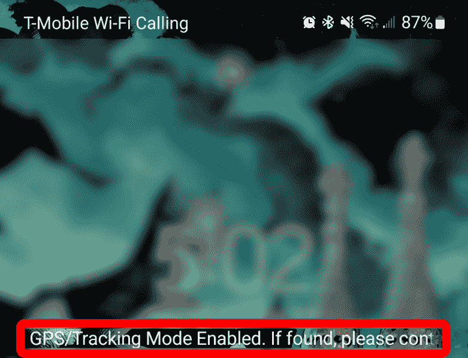

# 第十二章：破解移动平台

今天，当我们看到移动平台上的设备发布时，我们往往会有这样的倾向——希望从黑客的角度来看——我们会想：“*我现在该怎么办？*”

我最喜欢的一句名言来自《星际大战》中的伟大角色尤达大师，他说：“*大小无关紧要，看看我。你要通过我的大小来评判我吗？*”这在移动设备上也适用。它们非常小。我们的大多数智能手机的性能比 1970 年代美国宇航局（NASA）将人类送上月球时使用的计算机系统还要强大。移动设备的更新速度以及这些设备上支持的应用程序让人瞠目结舌。

所以，系好安全带——我将从黑客的角度带你了解移动平台的几个不同方面。

本章将涵盖以下主题：

+   移动环境中的漏洞

+   OWASP 的移动设备十大风险

+   破解安卓

+   破解 iOS

+   移动设备管理

让我们从识别攻击移动设备漏洞或攻击途径的过程和一些关键词开始。

# 移动环境中的漏洞

除了我们在网络攻击、云攻击和无线攻击中看到的漏洞外，移动设备比标准桌面环境中有更多的漏洞或攻击途径。以下是一些影响我们移动世界的其他漏洞：

+   **应用程序和应用商店**：知道你从哪里下载应用程序非常重要，因为作为攻击者，我会拿一个流行的应用程序，将其重新编译并植入恶意软件，然后试图重新分发它。

+   **病毒、蠕虫和 Rootkit**：我们在桌面环境中处理的恶意软件，正是我们在移动设备环境中会遇到的恶意软件。

+   **数据存储**：开发人员必须仔细考虑哪些数据将存储在智能手机上以及如何保护这些数据。移动应用程序应该避免将敏感信息（如密码或信用卡号）存储在手机的本地文件系统中，因为这可能会让攻击者在设备被物理获取后获得访问权限。

在本地文件系统上存储任何敏感信息是不推荐的，但如果将其存储在 SQLite 数据库中，可能会稍微好一点……如果你刚才的安全警觉感应到了，那应该是因为我们对 SQL 和注入攻击的了解。这就是为什么我说稍微好一点。

+   **复制信息**：如果我通过电子邮件获取信息并将其保存（因为它作为附件到达）到我的本地**安全数字**（**SD**）卡中，然后将其转发到我的 Dropbox，我就会把我的系统暴露给攻击者。你可能需要考虑加密你的数据存储，这样如果有人取走你的 SD 卡或获得你的设备，他们必须输入一个 PIN 码，就像你从冷启动开启手机时一样。

+   **社交工程**：我们在*第八章*中已经讨论过这个问题，*社交工程*，但为了重申一下，它是一种非技术性的方式，让人们做出他们平时不会做的事情。我们可以利用技术进行社交工程，但操控总是发生在人与人之间的层面，而不是设备层面。从移动设备的角度看，大多数社交工程通过电子邮件、短信或多媒体信息进行。

你可能已经是面对面社交工程的受害者——只是你当时没有意识到。社交工程也发生在社交网络平台上。广告也是实施社交工程的一种方式，目的是让你点击链接、点赞或劫持 Facebook 账户。然后，我可以向他们的朋友发布信息说，"*嘿，最近有个新的安全问题，点击这个链接，我是想帮你们的，*" 当他们点击时，我就感染了他们。

这种攻击也通过视频聊天进行。例如，当我安装了 Skype 或 Zoom 以便进行视频会议时，我在前三分钟内收到了八个来自陌生人的邀请。听着，我知道我很受欢迎，但拜托，稍微有点控制啊！

+   **短消息服务（SMS）环境**：在短信环境中，尤其是通过短信钓鱼的攻击激增，因为大多数人并不清楚设备的工作原理。我们会收到看起来像是来自银行的短信，或者是来自我们没有账户的银行的短信。短信中包含的链接，很容易指向一个电话号码，该号码实际上与显示的号码不同。当你点击链接时，它会拨打不同的号码或将你引导到一个不同的电话号码。一些链接会将你带到一个假冒但几乎一模一样的网站。它们会告诉你，"*嘿，你的账户已被锁定，请点击此链接了解更多信息*。"

+   **驱动攻击**：这是指当攻击者通过特定网页向设备传送恶意软件时发生的情况。许多时候，驱动攻击是由软件创建的，或者发生在网页浏览器中。这些软件可能是操作系统、Java，或任何类型的网页插件，但网页浏览器也为我们制造了这个大漏洞。

+   **移动设备上旧版操作系统**：对于制造商来说，要跟上这一点非常困难。他们在更新操作系统时遇到了很大困难。大多数操作系统都有漏洞，我们并不是在讨论老旧的遗留系统。可能是一个连接到网络的二代 iPad，或者是第一代 iPad，三星 S3，或者 iPhone 4。真正的挑战在于，是否仍然允许通过更新来修复安全漏洞。

+   **网络钓鱼**：这是通过伪造电子邮件进行的。有时，很难意识到电子邮件中的链接无效或无法辨别一个网站是否是假的。当然，这是我们社会工程学环境的一部分。他们通过一封邮件让你输入用户名和密码，邮件称你的花旗银行信用卡已被锁定，需要登录。然后他们将你带到一个不是花旗银行的网站上。幸运的是，进行网络钓鱼类型攻击变得越来越难，因为许多公司都有独立的应用程序，用户可以迅速确认这些信息。

+   **连接**：你的设备是否总是连接到蜂窝网络、Wi-Fi 网络、蓝牙，或者是令人担忧的**近场通信**（**NFC**）？

现在，让我们看看 OWASP 所列出的移动设备顶级攻击途径。

# OWASP 的移动设备十大风险

**开放网络应用安全项目**（**OWASP**）每年发布移动设备的十大风险。M 代表移动，这个列表与 2016 年最终确定并发布的 OWASP Web 应用程序十大风险非常相似。请注意，OWASP 是一个非常好的资源，值得你跟随和学习（[`owasp.org`](https://owasp.org)）。让我们仔细看看这些风险：

+   **M1: 不当的平台使用**：此类别涉及平台功能的违规或未能正确使用安全特性。这可能是 Android 意图、平台权限、TouchID 滥用、钥匙串或其他未正确利用的移动系统安全特性。

+   **M2: 不安全的数据存储**：支持离线功能存在一定的权衡。开发人员必须仔细考虑哪些数据将存储在移动设备上，以及如何存储这些数据。移动应用程序应尽量避免将敏感信息存储在本地文件系统中，因为这可能导致攻击者在物理获取设备后获得访问权限。

不建议将任何敏感信息存储在本地文件系统中，但将其存储在 SQLite 数据库中可能稍微更安全一些。

+   **M3: 不安全的通信**：移动应用程序应避免使用不安全的通信方式，这些方式可能导致攻击者窃听或篡改传输的数据。这包括 HTTP、FTP、Telnet、WAP 和 GPRS（如果没有通过 SSL）。通常情况下，由于证书验证失败（例如自签名证书），无法建立 HTTPS 连接。在这种情况下，开发人员可能会选择接受风险并禁用 HTTPS 验证。

+   **M4: 不安全的身份验证**：移动应用程序应始终实施安全的身份验证方法。这包括在可能的情况下使用 OAuth 2.0，并实施强密码/密码策略，以便在几次失败尝试后锁定设备。支持单点登录的应用程序应仅与遵循安全最佳实践的受信任来源一起使用。

+   **M5：加密不足**：移动应用程序应始终使用标准的加密算法和实现。这包括对任何需要强加密的操作使用经过 FIPS 140 验证的加密技术。弱加密会增加数据泄露的风险，无论是故意还是无意的。

+   **M6：不安全的授权**：不安全的授权暴露数据，允许攻击者以认证用户的身份执行操作，并促使像不安全的直接对象引用等攻击的发生。

+   **M7：客户端代码质量**：移动应用程序的客户端代码永远不应被信任。恶意移动应用程序可以通过修改应用程序的功能，利用反射、改变执行流程、注入命令到命令流，甚至执行本地机器代码，轻易地利用客户端漏洞。开发者需要在接受移动应用客户端之前验证它们是否有效。可以使用移动应用扫描工具，如 Drozer，来测试这些漏洞。

+   **M8：代码篡改**：恶意移动应用程序可以利用动态代码加载来篡改原始应用程序。一些商业和开源的动态代码加载框架通常用于合法目的，但也使开发人员容易受到滥用。

+   **M9：逆向工程**：移动应用程序可以通过自动化工具或者手动方式，在反编译后检查应用程序的二进制文件进行逆向工程。

+   **M10：多余的功能**：攻击者会下载并在他们的环境中检查移动应用程序。他们会查看日志文件、配置文件，甚至是二进制文件，看看开发人员是否留下了隐藏的开关或测试代码。他们将利用这些开关和后台系统中的隐蔽功能来发动攻击。

现在，让我们来谈谈黑客攻击 Android。

# 黑客攻击 Android

首先，理解我们在黑客攻击移动平台时所面对的更大图景是很重要的。所以，让我们从了解 Android 安全环境开始。

## Android 安全性

要理解任何类型的安全性，你需要了解平台底层的架构，因为它能告诉你设备上哪里存在漏洞。

Android 安全性像洋葱一样是分层的。让我们逐一看一下每一层。

### Linux 内核层

像 Windows、macOS 等操作系统一样，Android 的第一层是 Linux 内核。

Android 使用 Linux 内核是因为它稳定——并且具有经过验证的驱动集。Linux 内核在硬件与设备之间创建了一个接口，无论是显示器、设备上的相机、USB 端口、网络端口、屏幕上的键盘、蓝牙、Wi-Fi、声音还是电源功能，所有这些设备都可以通过这个架构层直接由操作系统支持。

### 库层

这一层有一些内置的库，包括以下内容：

+   **Surface 管理器**：这个组件只是用来合成你在屏幕上看到的窗口。

+   **Open 图形库** (**OpenGL**) **和图形库工具包** (**GLKit**)：这两个组件管理 2D 和 3D 显示。这个基础设施的酷炫之处在于，应用程序几乎可以无缝地从 2D 切换到 3D。

+   **媒体框架**：这个框架允许你在显示屏上回放和录制多媒体（音频、视频或图片）。例如，我们的大多数编解码器都内置在这个框架中，如 MP3。所以，当你开机时，你可以立即拍照并查看照片。那是因为照片是 JPEG 格式的。你还可以下载 MP3 文件并立即收听；你无需下载和安装任何额外的编解码器。

+   **FreeType**：这个组件用于渲染我们的字体。你可以更改系统中显示的字体，包括其大小和类型。一些应用程序也会使用这个自由字体，让你可以在应用程序内部更改字体。

+   **Open SSL**：当我们与其他设备进行通信时，它为我们提供安全保障。

+   **SQLite**：这是一个数据库引擎。然而，它可能在 Android 设备上创建漏洞。我们在标准的 **结构化查询语言** (**SQL**) 数据库服务器中看到的同类型漏洞，也有可能在某些情况下影响这些移动设备。

+   **WebKit**：这是一个开源浏览器，它是苹果 Safari 使用的引擎。

接下来，让我们谈谈运行时层。

### 运行时层

在这一层，我们有核心库和 Dalvik 虚拟机。它只是一个运行时层，包含了一组核心 Java 库。这使得应用程序开发者可以使用标准的 Java 编程语言来构建应用程序。

以下是最常见的运行时层的列表：

+   **Dalvik 虚拟机**：这是一个开源软件，名字来源于冰岛的一个渔村，创始人的祖先来自那里。它是一个虚拟机，经过简化优化，适用于移动设备，使得多个虚拟机能够运行，以支持多个应用程序。在 Android 系统中，我们会将每个应用程序放入沙盒中。它有较低的内存需求，并依赖底层操作系统进行进程隔离、内存管理和线程支持。

+   **框架层**：在这个层次，我们看到设备自带的核心应用程序。例如，T-Mobile 可能会加载一些默认的应用程序，这些应用程序是专为其环境设计的，例如 TouchWiz，这是他们在 Android 上加载的界面。

+   **活动管理器**：这个管理着应用程序的生命周期。这包括启动和运行应用程序。如果应用程序因为我们切换到另一个应用而暂停，它也会管理暂停状态。如果应用程序一段时间没有使用，还有停止状态，并且在活动管理器决定该活动不再需要时，会进入销毁状态，将资源移除。

+   **窗口管理器**：这是我们在屏幕上看到的内容。所以，有一个组件为我们管理这一切。

+   **包管理器**：这个用于跟踪我们安装了哪些应用，以便进行更新或卸载某个应用程序。

+   **电话管理器**：这个负责管理你的电话。如果你开发了一个应用，当你点击某个联系人时，看到他们的电话号码，并且当你点击电话号码时，需要拨打该电话，那么这个应用就是在调用电话管理器。

+   **资源管理器**：这个管理着应用程序可能使用的资源。

+   **内容提供者**：它管理应用之间共享的数据，从而让我们在环境中体验到无缝衔接。例如，我们的一些默认内容提供者包括通话记录，它提供未接来电、通话详情和通话时间。地址簿或用户词典也是内容提供者。当你开始输入时，默认的用户词典可能无法识别某个词汇，但你知道它是正确的词汇，有时你会点击标注“*这是正确的拼写*”的按钮。另一个例子是，当你安装 Facebook 时，Facebook 动态就是一个活动。当你点击照片按钮时，你可能会调取内容提供者进入 Photoshop 画廊，这样你就可以通过 Facebook 应用分享照片。

+   **位置管理器**：这是由你的 GPS 和可能的手机塔使用的框架，用来确定某人所在的位置。例如，我可以通过应用程序查看我的孩子们的位置。他们不需要开启 GPS—它通过手机塔进行三角定位。

+   **视图系统**：这就是字面意思，我们看到的应用程序和窗口的不同视图。它通过窗口管理器进行大量的通信。

+   **通知管理器**：这个应用程序会在我们错过电话或短信时通知我们。

接下来，让我们看看应用层。

### 应用层

这里我们可以看到如主屏幕、联系人、内置应用、电话和浏览器等内容。当你将其他应用添加到设备时，它会在这个层级添加它们。它通过框架、库和运行时与设备交互，以执行我们希望设备完成的任务。

现在，让我们接着看**近场通信**（**NFC**）攻击。

### NFC 攻击

我喜欢 NFC。作为攻击者，我可能会寻找合法的 NFC 标签。我可能会创建一个标签并将其放置在商场或超市的标牌上，或者撕下原标签并用我的标签替换它。通常，用户只需轻触或扫描标签即可获取信息。我可以将他们引导到一个包含 WebKit 漏洞的恶意网站，例如**1759**。任何扫描该标签的用户都会导致设备被 root 并被攻击。

### 中继攻击

执行中继攻击所需的只是两个设备，一个充当令牌，一个充当读卡器。它们通过代理通道建立连接，通常是通过蓝牙，但也可以是 Wi-Fi。这使我们能够在更远的距离上中继信息。代理读卡器随后用来与真正的令牌进行通信，而代理令牌则放置在真实读卡器附近。令牌假设它正在与读卡器通信，并做出相应回应。然后，该回应被中继回令牌代理，令牌代理将信息传输回读卡器。

## 黑客技术

让我们讨论一下作为一名道德黑客，你可以使用的一些技术，以便获取设备、网络和系统的访问权限。

### Rooting

提到 root 权限时，我们通过提升特权来获得设备的 root 访问权限。Rooting 允许你进行各种自定义设置，包括调整配置、加载自定义操作系统，甚至提升性能。我会 root 我的设备，以便去除大多数手机自带的垃圾软件，但我也理解这样做带来的风险。

就应用程序而言，它们受限于安全模型，这样应用只能访问自己的文件、外部存储或外部 SD 卡，并且只能访问在安装过程中请求的资源和功能。通过 root 权限，我们允许某些应用作为 root 用户运行。当这种情况发生时，安全模型就会崩溃，因为我们绕过了默认的权限设置。

不是所有应用都会自动使用 root 级别的访问权限。例如，Facebook 仍然会使用它需要的资源和信息。

Rooting 不应由心脆的人或不了解自己操作的人进行，因为你可能会*砖化*设备，或者让自己和公司面临额外的风险。

工具如 KingoRoot、TunesGo Root Android Tool 和 One Click Root 可以帮助你打开一些限制。其他选项包括通过**Android 调试桥**（**ADB**）或使用像 Phonesploit 这样的工具进行 root。

### 磁盘中间人攻击

当攻击者能够物理接触到设备并在其上安装恶意程序时，就可以执行此类攻击。这个应用程序无需通过官方应用商店下载，恶意软件可以通过任何方式安装，包括通过 USB 连接或无线网络。一旦安装了该应用，它可以利用 Android 操作系统中的漏洞，获取敏感数据。

Android 操作系统由两种存储类型组成：内部存储和外部存储。通常，Android 应用的内部存储是沙盒化的，而外部存储则旨在实现应用之间的文件共享，这使得其容易受到 MITD 攻击。

当一个合法程序尝试执行典型的升级时，攻击者会监控存储在外部存储上的数据，并通过编辑升级的源代码尝试修改、删除或替换应用数据。当恶意软件成功注入合法的应用更新时，用户应用会下载并执行恶意代码，从而使攻击者能够安装伪造的应用。

### 免提攻击

Android 应用可能会在无需任何权限的情况下捕获免提通话流量。通过硬件基础的运动传感器（加速度计），攻击者可以监听远程移动用户之间的免提通话。加速度计是大多数智能手机内建的硬件，任何应用都可以在不需要额外权限的情况下访问它。该运动传感器能够根据设备位置和速度的变化来监控设备的物理运动。这个内建传感器也可能捕捉到语音回响，因为免提扬声器与设备表面接触。

### Tap 'n Ghost 攻击

有一种独特的攻击方式可能会悄悄盗取你的 PIN，而你完全没有察觉。Tap 'n Ghost 攻击利用 NFC 从你的手机中窃取 PIN。其工作原理如下：攻击者将他们的手机轻触你的手机，然后迅速取走他们的手机，避免任何事情发生。这个动作会向你的手机发送信号，打开一个特别的页面，让你输入 PIN。由于该页面只会出现极短的时间，大多数人不会注意到它。即使你注意到，你也没有足够的时间输入 PIN，因为攻击者已经收起他们的手机。

这种攻击曾在拉斯维加斯的 Black Hat 会议上由安全研究人员展示。他们展示了如何从运行 Android 的手机中窃取 PIN 码。随后不久，在 Defcon 大会上我亲身体验了这一攻击。幸运的是，我当时用的是备用手机，这样我可以拍照（这部手机没有任何账户或个人信息，我仅携带它在 Black Hat 和 Defcon 拍照）。那时，我正站在一旁，低头把刚买的书放进背包，一个人走过来，试图通过社交工程手段（不过很失败）问我：“你买了什么书？”当我转身看他时，我感觉手机在口袋里震动。我盯着他，拿出手机，他明显变得紧张。我说：“等一下”，他转身匆匆走开……我的屏幕上什么也没有显示（这就是黑客的操作方式），但我很好奇，既然手机没有 SIM 卡，且无线网络和蓝牙都关闭，为什么它会震动……哦，我忘了 NFC 功能！所以，是的，记得当你在其他手机附近使用手机时要小心。你知道我的座右铭……如果你不用，关掉它！

接下来，让我们谈谈如何锁定 Android 设备。

## 锁定 Android 设备

说到 Android 设备，有几件事需要我们关注。首先，了解应用商店的奇妙之处，以及应用程序是如何进入这些平台的，这一点非常重要。

### 应用程序的批准流程

这将是 Android 的一个短板，因为开发者支付一次性费用将应用上传到 Google Play 商店后，应用通常在一小时内上线。然而，Apple 会进行统计分析以检测 API 的任何不当使用。这导致应用程序的批准通常需要约一周时间。

此外，开发者需要支付 99 美元的开发者费用，这在某种程度上提高了进入 App Store 的门槛。Android 支持从未知来源安装应用程序。你能仅凭这一点看出问题所在吗？我们称这种行为为旁加载（sideloading）。这意味着用户可以从第三方应用商店安装应用程序。仅仅因为应用程序标称已签名，并不代表它真的已经签名，因为 Android 并不在乎是谁签署了该应用。然而，Apple 只允许用户从其 App Store 安装 iOS 应用程序。iOS 本身不支持旁加载，因此 iOS 内核通过仅执行由批准方签署的代码来强制实施这一安全机制。

当谈到你应该使用哪一个时，就像在选择开车和坐飞机之间做决定。如果我选择开车，我就冒着发生事故或被别人影响的风险。而坐飞机旅行要安全得多。类似地，苹果严格控制的做法带来了一个额外的好处——它减少了恶意软件的攻击目标——虽然这并不意味着它是无法被攻破的。然而，谷歌的做法提供了更多自由，但也伴随着更多的风险。

### 其他保护安卓设备的方法

这里有一个很好的清单，可以帮助我们保护安卓设备。请注意，这些清单不包括查看 **移动设备管理** (**MDM**) 的内容。我们稍后会讨论这一点：

+   更新——不仅仅是操作系统，还包括应用程序。这里的真正重点是——几年后，你将不再获得来自制造商的操作系统升级支持。三星在 2022 年刚刚宣布，他们将把新设备的操作系统支持时间从 3 年扩展到 4 年。到了那时（或者如果你有一款老设备），你就必须进行升级了。

+   将用户信息添加到你的锁屏。我的锁屏看起来是这样的：

图 12.1 – 使用锁屏的用户信息

+   我需要谈谈杀毒或恶意软件防护吗？

+   如果设备是与他人共享的，请使用多个账户。

+   不要从任何来源下载 **.apk** 文件。是的，这包括种子下载！

+   使用设置功能中的必要选项加密你的设备。

+   阅读应用程序要求在设备上获取的权限。任何游戏都不应该访问你的联系人或电话号码。

+   在不使用 Wi-Fi 时关闭它……拜托！

+   我最喜欢的小窍门——卸载你不使用的应用程序。例如，当我不旅行时，我不需要 Uber，所以我会卸载它。等我需要它时，再重新安装。这也能提高设备的性能。

+   在不使用自己网络时，使用 VPN。我最喜欢的说法是，"*不是你的网络？那可能不再是你的设备了!*"

+   使用密码管理器。

+   在任何支持的应用程序上启用双因素认证。

现在，让我们转到苹果方面。

# 破解 iOS

现在我们已经讨论了如何破解安卓设备，让我们来讨论破解 iOS 及其产品的过程。

## 苹果架构

苹果是独特的，但像安卓一样，它也有多个不同的层级。

**iPhone 操作系统** (**iOS**) 是苹果公司为 iPhone、iPad、iPod 和其他 iDevice 设备使用的平台。它是一个集成系统。苹果不允许在非苹果设备上实现 iOS。iOS 仅仅是硬件与应用程序之间的中介。

应用程序不应该直接访问硬件。相反，它们应该通过架构的多个不同层级进行访问。

### 核心操作系统

系统级别涉及内核环境、驱动程序和操作系统的低级 Unix 接口。iOS 提供了一套接口，用于访问操作系统的许多功能。当人们创建应用程序时，这些功能通过 libSystem 库进行处理。接口是基于 C 的，这使得我们能够控制诸如网络、BSD 套接字、区域信息、网络组件以及文件系统访问等内容。它还负责 DNS 服务和 Bonjour。

### Cocoa 应用

这是一个重要的层次，是大多数开发者处理的主要层次。它负责我们在 Apple 平台上看到的标准化界面。它还负责文本工具包（text kit），该工具包负责文本的格式化方式——段落、列和页面。它还负责我们的推送通知服务。所以，我们可以推送文本通知，或者在图标上添加一个徽章，上面写着，"*你有新的通知，收到了新的短信*。"

### 媒体层

这个层次管理着与媒体和屏幕显示相关的多种技术——摄像头、音频、2D 和 3D。它使用 OpenGL 和 GLkit，负责 2D 和 3D 渲染。

### 核心服务层

这个层次有不同的特性，比如你的设备用来连接或发起与附近其他设备连接的点对点服务。这个功能主要用于游戏。

### iCloud 存储

这个功能允许你编写应用程序，使得用户的文档和数据能够推送到 iCloud。

存在其他架构层次来支持 iOS，但这些是你在考试中需要关注的主要层次。

现在，让我们讨论越狱。

## 越狱

越狱不同于 root。越狱可以比作《黑客帝国》中的摩菲斯，他可以弯曲《黑客帝国》的规则来克服一些限制。他可以跨越高楼，但仍然可以在《黑客帝国》中被杀死。而 root 就像尼奥所做的那样，不仅可以弯曲这些规则，还可以打破它们。

越狱过程中发生了什么？

在越狱时，我们首先会移除苹果所设定的限制。大多数人越狱是为了能够做一些苹果不一定希望你使用的事情，比如加载苹果不允许的应用程序。苹果这样做有各种原因，包括市场营销问题，比如屏蔽弹出广告，因为一些游戏制造商或开发者通过广告赚钱。

我们可以通过加载一个具有 root 权限的自定义内核来实现这一点。

注意

在 iOS 中，root 权限的定义与 Android 中的 root 权限不同。一旦用户赋予自己这个控制权，他们就能够下载应用商店不允许的软件和应用程序。

它还允许定制，比如添加主题或扩展功能，这些是苹果不支持的。它还允许你解锁手机。这就是我们如何让 AT&T 版本的 iPhone 在 T-Mobile 网络上运行的原因。

越狱让你可以使用苹果认为你不应该使用的软件，其中最大的一个就是广告拦截器。

另一个很酷的功能是能够让 Hey Siri 变得不需要连接电源。通常，我们说“*嘿，Siri*”，iOS 会识别并执行免提操作和语音命令，但当你的设备插入电源时，通常会受到限制。好在有一个应用程序可以让你在设备插电时也能识别 Siri，或者你想移除一些应用程序或界面元素。这里有一个叫做 HideMe8 的应用，允许你隐藏应用、隐藏徽章、去除某些元素、定制日期文本，并更改锁屏界面。

Activator 也是一个很棒的工具。它允许你为手势和按钮按压分配自定义动作。所以，如果你想要启动 Facebook，你可以设置当我做三指滑动时启动 Facebook。你还可以设置如果我长按 Home 按钮，启动相机。定制化的可能性几乎是无限的。谈到 WinterBoard，它也允许你更改切换设置，以便你可以为你的 VPN 或个人热点设置切换开关。你甚至可以绕过绑定选项，使你的设备无论运营商是否允许绑定，都可以将设备变成热点，在运营商看来，这仍然是 iPhone 或 iDevice 请求数据。

记住，越狱时我们在修改设备的安全性，所以我们必须小心。如果你知道自己在做什么，可以尝试。我永远不会把越狱的设备交给我的亲戚或者那些不了解我对设备做了什么以及为什么这么做的孩子。

### 越狱的类型

有不同的越狱技术可以实现，具体如下：

+   **无绑定越狱**：这种类型的越狱有一个特点，即如果用户关机再开机，设备会完全启动，而且无需电脑协助，内核将会被打补丁。

+   **绑定越狱**：在这种情况下，每次设备重启时都需要一台电脑来打开设备。如果设备自己启动，它就不再是打过补丁的内核，会陷入部分启动状态。通过使用电脑，手机实际上是每次开机时重新越狱，这听起来可能有些麻烦。

+   **半绑定越狱**：当设备启动时，它将不再有打补丁的内核，因此无法运行任何修改过的代码，但仍然可以进行正常的功能操作，比如打电话或发短信。要使用任何需要修改代码才能执行的功能，用户必须使用越狱工具来启动设备并加载打补丁的内核。

现在，让我们来讨论三种类型的越狱。

### 三种越狱方式

理解你可以越狱设备的三种主要方式是非常重要的。我们将在接下来的子章节中讨论这些内容。

#### 用户层漏洞

这是一个在 iOS 设备的内核启动后运行的软件。这个漏洞利用了系统应用中的一个漏洞。它允许用户级访问，但不允许 iBoot 级访问。这些类型的漏洞不能被连机，因为没有任何东西能够导致恢复模式循环。这些类型的漏洞可以并且已经被苹果修复。

#### iBoot 漏洞

iBoot 漏洞允许越狱、用户级访问和 iBoot 级访问。这是一个可以在设备拥有新的启动 ROM 时半连机的漏洞。这个漏洞关闭了代码签名并运行一个程序，帮我们完成所有工作。这个漏洞可以通过一些固件更新进行修补。

#### 启动 ROM 漏洞

这个漏洞利用了安全 ROM 中的一个漏洞，而安全 ROM 是第一个启动加载程序。它禁用了签名检查，这可以用来加载补丁或固件。固件更新无法修补这些类型的漏洞。启动 ROM 漏洞允许用户级访问和 iBoot 级访问。唯一能修复这个漏洞的方法是苹果更新启动 ROM 的硬件。

### 锁定苹果平台

就苹果平台的锁定而言，尽管越狱设备可以打开苹果不希望你访问的各种选项，但你只需要知道这些选择可能带来的后果，因为我现在可以远程访问设备。从攻击者的角度来看，想一想这个问题。

对我来说，最大的问题仍然是物理层面。如果攻击者获得了对任何设备——无论是苹果、安卓，还是 PC、笔记本或服务器——的物理访问，我们需要考虑在移动这些设备时可能带来的风险。我们需要加固安全防范：

+   设置设备的密码锁。我知道这是一个"*废话，Dale*"的说法，但我还是需要说一下。

+   不要侧载应用程序。

+   禁用网页浏览器中的 JavaScript 和插件。

+   不要将敏感数据存储在任何客户端数据库中。

+   如果你越狱，请将默认的 root 密码从"alpine"更改。

+   配置“查找我的 iPhone”功能，在设备丢失或被盗时擦除数据。

+   更新，更新，再更新。这包括操作系统、应用程序和任何插件。

+   禁用 iCloud 服务，以防止敏感的企业数据备份到云端。

+   启用*询问是否加入网络*，这样你就能连接到恶意无线网络。

+   启用“尝试 10 次后擦除数据”功能。

+   关闭 Siri。她不需要监听并记录你说的内容或你公司讨论的内容。

+   顺便说一下，关闭语音拨号。如果启用了语音拨号，并且攻击者获得了设备的物理访问权限，他们可以在不输入密码的情况下访问你的手机。

+   关闭一些与安卓设备看到的相同保护措施。这包括关闭安全网络、双因素认证、设备加密、避免使用公共 Wi-Fi 以及停止点击电子邮件链接。

现在，让我们探讨 MDM。

# 移动设备管理

MDM 是一种软件，监视您所有的移动设备，使我们能够部署安全的智能手机、平板电脑、台式机和笔记本电脑。

MDM 在企业内外优化和自动化设备的功能和安全性。我们可以控制诸如允许在哪里分发应用程序、数据存储在哪里、设备如何配置、安装哪些补丁以及如何处理已被破坏的设备等事项。要不就干脆射杀它，让它免于痛苦？

移动设备管理（MDMs）与框架一起工作，每个设备制造商都有一个注入到 MDM 中的框架。MDM 通常具有移动设备管理员可以在这些设备上控制或强制执行的策略或功能。

这些策略和功能的组合形成了框架。安卓、黑莓和苹果提供了 MDM 框架，允许管理员和 MDM 供应商简单地链接到他们的设备。

有无数不同的 MDM 软件解决方案，但这些是大公司：

+   **AirWatch**：这是由开发 VMware 的同一团队处理的。

+   **System Center Configuration Manager**：这是由微软提供的，支持移动 Windows 平台、安卓和 iOS。它需要一个额外的组件 Intune，这是一个月度订阅，让您能够在设备不在您的网络基础设施内时管理它们。Intune 充当您的代理。它与互联网连接，您的设备连接到它，然后将其传递回您的系统中心配置管理器。

+   **Spiceworks**：这是完全免费的，不需要太多配置或服务器。

这里的整体概念是确保您在支持组织发行的设备以及控制**自带设备**（**BYODs**）方面有一些选择。在保护资源的同时控制个人设备是一条微妙的界线，但我明白，对大多数公司来说这是一个节约成本的问题，同时也是员工不得不携带两台相同设备的烦恼问题。哦，我可以对自带设备及其不使用它们的原因发表意见，但那将是另一本书。

现在，让我们谈谈指南的重要性以及您可以使用的一些酷工具。

## 指南和酷工具

谈到指南时，我想不出比加勒比海盗的巴博萨船长的话更好的短语了，"*这个规则更像是“指南”而不是实际规则*。"

在移动设备方面有一些很好的指南。让我们讨论其中一些：

+   **应用程序**：我目前看到的移动平台上最大的问题之一是人们加载了太多应用程序。

+   **照片**：要小心自动上传照片到社交网络。当我为社区做演示时，特别是为家长时，我谈到我们分享了太多信息。有时，我们甚至没有意识到。我们在 Facebook 上发布照片而没有查看照片。背景中有什么？你是否暴露了你的地址或其他个人或家庭信息？小心不要透露太多信息。

+   **控制**：你能控制这些设备吗？如果失去了控制，就是时候把它们带回办公室重新关联了。

+   **安全评估**：对设备、应用程序及其架构进行安全评估。

+   **可信应用程序**：只从可信位置安装应用程序。我经常侧载一些有用的应用程序到我的平板电脑上。

+   **位置**：除非有支持应用程序的组件，否则不要添加任何基于位置的功能。如果不需要，不要加载谷歌地图。我知道大多数 Android 设备都预装了这些应用程序，但你也需要小心那些想要查看你位置的应用程序。只有在必要时才允许。

+   **蓝牙**：如果不需要，关闭蓝牙，特别是在旅行时。你还会获得一点额外的电池寿命。

+   **连接到不同网络**：不要同时连接两个网络，比如 Wi-Fi 和蓝牙，因为攻击者可以利用一个网络从另一个网络中获取信息。

+   **备份**：备份并检查设备同步的频率，特别是如果它们在你的网络之外同步。

+   **密码**：使用强密码。

+   **空闲超时**：设置空闲超时，当手机不使用时自动锁定。我按下电源按钮时，我的手机会自动锁定。

+   **锁定和擦除功能**：利用锁定和擦除功能。如果有人连续四次输入我的代码错误，我的设备就会被擦除。

+   **越狱和 Root**：EC Council 的最佳实践是永远不要允许 Root 或越狱设备。然而，我喜欢 Root 我的设备，因为当 Android 的 Stagefright 出现时，如果我没有 Root 我的设备，我就得等三星发布修复程序。然而，因为我运行自定义 ROM，那个 ROM 的作者只用了 2 天就发布了补丁，我能够重新部署并锁定设备。

+   **更新**：保持所有应用程序和操作系统本身的更新。然而，审查所有更新想要实现的更改 - 不要点击**全部应用**；你可能会降低设备的安全性，因为应用程序可能悄悄添加一个新游戏，新补丁让它们可以访问你所有的联系人。

+   **硬件加密**：这就像在 PC 上加密硬盘。如果有人偷走了你的 PC，而他们不知道启动时要输入的加密密钥，他们就无法获取数据。

+   **MDM**：审查您的 MDM 政策。这涉及到变更管理的道路，因为当您制定这些政策时，您需要确保各部门完全同意什么是允许的，什么是不允许的。

+   **Emails**：过滤电子邮件转发障碍，因为我们大多数的恶意软件都是通过电子邮件传播的。我们想要这些传向我们设备吗？一些较新的电子邮件服务器使过滤变得容易。您可以设置一个过滤器，只允许内部生成的电子邮件转发到移动设备 - 不要转发广告商的电子邮件。

+   **浏览器**：加强这些设备上的浏览器。这包括权限规则，以确保当有人访问这些设备上的页面时，他们不会被注入一些代码，这些代码将对它们进行越狱或获取 root 权限。

+   **已签名的应用程序**：只使用已签名的应用程序，意味着它们已经被应用商店签名，或者已经为内部使用签名。

+   **擦除数据**：设置擦除数据以防止人们猜测设备上的密码。

+   **自动锁定**：确保已打开自动锁定。

+   **备份位置**：制作备份并将其放置在安全位置。

+   **密码**：要求输入密码。研究表明，人们在字母之后使用模式，给攻击者带来了便利。他们需要几次猜测，从首字母开始。

+   **软件维护**：制定一个软件维护计划。如果有一个应用程序在 90 天内没有使用，那么您可能不需要它。

+   **沙盒数据和应用程序**：如果您是开发人员，请将数据和应用程序隔离以避免交叉感染。

+   **Wi-Fi**：始终确保有人必须请求加入。Windows 10 允许设备自动加入已知的 Wi-Fi 接入点 - 不是你知道的那些，而是微软知道的那些。这很危险。

+   **Emails**：不要允许电子邮件被缓存。即使你已经删除了邮件，它仍然在缓存中。如果我得到那个设备，我将能够阅读那些信息。

+   **数据**：作为公司，决定数据是否可以离开环境。我们是否允许人们通过电子邮件发送工资单电子表格，以便布鲁斯·韦恩可以在他的设备上打开电子表格？为什么不使用更新的技术，比如共享文件选项，我不会给你发送文件的副本？相反，我给你一个 URL 链接回到我们的 SharePoint 服务器或者回到一个 Dropbox 位置。这样，我就不会让文件离开环境。

+   **谷歌**：当涉及到 Android 时，注意谷歌正在备份什么，他们正在存储什么，他们正在缓存什么，以及他们正在收集的所有数据。

+   **通知**：关闭锁定屏幕上的通知，这样某人必须解锁才能看到它们。

+   **关闭自动填充**：这是关于方便性。这样做的挑战在于，如果攻击者能够访问计算机，它将成为一个责任，因为攻击者可以轻松地获得对许多东西的重要访问权限。

+   **用户**：你可以做的最好的事情之一就是培训你的用户如何使用这些设备，以及什么是可接受的，什么是不可接受的。确保有书面政策，让他们理解如果违反了政策会有什么后果，并且在他们违反时，严格执行这些后果。

+   **超时**：如果用户远程登录，你允许他们保持不活动状态多长时间，直到会话超时？不断输入用户名和密码很烦人，但不要缓存域密码。这就像在 Facebook、Twitter 和 Google Plus 上公开所有密码一样鲁莽。

好的，现在有谁对移动设备的看法发生了些许改变？

# 总结

重要的是要记住我们正在经历的转变，因为越来越多的事务是在移动设备上完成的，而不是在台式机和笔记本电脑上。由于这些设备的移动性，我们必须为自己做好准备，了解如何最好地应对移动平台带来的独特挑战和漏洞。在这一章中，我们提供了如何准备攻击和保护自己在移动平台上安全的概述。我们回顾了在黑客攻击移动平台时必须了解的关键术语。我们还讨论了黑客攻击 iOS、Android 以及其他移动平台，最后介绍了 MDM 的重要性。

在下一章中，我们将介绍如何破解 Web 服务器和 Web 应用。

# 问题

在我们总结时，这里有一份问题列表，帮助你测试自己对本章内容的理解。你可以在*附录*的*评估*部分找到答案：

1.  加密移动设备有哪些优势？

    1.  发送到网站的数据受到保护

    1.  恶意软件防护

    1.  防止被盗设备

    1.  丢失或被盗设备上的数据安全

1.  *越狱*手机是什么意思？

    1.  移除系统中的 DRM

    1.  从计算机中去除勒索软件

    1.  从网络中移除设备

    1.  通过获取 root 权限来控制设备

1.  Android 基于哪个操作系统？

    1.  Windows

    1.  Linux

    1.  OS X

    1.  macOS

1.  根植设备对安全性的影响是什么？

    1.  它改善了安全性。

    1.  它被加固了。

    1.  它减少了安全性。

    1.  没有变化。
