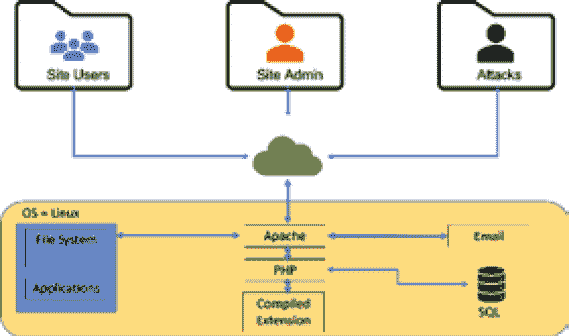

# 第十三章：攻击 Web 服务器和 Web 应用程序

攻击 web 服务器和 web 应用程序的目的是寻找并发现潜在的漏洞。它帮助我们识别需要升级的软件，从而提高安全性，帮助我们识别并应对任何恶意活动。此外，随着网上交易的增多，包括购物、银行业务和通信，web 应用程序为我们提供了一个额外的途径，来获取个人的登录凭证、私人信息和财务数据。

本章将涵盖以下主题：

+   为什么 web 服务器会产生安全问题

+   架构类型

+   对服务器和应用程序的威胁

+   web API、web shell 和 webhook 的漏洞

+   检测 web 服务器的攻击尝试

让我们首先讨论为什么 web 服务器会给我们带来安全问题。

# 为什么 web 服务器会产生安全问题

重要的是要理解，web 应用程序和服务器本身并不是安全的。事实上，它们从未被设计为安全的——它们是为了功能性和提供服务而设计的。确保它们安全的责任在于我们，作为系统管理员、开发人员和安全专业人员。

这就是为什么攻击者将注意力集中在 web 服务器和 web 应用程序级别攻击上的原因——因为托管 web 应用程序的 web 服务器可以通过互联网随时随地访问。这使得 web 服务器成为一个有吸引力的目标。配置不当的 web 服务器可能会在即使是最精心设计的防火墙系统中也创造出漏洞。攻击者可以利用已知漏洞的配置不当的 web 服务器来危及 web 应用程序的安全。此外，具有已知漏洞的 web 服务器即使托管的 web 应用程序本身是安全的，也可能危害组织的安全。

web 服务器上的每个开放端口都是潜在攻击的入口，尤其是当它托管使用 HTTP 和 FTP 等协议的应用程序时。操作系统必须通过确保进程拥有足够的资源来正常运行，以保护应用程序免受**拒绝服务（DOS）**攻击。这些操作系统安全特性的真正问题在于，它们也可以被用来攻击应用程序。在操作系统及其应用程序上添加插件、附加组件和它们的配置，为攻击者创造了一个完美的攻击环境。

在你开始尝试攻击 web 服务器之前，了解它们是如何工作的非常重要。

web 服务器有三个主要组成部分：

+   web 服务器软件，这是我们想要攻击的目标。

+   网站内容/文件需要以特定格式存放，以便 web 服务器能够访问和读取它们。

+   操作系统本身。

每个 web 服务器本质上都以相同的方式工作；它接收到用户的请求，然后尝试找到他们需要的文件。接着，它读取文件并将其发送给用户，以便他们可以查看。

每个网页服务器背后都有一款名为 HTTP 守护进程/服务/服务器的软件。根据服务器的不同，名称也有所不同。Apache/httpd 是基于 Linux 的服务器中流行的 HTTP 守护进程，而 **Internet Information Server**（**IIS**）则是 Windows 服务器中流行的守护进程。

HTTP 守护进程本质上在后台运行，默认通过端口**80**接收用户的请求。因此，每次你在浏览器中输入 [facebook.com](http://facebook.com)，你的计算机会向 Facebook 网站服务器发送请求，以查找需要显示的文件，以便你能够查看该页面。

查找这些文件的过程被称为将 URL/域名映射到服务器上的特定目录、索引等。然后，当用户尝试访问某个文件时，它会将文件名映射到已经映射到该 URL 的对应路径。

这些网页服务器还包含安全功能，例如限制每个进程可以访问的物理内存量、阻止未经授权的代码执行，以及确保某些文件类型无法被执行。

现在，让我们讨论一下网页服务器的组成部分。

## 网页服务器的组成部分

首先，我们有 **文档根目录**。这个目录是存储所有网页内容/文件的地方。例如，如果你的文档根目录中有一个 **images** 目录，所有图片都可以通过 [`wayne-technologies.net/images/`](http://wayne-technologies.net/images/) 进行访问。

当用户使用 URL 请求页面时，例如 **wayne-technologies.net/**，它会将该 URL 映射到文档根目录，然后在该文件夹中查找与该 URL 匹配的文件。这就是将 URL 映射到文件和文件夹的过程。如果找到了匹配项，它会将该文件的内容发送回用户，以便他们可以查看。

如果未找到匹配的文件，将会搜索并返回一个索引文档，例如默认页面或 **index.php**，如果找到的话。

如果没有索引文档，服务器通常会返回 **404** 错误给用户，表示找不到他们要找的内容。也可能返回重定向，告诉他们到其他地方查找此文件/内容。

其次，我们有 **服务器根目录**。这是目录树的顶级根目录，包括服务器的配置文件、错误文件、可执行文件和日志文件。它由服务器的实现代码组成。通常，服务器根目录包含四个文件。一个文件专用于服务器的实现代码，而剩下的三个是子目录 —— 即 **conf**、**-logs** 和 **-cgi-bin** —— 分别包含配置数据、日志和可执行文件。

第三，**虚拟文档树**。除了存储内容的物理目录树外，HTTP 守护进程软件还维护着一个虚拟文档树。虚拟树的目的是将 URL 映射到服务器文件系统中存储的文件；例如，它可能将 **http://wayne-technologies.net/images** 这个 URL 与服务器文件系统中的实际目录 **/var/www/images** 关联。

第四，**虚拟主机**。这就是您可以在一台 web 服务器上托管多个域名/网站的地方。例如，您可以拥有主域名 [www.wayne-technologies.net](http://www.wayne-technologies.net)，然后要添加另一个站点，您需要创建一个子域名，比如 **blog.wayne-technologies.net**，并将其指向相同的文档根目录，从而将所有内容都保持在一个服务器下分开。使用这种方法，您还可以在一台 web 服务器上托管无限数量的站点。然而，请记住，每个子域名都需要唯一的密码/凭证以防止未经授权的访问。

第五，**web 代理**。web 代理是一个作为中介的域名，位于您的计算机和您试图访问的网站之间。当您输入一个地址时，它会通过代理 DNS 服务器，然后将请求转发到您请求的网站的 IP 地址。响应通过代理服务器返回，这样就无法追踪到您。web 代理用于帮助隐藏您的 IP 地址，任何试图追踪请求的人都会得到一个不同的 IP。

接下来，我们将讨论您可能会遇到的不同类型的架构。

# 架构类型

Web 服务器架构是 web 服务器的整体布局。它为攻击者提供了如何准备和部署攻击的思路。让我们讨论一下您可能会遇到的最常见的 web 服务器架构。

### IIS web 服务器架构

让我们来看看一个典型的 web 服务器架构及其应用，如下图所示。这是基于开源架构的。正如您所看到的，支持一个应用程序需要涉及许多活动的组件和部分。web 服务器设计用于在一台系统上托管多个站点，这增加了复杂性。您的*黑客警觉性*是不是已经升高了？应该是的。每当我们谈到复杂性时，就意味着存在更多的错误区域、忽略的设置或被遗漏的攻击途径：



图 13.1 – 一个典型的开源 web 服务器架构及其应用

### 开源 web 服务器架构

三个最受欢迎的开源 web 服务器是 **Apache httpd**、**Nginx** 和 **lighttpd**。它们的主要组件如下：

+   Apache，旨在成为一个安全、高效且可扩展的服务器

+   MySQL，适用于存储数据

+   PHP 是一种广泛使用的通用脚本语言，特别适合网页开发，可以与 MySQL 进行交互，以检索和存储数据。

接下来，我们来看看微软世界中的一些挑战。

### 微软

微软的**互联网信息服务**（**IIS**）是全球使用最广泛的网页服务器软件，已累计下载超过 8 亿次。IIS 灵活、安全，且使用 HTTP/HTTPS、FTP、RTSP、SMTP 等协议进行托管非常简便。微软使用的应用程序池是 IIS 中的一个非常有用的功能，它允许管理员为运行在**80 端口**或任何其他端口的应用程序设置不同的资源限制。

为什么你需要关心设置用户帐户和应用程序池呢？管理员可能有很多原因希望为网站配置独立的身份，或设置应用程序池来运行相同网站的独立版本。

举个例子，假设你运行一个非常繁忙的网页服务器，上面托管着两个独立的网站，一个是用于你的业务，另一个是为客户的新产品发布做的营销网站。理想情况下，每个网站都应该在各自的凭据下运行，并拥有独立的应用程序池。业务网站可能需要更多的处理进程，而营销网站可能需要更多的内存和处理器速度来处理大量的流量。在传统服务器上，这些需求可能会产生冲突并导致问题。而使用 IIS 和应用程序池，你可以轻松地为每个网站配置用户帐户和资源分配，确保它们不会互相干扰。

#### 那么，安全性如何呢？

听着，我不是在告诉你微软的 IIS 是不可破解的——恰恰相反。它的历史在被黑客攻击方面相当复杂，但它已经取得了很大的进步。

用于运行网站的应用程序池有默认设置，模仿了原始 Windows Server 2003 版本的 IIS。除非管理员更改设置，否则不会有匿名用户（这正是黑客所需要的），也没有直接访问网站根目录的权限（我们稍后会谈到这个）。通过应用程序池，你可以设置具有有限权限的匿名用户，或者创建另一个受限帐户，就像我们之前为你的营销网站提到的那样。这样，如果某个网站被攻破，黑客就无法进入另一个网站，因为它们运行在完全不同的安全设置下……理论上如此。再说一遍，尽管存在众多攻击途径，微软仍然忙于修补 IIS，但 Linux 和 Apache 同样面临类似问题。

让我们进一步了解为什么网页服务器会被攻破。

## 为什么网页服务器会被攻破？

黑客攻破网页服务器的最常见原因如下：

+   网页服务器常被用作攻击其他应用程序的攻击发起点。

+   当攻击者突破网络中的一个系统时，他们往往能够利用该系统的访问权限自由移动，并访问可能存有敏感数据的其他系统。这被称为**特权提升**。

+   攻击者通常能够利用网络服务器软件中的漏洞来突破系统，因为开发人员在编写代码时容易出错，或者他们可能会留下后门和调试选项。攻击者可以利用这些漏洞和配置错误来控制系统。

现在，让我们来谈谈添加网络应用程序以及如何更加安全地进行此操作。

## 添加网络应用程序

网络应用程序正变得越来越容易受到更加复杂的威胁和攻击向量的影响，这使得它们变得不那么安全。在本节中，我们将向你介绍网络应用程序和攻击向量，以及如何保护组织的信息免受它们的侵害。网络应用程序黑客攻击是大多数攻击者用来入侵系统的常见方法。

防止网络应用程序被黑客攻击的最佳方法是避免拥有一个脆弱或不安全的网站。你可以通过在部署站点之前评估代码和设计实践来实现这一点。

一个需要在部署前确保代码安全的绝佳例子是 Yahoo! Voices 的事件。开发者在将输入插入数据库之前没有对其进行转义。结果，黑客能够访问网站上超过 45 万篇未发布的文章。

现在，让我们看看一些网络服务器和应用程序所面临的威胁。

# 对服务器和应用程序的威胁

这些技术可能会遭受哪些类型的攻击？首先，让我们从网络服务器开始。

注意

你会发现针对网络服务器和网络应用程序的攻击存在一些相似之处，因为一种攻击方式可能会为另一种攻击提供向量。

## 网络服务器攻击

当涉及到服务器本身时，攻击者可以通过以下方法之一对网络服务器发起攻击：

+   **拒绝服务攻击**（**DoS**）：通过对网络服务器发起 DoS/DDoS 攻击，攻击者试图让服务瘫痪或使其对合法用户不可访问。网络服务器上的 DoS/DDoS 攻击通常针对一些高知名度的服务器，包括银行服务器、信用卡支付网关，甚至根域名服务器。

+   **暴力破解攻击**：在此攻击中，攻击者尝试使用用户名和密码的组合，直到找到有效的一个；这些攻击通常导致字典攻击。

+   **DNS 服务器劫持**：当攻击者入侵 DNS 服务器并修改其映射设置，将用户请求重定向到攻击者的恶意服务器时，就会发生 DNS 服务器劫持。因此，当用户在浏览器中输入真实的 URL 时，设置会将用户重定向到攻击者的虚假网站。

+   **DNS 放大攻击**：在这种攻击中，攻击者伪造目标的 DNS 请求，并将其发送到另一个开放的 DNS 解析器。目标 DNS 服务器随后将大型 DNS 响应发送到受害者伪造的 IP 地址。这可能导致大量数据包被发送到受害者的系统，进而导致系统过载并关闭。

+   **目录遍历**：这种攻击指的是攻击者通过绕过正常访问限制，获取对 Web 服务器上隐藏目录的访问权限，从而暴露本不应允许访问的数据。

+   **中间人攻击**：这种方法是攻击者在两个系统之间截取通信，而两方都不知道。攻击者拦截通信，并可以在将其转发给系统之前查看或编辑数据。

+   **网络钓鱼攻击**：这是一种攻击方式，攻击者设置一个假网站来欺骗用户输入敏感数据，如密码和信用卡信息。

+   **SQL 注入**：这是一种攻击类型，攻击者试图访问本应被禁止的 Web 服务器上的数据库信息。然而，如果 Web 开发者在与数据库通信时没有使用参数化查询，系统就会变得易受攻击。

**会话初始化协议**（**SIP**）和**实时协议**（**RTP**）用于**互联网语音协议**（**VoIP**）系统的通信，并且也容易受到此类攻击。

+   **HTTP 响应拆分攻击**：这是一种基于 Web 的攻击，攻击者通过在响应头中注入新行和任意代码来欺骗服务器。攻击者操纵输入参数，巧妙地构建请求头，促使服务器返回两个响应。通过在输入字段中插入头部响应数据，攻击者使一个请求看起来像两个请求。然后，Web 服务器会对每个请求作出响应。攻击者可以向易受攻击的应用程序提供恶意数据，应用程序将这些数据存储在 HTTP 响应头中。

+   **Web 缓存投毒攻击**：这种攻击通过 Web 缓存投毒使中间的 Web 缓存源变得不可靠。在此攻击中，攻击者将缓存内容更改为一个随机 URL，该 URL 包含恶意软件。当用户通过 Web 缓存请求所需的 URL 时，未察觉的用户可能错误地使用了被误认的内容，而不是正确且安全的内容。攻击者导致 Web 服务器的缓存清除实际缓存内容，并要求它存储一个精心制作的请求。因此，Web 服务器缓存上的所有用户都会收到有害内容，直到服务器清除 Web 缓存。如果 Web 服务器和应用程序存在 HTTP 响应拆分缺陷，就有可能发生 Web 缓存投毒攻击。

+   **安全外壳** (**SSH**) **暴力破解攻击**：攻击者使用 SSH 协议在两台主机之间建立加密的 SSH 隧道，以便能够在不受保护的网络上传输未加密的数据。大多数情况下，SSH 运行在 TCP 端口 **22** 上。攻击者将使用机器人扫描 SSH 服务器。一旦发现凭证，攻击者将利用这个强大的新主机作为基站，瞄准内部系统和/或扫描辅助服务器上的漏洞。

+   **服务器端请求伪造** (**SSRF**) **攻击**：攻击者利用 SSRF 漏洞，通过公共 Web 服务器向内部或后端服务器发送精心构造的请求。这些漏洞源于应用程序中的某些功能在公共 Web 服务器上的滥用。内部服务器通常通过防火墙来防止不必要的流量进入网络。SSRF 漏洞可以使攻击者从公共 Web 服务器发送精心构造的请求，直接连接到内部或后端服务器。

现在，让我们来看一些常见的 Web 服务器漏洞。

### 常见的 Web 服务器漏洞

Web 服务器可能配置了不必要的功能和服务，这些可能带来潜在的安全漏洞。这些功能可能包括包含敏感信息的文件，如包含数据库名称、用户 ID 和密码的配置文件和脚本。

一些最常见的配置错误包括以下内容：

+   文件和目录权限设置不当，或允许未经授权的访问敏感数据

+   未更新默认的用户名和密码，允许任何知道默认设置的人无密码访问系统

+   启用未使用的服务或账户，这些服务或账户可能是由错误或之前的攻击者留下的

+   启用不必要的功能，这些功能可能是为测试或开发目的安装的，但在网站投入生产后未被移除

+   管理员选择的密码不当，允许潜在攻击者成功猜测管理员凭证，从而使其不受限制地访问 Web 服务器本身

## 授权攻击

在这种情况下，攻击者找到一个具有有限权限的合法账户，登录该账户后逐步提升权限以访问受保护的资源。然后，攻击者通过修改与用户 ID、用户名、访问组、费用、文件名、文件标识符等相关的输入字段，操控 HTTP 请求，从而颠覆应用程序的授权机制。

### HTTP 请求篡改

HTTP 请求篡改是指攻击者通过修改 URL 中的值来篡改客户端请求中的信息，从而伪造数据或窃取用户信息。这可以用来欺骗用户提供敏感信息，或伪造整个页面，使攻击者获得他们通常没有的特权。

大多数时候，HTTP 请求篡改用来更改 URL 中的隐藏值，如 **HTTP_AUTHORIZATION**，或已经随请求发送到服务器的 cookie。最常见的攻击类型包括 **跨站脚本攻击**（**XSS**）或 **中间人攻击**（**MITM**），在这些攻击中，攻击者拦截请求并在每个请求中发送不同的值。当这些攻击执行得当时，服务器会认为攻击者可以访问这些值（为了方便用户），而实际上只是攻击者在操控数据。

通过使用 HTTPS 和其他安全措施，可以轻松防止授权攻击。HTTPS 加密了传输的数据，从而防止中间人攻击拦截请求并修改信息。使用 HTTPS 时，身份验证始终存在，因此 XSS 或 cookie 注入几乎不可能在加密情况下发生。身份验证还可以防止无效令牌的篡改，因为令牌通常会在发送到服务器之前进行加密。

最重要的步骤是验证所有来自用户的请求的真实性，可以通过要求敏感页面进行身份验证并检查其他所有请求是否附带有效的令牌来实现。这将有效阻止任何类型的 HTTP 请求篡改攻击。

### Cookie 参数篡改

Cookie 参数篡改是指有人篡改从客户端发送到服务器的 cookie 中的信息，通过更改单个 cookie 或多个 cookie 内的值。这可以用来欺骗用户提供敏感数据或窃取用户信息。大多数情况下，这种攻击涉及篡改会话 cookie，这些 cookie 通常是加密的并且对于每个用户会话都是唯一的。在大多数情况下，攻击者拦截请求，并在每个请求中发送不同的值，特别是针对用于访问受保护服务的 cookie。

Burp Suite ([`portswigger.net`](https://portswigger.net)) 是一个非常好的工具，可以用来测试你的服务器和应用程序是否受到这类攻击的威胁。

接下来，我们来看看 Web 应用程序面临的潜在威胁。

## Web 应用程序攻击

即使 Web 服务器已经安全设置或通过防火墙等网络安全措施保护，一个编写不当的 Web 应用程序或 Web 服务器本身也可能为攻击者提供进入 Web 服务器安全的通道。攻击者可以利用许多不同类型的攻击方式，针对那些不安全的 Web 应用程序进行攻击，从而突破 Web 服务器的安全防护。

### SQL 注入攻击

SQL 注入攻击发生在开发人员未能正确验证用户输入，然后将其传入数据库时。攻击者可以将 SQL 命令注入到输入中，从而访问服务器上的敏感信息，如用户名和密码。

为了避免这个漏洞，开发人员应该始终使用特殊的转义方法对用户输入进行转义，以确保输入无法影响查询：

```
SELECT * FROM users WHERE UserID=2302 or 1=1
```

**or 1=1**表达式返回一个**TRUE**值，可以用来获取数据库中的所有用户 ID。攻击者发现 Web 应用程序中的漏洞，并利用该漏洞绕过正常的安全措施，直接访问有价值的数据。当黑客通过如 Web 浏览器的地址栏、表单字段、查询或搜索等方式进行 SQL 注入攻击时，黑客可以获取本不该属于他们的信息。各种命令可以用来修改数据、删除大量数据，甚至在 Web 应用程序中创建账户。

为了避免 SQL 注入攻击，有必要安全地存储 Web 应用程序数据。Web 应用程序数据应该具有正确的字符类型，以避免 SQL 注入攻击。此外，可以通过使用最基本的安全编程技术之一——参数化查询来防止 SQL 注入攻击。然而，它们仍然容易受到 SQL 注入攻击，因为有些人没有使用预处理语句。预处理语句是防止 SQL 注入攻击的最安全方法。

预处理语句是一种帮助防止 SQL 注入攻击的方法，因为它要求 Web 应用程序明确指出用户输入在语句中的位置。许多框架已采用这种方法来防止 SQL 注入，因此开发人员不需要担心这一问题。

然而，仍然有一些 Web 应用程序和开发人员没有使用预处理语句，可能会受到 SQL 注入攻击的影响，因此要保持警觉。

### 其他 Web 应用程序攻击

让我们看看其他一些你可以使用的 Web 应用程序攻击类型：

+   **DNS 重绑定攻击**：这是指黑客试图欺骗 Web 浏览器的 DNS 系统，查找一个不正确的 IP 地址。这迫使浏览器绕过防火墙，从而使黑客获得访问权限。

+   **Cookie 嗅探**：这些攻击发生在黑客通过嗅探 Cookies 窃取你的网站认证信息时。Cookies 在 HTTP 请求过程中经常被来回传送，因此它们包含了许多关于用户在网站上所做操作的重要信息。如果这些信息中包含敏感内容（如会话 ID 或用户身份识别信息），黑客就可以用这些信息远程登录该网站。

+   **Cookie 篡改**：在这种攻击中，攻击者在 Cookies 从 Web 服务器传输到浏览器的过程中进行篡改。换句话说，攻击者可以在 Cookie 到达用户浏览器之前改变其值。如果篡改后的 Cookie 具有任何未经授权的权限，那么攻击者在执行恶意任务时就可以获得这些权限。

+   **混淆应用**：攻击者通常非常小心，确保隐藏他们的攻击并保持低调。**入侵检测系统**（**IDSs**）会监视已知攻击的迹象，这迫使攻击者想出新的方法来保持不被察觉。这种攻击涉及攻击者加密攻击，使其看起来像是其他东西。

+   **参数/表单篡改**：这是一种恶意入侵，攻击者利用包含用于验证用户身份的参数的 Web 应用程序。这包括用户登录名和密码的表单字段。

+   **跨站脚本攻击**（**XSS**）：这是某些 Web 应用程序中存在的一种安全漏洞，允许攻击者未经授权访问受害者的系统。攻击者可以通过向 HTML 表单注入恶意脚本或诱使易受攻击网站的访问者点击攻击者提供的链接来利用此漏洞。

+   **会话劫持**：这是一种攻击方式，攻击者窃取另一个用户的会话 ID，并接管其已认证的会话。通过控制受害者的浏览会话，攻击者可以在不知道登录凭证的情况下访问受害者的账户信息。

+   **未经验证的输入攻击**：这些攻击的目的是让攻击者能够向 Web 应用程序的前端提交数据。后端数据库无法处理这些信息，导致应用程序中出现意外行为。

+   **目录遍历/命令执行**：这是另一种 Web 服务器攻击，攻击者利用无法正确清理输入的 Web 服务器。如果攻击成功，攻击者可以读取敏感文件、列出目录内容、写入文件，并在底层系统上执行任意命令。

+   **拒绝服务攻击**：这是一种攻击，恶意方试图使计算机或网络资源无法为用户使用。例如，他们可能会尝试向服务（如 Web 服务器）发送过多的请求。攻击者还可能尝试发送恶意数据包，造成资源被占用或导致系统或应用程序崩溃。

+   **SQL 注入**：这就像我们在 Web 服务器攻击中看到的那样。

+   **XSS 攻击**：在这里，攻击者欺骗某人查看包含恶意脚本的页面。当用户访问此 URL 时，浏览器渲染包含恶意脚本的页面，这些脚本可能会向其他应用程序发送请求或在页面中嵌入恶意代码。

+   **缓冲区溢出攻击**：当应用程序试图向缓冲区写入超出其容纳能力的数据时，就会发生此攻击。这会导致多余的数据溢出，进而破坏其他数据。缓冲区溢出经常被攻击者利用。

+   **源代码泄露**：当攻击者获得源代码或其他可能帮助他们利用系统漏洞的信息时，就会发生这种攻击。这个威胁通常出现在产品开发、维护和测试阶段。

+   **跨站请求伪造攻击**：这种攻击迫使最终用户在他们当前已认证的 Web 应用程序中执行不需要的操作。最常见的例子是强制用户进行购买或转账。

+   **命令注入攻击**：这是一种攻击方式，攻击者将未经授权的命令注入到命令行中，这些命令将以运行它们的用户权限执行。如果攻击成功，攻击者可能获得操作系统功能的访问权限，或下载敏感信息。

+   **凭证填充攻击**：凭证填充是指在多个网站上尝试被盗用的凭证（用户名/密码）。大多数凭证填充攻击未能成功，但由于用户通常在不同站点使用相同的密码，因此监控这种活动可能是有价值的。这可能允许攻击者访问其他本不属于原始攻击的系统。

现在，让我们深入了解 Web API、Web Shell 和 Webhooks 的漏洞。

# Web API、Web Shell 和 Webhooks 的漏洞

理解并熟悉 Web API、Web Shell 和 Webhooks 的漏洞非常重要。认识到最佳实践有助于提供更高的安全性。

## Web API

网站最重要的部分之一就是其 Web **应用程序编程接口**（**API**）。API 从服务器获取数据，并使其与另一个服务器兼容。通过这种方式，其他程序可以读取本来难以访问的信息。在 API 的帮助下，计算机应用程序可以在网站上执行操作，如发布评论。然而，API 必须是安全的，不能存在 XSS 等安全漏洞。

一些最流行的 API 如下：

+   **SOAP API**：这是一个由微软使用的标准，使用**Web 服务描述语言**（**WSDL**）。WSDL 是一种 XML 语言，包含有关如何与 Web 服务器通信的信息。

+   **REST API**：REST 代表**表述性状态转移**。这种类型的 API 更多的是一种软件架构风格，而不是一个实际的标准。它不包括 WSDL，但使用 HTTP 方法（**GET**、**POST**等）与 Web 服务器进行通信。

+   **XML-RPC**：这类似于 SOAP API，XML-RPC 是一种接口，而不是一个规范。它通过 HTTP 请求创建，数据格式采用 XML。

+   **JSON-RPC**：这是一种现代 Web API 标准，使用**JavaScript 对象表示法**（**JSON**）作为数据格式，并使用 HTTP 请求进行通信。

近年来，基于 Web 的 API 在支持不同类型的设备（如移动设备和物联网设备）方面得到了广泛应用。这些设备通常使用 API 与后端 Web 服务器进行通信。为了使这些 Web API 更容易使用，开发者往往会在安全性上有所妥协。这使得在线 Web 服务更加容易受到攻击。攻击者使用各种方法来发现并利用这些 API 的漏洞。想要攻击 API 的攻击者必须弄清楚所使用的 API 技术、所遵循的安全标准，以及他们可以攻击的地方。

现在，让我们讨论一些 API 安全最佳实践。

### API 安全最佳实践

你应该采用适用于 Web 应用程序的相同策略。此外，你还应该设置速率限制系统，确保攻击者无法比合法用户更频繁地发起请求。你可能还需要监控日志，以检查来自机器人和抓取工具的请求，因为这可能表明攻击者正在试图收集有关你的应用程序或网站的额外信息。

以下是一些帮助你的关键要点：

+   使用 HTTPS 进行加密。

+   使用基于 IP 的白名单来访问 API。

+   监控并审查日志。

+   在 SQL 查询中参数化语句。

+   对你的 API 使用配额和节流。

+   限制 API 的请求体和长度。

理解安全标准也很重要。接下来我们将讨论其中的一些标准。

### Web API 安全标准

API 和其他软件一样，也有安全漏洞。它们遵循像 OAuth 和 SSL 这样的标准，但也包含了许多攻击者可以利用的漏洞。如果这些标准配置不当，黑客就能利用它们。通常，Web 应用程序的开发者没有意识到使用 API 中的安全漏洞会带来后果。例如，他们可能会使用会话 ID 来识别用户，并允许访问网站或服务器上的信息，而没有意识到黑客可以轻松地通过授权用户的连接将欺诈流量重定向过来。管理员在测试 Web 应用程序的漏洞时，必须检查诸如 SSL 之类的安全标准。他们还应该审查 XSS 和 SQL 注入攻击，以防止未来对该 API 的攻击。

现在，让我们更详细地讨论一下网页 shell 和 Webhook。

## Web Shell

Web Shell 是一种存在于网站或服务器上的后门，允许攻击者通过 HTTP/HTTPS 进行访问。它可以让攻击者上传和下载文件、执行系统命令、修改服务器设置、查看源代码等。通常，它是为了使网站或服务器的管理员更方便地使用或更安全而存在的。这类 shell 通常是通过 Web 应用程序中的漏洞上传的。

### 防止 Web Shell 的安装

攻击者可以发送一系列请求来在服务器上安装 Web Shell。这种攻击的负载看起来可能是这样的**http://kali:1337/index.php?install_shell=1&language=../../../../../etc/passwd%00**。

为了防止这种情况发生，请确保应用程序具有强大的输入验证层，能够识别不同类型的上层输入负载。请注意，这只能防止安装 Web Shell - 如果攻击者已经通过其他漏洞获得访问权限，这并不能阻止他们查看系统上的任何文件。

以下是一个防止安装 Web Shell 的示例：

```
if (preg_match('/../../../../etc/passwd/', $_GET['install_shell']) ) {
```

```
    // don't allow shell to be installed for this user }.
```

## Webhooks

Webhooks 提供了两个 Web API 之间的通信渠道。这允许一个 API 从另一个 API 接收通知，因此信息可以在没有直接连接的情况下交换。Webhooks 很难被检测到，因为数据的来源并不总是清楚，除非它是一个 POST 请求或使用类似的标识符。如果你没有预期到这些请求，或者不知道如何处理它们，这些类型的请求可能会引起对你的 Web 应用程序的关注。

许多开发人员不明白 Webhooks 需要像任何其他 API 端点一样具有安全性：通过做看起来对特定情况正确的事情，很容易犯错误，这可能会使系统暴露于各种攻击之下。这些攻击包括中间人攻击、重放攻击和任意代码执行攻击。当 Webhooks 暴露给第三方时，如移动应用程序或其他外部服务，攻击的风险更高。可能可以将某些看起来正在执行这些类型攻击的 IP 地址列入黑名单，并在登录页面上实施 CAPTCHA 也会有所帮助。

# 检测 Web 服务器的黑客攻击尝试

有几种方法可以查明你的 Web 服务器是否被入侵。

第一种方法是监视来自 Web 服务器的日志。一个好的做法是拥有多个日志文件，但如果它们被监视并发送到一个单独的系统，那就更好了，这样如果当前 Web 服务器发生了什么事情，日志仍然可用。

另一种方法是审计 Web 服务器上的端口。确保所有打开的端口都有记录，并且不返回任何奇怪的响应。

你还应该查看 Web 服务器和用户之间的流量。如果你看到异常大的请求或文件下载，这可能是黑客攻击的迹象。

### 保护你的 Web 服务器/应用程序的其他方法

**machine.config** 文件指定了 Web 服务器上可用的资源，包括对文件、目录和注册表键的访问。限制对这些资源的访问，以防止任何虚假文件上传和其他危险请求。

你还应该确保所有其他应用程序都是最新的，以确保它们已经修补了可能在其中发现的任何漏洞。

接下来，保护用于您的密钥的任何证书。这是保护您的密钥的最简单方法。如果您不需要它们，请删除它们。如果可能的话，限制服务器上用户帐户的权限。这将阻止攻击者获得本地管理员访问权限。

同样，研究实施安全编码实践。如果您的网页没有安全构建，黑客将能够利用这个弱点并访问系统。

最后，一旦操作系统和其他应用程序的安全补丁发布，请立即安装。您等待的时间越长，您的系统就会有更多被入侵的机会。补丁管理是安全计算的重要组成部分。

现在，让我们来看看网络应用安全测试。

## 网络应用安全测试

网络应用安全测试是为了评估您所拥有的应用程序的性能和安全性。这些类型的测试应定期安排，以确保应用程序能够应对各种不同的攻击。

以下是如何开始进行网络应用安全测试的一些建议：

+   确定您希望通过测试学到什么。

+   确定对您的项目最重要的性能和安全问题。

+   在开始测试过程之前制定攻击计划。

+   执行您计划的测试。

+   查看测试结果并制定修复任何性能或安全问题的计划。

+   执行源代码审查。

+   评估编码方案。

欲了解更多关于这个主题的详细信息，请查看 OWASP 的*测试指南*，网址为[`owasp.org/www-project-web-security-testing-guide`](https://owasp.org/www-project-web-security-testing-guide)。

此时，我应该提到用于测试您的 Web 服务器及其应用程序安全性的最佳工具之一是 Metasploit。Metasploit 是一款开源渗透测试软件，允许用户发现系统和网络中的漏洞，并为这些漏洞创建利用。这个工具是一个框架，这意味着它是一个平台，允许用户轻松创建自定义工具，并使用不同漏洞的模块。

Metasploit 在黑客社区中受欢迎的原因有很多：它是免费的，并拥有庞大的用户生成的脚本、模块和模块化库。您还可以创建模块。

尽管 CEH 考试并未涵盖有关 Metasploit 的模块和插件的大量信息，但我强烈建议您了解这个令人惊叹的工具，以促进您的职业发展。我推荐的是*Metasploit 5.0 for Beginners – Second Edition*，由*Packt Publishing*出版（[`www.packtpub.com/product/metasploit-5-0-for-beginners-second-edition/9781838982669`](https://www.packtpub.com/product/metasploit-5-0-for-beginners-second-edition/9781838982669)）。

在现实世界中，有很多攻击技巧和提示你应该注意。关于 Web 服务器/应用程序的黑客攻击可以写一整本书。然而，我们在这里的目标是覆盖你需要了解的考试信息。

# 摘要

在本章中，我们讨论了您可以黑客攻击 Web 服务器和 Web 应用程序的方法。这使您能够发现现有和潜在的漏洞。然后，我们讨论了为什么 Web 服务器和 Web 应用程序会产生安全问题。我们谈到了您可能遇到的不同类型的架构，并查看了无线世界给我们带来的一些威胁。之后，我们涵盖了一些您可以用于 Web 应用程序攻击的攻击。我们涵盖了 Web API、Web shell 和 Webhook 的一些具体漏洞和脆弱性。最后，我们讨论了一些我们可以检测 Web 服务器黑客攻击尝试并防止或限制攻击者可以做什么的方法。

在下一章中，我们将深入探讨黑客攻击**物联网**（**IoT**）（或者，正如我喜欢说的，威胁的互联网）和**运营技术**（**OT**）。

# 问题

最后，这里是一些问题列表，供您测试对本章内容的了解。您将在*附录*的*评估*部分找到答案：

1.  以下哪种描述最能概括一个 Web 应用程序？

    1.  旨在在客户端运行的代码

    1.  数据库 SQL 代码

    1.  面向 Web 服务的目标

    1.  旨在在服务器端运行的代码

1.  用于存储会话信息的是什么？

    1.  一个 cookie

    1.  一个目录

    1.  一个窥探者

    1.  一个文件

1.  _________ 脚本语言用于客户端。

    1.  PHP

    1.  JavaScript

    1.  ASP.NET

    1.  ASP

1.  以下哪种用于访问不位于网站根目录中的内容？

    1.  目录遍历

    1.  暴力破解

    1.  SQL 注入

    1.  端口扫描
