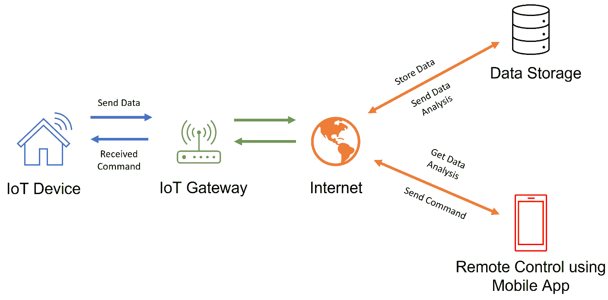
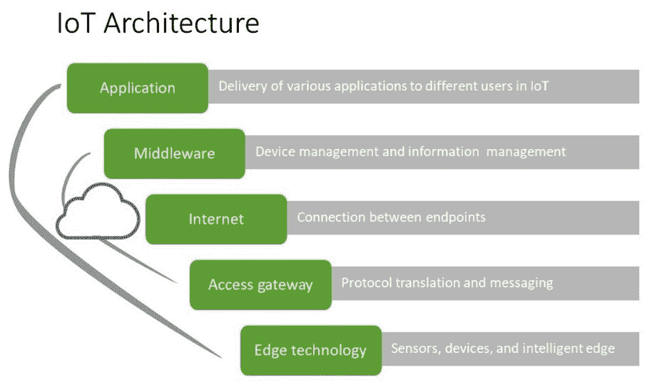
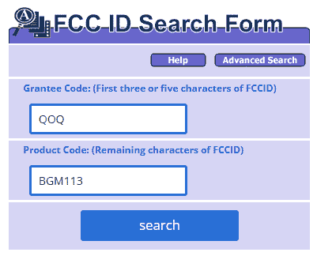
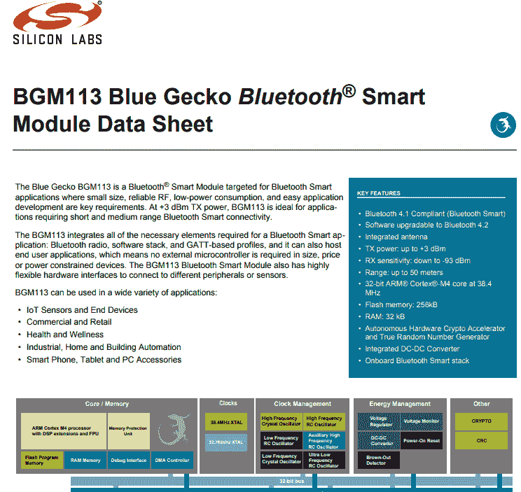
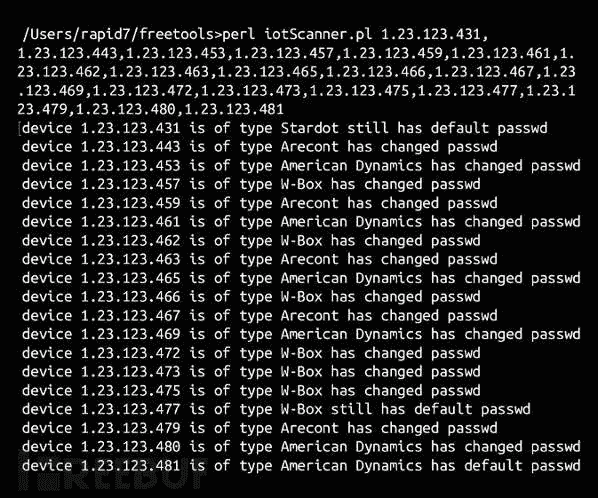
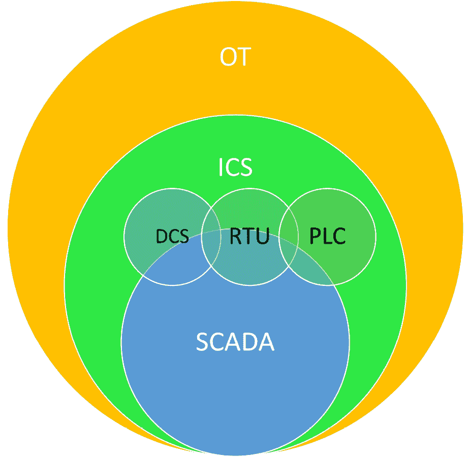

# 第十四章：黑客攻击物联网（IoT）和操作技术（OT）

哇，我们生活的这个世界真是太神奇了。过去几年中，连接互联网的设备爆炸性增长。了解这些**物联网**（**IoT**）和**操作技术**（**OT**）设备，它们的功能以及为什么这些设备的安全性如此重要，对我们来说非常关键。说真的——我们需要掌握这项技术。你不相信我？那就去问一下那个被黑客通过恒温器入侵的拉斯维加斯赌场吧… 就是在一个鱼缸上！（[`mashable.com/article/casino-smart-thermometer-hacked`](https://mashable.com/article/casino-smart-thermometer-hacked)）

在这一章中，我们将覆盖以下主题：

+   理解物联网（IoT）

+   物联网（IoT）攻击

+   用于物联网（IoT）的攻击方法

+   OT 和用来攻击它的方法

所以，让我们从理解物联网（IoT）开始。

# 理解物联网（IoT）

你一定在想——*Dale，物联网（IoT），真有那么重要吗？我意思是，它不就是主要出现在家庭里吗？* 其实，它出现在比你想象的更多的地方。我们开始看到，正因如此，这对我们来说是一个问题，因为我们在像**供暖、通风和空调系统**（**HVAC**）这样的设备中看到它。著名的 Target 数据泄露事件就是通过 HVAC 系统处理的。我们还在消防和安全系统、照明和交通工具中看到了它，这些都可能出现在办公楼、零售地点、教育、酒店、机场，甚至是体育场馆。

我们正在能源行业中看到这种现象的出现，例如风力发电机或涡轮机、电池、发电机、钻机以及其他可能用于切断电力或减缓电力流动的能源相关设备。我们还在消费品和家庭领域看到了这一现象。每当我看到一款具有互联网连接的新设备或家电时，我都感到惊讶。无论是游戏系统、警报系统、音响系统，甚至是灯光或锁具，这些设备大概率都能连接互联网。我甚至没意识到，我购买的洗碗机可以联系制造商进行故障排除。

我们还看到这一现象在工业领域的出现。例如，在矿业中，可以利用自动化技术进行资源管理，如实时资产追踪、预测性和预防性维护以及监控，这些都能检测到过度振动或温度升高，并预测故障时间和需要修复的部分。农业和灌溉系统也有自动化资源。我曾有机会与我居住的地方的一个当地市政府合作。我们将山上流下的水收集起来，存储起来，然后用于所谓的二次水。它被储存起来，然后分配到社区中，用来灌溉我们的草坪，这样我们就不需要用饮用水来灌草坪了。所有这些都通过自动化阀门来控制。自动化帮助我们节省成本，这也是它如此具有吸引力的原因。

我们还看到自动化逐渐进入安全和公共安全领域——无论是监控、追踪，还是紧急服务。物联网（IoT）正在迅速渗透，当然，我们也看到它在信息技术和网络领域的出现，涵盖了公共和企业两个层面。

一个可以访问医疗设备的攻击者可能会对我们造成真正的问题。让我们来看一个例子。我妻子恰好在一家大型零售电子商店工作。他们与几家医疗行业的公司合作，提供对老年人的监控服务，无论是通过监控服务还是他们的成年子女。自动化可以提供实时监控，例如床压传感器，这样我就能知道我父亲是否还没下床。这有助于我判断他是否可能感到不适。能够直接与老年人沟通非常重要。

我们也看到自动化出现在医疗植入物中，特别是在修改这些设备方面。我的女婿即将进行听力手术。他们将要放入他耳朵的设备将使他能够连接到婴儿报警器和烟雾探测器，以便他能清楚地听到它们，或者被通知发生了什么。所以，如果你之前没有意识到物联网已经影响了这么多领域，你会发现攻击者的攻击目标几乎每天都在增加——也许现在甚至是每小时增加。

让我们进一步了解物联网的工作原理。

## 它是如何工作的？

你可能会问自己——*物联网是如何工作的？* 好吧，你需要熟悉几个不同的组成部分。让我们从这些小设备的感应技术开始。可能它是一个门铃，或者一个温控器。它甚至可以是一个工业环境中的阀门，可以打开或关闭。

图 14.1 – 物联网设备如何互操作的示例

这些设备随后与被称为**物联网网关**的设备进行交互。这些网关用于桥接物联网设备与最终用户之间的差距。可以将它们视为物联网的中介。

接下来，我们有**通信通道**，即互联网。通过这个通信通道，我们的网关通常与我们称之为数据存储和/或云服务器的设备进行通信。

在这里，数据是在通过网关并到达云服务器后收集的。然后，这些数据会被存储和分析。根据具体的应用，这些信息可以发送到最终用户的远程应用程序，可能是在他们的智能设备上。因此，从攻击者的角度来看，*攻击向量*的可能性非常多，但我们将在本章稍后的部分详细讨论这个问题。

现在，让我们来讨论物联网的架构。

## 物联网架构

在物联网中，有不同的层次——或者说，我应该称之为组成部分——涉及到整个物联网环境。该架构由几个不同的层次组成，如下图所示：

图 14.2 – 物联网架构由多个层次组成

第一层被称为**边缘技术层**。这一层是所有硬件部分的所在，例如传感器、读取器、软件传感器或物理设备本身，以及**射频识别**（**RFID**）标签。如果你考虑我们部署的任何设备，这些设备都属于边缘技术层。这些设备的设计目的是收集信息，并将这些信息发送回云服务器或数据存储位置。

下一层我们称之为**接入网关层**。这一层是连接后端提供者和我们的边缘技术层（或设备）之间的桥梁。

接下来，我们有**互联网层**，它对我们来说非常重要，因为它是我们通信的方式。现在，根据制造商的不同，我们可以有两个不同的终端，例如设备到设备、设备到网关，甚至设备到云端。这个层次就是我们所使用的层。

我们还拥有所谓的**中间件层**，这是一个双向通信通道。此层位于应用层和我们所称的**硬件层**之间。其主要责任是数据管理，处理诸如数据分析、数据聚合、数据管理、设备过滤、设备发现，甚至是访问控制等问题，我们可以通过应用来控制谁有权访问这些设备。

然后，我们有**应用层**。物联网中的这一层负责确保不同地区和不同部门的用户能够获得所需的服务，以确保他们可以访问他们需要的任何东西。

这还不算太难吧？

现在，让我们来谈谈物联网所使用的协议和技术。

## 协议和技术

让我们将这些分解成不同的类别。

### 短程通信

让我们来看看一些可以供我们使用的短程通信资源。

#### Z-Wave

Z-Wave 是一种家庭自动化标准。它允许我们管理空调、HVAC 系统、恒温器和家庭影院等设备。我们可以通过这种方式控制从门锁到音响系统的一切。

#### ZigBee

这是一种短程通信协议，类似于 Z-Wave。这两种协议都可以视为网状网络，但 ZigBee 的优势在于，如果信号来自一个集中式的中心枢纽，每个设备都可以充当信号中继器。

有一个问题是信号传播的距离。对于 ZigBee，它的传播范围大约是 40 英尺。而 Z-Wave 在户外环境中可以达到大约 330 英尺，在室内空间通常约为 100 英尺。现在，ZigBee 的优势在于它理论上可以连接大约 65,000 个设备，而 Z-Wave 则仅限于 232 个设备。但对于我来说，一个更大的缺点是 ZigBee 使用的是标准的 2.4 GHz 频段，这个频段很多我们的无线设备已经在使用，而 Z-Wave 使用的是 908.42 MHz 频率。至于与设备和控制器的通信，两者都采用**高级加密标准**（**AES**）128 加密标准。要获得 Z-Wave 认证，这是必需的。

#### Wi-Fi

我们都知道 Wi-Fi 吧？Wi-Fi 的最常见标准是 802.11n，速度最高可达 600 Mbps，室内信号范围约为 150 英尺，室外信号范围约为 300 英尺（前提是没有障碍物）。

#### Wi-Fi Direct

这充当设备之间的点对点通信。在这里，一台设备充当接入点，另一台设备充当客户端。

#### 射频识别（RFID）

RFID 非常流行，尤其是那些到处可见的小标签，你可以把手机放在标签上，它就会查找该标签代表的产品。在攻击方面，我们喜欢制造看起来像是用于做某事的 RFID，但实际上它们做的是完全不同的事情。我们开始看到 RFID 标签被用于宠物、家畜，甚至是汽车和药品上。

#### 蓝牙智能或低能耗蓝牙（LE）

这只是蓝牙技术，但它旨在创建**局域网**（**LAN**）或个人网络。

#### 光通信或 Li-Fi

听起来像 Wi-Fi，对吧？它非常类似于 Wi-Fi，但有两个主要区别。一个是速度（224 Gbps），另一个是它使用**可见光通信**（**VLC**）（是的，我知道你们中的一些人想什么——*那不是一个媒体播放器吗？*这些缩写我们得跟得上），但基本上，我们使用光进行通信。

#### 近场通信（NFC）

这使用磁场在两个电子设备之间进行通信。例如，当你用 Apple Pay 或任何类型的移动支付方法购买东西，并把手机放下时，通常就是使用了 NFC 技术。

#### 快速响应（QR）码

QR 码是那些大多数人都见过的方形条形码。它们可以存储比普通条形码更多的信息，但两者都会包含关于产品本身或其他可能附加到它们的产品的信息。

现在，让我们谈谈中程通信。

### 中程通信

让我们来看几个我们应该了解的解决方案，因为它们帮助我们进行中程通信。

#### HaLow

HaLow 在频率范围稍低于 1 GHz，这意味着它可以传输的距离大约是标准 Wi-Fi 的两倍，而且它使用 Wi-Fi 频道上的 900 MHz 波段。900 MHz 波段非常特别，因为它能够更好地穿透墙壁或坚固结构，不需要真正的视距。

#### LTE-Advanced

这是一个标准的移动通信频率，用于提供对标准 LTE 的增强，这意味着它提供更高的数据传输速率和更远的传输距离。在性能方面，这对我们有很大帮助。

### 长距离通信

让我们讨论一些可以用于长距离通信的资源。

#### 低功耗广域网（LPWAN）

正如它的名字所示，它采用低功耗，这非常棒，但它的设计目的是提供一个在两个端点之间的长距离通信通道。

#### 低功耗广域网（LoRaWAN）

这通常用于工业设备间通信或安全的双向通信。

#### SigFox 和 Neul

SigFox 和 Neul 非常相似，都是为电池寿命非常短的设备设计的。两者都工作在 1 GHz 以下，但 Neul 利用电视空白频段的小片段来提供高覆盖范围、低功耗和低成本的网络交换。

#### 超小孔径终端（VSAT）

VSAT 是我们用于传输数据的另一种通信协议。我们通常看到小型卫星天线被用于这种通信方式。

#### 移动通信

移动通信旨在提供高质量的数据，但它是有成本的——它很贵并且功耗很高。

现在我们已经讨论了无线通信的部分，接下来看看有线通信方面的内容。

#### 以太网

我们大多数人应该对以太网比较熟悉。它用于将不同的设备连接到有线局域网（LAN）中，是最常见的局域网类型。

#### 同轴电缆多媒体联盟（MoCA）

这里我们不是在说咖啡。这是一项技术，我们可以利用现有的同轴电缆将以太网信号转换到这些同轴电缆上。然后，另一端有一个转换器，将信号从同轴电缆上取下，并重新转换回以太网。我曾经使用类似的设备将以太网转换为 HDMI，用于长距离的 HDMI 传输。

#### 电力线通信（PLC）

现在，这个非常酷。它通过我们家里/办公室的电力线路运行！我知道，对吧？这就是电线作为数据传输和电力来源的应用。

接下来，让我们讨论一些可以用于物联网的操作系统。

## 物联网操作系统

在本节中，我们将讨论物联网通常使用的操作系统。

### ARM Mbed

是的，你可以看出它是“嵌入式”的缩写，不，我没有拼写错误。这是目前最常用的低功耗设备操作系统之一，通常应用于我们的可穿戴设备。

### Zephyr

Zephyr 是一个用于资源低或受限资源的设备，以及低功耗设备的操作系统。

### Ubuntu Core

Ubuntu 也叫做 Snappy，我们看到它被应用在无人机和网关上。这些可以在物联网和机器人中找到。

### Apache Mynewt

这是一个设计用于运行在利用低能耗蓝牙协议的设备上的操作系统。

### RIOT

我们在许多执行器板、传感器甚至嵌入式系统中看到这个操作系统。通常，这个操作系统非常安静，所以它是一个安静的暴乱。明白我说的意思吗？如果你不熟悉，这是一支 1980 年代著名的摇滚重金属乐队，你也可以去 Google 一下，不过别*猛敲头*去找它。好吧？我还是放弃我的白天工作，继续坚持写这本书。

### Brillo

这是一个基于 Android 的操作系统，通常被视为嵌入式操作系统。我们将把它用于低端设备，如我们的恒温器。

### 实时操作系统（RTOS）

这些类型的操作系统运行极其快速；我们说的是毫秒级的速度。我们需要这些类型的操作系统，是因为在某些场景下，交互必须是即时的。例如，当你的汽车气囊弹出时，你不能等几毫秒，气囊才能展开来挽救你的生命。

两个最著名的 RTOS 包括 Nucleus 和 Integrity。Nucleus 和 Integrity 之间的主要区别在于，Nucleus 具有存储和数据库管理、USB 和网络功能以及多媒体支持。它还具有一些先进的**图形用户界面**（**GUI**）功能，而 Integrity 则设计用于更多的多核计算机。RTOS 通常用于军事功能中，例如**联合打击导弹**（**JSM**），该导弹最初为挪威皇家空军开发。洛克希德·马丁公司将其与 F-35 战斗机一起使用，这个操作系统内部运行在炸弹舱门上，以便在发射导弹时，炸弹舱门可以瞬间打开。再次强调，当飞行员按下按钮时，必须立刻发生，而不是等几秒钟。

### Zephyr

我们之前提到过 Zephyr 作为操作系统，它也是一个实时操作系统，可以应用于各种设备，无论是可穿戴设备、物联网路由器，还是机器人。

### Windows 10/11 IoT

Windows 10 和 11 IoT 是 Windows 的版本，专门运行在*无头*设备上（即没有连接键盘或鼠标）。它被设计为无显示器运行，并为物联网设备提供集成、高安全性，以及直接来自微软的更新。

### 亚马逊 FreeRTOS

这个 RTOS 非常小巧。它是为微控制器设计的，使得小型、低功耗的边缘设备易于编程、部署、保护和管理。

接下来，让我们讨论物联网给我们带来的挑战。

## 物联网所面临的挑战

正如你到目前为止所看到的，关于物联网，我们面临着许多重大的攻击向量问题。以下是一些带来许多漏洞的挑战：

+   其中之一是我们拥有的互操作性标准，或者说是缺乏互操作性标准。目前，有这么多产品内置了物联网功能，但没有哪个厂商真正遵循一个标准。一些制造商并不关心他们设备的安全性。这个问题很严重，因为这些制造商中的一些并没有关注他们设备的使用方式，尤其是在测试他们的**应用程序接口**（**API**）或者它们无法确保设备安全方面。所以，无论是来自最终用户还是第三方，都可能会出现安全漏洞。例如，假设我的 SmartThings ([`www.samsung.com/us/smartthings`](https://www.samsung.com/us/smartthings)) 中枢与几个不同的产品兼容，但为了建立这个连接，它必须发布一个 API。如果这个 API 被利用，并且举个例子，如果我家里有无线音响，如果这个产品在安全方面存在缺陷，攻击者可能会想办法访问三星中枢。

+   我们还面临着一个问题——信不信由你，明文传输和开放端口仍然在被使用。许多这些设备在没有使用任何加密技术的情况下就被出售，数据在设备与网关之间或网关与云服务之间进行传输时没有加密。这也可能发生在开放端口上，因为可能有人忘记关闭它们。我们还面临着基本的安全性和隐私问题没有得到遵循的问题。同样，制造冰箱的公司可能没有任何员工关注安全或隐私问题。

+   我们还面临着固件和操作系统更新支持的问题。有时，更新固件可能会变得很困难。让我们来看一个例子。我在自行车上安装了一个小电脑，我几乎每天都骑行，它可以跟踪我的骑行距离、海拔、爬升高度、速度、心率，甚至踏频。这个产品让我很震惊，因为我下载了它的应用程序，运行了几天后，我开始考虑固件的问题。那么，如何更新固件呢？经过一些研究，我发现我必须下载一个单独的应用程序来进行更新，但我并未被告知这一点，也没有人告诉我应该下载一个单独的应用程序。现在，记住，我们更新操作系统中的固件是为了修补漏洞或防止设备中的安全漏洞，而在某些情况下，厂商的更新可能会导致设备某些功能失效。因此，在某些情况下，制造商会拒绝允许固件或操作系统更新，因为这会导致某些功能无法正常工作。

+   最后，我们有存储问题。如今，这些设备在物理尺寸上越来越小——例如，一只每天提醒我喝水的水瓶。那里没有太多空间来放置大量硬件，所以我们不会有太多存储空间。然而，设备的传输几乎是无限的，对吧？这最终会给我们带来数据存储的问题，以及我们需要确保我们或制造商实施的管理或保护措施。你可能会有比实际需要更多的数据流量，因为没有足够的存储空间。我们必须把它清除掉，对吧？再次强调，我是从制造商的角度来讲的。是的，你能相信这竟然发生了吗？默认或弱密码仍然在使用。在某些情况下，它们是硬编码的。通常，制造商甚至没有意识到这些存在。这是因为他们从第三方购买操作系统或接口，想要将其集成到自己的产品线中。

所以，正如你所看到的，物联网带来了一些我们需要理解并为之做好准备的挑战。现在，让我们谈谈物理攻击。

## 物理问题

对物联网设备的物理攻击包括攻击者从你那里窃取设备，可能会修改或篡改设备，伪造设备，甚至注入恶意代码，然后将设备放回到你的网络中。这听起来一点也不好玩。

我们还面临不安全的 Web 接口。我们发现很多这些设备都内置了 Web 接口。每当我们谈论 Web 接口时，我们知道必须有一个 Web 服务器来支持它。如果没有及时打补丁，数据可能以明文传输，或者—更糟糕的是—根本没有安全措施，这种挑战可能会导致对设备本身的漏洞攻击。

它是一个小型计算机，那么我可以做缓冲区溢出攻击吗？完全可以。由于这些设备容易受到缓冲区溢出攻击，这意味着它们也容易受到 SQL 注入攻击或某种类型的注入攻击。

我们还面临开发问题。我说的意思是，作为安全专家，我们不得不面对这些设备进入我们的网络基础设施。有时，由于这些设备的复杂性或它们的操作方式，这增加了我们必须部署和实施的各种政策的复杂性。在某些情况下，我对那些必须制定这些政策的人感同身受，因为它给本来可能已经安全的网络环境带来了全新的挑战，而现在我们还得担心物联网。

我们还面临着供应商支持的问题。设备只有在供应商为你提供支持的情况下才有用。在某些情况下，我们看到供应商破产（特别是在他们被入侵之后）。如果你打算将这些设备引入你的基础设施中，固件和操作系统必须是可以升级的。这应该是强制性的。如果任何公司或供应商不支持这一点，你应该寻找完全不同的解决方案，因为你只是在为自己开了一扇门。

我们还面临着监管和权利问题，这更多是一个*可能发生的事情*。由于物联网设备之间的各种互联，可能会出现一些安全问题，而这些问题目前没有法律界定。我给你举个例子。让我们回到通过鱼缸恒温器入侵赌场的例子。那么，谁该为此负责？是恒温器的制造商，还是将物联网设备连接到内部网络而不是隔离网络的赌场？所有这些问题对我们来说都是挑战，但希望这一领域很快会有所明确。

接下来，我们来讨论物联网黑客攻击的过程。

# 物联网黑客攻击

让我们来谈谈物联网带给我们的一些漏洞和难题。

首先是我所称的**数据价值**。这涉及到捕捉数据，当物联网设备相互通信并与其背后的云平台或云服务提供商进行连接时，这增加了风险，因为它让物联网变得更加隐蔽。我们开始不断看到物联网环境使攻击者能够访问其他设备以及它们可能连接的网络。因此，许多公司将物联网环境部署在其生产网络上，这让我内心感到既难过又恶心。

另一个问题是数据聚合。同样，我们有很多设备在与其他可能不在我们控制范围内的资源进行通信。

还有一种被称为传感器融合的概念，这指的是将两个完全独立的传感设备的信息结合起来，以创建更复杂的信息或攻击者正在针对的环境视图。让我给你举个例子。在波士顿，市政府创建了一个应用程序，用于识别城市道路上的坑洼，利用手机、加速度计和 GPS 数据。这些信息会发送到公共工程部门，帮助他们找出最严重的坑洼。但如果从攻击者的角度考虑，如果我能够访问到这个环境，攻击者是否可以利用这个应用程序或其信息，可能会将城市服务从最需要关注的区域转移开？

我们还有集成问题。现在，你可能会想，太好了——集成，对吧？我们通常把它看作是积极的事情。但是，当我们开始允许这些不太安全的设备接入我们的现有网络，并将它们集成到我们需要内部开发的应用程序，甚至是其他物联网应用程序时，我们应该感到有点担忧。

这是一个巨大的问题，因为医疗行业正被成百上千种基于物联网环境的不同设备淹没。试想一下，如果成千上万，甚至是几十万个这样的设备被部署，你需要确保一个特定的泵能收到正确的指令来更新剂量。我们还需要确保只有医生或护理人员才有权这样做，并且没有人能够黑入系统。

### 问题根源

首先，肯定是应用程序，对吧？应用程序可能会因为没有安全更新、使用默认密码，甚至是无法更改的密码或后门而引发问题。

我们还面临着移动性问题，以及我们拥有各种通信渠道的事实。它们是否被加密？我们是否在使用认证？即使有人使用不安全的 API，我们是否缺乏适当的存储安全性？

我们还有云服务。可能我们的认证没有正确地与云服务提供商进行设置，或者存储或通信到云端时没有加密。然后是托管在云环境中的应用程序的 Web 界面，再然后是网络本身。应该运行的服务是否正在运行，且是否已经被锁定并确保安全？我们是否有任何更新被推送到我们的设备，无论是手动的、自动的，还是通过第三方应用程序？你的物联网环境中是否有防火墙？同样，最佳实践是将物联网环境放在完全隔离的网络中，就像任何网络一样，你需要确保有相同类型的安全设备到位。记住，当我们引入云时，我们实际上是在引入一个全新的基础设施。

### 设备内存挑战

让我们谈谈庞大的攻击面，实际上，当我说庞大时，它真的是非常大——**设备内存**。我们在讨论设备运行的空间有多少。让我们来谈谈一些可能存储在设备内存中的东西。

加密密钥？没错，绝对是。那第三方供应商的凭证呢？对，甚至可能会存储明文凭证。

我们还有生态系统访问控制；这意味着集成在我们物联网环境中的任何组件。假设我们在组件之间有信任关系或不同类型的信任。例如，三星默认情况下，通过他们的 SmartThings 中心，自动信任所有组件——无论是水传感器、运动传感器还是位置传感器——所以这种隐式的信任关系可能成为我们的漏洞。此外，还有将设备注册到你的环境中的问题。

让我举个例子。当我连接我的三星 SmartThings 中心时，我惊讶于它工作的简便性——我只需要打开运动传感器，它就自动识别了几个设备。所以，没有进行任何身份验证就可能让恶意设备接入。

好吧，我们该怎么做呢？我们需要有某种方式来退役这些设备，例如清除数据，甚至只是将设备重置为出厂默认设置，以确保设备的内存或存储中没有任何残留数据。

我们还有一个物理接口。物理接口可能包括用户**命令行界面**（**CLI**）以及管理员 CLI。同样，如果我们给一个个人用户访问设备的权限，并且他们在该设备上具有管理员权限，从攻击者的角度来看，这将是我进入他们网络的一个重要突破点，并且有可能进行特权升级的场景。设备是否有物理端口，例如 USB 端口？它是否支持通用即插即用（Plug and Play）？当你插入一个 Rubber Ducky 时会发生什么？如果你不熟悉 Rubber Ducky，它是一个 USB 闪存盘，但系统会将其识别为键盘，这意味着我可以输入各种有趣的命令。在查看物联网设备时，你应该关注供应商是否支持禁用这些类型的端口或该设备上可能提供的不同服务。

另一个攻击面是 Web 界面本身。就像任何其他情况一样，当涉及到 Web 界面时，我们可能会遇到一些问题，例如某种类型的注入攻击、跨站脚本攻击，甚至是跨站请求伪造攻击。在某些情况下，我可能能够进行某种用户名或用户账户的枚举。

现在，让我们来谈谈各种物联网攻击。

## 物联网攻击类型

由于市面上有各种各样的物联网设备，我们需要意识到一些潜在的攻击类型，这些攻击可能会发生在物联网设备上。

### DDoS 攻击

这就是攻击者将你的所有物联网设备转变为恶意小设备，用于执行 DDoS 攻击或使它们成为更大僵尸网络的一部分。

### 滚动码攻击

大多数物联网设备使用滚动码。这类似于你汽车或车库门开启系统中的无钥匙进入系统，在那里你必须按照正确的顺序按下按钮，门才会打开。攻击者通过让你尝试一个接一个的代码，直到找到那个能够打开你门的正确代码，从而迫使你与他们的设备配对。从理论上讲，这是不可能的，因为攻击者必须制造一个与密钥相匹配的设备，而你的控制器不允许在你的区域内使用多个具有特定密钥的设备。但是，大多数设备的滚动码并不是真正随机的。

### BlueBorne 攻击

BlueBorne 更像是一个关于物联网设备通过蓝牙进行通信的攻击，而不是一个具体的物联网攻击，Android 和 Linux 自 2012 年起就默认支持蓝牙。Android 自 2017 年 9 月起提供了补丁，当时这一漏洞被公开曝光。但正如我们所讨论的，许多产品即便厂商知道这个问题，仍然不会进行修补，因为它们无法以现有价格制造另一台设备。我认为在大多数情况下，这些设备应该是非法的。

### Sybil 攻击

想象一下，有人创造了几十个假设备，比如婴儿监视器或灯泡，所有这些设备都有不同的 MAC 地址。他们使用这些假设备与您的真实设备进行通信，并了解您的网络情况。然后，他们通过接管其中一个设备的真实身份，利用它来发现更多有关您网络的信息。

### 干扰攻击

这与吐司、果酱和刀子无关。这里指的是有人在与您的设备相同的频率上进行广播，导致它发生干扰，甚至根本无法工作。

### 通过后门入侵智能电网

这是指电力公司在您家中的网络上有一个设备，允许他们远程开启或关闭电器。所以，假设网络安全研究人员发现了许多此类设备中的后门，使他们能够开关你的电器。嗯，这样不会在医院等场所引发问题吧？

### 基于 SDR 的攻击

**软件定义无线电**（**SDRs**）给物联网基础设施带来了新的挑战。SDR 是通过软件控制射频硬件的方法。根据使用者的不同，这可以用来做好的事情或坏的事情。SDR 是一种可以理解如何发送和接收无线电频谱内不同频率的设备。攻击可以在全双工（双向通信）和半双工（单向传输）模式下进行。

你还可以使用 DNS 重新绑定来修改目标路由器或网关上的某些 DNS 条目，然后通过其 Web 界面使用默认密码与这些设备通信。疯狂吧？

现在，我们来讨论一些物联网中使用的方法。

# 物联网使用的方法

攻击者使用的方法通常会遵循一定的方法论。这些方法可以被分解成我们接下来讨论的几个部分。我们来看一下吧。

## 侦察

大多数物联网设备是参与 IP 网络的终端。网络侦察是收集这些网络和系统信息的过程。当我们谈论物联网时，这意味着扫描常见的漏洞，例如默认密码或可能公开可用的硬编码密钥。大多数攻击者会使用专门的工具，如 Metasploit 或 Shodan 来找到这些目标。根据网络类型，可以使用各种工具。

Shodan 是一款令人惊叹的信息收集工具。这个搜索引擎可以找到各种各样的设备，包括网络服务器、路由器、打印机、IP 摄像头等。常见的情况是设备上如**无线接入点**（**WAPs**）或 IP 摄像头使用了默认密码。这些信息对黑客来说非常有价值，可以用于后续的利用（例如，利用弱密码）。

举个例子，要在 Shodan 上搜索某条街道的网络摄像头，你需要输入 **webcamxp city:"GothamCity"**（或你目标城市的名称），这样就可以显示你所在城市的公开可见网络摄像头。想查找 Google 的 Web 服务器吗？输入 **Server: gws" hostname:"google"**。或者你想看到一些令人毛骨悚然的东西吗？比如 **password 1234**？没错，这会列出使用密码为 1234 的设备。疯狂吧？

如果你想获取大量信息，可以访问 FCC 的网站（美国联邦通信委员会）[`www.fcc.gov/oet/ea/fccid`](https://www.fcc.gov/oet/ea/fccid)（参见*图 14.3*和*图 14.4*）。这是一个所有在美国分发或制造的设备必须进行注册的组织。这里有大量的情报。

图 14.3 – FCC 网站

如下截图所示，它可以提供很多有用的信息：

图 14.4 – 来自 FCC 的项目详细 PDF 文件

如果你在寻找实际的应用程序，可以查看 MultiPing（[`www.multiping.com`](https://www.multiping.com)）或 IoTSeeker（[`github.com/rapid7/IoTSeeker`](https://github.com/rapid7/IoTSeeker)），它们会扫描你的设备，并告诉你它们是否仍在使用默认密码。

图 14.5 – 使用物联网寻求者应用程序后的示例结果

攻击者常用的另一种方法是（与网络侦察结合使用）尝试将从设备 Web 界面收集到的信息与他们对 Linux/Unix 系统的了解结合起来。例如，HTTP 事务中的头部元信息通常包括软件版本号和其他线索，这些都可以揭示在常见协议的实现中存在的漏洞。

一旦攻击者对物联网设备的内部操作有了一些了解，他们就更容易在其代码中找到漏洞。这时，扫描便发挥了作用。

## 漏洞扫描

一旦攻击者找到了潜在的目标，他们便开始进行漏洞扫描。这涉及使用已知的漏洞利用工具，这些工具可能公开发布，专门针对物联网设备的软件或固件中的特定漏洞。这些漏洞利用工具通常来自第三方研究团队（如 Google Project Zero 等），他们会识别并公开各种设备的安全漏洞，或者来自那些可能未向客户披露这些漏洞的供应商。另一个获取漏洞信息的好地方是**美国计算机应急响应小组**（**US-CERT**），因为他们通常会发布关于可能影响物联网设备的最近发现的漏洞的警告。

这些漏洞通常基于协议中的已知实现、漏洞或设计缺陷，理解这些问题是识别潜在目标的前提。随着设备支持的协议列表的增加以及其处理攻击者发送内容的能力增强，这一过程会变得更加容易。

## 发动攻击

一旦攻击者识别出已知漏洞，他们将通过利用该特定漏洞开始渗透测试，针对物联网设备的特定操作环境。我们不能过分强调在实验室环境中进行此类活动的重要性！

## 获取并保持远程访问

这时，物联网研究人员（就是你！）将对他们发现的特定漏洞应用特定的漏洞利用工具。然后，攻击者可以运行一系列测试，以确定设备是否已被成功攻陷，攻击是如何完成的，以及进入系统后可用的用户级访问权限。

在获得远程访问权限后，攻击者有多种方法可以渗透和提取物联网设备中的数据。这可能包括在物联网设备上上传并执行脚本以获得持久性、建立远程 shell 以便后续使用，甚至在与设备相连的其他设备中横向移动，从而危及网络中的其他设备。

一旦攻击者获得了设备的访问权限，他们会采用各种方法来维持和扩展访问权限。攻击者通过删除日志、升级固件以及使用恶意应用程序如后门、木马和其他恶意软件来隐藏自己，以便保持对设备的控制。为了利用固件，攻击者使用像 Firmware Mod Kit 或 Firmwalker 这样的工具。

说到固件，固件是一组指令，告诉硬件如何运行。固件分析是检查目标物联网设备固件的过程，目的是识别其潜在的缺陷和风险。攻击者利用固件分析来查找密码、API 令牌、端点、正在运行的易受攻击服务、后门账户以及正在使用的配置文件。随着时间的推移，攻击者可以逆向工程固件，发现弱点和后门，这些后门为他们提供未来的访问手段。攻击者并不总是需要保持所有这些能力；相反，他们应该准备好多种应急措施，随时准备使用其他专门的工具。例如，使用像 Mirai 或 BASHLITE 这样的恶意软件，可以在攻击者希望重新控制设备时保持未来的访问权限。

现在，让我们来看一些保护物联网设备的方法。

## 保护物联网设备的对策

由于存在许多不同类型的威胁，而且每种威胁都有自己攻击和利用物联网设备的方式，因此我们无法完全防范所有威胁。将所有防护措施结合起来对于大多数物联网用户来说既繁琐又昂贵，但物联网设备制造商处于独特的地位，可以通过设计来实现物联网安全。

然而，我们可以采取一些步骤来保护网络。我们来看看：

1.  禁用任何访客或演示账户。

1.  对无效登录尝试启用任何*自动锁定*功能。

1.  使用强身份验证机制。

1.  将您的控制系统和设备放置在防火墙后面。

1.  将物联网网络与您的企业网络隔离。

1.  保护物联网设备免受物理访问。

1.  禁用 Telnet。

1.  使用端到端加密和**公钥基础设施**（**PKI**）。

1.  部署 IPS 和 IDS 设备。

1.  你知道这一点——更新，更新，再更新。

现在，让我们讨论一下操作技术。

# OT 及其被攻击的方法

**操作技术**（**OT**）是一个术语，用来描述在当今现代社会中作为一个集成或同质化系统共同工作的多种技术。例如，电信行业广泛使用 OT 将数据从电网传输到配电站。这些相同的通信也用于电力消费者和生产者之间的金融交易。OT 是一个硬件和软件的网络，用于监控、管理和控制工业过程资产。在尝试攻击 OT 之前，掌握 OT 的基本原则至关重要。

### 普渡模型

在这个时候，是时候简要谈谈普渡模型了。普渡模型源自**普渡企业参考架构**（**PERA**）模型，该模型广泛用于描述工业控制系统（ICS）网络中各个关键组件的内部连接和依赖关系。它由三个区域组成：制造区域（OT）和企业区域（IT），它们之间通过**非军事区**（**DMZ**）隔开。

Purdue 模型可以用于分析、设计和保护 ICS 网络。它有助于识别潜在的安全风险和漏洞，并提供如何减轻这些风险的指导。

在这个模型中，制造区（OT）是网络中最关键的部分，因为它包括所有负责过程控制和自动化的现场设备。企业区（IT）则不那么关键，它仅提供数据存储、连接性和其他业务功能。DMZ（隔离区）用于分隔制造区和企业区，通常包含如防火墙和**入侵检测系统**（**IDS**）等安全设备。

我们将在本章后面详细讨论各种 OT 话题。

让我们从回答“什么是 OT？”这个问题开始。OT，或**工业控制系统**（**ICS**），指的是一套专门的计算机硬件和软件系统，致力于管理和监控物理设备。ICS 包括**监控与数据采集系统**（**SCADA**）、**远程终端单元**（**RTU**）、**可编程逻辑控制器**（**PLC**）、**分布式控制系统**（**DCS**）以及其他帮助监控和管理工业操作的专业网络系统，都是这项技术的一部分。

图 14.6 – OT 的组成部分

现在，让我们来看一下 OT 及其面临的安全挑战。

### OT 和安全——一个两难问题

ICS（工业控制系统）可以监控和控制如电网、石油管道、空中交通站网络等基础设施，但这些系统有一个根本的安全缺陷——它们是为了监控和控制而构建的，并非专门为了保护。

这种不准确性源于 OT 系统对复杂基础设施内部情况的信息访问有限。例如，某个制造厂的 OT 控制系统可能提供水箱中的水位信息，但通常无法获取水温或 pH 值等信息，而这些参数对于化学过程的最佳运行至关重要。

## 黑客攻击 OT——对关键基础设施的威胁

与普遍看法相反，控制基础设施（如电网、石油炼油厂、大坝等）的系统并不安全。随着 OT（运营技术）网络的复杂性增加，黑客们也不得不通过更多地了解他们所攻击的 OT 系统来提升攻击技巧。坏消息是，入侵 OT 系统所需的知识和技能远少于入侵传统 IT 系统。

黑客攻击的成功取决于两个关键因素——目标系统的漏洞和黑客利用该漏洞的能力。近年来，安全研究人员在 ICS 系统中发现了许多漏洞，并在 Black Hat、DEFCON、CanSecWest 等安全会议上发布了他们的研究成果。这些漏洞使得经验丰富的黑客可以轻松渗透 IT 网络并控制 OT 系统。

### 我们是否应该将 IT 与 OT 合并？

IT/OT 集成可以通过减少两者之间的差距来提升公司的表现。IT 与 OT 的融合不仅仅是使用技术，更是关于人员和流程。传统的 IT/OT 团队通常是分开管理的，IT 员工在一个部门，OT 员工在另一个部门。例如，IT 团队负责跟踪内部流程，如编程、系统更新和网络安全。另一方面，OT 团队负责确保一切在内部和外部都能顺利运行。IT 和 OT 团队必须了解彼此的操作和组织结构。这并不意味着 IT 专家必须转变为现场或工厂人员；而是意味着将他们连接起来，以便他们可以合作提高安全性、效率、质量和生产力。

### OT 风险的挑战

正如我之前提到的，大多数 OT 系统仍在使用旧版本的软件和过时的硬件，这使得它们容易受到网络钓鱼、间谍活动、勒索软件攻击和其他类型攻击的危害。这些攻击可能对产品和服务造成严重损害。

为了防止这些漏洞被利用，以下是 OT 带给我们的风险：

+   **物理和环境灾害**：这是 OT 环境中最著名的风险之一。比如飓风或龙卷风可能会损坏设备和设施。

+   **故意攻击**：恐怖主义、破坏活动和间谍行为可能对财产和人员造成重大损害。

+   **恶意程序如病毒和恶意软件**：这些是 OT 环境中最常见的攻击之一。病毒和恶意软件能够迅速传播，影响工厂内的各种设备。

+   **社会工程学**：这包括使用以人为中心的攻击方法来获取 OT 系统的访问权限。例如，通过网络钓鱼或垃圾邮件向员工发送邮件，诱使他们泄露密码。

+   **网络复杂性**：OT 系统使用的技术与 IT 系统不同，因此需要明确分隔网络。然而，额外的网络入口点可能会成为安全风险。

+   **缺乏可见性**：OT 网络没有得到适当的监控，因此威胁未能被及时发现。这可能导致一系列连锁反应的威胁，影响到许多人和设备。

+   **安全管理薄弱**: OT 系统的安全防御薄弱，这使得它们容易受到网络攻击。

+   **过时的系统**: 缺乏更新和补丁可能使 OT 系统暴露于危险之中。

+   **IT 与 OT 的融合**: 正如我之前提到的，IT 和 OT 团队的融合使他们能够一起合作。然而，这并不是一项容易的任务；两方都需要付出相当的努力，学习彼此的角色以及如何为各自的领域做出贡献。

+   **脆弱的协议**: 协议栈是所有网络流量的基础。开放和损坏的协议可能使攻击者能够控制 OT 系统。

+   **安全性模糊化**: 这指的是制造商不与他人（包括竞争对手）分享其产品的知识。当这种情况发生时，黑客更容易找到进入这些设备的方式。

+   **缺乏培训**: OT 人员和团队没有接受相关的系统安全培训。因此，他们将公司设备和数据置于风险之中。

+   **缺乏安全标准**: 目前没有 OT 设备的安全标准，这意味着每个开发人员可能实现自己的防御机制。不幸的是，这些措施往往缺乏适当的测试和验证，留下了可能被利用的漏洞。

接下来，我们将讨论 ICS。

## 工业控制系统（ICS）简介

ICS 被用于控制工业过程。它们是计算机系统，用于监控和控制压缩机、泵、发电机、电动机、反应堆、锅炉、炉子、烤箱、涡轮机、传送带等设备的操作。这些组件构成了 ICS 环境：

+   **监督控制与数据采集** (**SCADA**): 这些是控制系统，可以通过 ICS 环境监控和控制设备。

+   **分布式控制系统** (**DCS**): 这些是利用分布式计算的 SCADA 更高级的版本。

+   **可编程逻辑控制器** (**PLC**): 这些是与离散（不连续）信号配合使用的小型计算机。它们可以监控和控制设备、处理数据等。

+   **人机界面** (**HMI**): 也称为“人机界面”。它用于获取来自设备、传感器等的反馈。如果 ICS 环境监控到 HMI 的任何异常或问题，它可能会通过电子邮件、短信等方式向其他人员发送警报。

+   **业务流程控制系统** (**BPCS**): 这些系统利用专门的软件和硬件来监控和控制工业过程。BPCS 可以用于运行整个 ICS 环境或仅运行其中的某个组件，例如 PLC 或 DCS。

+   **安全仪表系统** (**SIS**): 这些是控制工业过程中（通常是危险）物料流动的软件程序。如果它们检测到任何问题，可以通过电子邮件、短信等方式向其他人员发送警报。

+   **工业爆炸装置**（**IED**）：这些是用于处理危险物料的爆炸装置。它们通常是 SIS 功能的一部分。

通过 ICS 环境，操作员可以在全球任何地方监控其设备和过程。然而，如果该环境没有得到适当保护，它可能会成为网络攻击的目标。在这种环境中，实践良好的网络安全是明智的，因为它控制着可能对人身和财产构成威胁的重要组件。

让我们讨论一下 ICS 的不同操作模式。

### ICS 的操作模式

ICS 系统可以配置为三种不同的模式：

+   **开环**：在开环控制中，环境没有反馈。例如，考虑一个放在烤箱里的温度传感器。烤箱的计算机会一直开或关，直到达到由人工操作员或程序设置的期望温度。

+   **闭环**：在闭环控制中，环境有反馈。再以烤箱为例，温度传感器会通知计算机根据情况开关，直到达到预设的期望温度。

+   **手动环路**：在手动环路控制中，环境有反馈，但控制环路由人工监督。此系统不会自动开关，直到人工操作员介入操作。

接下来，我们将讨论与 ICS 相关的潜在风险与威胁。

### ICS 的风险与威胁

不幸的是，ICS 容易受到网络攻击。以下是与 ICS 相关的几个已知风险与威胁：

+   ICS 系统容易受到多种网络相关攻击（例如，网络嗅探和欺骗）。这些攻击可以用来拦截敏感信息、修改数据等。

+   ICS 系统容易受到恶意软件攻击（例如，病毒和蠕虫）。恶意软件可以对设备造成物理损坏、数据丢失等问题。仅仅用不正确的设备查看恶意软件也可能导致其启动。

+   ICS 系统容易受到勒索软件攻击。这些是恶意软件程序，用于加密 ICS 数据，直到支付赎金以换取解密密钥。

+   攻击者可以通过社会工程手段攻击人员，以获取对 ICS 环境的访问权限。例如，他们可能会打电话给工作人员，假装是来自可信公司的官方邮件发送者。

+   ICS 系统容易受到**拒绝服务**（**DOS**）攻击。这些攻击通过向计算机发送无用数据来瘫痪 ICS 环境，目的是让计算机的资源被过度消耗，从而无法执行正常操作。

+   ICS 系统容易受到木马攻击。木马用于获得计算机的后门访问权限。像恶意软件一样，木马也能造成物理损害。

+   ICS 系统组件可以被黑客攻击，执行恶意行为。例如，PLC 或 DCS 可能会被黑客攻击，导致流程停机或 ICS 环境中的其他问题。

+   ICS 系统易受到多种客户端攻击（例如跨站脚本和跨站请求伪造）。此类攻击可以针对客户端发起，黑客可以通过受害者的授权访问系统。

现在，让我们来看一下使用 ICS/SCADA 系统时的端口使用情况。

### ICS/SCADA 系统使用的端口

用于 SCADA 和其他关键基础设施系统的 ICS 通常使用七端口通信协议连接终端设备：

+   端口 **80**：HTTP（用于 ICS/SCADA 客户端与服务器之间的通信）

+   端口 **88**：UDP（用于 ISC/SCADA 组件之间的通信，进行状态更新、设备命名等）

+   端口 **21**：FTP（用于在 ICS/SCADA 组件之间传输文件）

+   端口 **25**：SMTP（用于发送电子邮件）

+   端口 **23**：Telnet（用于连接远程设备以配置或检查其状态）

+   端口 **161**：SNMP（用于网络管理和通过 IP 网络配置设备）

+   端口 **443**：HTTPS（用于 ICS/SCADA 组件之间的加密通信）

现在，让我们讨论 ICS/SCADA 可能遭遇的一些攻击。

### 对 ICS/SCADA 的攻击

ICS/SCADA 存在被攻击的漏洞。以下是可能对 ICS/SCADA 发起的潜在攻击：

+   **基于 HMI 的攻击**：基于 HMI 的攻击针对人机界面，这些界面用于查看和操作 ICS/SCADA 系统中的数据。此类攻击可以通过未经授权访问网络或欺骗操作员访问伪造网站，从而在他们的计算机上启动恶意软件。

+   **内存损坏**：内存损坏攻击是一种黑客攻击，旨在破坏 ICS/SCADA 组件的内存，使其无法按预期工作。这些类型的攻击可以通过未经授权访问网络或拦截组件之间的通信来发起，从而篡改它们。

+   **凭证管理**：这些攻击旨在通过使用默认密码访问 ICS/SCADA 环境。还包括数据传输过程中的缺乏加密，这将暴露明文密码和账户名。

+   **代码注入**：这些类型的攻击将恶意代码注入 ICS/SCADA 软件中，导致技术问题、破坏操作或允许攻击者访问系统。此类别中的漏洞包括常见的代码注入，如 SQL 注入、操作系统注入、命令注入以及一些特定领域的注入。Gamma 脚本，像许多其他面向 HMI 的领域特定语言，也容易受到代码注入攻击。

现在，让我们讨论一些关于辅助通道攻击的具体情况。

### 辅助通道攻击

这些类型的攻击针对加密系统的物理实现（例如，任何处理加密的内容）。它们利用物理实现的非预期特征泄漏有关加密密钥或其他敏感数据的信息。

可以使用功率分析来通过观察计算发生所需的时间量或通过测量集成电路的电磁辐射来推导有关加密密钥的信息。

定时分析是另一种被认为是高吞吐量的侧信道攻击，允许攻击者以足够快的速度执行它，以在大多数情况下取得效果。定时分析可用于 ICS/SCADA 系统，因为它们通常在带有 RTOS 的嵌入式设备上运行。攻击者使用循环方法来恢复这些密码。他们逐个字符尝试，直到找到第一个有效的字符，然后如果第一个正确，则重复其他字符。如果不正确，则循环结束。通过监视设备完成整个密码验证过程所需的时间，攻击者可以确定输入的正确字符数。

### 你如何防御 OT 黑客攻击？

防御 OT 黑客攻击的最佳方法是通过意识和定期审计，例如红队演练。意识可以通过定期培训计划实现；审计应包括寻找网络和设备数字文件系统中的漏洞的测试人员。此类审计还考虑如果系统被黑客入侵会发生什么：多少设备可能会受到影响，业务多快会意识到威胁？

这是在试图防御 OT 黑客攻击时需要考虑的一些选项列表：

+   为降低当前风险敞口，定期进行风险评估。

+   使用专门构建的传感器在不活动状态下发现网络中的漏洞。

+   通过将威胁情报与资产保护相结合，您可以检测威胁并优先处理 OT 补丁。

+   确保您的 OT 设备和软件始终保持最新状态。

+   未使用的端口和服务应禁用。

+   对于 OT 应用程序，使用最佳安全实践和安全编码。

+   连续监视和检测由 OT 系统生成的日志数据是必要的，以发现实时攻击。

+   提高员工的安全意识，并为他们提供最新的安全措施。

+   使用哈希算法创建强大且安全的密码，并更改出厂预设密码。

+   使用双因素身份验证、VPN、加密、防火墙等提供通过各种屏障的安全远程访问。

因此，正如您所看到的，物联网面临着挑战，随着越来越多的设备进入物联网世界，这些挑战将会增加。

# 摘要

在本章中，我们讨论了物联网（IoT）和运营技术（OT）。在如此多产品都带有一些智能方面的发展时，平衡功能和安全性是一个挑战。不幸的是，安全方面似乎是次要的，这带来了一系列潜在的安全漏洞。我们讨论了什么是 IoT，一些黑客 IoT 的方法，以及攻击者可以在 IoT 上使用的一些方法。最后，我们讨论了 OT 在 IoT 安全挑战中的作用。

在下一章中，我们将讨论云计算。

# 问题

最后，这里有一些问题供您测试对本章材料的了解。您可以在*附录*的*评估*部分找到答案：

1.  以下哪个在 IoT 架构中负责消息路由和识别？

    1.  中间件层

    1.  边缘技术层

    1.  访问网关层

    1.  互联网层

1.  Shodan 搜索引擎最有可能在何时被用于 IoT 黑客攻击方法论中？

    1.  信息收集

    1.  漏洞扫描

    1.  获取访问权限

    1.  发动攻击

1.  以下哪些对抵御物联网（IoT）黑客攻击有效？（选择所有适用项。）

    1.  启用登录尝试过多的锁定功能

    1.  禁用访客和演示账户

    1.  启用 UPnP

    1.  禁用 telnet

1.  在列出的工具中，哪个是在您的网络上快速发现物联网设备的 IP 地址的最佳选择？

    1.  MultiPing

    1.  IoTInspector

    1.  beSTORM

    1.  Z-Wave Sniffer
